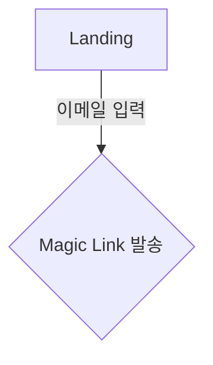

# 강한 모델에 하네스를 얼마나 붙여야 하는가 — 재보니 질문이 틀렸다

> Opus 4.8 / Opus 5 · 하네스 유·무 2×2 · 원 데이터 `runs/` 전부 공개
> 측정 범위: **PRD 생성**과 **리뷰** 두 경로. `/implement`·화면정의서 출력 품질은 측정하지 않았다(§6).

---

## 기 — 왜 쟀나

Opus 5가 나왔고, 우리 팀은 이렇게 생각했다.

> **모델이 강해질수록 과한 하네스는 방해가 된다. 걷어내자.**

그럴듯했고, 실제로 걷어낼 것도 많았다. 그런데 문제가 하나 있었다.

**이 저장소는 프롬프트 감축을 5번 했고, 품질 측정은 0번 했다.**

- 22,948줄 → 5번 자른 결과 22,748줄 (**순감 1%**)
- 그중 한 번은 감축이 아니라 **복원**이었는데 아무도 몰랐다
- 감축의 검증은 매번 *"로직을 지웠는가"* 였고, *"출력이 좋아졌는가"* 를 물은 적이 없다

믿음으로 또 자르면 7번째가 온다. 그래서 **자르기 전에 쟀다.**

### 하네스를 네 종류로 나눴다

"하네스"는 한 덩어리가 아니다. 종류마다 값어치가 다를 것이라고 보고 넷으로 갈랐다.

| 분류 | 정의 | 실물 |
|---|---|---|
| **A. 산출물 계약** | 결과물에 무엇이 들어가야 하는지 | PRD 골격, 화면정의서 5종 |
| **B. 기계적 강제** | 모델 자기보고를 안 믿는 것 | commit hook, exit code, CI |
| **C. 역할·적대적 렌즈** | 관점을 쪼개 강제 | 4렌즈 다양성 계약 |
| **D. 능력 보정·절차 지시** | 모델이 알아서 할 일을 산문으로 | 100점 루브릭, "먼저 A 다음 B" |

가설: **모델이 좋아지면 D가 먼저 죽는다.**

---

## 승 — 무엇을 어떻게 걷어냈나

### 판단 기준은 문장마다 하나였다

> ### "이건 모델이 이미 아는 건가, 우리가 정한 건가?"

| 실제 문장 | 판정 |
|---|---|
| "Next.js는 `app/`, NestJS는 `src/modules/`" | 삭제 — 모델이 안다 |
| "도메인 1-2개면 모놀리식, 5개+면 MSA" | 삭제 — 일반 지식 |
| "5축 100점으로 채점하라" | 삭제 — **게이트가 쓰지도 않았다** |
| "Context First — 코드 쓰기 전에 기존 코드를 읽어라" | 삭제 — 이미 그렇게 한다 |
| "§5.4.1 State Matrix가 없으면 Critical" | **보존** — 우리 규칙 |
| "Linear 상태는 이름이 아니라 `type`으로 매칭" | **보존** — 외부 사실 |

### 결과

| 파일 | 전 | 후 |
|---|---|---|
| `commands/prd.md` | 532줄 / 21,020자 | **72줄 / 3,262자** |
| `commands/implement.md` | 797줄 / 41,537자 | **318줄 / 20,368자** |
| `commands/screen-spec.md` + SKILL | 552줄 | **186줄** |
| `agents/code-reviewer.md` | 157줄 | **56줄** |
| `contracts/PRD-CONTRACT.md` | — | **+119줄 (신규 정본)** |
| 지시문 합계 | 5,172줄 | **4,147줄 (−20%)** |

커맨드 파일은 호출 시 **전체가 컨텍스트에 들어간다.** `/prd`와 `/implement` 합계
62,557자 → 28,881자, **호출당 −54%**.

### 증거물 ① — "커맨드에 박혀 있었다"가 무슨 뜻인가

`commands/prd.md`는 "무엇을 하라"는 지시만 담은 게 아니라, **PRD 결과물의 마크다운 원본을
통째로 품고** 있었다.

```markdown
### Phase 2: PRD Generation
다음 템플릿을 사용하여 PRD를 작성합니다:

```markdown              ← 여기서부터 240줄이 "결과물 예시"
# [Feature Name] PRD
## 1. Overview
...
### 5.4.1 Page State Matrix
| Route | loading | empty | error | success | no-permission | 비고 |
| `/submit` | ✓ | - | ✓ | ✓ | ✓ | 도메인 화이트리스트 외 → no-permission |
### 5.5 User Flow

```                       ← 여기까지
```

저 예시는 **전혀 다른 프로젝트**(Magic Link 로그인, 도메인 화이트리스트) 것이다.
휴가관리 PRD를 쓸 때도 저게 매번 같이 읽혔다.

### 증거물 ② — 게이트가 쓰지도 않는 점수

`code-reviewer`는 5축 100점 채점 체계를 갖고 있었다. 그런데 커밋 차단은 findings 롤업으로 정한다:

```
FAIL ← critical ≥1 / WARN ← critical 0 AND (major ≥1 OR minor ≥5) / PASS ← 그 외
```

**100점은 아무 결정도 하지 않는 숫자였다.** 문서 자신도 알고 있어서
`> 게이트가 아니라 리포트용이다. 이 숫자로 커밋을 막거나 통과시키지 않는다.` 라는
방어 문구까지 달려 있었다.

*결정하지 않는 숫자를 유지하려고 방어 문구를 다는 상태* 가 곧 지울 때가 됐다는 신호다.

### 계약을 단일 정본으로

PRD 골격은 삭제 대상이 아니었다(A분류). 문제는 **같은 기준이 생성 쪽과 검증 쪽에 각자
사본으로** 있었다는 것이다. 어긋나도 아무도 모른다.

→ `contracts/PRD-CONTRACT.md` 하나를 정본으로 만들고, `/prd`(생성)와 `prd-reviewer`(검증)가
**같은 파일을 읽게** 했다. 재진술하면 CI가 빨간불이 된다.

---

## 전 — 측정했더니 가설이 반증됐다

### 실험 설계

같은 결함을 심은 픽스처를 **Opus 4.8과 Opus 5에, 하네스 유/무로** 리뷰시켰다.
매칭 규칙은 `labels.json`에 **결과보다 먼저 고정**돼 있다.

보는 것은 칸의 값이 아니라 **차이의 차이**다. `A1(5) − A0(4.8)` 같은 대각선 비교는
모델과 하네스가 동시에 바뀌므로 하네스 효과라고 부르지 않는다.

### 결과 ① — 코드 결함: 4셀 전부 100%

| | 4.8 없음 | 4.8 있음 | 5 없음 | 5 있음 |
|---|---|---|---|---|
| 코드 결함 6종 (SQLi·하드코딩 시크릿·N+1·인가 누락·널 크래시·위조 가능 서명) | 100% | 100% | 100% | 100% |

**천장이다.** 그리고 중요한 건 — Opus 5에서 천장이 된 게 아니라 **4.8에서도 이미 천장**이었다.

### 결과 ② — PRD 결함: 성격에 따라 갈렸다

| 결함 | 성격 | 4.8 없음 | 5 없음 | 하네스 있음 |
|---|---|---|---|---|
| FR 간 논리 모순 | 보편 | 3/3 | 3/3 | 3/3 |
| 관리자 삭제 인가 미정의 | 보편 | 3/3 | 3/3 | 3/3 |
| 성능 목표가 정성적 | 보편 | 3/3 | 3/3 | 3/3 |
| **§5.4.1 State Matrix 없음** | **우리 관습** | **0/3** | **0/3** | **3/3** |
| **§5.5 User Flow 없음** | **우리 관습** | **0/3** | **0/3** | **3/3** |

두 세대에서 **같은 값으로** 나왔다. 원문을 직접 확인했다 — 하네스 없는 arm은
"상태 정의"라는 말 자체를 쓰지 않는다(채점기 매칭어를 넓게 잡았는데도 0).

### 그래서 가설이 반증됐다

우리는 *"모델이 강해지면 D가 죽는다"* 고 예측했다. 실제로는:

> **D는 Opus 5에서 죽은 게 아니라, 4.8에서도 이미 죽어 있었다.**
> 감가상각이 아니라 **애초에 값을 안 했다.**

그리고 A(계약)는 두 세대 모두 그대로 값을 한다. 우리 팀 규칙이 학습 데이터에 있을 리 없다.
**이건 능력 문제가 아니라 정보 문제**라서 세대가 올라가도 해결되지 않는다.

### 결과 ③ — 생성 쪽에서도 같은 패턴

| | 하네스 없음 | 하네스 있음 |
|---|---|---|
| PRD 계약 준수율 (10항목) | **40%** | **100%** |
| Pages 표 / State Matrix / 수용 기준 / 인가 명세 | **0/9** | 채워짐 |

*(Opus 4.8 기준. A0 n=9 / A1 n=8. Opus 5 셀은 실행 중 — §6)*

맨 모델이 쓴 PRD가 나쁜 게 아니다. **우리가 필요한 게 없다.** 시키지 않으면 안 쓴다.

### 대가도 같이 적는다

플러그인을 켜면 PRD 생성이 **78초 → 457초, 5.9배** 느려진다.
품질만 쓰고 비용을 빼면 절반만 말하는 것이다.

---

## 그런데 결과보다 값진 건 사고였다

실험을 돌리다 **네 가지 계측 결함**을 잡았다. 넷 다 결과를 뒤집을 수 있었다.

| # | 결함 | 증상 |
|---|---|---|
| E-01 | 러너는 `PRD.md` 저장, 채점기는 `prd.*.md` 탐색 | **아무것도 채점되지 않았다** |
| E-02 | 산출물 없으면 `stdout.log`를 PRD로 복사 | 실패와 성공이 같은 파일로 섞였다 |
| P-6 | CLI 설정의 플러그인 비활성화가 **교체가 아니라 병합** | **"플러그인 없음" 대조군에 플러그인이 켜져 있었다** |
| E-05 | 그 비활성화 목록이 로컬 사본까지 껐다 | **"플러그인 있음" 처치군에 플러그인이 없었다** |

P-6와 E-05는 짝이다. **대조군은 오염됐고, 처치군은 처치를 못 받았다.**
그리고 **코드만 보면 양쪽 다 완벽하게 격리된 것처럼 보인다.**

증거: 오염된 대조군이 낸 PRD에는 `Scale Grade`, `Has FE Components`, `§5.4.1`,
`Role Key` 가 그대로 들어 있었다 — 전부 우리 플러그인 골격이다.
격리를 고친 뒤 다시 돌리자 **오염 마커 0건**, 섹션 구조도 완전히 달라졌다.

여기서 규칙이 나왔다.

> ### 대조군은 오염을 검사하고, 처치군은 처치를 검사한다.

지금은 실행 전에 스킬 목록을 조회해 플러그인이 안 보이면 **실험을 아예 시작하지 않는다.**

**부수 교훈**: 오염 마커는 실험마다 다시 골라야 한다. 리뷰 실험에서 `Scale Grade`를
마커로 쓰면 **리뷰 대상 문서에 원래 그 단어가 있어서** 검사가 항상 빨간불이 된다.
그러면 사람이 검사를 꺼버린다.

---

## 결 — 그래서 무엇이 남았나

### 세 층만 남았다. 각각 다른 실패를 막는다

| 층 | 막는 실패 | 세대가 올라가면 |
|---|---|---|
| **계약 — "이걸 내놔라"** | 좋은 문서인데 우리가 필요한 게 없다 | **안 바뀐다.** 우리 규칙을 모델이 알 방법이 없다 |
| **강제 — "네 말을 안 믿는다"** | 모델이 자기가 검증했다고 말한다 | **더 중요해진다.** 능력과 무관하다 |
| **판정 규칙 — 결정론** | 같은 코드가 실행마다 다른 판정 | 안 바뀐다 |
| ~~능력 보정 — "이렇게 찾아라"~~ | — | **두 세대 모두 무익했다** |

### 감축이 드러낸 것

산문을 걷어내니 **원래 없던 것**이 보였다.

- 플래그 하나가 문서에 정의만 있고 동작 지시가 없었다. **죽은 플래그.**
- `/screen-spec`이 산출물 5종을 만드는데, `/implement`가 그걸 읽는 지시가 어디에도 없었다.
  **만들고 아무도 안 읽고 있었다.**

> **산문이 많으면 "연결돼 있다고 쓴 문장"과 "실제로 연결하는 문장"이 구분되지 않는다.**

### 검증 (모델 호출 0, 재현 가능)

```
test_gate.sh        36 통과 / 0 실패    우회 5종 전부 차단
check_contracts.py  127 검사 / 위반 0   계약 정본·소비자 참조·에이전트 개수
```

---

## §6. 이 리포트가 답하지 못하는 것

| 질문 | 상태 |
|---|---|
| "모델이 강해질수록 하네스 효과가 줄어드는가?" | **미확정.** `Opus 5 × 하네스 있음` 셀이 실행 중. 리뷰 경로에서는 두 세대가 같았다 |
| "하네스가 오탐(헛것)을 만드는가?" | **측정 불가.** 오탐 대조군으로 쓴 "깨끗한 PRD"가 **우리 계약을 만족하지 않았다** — 계약 검사기의 오탐을 계약 위반 문서로 잴 수 없다 |
| "`/implement`·화면정의서 감축이 출력을 나쁘게 했나?" | **미측정.** 구조·강제만 검증됐다 |
| "감축해서 빨라졌나?" | **못 잰다.** 감축 전 지연을 재두지 않았다. 다음엔 **감축 전에 먼저 잰다** |
| "5.9배 느린 게 값을 하는가?" | 이득도 비용도 측정됐지만 **교환비 판단은 각자의 몫** |

### 반박 가능한 지점 (미리 적는다)

1. **n이 작다.** 결함 검출 n=3, 생성 n=8~9. `0/3 → 3/3` 급 변화만 신호로 읽었다.
2. **조건당 픽스처가 적다.** 도메인이 바뀌면 결과가 바뀔 수 있다.
3. **키워드 매칭 채점.** "다른 말로 정확히 지적한" 경우를 놓칠 수 있다.
   다만 **모든 arm에 같은 채점기**를 썼으므로 arm 간 비교는 유효하다.
4. **모델 2종, 시점 1회.** 다음 세대에서 뒤집힐 수 있다.

---

## 재현

```bash
bash .github/scripts/test_gate.sh
python3 .github/scripts/check_contracts.py
bash .github/evals/model-generation-2x2/run.sh    # 처치 검증 가드 내장
bash .github/evals/component-2x2/run.sh

# 결과를 믿기 전에 반드시
grep -lE 'wigtn|4렌즈|다양성 계약' .github/evals/component-2x2/runs/*A0/*.txt  # 비어야 정상
grep -lE 'wigtn|4렌즈|다양성 계약' .github/evals/component-2x2/runs/*A1/*.txt  # 나와야 정상
```

**원 데이터를 전부 커밋한다** — 우리 가설에 불리한 것도, 폐기한 실행도 포함해서.
