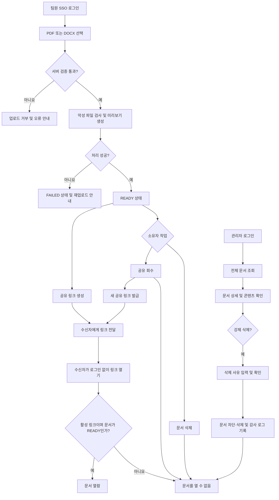

# 사내 문서 링크 공유 서비스 v1 PRD

## 1. 문서 개요

| 항목 | 내용 |
|---|---|
| 제품명 | 사내 문서 링크 공유 서비스 |
| 버전 | v1 |
| 상태 | 구현 준비 |
| 대상 | 사내 팀원, 문서 관리자, 사내외 링크 수신자 |
| 핵심 가치 | 사내 문서를 업로드하고 로그인 없는 링크로 안전하게 공유하며, 소유자와 관리자가 접근을 통제한다 |

## 2. 배경과 문제

사내 팀원은 PDF 또는 DOCX 문서를 외부 협력자와 빠르게 공유해야 하지만, 수신자 계정 생성이나 별도의 파일 전달 절차는 공유 속도를 떨어뜨린다. 반면 공개 링크는 잘못 전달되거나 부적절한 콘텐츠가 게시될 위험이 있어 소유자의 공유 회수, 문서 삭제, 관리자의 전체 조회 및 강제 삭제 기능이 필요하다.

v1은 문서 업로드, 링크 기반 열람, 접근 회수 및 관리 기능에 집중한다. 문서 편집이나 협업 기능은 제공하지 않는다.

## 3. 목표

- 사내 팀원이 PDF 또는 DOCX 문서를 업로드할 수 있다.
- 준비가 완료된 문서마다 하나의 활성 공유 링크를 발급할 수 있다.
- 링크 수신자가 로그인 없이 브라우저에서 문서를 열람할 수 있다.
- 문서 소유자가 공유 링크를 회수하고 새 링크를 발급할 수 있다.
- 문서 소유자가 자신의 문서를 삭제할 수 있다.
- 관리자가 모든 문서의 메타데이터와 열람 가능한 콘텐츠를 확인할 수 있다.
- 관리자가 부적절한 문서를 사유와 함께 강제 삭제할 수 있다.
- 모든 권한 및 삭제 작업을 서버에서 검증하고 주요 변경 작업을 감사 로그로 남긴다.

## 4. 성공 지표

출시 후 30일 기준으로 다음을 측정한다.

| ID | 지표 | 목표 |
|---|---|---|
| KPI-101 | 정상 형식 문서의 업로드 후 `READY` 전환율 | 98% 이상 |
| KPI-102 | 20MB 이하 문서의 업로드 시작부터 링크 생성 가능 상태까지 걸린 중앙값 | 2분 이하 |
| KPI-103 | 활성 공유 링크 열람 성공률 | 99% 이상 |
| KPI-104 | 권한 없는 문서 조회 또는 삭제 성공 건수 | 0건 |
| KPI-105 | 공유 회수 후 기존 링크가 차단되기까지 걸리는 시간 | 60초 이하 |

## 5. 범위

### 5.1 v1 포함 범위

- 사내 SSO 로그인
- PDF 및 DOCX 단일 파일 업로드
- 파일 형식, 크기, 암호화 여부 및 악성 파일 검증
- DOCX의 브라우저 열람용 미리보기 변환
- 문서 처리 상태 확인
- 소유자 문서 목록 및 상세 조회
- 로그인 없는 공유 링크 생성 및 복사
- 공유 링크 회수 및 재발급
- 브라우저 기반 문서 열람
- 소유자 문서 삭제
- 관리자 전체 문서 목록, 검색, 필터 및 상세 조회
- 관리자 강제 삭제
- 감사 로그, 운영 메트릭 및 오류 모니터링

### 5.2 비목표

- 공동 편집, 실시간 협업, 댓글, 주석, 승인 워크플로
- 문서 버전 관리 또는 기존 문서 파일 교체
- 폴더, 태그, 즐겨찾기 및 팀 단위 문서함
- 공유 링크 비밀번호 또는 만료일 설정
- 수신자별 권한 및 열람자 초대
- 원본 파일 다운로드 버튼
- 워터마크, DRM, 화면 캡처 및 복제 방지
- 문서 소유권 이전
- 여러 파일의 일괄 업로드
- 이메일, 메신저 또는 외부 서비스로 직접 전송
- 공개 검색 또는 문서 목록 노출
- 삭제 문서 복원
- 모바일 네이티브 애플리케이션

## 6. 가정 및 확정 정책

- 서비스는 하나의 회사 테넌트를 대상으로 한다.
- 회사 SSO와 관리자 그룹 또는 역할 정보가 제공된다.
- 관리자는 팀원 권한을 함께 가지며 자신이 업로드한 문서에는 소유자 권한을 행사할 수 있다.
- 공유 링크는 만료되지 않으며 소유자가 회수하거나 문서가 삭제될 때까지 유효하다.
- 문서 하나에는 동시에 하나의 활성 공유 링크만 존재한다.
- 회수한 링크는 다시 활성화하지 않는다. 재공유 시 새로운 토큰을 발급한다.
- 링크를 가진 사람은 누구나 문서를 열람할 수 있으므로 공유 화면에 이를 명확히 경고한다.
- v1의 “열람 전용”은 편집 및 공식 다운로드 기능을 제공하지 않는다는 의미다. 스크린 캡처, 브라우저 기능 또는 네트워크 도구를 통한 복제를 완전히 방지하지는 않는다.
- PDF는 원본을 기준으로 렌더링한다. DOCX는 서버에서 안전한 열람용 결과물로 변환하므로 설치 글꼴이나 복잡한 레이아웃에 따라 원본과 차이가 날 수 있다.
- 비밀번호로 보호되거나 암호화된 문서는 안전한 검사와 변환이 불가능하므로 업로드를 거부한다.
- 최대 파일 크기는 파일당 50MB다.
- 같은 파일을 여러 번 업로드하면 각각 별도의 문서로 생성한다.
- 삭제는 복구할 수 없다. 사용자에게 보이는 접근은 즉시 차단하고 실제 저장 데이터는 비동기로 제거한다.
- 관리자 강제 삭제에 대한 소유자 이메일 알림은 v1 범위에서 제외한다.
- 초기 용량 기준은 활성 문서 10,000개, 일일 업로드 500개, 동시 익명 열람 100명이다.

## 7. 사용자 역할

| 역할 | 허용 작업 | 금지 작업 |
|---|---|---|
| 링크 수신자 | 활성 공유 링크로 `READY` 문서 열람 | 문서 목록 조회, 편집, 공유 설정 변경, 원본 다운로드 기능 이용 |
| 팀원 | 로그인, 문서 업로드, 자기 문서 조회, 공유 링크 생성·회수·재발급, 자기 문서 삭제 | 다른 소유자의 문서 조회·삭제, 관리자 화면 접근 |
| 관리자 | 팀원 기능, 전체 문서 및 상태 조회, `READY` 문서 열람, 강제 삭제 | 다른 소유자를 대신한 공유 링크 생성·회수, 문서 복원, 감사 로그 변조 |
| 시스템 작업자 | 악성 파일 검사, 미리보기 변환, 비동기 삭제 | 사용자 권한으로 문서 공유 또는 열람 |

## 8. 핵심 사용자 시나리오

### 8.1 문서 업로드 및 공유

1. 팀원이 SSO로 로그인한다.
2. PDF 또는 DOCX 파일을 선택한다.
3. 시스템이 형식, 크기, 암호화 여부 및 악성 파일을 검사한다.
4. 시스템이 브라우저 열람용 결과물을 준비한다.
5. 문서 상태가 `READY`가 되면 소유자가 공유 링크를 생성한다.
6. 소유자가 링크를 사내외 수신자에게 전달한다.
7. 수신자는 로그인 없이 문서를 열람한다.

### 8.2 공유 회수 및 재발급

1. 소유자가 문서 상세 화면에서 공유를 회수한다.
2. 기존 링크는 60초 이내에 사용할 수 없게 된다.
3. 필요하면 소유자가 새 링크를 생성한다.
4. 새 링크는 열람 가능하고 기존 링크는 계속 차단된다.

### 8.3 문서 삭제

1. 소유자가 삭제 경고를 확인하고 자기 문서를 삭제한다.
2. 문서 상세, 미리보기 및 공유 링크 접근이 즉시 차단된다.
3. 시스템이 저장된 원본과 미리보기 파일을 비동기로 제거한다.

### 8.4 관리자 강제 삭제

1. 관리자가 전체 문서 목록을 검색하거나 필터링한다.
2. 관리자가 대상 문서의 메타데이터와 콘텐츠를 확인한다.
3. 관리자가 삭제 사유를 입력하고 강제 삭제를 확인한다.
4. 문서와 공유 링크가 즉시 차단된다.
5. 작업자, 대상 문서, 삭제 사유와 시간이 감사 로그에 기록된다.

## 9. 사용자 흐름



## 10. 문서 및 공유 상태 모델

### 10.1 문서 상태

```text
PROCESSING → READY
PROCESSING → FAILED
PROCESSING | READY | FAILED → DELETING → DELETED
```

| 상태 | 의미 | 허용 작업 |
|---|---|---|
| `PROCESSING` | 검증, 악성 파일 검사 또는 변환 진행 중 | 상태 조회, 소유자·관리자 삭제 |
| `READY` | 열람 준비 완료 | 상세 열람, 링크 생성, 공유 열람, 삭제 |
| `FAILED` | 검증 또는 처리 실패 | 오류 확인, 재업로드, 삭제 |
| `DELETING` | 접근 차단 후 물리 삭제 진행 중 | 관리자 상태 조회만 가능 |
| `DELETED` | 콘텐츠 삭제 완료, 감사용 최소 메타데이터만 유지 | 관리자 감사 조회만 가능 |

### 10.2 공유 상태

```text
NONE → ACTIVE → REVOKED
REVOKED → ACTIVE_NEW_TOKEN
```

| 상태 | 의미 |
|---|---|
| `NONE` | 공유 링크가 생성되지 않음 |
| `ACTIVE` | 현재 공유 링크로 열람 가능 |
| `REVOKED` | 기존 링크가 영구적으로 차단됨 |

문서가 `DELETING` 또는 `DELETED`가 되면 공유 상태와 관계없이 열람할 수 없다.

## 11. 기능 요구사항

| ID | 요구사항 | 우선순위 |
|---|---|---|
| FR-101 | 시스템은 회사 SSO로 인증된 사용자만 팀원 및 관리자 화면에 접근시켜야 한다. | P0 |
| FR-102 | 시스템은 인증 정보의 관리자 역할을 기준으로 관리자 화면과 API 접근을 서버에서 허용해야 한다. | P0 |
| FR-103 | 팀원은 한 번에 하나의 PDF 또는 DOCX 파일을 업로드할 수 있어야 한다. | P0 |
| FR-104 | 서버는 파일 확장자가 아닌 실제 형식, MIME, 최대 50MB 크기, 암호화 여부 및 악성 파일 여부를 검증해야 한다. | P0 |
| FR-105 | 시스템은 검증을 통과한 PDF와 DOCX를 안전한 브라우저 열람용 결과물로 처리해야 한다. | P0 |
| FR-106 | 소유자는 문서의 `PROCESSING`, `READY`, `FAILED` 상태와 실패 시 사용자 대응 방법을 확인할 수 있어야 한다. | P0 |
| FR-107 | 소유자는 자신의 문서를 최신 업로드순으로 페이지 단위 조회할 수 있어야 한다. | P0 |
| FR-108 | 소유자는 자기 문서의 파일명, 형식, 크기, 생성 시각, 처리 상태 및 공유 상태를 조회할 수 있어야 한다. | P0 |
| FR-109 | 소유자는 `READY` 문서에 활성 링크가 없을 때 최소 128비트 엔트로피의 공유 링크를 생성하고 복사할 수 있어야 한다. | P0 |
| FR-110 | 수신자는 유효한 활성 링크를 통해 로그인 없이 `READY` 문서를 브라우저에서 열람할 수 있어야 한다. | P0 |
| FR-111 | 소유자는 활성 공유 링크를 회수할 수 있어야 하며 기존 링크는 60초 이내에 차단되어야 한다. | P0 |
| FR-112 | 소유자는 회수 후 새로운 공유 링크를 생성할 수 있어야 하며 회수한 링크는 다시 유효해지면 안 된다. | P0 |
| FR-113 | 소유자는 확인 절차를 거쳐 자기 문서를 삭제할 수 있어야 한다. | P0 |
| FR-114 | 관리자는 모든 문서를 최신순으로 페이지 조회하고 파일명, 소유자, 상태, 형식, 생성 기간 및 공유 상태로 검색·필터링할 수 있어야 한다. | P0 |
| FR-115 | 관리자는 삭제되지 않은 모든 문서의 메타데이터를 조회하고 `READY` 문서 콘텐츠를 관리자 전용 경로에서 열람할 수 있어야 한다. | P0 |
| FR-116 | 관리자는 10~500자의 삭제 사유를 입력하고 확인한 후 문서를 강제 삭제할 수 있어야 한다. | P0 |
| FR-117 | 서버는 모든 문서 조회, 공유, 회수 및 삭제 요청에서 소유권과 역할을 검증해야 한다. | P0 |
| FR-118 | 공유 토큰 원문은 애플리케이션·프록시·분석 로그에 기록되지 않아야 하며 저장 시 암호화 또는 단방향 조회 다이제스트로 보호되어야 한다. | P0 |
| FR-119 | 삭제 요청 즉시 문서와 공유 링크 접근을 차단하고 원본 및 미리보기 콘텐츠를 24시간 이내에 활성 저장소에서 제거해야 한다. | P0 |
| FR-120 | 업로드, 처리 결과, 링크 생성·회수, 소유자 삭제 및 관리자 강제 삭제를 변경 불가능한 감사 로그에 기록해야 한다. | P0 |
| FR-121 | 유효하지 않거나 회수·삭제된 공유 링크는 문서 존재 여부와 상태를 노출하지 않는 동일한 오류 화면과 HTTP 404 응답을 반환해야 한다. | P0 |
| FR-122 | 시스템은 업로드, 처리, 공유 열람, 회수 및 삭제 결과를 원시 공유 토큰 없이 운영 메트릭으로 기록해야 한다. | P0 |

## 12. 파일 처리 정책

- 허용 확장자: `.pdf`, `.docx`
- 최대 크기: 50MB
- `.doc`, `.docm`, 이미지, 압축 파일 및 기타 형식은 거부한다.
- 확장자, 선언 MIME, 실제 파일 시그니처가 일치하지 않으면 거부한다.
- ZIP 기반 DOCX의 비정상 압축률과 중첩 구조를 검사해 압축 폭탄을 차단한다.
- 비밀번호 보호 또는 암호화 파일은 거부한다.
- 악성 파일 검사를 통과하기 전에는 변환하거나 사용자에게 제공하지 않는다.
- DOCX 변환은 외부 네트워크와 분리된 제한 실행 환경에서 수행한다.
- PDF의 스크립트, 자동 실행 동작, 첨부 실행 파일 및 외부 콘텐츠 호출을 비활성화한다.
- 처리 중 일시적 인프라 오류는 최대 2회 자동 재시도한다.
- 재시도 후에도 실패하면 `FAILED`로 전환하고 원본을 24시간 이내 제거한다.
- 악성 파일로 판단된 콘텐츠는 사용자에게 제공하지 않고 즉시 격리 또는 삭제한다. 사용자 화면에는 상세 탐지 규칙 대신 “보안 검사에 실패했습니다”라고 표시한다.

## 13. 페이지 정의

| 페이지 | 경로 | 접근 역할 | 주요 기능 | FE 구성요소 |
|---|---|---|---|---|
| 로그인 진입 | `/login` | 비로그인 사용자 | 회사 SSO 시작 | 신규 개발 |
| 내 문서 | `/documents` | 팀원, 관리자 | 자기 문서 목록, 상태 확인, 업로드 이동 | 신규 개발 |
| 문서 업로드 | `/documents/new` | 팀원, 관리자 | 파일 선택, 검증 안내, 업로드 진행률 | 신규 개발 |
| 내 문서 상세 | `/documents/:documentId` | 소유자 | 메타데이터, 미리보기, 공유 생성·회수, 삭제 | 신규 개발 |
| 공유 문서 열람 | `/s/:token` | 모든 사용자 | 로그인 없는 문서 열람 | 신규 개발 |
| 관리자 문서 목록 | `/admin/documents` | 관리자 | 전체 문서 검색, 필터, 페이지 조회 | 신규 개발 |
| 관리자 문서 상세 | `/admin/documents/:documentId` | 관리자 | 메타데이터, 콘텐츠 검토, 강제 삭제 | 신규 개발 |
| 접근 거부 | `/403` | 인증 사용자 | 역할 부족 안내 및 안전한 이동 | 신규 개발 |

### 13.1 주요 FE 구성요소

- `FileDropzone`
- `UploadProgress`
- `DocumentTable`
- `DocumentStatusBadge`
- `ShareStatusBadge`
- `DocumentViewer`
- `ShareLinkPanel`
- `CopyLinkButton`
- `ConfirmationDialog`
- `ErrorNotice`
- `AdminDocumentFilters`
- `AdminDeleteDialog`

## 14. 화면 상태 매트릭스

| 페이지 | Empty | Loading | Success | Error·제한 |
|---|---|---|---|---|
| `/documents` | “업로드한 문서가 없습니다”와 업로드 CTA | 목록 스켈레톤 | 문서, 처리 상태, 공유 상태 및 페이지 이동 표시 | 재시도 버튼과 목록 조회 오류 표시 |
| `/documents/new` | 파일 선택 영역과 형식·크기 안내 | 진행률 표시, 중복 제출 방지 | 생성된 문서 상세로 이동 | 형식·크기·보안·네트워크 오류별 안내 |
| `/documents/:documentId` | 해당 없음 | 메타데이터 및 뷰어 스켈레톤 | 상태별 상세, 미리보기, 공유 및 삭제 작업 표시 | 비소유자·없는 문서는 동일한 404, 처리 실패 시 재업로드 안내 |
| `/s/:token` | 해당 없음 | 토큰 검증 및 뷰어 로딩 표시 | 로그인 없이 문서 콘텐츠 표시 | 무효·회수·삭제 링크는 동일한 “문서를 열 수 없습니다” 화면 |
| `/admin/documents` | “조건에 맞는 문서가 없습니다”와 필터 초기화 | 목록 스켈레톤 | 전체 문서 목록과 필터·페이지 이동 표시 | 조회 재시도 또는 비관리자 403 |
| `/admin/documents/:documentId` | 해당 없음 | 메타데이터 및 뷰어 스켈레톤 | 상태별 메타데이터, 가능한 경우 콘텐츠, 강제 삭제 표시 | 없는 문서 404, 비관리자 403, 삭제된 콘텐츠는 열람 불가 |
| `/403` | 해당 없음 | 해당 없음 | 권한 부족 안내 | 내 문서로 이동 제공 |

## 15. 주요 UX 정책

- 업로드 전 허용 형식과 50MB 제한을 표시한다.
- 클라이언트 검증은 즉각적인 안내용이며 최종 판단은 서버에서 수행한다.
- 업로드 후 처리 중에는 페이지를 벗어나도 서버 처리가 계속된다.
- `PROCESSING` 문서는 공유 버튼을 비활성화하고 사유를 표시한다.
- `FAILED` 문서에는 안전한 오류 메시지와 새 파일 업로드 동선을 제공한다.
- 공유 링크 생성 전에 “링크를 가진 누구나 로그인 없이 열람할 수 있음”을 안내한다.
- 링크 복사 성공 여부를 시각적 메시지와 스크린 리더 알림으로 제공한다.
- 활성 링크가 이미 있으면 새 링크를 중복 생성하지 않고 기존 활성 링크를 반환한다.
- 공유 회수 시 기존 수신자의 접근이 차단된다는 확인 문구를 표시한다.
- 재발급 시 기존 링크가 복구되지 않는다는 내용을 표시한다.
- 소유자 삭제 및 관리자 강제 삭제에는 문서명과 복구 불가 경고를 표시한다.
- 관리자 삭제 확인 버튼은 유효한 삭제 사유가 입력된 뒤 활성화한다.
- 공개 열람 화면에는 업로더의 이메일 등 불필요한 개인정보를 표시하지 않는다.
- 공개 열람 화면에 편집, 댓글 및 원본 다운로드 버튼을 제공하지 않는다.
- 공유 페이지에는 `noindex`, `nofollow` 및 `Referrer-Policy: no-referrer`를 적용한다.

## 16. 권한 및 서버 측 인가 규칙

| 작업 | 수신자 | 팀원 | 소유자 | 관리자 |
|---|---:|---:|---:|---:|
| 활성 링크 문서 열람 | 허용 | 허용 | 허용 | 허용 |
| 문서 업로드 | 불가 | 허용 | 허용 | 허용 |
| 자기 문서 목록 조회 | 불가 | 허용 | 허용 | 허용 |
| 다른 사용자의 문서 상세 조회 | 불가 | 불가 | 불가 | 허용 |
| 공유 링크 생성·회수 | 불가 | 불가 | 자기 문서만 허용 | 자기 문서만 허용 |
| 소유자 삭제 | 불가 | 불가 | 자기 문서만 허용 | 자기 문서만 허용 |
| 관리자 강제 삭제 | 불가 | 불가 | 불가 | 허용 |
| 삭제 문서 복원 | 불가 | 불가 | 불가 | 불가 |

추가 규칙:

- 사용자 식별자는 요청 본문이 아니라 검증된 세션에서 가져온다.
- 문서 ID만으로 접근을 허용하지 않고 매 요청에서 소유권 또는 관리자 역할을 확인한다.
- 비소유자의 소유자 전용 문서 접근은 문서 존재 여부를 숨기기 위해 404로 처리한다.
- 관리자 경로에 접근한 비관리자는 403으로 처리한다.
- 관리자는 소유자를 대신해 공유 상태를 변경할 수 없다.
- 백그라운드 작업자는 문서별 제한 자격 증명으로 필요한 저장 객체에만 접근한다.
- 클라이언트의 버튼 노출 여부는 보조 통제이며 최종 인가는 항상 서버가 수행한다.

## 17. 논리 데이터 모델

### 17.1 User

| 필드 | 설명 |
|---|---|
| `id` | 내부 사용자 식별자 |
| `sso_subject` | SSO 고유 식별자 |
| `email` | 회사 이메일 |
| `display_name` | 표시 이름 |
| `role` | `MEMBER` 또는 `ADMIN` |
| `created_at` | 최초 생성 시각 |
| `last_login_at` | 최근 로그인 시각 |

### 17.2 Document

| 필드 | 설명 |
|---|---|
| `id` | 문서 식별자 |
| `owner_id` | 소유자 User ID |
| `original_filename` | 원본 파일명 |
| `media_type` | PDF 또는 DOCX |
| `size_bytes` | 원본 크기 |
| `status` | 문서 처리 상태 |
| `original_storage_key` | 비공개 원본 저장 위치 |
| `preview_storage_key` | 비공개 미리보기 저장 위치 |
| `failure_code` | 사용자 노출용으로 매핑 가능한 실패 코드 |
| `created_at` | 생성 시각 |
| `ready_at` | 처리 완료 시각 |
| `deleted_at` | 삭제 요청 시각 |
| `deleted_by` | 삭제 수행자 |
| `deletion_type` | `OWNER` 또는 `ADMIN` |
| `deletion_reason` | 관리자 강제 삭제 사유 |

### 17.3 ShareLink

| 필드 | 설명 |
|---|---|
| `id` | 공유 레코드 식별자 |
| `document_id` | 대상 문서 ID |
| `token_lookup_digest` | 토큰 조회용 다이제스트 |
| `encrypted_token` | 소유자에게 기존 활성 링크를 다시 제공하기 위한 암호문 |
| `status` | `ACTIVE` 또는 `REVOKED` |
| `created_by` | 생성한 소유자 |
| `created_at` | 생성 시각 |
| `revoked_at` | 회수 시각 |

`document_id`에 대해 활성 링크가 하나만 존재하도록 조건부 고유 제약을 둔다.

### 17.4 AuditEvent

| 필드 | 설명 |
|---|---|
| `id` | 이벤트 식별자 |
| `event_type` | 업로드, 처리, 링크 생성·회수, 삭제 등 |
| `actor_type` | `USER`, `ADMIN`, `SYSTEM`, `ANONYMOUS` |
| `actor_id` | 식별 가능한 작업자 ID |
| `document_id` | 대상 문서 ID |
| `metadata` | 삭제 사유, 결과 코드 등 허용된 부가 정보 |
| `created_at` | 발생 시각 |

감사 로그에는 원시 공유 토큰과 문서 콘텐츠를 저장하지 않는다.

## 18. API 계약

실제 전송 방식은 인프라에 맞게 직접 업로드 또는 사전 서명 업로드로 구현할 수 있으나, 외부 동작은 다음 계약을 만족해야 한다.

| Method | Endpoint | 권한 | 동작 |
|---|---|---|---|
| `POST` | `/api/v1/documents` | 인증 사용자 | 문서 생성 및 업로드 시작, `202` 반환 |
| `GET` | `/api/v1/documents` | 인증 사용자 | 자기 문서 페이지 조회 |
| `GET` | `/api/v1/documents/:id` | 소유자 | 자기 문서 상세 조회 |
| `DELETE` | `/api/v1/documents/:id` | 소유자 | 자기 문서 접근 차단 및 비동기 삭제 |
| `POST` | `/api/v1/documents/:id/share` | 소유자 | 활성 링크 생성 또는 기존 활성 링크 반환 |
| `DELETE` | `/api/v1/documents/:id/share` | 소유자 | 활성 링크 회수 |
| `GET` | `/api/v1/shares/:token` | 공개 | 토큰 검증 후 공유 문서 메타데이터 반환 |
| `GET` | `/api/v1/shares/:token/content` | 공개 | 유효한 공유 문서 콘텐츠 스트리밍 |
| `GET` | `/api/v1/admin/documents` | 관리자 | 전체 문서 검색·필터·페이지 조회 |
| `GET` | `/api/v1/admin/documents/:id` | 관리자 | 문서 메타데이터 및 검토 정보 조회 |
| `GET` | `/api/v1/admin/documents/:id/content` | 관리자 | 관리자 전용 콘텐츠 열람 |
| `DELETE` | `/api/v1/admin/documents/:id` | 관리자 | 사유 필수 강제 삭제 |

목록 API는 커서 기반 페이지 조회를 사용하며 기본 20개, 최대 100개를 반환한다. 삭제 API는 멱등적으로 동작하고, 접근 차단이 완료되면 콘텐츠 물리 삭제 진행 여부와 관계없이 성공을 반환한다.

### 18.1 표준 오류

| HTTP | 오류 코드 | 조건 |
|---:|---|---|
| 400 | `INVALID_REQUEST` | 필수 값 누락 또는 잘못된 요청 |
| 401 | `AUTHENTICATION_REQUIRED` | 인증 화면·API에서 세션 없음 |
| 403 | `ADMIN_ROLE_REQUIRED` | 비관리자의 관리자 경로 접근 |
| 404 | `DOCUMENT_NOT_FOUND` | 없는 문서 또는 비소유자의 문서 접근 |
| 404 | `SHARE_NOT_AVAILABLE` | 무효·회수·삭제된 공유 링크 |
| 409 | `DOCUMENT_NOT_READY` | `READY`가 아닌 문서의 공유 생성 |
| 413 | `FILE_TOO_LARGE` | 50MB 초과 |
| 415 | `UNSUPPORTED_FILE_TYPE` | PDF·DOCX 이외 형식 |
| 422 | `ENCRYPTED_DOCUMENT` | 암호화 또는 비밀번호 보호 파일 |
| 422 | `SECURITY_SCAN_FAILED` | 악성 파일 또는 안전성 검사 실패 |
| 422 | `DOCUMENT_PROCESSING_FAILED` | 미리보기 처리 실패 |
| 429 | `RATE_LIMITED` | 요청 제한 초과 |
| 500 | `INTERNAL_ERROR` | 복구할 수 없는 서버 오류 |

## 19. 비기능 요구사항

| ID | 영역 | 요구사항 |
|---|---|---|
| NFR-101 | 응답 성능 | 정상 부하에서 목록·상세 API의 p95 응답 시간은 500ms 이하여야 한다. |
| NFR-102 | 열람 성능 | 20Mbps, RTT 50ms 테스트 환경에서 20MB 이하 문서의 공유 화면 셸은 p95 1.5초, 첫 페이지는 p95 3초 이내 표시되어야 한다. |
| NFR-103 | 처리 성능 | 20MB 이하 정상 PDF의 95%, DOCX의 95%를 각각 60초, 120초 안에 `READY`로 전환해야 한다. |
| NFR-104 | 가용성 | 문서 목록과 공유 열람 기능의 월간 가용성은 계획된 점검을 제외하고 99.5% 이상이어야 한다. |
| NFR-105 | 회수·삭제 | 공유 회수 또는 삭제 후 기존 링크와 콘텐츠 접근은 60초 이내 차단되어야 한다. |
| NFR-106 | 보안 | 전송 구간은 TLS 1.2 이상, 저장 데이터는 회사 승인 암호화 방식으로 보호해야 한다. |
| NFR-107 | 토큰 | 공유 토큰은 암호학적으로 안전한 난수 생성기를 사용하고 최소 128비트 엔트로피를 가져야 한다. |
| NFR-108 | 용량 | 활성 문서 10,000개, 일일 업로드 500개, 동시 익명 열람 100명에서 성능 목표를 만족해야 한다. |
| NFR-109 | 접근성 | 핵심 웹 UI는 WCAG 2.1 AA 수준의 키보드 접근, 포커스 표시, 레이블 및 색상 대비를 제공해야 한다. 원본 문서 자체의 접근성은 보장하지 않는다. |
| NFR-110 | 브라우저 | 출시 시점 기준 Chrome, Edge, Safari, Firefox 최신 2개 주요 버전을 지원해야 한다. |
| NFR-111 | 관측성 | 5분간 서버 오류율이 2%를 초과하거나 15분간 처리 실패율이 5%를 초과하면 운영자에게 알림을 보내야 한다. |
| NFR-112 | 복구 | 메타데이터 RPO는 24시간, 서비스 RTO는 8시간 이하여야 한다. |
| NFR-113 | 삭제 | 활성 저장소의 콘텐츠는 삭제 요청 후 24시간 이내 제거하고, 백업 사본은 최대 30일 이내 만료시켜야 한다. |
| NFR-114 | 속도 제한 | 공개 열람은 기본 IP당 분당 120회, 토큰당 분당 600회로 제한하며 정상 공유 트래픽을 고려해 운영 설정으로 조정할 수 있어야 한다. |

## 20. 보안 및 개인정보 보호

- 원본과 미리보기 파일은 공개 객체 저장소에 두지 않는다.
- 공유 콘텐츠 접근 때마다 링크 상태와 문서 상태를 검증한다.
- 콘텐츠용 임시 URL을 사용할 경우 유효 기간은 최대 60초로 제한한다.
- 공유 응답에는 `Cache-Control: private, no-store`를 적용한다.
- 공유 페이지는 제3자 스크립트와 불필요한 외부 리소스를 사용하지 않는다.
- URL 토큰을 분석 이벤트, 오류 메시지, 리퍼러, 서버 로그에 포함하지 않는다.
- 업로드 파일명은 화면 출력 시 이스케이프하고 저장 키로 직접 사용하지 않는다.
- 변환된 DOCX의 외부 링크, 스크립트 및 임베디드 실행 콘텐츠를 제거하거나 비활성화한다.
- 관리자 강제 삭제에는 재인증된 관리자 세션, 삭제 사유 및 확인 절차가 필요하다.
- 익명 열람 운영 로그에는 원시 토큰을 저장하지 않는다.
- 보안 목적의 IP 정보는 최소화하거나 해시 처리하고 30일 이내 삭제한다.
- 감사 로그의 최소 메타데이터는 180일 보관한 뒤 회사 정책에 따라 삭제한다.
- 삭제된 문서의 콘텐츠, 파일명 및 공유 토큰은 감사 로그에 복제하지 않는다.

## 21. 이벤트 및 감사 로그

| 이벤트 | 발생 시점 | 필수 속성 |
|---|---|---|
| `document_upload_started` | 업로드 시작 | 사용자 ID, 문서 ID, 형식, 크기 |
| `document_upload_rejected` | 검증 실패 | 사용자 ID, 문서 ID, 실패 코드 |
| `document_processing_succeeded` | `READY` 전환 | 문서 ID, 처리 시간 |
| `document_processing_failed` | `FAILED` 전환 | 문서 ID, 실패 코드, 재시도 횟수 |
| `share_created` | 공유 링크 생성 | 사용자 ID, 문서 ID, 공유 ID |
| `share_open_succeeded` | 익명 열람 성공 | 문서 ID, 공유 ID |
| `share_open_failed` | 익명 열람 실패 | 실패 유형, 토큰을 식별할 수 없는 집계 키 |
| `share_revoked` | 공유 회수 | 사용자 ID, 문서 ID, 공유 ID |
| `document_deleted_by_owner` | 소유자 삭제 | 사용자 ID, 문서 ID |
| `document_deleted_by_admin` | 관리자 강제 삭제 | 관리자 ID, 문서 ID, 삭제 사유 |
| `content_purged` | 콘텐츠 물리 삭제 완료 | 문서 ID, 삭제 완료 시각 |

소유자 대상 열람 통계 화면은 v1에서 제공하지 않는다. 이벤트는 제품 운영, 보안 감사 및 성공 지표 산출에만 사용한다.

## 22. 수용 기준

| ID | 매핑 | Given / When / Then | 검증 방법 |
|---|---|---|---|
| AC-101 | FR-101, FR-102 | **Given** 로그인하지 않은 사용자가 보호 경로에 접근했을 때, **When** 요청이 처리되면, **Then** SSO 로그인으로 이동하며 비관리자는 관리자 경로에서 403을 받는다. | 통합·E2E 테스트 |
| AC-102 | FR-103, FR-104 | **Given** 인증된 팀원이 50MB 이하 정상 PDF 또는 DOCX를 선택했을 때, **When** 업로드하면, **Then** 문서가 생성되고 `PROCESSING` 상태가 표시된다. | E2E 테스트 |
| AC-103 | FR-104 | **Given** 50MB 초과, 허용되지 않은 형식, 암호화 문서 또는 악성 파일일 때, **When** 업로드하면, **Then** 서버가 해당 오류 코드로 거부하고 콘텐츠를 열람 가능 상태로 만들지 않는다. | 파일 보안 테스트 |
| AC-104 | FR-105, FR-106 | **Given** 검증을 통과한 문서가 있을 때, **When** 처리가 성공 또는 실패하면, **Then** 상태가 각각 `READY` 또는 `FAILED`로 전환되고 소유자에게 대응 가능한 메시지가 표시된다. | 작업자 통합·E2E 테스트 |
| AC-105 | FR-107 | **Given** 여러 사용자가 문서를 업로드했을 때, **When** 일반 팀원이 내 문서 목록을 조회하면, **Then** 자기 문서만 최신순 페이지 목록으로 반환된다. | API 인가 테스트 |
| AC-106 | FR-108, FR-117 | **Given** 문서 소유자와 비소유자가 있을 때, **When** 각각 같은 문서 상세를 요청하면, **Then** 소유자만 메타데이터와 미리보기를 받고 비소유자는 404를 받는다. | API 인가·E2E 테스트 |
| AC-107 | FR-109, FR-118 | **Given** 공유 링크가 없는 `READY` 문서일 때, **When** 소유자가 공유를 생성하면, **Then** 복사 가능한 고엔트로피 링크가 하나 생성되며 원시 토큰은 로그에 남지 않는다. | 통합·로그 검사 |
| AC-108 | FR-110 | **Given** 활성 공유 링크와 `READY` 문서가 있을 때, **When** 비로그인 수신자가 링크를 열면, **Then** 로그인 요구 없이 문서가 표시된다. | E2E 테스트 |
| AC-109 | FR-111, NFR-105 | **Given** 활성 공유 링크가 있을 때, **When** 소유자가 공유를 회수하면, **Then** 해당 링크는 60초 이내 모든 신규 콘텐츠 요청에서 차단된다. | 캐시 포함 통합 테스트 |
| AC-110 | FR-112 | **Given** 회수된 공유 링크가 있을 때, **When** 소유자가 새 링크를 발급하면, **Then** 새 링크만 열람 가능하고 기존 링크는 계속 차단된다. | E2E 테스트 |
| AC-111 | FR-113, FR-119 | **Given** 소유자의 문서가 있을 때, **When** 소유자가 삭제를 확인하면, **Then** 문서와 공유 링크가 즉시 차단되고 콘텐츠는 24시간 이내 활성 저장소에서 제거된다. | E2E·삭제 작업 테스트 |
| AC-112 | FR-114 | **Given** 여러 소유자와 상태의 문서가 있을 때, **When** 관리자가 검색·필터를 적용하면, **Then** 조건에 맞는 전체 문서가 페이지 단위로 반환된다. | API·E2E 테스트 |
| AC-113 | FR-115 | **Given** 다른 사용자가 소유한 `READY` 문서가 있을 때, **When** 관리자가 관리자 상세를 열면, **Then** 메타데이터와 콘텐츠를 확인할 수 있으며 공개 공유 링크는 새로 생성되지 않는다. | 인가·E2E 테스트 |
| AC-114 | FR-116, FR-120 | **Given** 관리자가 문서를 강제 삭제하려 할 때, **When** 10자 미만 사유를 입력하면 삭제할 수 없고, 유효한 사유로 확인하면 문서가 삭제되며 관리자·사유·시간이 감사 로그에 기록된다. | E2E·감사 로그 검사 |
| AC-115 | FR-117 | **Given** 팀원이 타인의 문서 ID를 알고 있을 때, **When** 상세, 공유, 회수 또는 삭제 API를 호출하면, **Then** 모든 요청이 서버에서 거부되고 문서 상태가 변경되지 않는다. | 권한 매트릭스 테스트 |
| AC-116 | FR-121 | **Given** 존재하지 않거나 회수 또는 삭제된 공유 링크일 때, **When** 수신자가 접근하면, **Then** 모든 경우 동일한 404 응답과 동일한 오류 화면이 표시된다. | E2E 테스트 |
| AC-117 | FR-122 | **Given** 주요 사용자 작업이 수행될 때, **When** 운영 이벤트를 확인하면, **Then** 결과와 처리 시간이 기록되지만 원시 공유 토큰과 문서 콘텐츠는 포함되지 않는다. | 이벤트 스키마 검사 |
| AC-118 | NFR-101, NFR-102, NFR-108 | **Given** 기준 용량과 정상 부하일 때, **When** 목록·상세·공유 열람 부하 테스트를 실행하면, **Then** 정의된 p95 응답 및 첫 페이지 표시 목표를 만족한다. | 부하 테스트 |
| AC-119 | NFR-103 | **Given** 대표 정상 문서 테스트 세트가 있을 때, **When** PDF와 DOCX 처리를 반복 측정하면, **Then** 각 형식의 95%가 지정된 시간 안에 `READY`가 된다. | 처리 성능 테스트 |
| AC-120 | NFR-106, NFR-107 | **Given** 배포 후보 시스템일 때, **When** 전송 암호화, 저장 암호화 및 토큰 생성 방식을 검사하면, **Then** TLS와 최소 엔트로피 요구사항을 만족한다. | 보안 구성 검사 |
| AC-121 | NFR-109 | **Given** 핵심 페이지가 구현됐을 때, **When** 키보드 및 자동 접근성 검사를 실행하면, **Then** 주요 작업이 키보드로 가능하고 심각도 높은 WCAG 위반이 없다. | 접근성 테스트 |
| AC-122 | NFR-111, NFR-112 | **Given** 오류율 임계치 초과 또는 복구 훈련 상황일 때, **When** 모니터링과 복구 절차를 실행하면, **Then** 알림이 발생하고 정의된 RPO·RTO 안에 서비스가 복구된다. | 알림·복구 훈련 |

## 23. 위험과 완화 방안

| 위험 | 영향 | 완화 |
|---|---|---|
| 링크 오발송 또는 재전달 | 비인가 외부인이 문서 열람 | 고엔트로피 토큰, 공유 경고, 즉시 회수, 무기한 캐시 금지 |
| 토큰 로그 유출 | 다수 문서에 대한 우회 접근 | 토큰 로그 제거, 리퍼러 차단, 암호화 저장, 정기 로그 검사 |
| 악성 PDF·DOCX 업로드 | 서비스 또는 수신자 환경 침해 | 형식 검증, 악성 파일 검사, 격리 변환, 스크립트 비활성화 |
| DOCX 렌더링 차이 | 공유된 문서 내용 오해 | 변환 완료 후 소유자 미리보기 제공, 실패 상태 명시 |
| 회수 후 캐시 잔존 | 회수된 문서가 계속 노출 | 매 요청 상태 검사, 60초 이하 임시 URL, `no-store` |
| 관리자 권한 오남용 | 정상 문서의 부당 삭제 | 삭제 사유 필수, 확인 절차, 변경 불가능한 감사 로그 |
| 저장소 비용 증가 | 운영 비용 및 처리 지연 | 50MB 제한, 실패 파일·삭제 파일 자동 제거, 용량 모니터링 |
| 삭제와 백업 보존의 차이 | 삭제 후 백업에 콘텐츠 잔존 | 활성 저장소 24시간, 백업 30일 이내 만료 및 접근 차단 |
| 외부 링크의 과도한 요청 | 서비스 장애 또는 비용 증가 | IP·토큰 속도 제한, 이상 트래픽 모니터링 |
| 열람 전용에 대한 과도한 기대 | 수신자의 복제 가능성 오해 | 다운로드 버튼 미제공과 DRM 미보장 사실을 공유 전에 고지 |

## 24. 구현 단계

| 단계 | 범위 | 요구사항 |
|---|---|---|
| 1단계: 기반 및 처리 파이프라인 | SSO, 역할, 저장소, 파일 검증, 악성 파일 검사, 변환, 상태 모델 | FR-101~FR-106, FR-117~FR-118 |
| 2단계: 소유자 기능 | 내 문서 목록·상세, 공유 생성·열람·회수·재발급, 소유자 삭제 | FR-107~FR-113, FR-119, FR-121 |
| 3단계: 관리자 및 운영 | 전체 문서 조회, 관리자 열람, 강제 삭제, 감사 로그, 메트릭 | FR-114~FR-116, FR-120, FR-122 |
| 4단계: 출시 강화 | 성능, 접근성, 브라우저, 보안, 장애 복구 및 부하 검증 | NFR-101~NFR-114 |

모든 P0 요구사항과 관련 수용 기준을 통과해야 v1 출시가 가능하다.

## 25. 테스트 및 출시 게이트

- 파일 형식·크기·암호화·악성 파일 검증 테스트
- PDF 및 DOCX 대표 문서 변환 회귀 테스트
- 소유자·비소유자·관리자·익명 사용자 권한 매트릭스 테스트
- 공유 생성·회수·재발급 및 캐시 무효화 E2E 테스트
- 소유자 삭제와 관리자 강제 삭제의 멱등성 및 동시성 테스트
- 삭제 중 변환 작업이 완료되는 경쟁 조건 테스트
- 원시 토큰의 애플리케이션·프록시·분석 로그 미기록 검사
- XSS, 파일명 인젝션, IDOR, 토큰 추측 및 속도 제한 보안 테스트
- 기준 용량 부하 테스트
- 키보드와 자동화 도구를 이용한 접근성 테스트
- 백업 복구 및 삭제 데이터 만료 검증
- 운영 대시보드와 임계치 알림 검증

출시는 사내 제한 베타에서 업로드·변환·권한·삭제 흐름을 검증한 뒤 외부 공유 기능을 활성화하는 순서로 진행한다.