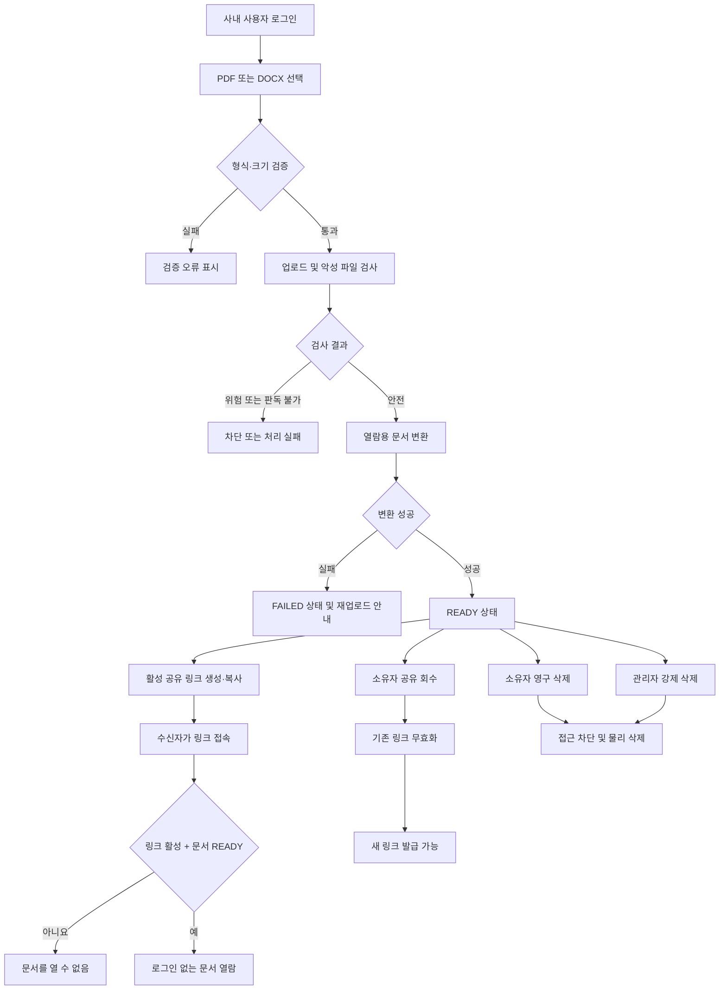

# 사내 문서 공유 서비스 v1 PRD

## 1. 문서 정보

| 항목 | 내용 |
|---|---|
| 제품명 | 사내 문서 공유 서비스 |
| 버전 | v1 |
| 상태 | 구현 준비 |
| 대상 | 사내 팀원, 링크 수신자, 관리자 |
| 핵심 가치 | PDF/DOCX 문서를 업로드하고, 로그인 없는 단일 링크로 안전하게 공유·회수한다 |

## 2. 배경과 문제

사내 팀원은 PDF 또는 DOCX 문서를 외부 협력자나 다른 팀원에게 전달할 때 이메일 첨부, 개인 클라우드, 메신저 파일 전송 등을 사용한다. 이 방식은 다음 문제를 만든다.

- 수신자가 별도 계정을 만들어야 할 수 있다.
- 문서가 전달된 뒤 소유자가 접근을 회수하기 어렵다.
- 여러 사본이 생겨 최신 문서를 식별하기 어렵다.
- 관리자가 공유 중인 문서를 파악하거나 부적절한 문서를 제거하기 어렵다.
- 개인 저장소 사용으로 보안 및 운영 통제가 분산된다.

v1은 문서를 중앙에 업로드하고 하나의 링크로 열람하게 하며, 소유자와 관리자에게 명확한 통제 권한을 제공한다.

## 3. 목표

1. 인증된 사내 팀원이 PDF/DOCX 문서를 업로드할 수 있다.
2. 문서마다 동시에 하나의 활성 공유 링크를 제공한다.
3. 링크 수신자가 로그인 없이 브라우저에서 문서를 열람할 수 있다.
4. 문서 소유자가 공유를 즉시 회수하고 필요하면 새 링크를 발급할 수 있다.
5. 문서 소유자가 자기 문서를 영구 삭제할 수 있다.
6. 관리자가 전체 문서를 조회하고 부적절한 문서를 강제 삭제할 수 있다.
7. 모든 권한 및 삭제 처리를 서버에서 검증하고 주요 관리 행위를 감사할 수 있다.

## 4. 성공 지표

출시 후 첫 30일을 기준으로 측정한다.

| 지표 | 목표 |
|---|---:|
| 유효한 PDF/DOCX 업로드 처리 성공률 | 99% 이상 |
| READY 상태 문서의 유효 링크 열람 성공률 | 99.5% 이상 |
| 공유 회수 후 신규 콘텐츠 요청 차단 시간 | 5초 이내 |
| 삭제 후 신규 콘텐츠 요청 차단 시간 | 5초 이내 |
| 권한 없는 문서 관리 API 접근 허용 건수 | 0건 |
| 관리자 강제 삭제 중 삭제 사유가 없는 건수 | 0건 |

## 5. 범위

### 5.1 포함 범위

- 사내 사용자 인증
- PDF/DOCX 업로드
- 파일 형식, 크기 및 악성 파일 검사
- DOCX의 브라우저 열람용 변환
- 본인 문서 목록 및 상태 조회
- 문서별 단일 활성 공유 링크 생성 및 복사
- 로그인 없는 링크 열람
- 공유 회수 및 새 링크 발급
- 소유자 문서 삭제
- 관리자 전체 문서 조회, 검색, 필터링 및 강제 삭제
- 주요 행위 감사 로그
- 업로드·변환·열람 실패 상태와 재시도 안내

### 5.2 제외 범위

- 공동 편집, 댓글, 주석, 승인 워크플로
- 문서 버전 관리 및 기존 문서 덮어쓰기
- 여러 개의 동시 활성 링크
- 링크별 비밀번호, 만료일, 열람 횟수 제한
- 특정 이메일이나 도메인으로 수신자 제한
- 원본 파일 다운로드 버튼
- 폴더, 태그, 즐겨찾기, 전문 검색
- 자동 콘텐츠 정책 판정
- 워터마크 및 DRM
- 수신자별 열람자 식별
- 이메일·메신저 알림
- 삭제 문서 복구
- 모바일 네이티브 앱

열람 전용은 편집 기능을 제공하지 않는다는 의미다. 브라우저에 표시된 내용을 수신자가 캡처하거나 저장하는 행위까지 기술적으로 방지하지는 않는다.

## 6. 전제와 결정 사항

| ID | 전제 또는 결정 |
|---|---|
| AS-001 | 업로드 사용자와 관리자는 회사의 기존 인증 체계를 통해 로그인한다. 구체적인 SSO 방식은 인증 어댑터 뒤에 둔다. |
| AS-002 | 사내 구성원 여부와 관리자 역할은 신뢰할 수 있는 사내 계정 또는 권한 데이터에서 제공된다. |
| AS-003 | 링크는 소유 권한을 증명하는 bearer credential이다. 링크를 아는 사람은 사내외 어디서든 로그인 없이 열람할 수 있다. |
| AS-004 | 문서 하나에는 최대 하나의 활성 공유 링크만 존재한다. |
| AS-005 | 회수된 링크는 다시 활성화하지 않는다. 재공유 시 새로운 링크를 발급한다. |
| AS-006 | 파일당 최대 크기는 50MB다. 운영 데이터에 따라 변경 가능한 설정값으로 구현한다. |
| AS-007 | 암호화되거나 비밀번호로 보호된 PDF/DOCX는 v1에서 지원하지 않는다. |
| AS-008 | DOCX는 서버 측에서 안전한 열람용 표현으로 변환한다. 변환되지 않은 DOCX 원본을 브라우저에서 직접 실행하거나 렌더링하지 않는다. |
| AS-009 | PDF와 DOCX 원본은 비공개 객체 저장소에 보관하며 공개 URL을 부여하지 않는다. |
| AS-010 | 소유자 삭제와 관리자 강제 삭제는 복구할 수 없는 영구 삭제다. |
| AS-011 | 관리자는 업무상 필요한 경우 모든 활성 문서의 내용까지 열람할 수 있다. 해당 권한은 관리자 역할로 제한하고 감사 로그를 남긴다. |
| AS-012 | 관리자 강제 삭제는 사유 입력을 필수로 한다. 자동 신고·심사 기능은 v1 범위 밖이다. |
| AS-013 | 서비스 UI는 한국어를 기본으로 제공한다. 다국어 지원은 v1 범위 밖이다. |

## 7. 사용자 역할

| 역할 | 허용 작업 | 금지 또는 제한 작업 |
|---|---|---|
| 문서 소유자 | 문서 업로드, 본인 문서 목록·상세·내용 조회, 공유 링크 생성·복사·회수·재발급, 본인 문서 삭제 | 타인 문서 조회·관리, 관리자 기능 사용, 삭제 문서 복구 |
| 일반 사내 사용자 | 로그인, 문서 업로드, 자신이 소유한 문서 관리 | 타인이 소유한 문서의 존재·메타데이터·내용 조회 |
| 링크 수신자 | 유효한 링크로 READY 문서 열람 | 문서 목록 조회, 원본 다운로드, 편집, 공유 설정 변경, 소유자 정보 상세 조회 |
| 관리자 | 전체 문서와 처리 상태 조회, 문서 내용 열람, 소유자·파일명 검색, 상태 필터링, 강제 삭제 | 삭제 문서 복구, 소유자를 대신한 공유 링크 생성·재발급 |
| 시스템 작업자 | 악성 파일 검사, 문서 변환, 미리보기 생성, 비동기 물리 삭제 | 사용자 권한을 우회한 임의 문서 노출 |

관리자가 직접 업로드한 문서에는 관리자 권한과 별개로 소유자 권한도 적용된다.

## 8. 핵심 사용자 시나리오

### 8.1 문서 업로드 및 공유

1. 사내 사용자가 로그인한다.
2. PDF 또는 DOCX 파일을 선택한다.
3. 시스템이 파일을 업로드하고 검사·변환한다.
4. 문서가 READY 상태가 되면 사용자가 공유 링크를 생성하거나 복사한다.
5. 수신자가 링크를 열어 로그인 없이 문서를 열람한다.

### 8.2 공유 회수 및 재공유

1. 소유자가 문서 관리 화면에서 공유 회수를 선택한다.
2. 시스템이 활성 링크를 즉시 무효화한다.
3. 기존 링크의 신규 콘텐츠 요청은 실패한다.
4. 소유자가 다시 공유하면 기존 링크와 다른 새 링크가 발급된다.

### 8.3 소유자 삭제

1. 소유자가 삭제 확인 대화상자에서 영구 삭제를 확인한다.
2. 시스템이 공유 링크와 모든 열람 API 접근을 먼저 차단한다.
3. 문서를 목록에서 제거하고 저장된 원본과 파생 파일을 비동기로 삭제한다.
4. 감사에 필요한 최소 메타데이터만 보존 기간 동안 유지한다.

### 8.4 관리자 강제 삭제

1. 관리자가 전체 문서 목록에서 문서를 검색한다.
2. 필요하면 문서 내용과 메타데이터를 확인한다.
3. 관리자가 삭제 사유를 입력하고 강제 삭제한다.
4. 시스템이 즉시 문서와 공유 링크 접근을 차단하고 감사 로그를 남긴다.

## 9. 사용자 흐름

## 10. 문서 상태 모델

| 상태 | 설명 | 허용 작업 |
|---|---|---|
| UPLOADING | 파일 전송 중 | 진행률 확인, 업로드 취소 |
| PROCESSING | 업로드 완료 후 검사 또는 변환 중 | 상태 조회 |
| READY | 안전 검사와 열람용 변환 완료 | 열람, 공유, 회수, 삭제 |
| FAILED | 검사 또는 변환 실패 | 오류 확인, 삭제, 새 문서로 재업로드 |
| QUARANTINED | 위험 파일로 판정되어 격리 | 소유자는 내용 열람·공유 불가, 삭제만 가능. 관리자는 메타데이터와 판정 사유 조회 및 삭제 가능 |
| DELETING | 논리 삭제 완료 후 물리 파일 삭제 중 | 일반 사용자 접근 불가 |
| DELETED | 물리 파일 삭제 완료 | 일반 목록·열람 불가, 감사 메타데이터만 제한적으로 유지 |

상태 전이는 서버만 수행한다. 클라이언트가 요청 본문으로 상태를 직접 지정할 수 없어야 한다.

## 11. 공유 상태 모델

| 상태 | 설명 |
|---|---|
| NOT_SHARED | 활성 링크가 없는 상태 |
| ACTIVE | 하나의 활성 공유 링크가 존재하는 상태 |
| REVOKED | 과거 링크가 회수된 상태. 해당 링크는 영구 무효 |
| INVALIDATED | 문서 삭제 또는 관리자 조치로 링크가 무효화된 상태 |

`REVOKED` 또는 `INVALIDATED` 토큰을 다시 활성화하지 않는다.

## 12. 기능 요구사항

| ID | 요구사항 | 우선순위 |
|---|---|---|
| FR-101 | 시스템은 유효한 사내 계정으로 인증된 사용자만 업로드 및 문서 관리 화면에 접근하게 해야 한다. | Must |
| FR-102 | 시스템은 `.pdf`, `.docx` 파일만 허용하고 확장자, 선언된 MIME, 파일 시그니처를 함께 검증해야 한다. | Must |
| FR-103 | 시스템은 파일당 50MB 제한을 적용하고 초과 파일을 저장 완료 전에 거부해야 한다. | Must |
| FR-104 | 시스템은 업로드된 파일을 악성 코드 검사 후 격리 저장해야 하며, 검사 완료 전 열람·공유를 허용하지 않아야 한다. | Must |
| FR-105 | 시스템은 PDF를 안전한 뷰어에서 표시하고 DOCX를 브라우저 열람용 표현으로 변환해야 한다. 문서 내 스크립트, 매크로 및 외부 능동 콘텐츠를 실행해서는 안 된다. | Must |
| FR-106 | 시스템은 업로드 및 처리 상태를 사용자에게 표시하고 실패 시 재업로드 가능한 오류 안내를 제공해야 한다. | Must |
| FR-107 | 사용자는 자신이 소유한 삭제되지 않은 문서만 목록과 상세 화면에서 조회할 수 있어야 한다. | Must |
| FR-108 | 문서 목록은 최신 업로드 순으로 표시하고 파일명, 형식, 크기, 생성 시각, 처리 상태, 공유 상태를 제공해야 한다. | Must |
| FR-109 | 소유자는 READY 문서에 대해 하나의 활성 공유 링크를 생성하고 복사할 수 있어야 한다. | Must |
| FR-110 | 공유 링크 토큰은 추측할 수 없는 난수여야 하며 원문 토큰을 서버 데이터베이스에 저장해서는 안 된다. | Must |
| FR-111 | 링크 수신자는 유효한 ACTIVE 링크를 통해 로그인 없이 READY 문서를 열람할 수 있어야 한다. | Must |
| FR-112 | 공개 열람 화면은 파일명과 문서 내용을 제공하되 소유자의 이메일 등 불필요한 개인정보를 노출하지 않아야 한다. | Must |
| FR-113 | 소유자는 활성 공유를 회수할 수 있어야 하며 회수 후 해당 링크의 신규 요청을 5초 안에 차단해야 한다. | Must |
| FR-114 | 소유자가 회수 후 다시 공유하면 기존 토큰과 다른 새 링크를 발급해야 한다. | Must |
| FR-115 | 소유자는 본인 문서를 영구 삭제할 수 있어야 하며 삭제 전 명시적 확인을 받아야 한다. | Must |
| FR-116 | 문서 삭제 시 시스템은 공유 링크와 열람 API를 먼저 비활성화하고 원본 및 파생 파일을 물리 삭제해야 한다. | Must |
| FR-117 | 관리자는 삭제되지 않은 전체 문서를 최신순으로 조회하고 파일명, 소유자, 형식, 상태, 공유 상태, 생성 시각으로 검색 또는 필터링할 수 있어야 한다. | Must |
| FR-118 | 관리자는 전체 문서의 메타데이터와 READY 상태 문서 내용을 열람할 수 있어야 한다. | Must |
| FR-119 | 관리자는 삭제 사유를 입력한 후 임의 문서를 강제 삭제할 수 있어야 한다. | Must |
| FR-120 | 시스템은 업로드 완료·실패, 공유 생성·회수·재발급, 공개 열람, 소유자 삭제, 관리자 열람 및 강제 삭제를 감사 이벤트로 기록해야 한다. | Must |
| FR-121 | 모든 소유자·관리자 권한은 각 요청마다 서버에서 검증해야 하며 클라이언트가 전달한 소유자 또는 역할 값을 신뢰해서는 안 된다. | Must |
| FR-122 | 존재하지 않거나 무효·회수·삭제된 공유 링크는 문서의 존재 여부나 삭제 사유를 노출하지 않는 동일한 오류 화면을 반환해야 한다. | Must |
| FR-123 | 공개 열람 응답은 검색 엔진 색인과 브라우저·중간 프록시의 영구 캐싱을 방지해야 한다. | Must |
| FR-124 | 관리자가 강제 삭제한 문서는 소유자의 일반 문서 목록에서도 제거되어야 한다. | Must |
| FR-125 | 사용자는 처리 실패 또는 격리된 자기 문서를 삭제할 수 있어야 하지만 공유하거나 내용을 열람할 수 없어야 한다. | Must |
| FR-126 | 서비스는 원본 다운로드 기능을 노출하지 않아야 하며 공개 열람용 콘텐츠 접근에도 활성 공유 토큰을 검증해야 한다. | Must |

## 13. 화면 및 경로

모든 화면은 신규 구현 대상으로 간주한다. 기존 프론트엔드 구성요소 존재 여부는 저장소를 확인하지 않았으므로 미확인이다.

| 화면 | 경로 | 접근 역할 | 주요 기능 | FE 구성요소 |
|---|---|---|---|---|
| 내 문서 | `/documents` | 인증된 사내 사용자 | 업로드, 본인 문서 목록, 상태·공유 상태 확인 | 신규 구현 필요 |
| 문서 관리 | `/documents/:documentId` | 문서 소유자 | 문서 열람, 링크 생성·복사·회수·재발급, 영구 삭제 | 신규 구현 필요 |
| 공개 문서 열람 | `/s/:shareToken` | 익명 포함 모든 수신자 | 유효 링크 문서 열람 | 신규 구현 필요 |
| 관리자 문서 목록 | `/admin/documents` | 관리자 | 전체 목록, 검색, 필터, 페이지 이동 | 신규 구현 필요 |
| 관리자 문서 상세 | `/admin/documents/:documentId` | 관리자 | 메타데이터·내용 조회, 강제 삭제 | 신규 구현 필요 |
| 접근 불가 | `/unavailable` 또는 공개 화면 내 상태 | 모든 사용자 | 무효·회수·삭제·존재하지 않는 링크의 통합 오류 | 신규 구현 필요 |

서버는 화면 경로의 프론트엔드 가드와 무관하게 모든 데이터 API에서 권한을 다시 검증한다.

## 14. 화면 상태 매트릭스

| 화면 | Empty | Loading | Error | Success |
|---|---|---|---|---|
| 내 문서 | “아직 업로드한 문서가 없습니다”와 업로드 CTA 표시 | 목록 스켈레톤 및 업로드 진행률 표시 | 목록 재시도 또는 업로드 실패 사유 표시 | 본인 문서 목록과 상태·작업 표시 |
| 문서 관리 | 적용 없음. 문서가 없으면 Error로 처리 | 메타데이터·미리보기 로딩 표시 | 권한 없음, 문서 없음, 처리 실패를 구분해 안내하되 타인 문서 정보는 노출하지 않음 | 문서 내용과 공유·삭제 작업 표시 |
| 공개 문서 열람 | 적용 없음. 빈 문서도 정상 문서로 표시 | 문서 로딩 표시 | 무효·회수·삭제·존재하지 않음을 동일한 “문서를 열 수 없습니다” 화면으로 표시 | 파일명과 읽기 전용 내용 표시 |
| 관리자 문서 목록 | 검색 결과 없음 또는 전체 문서 없음 표시 | 목록 스켈레톤 표시 | 재시도 가능한 오류 표시 | 전체 문서 목록, 검색·필터·페이지 이동 표시 |
| 관리자 문서 상세 | 적용 없음 | 메타데이터·내용 로딩 표시 | 문서 없음, 처리 실패 또는 이미 삭제됨 표시 | 문서 내용, 소유자 정보, 강제 삭제 작업 표시 |
| 삭제 확인 모달 | 적용 없음 | 삭제 요청 중 버튼 비활성화 및 진행 표시 | 실패 원인과 재시도 표시 | 성공 후 모달 종료 및 목록 이동 |
| 업로드 영역 | 선택 파일 없음 상태와 지원 조건 표시 | 전송률과 취소 가능 여부 표시 | 형식·크기·전송 오류 표시 | 업로드 완료 후 PROCESSING 상태로 전환 |

## 15. 주요 UI 규칙

- 업로드 영역에는 허용 형식과 최대 크기를 파일 선택 전에 표시한다.
- 업로드 진행 중 브라우저를 닫으면 업로드가 완료되지 않을 수 있음을 표시한다.
- PROCESSING 상태에서는 공유 버튼을 비활성화하고 처리 중임을 설명한다.
- 공유 링크 복사 성공 여부를 즉시 알린다.
- 공유 전에 “링크를 가진 누구나 로그인 없이 열람할 수 있음”을 명시한다.
- 공유 회수 확인창에는 기존 링크가 영구적으로 무효화됨을 설명한다.
- 재공유 시 새 링크가 만들어지고 기존 링크는 복구되지 않음을 표시한다.
- 삭제 확인창에는 복구할 수 없고 기존 공유 링크도 즉시 중단됨을 표시한다.
- 관리자 강제 삭제 버튼은 일반 작업과 시각적으로 구분하고 사유 입력 전 비활성화한다.
- 공개 열람 화면에는 편집, 댓글, 공유 설정 및 원본 다운로드 버튼을 표시하지 않는다.

## 16. API 계약 개요

구체적인 프로토콜은 구현 환경에 맞출 수 있으나 다음 동작 계약을 유지해야 한다.

| 메서드·경로 | 접근 | 동작 |
|---|---|---|
| `POST /api/v1/documents` | 인증 사용자 | PDF/DOCX 업로드 및 문서 ID 생성 |
| `GET /api/v1/documents` | 인증 사용자 | 본인 문서 목록 조회 |
| `GET /api/v1/documents/:id` | 소유자 | 본인 문서 메타데이터와 상태 조회 |
| `GET /api/v1/documents/:id/view` | 소유자 | READY 문서 열람용 콘텐츠 조회 |
| `POST /api/v1/documents/:id/share` | 소유자 | 활성 링크가 없으면 새 링크 생성, 있으면 기존 활성 링크 반환 |
| `DELETE /api/v1/documents/:id/share` | 소유자 | 활성 공유 회수 |
| `DELETE /api/v1/documents/:id` | 소유자 | 본인 문서 영구 삭제 시작 |
| `GET /api/v1/shares/:token` | 익명 허용 | 활성 링크의 공개 메타데이터 조회 |
| `GET /api/v1/shares/:token/view` | 익명 허용 | 활성 링크의 열람용 콘텐츠 조회 |
| `GET /api/v1/admin/documents` | 관리자 | 전체 문서 목록·검색·필터 조회 |
| `GET /api/v1/admin/documents/:id` | 관리자 | 전체 문서 메타데이터 조회 |
| `GET /api/v1/admin/documents/:id/view` | 관리자 | READY 문서 내용 조회 |
| `DELETE /api/v1/admin/documents/:id` | 관리자 | 필수 사유와 함께 강제 삭제 |

### 16.1 오류 규칙

| 상황 | 응답 원칙 |
|---|---|
| 인증되지 않은 관리 API 요청 | `401` |
| 인증됐지만 권한이 없는 요청 | `403` 또는 리소스 은닉이 필요하면 `404` |
| 존재하지 않는 문서 | `404` |
| 무효·회수·삭제된 공개 토큰 | 모두 동일한 `404`와 동일한 공개 오류 본문 |
| 허용되지 않은 파일 형식 | `415` |
| 파일 크기 초과 | `413` |
| 현재 상태에서 불가능한 작업 | `409` |
| 요청 속도 제한 초과 | `429` |
| 검사·변환 내부 실패 | 문서 상태를 `FAILED`로 전환하고 추적 가능한 오류 코드 제공 |

내부 저장소 위치, 스택 트레이스, 토큰 해시, 악성 파일 검사 시스템의 민감한 세부 정보는 응답에 포함하지 않는다.

## 17. 데이터 모델

### 17.1 Document

| 필드 | 설명 |
|---|---|
| `id` | 외부에서 순차 추측이 어려운 문서 식별자 |
| `owner_id` | 소유자 사내 계정 식별자 |
| `original_filename` | 표시용으로 정규화한 파일명 |
| `mime_type` | 검증된 실제 파일 형식 |
| `size_bytes` | 파일 크기 |
| `status` | 문서 처리 상태 |
| `original_storage_key` | 비공개 원본 저장 위치 |
| `rendition_storage_key` | 비공개 열람용 파일 위치 |
| `failure_code` | 처리 실패 코드 |
| `created_at` | 생성 시각 |
| `updated_at` | 변경 시각 |
| `deleted_at` | 논리 삭제 시각 |
| `deleted_by` | 삭제 수행자 |
| `deletion_type` | OWNER 또는 ADMIN |
| `deletion_reason` | 관리자 강제 삭제 사유 |

### 17.2 Share

| 필드 | 설명 |
|---|---|
| `id` | 공유 레코드 식별자 |
| `document_id` | 대상 문서 |
| `token_hash` | 원문을 저장하지 않은 토큰 해시 |
| `status` | ACTIVE, REVOKED, INVALIDATED |
| `created_by` | 공유를 생성한 소유자 |
| `created_at` | 생성 시각 |
| `revoked_at` | 회수 또는 무효화 시각 |

동일 문서에 ACTIVE 상태가 둘 이상 생성되지 않도록 데이터 계층에서 유일성 제약을 적용한다.

### 17.3 AuditEvent

| 필드 | 설명 |
|---|---|
| `id` | 이벤트 식별자 |
| `event_type` | 업로드, 공유, 열람, 삭제 등 이벤트 유형 |
| `actor_type` | USER, ADMIN, ANONYMOUS, SYSTEM |
| `actor_id` | 인증 사용자의 식별자. 익명은 저장하지 않음 |
| `document_id` | 관련 문서 식별자 |
| `occurred_at` | 발생 시각 |
| `result` | SUCCESS 또는 FAILURE |
| `reason_code` | 실패·삭제 사유 코드 |
| `request_id` | 운영 추적용 요청 식별자 |
| `source_ip_hash` | 필요 시 단기 보안 분석용 비가역 값 |

감사 이벤트에는 공유 원문 토큰, 문서 내용, 전체 파일명 또는 민감한 요청 본문을 기록하지 않는다.

## 18. 서버 측 권한 규칙

1. 일반 문서 API는 인증 세션의 사용자 ID와 `owner_id`가 일치할 때만 허용한다.
2. 요청의 `owner_id`, `role`, `deleted_by` 값은 클라이언트 입력으로 받거나 신뢰하지 않는다.
3. 관리자 API는 서버가 확인한 관리자 역할이 있어야 한다.
4. 공개 열람 API는 다음 조건을 모두 만족해야 한다.
   - 토큰 해시가 ACTIVE 공유와 일치한다.
   - 연결된 문서가 READY다.
   - 문서가 삭제되지 않았다.
5. 공유 생성·회수·재발급·삭제는 트랜잭션 또는 동등한 원자성 보호를 적용한다.
6. 삭제 요청은 먼저 문서와 공유를 논리적으로 비활성화한 후 물리 파일 삭제를 진행한다.
7. 비동기 작업자는 문서 상태 변경 전 현재 상태와 작업 대상 문서 ID를 재검증한다.
8. 관리자 강제 삭제 요청에는 공백이 아닌 사유가 반드시 포함되어야 한다.
9. 로그아웃, 프론트엔드 숨김 또는 URL 난독화만으로 권한을 통제해서는 안 된다.

## 19. 비기능 요구사항

### 19.1 성능

| ID | 요구사항 |
|---|---|
| NFR-101 | 정상 운영 부하에서 문서 목록 API의 p95 응답 시간은 1초 이하여야 한다. |
| NFR-102 | 최대 20MB의 READY 문서는 네트워크 전송 시간을 제외한 공개 열람 초기 응답 p95가 2초 이하여야 한다. |
| NFR-103 | 유효하고 손상되지 않은 50MB 이하 문서의 95%는 업로드 완료 후 2분 이내 READY 또는 FAILED로 확정되어야 한다. |
| NFR-104 | 공개 열람은 최소 100명의 동시 사용자 기준으로 오류율 1% 미만을 만족해야 한다. 실제 예상 부하는 출시 전 제품·플랫폼 담당자가 검증한다. |

### 19.2 가용성과 복구

| ID | 요구사항 |
|---|---|
| NFR-105 | v1 월간 서비스 가용성 목표는 99.5%다. 계획된 점검은 별도로 고지한다. |
| NFR-106 | 비동기 검사·변환 작업은 일시적 실패 시 최대 3회 재시도하고 이후 FAILED로 확정해야 한다. |
| NFR-107 | 동일 업로드 또는 삭제 요청의 재전송이 중복 문서나 중복 삭제 부작용을 만들지 않도록 멱등성을 지원해야 한다. |

### 19.3 보안

| ID | 요구사항 |
|---|---|
| NFR-108 | 모든 통신은 HTTPS를 사용해야 한다. |
| NFR-109 | 공유 토큰은 최소 128비트의 암호학적 난수성을 가져야 한다. |
| NFR-110 | 공유 원문 토큰을 데이터베이스, 분석 이벤트, 접근 로그 또는 오류 추적 도구에 기록하지 않아야 한다. |
| NFR-111 | 비공개 저장 파일은 애플리케이션의 권한 검증을 통과한 단기 접근 방식으로만 제공해야 한다. |
| NFR-112 | 공개 열람 응답에 `Cache-Control: no-store`, `Referrer-Policy: no-referrer`와 검색 색인 방지 지시를 적용해야 한다. |
| NFR-113 | 공개 토큰 실패 요청에 IP 기준 분당 10회, 정상 콘텐츠 요청에 IP 기준 분당 120회의 기본 제한을 적용하되 운영 설정으로 조정할 수 있어야 한다. |
| NFR-114 | 파일명은 경로 탐색, 제어 문자, HTML 삽입이 불가능하도록 정규화하고 출력 시 이스케이프해야 한다. |
| NFR-115 | 문서의 스크립트, 매크로, 임베디드 실행 파일과 외부 능동 콘텐츠를 실행하지 않아야 한다. |
| NFR-116 | 저장 데이터는 관리형 저장소의 암호화 기능 또는 동등한 수준으로 암호화해야 한다. |

### 19.4 개인정보와 보존

| ID | 요구사항 |
|---|---|
| NFR-117 | 공개 화면에는 문서 열람에 필요하지 않은 소유자 이메일, 사번, 조직 정보를 노출하지 않아야 한다. |
| NFR-118 | 논리 삭제된 원본 및 파생 파일은 24시간 이내 물리 삭제해야 한다. |
| NFR-119 | 감사 메타데이터는 기본 1년간 보관한 뒤 삭제한다. 실제 보존 기간은 출시 전 보안·법무 담당자가 사내 정책과 대조해 승인한다. |
| NFR-120 | 공개 열람 분석에는 문서 내용과 공유 토큰을 수집하지 않아야 한다. |

### 19.5 접근성 및 호환성

| ID | 요구사항 |
|---|---|
| NFR-121 | 업로드, 공유, 회수, 삭제, 검색 및 열람의 핵심 작업은 키보드만으로 수행할 수 있어야 한다. |
| NFR-122 | 상태와 오류는 색상만으로 전달하지 않고 텍스트 또는 아이콘 레이블을 함께 제공해야 한다. |
| NFR-123 | 모달은 초점 이동·복귀, ESC 처리 및 스크린 리더용 제목을 제공해야 한다. |
| NFR-124 | 회사가 지원하는 데스크톱 브라우저의 최근 두 주요 버전에서 핵심 흐름을 검증해야 한다. |

## 20. 감사와 운영 관측

다음 이벤트를 구조화해 기록한다.

- `document.upload_started`
- `document.upload_completed`
- `document.processing_failed`
- `document.quarantined`
- `share.created`
- `share.revoked`
- `share.reissued`
- `share.view_succeeded`
- `share.view_denied`
- `document.deleted_by_owner`
- `document.viewed_by_admin`
- `document.deleted_by_admin`
- `document.physical_deletion_completed`
- `authorization.denied`

운영 대시보드는 최소한 처리 성공률, 처리 시간, 공개 열람 오류율, 물리 삭제 지연, 권한 거부 급증을 확인할 수 있어야 한다. 공유 토큰과 문서 내용은 지표 라벨이나 로그 필드로 사용하지 않는다.

## 21. 분석 이벤트

제품 개선을 위해 다음 집계 이벤트를 수집할 수 있다.

- 업로드 시작·성공·실패
- 처리 완료 시간 구간
- 공유 링크 생성·복사·회수·재발급
- 공개 열람 성공·실패
- 소유자 삭제
- 관리자 검색·필터 사용
- 관리자 강제 삭제

분석 이벤트는 문서 원문, 전체 파일명, 공유 토큰, 수신자 식별 정보를 포함하지 않는다.

## 22. 수용 기준

| ID | 연결 요구사항 | Given / When / Then | 검증 방법 |
|---|---|---|---|
| AC-001 | FR-101 | Given 로그인하지 않은 사용자, When `/documents` 또는 관리 API에 접근하면, Then 로그인 절차 또는 `401`로 이동하고 문서 정보는 반환되지 않는다. | 통합 테스트 |
| AC-002 | FR-102, FR-103 | Given 인증 사용자, When 유효한 50MB 이하 PDF/DOCX를 업로드하면, Then 문서가 생성되고 UPLOADING에서 PROCESSING으로 전환된다. | API·E2E 테스트 |
| AC-003 | FR-102 | Given 확장자만 PDF/DOCX이고 실제 파일 시그니처가 다른 파일, When 업로드하면, Then `415`로 거부되고 공유 가능한 문서가 생성되지 않는다. | 보안 통합 테스트 |
| AC-004 | FR-103 | Given 50MB를 초과한 파일, When 업로드하면, Then `413`으로 거부되고 원본이 영구 저장되지 않는다. | 경계값 테스트 |
| AC-005 | FR-104, FR-125 | Given 악성 파일로 판정된 업로드, When 검사가 끝나면, Then 문서는 QUARANTINED가 되고 소유자는 열람·공유할 수 없으며 삭제만 할 수 있다. | 검사 연동 테스트 |
| AC-006 | FR-105, FR-106 | Given 안전하고 유효한 PDF/DOCX, When 검사와 변환이 완료되면, Then 문서는 READY가 되고 브라우저에서 읽기 전용으로 표시된다. | E2E 테스트 |
| AC-007 | FR-105, FR-106 | Given 손상되거나 암호화된 문서, When 처리가 실패하면, Then 문서는 FAILED가 되고 사용자에게 재업로드 안내와 비민감 오류 코드가 표시된다. | 실패 경로 테스트 |
| AC-008 | FR-107, FR-108, FR-121 | Given 사용자 A와 B가 각각 문서를 소유함, When 사용자 A가 목록과 B의 문서 ID를 직접 요청하면, Then A의 목록에는 A의 문서만 보이고 B의 문서 데이터는 반환되지 않는다. | 권한 통합 테스트 |
| AC-009 | FR-109, FR-110 | Given 소유자의 READY 문서에 활성 링크가 없음, When 공유를 생성하면, Then 추측 불가능한 링크 하나가 반환되고 데이터베이스에는 원문 토큰이 저장되지 않는다. | API·DB 검증 |
| AC-010 | FR-109 | Given 이미 ACTIVE 링크가 있는 문서, When 소유자가 공유 생성 요청을 반복하면, Then 두 번째 활성 링크를 만들지 않고 기존 활성 링크를 반환한다. | 동시성 테스트 |
| AC-011 | FR-111, FR-112, FR-126 | Given READY 문서의 ACTIVE 링크, When 로그아웃 상태의 수신자가 접속하면, Then 로그인 요구 없이 파일명과 읽기 전용 내용이 표시되고 편집·다운로드 작업은 노출되지 않는다. | 공개 E2E 테스트 |
| AC-012 | FR-113 | Given ACTIVE 공유 링크, When 소유자가 공유를 회수하면, Then 5초 이내 해당 링크의 신규 메타데이터 및 콘텐츠 요청이 모두 거부된다. | 시간 기반 통합 테스트 |
| AC-013 | FR-114 | Given 과거 링크가 REVOKED 상태, When 소유자가 다시 공유하면, Then 새 토큰이 발급되고 과거 링크는 계속 실패한다. | API·E2E 테스트 |
| AC-014 | FR-115, FR-116 | Given 소유자의 삭제되지 않은 문서, When 소유자가 확인창에서 삭제를 승인하면, Then 문서와 공유 링크 접근이 5초 이내 차단되고 24시간 이내 원본과 파생 파일이 삭제된다. | E2E·작업자 테스트 |
| AC-015 | FR-115, FR-121 | Given 다른 사용자의 문서, When 일반 사용자가 ID를 조작해 삭제를 요청하면, Then 삭제가 거부되고 문서와 공유 링크는 유지된다. | 권한 보안 테스트 |
| AC-016 | FR-117 | Given 여러 소유자와 상태의 문서가 존재함, When 관리자가 목록을 열고 소유자·파일명·상태 필터를 적용하면, Then 조건에 맞는 전체 조직 문서만 최신순으로 표시된다. | 관리자 E2E 테스트 |
| AC-017 | FR-118, FR-120 | Given READY 문서, When 관리자가 상세와 내용을 열람하면, Then 문서가 표시되고 관리자 열람 감사 이벤트가 기록된다. | E2E·감사 로그 테스트 |
| AC-018 | FR-119 | Given 삭제 사유가 비어 있음, When 관리자가 강제 삭제를 요청하면, Then 요청은 거부되고 문서는 유지된다. | API 검증 테스트 |
| AC-019 | FR-119, FR-124 | Given 유효한 삭제 사유, When 관리자가 문서를 강제 삭제하면, Then 접근이 즉시 차단되고 소유자 목록에서 제거되며 수행자·사유가 감사 로그에 기록된다. | E2E·감사 로그 테스트 |
| AC-020 | FR-122 | Given 존재하지 않음, 회수됨, 삭제됨에 해당하는 서로 다른 공개 링크, When 수신자가 각각 접속하면, Then 모두 동일한 상태 코드와 “문서를 열 수 없습니다” 화면을 받는다. | 정보 노출 테스트 |
| AC-021 | FR-123 | Given 공개 문서 응답, When 응답 헤더와 HTML을 검사하면, Then 영구 캐시·검색 색인·리퍼러 전송을 방지하는 지시가 포함된다. | 자동 헤더 테스트 |
| AC-022 | FR-120 | Given 공유 생성·회수, 공개 열람, 소유자 삭제, 관리자 삭제가 수행됨, When 감사 이벤트를 조회하면, Then 각 행위의 유형·시각·결과·문서 ID가 존재하고 원문 토큰과 문서 내용은 없다. | 감사 로그 테스트 |
| AC-023 | FR-121 | Given 일반 사용자가 관리자 경로를 직접 호출함, When 목록·상세·삭제 API를 요청하면, Then 모든 요청이 서버에서 거부된다. | 권한 통합 테스트 |
| AC-024 | FR-126 | Given 저장소 객체 주소 또는 만료된 콘텐츠 주소, When 활성 공유 검증 없이 접근하면, Then 원본과 열람용 콘텐츠를 받을 수 없다. | 저장소 보안 테스트 |
| AC-025 | NFR-101~NFR-104 | Given 합의된 v1 부하 데이터셋과 100명 동시 열람 조건, When 부하 테스트를 실행하면, Then 정의된 p95 시간과 오류율 목표를 충족한다. | 부하 테스트 |
| AC-026 | NFR-121~NFR-123 | Given 키보드와 스크린 리더 사용자, When 업로드·공유·회수·삭제·공개 열람을 수행하면, Then 포커스 손실 없이 핵심 작업과 상태 메시지를 인식할 수 있다. | 접근성 수동·자동 테스트 |

## 23. 위험과 완화책

| 위험 | 영향 | 완화 |
|---|---|---|
| 공유 링크가 제3자에게 전달됨 | 의도하지 않은 외부 열람 | 공유 전 bearer 링크 경고, 고엔트로피 토큰, 즉시 회수, 토큰 로그 금지 |
| 회수 전에 이미 표시·저장된 내용 | 완전한 정보 회수가 불가능 | 제품 문구에서 DRM을 약속하지 않고 신규 요청 차단 범위를 명시 |
| 악성 또는 조작된 문서 | 서버·브라우저 보안 침해 | 파일 시그니처 검증, 악성 검사, 격리 변환, 능동 콘텐츠 차단 |
| DOCX 변환 품질 저하 | 원본과 다른 레이아웃 | FAILED 처리 기준, 변환 결과 검증, 지원하지 않는 문서 안내 |
| 관리자 권한 오남용 | 민감 문서 노출·삭제 | 최소 관리자 인원, 서버 권한 검증, 관리자 열람·삭제 감사 |
| 토큰이 URL 또는 로그에 노출됨 | 비인가 열람 | 원문 저장 금지, 쿼리 문자열 미사용, no-referrer, 로그 마스킹 |
| 삭제 작업 실패 | 삭제된 문서 파일 잔존 | 논리 접근 차단 우선, 재시도 가능한 물리 삭제 작업, 지연 모니터링 |
| 동시 공유 요청으로 복수 링크 생성 | 회수 통제 실패 | ACTIVE 공유 유일성 제약과 트랜잭션 |
| 공유 링크 대입 공격 | 문서 발견 시도 | 128비트 이상 토큰, 동일 오류 응답, 실패 요청 속도 제한 |
| 대용량 문서 처리로 자원 고갈 | 서비스 지연 | 50MB 제한, 비동기 처리, 작업 시간·메모리 제한, 동시 작업 제어 |

## 24. 구현 단계

### 단계 1: 인증, 저장 및 문서 처리 기반

대상 요구사항:

- FR-101~FR-106
- FR-120~FR-121
- NFR-108, NFR-114~NFR-116

산출물:

- 사용자 인증 연동
- 비공개 파일 저장
- 파일 검증·악성 검사·DOCX 변환 작업
- 문서 상태 모델과 감사 이벤트 기반

### 단계 2: 소유자 문서 관리

대상 요구사항:

- FR-107~FR-116
- FR-125~FR-126
- NFR-101~NFR-103

산출물:

- 내 문서 목록 및 상세
- 공개 공유 링크 생성·열람
- 공유 회수·재발급
- 소유자 영구 삭제

### 단계 3: 관리자와 운영 통제

대상 요구사항:

- FR-117~FR-124
- NFR-105~NFR-120

산출물:

- 관리자 전체 목록·검색·필터
- 관리자 내용 열람과 강제 삭제
- 감사 조회 및 운영 지표
- 물리 삭제 재시도와 지연 모니터링

### 단계 4: 출시 검증

대상 요구사항:

- NFR-121~NFR-124
- AC-001~AC-026

산출물:

- 권한·보안 테스트
- 파일 처리 호환성 테스트
- 100명 동시 열람 부하 테스트
- 접근성 검증
- 삭제 및 감사 로그 검증

## 25. 출시 조건

다음 조건을 모두 만족해야 v1을 출시할 수 있다.

- Must 기능 요구사항의 수용 기준이 모두 통과한다.
- 일반 사용자의 타인 문서 조회·삭제 및 관리자 API 접근이 서버에서 차단된다.
- 무효·회수·삭제 링크가 문서 존재 여부를 구분해 노출하지 않는다.
- 악성 파일과 암호화·손상 문서가 공개 열람 상태로 전환되지 않는다.
- 공유 회수와 삭제 후 5초 이내 신규 접근 차단이 검증된다.
- 삭제 파일의 24시간 내 물리 제거와 실패 재시도가 검증된다.
- 관리자 열람·강제 삭제 감사 이벤트가 누락 없이 기록된다.
- 공유 토큰과 문서 내용이 로그·분석 이벤트에 기록되지 않는다.
- 정의된 성능, 동시 사용자 및 접근성 기준을 충족한다.
- 보안·법무 담당자가 감사 로그 보존 기간과 관리자 문서 열람 정책을 승인한다.