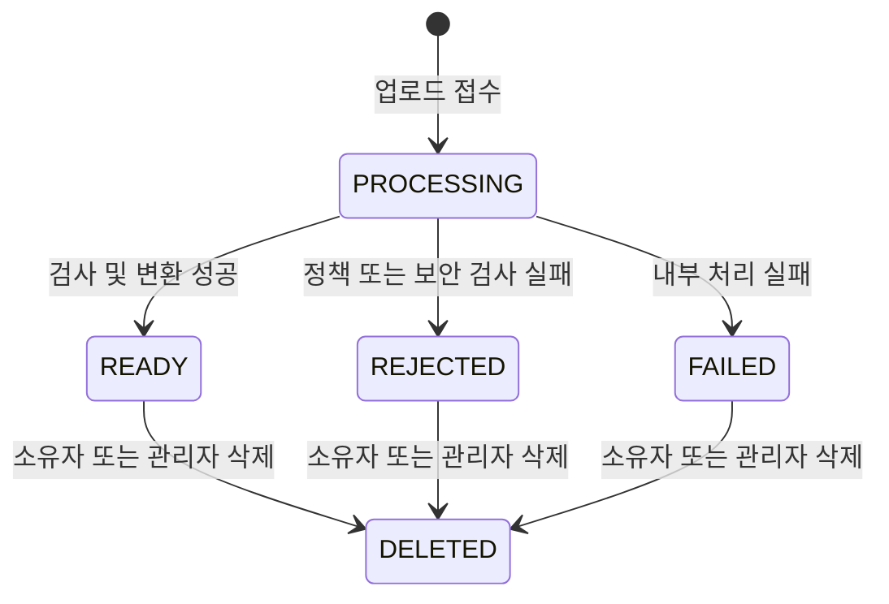
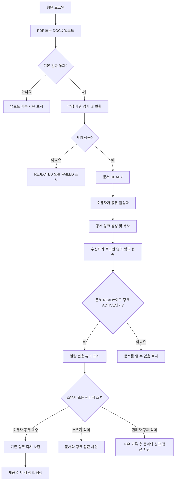

# 사내 문서 공유 서비스 v1 PRD

## 1. 문서 정보

| 항목 | 내용 |
|---|---|
| 제품명 | 사내 문서 공유 서비스 |
| 버전 | v1 |
| 문서 상태 | 구현 준비 |
| 대상 플랫폼 | 반응형 웹 |
| 지원 문서 | PDF, DOCX |
| 핵심 기능 | 업로드, 링크 공유, 비로그인 열람, 공유 회수, 소유자 삭제, 관리자 강제 삭제 |

## 2. 배경과 문제

사내 팀원이 외부 협력자나 다른 팀에 문서를 전달할 때 이메일 첨부, 개인 클라우드, 메신저 파일 전송 등 여러 수단을 혼용하고 있다. 이 방식은 다음 문제를 만든다.

- 수신자의 계정 유무에 따라 접근 가능 여부가 달라진다.
- 배포된 파일에 대한 접근을 사후에 회수하기 어렵다.
- 문서 소유권과 관리 책임이 명확하지 않다.
- 관리자가 부적절하거나 잘못 공개된 문서를 중앙에서 통제할 수 없다.

v1은 팀원이 PDF 또는 DOCX 문서를 업로드하고, 로그인 없이 접근 가능한 단일 링크로 공유하며, 소유자와 관리자가 문서 수명 주기를 통제할 수 있는 열람 전용 서비스를 제공한다.

## 3. 목표

- 팀원이 PDF 또는 DOCX 문서를 업로드하고 처리 상태를 확인할 수 있다.
- 준비가 완료된 문서마다 하나의 활성 공유 링크를 발급할 수 있다.
- 링크 수신자는 계정이나 로그인 없이 브라우저에서 문서를 열람할 수 있다.
- 소유자는 공유 링크를 회수하고 이후 새 링크를 발급할 수 있다.
- 소유자는 자신이 업로드한 문서를 삭제할 수 있다.
- 관리자는 모든 문서를 조회하고 부적절한 문서를 강제로 삭제할 수 있다.
- 공유 회수 또는 삭제 후 기존 링크를 통한 접근을 신속하게 차단한다.
- 업로드 파일과 공개 링크로 인한 악성 파일, 권한 우회 및 정보 노출 위험을 기본 수준에서 방어한다.

## 4. 성공 지표

출시 후 첫 30일을 기준으로 다음을 측정한다.

| ID | 지표 | 목표 |
|---|---|---|
| KPI-01 | 유효한 업로드 중 `READY` 상태 도달 비율 | 95% 이상 |
| KPI-02 | 20MB 이하 문서의 업로드 완료부터 열람 준비까지 걸린 시간 | p95 120초 이하 |
| KPI-03 | 활성 링크의 공개 뷰어 정상 응답률 | 월 99.5% 이상 |
| KPI-04 | 공유 회수 또는 삭제 후 기존 링크 차단 시간 | p95 5초 이하 |
| KPI-05 | 권한 없는 문서 조회·변경 요청의 서버 차단률 | 100% |
| KPI-06 | 관리자 강제 삭제 이벤트의 감사 로그 기록률 | 100% |

## 5. 합리적 가정

- 사내 팀원과 관리자는 회사의 기존 인증 수단으로 로그인한다. 인증 시스템 자체의 구축은 v1 범위 밖이다.
- 인증 사용자에게는 고유 사용자 ID와 `MEMBER` 또는 `ADMIN` 역할이 제공된다.
- 모든 팀원은 문서를 업로드할 수 있으며, 업로드한 사용자가 문서 소유자가 된다.
- 관리자는 전체 문서의 메타데이터와 내용을 열람할 수 있다. 이는 부적절한 문서 판단에 필요한 권한으로 간주한다.
- 관리자는 다른 소유자를 대신해 공유 링크를 생성하거나 회수하지 않는다. 필요한 경우 문서를 강제 삭제한다.
- 업로드 직후 문서는 비공개이며, 소유자가 명시적으로 공유를 활성화해야 외부 접근이 가능하다.
- 문서마다 동시에 하나의 활성 공유 링크만 존재한다.
- 회수한 링크는 다시 활성화할 수 없다. 재공유하면 새로운 토큰을 가진 링크가 생성된다.
- DOCX는 서버에서 안전한 열람용 형식으로 변환해 제공한다. 원본 레이아웃과 일부 특수 기능은 Microsoft Word와 완전히 동일하지 않을 수 있다.
- v1은 별도의 다운로드 권한이나 DRM을 제공하지 않는다. 다운로드 버튼은 제공하지 않지만 브라우저 캐시, 화면 캡처 또는 개발자 도구를 통한 복제를 완전히 방지할 수는 없다.
- 공유 링크에는 기본 만료일이나 비밀번호를 적용하지 않는다. 소유자가 회수하거나 문서가 삭제될 때까지 유효하다.
- 초기 업로드 제한은 파일당 50MB다.
- 삭제 복구 기능은 제공하지 않는다.
- 시간 표시는 사용자 브라우저의 로컬 시간대를 사용하고, 서버에는 UTC로 저장한다.
- 기존 저장소와 UI 컴포넌트는 확인하지 않았으므로 모든 화면은 신규 구현 대상으로 정의한다.

## 6. 범위

### 6.1 v1 포함 범위

- 사내 사용자 인증 연동
- PDF 및 DOCX 업로드
- 파일 유효성 검사, 악성 파일 검사 및 열람용 변환
- 개인 문서 목록과 상세 화면
- 공개 공유 링크 생성과 복사
- 로그인 없는 문서 열람
- 공유 링크 회수와 재발급
- 소유자 문서 삭제
- 관리자 전체 문서 목록, 상세 조회 및 강제 삭제
- 서버 측 권한 검사
- 주요 행위 감사 로그
- 처리 실패 및 접근 불가 상태 안내

### 6.2 제외 범위

- 공동 편집, 댓글, 주석 및 검토 워크플로
- 문서 버전 관리 및 기존 문서 교체
- 폴더, 태그, 즐겨찾기 및 조직별 분류
- 이메일이나 메신저를 통한 링크 자동 발송
- 링크 비밀번호, 만료일, 허용 도메인 또는 수신자 지정
- 열람 횟수, 수신자 식별 및 소유자용 열람 분석
- 원본 또는 변환본 다운로드 권한 설정
- 워터마크, DRM, 화면 캡처 방지
- 대량 업로드 및 일괄 삭제
- 삭제 문서 복구
- 관리자 역할 및 권한 관리 화면
- 모바일 네이티브 애플리케이션
- OCR, 문서 본문 검색, 자동 분류 및 DLP
- PDF/DOCX 외 파일 형식
- 암호화되거나 비밀번호로 보호된 문서 지원

## 7. 사용자 역할

| 역할 | 권한 | 금지되는 행위 |
|---|---|---|
| 링크 수신자 | 활성 공유 링크로 `READY` 문서 열람 | 문서 목록 조회, 원본 다운로드 기능 사용, 편집, 공유 설정 변경, 삭제 |
| 팀원 | 문서 업로드, 자기 문서 목록·상세·내용 조회 | 다른 사용자의 문서 목록·상세·내용 조회, 관리자 기능 사용 |
| 문서 소유자 | 팀원 권한, 자기 문서 공유·회수·재공유·삭제 | 다른 소유자의 공유 설정 변경 또는 삭제 |
| 관리자 | 팀원 권한, 전체 문서 목록·상세·내용 조회, 모든 문서 강제 삭제 | 다른 소유자를 대신한 일반 공유 링크 생성·회수, 감사 로그 변조 |
| 시스템 처리자 | 파일 검사, 변환, 상태 변경, 삭제 파일 정리 | 사용자 권한으로 문서 공유 또는 관리자 행위 수행 |

한 사용자가 관리자이면서 특정 문서의 소유자인 경우, 자기 문서에는 소유자 기능을 사용할 수 있고 다른 사용자의 문서에는 관리자 기능만 사용할 수 있다.

## 8. 핵심 엔터티 및 상태

### 8.1 Document

| 필드 | 설명 |
|---|---|
| `id` | 추측하기 어려운 문서 고유 ID |
| `owner_id` | 업로드한 사용자 ID |
| `title` | 기본값은 확장자를 제외한 파일명 |
| `original_filename` | 업로드 당시 파일명 |
| `file_type` | `PDF` 또는 `DOCX` |
| `file_size` | 원본 파일 크기 |
| `processing_status` | 처리 상태 |
| `created_at` | 업로드 생성 시각 |
| `ready_at` | 열람 준비 완료 시각 |
| `deleted_at` | 삭제 시각 |
| `deleted_by` | 삭제를 수행한 사용자 ID |
| `deletion_type` | `OWNER_DELETE` 또는 `ADMIN_DELETE` |
| `admin_deletion_reason` | 관리자 강제 삭제 사유 |

### 8.2 Share

| 필드 | 설명 |
|---|---|
| `document_id` | 공유 대상 문서 ID |
| `status` | `ACTIVE` 또는 `REVOKED` |
| `token` | 최소 128비트 이상의 암호학적으로 안전한 무작위 토큰 |
| `created_by` | 링크를 생성한 소유자 ID |
| `created_at` | 링크 생성 시각 |
| `revoked_at` | 링크 회수 시각 |

활성 토큰은 로그와 분석 데이터에 평문으로 남기지 않는다. 서버 조회용 값은 해시로 보관하고, 소유자에게 기존 링크를 다시 표시해야 하는 경우에 필요한 값은 암호화해 저장한다.

### 8.3 문서 처리 상태

| 상태 | 의미 | 공유 가능 여부 |
|---|---|---|
| `PROCESSING` | 검사 또는 변환 진행 중 | 불가 |
| `READY` | 브라우저 열람 가능 | 가능 |
| `REJECTED` | 형식, 암호화, 악성 파일 등 정책상 거부 | 불가 |
| `FAILED` | 서비스 내부 오류 또는 처리 시간 초과 | 불가 |
| `DELETED` | 논리 삭제 및 접근 차단 완료 | 불가 |

## 9. 사용자 흐름

## 10. 페이지 정의

| 페이지 | 경로 | 접근 역할 | 주요 기능 | FE 컴포넌트 존재 여부 |
|---|---|---|---|---|
| 내 문서 목록 | `/documents` | 팀원, 관리자 | 자기 문서 조회, 상태 확인, 업로드 진입 | 기존 여부 미확인, 신규 구현 |
| 문서 업로드 | `/documents/new` | 팀원, 관리자 | 파일 선택, 검증, 업로드 진행률 표시 | 기존 여부 미확인, 신규 구현 |
| 내 문서 상세 | `/documents/:documentId` | 소유자 | 문서 미리보기, 공유·회수·삭제 | 기존 여부 미확인, 신규 구현 |
| 공개 문서 뷰어 | `/s/:shareToken` | 누구나 | 로그인 없는 열람 | 기존 여부 미확인, 신규 구현 |
| 관리자 문서 목록 | `/admin/documents` | 관리자 | 전체 문서 조회, 검색, 필터, 페이지 이동 | 기존 여부 미확인, 신규 구현 |
| 관리자 문서 상세 | `/admin/documents/:documentId` | 관리자 | 메타데이터·내용 확인, 강제 삭제 | 기존 여부 미확인, 신규 구현 |

## 11. 화면 상태 매트릭스

| 페이지 | Empty | Loading | Error | Success |
|---|---|---|---|---|
| 내 문서 목록 | “아직 업로드한 문서가 없습니다”와 업로드 버튼 표시 | 목록 스켈레톤 표시 | 재시도 가능한 오류 메시지 | 최신 업로드 순 목록과 처리·공유 상태 표시 |
| 문서 업로드 | 파일 미선택 상태와 지원 형식·50MB 제한 표시 | 업로드 진행률 또는 서버 처리 중 표시 | 크기·형식·네트워크 오류를 구분해 표시 | 문서 상세 이동 및 처리 상태 표시 |
| 내 문서 상세 | 존재하지 않거나 삭제된 문서는 접근 불가 표시 | 메타데이터와 뷰어 스켈레톤 표시 | 조회·변환본 로딩 실패와 재시도 표시 | 미리보기와 상태에 맞는 공유·삭제 액션 표시 |
| 공개 문서 뷰어 | 토큰 누락 시 일반 접근 불가 화면 | 문서 확인 및 첫 페이지 로딩 표시 | 존재하지 않음·회수·삭제를 구분하지 않는 일반 메시지 | 제목과 열람 전용 문서 표시 |
| 관리자 문서 목록 | 조건에 맞는 문서가 없음을 표시 | 목록 스켈레톤 표시 | 재시도 가능한 오류 메시지 | 전체 문서 목록, 검색·필터·페이지 이동 표시 |
| 관리자 문서 상세 | 존재하지 않는 문서는 접근 불가 표시 | 메타데이터와 뷰어 스켈레톤 표시 | 조회 또는 변환본 로딩 실패 표시 | 메타데이터, 내용, 강제 삭제 액션 표시 |

## 12. 기능 요구사항

| ID | 요구사항 | 우선순위 |
|---|---|---|
| FR-101 | 서버는 인증된 사용자의 사용자 ID와 역할을 검증하고 팀원·소유자·관리자 권한을 구분해야 한다. | Must |
| FR-102 | 인증된 팀원은 파일 선택 또는 드래그앤드롭으로 PDF/DOCX 파일 하나를 업로드할 수 있어야 한다. | Must |
| FR-103 | 서버는 확장자, MIME 유형, 파일 시그니처 및 50MB 크기 제한을 검증해야 한다. | Must |
| FR-104 | 서버는 암호화·비밀번호 보호 파일, 손상 파일, 실행 가능한 내장 콘텐츠, 허용 한도를 초과한 압축 해제 결과를 거부해야 한다. | Must |
| FR-105 | 서버는 업로드 파일에 악성 파일 검사를 수행하고, 검사 통과 전에는 열람 또는 공유를 허용하지 않아야 한다. | Must |
| FR-106 | 서버는 PDF를 안전한 열람용 표현으로 정규화하고 DOCX를 열람용 표현으로 변환해야 한다. 문서 내 스크립트는 실행하지 않고 외부 URL의 리소스를 서버에서 가져오지 않아야 한다. | Must |
| FR-107 | 업로드 접수 후 문서를 `PROCESSING`으로 생성하고, 처리 결과에 따라 `READY`, `REJECTED`, `FAILED` 중 하나로 변경해야 한다. | Must |
| FR-108 | 소유자는 자기 문서를 최신 업로드 순으로 조회하고 제목, 형식, 크기, 처리 상태, 공유 상태, 업로드 시각을 확인할 수 있어야 한다. | Must |
| FR-109 | 소유자는 자기 문서의 메타데이터와 `READY` 문서의 열람용 표현을 확인할 수 있어야 한다. | Must |
| FR-110 | `READY` 상태 문서의 소유자는 공유를 활성화하고 추측하기 어려운 공개 링크 하나를 발급받을 수 있어야 한다. | Must |
| FR-111 | 이미 활성 링크가 있는 문서에서 공유 활성화를 다시 요청하면 새 링크를 만들지 않고 기존 활성 링크를 반환해야 한다. | Must |
| FR-112 | 링크 수신자는 유효한 활성 링크를 통해 로그인 없이 `READY` 문서를 브라우저에서 열람할 수 있어야 한다. | Must |
| FR-113 | 공개 뷰어는 편집, 댓글, 주석 및 명시적인 다운로드 기능을 제공하지 않아야 한다. | Must |
| FR-114 | 소유자는 확인 절차 후 활성 공유를 회수할 수 있어야 하며, 회수된 링크는 영구적으로 다시 활성화되지 않아야 한다. | Must |
| FR-115 | 회수 후 재공유하면 이전 토큰과 다른 새 공유 링크를 생성해야 한다. | Must |
| FR-116 | 소유자는 확인 절차 후 자기 문서를 삭제할 수 있어야 한다. 삭제 시 활성 링크도 같은 트랜잭션에서 무효화해야 한다. | Must |
| FR-117 | 관리자는 최신 업로드 순으로 전체 문서를 조회하고 제목·원본 파일명·소유자·형식·상태·공유 상태·업로드 시각을 확인할 수 있어야 한다. | Must |
| FR-118 | 관리자는 제목, 원본 파일명 또는 소유자 식별자로 문서를 검색하고 처리 상태, 공유 상태, 파일 형식으로 필터링할 수 있어야 한다. | Should |
| FR-119 | 관리자는 삭제되지 않은 모든 문서의 메타데이터와, 열람 가능한 경우 문서 내용을 확인할 수 있어야 한다. | Must |
| FR-120 | 관리자는 삭제 사유를 입력하고 확인한 후 모든 문서를 강제 삭제할 수 있어야 한다. 삭제 시 활성 링크도 무효화해야 한다. | Must |
| FR-121 | 소유자 삭제 및 관리자 강제 삭제 직후 문서는 모든 사용자에게 접근 불가 상태가 되어야 한다. | Must |
| FR-122 | 공개 링크가 존재하지 않거나 회수·삭제·처리 미완료 상태인 경우, 공개 화면은 원인을 구분하지 않는 동일한 접근 불가 메시지를 제공해야 한다. | Must |
| FR-123 | 서버는 업로드, 처리 결과, 공유 생성, 공유 회수, 소유자 삭제, 관리자 문서 열람, 관리자 강제 삭제를 감사 로그에 기록해야 한다. | Must |
| FR-124 | 관리자 강제 삭제 로그에는 관리자 ID, 문서 ID, 소유자 ID, 사유 및 시각이 포함되어야 한다. | Must |
| FR-125 | 삭제된 문서의 원본과 열람용 표현은 기본 저장소에서 24시간 이내 제거하고, 백업에서는 30일 이내 만료시켜야 한다. | Must |
| FR-126 | 문서 목록은 페이지당 50건을 표시하고 서버 페이지네이션을 사용해야 한다. | Must |
| FR-127 | 사용자에게 파일 형식 오류, 크기 초과, 보안 정책 거부, 처리 실패, 네트워크 실패를 구분 가능한 메시지로 제공해야 한다. 단, 악성 파일의 세부 탐지 정보는 노출하지 않는다. | Must |
| FR-128 | 소유자와 관리자의 파괴적 액션은 서버 성공 응답 후에만 UI에 완료 상태로 반영해야 하며 실패 시 재시도 가능 상태를 유지해야 한다. | Must |

## 13. 공유 및 열람 규칙

- 공개 URL 형식은 `/s/:shareToken`으로 한다.
- 공유 토큰은 최소 128비트 이상의 암호학적으로 안전한 난수로 생성한다.
- 토큰은 순차 ID, 문서 ID, 사용자 ID 또는 생성 시각을 포함하지 않는다.
- 공개 문서 요청마다 서버가 다음 조건을 확인한다.

  1. 토큰과 연결된 공유가 존재한다.
  2. 공유 상태가 `ACTIVE`다.
  3. 문서 상태가 `READY`다.
  4. 문서가 삭제되지 않았다.

- 열람용 콘텐츠는 공개 저장소 URL로 직접 노출하지 않는다.
- 콘텐츠 응답은 토큰 유효성을 서버에서 확인한 후 전달한다.
- 공개 응답에는 `Cache-Control: no-store`와 `Referrer-Policy: no-referrer`를 적용한다.
- 페이지 제목에는 문서 제목을 사용할 수 있으나 소유자 이름, 사내 조직 또는 원본 저장 경로는 노출하지 않는다.
- 공개 화면은 유효하지 않은 토큰, 회수된 링크, 삭제된 문서, 처리 중 문서를 동일한 HTTP 404 및 동일한 사용자 메시지로 처리한다.
- 토큰 전문은 애플리케이션 로그, 오류 추적, 분석 이벤트 및 리퍼러에 기록하지 않는다.

## 14. 서버 측 권한 정책

클라이언트에서 버튼을 숨기는 것은 권한 통제로 간주하지 않는다. 모든 보호 요청은 서버에서 인증과 리소스 권한을 검사한다.

| 작업 | 서버 허용 조건 | 실패 응답 |
|---|---|---|
| 문서 업로드 | 인증 사용자이며 역할이 `MEMBER` 또는 `ADMIN` | `401` 또는 `403` |
| 내 문서 목록 | 인증 사용자, `owner_id`를 세션 사용자 ID로 서버가 강제 | `401` |
| 소유자 문서 상세 | `document.owner_id == session.user_id` | 리소스 존재 여부를 숨기는 `404` |
| 공유 생성·조회·회수 | 문서 소유자이며 문서가 삭제되지 않음 | `404` 또는 상태 충돌 시 `409` |
| 소유자 삭제 | 문서 소유자이며 아직 삭제되지 않음 | `404` 또는 `409` |
| 공개 열람 | 활성 토큰, `READY`, 미삭제 문서 | 일반화된 `404` |
| 관리자 목록·상세 | 인증 사용자 역할이 `ADMIN` | `403` |
| 관리자 강제 삭제 | `ADMIN`, 미삭제 문서, 비어 있지 않은 삭제 사유 | `403`, `404`, `422` |
| 변환본 접근 | 각 요청에서 소유자·관리자 또는 활성 공유 토큰 검증 | `403` 또는 일반화된 `404` |

추가 정책은 다음과 같다.

- 문서 ID, 소유자 ID 또는 요청 본문의 역할 값만으로 권한을 부여하지 않는다.
- 소유자 삭제와 관리자 강제 삭제는 문서 삭제 표시와 공유 무효화를 원자적으로 처리한다.
- 인증 기반 상태 변경 요청에는 CSRF 방어를 적용한다.
- 동일 문서에 대한 중복 삭제·회수 요청은 데이터 손상 없이 멱등적으로 처리하거나 `409 Conflict`를 반환한다.
- 관리자 상세 열람과 강제 삭제는 항상 감사 로그를 남긴다.

## 15. 제안 API 계약

| Method | Endpoint | 접근 | 동작 |
|---|---|---|---|
| `POST` | `/api/documents` | 인증 사용자 | 단일 문서 업로드 |
| `GET` | `/api/documents` | 인증 사용자 | 자기 문서 목록 |
| `GET` | `/api/documents/:id` | 소유자 | 자기 문서 상세 |
| `GET` | `/api/documents/:id/view` | 소유자 | 자기 문서 열람 데이터 |
| `POST` | `/api/documents/:id/share` | 소유자 | 활성 링크 생성 또는 기존 링크 반환 |
| `DELETE` | `/api/documents/:id/share` | 소유자 | 활성 링크 회수 |
| `DELETE` | `/api/documents/:id` | 소유자 | 자기 문서 삭제 |
| `GET` | `/api/public/shares/:token` | 공개 | 공개 문서 메타데이터와 뷰어 매니페스트 |
| `GET` | `/api/public/shares/:token/content` | 공개 | 권한 확인 후 열람 콘텐츠 제공 |
| `GET` | `/api/admin/documents` | 관리자 | 전체 문서 검색·필터·페이지 조회 |
| `GET` | `/api/admin/documents/:id` | 관리자 | 관리자 문서 상세 |
| `GET` | `/api/admin/documents/:id/view` | 관리자 | 관리자 문서 열람 데이터 |
| `DELETE` | `/api/admin/documents/:id` | 관리자 | 사유를 포함한 강제 삭제 |

업로드 API는 `multipart/form-data`를 사용한다. 관리자 삭제 API는 최소 10자, 최대 500자의 `reason`을 요구한다.

## 16. UX 요구사항

### 16.1 업로드

- 파일 선택 전 지원 형식과 최대 크기를 명시한다.
- 클라이언트 검증은 빠른 피드백 용도로만 사용하며 서버 검증을 대체하지 않는다.
- 업로드 전 파일명, 형식 및 크기를 표시한다.
- 전송 중에는 진행률과 취소 가능 여부를 표시한다.
- 서버 접수 후 변환 중에는 페이지를 닫아도 처리가 계속됨을 안내한다.
- `REJECTED`와 `FAILED`를 구분한다.
- v1에서는 동일 파일 재시도 시 새 문서를 생성한다.

### 16.2 공유

- `READY` 상태에서만 “공유 링크 만들기” 버튼을 활성화한다.
- 생성 성공 후 링크와 “복사” 버튼을 표시한다.
- 활성 공유가 있으면 “링크 복사”와 “공유 회수”를 표시한다.
- 공유 회수 확인창에는 기존 링크로 더 이상 열람할 수 없고 되돌릴 수 없다는 내용을 표시한다.
- 회수 후에는 “새 공유 링크 만들기”를 표시한다.
- 클립보드 복사 실패 시 사용자가 직접 선택할 수 있도록 링크를 표시한다.

### 16.3 삭제

- 소유자 삭제 확인창에 문서 제목, 공유 링크 차단, 복구 불가를 표시한다.
- 관리자 강제 삭제 확인창에 문서 제목, 소유자, 공유 링크 차단, 복구 불가를 표시하고 삭제 사유를 요구한다.
- 삭제 요청 중에는 중복 제출을 막는다.
- 성공 시 목록으로 이동하고 완료 메시지를 표시한다.
- 실패 시 상세 화면을 유지하고 오류와 재시도 액션을 제공한다.

### 16.4 공개 뷰어

- 로그인 또는 회원가입을 요구하지 않는다.
- 문서 제목과 페이지 탐색 기능을 제공한다.
- 확대·축소와 페이지 이동은 허용한다.
- 편집, 댓글, 주석 및 다운로드 버튼은 제공하지 않는다.
- 작은 화면에서는 문서 폭에 맞춰 표시한다.
- 접근 불가 화면에는 내부 상태, 소유자, 파일명 또는 관리자 연락처를 노출하지 않는다.

## 17. 비기능 요구사항

### 17.1 성능

| ID | 요구사항 |
|---|---|
| NFR-101 | 20MB 이하, 200페이지 이하의 정상 문서는 업로드 접수 후 p95 120초 안에 `READY` 또는 실패 상태가 되어야 한다. |
| NFR-102 | 모든 문서는 처리 시작 후 최대 5분 내 성공 또는 실패 상태로 종료되어야 한다. |
| NFR-103 | 문서 목록 API는 50건 조회 기준 p95 2초 이내 응답해야 한다. |
| NFR-104 | 10MB 이하 문서의 공개 뷰어는 일반적인 광대역 환경에서 p95 3초 이내 첫 페이지를 표시해야 한다. |
| NFR-105 | 공유 회수 또는 삭제 후 p95 5초 이내 모든 신규 콘텐츠 요청을 차단해야 한다. |

### 17.2 가용성과 복구

- 공개 열람 기능의 월 가용성 목표는 99.5%다.
- 메타데이터 저장소는 일 단위 백업을 수행한다.
- 복구 목표는 RPO 24시간, RTO 8시간으로 한다.
- 변환 작업은 일시적 내부 오류에 한해 최대 2회 자동 재시도한다.
- 악성 파일 탐지나 정책 거부 결과는 자동 재시도하지 않는다.

### 17.3 보안

- 전송 구간은 TLS 1.2 이상을 사용한다.
- 원본, 변환본 및 공유 토큰 복구용 데이터는 저장 시 암호화한다.
- 업로드 파일명은 화면 표시용 값으로만 취급하고 저장 경로나 실행 명령에 사용하지 않는다.
- DOCX 압축 해제 크기는 최대 500MB로 제한한다.
- 변환 프로세스는 네트워크 접근이 차단된 격리 환경에서 실행한다.
- PDF의 JavaScript, 첨부 실행 파일 및 자동 실행 액션을 제거하거나 비활성화한다.
- 문서 내용은 애플리케이션 HTML에 신뢰된 마크업으로 삽입하지 않는다.
- 공개 토큰 요청에는 IP 기준 분당 120회, 토큰 기준 분당 60회의 기본 제한을 적용한다.
- 인증 API에는 사용자 기준 분당 120회의 기본 제한을 적용한다.
- 반복적인 토큰 추측 패턴과 비정상 다운로드 트래픽을 보안 이벤트로 기록한다.
- 오류 메시지와 응답 시간으로 문서 또는 토큰의 존재 여부가 쉽게 구분되지 않도록 한다.

### 17.4 개인정보와 보존

- 서비스는 문서 열람에 필요하지 않은 공개 수신자의 개인정보를 수집하지 않는다.
- 운영 보안 로그의 IP 주소는 접근 통제된 저장소에서 최대 90일 보관한다.
- 감사 로그는 1년 보관한다.
- 삭제 문서의 원본과 변환본은 기본 저장소에서 24시간, 백업에서 30일 이내 제거한다.
- 삭제 감사에 필요한 문서 ID, 소유자 ID, 삭제자 ID, 삭제 유형, 사유 및 시각은 감사 로그 보존 기간 동안 유지할 수 있다.

### 17.5 접근성 및 호환성

- 업로드, 공유, 회수, 삭제 및 공개 열람의 핵심 흐름은 키보드만으로 수행할 수 있어야 한다.
- 입력 필드와 버튼에는 접근 가능한 이름을 제공한다.
- 진행 상태와 오류 메시지는 스크린리더가 인식할 수 있어야 한다.
- 색상만으로 처리 상태를 구분하지 않는다.
- WCAG 2.1 AA의 핵심 성공 기준을 목표로 한다.
- Chrome, Edge, Safari, Firefox의 최신 2개 주요 버전을 지원한다.

### 17.6 관측 가능성

다음 지표를 수집하고 대시보드화한다.

- 업로드 접수·성공·거부·실패 건수
- 파일 형식과 크기 구간별 처리 시간
- 변환 실패율과 악성 파일 탐지 건수
- 공개 뷰어 요청 성공률과 응답 시간
- 공유 생성·회수 건수
- 소유자 삭제와 관리자 강제 삭제 건수
- 권한 거부 및 공개 토큰 속도 제한 건수
- 삭제 파일 정리 지연 건수

다음 조건에는 운영 경보를 발생시킨다.

- 15분 동안 문서 처리 실패율 10% 초과
- 5분 동안 공개 뷰어 5xx 비율 5% 초과
- 삭제 후 24시간이 지난 파일이 기본 저장소에 잔존
- 악성 파일 검사 서비스가 5분 이상 비정상

## 18. 수용 기준

| ID | 연결 요구사항 | Given / When / Then | 검증 방법 |
|---|---|---|---|
| AC-101 | FR-101, FR-102 | Given 인증된 팀원, When 50MB 이하 정상 PDF 또는 DOCX를 업로드하면, Then 문서가 해당 팀원 소유의 `PROCESSING` 상태로 생성된다. | API·E2E 테스트 |
| AC-102 | FR-103, FR-104 | Given 50MB 초과, 확장자와 시그니처 불일치, 암호화 파일 또는 손상 파일, When 업로드하면, Then 서버가 문서를 열람 가능 상태로 생성하지 않고 구체적인 정책 범주의 오류를 반환한다. | 통합 테스트 |
| AC-103 | FR-105, FR-106, FR-107 | Given 정상 파일과 악성 파일, When 처리가 완료되면, Then 정상 파일만 `READY`가 되고 악성 파일은 `REJECTED`가 되며 콘텐츠가 제공되지 않는다. | 보안·통합 테스트 |
| AC-104 | FR-106 | Given 외부 리소스를 참조하는 DOCX, When 변환하면, Then 변환 환경에서 외부 네트워크 요청이 발생하지 않는다. | 네트워크 격리 테스트 |
| AC-105 | FR-108, FR-126 | Given 여러 사용자의 문서, When 일반 팀원이 내 문서 목록을 요청하면, Then 자기 문서만 최신순·50건 단위로 조회된다. | API 권한 테스트 |
| AC-106 | FR-109 | Given 사용자 A와 사용자 B의 문서, When 사용자 A가 사용자 B의 상세 URL이나 API를 요청하면, Then 서버는 문서 존재를 노출하지 않는 `404`를 반환한다. | IDOR 보안 테스트 |
| AC-107 | FR-110, FR-111 | Given 공유가 없는 `READY` 문서, When 소유자가 공유를 활성화하면, Then 공개 링크 하나가 반환되고 동일 요청을 반복해도 같은 활성 링크가 반환된다. | API·E2E 테스트 |
| AC-108 | FR-112, FR-113 | Given 활성 링크가 있는 `READY` 문서, When 비로그인 브라우저가 링크를 열면, Then 로그인 요구 없이 문서가 표시되고 편집·댓글·주석·다운로드 버튼은 보이지 않는다. | E2E 테스트 |
| AC-109 | FR-114 | Given 활성 공유 링크, When 소유자가 회수를 확인하면, Then 공유가 `REVOKED`가 되고 해당 링크의 이후 요청은 p95 5초 이내 일반화된 `404`를 반환한다. | E2E·성능 테스트 |
| AC-110 | FR-115 | Given 회수된 공유 링크, When 소유자가 문서를 다시 공유하면, Then 이전 토큰과 다른 새 링크가 생성되고 이전 링크는 계속 접근 불가다. | API 테스트 |
| AC-111 | FR-116, FR-121 | Given 활성 공유가 있는 소유자 문서, When 소유자가 삭제하면, Then 문서가 `DELETED`가 되고 소유자 상세 및 공개 링크가 모두 접근 불가가 된다. | 트랜잭션·E2E 테스트 |
| AC-112 | FR-116 | Given 다른 사용자의 문서, When 일반 팀원이 삭제 API를 직접 호출하면, Then 서버가 삭제하지 않고 `404`를 반환한다. | 권한 테스트 |
| AC-113 | FR-117, FR-118 | Given 여러 소유자와 상태의 문서, When 관리자가 목록을 조회하고 검색·필터를 적용하면, Then 조건에 맞는 전체 문서가 최신순·50건 단위로 반환된다. | API·E2E 테스트 |
| AC-114 | FR-117, FR-119 | Given 관리자와 일반 팀원, When 관리자 문서 상세 API를 호출하면 모든 문서를 조회할 수 있고, 일반 팀원이 같은 관리자 API를 호출하면 `403`이 반환된다. | 권한 테스트 |
| AC-115 | FR-120, FR-124 | Given 삭제되지 않은 문서, When 관리자가 유효한 사유를 입력해 강제 삭제하면, Then 문서와 활성 링크가 차단되고 관리자·문서·소유자·사유·시각이 감사 로그에 기록된다. | API·감사 로그 테스트 |
| AC-116 | FR-120 | Given 삭제 사유가 비어 있거나 10자 미만, When 관리자가 강제 삭제를 요청하면, Then 서버는 `422`를 반환하고 문서 상태를 변경하지 않는다. | API 검증 테스트 |
| AC-117 | FR-122 | Given 존재하지 않는 토큰, 회수된 링크, 삭제 문서 링크 및 처리 중 문서 링크, When 공개 접근하면, Then 모두 동일한 상태 코드와 사용자 메시지를 반환한다. | 보안·E2E 테스트 |
| AC-118 | FR-123 | Given 업로드·처리·공유·회수·삭제·관리자 열람 행위, When 각 행위가 수행되면, Then 행위 유형, 행위자, 대상 문서, 결과 및 시각이 감사 로그에 기록된다. | 감사 로그 테스트 |
| AC-119 | FR-125 | Given 삭제된 문서, When 삭제 후 24시간과 30일이 경과하면, Then 각각 기본 저장소와 만료 대상 백업에서 콘텐츠가 제거된다. | 보존 작업 테스트 |
| AC-120 | FR-127 | Given 형식 오류, 크기 초과, 보안 거부, 내부 처리 실패 및 네트워크 실패, When 각 오류가 발생하면, Then UI가 사용자가 취할 수 있는 조치와 함께 서로 구분되는 메시지를 표시한다. | UI 테스트 |
| AC-121 | FR-128 | Given 삭제 API가 실패한 상태, When UI가 오류 응답을 받으면, Then 완료 메시지나 목록 제거를 표시하지 않고 재시도 가능한 상세 상태를 유지한다. | E2E 테스트 |
| AC-122 | NFR-101, NFR-102 | Given 20MB·200페이지 이하의 정상 테스트 문서 집합, When 처리 성능을 측정하면, Then 95% 이상이 120초 이내 종료되고 모든 작업이 5분 이내 종료된다. | 부하·성능 테스트 |
| AC-123 | NFR-103, NFR-104 | Given 정상 운영 부하, When 목록과 공개 뷰어 성능을 측정하면, Then 목록 p95가 2초 이하이고 10MB 이하 문서 첫 페이지 표시 p95가 3초 이하다. | 부하 테스트 |
| AC-124 | 보안 요구사항 | Given 공유 토큰이 포함된 요청, When 애플리케이션·프록시·오류 추적 로그를 확인하면, Then 토큰 전문이 저장되지 않는다. | 보안 로그 검사 |
| AC-125 | 접근성 요구사항 | Given 키보드와 스크린리더 사용자, When 업로드·공유·회수·삭제·공개 열람 흐름을 수행하면, Then 포커스 손실 없이 완료할 수 있고 상태와 오류가 읽힌다. | 접근성 테스트 |

## 19. 오류 및 예외 처리

| 상황 | 기대 동작 |
|---|---|
| 업로드 중 네트워크 단절 | 업로드 실패를 표시하고 사용자가 동일 파일을 다시 선택할 수 있게 한다. 불완전 임시 파일은 24시간 이내 정리한다. |
| 중복 파일 업로드 | 별도 문서로 허용한다. 중복 탐지나 버전 병합은 하지 않는다. |
| 처리 서비스 장애 | 최대 2회 재시도 후 `FAILED`로 전환하고 재업로드를 안내한다. |
| 브라우저를 닫음 | 서버 접수 완료 후라면 처리를 계속한다. |
| 공유 생성 동시 요청 | 문서당 활성 공유 하나만 생성되도록 원자적으로 처리한다. |
| 공유 회수와 공개 접근이 동시에 발생 | 회수 커밋 이후 시작된 요청은 거부한다. 이미 전달된 화면이나 데이터의 회수는 보장하지 않는다. |
| 소유자 삭제와 관리자 삭제가 동시에 발생 | 최초 성공 요청만 삭제를 수행하고 후속 요청은 멱등 성공 또는 `409`를 반환한다. |
| 처리 중 문서 삭제 | 즉시 `DELETED` 처리하고 실행 중 작업을 취소하거나 결과 저장을 폐기한다. |
| 삭제된 문서 직접 접근 | 소유자에게도 복구 불가 접근 오류를 반환한다. |
| DOCX 변환 레이아웃 차이 | 열람 화면에 변환본임을 표시한다. 변환 실패가 심각하면 `FAILED` 처리한다. |
| 페이지 수 또는 변환 자원 한도 초과 | 5분 처리 제한 후 `FAILED` 처리하고 문서가 너무 복잡하다는 메시지를 제공한다. |
| 클립보드 권한 거부 | 복사 실패를 알리고 선택 가능한 링크 텍스트를 유지한다. |
| 감사 로그 저장 실패 | 관리자 강제 삭제는 실패 처리한다. 일반 열람 로그 실패는 사용자 요청을 막지 않고 운영 경보를 발생시킨다. |

## 20. 감사 로그 이벤트

| 이벤트 | 필수 속성 |
|---|---|
| `DOCUMENT_UPLOADED` | 문서 ID, 소유자 ID, 형식, 크기, 시각 |
| `DOCUMENT_PROCESSING_COMPLETED` | 문서 ID, 결과 상태, 처리 시간, 시각 |
| `SHARE_CREATED` | 문서 ID, 소유자 ID, 공유 ID, 시각 |
| `SHARE_REVOKED` | 문서 ID, 소유자 ID, 공유 ID, 시각 |
| `DOCUMENT_OWNER_DELETED` | 문서 ID, 소유자 ID, 시각 |
| `ADMIN_DOCUMENT_VIEWED` | 문서 ID, 관리자 ID, 시각 |
| `DOCUMENT_ADMIN_DELETED` | 문서 ID, 소유자 ID, 관리자 ID, 사유, 시각 |
| `AUTHORIZATION_DENIED` | 행위자 ID 또는 익명, 작업 유형, 대상 식별자의 비민감 해시, 시각 |

공유 토큰, 문서 본문 및 원본 파일명은 감사 로그에 기록하지 않는다.

## 21. 위험과 완화책

| 위험 | 영향 | 완화 |
|---|---|---|
| 공유 링크가 제3자에게 전달됨 | 의도하지 않은 외부 열람 | 강한 무작위 토큰, 소유자 회수 기능, 링크 공유 경고 |
| 공개 링크를 통한 무차별 대입 | 비공개 문서 노출 시도 | 128비트 이상 토큰, 속도 제한, 일반화된 오류, 탐지 경보 |
| 악성 PDF/DOCX 업로드 | 서버 또는 수신자 공격 | 악성 파일 검사, 격리 변환, 스크립트 제거, 외부 네트워크 차단 |
| DOCX 변환 결과 차이 | 문서 의미 또는 레이아웃 왜곡 | 변환본 표시, 실패 기준 정의, PDF 사용 권장 안내 |
| 다운로드 버튼 미제공을 완전한 복제 방지로 오해 | 기밀 유출 기대 불일치 | 공유 전 경고와 비목표 명시 |
| 관리자 권한 오남용 | 민감 문서 노출 또는 삭제 | 관리자 열람·삭제 감사 로그, 삭제 사유 필수, 최소 권한 운영 |
| 회수 후 캐시에서 콘텐츠 노출 | 회수 효과 지연 | 공개 응답 `no-store`, 매 요청 토큰 검증, 직접 저장소 URL 금지 |
| 삭제 작업 지연 | 보존 정책 위반 | 비동기 정리 작업, 24시간 초과 경보, 재시도 큐 |
| 대형·복잡 문서로 자원 고갈 | 처리 지연 및 장애 | 크기·압축 해제·처리 시간 제한, 격리 작업자, 동시성 제한 |
| 공개 트래픽 급증 | 서비스 가용성 저하 | 요청 제한, 콘텐츠 스트리밍 제한, 운영 지표와 경보 |

## 22. 구현 단계

| 단계 | 범위 | 연결 요구사항 | 완료 조건 |
|---|---|---|---|
| 1. 기반 및 업로드 | 인증 연동, 데이터 모델, 저장소, PDF/DOCX 검증, 악성 파일 검사, 변환, 처리 상태 | FR-101~FR-109, FR-127 | 정상·거부·실패 파일이 올바른 상태와 UI를 가진다. |
| 2. 공유 및 공개 열람 | 공유 생성, 기존 링크 반환, 공개 뷰어, 회수, 재공유, 공개 보안 정책 | FR-110~FR-115, FR-122 | 비로그인 열람과 회수 후 접근 차단이 수용 기준을 통과한다. |
| 3. 삭제 및 관리 | 소유자 삭제, 관리자 목록·검색·상세·강제 삭제, 보존 작업 | FR-116~FR-121, FR-125~FR-126, FR-128 | 역할별 권한, 원자적 삭제, 저장소 정리가 검증된다. |
| 4. 감사 및 운영 준비 | 감사 로그, 모니터링, 경보, 성능·접근성·보안 검증 | FR-123~FR-124, NFR 전체 | 수용 기준과 운영 경보 검증 후 v1 출시가 가능하다. |

## 23. 출시 조건

다음 조건을 모두 충족해야 v1을 출시할 수 있다.

- 모든 Must 요구사항의 수용 기준이 통과했다.
- 소유자·비소유자·관리자·익명 사용자 권한 테스트가 통과했다.
- 악성 파일, 손상 파일, 암호화 파일 및 확장자 위조 파일 테스트가 통과했다.
- 공유 회수와 삭제 후 접근 차단 시간이 목표를 충족했다.
- 공개 URL과 로그에서 공유 토큰 또는 내부 저장소 URL이 노출되지 않는다.
- 관리자 강제 삭제와 감사 로그의 원자성 테스트가 통과했다.
- 삭제 파일 정리 작업과 지연 경보가 운영 환경에서 검증됐다.
- 공개 뷰어와 문서 목록의 성능 목표가 검증됐다.
- 핵심 사용자 흐름의 키보드 접근성과 오류 안내가 검증됐다.
- 운영 대시보드, 장애 경보 및 담당자 대응 절차가 준비됐다.