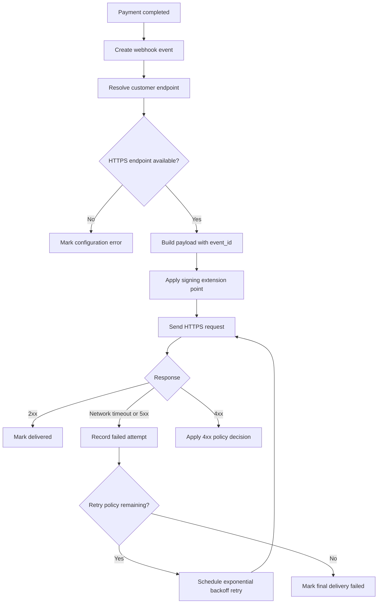

# 결제 완료 웹훅 전달 API PRD

## Applicability

| Contract | Required / N/A | Evidence |
|---|---|---|
| Pages/routes or screen IDs | N/A | 이번 범위에 UI가 없으며, endpoint 등록은 기존 내부 API가 담당함 |
| Empty/loading/error/success/recovery state matrix | Required | 웹훅 전달은 비동기 시스템 상태와 재시도/실패 복구 상태가 필요함 |
| Mermaid user or system flow | Required | 결제 완료 이후 endpoint 조회, 서명, 전달, 재시도까지 다단계 시스템 흐름임 |

## Context and Problem

결제가 완료되면 고객사가 등록한 HTTPS endpoint로 결제 완료 이벤트를 전달해야 한다. 네트워크 실패가 발생할 수 있으므로 최소 1회 전달을 보장하고, 고객사는 동일 이벤트를 여러 번 받을 수 있어야 하므로 이벤트 식별자와 멱등 처리에 필요한 정보가 필요하다.

이번 1차 출시 범위는 자동 전달 API와 재시도 처리에 한정한다. replay 대시보드와 수동 재전송 기능은 제외한다.

## Goals

- 결제 완료 시 등록된 고객사 HTTPS endpoint로 웹훅 이벤트를 자동 전달한다.
- 네트워크 실패 또는 일시적 endpoint 장애에 대해 지수 백오프 재시도를 수행한다.
- 고객사가 중복 수신을 식별할 수 있도록 안정적인 `event_id`를 포함한다.
- 고객사별 데이터 격리를 보장한다.
- 서명 검증 방식과 secret rotation 정책이 결정되지 않았더라도, 이후 보안 정책을 적용할 수 있는 계약 지점을 남긴다.

## Non-goals

- 고객사용 또는 내부 운영용 replay 대시보드 제공
- 수동 재전송 기능
- endpoint 등록 UI 또는 API 신규 개발
- 처리량, 지연 SLA, 성공률 목표 수치 확정
- 서명 알고리즘, 헤더 포맷, secret rotation 주기 확정
- 고객사 endpoint의 멱등 처리 구현

## Users, Roles, and Permissions

| Role | Description | Permissions |
|---|---|---|
| 결제 시스템 | 결제 완료 이벤트를 발생시키는 내부 시스템 | 결제 완료 이벤트 생성 가능 |
| 웹훅 전달 시스템 | 이벤트를 고객사 endpoint로 전달하는 내부 시스템 | 고객사 endpoint 조회, 전달 시도 생성, 재시도 수행 가능 |
| 고객사 시스템 | HTTPS endpoint를 운영하는 외부 수신자 | 본인 고객사의 이벤트만 수신 가능 |
| 내부 운영자 | 장애 확인 및 운영 모니터링 담당자 | 1차 범위에서는 수동 재전송 불가. 로그/상태 조회 권한은 기존 운영 권한 정책을 따름 |

## Functional Requirements

| ID | Requirement | Priority |
|---|---|---|
| FR-001 | 결제 완료 이벤트가 발생하면 웹훅 전달 대상 이벤트를 생성한다. | Must |
| FR-002 | 이벤트에는 전역적으로 유일하고 재시도 간 변하지 않는 `event_id`를 포함한다. | Must |
| FR-003 | 이벤트 payload에는 고객사가 결제 완료 사실을 식별하는 데 필요한 결제 식별자, 고객사 식별 컨텍스트, 이벤트 타입, 이벤트 발생 시각을 포함한다. | Must |
| FR-004 | 웹훅 전달 시스템은 해당 고객사에 등록된 HTTPS endpoint로만 이벤트를 전달한다. | Must |
| FR-005 | endpoint URL은 HTTPS만 허용된 것으로 간주하며, 비-HTTPS endpoint는 전달 대상에서 제외하거나 설정 오류로 처리한다. | Must |
| FR-006 | 각 전달 요청은 고객사별 데이터 경계를 넘지 않아야 하며, 다른 고객사의 결제 데이터가 payload 또는 로그에 포함되면 안 된다. | Must |
| FR-007 | 네트워크 실패, timeout, 연결 실패, 5xx 응답에 대해 지수 백오프로 자동 재시도한다. | Must |
| FR-008 | 2xx 응답은 전달 성공으로 처리한다. | Must |
| FR-009 | 4xx 응답 처리 정책은 확정 전까지 재시도 대상에서 제외하는 것을 기본 가정으로 하되, 보안/운영 결정 전까지 열린 결정으로 둔다. | Should |
| FR-010 | 같은 이벤트의 재시도는 동일한 `event_id`를 사용한다. | Must |
| FR-011 | 전달 시도별 상태, 응답 코드, 오류 유형, 시도 시각, 다음 재시도 예정 시각을 기록한다. | Must |
| FR-012 | 최대 재시도 횟수 또는 재시도 만료 기간은 운영자가 설정 가능한 값으로 둔다. 구체 수치는 출시 전 측정 또는 운영 정책으로 확정한다. | Must |
| FR-013 | 서명 생성 및 검증에 필요한 확장 지점을 제공한다. 단, 1차 PRD에서는 알고리즘과 rotation 주기를 확정하지 않는다. | Must |
| FR-014 | replay 대시보드와 수동 재전송 API/버튼은 1차 출시 범위에 포함하지 않는다. | Must |

## Pages and Routes

| Page or screen ID | Route, deep link, or explicit TBD + owner | Roles | Purpose |
|---|---|---|---|
| N/A | UI 없음 | N/A | 이번 범위는 서버 간 웹훅 전달 API만 포함 |

## State Matrix

| Surface | Empty | Loading | Error | Success | Recovery |
|---|---|---|---|---|---|
| Webhook event queue | 전달 대상 이벤트 없음 | 결제 완료 이벤트를 전달 작업으로 생성 중 | 이벤트 생성 실패 또는 endpoint 설정 오류 | 전달 작업 생성 완료 | 실패 원인 기록 후 운영 모니터링 대상 |
| Delivery attempt | 아직 시도 없음 | 고객사 HTTPS endpoint로 요청 중 | timeout, 네트워크 실패, 5xx, 정책상 실패 응답 | 2xx 응답 수신 | 재시도 가능 오류는 백오프 후 재시도 예약 |
| Retry scheduler | 재시도 대상 없음 | 다음 시도 시각 계산 및 예약 중 | 최대 재시도 정책 초과 또는 스케줄링 실패 | 재시도 예약 완료 | 정책 초과 이벤트는 최종 실패 상태로 고정하고 기록 |

## User or System Flow

## Authorization and Data Boundaries

- 웹훅 이벤트는 반드시 고객사 식별자 기준으로 생성, 조회, 전달되어야 한다.
- endpoint 조회는 해당 고객사의 등록 endpoint만 반환해야 한다.
- payload는 해당 고객사의 결제 완료 이벤트 데이터만 포함해야 한다.
- 로그와 전달 시도 기록에는 고객사 경계를 식별할 수 있는 tenant/customer key가 포함되어야 한다.
- 내부 운영 도구 또는 배치 작업이 전달 상태를 조회하더라도 고객사별 접근 제어를 우회해서는 안 된다.
- 서명 secret이 도입될 경우 secret은 고객사별로 분리되어야 한다.
- UI가 없더라도 서버 권한과 데이터 격리는 제품 요구사항으로 취급한다.

## Non-functional Requirements

| Category | Requirement |
|---|---|
| Reliability | 최소 1회 전달을 보장한다. 동일 이벤트가 여러 번 전달될 수 있다. |
| Retry | 재시도는 지수 백오프를 사용한다. 초기 지연, 최대 지연, 최대 횟수/기간은 열린 결정으로 둔다. |
| Idempotency support | 고객사가 중복 수신을 처리할 수 있도록 모든 전달과 재시도에 동일한 `event_id`를 포함한다. |
| Security | 고객사 endpoint는 HTTPS여야 한다. 서명 방식과 secret rotation 주기는 보안 담당자 결정 이후 반영한다. |
| Observability | 이벤트별 전달 상태와 시도 이력을 추적할 수 있어야 한다. |
| Performance | 처리량과 지연 SLA는 아직 측정되지 않았으므로 목표 수치를 만들지 않는다. 출시 전 계측 지표만 정의한다. |
| Metrics | 최소 계측 항목: 생성 이벤트 수, 전달 성공 수, 전달 실패 수, 재시도 수, 최종 실패 수, 응답 코드 분포, 전달 지연 시간. |

## Acceptance Criteria

| ID | Requirement | Given | When | Then | Verification |
|---|---|---|---|---|---|
| AC-001 | FR-001 | 결제가 성공적으로 완료됨 | 결제 완료 이벤트가 발생함 | 웹훅 이벤트가 생성됨 | 통합 테스트 |
| AC-002 | FR-002, FR-010 | 하나의 결제 완료 이벤트가 생성됨 | 최초 전달과 재시도가 수행됨 | 모든 요청 payload의 `event_id`가 동일함 | 통합 테스트 |
| AC-003 | FR-003 | 웹훅 payload가 생성됨 | 고객사 endpoint로 전송됨 | payload에 이벤트 타입, event_id, 결제 식별자, 발생 시각이 포함됨 | 계약 테스트 |
| AC-004 | FR-004, FR-006 | 고객사 A와 B가 존재함 | 고객사 A 결제가 완료됨 | 고객사 A endpoint로만 이벤트가 전달되고 B 데이터는 포함되지 않음 | 멀티테넌시 테스트 |
| AC-005 | FR-005 | 고객사 endpoint가 비-HTTPS로 등록되어 있음 | 결제 완료 이벤트가 발생함 | 해당 endpoint로 전달하지 않고 설정 오류 상태로 기록함 | 통합 테스트 |
| AC-006 | FR-007 | 고객사 endpoint가 timeout 또는 5xx를 반환함 | 전달 시도가 실패함 | 지수 백오프 재시도가 예약됨 | 통합 테스트 |
| AC-007 | FR-008 | 고객사 endpoint가 2xx를 반환함 | 전달 요청이 완료됨 | 이벤트 상태가 전달 성공으로 기록됨 | 통합 테스트 |
| AC-008 | FR-011 | 전달 시도가 발생함 | 성공 또는 실패함 | 시도 시각, 상태, 응답 코드 또는 오류 유형이 기록됨 | 데이터 검증 테스트 |
| AC-009 | FR-012 | 재시도 가능 실패가 반복됨 | 설정된 재시도 한도에 도달함 | 이벤트가 최종 실패 상태로 기록되고 추가 자동 재시도는 예약되지 않음 | 통합 테스트 |
| AC-010 | FR-013 | 보안 서명 정책이 아직 미확정임 | 웹훅 요청 생성 로직을 구현함 | 서명 로직을 교체/확장할 수 있는 경계가 존재함 | 코드 리뷰 |
| AC-011 | FR-014 | 1차 출시 빌드가 배포됨 | 기능 목록을 확인함 | replay 대시보드와 수동 재전송 기능이 노출되지 않음 | 릴리스 검증 |

## Assumptions and Open Decisions

### 합리적 가정

- endpoint 등록과 고객사별 endpoint 조회 API는 이미 존재한다.
- 결제 완료 이벤트는 내부적으로 신뢰 가능한 결제 시스템에서 한 번 이상 발행된다.
- 고객사는 중복 이벤트를 받을 수 있으며, `event_id`를 기준으로 멱등 처리를 수행한다.
- HTTPS가 아닌 endpoint는 1차 출시에서 전달하지 않는다.
- 2xx는 성공, 네트워크 오류/timeout/5xx는 재시도 대상으로 처리한다.
- 전달 시스템은 비동기 작업 큐 또는 동등한 내구성 있는 처리 메커니즘을 사용할 수 있다. 특정 기술은 이 PRD에서 강제하지 않는다.

### 열린 결정

| Decision | Owner | Impact |
|---|---|---|
| 서명 알고리즘, 서명 헤더 포맷, timestamp 포함 여부 | 보안 담당자 | 고객사 연동 문서, SDK/샘플, 서버 구현에 영향 |
| secret rotation 주기와 이전 secret 허용 기간 | 보안 담당자 | 무중단 rotation, 검증 로직, 운영 정책에 영향 |
| 4xx 응답 재시도 여부와 예외 코드 정책 | 제품/운영/보안 | 실패 복구율, 고객사 오설정 대응 방식에 영향 |
| 최대 재시도 횟수 또는 만료 기간 | 제품/운영 | 최소 1회 보장 이후의 내구성, 비용, 지연에 영향 |
| timeout 값과 백오프 파라미터 | 엔지니어링/운영 | 전달 지연, 리소스 사용량, 장애 전파에 영향 |
| 처리량 및 지연 목표 | 제품/엔지니어링 | 용량 계획과 출시 기준에 영향. 측정 후 확정해야 함 |

## Risks and Mitigations

| Risk | Impact | Mitigation |
|---|---|---|
| 고객사가 중복 이벤트를 처리하지 못함 | 중복 주문 처리 등 고객사 장애 가능 | `event_id`를 필수 제공하고 중복 전달 가능성을 연동 문서에 명시 |
| secret 정책 미확정으로 보안 구현 지연 | 출시 차단 또는 재작업 발생 | 서명 확장 지점은 구현하되, 알고리즘/rotation은 보안 결정 전까지 열린 결정으로 관리 |
| 재시도 폭증 | 내부 큐 적체 또는 고객사 endpoint 부하 | 백오프, 재시도 한도, 고객사별 격리된 처리량 제어를 설계 검토 항목으로 포함 |
| 고객사 데이터 혼입 | 보안 사고 | tenant/customer key 기반 조회와 payload 생성 테스트를 필수화 |
| SLA 수치 부재 | 출시 기준 모호 | 1차 출시에서는 계측을 우선 배포하고, 실측 후 SLA를 별도 결정 |

## Delivery

| Phase | Requirement IDs | Verifiable exit condition |
|---|---|---|
| Phase 1: Event contract and persistence | FR-001, FR-002, FR-003, FR-006, FR-011 | 결제 완료 이벤트 생성, event_id 고정, 고객사별 상태 기록 테스트 통과 |
| Phase 2: Delivery and retry | FR-004, FR-005, FR-007, FR-008, FR-010, FR-012 | HTTPS endpoint 전달, 2xx 성공 처리, 실패 시 백오프 재시도 테스트 통과 |
| Phase 3: Security extension and release guard | FR-013, FR-014 | 서명 확장 경계 확인, replay/수동 재전송 미포함 검증 완료 |
| Phase 4: Measurement baseline | NFR Metrics | 전달량, 성공/실패, 재시도, 지연 지표가 수집되고 SLA 수치는 미확정으로 문서화됨 |

검증기 실행: 파일을 만들지 말라는 요청이 있어 PRD 파일 저장 및 validator 실행은 하지 않았습니다.