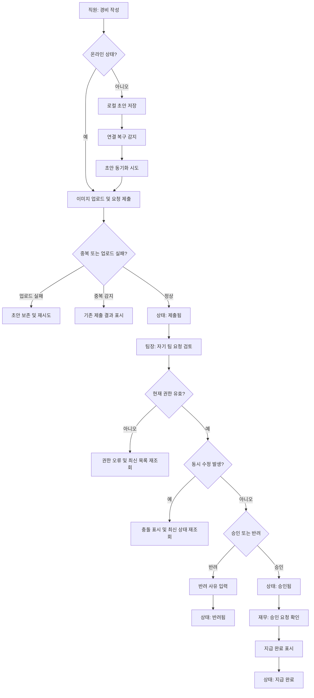

# 모바일 경비 승인 PRD

## Applicability

| Contract | Required / N/A | Evidence |
|---|---:|---|
| Pages/routes or screen IDs | Required | 직원, 팀장, 재무 담당자가 각자 모바일에서 제출·승인·지급 처리해야 하는 사용자 기능 |
| Empty/loading/error/success/recovery state matrix | Required | 오프라인 초안, 이미지 업로드 실패, 동기화 실패, 동시 수정 등 상태 처리가 핵심 요구사항 |
| Mermaid user or system flow | Required | 제출 → 승인/반려 → 지급 완료의 다단계 라이프사이클 존재 |

## Context and Problem

직원은 모바일에서 영수증 기반 경비 요청을 제출하고, 팀장은 자기 팀의 요청만 승인 또는 반려하며, 재무 담당자는 승인된 요청을 지급 완료 처리해야 한다. 이동 중 작성, 불안정한 네트워크, 중복 제출, 권한 변경, 동시 수정 같은 운영 리스크를 포함해 1차 출시 가능한 범위의 승인 워크플로를 제공한다.

## Goals

- 직원이 모바일에서 영수증 사진, 금액, 카테고리를 입력해 경비 요청을 제출할 수 있다.
- 팀장이 자기 팀 직원의 요청만 검토하고 승인 또는 반려할 수 있다.
- 반려 시 팀장이 반려 사유를 필수 입력할 수 있다.
- 재무 담당자가 승인된 요청을 지급 완료로 표시할 수 있다.
- 오프라인에서 작성한 초안은 연결 복구 후 동기화된다.
- 중복 제출, 이미지 업로드 실패, 권한 변경, 승인 중 동시 수정 상태를 사용자에게 명확히 처리한다.
- WCAG 2.2 AA를 목표로 접근성을 설계한다.

## Non-goals

- 1차 출시에서 다중 통화는 지원하지 않는다.
- 1차 출시에서 ERP 자동 연동은 지원하지 않는다.
- 경비 정책 자동 판정, 예산 초과 검증, OCR 자동 금액 추출은 본 범위에 포함하지 않는다.
- 성능 목표 수치는 1차 측정 전까지 확정하지 않는다.

## Users, Roles, and Permissions

| Role | Description | Permissions |
|---|---|---|
| 직원 | 경비를 청구하는 사용자 | 본인의 초안 생성, 본인의 요청 제출, 본인의 요청 상태 조회 |
| 팀장 | 팀 경비 요청을 검토하는 사용자 | 자기 팀 직원의 제출 요청 조회, 승인, 반려, 반려 사유 입력 |
| 재무 담당자 | 승인된 경비의 지급 처리를 담당하는 사용자 | 승인된 요청 조회, 지급 완료 표시 |
| 관리자 또는 권한 시스템 | 사용자 소속·역할을 관리하는 외부/내부 권한 주체 | 권한 변경 시 이후 작업 권한에 반영 |

## Functional Requirements

| ID | Requirement | Priority |
|---|---|---:|
| FR-001 | 직원은 모바일에서 영수증 사진, 금액, 카테고리를 입력해 경비 요청 초안을 작성할 수 있다. | P0 |
| FR-002 | 직원은 필수값이 모두 유효한 경우 경비 요청을 제출할 수 있다. | P0 |
| FR-003 | 제출된 요청은 `제출됨`, `승인됨`, `반려됨`, `지급 완료` 상태 중 하나를 가진다. | P0 |
| FR-004 | 팀장은 자기 팀 직원의 `제출됨` 요청만 조회하고 승인 또는 반려할 수 있다. | P0 |
| FR-005 | 팀장이 반려할 때 반려 사유 입력은 필수다. | P0 |
| FR-006 | 재무 담당자는 `승인됨` 요청만 `지급 완료`로 표시할 수 있다. | P0 |
| FR-007 | 오프라인 상태에서 작성한 초안은 로컬에 보존되고, 연결 복구 시 서버와 동기화된다. | P0 |
| FR-008 | 동일 요청의 중복 제출을 방지하고, 의심되는 중복 요청은 사용자에게 기존 제출 결과를 보여준다. | P0 |
| FR-009 | 이미지 업로드 실패 시 요청은 제출 완료로 오인되지 않아야 하며, 사용자는 재시도 또는 초안 보존을 선택할 수 있다. | P0 |
| FR-010 | 승인·반려·지급 처리 시점에 사용자의 현재 권한을 서버에서 재검증한다. | P0 |
| FR-011 | 팀장이 검토 중인 요청이 다른 사용자 또는 시스템에 의해 변경된 경우 충돌 상태를 표시하고 최신 상태를 다시 불러오게 한다. | P0 |
| FR-012 | 직원, 팀장, 재무 담당자는 자신에게 허용된 요청 목록과 상세 상태를 볼 수 있다. | P1 |
| FR-013 | 각 상태 변경에는 처리자, 처리 시각, 이전 상태, 신규 상태가 기록된다. | P1 |
| FR-014 | 접근성 목표는 WCAG 2.2 AA이며, 입력, 버튼, 오류 메시지, 상태 변화는 보조기술로 인지 가능해야 한다. | P0 |

## Pages and Routes

| Page or screen ID | Route, deep link, or explicit TBD + owner | Roles | Purpose |
|---|---|---|---|
| EXP-M-001 경비 작성 | TBD by Mobile App Owner before implementation | 직원 | 영수증 사진, 금액, 카테고리 입력 및 초안 저장 |
| EXP-M-002 내 요청 목록 | TBD by Mobile App Owner before implementation | 직원 | 본인 요청 상태 조회 |
| EXP-M-003 요청 상세 | TBD by Mobile App Owner before implementation | 직원, 팀장, 재무 담당자 | 요청 상세, 영수증 이미지, 상태 이력 확인 |
| EXP-M-004 팀장 승인함 | TBD by Mobile App Owner before implementation | 팀장 | 자기 팀의 제출 요청 목록 확인 |
| EXP-M-005 반려 사유 입력 | TBD by Mobile App Owner before implementation | 팀장 | 반려 사유 입력 및 반려 확정 |
| EXP-M-006 재무 지급함 | TBD by Mobile App Owner before implementation | 재무 담당자 | 승인된 요청 목록 확인 및 지급 완료 처리 |
| EXP-M-007 오프라인 초안함 | TBD by Mobile App Owner before implementation | 직원 | 동기화 대기·실패 초안 확인 및 재시도 |

## State Matrix

| Surface | Empty | Loading | Error | Success | Recovery |
|---|---|---|---|---|---|
| 경비 작성 | 입력 전 빈 폼 표시 | 이미지 선택/업로드 준비 중 표시 | 필수값 누락, 이미지 오류 표시 | 초안 저장 또는 제출 완료 표시 | 실패 시 초안 보존, 재시도 제공 |
| 내 요청 목록 | 요청 없음 표시 | 목록 로딩 표시 | 목록 조회 실패 표시 | 상태별 요청 목록 표시 | 새로고침 제공 |
| 팀장 승인함 | 검토할 요청 없음 표시 | 팀 요청 로딩 표시 | 권한 없음 또는 조회 실패 표시 | 자기 팀 요청 표시 | 권한 변경 시 목록 재조회 |
| 반려 사유 입력 | 사유 입력 필드 표시 | 반려 처리 중 표시 | 사유 누락, 권한 변경, 충돌 표시 | 반려 완료 표시 | 최신 요청 다시 불러오기 |
| 재무 지급함 | 지급 대상 없음 표시 | 승인 요청 로딩 표시 | 권한 없음 또는 처리 실패 표시 | 지급 완료 처리 표시 | 최신 요청 다시 불러오기 |
| 오프라인 초안함 | 동기화 대기 초안 없음 표시 | 동기화 중 표시 | 동기화 실패, 중복 감지 표시 | 서버 제출 완료 표시 | 개별 재시도, 초안 수정 또는 삭제 제공 |

## User or System Flow

## Authorization and Data Boundaries

- 서버는 모든 조회와 상태 변경에서 사용자 역할, 팀 소속, 요청 소유권을 검증한다.
- 직원은 본인 요청만 조회할 수 있다.
- 팀장은 현재 시점 기준 자기 팀 직원의 요청만 조회·승인·반려할 수 있다.
- 재무 담당자는 승인된 요청에 한해 지급 완료 처리를 할 수 있다.
- 클라이언트에서 버튼을 숨기는 것은 편의 기능일 뿐이며 권한 판단의 근거가 아니다.
- 권한이나 팀 소속이 변경된 사용자는 다음 조회 또는 처리 요청부터 변경된 권한을 적용받는다.
- 오프라인 초안은 해당 기기 내 사용자 계정 범위에만 보관되어야 하며, 다른 사용자 세션에서 접근할 수 없어야 한다.
- 이미지 파일과 요청 데이터는 요청 ID에 연결되어야 하며, 업로드 실패 상태가 제출 완료 상태와 혼동되면 안 된다.

## Non-functional Requirements

- 접근성: WCAG 2.2 AA 목표. 폼 라벨, 오류 메시지, 포커스 순서, 터치 타깃, 색 대비, 상태 변경 안내를 포함한다.
- 성능: 1차 출시 전 실제 사용 환경에서 목록 로딩, 이미지 업로드, 동기화 시간을 측정하고 목표 수치를 확정한다. 수치 결정 오너는 Product Owner와 Engineering Lead.
- 신뢰성: 오프라인 초안은 앱 재시작 후에도 보존되어야 한다.
- 감사성: 승인, 반려, 지급 완료의 상태 변경 이력은 감사 가능해야 한다.
- 보안: 영수증 이미지는 인증된 사용자와 권한 있는 역할만 접근할 수 있어야 한다.

## Acceptance Criteria

| ID | Requirement | Given | When | Then | Verification |
|---|---|---|---|---|---|
| AC-001 | FR-001 | 직원이 모바일 앱에 로그인되어 있다 | 영수증 사진, 금액, 카테고리를 입력한다 | 제출 가능한 초안이 생성된다 | 모바일 UI 테스트 |
| AC-002 | FR-002 | 필수값이 모두 입력되어 있다 | 직원이 제출을 누른다 | 요청이 `제출됨` 상태로 저장된다 | API + UI 테스트 |
| AC-003 | FR-004 | 팀장이 로그인되어 있다 | 승인함을 연다 | 자기 팀 직원의 `제출됨` 요청만 보인다 | 권한 테스트 |
| AC-004 | FR-005 | 팀장이 요청을 반려하려 한다 | 반려 사유 없이 확정한다 | 반려가 차단되고 사유 입력 오류가 표시된다 | UI 테스트 |
| AC-005 | FR-006 | 재무 담당자가 `승인됨` 요청을 보고 있다 | 지급 완료를 누른다 | 요청 상태가 `지급 완료`로 변경된다 | API + UI 테스트 |
| AC-006 | FR-007 | 직원이 오프라인 상태다 | 경비 초안을 작성한다 | 초안이 로컬에 저장되고 연결 복구 후 동기화된다 | 오프라인 시나리오 테스트 |
| AC-007 | FR-008 | 같은 요청이 이미 제출되었다 | 직원 또는 동기화가 동일 제출을 다시 시도한다 | 중복 제출이 생성되지 않고 기존 결과가 표시된다 | API idempotency 테스트 |
| AC-008 | FR-009 | 이미지 업로드가 실패한다 | 직원이 제출을 시도한다 | 제출 완료로 표시되지 않고 재시도 또는 초안 보존이 제공된다 | 실패 주입 테스트 |
| AC-009 | FR-010 | 사용자의 팀장 권한이 제거되었다 | 사용자가 승인 또는 반려를 시도한다 | 서버가 처리를 거부하고 최신 권한 상태가 반영된다 | 권한 변경 테스트 |
| AC-010 | FR-011 | 팀장이 요청 상세를 열어둔 사이 상태가 변경되었다 | 팀장이 승인 또는 반려를 시도한다 | 충돌이 표시되고 최신 상태 재조회가 요구된다 | 동시성 테스트 |
| AC-011 | FR-013 | 요청 상태가 변경된다 | 승인, 반려, 지급 완료 중 하나가 수행된다 | 처리자, 처리 시각, 이전 상태, 신규 상태가 기록된다 | DB/API 테스트 |
| AC-012 | FR-014 | 사용자가 스크린리더 또는 키보드 탐색을 사용한다 | 주요 화면을 탐색하고 오류를 확인한다 | 입력과 상태 변화가 인지 가능하고 조작 가능하다 | 접근성 점검 |

## Assumptions

- 1차 출시는 단일 기본 통화만 사용한다.
- 금액은 양수 숫자이며, 통화 포맷과 세금 세부 입력은 1차 범위에서 제외한다.
- 카테고리는 사전에 정의된 목록에서 선택한다.
- 팀 소속과 역할 정보는 기존 인증/권한 시스템에서 제공된다.
- 중복 제출 방지는 클라이언트 제출 키와 서버 측 멱등성 검증을 함께 사용한다.
- 오프라인 작성은 “초안”까지만 지원하며, 최종 제출 성공 여부는 서버 동기화 후 확정된다.

## Open Decisions

| Decision | Impact | Owner | Decision Point |
|---|---|---|---|
| 기본 통화가 무엇인지 | 금액 표시, 검증, 정산 화면에 영향 | Product Owner | 개발 착수 전 |
| 지원할 이미지 형식과 최대 용량 | 업로드 UX, 저장 비용, 실패 처리에 영향 | Engineering Lead | 개발 착수 전 |
| 카테고리 목록의 출처와 관리 방식 | 입력 폼, 운영 관리 범위에 영향 | Product Owner | 개발 착수 전 |
| 반려 사유 최소/최대 길이 | 유효성 검증과 UX에 영향 | Product Owner | QA 전 |
| 성능 측정 기준과 목표 수치 | 출시 기준과 최적화 범위에 영향 | Product Owner + Engineering Lead | 베타 측정 후 |
| 오프라인 초안 보존 기간 | 저장소 관리와 개인정보 리스크에 영향 | Security/Privacy Owner | QA 전 |

## Risks and Mitigations

| Risk | Mitigation |
|---|---|
| 오프라인 초안이 중복 제출될 수 있음 | 서버 멱등성 키와 중복 감지 결과 표시를 적용 |
| 이미지 업로드 실패가 제출 성공처럼 보일 수 있음 | 이미지 업로드 성공 전 요청을 제출 완료로 표시하지 않음 |
| 팀장 권한 변경 후 기존 화면에서 승인할 수 있음 | 모든 상태 변경 API에서 현재 권한 재검증 |
| 승인 중 동시 수정으로 잘못된 상태 전이가 발생할 수 있음 | 요청 버전 또는 상태 조건부 업데이트로 충돌 감지 |
| 접근성 목표가 늦게 발견되어 재작업이 커질 수 있음 | 주요 폼과 상태 메시지를 초기 구현부터 WCAG 2.2 AA 기준으로 설계 |

## Delivery

| Phase | Requirement IDs | Verifiable exit condition |
|---|---|---|
| Phase 1: 제출 및 초안 | FR-001, FR-002, FR-007, FR-009 | 직원이 온라인/오프라인에서 초안을 작성하고 제출 또는 재시도할 수 있다 |
| Phase 2: 승인 워크플로 | FR-003, FR-004, FR-005, FR-010, FR-011, FR-013 | 팀장이 자기 팀 요청만 승인/반려하고 충돌·권한 변경이 처리된다 |
| Phase 3: 지급 처리 | FR-006, FR-012, FR-013 | 재무 담당자가 승인 요청을 지급 완료 처리하고 이력이 남는다 |
| Phase 4: 출시 검증 | FR-008, FR-014 | 중복 제출, 접근성 핵심 플로우, 실패 상태 테스트가 통과한다 |

Validator는 실행하지 않았습니다. 요청에 따라 파일 생성 없이 응답 본문에만 PRD를 작성했습니다.