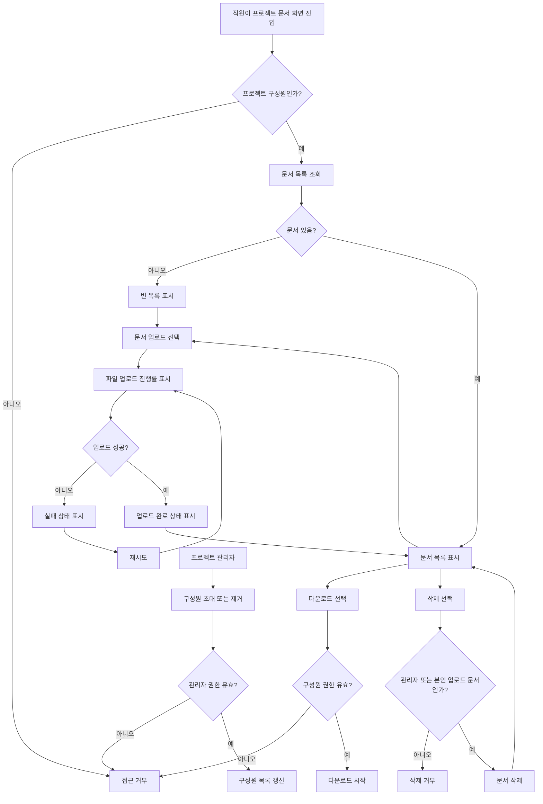

# 사내 프로젝트 문서 공유 PRD

## Applicability

| Contract | Required / N/A | Evidence |
|---|---|---|
| Pages/routes or screen IDs | Required | 업로드, 목록, 다운로드, 삭제, 구성원 관리이 모두 사용자 화면에서 수행됨 |
| Empty/loading/error/success/recovery state matrix | Required | 업로드 진행률, 빈 목록, 실패 후 재시도, 업로드 완료 상태가 명시됨 |
| Mermaid user or system flow | Required | 업로드부터 공유, 권한별 삭제, 다운로드까지 다단계 흐름 존재 |

## Context and problem

직원들이 프로젝트별 문서를 업로드하고 같은 프로젝트 구성원에게만 공유할 수 있는 내부 문서 공유 기능이 필요하다. 1차 출시는 4주 내 내부 베타를 목표로 하며, 핵심 범위는 업로드, 목록 조회, 다운로드, 삭제이다.

현재 검색, 외부 공유, 확정 SLA는 범위 밖이거나 미정이다.

## Goals

- 직원이 자신이 속한 프로젝트에 문서를 업로드할 수 있다.
- 프로젝트 구성원이 같은 프로젝트의 문서 목록을 보고 다운로드할 수 있다.
- 프로젝트 관리자는 프로젝트 구성원 초대, 제거, 문서 삭제를 할 수 있다.
- 일반 구성원은 본인이 업로드한 문서만 삭제할 수 있다.
- 업로드 상태를 사용자가 명확히 인지할 수 있다.
- 내부 베타에서 핵심 문서 공유 흐름을 검증한다.

## Non-goals

- 문서 검색
- 외부 사용자 공유 또는 공개 링크 공유
- 문서 공동 편집
- 버전 관리
- 댓글, 승인 워크플로우
- 정식 SLA 확정
- 조직 전체 문서 저장소 또는 전사 검색

## Users, roles, and permissions

| Role | Description | Permissions |
|---|---|---|
| 직원 | 사내 인증 사용자 | 자신이 속한 프로젝트 접근 |
| 프로젝트 일반 구성원 | 프로젝트에 초대된 직원 | 문서 업로드, 목록 조회, 다운로드, 본인 업로드 문서 삭제 |
| 프로젝트 관리자 | 프로젝트 관리 권한을 가진 구성원 | 일반 구성원 권한 + 구성원 초대·제거 + 프로젝트 내 모든 문서 삭제 |

## Functional requirements

| ID | Requirement | Priority |
|---|---|---|
| FR-001 | 사용자는 자신이 구성원인 프로젝트의 문서 목록을 조회할 수 있다. | P0 |
| FR-002 | 문서 목록에는 최소한 문서명, 업로드한 사용자, 업로드 완료 시각, 파일 크기, 다운로드 액션, 삭제 가능 여부가 표시된다. | P0 |
| FR-003 | 사용자는 자신이 구성원인 프로젝트에 문서를 업로드할 수 있다. | P0 |
| FR-004 | 업로드 중에는 진행률이 표시되어야 한다. | P0 |
| FR-005 | 업로드 성공 후 문서는 완료 상태로 표시되고 목록에서 다운로드 가능해야 한다. | P0 |
| FR-006 | 업로드 실패 시 실패 상태와 재시도 액션을 제공해야 한다. | P0 |
| FR-007 | 문서가 없는 프로젝트는 빈 목록 상태를 표시해야 한다. | P0 |
| FR-008 | 프로젝트 구성원은 같은 프로젝트의 문서를 다운로드할 수 있다. | P0 |
| FR-009 | 일반 구성원은 본인이 업로드한 문서만 삭제할 수 있다. | P0 |
| FR-010 | 프로젝트 관리자는 프로젝트 내 모든 문서를 삭제할 수 있다. | P0 |
| FR-011 | 프로젝트 관리자는 프로젝트 구성원을 초대할 수 있다. | P0 |
| FR-012 | 프로젝트 관리자는 프로젝트 구성원을 제거할 수 있다. | P0 |
| FR-013 | 프로젝트에서 제거된 사용자는 해당 프로젝트의 문서 목록, 다운로드, 업로드, 삭제에 접근할 수 없다. | P0 |
| FR-014 | 삭제된 문서는 목록에서 보이지 않고 다운로드할 수 없다. | P0 |
| FR-015 | 권한이 없는 사용자의 업로드, 다운로드, 삭제, 구성원 관리 요청은 서버에서 거부되어야 한다. | P0 |

## Pages and routes

| Page or screen ID | Route, deep link, or explicit TBD + owner | Roles | Purpose |
|---|---|---|---|
| SCREEN-PROJECT-DOCUMENTS | TBD: 앱 라우팅 구조 확정 필요, owner: 제품 책임자 + FE 리드 | 프로젝트 구성원, 프로젝트 관리자 | 프로젝트 문서 목록, 업로드, 다운로드, 삭제 |
| SCREEN-PROJECT-MEMBERS | TBD: 기존 프로젝트 설정 화면 포함 여부 결정 필요, owner: 제품 책임자 | 프로젝트 관리자 | 구성원 초대 및 제거 |

## State matrix

| Surface | Empty | Loading | Error | Success | Recovery |
|---|---|---|---|---|---|
| 문서 목록 | “업로드된 문서 없음” 상태와 업로드 액션 표시 | 목록 로딩 표시 | 목록 조회 실패 메시지 표시 | 문서 목록 표시 | 다시 시도 |
| 문서 업로드 | N/A | 파일별 업로드 진행률 표시 | 업로드 실패 상태 표시 | 업로드 완료 상태 표시 및 목록 반영 | 재시도 |
| 문서 다운로드 | N/A | 다운로드 요청 중 상태 표시 | 다운로드 실패 메시지 표시 | 파일 다운로드 시작 | 다시 시도 |
| 문서 삭제 | N/A | 삭제 처리 중 상태 표시 | 삭제 실패 메시지 표시 | 목록에서 문서 제거 | 다시 시도 |
| 구성원 관리 | 구성원이 관리자 본인뿐이면 빈 구성원 안내 표시 | 구성원 목록 로딩 표시 | 초대·제거 실패 메시지 표시 | 구성원 목록 갱신 | 다시 시도 |

## User or system flow

## Authorization and data boundaries

- 모든 프로젝트 문서 접근은 서버에서 프로젝트 구성원 여부를 검증해야 한다.
- UI에서 버튼을 숨기는 것은 권한 검증으로 간주하지 않는다.
- 일반 구성원의 삭제 권한은 `document.uploader_id == current_user.id` 조건을 서버에서 검증해야 한다.
- 프로젝트 관리자의 삭제 권한은 해당 프로젝트의 관리자 역할을 서버에서 검증해야 한다.
- 다운로드 URL 또는 파일 스트림은 권한 검증 후에만 발급되어야 한다.
- 프로젝트에서 제거된 사용자는 기존에 보던 문서 목록 화면에서도 다음 요청부터 접근이 거부되어야 한다.
- 문서는 프로젝트 단위로 격리되어야 하며, 다른 프로젝트의 문서 ID를 직접 요청해도 접근할 수 없어야 한다.

## Non-functional requirements

| ID | Requirement | Status |
|---|---|---|
| NFR-001 | 문서 목록은 사용자가 화면 진입 후 2초 안에 볼 수 있는 것을 목표로 한다. | 목표, SLA 아님 |
| NFR-002 | 실제 목록 조회 SLA는 제품 책임자가 베타 전까지 확정한다. | Open decision |
| NFR-003 | 업로드 진행률은 사용자가 업로드가 진행 중임을 인지할 수 있을 만큼 주기적으로 갱신되어야 한다. | Required |
| NFR-004 | 권한 없는 파일 접근은 서버에서 거부되어야 한다. | Required |

## Acceptance criteria

| ID | Requirement | Given | When | Then | Verification |
|---|---|---|---|---|---|
| AC-001 | FR-001 | 사용자가 프로젝트 구성원이다 | 프로젝트 문서 화면에 진입한다 | 해당 프로젝트의 문서 목록을 볼 수 있다 | 기능 테스트 |
| AC-002 | FR-002 | 문서가 1개 이상 있다 | 목록이 표시된다 | 문서명, 업로더, 업로드 완료 시각, 파일 크기, 다운로드 액션, 삭제 가능 여부가 보인다 | UI 테스트 |
| AC-003 | FR-003 | 사용자가 프로젝트 구성원이다 | 파일을 선택해 업로드한다 | 업로드 요청이 시작된다 | 기능 테스트 |
| AC-004 | FR-004 | 업로드가 진행 중이다 | 사용자가 업로드 영역을 본다 | 진행률이 표시된다 | UI 테스트 |
| AC-005 | FR-005 | 업로드가 성공했다 | 업로드 처리가 완료된다 | 완료 상태가 보이고 문서가 목록에 표시된다 | 기능 테스트 |
| AC-006 | FR-006 | 업로드가 실패했다 | 실패 응답을 받는다 | 실패 상태와 재시도 액션이 표시된다 | 실패 케이스 테스트 |
| AC-007 | FR-006 | 업로드 실패 상태다 | 사용자가 재시도를 누른다 | 동일 파일 업로드를 다시 시도한다 | 기능 테스트 |
| AC-008 | FR-007 | 프로젝트에 문서가 없다 | 목록 조회가 완료된다 | 빈 목록 상태가 표시된다 | UI 테스트 |
| AC-009 | FR-008 | 사용자가 프로젝트 구성원이다 | 문서 다운로드를 선택한다 | 파일 다운로드가 시작된다 | 기능 테스트 |
| AC-010 | FR-009 | 일반 구성원이 본인이 올린 문서를 보고 있다 | 삭제를 선택한다 | 문서가 삭제된다 | 권한 테스트 |
| AC-011 | FR-009 | 일반 구성원이 다른 사용자가 올린 문서를 대상으로 한다 | 삭제를 요청한다 | 서버가 요청을 거부한다 | API 권한 테스트 |
| AC-012 | FR-010 | 프로젝트 관리자가 프로젝트 문서를 대상으로 한다 | 삭제를 요청한다 | 문서가 삭제된다 | 권한 테스트 |
| AC-013 | FR-011 | 프로젝트 관리자가 구성원 관리 화면에 있다 | 직원을 초대한다 | 해당 직원이 프로젝트 구성원이 된다 | 기능 테스트 |
| AC-014 | FR-012, FR-013 | 프로젝트 관리자가 구성원을 제거한다 | 제거된 사용자가 프로젝트 문서에 접근한다 | 접근이 거부된다 | 권한 테스트 |
| AC-015 | FR-014 | 문서가 삭제되었다 | 사용자가 목록을 새로 조회하거나 다운로드를 요청한다 | 목록에 보이지 않고 다운로드가 거부된다 | 기능 테스트 |
| AC-016 | FR-015 | 비구성원이 프로젝트 문서 API를 호출한다 | 목록, 업로드, 다운로드, 삭제 중 하나를 요청한다 | 서버가 권한 없음으로 거부한다 | API 테스트 |

## Assumptions and open decisions

### 합리적 가정

- 사내 직원 인증과 사용자 계정 체계는 이미 존재한다.
- 프로젝트와 프로젝트 구성원 개념은 이미 존재하거나 1차 출시 범위에서 연결 가능하다.
- 파일은 프로젝트 단위로 귀속된다.
- 업로드 완료 전 문서는 다운로드 가능 목록에 노출하지 않는다.
- 삭제는 사용자 관점에서 즉시 목록에서 사라지는 동작으로 정의한다.
- 1차 베타에서는 단일 파일 업로드를 기본으로 한다. 다중 파일 업로드는 별도 결정이 없으면 제외한다.

### 열린 결정

| ID | Decision | Owner | Needed by |
|---|---|---|---|
| OD-001 | 문서 목록 조회의 실제 SLA 확정 | 제품 책임자 | 베타 전 |
| OD-002 | 파일 크기 제한과 허용 파일 형식 | 제품 책임자 + 보안/인프라 담당 | 구현 착수 전 |
| OD-003 | 문서 삭제가 하드 삭제인지 소프트 삭제인지 | 제품 책임자 + 엔지니어링 리드 | 구현 착수 전 |
| OD-004 | 구성원 초대 방식: 이메일 초대, 사내 사용자 검색, 또는 둘 다 | 제품 책임자 | 구성원 관리 구현 전 |
| OD-005 | 구성원 제거 시 해당 사용자가 업로드한 문서의 처리 정책 | 제품 책임자 | 구성원 제거 구현 전 |
| OD-006 | 화면 라우팅과 기존 프로젝트 상세/설정 화면에 포함할지 여부 | 제품 책임자 + FE 리드 | FE 구현 전 |

## Risks and mitigations

| Risk | Impact | Mitigation |
|---|---|---|
| SLA가 미정이라 성능 목표가 흔들릴 수 있음 | 베타 품질 판단 기준 불명확 | 2초는 목표로 두고, 실제 SLA는 OD-001로 베타 전 확정 |
| 권한 검증이 UI에만 구현될 위험 | 프로젝트 간 문서 유출 가능 | 모든 목록, 업로드, 다운로드, 삭제, 구성원 관리 API에서 서버 권한 검증 필수 |
| 파일 크기와 형식 제한 미정 | 업로드 실패, 저장소 비용, 보안 리스크 | OD-002를 구현 착수 전 결정 |
| 구성원 제거 후 기존 접근 처리 누락 | 제거된 사용자의 문서 접근 가능성 | 요청 시점마다 구성원 여부 재검증 |
| 4주 베타 일정 대비 구성원 관리까지 포함되어 범위가 커질 수 있음 | 일정 지연 | 1차 범위를 업로드, 목록, 다운로드, 삭제, 초대·제거의 최소 흐름으로 제한 |

## Delivery

| Phase | Requirement IDs | Verifiable exit condition |
|---|---|---|
| Phase 1: 권한·데이터 모델 확정 | FR-001, FR-003, FR-008, FR-009, FR-010, FR-015 | 프로젝트 구성원/관리자 권한 기준과 문서 귀속 기준이 API 테스트로 검증됨 |
| Phase 2: 문서 핵심 흐름 | FR-001~FR-010, FR-014 | 구성원이 업로드, 목록 조회, 다운로드, 권한별 삭제를 수행할 수 있음 |
| Phase 3: 구성원 관리 | FR-011~FR-013 | 관리자가 구성원을 초대·제거하고 제거된 사용자의 접근이 차단됨 |
| Phase 4: 상태·복구·베타 검증 | FR-004~FR-007, 전체 AC | 진행률, 빈 목록, 실패 후 재시도, 완료 상태가 검증되고 내부 베타 가능 상태가 됨 |

검증 참고: 사용자가 파일 생성 금지를 요청했기 때문에 PRD 파일 저장 및 validator 실행은 하지 않았습니다.