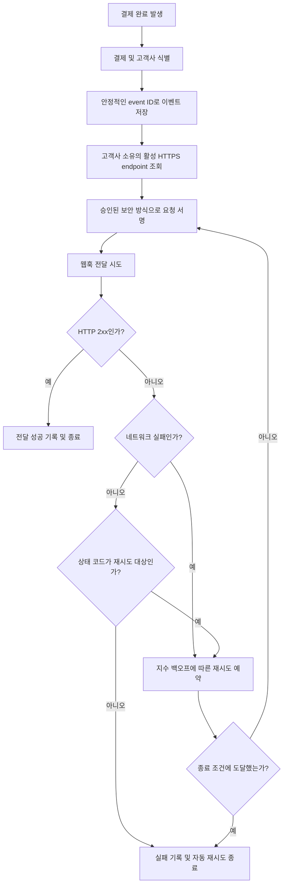

# 결제 완료 웹훅 전달 API PRD

## Applicability

| Contract | Required / N/A | Evidence |
|---|---|---|
| Pages/routes or screen IDs | N/A | 이번 범위에 UI가 없으며 endpoint 등록도 기존 내부 API가 담당한다. |
| Empty/loading/error/success/recovery state matrix | N/A | 사용자 화면이 없는 백엔드 전달 기능이다. 전달 상태와 복구 동작은 기능 요구사항 및 시스템 흐름으로 정의한다. |
| Mermaid user or system flow | Required | 결제 완료 감지, 이벤트 생성, 서명, 전달, 성공 판정, 재시도로 이어지는 다단계 시스템 생명주기가 존재한다. |

## Context and problem

결제가 완료되었을 때 고객사 시스템이 후속 업무를 수행할 수 있도록, 사전에 등록된 고객사별 HTTPS endpoint로 결제 완료 이벤트를 전달해야 한다.

외부 네트워크와 고객사 endpoint는 일시적으로 실패할 수 있으므로 전달은 최소 1회(at-least-once)를 보장해야 한다. 이에 따라 동일 이벤트가 중복 전달될 수 있으며, 고객사가 이를 식별할 수 있는 안정적인 event ID가 필요하다.

보안 서명 방식과 secret rotation 정책, 처리량 및 지연 목표는 아직 확정되지 않았다. 근거 없는 수치나 정책을 이번 PRD에서 임의로 정하지 않는다.

## Goals

- 결제 완료 이벤트를 해당 고객사의 등록된 HTTPS endpoint로 비동기 전달한다.
- 네트워크 실패 시 지수 백오프를 적용해 자동 재시도한다.
- 모든 재시도에서 동일한 event ID를 사용하여 고객사가 중복 이벤트를 식별할 수 있게 한다.
- 고객사별 endpoint, secret, 이벤트 및 전달 이력을 격리한다.
- 전달 결과와 재시도 상태를 운영자가 시스템 로그 및 메트릭으로 진단할 수 있게 한다.
- 미확정된 보안 및 운영 정책을 구현 경계와 출시 결정으로 명시한다.

## Non-goals

- endpoint 등록·수정·삭제용 신규 API
- endpoint 관리 UI
- 웹훅 replay 대시보드
- 운영자 또는 고객사의 수동 재전송
- 정확히 1회(exactly-once) 전달 보장
- 고객사 endpoint 내부에서의 중복 처리 방지
- 고객사별 이벤트 순서 보장
- 근거가 없는 처리량, 전달 지연 또는 가용성 SLA 설정
- 결제 완료 외 다른 이벤트 유형의 전달

## Users, roles, and permissions

| 역할 | 권한 및 책임 |
|---|---|
| 결제 시스템 | 결제 완료 사실을 발생시키는 상위 시스템이다. 고객사 endpoint나 secret에 직접 접근하지 않는다. |
| 웹훅 전달 서비스 | 결제 완료 이벤트 생성, 고객사 설정 조회, 서명, 전달, 결과 기록 및 재시도를 수행한다. |
| 고객사 시스템 | 자신에게 발급된 event ID와 서명 정보를 포함한 이벤트만 수신한다. 다른 고객사의 데이터에는 접근할 수 없다. |
| 내부 운영자 | 허가된 내부 관측 수단으로 전달 상태와 오류를 진단한다. 1차 출시에서는 수동 재전송할 수 없다. |
| 보안 담당자 | 서명 검증 방식과 secret rotation 정책을 결정하고 출시 전에 승인한다. |

## Functional requirements

| ID | Requirement | Priority |
|---|---|---|
| FR-001 | 시스템은 결제가 완료되면 해당 결제 소유 고객사를 식별하고 결제 완료 웹훅 이벤트를 생성해야 한다. | Must |
| FR-002 | 이벤트에는 고객사가 중복 전달을 식별할 수 있는 전역적으로 고유한 불투명 event ID가 포함되어야 한다. | Must |
| FR-003 | 동일한 논리 이벤트의 최초 전달과 모든 자동 재시도는 동일한 event ID와 동일한 이벤트 의미를 유지해야 한다. | Must |
| FR-004 | 시스템은 기존 내부 API를 통해 등록된, 해당 고객사 소유의 활성 HTTPS endpoint만 전달 대상으로 사용해야 한다. | Must |
| FR-005 | 웹훅 payload에는 최소한 event ID, 이벤트 유형, 이벤트 발생 시각 및 해당 고객사에 귀속된 결제 완료 데이터가 포함되어야 한다. 정확한 스키마와 버전 정책은 OD-004에서 확정한다. | Must |
| FR-006 | 웹훅 요청은 보안 담당자가 승인한 방식으로 서명되어야 한다. 서명 알고리즘, 헤더 형식 및 검증 절차는 OD-001 확정 전까지 출시 차단 항목이다. | Must |
| FR-007 | 시스템은 고객사 endpoint에 대한 최초 전달을 자동으로 시도해야 한다. 결제 완료 처리의 성공 여부가 외부 endpoint 응답에 동기적으로 의존해서는 안 된다. | Must |
| FR-008 | DNS, 연결, TLS 또는 요청 시간 초과 등 네트워크 실패가 발생하면 지수 백오프로 자동 재시도해야 한다. 백오프 파라미터와 재시도 종료 조건은 OD-002에서 확정한다. | Must |
| FR-009 | HTTP 2xx 응답은 전달 성공으로 처리한다. 2xx 외 응답은 성공으로 처리하지 않으며, 상태 코드별 재시도 여부는 OD-003에 따른다. | Must |
| FR-010 | 성공으로 확정된 이벤트에 대해서는 자동 재시도를 중단해야 한다. | Must |
| FR-011 | 각 전달 시도에 대해 고객사, event ID, 시도 결과, 응답 상태 또는 오류 범주, 시도 시각 및 다음 재시도 상태를 운영 진단이 가능한 형태로 기록해야 한다. | Must |
| FR-012 | endpoint, secret, payload, 이벤트 및 전달 상태 조회·처리는 항상 고객사 경계를 적용해야 한다. | Must |
| FR-013 | 한 고객사의 endpoint 장애나 재시도 적체가 다른 고객사의 데이터 노출을 유발해서는 안 된다. 자원 공정성 또는 장애 격리 수준은 측정 후 별도 정책으로 정한다. | Must |
| FR-014 | 로그와 메트릭에는 secret, 서명 원문 또는 불필요한 결제 민감정보를 기록하지 않아야 한다. | Must |
| FR-015 | 1차 출시에서는 replay 대시보드와 수동 재전송 인터페이스를 제공하지 않아야 한다. | Must |
| FR-016 | 이벤트별 현재 전달 상태를 최소 `전달 대기`, `재시도 대기`, `전달 성공`, `자동 재시도 종료`로 구분할 수 있어야 한다. 마지막 상태의 명칭과 종료 조건은 OD-002 결정에 맞춘다. | Must |

## Pages and routes

N/A. 사용자 화면과 신규 endpoint 관리 route는 이번 범위에 포함되지 않는다.

## State matrix

N/A. 사용자 화면 상태는 없다. 백엔드 전달 상태는 FR-016과 아래 시스템 흐름으로 정의한다.

## User or system flow

## Authorization and data boundaries

- 모든 이벤트와 전달 작업은 생성 시점부터 고객사 식별자에 귀속되어야 한다.
- endpoint와 secret 조회에는 이벤트의 고객사 식별자를 사용해야 하며, 요청 입력만으로 다른 고객사를 선택할 수 없어야 한다.
- 결제 데이터의 고객사와 endpoint 소유 고객사가 일치하지 않으면 전달을 수행하지 않고 보안 오류로 기록해야 한다.
- 이벤트 payload에는 해당 고객사 소유의 결제 데이터만 포함해야 한다.
- 저장소, 큐 또는 작업 처리기가 공유되더라도 모든 조회와 갱신에는 고객사 범위가 강제되어야 한다.
- 고객사 A의 event ID를 이용해 고객사 B의 endpoint, secret, payload 또는 전달 결과를 조회하거나 변경할 수 없어야 한다.
- secret은 승인된 비밀 저장 및 접근 통제를 적용해야 하며 평문 로그에 노출하면 안 된다.
- 내부 운영 권한이 있더라도 1차 출시 범위에서는 수동 재전송 동작을 실행할 수 없어야 한다.

## Non-functional requirements

### 신뢰성

- 전달 의미는 최소 1회이며 중복 전달은 정상적으로 발생할 수 있다.
- 이벤트는 외부 전송 시도 전에 내구성 있게 기록되어야 한다.
- 프로세스 재시작이나 작업자 장애 이후에도 미완료 전달 작업을 복구할 수 있어야 한다.
- 정확히 1회 전달이나 이벤트 순서 보장은 제공하지 않는다.

### 보안

- HTTPS endpoint만 허용한다.
- 외부 전달 요청은 출시 전에 승인된 서명 방식을 적용해야 한다.
- secret rotation 중 허용할 키 수, 중첩 기간 및 폐기 절차는 보안 담당자 결정에 따른다.
- 로그와 메트릭은 secret 및 불필요한 결제 데이터를 노출하지 않아야 한다.
- endpoint 등록 단계의 URL 검증과 SSRF 방어 책임은 기존 내부 API에 있다는 가정은 출시 전에 확인해야 한다.

### 관측 가능성

다음 항목은 수치 목표 없이 측정 가능해야 한다.

- 생성된 결제 완료 이벤트 수
- 전달 시도·성공·실패·재시도 수
- 오류 범주 및 HTTP 응답 코드 분포
- 결제 완료부터 최초 시도까지의 지연
- 결제 완료부터 최종 성공까지의 지연
- 고객사별 재시도 대기 작업 수와 작업 연령
- 자동 재시도 종료 이벤트 수

처리량과 지연 SLA는 운영 측정 자료가 확보된 뒤 별도 결정한다.

## Acceptance criteria

| ID | Requirement | Given | When | Then | Verification |
|---|---|---|---|---|---|
| AC-001 | FR-001, FR-004, FR-007 | 고객사 A 소유 결제가 완료되고 A의 활성 HTTPS endpoint가 등록되어 있다. | 결제 완료 이벤트가 처리된다. | A의 endpoint를 대상으로 웹훅 전달이 자동 시도되며 결제 완료 처리는 endpoint 응답을 동기적으로 기다리지 않는다. | 통합 테스트 |
| AC-002 | FR-002, FR-003 | 하나의 결제 완료 이벤트가 생성되어 최초 전달 후 재시도가 필요하다. | 동일 이벤트가 여러 차례 전달된다. | 모든 요청의 event ID가 동일하고 다른 논리 이벤트의 event ID와 구분된다. | 통합 테스트 및 저장 데이터 검사 |
| AC-003 | FR-005 | 결제 완료 이벤트가 전달된다. | 고객사가 요청 payload를 확인한다. | event ID, 이벤트 유형, 발생 시각 및 고객사에 귀속된 결제 완료 데이터가 존재한다. | 계약 테스트 |
| AC-004 | FR-006, FR-014 | 보안 담당자가 서명 규격을 승인했다. | 웹훅 요청이 생성된다. | 승인된 서명 정보가 포함되고 secret과 서명 원문은 로그에 남지 않는다. | 계약 테스트 및 로그 검사 |
| AC-005 | FR-008 | endpoint에서 DNS, 연결, TLS 또는 시간 초과 오류가 발생한다. | 전달 시도가 실패한다. | 확정된 정책에 따라 다음 시도가 지수적으로 증가하는 간격으로 예약되며 event ID는 유지된다. | 장애 주입 통합 테스트 |
| AC-006 | FR-009, FR-010 | endpoint가 HTTP 2xx로 응답한다. | 응답이 처리된다. | 이벤트가 전달 성공으로 기록되고 추가 자동 재시도가 예약되지 않는다. | 통합 테스트 |
| AC-007 | FR-009 | endpoint가 2xx가 아닌 상태로 응답한다. | 응답이 처리된다. | 성공으로 기록되지 않으며 OD-003에서 정한 상태 코드 정책에 따라 재시도 또는 종료된다. | 상태 코드별 계약 테스트 |
| AC-008 | FR-011, FR-016 | 전달이 성공하거나 실패한다. | 운영자가 허가된 관측 수단을 조회한다. | event ID별 시도 시각, 결과, 오류 범주 및 현재 전달 상태를 확인할 수 있다. | 통합 테스트 및 관측 데이터 검사 |
| AC-009 | FR-012, FR-013 | 고객사 A와 B의 결제, endpoint, secret 및 이벤트가 존재한다. | A에 귀속된 작업이 처리된다. | B의 endpoint나 secret이 선택되지 않고 B의 결제 데이터가 payload 또는 로그에 나타나지 않는다. | 테넌트 격리 테스트 |
| AC-010 | FR-015 | 1차 출시 버전이 배포된다. | 제공 API와 운영 기능을 점검한다. | replay 대시보드와 수동 재전송 기능이 존재하지 않는다. | 기능 목록 및 API 표면 검사 |
| AC-011 | NFR 신뢰성 | 이벤트 저장 후 전달 작업자가 중단된다. | 작업자가 재기동된다. | 성공 처리되지 않은 이벤트가 유실되지 않고 확정된 정책에 따라 전달 또는 재시도를 계속한다. | 복구 테스트 |
| AC-012 | NFR 관측 가능성 | 웹훅 전달 트래픽이 발생한다. | 메트릭을 조회한다. | 성공·실패·재시도 수와 전달 지연을 측정할 수 있으며 임의의 SLA 판정값은 적용되지 않는다. | 메트릭 검사 |

## Assumptions and open decisions

### 합리적 가정

| ID | Assumption | 영향 및 검증 |
|---|---|---|
| AS-001 | 결제 시스템은 고객사와 결제를 안정적으로 연결할 수 있는 식별 정보를 제공한다. | 제공되지 않으면 FR-001과 데이터 격리를 구현할 수 없다. 연동 계약에서 확인한다. |
| AS-002 | 하나의 논리적 결제 완료 전이에 대해 동일 이벤트를 재처리할 경우 기존 event ID를 재사용할 수 있는 안정적인 식별 또는 중복 제거 기준이 존재한다. | 없으면 상위 이벤트 중복이 서로 다른 event ID로 생성될 수 있다. 결제 이벤트 모델에서 확인한다. |
| AS-003 | endpoint 등록, 소유권 검증, 활성 상태 관리 및 URL 안전성 검사는 기존 내부 API의 책임이다. | 기존 API가 이를 보장하지 않으면 이번 범위에 검증 보완이 추가되어야 한다. 출시 전 계약 테스트로 확인한다. |
| AS-004 | 외부 전달은 결제 완료 트랜잭션과 분리된 비동기 작업으로 수행한다. | 고객사 장애가 결제 완료 처리에 영향을 주지 않게 한다. |
| AS-005 | HTTP 2xx는 고객사가 이벤트를 수락했다는 의미다. | 고객사 연동 계약에 명시하고 계약 테스트로 확인한다. |
| AS-006 | 중복 수신에 대한 최종 멱등 처리는 고객사 책임이며, 본 API는 안정적인 event ID를 제공한다. | 고객사 연동 문서에 명시한다. |
| AS-007 | 1차 출시에서는 전달 순서를 보장하지 않는다. | 순서 의존 고객사가 발견되면 별도 요구사항으로 검토한다. |

### 열린 결정

| ID | Decision | Owner | 결정 시점 | 출시 영향 |
|---|---|---|---|---|
| OD-001 | 서명 알고리즘, 서명 대상 문자열, timestamp 포함 여부, 헤더 형식 및 허용 시간 오차 | 보안 담당자 | 구현 완료 전 | 출시 차단 |
| OD-002 | 최초 재시도 간격, 증가 계수, 최대 간격, jitter, 최대 시도 횟수 또는 최대 재시도 기간, 이벤트·시도 기록 보존 기간 | 서비스 오너 및 운영 담당자 | 재시도 로직 구현 전 | 출시 차단 |
| OD-003 | HTTP 408, 429, 5xx 등 상태 코드별 재시도 정책과 `Retry-After` 처리 여부 | 서비스 오너 | 계약 테스트 확정 전 | 출시 차단 |
| OD-004 | payload 필드, 이벤트 타입 문자열, 시간 형식, schema version 및 하위 호환 정책 | API 오너 | 고객사 연동 계약 배포 전 | 출시 차단 |
| OD-005 | secret rotation 주기, 이전·신규 secret 중첩 기간, 동시 활성 secret 수, 폐기 및 장애 복구 절차 | 보안 담당자 | 운영 배포 전 | 출시 차단 |
| OD-006 | 요청 연결·응답 timeout 값과 payload 크기 제한 | 운영 담당자 및 API 오너 | 부하·장애 테스트 전 | 출시 차단 |
| OD-007 | endpoint 미등록·비활성·소유권 불일치 시 이벤트의 종료 상태, 보존 및 경보 정책 | 서비스 오너 | 상태 모델 확정 전 | 출시 차단 |
| OD-008 | 처리량·전달 지연의 기준선과 SLA/SLO | 서비스 오너 및 운영 담당자 | 출시 후 실제 측정 자료 확보 시 | 1차 출시 비차단. 수치 약속 금지 |
| OD-009 | 고객사별 동시 처리 제한, 재시도 적체 격리 및 공정성 정책 | 운영 담당자 | 부하 특성 측정 후 | 초기 안전성 검토는 필요하나 근거 없는 수치 설정 금지 |

## Risks and mitigations

| Risk | Impact | Mitigation |
|---|---|---|
| 동일 이벤트의 중복 전달 | 고객사가 같은 결제를 여러 번 처리할 수 있음 | 안정적인 event ID 제공, 재시도 간 ID 유지, 고객사 연동 문서에 멱등 처리 책임 명시 |
| 상위 결제 완료 신호 자체의 중복 소비 | 동일 결제에 서로 다른 event ID가 생성될 수 있음 | 논리 이벤트 식별 기준 또는 내구성 있는 중복 제거 키 확인 |
| 잘못된 고객사 endpoint 또는 secret 선택 | 심각한 고객 데이터 유출 | 서버 측 고객사 범위 강제, 소유권 불일치 시 전달 차단, 교차 고객사 테스트 |
| 서명 또는 rotation 정책 미확정 | 안전한 고객사 검증 불가 | OD-001과 OD-005를 출시 차단 결정으로 관리 |
| 무제한 재시도 또는 과도한 백오프 | 자원 고갈 또는 장기간 전달 지연 | 측정과 운영 요구를 근거로 OD-002 확정, 적체 메트릭과 경보 준비 |
| 고객사 장애로 인한 재시도 적체 | 다른 고객사의 전달 지연 가능 | 고객사별 적체 관측, 장애 격리 및 공정성 정책을 측정 후 결정 |
| 민감정보 로그 노출 | 보안 및 개인정보 사고 | 구조화된 오류 범주 사용, secret 및 불필요한 결제 필드 마스킹·제외 |
| endpoint 등록 계층의 URL 검증 미비 | SSRF 또는 내부망 접근 위험 | 기존 내부 API의 HTTPS·URL 안전성 검증 책임을 출시 전 확인 |

## Delivery

| Phase | Requirement IDs | Verifiable exit condition |
|---|---|---|
| 1. 계약 및 보안 결정 | FR-005, FR-006, FR-008, FR-009, FR-016 | OD-001부터 OD-007까지 담당자 승인을 받고 payload, 서명, 재시도 및 상태 계약 테스트가 작성되어 있다. |
| 2. 이벤트 생성 및 격리 | FR-001, FR-002, FR-003, FR-004, FR-012, FR-013 | 결제 완료에서 이벤트가 내구성 있게 생성되고 event ID 안정성 및 교차 고객사 격리 테스트가 통과한다. |
| 3. 전달 및 자동 복구 | FR-007, FR-008, FR-009, FR-010, FR-016 | 최초 전달, 2xx 성공, 네트워크 실패 지수 백오프, 상태 코드 정책, 재기동 복구 테스트가 통과한다. |
| 4. 보안 및 관측 | FR-006, FR-011, FR-014 | 승인된 서명 계약 테스트, secret 비노출 검사, 전달 결과 및 지연 메트릭 검사가 통과한다. |
| 5. 1차 출시 검증 | FR-001~FR-016 | 모든 acceptance criteria가 통과하고 replay 대시보드와 수동 재전송 기능이 노출되지 않으며, 미측정 SLA 수치가 문서나 경보 정책에 약속으로 포함되지 않는다. |