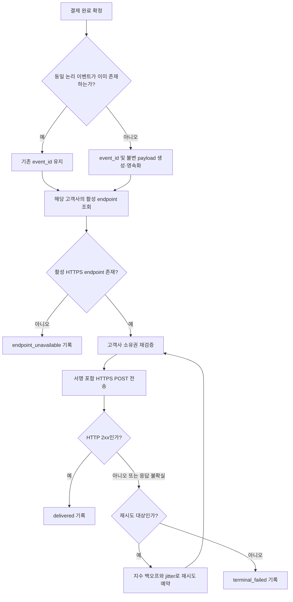

# 결제 완료 웹훅 전달 API PRD

## Applicability

| Contract | Required / N/A | Evidence |
|---|---|---|
| Pages/routes or screen IDs | N/A | 이번 범위에는 UI가 없으며 endpoint 등록은 기존 내부 API가 담당한다. |
| Empty/loading/error/success/recovery state matrix | N/A | 사용자 화면이 없는 서버 간 전달 기능이다. 전달 상태와 복구 동작은 기능 요구사항 및 수용 기준에서 정의한다. |
| Mermaid user or system flow | Required | 결제 완료 감지, 이벤트 생성, 비동기 전달, 성공 또는 백오프 재시도로 이어지는 다단계 시스템 수명주기가 존재한다. |

## Context and problem

결제가 완료되었을 때 해당 고객사가 등록한 HTTPS endpoint로 결제 완료 이벤트를 전달해야 한다.

외부 네트워크와 고객사 시스템은 일시적으로 실패할 수 있으므로 이벤트를 최소 1회 이상 전달하고, 재시도 시에도 고객사가 동일 이벤트를 식별하여 중복 처리를 방지할 수 있어야 한다. 또한 한 고객사의 endpoint나 결제 데이터가 다른 고객사의 전달 과정에 노출되지 않아야 한다.

서명 방식, secret rotation 정책, 처리량 및 지연 SLA는 아직 결정되거나 측정되지 않았다. 따라서 본 PRD는 근거 없는 보안 방식이나 성능 수치를 확정하지 않는다.

## Goals

- 결제 완료 이벤트를 올바른 고객사의 등록된 HTTPS endpoint로 전달한다.
- 각 논리 이벤트에 불변의 고유 `event_id`를 부여한다.
- 외부 네트워크 실패가 발생해도 지수 백오프로 자동 재시도한다.
- 재시도 또는 불확실한 응답으로 동일 이벤트가 중복 전달될 수 있음을 명시하고 고객사가 중복을 식별할 수 있게 한다.
- 고객사 간 endpoint, 이벤트, 결제 데이터 및 전달 기록을 격리한다.
- 운영자가 내부적으로 전달 성공률, 지연 및 재시도 상태를 측정할 수 있게 한다.

## Non-goals

- endpoint 등록·수정·삭제 API 신규 개발
- 고객사 또는 운영자용 UI
- replay 대시보드
- 수동 재전송 기능
- 이벤트의 정확히 1회 전달 보장
- 고객사 endpoint 내부에서의 비즈니스 처리 성공 보장
- 고객사별 이벤트 순서 보장
- 근거가 확보되지 않은 처리량·지연 SLA 설정
- 본 PRD에서 서명 알고리즘이나 secret rotation 주기 임의 결정

## Users, roles, and permissions

| 역할 | 권한 및 책임 |
|---|---|
| 결제 시스템 | 확정된 결제 완료 사실과 해당 결제의 고객사 소유 정보를 제공한다. |
| 웹훅 전달 서비스 | 고객사 소유권을 확인하여 이벤트를 생성·보관하고, 해당 고객사의 활성 endpoint에만 전달한다. |
| 고객사 수신 시스템 | HTTPS 요청을 수신하고 `event_id`를 기준으로 중복을 제거한 뒤 HTTP 상태로 수신 결과를 응답한다. |
| 내부 운영자 | 승인된 내부 운영 수단을 통해 전달 메트릭과 로그를 조회할 수 있다. 1차 출시에서는 수동 재전송할 수 없다. |
| 보안 담당자 | 서명 검증 방식, secret 저장·배포·폐기 및 rotation 정책을 확정한다. |

## Functional requirements

| ID | Requirement | Priority |
|---|---|---|
| FR-001 | 시스템은 권위 있는 결제 시스템에서 결제 상태가 완료로 확정된 경우에만 웹훅 이벤트를 생성해야 한다. | Must |
| FR-002 | 동일한 논리적 결제 완료가 내부적으로 중복 통지되어도 하나의 논리 웹훅 이벤트로 식별해야 하며, 동일한 `event_id`를 사용해야 한다. | Must |
| FR-003 | 각 이벤트에는 전체 시스템에서 고유하고 생성 후 변경되지 않는 `event_id`를 부여해야 한다. 모든 재시도는 같은 `event_id`를 사용해야 한다. | Must |
| FR-004 | 이벤트 payload는 최소한 `event_id`, `event_type`, `schema_version`, `occurred_at`, `data.payment_id`, `data.status`를 포함해야 한다. `event_type`은 `payment.completed`, `data.status`는 `completed`여야 한다. | Must |
| FR-005 | 시스템은 이벤트 생성 당시의 payload를 재시도 간 동일하게 유지해야 한다. 전달 시점의 재조회로 payload 의미가 달라져서는 안 된다. | Must |
| FR-006 | 시스템은 결제 소유 고객사와 동일한 고객사에 속한 활성 endpoint를 조회하여 HTTPS `POST` 요청으로 이벤트를 전달해야 한다. | Must |
| FR-007 | endpoint가 없거나 비활성 상태이면 다른 고객사의 endpoint로 대체 전달하지 않아야 하며, 해당 이벤트를 `endpoint_unavailable` 상태로 기록해야 한다. 이후 자동 전달 여부는 OD-04 결정에 따른다. | Must |
| FR-008 | 고객사 endpoint가 HTTP 2xx를 반환하면 해당 이벤트 전달을 성공으로 기록해야 한다. 응답 본문은 전달 성공 판단에 사용하지 않는다. | Must |
| FR-009 | 네트워크 연결 실패, DNS 실패 및 요청 timeout처럼 응답 성공 여부를 확정할 수 없는 실패에는 지수 백오프로 자동 재시도해야 한다. 백오프에는 동시 재시도 집중을 완화하는 jitter를 적용해야 한다. | Must |
| FR-010 | 성공 여부가 불확실한 요청도 재시도할 수 있으므로, 시스템은 고객사가 동일 이벤트를 여러 번 받을 수 있음을 API 계약에 명시해야 한다. | Must |
| FR-011 | 전달 시도마다 이벤트, 고객사, 시도 번호, 시각, 결과 분류, HTTP 상태 코드(있는 경우), 다음 재시도 예정 시각을 기록해야 한다. secret과 민감한 결제정보는 로그에 남기지 않아야 한다. | Must |
| FR-012 | 이벤트와 전달 상태는 프로세스 재시작이나 작업자 장애 후에도 유실되지 않고 미완료 작업을 재개할 수 있도록 영속적으로 관리해야 한다. | Must |
| FR-013 | 이벤트 조회, 작업 선택, endpoint 조회, 전달 기록 및 운영 조회의 모든 단계에서 고객사 소유권을 서버 측에서 검증해야 한다. | Must |
| FR-014 | 웹훅 payload에는 전달 목적에 필요한 최소 결제 식별자와 상태만 포함하며 카드번호, 인증정보 또는 결제수단 비밀값을 포함하지 않아야 한다. | Must |
| FR-015 | 서명 생성과 검증 계약은 OD-01이 확정된 후 적용해야 하며, 보안 담당자의 승인 없이 외부 고객사를 대상으로 운영 출시하지 않아야 한다. | Must |
| FR-016 | replay 대시보드 및 운영자·고객사의 수동 재전송 진입점을 제공하지 않아야 한다. 자동 재시도는 이에 해당하지 않는다. | Must |

## Pages and routes

N/A. 신규 UI, 페이지, 화면 ID 또는 사용자용 route가 없다.

## State matrix

N/A. 사용자 화면은 없다. 서버 측 이벤트 상태는 최소한 다음 의미를 구분해야 한다.

- `pending`: 최초 전달 대기
- `in_progress`: 현재 전달 시도 중
- `retry_scheduled`: 재시도 가능 실패 후 다음 시도 대기
- `delivered`: HTTP 2xx 수신
- `endpoint_unavailable`: 활성 endpoint 없음
- `terminal_failed`: 재시도 정책상 더 이상 자동 시도하지 않음

`terminal_failed`의 진입 조건은 OD-02와 OD-03이 확정된 후 정의한다.

## User or system flow

서명 방식이 확정되기 전에는 `I` 단계의 외부 운영 출시가 차단된다.

## Authorization and data boundaries

- 모든 이벤트는 생성 시점부터 단일 `customer_id`에 귀속되어야 한다.
- `customer_id`는 결제 소유권의 권위 있는 내부 데이터에서 결정해야 하며, 외부 요청 payload가 제공한 값을 신뢰해서는 안 된다.
- 전달 작업은 이벤트의 `customer_id`와 endpoint의 `customer_id`가 일치할 때만 실행할 수 있다.
- 저장소 조회와 갱신은 항상 `event_id` 단독이 아니라 고객사 범위를 포함해 수행해야 한다.
- 작업 큐 메시지나 작업자 입력이 조작되더라도 다른 고객사의 endpoint를 선택할 수 없어야 한다.
- 운영 로그와 메트릭의 상세 조회에도 내부 인증 및 승인된 권한 검사가 적용되어야 한다.
- 고객사 A의 endpoint, payload, 전달 상태, 응답 정보 또는 secret이 고객사 B에 노출되어서는 안 된다.
- endpoint 등록 API가 HTTPS 강제, endpoint 소유권 및 안전한 outbound 대상 검증을 수행한다는 가정은 출시 전 검증해야 한다.

## Non-functional requirements

### 신뢰성

- 최소 1회 전달 의미론을 적용한다. 이는 한 이벤트에 대해 중복 요청이 발생할 수 있음을 뜻한다.
- 이벤트 생성과 전달 예약 사이의 장애로 완료 이벤트가 조용히 유실되어서는 안 된다.
- 작업자 장애 후 `in_progress`에 고착된 이벤트를 다시 처리할 수 있어야 한다.
- 정확한 retry 횟수, 최대 기간 및 timeout은 측정·보안 검토 없이 임의 수치로 확정하지 않는다.

### 보안

- 모든 외부 전송은 HTTPS만 허용한다.
- 외부 출시 전 요청 서명, 검증 절차, secret 관리 및 rotation 정책에 대한 보안 승인이 필요하다.
- secret은 로그, payload 및 일반 오류 메시지에 노출되어서는 안 된다.
- endpoint가 내부망, loopback, link-local 또는 클라우드 메타데이터 주소로 요청을 우회하게 만드는 SSRF 위험을 통제해야 한다. 기존 등록 API와 전달 계층 중 어느 계층이 책임질지는 OD-05로 확정한다.

### 관측 가능성 및 성능 기준 수립

다음 지표를 계측하되, 1차 출시 PRD에서는 목표 수치를 지정하지 않는다.

| 지표 | 정의 | 책임자 | 결정 시점 |
|---|---|---|---|
| 최초 시도 지연 | 결제 완료 이벤트 생성 시각부터 첫 전달 시도 시작까지의 시간 분포 | 백엔드 책임자 | 통제된 초기 운영 데이터 확보 후 |
| 성공 전달 지연 | 이벤트 생성부터 최초 HTTP 2xx까지의 시간 분포 | 백엔드·제품 책임자 | 초기 운영 데이터와 고객 요구 검토 후 |
| 전달 성공률 | 생성 이벤트 중 HTTP 2xx를 받은 이벤트 비율 | 백엔드 책임자 | 재시도 정책 확정 및 초기 운영 후 |
| 재시도율 | 전체 이벤트 중 1회 이상 재시도한 이벤트 비율 | 백엔드 책임자 | 초기 운영 후 |
| 큐 적체 | 대기 및 재시도 예정 이벤트 수와 대기 시간 | 운영 책임자 | 부하 측정 후 |
| 실패 분포 | 네트워크, timeout, HTTP 상태, endpoint 부재 등 결과 분류별 수량 | 백엔드·운영 책임자 | 초기 운영 후 |

알림 임계치와 SLA/SLO는 위 지표의 기준선이 확보된 뒤 별도 승인한다.

## Acceptance criteria

| ID | Requirement | Given | When | Then | Verification |
|---|---|---|---|---|---|
| AC-001 | FR-001 | 결제가 완료되지 않은 상태이다. | 결제 상태 이벤트가 입력된다. | 외부 웹훅 이벤트와 전달 작업이 생성되지 않는다. | 통합 테스트 |
| AC-002 | FR-002, FR-003 | 동일한 논리적 결제 완료 통지가 두 번 입력된다. | 이벤트 생성 처리가 각각 실행된다. | 논리 이벤트는 하나로 식별되고 모든 전달에서 동일한 `event_id`가 사용된다. | 중복 입력 통합 테스트 |
| AC-003 | FR-004, FR-005 | 결제 완료 이벤트가 생성되어 있다. | 최초 요청과 재시도 요청을 캡처한다. | 필수 필드가 존재하고 두 요청의 payload가 동일하다. | 계약 및 통합 테스트 |
| AC-004 | FR-006, FR-013 | 고객사 A와 B가 서로 다른 endpoint를 보유한다. | 고객사 A의 결제가 완료된다. | 요청은 A의 활성 HTTPS endpoint에만 전송되고 B에는 전송되지 않는다. | 테넌시 통합 테스트 |
| AC-005 | FR-007 | 이벤트 소유 고객사에 활성 endpoint가 없다. | 전달 작업이 실행된다. | 외부 요청 없이 `endpoint_unavailable`로 기록되고 다른 endpoint를 사용하지 않는다. | 통합 테스트 |
| AC-006 | FR-008 | 고객사 endpoint가 HTTP 2xx와 임의 응답 본문을 반환한다. | 요청이 전송된다. | 전달은 성공으로 기록되고 자동 재시도되지 않는다. | 통합 테스트 |
| AC-007 | FR-009, FR-010 | endpoint 요청에서 네트워크 실패 또는 timeout이 발생한다. | 전달 작업이 실행된다. | 동일한 `event_id`로 다음 시도가 지수 증가 간격과 jitter를 적용해 예약된다. | 가상 시계 기반 재시도 테스트 |
| AC-008 | FR-011 | 성공, HTTP 오류 및 네트워크 실패 시도가 각각 존재한다. | 전달 기록을 조회한다. | 필수 시도 정보와 결과 분류가 남고 secret 및 금지된 민감정보는 없다. | 통합 테스트 및 로그 검사 |
| AC-009 | FR-012 | 이벤트가 영속화된 뒤 전달 작업자가 중단된다. | 작업자가 재시작된다. | 미완료 이벤트가 유실되지 않고 재개된다. | 장애 주입 테스트 |
| AC-010 | FR-013 | 고객사 A의 이벤트와 고객사 B의 endpoint 식별자가 잘못 조합된다. | 전달을 시도한다. | 서버가 요청을 차단하고 테넌시 위반을 보안 로그에 기록한다. | 부정 권한 테스트 |
| AC-011 | FR-014 | 결제 완료 payload가 생성된다. | payload와 로그를 검사한다. | 카드번호, 인증정보, secret 등 금지된 정보가 포함되지 않는다. | 스키마 테스트 및 보안 검사 |
| AC-012 | FR-015 | 서명 및 rotation 결정이나 보안 승인이 완료되지 않았다. | 외부 운영 출시 승인을 요청한다. | 출시가 차단된다. | 출시 체크리스트 검토 |
| AC-013 | FR-016 | 1차 출시 빌드를 검토한다. | 공개·내부 기능 목록과 접근 경로를 검사한다. | replay 대시보드와 수동 재전송 기능이 존재하지 않고 자동 재시도만 제공된다. | 기능 및 접근 경로 검사 |

추가로, OD-01부터 OD-05까지 결정된 후 해당 결정에 대응하는 계약 테스트와 보안 테스트를 출시 필수 테스트에 포함해야 한다.

## Assumptions and open decisions

### 합리적 가정

| ID | 가정 | 영향 및 검증 방법 |
|---|---|---|
| AS-01 | 결제 시스템은 결제 완료 여부, 안정적인 결제 식별자, 고객사 소유 정보를 제공하는 권위 있는 원천이다. | 제공되지 않으면 FR-001, FR-002, FR-013을 구현할 수 없다. 연동 계약으로 확인한다. |
| AS-02 | 1차 출시에서는 고객사당 하나의 활성 결제 완료 webhook endpoint를 사용한다. | 복수 endpoint fan-out이 필요하면 이벤트별 전달 상태 모델이 달라진다. 기존 endpoint API 계약으로 확인한다. |
| AS-03 | 고객사는 `event_id`를 저장하고 중복 요청을 멱등하게 처리할 책임이 있다. | 고객사 연동 문서와 예제에 최소 1회 전달 의미론을 명시한다. |
| AS-04 | 이벤트 간 순서 보장은 제공하지 않는다. | 순서가 필요한 고객 요구가 발견되면 별도 요구사항과 장애 복구 정책이 필요하다. |
| AS-05 | payload의 결제 식별자는 해당 고객사 범위에서 의미가 있으며, 상세 결제 데이터는 기존 권한 있는 API로 조회할 수 있다. | 상세 데이터가 웹훅에 필수라면 schema 및 개인정보 검토가 추가되어야 한다. |
| AS-06 | 기존 endpoint 등록 API가 최소한 HTTPS URL과 고객사 소유권을 검증한다. | 출시 전 통합 테스트로 검증하며, 충족하지 않으면 해당 API 보완이 선행 조건이다. |

### 열린 결정

| ID | 결정 사항 | 선택이 미치는 영향 | 책임자 | 결정 시점 |
|---|---|---|---|---|
| OD-01 | 요청 서명 알고리즘, 서명 대상, timestamp/replay 방어, 헤더 형식 | 고객사 구현 계약, payload 불변성, secret 저장 방식, 테스트 벡터 | 보안 담당자 | 외부 연동 계약 확정 전; 운영 출시 차단 조건 |
| OD-02 | secret 발급·전달·보관·rotation 주기와 이전/신규 secret 중첩 허용 기간 | 무중단 rotation, secret 버전 모델, 고객사 운영 절차 | 보안 담당자 | 구현 완료 및 운영 출시 전 |
| OD-03 | HTTP 408, 429, 4xx, 5xx별 재시도 여부와 `Retry-After` 처리 | 재시도 분류, 고객사 장애 복구, 불필요한 트래픽 | 백엔드·제품 책임자 | 재시도 로직 계약 테스트 작성 전 |
| OD-04 | 최대 재시도 횟수 또는 기간, timeout, 최소·최대 백오프, 이벤트 보관 기간, endpoint 부재 후 자동 재개 여부 | 영속 상태, 비용, 데이터 보존, `terminal_failed` 조건 | 백엔드·운영·제품 책임자 | 운영 설정 및 부하 검증 전 |
| OD-05 | SSRF 방어의 책임 계층과 허용·차단 대상 정책 | endpoint 등록 검증, DNS 재해석 대응, 네트워크 egress 구성 | 보안·플랫폼 책임자 | 외부 endpoint 호출 활성화 전 |
| OD-06 | 고객사당 복수 활성 endpoint 지원 여부 | 이벤트 fan-out, endpoint별 delivery ID 및 성공 상태 필요 여부 | 제품 책임자 | AS-02 검증 시; 1차 범위 확정 전 |
| OD-07 | SLA/SLO 및 용량 목표 | 인프라 크기, 알림 임계치, 출시 용량 기준 | 제품·백엔드·운영 책임자 | 초기 계측과 부하 측정 데이터 확보 후 |

OD-01부터 OD-05까지는 구현 또는 운영 안전성에 직접 영향을 주므로 출시 전 결정이 필요하다. OD-07은 근거가 확보될 때까지 열린 상태로 두며 임의 수치를 출시 기준으로 사용하지 않는다.

## Risks and mitigations

| 위험 | 영향 | 완화 |
|---|---|---|
| 성공 응답 직후 작업자 장애로 동일 이벤트 재전송 | 고객사의 중복 비즈니스 처리 | 불변 `event_id`, 최소 1회 의미론 문서화, 고객사 멱등 처리 가이드 |
| 재시도 정책 미확정 | 이벤트의 조기 포기 또는 과도한 재시도 | OD-03/OD-04를 테스트 작성과 운영 출시의 선행 결정으로 관리 |
| 서명 및 rotation 미확정 | 위조 요청, secret 교체 중 전달 중단 | 보안 승인 전 외부 출시 차단, 확정 후 테스트 벡터 제공 |
| 테넌시 조건 누락 | 다른 고객사로 데이터 유출 | 모든 저장·큐·조회·전송 단계의 소유권 검증 및 부정 테스트 |
| 악성 또는 변경된 endpoint | SSRF, 내부 서비스 접근 | HTTPS 강제, OD-05에 따른 URL·DNS·egress 통제 |
| endpoint 장기 장애로 큐 적체 | 저장 비용과 정상 이벤트 지연 | 고객사별 격리된 재시도 제어, jitter, 큐 지표 계측, OD-04 확정 |
| 수동 재전송 부재 | 자동 재시도 종료 후 즉시 복구하기 어려움 | 실패 이벤트를 식별 가능하게 보존하고 1차 출시 운영 절차를 정의하되 수동 실행 기능은 제공하지 않음 |
| 측정되지 않은 처리량과 지연 | 용량 부족 또는 잘못된 SLA 약속 | 출시 전 계측 검증과 부하 측정 수행, 데이터 확보 후 목표 승인 |

## Delivery

| Phase | Requirement IDs | Verifiable exit condition |
|---|---|---|
| 0. 계약 및 보안 결정 | FR-004, FR-009, FR-014, FR-015 | payload schema와 OD-01~OD-05가 책임자 승인을 받고 계약·보안 테스트 항목이 확정된다. |
| 1. 이벤트 생성 및 테넌시 기반 영속화 | FR-001, FR-002, FR-003, FR-005, FR-012, FR-013 | 중복 입력, 프로세스 장애, 고객사 교차 접근 테스트가 모두 통과한다. |
| 2. 자동 전달 및 재시도 | FR-006, FR-007, FR-008, FR-009, FR-010 | HTTPS 전달, 2xx 성공, endpoint 부재, 네트워크 실패 및 지수 백오프 테스트가 통과한다. |
| 3. 운영 안전성 및 범위 검증 | FR-011, FR-014, FR-015, FR-016 | 로그 민감정보 검사, 서명·rotation·SSRF 보안 검증, 관측 지표 검증, 제외 기능 부재 확인이 완료된다. |
| 4. 통제된 1차 출시 | FR-001~FR-016 | 모든 AC가 통과하고 보안 담당자가 외부 출시를 승인한다. SLA 수치는 선언하지 않으며 실제 지표 수집이 시작된다. |