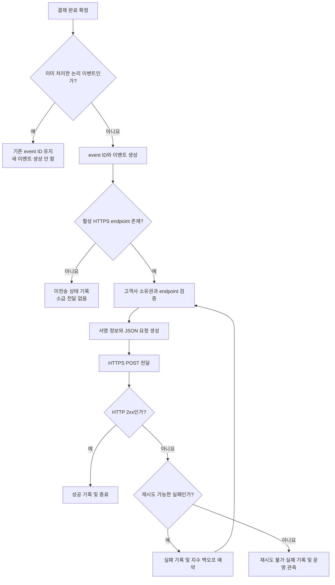

# 결제 완료 웹훅 전달 API PRD

## Applicability

| Contract | Required / N/A | Evidence |
|---|---|---|
| Pages/routes or screen IDs | N/A | 이번 범위에는 UI가 없으며 endpoint 등록은 기존 내부 API가 담당한다. |
| Empty/loading/error/success/recovery state matrix | N/A | 사용자 화면이 없다. 전달 상태와 복구 동작은 기능 요구사항 및 시스템 흐름으로 정의한다. |
| Mermaid user or system flow | Required | 결제 완료 감지, 이벤트 생성, 고객사별 endpoint 조회, 전달, 재시도의 다단계 시스템 수명주기가 존재한다. |

## Context and problem

결제가 완료되면 해당 고객사가 등록한 HTTPS endpoint로 결제 완료 이벤트를 전달해야 한다.

외부 네트워크와 고객사 시스템은 일시적으로 실패할 수 있으므로 전달 과정은 재시도를 지원해야 한다. 또한 최소 1회 전달 방식에서는 동일 이벤트가 중복 전달될 수 있으므로, 고객사가 중복 여부를 판별할 수 있는 안정적인 event ID가 필요하다.

서명 검증 방식과 secret rotation 정책은 보안 담당자가 아직 결정하지 않았다. 따라서 해당 정책을 임의로 확정하지 않되, 구현과 출시 전에 반드시 결정되어야 하는 보안 의존사항으로 관리한다.

## Goals

- 결제 완료 이벤트를 해당 고객사의 등록된 HTTPS endpoint로 전달한다.
- 전달 대상 이벤트마다 전역적으로 고유하고 재시도 간 변하지 않는 event ID를 제공한다.
- 네트워크 및 일시적 수신 오류에 지수 백오프 재시도를 적용한다.
- 프로세스 재시작이나 일시적 장애 이후에도 전달 대상 이벤트와 재시도 상태를 잃지 않는다.
- 고객사 간 endpoint, secret, payload 및 전달 이력을 격리한다.
- 운영자가 고객사별 전달 성공·실패 상태를 추적할 수 있게 한다.
- 처리량과 전달 지연을 측정할 수 있는 계측 기반을 마련한다.

## Non-goals

- endpoint 등록·수정·삭제 API 신규 개발
- endpoint 관리 UI
- replay 대시보드
- 운영자 또는 고객사의 수동 재전송
- 고객사가 중복 이벤트를 자동으로 제거하도록 보장하는 기능
- 이벤트 간 도착 순서 보장
- 결제 완료 이외 이벤트 지원
- 근거가 확보되지 않은 처리량 또는 전달 지연 SLA 설정

## Users, roles, and permissions

| 역할 | 권한 및 책임 |
|---|---|
| 결제 시스템 | 확정된 결제 완료 사실과 해당 고객사 식별자를 제공한다. |
| 웹훅 전달 시스템 | 이벤트 생성, 대상 조회, 전송, 재시도 및 결과 기록을 수행한다. |
| endpoint 등록 내부 API | 고객사에 귀속된 활성 HTTPS endpoint와 보안 설정을 관리한다. 구현은 범위 밖이다. |
| 고객사 수신 시스템 | 이벤트를 수신하고 event ID를 기준으로 중복을 처리한다. |
| 내부 운영자 | 권한이 있는 고객사의 전달 상태와 오류를 조회할 수 있다. 수동 재전송 권한은 제공하지 않는다. |
| 보안 담당자 | 서명 검증 방식과 secret rotation 정책을 결정하고 출시를 승인한다. |

## 이벤트 계약

초기 이벤트 envelope은 다음 필드를 포함한다.

```json
{
  "event_id": "globally-unique-stable-id",
  "event_type": "payment.completed",
  "occurred_at": "RFC3339 timestamp",
  "api_version": "version identifier",
  "data": {
    "payment_id": "customer-visible-payment-id",
    "status": "completed"
  }
}
```

- `event_id`는 동일한 논리적 결제 완료 이벤트의 최초 전달과 모든 재시도에서 동일해야 한다.
- `event_id`는 고객사 범위를 넘어 전역적으로 고유해야 한다.
- `occurred_at`은 전달 시각이 아니라 결제가 완료된 시각이다.
- `data`에는 해당 고객사 소유의 결제 데이터만 포함한다.
- 금액, 통화, 주문 식별자 등 추가 필드는 기존 결제 도메인 계약과 데이터 분류 검토를 거쳐 별도로 확정한다.
- 고객사는 `event_id`를 저장하여 이미 처리한 이벤트를 다시 처리하지 않아야 한다.

## Functional requirements

| ID | Requirement | Priority |
|---|---|---|
| FR-01 | 시스템은 결제 시스템이 확정한 결제 완료 전이를 입력으로 받아 `payment.completed` 이벤트를 생성해야 한다. | Must |
| FR-02 | 동일한 논리적 결제 완료 전이가 중복 입력되더라도 새로운 event ID를 반복 생성해서는 안 된다. | Must |
| FR-03 | 각 이벤트에는 전역적으로 고유한 event ID가 있어야 하며, 모든 재시도에서 동일한 값을 사용해야 한다. | Must |
| FR-04 | 이벤트 payload는 정의된 envelope과 해당 고객사에 귀속된 결제 데이터만 포함해야 한다. | Must |
| FR-05 | 이벤트는 결제 완료 시점에 활성 상태로 등록된 고객사의 HTTPS endpoint를 대상으로 전달해야 한다. | Must |
| FR-06 | 시스템은 JSON payload를 HTTPS POST로 전송해야 하며 유효하지 않은 인증서나 HTTP endpoint로 전송해서는 안 된다. | Must |
| FR-07 | 고객사 endpoint의 HTTP 2xx 응답만 전달 성공으로 처리해야 한다. | Must |
| FR-08 | 네트워크 연결 실패, DNS 실패, TLS 실패, timeout 및 재시도 가능 HTTP 응답에는 지수 백오프를 적용해야 한다. | Must |
| FR-09 | 재시도에는 동시 재시도 집중을 완화할 수 있도록 jitter를 적용하고, 증가 간격에는 설정 가능한 상한을 두어야 한다. | Must |
| FR-10 | 성공 응답을 받기 전 프로세스가 종료되더라도 이벤트와 다음 재시도 상태를 잃지 않아야 한다. | Must |
| FR-11 | 성공 응답이 기록된 이벤트에는 자동 재시도를 더 수행하지 않아야 한다. 단, 성공 응답 기록 전후의 장애 경합으로 중복 전달될 수 있다. | Must |
| FR-12 | 시스템은 고객사 식별자를 신뢰할 수 없는 payload 입력에서 가져오지 않고, 결제 데이터의 소유 관계로부터 전달 대상을 결정해야 한다. | Must |
| FR-13 | endpoint, secret, 이벤트 payload 및 전달 결과에 대한 모든 접근은 고객사 범위로 제한해야 한다. | Must |
| FR-14 | 활성 endpoint가 없는 시점에 발생한 이벤트는 전송하지 않으며, endpoint가 나중에 등록되어도 자동 소급 전달하지 않는다. | Must |
| FR-15 | 각 전달 시도에 event ID, 고객사 식별자, 시도 번호, 결과 분류, HTTP 상태 코드와 다음 재시도 예정 시각을 기록해야 한다. | Must |
| FR-16 | 로그와 관측 데이터에 secret, 서명 원문 또는 불필요한 결제 개인정보를 남겨서는 안 된다. | Must |
| FR-17 | 보안 담당자가 확정한 방식에 따라 고객사가 요청의 출처와 무결성을 검증할 수 있는 서명 정보를 포함해야 한다. | Must |
| FR-18 | 운영 경로는 전달 상태를 관찰할 수 있어야 하지만, 1차 출시에서는 이벤트를 수동 재전송하는 명령을 제공해서는 안 된다. | Must |

## 재시도 분류

다음 정책을 1차 구현 가정으로 사용한다.

| 결과 | 처리 |
|---|---|
| HTTP 2xx | 성공 처리, 추가 재시도 중단 |
| 네트워크·DNS·TLS·timeout 실패 | 지수 백오프 재시도 |
| HTTP 408, 429 | 지수 백오프 재시도 |
| HTTP 5xx | 지수 백오프 재시도 |
| 408·429를 제외한 HTTP 4xx | 재시도 불가 실패로 기록 |
| 그 밖의 분류되지 않은 실패 | 재시도 가능 상태로 안전하게 분류하고 운영 경고 발생 |

재시도 가능 오류는 자동 폐기하지 않는 것을 1차 가정으로 한다. 실제 백오프 시작 간격, 최대 간격, jitter 방식, 요청 timeout 및 장기 실패 이벤트 처리 정책은 출시 전 확정해야 한다.

고객사 endpoint가 영구적으로 응답하지 않거나 재시도 불가 응답을 반환하는 경우 실제 수신까지 보장할 수는 없다. 이 PRD의 “최소 1회”는 전달 대상으로 수락된 이벤트를 내구적으로 처리하고, 성공 전까지 재시도 가능 실패를 자동 재처리하며, 그 과정에서 중복 전달이 허용되는 의미다.

## User or system flow



## Authorization and data boundaries

- 모든 이벤트에는 불변의 고객사 소유자 식별자가 내부 메타데이터로 연결되어야 한다.
- 전달 대상 endpoint는 이벤트에 연결된 고객사와 동일한 고객사 소유의 활성 endpoint만 사용할 수 있다.
- 고객사 식별자를 클라이언트가 제공하는 URL, 요청 payload 또는 임의 헤더만으로 결정해서는 안 된다.
- 한 고객사의 작업자가 다른 고객사의 endpoint나 secret을 조회하거나 사용하지 못하도록 서버 측에서 소유권을 검증해야 한다.
- 저장소 조회, 작업 큐 소비, 재시도 조회 및 운영 조회 모두 고객사 범위 조건을 적용해야 한다.
- 고객사 A의 이벤트가 고객사 B의 endpoint로 전달되는 경우는 출시 차단 수준의 보안 결함으로 취급한다.
- secret은 평문 로그에 남기지 않고, 접근 가능한 서비스와 운영자 권한을 최소화한다.
- 서명 생성 시 사용할 secret 버전과 rotation 중 구·신 secret의 유효 범위는 보안 정책 확정 후 적용한다.

## Non-functional requirements

| ID | Requirement |
|---|---|
| NFR-01 | 전달 대상 이벤트와 재시도 상태는 프로세스 재시작 및 일시적 서비스 장애 후에도 복구 가능해야 한다. |
| NFR-02 | 시스템은 이벤트 생성부터 첫 전달 시도까지의 지연, 전달 성공까지의 지연, 시도 횟수, 성공률 및 오류 분류를 측정해야 한다. |
| NFR-03 | 처리량, backlog 깊이, 가장 오래 대기 중인 이벤트의 경과 시간 및 고객사별 오류율을 관측할 수 있어야 한다. |
| NFR-04 | 처리량 및 지연 목표치는 실제 계측 결과 없이 설정하지 않는다. 출시 초기 데이터를 수집한 뒤 제품·플랫폼 담당자가 목표치를 제안한다. |
| NFR-05 | 서로 다른 이벤트의 병렬 처리는 허용하되, 동일 이벤트에 대한 의도하지 않은 동시 전달 시도는 방지해야 한다. |
| NFR-06 | 웹훅 전달이 지연되거나 실패하더라도 이미 완료된 결제 자체를 실패 또는 미완료 상태로 되돌려서는 안 된다. |
| NFR-07 | 전송 payload와 운영 로그는 기존 결제 데이터 보존 및 접근 정책을 따라야 한다. 별도 보존 기간은 이 PRD에서 임의로 만들지 않는다. |

## Acceptance criteria

| ID | Requirement | Given | When | Then | Verification |
|---|---|---|---|---|---|
| AC-01 | FR-01, FR-03, FR-04 | 고객사 소유의 결제가 완료되고 활성 endpoint가 있다 | 완료 이벤트가 처리된다 | 고유 event ID와 정의된 envelope을 가진 `payment.completed` 요청이 해당 endpoint로 전송된다 | 통합 테스트 |
| AC-02 | FR-02, FR-03 | 동일한 결제 완료 전이가 두 번 입력된다 | 두 입력이 처리된다 | 논리 이벤트는 하나만 존재하고 event ID가 추가 생성되지 않는다 | 중복 입력 통합 테스트 |
| AC-03 | FR-05, FR-06, FR-12 | 고객사 A와 B가 서로 다른 endpoint를 등록했다 | 고객사 A 결제가 완료된다 | 요청은 A의 유효한 HTTPS endpoint에만 전송된다 | 다중 고객사 통합 테스트 |
| AC-04 | FR-07, FR-11 | endpoint가 HTTP 2xx를 반환한다 | 전달 시도가 완료된다 | 성공으로 기록되고 추가 시도가 예약되지 않는다 | 통합 테스트 |
| AC-05 | FR-08, FR-09 | endpoint 연결이 연속으로 실패한다 | 재시도 스케줄이 계산된다 | 각 시도 간격은 설정된 지수 백오프·jitter·상한 정책을 따르고 event ID는 유지된다 | 결정론적 스케줄 단위 테스트 |
| AC-06 | FR-08 | endpoint가 408, 429 또는 5xx를 반환한다 | 응답이 처리된다 | 실패가 재시도 가능으로 기록되고 다음 시도가 예약된다 | 응답 코드별 통합 테스트 |
| AC-07 | FR-07 | endpoint가 408·429 이외의 4xx를 반환한다 | 응답이 처리된다 | 재시도 불가 실패로 기록되고 자동 재시도가 예약되지 않는다 | 응답 코드별 통합 테스트 |
| AC-08 | FR-10 | 이벤트 저장 후 성공 응답 기록 전에 전달 프로세스가 종료된다 | 프로세스가 복구된다 | 이벤트가 유실되지 않고 기존 event ID로 전달 처리가 계속된다 | 장애 주입 테스트 |
| AC-09 | FR-11 | 고객사가 요청을 처리했지만 시스템이 성공 응답을 기록하지 못했다 | 이벤트가 재시도된다 | 동일 event ID로 다시 전달되며 서로 다른 ID의 새 이벤트는 생성되지 않는다 | 장애 경합 테스트 |
| AC-10 | FR-13 | 고객사 A 권한 또는 작업 문맥으로 B의 endpoint·secret·이력을 조회한다 | 서버가 요청을 처리한다 | 접근이 거부되고 B의 데이터가 응답이나 로그에 노출되지 않는다 | 권한 및 격리 테스트 |
| AC-11 | FR-14 | 결제 완료 시 활성 endpoint가 없다 | 이후 endpoint가 등록된다 | 과거 이벤트가 자동 전송되지 않는다 | 통합 테스트 |
| AC-12 | FR-15, FR-16 | 성공 및 실패 전달이 각각 발생한다 | 운영 기록을 조회한다 | 필수 상태 정보는 존재하고 secret 및 금지된 민감정보는 존재하지 않는다 | 로그·관측 데이터 검사 |
| AC-13 | FR-17 | 보안 정책과 secret이 설정되어 있다 | 웹훅 요청이 생성된다 | 확정된 서명 계약에 따른 검증 정보가 포함되고 고객사 검증 테스트를 통과한다 | 보안 계약 테스트 |
| AC-14 | FR-18 | 1차 출시 운영 인터페이스를 검사한다 | 이벤트 실패 이력을 조회한다 | 상태 관측은 가능하지만 수동 재전송 동작은 노출되지 않는다 | API·권한 검토 |
| AC-15 | NFR-02, NFR-03 | 정상·지연·실패 이벤트가 발생한다 | 관측 지표를 조회한다 | 첫 시도 지연, 성공 지연, 시도 수, 오류 분류 및 backlog를 측정할 수 있다 | 계측 검증 |
| AC-16 | NFR-06 | 웹훅 endpoint가 지속적으로 실패한다 | 결제 및 전달 상태를 조회한다 | 결제는 완료 상태를 유지하고 웹훅 전달 상태만 실패 또는 재시도 중으로 표시된다 | 장애 통합 테스트 |

## Assumptions and open decisions

### 합리적 가정

| ID | 가정 | 영향 |
|---|---|---|
| A-01 | 결제 시스템에는 동일한 논리적 결제 완료 전이를 식별하거나 중복 제거할 수 있는 안정적인 식별자가 있다. | event ID 중복 생성을 방지하는 기준으로 사용한다. 없다면 상위 시스템 계약 변경이 필요하다. |
| A-02 | 각 고객사에는 1개의 활성 웹훅 endpoint가 존재한다. | 복수 endpoint fan-out은 1차 범위에 포함하지 않는다. |
| A-03 | 최초 전달 시도는 결제 처리 트랜잭션을 직접 대기시키지 않는 비동기 흐름이다. | 고객사 장애가 결제 완료 결과에 영향을 주지 않는다. |
| A-04 | HTTP 2xx 전체를 성공으로 간주한다. | 특정 2xx 코드만 허용하지 않는다. |
| A-05 | 408, 429, 5xx 및 네트워크 계층 실패는 재시도 가능하며, 그 밖의 4xx는 재시도 불가다. | 응답 분류 구현과 테스트 기준이 된다. |
| A-06 | 재시도 가능한 이벤트는 자동 폐기하지 않는다. | 장기 실패 backlog 운영 정책이 필요하며, 정책 변경 시 최소 1회 의미를 재검토해야 한다. |
| A-07 | endpoint가 없는 상태에서 발생한 이벤트는 나중에 소급 전달하지 않는다. | replay 및 수동 재전송 제외 범위와 일치한다. |
| A-08 | endpoint 변경 후의 미완료 재시도는 시도 시점의 최신 활성 endpoint를 사용한다. | endpoint 변경 전후로 서로 다른 주소에서 동일 event ID를 받을 수 있다. 고객사 안내가 필요하다. |

### 열린 결정

| ID | 결정 필요 항목 | 담당 | 결정 시점 / 차단 조건 |
|---|---|---|---|
| OD-01 | 서명 알고리즘, canonical payload 규칙, 헤더 이름, timestamp·nonce 포함 여부 및 허용 시간 편차 | 보안 담당자 | 외부 고객사 연동 테스트 시작 전. 미결정 시 출시 불가 |
| OD-02 | secret rotation 주기, 구·신 secret 동시 유효 기간, 장기 재시도 이벤트가 사용할 secret 버전 | 보안 담당자 | 운영 환경 배포 전. 미결정 시 출시 불가 |
| OD-03 | 백오프 시작 간격, 최대 간격, jitter 방식, HTTP 요청 timeout | 플랫폼 담당자 | 성능·장애 테스트 시작 전 |
| OD-04 | `Retry-After` 응답 헤더를 백오프보다 우선할지 여부 | 플랫폼/API 담당자 | 재시도 계약 확정 전 |
| OD-05 | 장기 실패 이벤트 보존 기간과 자동 폐기 또는 격리 정책 | 제품·플랫폼·보안 담당자 | 운영 환경 배포 전. 자동 폐기를 선택하면 전달 보장 문구 수정 필요 |
| OD-06 | 금액, 통화, 주문 ID 등 payload 추가 필드와 각 필드의 데이터 분류 | 결제 도메인·보안 담당자 | 고객사 계약 공개 전 |
| OD-07 | 실제 처리량과 지연 목표 | 제품·플랫폼 담당자 | 초기 운영 계측 데이터 확보 후 결정. 1차 출시 전 임의 수치 설정 금지 |
| OD-08 | 복수 endpoint 및 이벤트별 구독 지원 여부 | 제품 담당자 | 1차 출시 이후 검토 |

## Risks and mitigations

| Risk | 영향 | Mitigation |
|---|---|---|
| 고객사가 event ID 중복 제거를 구현하지 않음 | 주문 처리, 적립 또는 후속 작업이 중복 실행될 수 있다 | 연동 계약에 최소 1회 및 event ID 저장 요구를 명시하고 중복 전달 테스트 사례를 제공한다. |
| 고객사 장애가 장기간 지속됨 | backlog와 저장 비용이 계속 증가한다 | backlog 연령과 크기를 계측하고 OD-05 정책을 출시 전에 확정한다. |
| 잘못된 고객사 매핑 | 결제 정보가 다른 고객사로 유출된다 | 서버 측 소유권 검증, 다중 고객사 격리 테스트 및 출시 차단 보안 테스트를 적용한다. |
| 서명 정책 결정 지연 | 고객사가 요청 출처를 안전하게 검증할 수 없다 | OD-01과 OD-02를 출시 차단 조건으로 관리하고 서명 계층을 교체 가능한 계약 경계로 분리한다. |
| 성공 응답 기록 경합 | 동일 이벤트가 중복 전달된다 | event ID를 유지하고 고객사에 멱등 처리를 요구한다. 시스템이 exactly-once를 주장하지 않는다. |
| 재시도 집중 | 장애 복구 직후 고객사 또는 전달 시스템에 트래픽이 몰린다 | 지수 백오프, jitter 및 최대 간격을 적용하고 backlog를 관측한다. |
| 근거 없는 SLA 설정 | 달성 가능성 판단과 용량 계획이 왜곡된다 | 지연·처리량을 먼저 계측하고 실제 데이터가 확보된 뒤 목표를 정한다. |

## Delivery

| Phase | Requirement IDs | Verifiable exit condition |
|---|---|---|
| 0. 계약 확정 | FR-04, FR-06, FR-17 | 이벤트 schema, 오류 분류, 서명 방식, rotation 정책 및 백오프 설정이 담당자에게 승인된다. OD-01과 OD-02가 미결정이면 외부 출시로 진행하지 않는다. |
| 1. 핵심 전달 구현 | FR-01~FR-12, FR-14 | 결제 완료 이벤트 생성, 안정적인 event ID, HTTPS 전달, 성공 판정, 내구성 있는 재시도와 장애 복구가 AC-01~AC-09 및 AC-11을 통과한다. |
| 2. 격리·보안·운영성 | FR-13, FR-15~FR-18, NFR-01~NFR-07 | 고객사 격리, 서명 검증, 민감정보 비노출 및 관측성 검증이 AC-10, AC-12~AC-16을 통과한다. |
| 3. 제한 출시 및 기준선 측정 | NFR-02~NFR-04 | 처리량, backlog 및 지연 지표가 실제 환경에서 수집된다. 수치 SLA는 선언하지 않으며 측정 결과와 후속 목표 결정 담당자가 기록된다. |
| 4. 1차 정식 출시 | 전체 Must 요구사항 | 모든 Must 수용 기준과 보안 출시 조건을 통과하고, replay 대시보드 및 수동 재전송 기능이 노출되지 않은 것이 확인된다. |