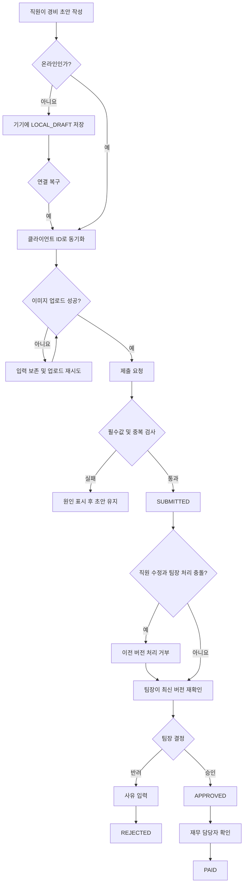

# 모바일 경비 승인 PRD

## Applicability

| Contract | Required / N/A | Evidence |
|---|---|---|
| Pages/routes or screen IDs | Required | 직원 제출, 팀장 승인, 재무 지급 등 역할별 모바일 화면이 필요하다. |
| Empty/loading/error/success/recovery state matrix | Required | 오프라인 동기화, 이미지 업로드 실패, 권한 변경 및 동시 수정 복구 상태를 정의해야 한다. |
| Mermaid user or system flow | Required | 초안부터 제출·승인·지급까지 여러 역할과 상태 전이가 존재한다. |

## Context and problem

직원이 모바일에서 경비 증빙을 제출하고, 팀장과 재무 담당자가 순차적으로 처리할 수 있어야 한다. 현재 브리프에서 요구하는 핵심은 단순 승인 화면뿐 아니라 불안정한 네트워크, 중복 제출, 업로드 실패, 처리 도중 권한이나 데이터가 변경되는 상황에서도 요청의 무결성을 보장하는 것이다.

## Goals

- 직원이 영수증 사진, 금액, 카테고리를 입력해 경비를 제출할 수 있다.
- 오프라인에서도 초안을 작성하고 연결 복구 후 안전하게 동기화할 수 있다.
- 팀장은 자신이 관리하는 팀의 요청만 승인하거나 반려할 수 있다.
- 재무 담당자는 승인된 요청만 지급 완료 처리할 수 있다.
- 중복 요청, 업로드 실패, 권한 변경 및 동시 수정으로 인한 잘못된 처리를 방지한다.
- 모든 중요 상태 변경을 추적할 수 있다.
- 핵심 사용자 흐름이 WCAG 2.2 AA를 충족한다.

## Non-goals

1차 출시 범위에서 다음은 제외한다.

- 다중 통화 및 환율 계산
- ERP·회계 시스템 자동 연동
- 부분 승인 또는 부분 지급
- 여러 단계의 결재선
- 대리 승인 및 승인 위임
- 영수증 OCR 자동 입력
- 지급 완료 취소 또는 회계 정정 자동화
- 경비 정책 위반 자동 판정
- 성능 목표 수치의 사전 확정

## Users, roles, and permissions

| 역할 | 허용 작업 | 제한 |
|---|---|---|
| 직원 | 자기 초안 생성·수정·삭제, 영수증 업로드, 제출, 자기 요청 조회 | 다른 직원 요청 조회 불가, 제출 후 직접 상태 변경 불가 |
| 팀장 | 담당 팀의 제출 요청 조회, 승인, 반려 | 담당하지 않는 팀의 요청 조회·처리 불가 |
| 재무 담당자 | 승인된 요청 조회, 지급 완료 처리 | 미승인·반려 요청 지급 처리 불가 |
| 복수 역할 사용자 | 부여된 역할별 기능 사용 | 각 작업 시 해당 권한을 서버에서 독립적으로 검증 |

UI에서 버튼이나 메뉴를 숨기는 것만으로 권한을 보장하지 않는다. 모든 조회와 상태 변경은 서버에서 역할 및 데이터 범위를 검증해야 한다.

## 상태 모델

| 현재 상태 | 가능한 다음 상태 | 행위자 | 조건 |
|---|---|---|---|
| `LOCAL_DRAFT` | `SYNCED_DRAFT` | 시스템 | 연결 복구 후 서버 동기화 성공 |
| `SYNCED_DRAFT` | `SUBMITTED` | 직원 | 필수값 유효, 이미지 업로드 완료, 중복 검사 통과 |
| `SUBMITTED` | `SUBMITTED` | 직원 | 내용 수정 후 새 버전 저장 |
| `SUBMITTED` | `APPROVED` | 팀장 | 담당 팀 권한 및 최신 버전 확인 |
| `SUBMITTED` | `REJECTED` | 팀장 | 담당 팀 권한 및 반려 사유 확인 |
| `APPROVED` | `PAID` | 재무 담당자 | 재무 권한 및 최신 상태 확인 |

- `REJECTED`와 `PAID`는 1차 출시의 종료 상태다.
- 반려된 요청은 직접 수정·재제출하지 않고 기존 내용을 복사한 새 초안으로 다시 제출한다.
- 모든 서버 저장 요청에는 요청 ID와 버전 번호가 포함된다.

## Functional requirements

| ID | Requirement | Priority |
|---|---|---|
| FR-01 | 직원은 금액, 카테고리, 영수증 사진을 포함한 경비 초안을 생성하고 수정할 수 있다. | Must |
| FR-02 | 금액은 0보다 큰 원화 정수로 입력하며, 카테고리는 활성 카테고리 중 하나여야 한다. | Must |
| FR-03 | 앱은 오프라인에서 생성·수정한 초안과 영수증 파일을 기기에 보관하고 각 초안에 고유한 클라이언트 ID를 부여한다. | Must |
| FR-04 | 연결이 복구되면 로컬 초안을 자동 동기화하며, 동일 클라이언트 ID의 재시도는 서버에 새로운 초안을 중복 생성하지 않는다. | Must |
| FR-05 | 앱은 초안마다 `저장 중`, `기기에 저장됨`, `동기화 중`, `동기화 실패`, `동기화 완료` 상태를 표시하고 실패 시 재시도를 제공한다. | Must |
| FR-06 | 영수증 이미지 업로드 실패 시 입력 내용을 보존하고 실패한 이미지만 재시도·교체·삭제할 수 있다. 업로드 완료 전에는 제출할 수 없다. | Must |
| FR-07 | 제출 시 필수값, 이미지 업로드 상태 및 중복 여부를 서버에서 재검증한다. 동일 제출 명령의 재시도는 하나의 요청만 생성해야 한다. | Must |
| FR-08 | 잠정 중복 판정 규칙에 해당하면 제출을 차단하고 기존 요청으로 이동할 수 있는 안내를 표시한다. | Must |
| FR-09 | 직원은 자신의 요청 목록, 상세 내용, 현재 상태, 반려 사유 및 처리 이력을 조회할 수 있다. | Must |
| FR-10 | 직원은 `SUBMITTED` 상태 요청을 수정할 수 있으며, 수정할 때마다 버전이 증가한다. 승인·반려와 충돌하면 최신 서버 상태를 우선한다. | Must |
| FR-11 | 팀장은 현재 자신이 담당하는 팀에 귀속된 `SUBMITTED` 요청만 목록 및 상세 화면에서 조회할 수 있다. | Must |
| FR-12 | 팀장은 최신 버전의 요청을 승인하거나 반려할 수 있다. 반려 시 공백이 아닌 반려 사유가 필수다. | Must |
| FR-13 | 팀장이 화면을 연 뒤 직원이 요청을 수정한 경우, 이전 버전에 대한 승인·반려를 거부하고 최신 내용을 다시 확인하도록 한다. | Must |
| FR-14 | 재무 담당자는 `APPROVED` 요청만 조회하여 `PAID`로 변경할 수 있다. 이미 지급 완료된 요청의 재처리는 상태를 변경하거나 중복 기록을 생성하지 않는다. | Must |
| FR-15 | 역할 또는 팀 담당 권한이 변경되면 이후 조회와 상태 변경 요청부터 새 권한을 적용한다. 열린 화면의 이전 권한은 인정하지 않는다. | Must |
| FR-16 | 권한 상실, 이미 처리된 요청 또는 버전 충돌로 작업이 실패하면 일반 오류 대신 원인과 복구 행동을 안내한다. | Must |
| FR-17 | 제출, 수정, 승인, 반려 및 지급 완료마다 행위자, 시각, 이전·이후 상태, 요청 버전을 변경 이력에 기록한다. 반려에는 사유도 기록한다. | Must |
| FR-18 | 서버에 동기화되지 않은 초안은 직원 본인 기기에서만 접근할 수 있고, 서버에 저장된 요청은 역할별 데이터 범위에 따라 조회한다. | Must |

## Pages and routes

라우팅 체계는 기존 모바일 앱 구조에 맞춰 구현 시 확정한다. 아래 화면 ID는 추적 가능한 안정 식별자로 사용한다.

| Page or screen ID | Route, deep link, or explicit TBD + owner | Roles | Purpose |
|---|---|---|---|
| EXP-01 요청 목록 | TBD — 모바일 개발 책임자, 개발 착수 전 | 직원 | 자신의 초안과 제출 요청 조회 |
| EXP-02 초안 작성·수정 | TBD — 모바일 개발 책임자, 개발 착수 전 | 직원 | 금액·카테고리·영수증 입력 및 오프라인 저장 |
| EXP-03 요청 상세 | TBD — 모바일 개발 책임자, 개발 착수 전 | 직원 | 상태, 반려 사유, 변경 이력 조회 |
| APR-01 팀 승인함 | TBD — 모바일 개발 책임자, 개발 착수 전 | 팀장 | 담당 팀의 제출 요청 조회 |
| APR-02 승인 요청 상세 | TBD — 모바일 개발 책임자, 개발 착수 전 | 팀장 | 최신 내용 확인, 승인 또는 반려 |
| FIN-01 지급 대기 목록 | TBD — 모바일 개발 책임자, 개발 착수 전 | 재무 담당자 | 승인된 요청 조회 |
| FIN-02 지급 상세 | TBD — 모바일 개발 책임자, 개발 착수 전 | 재무 담당자 | 지급 완료 처리 및 결과 확인 |

## State matrix

| Surface | Empty | Loading | Error | Success | Recovery |
|---|---|---|---|---|---|
| 직원 요청 목록 | “작성한 경비가 없습니다”와 작성 버튼 | 목록 로딩 표시 | 재조회 안내 | 상태별 요청 표시 | 수동 새로고침 |
| 초안 작성 | 빈 입력 폼 | 로컬·서버 저장 상태 표시 | 필드별 오류 또는 동기화 실패 | 기기 저장/동기화 완료 표시 | 재동기화 또는 실패 항목 수정 |
| 이미지 업로드 | 사진 추가 안내 | 이미지별 진행 상태 | 실패한 이미지와 원인 표시 | 미리보기와 완료 표시 | 재시도·교체·삭제 |
| 제출 | 제출 가능 조건 안내 | 중복 검사 및 제출 중 표시 | 필드 오류, 중복 또는 연결 오류 | 제출 완료 및 상세 이동 | 입력 보존 후 재시도 |
| 팀 승인함 | “처리할 요청이 없습니다” | 목록 로딩 표시 | 권한 또는 조회 오류 | 담당 팀 요청 표시 | 권한 재확인 또는 새로고침 |
| 승인·반려 | 처리 가능한 최신 요청 표시 | 처리 중 버튼 비활성화 | 버전 충돌·권한 상실·기처리 안내 | 변경된 상태 표시 | 최신 요청 다시 불러오기 |
| 지급 대기 목록 | “지급 대기 요청이 없습니다” | 목록 로딩 표시 | 조회 오류 | 승인 요청 표시 | 새로고침 |
| 지급 완료 | 지급 가능 상태 표시 | 처리 중 중복 입력 방지 | 기처리·상태 변경·권한 오류 | 지급 완료 표시 | 최신 상태 다시 불러오기 |

## User or system flow

## Authorization and data boundaries

- 서버는 모든 요청에서 인증 사용자, 활성 역할, 담당 팀 및 요청 상태를 검증한다.
- 직원은 `employee_id`가 자신과 일치하는 요청만 조회하거나 수정할 수 있다.
- 요청에는 제출 시점의 `team_id`를 저장한다.
- 팀장은 처리 시점에 해당 `team_id`의 활성 담당자인 경우에만 요청을 조회·처리할 수 있다.
- 재무 담당자는 조직 내 `APPROVED` 요청만 지급 완료 처리할 수 있다.
- 목록 조회뿐 아니라 ID를 직접 지정한 상세 조회에도 동일한 범위 검사를 적용한다.
- 권한 변경은 다음 서버 요청부터 즉시 적용한다. 열린 화면이나 캐시된 목록은 권한 근거가 될 수 없다.
- 기기에는 현재 사용자 계정의 로컬 초안만 노출한다. 로그아웃 시 미동기화 초안의 보존·삭제 정책은 열린 결정으로 관리한다.
- 영수증 이미지 접근에는 요청 본문과 동일한 권한 검사를 적용한다.
- 상태 변경은 서버 트랜잭션 내에서 현재 상태와 버전을 함께 확인한다.

## 동시성 및 중복 처리 규칙

### 동시 수정

- 요청은 정수형 `version`을 가진다.
- 조회 응답과 수정·승인·반려·지급 명령에 버전을 포함한다.
- 서버의 최신 버전과 명령의 버전이 다르면 상태 변경을 수행하지 않고 충돌 응답을 반환한다.
- 충돌 화면은 최신 데이터 재조회가 필요하다는 사실과 변경된 항목 또는 상태를 안내한다.
- 직원의 수정과 팀장의 승인이 동시에 도착하면 서버가 먼저 확정한 명령만 성공하며, 나머지 명령은 충돌로 실패한다.

### 중복 제출

중복은 다음 두 수준으로 구분한다.

1. 기술적 중복: 같은 클라이언트 초안 ID 또는 제출 idempotency key를 가진 재시도다. 서버는 기존 결과를 반환하고 새 요청을 만들지 않는다.
2. 업무상 의심 중복: 잠정적으로 같은 직원이 제출한 종료되지 않은 요청 중 `영수증 파일 해시 + 금액`이 모두 같은 경우다. 제출을 차단하고 기존 요청을 안내한다.

반려 요청을 중복 비교 대상에 포함할지는 열린 결정 `OD-02`에 따른다.

## Non-functional requirements

### 접근성

- 사용자 흐름은 WCAG 2.2 AA를 목표로 한다.
- 모든 입력에는 프로그램적으로 연결된 레이블과 오류 설명을 제공한다.
- 상태와 오류를 색상만으로 구분하지 않는다.
- 버튼과 터치 대상은 WCAG 2.2의 관련 AA 기준을 충족한다.
- 키보드 및 보조기술로 작성, 제출, 승인, 반려, 지급 완료가 가능해야 한다.
- 동기화·업로드 상태 변경은 스크린 리더가 인지할 수 있도록 전달하되 반복 알림을 방지한다.
- 접근성 검증은 자동 검사와 핵심 흐름 수동 검사를 모두 포함한다.

### 성능 및 신뢰성

현재 근거 없이 응답 시간이나 동기화 완료 시간 수치를 확정하지 않는다.

출시 전 다음 지표를 실제 기기와 목표 네트워크 환경에서 측정한다.

- 요청 목록 초기 표시 시간
- 이미지 업로드 성공률과 소요 시간
- 연결 복구 후 동기화 완료 시간
- 제출·승인·반려·지급 명령의 성공률
- 중복 생성 발생률
- 앱 비정상 종료율

제품 책임자와 모바일·백엔드 기술 책임자가 베타 측정 결과를 검토해 출시 기준 수치와 모니터링 임계값을 확정한다.

### 보안 및 개인정보

- 영수증 원본은 공개 URL로 제공하지 않는다.
- 전송 및 저장 시 조직의 기존 인증·암호화 정책을 적용한다.
- 클라이언트가 전달한 역할, 팀 또는 상태 값을 권한 근거로 신뢰하지 않는다.
- 로그에는 이미지 원본이나 불필요한 개인정보를 기록하지 않는다.
- 금액 및 상태 변경 이력은 일반 사용자 입력으로 수정할 수 없게 한다.

## Acceptance criteria

| ID | Requirement | Given | When | Then | Verification |
|---|---|---|---|---|---|
| AC-01 | FR-01, FR-02 | 직원이 작성 화면에 있고 유효한 금액·카테고리·사진을 입력했다 | 초안을 저장한다 | 입력값과 이미지가 초안에 보존된다 | 모바일 통합 테스트 |
| AC-02 | FR-02, FR-07 | 금액이 0 이하이거나 필수값이 없다 | 제출한다 | 제출되지 않고 해당 필드에 오류가 표시된다 | API 및 UI 테스트 |
| AC-03 | FR-03, FR-05 | 기기가 오프라인이다 | 직원이 초안을 작성·수정한다 | 데이터가 기기에 저장되고 `기기에 저장됨` 상태가 표시된다 | 오프라인 기기 테스트 |
| AC-04 | FR-04, FR-05 | 로컬 초안이 있고 연결이 복구됐다 | 자동 동기화가 여러 번 재시도된다 | 서버에는 같은 클라이언트 ID의 초안이 하나만 존재한다 | API idempotency 테스트 |
| AC-05 | FR-06 | 이미지 업로드 중 네트워크 오류가 발생했다 | 직원이 재시도한다 | 다른 입력은 유지되고 실패 이미지의 업로드만 재개된다 | 장애 주입 테스트 |
| AC-06 | FR-06, FR-07 | 하나 이상의 이미지가 업로드 실패 상태다 | 직원이 제출을 시도한다 | 제출이 차단되고 실패 이미지 복구 방법이 표시된다 | UI 및 API 테스트 |
| AC-07 | FR-07 | 같은 제출 명령이 타임아웃으로 반복 호출됐다 | 서버가 재시도를 처리한다 | 하나의 경비 요청과 하나의 제출 이력만 생성된다 | API 통합 테스트 |
| AC-08 | FR-08 | 같은 직원의 기존 요청과 영수증 해시·금액이 일치한다 | 새 요청을 제출한다 | 제출이 차단되고 기존 요청을 확인할 수 있다 | 중복 규칙 테스트 |
| AC-09 | FR-09 | 직원에게 승인·반려·지급 처리된 요청이 있다 | 자기 요청 상세를 연다 | 최신 상태, 반려 사유 및 처리 이력이 표시된다 | 권한 및 UI 테스트 |
| AC-10 | FR-10, FR-13 | 팀장이 버전 3을 조회한 뒤 직원이 버전 4로 수정했다 | 팀장이 버전 3으로 승인한다 | 승인은 반영되지 않고 최신 버전 재확인이 요구된다 | 동시성 통합 테스트 |
| AC-11 | FR-11 | 팀장이 담당 팀과 비담당 팀 요청의 ID를 알고 있다 | 목록 또는 상세 조회를 요청한다 | 담당 팀 요청만 반환되고 비담당 요청은 노출되지 않는다 | 서버 권한 테스트 |
| AC-12 | FR-12 | 팀장이 담당 팀의 최신 제출 요청을 열었다 | 승인한다 | 요청이 한 번만 `APPROVED`로 변경되고 이력이 기록된다 | API 및 UI 테스트 |
| AC-13 | FR-12 | 팀장이 반려 사유를 입력하지 않았다 | 반려한다 | 반려가 차단되고 사유 입력 오류가 표시된다 | UI 및 API 테스트 |
| AC-14 | FR-14 | 재무 담당자가 `APPROVED` 요청을 보고 있다 | 지급 완료를 반복 실행한다 | 요청은 `PAID`가 되고 지급 완료 이력은 하나만 생성된다 | API idempotency 테스트 |
| AC-15 | FR-14 | 요청이 `SUBMITTED` 또는 `REJECTED` 상태다 | 재무 담당자가 지급 완료 API를 호출한다 | 상태는 바뀌지 않고 허용되지 않은 전이라는 응답을 받는다 | 상태 전이 테스트 |
| AC-16 | FR-15, FR-16 | 팀장이 요청 화면을 연 뒤 해당 팀 권한을 잃었다 | 승인 또는 반려한다 | 작업이 거부되고 권한 변경 안내 후 목록이 갱신된다 | 권한 변경 통합 테스트 |
| AC-17 | FR-17 | 요청이 제출부터 지급까지 처리됐다 | 변경 이력을 조회한다 | 각 변경의 행위자, 시각, 상태, 버전이 순서대로 존재한다 | 데이터 및 API 테스트 |
| AC-18 | FR-18 | 직원 A가 직원 B의 요청 또는 이미지 ID를 알고 있다 | 직접 조회한다 | 데이터가 반환되지 않고 접근이 거부된다 | 객체 수준 권한 테스트 |
| AC-19 | 접근성 NFR | 각 역할의 핵심 흐름이 구현됐다 | 자동 검사와 보조기술 수동 검사를 수행한다 | 확인된 WCAG 2.2 AA 위반이 출시 차단 기준에 따라 해소된다 | 접근성 테스트 보고서 |
| AC-20 | 성능 NFR | 베타 빌드와 목표 기기·네트워크 조건이 준비됐다 | 정의된 지표를 측정한다 | 측정 결과와 출시 기준 수치가 제품·기술 책임자에게 승인된다 | 성능 측정 보고서 |

## Assumptions and open decisions

### 합리적 가정

| ID | 가정 | 영향 |
|---|---|---|
| AS-01 | 1차 출시의 통화는 원화(KRW)이며 금액은 원 단위 정수다. | 통화 선택 및 소수점 처리가 없다. |
| AS-02 | 사용자 인증, 직원·팀·역할 정보는 기존 조직 계정 시스템에서 제공한다. | 별도의 사용자·조직 관리 화면은 범위에서 제외한다. |
| AS-03 | 요청은 제출 시점의 팀에 귀속되며, 직원이 이동해도 기존 요청의 `team_id`는 바뀌지 않는다. | 기존 요청은 원래 팀의 현재 팀장이 처리한다. |
| AS-04 | 직원은 `SUBMITTED` 상태에서만 요청 내용을 수정할 수 있다. `APPROVED`, `REJECTED`, `PAID` 상태는 수정할 수 없다. | 승인 후 금액이 바뀌는 것을 방지한다. |
| AS-05 | 반려된 요청은 종료 상태이며, 재제출은 기존 내용을 복사한 새 초안으로 한다. | 반려 이력과 새 심사를 분리한다. |
| AS-06 | 오프라인에서는 초안 작성·수정까지만 지원하고 최종 제출, 승인, 반려, 지급 완료는 온라인에서만 수행한다. | 서버 권한·중복·상태 검증 없이 상태가 변경되지 않는다. |
| AS-07 | `PAID`는 1차 출시에서 앱 내 취소가 불가능한 종료 상태다. | 정정은 출시 전 정의할 별도 운영 절차를 따른다. |
| AS-08 | 카테고리 목록은 서버가 제공하는 조직 공통 활성 목록이다. | 초안 저장은 가능하지만 제출 시 최신 활성 여부를 재검증한다. |

### 열린 결정

| ID | 결정 사항 | 잠정안 | 결정권자 | 결정 시점 |
|---|---|---|---|---|
| OD-01 | 허용 이미지 형식, 장수 및 파일 크기 제한 | JPEG·PNG·HEIC 지원, 구체 수치는 실제 업로드 측정 후 확정 | 제품 책임자·모바일 기술 책임자 | 이미지 업로드 개발 착수 전 |
| OD-02 | 반려 요청을 중복 판정 대상에 포함할지 | 제외하여 수정 후 재제출을 허용 | 경비 정책 책임자 | 중복 검사 구현 전 |
| OD-03 | 중복 의심 요청을 완전 차단할지 예외 제출을 허용할지 | 1차 출시에서는 차단 | 경비 정책 책임자 | 제출 API 확정 전 |
| OD-04 | 로그아웃 또는 계정 전환 시 미동기화 초안 처리 | 삭제 전 경고 후 사용자가 삭제 또는 로그아웃 취소 선택 | 보안 책임자·제품 책임자 | 오프라인 저장 구현 전 |
| OD-05 | 지급 완료 정정의 운영 절차와 담당자 | 앱 밖의 재무 운영 절차로 처리 | 재무 책임자 | 운영 리허설 전 |
| OD-06 | 카테고리 목록과 비활성화 정책 | 재무 부서가 관리하며 기존 초안에는 표시하되 제출은 차단 | 재무 책임자 | 카테고리 API 확정 전 |
| OD-07 | 성능 출시 기준 수치 | 베타 측정값을 기준으로 목표 기기·네트워크별 확정 | 제품 책임자·기술 책임자 | 베타 종료 전 |
| OD-08 | 접근성 수동 검사의 대상 기기·브라우저·보조기술 조합 | 실제 지원 환경과 사용량 기준으로 선정 | QA 책임자·제품 책임자 | QA 계획 확정 전 |

## Risks and mitigations

| Risk | 영향 | Mitigation |
|---|---|---|
| 오프라인 초안 유실 | 직원이 영수증과 입력 내용을 다시 작성해야 함 | 로컬 원자적 저장, 저장 상태 표시, 앱 재시작 및 연결 복구 테스트 |
| 재시도로 인한 중복 제출 | 이중 승인 또는 이중 지급 위험 | 클라이언트 ID 및 idempotency key, 서버 유일성 제약, 반복 호출 테스트 |
| 중복 판정의 오탐 | 정상 경비 제출 차단 | 기존 요청 링크 제공, 중복 규칙 운영 검토, OD-03 확정 |
| 대용량 이미지 업로드 실패 | 제출 중단과 데이터 사용량 증가 | 이미지별 업로드 상태, 개별 재시도, 제한 정책과 측정 기반 최적화 |
| 오래 열린 승인 화면 | 수정 전 내용을 팀장이 승인할 가능성 | 버전 기반 동시성 검사와 최신 내용 재확인 |
| 권한 캐시 지연 | 권한을 잃은 사용자가 요청 처리 가능 | 상태 변경마다 서버에서 최신 권한 확인 |
| 팀 이동 후 요청 소유권 혼란 | 요청이 승인함에서 사라지거나 잘못 노출됨 | 제출 시 팀 귀속 고정, 이력에 팀 정보 보존 |
| 지급 완료 오처리 | 회계 정정 필요 | 확인 단계, 상태·버전 재검증, 감사 이력, OD-05 운영 절차 |
| 성능 목표 미확정 | 출시 직전 품질 판단 불일치 | 베타 전 측정 조건 정의, 베타 종료 전 수치 승인 |

## Delivery

| Phase | Requirement IDs | Verifiable exit condition |
|---|---|---|
| 1. 상태·권한 기반 구축 | FR-02, FR-11, FR-14, FR-15, FR-17, FR-18 | 상태 전이 및 역할·팀·객체 수준 권한 테스트가 통과한다. |
| 2. 직원 작성·동기화 | FR-01, FR-03, FR-04, FR-05, FR-06 | 오프라인 작성, 앱 재시작, 연결 복구, 업로드 실패 복구 시나리오가 실제 기기에서 통과한다. |
| 3. 제출·중복 방지 | FR-07, FR-08, FR-09, FR-10 | 제출 재시도에서 요청이 중복 생성되지 않고 업무상 중복 규칙 및 자기 요청 조회 테스트가 통과한다. |
| 4. 승인·지급 흐름 | FR-12, FR-13, FR-14, FR-16 | 승인·반려·지급 및 수정·권한 변경 경합 테스트가 통과한다. |
| 5. 출시 검증 | 전체 FR, 접근성·성능 NFR | 전체 인수 기준, WCAG 2.2 AA 검사, 성능 측정이 완료되고 OD-01~OD-08이 결정된다. |

요청에 따라 파일을 생성하지 않았으며, 파일 기반 PRD 검증기도 실행하지 않았다.