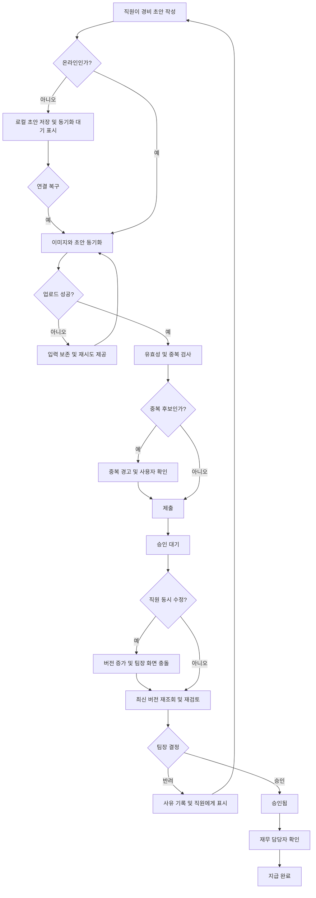

# 모바일 경비 승인 PRD

## Applicability

| Contract | Required / N/A | Evidence |
|---|---|---|
| Pages/routes or screen IDs | Required | 직원 제출, 팀장 승인, 재무 지급 처리 화면이 필요한 사용자 대면 기능이다. |
| Empty/loading/error/success/recovery state matrix | Required | 오프라인, 이미지 업로드 실패, 권한 변경, 충돌 복구 상태를 정의해야 한다. |
| Mermaid user or system flow | Required | 작성부터 동기화, 승인·반려, 지급 완료까지 다단계 생명주기가 존재한다. |

## Context and problem

직원이 모바일에서 경비 증빙을 제출하고, 팀장이 자기 팀의 요청을 검토하며, 재무 담당자가 승인된 요청의 지급 여부를 기록할 수 있어야 한다.

모바일 환경에서는 연결 끊김, 이미지 업로드 실패, 재전송에 따른 중복 제출이 발생할 수 있다. 또한 요청 수정과 승인 작업이 동시에 일어나거나 처리 도중 사용자의 소속·권한이 변경될 수 있으므로 서버 기준의 권한 검증과 충돌 처리가 필요하다.

## Goals

- 직원이 영수증 사진, 금액, 카테고리로 경비 요청을 제출할 수 있다.
- 오프라인에서도 초안을 작성하고 연결 복구 후 안전하게 동기화할 수 있다.
- 팀장이 자기 팀에 배정된 요청만 승인하거나 사유와 함께 반려할 수 있다.
- 재무 담당자가 승인된 요청을 지급 완료로 기록할 수 있다.
- 중복 제출, 업로드 실패, 권한 변경 및 동시 수정으로 인한 데이터 오류를 방지한다.
- 핵심 사용자 흐름을 WCAG 2.2 AA에 맞게 제공한다.

## Non-goals

- 다중 통화 입력, 환율 계산 및 환산
- ERP·회계 시스템과의 자동 연동
- 일괄 승인·일괄 지급
- 경비 정책 위반 자동 판정
- OCR을 통한 영수증 필드 자동 추출
- 지급 완료 이후 회계 취소·환수 처리
- 성능 SLA 확정

## Users, roles, and permissions

| 역할 | 권한 |
|---|---|
| 직원 | 자신의 초안 작성·수정·동기화·제출, 자신의 요청 및 처리 결과 조회 |
| 팀장 | 현재 자신이 관리하도록 지정된 팀의 제출 요청 조회, 승인, 반려 |
| 재무 담당자 | 조직 내 승인된 요청 조회, 지급 완료 처리 |
| 시스템 | 중복 검사, 동기화, 권한 재검증, 충돌 방지, 감사 기록 생성 |

한 사용자가 여러 역할을 가질 수 있지만, 각 작업은 해당 작업에 필요한 권한을 서버에서 독립적으로 검증한다.

## Request lifecycle

```text
로컬 초안
   └─ 동기화 → 서버 초안
                  └─ 제출 → 승인 대기
                              ├─ 승인 → 승인됨 → 지급 완료
                              └─ 반려 → 반려됨 → 수정 후 재제출
```

| 상태 | 설명 | 허용되는 다음 상태 |
|---|---|---|
| `LOCAL_DRAFT` | 기기에만 저장된 오프라인 초안 | `SYNCED_DRAFT` |
| `SYNCED_DRAFT` | 서버에 저장됐지만 제출되지 않은 초안 | `PENDING` |
| `PENDING` | 팀장 검토 대기 | `APPROVED`, `REJECTED` |
| `REJECTED` | 반려 사유가 기록된 요청 | `PENDING`으로 재제출 |
| `APPROVED` | 팀장 승인 완료 | `PAID` |
| `PAID` | 재무 담당자가 지급 완료로 기록 | 없음 |

승인·지급 완료 상태는 1차 출시에서 최종 상태로 간주한다.

## Core data

| 데이터 | 필수 여부 | 규칙 |
|---|---|---|
| 요청 ID | 필수 | 초안 생성 시 클라이언트가 생성하며 재시도에서도 유지 |
| 직원 ID | 필수 | 인증 사용자로부터 서버가 결정 |
| 담당 팀 ID | 필수 | 최초 제출 시점의 직원 팀을 기준으로 고정 |
| 영수증 이미지 | 필수 | 업로드 완료 전 제출 불가 |
| 금액 | 필수 | 0보다 큰 값, 조직의 단일 기준 통화 사용 |
| 통화 | 필수 | 사용자가 선택하지 않으며 조직 설정값을 서버가 기록 |
| 카테고리 | 필수 | 활성 카테고리 목록에서 선택 |
| 상태 | 필수 | 서버가 상태 전이 규칙에 따라 관리 |
| 반려 사유 | 반려 시 필수 | 공백만으로 구성할 수 없음 |
| 지급 정보 | 지급 시 필수 | 처리자와 처리 시각 기록 |
| 버전 | 필수 | 동시 수정·승인 충돌 검사에 사용 |
| 감사 기록 | 필수 | 제출, 수정, 승인, 반려, 재제출, 지급 완료 이력 |

## Functional requirements

| ID | Requirement | Priority |
|---|---|---|
| FR-01 | 직원은 영수증 이미지 1장, 금액, 카테고리를 입력해 초안을 만들 수 있어야 한다. | P0 |
| FR-02 | 시스템은 필수 필드와 금액 유효성을 검증하고 오류가 있는 요청의 제출을 차단해야 한다. | P0 |
| FR-03 | 직원은 온라인 상태에서 자신의 초안을 저장·수정하고 제출할 수 있어야 한다. | P0 |
| FR-04 | 직원은 오프라인에서도 초안을 작성·수정할 수 있어야 하며, 앱은 로컬 저장 여부와 미동기화 상태를 표시해야 한다. | P0 |
| FR-05 | 연결이 복구되면 시스템은 미동기화 초안과 영수증 이미지를 자동으로 동기화해야 한다. 사용자는 수동 재시도도 할 수 있어야 한다. | P0 |
| FR-06 | 이미지 업로드가 실패하면 입력 내용과 로컬 이미지 참조를 보존하고, 실패 상태 및 재시도 수단을 제공해야 한다. 업로드 완료 전 제출할 수 없다. | P0 |
| FR-07 | 동일한 요청 ID로 저장·제출을 재시도해도 서버에는 하나의 요청만 생성되어야 한다. | P0 |
| FR-08 | 같은 직원의 기존 요청과 영수증 이미지 지문 및 금액이 모두 같으면 중복 후보로 경고해야 한다. 직원이 확인한 경우에만 별도 요청으로 제출할 수 있다. | P0 |
| FR-09 | 제출 시 담당 팀은 제출 당시 직원의 팀으로 고정되고, 요청은 `PENDING` 상태가 되어야 한다. | P0 |
| FR-10 | 직원은 자신의 요청 목록과 상세 화면에서 현재 상태, 반려 사유 및 지급 완료 여부를 볼 수 있어야 한다. | P0 |
| FR-11 | 직원은 `PENDING` 요청을 수정할 수 있다. 수정 시 요청 버전이 증가하며 팀장은 최신 버전을 다시 검토해야 한다. | P0 |
| FR-12 | 팀장은 서버 기준으로 자신이 현재 관리하는 팀에 배정된 `PENDING` 요청만 조회하고 처리할 수 있어야 한다. | P0 |
| FR-13 | 팀장은 최신 버전의 `PENDING` 요청을 승인할 수 있어야 한다. 승인 시 처리자와 처리 시각을 기록한다. | P0 |
| FR-14 | 팀장은 최신 버전의 `PENDING` 요청을 반려할 수 있어야 하며, 공백이 아닌 반려 사유를 반드시 입력해야 한다. | P0 |
| FR-15 | 반려된 요청은 직원이 수정해 재제출할 수 있으며, 기존 반려 이력은 보존되어야 한다. | P0 |
| FR-16 | 재무 담당자는 `APPROVED` 요청만 `PAID`로 변경할 수 있고, 처리 전 확인 단계를 거쳐야 한다. | P0 |
| FR-17 | 승인·반려·지급 요청 시 클라이언트가 본 버전과 서버 최신 버전이 다르면 처리를 적용하지 않고 충돌을 알려야 한다. | P0 |
| FR-18 | 충돌 발생 시 최신 데이터를 불러오고 사용자가 내용을 다시 검토한 뒤 작업하도록 해야 한다. 변경 사항을 자동 병합하거나 승인해서는 안 된다. | P0 |
| FR-19 | 모든 읽기와 상태 변경 요청에서 서버가 사용자 역할, 조직, 팀 범위 및 현재 권한을 다시 검증해야 한다. | P0 |
| FR-20 | 작업 도중 권한을 잃은 사용자의 후속 작업은 거부되어야 하며, 화면은 최신 권한을 반영해 안전한 화면으로 이동시켜야 한다. | P0 |
| FR-21 | 제출, 내용 수정, 승인, 반려, 재제출, 지급 완료에 대해 행위자, 시각, 이전·이후 상태 및 대상 요청을 감사 기록에 남겨야 한다. | P0 |

## Pages and routes

모바일 앱의 실제 라우팅 체계는 미정이므로 구현 간 식별 가능한 화면 ID를 사용한다.

| Page or screen ID | Route, deep link, or explicit TBD + owner | Roles | Purpose |
|---|---|---|---|
| EXP-01 요청 목록 | TBD — 앱 개발 책임자, 구현 착수 전 확정 | 직원 | 자신의 요청 및 상태 조회 |
| EXP-02 요청 작성·수정 | TBD — 앱 개발 책임자, 구현 착수 전 확정 | 직원 | 이미지, 금액, 카테고리 입력 및 동기화 |
| EXP-03 요청 상세 | TBD — 앱 개발 책임자, 구현 착수 전 확정 | 직원 | 처리 상태, 반려 사유, 지급 여부 조회 |
| APR-01 승인 대기 목록 | TBD — 앱 개발 책임자, 구현 착수 전 확정 | 팀장 | 자기 팀의 승인 대기 요청 조회 |
| APR-02 승인 상세 | TBD — 앱 개발 책임자, 구현 착수 전 확정 | 팀장 | 최신 요청 검토, 승인 또는 반려 |
| FIN-01 지급 대기 목록 | TBD — 앱 개발 책임자, 구현 착수 전 확정 | 재무 담당자 | 승인된 요청 조회 |
| FIN-02 지급 상세 | TBD — 앱 개발 책임자, 구현 착수 전 확정 | 재무 담당자 | 요청 검토 및 지급 완료 처리 |

## State matrix

| Surface | Empty | Loading | Error | Success | Recovery |
|---|---|---|---|---|---|
| 직원 요청 목록 | “등록된 경비가 없습니다”와 작성 버튼 | 목록 로딩 표시 | 재시도 가능한 오류 | 요청과 상태 표시 | 새로고침 |
| 요청 작성 | 빈 입력 폼 | 초안·카테고리 로딩 | 검증 오류를 필드와 요약 영역에 표시 | 저장 또는 제출 완료 | 값 보존 후 재시도 |
| 오프라인 초안 | 신규 또는 기존 로컬 초안 | 로컬 저장 중 | 로컬 저장 실패 안내 | “기기에 저장됨·동기화 대기” | 저장 공간 확인 후 재시도 |
| 이미지 업로드 | 이미지 미선택 | 진행 중 표시 | 실패 및 재시도 버튼 | 미리보기와 업로드 완료 표시 | 같은 파일로 재시도 또는 교체 |
| 초안 동기화 | 동기화 대상 없음 | 동기화 중 | 네트워크·충돌 오류 | 동기화 완료 시각 표시 | 자동 또는 수동 재시도, 충돌 선택 |
| 팀장 승인 목록 | “승인 대기 요청이 없습니다” | 목록 로딩 표시 | 권한·네트워크 오류 | 자기 팀 요청만 표시 | 권한 갱신 또는 재시도 |
| 승인 상세 | 해당 없음 | 최신 버전 확인 중 | 권한 상실·버전 충돌 | 승인 또는 반려 완료 | 최신 내용 재조회 후 재검토 |
| 지급 목록·상세 | 지급 대기 요청 없음 | 로딩 또는 처리 중 | 권한·상태·네트워크 오류 | 지급 완료 표시 | 최신 상태 조회 후 재시도 |

## User or system flow



## Authorization and data boundaries

- 모든 데이터 접근은 동일 조직 범위 안에서만 허용한다.
- 직원은 서버에서 확인된 자신의 요청만 조회·수정할 수 있다.
- 팀장은 요청에 고정된 담당 팀을 현재 관리할 권한이 있을 때만 조회·승인·반려할 수 있다.
- 재무 담당자는 조직 내 `APPROVED` 요청만 지급 완료 처리할 수 있다.
- 목록에서 버튼이나 요청을 숨기는 것만으로 권한을 통제하지 않는다. 서버는 조회와 변경 요청마다 권한을 검증한다.
- 제출 후 직원의 소속이 바뀌더라도 요청의 담당 팀은 자동 변경하지 않는다.
- 팀장이 보직을 잃거나 담당 팀이 변경되면 기존에 열어 둔 화면에서도 승인·반려 요청을 거부한다.
- 승인된 요청은 직원이 수정할 수 없고, 지급 완료 요청은 어떤 역할도 일반 흐름에서 수정할 수 없다.
- 감사 기록은 일반 사용자가 수정하거나 삭제할 수 없어야 한다.

## Non-functional requirements

### Accessibility

- NFR-01: EXP-01~03, APR-01~02, FIN-01~02의 핵심 흐름은 WCAG 2.2 AA를 충족해야 한다.
- 모든 조작은 키보드 및 보조기술로 수행 가능해야 한다.
- 입력 오류는 색상만으로 전달하지 않고 필드 수준 설명과 오류 요약을 제공해야 한다.
- 업로드, 오프라인, 동기화, 충돌 및 처리 완료 상태 변경은 스크린 리더가 인식할 수 있어야 한다.
- 터치 대상 크기, 포커스 표시, 명도 대비는 WCAG 2.2 AA 기준을 적용한다.

### Reliability and data integrity

- 동일 요청 ID의 재시도는 멱등적으로 처리한다.
- 상태 변경은 현재 상태, 권한 및 버전 검사가 모두 성공한 경우에만 적용한다.
- 실패한 동기화나 업로드 때문에 작성한 입력값이 자동 폐기되어서는 안 된다.
- 클라이언트 표시와 관계없이 서버 상태를 최종 기준으로 사용한다.

### Performance

출시 성능 목표 숫자는 현재 확정하지 않는다. 제품 책임자와 엔지니어링 책임자는 베타 환경에서 다음 지표를 측정한 후 출시 승인 전 목표와 허용 기준을 결정한다.

- 요청 목록 및 상세 화면 응답 시간
- 이미지 업로드 성공률과 소요 시간
- 연결 복구 후 초안 동기화 소요 시간
- 승인·반려·지급 처리 응답 시간
- 저속 또는 불안정 네트워크에서의 실패율

숫자 목표가 결정되기 전까지 성능을 근거로 출시 승인을 판정하지 않는다. 단, 데이터 유실·중복 생성은 성능과 별개의 P0 결함으로 취급한다.

## Acceptance criteria

| ID | Requirement | Given | When | Then | Verification |
|---|---|---|---|---|---|
| AC-01 | FR-01, FR-02, FR-03 | 직원이 온라인 상태이고 유효한 이미지·금액·카테고리를 입력했다 | 제출한다 | 요청 하나가 `PENDING`으로 생성되고 자신의 목록에 표시된다 | E2E |
| AC-02 | FR-02 | 이미지가 없거나 금액이 0 이하이거나 카테고리가 없다 | 제출한다 | 서버와 앱 모두 제출을 거부하고 수정할 필드를 식별한다 | 통합 + E2E |
| AC-03 | FR-04, FR-05 | 직원이 오프라인에서 초안을 작성했다 | 연결이 복구된다 | 초안과 이미지가 자동 동기화되고 완료 상태가 표시된다 | 오프라인 E2E |
| AC-04 | FR-06 | 이미지 업로드 중 네트워크가 끊겼다 | 업로드가 실패한다 | 입력과 이미지가 보존되고 제출은 차단되며 재시도가 제공된다 | 장애 주입 E2E |
| AC-05 | FR-07 | 같은 요청 ID의 제출 응답을 받기 전에 앱이 재시도한다 | 서버가 두 요청을 수신한다 | 요청은 하나만 존재하고 동일한 결과가 반환된다 | API 통합 |
| AC-06 | FR-08 | 같은 직원의 기존 요청과 이미지 지문 및 금액이 같은 요청이 있다 | 새 요청을 제출한다 | 중복 경고가 표시되고 명시적 확인 전에는 별도 요청이 생성되지 않는다 | API 통합 + E2E |
| AC-07 | FR-09, FR-10 | 직원이 요청을 제출했다 | 목록과 상세를 조회한다 | 제출 시점 팀, 상태 및 자신의 요청 정보만 표시된다 | API 권한 + E2E |
| AC-08 | FR-11, FR-17, FR-18 | 팀장이 요청 버전 3을 보고 있고 직원이 요청을 수정해 버전 4가 됐다 | 팀장이 이전 화면에서 승인한다 | 승인되지 않고 충돌이 표시되며 최신 내용 재검토가 요구된다 | 경쟁 상태 통합 |
| AC-09 | FR-12, FR-13 | 팀장이 현재 관리하는 팀의 최신 `PENDING` 요청을 보고 있다 | 승인한다 | 상태가 `APPROVED`가 되고 처리자와 시각이 기록된다 | API 권한 + E2E |
| AC-10 | FR-12, FR-19 | 팀장이 다른 팀의 요청 ID를 직접 사용한다 | 조회 또는 승인한다 | 서버가 요청 내용을 노출하지 않고 작업을 거부한다 | 보안 통합 |
| AC-11 | FR-14 | 팀장이 반려 사유 없이 반려한다 | 반려를 확정한다 | 서버와 앱이 반려를 거부한다 | 통합 + E2E |
| AC-12 | FR-14, FR-15 | 팀장이 사유와 함께 반려했다 | 직원이 상세를 열고 수정 후 재제출한다 | 사유가 표시되고 상태가 다시 `PENDING`이 되며 이전 이력이 보존된다 | E2E |
| AC-13 | FR-16 | 재무 담당자가 `APPROVED` 요청을 보고 있다 | 확인 후 지급 완료 처리한다 | 상태가 `PAID`가 되고 처리자와 시각이 기록된다 | E2E |
| AC-14 | FR-16, FR-19 | 재무 담당자가 `PENDING`, `REJECTED` 또는 `PAID` 요청을 지급 처리한다 | 서버에 변경을 요청한다 | 서버가 상태 변경을 거부한다 | API 통합 |
| AC-15 | FR-19, FR-20 | 사용자가 처리 화면을 연 뒤 필요한 역할이나 팀 권한을 잃었다 | 승인·반려·지급을 시도한다 | 서버가 거부하고 앱은 권한 변경 안내 후 허용된 화면으로 이동한다 | 권한 변경 통합 + E2E |
| AC-16 | FR-21 | 요청이 제출부터 지급 완료까지 처리됐다 | 감사 기록을 조회한다 | 각 변경의 행위자, 시각, 이전·이후 상태, 요청 ID가 순서대로 존재한다 | API 통합 |
| AC-17 | NFR-01 | 핵심 화면과 상태가 구현됐다 | 접근성 검사를 수행한다 | 자동 검사와 수동 키보드·스크린 리더 검사에서 WCAG 2.2 AA 차단 이슈가 없다 | 자동 검사 + 수동 감사 |
| AC-18 | FR-05, FR-18 | 동일 초안의 서버 버전이 로컬 버전보다 최신이다 | 오프라인 변경을 동기화한다 | 서버 내용을 조용히 덮어쓰지 않고 충돌 선택지를 제공한다 | 동기화 통합 + E2E |

## Assumptions and open decisions

### 합리적 가정

- A-01: 1차 출시에서는 조직마다 하나의 기준 통화를 사용하며 직원은 통화를 선택하지 않는다.
- A-02: 영수증은 요청당 이미지 1장이다.
- A-03: 직원은 승인 대기 중인 요청을 수정할 수 있으며, 수정되면 팀장의 기존 승인 시도는 충돌로 처리한다.
- A-04: 반려 요청은 동일 요청 ID와 이력을 유지한 채 수정·재제출한다.
- A-05: 담당 팀은 최초 제출 시점에 고정한다. 직원이 이후 다른 팀으로 이동해도 자동 이관하지 않는다.
- A-06: 중복 후보라도 실제로 별도 비용임을 직원이 확인하면 제출할 수 있다. 확인 사실은 감사 기록에 남긴다.
- A-07: 지급 완료는 실제 송금 실행 기능이 아니라 외부에서 지급이 끝났음을 기록하는 기능이다.
- A-08: 앱 삭제나 기기 분실 전의 미동기화 로컬 초안 복구는 보장하지 않는다.

### 열린 결정

| ID | 결정 사항 | 영향 | 결정 책임자 / 시점 |
|---|---|---|---|
| OD-01 | 허용 이미지 형식, 최대 파일 크기, 해상도 및 압축 정책 | 업로드 검증, 저장 비용, 오류 UX | 제품 + 모바일 + 백엔드 / 구현 착수 전 |
| OD-02 | 카테고리 목록과 관리 주체 | 데이터 모델과 입력 UI | 재무 책임자 / 구현 착수 전 |
| OD-03 | 조직별 기준 통화 설정 방법과 초기 통화 | 금액 표시·저장 | 제품 + 재무 / 베타 데이터 구성 전 |
| OD-04 | 중복 비교에서 취소·과거 요청을 포함할지와 비교 기간 | 오탐률과 탐지 비용 | 제품 + 재무 / 중복 검사 구현 전 |
| OD-05 | 같은 서버 초안을 여러 기기에서 수정할 때 제공할 충돌 선택지 | 동기화 UX와 데이터 보존 | 제품 + 모바일 / 동기화 구현 전 |
| OD-06 | 제출 후 담당 팀을 수동 이관할 관리 기능이 필요한지 | 장기 미처리 요청과 조직 변경 대응 | 운영 + 제품 / 1차 출시 범위 확정 전 |
| OD-07 | 지급 완료 오기록을 누가 어떤 통제로 정정할지 | 재무 운영과 감사성 | 재무 + 보안 / 운영 개시 전 |
| OD-08 | 감사 기록 보존 기간 및 열람 가능한 관리자 역할 | 저장·보안·운영 정책 | 보안 + 재무 / 출시 전 |
| OD-09 | 측정된 베타 기준으로 설정할 성능 목표 | 출시 판정 | 제품 + 엔지니어링 / 출시 승인 전 |

## Risks and mitigations

| 위험 | 영향 | 완화 |
|---|---|---|
| 네트워크 재시도로 요청이 중복 생성됨 | 이중 지급 가능성 | 요청 ID 기반 멱등 처리와 중복 후보 경고 |
| 이미지 업로드 실패 후 입력 유실 | 직원 재작업 및 제출 포기 | 로컬 보존, 업로드 상태 표시, 재시도 |
| 팀장 검토 중 직원이 금액이나 영수증 수정 | 검토하지 않은 내용 승인 | 버전 검사, 승인 실패, 최신 내용 재검토 |
| 권한 변경이 열린 화면에 반영되지 않음 | 다른 팀 데이터 접근 또는 무권한 처리 | 모든 서버 요청에서 현재 권한 재검증 |
| 오프라인 초안이 서버 최신 내용을 덮어씀 | 데이터 유실 | 충돌 감지 및 명시적 사용자 선택 |
| 이미지 지문 기반 중복 탐지의 오탐 | 정상 요청 제출 방해 | 경고 후 명시적 재제출 허용 및 감사 기록 |
| 지급 완료 오기록 | 재무 기록 불일치 | 확인 단계와 감사 기록, OD-07 출시 전 확정 |
| 성능 목표 미확정 | 출시 품질 판단 불가 | 베타 측정 후 출시 승인 전 목표 확정 |

## Delivery

| Phase | Requirement IDs | Verifiable exit condition |
|---|---|---|
| 1. 핵심 제출 | FR-01~03, FR-09~10 | 온라인에서 유효한 요청을 제출하고 직원이 상태를 조회하는 E2E 통과 |
| 2. 오프라인·신뢰성 | FR-04~08 | 연결 끊김, 업로드 실패, 재전송, 중복 후보 시나리오 통과 |
| 3. 승인·반려 | FR-11~15, FR-17~20 | 팀 범위 권한, 반려 사유, 동시 수정, 권한 변경 테스트 통과 |
| 4. 지급·감사 | FR-16, FR-21 | 승인 요청만 지급 완료 처리되고 전체 이력이 기록되는 테스트 통과 |
| 5. 출시 검증 | NFR-01 및 OD-01~09 | WCAG 2.2 AA 검증 완료, 출시 차단 열린 결정 해소, 성능 기준 확정 |

요청에 따라 파일을 생성하지 않았으므로 별도 PRD 검증기는 실행하지 않았다.