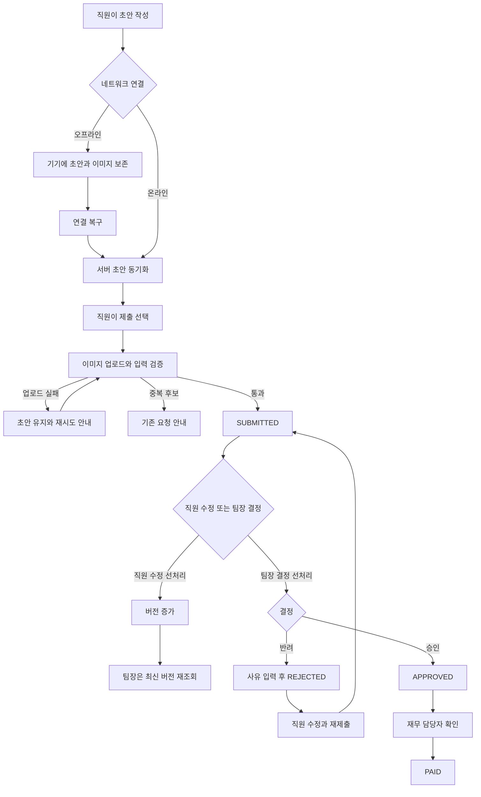

# 모바일 경비 승인 PRD

## Applicability

| Contract | Required / N/A | Evidence |
|---|---|---|
| Pages/routes or screen IDs | Required | 직원 제출, 팀장 승인, 재무 지급 등 역할별 사용자 화면이 필요하다. |
| Empty/loading/error/success/recovery state matrix | Required | 오프라인 동기화, 이미지 업로드 실패, 중복 제출, 권한 변경, 동시 수정 충돌을 사용자에게 명확히 표시해야 한다. |
| Mermaid user or system flow | Required | 초안부터 제출·승인·지급까지 여러 역할과 상태 전이가 존재한다. |

## Context and problem

직원이 모바일에서 경비를 제출하고, 팀장이 검토한 뒤, 재무 담당자가 지급 완료를 기록할 수 있어야 한다. 현재 브리프에는 정상 처리뿐 아니라 네트워크 단절, 업로드 실패, 중복 제출, 권한 변경 및 동시 수정 충돌에 대한 일관된 처리도 요구된다.

1차 출시는 단일 통화와 수동 지급 완료 처리를 전제로 하며, ERP 자동 연동은 포함하지 않는다.

## Goals

- 직원이 영수증 사진, 금액, 카테고리로 경비 요청을 제출할 수 있다.
- 오프라인에서도 초안을 안전하게 작성하고 연결 복구 후 동기화할 수 있다.
- 팀장이 자신의 팀에 귀속된 요청만 승인 또는 반려할 수 있다.
- 반려 시 사유를 필수로 기록한다.
- 재무 담당자가 승인된 요청을 지급 완료 상태로 변경할 수 있다.
- 중복 요청과 동시 수정으로 인해 잘못 승인되거나 이중 지급되는 것을 방지한다.
- 역할 및 팀 권한이 변경되면 서버에서 즉시 권한을 재평가한다.
- 관련 모바일 화면이 WCAG 2.2 AA를 충족하도록 설계·검증한다.

## Non-goals

- 다중 통화 입력, 환율 계산 및 환산
- ERP·회계 시스템 자동 전송 또는 자동 지급
- 법인카드 내역 자동 대사
- 분할 승인 및 다단계 승인
- 경비 한도·회사 규정에 따른 자동 승인 또는 자동 반려
- 지급 완료 취소 및 회계 정정 워크플로
- 문자 인식(OCR)을 통한 금액·카테고리 자동 입력
- 푸시·이메일 알림
- 유사 이미지 분석을 이용한 고급 중복 탐지

## Users, roles, and permissions

| 역할 | 허용 작업 | 데이터 범위 |
|---|---|---|
| 직원 | 초안 생성·수정·삭제, 제출, 본인 요청 조회, 제출 상태 요청 수정, 반려 요청 재제출 | 자신이 작성한 초안 및 요청 |
| 팀장 | 제출 요청 조회, 영수증 확인, 승인, 사유를 입력한 반려 | 현재 자신이 관리하는 팀에 귀속된 요청 |
| 재무 담당자 | 승인 요청 조회, 영수증과 처리 이력 확인, 지급 완료 표시 | 조직 내 승인된 요청 |
| 권한 없음/회수됨 | 기존 화면 캐시를 볼 수 있더라도 보호된 작업 수행 불가 | 서버가 허용한 최소 범위 |

한 사용자가 여러 역할을 보유할 수 있다. 모든 읽기 및 쓰기 권한은 서버에서 검증하며, 화면에서 메뉴나 버튼을 숨기는 것만으로 권한을 통제하지 않는다.

## 핵심 데이터와 상태

### 경비 요청 필드

| 필드 | 설명 | 제출 시 필수 |
|---|---|---|
| 요청 ID | 서버가 발급하는 고유 식별자 | 자동 |
| 클라이언트 초안 ID | 오프라인 생성 및 재시도 식별용 UUID | 자동 |
| 제출 멱등성 키 | 동일 제출 재시도로 인한 중복 생성을 방지 | 자동 |
| 직원 ID | 요청 작성자 | 자동 |
| 팀 ID | 제출 또는 재제출 시점의 팀 스냅샷 | 자동 |
| 영수증 이미지 | 업로드가 완료된 이미지 자산 | 필수 |
| 이미지 해시 | 동일 파일 중복 검사에 사용 | 자동 |
| 금액 | 조직의 단일 기준 통화로 입력한 양수 | 필수 |
| 카테고리 | 활성 카테고리 중 하나 | 필수 |
| 상태 | 요청의 업무 상태 | 자동 |
| 버전 | 동시 수정 검사용 증가 값 | 자동 |
| 반려 사유 | 최신 반려의 사유 | 반려 시 필수 |
| 지급 완료 정보 | 처리자와 처리 시각 | 지급 완료 시 자동 |
| 생성·수정 정보 | 생성자·시각 및 최근 수정자·시각 | 자동 |

금액은 부동소수점이 아닌 통화 최소 단위 또는 동등한 정밀도 보장 방식으로 저장한다. 구체적인 저장 기술은 구현 선택 사항이다.

### 업무 상태

```text
DRAFT → SUBMITTED → APPROVED → PAID
                    ↘ REJECTED → SUBMITTED
```

| 현재 상태 | 가능한 다음 상태 | 행위자 및 조건 |
|---|---|---|
| DRAFT | SUBMITTED | 직원, 필수 값과 이미지 업로드 완료 |
| SUBMITTED | SUBMITTED | 직원 수정, 버전 증가 |
| SUBMITTED | APPROVED | 해당 팀의 팀장, 최신 버전 기준 |
| SUBMITTED | REJECTED | 해당 팀의 팀장, 반려 사유 필수 |
| REJECTED | SUBMITTED | 직원 수정 및 재제출 |
| APPROVED | PAID | 재무 담당자 |
| PAID | 없음 | 1차 출시에서 최종 상태 |

동기화 상태는 업무 상태와 별도로 `LOCAL_ONLY`, `SYNCING`, `SYNCED`, `SYNC_ERROR`로 관리한다.

## Functional requirements

| ID | Requirement | Priority |
|---|---|---|
| FR-01 | 직원은 모바일에서 영수증 사진, 금액, 카테고리를 포함하는 경비 초안을 생성하고 수정할 수 있다. 초안은 필수 값이 미완성인 상태도 허용한다. | Must |
| FR-02 | 제출 시 영수증 업로드 완료, 유효한 양수 금액, 활성 카테고리를 서버에서 검증한다. 성공한 요청은 `SUBMITTED`가 된다. | Must |
| FR-03 | 오프라인에서 생성·수정한 초안은 기기에 보존되며 연결 복구 후 자동으로 서버와 동기화된다. 동기화 전까지 초안과 첨부 이미지를 삭제하지 않는다. | Must |
| FR-04 | 초안 동기화는 요청 제출로 간주하지 않는다. 사용자가 명시적으로 제출한 경우에만 `SUBMITTED`로 전환한다. | Must |
| FR-05 | 이미지 업로드가 실패하면 요청을 제출 완료로 표시하지 않는다. 실패 원인, 재시도 동작, 초안 보존 상태를 제공한다. | Must |
| FR-06 | 직원은 본인의 요청과 처리 이력을 조회할 수 있다. `SUBMITTED` 요청은 결정 전까지 수정할 수 있고, `REJECTED` 요청은 사유 확인 후 수정·재제출할 수 있다. | Must |
| FR-07 | 팀장은 현재 자신이 관리하는 팀 ID에 귀속된 `SUBMITTED` 요청만 조회하고 승인 또는 반려할 수 있다. | Must |
| FR-08 | 반려 시 공백이 아닌 사유를 필수 입력한다. 승인 시에는 반려 사유를 요구하지 않는다. | Must |
| FR-09 | 재무 담당자는 `APPROVED` 요청만 `PAID`로 변경할 수 있다. 서버는 지급 처리자와 처리 시각을 기록한다. 동일 요청의 반복 지급 완료 처리는 추가 지급을 만들지 않는다. | Must |
| FR-10 | 모든 수정·승인·반려·지급 작업은 클라이언트가 확인한 요청 버전을 포함한다. 서버 버전이 다르면 변경을 적용하지 않고 최신 데이터 재조회가 필요한 충돌로 응답한다. | Must |
| FR-11 | 직원 수정과 팀장 결정이 동시에 도착하면 서버가 한 작업만 먼저 적용한다. 후속 작업은 이전 버전을 기준으로 실행되지 않으며 충돌 메시지와 최신 상태를 반환한다. | Must |
| FR-12 | 동일한 제출 멱등성 키의 재시도는 새 요청을 만들지 않고 기존 요청 결과를 반환한다. | Must |
| FR-13 | 같은 직원이 동일한 이미지 파일 해시, 금액, 카테고리로 이미 제출한 활성 또는 완료 요청이 있으면 중복 후보로 차단하고 기존 요청을 안내한다. | Must |
| FR-14 | 읽기와 쓰기 요청마다 최신 역할, 팀 관리 관계 및 데이터 소유권을 서버에서 재검증한다. 권한이 회수되거나 팀 범위가 변경된 사용자의 작업은 적용하지 않는다. | Must |
| FR-15 | 제출, 수정, 승인, 반려, 재제출, 지급 완료에는 행위자, 시각, 이전·이후 상태 및 요청 버전을 포함하는 감사 이력을 남긴다. | Must |
| FR-16 | 영수증 이미지 조회에도 요청 본문과 동일한 소유권 및 역할 범위를 적용하며, 추측 가능한 공개 URL로 노출하지 않는다. | Must |
| FR-17 | `APPROVED` 또는 `PAID` 요청의 직원 수정과 팀장 재결정은 허용하지 않는다. | Must |

## Pages and routes

모바일 앱의 실제 라우팅 방식은 미정이므로 구현 간 계약에는 다음의 안정적인 화면 ID를 사용한다.

| Page or screen ID | Route, deep link, or explicit TBD + owner | Roles | Purpose |
|---|---|---|---|
| EXP-01 요청 목록 | TBD — 모바일 기술 책임자, 개발 착수 전 | 직원 | 본인 초안 및 요청 상태 조회 |
| EXP-02 요청 작성·수정 | TBD — 모바일 기술 책임자, 개발 착수 전 | 직원 | 영수증·금액·카테고리 입력 및 동기화·제출 |
| EXP-03 요청 상세 | TBD — 모바일 기술 책임자, 개발 착수 전 | 직원 | 처리 상태, 반려 사유, 이력 조회 |
| MGR-01 승인 대기 목록 | TBD — 모바일 기술 책임자, 개발 착수 전 | 팀장 | 자기 팀의 제출 요청 조회 |
| MGR-02 승인 상세 | TBD — 모바일 기술 책임자, 개발 착수 전 | 팀장 | 영수증 검토, 승인·반려 |
| FIN-01 지급 대기 목록 | TBD — 모바일 기술 책임자, 개발 착수 전 | 재무 담당자 | 승인 요청 조회 |
| FIN-02 지급 상세 | TBD — 모바일 기술 책임자, 개발 착수 전 | 재무 담당자 | 처리 이력 확인 및 지급 완료 표시 |

## State matrix

| Surface | Empty | Loading | Error | Success | Recovery |
|---|---|---|---|---|---|
| 직원 요청 목록 | “등록된 경비가 없음”과 작성 동작 표시 | 목록 로딩 표시 | 조회 실패 및 재시도 표시 | 상태별 요청 표시 | 재조회 |
| 요청 작성 | 빈 입력 폼 | 이미지 처리 또는 동기화 표시 | 유효성·업로드·동기화 오류를 해당 필드 또는 영역에 표시 | 초안 저장 또는 제출 완료 표시 | 초안 유지 후 재시도 |
| 오프라인 초안 | 로컬 초안 없음 | 연결 복구 후 동기화 중 | 동기화 실패, 원인과 재시도 표시 | 동기화 완료 시각 표시 | 자동 재시도 및 수동 재시도 |
| 이미지 업로드 | 이미지 미선택 | 진행 상태 표시 | 실패하되 선택 이미지와 나머지 입력 유지 | 미리보기와 완료 상태 표시 | 같은 초안에서 재시도 또는 이미지 교체 |
| 팀장 승인 목록 | 승인 대기 없음 | 목록 로딩 표시 | 조회 실패 또는 권한 오류 | 자기 팀 요청만 표시 | 재조회 또는 권한 갱신 후 안전한 화면 이동 |
| 승인·반려 | 해당 요청 없음 | 처리 중, 중복 탭 방지 | 버전 충돌·권한 변경·서버 오류 구분 | 최신 상태와 처리 결과 표시 | 최신 요청 재조회 후 사용자가 다시 판단 |
| 재무 지급 목록 | 지급 대기 없음 | 목록 로딩 표시 | 조회 실패 또는 권한 오류 | 승인 요청 표시 | 재조회 |
| 지급 완료 | 해당 요청 없음 | 처리 중 | 상태 충돌·권한 변경·서버 오류 구분 | 지급 처리자와 시각 표시 | 최신 상태 재조회 |
| 중복 제출 | 해당 없음 | 중복 검사 중 | 검사 실패 시 제출 완료로 표시하지 않음 | 중복 없으면 제출 | 기존 요청으로 이동하거나 입력 검토 |
| 권한 변경 | 해당 역할의 데이터 없음 | 권한 재확인 중 | 접근 거부와 변경 미적용 안내 | 허용된 범위만 표시 | 세션·권한 새로고침 후 홈 또는 허용 화면 이동 |

## User or system flow



## Authorization and data boundaries

- 직원은 `employee_id`가 자신의 사용자 ID와 일치하는 요청만 읽고 변경할 수 있다.
- 팀장은 현재 관리하도록 지정된 팀과 요청의 `team_id`가 일치할 때만 접근할 수 있다.
- 요청의 `team_id`는 제출 또는 재제출 시점의 직원 팀을 스냅샷으로 기록한다.
- 재무 담당자는 조직 범위 내 `APPROVED` 및 `PAID` 요청만 조회할 수 있다. 다른 조직의 데이터에는 접근할 수 없다.
- 목록 조회뿐 아니라 요청 상세, 영수증 이미지, 이력 및 개별 변경 API에도 동일한 범위를 적용한다.
- 권한은 화면 진입 시점이 아니라 각 서버 요청 처리 시점에 평가한다.
- 승인·반려·지급 요청은 권한 검사, 현재 상태 검사, 버전 검사 및 상태 변경을 하나의 원자적 작업으로 처리해야 한다.
- 권한 오류를 일반적인 버전 충돌로 위장하지 않는다. 사용자가 권한 변경을 이해하고 안전한 화면으로 이동할 수 있도록 구분된 결과를 제공한다.
- 감사 이력은 일반 사용자에게 임의 수정 또는 삭제 권한을 제공하지 않는다.

## Non-functional requirements

### 접근성

- 모든 사용자 화면은 출시 전 WCAG 2.2 AA 적합성 검증 대상이다.
- 입력 필드, 오류 메시지, 이미지 대체 설명, 상태 변경, 확인 대화상자 및 포커스 이동을 보조 기술로 인식할 수 있어야 한다.
- 색상만으로 상태나 오류를 구분하지 않는다.
- 확대, 텍스트 크기 변경, 화면 방향 변경 및 키보드·스위치 입력에서도 핵심 작업을 완료할 수 있어야 한다.
- 자동 검사와 주요 흐름의 수동 보조 기술 검사를 함께 수행한다.

### 보안 및 무결성

- 서버는 인증된 사용자 ID를 기준으로 역할과 데이터 범위를 판정하며 클라이언트가 전달한 역할을 신뢰하지 않는다.
- 이미지와 요청 데이터는 조직 데이터 경계 내에서만 접근 가능해야 한다.
- 멱등성 키, 상태 조건 및 버전 조건을 통해 중복 상태 전이와 이중 지급 표시를 방지한다.
- 로그에는 이미지 원본이나 불필요한 민감 정보를 기록하지 않는다.

### 성능 및 신뢰성

현시점에는 근거 있는 성능 수치가 없으므로 임의의 목표를 지정하지 않는다.

| 측정 항목 | 측정 책임 | 결정 시점 |
|---|---|---|
| 요청 목록 및 상세 화면 응답 시간 | 모바일·백엔드 기술 책임자 | 대표 기기 및 운영 유사 환경의 베이스라인 측정 후, 출시 기준 확정 전 |
| 이미지 업로드 성공률 및 소요 시간 | 모바일·백엔드 기술 책임자 | 지원 이미지 규격과 네트워크 조건 확정 후 |
| 연결 복구부터 초안 동기화 완료까지의 시간 | 모바일 기술 책임자 | 오프라인 복구 시나리오 계측 후 |
| 승인·반려·지급 API 오류율 | 백엔드 기술 책임자 | 스테이징 부하·장애 테스트 후 |
| 앱 비정상 종료 후 미동기화 초안 복구율 | 모바일 기술 책임자 | 복구 테스트 결과 측정 후 |

각 항목은 베이스라인 측정 결과, 사용자 영향 및 운영 비용을 검토하여 제품 책임자와 기술 책임자가 수치 목표를 확정한다.

## Acceptance criteria

| ID | Requirement | Given | When | Then | Verification |
|---|---|---|---|---|---|
| AC-01 | FR-01, FR-02 | 직원이 이미지, 유효한 금액, 활성 카테고리를 입력했다 | 제출한다 | 요청이 한 건 생성되고 `SUBMITTED`로 표시된다 | 모바일 E2E + API 통합 테스트 |
| AC-02 | FR-02 | 필수 값이 없거나 금액이 유효하지 않다 | 제출한다 | 서버가 제출을 거부하고 요청은 `SUBMITTED`가 되지 않는다 | API 경계값 테스트 |
| AC-03 | FR-03, FR-04 | 기기가 오프라인이고 직원이 초안을 작성했다 | 앱을 종료·재실행한 뒤 연결이 복구된다 | 입력과 이미지가 복구되고 서버 초안으로 동기화되지만 자동 제출되지는 않는다 | 기기 E2E 테스트 |
| AC-04 | FR-05 | 이미지 업로드 중 연결이 끊긴다 | 업로드가 실패한다 | 제출 완료로 표시되지 않고 입력 및 이미지가 유지되며 재시도할 수 있다 | 네트워크 장애 테스트 |
| AC-05 | FR-06 | 본인의 요청이 `SUBMITTED`다 | 직원이 금액 또는 카테고리를 수정한다 | 요청 내용과 버전이 갱신되고 상태는 `SUBMITTED`로 유지된다 | API 통합 테스트 |
| AC-06 | FR-06, FR-08 | 요청이 사유와 함께 `REJECTED`다 | 직원이 내용을 수정해 재제출한다 | 요청이 새 버전의 `SUBMITTED`가 되고 이전 반려 이력이 보존된다 | E2E 테스트 |
| AC-07 | FR-07 | 팀장이 팀 A만 관리한다 | 팀 A와 팀 B의 요청 목록·상세에 접근한다 | 팀 A 요청만 조회되고 팀 B 요청은 서버에서 거부된다 | 권한 통합 테스트 |
| AC-08 | FR-08 | 팀장이 `SUBMITTED` 요청을 반려하려 한다 | 사유가 비어 있거나 공백뿐이다 | 반려가 적용되지 않고 사유 입력 오류가 표시된다 | UI + API 테스트 |
| AC-09 | FR-07, FR-08 | 팀장이 최신 버전의 자기 팀 요청을 확인했다 | 승인 또는 유효한 사유로 반려한다 | 상태와 감사 이력이 정확히 한 번 갱신된다 | API 트랜잭션 테스트 |
| AC-10 | FR-09 | 재무 담당자가 `APPROVED` 요청을 보고 있다 | 지급 완료를 실행한다 | 요청이 `PAID`가 되고 처리자와 시각이 기록된다 | E2E + API 테스트 |
| AC-11 | FR-09 | 같은 요청이 이미 `PAID`다 | 지급 완료 요청을 다시 전송한다 | 추가 상태 전이나 별도의 지급 기록 없이 기존 결과를 반환한다 | 멱등성 테스트 |
| AC-12 | FR-10, FR-11 | 직원과 팀장이 같은 요청 버전을 보고 있다 | 직원 수정과 팀장 승인이 동시에 실행된다 | 하나만 먼저 성공하고 다른 작업은 충돌로 거부되며 최신 요청을 반환한다 | 동시성 통합 테스트 |
| AC-13 | FR-12 | 첫 제출의 응답을 받기 전에 네트워크가 끊겼다 | 같은 멱등성 키로 제출을 재시도한다 | 서버 요청은 한 건만 존재하고 기존 결과가 반환된다 | 장애 주입 통합 테스트 |
| AC-14 | FR-13 | 동일 직원의 동일 이미지 해시·금액·카테고리 요청이 이미 존재한다 | 다시 제출한다 | 새 요청을 만들지 않고 중복 후보와 기존 요청을 안내한다 | API + E2E 테스트 |
| AC-15 | FR-14 | 사용자가 승인 화면을 연 뒤 팀장 권한을 잃었다 | 승인 요청을 전송한다 | 서버가 작업을 거부하고 요청 상태는 변경되지 않는다 | 권한 변경 통합 테스트 |
| AC-16 | FR-14, FR-16 | 권한 없는 사용자가 요청 ID나 이미지 주소를 알고 있다 | 상세 또는 이미지를 요청한다 | 데이터 내용이 반환되지 않는다 | 보안 접근 테스트 |
| AC-17 | FR-15 | 요청이 제출부터 지급까지 처리됐다 | 감사 이력을 조회한다 | 각 변경의 행위자·시각·상태·버전을 순서대로 확인할 수 있다 | API 통합 테스트 |
| AC-18 | FR-17 | 요청이 `APPROVED` 또는 `PAID`다 | 직원 수정이나 팀장 재결정을 시도한다 | 서버가 작업을 거부하고 기존 데이터와 상태를 유지한다 | 상태 전이 테스트 |
| AC-19 | 접근성 NFR | 지원 대상 기기에서 주요 역할별 흐름이 준비됐다 | 접근성 자동 검사와 수동 보조 기술 검사를 수행한다 | 적용 가능한 WCAG 2.2 AA 기준을 충족하고 차단 결함이 없다 | 접근성 감사 |
| AC-20 | 성능 NFR | 운영 유사 환경과 대표 기기가 준비됐다 | 정의된 성능·신뢰성 항목을 계측한다 | 베이스라인과 근거 있는 출시 목표가 문서화되고 출시 판정에 사용된다 | 성능 측정 보고서 |

## Assumptions and open decisions

### 합리적 가정

아래 항목은 별도 결정이 내려지기 전 구현 기준으로 사용한다.

| ID | 가정 | 근거 및 영향 |
|---|---|---|
| AS-01 | 1차 출시는 조직별로 하나의 기준 통화를 사용하며 직원은 통화를 선택하지 않는다. | 다중 통화가 명시적으로 제외됐다. |
| AS-02 | 오프라인 초안은 연결 복구 시 동기화되지만 사용자 확인 없이 자동 제출하지 않는다. | 초안 동기화와 비용 제출을 구분해 의도하지 않은 제출을 방지한다. |
| AS-03 | 직원은 팀장 결정 전 `SUBMITTED` 요청을 수정할 수 있다. | “승인 중 동시 수정 상태”를 처리하려면 수정 가능 시점과 충돌 규칙이 필요하다. |
| AS-04 | 팀 귀속은 제출 또는 재제출 시점에 스냅샷으로 기록한다. 직원의 이후 이동으로 이미 제출한 요청이 자동 재배정되지는 않는다. | 승인 책임이 처리 도중 예기치 않게 이동하는 것을 방지한다. |
| AS-05 | 팀장 권한은 스냅샷 팀을 현재 관리하는지 매 요청마다 평가한다. 팀장이 교체되면 새 팀장이 기존 요청을 처리한다. | 권한 변경 요구를 충족한다. |
| AS-06 | `PAID`는 1차 출시의 최종 상태이며 UI나 일반 API에서 취소할 수 없다. | 지급 취소·정정 정책이 브리프에 없고 회계 통제가 별도로 필요하다. |
| AS-07 | 동일 파일 해시·직원·금액·카테고리 조합을 확정적 중복 후보로 취급한다. | 고급 이미지 유사도 분석 없이 명확한 중복을 차단할 수 있다. |
| AS-08 | 연결 복구 자동 동기화는 앱 실행 중 또는 앱 재개 시 시작한다. OS가 앱을 완전히 종료한 동안의 백그라운드 실행은 보장하지 않는다. | 모바일 OS의 백그라운드 제한을 고려한다. |

### 열린 결정

| ID | 결정 필요 사항 | 권고 기본값 | 책임자 | 결정 시점 |
|---|---|---|---|---|
| OD-01 | 지원 모바일 OS와 최소 버전 | 현재 사내 배포 기기 비율을 기준으로 결정 | 제품 책임자 + 모바일 기술 책임자 | 상세 설계 전 |
| OD-02 | 허용 이미지 형식, 파일 크기, 장수 및 촬영·갤러리 선택 범위 | 대표 기기와 실제 영수증 품질 시험 후 확정 | 제품 책임자 + 모바일 기술 책임자 | 업로드 구현 전 |
| OD-03 | 카테고리 목록의 초기 값과 관리 주체 | 서버 관리형 고정 목록 | 재무 책임자 | 데이터 모델 확정 전 |
| OD-04 | 조직의 기준 통화 및 금액 소수 자릿수 | 조직 설정으로 한 개 통화 지정 | 재무 책임자 | 데이터 모델 확정 전 |
| OD-05 | 반려 사유 최대 길이와 허용 문자 | 실제 운영 예시를 수집한 후 확정 | 제품 책임자 | API 계약 확정 전 |
| OD-06 | 동일 영수증의 재촬영·압축본까지 탐지할지 여부 | 1차 출시는 동일 파일 해시만 지원 | 제품 책임자 + 보안·리스크 담당 | 1차 출시 후 중복 발생률 검토 시 |
| OD-07 | 직원 팀 이동 시 미처리 요청의 팀 귀속을 수동 변경할 운영 절차 | 1차 출시는 관리자 수동 지원 절차로 처리 | 제품 책임자 + 운영 책임자 | 출시 전 |
| OD-08 | 목록·업로드·동기화·API의 성능 수치 | 베이스라인 측정 후 출시 목표 설정 | 제품 책임자 + 기술 책임자 | 출시 판정 전 |
| OD-09 | 서버 동기화된 `DRAFT`의 보존 기간 및 퇴사자 초안 처리 | 조직 데이터 보존 정책과 함께 결정 | 제품 책임자 + 보안·운영 책임자 | 출시 전 |

## Risks and mitigations

| 위험 | 영향 | 완화책 |
|---|---|---|
| 네트워크 재시도로 같은 경비가 여러 번 생성됨 | 이중 승인·지급 위험 | 클라이언트 초안 ID와 제출 멱등성 키에 서버 고유 제약 적용 |
| 승인과 직원 수정이 경합함 | 팀장이 보지 않은 내용이 승인될 수 있음 | 버전 기반 조건부 변경과 원자적 상태 전이 적용 |
| 앱 종료나 업로드 실패로 초안이 유실됨 | 사용자 재입력 및 제출 누락 | 이미지 포함 로컬 보존, 복구 테스트, 명시적 동기화 상태 제공 |
| 오래 열린 화면에서 권한 변경이 반영되지 않음 | 타 팀 데이터 접근 또는 무권한 승인 | 모든 서버 작업에서 최신 권한 재검증 |
| 단순 파일 해시가 재촬영한 동일 영수증을 찾지 못함 | 일부 중복 요청 미탐지 | 1차 출시 한계를 명시하고 발생률 측정 후 고급 탐지 결정 |
| `PAID` 오표시를 되돌릴 수 없음 | 운영상 정정 필요 | 지급 전 확인 단계와 감사 이력 제공, 정정 절차를 출시 전 마련 |
| 성능 목표가 늦게 확정됨 | 출시 기준 불명확 | 구현 초기부터 측정 항목을 계측하고 출시 판정 전에 수치 확정 |
| 영수증 이미지 접근 제어가 본문과 다르게 구현됨 | 민감 정보 노출 | 이미지 조회에도 동일한 서버 권한 정책과 보안 테스트 적용 |

## Delivery

모든 단계는 하나의 1차 출시 범위이며, 단계는 구현 및 검증 순서를 의미한다.

| Phase | Requirement IDs | Verifiable exit condition |
|---|---|---|
| 1. 데이터·권한·상태 기반 | FR-02, FR-07, FR-08, FR-09, FR-14, FR-15, FR-16, FR-17 | 상태 전이와 역할별 데이터 경계가 API 테스트를 통과하고 감사 이력이 기록된다. |
| 2. 온라인 모바일 흐름 | FR-01, FR-05, FR-06 | 직원 작성·제출·수정·재제출, 팀장 결정, 재무 지급 흐름이 대표 기기 E2E 테스트를 통과한다. |
| 3. 오프라인 및 무결성 | FR-03, FR-04, FR-10, FR-11, FR-12, FR-13 | 오프라인 복구, 업로드 실패, 중복 재시도, 중복 후보 및 동시성 장애 시나리오를 통과한다. |
| 4. 출시 검증 | FR-01~FR-17, 접근성·성능 NFR | 전체 인수 기준을 통과하고, WCAG 2.2 AA 차단 결함이 없으며, 측정된 베이스라인을 근거로 성능 출시 기준이 승인된다. |

요청에 따라 파일을 생성하지 않았으므로 PRD 파일 검증기는 실행하지 않았다.