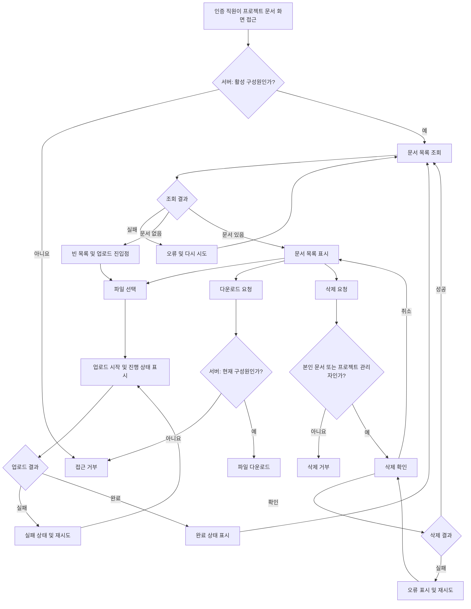

# 사내 프로젝트 문서 공유 PRD

## 1. Applicability

| Contract | Required / N/A | Evidence |
|---|---|---|
| Pages/routes or screen IDs | Required | 문서 목록·업로드와 구성원 관리가 사용자에게 노출되는 기능이다. 실제 URL은 미정이므로 안정적인 화면 ID를 사용한다. |
| Empty/loading/error/success/recovery state matrix | Required | 빈 목록, 업로드 진행률, 실패 후 재시도, 완료 상태가 명시적으로 요구되었다. |
| Mermaid user or system flow | Required | 업로드·재시도·다운로드·권한 기반 삭제로 이어지는 다단계 수명주기가 존재한다. |

## 2. Context and problem

프로젝트 문서가 개인 저장소나 비공식 채널에 분산되면 같은 프로젝트 구성원이 필요한 자료를 찾고 내려받기 어렵다. 또한 프로젝트 외부 직원에게 문서가 노출되거나 일반 구성원이 다른 사람의 문서를 삭제하는 것을 방지할 권한 통제가 필요하다.

사내 인증 사용자에게 프로젝트 단위의 문서 저장·조회·다운로드·삭제 기능을 제공한다. 프로젝트 관리자에게는 전체 문서 관리 권한과 구성원 관리 권한을 부여한다.

4주 내 내부 베타 출시를 목표로 하며, 베타 범위는 업로드, 목록, 다운로드, 삭제에 한정한다.

## 3. Goals

- 직원이 자신이 속한 프로젝트에 문서를 업로드하고 구성원과 공유할 수 있다.
- 프로젝트 구성원만 해당 프로젝트의 문서 목록과 파일에 접근할 수 있다.
- 일반 구성원은 자신이 업로드한 문서만 삭제할 수 있다.
- 프로젝트 관리자는 프로젝트 내 모든 문서를 삭제할 수 있다.
- 사용자가 업로드 진행, 실패, 재시도, 완료 여부를 명확히 알 수 있다.
- 문서가 없는 경우와 목록 조회 실패 시 적절한 상태와 복구 수단을 제공한다.
- 일반적인 조건에서 문서 목록이 2초 이내 표시되는 것을 제품 목표로 삼고 측정 가능하게 만든다.
- 4주 내 사내 사용자를 대상으로 P0 범위의 내부 베타를 제공한다.

## 4. Non-goals

1차 내부 베타에는 다음을 포함하지 않는다.

- 문서 검색, 필터 및 고급 정렬
- 외부 사용자 또는 공개 링크를 통한 공유
- 문서 미리보기
- 폴더 구조
- 문서 버전 관리
- 문서 이름 변경 및 메타데이터 편집
- 공동 편집
- 다중 파일 일괄 업로드
- 프로젝트 생성·수정·삭제
- 구성원 초대·제거 UI — 베타 포함 여부는 `OD-001`에서 최종 확정
- 확정된 상용 SLA 보장

## 5. Users, roles, and permissions

| 역할 | 정의 | 문서 목록 | 업로드 | 다운로드 | 문서 삭제 | 구성원 관리 |
|---|---|---:|---:|---:|---:|---:|
| 비구성원 | 프로젝트에 속하지 않은 인증 직원 | 불가 | 불가 | 불가 | 불가 | 불가 |
| 일반 구성원 | 프로젝트에 구성원으로 등록된 직원 | 가능 | 가능 | 가능 | 본인 업로드 문서만 가능 | 불가 |
| 프로젝트 관리자 | 해당 프로젝트의 관리자 역할을 가진 구성원 | 가능 | 가능 | 가능 | 프로젝트 내 모든 문서 가능 | 초대·제거 가능 |
| 제거된 구성원 | 과거에는 구성원이었으나 제거된 직원 | 불가 | 불가 | 불가 | 불가 | 불가 |

프로젝트 관리자 권한은 프로젝트별로 적용한다. 한 프로젝트의 관리자가 다른 프로젝트에서도 관리자 권한을 갖는다고 간주하지 않는다.

## 6. 핵심 데이터 정의

### 프로젝트 문서

| 필드 | 설명 |
|---|---|
| Document ID | 문서를 구분하는 불변 식별자 |
| Project ID | 문서가 속한 프로젝트 |
| Original filename | 업로드 당시 파일명 |
| File size | 파일 크기 |
| Media type | 감지되거나 제출된 파일 형식 |
| Uploader ID | 업로드를 완료한 직원 |
| Created at | 업로드 완료 시각 |
| Storage reference | 실제 파일을 찾기 위한 내부 참조값 |
| Status | 최소 `uploading`, `available`, `failed`, `deleted` 상태를 구분 |

목록에는 `available` 상태이며 삭제되지 않은 문서만 노출한다. 업로더 정보는 삭제 권한 판정에 사용되므로 사용자가 수정할 수 없다.

### 프로젝트 구성원

| 필드 | 설명 |
|---|---|
| Project ID | 대상 프로젝트 |
| Employee ID | 사내 인증 직원 |
| Role | `member` 또는 `admin` |
| Membership status | 최소 `active`, `removed` 구분 |

## 7. Functional requirements

우선순위 정의:

- `P0`: 4주 내부 베타 필수
- `P1`: 베타 이후 또는 제품 책임자 결정에 따라 포함

| ID | Requirement | Priority |
|---|---|---|
| FR-001 | 시스템은 서버에서 현재 사용자의 활성 프로젝트 구성원 여부를 확인한 후에만 문서 목록 접근을 허용해야 한다. | P0 |
| FR-002 | 프로젝트 구성원은 대상 프로젝트 화면에서 파일 하나를 선택하여 업로드를 시작할 수 있어야 한다. | P0 |
| FR-003 | 업로드 중에는 파일명과 진행 상태를 표시해야 한다. 전송 진행률을 계산할 수 있는 경우 0~100% 진행률을 표시하고, 계산할 수 없는 처리 단계는 진행 중 상태로 표시해야 한다. | P0 |
| FR-004 | 업로드가 실패하면 실패 상태와 재시도 동작을 제공해야 한다. 페이지를 새로고침하지 않았다면 같은 파일로 재시도할 수 있어야 한다. | P0 |
| FR-005 | 실패한 업로드를 재시도해도 하나의 성공 업로드에 대해 중복된 문서 레코드가 생성되어서는 안 된다. | P0 |
| FR-006 | 업로드가 서버에서 완료되면 완료 상태를 표시하고 해당 문서를 목록에 반영해야 한다. 완료 응답 전에는 다운로드 가능한 문서로 표시해서는 안 된다. | P0 |
| FR-007 | 문서 목록은 최소한 파일명, 파일 크기, 업로더, 업로드 완료 시각 및 사용 가능한 작업을 표시해야 한다. | P0 |
| FR-008 | 표시할 문서가 없으면 빈 목록 안내와 업로드 진입점을 제공해야 한다. | P0 |
| FR-009 | 목록 조회가 실패하면 오류 상태와 다시 시도 동작을 제공해야 한다. | P0 |
| FR-010 | 활성 프로젝트 구성원은 목록에서 문서 다운로드를 요청할 수 있어야 한다. 서버는 각 다운로드 요청 시점에 접근 권한을 검증해야 한다. | P0 |
| FR-011 | 일반 구성원에게는 자신이 업로드한 문서에만 삭제 동작을 노출하고, 서버에서도 본인 소유 여부를 검증해야 한다. | P0 |
| FR-012 | 프로젝트 관리자에게는 프로젝트 내 모든 문서의 삭제 동작을 제공해야 한다. | P0 |
| FR-013 | 삭제 전에 대상 파일명을 포함한 확인 절차를 제공해야 한다. 취소하면 문서는 변경되지 않아야 한다. | P0 |
| FR-014 | 삭제가 성공하면 문서를 목록에서 제거하고 이후 목록 조회와 새로운 다운로드 요청에서 접근할 수 없게 해야 한다. | P0 |
| FR-015 | 삭제가 실패하면 문서를 목록에 유지하고 오류 및 재시도 가능한 삭제 동작을 제공해야 한다. | P0 |
| FR-016 | 모든 목록·업로드·다운로드·삭제 요청은 클라이언트가 전달한 Project ID만 신뢰하지 않고 서버에서 프로젝트 구성원 및 역할을 검증해야 한다. | P0 |
| FR-017 | 서로 다른 프로젝트에 동일한 파일명이 존재하더라도 문서와 권한은 Project ID를 기준으로 분리되어야 한다. | P0 |
| FR-018 | 프로젝트 관리자는 기존 사내 직원을 프로젝트 구성원으로 추가할 수 있어야 한다. 이미 활성 구성원인 직원을 중복 추가해서는 안 된다. | P1 |
| FR-019 | 프로젝트 관리자는 일반 구성원을 프로젝트에서 제거할 수 있어야 한다. 제거된 사용자는 이후 해당 프로젝트 문서에 접근할 수 없어야 한다. | P1 |
| FR-020 | 구성원 제거는 그 사용자가 기존에 업로드한 문서를 자동 삭제하지 않아야 한다. 해당 문서는 프로젝트 관리자가 관리한다. | P1 |

## 8. Pages and routes

| Page or screen ID | Route, deep link, or explicit TBD + owner | Roles | Purpose |
|---|---|---|---|
| SCR-001 프로젝트 문서 목록 | URL TBD — 제품 책임자와 프론트엔드 담당자가 개발 1주 차 내 확정 | 일반 구성원, 프로젝트 관리자 | 목록 조회, 업로드, 다운로드, 권한별 삭제 |
| SCR-002 구성원 관리 | URL 및 베타 포함 여부 TBD — 제품 책임자가 스프린트 착수 전 확정 | 프로젝트 관리자 | 구성원 조회, 기존 직원 추가 및 제거 |
| SCR-003 접근 거부 | 기존 공통 오류 화면 사용 여부 TBD — 프론트엔드 담당자가 개발 1주 차 내 확정 | 비구성원 또는 제거된 구성원 | 권한 없음 안내와 안전한 이동 경로 제공 |

업로드 진행 및 삭제 확인은 `SCR-001` 내 컴포넌트나 대화상자로 제공할 수 있으며 별도 라우트를 요구하지 않는다.

## 9. State matrix

| Surface | Empty | Loading | Error | Success | Recovery |
|---|---|---|---|---|---|
| 문서 목록 | “아직 문서가 없습니다” 안내와 업로드 동작 표시 | 목록 로딩 표시. 기존 목록 갱신 중이면 기존 항목 유지 가능 | 조회 실패 메시지와 다시 시도 제공 | 접근 가능한 문서와 권한별 동작 표시 | 다시 시도 시 목록 요청 재실행 |
| 파일 업로드 | 선택된 파일 없음, 업로드 진입점 표시 | 파일명과 진행률 또는 처리 중 상태 표시 | 실패 원인 안내와 재시도 제공 | 완료 상태 표시 후 목록에 문서 반영 | 페이지가 유지된 경우 같은 파일로 재시도. 새로고침 후에는 파일 재선택 |
| 다운로드 | 해당 없음 | 요청 처리 중 상태 또는 중복 클릭 방지 | 다운로드 실패 안내와 다시 시도 제공 | 원본 파일명으로 다운로드 시작 | 권한이 유지되는 경우 다시 요청 |
| 문서 삭제 | 삭제할 문서 없음 | 확인 후 삭제 처리 중 표시, 중복 요청 방지 | 문서를 목록에 유지하고 실패 안내 | 문서를 목록에서 제거 | 같은 문서에 대해 삭제 재시도 |
| 구성원 목록(P1) | 관리자 본인 외 구성원이 없음을 표시 | 구성원 목록 로딩 표시 | 조회 실패 및 다시 시도 | 구성원과 역할 표시 | 목록 요청 재실행 |
| 구성원 초대·제거(P1) | 검색 또는 선택 대상 없음 | 요청 처리 중, 중복 요청 방지 | 실패 원인 및 재시도 제공 | 구성원 목록과 권한에 결과 반영 | 입력을 유지한 채 다시 시도 |

## 10. User or system flow

## 11. Authorization and data boundaries

- 모든 API는 인증된 직원 식별자를 서버 측 인증 정보에서 가져와야 한다. 클라이언트가 제출한 Employee ID로 사용자를 판정해서는 안 된다.
- 목록 조회는 요청한 Project ID와 사용자의 활성 멤버십을 함께 검증해야 한다.
- 문서 업로드 시 Document의 Project ID와 Uploader ID는 서버가 확정해야 한다.
- 다운로드 요청은 Document ID로 문서를 찾은 뒤 문서의 Project ID에 대해 현재 활성 멤버십을 다시 확인해야 한다.
- 일반 구성원의 삭제는 `현재 사용자 ID = Uploader ID`인 경우에만 허용한다.
- 관리자의 전체 문서 삭제 권한은 문서가 속한 동일 프로젝트에서 관리자 역할을 가진 경우에만 허용한다.
- UI에서 삭제 버튼을 숨기는 것은 보조 동작이며 권한 통제를 대체하지 않는다. 조작된 API 요청도 서버에서 거절해야 한다.
- 다른 프로젝트의 문서 존재 여부, 파일명, 업로더 등 메타데이터가 오류 응답을 통해 노출되어서는 안 된다.
- 구성원 제거가 완료된 뒤 시작되는 목록·업로드·다운로드·삭제 요청은 거절해야 한다.
- 저장소의 내부 위치나 영구적인 무권한 다운로드 주소를 사용자에게 직접 노출해서는 안 된다.
- 파일명은 화면 표시 및 다운로드 헤더에서 스크립트나 헤더 삽입으로 해석되지 않도록 안전하게 처리해야 한다.
- 삭제된 문서의 실제 보관·복구 정책은 `OD-004` 결정에 따른다. 단, 사용자 기능상 삭제 성공 직후부터 접근할 수 없어야 한다.

## 12. Non-functional requirements

| ID | 항목 | 요구사항 |
|---|---|---|
| NFR-001 | 목록 체감 성능 | 문서 목록 요청 시작부터 빈 상태 또는 첫 목록 결과가 표시될 때까지 2초 이내를 제품 목표로 한다. 이는 확정 SLA가 아니며 측정 환경과 백분위 기준은 `OD-002`에서 정한다. |
| NFR-002 | 성능 측정 가능성 | 목록 표시 시간은 내부 베타에서 재현 가능한 테스트 또는 운영 측정으로 확인할 수 있어야 한다. |
| NFR-003 | 전송 안정성 | 동일 업로드 또는 삭제 요청의 재시도로 성공 결과가 중복 생성되지 않도록 요청을 안전하게 처리해야 한다. |
| NFR-004 | 접근 통제 | 프로젝트·역할·소유권 권한은 모든 관련 서버 요청에 일관되게 적용해야 한다. |
| NFR-005 | 사용자 피드백 | 목록, 업로드, 다운로드 및 삭제의 장시간 처리나 실패가 무응답 상태로 보이지 않도록 처리 상태를 표시해야 한다. |
| NFR-006 | 브라우저 범위 | 지원 브라우저와 최소 버전은 `OD-006`에서 정하며, 확정된 범위에서 업로드 진행률과 다운로드를 검증해야 한다. |

별도의 가용성 수치, 동시 사용자 수, 저장 용량, 상용 SLA는 근거가 없어 이 PRD에서 확정하지 않는다.

## 13. Acceptance criteria

| ID | Requirement | Given | When | Then | Verification |
|---|---|---|---|---|---|
| AC-001 | FR-001, FR-007, FR-008, FR-009 | 활성 프로젝트 구성원이 문서 화면에 접근했다 | 목록 조회가 완료·빈 결과·실패 중 하나로 끝난다 | 각각 문서 목록, 빈 상태와 업로드 동작, 오류와 다시 시도가 표시된다 | UI 통합 테스트 |
| AC-002 | FR-002, FR-003 | 활성 구성원이 유효한 파일을 선택했다 | 업로드를 시작한다 | 파일명과 진행률 또는 처리 중 상태가 업로드 종료 전까지 표시된다 | UI 및 API 통합 테스트 |
| AC-003 | FR-004, FR-005 | 업로드 전송이 실패했고 페이지가 새로고침되지 않았다 | 사용자가 다시 시도를 선택한다 | 같은 파일을 다시 전송할 수 있고 최종 성공 문서는 한 건만 생성된다 | 실패 주입 통합 테스트 |
| AC-004 | FR-006 | 파일 전송 및 서버 처리가 성공했다 | 완료 응답을 받는다 | 완료 상태가 표시되고 문서가 목록에서 다운로드 가능한 상태로 나타난다 | E2E 테스트 |
| AC-005 | FR-010, FR-016 | 활성 구성원이 접근 가능한 문서를 선택했다 | 다운로드를 요청한다 | 서버가 현재 멤버십을 검증하고 파일 다운로드를 시작한다 | API 권한 및 E2E 테스트 |
| AC-006 | FR-010, FR-016, FR-017 | 비구성원이 다른 프로젝트의 Document ID를 알고 있다 | 목록 또는 다운로드 API를 직접 호출한다 | 요청이 거절되고 문서 메타데이터나 파일 내용이 노출되지 않는다 | API 보안 테스트 |
| AC-007 | FR-011 | 일반 구성원이 자신이 올린 문서를 보고 있다 | 삭제를 확인한다 | 삭제가 성공하고 문서가 목록에서 사라지며 다시 다운로드할 수 없다 | E2E 및 API 테스트 |
| AC-008 | FR-011, FR-016 | 일반 구성원이 다른 구성원의 Document ID로 삭제 API를 호출한다 | 서버가 요청을 처리한다 | 삭제가 거절되고 원본 문서는 유지된다 | API 권한 테스트 |
| AC-009 | FR-012 | 프로젝트 관리자가 같은 프로젝트의 다른 구성원 문서를 선택한다 | 삭제를 확인한다 | 삭제가 성공하고 문서가 이후 목록과 다운로드에서 제외된다 | E2E 및 API 테스트 |
| AC-010 | FR-013 | 삭제 권한이 있는 사용자가 삭제를 선택했다 | 확인 화면에서 취소한다 | 삭제 요청이 실행되지 않고 문서가 유지된다 | UI 테스트 |
| AC-011 | FR-014, FR-015 | 삭제 권한이 있는 사용자가 삭제를 확인했다 | 서버 삭제가 각각 성공하거나 실패한다 | 성공 시 목록에서 제거되고, 실패 시 문서 유지와 오류 및 재시도가 제공된다 | 성공·실패 통합 테스트 |
| AC-012 | FR-016, FR-017 | 사용자가 Project ID나 Uploader ID를 변조한 요청을 보낸다 | 업로드 또는 삭제 API를 호출한다 | 서버가 인증 정보와 실제 문서 소속을 기준으로 처리하며 무권한 요청을 거절한다 | API 보안 테스트 |
| AC-013 | FR-018 | 프로젝트 관리자가 기존 사내 비구성원을 추가한다 | 요청이 성공한다 | 대상 직원이 활성 구성원이 되며 같은 직원을 다시 추가해도 중복 멤버십이 생기지 않는다 | P1 API 및 E2E 테스트 |
| AC-014 | FR-019, FR-020 | 프로젝트 관리자가 문서를 업로드한 일반 구성원을 제거했다 | 제거된 사용자가 새 문서 요청을 보낸다 | 접근은 거절되며 기존 업로드 문서는 삭제되지 않고 관리자에게 유지된다 | P1 권한 통합 테스트 |
| AC-015 | NFR-001, NFR-002 | `OD-002`에서 합의된 데이터량, 환경 및 측정 조건이 준비됐다 | 문서 목록 성능을 측정한다 | 결과가 2초 제품 목표와 비교 가능한 형태로 기록된다 | 성능 테스트 또는 베타 측정 |
| AC-016 | NFR-006 | 지원 브라우저 범위가 확정됐다 | 핵심 업로드·목록·다운로드·삭제 시나리오를 실행한다 | 범위 내 브라우저에서 P0 시나리오가 통과한다 | 브라우저 호환성 테스트 |

## 14. Assumptions and open decisions

### 합리적 가정

| ID | 가정 | 영향 |
|---|---|---|
| AS-001 | 직원 인증과 프로젝트·구성원 식별 정보는 기존 시스템에서 제공되거나 베타 전에 시드할 수 있다. | 별도의 회원가입 및 프로젝트 생성 기능을 만들지 않는다. |
| AS-002 | 베타 업로드는 한 번의 작업에서 파일 하나를 처리한다. 여러 파일을 차례로 올리는 것은 가능하지만 일괄 업로드는 제공하지 않는다. | 4주 범위에서 업로드 상태와 재시도 복잡도를 제한한다. |
| AS-003 | 동일 프로젝트에서 같은 파일명의 문서를 여러 개 올릴 수 있으며 기존 파일을 자동 덮어쓰지 않는다. | 문서는 파일명이 아닌 Document ID로 구분한다. |
| AS-004 | 기본 목록 순서는 업로드 완료 시각 기준 최신순이다. | 별도 정렬 기능 없이 최근 문서를 우선 노출한다. |
| AS-005 | “초대”는 기존 사내 인증 직원을 프로젝트 멤버십에 추가하는 의미다. 이메일 초대, 가입 절차 또는 외부 사용자 초대는 포함하지 않는다. | P1 구성원 관리 범위를 제한한다. |
| AS-006 | 구성원 제거는 그 직원이 업로드한 문서를 삭제하지 않는다. | 프로젝트 자료 보존과 관리자 관리를 가능하게 한다. |
| AS-007 | 업로드 실패 후 브라우저 새로고침이 발생하면 보안상 파일을 자동 복원하지 않고 사용자가 다시 선택한다. | 새로고침을 넘는 로컬 파일 보존 기능은 만들지 않는다. |

### 열린 결정

| ID | 결정할 내용 | 선택이 미치는 영향 | Owner | 결정 시점 |
|---|---|---|---|---|
| OD-001 | 구성원 초대·제거를 4주 내부 베타에 포함할지, 기존 시스템이나 운영 절차로 대체할지 | 범위, 화면, API, 테스트 일정에 직접 영향 | 제품 책임자 | 스프린트 착수 전 |
| OD-002 | 2초 목표의 측정 환경, 문서 수, 네트워크 조건 및 백분위 기준과 향후 실제 SLA | 성능 설계, 테스트 통과 기준 및 운영 약속 | 제품 책임자 + 엔지니어링 리드 | 베타 측정 계획 수립 전; 실제 SLA는 정식 출시 전 |
| OD-003 | 허용 파일 형식, 파일당 최대 크기, 프로젝트별 저장 한도 | 클라이언트 검증, 서버 제한, 저장 비용과 오류 메시지 | 제품 책임자 + 보안/인프라 담당 | 개발 1주 차 내 |
| OD-004 | 삭제 파일의 물리 삭제 시점, 복구 가능 기간, 감사 기록 및 보존 정책 | 데이터 모델, 저장소 수명주기, 관리자 지원과 보안 | 제품 책임자 + 보안 담당 | 베타 배포 전 |
| OD-005 | 악성코드 검사 필요 여부와 검사 중 상태, 감염 파일 처리 방식 | 업로드 완료 정의, 상태 모델, 보안 및 일정 | 보안 담당 + 제품 책임자 | 개발 1주 차 내 |
| OD-006 | 내부 베타의 지원 브라우저와 최소 버전 | 업로드 진행률, 다운로드 및 호환성 테스트 범위 | 제품 책임자 + 프론트엔드 담당 | 개발 1주 차 내 |
| OD-007 | 같은 프로젝트에 관리자가 최소 한 명 남아야 하는지, 관리자를 제거하거나 역할 변경할 수 있는지 | P1 구성원 관리 권한과 잠금 방지 규칙 | 제품 책임자 | P1 구현 착수 전 |

`OD-001`, `OD-003`, `OD-005`는 구현 범위 또는 업로드 완료 조건을 바꾸므로 조기에 확정해야 한다. 결정 전까지 베타 계획은 구성원 관리 제외, 단일 파일 업로드, 파일 제한값 설정 가능 구조를 기준으로 진행한다.

## 15. Risks and mitigations

| Risk | 영향 | Mitigation |
|---|---|---|
| 베타 범위와 관리자 구성원 관리 요구의 충돌 | 4주 일정 초과 또는 핵심 기능 완성도 저하 | `OD-001`을 착수 전에 확정하고, 미포함 시 기존 멤버십 공급 경로를 명시한다. |
| 파일 크기·형식·보안 정책이 늦게 결정됨 | 업로드 API와 상태 모델 재작업 | 개발 1주 차에 `OD-003`, `OD-005` 결정 회의를 진행한다. |
| 클라이언트 UI에만 권한을 적용함 | 다른 사용자의 문서 유출·삭제 | 목록, 업로드, 다운로드, 삭제마다 서버 권한 테스트를 필수화한다. |
| 재시도로 중복 문서가 생성됨 | 목록 오염과 저장 공간 낭비 | 업로드 작업 식별자를 사용해 성공 결과의 중복 생성을 방지하고 실패 주입 테스트를 수행한다. |
| 큰 목록에서 2초 목표를 달성하지 못함 | 사용자 체감 품질 저하 | 측정 조건을 확정하고 베타 데이터량에서 목록 쿼리 및 응답 크기를 측정한다. SLA는 측정 결과 후 결정한다. |
| 삭제 의미가 불명확함 | 사용자 기대와 실제 데이터 보존 불일치 | UI 접근 차단과 물리 보존 정책을 분리하고 `OD-004`를 배포 전에 확정한다. |
| 구성원 제거 후 기존 세션으로 접근함 | 권한 회수 지연 | 각 서버 요청에서 현재 멤버십을 재검증하고 제거 시점 이후 요청을 거절한다. |

## 16. Delivery

| Phase | Requirement IDs | Verifiable exit condition |
|---|---|---|
| 1주 차: 결정 및 기반 계약 | FR-001, FR-016, FR-017, NFR-004 | `OD-001`, `OD-003`, `OD-005`, `OD-006`이 확정되고 프로젝트 경계·역할별 API 권한 테스트 골격이 준비된다. |
| 2주 차: 목록·업로드·다운로드 | FR-002~FR-010, NFR-003, NFR-005 | 빈 목록, 목록 조회, 단일 파일 업로드, 진행 상태, 실패 재시도, 완료 표시 및 권한 있는 다운로드 통합 테스트가 통과한다. |
| 3주 차: 삭제·권한·복구 상태 | FR-011~FR-017, NFR-004 | 일반 구성원과 관리자 삭제 규칙, 변조 요청 거절, 삭제 실패 재시도 및 프로젝트 간 격리 테스트가 통과한다. |
| 4주 차: 성능·호환성·내부 베타 | FR-001~FR-017, NFR-001~NFR-006 | P0 수용 기준이 지원 브라우저에서 통과하고, 목록 표시 시간이 합의된 조건에서 측정되며, 알려진 제한과 열린 SLA 결정이 베타 참여자에게 공유된다. |
| P1: 구성원 관리 | FR-018~FR-020 | 프로젝트 관리자의 기존 직원 추가·제거, 중복 방지, 제거 즉시 접근 차단 및 기존 문서 유지 테스트가 통과한다. |

### 내부 베타 출시 기준

- `AC-001`~`AC-012`, `AC-015`, `AC-016` 통과
- 심각도 높은 권한 우회 또는 프로젝트 간 데이터 노출 결함 0건
- `OD-003`~`OD-006` 중 베타 동작에 영향을 주는 결정 완료
- 목록 2초 목표에 대한 측정 결과 기록
- 실제 SLA는 미확정임을 내부 베타 운영 문서에 명시
- `OD-001` 결정에 따라 구성원 관리가 제외될 경우, 베타 프로젝트의 구성원을 공급·변경할 운영 경로가 준비됨

요청에 따라 파일을 생성하지 않았으므로 PRD 파일 검증기는 실행하지 않았다.