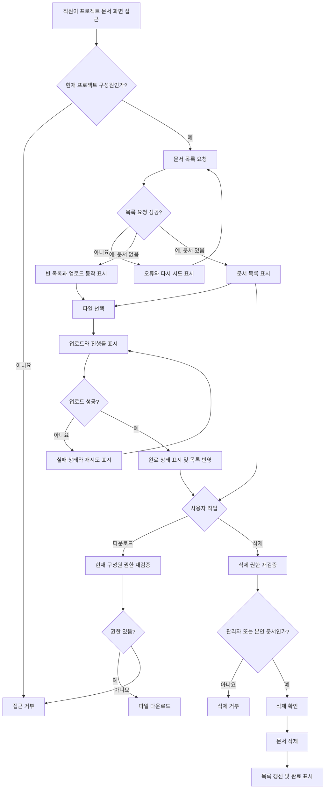

# 사내 프로젝트 문서 공유 PRD

## 1. 문서 정보

- 제품 범위: 사내 프로젝트별 문서 공유
- 대상 릴리스: 1차 내부 베타
- 목표 일정: 개발 착수 후 4주 이내
- 문서 상태: Draft
- 1차 출시 범위: 업로드, 목록 조회, 다운로드, 삭제
- 제외 범위: 검색, 외부 공유, 구성원 관리 UI

## 2. Applicability

| Contract | Required / N/A | Evidence |
|---|---|---|
| Pages/routes or screen IDs | Required | 문서 목록과 업로드·다운로드·삭제 동작을 제공하는 사용자 화면이 필요하다. 실제 URL은 기존 프로젝트 정보 구조에 따라 결정한다. |
| Empty/loading/error/success/recovery state matrix | Required | 빈 목록, 업로드 진행률, 실패 후 재시도, 업로드 완료 상태가 명시적으로 요구되었다. |
| Mermaid user or system flow | Required | 업로드와 삭제는 권한 확인, 처리, 성공·실패 복구로 이어지는 다단계 흐름이다. |

## 3. 배경과 문제

프로젝트 관련 문서가 개인 저장소나 메신저 등에 분산되면 구성원이 필요한 문서를 찾거나 최신 공유 자료에 접근하기 어렵다. 또한 프로젝트 외부 직원이 문서를 열람하거나 일반 구성원이 다른 직원의 문서를 삭제하지 못하도록 프로젝트 단위 접근 통제가 필요하다.

프로젝트 구성원이 하나의 공간에서 문서를 업로드하고, 목록을 확인하고, 다운로드하고, 권한 범위 내에서 삭제할 수 있는 최소 기능을 제공한다.

## 4. 목표

- 직원이 자신이 참여 중인 프로젝트에 문서를 업로드할 수 있다.
- 같은 프로젝트의 현재 구성원만 문서 목록을 조회하고 다운로드할 수 있다.
- 업로드 진행 상태와 성공·실패 결과를 명확하게 확인할 수 있다.
- 실패한 업로드를 동일 화면에서 재시도할 수 있다.
- 프로젝트 관리자는 프로젝트 내 모든 문서를 삭제할 수 있다.
- 일반 구성원은 본인이 업로드한 문서만 삭제할 수 있다.
- 4주 이내 내부 베타를 제공하고 실제 사용성을 검증한다.
- 문서 목록이 빠르게 표시되는 경험을 목표로 하며, 정식 SLA 결정에 필요한 측정 기반을 마련한다.

## 5. 비목표

1차 출시에는 다음을 포함하지 않는다.

- 문서 검색, 필터 또는 고급 정렬
- 사외 사용자 대상 공유 또는 공개 링크
- 프로젝트 구성원 초대·제거 UI
- 문서 미리보기 또는 웹 편집
- 버전 관리와 변경 이력 복원
- 폴더 또는 태그 분류
- 문서 공동 편집
- 삭제 문서 복원 UI
- 모바일 앱 전용 기능

프로젝트 관리자의 구성원 초대·제거 권한은 전체 제품 권한 모델에는 포함되지만, 명시된 1차 출시 범위에는 포함하지 않는다. 베타에서는 기존 프로젝트 구성원 관리 기능 또는 별도 관리 절차를 사용한다고 가정한다.

## 6. 사용자, 역할 및 권한

| 역할 | 정의 | 목록/다운로드 | 업로드 | 삭제 | 구성원 관리 |
|---|---|---:|---:|---:|---:|
| 프로젝트 관리자 | 해당 프로젝트의 관리자 권한을 가진 직원 | 가능 | 가능 | 프로젝트 내 모든 문서 | 권한 보유, 단 1차 출시 UI 제외 |
| 일반 구성원 | 해당 프로젝트에 참여 중인 직원 | 가능 | 가능 | 본인이 업로드한 문서만 | 불가 |
| 비구성원 | 해당 프로젝트의 현재 구성원이 아닌 직원 | 불가 | 불가 | 불가 | 불가 |

모든 권한은 요청 시점의 프로젝트 소속과 역할을 기준으로 서버에서 검증한다. 화면에서 버튼을 숨기는 것만으로 권한을 통제해서는 안 된다.

## 7. 기능 요구사항

| ID | Requirement | Priority |
|---|---|---|
| FR-01 | 인증된 직원은 자신이 현재 구성원인 프로젝트의 문서 화면에 접근할 수 있다. | Must |
| FR-02 | 프로젝트 구성원은 로컬 파일을 선택하여 해당 프로젝트에 업로드할 수 있다. | Must |
| FR-03 | 시스템은 업로드 중인 각 파일의 진행률을 0~100% 범위로 표시한다. | Must |
| FR-04 | 업로드 성공 시 완료 상태를 표시하고 해당 문서를 목록에 노출한다. | Must |
| FR-05 | 업로드 실패 시 실패 상태와 재시도 동작을 제공한다. 재시도는 동일 파일에 대한 새 업로드 시도로 처리하며 중복 완료 문서를 만들지 않아야 한다. | Must |
| FR-06 | 프로젝트 구성원은 해당 프로젝트의 업로드 완료 문서 목록을 조회할 수 있다. | Must |
| FR-07 | 목록에는 최소한 파일명, 파일 크기, 업로더, 업로드 일시 및 사용 가능한 작업을 표시한다. | Must |
| FR-08 | 등록된 문서가 없으면 빈 목록 상태와 업로드 유도 동작을 표시한다. | Must |
| FR-09 | 프로젝트 구성원은 목록에서 문서를 다운로드할 수 있다. 다운로드 시에도 서버가 현재 접근 권한을 검증한다. | Must |
| FR-10 | 일반 구성원은 자신이 업로드한 문서에만 삭제 동작을 사용할 수 있다. | Must |
| FR-11 | 프로젝트 관리자는 해당 프로젝트의 모든 문서를 삭제할 수 있다. | Must |
| FR-12 | 삭제 전 대상 파일명을 포함한 확인 절차를 제공하고, 성공 후 문서를 목록에서 제거한다. | Must |
| FR-13 | 권한이 없거나 이미 삭제된 문서에 대한 삭제 요청은 문서를 변경하지 않고 사용자에게 결과를 알린다. | Must |
| FR-14 | 목록·다운로드·삭제 요청이 실패하면 이해 가능한 오류 상태를 표시하고, 가능한 경우 다시 시도할 수 있게 한다. | Must |
| FR-15 | 구성원에서 제거된 사용자는 기존 문서 URL이나 다운로드 요청 정보를 보유하고 있더라도 프로젝트 문서에 접근할 수 없다. | Must |
| FR-16 | 프로젝트 관리자는 구성원을 초대하거나 제거할 권한을 가진다. 단, 해당 관리 화면과 API의 신규 구현은 1차 출시 범위에서 제외한다. | Later |

## 8. 페이지 및 화면

| Page or screen ID | Route, deep link, or explicit TBD + owner | Roles | Purpose |
|---|---|---|---|
| DOC-LIST | `TBD` — 기존 프로젝트 상세 화면 구조 확인 후 기술 책임자가 1주 차에 결정 | 프로젝트 관리자, 일반 구성원 | 문서 목록 조회, 업로드 진입, 다운로드 및 삭제 |
| DOC-UPLOAD | DOC-LIST 내 패널·모달·인라인 영역 중 `TBD` — 제품 책임자와 디자인 담당자가 1주 차에 결정 | 프로젝트 관리자, 일반 구성원 | 파일 선택, 진행률, 실패·재시도, 완료 상태 제공 |
| DOC-DELETE-CONFIRM | DOC-LIST 내 확인 다이얼로그 | 삭제 권한이 있는 사용자 | 삭제 대상 확인 및 최종 실행 |

별도의 다운로드 페이지는 두지 않고 DOC-LIST에서 다운로드를 시작한다.

## 9. 상태 매트릭스

| Surface | Empty | Loading | Error | Success | Recovery |
|---|---|---|---|---|---|
| 문서 목록 | “아직 공유된 문서가 없습니다” 메시지와 업로드 동작 표시 | 목록 로딩 표시. 기존 데이터가 있으면 불필요하게 제거하지 않음 | 목록을 불러오지 못했다는 메시지 | 업로드 완료 문서와 작업 표시 | 목록 다시 시도 |
| 파일 업로드 | 선택된 파일 없음 | 파일별 진행률 표시 | 실패 원인을 사용자 행동이 가능한 수준으로 표시 | 완료 상태 표시 후 목록에 문서 반영 | 동일 파일 다시 시도 또는 새 파일 선택 |
| 다운로드 | 해당 없음 | 다운로드 시작 상태 또는 브라우저 기본 피드백 | 실패 또는 접근 불가 메시지 | 파일 다운로드 시작 | 다시 시도 |
| 문서 삭제 | 삭제할 문서가 없거나 이미 삭제됨 | 확인 후 삭제 처리 중이며 중복 실행 방지 | 권한 없음, 처리 실패 또는 이미 삭제됨 표시 | 목록에서 제거하고 완료 피드백 표시 | 실패 시 다이얼로그 또는 목록에서 다시 시도 |

업로드 완료 상태는 사용자가 결과를 인지할 수 있을 만큼 유지하되, 구체적인 표시 방식과 유지 시간은 UI 설계에서 결정한다.

## 10. 사용자 및 시스템 흐름

## 11. 권한 및 데이터 경계

- 모든 문서는 정확히 하나의 프로젝트에 소속된다.
- 문서 메타데이터와 파일 접근은 프로젝트 경계를 기준으로 격리한다.
- 목록 조회, 업로드, 다운로드 및 삭제 요청마다 현재 프로젝트 구성원 여부를 서버에서 확인한다.
- 삭제 요청은 현재 역할과 업로더 식별자를 함께 검증한다.
- 클라이언트가 전달한 프로젝트 ID, 업로더 ID 또는 역할 값을 신뢰하지 않는다.
- 일반 구성원의 삭제 버튼은 본인 문서에만 노출하지만, 직접 API를 호출하더라도 다른 구성원의 문서는 삭제할 수 없어야 한다.
- 프로젝트 관리자의 삭제 권한은 자신이 관리자로 지정된 프로젝트에만 적용한다.
- 구성원 제거가 완료된 이후의 신규 목록·다운로드·업로드·삭제 요청은 거부한다.
- 다운로드 주소가 공유되더라도 인증과 현재 프로젝트 권한 확인을 우회할 수 없어야 한다.
- 삭제 방식, 보관 기간 및 복구 정책은 열린 결정 OD-04가 확정된 후 데이터 처리 방식에 반영한다.

## 12. 비기능 요구사항

| ID | Requirement |
|---|---|
| NFR-01 | 문서 목록 화면 진입 또는 목록 요청 시작부터 문서 행이나 빈 상태가 표시될 때까지의 시간을 측정 가능해야 한다. |
| NFR-02 | 목록 표시 시간은 합의된 베타 측정 환경에서 2초 이내를 제품 목표로 한다. 이는 확정 SLA가 아니며, 측정 조건과 백분위 기준은 OD-01에서 결정한다. |
| NFR-03 | 업로드 진행률은 실제 전송 진행 상황을 반영해야 하며 완료 전 100%로 표시해서는 안 된다. |
| NFR-04 | 실패한 업로드의 재시도는 별도 업로드 시도로 식별되어야 하며, 한 번의 성공 결과가 목록에 중복 생성되지 않아야 한다. |
| NFR-05 | 파일 전송 및 다운로드는 조직의 기존 인증 세션과 전송 보안 정책을 따라야 한다. 별도 정책이 없다면 출시 전에 보안 책임자의 확인이 필요하다. |
| NFR-06 | 사용자에게 내부 저장 경로, 스택 트레이스 또는 민감한 시스템 오류 정보를 노출하지 않는다. |

가용성 수치, 동시 사용자 수, 저장 용량 및 정식 응답시간 SLA는 근거가 없어 이 PRD에서 임의로 정하지 않는다.

## 13. 수용 기준

| ID | Requirement | Given | When | Then | Verification |
|---|---|---|---|---|---|
| AC-01 | FR-01, FR-06, FR-07, FR-08 | 프로젝트 구성원으로 로그인했다 | 문서 화면에 접근한다 | 문서가 있으면 필수 정보가 포함된 목록이 표시되고, 없으면 빈 상태와 업로드 동작이 표시된다 | UI 통합 테스트 |
| AC-02 | FR-01, FR-15 | 프로젝트 비구성원이거나 구성원에서 제거되었다 | 문서 목록 또는 기존 문서 주소에 접근한다 | 문서 정보와 파일 내용이 노출되지 않고 요청이 거부된다 | API 권한 테스트 |
| AC-03 | FR-02, FR-03 | 프로젝트 구성원이 유효한 파일을 선택했다 | 업로드를 시작한다 | 업로드가 진행되고 파일별 진행률이 0~100% 범위에서 표시된다 | UI/E2E 테스트 |
| AC-04 | FR-04, NFR-03 | 업로드가 서버에서 성공적으로 완료되었다 | 완료 응답을 수신한다 | 완료 상태가 표시되고 문서가 목록에 한 번만 나타난다 | E2E 테스트 |
| AC-05 | FR-05, NFR-04 | 업로드가 실패했다 | 사용자가 재시도를 선택한다 | 동일 파일 업로드가 다시 시작되고, 성공 시 완료 문서가 하나만 생성된다 | 실패 주입 E2E 테스트 |
| AC-06 | FR-09 | 현재 프로젝트 구성원이 목록의 문서를 선택했다 | 다운로드를 실행한다 | 서버의 권한 확인 후 원본 파일 다운로드가 시작된다 | API 및 E2E 테스트 |
| AC-07 | FR-09, FR-15 | 비구성원이 문서 식별자나 기존 다운로드 정보를 가지고 있다 | 다운로드를 요청한다 | 파일 내용이 반환되지 않는다 | API 권한 테스트 |
| AC-08 | FR-10 | 일반 구성원이 본인이 업로드한 문서를 보고 있다 | 삭제 확인 후 삭제한다 | 문서가 삭제되고 목록에서 제거된다 | E2E 테스트 |
| AC-09 | FR-10, FR-13 | 일반 구성원이 다른 구성원의 문서 삭제 API를 호출한다 | 요청이 처리된다 | 요청이 거부되고 대상 문서는 유지된다 | API 권한 테스트 |
| AC-10 | FR-11, FR-12 | 프로젝트 관리자가 해당 프로젝트의 문서를 보고 있다 | 대상 파일명을 확인하고 삭제한다 | 업로더와 관계없이 삭제되고 목록에서 제거된다 | E2E 테스트 |
| AC-11 | FR-11 | 관리자가 자신이 관리하지 않는 프로젝트의 문서 ID를 알고 있다 | 삭제를 요청한다 | 요청이 거부되고 문서는 유지된다 | API 권한 테스트 |
| AC-12 | FR-13 | 동일 문서가 이미 삭제되었거나 동시에 삭제되었다 | 사용자가 다시 삭제한다 | 시스템 오류 화면 대신 이미 삭제되었음을 알리고 목록을 최신 상태로 갱신할 수 있다 | 동시성 통합 테스트 |
| AC-13 | FR-14 | 목록·다운로드·삭제 중 복구 가능한 오류가 발생했다 | 오류 결과가 반환된다 | 사용자에게 오류와 다시 시도 가능한 동작이 표시된다 | 실패 주입 UI 테스트 |
| AC-14 | NFR-01, NFR-02 | 제품 책임자가 승인한 베타 측정 환경과 데이터 조건이 준비되었다 | 문서 목록 표시 시간을 측정한다 | 측정값이 기록되며 2초 목표 충족 여부를 판별할 수 있다 | 성능 테스트 및 측정 로그 |
| AC-15 | FR-16 | 프로젝트 관리자가 구성원을 관리하려 한다 | 1차 베타 기능을 확인한다 | 신규 구성원 관리 UI는 제공되지 않으며 기존 관리 수단을 사용한다 | 범위 검토 |

## 14. 합리적 가정

다음은 현재 브리프와 4주 일정에 근거한, 변경 가능한 기본 가정이다.

| ID | Assumption | 변경 시 영향 |
|---|---|---|
| AS-01 | 사내 직원 인증과 프로젝트·구성원·관리자 정보는 기존 시스템에서 제공된다. | 없다면 인증과 프로젝트 관리 구축이 추가되어 4주 일정 재산정이 필요하다. |
| AS-02 | 하나의 문서는 하나의 프로젝트에만 소속된다. | 복수 프로젝트 공유가 필요하면 권한 및 데이터 모델 변경이 필요하다. |
| AS-03 | 업로더는 업로드 완료 시점의 직원 계정으로 기록되며 이후 변경되지 않는다. | 소유권 이전이 필요하면 별도 정책과 기능이 필요하다. |
| AS-04 | 권한은 요청 시점의 현재 구성원 및 역할을 기준으로 판단한다. | 과거 구성원 접근 허용이 필요하면 별도 보존·접근 정책이 필요하다. |
| AS-05 | 목록은 기본적으로 최신 업로드 순으로 표시한다. | 다른 기본 정렬이 필요하면 UI 및 API 계약을 조정한다. |
| AS-06 | 업로드 실패 후 페이지를 떠나지 않은 동안에는 선택한 파일을 유지하여 바로 재시도할 수 있다. 새로고침 후 자동 복구는 1차 범위가 아니다. | 세션 간 업로드 복구가 필요하면 재개 가능한 업로드 설계가 필요하다. |
| AS-07 | 1차 베타에서는 기존 프로젝트 구성원 관리 수단을 이용한다. | 기존 수단이 없다면 초대·제거 기능의 범위와 일정 결정을 다시 해야 한다. |

## 15. 열린 결정

| ID | Decision | Owner | 결정 시점 | 미결정 시 영향 |
|---|---|---|---|---|
| OD-01 | 정식 목록 성능 SLA, 측정 백분위, 데이터 규모, 네트워크 및 기기 조건 | 제품 책임자 | 내부 베타 측정 후 정식 출시 계획 전 | 2초는 베타 제품 목표로만 사용하며 SLA 준수를 선언할 수 없다. |
| OD-02 | 허용 파일 형식, 단일 파일 최대 크기, 프로젝트·사용자별 저장 한도 | 제품 책임자 + 기술 책임자 + 보안 책임자 | 1주 차 종료 전 | 업로드 검증, 오류 문구, 저장 설계를 확정할 수 없다. |
| OD-03 | 악성 파일 검사, 차단 파일 정책 및 검사 중 문서의 노출 여부 | 보안 책임자 | 1주 차 종료 전 | 안전한 다운로드 정책과 업로드 완료 정의를 확정할 수 없다. |
| OD-04 | 삭제가 즉시 영구 삭제인지, 복구 가능한 소프트 삭제인지와 보관 기간 | 제품 책임자 + 보안/정보관리 책임자 | 1주 차 종료 전 | 삭제 API, 저장 비용 및 운영 복구 절차를 확정할 수 없다. |
| OD-05 | 동일 프로젝트 내 같은 파일명 허용 여부와 목록 표시 방식 | 제품 책임자 | 1주 차 종료 전 | 중복 파일명 처리와 사용자 안내가 달라진다. |
| OD-06 | 대규모 목록에 필요한 페이지네이션 방식과 베타 기준 문서 수 | 기술 책임자 + 제품 책임자 | 1주 차 종료 전 | 목록 API와 2초 성능 목표 검증 조건을 확정할 수 없다. |
| OD-07 | 구성원 초대·제거가 실제로 기존 기능으로 제공되는지, 아니면 후속 출시로 신규 개발해야 하는지 | 제품 책임자 | 착수 전 또는 1주 차 초 | 기존 기능이 없으면 브리프의 구성원 관리 요구를 1차 출시에서 충족하지 못한다. |
| OD-08 | DOC-LIST의 실제 경로와 업로드 UI 형태 | 제품 책임자 + 기술/디자인 담당자 | 1주 차 | 라우팅과 E2E 테스트 기준 확정이 지연된다. |

OD-02, OD-03, OD-04는 구현과 안전성에 직접 영향을 주므로 개발 1주 차 안에 반드시 확정해야 한다.

## 16. 위험 및 완화책

| Risk | 영향 | 완화 |
|---|---|---|
| 구성원 권한을 UI에서만 제한 | 문서 유출 또는 무단 삭제 | 모든 목록·업로드·다운로드·삭제 요청에서 서버 권한 테스트 수행 |
| 파일 정책 결정 지연 | 업로드 API와 오류 처리 재작업 | OD-02와 OD-03을 1주 차 출시 차단 결정으로 관리 |
| 대용량 파일 또는 많은 문서 | 업로드 실패 및 목록 2초 목표 미달 | 베타 데이터 조건 측정, 파일 한도 결정, 페이지네이션 검토 |
| 업로드 재시도로 중복 문서 생성 | 목록 신뢰도 저하 및 저장 낭비 | 업로드 시도 식별과 중복 완료 방지 테스트 적용 |
| 삭제 정책 불명확 | 복구 불가 사고 또는 불필요한 저장 비용 | OD-04 확정 전 영구 삭제 동작을 출시하지 않음 |
| 구성원 관리 기능이 실제로 없음 | 관리자가 접근 권한을 운영할 수 없음 | 착수 시 기존 관리 수단 확인, 없으면 범위 또는 일정 재협의 |
| 4주 일정 내 범위 증가 | 베타 지연과 품질 저하 | 검색, 외부 공유, 미리보기, 버전 관리 및 신규 구성원 관리 UI를 범위 밖으로 유지 |

## 17. 전달 계획

| Phase | Requirement IDs | Verifiable exit condition |
|---|---|---|
| 1주 차: 계약 및 기반 확정 | FR-01, FR-06, FR-07, FR-16, NFR-01 | 기존 인증·프로젝트 구성원 정보 연동을 확인하고, OD-02~OD-08의 1주 차 결정 사항과 API·화면 계약이 승인된다. |
| 2주 차: 핵심 기능 구현 | FR-02, FR-03, FR-04, FR-06, FR-08, FR-09 | 구성원이 개발 환경에서 업로드 진행률 확인, 목록 조회, 빈 상태 확인 및 다운로드를 수행할 수 있다. |
| 3주 차: 권한·삭제·복구 구현 | FR-05, FR-10, FR-11, FR-12, FR-13, FR-14, FR-15, NFR-03~NFR-06 | 역할별 삭제와 접근 제한, 업로드 재시도 및 오류 복구에 대한 API·통합 테스트가 통과한다. |
| 4주 차: 베타 검증 및 배포 | FR-01~FR-15, NFR-01~NFR-06 | Must 수용 기준이 통과하고, 보안 권한 테스트 및 목록 표시 시간 측정 결과가 기록되며 내부 베타 배포 승인을 받는다. |

## 18. 내부 베타 출시 기준

- Must 우선순위 요구사항의 수용 기준이 모두 통과한다.
- 비구성원 및 권한 없는 사용자의 목록·다운로드·삭제 접근 차단이 API 수준에서 검증된다.
- 업로드 진행률, 실패, 재시도 및 완료 상태가 E2E 테스트에서 확인된다.
- OD-02, OD-03, OD-04에 대한 정책이 확정되고 구현에 반영된다.
- 목록 표시 시간을 측정할 수 있고 2초 제품 목표에 대한 결과가 기록된다.
- 성능 목표 미달 시에도 실제 SLA 위반으로 표현하지 않으며, 원인과 후속 조치를 베타 결과에 기록한다.
- 검색, 외부 공유 및 신규 구성원 관리 UI가 1차 출시 범위에 포함되지 않았음을 제품 책임자가 확인한다.

요청에 따라 이 PRD는 응답에만 작성했으며 파일 저장과 저장소 탐색은 수행하지 않았다. 저장된 문서가 아니므로 PRD 파일 검증기도 실행하지 않았다.