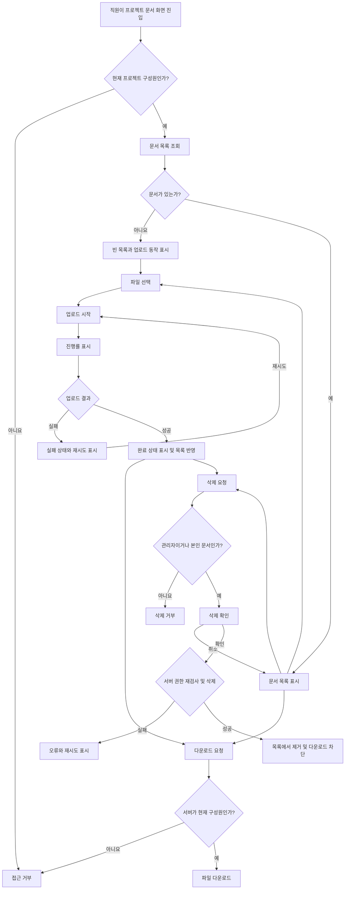

# 사내 프로젝트 문서 공유 PRD

## 1. Applicability

| Contract | Required / N/A | Evidence |
|---|---|---|
| Pages/routes or screen IDs | Required | 직원이 문서 목록, 업로드 진행 상태, 삭제 확인을 확인하는 사용자 화면이 필요하다. 저장소를 탐색하지 않았으므로 실제 경로 대신 안정적인 화면 ID를 사용한다. |
| Empty/loading/error/success/recovery state matrix | Required | 빈 목록, 업로드 진행률, 업로드 실패·재시도, 완료 상태가 명시적으로 요구되었다. |
| Mermaid user or system flow | Required | 업로드·권한 검사·다운로드·삭제로 이어지는 다단계 수명주기와 역할별 분기가 존재한다. |

## 2. 문서 정보

- 기능명: 사내 프로젝트 문서 공유
- 목표 출시: 4주 이내 내부 베타
- 대상 사용자: 인증된 사내 직원
- 문서 상태: 내부 베타 구현 기준
- 제품 책임자: TBD
- 범위 기준: 1차 출시는 업로드, 목록, 다운로드, 삭제만 포함

## 3. 배경과 문제

프로젝트 문서가 개인 저장소나 여러 커뮤니케이션 채널에 분산되면 프로젝트 구성원이 최신 문서를 찾거나 공유받기 어렵다. 또한 프로젝트 외부 직원의 접근, 일반 구성원의 타인 문서 삭제 등 권한 문제가 발생할 수 있다.

프로젝트 구성원만 접근할 수 있는 중앙 문서 목록을 제공하고, 업로드부터 다운로드와 삭제까지의 기본 문서 수명주기를 지원한다.

## 4. 목표

- 직원이 자신이 참여한 프로젝트에 문서를 업로드할 수 있다.
- 같은 프로젝트의 현재 구성원이 문서 목록을 보고 다운로드할 수 있다.
- 업로드 진행률, 성공, 실패 및 재시도 상태를 명확히 제공한다.
- 프로젝트 관리자와 일반 구성원에게 서로 다른 삭제 권한을 적용한다.
- 문서 접근 및 삭제 권한을 서버에서 검증한다.
- 4주 내 실제 사내 프로젝트를 대상으로 내부 베타를 시작한다.
- 문서 목록이 빠르게 표시되는 경험을 지향하고 측정 가능한 성능 기준을 확정할 기반을 마련한다.

## 5. 비목표

다음 항목은 1차 내부 베타에서 제외한다.

- 문서 검색, 필터 및 정렬 기능
- 회사 외부 사용자 또는 공개 링크를 통한 공유
- 문서 미리보기 및 온라인 편집
- 문서 버전 관리
- 폴더 또는 계층형 문서 구조
- 댓글, 멘션, 승인 워크플로
- 다중 프로젝트에 대한 일괄 업로드
- 프로젝트 생성 및 삭제
- 구성원 초대·제거 화면과 API  
  - 프로젝트 관리자의 구성원 관리 권한은 전체 제품 요구사항이지만, “1차 출시는 업로드·목록·다운로드·삭제만 포함”한다는 범위에 따라 후속 단계로 분류한다.
  - 1차 출시는 기존 프로젝트 및 구성원 정보를 사용한다.

## 6. 사용자, 역할 및 권한

| 역할 | 문서 목록 | 업로드 | 다운로드 | 본인 문서 삭제 | 타인 문서 삭제 | 구성원 초대·제거 |
|---|---:|---:|---:|---:|---:|---:|
| 프로젝트 관리자 | 허용 | 허용 | 허용 | 허용 | 허용 | 후속 범위에서 허용 |
| 일반 구성원 | 허용 | 허용 | 허용 | 허용 | 금지 | 금지 |
| 프로젝트 비구성원 | 금지 | 금지 | 금지 | 금지 | 금지 | 금지 |

역할 정의:

- 프로젝트 관리자: 해당 프로젝트에서 관리자 역할을 가진 현재 구성원
- 일반 구성원: 해당 프로젝트에 속하지만 관리자 역할은 없는 현재 구성원
- 업로더: 문서 업로드를 완료한 사용자로, 문서에 기록된 소유자
- 비구성원: 해당 프로젝트의 현재 구성원 레코드가 없는 사용자

## 7. 기능 요구사항

| ID | Requirement | Priority |
|---|---|---|
| FR-01 | 시스템은 현재 사용자가 구성원인 프로젝트에서만 문서 기능 접근을 허용해야 한다. | P0 |
| FR-02 | 프로젝트 구성원은 해당 프로젝트의 문서 목록을 조회할 수 있어야 한다. | P0 |
| FR-03 | 문서 목록의 각 항목은 최소한 문서명, 파일 크기, 업로더, 업로드 완료 시각을 표시해야 한다. | P0 |
| FR-04 | 프로젝트 구성원은 한 번의 업로드 작업으로 한 개의 파일을 선택해 업로드할 수 있어야 한다. | P0 |
| FR-05 | 업로드 중인 항목은 파일명과 0~100% 진행률을 표시해야 한다. | P0 |
| FR-06 | 업로드 완료 후 해당 항목은 완료 상태를 표시하고 문서 목록에 조회 가능한 문서로 반영되어야 한다. | P0 |
| FR-07 | 업로드 실패 시 실패 상태와 재시도 동작을 제공해야 하며, 재시도는 같은 파일의 새 업로드 시도로 처리해야 한다. | P0 |
| FR-08 | 프로젝트 구성원은 목록에서 문서를 다운로드할 수 있어야 한다. | P0 |
| FR-09 | 일반 구성원은 자신이 업로드한 문서만 삭제할 수 있어야 한다. | P0 |
| FR-10 | 프로젝트 관리자는 해당 프로젝트의 모든 문서를 삭제할 수 있어야 한다. | P0 |
| FR-11 | 삭제 전에 대상 문서명을 포함한 확인 절차를 제공해야 한다. | P0 |
| FR-12 | 삭제가 완료된 문서는 목록에서 제거되고 이후 목록 조회와 다운로드가 불가능해야 한다. | P0 |
| FR-13 | 목록 조회, 업로드, 다운로드 및 삭제 요청마다 서버가 현재 프로젝트 구성원 여부와 필요한 역할 또는 소유권을 검증해야 한다. | P0 |
| FR-14 | 권한이 없거나 구성원 자격이 만료된 사용자의 작업은 거부하고, 접근 가능한 문서 정보나 파일 내용을 노출하지 않아야 한다. | P0 |
| FR-15 | 동일한 이름의 문서가 이미 존재해도 별도 문서로 업로드할 수 있어야 하며, 시스템 내부 식별자는 서로 달라야 한다. | P1 |
| FR-16 | 프로젝트 관리자는 프로젝트 구성원을 초대하거나 제거할 수 있어야 한다. | Later |
| FR-17 | 제거된 구성원은 제거 이후 해당 프로젝트의 목록 조회, 업로드, 다운로드 및 삭제 권한을 잃어야 한다. | Later |

## 8. 핵심 데이터

### 프로젝트

- 프로젝트 식별자
- 프로젝트명

### 프로젝트 구성원

- 프로젝트 식별자
- 사용자 식별자
- 역할: `MANAGER` 또는 `MEMBER`
- 현재 구성원 여부

### 문서

- 문서 식별자
- 프로젝트 식별자
- 원본 파일명
- 파일 크기
- 파일 유형 또는 MIME 정보
- 업로더 식별자
- 업로드 완료 시각
- 현재 이용 가능 여부

업로더 식별자는 삭제 권한 판단에 사용되므로 사용자가 변경할 수 없어야 한다.

## 9. 화면 및 경로

| Page or screen ID | Route, deep link, or explicit TBD + owner | Roles | Purpose |
|---|---|---|---|
| DOC-01 프로젝트 문서 목록 | 실제 경로 TBD — 프론트엔드 책임자가 1주 차에 확정 | 관리자, 일반 구성원 | 문서 목록 조회, 다운로드, 업로드 시작, 권한에 따른 삭제 진입 |
| DOC-02 업로드 작업 항목 | DOC-01 내부 컴포넌트 | 관리자, 일반 구성원 | 선택 파일명, 진행률, 실패, 재시도, 완료 상태 표시 |
| DOC-03 삭제 확인 | DOC-01에서 호출되는 대화상자 | 삭제 권한이 있는 구성원 | 문서명을 확인하고 삭제 실행 또는 취소 |
| DOC-04 접근 거부 | 공통 오류 화면 또는 DOC-01 상태 — 프론트엔드 책임자가 1주 차에 확정 | 비구성원 또는 권한 상실 사용자 | 프로젝트 문서 접근이 허용되지 않음을 표시 |

## 10. 상태 매트릭스

| Surface | Empty | Loading | Error | Success | Recovery |
|---|---|---|---|---|---|
| 문서 목록 | “아직 공유된 문서가 없습니다” 메시지와 업로드 동작 표시 | 목록 자리 표시자 또는 로딩 표시 | 목록을 불러오지 못했다는 메시지와 재시도 제공 | 문서명, 크기, 업로더, 완료 시각 및 허용된 동작 표시 | 목록 다시 불러오기 |
| 파일 선택 | 선택된 파일 없음 | N/A | 지원 정책 위반 파일이면 이유 표시 | 선택한 파일명과 크기 표시 | 다른 파일 선택 |
| 업로드 | N/A | 0~100% 진행률 표시 | 실패 사유를 사용자 수준의 메시지로 표시하고 재시도 제공 | 업로드 완료 상태 표시 후 목록에 반영 | 같은 파일 재시도 또는 실패 항목 닫기 |
| 다운로드 | N/A | 다운로드 시작 중 상태 표시 가능 | 실패 또는 권한 상실 메시지 표시 | 브라우저 또는 클라이언트 다운로드 시작 | 다시 다운로드 |
| 삭제 | N/A | 삭제 버튼 중복 실행 방지 및 처리 중 표시 | 삭제 실패 메시지와 재시도 제공 | 문서가 목록에서 제거됨 | 삭제 다시 시도 또는 목록 새로고침 |
| 접근 권한 | N/A | 권한 확인 중 표시 | 인증 오류와 권한 오류를 구분 가능한 사용자 메시지로 표시 | 허용된 문서 화면 표시 | 재인증 또는 접근 가능한 프로젝트로 이동 |

추가 상태 규칙:

- 업로드 완료 표시는 목록 반영 여부와 일치해야 한다.
- 업로드 요청이 실패했는데 완료된 것처럼 표시해서는 안 된다.
- 삭제가 실패한 문서는 목록에서 제거된 것처럼 확정 표시해서는 안 된다.
- 권한 변경으로 작업이 거부된 경우 단순 재시도보다 프로젝트 접근 권한 확인을 안내한다.

## 11. 사용자 및 시스템 흐름

## 12. 권한 및 데이터 경계

- 프로젝트가 문서 접근의 기본 데이터 경계다.
- 목록 응답에는 현재 사용자가 구성원인 프로젝트의 문서만 포함해야 한다.
- 문서 식별자를 직접 입력하거나 이전 다운로드 주소를 재사용하더라도 서버는 현재 프로젝트 구성원 여부를 검사해야 한다.
- 일반 구성원의 삭제 요청은 현재 사용자 식별자와 문서의 업로더 식별자가 일치할 때만 허용한다.
- 프로젝트 관리자의 삭제 요청은 대상 문서가 자신이 관리자인 프로젝트에 속할 때만 허용한다.
- 화면에서 삭제 버튼을 숨기는 것만으로 권한을 보장해서는 안 된다.
- 삭제, 다운로드 또는 업로드 처리 도중 구성원 자격이 변경될 수 있으므로 각 서버 요청 시점의 권한을 기준으로 처리한다.
- 실패 응답은 비구성원에게 문서의 존재, 파일명, 업로더 등 보호된 메타데이터를 노출하지 않아야 한다.
- 인증 및 기존 사내 사용자 식별 체계는 선행 시스템에서 제공한다고 가정한다.

## 13. 비기능 요구사항

| ID | Requirement |
|---|---|
| NFR-01 | 문서 목록은 사용자가 화면에 진입한 후 2초 이내에 표시되는 것을 제품 성능 목표로 한다. 단, 이는 확정 SLA나 베타 출시 차단 기준이 아니며 측정 조건과 백분위 기준은 OD-02에서 확정한다. |
| NFR-02 | 목록 표시 시간은 클라이언트 요청 시작부터 문서 항목 또는 빈 상태가 표시될 때까지 측정 가능해야 한다. |
| NFR-03 | 업로드 진행률은 실제 전송 진행 상태를 기반으로 하며, 100% 표시는 서버가 업로드 완료를 확인하기 전에 사용하지 않는다. |
| NFR-04 | 실패한 업로드의 재시도는 중복된 완료 문서를 만들지 않아야 한다. 단, 이전 시도가 실제 완료된 후 응답만 유실된 경우의 중복 방지 정책은 OD-05에서 확정한다. |
| NFR-05 | 다운로드와 삭제 요청은 문서 메타데이터 조회와 별개로 서버 권한 검사를 수행해야 한다. |
| NFR-06 | 사용자에게 내부 저장소 경로, 스택 트레이스 또는 민감한 서버 오류 정보를 노출하지 않아야 한다. |

## 14. 수용 기준

| ID | Requirement | Given | When | Then | Verification |
|---|---|---|---|---|---|
| AC-01 | FR-01, FR-02, FR-03 | 사용자가 프로젝트의 현재 구성원이고 문서가 존재한다 | 문서 화면에 진입한다 | 해당 프로젝트의 문서만 문서명, 크기, 업로더, 완료 시각과 함께 표시된다 | API 통합 테스트 및 UI 테스트 |
| AC-02 | FR-02 | 프로젝트에 이용 가능한 문서가 없다 | 구성원이 문서 화면에 진입한다 | 오류 화면 대신 빈 목록 안내와 업로드 동작이 표시된다 | UI 테스트 |
| AC-03 | FR-04, FR-05 | 구성원이 유효한 파일 하나를 선택했다 | 업로드를 시작한다 | 파일명과 0~100% 범위의 진행률이 표시된다 | UI 및 통합 테스트 |
| AC-04 | FR-06 | 업로드가 서버에서 성공적으로 완료되었다 | 성공 응답을 받는다 | 업로드 완료 상태가 표시되고 새 문서가 목록에 나타난다 | 통합 테스트 |
| AC-05 | FR-07 | 업로드가 네트워크 또는 서버 오류로 실패했다 | 실패 결과를 받는다 | 실패 상태와 재시도 동작이 표시되며 재시도할 수 있다 | 오류 주입 통합 테스트 |
| AC-06 | FR-07 | 업로드 실패 항목이 표시되어 있다 | 사용자가 재시도를 선택한다 | 같은 파일에 대해 새 업로드 시도가 시작되고 진행률이 다시 표시된다 | UI 및 통합 테스트 |
| AC-07 | FR-08, FR-13 | 사용자가 프로젝트의 현재 구성원이다 | 목록의 문서를 다운로드한다 | 서버 권한 검사 후 해당 파일 다운로드가 시작된다 | API 권한 테스트 및 E2E 테스트 |
| AC-08 | FR-09 | 일반 구성원이 자신이 업로드한 문서를 보고 있다 | 삭제를 확인한다 | 서버가 소유권을 확인하고 문서를 삭제한다 | API 권한 테스트 |
| AC-09 | FR-09, FR-13, FR-14 | 일반 구성원이 다른 구성원의 문서 식별자를 알고 있다 | 직접 삭제 요청을 보낸다 | 서버가 요청을 거부하고 문서는 유지된다 | API 부정 권한 테스트 |
| AC-10 | FR-10 | 프로젝트 관리자가 같은 프로젝트의 타인 문서를 보고 있다 | 삭제를 확인한다 | 서버가 관리자 역할을 확인하고 문서를 삭제한다 | API 권한 테스트 |
| AC-11 | FR-11 | 삭제 권한이 있는 사용자가 삭제를 선택한다 | 확인 화면이 열린다 | 대상 문서명이 표시되며 확인 전에는 삭제되지 않는다 | UI 테스트 |
| AC-12 | FR-12 | 문서 삭제가 성공했다 | 목록을 다시 조회하거나 기존 다운로드를 시도한다 | 문서는 목록에 없으며 다운로드도 허용되지 않는다 | API 및 E2E 테스트 |
| AC-13 | FR-13, FR-14 | 사용자가 프로젝트 비구성원이거나 구성원 자격을 잃었다 | 목록, 업로드, 다운로드 또는 삭제 요청을 보낸다 | 모든 요청이 거부되고 보호된 문서 정보가 노출되지 않는다 | API 부정 권한 테스트 |
| AC-14 | FR-15 | 같은 프로젝트에 동일한 원본 파일명의 문서가 존재한다 | 구성원이 같은 이름의 파일을 업로드한다 | 기존 문서를 덮어쓰지 않고 별도 문서로 목록에 표시한다 | 통합 테스트 |
| AC-15 | NFR-03 | 파일이 아직 서버에서 완료 처리되지 않았다 | 전송이 진행 중이거나 완료 확인을 기다린다 | UI가 업로드 완료 상태를 표시하지 않는다 | 상태 전이 테스트 |
| AC-16 | NFR-01, NFR-02 | 성능 측정 환경과 데이터 규모가 OD-02에서 확정되었다 | 문서 목록 표시 시간을 측정한다 | 합의된 방식으로 2초 목표 달성 여부를 보고할 수 있다 | 성능 테스트 보고서 |

## 15. 합리적 가정

다음 가정은 1차 구현을 진행하기 위한 기본값이며, 새로운 정보가 나오면 변경할 수 있다.

| ID | Assumption | 영향 |
|---|---|---|
| AS-01 | 사내 인증, 사용자 계정, 프로젝트, 프로젝트 관리자 및 구성원 정보는 기존 시스템에서 제공된다. | 1차 출시에서 별도 인증과 프로젝트 관리 기능을 만들지 않는다. |
| AS-02 | 1차 업로드는 한 번에 파일 하나를 처리한다. 여러 파일은 각각 별도 업로드로 수행한다. | 진행률과 재시도 상태를 파일 단위로 관리한다. |
| AS-03 | 업로드 재시도는 중단 지점부터 이어가기보다 파일 전체를 다시 전송한다. | 4주 베타 범위를 줄이지만 큰 파일에는 불리할 수 있다. |
| AS-04 | 동일 파일명의 업로드를 허용하며 기존 문서를 자동으로 덮어쓰지 않는다. | 별도 버전 관리나 이름 충돌 대화상자가 필요하지 않다. |
| AS-05 | 삭제 성공 직후 사용자 관점에서 문서는 이용 불가능해야 한다. 내부 저장소의 물리 삭제 시점은 사용자 기능과 분리한다. | 목록과 다운로드 권한은 즉시 차단해야 한다. |
| AS-06 | 업로드 완료 문서만 다른 구성원의 목록과 다운로드 대상이 된다. 진행 중이거나 실패한 업로드는 업로드를 시작한 사용자에게만 작업 상태로 보인다. | 불완전 파일의 공유를 방지한다. |
| AS-07 | 1차 내부 베타에서는 기존 프로젝트 구성원 정보를 읽기 전용으로 사용한다. | 구성원 초대·제거는 후속 범위다. |

## 16. 열린 결정

| ID | Decision needed | Owner | Deadline | 미결정 시 기본 처리 또는 영향 |
|---|---|---|---|---|
| OD-01 | 프로젝트 관리자 구성원 초대·제거를 내부 베타에 포함할 것인가? | 제품 책임자 | 1주 차 범위 확정 시점 | 포함하지 않고 기존 구성원 정보를 사용한다. 포함 시 4주 일정 또는 다른 기능 범위를 재조정한다. |
| OD-02 | “2초 이내”의 측정 환경, 문서 수, 네트워크 조건, 백분위 및 실제 SLA 여부는 무엇인가? | 제품 책임자 + 기술 책임자 | 2주 차 성능 테스트 설계 전 | 2초는 비차단 제품 목표로만 유지하며 SLA로 약속하지 않는다. |
| OD-03 | 허용 파일 유형, 최대 파일 크기 및 악성 파일 검사 정책은 무엇인가? | 제품 책임자 + 보안/플랫폼 책임자 | 1주 차 API 계약 확정 전 | 결정 전에는 외부 공개가 아닌 제한된 내부 베타로만 운영하며 서버 설정값으로 제한할 수 있게 설계한다. |
| OD-04 | 문서 삭제 후 보존 기간, 복구 가능 여부 및 감사 기록 요구가 있는가? | 제품 책임자 + 보안/컴플라이언스 책임자 | 2주 차 저장 정책 확정 전 | 사용자 화면에서는 즉시 제거하고 다운로드를 차단한다. 물리 삭제 정책은 별도 결정한다. |
| OD-05 | 서버 완료 후 응답 유실 같은 상황에서 중복 문서를 방지하기 위한 업로드 요청 식별 정책이 필요한가? | 기술 책임자 | 1주 차 API 계약 확정 전 | 업로드 시도별 고유 요청 식별자를 사용하는 방향을 우선 검토한다. |
| OD-06 | 문서명에 포함될 수 없는 문자, 최대 길이 및 다운로드 시 파일명 정규화 정책은 무엇인가? | 기술 책임자 + 보안 책임자 | 1주 차 API 계약 확정 전 | 원본 파일명을 보존하되 서버와 클라이언트에서 안전한 표시·다운로드 이름으로 처리한다. |
| OD-07 | 삭제된 문서가 진행 중인 다운로드에 미치는 영향은 무엇인가? | 제품 책임자 + 기술 책임자 | 2주 차 | 삭제 완료 후 새 다운로드는 차단하고, 이미 시작된 전송의 중단 보장은 1차 범위에서 제외한다. |

## 17. 위험과 완화책

| Risk | Impact | Mitigation |
|---|---|---|
| 1차 출시 범위와 구성원 초대·제거 요구가 충돌한다 | 4주 일정 지연 또는 핵심 문서 기능 품질 저하 | OD-01을 1주 차에 확정하고 기본 계획에서는 구성원 관리를 제외한다. |
| UI에서만 권한을 제한할 가능성 | 비인가 문서 다운로드 또는 삭제 | 모든 문서 요청에서 서버 권한을 검증하고 역할·소유권 부정 테스트를 필수화한다. |
| 파일 크기와 유형 정책이 늦게 결정된다 | 업로드 방식 변경 또는 보안 위험 | OD-03을 API 계약 전에 확정하고 제한값을 설정 가능하게 한다. |
| 업로드 성공 응답 유실로 재시도 시 중복 문서가 생성된다 | 중복 목록과 사용자 혼란 | 업로드 요청 식별 정책을 확정하고 해당 장애 시나리오를 통합 테스트한다. |
| “2초”가 SLA로 오해된다 | 출시 판정과 이해관계자 기대가 불명확해진다 | PRD에서 비차단 목표로 명시하고 OD-02를 통해 SLA와 측정 기준을 별도로 승인한다. |
| 구성원 제거 직후 기존 링크가 계속 동작한다 | 프로젝트 외부로 문서 접근 지속 | 다운로드 요청마다 현재 구성원 여부를 재검사한다. |
| 삭제 정책이 불명확하다 | 복구·감사·보존 요구와 구현 충돌 | 사용자 관점의 즉시 접근 차단과 물리 보존 정책을 분리하고 OD-04를 확정한다. |

## 18. 출시 계획

| Phase | Requirement IDs | Verifiable exit condition |
|---|---|---|
| 1주 차: 범위 및 계약 확정 | FR-01~FR-15, OD-01~OD-06 | 역할·권한표, API 계약, 파일 제한, 삭제 정책 및 화면 상태가 합의되고 P0 요구사항에 테스트 담당이 지정된다. |
| 2주 차: 핵심 기능 통합 | FR-01~FR-08, FR-13~FR-15 | 구성원이 문서 목록을 조회하고 파일 하나를 업로드해 진행률·실패·재시도·완료 상태를 확인하며 다운로드할 수 있다. |
| 3주 차: 삭제 및 권한 검증 | FR-09~FR-14 | 일반 구성원과 관리자의 삭제 권한 차이가 서버에서 적용되고, 비구성원·타인 문서 삭제 부정 테스트가 통과한다. |
| 4주 차: 안정화 및 내부 베타 | FR-01~FR-15, NFR-01~NFR-06 | 모든 P0 수용 기준이 통과하고, 알려진 치명적 권한 결함이 없으며, 합의된 환경에서 목록 성능 측정 결과가 기록되고, 내부 베타 대상 프로젝트가 기능을 사용할 수 있다. |
| 후속 출시 | FR-16, FR-17 | 프로젝트 관리자가 구성원을 초대·제거할 수 있고, 제거된 사용자의 문서 접근이 서버에서 즉시 거부된다. |

## 19. 내부 베타 출시 기준

내부 베타는 다음 조건을 모두 만족해야 한다.

- FR-01~FR-14의 P0 수용 기준 통과
- 비구성원의 목록 조회 및 다운로드 차단 확인
- 일반 구성원의 타인 문서 삭제 차단 확인
- 프로젝트 관리자의 프로젝트 내 문서 삭제 확인
- 업로드 진행률, 실패, 재시도 및 완료 상태 확인
- 빈 목록 상태 확인
- 삭제된 문서의 목록 제거 및 후속 다운로드 차단 확인
- OD-03의 파일 제한 및 보안 정책 확정
- 치명적 또는 높은 등급의 미해결 권한·데이터 노출 결함 없음
- 목록 표시 시간 측정 결과 기록  
  - 2초 목표 미달만으로 베타를 자동 차단하지 않으며, 실제 출시 기준과 SLA는 제품 책임자가 별도로 결정한다.