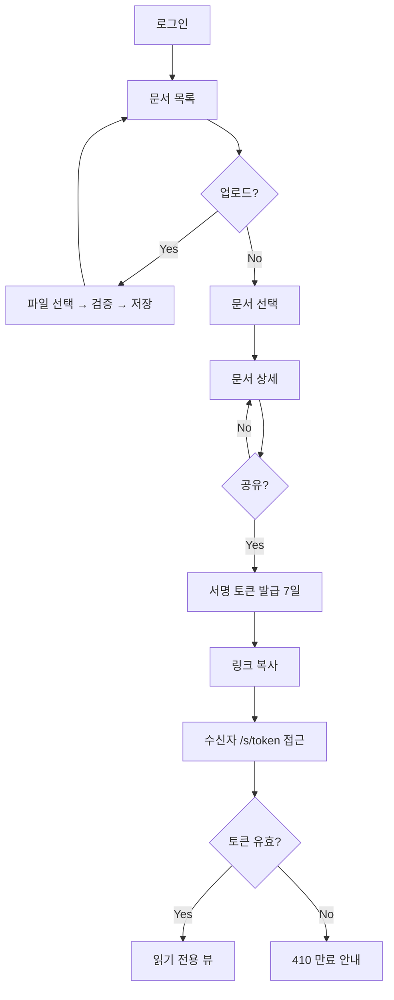

# PRD: 사내 문서 공유 (clean fixture)

> **Version**: 1.0 · **Type**: feature · **Scale Grade**: Startup

## 1. Overview

### 1.1 Problem Statement

팀원들이 문서를 이메일과 메신저로 주고받아 최신본이 어느 것인지 알 수 없다.
사내 문서를 한 곳에 모으고 링크로 공유한다.

### 1.2 Goals

- 문서 업로드·조회·공유를 한 화면에서
- 최신본이 무엇인지 항상 명확
- 외부 유출 방지

### 1.3 Non-Goals

- 실시간 공동 편집
- 오프라인 동기화

## 2. User Stories

### 2.1 Primary User

**사내 구성원**: 문서를 올리고 링크로 공유한다.
**관리자**: 부적절한 문서를 삭제한다.

### 2.2 Acceptance Criteria

```
Scenario: 문서 업로드
  Given 로그인한 사용자가
  When 50MB 이하 PDF를 업로드하면
  Then 문서 목록 최상단에 나타난다

Scenario: 공유 링크 열람
  Given 만료되지 않은 공유 토큰이 있고
  When 링크 수신자가 접근하면
  Then 읽기 전용 뷰가 표시된다

Scenario: 만료된 링크
  Given 생성 후 7일이 지난 공유 토큰으로
  When 접근하면
  Then 410 Gone 과 재발급 안내가 표시된다
```

### 2.3 User Roles

| Role Key | 한국어 명칭 | 권한 범위 |
|----------|------------|----------|
| `member` | 사내 구성원 | 업로드, 자기 문서 조회/삭제, 공유 링크 생성 |
| `admin` | 관리자 | 전체 문서 조회, 임의 문서 삭제 (감사 로그 기록) |
| `guest` | 링크 수신자 | 유효한 공유 토큰으로 읽기 전용 열람만 |

## 3. Functional Requirements

| ID | Requirement | Priority |
|----|------------|----------|
| FR-001 | 사용자는 파일(PDF/DOCX, 최대 50MB)을 업로드할 수 있다 | P0 |
| FR-002 | 업로드된 문서는 목록에 최신순으로 표시된다 | P0 |
| FR-003 | 공유 링크 열람은 **유효한 서명 토큰**으로 인가한다(세션 로그인 불요, 토큰 유효기간 7일) | P0 |
| FR-004 | 사용자는 자기가 올린 문서를 삭제할 수 있다 (소유자 검증) | P1 |
| FR-005 | 관리자는 `DELETE /api/documents/{id}` 로 임의 문서를 삭제한다. 서버는 `role == admin` 을 검증하고 감사 로그를 남긴다 | P1 |
| FR-006 | 문서 검색(제목 부분 일치)을 제공한다 | P2 |
| FR-007 | 인증 경로(세션) 또는 인가 경로(서명 토큰) 중 하나를 통과하지 않은 조회 요청은 401/403으로 거절한다 | P0 |

## 4. Non-Functional Requirements

### 4.1 Performance

| 지표 | 목표 |
|------|------|
| 목록 조회 p95 | < 300ms (DAU 5,000 기준) |
| 업로드 처리 p95 | < 3s (10MB 파일) |
| 동시 업로드 | 50 req/s |

### 4.2 Security

- 전 구간 HTTPS
- 업로드 파일 확장자 + MIME 매직넘버 검사, 실행 파일 거부
- 공유 토큰은 HMAC 서명 + 만료(7일) + 문서 ID 바인딩
- 관리자 삭제는 `role == admin` 서버 검증 + 감사 로그
- 스토리지 객체는 비공개, presigned URL(5분)로만 접근

### 4.3 Scalability

- 문서 10만 건 / 스토리지 500GB 기준으로 설계

## 5. Technical Design

### 5.1 Stack

- Next.js 16 (App Router) / PostgreSQL / S3 호환 스토리지

### 5.2 API

| Method | Path | 인가 | 설명 |
|--------|------|------|------|
| POST | `/api/documents` | session | 업로드 |
| GET | `/api/documents` | session | 목록 (본인 것 + admin은 전체) |
| GET | `/api/documents/{id}` | session \| token | 상세 |
| DELETE | `/api/documents/{id}` | session + (owner \| admin) | 삭제 |
| POST | `/api/documents/{id}/share` | session + owner | 공유 링크 생성 |

### 5.4 Pages

| Page | Route | Has FE Components | 설명 |
|------|-------|-------------------|------|
| 문서 목록 | `/documents` | Yes | 업로드 + 목록 + 검색 |
| 문서 상세 | `/documents/[id]` | Yes | 미리보기 + 공유 |
| 공유 열람 | `/s/[token]` | Yes | 링크 수신자용 읽기 전용 |

### 5.4.1 State Matrix

| Page | Empty | Loading | Error | Success | Permission Denied |
|------|-------|---------|-------|---------|-------------------|
| 문서 목록 | "아직 문서가 없습니다" + 업로드 CTA | 스켈레톤 6행 | 재시도 버튼 + 오류 코드 | 목록 렌더 | — |
| 문서 상세 | — | 미리보기 스피너 | "문서를 열 수 없습니다" | 미리보기 + 공유 버튼 | 403 화면 + 목록 복귀 |
| 공유 열람 | — | 스피너 | 410 "링크가 만료되었습니다" + 재발급 요청 안내 | 읽기 전용 뷰 | 403 "잘못된 링크" |

### 5.5 User Flow



## 6. Implementation Phases

- [ ] Phase 1: 업로드·목록 (FR-001, FR-002)
- [ ] Phase 2: 공유 링크 + 토큰 인가 (FR-003, FR-007)
- [ ] Phase 3: 삭제·검색·감사 로그 (FR-004, FR-005, FR-006)
