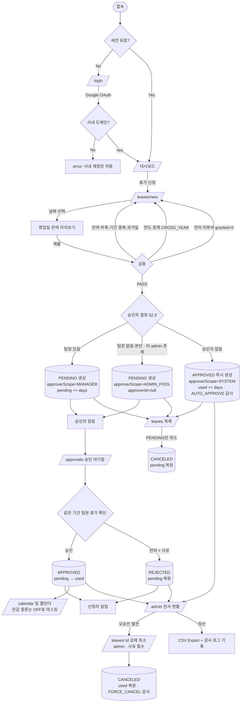

# 사내 휴가 신청/승인 서비스 (Leave Management) PRD

> **Version**: 1.2
> **Created**: 2026-08-04
> **Updated**: 2026-08-04 — prd-reviewer 2회 반영 (Critical 3건 + Major 21건 + Minor 다수)
> **Status**: Draft
> **Type**: product-feature
> **Scale Grade**: Hobby (사내 도구, 예상 사용자 200명 이하)

---

## 0. 전제 (Assumptions)

작성 시점에 미확정이라 아래 값을 가정했습니다. 실제 값이 다르면 해당 섹션만 갱신하면 됩니다.

| # | 가정 | 영향 섹션 | 확인 필요 |
|---|------|----------|----------|
| A-1 | 전사 인원 200명 이하, 팀 수 30개 이하 | §4.0~4.3 | 인사팀 |
| A-2 | 승인 단계는 **1단계**(팀장)만. 다단계 결재(팀장→본부장) 없음 | §2.2, §3 | 경영진 |
| A-3 | 급여/근태 시스템과의 자동 연동 없음. 정산은 CSV Export로 수동 | §1.3, §3 | 인사팀 |
| A-4 | 연차 일수는 MVP에서 **관리자가 수동/CSV로 부여**. 근로기준법 자동 산정은 Phase 3 | §3 FR-021 | 인사팀 |
| A-5 | 사내 Google Workspace 계정 보유 (OAuth 로그인 가능) | §4.5, §5.1 | 인프라 담당 |
| A-6 | 신규 프로젝트(그린필드). 기존 코드베이스 제약 없음 | §5 | - |

---

## 1. Overview

### 1.1 Problem Statement

현재 휴가 신청은 메신저/구두/스프레드시트로 처리되고 있어 다음 문제가 발생한다.

1. **잔여 연차 불일치** — 개인이 기억하거나 인사팀 스프레드시트를 물어봐야 알 수 있고, 초과 사용이 사후에 발견된다.
2. **승인 이력 부재** — "승인했다/못 들었다" 분쟁 시 근거가 남지 않는다.
3. **팀 가용 인원 파악 불가** — 같은 날 팀원 절반이 휴가인 것을 당일에 알게 된다.
4. **인사팀 수작업** — 월말 정산 시 메신저 로그를 뒤져 수기 집계한다.

### 1.2 Goals

- 휴가 신청 → 승인/반려 → 잔여 연차 반영까지를 **하나의 시스템에서 원자적으로** 처리한다.
- 모든 구성원이 **본인 잔여 연차를 실시간으로** 확인할 수 있게 한다.
- 모든 승인/반려에 **변경 불가능한 감사 로그(누가·언제·무엇을)** 를 남긴다.
- 관리자가 **전사 휴가 현황을 한 화면에서** 보고 정산용 데이터를 내보낼 수 있게 한다.

### 1.3 Non-Goals (Out of Scope)

- 급여 시스템·ERP 연동 (Export 파일 제공까지만)
- 출퇴근 시간 기록(근태 타각), 초과근무·대체휴무 자동 적립
- 다단계 결재선(팀장 → 본부장 → 대표) 및 결재선 커스터마이징
- 모바일 네이티브 앱 (반응형 웹으로 대체)
- 다국어 지원 (한국어 단일)
- 계약직/파견직 등 고용형태별 상이한 연차 규정 자동 처리

### 1.4 Scope

| 포함 | 제외 |
|------|------|
| 휴가 신청서 작성·제출·취소 | 근태 타각(출퇴근 기록) |
| 1단계 승인/반려 + 반려 사유 | 다단계 결재선 |
| 잔여 연차 조회 및 자동 차감/복원 | 급여 시스템 자동 연동 |
| 팀 휴가 캘린더 | 인력 배치/스케줄링 최적화 |
| 관리자 전사 현황 대시보드 + Export | BI 리포트, 예측 분석 |
| 이메일/Slack 알림 | 푸시 알림, SMS |
| 공휴일·주말 제외 영업일 자동 계산 | 국가별 공휴일 자동 동기화 |

---

## 2. User Stories

### 2.1 Primary Users

**신청자 (member)**
> As a 팀원, I want to 남은 연차를 확인하고 휴가를 신청해서, so that 팀장에게 따로 묻지 않아도 승인 여부를 추적할 수 있다.

**승인자 (manager)**
> As a 팀장, I want to 대기 중인 신청을 한 곳에서 보고 같은 기간 팀원 휴가와 겹치는지 확인해서, so that 인력 공백 없이 승인/반려를 결정할 수 있다.

**관리자 (admin)**
> As a 인사담당자, I want to 전사 휴가 사용 현황을 조회하고 정산 데이터를 내려받아서, so that 월말 집계를 수작업 없이 끝낼 수 있다.

### 2.2 Acceptance Criteria (Gherkin)

```gherkin
Scenario: 정상 휴가 신청
  Given member 역할의 사용자가 로그인했고 잔여 연차가 10일이다
  When 2026-09-07(월) ~ 2026-09-09(수) 연차를 사유와 함께 제출한다
  Then 신청이 PENDING 상태로 생성되고
  And 사용 일수는 영업일 기준 3일로 계산되며
  And 잔여 연차는 7일(대기 3일), 확정 사용은 0일로 표시되고
  And 해당 팀의 manager에게 알림이 발송된다

Scenario: 주말·공휴일 자동 제외
  Given 2026-09-16(수)이 공휴일로 등록되어 있다
  When 2026-09-14(월) ~ 2026-09-18(금) 연차를 신청한다
  Then 사용 일수는 5일이 아닌 4일로 계산된다

Scenario: 반차 신청
  When 2026-09-07 오전 반차를 신청한다
  Then 사용 일수는 0.5일로 계산된다

Scenario: 잔여 연차 초과 신청 차단
  Given 잔여 연차가 2일이다
  When 영업일 3일짜리 연차를 신청한다
  Then 신청은 생성되지 않고
  And 422 INSUFFICIENT_BALANCE 에러와 "잔여 연차 2일, 신청 3일" 메시지가 표시된다

Scenario: 기간 중복 신청 차단
  Given 2026-09-07 ~ 2026-09-09 신청이 PENDING 또는 APPROVED 상태로 존재한다
  When 2026-09-08 ~ 2026-09-10 신청을 제출한다
  Then 409 OVERLAPPING_REQUEST 에러가 반환된다

Scenario: 과거 날짜 신청 제한
  Given 오늘이 2026-09-10이다
  When member가 2026-09-05 연차를 신청한다
  Then 422 PAST_DATE_NOT_ALLOWED 에러가 반환된다
  # admin은 소급 등록이 허용된다 (사후 병가 등록 등)

Scenario: 팀장 승인
  Given member A(팀 T 소속)의 신청이 PENDING이다
  When 팀 T의 manager가 해당 신청을 승인한다
  Then 상태가 APPROVED로 바뀌고
  And 대기 3일이 확정 사용 3일로 전환되며(잔여 일수는 변동 없음)
  And 신청자에게 알림이 발송되고
  And 감사 로그에 approver_id, decided_at이 기록된다

Scenario: 반려 시 사유 필수
  When manager가 반려 사유 없이 반려를 시도한다
  Then 400 REASON_REQUIRED 에러가 반환되고 상태는 PENDING으로 유지된다

Scenario: 반려 시 연차 복원
  When manager가 3일짜리 신청을 반려한다
  Then 상태가 REJECTED로 바뀌고
  And 대기 3일이 해제되어 잔여 연차가 10일로 복원된다

Scenario: 타 팀 신청 접근 차단
  Given 팀 T2의 manager가 로그인했다
  When 팀 T1 소속 member의 신청을 승인 시도한다
  Then 403 FORBIDDEN 에러가 반환된다

Scenario: 본인 신청 자가 승인 차단
  Given manager 본인이 제출한 신청이 PENDING이다
  When 본인이 승인을 시도한다
  Then 403 SELF_APPROVAL_FORBIDDEN 에러가 반환되고
  And 해당 신청은 admin의 승인 대기함에 노출된다

Scenario: 승인자가 존재하지 않는 조직의 신청 (승인자 결정 규칙 3)
  Given 신청자가 소속 팀의 팀장이면서 시스템의 유일한 admin이다
  When 휴가를 신청한다
  Then 신청은 APPROVED 상태로 즉시 생성되고
  And 감사 로그에 AUTO_APPROVE / NO_ELIGIBLE_APPROVER가 기록되며
  And 관리자 대시보드의 자동 승인 건수가 1 증가한다
  # PENDING 영구 고착을 방지한다

Scenario: 연도를 걸치는 신청 차단 (MVP)
  Given 오늘이 2026-12-20이다
  When 2026-12-28 ~ 2027-01-04 연차를 신청한다
  Then 422 CROSS_YEAR_NOT_ALLOWED 에러와
       "연도별로 나누어 신청해 주세요" 안내가 반환된다

Scenario: 연차 미부여 연도에 대한 신청 차단
  Given 2027년 연차가 아직 부여되지 않았다
  When 2027-01-05 연차를 신청한다
  Then 422 BALANCE_NOT_GRANTED 에러가 반환된다

Scenario: 팀 캘린더에서 민감 휴가 종류 비노출
  Given 팀원 A가 SICK(병가) 휴가를 승인받았다
  When 같은 팀의 member B가 팀 캘린더를 조회한다
  Then A의 항목은 종류가 "OFF"(부재)로 표시되고
  And 응답 어디에도 SICK 및 사유가 포함되지 않는다
  # 담당 manager와 admin에게는 원 종류가 노출된다

Scenario: 대기 중 신청 취소
  Given 본인 신청이 PENDING 상태다
  When 신청을 취소한다
  Then 상태가 CANCELED로 바뀌고 대기 중이던 연차가 복원된다

Scenario: 승인된 신청은 신청자가 직접 취소 불가
  Given 본인 신청이 APPROVED 상태다
  When 취소를 시도한다
  Then 409 ALREADY_DECIDED 에러가 반환되고 "팀장에게 취소 요청" 안내가 표시된다

Scenario: 동시 신청 시 잔여 연차 정합성
  Given 잔여 연차가 3일이다
  When 3일짜리 신청 2건이 동시에 제출된다
  Then 정확히 1건만 성공하고
  And 나머지 1건은 422 INSUFFICIENT_BALANCE로 실패한다

Scenario: 관리자 전사 현황 조회
  Given admin으로 로그인했다
  When 2026년 현황 대시보드에 진입한다
  Then 전체 구성원의 부여/사용/잔여 연차 합계와 팀별 소진율이 표시되고
  And 승인 대기 건수와 3일 이상 미처리 건이 강조 표시된다
```

### 2.3 User Roles

| Role Key | 한국어 명칭 | 권한 범위 | 비고 |
|----------|------------|----------|------|
| `guest` | 비로그인 사용자 | `/login`만 접근 | 그 외 모든 경로는 `/login` 리다이렉트 |
| `member` | 팀원(신청자) | 본인 신청 CRUD, 본인 잔여 연차 조회, 소속 팀 캘린더 조회(사유 비공개) | 기본 역할 |
| `manager` | 팀장(승인자) | `member` 권한 + **소속 팀원**의 신청 조회/승인/반려 | 타 팀 데이터는 조회·처리 모두 불가. 본인 신청은 자가 승인 불가 |
| `admin` | 관리자(인사) | 전사 조회/Export, 구성원·팀·연차 부여 관리, 공휴일·정책 설정, 소급 등록 | 승인 권한 포함(대결재) |

**규칙**
- Role Key는 영문 소문자 단일 단어이며, 이후 모든 페이지·API 명세에서 이 키를 그대로 인용한다.
- 역할은 사용자당 **1개**만 부여한다(겸직 없음). `manager`는 `manager_id`로 팀에 연결된다.
- 권한 판정은 **서버에서만** 수행한다. 프론트엔드의 역할 기반 렌더링은 UX 편의일 뿐 보안 경계가 아니다.
- `manager`의 모든 조회·처리 권한에는 **소속 팀 스코프가 강제**된다. `userId`·`teamId` 등 조회 파라미터는 서버가 요청자의 팀과 대조해 필터링하며, 팀 밖 대상을 지정하면 `403 FORBIDDEN`을 반환한다(IDOR 방지).

**승인자 결정 규칙** (모든 신청은 생성 시점에 승인자가 확정되어야 한다)

우선순위 순으로 평가하며, 먼저 매칭되는 규칙을 적용한다.

| 순위 | 조건 | 승인 주체 (`approverScope`) | `approverId` (생성 시점) |
|------|------|---------------------------|-------------------------|
| 1 | 소속 팀 `Team.managerId`가 존재하고 **신청자 본인이 아님** | `MANAGER` — 해당 팀장 1인 | 해당 `manager`의 id (확정) |
| 2 | 1이 불가(팀장 공석 또는 팀장 본인의 신청) & 신청자 외 활성 `admin`이 1명 이상 존재 | `ADMIN_POOL` — 활성 `admin` 전원의 공동 대기함 | **`null`** (먼저 처리한 1인의 id를 결재 시점에 기록) |
| 3 | 1·2 모두 불가 (예: 관리자 1인 조직, 팀장=유일 admin) | `SYSTEM` — **자동 승인** | `null` |

**스냅샷 규칙** — `approverId`는 N명 대기함을 표현할 수 없으므로, 확정 대상은 **개인이 아니라 `approverScope`**다.

- `approverScope`는 **생성 시점에 확정**되며 이후 조직 변경(`Team.managerId` 변경, admin 증감)에 영향받지 않는다.
- `approverScope = MANAGER`인 경우에만 `approverId`가 생성 시점에 함께 확정된다. 팀 이동이 발생해도 원 팀장이 계속 처리한다.
- `approverScope = ADMIN_POOL`은 `approverId = null`로 생성되고, 활성 `admin` 전원의 `/approvals` 대기함에 노출된다. 먼저 승인/반려한 1인의 id가 `approverId`에, 처리 시각이 `decidedAt`에 기록된다.
- `approverScope = SYSTEM`은 `approverId = null`, `autoApproved = true`, `decidedAt = 생성 시각`으로 즉시 `APPROVED` 상태로 생성하며, 감사 로그에 `AUTO_APPROVE` 액션과 사유(`NO_ELIGIBLE_APPROVER`)를 남긴다. **UI에서는 승인자를 "시스템(자동 승인)"으로 표기**한다.
- 자동 승인은 조직 구성 오류(팀장 미지정)의 신호다. `GET /admin/summary`의 `autoApprovedCount`로 노출해 조기에 드러낸다(FR-011).

---

## 3. Functional Requirements

| ID | Requirement | Priority | Dependencies |
|----|------------|----------|--------------|
| FR-001 | 사내 Google Workspace 계정(OAuth)으로 로그인하고 세션을 유지한다. 허용 도메인 외 계정은 거부한다 | P0 (Must) | - |
| FR-002 | 모든 API가 role·소속 팀 기반으로 접근을 인가한다(타 팀·타인 데이터 차단) | P0 (Must) | FR-001 |
| FR-003 | 휴가 종류(연차/오전반차/오후반차/병가/경조사/무급)·기간·사유를 입력해 신청서를 제출한다 | P0 (Must) | FR-001 |
| FR-004 | 신청 기간에서 주말·등록된 공휴일을 제외한 영업일을 자동 계산한다(반차 = 0.5일) | P0 (Must) | FR-016a |
| FR-016a | admin이 연도별 공휴일을 등록/삭제한다 (FR-004의 선행 조건이므로 MVP 포함. UI는 최소 목록+추가 폼) | P0 (Must) | FR-013 |
| FR-005 | 제출 시 ①잔여 연차 충분 ②기존 신청과 기간 미중복 ③과거 날짜 아님(admin 예외) ④종료일 ≥ 시작일 을 검증한다 | P0 (Must) | FR-004, FR-006 |
| FR-006 | 연차 잔여를 `부여/확정사용/승인대기/잔여` 4개 값으로 조회한다. 신청 시 대기 차감, 승인 시 확정 전환, 반려·취소 시 복원한다 | P0 (Must) | FR-013 |
| FR-007 | 본인 신청 목록을 상태·기간·종류로 필터링해 조회하고 상세를 확인한다 | P0 (Must) | FR-003 |
| FR-008 | PENDING 상태의 본인 신청을 취소한다 | P0 (Must) | FR-003 |
| FR-009 | manager가 소속 팀의 PENDING 신청을 승인 대기함에서 목록으로 확인한다(신청일 오래된 순 기본 정렬) | P0 (Must) | FR-002 |
| FR-010 | manager가 신청을 승인 또는 반려한다. 반려 시 사유 입력 필수, 이미 처리된 건은 재처리 불가 | P0 (Must) | FR-009 |
| FR-011 | admin이 전사 휴가 현황 대시보드(전체 부여/사용/잔여, 팀별 소진율, 대기 건수, 3영업일 이상 지연 건수, **자동 승인 건수**)를 조회한다 | P0 (Must) | FR-002 |
| FR-012 | admin이 전사 신청 내역을 기간·팀·구성원·상태·종류로 검색한다 | P0 (Must) | FR-011 |
| FR-013 | admin이 구성원 등록/수정/비활성화, 팀 및 팀장 지정, 연차 수동 부여·조정을 수행한다 | P0 (Must) | FR-002 |
| FR-014 | 상태 변경(제출/승인/반려/취소)의 모든 이벤트를 감사 로그로 적재한다(actor, action, target, before/after, timestamp) — 수정·삭제 불가 | P0 (Must) | FR-003, FR-010 |
| FR-015 | 신청 제출 시 승인자에게, 승인/반려 시 신청자에게 이메일 알림을 발송한다 | P1 (Should) | FR-003, FR-010 |
| FR-016 | admin이 휴가 정책(과거일 신청 허용 여부, 종류별 연차 차감 여부, 연차 소수점 단위 등)을 화면에서 설정한다 | P1 (Should) | FR-016a |
| FR-017 | 소속 팀의 승인·대기 휴가를 월간 캘린더로 조회한다. `member`에게는 사유가 노출되지 않으며, 민감 종류(SICK/FAMILY_EVENT/UNPAID)는 `OFF`(부재)로 마스킹된다 | P1 (Should) | FR-010 |
| FR-018 | admin이 검색 결과를 CSV로 내보낸다(UTF-8 BOM, 정산용 컬럼) | P1 (Should) | FR-012 |
| FR-019 | 승인된 휴가에 대해 신청자가 취소를 요청하고 manager가 승인하면 연차가 복원된다 | P2 (Could) | FR-019a |
| FR-019a | admin이 승인 완료된 신청을 사유와 함께 강제 취소하고 연차를 복원한다 (오승인 복구 경로. `APPROVED → CANCELED` 전이의 유일한 MVP 진입점) | P0 (Must) | FR-010, FR-014 |
| FR-020 | manager 부재 시 대결재자를 지정해 승인 권한을 위임한다 | P2 (Could) | FR-010 |
| FR-021 | 입사일 기준 근로기준법 연차를 자동 산정하고 연차 이월/소멸을 처리한다 | P2 (Could) | FR-013 |
| FR-022 | Slack 채널/DM 알림을 발송한다 | P3 (Won't) | FR-015 |

---

## 4. Non-Functional Requirements

### 4.0 Scale Grade

**선택 등급: Hobby (사내 도구)** — 근거는 A-1.

| 항목 | 값 |
|------|-----|
| 예상 DAU | 30~80명 (전사 200명 중, 월말·연말에 피크) |
| 피크 동시접속 | < 30 |
| 예상 데이터량 | < 500MB (5년 누적 기준) |
| 인프라 비용 목표 | $20/월 이하 |

> **주의**: 트래픽은 Hobby지만 **연차 데이터는 급여·근태에 직결되는 준회계 데이터**다. 가용성 요구는 낮게, **데이터 정합성·감사 추적 요구는 높게** 잡는다(§4.4, §4.5, §5.2).

### 4.1 Performance SLA

| 지표 | 목표값 |
|------|--------|
| Response Time (p95) — 조회 API | < 500ms |
| Response Time (p95) — 신청/승인 API | < 800ms |
| 관리자 대시보드 초기 로딩 | < 2s |
| CSV Export (1,000건 기준) | < 5s |
| Throughput | 30 RPS |

### 4.2 Availability SLA

| 항목 | 값 |
|------|-----|
| Uptime 목표 | 99% (월 허용 다운타임 7.3시간) |
| 필수 가용 시간대 | 평일 09:00~19:00 KST |
| 계획 점검 시간 | 평일 22:00 이후 또는 주말 |

### 4.3 Data Requirements

| 항목 | 값 |
|------|-----|
| 초기 데이터량 | < 10MB (구성원 200명 + 공휴일) |
| 연간 증가량 | 약 40MB (연 3,000건 신청 + 감사 로그) |
| 데이터 보존 기간 | 신청/감사 로그 **5년** (근로기준법 제42조 근로자 명부·임금대장 3년 보존 요건 상회) |
| 백업 주기 | 일 1회 자동 백업, 7일 보관 |

### 4.4 Recovery

| 항목 | 값 | 비고 |
|------|-----|------|
| RTO | 8시간 (영업일 기준 당일 내 복구) | 서비스 중단 시 임시로 메신저 신청 후 복구 시 소급 등록 |
| RPO — 일반 데이터 | 24시간 | 일 1회 전체 백업 기준 |
| RPO — 감사 로그 | **1시간 이내** | 승인 이력 손실은 분쟁 소지가 크다. `AuditLog`는 append-only 테이블에 적재하되, **동일 DB 손실 시 함께 유실되지 않도록** 시간당 1회 외부 오브젝트 스토리지(S3 등)로 증분 export한다. 동일 DB의 별도 테이블만으로는 RPO를 충족하지 못한다 |

### 4.5 Security

| 항목 | 요구사항 |
|------|---------|
| Authentication | **Required** (모든 페이지·API). Google OAuth 2.0, 사내 도메인 화이트리스트 강제 |
| Session | HttpOnly + Secure + SameSite=Lax 쿠키, 유효기간 12시간, 슬라이딩 갱신 |
| Authorization | 서버 사이드 role + 소속 팀 검증. 모든 리소스 조회에 소유자/팀 스코프 필터 적용(IDOR 방지) |
| Encryption | 전송 구간 TLS 1.2+, 저장 구간 DB 암호화(at rest) |
| 민감정보 | **휴가 사유(reason)와 민감 휴가 종류(`SICK`/`FAMILY_EVENT`/`UNPAID`)를 모두 민감정보로 취급**한다. 건강·가족사 정보는 사유 텍스트를 가려도 "종류"에서 이미 드러나기 때문이다. 두 값 모두 신청자 본인·담당 `manager`·`admin`만 조회 가능하며, 그 외 대상에게는 **사유는 응답 필드에서 제외**하고 **종류는 `OFF`(부재)로 마스킹**한다. 적용 대상: `GET /calendar`, `GET /leaves`(타인 행), `POST /leaves/preview`의 `warnings` |
| 개인정보 | 개인정보처리방침 고지 및 수집 항목(이름·사내 이메일·사번·팀·입사일·휴가 종류·휴가 사유·비상 연락처) 최소 수집. 비상 연락처는 **선택 입력**이며 담당 `manager`·`admin`에게만 노출된다. 퇴사자 정보는 보존 기간 경과 후 파기 |
| 알림 본문 | 이메일 알림(FR-015)은 §4.5 통제 밖의 외부 경로다. **본문에 사유·민감 종류를 포함하지 않는다.** "휴가 신청이 승인되었습니다 (9/7~9/9)" 수준의 메타데이터 + 상세 링크만 발송한다 |
| 세션 무효화 | 역할 변경·팀 이동·퇴사(`isActive=false`) 처리 시 해당 사용자의 **모든 활성 세션을 즉시 무효화**한다. 12시간 슬라이딩 만료에 의존하지 않는다 |
| 로그 파기 | `AuditLog`는 append-only지만 개인정보 파기 대상이다. 보존 기간(5년) 경과분은 **행 삭제 대신 `before`/`after` JSON의 사유·비상 연락처 필드를 비식별 마스킹**한다(승인 이력의 무결성은 유지, 민감 텍스트만 제거). 실행 주체는 애플리케이션과 분리된 **전용 배치 롤**이며, 마스킹 자체를 `MASK_PII` 액션으로 다시 기록한다. **§4.4의 외부 스토리지 사본에도 동일 배치가 적용**되어야 한다 — 원본만 마스킹하고 외부 사본을 방치하면 파기 요구가 미이행된다 |
| Audit | 승인/반려/연차 조정은 100% 감사 로그 기록. **애플리케이션 DB 롤에는 `AuditLog`의 UPDATE/DELETE 권한을 부여하지 않는다**(append-only). 아래 "로그 파기"의 마스킹 배치만 별도 롤로 UPDATE 권한을 갖는다 |
| 입력 검증 | 모든 요청 바디를 서버에서 스키마 검증. 사유 필드는 저장 시 원문 보존 + 출력 시 이스케이프(XSS) |
| Rate Limit | 신청 생성 10회/분/사용자, 로그인 20회/시간/IP, 조회 API 120회/분/사용자, **Export 5회/시간/사용자**(대량 개인정보 반출 억제) |

### 4.6 Quality

| 항목 | 요구사항 |
|------|---------|
| 테스트 커버리지 | 도메인 로직(영업일 계산, 잔여 연차 전이, 권한 판정) **단위 테스트 90% 이상** |
| 필수 통합 테스트 | ①동시 신청 정합성 ②기간 중복 검증 ③권한 우회(타 팀 승인·타 팀 `userId`/`teamId` 조회·자가 승인) ④**`member`의 캘린더·목록 응답에 `SICK`/`FAMILY_EVENT` 종류와 사유가 포함되지 않음** ⑤승인자 결정 규칙 3종 분기(팀장/타 admin/자동 승인) ⑥연도 경계·미부여 연도 신청 차단 |
| 접근성 | 키보드 내비게이션 가능, 폼 라벨·에러 메시지 스크린리더 대응 |
| 브라우저 지원 | Chrome/Edge/Safari 최신 2개 버전 |

---

## 5. Technical Design

### 5.0 Stack (제안)

그린필드이므로 아래를 기본안으로 제안한다. 팀 선호에 따라 교체 가능.

| 레이어 | 선택 | 근거 |
|--------|------|------|
| Frontend | Next.js 16 (App Router) + TypeScript + Tailwind CSS | SSR로 권한별 페이지 가드가 단순, 사내 도구 규모에 적합 |
| Backend | Next.js Route Handlers (`/api/v1/*`) | 별도 서버 없이 단일 배포, Hobby 규모에 충분 |
| DB | PostgreSQL + Prisma | 트랜잭션·행 잠금 필요(§5.2 동시성), 스키마 마이그레이션 관리 |
| DB 커넥션 | **세션 풀링(session mode) 전용 URL을 별도 확보**하여 쓰기 트랜잭션에 사용 | §5.2의 `SELECT ... FOR UPDATE` 인터랙티브 트랜잭션은 PgBouncer **transaction pooling 모드와 충돌**한다. 읽기 전용 경로만 트랜잭션 풀링 URL 사용. 서버리스는 인스턴스 수 상한이 불확정이므로 `connection_limit=1`(인스턴스당) + **DB `max_connections` 기반 상한을 플랫폼 동시성 설정으로 강제**한다 |
| Auth | Auth.js (NextAuth) + Google Provider + **DB 세션 어댑터** | 사내 Workspace 계정 재사용. §4.5 "세션 즉시 무효화"는 서버가 세션을 소유해야 가능하므로 **기본값인 JWT 전략은 사용하지 않는다**(JWT는 만료 전 회수 불가) |
| 배포 | Vercel + Managed Postgres (Neon/Supabase) | 무료~$20/월 목표 충족 |
| 알림 | Resend / 사내 SMTP | FR-015 |

### 5.1 API Specification

모든 응답은 `application/json`. 인증 실패는 공통 `401 UNAUTHORIZED`, 권한 부족은 `403 FORBIDDEN`을 반환한다.
에러 형식: `{ "error": { "code": "STRING_CODE", "message": "사용자 노출 문구", "details": {...} } }`

---

#### `GET /api/v1/me`
- **Description**: 로그인 사용자 프로필 + 역할 + 소속 팀 조회
- **Auth**: Required (`member`, `manager`, `admin`)
- **Response 200**:
  ```json
  {
    "id": "usr_01H...",
    "name": "김현만",
    "email": "hyeonman@company.com",
    "role": "member",
    "team": { "id": "tm_01H...", "name": "플랫폼팀" },
    "joinedAt": "2024-03-02"
  }
  ```
- **Errors**: 401 UNAUTHORIZED

---

#### `GET /api/v1/me/balance`
- **Description**: 본인 연차 잔여 현황 조회
- **Auth**: Required
- **Request (query)**: `year` (integer, optional, 기본값 = 현재 연도)
- **Response 200**:
  ```json
  {
    "year": 2026,
    "granted": 15.0,
    "used": 4.5,
    "pending": 3.0,
    "remaining": 7.5,
    "expiresAt": "2026-12-31"
  }
  ```
  > `remaining = granted - used - pending`. 무급/병가 등 연차를 차감하지 않는 종류는 `used`에 포함되지 않는다.
- **Errors**: 401 UNAUTHORIZED, 404 BALANCE_NOT_FOUND(해당 연도 부여 이력 없음)

---

#### `POST /api/v1/leaves/preview`
- **Description**: 제출 전 영업일 수와 잔여 연차 영향을 미리 계산 (폼 실시간 표시용)
- **Auth**: Required
- **Request**:
  | 필드 | 타입 | 필수 | 설명 |
  |------|------|------|------|
  | `type` | enum(`ANNUAL`,`HALF_AM`,`HALF_PM`,`SICK`,`FAMILY_EVENT`,`UNPAID`) | ✓ | 휴가 종류 |
  | `startDate` | string(YYYY-MM-DD) | ✓ | 시작일 |
  | `endDate` | string(YYYY-MM-DD) | ✓ | 종료일 (반차는 startDate와 동일해야 함) |
- **Response 200**:
  ```json
  {
    "days": 3.0,
    "excludedDates": [
      { "date": "2026-09-16", "reason": "HOLIDAY", "label": "추석" },
      { "date": "2026-09-12", "reason": "WEEKEND" }
    ],
    "balanceAfter": 4.5,
    "warnings": ["같은 기간에 팀원 2명이 휴가 예정입니다"]
  }
  ```
- **Errors**: 400 INVALID_INPUT, 422 INVALID_DATE_RANGE(종료일 < 시작일), 422 HALF_DAY_RANGE_INVALID, 422 CROSS_YEAR_NOT_ALLOWED, 422 BALANCE_NOT_GRANTED, 422 INSUFFICIENT_BALANCE, 409 OVERLAPPING_REQUEST
  > preview는 `POST /leaves`와 **동일한 검증기를 재사용**한다. 그래야 §5.4.1이 요구하는 인라인 에러를 제출 전에 표시할 수 있다. 단 preview는 잠금·쓰기를 하지 않으므로 결과는 참고값이며, 최종 판정은 제출 시점의 트랜잭션이 내린다.

---

#### `POST /api/v1/leaves`
- **Description**: 휴가 신청 생성. 검증 통과 시 PENDING 상태로 저장하고 승인자에게 알림 발송
- **Auth**: Required (`member`, `manager`, `admin`)
- **Request**:
  | 필드 | 타입 | 필수 | 설명 |
  |------|------|------|------|
  | `type` | enum | ✓ | 위와 동일 |
  | `startDate` | string(YYYY-MM-DD) | ✓ | |
  | `endDate` | string(YYYY-MM-DD) | ✓ | |
  | `reason` | string(1~500) | ✓ | 사유. 민감정보로 취급(§4.5) |
  | `emergencyContact` | string(0~50) | - | 비상 연락처(선택). 부재 중 긴급 연락 목적으로만 수집하며, 담당 `manager`·`admin`의 상세 조회 응답에만 포함된다(§4.5) |
  | `onBehalfOfUserId` | string | - | **`admin` 전용**. 타인 명의 소급 등록 시에만 사용 |
- **Response 201**:
  ```json
  {
    "id": "lv_01H...",
    "status": "PENDING",
    "days": 3.0,
    "startDate": "2026-09-07",
    "endDate": "2026-09-09",
    "approver": { "id": "usr_...", "name": "이팀장" },
    "createdAt": "2026-08-04T02:11:00Z"
  }
  ```
- **Errors**:
  | Status | Code | 조건 |
  |--------|------|------|
  | 400 | INVALID_INPUT | 스키마 위반, 사유 누락 |
  | 401 | UNAUTHORIZED | 미인증 |
  | 403 | FORBIDDEN | `onBehalfOfUserId`를 non-admin이 사용 |
  | 409 | OVERLAPPING_REQUEST | 동일 사용자의 PENDING/APPROVED 신청과 기간 중복 (`details.conflictIds`) |
  | 422 | INSUFFICIENT_BALANCE | 잔여 연차 부족 (`details: { remaining, requested }`) |
  | 422 | PAST_DATE_NOT_ALLOWED | 시작일이 오늘 이전 (admin 제외) |
  | 422 | INVALID_DATE_RANGE | 종료일 < 시작일, 또는 영업일 0일 |
  | 422 | CROSS_YEAR_NOT_ALLOWED | 시작일과 종료일의 연도가 다름 — 연도별로 나누어 신청 (§5.2 연도 귀속 규칙) |
  | 422 | BALANCE_NOT_GRANTED | 해당 연도 `LeaveBalance` 행 미존재(연차 미부여) — 연차 차감 종류에 한함 |
  | 422 | NO_APPROVER | §2.3 승인자 결정 규칙으로 승인자를 확정할 수 없음 (규칙 3의 자동 승인도 불가한 예외 상태) |
  | 429 | RATE_LIMITED | 분당 10회 초과 |

  > 승인자 결정 규칙 3(자동 승인)이 적용된 경우 응답의 `status`는 `PENDING`이 아닌 `APPROVED`이며, `autoApproved: true`가 포함된다.

---

#### `GET /api/v1/leaves`
- **Description**: 신청 목록 조회. `scope`에 따라 반환 범위가 달라지며 **서버가 role로 재검증**한다
- **Auth**: Required
- **Request (query)**:
  | 필드 | 타입 | 필수 | 설명 |
  |------|------|------|------|
  | `scope` | enum(`mine`,`team`,`all`) | - | 기본 `mine`. `team`은 `manager`+, `all`은 `admin`만 |
  | `status` | enum(`PENDING`,`APPROVED`,`REJECTED`,`CANCELED`) | - | 복수 지정 가능 (`status=PENDING&status=APPROVED`) |
  | `type` | enum | - | 휴가 종류 |
  | `userId` | string | - | `manager`는 **소속 팀원 한정**, `admin`은 전사. 팀 밖 대상 지정 시 403 |
  | `teamId` | string | - | `manager`는 **본인 팀 한정**, `admin`은 전사. 그 외 403 |
  | `from`, `to` | string(YYYY-MM-DD) | - | 기간 필터 |
  | `page`, `size` | integer | - | 기본 1, 20 (최대 100) |
- **Response 200**: `{ "items": [ { id, user{id,name,team}, type, startDate, endDate, days, status, reason?, approver?, decidedAt? } ], "page": 1, "size": 20, "total": 37 }`
  > `reason`은 본인·담당 manager·admin에게만 포함되며, 그 외 대상의 `type`은 캘린더와 동일한 마스킹 규칙을 따른다(§4.5).
- **Errors**: 400 INVALID_INPUT, 401, 403 FORBIDDEN(권한 밖 `scope`/`teamId`/`userId` 요청)

---

#### `GET /api/v1/leaves/:id`
- **Description**: 신청 상세 + 상태 변경 이력 조회
- **Auth**: Required — 본인 / 담당 `manager` / `admin`만
- **Response 200**: 목록 필드 + `approverScope` + `autoApproved` + `history: [{ action, actorName, comment, at }]`. `emergencyContact`는 담당 `manager`·`admin`·본인에게만 포함(§4.5)
- **Errors**: 401, 403 FORBIDDEN, 404 NOT_FOUND
  > 권한 없는 타인의 리소스는 존재 여부 노출을 막기 위해 **404**로 응답한다.

---

#### `POST /api/v1/leaves/:id/approve`
- **Description**: 신청 승인. 대기 중이던 연차를 확정 사용으로 전환
- **Auth**: Required (`manager` — 소속 팀원 건만 / `admin` — 전체)
- **Request**: `{ "comment": "string(0~500), optional" }`
- **Response 200**: `{ "id": "lv_...", "status": "APPROVED", "decidedAt": "...", "approver": {...} }`
- **Errors**:
  | Status | Code | 조건 |
  |--------|------|------|
  | 403 | FORBIDDEN | 타 팀 신청 |
  | 403 | SELF_APPROVAL_FORBIDDEN | 본인 신청 자가 승인 |
  | 404 | NOT_FOUND | 미존재 |
  | 409 | ALREADY_DECIDED | 이미 APPROVED/REJECTED/CANCELED (`details.currentStatus`) |

---

#### `POST /api/v1/leaves/:id/reject`
- **Description**: 신청 반려. 대기 중이던 연차를 복원
- **Auth**: Required (`manager` 소속 팀원 / `admin`)
- **Request**: `{ "reason": "string(1~500)" }` — **필수**
- **Response 200**: `{ "id": "lv_...", "status": "REJECTED", "decidedAt": "...", "rejectReason": "..." }`
- **Errors**: 400 REASON_REQUIRED, 403 FORBIDDEN, 403 SELF_APPROVAL_FORBIDDEN, 404 NOT_FOUND, 409 ALREADY_DECIDED

---

#### `POST /api/v1/leaves/:id/cancel`
- **Description**: PENDING 상태의 본인 신청 취소. 대기 연차 복원
- **Auth**: Required (본인)
- **Response 200**: `{ "id": "lv_...", "status": "CANCELED" }`
- **Errors**: 403 FORBIDDEN, 404 NOT_FOUND, 409 ALREADY_DECIDED(APPROVED 이후 — 안내 문구에 "관리자에게 취소 요청" 경로 제시)

---

#### `POST /api/v1/leaves/:id/force-cancel`  (FR-019a)
- **Description**: **admin이 승인 완료된 신청을 강제 취소**하고 확정 사용 연차를 복원한다. 오승인·중복 승인·급작스러운 일정 변경의 유일한 MVP 복구 경로 (`APPROVED → CANCELED` 전이 진입점)
- **Auth**: Required (`admin` 전용)
- **Request**: `{ "reason": "string(1~500)" }` — **필수**
- **Response 200**: `{ "id": "lv_...", "status": "CANCELED", "restoredDays": 3.0 }`
- **동작**: `used -= days` (§5.2 규칙 7), 감사 로그에 `FORCE_CANCEL` 액션 + before/after 기록, 신청자와 원 승인자 모두에게 알림
- **Errors**: 403 FORBIDDEN, 400 REASON_REQUIRED, 404 NOT_FOUND, 409 NOT_APPROVED(PENDING/REJECTED/CANCELED 상태)

---

#### `GET /api/v1/approvals/pending`
- **Description**: 승인 대기함. `manager`는 소속 팀, `admin`은 전사 + 자가 승인 불가 건
- **Auth**: Required (`manager`, `admin`)
- **Request (query)**: `page`, `size`, `sort`(`oldest`|`newest`, 기본 `oldest`)
- **Response 200**: `{ "items": [ { ...leave, "waitingDays": 4, "teamOverlap": [{ "name":"박팀원", "startDate":"...", "endDate":"..." }] } ], "total": 5 }`
  > `teamOverlap`은 같은 기간 팀원의 승인·대기 휴가로, 인력 공백 판단 근거다.
- **Errors**: 401, 403 FORBIDDEN

---

#### `GET /api/v1/calendar`
- **Description**: 팀 휴가 캘린더. **사유는 응답에 포함되지 않으며, 민감 종류는 마스킹된다**
- **Auth**: Required
- **Request (query)**: `from`(✓), `to`(✓), `teamId`(optional)
  > `teamId` 스코프: `member`·`manager`는 **본인 소속 팀으로 강제**되며 타 팀 지정 시 `403 FORBIDDEN`. `admin`만 임의 팀 또는 전사 조회 가능.
- **Response 200**: `{ "items": [ { "userId": "...", "userName": "박팀원", "type": "ANNUAL", "status": "APPROVED", "startDate": "...", "endDate": "..." } ], "holidays": [{ "date": "2026-09-16", "label": "추석" }] }`
- **종류 마스킹 규칙** (§4.5):

  | 조회자 | 대상 | `type` 값 |
  |--------|------|----------|
  | 본인 / 담당 `manager` / `admin` | 모든 종류 | 원값 (`SICK` 등) |
  | 그 외 (`member`, 타 팀원) | `ANNUAL`, `HALF_AM`, `HALF_PM` | 원값 |
  | 그 외 (`member`, 타 팀원) | `SICK`, `FAMILY_EVENT`, `UNPAID` | **`OFF`** (부재) |

  마스킹은 **서버 직렬화 단계에서 값을 치환**한다. 원값을 내려보내고 프론트에서 가리는 방식은 금지한다.
- **Errors**: 400 INVALID_INPUT(기간 미지정 또는 92일 초과), 403 FORBIDDEN

---

#### `GET /api/v1/admin/summary`
- **Description**: 전사 현황 대시보드 집계
- **Auth**: Required (`admin`)
- **Request (query)**: `year`(기본 현재 연도)
- **Response 200**:
  ```json
  {
    "year": 2026,
    "headcount": 187,
    "totals": { "granted": 2805.0, "used": 1240.5, "pending": 62.0, "remaining": 1502.5, "usageRate": 0.442 },
    "pendingCount": 14,
    "delayedCount": 3,
    "autoApprovedCount": 2,
    "byTeam": [ { "teamId": "tm_...", "teamName": "플랫폼팀", "headcount": 12, "granted": 180, "used": 96.5, "usageRate": 0.536 } ],
    "byMonth": [ { "month": "2026-01", "days": 84.5 } ]
  }
  ```
  > `delayedCount` = 제출 후 3영업일 이상 미처리된 PENDING 건수.
  > `autoApprovedCount` = 승인자 부재로 자동 승인된 건수(§2.3 규칙 3). **0이 아니면 팀장 미지정 등 조직 구성 오류 신호**이므로 대시보드에서 경고로 표시한다.
- **Errors**: 401, 403 FORBIDDEN

---

#### `GET /api/v1/admin/leaves/export`
- **Description**: 검색 조건과 동일한 필터로 CSV 다운로드 (UTF-8 BOM)
- **Auth**: Required (`admin`)
- **Request (query)**: `GET /api/v1/leaves`와 동일 (`page`/`size` 제외, 최대 10,000행)
- **Response 200**: `Content-Type: text/csv; charset=utf-8`, `Content-Disposition: attachment; filename="leaves_2026.csv"`
  컬럼: `사번,이름,팀,휴가종류,시작일,종료일,사용일수,상태,신청일,승인자,결재일,사유`
- **Errors**: 403 FORBIDDEN, 413 EXPORT_TOO_LARGE(10,000행 초과 — 기간 축소 안내)
  > Export 실행은 감사 로그에 `EXPORT` 액션으로 기록한다(개인정보 반출 추적).

---

#### 관리 API (요약)

| Method | Path | 설명 | Auth | 주요 에러 |
|--------|------|------|------|----------|
| `GET` | `/api/v1/admin/users` | 구성원 목록(팀·역할·잔여 포함) | `admin` | 403 |
| `POST` | `/api/v1/admin/users` | 구성원 등록 | `admin` | 409 DUPLICATE_EMAIL |
| `PATCH` | `/api/v1/admin/users/:id` | 팀·역할·재직 상태 수정 | `admin` | 404, 409 LAST_ADMIN(마지막 admin 강등 차단) |
| `GET` | `/api/v1/admin/teams` | 팀 목록 | `admin` | 403 |
| `POST` | `/api/v1/admin/teams` | 팀 생성/팀장 지정 | `admin` | 409 DUPLICATE_TEAM |
| `POST` | `/api/v1/admin/balances` | 연차 부여·조정(단건/CSV 일괄) | `admin` | 422 NEGATIVE_BALANCE(조정 후 잔여 < 0) |
| `GET` `POST` `DELETE` | `/api/v1/admin/holidays` | 공휴일 조회/등록/삭제 | `admin` | 409 DUPLICATE_HOLIDAY |
| `GET` | `/api/v1/admin/audit-logs` | 감사 로그 조회 | `admin` | 403 |

> 연차 조정(`/admin/balances`)은 **사유 필드 필수**이며 조정 전/후 값을 감사 로그에 남긴다.

**구성원 상태 변경 시 부수 처리** (`PATCH /admin/users/:id`)

| 변경 | 기존 PENDING 신청 | 세션 | 기타 |
|------|------------------|------|------|
| 팀 이동 (`teamId`) | 기존 신청의 `approverId`는 **스냅샷이므로 유지**(원 팀장이 처리). 이후 신청부터 새 팀장 | 즉시 무효화 | 응답에 영향받는 PENDING 건수 반환 |
| 역할 변경 (`role`) | 유지 | 즉시 무효화 | `manager` → 강등 시 담당 팀의 `Team.managerId`가 비면 `409 TEAM_HAS_NO_MANAGER` |
| 퇴사 (`isActive=false`) | PENDING **전건 자동 `CANCELED`** + 감사 로그 `AUTO_CANCEL`. **미래 날짜의 APPROVED 건도 동일 처리**(재직하지 않는 기간의 승인 휴가는 무효) | 즉시 무효화 | 사용자 행·신청 이력은 **삭제하지 않는다**(보존 기간까지 유지). 잔여 연차 정산은 Export로 인계 |


---

### 5.2 Database Schema

```prisma
enum Role          { member manager admin }
enum LeaveType     { ANNUAL HALF_AM HALF_PM SICK FAMILY_EVENT UNPAID }
enum LeaveStatus   { PENDING APPROVED REJECTED CANCELED }
enum ApproverScope { MANAGER ADMIN_POOL SYSTEM }   // §2.3 승인자 결정 규칙

// 응답 DTO 전용 (DB 미저장). 민감 종류 마스킹 결과 (§4.5)
// type DisplayLeaveType = ANNUAL | HALF_AM | HALF_PM | OFF

model User {
  id           String   @id @default(cuid())
  email        String   @unique          // 사내 도메인만 허용
  name         String
  employeeNo   String?  @unique
  role         Role     @default(member)
  teamId       String?
  team         Team?    @relation(fields: [teamId], references: [id])
  joinedAt     DateTime @db.Date
  isActive     Boolean  @default(true)   // 퇴사 시 false (삭제 금지 — 이력 보존)
  createdAt    DateTime @default(now())

  leaves       LeaveRequest[] @relation("requester")
  balances     LeaveBalance[]
  @@index([teamId, isActive])
}

model Team {
  id         String  @id @default(cuid())
  name       String  @unique
  managerId  String?                     // null이면 신청 시 NO_APPROVER
  members    User[]
}

model LeaveBalance {
  id         String  @id @default(cuid())
  userId     String
  user       User    @relation(fields: [userId], references: [id])
  year       Int
  granted    Decimal @db.Decimal(4,1)    // 부여
  used       Decimal @db.Decimal(4,1) @default(0)   // 승인 확정
  pending    Decimal @db.Decimal(4,1) @default(0)   // 승인 대기 가차감
  expiresAt  DateTime @db.Date
  updatedAt  DateTime @updatedAt

  @@unique([userId, year])              // 동시성 제어 앵커
  @@check(name: "balance_non_negative", constraint: "granted - used - pending >= 0")
}

model LeaveRequest {
  id            String      @id @default(cuid())
  userId        String
  user          User        @relation("requester", fields: [userId], references: [id])
  type          LeaveType
  balanceYear   Int                                // 차감 대상 LeaveBalance의 연도 (= startDate의 연도)
  startDate     DateTime    @db.Date
  endDate       DateTime    @db.Date
  days          Decimal     @db.Decimal(4,1)   // 계산된 영업일 (반차 0.5)
  reason        String      @db.VarChar(500)   // 민감정보 — 응답 시 권한 필터
  emergencyContact String?
  status        LeaveStatus @default(PENDING)
  approverScope ApproverScope                      // 생성 시점 확정 (§2.3)
  approverId    String?                            // MANAGER만 생성 시점 확정, 그 외 결재 시 기록
  decidedAt     DateTime?
  decisionComment String?   @db.VarChar(500)   // 반려 시 필수
  autoApproved  Boolean     @default(false)      // §2.3 승인자 결정 규칙 3
  createdBy     String                           // admin 소급 등록 추적
  createdAt     DateTime    @default(now())

  @@index([userId, status, startDate])
  @@index([status, createdAt])                   // 승인 대기함 정렬
  @@index([userId, balanceYear])                 // 잔여 재계산 검증 배치
}

model Holiday {
  date   DateTime @id @db.Date
  label  String
}

model AuditLog {                                // append-only. UPDATE/DELETE 권한 미부여
  id         BigInt   @id @default(autoincrement())
  actorId    String
  action     String                             // SUBMIT APPROVE REJECT CANCEL ADJUST_BALANCE EXPORT
                                                //   AUTO_APPROVE FORCE_CANCEL AUTO_CANCEL MASK_PII
  targetType String                             // LeaveRequest | LeaveBalance | User
  targetId   String
  before     Json?
  after      Json?
  ip         String?
  createdAt  DateTime @default(now())
  @@index([targetType, targetId])
  @@index([createdAt])
}
```

**동시성 및 정합성 규칙 (구현 필수)**

1. 신청 생성·승인·반려·취소는 **단일 트랜잭션**으로 처리한다.

2. **연도 귀속**: 모든 신청은 정확히 하나의 `LeaveBalance(userId, balanceYear)` 행에 귀속된다. `balanceYear = startDate`의 연도로 확정하며, `startDate`와 `endDate`의 연도가 다른 신청은 MVP에서 `422 CROSS_YEAR_NOT_ALLOWED`로 **차단**한다(연말 휴가는 연도별 2건으로 나누어 신청). 연도 분할 저장은 FR-021(연차 이월)과 함께 Phase 3에서 재검토한다.

3. **잠금 앵커**: 모든 신청은 종류와 무관하게 `LeaveBalance(userId, balanceYear)` 행을 `SELECT ... FOR UPDATE`로 잠근 뒤 진행한다. 비차감 종류도 잔여는 건드리지 않지만 기간 중복 검증(규칙 6)의 직렬화 지점이 필요하기 때문이다. 행이 없으면 아래 순서로 확보한다.

   ```sql
   INSERT INTO leave_balances (user_id, year, granted, used, pending, expires_at)
   VALUES (:userId, :year, 0, 0, 0, make_date(:year, 12, 31))
   ON CONFLICT (user_id, year) DO NOTHING;        -- 동시 진입 시 유니크 위반 대신 무시
   SELECT * FROM leave_balances
   WHERE user_id = :userId AND year = :year FOR UPDATE;   -- 항상 정확히 1행
   ```

   `ON CONFLICT DO NOTHING` → `FOR UPDATE` 순서를 지키면 두 요청이 동시에 진입해도 유니크 제약 위반이 발생하지 않는다. 앵커 행의 `expiresAt` 기본값은 해당 연도 12/31이며, admin이 연차를 부여할 때 정책값으로 덮어쓴다.

4. **연차 부여 여부 판정**: "행 존재 여부"가 아니라 **`granted == 0`** 으로 판정한다. 규칙 3의 앵커 upsert가 `granted=0` 행을 만들 수 있으므로, 행 존재를 기준으로 삼으면 비차감 휴가를 먼저 신청한 사용자에게서 `BALANCE_NOT_GRANTED`가 사라진다. 동일 기준을 `GET /me/balance`의 `404 BALANCE_NOT_FOUND`와 `/` 대시보드의 "연차 미부여" 안내에도 적용한다.
   - 차감 종류이고 `granted == 0` → `422 BALANCE_NOT_GRANTED`
   - 비차감 종류 → `granted` 값과 무관하게 진행

5. `balance_non_negative` CHECK 제약을 최후 방어선으로 둔다 — 애플리케이션 버그가 있어도 음수 잔여는 DB가 거부한다.

6. 기간 중복 검증은 잠금 획득 **이후** 동일 트랜잭션 안에서 `userId = :me AND status IN (PENDING, APPROVED) AND startDate <= :end AND endDate >= :start` 조건으로 수행한다.

7. 상태 전이는 아래만 허용한다. `d`는 `days`이며, 갱신 대상은 항상 `balance(userId, request.balanceYear)`다. 비차감 종류는 전이만 하고 balance는 변경하지 않는다. 그 외 전이는 `409 ALREADY_DECIDED`.

```
(생성)   → PENDING    (balance[balanceYear].pending += d)
(생성)   → APPROVED   (balance[balanceYear].used += d)     ※ §2.3 규칙 3 자동 승인
PENDING  → APPROVED   (pending -= d, used += d)
PENDING  → REJECTED   (pending -= d)
PENDING  → CANCELED   (pending -= d)
APPROVED → CANCELED   (used -= d)   ※ 진입점: FR-019a(admin 강제 취소, MVP) / FR-019(취소 요청, Phase 3)
```

8. `SICK` / `FAMILY_EVENT` / `UNPAID`는 연차를 차감하지 않는다(`days`는 기록하되 balance 미반영). 차감 여부는 정책 설정(FR-016)으로 전환 가능하게 둔다. → **Q-2 확정 필요**

9. **정합성 검증 배치**: 월 1회 전 사용자·전 연도에 대해 아래 두 등식을 대조하고 불일치 시 admin에게 알린다. `balance` 컬럼과 신청 원장을 독립적으로 집계해 비교하는 것이므로 항등식이 아니다.

   ```
   balance.pending == Σ(days | status = PENDING,  balanceYear = year, 차감 종류)
   balance.used    == Σ(days | status = APPROVED, balanceYear = year, 차감 종류)
   ```

### 5.3 Architecture Diagram

```
[Browser]
   │ HTTPS (세션 쿠키)
   ▼
[Next.js App Router] ── 페이지 가드(role) ── 서버 컴포넌트 렌더
   │
   ├─ /api/v1/*  Route Handlers
   │     ├─ AuthGuard      : 세션 검증 + 도메인 화이트리스트
   │     ├─ RoleGuard      : role + 팀 스코프 인가 (§2.3)
   │     ├─ LeaveService   : 영업일 계산 · 상태 전이 · balance 전이 (트랜잭션)
   │     └─ AuditWriter    : append-only 로그
   │
   ├──▶ [PostgreSQL]  User/Team/LeaveRequest/LeaveBalance/Holiday/AuditLog
   ├──▶ [Email]       알림 발송 (실패해도 트랜잭션 롤백 없음 — 큐 재시도)
   └──▶ [Google OAuth]
```

> **알림 발송은 트랜잭션 밖**에서 처리한다. 메일 서버 장애가 휴가 승인 자체를 실패시켜서는 안 된다(발송 실패는 재시도 큐 + 로그).

### 5.4 Pages

| Route | Audience | Auth | Linked FRs | Has FE Components | Primary State | Responsive |
|-------|----------|------|-----------|-------------------|---------------|-----------|
| `/login` | `guest` | None | FR-001 | Yes | success / error | Desktop / Mobile |
| `/` (대시보드) | `member`, `manager`, `admin` | Required | FR-006, FR-007 | Yes | loading / empty / success | Desktop / Mobile |
| `/leaves/new` | `member`, `manager`, `admin` | Required | FR-003, FR-004, FR-005 | Yes | success / error | Desktop / Mobile |
| `/leaves` | `member`, `manager`, `admin` | Required | FR-007, FR-008 | Yes | loading / empty / success | Desktop / Mobile |
| `/leaves/[id]` | 본인·담당 `manager`·`admin` | Required | FR-007, FR-008, FR-014, FR-019a | Yes | loading / error / success / no-permission | Desktop / Mobile |
| `/approvals` | `manager`, `admin` | Required | FR-009, FR-010 | Yes | loading / empty / success / no-permission | Desktop / Mobile |
| `/calendar` | `member`, `manager`, `admin` | Required | FR-017 | Yes | loading / empty / success | Desktop / Mobile |
| `/admin` | `admin` | Required | FR-011 | Yes | loading / success / no-permission | Desktop only |
| `/admin/leaves` | `admin` | Required | FR-012, FR-018, FR-019a | Yes | loading / empty / success / no-permission | Desktop only |
| `/admin/users` | `admin` | Required | FR-013 | Yes | loading / empty / success / no-permission | Desktop only |
| `/admin/holidays` | `admin` | Required | FR-016a | Yes | loading / empty / success / no-permission | Desktop only |
| `/admin/settings` | `admin` | Required | FR-016 | Yes | loading / success / no-permission | Desktop only |
| `/api/v1/*` | - | Required | FR-001~FR-019a 전체 | **No** (API) | - | - |

### 5.4.1 Page State Matrix

| Route | loading | empty | error | success | no-permission | 비고 |
|-------|---------|-------|-------|---------|---------------|------|
| `/login` | ✓ | - | ✓ | ✓ | - | 사내 도메인 외 계정 로그인 시 error("사내 계정으로만 로그인할 수 있습니다") |
| `/` | ✓ | ✓ | ✓ | ✓ | - | 신청 이력 0건 시 empty(CTA: "첫 휴가 신청하기"). 연차 미부여 시 "관리자에게 문의" 안내 |
| `/leaves/new` | ✓ | - | ✓ | ✓ | ✓ | 잔여 부족·기간 중복·과거 날짜·연도 경계(`CROSS_YEAR_NOT_ALLOWED`)·연차 미부여는 **필드 인라인 에러**로 표시. 자동 승인(§2.3 규칙 3)으로 처리되는 경우 제출 전 "승인자가 없어 자동 승인됩니다" 안내를 노출. no-permission = 비활성(퇴사 처리) 계정의 신청 시도 |
| `/leaves` | ✓ | ✓ | ✓ | ✓ | - | 필터 결과 0건과 전체 0건의 문구를 구분 |
| `/leaves/[id]` | ✓ | - | ✓ | ✓ | ✓ | 타인 신청 접근 시 404 화면(존재 여부 비노출). **APPROVED 건에 `admin`만 "강제 취소" 액션 노출** — 사유 입력 필수 확인 모달 → 성공 시 "취소되어 연차 N일이 복원되었습니다" 토스트 (FR-019a). 승인자가 `SYSTEM`이면 "시스템(자동 승인)"으로 표기 |
| `/approvals` | ✓ | ✓ | ✓ | ✓ | ✓ | 대기 0건 시 empty("처리할 신청이 없습니다"). 3일 이상 대기 건은 배지 강조 |
| `/calendar` | ✓ | ✓ | ✓ | ✓ | ✓ | 해당 월 휴가 0건 시 empty. **사유 미표시 + 민감 종류는 "부재"로 표기**(§4.5). `member`·`manager`가 타 팀 `teamId`를 지정하면 403 → no-permission (UI는 팀 선택기를 본인 팀으로 고정해 애초에 도달하지 않게 한다) |
| `/admin/holidays` | ✓ | ✓ | ✓ | ✓ | ✓ | 해당 연도 공휴일 미등록 시 empty("공휴일을 등록해야 영업일이 정확히 계산됩니다" 경고). 저장 후 **"기존 PENDING 신청의 일수는 재계산되지 않습니다"** 경고 표시 |
| `/admin` | ✓ | - | ✓ | ✓ | ✓ | `admin` 아니면 no-permission. `autoApprovedCount > 0`이면 "승인자가 지정되지 않은 팀이 있습니다" 경고 배너 |
| `/admin/leaves` | ✓ | ✓ | ✓ | ✓ | ✓ | Export 10,000행 초과 시 error 토스트 + 기간 축소 안내. 목록 행에서 APPROVED 건 **강제 취소** 진입(FR-019a, 확인 모달 공유) |
| `/admin/users` | ✓ | ✓ | ✓ | ✓ | ✓ | 마지막 admin 강등 시도 시 error |
| `/admin/settings` | ✓ | - | ✓ | ✓ | ✓ | 정책 변경이 기존 신청에 소급 적용되지 않음을 명시 |

**상태 정의**: `loading` = fetch 중 스켈레톤 / `empty` = 정상 응답 0건 / `error` = 4xx·5xx 또는 클라이언트 검증 실패 / `success` = 정상 + 결과 ≥1건 / `no-permission` = 인증됐으나 권한 부족.

### 5.5 User Flow



---

## 6. Implementation Phases

### Phase 1: MVP (P0 전체)
- [ ] 프로젝트 셋업 (Next.js + Prisma + PostgreSQL + Auth.js)
- [ ] 스키마 정의 및 마이그레이션 (User/Team/LeaveBalance/LeaveRequest/Holiday/AuditLog)
- [ ] Google OAuth 로그인 + 사내 도메인 화이트리스트 (FR-001)
- [ ] RoleGuard 미들웨어 — role + 팀 스코프 인가 (FR-002)
- [ ] 공휴일 등록/삭제 API + 최소 관리 화면 — **FR-004의 선행 조건** (FR-016a)
- [ ] 영업일 계산 모듈 + 단위 테스트 (FR-004)
- [ ] 승인자 결정 규칙 3분기 구현 + 자동 승인 감사 기록 (§2.3)
- [ ] 신청 생성 API — 트랜잭션·행 잠금·연도 귀속·6종 검증 (FR-003, FR-005)
- [ ] 잔여 연차 전이 로직 및 조회 API (FR-006)
- [ ] 신청 목록·상세·취소 + 사유/민감 종류 마스킹 직렬화 (FR-007, FR-008, §4.5)
- [ ] 승인 대기함 + 승인/반려 API (FR-009, FR-010)
- [ ] admin 강제 취소 API — `APPROVED → CANCELED` 복구 경로 (FR-019a)
- [ ] 감사 로그 적재 + 시간당 외부 스토리지 증분 export (FR-014, §4.4)
- [ ] 관리자 대시보드 + 전사 검색 (FR-011, FR-012)
- [ ] 구성원·팀·연차 부여 관리 + 퇴사/팀이동/역할변경 부수 처리 (FR-013)
- [ ] 세션 즉시 무효화 (역할 변경·퇴사 시)
- [ ] 월간 잔여 연차 정합성 검증 배치 (§5.2 규칙 8)
- [ ] 화면 구현: `/login`, `/`, `/leaves/new`, `/leaves`, `/leaves/[id]`, `/approvals`, `/admin`, `/admin/leaves`, `/admin/users`, `/admin/holidays`
- [ ] 통합 테스트 6종 (§4.6) — 동시 신청 정합성 · 기간 중복 · 권한 우회 · **민감정보 미노출** · 승인자 3분기 · 연도 경계

**Deliverable**: 신청 → 승인/반려 → 잔여 반영 → 관리자 조회가 끝까지 동작하는 사내 배포판

### Phase 2: Enhancement (P1)
- [ ] 이메일 알림 (제출/승인/반려) + 발송 실패 재시도 큐 (FR-015) — **본문에 사유·민감 종류 미포함**(§4.5)
- [ ] 휴가 정책 설정 화면 (FR-016)
- [ ] 팀 휴가 캘린더 (FR-017)
- [ ] CSV Export + Export 감사 로그 (FR-018)
- [ ] 승인 대기함 `teamOverlap` 표시, 3일 이상 지연 건 강조

**Deliverable**: 인사팀 월말 정산 수작업 제거 + 신청자 알림 자동화

### Phase 3: Advanced (P2)
- [ ] 승인 후 취소 요청 플로우 (FR-019)
- [ ] 대결재자 지정 (FR-020)
- [ ] 근로기준법 기반 연차 자동 산정 + 이월/소멸 (FR-021)

**Deliverable**: 인사 운영 개입 최소화

---

## 7. Success Metrics

| Metric | Target | Measurement |
|--------|--------|-------------|
| 휴가 신청의 시스템 처리 비율 | 출시 2개월 내 95% 이상 | 시스템 신청 건수 ÷ (시스템 + 메신저 수기 등록 건수) |
| 승인 소요 시간 (중앙값) | 24시간 이내 | `decidedAt - createdAt` 중앙값. **자동 승인(`approverScope = SYSTEM`) 건은 제외** — 0초로 집계되어 지표를 왜곡한다 |
| 3영업일 초과 미처리 건 | 월 3건 이하 | `/admin/summary`의 `delayedCount` 추이 |
| 잔여 연차 문의 건수 | 도입 전 대비 80% 감소 | 인사팀 문의 채널 태그 집계 |
| 월말 정산 소요 시간 | 4시간 → 30분 이내 | 인사 담당자 자가 기록 |
| 잔여 연차 데이터 불일치 | **0건** | 월 1회 정합성 배치(§5.2 규칙 9) — `balance` 컬럼값과 신청 원장 집계를 독립 대조 |
| 주간 활성 사용자 | 전사 인원의 60% 이상 | 주간 고유 로그인 사용자 수 |

---

## 8. Open Questions

| # | 질문 | 담당 | 기한 |
|---|------|------|------|
| Q-1 | 승인 단계가 팀장 1단계로 확정인가, 본부장 결재가 필요한가? (A-2) | 경영진 | 착수 전 |
| Q-2 | 병가·경조사도 연차에서 차감하는가? 별도 한도가 있는가? | 인사팀 | Phase 1 |
| Q-3 | 연차 부여 기준이 입사일 기준인가 회계연도 기준인가? (§5.2 연도 귀속 규칙의 선행 조건) | 인사팀 | **Phase 1 착수 전** |
| Q-4 | §2.3 승인자 결정 규칙(팀장 → 타 admin → 자동 승인)이 조직 정책상 수용 가능한가? 특히 규칙 3의 자동 승인 | 인사팀/경영진 | **Phase 1 착수 전** |
| Q-5 | 반려된 휴가의 사유를 팀원 본인 외에 누가 열람할 수 있어야 하는가? | 인사팀/법무 | Phase 1 |
| Q-6 | 퇴사자의 신청 이력 보존 기간과 파기 절차 (§4.3의 5년이 적절한가) | 법무 | Phase 2 |
