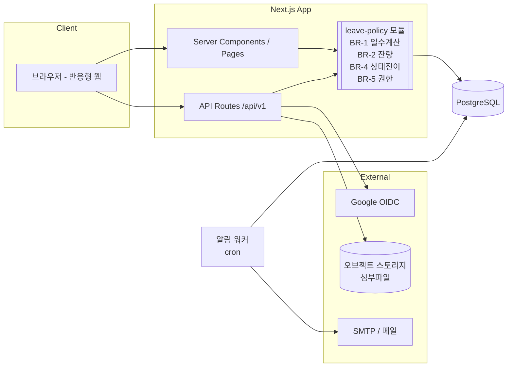
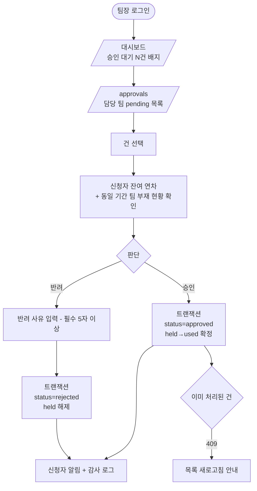

# 사내 휴가 신청/승인 서비스 PRD

> **Version**: 1.0
> **Created**: 2026-08-04
> **Status**: Draft
> **Type**: product-feature
> **Scale Grade**: Hobby (사내 도구 / 수백 명 이하)

---

## 0. 전제 및 확인 필요 사항

이 PRD는 그린필드(빈 저장소) 상태에서 작성되었으며, 아래 항목은 **가정값**입니다. 실제와 다르면 해당 섹션을 먼저 수정한 뒤 구현에 들어가야 합니다.

| # | 가정 | 근거 | 다르면 영향받는 섹션 |
|---|------|------|---------------------|
| A-1 | 조직 규모 100명 내외, 팀 10개 내외 | "사내 팀원" 표현 | §4.0 Scale Grade, §4.1 SLA |
| A-2 | 승인 단계는 **1단계**(팀장 승인으로 확정) | 요청에 팀장만 언급 | §3 FR-008, §5.2 스키마 |
| A-3 | 기존 인사(HR)/그룹웨어 시스템과 **연동 없음**, 연차 정보는 본 서비스에서 관리 | 요청에 언급 없음 | §1.3 Non-Goals, §3 FR-012 |
| A-4 | 사내 계정 체계(Google Workspace 등) SSO 사용 가능 | 사내 서비스 | §3 FR-001, §4.5 Security |
| A-5 | 연차 부여 방식은 **회계연도 기준 일괄 부여** | 국내 중소 조직 일반 관행 | §3 FR-012, §5.2 `leave_balances` |
| A-6 | 기술 스택은 Next.js + PostgreSQL 권장안 (강제 아님) | 빈 저장소, 제약 없음 | §5.0 |

---

## 1. Overview

### 1.1 Problem Statement

현재 사내 휴가 신청은 메신저/구두/스프레드시트로 처리되어 다음 문제가 발생한다.

1. **기록 부재**: 누가 언제 휴가를 썼는지 신뢰할 수 있는 단일 기록이 없다. 잔여 연차를 개인과 관리자가 각자 다르게 세고 있어 연말 정산 시점에 분쟁이 생긴다.
2. **승인 누락**: 팀장이 메신저로 받은 요청을 놓치거나, 승인 여부가 명시적으로 남지 않아 "말한 줄 알았다"는 상황이 반복된다.
3. **가시성 부재**: 같은 팀원이 같은 날 동시에 부재하는 상황을 사전에 알 수 없어 업무 공백이 생긴다.
4. **집계 비용**: 관리자가 전체 휴가 현황과 연차 소진율을 파악하려면 매번 수작업 집계가 필요하다.

### 1.2 Goals

- **G-1**: 휴가 신청 → 승인/반려 → 잔여 연차 반영까지 전 과정을 시스템 하나에서 처리하고, 모든 상태 변경을 되돌릴 수 없는 기록으로 남긴다.
- **G-2**: 잔여 연차를 **시스템이 계산**하여 사용자·팀장·관리자가 보는 숫자가 항상 동일하게 만든다. (수기 집계 0회)
- **G-3**: 팀장이 승인 대기 건을 놓치지 않도록 알림과 대기 목록을 제공하고, 신청 후 승인까지 걸리는 시간을 단축한다.
- **G-4**: 관리자가 전체 휴가 현황(기간별/팀별/유형별)을 화면에서 즉시 확인하고 CSV로 내보낼 수 있게 한다.

### 1.3 Non-Goals (Out of Scope)

- 급여 시스템 및 급여 계산 연동 (미사용 연차 수당 산정 등)
- 기존 HR/그룹웨어(더존, 사람인, 플렉스 등)와의 양방향 실시간 동기화
- 근태 관리 전반 (출퇴근 기록, 초과근무, 유연근무제 스케줄링)
- 2단계 이상 결재선 / 대결·전결 / 결재선 커스터마이징 (Phase 3 이후 검토)
- 모바일 네이티브 앱 (반응형 웹으로 대응)
- 노동법 자동 준수 검증 (예: 연차 사용 촉진 제도 법정 통지 자동화)

### 1.4 Scope

| 포함 | 제외 |
|------|------|
| 휴가 신청 작성/수정/철회 | 급여·수당 계산 |
| 팀장 1단계 승인/반려 (반려 사유 필수) | 다단계 결재선, 대결/전결 |
| 잔여 연차 자동 계산 및 차감 | 법정 연차 발생일수 자동 산정(입사일 기준 비례 부여) — 관리자 수동 입력 |
| 영업일 계산 (주말 + 사내 공휴일 제외) | 국가별/지역별 공휴일 자동 동기화 (관리자 수동 등록) |
| 팀 캘린더 (동시 부재 확인) | 개인 일정/회의 캘린더 연동 |
| 관리자 전체 현황 대시보드 + CSV 내보내기 | BI 도구 연동, 커스텀 리포트 빌더 |
| 이메일 알림 | SMS, 카카오 알림톡 |
| 감사 로그 | 외부 SIEM 연동 |

---

## 2. User Stories

### 2.1 User Stories by Role

#### 신청자 (`member`)

- **US-1**: 팀원으로서, **잔여 연차를 먼저 확인한 뒤** 휴가를 신청하고 싶다. 신청 후에야 일수가 모자란 걸 알고 싶지 않기 때문이다.
- **US-2**: 팀원으로서, 반차(오전/오후) 단위로도 신청하고 싶다. 하루를 다 쓰지 않아도 되는 일정이 있기 때문이다.
- **US-3**: 팀원으로서, 내가 낸 신청의 현재 상태(대기/승인/반려)를 한 화면에서 보고 싶다. 팀장에게 따로 물어보지 않기 위해서다.
- **US-4**: 팀원으로서, 승인 전에는 신청을 스스로 철회하고 싶다. 일정이 바뀌는 일이 흔하기 때문이다.
- **US-5**: 팀원으로서, 신청 전에 같은 기간에 부재하는 팀원이 있는지 보고 싶다. 팀 업무 공백을 피하기 위해서다.

#### 팀장 (`manager`)

- **US-6**: 팀장으로서, 내 팀의 승인 대기 건을 한 목록에서 처리하고 싶다. 메신저를 뒤지지 않기 위해서다.
- **US-7**: 팀장으로서, 승인 판단 시 **신청자의 잔여 연차와 같은 기간 팀 부재 현황**을 함께 보고 싶다. 근거 있는 판단을 하기 위해서다.
- **US-8**: 팀장으로서, 반려할 때 사유를 남기고 싶다. 신청자가 이유를 알고 재신청할 수 있어야 하기 때문이다.
- **US-9**: 팀장으로서, 새 신청이 오면 알림을 받고 싶다. 처리 지연을 막기 위해서다.

#### 관리자 (`admin`)

- **US-10**: 관리자로서, 전체 조직의 휴가 현황을 기간·팀·유형별로 필터링해서 보고 싶다. 인력 운영 현황을 파악하기 위해서다.
- **US-11**: 관리자로서, 구성원별 연차 부여일수를 등록·조정하고 싶다. 입사일과 근속연수에 따라 값이 다르기 때문이다.
- **US-12**: 관리자로서, 현황을 CSV로 내보내고 싶다. 급여 담당자에게 전달하고 별도 정산해야 하기 때문이다.
- **US-13**: 관리자로서, 사내 공휴일/창립기념일을 등록하고 싶다. 휴가 일수 계산에서 제외되어야 하기 때문이다.

### 2.2 Acceptance Criteria (Gherkin)

```gherkin
Feature: 휴가 신청

Scenario: 잔여 연차 내에서 정상 신청
  Given 사용자 "김팀원"의 연차 잔여일수가 10일이다
  And 2026-08-10 ~ 2026-08-12 는 모두 평일이며 공휴일이 아니다
  When 김팀원이 유형="연차", 기간=2026-08-10 ~ 2026-08-12 로 신청을 제출한다
  Then 신청이 status="pending" 으로 생성된다
  And 소요일수는 3.0일로 계산된다
  And 잔여 연차 표시는 7일로 감소한다  # 승인 전 hold(예약) 차감
  And 확정 차감(used)은 아직 0일이다
  And 팀장에게 알림이 발송된다

Scenario: 주말과 공휴일은 일수에서 제외
  Given 2026-08-14(금), 2026-08-15(토, 광복절), 2026-08-16(일), 2026-08-17(월) 기간
  And 2026-08-17 이 사내 공휴일로 등록되어 있다
  When 사용자가 2026-08-14 ~ 2026-08-17 로 연차를 신청한다
  Then 소요일수는 1.0일로 계산된다

Scenario: 반차 신청
  Given 사용자의 연차 잔여일수가 1일이다
  When 사용자가 유형="반차(오전)", 날짜=2026-08-10 (단일 평일) 로 신청한다
  Then 소요일수는 0.5일로 계산된다
  And 신청이 정상 생성된다

Scenario: 잔여 연차 초과 신청 거부
  Given 사용자의 연차 잔여일수가 2일이다
  When 사용자가 소요일수 3일짜리 연차를 신청한다
  Then 신청이 생성되지 않는다
  And 422 INSUFFICIENT_BALANCE 오류와 "잔여 연차가 부족합니다 (잔여 2일 / 신청 3일)" 메시지가 반환된다

Scenario: 기간이 겹치는 중복 신청 거부
  Given 사용자에게 2026-08-10 ~ 2026-08-12 기간의 status="pending" 신청이 이미 있다
  When 사용자가 2026-08-12 ~ 2026-08-13 로 새 신청을 제출한다
  Then 409 OVERLAPPING_REQUEST 오류가 반환된다

Scenario: 과거 날짜 신청 거부
  Given 오늘이 2026-08-04 이다
  When 사용자가 시작일 2026-08-01 로 신청한다
  Then 422 PAST_DATE_NOT_ALLOWED 오류가 반환된다
  # 사후 신청(병가 등)은 admin이 대신 등록 — FR-016

Scenario: 종료일이 시작일보다 빠른 경우
  When 사용자가 시작일 2026-08-12, 종료일 2026-08-10 으로 신청한다
  Then 422 INVALID_DATE_RANGE 오류가 반환된다

Feature: 승인/반려

Scenario: 팀장 승인
  Given "김팀원"의 pending 신청(3일)이 있다
  And "박팀장"은 김팀원이 속한 팀의 manager 이다
  When 박팀장이 해당 신청을 승인한다
  Then 신청 status 가 "approved" 로 변경된다
  And 잔여 연차의 hold 3일이 used 3일로 확정 전환된다
  And 신청자에게 승인 알림이 발송된다
  And 감사 로그에 actor=박팀장, action="approve" 가 기록된다

Scenario: 반려 시 사유 필수
  Given "김팀원"의 pending 신청이 있다
  When 박팀장이 사유 없이 반려를 시도한다
  Then 422 REASON_REQUIRED 오류가 반환된다

Scenario: 반려 시 연차 원복
  Given "김팀원"의 pending 신청(3일)이 있고 hold 가 3일이다
  When 박팀장이 사유="프로젝트 마감 주간" 으로 반려한다
  Then 신청 status 가 "rejected" 로 변경된다
  And hold 3일이 해제되어 잔여 연차가 원래대로 돌아온다
  And 신청자에게 반려 사유가 포함된 알림이 발송된다

Scenario: 다른 팀 팀장은 승인 불가
  Given "김팀원"은 A팀 소속이고 pending 신청이 있다
  And "이팀장"은 B팀의 manager 이다
  When 이팀장이 김팀원의 신청에 접근한다
  Then 403 FORBIDDEN 오류가 반환된다

Scenario: 본인 신청 자가 승인 불가
  Given "박팀장"(manager)이 본인의 휴가를 신청했다
  When 박팀장이 자신의 신청을 승인하려 한다
  Then 403 SELF_APPROVAL_FORBIDDEN 오류가 반환된다
  And 해당 신청의 승인자는 상위 관리자(admin)로 지정되어 있다

Scenario: 이미 처리된 신청 재처리 방지 (동시성)
  Given 신청이 이미 status="approved" 이다
  When 팀장이 같은 신청을 다시 반려하려 한다
  Then 409 ALREADY_PROCESSED 오류가 반환된다

Feature: 철회

Scenario: 승인 전 자가 철회
  Given 사용자의 신청이 status="pending" 이다
  When 사용자가 철회한다
  Then status 가 "cancelled" 로 변경되고 hold 가 해제된다

Scenario: 승인 후 철회는 팀장 승인 필요
  Given 사용자의 신청이 status="approved" 이고 시작일이 미래이다
  When 사용자가 철회를 요청한다
  Then status 가 "cancel_requested" 로 변경된다
  And 팀장에게 철회 승인 요청 알림이 발송된다
  And 팀장이 승인해야 status="cancelled" 및 used 원복이 일어난다

Scenario: 이미 시작된 휴가는 철회 불가
  Given 승인된 신청의 시작일이 오늘 이전이다
  When 사용자가 철회를 시도한다
  Then 422 CANNOT_CANCEL_STARTED 오류가 반환된다
  # 관리자만 수동 조정 가능 — FR-016

Feature: 관리자 현황

Scenario: 기간·팀 필터 조회
  Given 여러 팀의 휴가 데이터가 존재한다
  When 관리자가 기간=2026-08-01~2026-08-31, 팀="개발팀" 으로 조회한다
  Then 해당 조건에 맞는 신청 목록과 팀별/유형별 집계가 표시된다

Scenario: 권한 없는 접근 차단
  Given "김팀원"의 role 은 member 이다
  When 김팀원이 /admin 에 접근한다
  Then no-permission 화면이 표시되고 데이터는 반환되지 않는다
```

### 2.3 User Roles

| Role Key | 한국어 명칭 | 권한 범위 | 비고 |
|----------|------------|----------|------|
| `member` | 팀원 (신청자) | 본인 신청 생성/조회/수정/철회, 본인 잔여 연차 조회, 소속 팀 캘린더 조회 | 기본 역할 |
| `manager` | 팀장 | `member` 권한 전체 + **본인이 관리하는 팀**의 신청 승인/반려/조회, 팀원 잔여 연차 조회 | 본인 신청은 자가 승인 불가 |
| `admin` | 관리자 (인사담당) | 전체 조직 신청 조회, 연차 부여/조정, 공휴일 관리, 구성원·팀 관리, CSV 내보내기, 예외 처리 | 승인 권한도 보유(대리 승인) |

**규칙**:
- Role Key는 영문 소문자 단일 단어를 사용하며, 이후 모든 페이지/API 명세에서 이 키를 그대로 인용한다.
- 역할은 **누적형이 아니다.** 사용자당 role 컬럼 1개를 가지며, `manager`/`admin`은 `member`의 모든 권한을 포함한다.
- `manager`의 승인 범위는 role 만으로 결정되지 않는다. `teams.manager_id = user.id` 인 팀의 구성원에 대해서만 승인 가능하다. (§4.5 참고)

---

## 3. Functional Requirements

| ID | Requirement | Priority | Dependencies |
|----|------------|----------|--------------|
| FR-001 | 사내 계정 SSO(Google Workspace OIDC) 로그인. 허용 도메인(예: `@company.com`) 외 계정은 로그인 거부 | P0 | - |
| FR-002 | 사용자 프로비저닝: 최초 로그인 시 `member` 역할로 자동 생성, 팀 미배정 상태. 관리자가 팀·역할 지정 | P0 | FR-001 |
| FR-003 | 휴가 유형 관리: 연차(1.0), 반차-오전(0.5), 반차-오후(0.5), 병가, 경조사, 공가. 유형별 "연차 차감 여부" 설정 | P0 | - |
| FR-004 | 잔여 연차 조회: 부여(granted) / 사용(used) / 대기중(held) / 잔여(remaining = granted - used - held) 표시 | P0 | FR-003 |
| FR-005 | 휴가 신청 생성: 유형, 시작일, 종료일, 사유(선택), 비상연락처(선택), 첨부파일(선택, 병가 진단서 등) | P0 | FR-003, FR-004 |
| FR-006 | 영업일 계산: 주말(토·일)과 등록된 공휴일을 제외하고 소요일수 산정. 반차는 0.5일. 계산 결과를 신청 화면에서 **제출 전 실시간 표시** | P0 | FR-013 |
| FR-007 | 신청 유효성 검증: 잔여일수 초과, 기간 중복, 과거 날짜, 시작>종료, 영업일 0일, 최대 연속 신청일수(기본 20영업일) 초과 | P0 | FR-005, FR-006 |
| FR-008 | 팀장 승인/반려 (1단계). 반려 시 사유 필수(최소 5자). 처리 시 신청 상태·연차 잔량이 하나의 트랜잭션에서 갱신 | P0 | FR-005 |
| FR-009 | 승인 대기 목록: 팀장은 본인 팀의 pending 건을 신청일 오름차순으로 조회. 신청자 잔여 연차와 동일 기간 팀 부재 인원을 함께 표시 | P0 | FR-008 |
| FR-010 | 신청 철회: pending → 즉시 취소. approved(시작 전) → `cancel_requested` 후 팀장 승인 필요. 시작된 휴가는 철회 불가 | P0 | FR-008 |
| FR-011 | 내 신청 목록: 상태별 필터, 기간별 정렬, 상세 조회(처리 이력 타임라인 포함) | P0 | FR-005 |
| FR-012 | 관리자 연차 부여/조정: 구성원별 연차 부여일수 입력, 조정 시 사유 필수, 조정 이력 보존 | P0 | FR-002 |
| FR-013 | 공휴일 관리: 관리자가 연도별 공휴일/사내 휴무일 등록·삭제. 이미 승인된 신청의 일수는 **소급 재계산하지 않음** | P0 | - |
| FR-014 | 관리자 전체 현황 대시보드: 기간·팀·유형·상태 필터, 팀별 사용률·유형별 분포 집계, 목록 조회 | P0 | FR-008 |
| FR-015 | 알림: 신청 시 팀장에게, 승인/반려 시 신청자에게 이메일 발송. 발송 실패 시 재시도 3회 후 실패 기록 | P1 | FR-005, FR-008 |
| FR-016 | 관리자 예외 처리: 사후 등록(과거 날짜 신청 대리 생성), 시작된 휴가 취소, 상태 강제 변경. 모두 사유 필수 + 감사 로그 | P1 | FR-014 |
| FR-017 | 팀 캘린더: 월 단위로 팀원 부재 일정을 표시. 승인 건은 확정, pending 건은 반투명 표시 | P1 | FR-008 |
| FR-018 | CSV 내보내기: 현재 필터 조건의 현황을 UTF-8 BOM CSV로 다운로드 | P1 | FR-014 |
| FR-019 | 감사 로그: 신청/승인/반려/철회/연차 조정/권한 변경의 actor, 시각, 이전값, 이후값, 사유를 기록. 수정·삭제 불가 | P1 | FR-008, FR-012 |
| FR-020 | 승인 지연 리마인더: 48시간 이상 pending 상태인 건에 대해 팀장에게 1일 1회 재알림 | P2 | FR-015 |
| FR-021 | 슬랙 알림 연동 (이메일 대체/병행) | P2 | FR-015 |
| FR-022 | 연차 사용 촉진 알림: 잔여 연차가 많고 연말이 가까운 구성원에게 안내 | P3 | FR-014 |

### 3.1 핵심 비즈니스 규칙

이 규칙들은 구현 시 반드시 단일 모듈(`lib/leave-policy.ts` 등)로 격리하여 API·UI가 같은 로직을 공유해야 한다.

**BR-1. 소요일수 계산**
```
소요일수 = (시작일~종료일 사이의 날짜 중 토·일이 아니고 holidays 테이블에 없는 날의 수)
단, 유형이 반차인 경우 = 0.5 (반차는 단일 날짜만 허용)
소요일수가 0이면 신청 불가 (422 NO_BUSINESS_DAYS)
```

**BR-2. 연차 잔량 모델 (3-값 모델)**
```
remaining = granted - used - held
- 신청 제출 시:  held  += 소요일수   (예약)
- 승인 시:       held  -= 소요일수, used += 소요일수  (확정)
- 반려/철회 시:  held  -= 소요일수   (해제)
- 승인 후 취소:  used  -= 소요일수   (원복)
```
> **왜 held가 필요한가**: held 없이 승인 시점에만 차감하면, 잔여 3일인 사용자가 3일짜리 신청을 두 건 동시에 낼 수 있고 팀장이 둘 다 승인하면 잔량이 음수가 된다. held는 이 시나리오를 신청 시점에 차단한다.

**BR-3. 동시성 제어**
- 잔량 갱신은 `SELECT ... FOR UPDATE`로 `leave_balances` 행을 잠근 뒤 수행한다.
- 신청 상태 전이는 `UPDATE ... WHERE id = ? AND status = 'pending'` 형태로 수행하고, 영향 행 수가 0이면 `409 ALREADY_PROCESSED`를 반환한다. (팀장 두 명 또는 중복 클릭 대비)
- 기간 중복 검사와 신청 생성은 같은 트랜잭션 안에서 수행한다.

**BR-4. 상태 전이**

허용된 전이만 가능하며, 그 외 요청은 `409 INVALID_TRANSITION`을 반환한다.

```
pending ──approve──> approved ──cancel_request──> cancel_requested ──approve──> cancelled
   │                     │                              │
   ├──reject──> rejected │                              └──reject──> approved (원복)
   └──cancel──> cancelled└──(admin only)──> cancelled
```

**BR-5. 승인 권한 판정**
```
canApprove(actor, request) =
  request.status 가 처리 가능 상태 AND
  actor.id != request.user_id AND        # 자가 승인 금지
  ( actor.role == 'admin'
    OR (actor.role == 'manager' AND teams[request.user.team_id].manager_id == actor.id) )
```
팀장 본인의 신청은 `admin`이 승인한다. 팀장이 공석인 팀의 신청도 `admin`으로 라우팅된다.

**BR-6. 연차 미차감 유형**
`leave_types.deducts_annual = false` 인 유형(병가·경조사·공가)은 잔량 검증과 차감을 건너뛴다. 단 기간 중복 검사와 승인 절차는 동일하게 적용된다.

---

## 4. Non-Functional Requirements

### 4.0 Scale Grade

**등급: Hobby (사내 도구)**

| 항목 | 값 | 근거 |
|------|-----|------|
| 총 사용자 | ~100명 (가정 A-1) | 사내 전 구성원 |
| DAU | < 50 | 휴가 신청은 개인당 월 1~2회 수준 |
| 피크 동시접속 | < 20 | 연말·연초, 여름 휴가철, 월요일 오전에 집중 |
| 데이터량 | < 100MB / 년 | 신청 건수 연 1,500건 내외 + 첨부파일 |

> **주의**: 조직 규모가 1,000명을 넘거나 그룹사 공용으로 확장할 계획이 있다면 Startup 등급으로 재산정하고 §4.1~4.3을 다시 잡아야 한다.

### 4.1 Performance SLA

| 지표 | 목표값 | 비고 |
|------|--------|------|
| 페이지 로드 (p95) | < 1.5s | 최초 진입, 사내망 기준 |
| API 응답 (p95) | < 500ms | 목록·상세 조회 |
| 관리자 대시보드 집계 (p95) | < 2s | 1년치 전체 데이터 기준 |
| CSV 내보내기 | < 10s | 최대 10,000행 |
| Throughput | 20 RPS | Hobby 등급 충분 |

### 4.2 Availability SLA

| 항목 | 값 |
|------|-----|
| 목표 Uptime | 99% (근무시간 09:00~19:00 기준) |
| 허용 다운타임 | 월 7.3시간 |
| 배포 방식 | 근무시간 외 배포 권장, 무중단 배포 불필요 |

> Hobby 등급 기본값(95%)보다 높게 잡은 이유: 휴가 신청은 월초·연말에 집중되며 그 시점에 서비스가 멈추면 대체 수단(메신저)으로 회귀해 데이터 정합성이 깨진다.

### 4.3 Data Requirements

| 항목 | 값 |
|------|-----|
| 초기 데이터량 | < 10MB (구성원 100명 + 초기 연차 정보) |
| 연간 증가율 | ~50MB/년 (신청 1,500건 + 첨부파일) |
| 데이터 보존 기간 | 휴가 기록 **5년** (근로기준법상 근로 관계 서류 보존 3년 + 여유), 감사 로그 5년 |
| 백업 | 일 1회 자동 백업, 7일 보관 |
| 첨부파일 | 건당 최대 10MB, 형식 pdf/jpg/png 한정 |

### 4.4 Recovery

| 항목 | 값 | 비고 |
|------|-----|------|
| RTO | 24시간 | 근무일 기준. 장애 시 휴가 신청은 하루 미룰 수 있음 |
| RPO | 24시간 | 일 1회 백업 기준. 손실 시 사용자 재신청으로 복구 가능 |

### 4.5 Security

| 항목 | 요구사항 |
|------|---------|
| Authentication | **Required** (모든 페이지, `/login` 제외). Google Workspace OIDC SSO. 허용 도메인 화이트리스트 검증 |
| Session | HttpOnly + Secure + SameSite=Lax 쿠키, 만료 8시간, 슬라이딩 갱신 |
| Authorization | 모든 API에서 **서버 측 권한 재검증**. UI에서 버튼을 숨기는 것은 권한 제어가 아니다 |
| 수평 권한 (IDOR 방지) | `GET /api/v1/leave-requests/:id` 는 요청자가 (본인 \| 해당 팀 manager \| admin) 인지 검증. 이 검사가 없으면 ID를 바꿔가며 타인의 병가 사유를 열람할 수 있다 |
| 민감정보 | 병가 사유·진단서는 **민감 개인정보**. 신청자 본인, 승인 권한자, admin 외에는 사유·첨부를 조회할 수 없다. 팀 캘린더에는 **유형과 이름만** 표시하고 사유는 노출하지 않는다 |
| 첨부파일 | 비공개 스토리지에 저장, 서명된 단기 URL(5분)로만 접근. 파일명은 서버에서 재생성(경로 조작 방지), MIME 타입 검증 |
| 암호화 | In transit: TLS 1.2+. At rest: DB 볼륨 암호화 + 첨부파일 스토리지 암호화 |
| 감사 로그 | FR-019. append-only. 애플리케이션 DB 계정에 로그 테이블 UPDATE/DELETE 권한 부여 금지 |
| 입력 검증 | 서버 측 스키마 검증(zod 등). 사유·반려 사유는 렌더링 시 이스케이프 처리(XSS) |
| Rate Limit | 신청 생성 10회/분/사용자, 로그인 시도 10회/분/IP |

### 4.6 Quality

| 항목 | 요구사항 |
|------|---------|
| 테스트 | BR-1(일수 계산), BR-2(잔량 모델), BR-4(상태 전이), BR-5(권한 판정)는 **단위 테스트 필수**. 경계 케이스(연휴 전체, 반차, 잔량 정확히 0, 동시 승인) 포함 |
| 접근성 | 폼 라벨·에러 메시지 연결(aria-describedby), 키보드 전용 조작 가능, 색상만으로 상태 구분 금지 |
| 브라우저 | Chrome/Edge/Safari 최신 2개 버전 |
| 반응형 | 신청·조회 화면은 모바일 지원(출근 전 신청 시나리오). 관리자 대시보드는 데스크톱 우선 |
| 로깅 | 요청 ID 기반 구조화 로그. 승인/반려/잔량 변경은 INFO 이상으로 기록 |
| 시간대 | 서버·DB 저장은 UTC, 표시·날짜 계산은 `Asia/Seoul` 고정. 날짜형 필드(휴가 일자)는 `DATE` 타입으로 저장하여 시간대 변환 오류를 원천 차단 |

---

## 5. Technical Design

### 5.0 권장 기술 스택 (그린필드)

| 레이어 | 선택 | 이유 |
|--------|------|------|
| Framework | Next.js (App Router) + TypeScript | 단일 저장소로 FE/BE 처리, 사내 도구 규모에 적합 |
| DB | PostgreSQL | 트랜잭션·행 잠금 필요(BR-3), 날짜 범위 연산 지원 |
| ORM | Prisma | 스키마 선언과 마이그레이션 관리 |
| Auth | Auth.js (NextAuth) + Google OIDC | SSO 요구사항(FR-001) |
| 파일 저장 | S3 호환 오브젝트 스토리지 (비공개 버킷) | 첨부파일 요구사항 |
| 메일 | 사내 SMTP 또는 Resend | FR-015 |
| 배포 | 사내 서버 또는 Vercel + 관리형 Postgres | Hobby 등급 비용 |

> 사내 인프라 정책상 외부 SaaS 사용이 불가하면 배포/스토리지/메일 항목만 온프레미스 대체하면 되고, 나머지 설계는 그대로 유지된다.

### 5.1 API Specification

Base URL: `/api/v1`. 모든 엔드포인트는 인증 필요(명시된 경우 제외). 날짜는 `YYYY-MM-DD` 문자열, 시각은 ISO 8601 UTC.

**공통 에러 응답 형식**
```json
{ "error": { "code": "INSUFFICIENT_BALANCE", "message": "잔여 연차가 부족합니다 (잔여 2일 / 신청 3일)", "details": { "remaining": 2, "requested": 3 } } }
```

**공통 에러 코드**

| Status | Code | 조건 |
|--------|------|------|
| 400 | `INVALID_INPUT` | 스키마 검증 실패 |
| 401 | `UNAUTHORIZED` | 미인증 또는 세션 만료 |
| 403 | `FORBIDDEN` | 권한 부족 (타 팀 접근, 역할 불충분) |
| 404 | `NOT_FOUND` | 리소스 없음 (권한 없는 리소스도 404로 통일하여 존재 여부 노출 방지) |
| 429 | `RATE_LIMITED` | 요청 한도 초과 |
| 500 | `INTERNAL_ERROR` | 서버 오류 |

---

#### `GET /api/v1/me`
- **Description**: 로그인 사용자 정보와 잔여 연차 조회
- **Auth**: Required (all roles)
- **Request**: 없음
- **Response 200**:
```json
{
  "id": "usr_01", "name": "김팀원", "email": "kim@company.com",
  "role": "member", "team": { "id": "tm_01", "name": "개발팀", "managerName": "박팀장" },
  "balance": { "year": 2026, "granted": 15.0, "used": 3.0, "held": 2.0, "remaining": 10.0 }
}
```
- **Errors**: 401 UNAUTHORIZED

---

#### `POST /api/v1/leave-requests/preview`
- **Description**: 제출 전 소요일수·잔량 영향 미리 계산 (FR-006 실시간 표시용). **상태를 변경하지 않는다**
- **Auth**: Required (`member`+)
- **Request**:

| 필드 | 타입 | 필수 | 설명 |
|------|------|------|------|
| `leaveTypeId` | string | ✓ | 휴가 유형 ID |
| `startDate` | string(date) | ✓ | 시작일 |
| `endDate` | string(date) | ✓ | 종료일 (반차는 startDate와 동일) |

- **Response 200**:
```json
{
  "businessDays": 3.0,
  "excludedDates": [{ "date": "2026-08-15", "reason": "holiday", "label": "광복절" }],
  "balanceAfter": { "remaining": 7.0 },
  "warnings": [{ "code": "TEAM_ABSENCE_OVERLAP", "message": "같은 기간에 팀원 2명이 부재 예정입니다" }]
}
```
- **Errors**: 400 INVALID_INPUT, 401, 422 INVALID_DATE_RANGE

---

#### `POST /api/v1/leave-requests`
- **Description**: 휴가 신청 생성 (FR-005)
- **Auth**: Required (`member`+)
- **Request**:

| 필드 | 타입 | 필수 | 제약 |
|------|------|------|------|
| `leaveTypeId` | string | ✓ | 활성 유형만 |
| `startDate` | string(date) | ✓ | 오늘 이후 (admin 대리 등록 제외) |
| `endDate` | string(date) | ✓ | `>= startDate`, 최대 20영업일 |
| `reason` | string | - | 최대 500자 |
| `emergencyContact` | string | - | 최대 50자 |
| `attachmentIds` | string[] | - | 최대 3개. 사전 업로드된 파일 ID |

- **Response 201**:
```json
{
  "id": "req_01", "status": "pending", "businessDays": 3.0,
  "startDate": "2026-08-10", "endDate": "2026-08-12",
  "approver": { "id": "usr_02", "name": "박팀장" },
  "createdAt": "2026-08-04T01:00:00Z"
}
```
- **Errors**:
  - 422 `INVALID_DATE_RANGE` — 종료일 < 시작일
  - 422 `PAST_DATE_NOT_ALLOWED` — 시작일이 과거
  - 422 `NO_BUSINESS_DAYS` — 계산된 영업일 0일
  - 422 `MAX_DURATION_EXCEEDED` — 20영업일 초과
  - 422 `INSUFFICIENT_BALANCE` — 잔여 연차 부족
  - 422 `HALF_DAY_MULTI_DATE` — 반차인데 기간이 2일 이상
  - 409 `OVERLAPPING_REQUEST` — 기간 중복 (details에 충돌 신청 ID 포함)
  - 409 `NO_APPROVER` — 승인자 미지정(팀 미배정). admin 문의 안내
  - 400, 401, 429

---

#### `GET /api/v1/leave-requests`
- **Description**: 신청 목록 조회. **역할에 따라 조회 범위가 자동으로 제한된다** (member=본인, manager=본인+담당팀, admin=전체)
- **Auth**: Required
- **Request (query)**: `status`, `from`, `to`, `teamId`(manager/admin), `userId`(manager/admin), `leaveTypeId`, `page`(기본 1), `size`(기본 20, 최대 100)
- **Response 200**:
```json
{
  "items": [{
    "id": "req_01", "status": "pending",
    "user": { "id": "usr_01", "name": "김팀원", "teamName": "개발팀" },
    "leaveType": { "id": "lt_01", "name": "연차" },
    "startDate": "2026-08-10", "endDate": "2026-08-12", "businessDays": 3.0,
    "createdAt": "2026-08-04T01:00:00Z"
  }],
  "page": 1, "size": 20, "total": 37
}
```
> 목록 응답에는 `reason`·첨부를 포함하지 않는다 (§4.5 민감정보).
- **Errors**: 400, 401, 403 (권한 없는 `teamId` 지정 시)

---

#### `GET /api/v1/leave-requests/:id`
- **Description**: 신청 상세 + 처리 이력 타임라인
- **Auth**: Required. 본인 / 담당 팀 manager / admin 만 접근 (§4.5 IDOR 방지)
- **Response 200**:
```json
{
  "id": "req_01", "status": "rejected",
  "user": { "id": "usr_01", "name": "김팀원" },
  "leaveType": { "name": "연차", "deductsAnnual": true },
  "startDate": "2026-08-10", "endDate": "2026-08-12", "businessDays": 3.0,
  "reason": "가족 여행", "emergencyContact": "010-0000-0000",
  "attachments": [{ "id": "att_01", "filename": "cert.pdf", "url": "https://.../signed?exp=..." }],
  "timeline": [
    { "at": "2026-08-04T01:00:00Z", "action": "submitted", "actor": "김팀원" },
    { "at": "2026-08-04T02:10:00Z", "action": "rejected", "actor": "박팀장", "comment": "프로젝트 마감 주간" }
  ]
}
```
- **Errors**: 401, 404 (권한 없음 포함)

---

#### `POST /api/v1/leave-requests/:id/approve`
- **Description**: 승인 (FR-008). 상태 전이 + 잔량 확정을 단일 트랜잭션으로 처리
- **Auth**: Required (`manager` — 담당 팀 한정 / `admin`)
- **Request**: `{ "comment": "string (선택, 최대 500자)" }`
- **Response 200**: `{ "id": "req_01", "status": "approved", "processedAt": "...", "processedBy": { "name": "박팀장" } }`
- **Errors**:
  - 403 `FORBIDDEN` — 담당 팀이 아님
  - 403 `SELF_APPROVAL_FORBIDDEN` — 본인 신청
  - 409 `ALREADY_PROCESSED` — 이미 처리된 건 (동시 클릭)
  - 409 `INVALID_TRANSITION` — 허용되지 않는 상태 전이
  - 401, 404

---

#### `POST /api/v1/leave-requests/:id/reject`
- **Description**: 반려 (FR-008). hold 해제
- **Auth**: Required (`manager` 담당 팀 / `admin`)
- **Request**:

| 필드 | 타입 | 필수 | 제약 |
|------|------|------|------|
| `reason` | string | ✓ | 5~500자 |

- **Response 200**: `{ "id": "req_01", "status": "rejected", "processedAt": "..." }`
- **Errors**: 422 `REASON_REQUIRED`(누락 또는 5자 미만), 403 FORBIDDEN, 403 SELF_APPROVAL_FORBIDDEN, 409 ALREADY_PROCESSED, 401, 404

---

#### `POST /api/v1/leave-requests/:id/cancel`
- **Description**: 철회 (FR-010). pending이면 즉시 `cancelled`, approved이면 `cancel_requested`
- **Auth**: Required (본인 / admin)
- **Request**: `{ "reason": "string (approved 건 철회 시 필수)" }`
- **Response 200**: `{ "id": "req_01", "status": "cancelled" | "cancel_requested" }`
- **Errors**: 422 `CANNOT_CANCEL_STARTED`, 409 INVALID_TRANSITION, 403, 401, 404

---

#### `GET /api/v1/calendar`
- **Description**: 팀 캘린더용 부재 일정 (FR-017). **사유·첨부는 반환하지 않는다**
- **Auth**: Required. `member`는 본인 팀만, `admin`은 teamId 지정 가능
- **Request (query)**: `from`(필수), `to`(필수, 최대 92일 범위), `teamId`
- **Response 200**:
```json
{ "items": [{ "userId": "usr_01", "userName": "김팀원", "leaveTypeName": "연차",
              "startDate": "2026-08-10", "endDate": "2026-08-12", "status": "approved" }] }
```
- **Errors**: 400 INVALID_INPUT (범위 초과), 401, 403

---

#### `GET /api/v1/admin/overview`
- **Description**: 관리자 전체 현황 집계 (FR-014)
- **Auth**: Required (`admin`)
- **Request (query)**: `from`, `to`, `teamId`, `leaveTypeId`, `status`
- **Response 200**:
```json
{
  "summary": { "totalRequests": 120, "pending": 8, "approved": 105, "rejected": 5, "cancelled": 2,
                "totalDaysUsed": 260.5, "avgApprovalHours": 6.2 },
  "byTeam": [{ "teamId": "tm_01", "teamName": "개발팀", "memberCount": 12,
               "granted": 180.0, "used": 96.5, "usageRate": 0.536 }],
  "byLeaveType": [{ "name": "연차", "count": 90, "days": 210.0 }]
}
```
- **Errors**: 401, 403 FORBIDDEN

---

#### `GET /api/v1/admin/export`
- **Description**: 현황 CSV 내보내기 (FR-018)
- **Auth**: Required (`admin`)
- **Request (query)**: `/admin/overview`와 동일 필터
- **Response 200**: `Content-Type: text/csv; charset=utf-8` (BOM 포함), `Content-Disposition: attachment; filename="leave-report-YYYYMMDD.csv"`
  - 컬럼: 신청ID, 이름, 이메일, 팀, 휴가유형, 시작일, 종료일, 소요일수, 상태, 신청일시, 처리자, 처리일시, 반려사유
- **Errors**: 401, 403, 400 (10,000행 초과 시 `EXPORT_TOO_LARGE` — 기간 축소 안내)

---

#### `PUT /api/v1/admin/balances/:userId`
- **Description**: 연차 부여/조정 (FR-012)
- **Auth**: Required (`admin`)
- **Request**:

| 필드 | 타입 | 필수 | 제약 |
|------|------|------|------|
| `year` | number | ✓ | 회계연도 |
| `granted` | number | ✓ | 0 이상, 0.5 단위 |
| `reason` | string | ✓ | 5~200자 (조정 이력에 기록) |

- **Response 200**: `{ "userId": "usr_01", "year": 2026, "granted": 16.0, "used": 3.0, "held": 2.0, "remaining": 11.0 }`
- **Errors**: 422 `BELOW_USED` — `granted < used + held` 인 경우(이미 사용한 일수보다 적게 부여 불가), 400, 401, 403, 404

---

#### `POST /api/v1/admin/holidays` / `DELETE /api/v1/admin/holidays/:id`
- **Description**: 공휴일 등록/삭제 (FR-013)
- **Auth**: Required (`admin`)
- **Request (POST)**: `{ "date": "2026-08-17", "label": "창립기념일" }`
- **Response 201**: `{ "id": "hol_01", "date": "2026-08-17", "label": "창립기념일" }`
- **Errors**: 409 `DUPLICATE_HOLIDAY`, 400, 401, 403
> 등록/삭제는 **이후 신청부터** 적용된다. 기존 승인 건의 `business_days`는 재계산하지 않는다 (FR-013). 필요 시 admin이 FR-016으로 개별 조정한다.

---

#### `PATCH /api/v1/admin/users/:id`
- **Description**: 구성원 팀·역할 지정 (FR-002)
- **Auth**: Required (`admin`)
- **Request**: `{ "teamId": "tm_01", "role": "member" | "manager" | "admin" }`
- **Response 200**: `{ "id": "usr_01", "teamId": "tm_01", "role": "manager" }`
- **Errors**: 422 `LAST_ADMIN` — 마지막 admin의 역할 강등 불가, 400, 401, 403, 404

---

### 5.2 Database Schema

```prisma
enum Role { member manager admin }
enum RequestStatus { pending approved rejected cancelled cancel_requested }
enum DayUnit { full half_am half_pm }

model User {
  id        String   @id @default(cuid())
  email     String   @unique              // 사내 도메인만 허용
  name      String
  role      Role     @default(member)
  teamId    String?
  team      Team?    @relation(fields: [teamId], references: [id])
  active    Boolean  @default(true)        // 퇴사자는 soft delete (기록 보존)
  createdAt DateTime @default(now())

  requests  LeaveRequest[] @relation("requester")
  balances  LeaveBalance[]
  @@index([teamId, active])
}

model Team {
  id        String  @id @default(cuid())
  name      String  @unique
  managerId String?                        // 팀장. null이면 승인자는 admin (BR-5)
  manager   User?   @relation("teamManager", fields: [managerId], references: [id])
  members   User[]
}

model LeaveType {
  id            String  @id @default(cuid())
  name          String  @unique            // 연차, 반차(오전), 반차(오후), 병가, 경조사, 공가
  unit          DayUnit @default(full)
  deductsAnnual Boolean @default(true)     // BR-6
  requiresAttachment Boolean @default(false) // 병가 진단서 등
  active        Boolean @default(true)
  sortOrder     Int     @default(0)
}

model LeaveBalance {
  id      String @id @default(cuid())
  userId  String
  user    User   @relation(fields: [userId], references: [id])
  year    Int
  granted Decimal @db.Decimal(4,1)          // 부여 (0.5 단위 → Decimal, Float 금지)
  used    Decimal @db.Decimal(4,1) @default(0)
  held    Decimal @db.Decimal(4,1) @default(0)   // BR-2 예약분
  version Int     @default(0)               // 낙관적 락 보조
  updatedAt DateTime @updatedAt

  @@unique([userId, year])                  // 사용자-연도당 1행 보장
}

model LeaveRequest {
  id           String   @id @default(cuid())
  userId       String
  user         User     @relation("requester", fields: [userId], references: [id])
  leaveTypeId  String
  leaveType    LeaveType @relation(fields: [leaveTypeId], references: [id])
  startDate    DateTime @db.Date            // DATE 타입 — 시간대 오류 방지 (§4.6)
  endDate      DateTime @db.Date
  businessDays Decimal  @db.Decimal(4,1)    // 신청 시점 계산값을 고정 저장 (FR-013 소급 미적용)
  status       RequestStatus @default(pending)
  reason       String?  @db.VarChar(500)
  emergencyContact String? @db.VarChar(50)

  approverId   String?                      // 신청 시점에 결정된 승인 대상자
  processedById String?
  processedAt  DateTime?
  processComment String? @db.VarChar(500)   // 반려 사유 / 승인 코멘트
  cancelReason String? @db.VarChar(500)

  createdAt    DateTime @default(now())
  updatedAt    DateTime @updatedAt

  attachments  Attachment[]

  @@index([userId, status])
  @@index([approverId, status])             // 승인 대기 목록 조회
  @@index([startDate, endDate])             // 캘린더·기간 필터
  @@index([status, startDate])
}

model Holiday {
  id    String   @id @default(cuid())
  date  DateTime @unique @db.Date
  label String
}

model Attachment {
  id             String  @id @default(cuid())
  leaveRequestId String?
  leaveRequest   LeaveRequest? @relation(fields: [leaveRequestId], references: [id])
  uploadedById   String
  storageKey     String                     // 비공개 버킷 키. 원본 파일명 노출 금지
  filename       String
  mimeType       String
  sizeBytes      Int
  createdAt      DateTime @default(now())
}

model AuditLog {                            // append-only (§4.5)
  id         String   @id @default(cuid())
  actorId    String
  action     String                         // submit | approve | reject | cancel | adjust_balance | change_role ...
  targetType String                         // leave_request | leave_balance | user
  targetId   String
  before     Json?
  after      Json?
  comment    String?  @db.VarChar(500)
  ip         String?
  createdAt  DateTime @default(now())

  @@index([targetType, targetId])
  @@index([actorId, createdAt])
}

model Notification {
  id         String   @id @default(cuid())
  userId     String
  type       String                         // request_submitted | approved | rejected | cancel_requested | reminder
  payload    Json
  channel    String   @default("email")
  sentAt     DateTime?
  failCount  Int      @default(0)           // FR-015 재시도 3회
  lastError  String?
  createdAt  DateTime @default(now())
  @@index([sentAt, failCount])
}
```

**추가 제약 (Prisma로 표현 불가, 마이그레이션 SQL에 직접 추가)**

```sql
-- 기간 중복 방지 보조 (애플리케이션 검증 + DB 이중 방어)
-- 활성 상태(pending/approved/cancel_requested)인 신청끼리만 겹침 금지
CREATE EXTENSION IF NOT EXISTS btree_gist;
ALTER TABLE "LeaveRequest" ADD CONSTRAINT no_overlapping_active_leave
  EXCLUDE USING gist (
    "userId" WITH =,
    daterange("startDate", "endDate", '[]') WITH &&
  ) WHERE (status IN ('pending','approved','cancel_requested'));

-- 잔량 음수 방지
ALTER TABLE "LeaveBalance" ADD CONSTRAINT balance_non_negative
  CHECK (granted >= 0 AND used >= 0 AND held >= 0 AND granted >= used + held);
```

> **왜 DB 제약까지 두는가**: 애플리케이션 레벨 검증만으로는 동시 요청 시 검사-삽입 사이 경쟁 조건을 막지 못한다. EXCLUDE 제약은 이를 DB가 보장한다. 애플리케이션은 제약 위반 오류를 잡아 `409 OVERLAPPING_REQUEST`로 변환한다.

### 5.3 Architecture Diagram



### 5.4 Pages

| Route | Audience | Auth | Linked FRs | Has FE Components | Primary State | Responsive |
|-------|----------|------|-----------|-------------------|---------------|-----------|
| `/login` | guest | None | FR-001 | Yes | success / error | Desktop / Mobile |
| `/` | member, manager, admin | Required | FR-004, FR-011 | Yes | success / empty | Desktop / Mobile |
| `/requests/new` | member, manager, admin | Required | FR-005, FR-006, FR-007 | Yes | success / error | Desktop / Mobile |
| `/requests` | member, manager, admin | Required | FR-011 | Yes | success / empty | Desktop / Mobile |
| `/requests/[id]` | member(본인), manager(담당팀), admin | Required | FR-010, FR-011 | Yes | success / no-permission | Desktop / Mobile |
| `/approvals` | manager, admin | Required | FR-008, FR-009 | Yes | success / empty / no-permission | Desktop / Mobile |
| `/calendar` | member, manager, admin | Required | FR-017 | Yes | success / empty | Desktop / Mobile |
| `/admin` | admin | Required | FR-014, FR-018 | Yes | success / no-permission | Desktop only |
| `/admin/balances` | admin | Required | FR-012 | Yes | success / no-permission | Desktop only |
| `/admin/members` | admin | Required | FR-002 | Yes | success / no-permission | Desktop only |
| `/admin/holidays` | admin | Required | FR-013 | Yes | success / empty / no-permission | Desktop only |
| `/api/v1/*` | - | Required | FR-001~FR-019 | **No** (API) | - | - |

### 5.4.1 Page State Matrix

| Route | loading | empty | error | success | no-permission | 비고 |
|-------|---------|-------|-------|---------|---------------|------|
| `/login` | ✓ | - | ✓ | ✓ | ✓ | 사내 도메인 외 계정 → no-permission ("사내 계정으로 로그인해 주세요") |
| `/` | ✓ | ✓ | ✓ | ✓ | - | 신청 이력 0건 시 empty ("아직 신청한 휴가가 없습니다") |
| `/requests/new` | ✓ | - | ✓ | ✓ | ✓ | 팀 미배정 시 no-permission ("관리자에게 팀 배정을 요청하세요") / 잔량 부족·중복 기간은 error |
| `/requests` | ✓ | ✓ | ✓ | ✓ | - | 필터 결과 0건 시 empty |
| `/requests/[id]` | ✓ | - | ✓ | ✓ | ✓ | 타인 신청 접근 시 no-permission (404 처리) |
| `/approvals` | ✓ | ✓ | ✓ | ✓ | ✓ | 대기 0건 시 empty ("처리할 신청이 없습니다") / member 접근 시 no-permission |
| `/calendar` | ✓ | ✓ | ✓ | ✓ | - | 해당 월 부재 0건 시 empty |
| `/admin` | ✓ | ✓ | ✓ | ✓ | ✓ | 필터 결과 0건 시 empty / admin 아니면 no-permission |
| `/admin/balances` | ✓ | ✓ | ✓ | ✓ | ✓ | 구성원 0명 시 empty |
| `/admin/members` | ✓ | ✓ | ✓ | ✓ | ✓ | - |
| `/admin/holidays` | ✓ | ✓ | ✓ | ✓ | ✓ | 해당 연도 등록 0건 시 empty |

**상태 정의**
- `loading`: 데이터 fetch 중 (스켈레톤). 승인/반려 버튼은 처리 중 비활성화하여 중복 클릭 방지
- `empty`: 정상 응답 0건
- `error`: 4xx/5xx 또는 클라이언트 검증 실패. **에러 코드별 사용자 문구를 §5.1 에러 표에 맞춰 개별 지정**
- `success`: 정상 응답 ≥1건
- `no-permission`: 인증됨 + 권한 부족

### 5.5 User Flow

#### Flow A: 신청자

```mermaid
flowchart TD
  Start([진입]) --> Auth{로그인 상태}
  Auth -->|미인증| Login[/login/]
  Login --> SSO{사내 도메인 검증}
  SSO -->|거부| NoPerm[no-permission 안내]
  SSO -->|통과| Home
  Auth -->|인증됨| Home[/ 내 대시보드<br/>잔여 연차 + 내 신청 목록/]
  Home -->|휴가 신청| New[/requests/new/]
  New --> Preview[유형·기간 입력<br/>소요일수 실시간 표시]
  Preview --> TeamWarn{같은 기간 팀 부재 있음}
  TeamWarn -->|있음| Warn[경고 표시 - 제출은 가능]
  TeamWarn -->|없음| Submit
  Warn --> Submit[제출]
  Submit --> Validate{서버 검증<br/>잔량·중복·과거일자}
  Validate -->|FAIL| New
  Validate -->|PASS| Pending[status=pending<br/>held 차감]
  Pending --> Notify[팀장에게 알림]
  Pending --> Detail[/requests/[id]/]
  Detail -->|승인 전 철회| Cancelled[cancelled<br/>held 해제]
  Detail -->|승인 후 철회 요청| CancelReq[cancel_requested<br/>팀장 승인 대기]
```

#### Flow B: 팀장



#### Flow C: 관리자

```mermaid
flowchart TD
  AStart([관리자 로그인]) --> Admin[/admin 전체 현황/]
  Admin --> Filter[기간·팀·유형·상태 필터]
  Filter --> View[목록 + 팀별 사용률 + 유형별 분포]
  View -->|내보내기| CSV[CSV 다운로드]
  Admin --> Balances[/admin/balances<br/>연차 부여·조정 - 사유 필수/]
  Admin --> Members[/admin/members<br/>팀·역할 지정/]
  Admin --> Holidays[/admin/holidays<br/>공휴일 등록]
  Holidays --> Note[이후 신청부터 적용<br/>기존 승인 건 소급 없음]
  Balances --> Audit[감사 로그 기록]
  Members --> Audit
```

---

## 6. Implementation Phases

### Phase 1: MVP — 신청부터 승인까지 한 바퀴
- [ ] 프로젝트 초기화, DB 스키마 + 마이그레이션(EXCLUDE·CHECK 제약 포함)
- [ ] SSO 로그인 + 도메인 화이트리스트 + 세션 (FR-001, FR-002)
- [ ] `leave-policy` 모듈: BR-1 일수 계산, BR-2 잔량, BR-4 상태 전이, BR-5 권한 + **단위 테스트**
- [ ] 휴가 유형/공휴일 시드 데이터 (FR-003, FR-013)
- [ ] 신청 생성 API + preview API + 검증 (FR-005, FR-006, FR-007)
- [ ] 승인/반려 API (트랜잭션·동시성 처리) (FR-008)
- [ ] 페이지: `/login`, `/`, `/requests/new`, `/requests`, `/requests/[id]`, `/approvals`
- [ ] 잔여 연차 표시 (FR-004)

**Deliverable**: 팀원이 신청하고 팀장이 승인/반려하면 잔여 연차가 정확히 반영되는, 실사용 가능한 최소 서비스

### Phase 2: 관리자 기능 + 알림
- [ ] 관리자 현황 대시보드 + 필터 + 집계 (FR-014)
- [ ] 연차 부여/조정 + 조정 이력 (FR-012)
- [ ] 구성원 팀·역할 관리 (FR-002)
- [ ] 공휴일 관리 화면 (FR-013)
- [ ] 철회 플로우 (승인 후 철회 포함) (FR-010)
- [ ] 이메일 알림 + 재시도 워커 (FR-015)
- [ ] 감사 로그 기록 및 조회 (FR-019)
- [ ] 페이지: `/admin`, `/admin/balances`, `/admin/members`, `/admin/holidays`

**Deliverable**: 관리자가 수기 집계 없이 전체 현황을 파악하고 연차를 운영할 수 있는 상태

### Phase 3: 가시성 강화
- [ ] 팀 캘린더 (FR-017)
- [ ] 신청 화면의 팀 부재 경고 (FR-006 warnings)
- [ ] CSV 내보내기 (FR-018)
- [ ] 관리자 예외 처리 - 사후 등록/강제 취소 (FR-016)
- [ ] 첨부파일 업로드 + 서명 URL (FR-005, §4.5)

**Deliverable**: 팀 업무 공백을 사전에 파악할 수 있고, 예외 상황을 관리자가 시스템 안에서 해결 가능

### Phase 4: 운영 편의
- [ ] 승인 지연 리마인더 (FR-020)
- [ ] 슬랙 알림 연동 (FR-021)
- [ ] 연차 사용 촉진 안내 (FR-022)

**Deliverable**: 운영자가 개입하지 않아도 처리 지연이 스스로 줄어드는 상태

---

## 7. Success Metrics

| Metric | Target | Measurement |
|--------|--------|-------------|
| 휴가 신청의 시스템 처리 비율 | 출시 2개월 내 95% 이상 | 시스템 신청 건수 / (시스템 + 관리자 사후 등록) 건수 |
| 평균 승인 소요 시간 | 24시간 이내 | `processedAt - createdAt` 평균 (`/admin/overview`의 `avgApprovalHours`) |
| 48시간 초과 미처리 건 비율 | 5% 미만 | pending 상태 48시간 초과 건수 / 전체 신청 건수 |
| 잔여 연차 불일치 문의 | 분기당 0건 | 관리자 접수 문의 수동 집계 |
| 관리자 집계 소요 시간 | 기존 대비 90% 감소 (반나절 → 5분) | 관리자 인터뷰 (출시 전/후) |
| 활성 사용률 | 전 구성원의 80% 이상이 분기 내 1회 이상 로그인 | 고유 로그인 사용자 수 / 전체 구성원 수 |
| 주요 API p95 응답시간 | < 500ms | APM 또는 서버 로그 집계 |

---

## 8. Open Questions

구현 착수 전 확인이 필요한 항목입니다.

| # | 질문 | 영향 | 기본 처리 |
|---|------|------|----------|
| Q-1 | 연차 부여 기준이 **회계연도 일괄**인가, **입사일 기준**인가? | §5.2 `LeaveBalance.year` 의미, 이월 처리 | 회계연도 일괄로 구현 (가정 A-5) |
| Q-2 | 미사용 연차의 **다음 해 이월**을 허용하는가? | 잔량 정산 로직 추가 필요 | 이월 없음 (연도 경계에서 초기화) |
| Q-3 | 팀장이 2명 이상인 팀 또는 겸직이 있는가? | `teams.manager_id` 단일 → 다대다 변경 필요 | 팀당 팀장 1명으로 구현 |
| Q-4 | 승인이 **2단계 이상**(팀장 → 본부장) 필요한 조직이 있는가? | 결재선 모델 도입 시 스키마·상태 전이 대폭 변경 | 1단계로 구현 (가정 A-2). 2단계가 필요하면 **Phase 1 착수 전 반드시 반영** |
| Q-5 | 기존 스프레드시트의 과거 휴가 이력을 **마이그레이션**해야 하는가? | 초기 데이터 임포트 작업 추가 | 미포함. 필요 시 관리자 CSV 임포트 기능 별도 추가 |
| Q-6 | 반차 외 **시간 단위 휴가**(2시간 등)를 쓰는가? | `businessDays` Decimal(4,1) → 시간 단위 모델로 변경 | 반차(0.5일)까지만 지원 |
| Q-7 | 퇴사자 처리 정책 — 계정 비활성화 시 진행 중 신청은? | soft delete 정책 | `active=false` 처리, pending 건은 자동 취소 없이 admin이 정리 |
