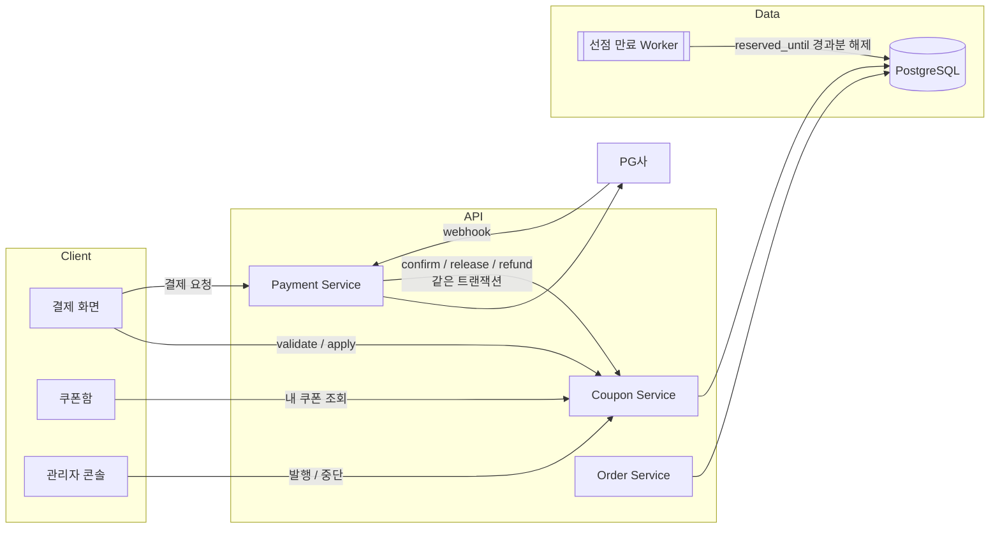
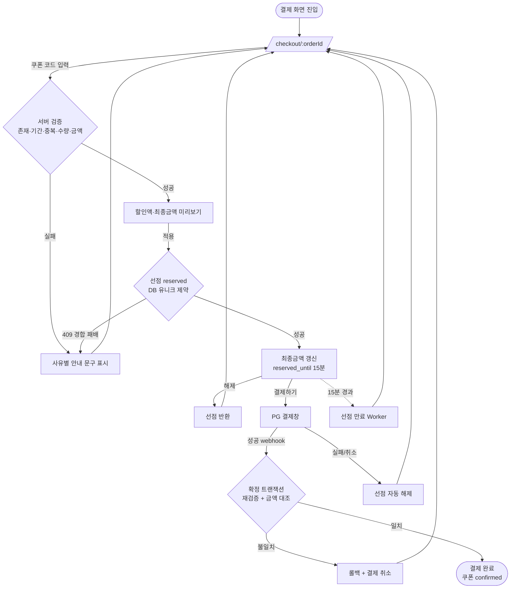
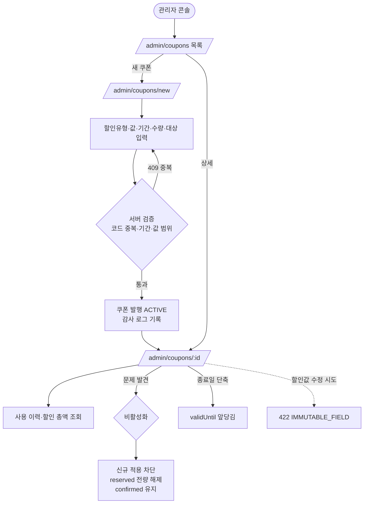

# 쿠폰(Coupon) 기능 PRD

> **Version**: 1.0
> **Created**: 2026-08-04
> **Status**: Draft
> **Type**: product-feature

---

## 1. Overview

### 1.1 Problem Statement

온라인 강의 플랫폼에 할인 수단이 없어 다음 문제가 발생하고 있다.

1. **마케팅 수단 부재** — 신규 수강생 유입, 재구매 유도, 제휴사 프로모션을 진행할 방법이 없다. 할인이 필요하면 강의 정가 자체를 내렸다가 되돌리는 방식뿐이라 정가 신뢰도가 훼손된다.
2. **운영 수작업** — 이벤트 당첨자·환불 보상 등에 대해 CS가 개별 계좌 환불로 처리하고 있어 건당 처리 비용이 크고 회계 대사(對査)가 어렵다.
3. **매출 누수 위험** — 할인을 코드 없이 도입하면 동일 쿠폰의 중복 사용, 만료된 쿠폰의 소급 적용, 동시 결제 요청에 의한 한도 초과 발행 같은 **금전적 손실이 직접 발생하는** 사고가 생긴다.

특히 (3)은 이 기능의 핵심 난이도다. 쿠폰은 "읽기 위주 기능"이 아니라 **돈이 걸린 상태 전이(state transition)** 이며, 실패 모드가 곧 손실이다.

### 1.2 Goals

| # | 목표 | 측정 가능한 정의 |
|---|------|-----------------|
| G-1 | 관리자가 코드 배포 없이 쿠폰을 발행·중단할 수 있다 | 신규 프로모션 세팅 소요 시간 < 5분, 개발자 개입 0회 |
| G-2 | 수강생이 결제 흐름 안에서 쿠폰을 적용하고 할인가를 확인할 수 있다 | 쿠폰 입력 → 할인가 반영 p95 < 500ms |
| G-3 | **중복 사용을 구조적으로 차단한다** | 동시 요청 100건에서도 1개 코드는 정확히 1회만 확정. 초과 확정 건수 = 0 |
| G-4 | **만료·비활성 쿠폰의 적용을 차단한다** | 만료 쿠폰 적용 성공 건수 = 0 (서버 시각 기준) |
| G-5 | 결제 실패/취소/환불 시 쿠폰이 올바르게 복원되거나 소멸된다 | 쿠폰 상태와 주문 상태 불일치 건수 = 0 (일 배치 대사) |
| G-6 | 프로모션 성과를 데이터로 판단할 수 있다 | 쿠폰별 사용률·할인 총액·전환 기여 조회 가능 |

### 1.3 Non-Goals (Out of Scope)

이번 릴리스에서 **하지 않는 것**을 명시한다. (요청 시 Phase 3 이후 재검토)

- **쿠폰 중복 적용(stacking)** — 주문 1건에 쿠폰은 최대 1장. 다중 쿠폰 조합 계산은 우선순위·배분 로직이 복잡해 별도 설계가 필요하다.
- **포인트/마일리지/적립금** — 쿠폰과 별개 자산 개념. 본 PRD는 다루지 않는다.
- **구독(정기결제) 할인** — 회차별 반복 할인은 갱신 시점마다 재검증이 필요해 범위 제외. 이번 릴리스는 **단건 강의 결제**에 한정한다.
- **친구 초대 / 자동 발급 트리거** — 이벤트 기반 자동 발행(가입 시, 수료 시 등)은 Phase 3.
- **B2B 대량 라이선스 / 기업 단체 할인** — 별도 계약·세금계산서 흐름이 필요.
- **다국가 통화 할인** — KRW 단일 통화만 지원.
- **쿠폰 양도·선물하기** — 소유권 이전 개념 제외.

### 1.4 Scope

| 포함 | 제외 |
|------|------|
| 정액 할인(원), 정률 할인(%) 2종 | 무료 배송 / 사은품 등 비금액 혜택 |
| 공개 코드(누구나 입력) / 개인 지급 코드 2종 | QR·바코드 오프라인 쿠폰 |
| 최소 주문 금액, 최대 할인 한도(정률용) | 결제수단 한정 할인(카드사 제휴) |
| 적용 대상 제한: 전체 / 특정 강의 / 특정 카테고리 | 강사별·기간별 복합 조건식(DSL) |
| 총 발행 수량 한도, 1인당 사용 횟수 한도 | 선착순 실시간 랭킹 노출 |
| 유효기간(시작~종료), 관리자 강제 중단 | 발급일 기준 상대 만료(예: 발급 후 30일) — Phase 2 |
| 결제 실패/취소/환불 시 복원 정책 | 부분 환불 시 할인액 안분(按分) — Phase 2 |
| 관리자 발행/조회/중단 화면, 수강생 쿠폰함 | 쿠폰 A/B 테스트 도구 |

---

## 2. User Stories

### 2.1 Primary Users

**US-1 (admin)**
> As a **마케팅 담당 관리자**, I want to **할인율·유효기간·수량 한도를 지정해 쿠폰을 발행**하고 싶다, so that **개발자 도움 없이 프로모션을 즉시 집행**할 수 있다.

**US-2 (admin)**
> As a **운영 관리자**, I want to **문제가 생긴 쿠폰을 즉시 중단**하고 싶다, so that **오설정·어뷰징으로 인한 매출 손실을 최소화**할 수 있다.

**US-3 (student)**
> As a **수강생**, I want to **결제 화면에서 쿠폰 코드를 입력해 할인된 금액을 결제 전에 확인**하고 싶다, so that **얼마를 내는지 확신하고 결제**할 수 있다.

**US-4 (student)**
> As a **수강생**, I want to **내가 받은 쿠폰과 남은 유효기간을 한눈에** 보고 싶다, so that **쓸 수 있는 쿠폰을 놓치지 않는다**.

**US-5 (admin)**
> As a **마케팅 담당 관리자**, I want to **쿠폰별 사용률과 할인 총액을 확인**하고 싶다, so that **다음 프로모션 예산을 근거를 갖고 결정**할 수 있다.

### 2.2 Acceptance Criteria (Gherkin)

#### 정상 흐름

```gherkin
Scenario: 유효한 쿠폰을 적용해 결제한다
  Given 관리자가 "WELCOME10" (10% 할인, 최대 20,000원, 2026-12-31까지) 쿠폰을 발행했고
    And 수강생이 100,000원 강의를 장바구니에 담았고
    And 수강생은 이 쿠폰을 사용한 적이 없다
  When 수강생이 결제 화면에서 "WELCOME10"을 입력한다
  Then 할인액 10,000원이 표시되고
    And 최종 결제금액이 90,000원으로 갱신되고
    And 쿠폰이 해당 주문에 "reserved" 상태로 선점된다

Scenario: 정률 할인이 최대 한도에 걸린다
  Given "WELCOME10" (10% 할인, 최대 20,000원) 쿠폰이 있고
    And 수강생이 500,000원 강의를 결제하려 한다
  When 쿠폰을 적용한다
  Then 할인액은 50,000원이 아니라 20,000원으로 계산되고
    And "최대 20,000원까지 할인됩니다" 안내가 노출된다
```

#### 중복 사용 방지 — 이 기능의 핵심

```gherkin
Scenario: 이미 사용한 쿠폰을 다시 사용할 수 없다
  Given 수강생 A가 "WELCOME10"으로 결제를 완료했다
  When 수강생 A가 다른 주문에 "WELCOME10"을 다시 입력한다
  Then 409 COUPON_ALREADY_USED 오류가 반환되고
    And "이미 사용한 쿠폰입니다" 메시지가 노출되고
    And 결제금액은 변경되지 않는다

Scenario: 동일 쿠폰으로 두 창에서 동시에 결제를 시도한다
  Given 수강생 A가 브라우저 탭 2개에서 각각 다른 강의를 결제하려 하고
    And 두 탭 모두 "WELCOME10"을 적용했다
  When 두 결제 확정 요청이 동시에(50ms 이내) 서버에 도달한다
  Then 정확히 1건만 성공하고
    And 나머지 1건은 409 COUPON_ALREADY_USED로 실패하고
    And 실패한 주문은 쿠폰 없이 재시도 가능한 상태로 남는다

Scenario: 선착순 수량이 소진되는 순간 동시 요청이 몰린다
  Given "LIMITED100" 쿠폰의 총 사용 한도가 100건이고
    And 현재 99건이 확정되었다
  When 서로 다른 수강생 10명이 동시에 결제를 확정한다
  Then 정확히 1명만 성공하고
    And 나머지 9명은 409 COUPON_EXHAUSTED로 실패하고
    And 확정 건수는 정확히 100건이다 (초과 발행 0건)

Scenario: 1인당 사용 횟수 한도를 초과한다
  Given "REPEAT3" 쿠폰의 1인당 사용 한도가 3회이고
    And 수강생 A가 이미 3회 사용했다
  When 수강생 A가 4번째로 적용을 시도한다
  Then 409 COUPON_USER_LIMIT_EXCEEDED 오류가 반환된다
```

#### 만료 방지

```gherkin
Scenario: 만료된 쿠폰은 적용되지 않는다
  Given "SUMMER" 쿠폰의 유효기간이 2026-08-03 23:59:59 (KST)까지이고
    And 현재 서버 시각이 2026-08-04 00:00:01 (KST)이다
  When 수강생이 "SUMMER"를 입력한다
  Then 410 COUPON_EXPIRED 오류가 반환되고
    And "유효기간이 지난 쿠폰입니다 (2026-08-03 종료)" 메시지가 노출된다

Scenario: 아직 시작되지 않은 쿠폰은 적용되지 않는다
  Given "BLACKFRIDAY" 쿠폰의 시작 시각이 2026-11-27 00:00:00 (KST)이고
    And 현재는 2026-08-04이다
  When 수강생이 코드를 입력한다
  Then 400 COUPON_NOT_STARTED 오류가 반환되고
    And "2026-11-27부터 사용 가능한 쿠폰입니다" 메시지가 노출된다

Scenario: 결제 진행 중 쿠폰이 만료된다 (경계 시나리오)
  Given 수강생이 만료 3분 전에 쿠폰을 적용해 선점(reserved)했고
    And PG사 결제창에서 카드 정보를 입력하는 사이 만료 시각이 지났다
  When 결제 확정 요청이 서버에 도달한다
  Then 선점 시각이 유효기간 내였으므로 결제는 성공하고
    And 선점 만료시각(reserved_until)은 쿠폰 만료 시각을 넘지 않는다
    # 근거: 사용자가 통제할 수 없는 PG 왕복 시간 때문에 결제가 실패하면 CS 비용이 발생한다.
    #      다만 선점 유효시간이 쿠폰 만료를 넘지 못하게 잘라 무한 유예를 막는다.

Scenario: 선점 후 결제하지 않고 이탈하면 쿠폰이 복구된다
  Given 수강생이 쿠폰을 적용(reserved)한 뒤 결제하지 않고 창을 닫았다
  When 선점 만료시각(reserved_until, 기본 15분)이 지난다
  Then 배치/지연 작업이 선점을 해제하고
    And 해당 쿠폰을 다시 사용할 수 있다
```

#### 결제 실패·취소·환불

```gherkin
Scenario: 결제가 실패하면 쿠폰이 복구된다
  Given 수강생이 쿠폰을 적용해 결제를 시도했다
  When PG사가 카드 한도 초과로 결제를 거절한다
  Then 쿠폰 선점이 즉시 해제(released)되고
    And 수강생은 같은 쿠폰으로 다시 결제할 수 있다

Scenario: 전액 환불 시 쿠폰이 복구된다 (유효기간 내일 때만)
  Given 수강생이 쿠폰으로 결제한 주문을 전액 환불받았고
    And 쿠폰 유효기간이 아직 남아 있다
  When 환불이 완료된다
  Then 쿠폰 사용 이력이 refunded로 기록되고
    And 쿠폰이 재사용 가능 상태로 복구되고
    And 총 사용 수량 카운트가 1 감소한다

Scenario: 유효기간이 지난 뒤 환불되면 쿠폰은 복구되지 않는다
  Given 수강생이 쿠폰으로 결제했고
    And 환불 시점에 쿠폰 유효기간이 이미 지났다
  When 환불이 완료된다
  Then 쿠폰 사용 이력은 refunded로 기록되지만
    And 쿠폰은 복구되지 않고
    And "유효기간이 종료되어 쿠폰은 복구되지 않습니다" 안내가 환불 결과에 포함된다
```

#### 관리자

```gherkin
Scenario: 관리자가 쿠폰을 즉시 중단한다
  Given "BUGGY50" 쿠폰이 잘못된 할인율로 발행되어 사용되고 있다
  When 관리자가 해당 쿠폰을 비활성화한다
  Then 이후 신규 적용 요청은 403 COUPON_INACTIVE로 거부되고
    And 이미 confirmed된 주문의 할인은 소급 취소되지 않고
    And reserved 상태의 선점은 모두 즉시 해제된다

Scenario: 중복된 쿠폰 코드는 발행할 수 없다
  Given "WELCOME10" 코드가 이미 존재한다
  When 관리자가 같은 코드로 새 쿠폰을 발행하려 한다
  Then 409 DUPLICATE_COUPON_CODE 오류가 반환된다
```

### 2.3 User Roles

| Role Key | 한국어 명칭 | 권한 범위 | 비고 |
|----------|------------|----------|------|
| `guest` | 비로그인 방문자 | 강의 목록·상세만 조회. 쿠폰 관련 기능 **전면 불가** | 코드 유효성 탐색(probing) 방지를 위해 검증 API도 인증 필수 |
| `student` | 수강생(로그인 사용자) | 본인 쿠폰함 조회, 본인 주문에 쿠폰 적용/해제 | 타인 주문·타인 쿠폰 접근 불가 |
| `admin` | 운영/마케팅 관리자 | 쿠폰 발행·수정·중단·전체 사용 이력 조회 | 발행/중단은 감사 로그 필수 기록 |

**규칙**
- Role Key는 영문 소문자를 사용하며, 이후 모든 페이지·API 명세에서 이 키를 그대로 인용한다.
- `student`의 모든 쿠폰 조회·적용 API는 **서버 세션의 user_id**로 소유권을 판정한다. 요청 본문·쿼리의 `userId`는 **절대 신뢰하지 않는다**.
- `admin` 권한은 별도 관리자 인증 경계 뒤에 둔다(일반 로그인 세션의 role 필드만으로 판정하지 않음).

---

## 3. Functional Requirements

### 3.1 관리자 — 쿠폰 발행 및 관리

| ID | Requirement | Priority | Dependencies |
|----|------------|----------|--------------|
| FR-001 | 관리자는 쿠폰을 발행할 수 있다. 필수 입력: 쿠폰명, 할인 유형(`FIXED`/`PERCENT`), 할인값, 유효 시작/종료 일시 | P0 | - |
| FR-002 | 할인 유형이 `PERCENT`인 경우 최대 할인 금액(`max_discount_amount`)을 지정할 수 있다. 미지정 시 상한 없음 | P0 | FR-001 |
| FR-003 | 최소 주문 금액(`min_order_amount`)을 지정할 수 있다. 주문 금액이 미달이면 적용 거부 | P0 | FR-001 |
| FR-004 | 적용 대상 범위를 지정할 수 있다: `ALL`(전체) / `COURSE`(특정 강의) / `CATEGORY`(특정 카테고리) | P0 | FR-001 |
| FR-005 | 총 사용 한도(`max_redemptions`)를 지정할 수 있다. `null`이면 무제한 | P0 | FR-001 |
| FR-006 | 1인당 사용 한도(`max_per_user`)를 지정할 수 있다. 기본값 1 | P0 | FR-001 |
| FR-007 | 쿠폰 배포 유형을 선택할 수 있다: `PUBLIC`(코드 공유형, 누구나 입력) / `PRIVATE`(지정 사용자에게만 지급) | P0 | FR-001 |
| FR-008 | `PRIVATE` 쿠폰은 대상 사용자를 지정해 지급할 수 있다 (개별 지정 또는 CSV 업로드) | P1 | FR-007 |
| FR-009 | 관리자는 쿠폰을 **즉시 비활성화**할 수 있다. 비활성화 시 신규 적용은 차단되고 `reserved` 선점은 전부 해제되며, 이미 `confirmed`된 건은 소급 취소하지 않는다 | P0 | FR-001 |
| FR-010 | 쿠폰 코드는 전역 유일(case-insensitive)해야 한다. 중복 발행 시도는 거부 | P0 | FR-001 |
| FR-011 | 관리자는 쿠폰 코드를 직접 입력하거나 자동 생성할 수 있다. 자동 생성 시 혼동 문자(`0/O`, `1/I/l`)를 제외한 문자셋으로 8자 이상 생성 | P1 | FR-001 |
| FR-012 | 관리자는 쿠폰 목록을 상태(활성/만료/소진/중단)·기간·검색어로 필터링해 조회할 수 있다 | P1 | FR-001 |
| FR-013 | 관리자는 쿠폰별 사용 이력(누가·언제·어떤 주문·할인액)을 조회할 수 있다 | P1 | FR-020 |
| FR-014 | 발행 후 **할인값·할인유형·적용범위는 수정할 수 없다**. 종료일 단축과 비활성화만 허용한다 | P0 | FR-001 |
| FR-015 | 쿠폰 발행·수정·중단은 감사 로그(행위자, 시각, 변경 전후 값)로 기록된다 | P0 | FR-001 |

> **FR-014 근거**: 이미 배포된 쿠폰의 할인율을 사후 변경하면 "적용 시점에 본 금액"과 "결제 금액"이 달라져 분쟁이 발생한다. 조건을 바꾸려면 기존 쿠폰을 중단하고 새로 발행한다.

### 3.2 수강생 — 쿠폰 조회 및 적용

| ID | Requirement | Priority | Dependencies |
|----|------------|----------|--------------|
| FR-020 | 수강생은 결제 화면에서 쿠폰 코드를 입력해 **적용 전 할인 금액을 미리 확인**할 수 있다 (dry-run 검증) | P0 | FR-001 |
| FR-021 | 수강생은 쿠폰을 주문에 적용하면 해당 쿠폰이 `reserved` 상태로 선점되고, 최종 결제 금액이 갱신된다 | P0 | FR-020 |
| FR-022 | 주문 1건에 적용 가능한 쿠폰은 **최대 1장**이다. 새 쿠폰을 적용하면 기존 쿠폰 선점은 자동 해제된다 | P0 | FR-021 |
| FR-023 | 수강생은 적용한 쿠폰을 결제 전에 해제할 수 있으며, 해제 시 선점이 즉시 반환된다 | P0 | FR-021 |
| FR-024 | 수강생은 본인 쿠폰함에서 사용 가능/사용 완료/만료 쿠폰을 구분해 조회할 수 있다. 정렬 기본값은 만료 임박순 | P1 | FR-008 |
| FR-025 | 쿠폰함에서 사용 가능한 쿠폰을 선택해 결제 화면에 바로 적용할 수 있다 | P2 | FR-024, FR-021 |
| FR-026 | 만료 7일 이내 쿠폰은 쿠폰함에서 시각적으로 강조된다 | P2 | FR-024 |

### 3.3 검증 규칙 — 중복 사용 및 만료 방지

| ID | Requirement | Priority | Dependencies |
|----|------------|----------|--------------|
| FR-030 | 모든 쿠폰 적용 요청은 아래 검증을 **서버에서** 통과해야 한다. 클라이언트 계산 결과는 신뢰하지 않는다 | P0 | - |
| FR-031 | **존재/활성 검증**: 코드가 존재하고 `status = ACTIVE`여야 한다 | P0 | FR-030 |
| FR-032 | **기간 검증**: `valid_from ≤ 서버 현재 시각 < valid_until`. 클라이언트 시각은 사용하지 않는다 | P0 | FR-030 |
| FR-033 | **소유권 검증**: `PRIVATE` 쿠폰은 발급 대상자 본인만 사용할 수 있다 | P0 | FR-007 |
| FR-034 | **중복 사용 검증**: 동일 사용자의 `confirmed`+`reserved` 건수가 `max_per_user` 미만이어야 한다 | P0 | FR-006 |
| FR-035 | **수량 검증**: 전체 `confirmed`+`reserved` 건수가 `max_redemptions` 미만이어야 한다 | P0 | FR-005 |
| FR-036 | **금액 검증**: 주문 금액이 `min_order_amount` 이상이어야 한다 | P0 | FR-003 |
| FR-037 | **대상 검증**: 주문에 포함된 강의가 쿠폰 적용 대상 범위에 속해야 한다 | P0 | FR-004 |
| FR-038 | **동시성 보장**: FR-034·FR-035는 DB 유니크 제약 + 원자적 카운터 증가로 강제한다. 애플리케이션 레벨 `SELECT` 후 `INSERT`(check-then-act)만으로 판정하지 않는다 | P0 | FR-034, FR-035 |
| FR-039 | **결제 확정 시 재검증**: 결제 확정 트랜잭션 내에서 선점 유효성과 할인 금액을 **다시 계산**해 대조한다. 미리보기 시점 금액과 불일치하면 결제를 중단한다 | P0 | FR-038 |
| FR-040 | **선점 만료**: `reserved` 상태는 기본 15분 후 자동 해제된다. 단 `reserved_until`은 쿠폰 `valid_until`을 초과할 수 없다 | P0 | FR-021 |
| FR-041 | 할인 후 결제 금액은 **0원 미만이 될 수 없다**. 정액 쿠폰이 주문 금액을 초과하면 할인액은 주문 금액으로 절삭된다 | P0 | FR-030 |
| FR-042 | 할인액 계산은 **정수 원 단위**로 하며 원 미만은 **버림(floor)** 처리한다. 부동소수 연산을 사용하지 않는다 | P0 | FR-030 |
| FR-043 | 쿠폰 코드 검증 요청은 사용자당 **분당 10회**로 제한한다. 초과 시 429. 무차별 코드 추측 방어 | P0 | FR-020 |
| FR-044 | 존재하지 않는 코드와 사용 불가 코드의 응답은 **응답 시간·메시지 구조가 구분되지 않도록** 처리한다 (유효 코드 존재 여부 유출 방지) | P1 | FR-043 |

### 3.4 결제 연동 및 정합성

| ID | Requirement | Priority | Dependencies |
|----|------------|----------|--------------|
| FR-050 | 결제 성공 시 쿠폰 사용이 `confirmed`로 확정되며, 확정은 주문 상태 변경과 **동일 트랜잭션**에서 처리된다 | P0 | FR-039 |
| FR-051 | 결제 실패·취소 시 선점이 `released`로 즉시 해제되고 카운터가 원복된다 | P0 | FR-021 |
| FR-052 | 전액 환불 시 사용 이력은 `refunded`로 기록된다. 환불 시점에 쿠폰 유효기간이 남아 있으면 재사용 가능하도록 복구하고, 지났으면 복구하지 않는다 | P0 | FR-050 |
| FR-053 | 부분 환불은 이번 릴리스에서 쿠폰을 복구하지 않는다. 환불액은 **할인 적용 후 실제 결제 금액** 기준으로 산정한다 | P0 | FR-050 |
| FR-054 | 결제 확정 요청은 **멱등(idempotent)** 해야 한다. 동일 `Idempotency-Key` 재요청은 중복 확정 없이 최초 결과를 반환한다 | P0 | FR-050 |
| FR-055 | 주문에는 적용된 쿠폰 코드·할인 유형·할인액을 **스냅샷으로 저장**한다. 쿠폰이 나중에 변경·삭제돼도 과거 주문 내역은 불변이어야 한다 | P0 | FR-050 |
| FR-056 | 일 1회 정합성 배치가 쿠폰 사용 이력과 주문 상태를 대사하고, 불일치 건은 관리자에게 알린다 | P1 | FR-050 |

### 3.5 우선순위 요약

| Priority | 개수 | 범위 |
|----------|------|------|
| **P0 (Must)** | 34 | 발행·적용·중복 방지·만료 방지·결제 정합성 — 없으면 출시 불가 |
| **P1 (Should)** | 8 | PRIVATE 지급, 목록 필터, 사용 이력, 쿠폰함, 정합성 배치 |
| **P2 (Could)** | 3 | 쿠폰함→결제 원클릭 적용, 만료 임박 강조 |

---

## 4. Non-Functional Requirements

### 4.0 Scale Grade

**선택 등급: Startup (소규모 서비스)**

> 그린필드 프로젝트이며 실제 결제가 발생하는 초기 서비스로 가정했다. 실제 DAU/동시접속이 다르면 아래 SLA 수치만 조정하면 된다.

| 항목 | 가정값 |
|------|--------|
| 일일 활성 사용자(DAU) | 1,000 ~ 10,000 |
| 피크 동시접속 | 100 ~ 1,000 |
| 결제 트랜잭션 | 일 100 ~ 1,000건 |
| 쿠폰 검증 요청 | 결제 시도의 약 3배 (입력 오류·재시도 포함) |
| 프로모션 피크 | 이벤트 오픈 직후 **평시의 10~30배 스파이크** ← 동시성 설계의 실제 부하 지점 |

> **주의**: 평시 트래픽은 Startup 규모지만, **선착순 쿠폰 오픈 순간은 Growth급 순간 부하**가 발생한다. 동시성 제어(§5.2, §5.6)는 이 피크를 기준으로 설계한다.

### 4.1 Performance SLA

| 지표 | 목표값 | 비고 |
|------|--------|------|
| 쿠폰 코드 검증 (p95) | < 300ms | 결제 화면 입력 즉시 피드백 |
| 쿠폰 적용/선점 (p95) | < 500ms | DB 트랜잭션 포함 |
| 결제 확정 시 쿠폰 처리 (p95) | < 200ms | 전체 결제 흐름 중 쿠폰 몫 |
| 관리자 쿠폰 목록 조회 (p95) | < 1s | 페이지당 50건 |
| 처리량 | 50 RPS (평시), 500 RPS (프로모션 피크) | |

### 4.2 Availability SLA

| 항목 | 목표 |
|------|------|
| Uptime | **99%** (월 허용 다운타임 7.3시간) |
| 결제 경로 우선순위 | 쿠폰 서비스 장애 시 **쿠폰 없이 정가 결제는 계속 가능**해야 한다 (graceful degradation) |

> **핵심 원칙**: 쿠폰은 결제의 부가 기능이다. 쿠폰 조회/검증이 실패해도 결제 자체가 막혀서는 안 된다. 단 **이미 적용된 쿠폰의 확정 처리는 결제와 원자적**이어야 한다 — 이 둘은 상충하지 않는다. 검증 단계는 degrade 가능, 확정 단계는 불가.

### 4.3 Data Requirements

| 항목 | 값 |
|------|-----|
| 초기 데이터량 | < 100MB |
| 쿠폰 정의 레코드 | 연 ~1,000건 |
| 쿠폰 사용 이력 | 연 ~100,000건 (결제 건수 비례) |
| 월간 증가율 | ~10% |
| 데이터 보존 기간 | **사용 이력 5년** (전자상거래법상 대금결제 기록 보존 의무), 쿠폰 정의는 영구 |
| 개인정보 | 사용 이력의 user_id는 회원 탈퇴 시에도 결제 기록 보존 의무에 따라 유지하되, 별도 식별키로 비식별 처리 |

### 4.4 Recovery

| 항목 | 목표 |
|------|------|
| RTO (복구 시간) | 4시간 |
| RPO (복구 시점) | 15분 (금전 관련 데이터이므로 표준 24시간보다 강화) |
| 백업 | 일 1회 전체 + PITR(Point-in-Time Recovery) 활성화 |

### 4.5 Security

| 항목 | 요구사항 |
|------|---------|
| Authentication | **모든 쿠폰 API 인증 필수**. `guest`는 검증 API조차 호출 불가 (코드 무차별 탐색 방지) |
| Authorization | `student`는 본인 주문/쿠폰만. `admin` API는 별도 권한 경계 + 감사 로그 |
| 소유권 판정 | 서버 세션 `user_id` 기준. 요청 파라미터의 `userId`는 무시 |
| Rate Limiting | 코드 검증 사용자당 분당 10회 / IP당 분당 30회 (FR-043) |
| Enumeration 방어 | 미존재 코드와 사용 불가 코드의 응답 구조·지연 시간 동일화 (FR-044) |
| 코드 생성 | 자동 생성 코드는 **암호학적 난수(CSPRNG)** 사용. 순차·타임스탬프 기반 금지 |
| 입력 검증 | 할인율 0~100%, 할인액 ≥ 0, `valid_from < valid_until` 서버 검증 |
| 금액 무결성 | 클라이언트가 보낸 할인액/최종금액은 **절대 신뢰하지 않고** 서버에서 재계산 (FR-030, FR-039) |
| Encryption | 전송 구간 TLS 1.2+, 저장 시 DB 암호화 활성 |
| 감사 로그 | 쿠폰 발행/수정/중단, 관리자 조회는 행위자·시각·변경 내역 기록. 로그 보존 1년 |

### 4.6 Quality

| 항목 | 요구사항 |
|------|---------|
| 테스트 커버리지 | 할인 계산·검증 로직 **단위 테스트 90% 이상** |
| 동시성 테스트 | 중복 사용·수량 소진 시나리오에 대한 **동시 요청 통합 테스트 필수** (§2.2 동시성 시나리오 3건) |
| 경계값 테스트 | 만료 1초 전/후, 최소 주문 금액 ±1원, 할인액 = 주문 금액, 수량 한도 마지막 1건 |
| 모니터링 | 쿠폰 적용 실패율, 409 발생률, 선점 미해제 건수, 정합성 배치 불일치 건수 대시보드화 |
| 알림 | 정합성 불일치 발생 시 즉시 알림. 할인 총액 일일 임계치 초과 시 알림(어뷰징 탐지) |

---

## 5. Technical Design

### 5.1 API Specification

Base path: `/api/v1`. 모든 응답은 `application/json`. 인증은 `Authorization: Bearer <token>`.

공통 오류 응답 형식:
```json
{ "error": { "code": "COUPON_EXPIRED", "message": "유효기간이 지난 쿠폰입니다.", "details": { "expiredAt": "2026-08-03T23:59:59+09:00" } } }
```

---

#### 5.1.1 수강생 API

##### `POST /api/v1/coupons/validate`
쿠폰 적용 **전 미리보기**. 상태를 변경하지 않는 dry-run.

- **Description**: 코드와 주문 정보를 받아 적용 가능 여부와 예상 할인액을 반환한다. 선점하지 않는다.
- **Auth**: Required (`student`)
- **Request**
  | 필드 | 타입 | 필수 | 설명 |
  |------|------|------|------|
  | `code` | string | ✓ | 쿠폰 코드 (case-insensitive, 최대 32자) |
  | `orderId` | string(uuid) | ✓ | 검증 대상 주문 ID (본인 소유여야 함) |

- **Response 200**
  ```json
  {
    "valid": true,
    "coupon": { "code": "WELCOME10", "name": "신규 가입 10% 할인", "discountType": "PERCENT", "discountValue": 10, "maxDiscountAmount": 20000, "validUntil": "2026-12-31T23:59:59+09:00" },
    "calculation": { "orderAmount": 100000, "discountAmount": 10000, "finalAmount": 90000, "discountCapped": false }
  }
  ```
- **Response 200 (사용 불가 — 실패도 200으로 반환해 UI가 사유를 표시)**
  ```json
  { "valid": false, "reason": { "code": "COUPON_EXPIRED", "message": "유효기간이 지난 쿠폰입니다." } }
  ```
- **Errors**
  | Status | Code | 조건 |
  |--------|------|------|
  | 400 | `INVALID_INPUT` | code 형식 오류, orderId 누락 |
  | 401 | `UNAUTHORIZED` | 미인증 |
  | 403 | `ORDER_FORBIDDEN` | 본인 주문이 아님 |
  | 404 | `ORDER_NOT_FOUND` | 주문 없음 |
  | 429 | `RATE_LIMITED` | 분당 10회 초과 (FR-043) |

> `valid: false` 케이스의 `reason.code`: `COUPON_NOT_FOUND` / `COUPON_INACTIVE` / `COUPON_EXPIRED` / `COUPON_NOT_STARTED` / `COUPON_ALREADY_USED` / `COUPON_USER_LIMIT_EXCEEDED` / `COUPON_EXHAUSTED` / `MIN_ORDER_AMOUNT_NOT_MET` / `COUPON_NOT_APPLICABLE`(대상 강의 아님) / `COUPON_NOT_OWNED`(PRIVATE 미지급)

---

##### `POST /api/v1/orders/{orderId}/coupon`
쿠폰을 주문에 **적용(선점)**.

- **Description**: 검증을 통과하면 쿠폰을 `reserved` 상태로 선점하고 주문 금액을 갱신한다. 이미 다른 쿠폰이 적용돼 있으면 해제 후 교체한다(FR-022).
- **Auth**: Required (`student`, 본인 주문)
- **Request**
  | 필드 | 타입 | 필수 | 설명 |
  |------|------|------|------|
  | `code` | string | ✓ | 쿠폰 코드 |

- **Response 200**
  ```json
  {
    "orderId": "9f2c...", "appliedCoupon": { "code": "WELCOME10", "discountAmount": 10000 },
    "orderAmount": 100000, "finalAmount": 90000,
    "reservedUntil": "2026-08-04T12:15:00+09:00"
  }
  ```
- **Errors**
  | Status | Code | 조건 |
  |--------|------|------|
  | 400 | `MIN_ORDER_AMOUNT_NOT_MET` | 최소 주문 금액 미달 |
  | 400 | `COUPON_NOT_STARTED` | 사용 시작 전 |
  | 401 | `UNAUTHORIZED` | 미인증 |
  | 403 | `COUPON_INACTIVE` / `COUPON_NOT_OWNED` / `ORDER_FORBIDDEN` | 중단된 쿠폰 / 미지급 PRIVATE / 타인 주문 |
  | 404 | `COUPON_NOT_FOUND` / `ORDER_NOT_FOUND` | |
  | 409 | `COUPON_ALREADY_USED` | 동일 사용자 이미 사용 (중복 방지) |
  | 409 | `COUPON_USER_LIMIT_EXCEEDED` | 1인당 한도 초과 |
  | 409 | `COUPON_EXHAUSTED` | 총 수량 소진 |
  | 409 | `ORDER_NOT_MODIFIABLE` | 이미 결제 완료/취소된 주문 |
  | 410 | `COUPON_EXPIRED` | 유효기간 만료 |
  | 422 | `COUPON_NOT_APPLICABLE` | 적용 대상 강의 아님 |
  | 429 | `RATE_LIMITED` | |

---

##### `DELETE /api/v1/orders/{orderId}/coupon`
적용한 쿠폰 **해제**.

- **Auth**: Required (`student`, 본인 주문)
- **Request**: 없음
- **Response 200**: `{ "orderId": "9f2c...", "orderAmount": 100000, "finalAmount": 100000 }`
- **Errors**: `401 UNAUTHORIZED` / `403 ORDER_FORBIDDEN` / `404 ORDER_NOT_FOUND` / `409 ORDER_NOT_MODIFIABLE`(결제 완료됨) / `404 NO_COUPON_APPLIED`

---

##### `GET /api/v1/me/coupons`
내 쿠폰함 조회.

- **Auth**: Required (`student`)
- **Request (query)**
  | 필드 | 타입 | 필수 | 기본값 | 설명 |
  |------|------|------|--------|------|
  | `status` | enum | | `available` | `available` / `used` / `expired` / `all` |
  | `cursor` | string | | | 커서 페이지네이션 |
  | `limit` | int | | 20 | 최대 100 |

- **Response 200**
  ```json
  {
    "items": [
      { "code": "WELCOME10", "name": "신규 가입 10% 할인", "discountType": "PERCENT", "discountValue": 10,
        "maxDiscountAmount": 20000, "minOrderAmount": 50000, "scope": { "type": "ALL" },
        "validUntil": "2026-12-31T23:59:59+09:00", "daysLeft": 149, "status": "available" }
    ],
    "nextCursor": null
  }
  ```
- **Errors**: `401 UNAUTHORIZED` / `400 INVALID_INPUT`

---

#### 5.1.2 관리자 API

##### `POST /api/v1/admin/coupons`
쿠폰 발행.

- **Auth**: Required (`admin`)
- **Request**
  | 필드 | 타입 | 필수 | 설명 |
  |------|------|------|------|
  | `code` | string | | 미지정 시 자동 생성 (FR-011). 4~32자 영숫자 |
  | `name` | string | ✓ | 관리용 쿠폰명 (1~100자) |
  | `discountType` | enum | ✓ | `FIXED` \| `PERCENT` |
  | `discountValue` | int | ✓ | `FIXED`면 원 단위(>0), `PERCENT`면 1~100 |
  | `maxDiscountAmount` | int | | `PERCENT` 전용 상한. null이면 무제한 |
  | `minOrderAmount` | int | | 기본 0 |
  | `scope` | object | ✓ | `{ "type": "ALL" }` \| `{ "type": "COURSE", "courseIds": [...] }` \| `{ "type": "CATEGORY", "categoryIds": [...] }` |
  | `distribution` | enum | ✓ | `PUBLIC` \| `PRIVATE` |
  | `maxRedemptions` | int | | 총 사용 한도. null = 무제한 |
  | `maxPerUser` | int | | 기본 1 |
  | `validFrom` | string(ISO8601) | ✓ | |
  | `validUntil` | string(ISO8601) | ✓ | `validFrom`보다 미래여야 함 |

- **Response 201**
  ```json
  { "id": "c1a2...", "code": "WELCOME10", "status": "ACTIVE", "createdAt": "2026-08-04T10:00:00+09:00" }
  ```
- **Errors**
  | Status | Code | 조건 |
  |--------|------|------|
  | 400 | `INVALID_INPUT` | 필수 누락, `PERCENT` 값 범위 위반, `validFrom ≥ validUntil` |
  | 400 | `INVALID_SCOPE` | 존재하지 않는 courseId/categoryId |
  | 401 | `UNAUTHORIZED` | |
  | 403 | `FORBIDDEN` | admin 아님 |
  | 409 | `DUPLICATE_COUPON_CODE` | 코드 중복 (FR-010) |

---

##### `PATCH /api/v1/admin/coupons/{couponId}`
쿠폰 수정 — **종료일 단축과 상태 변경만 허용**(FR-014).

- **Auth**: Required (`admin`)
- **Request**
  | 필드 | 타입 | 필수 | 설명 |
  |------|------|------|------|
  | `status` | enum | | `ACTIVE` \| `INACTIVE` (비활성화 시 reserved 전량 해제) |
  | `validUntil` | string | | **기존 값보다 이른 시각만** 허용 |
  | `name` | string | | 관리용 명칭만 변경 가능 |

- **Response 200**: 갱신된 쿠폰 객체
- **Errors**: `400 INVALID_INPUT` / `401` / `403 FORBIDDEN` / `404 COUPON_NOT_FOUND` / `422 IMMUTABLE_FIELD`(할인 조건 변경 시도) / `422 VALIDITY_EXTENSION_NOT_ALLOWED`(종료일 연장 시도)

---

##### `GET /api/v1/admin/coupons`
쿠폰 목록 조회.

- **Auth**: Required (`admin`)
- **Request (query)**: `status`(`active`/`inactive`/`expired`/`exhausted`/`all`), `q`(코드·명칭 검색), `from`, `to`, `cursor`, `limit`(기본 50)
- **Response 200**
  ```json
  {
    "items": [
      { "id": "c1a2...", "code": "WELCOME10", "name": "신규 가입 10% 할인", "status": "ACTIVE",
        "discountType": "PERCENT", "discountValue": 10,
        "redemptions": { "confirmed": 340, "reserved": 3, "max": 1000 },
        "totalDiscountAmount": 3210000,
        "validFrom": "2026-08-01T00:00:00+09:00", "validUntil": "2026-12-31T23:59:59+09:00" }
    ],
    "nextCursor": "eyJpZCI6..."
  }
  ```
- **Errors**: `401` / `403 FORBIDDEN` / `400 INVALID_INPUT`

---

##### `GET /api/v1/admin/coupons/{couponId}/redemptions`
쿠폰 사용 이력 조회 (FR-013).

- **Auth**: Required (`admin`)
- **Request (query)**: `status`(`reserved`/`confirmed`/`released`/`refunded`/`all`), `cursor`, `limit`
- **Response 200**
  ```json
  {
    "items": [
      { "userId": "u_88...", "userEmail": "s***@example.com", "orderId": "o_12...",
        "status": "confirmed", "discountAmount": 10000,
        "reservedAt": "2026-08-02T11:00:00+09:00", "confirmedAt": "2026-08-02T11:02:13+09:00" }
    ],
    "nextCursor": null
  }
  ```
- **Errors**: `401` / `403 FORBIDDEN` / `404 COUPON_NOT_FOUND`

---

##### `POST /api/v1/admin/coupons/{couponId}/grants`
`PRIVATE` 쿠폰 대상자 지급 (FR-008).

- **Auth**: Required (`admin`)
- **Request**
  | 필드 | 타입 | 필수 | 설명 |
  |------|------|------|------|
  | `userIds` | string[] | ✓ | 최대 1,000건/요청 |

- **Response 202**: `{ "granted": 980, "skipped": 20, "skippedReason": "ALREADY_GRANTED" }`
- **Errors**: `400 INVALID_INPUT`(1,000건 초과) / `401` / `403 FORBIDDEN` / `404 COUPON_NOT_FOUND` / `422 NOT_PRIVATE_COUPON`

---

#### 5.1.3 내부 연동 (결제 서비스 ↔ 쿠폰)

결제 서비스가 호출하는 내부 인터페이스. 외부에 노출하지 않는다.

| 시점 | 동작 | 설명 |
|------|------|------|
| 결제 확정 직전 | `confirmRedemption(orderId, idempotencyKey)` | 결제 트랜잭션 내에서 `reserved` → `confirmed`. 할인액 재계산·대조(FR-039). 불일치 시 트랜잭션 롤백 |
| 결제 실패/취소 | `releaseRedemption(orderId)` | `reserved` → `released`, 카운터 원복 |
| 전액 환불 | `refundRedemption(orderId)` | `confirmed` → `refunded`. 유효기간 내면 재사용 복구(FR-052) |

---

### 5.2 Database Schema

PostgreSQL 기준 (다른 RDBMS도 동등 제약으로 대체 가능). **중복 사용 방지는 애플리케이션 로직이 아니라 DB 제약으로 강제한다.**

```sql
-- 쿠폰 정의
CREATE TABLE coupons (
  id                  UUID PRIMARY KEY DEFAULT gen_random_uuid(),
  code                VARCHAR(32)  NOT NULL,
  name                VARCHAR(100) NOT NULL,
  discount_type       VARCHAR(10)  NOT NULL CHECK (discount_type IN ('FIXED','PERCENT')),
  discount_value      INTEGER      NOT NULL CHECK (discount_value > 0),
  max_discount_amount INTEGER      CHECK (max_discount_amount IS NULL OR max_discount_amount > 0),
  min_order_amount    INTEGER      NOT NULL DEFAULT 0 CHECK (min_order_amount >= 0),
  scope_type          VARCHAR(10)  NOT NULL CHECK (scope_type IN ('ALL','COURSE','CATEGORY')),
  distribution        VARCHAR(10)  NOT NULL CHECK (distribution IN ('PUBLIC','PRIVATE')),
  max_redemptions     INTEGER      CHECK (max_redemptions IS NULL OR max_redemptions > 0),
  max_per_user        INTEGER      NOT NULL DEFAULT 1 CHECK (max_per_user > 0),
  -- 원자적 카운터: 수량 한도 판정의 단일 진실 공급원 (FR-035, FR-038)
  redeemed_count      INTEGER      NOT NULL DEFAULT 0 CHECK (redeemed_count >= 0),
  valid_from          TIMESTAMPTZ  NOT NULL,
  valid_until         TIMESTAMPTZ  NOT NULL,
  status              VARCHAR(10)  NOT NULL DEFAULT 'ACTIVE' CHECK (status IN ('ACTIVE','INACTIVE')),
  created_by          UUID         NOT NULL,
  created_at          TIMESTAMPTZ  NOT NULL DEFAULT now(),
  updated_at          TIMESTAMPTZ  NOT NULL DEFAULT now(),

  CONSTRAINT valid_period      CHECK (valid_from < valid_until),
  CONSTRAINT percent_range     CHECK (discount_type <> 'PERCENT' OR discount_value BETWEEN 1 AND 100),
  CONSTRAINT fixed_no_cap      CHECK (discount_type <> 'FIXED'   OR max_discount_amount IS NULL),
  CONSTRAINT redeemed_in_limit CHECK (max_redemptions IS NULL OR redeemed_count <= max_redemptions)
);

-- FR-010: 코드 전역 유일 (대소문자 무시)
CREATE UNIQUE INDEX uq_coupons_code_lower ON coupons (LOWER(code));
CREATE INDEX idx_coupons_status_valid ON coupons (status, valid_until) WHERE status = 'ACTIVE';

-- 쿠폰 적용 대상 범위 (scope_type이 COURSE/CATEGORY일 때)
CREATE TABLE coupon_scopes (
  coupon_id   UUID NOT NULL REFERENCES coupons(id) ON DELETE CASCADE,
  target_type VARCHAR(10) NOT NULL CHECK (target_type IN ('COURSE','CATEGORY')),
  target_id   UUID NOT NULL,
  PRIMARY KEY (coupon_id, target_type, target_id)
);

-- PRIVATE 쿠폰 지급 대상 (FR-008, FR-033)
CREATE TABLE coupon_grants (
  coupon_id  UUID NOT NULL REFERENCES coupons(id) ON DELETE CASCADE,
  user_id    UUID NOT NULL,
  granted_at TIMESTAMPTZ NOT NULL DEFAULT now(),
  PRIMARY KEY (coupon_id, user_id)
);

-- 쿠폰 사용 이력 — 중복 방지의 핵심 테이블
CREATE TABLE coupon_redemptions (
  id              UUID PRIMARY KEY DEFAULT gen_random_uuid(),
  coupon_id       UUID NOT NULL REFERENCES coupons(id),
  user_id         UUID NOT NULL,
  order_id        UUID NOT NULL,
  status          VARCHAR(10) NOT NULL CHECK (status IN ('reserved','confirmed','released','refunded')),
  -- FR-055: 발행 조건이 바뀌어도 과거 주문은 불변이어야 하므로 스냅샷 보관
  order_amount    INTEGER NOT NULL CHECK (order_amount >= 0),
  discount_amount INTEGER NOT NULL CHECK (discount_amount >= 0),
  final_amount    INTEGER NOT NULL CHECK (final_amount >= 0),
  discount_type   VARCHAR(10) NOT NULL,
  discount_value  INTEGER NOT NULL,
  reserved_at     TIMESTAMPTZ NOT NULL DEFAULT now(),
  reserved_until  TIMESTAMPTZ NOT NULL,   -- FR-040: min(now+15m, coupon.valid_until)
  confirmed_at    TIMESTAMPTZ,
  released_at     TIMESTAMPTZ,
  refunded_at     TIMESTAMPTZ,

  CONSTRAINT amount_consistency CHECK (final_amount = order_amount - discount_amount),
  CONSTRAINT discount_not_over  CHECK (discount_amount <= order_amount)  -- FR-041
);

-- ★ FR-034/FR-038: 1인당 사용 한도가 1일 때 중복 사용을 DB가 물리적으로 차단.
--   점유 중(reserved) + 확정(confirmed)만 카운트. released/refunded는 제외되어 재사용 허용.
CREATE UNIQUE INDEX uq_redemption_user_active
  ON coupon_redemptions (coupon_id, user_id)
  WHERE status IN ('reserved','confirmed');
--   ※ max_per_user > 1인 쿠폰은 이 인덱스로 강제할 수 없으므로,
--      §5.6의 조건부 UPDATE(원자적 카운터) 경로로 판정한다. 두 경로 모두 트랜잭션 내에서 실행.

-- ★ 주문 1건당 쿠폰 1장 (FR-022)
CREATE UNIQUE INDEX uq_redemption_order_active
  ON coupon_redemptions (order_id)
  WHERE status IN ('reserved','confirmed');

CREATE INDEX idx_redemptions_expiry ON coupon_redemptions (reserved_until) WHERE status = 'reserved';
CREATE INDEX idx_redemptions_coupon ON coupon_redemptions (coupon_id, status);
CREATE INDEX idx_redemptions_user   ON coupon_redemptions (user_id, status);

-- 1인당 다회 사용 쿠폰용 카운터 (max_per_user > 1)
CREATE TABLE coupon_user_counters (
  coupon_id    UUID NOT NULL REFERENCES coupons(id) ON DELETE CASCADE,
  user_id      UUID NOT NULL,
  active_count INTEGER NOT NULL DEFAULT 0 CHECK (active_count >= 0),
  PRIMARY KEY (coupon_id, user_id)
);

-- 감사 로그 (FR-015)
CREATE TABLE coupon_audit_logs (
  id         BIGSERIAL PRIMARY KEY,
  coupon_id  UUID NOT NULL,
  actor_id   UUID NOT NULL,
  action     VARCHAR(20) NOT NULL,  -- CREATE / UPDATE / DEACTIVATE / GRANT
  before     JSONB,
  after      JSONB,
  created_at TIMESTAMPTZ NOT NULL DEFAULT now()
);
CREATE INDEX idx_audit_coupon ON coupon_audit_logs (coupon_id, created_at DESC);
```

**주문 테이블 확장** (기존 `orders` 가정):
```sql
ALTER TABLE orders
  ADD COLUMN coupon_code     VARCHAR(32),  -- 스냅샷 (FR-055)
  ADD COLUMN discount_amount INTEGER NOT NULL DEFAULT 0,
  ADD COLUMN final_amount    INTEGER NOT NULL;
```

**모든 시각은 `TIMESTAMPTZ`(UTC)로 저장하고 표시만 KST로 변환한다.** 만료 판정을 로컬 시각 문자열로 하면 서머타임·서버 타임존 변경 시 오판이 발생한다 (FR-032).

---

### 5.3 Architecture



**설계 원칙**
1. **확정은 결제와 원자적** — `confirmRedemption`은 주문 상태 변경과 같은 DB 트랜잭션에서 실행한다. 별도 서비스로 분리하더라도 같은 DB를 공유하거나 Saga + 보상 트랜잭션을 명시적으로 설계해야 한다.
2. **검증은 degrade 가능** — `validate` 실패는 "쿠폰 없이 결제"로 폴백한다 (§4.2).
3. **선점 만료 Worker**는 크래시·이탈로 남은 `reserved`를 청소한다. 이 워커가 멈추면 쿠폰이 잠긴 채로 남으므로 **실행 실패 알림 필수**.

---

### 5.4 Pages

| Route | Audience | Auth | Linked FRs | Has FE Components | Primary State | Responsive |
|-------|----------|------|-----------|-------------------|---------------|-----------|
| `/checkout/{orderId}` | student | Required | FR-020~023, FR-041 | **Yes** | success / error | Desktop / Mobile |
| `/my/coupons` | student | Required | FR-024, FR-025, FR-026 | **Yes** | success / empty | Desktop / Mobile |
| `/admin/coupons` | admin | Required | FR-012 | **Yes** | success / empty | Desktop only |
| `/admin/coupons/new` | admin | Required | FR-001~011 | **Yes** | success / error | Desktop only |
| `/admin/coupons/{id}` | admin | Required | FR-009, FR-013, FR-014 | **Yes** | success | Desktop only |
| `/api/v1/**` | student, admin | Required | 전체 | No (API) | - | - |

### 5.4.1 Page State Matrix

| Route | loading | empty | error | success | no-permission | 비고 |
|-------|---------|-------|-------|---------|---------------|------|
| `/checkout/{orderId}` | ✓ | - | ✓ | ✓ | ✓ | 쿠폰 검증 중 인라인 스피너. 타인 주문 → no-permission |
| `/my/coupons` | ✓ | ✓ | ✓ | ✓ | - | 보유 쿠폰 0건 시 empty |
| `/admin/coupons` | ✓ | ✓ | ✓ | ✓ | ✓ | admin 아니면 no-permission |
| `/admin/coupons/new` | - | - | ✓ | ✓ | ✓ | 코드 중복·기간 오류를 필드 단위로 표시 |
| `/admin/coupons/{id}` | ✓ | ✓ | ✓ | ✓ | ✓ | 사용 이력 0건 시 empty |

**핵심 마이크로카피 요구** — 실패 사유별로 **다른 문구**를 보여야 사용자가 다음 행동을 판단할 수 있다.

| 상황 | 문구 | 다음 행동 |
|------|------|----------|
| 코드 없음 | "사용할 수 없는 쿠폰 코드입니다." | 코드 재확인 |
| 만료 | "유효기간이 지난 쿠폰입니다. (2026-08-03 종료)" | 포기 |
| 시작 전 | "2026-11-27부터 사용 가능한 쿠폰입니다." | 나중에 재시도 |
| 이미 사용 | "이미 사용한 쿠폰입니다." | 다른 쿠폰 |
| 수량 소진 | "준비된 수량이 모두 소진되었습니다." | 포기 |
| 최소 금액 미달 | "50,000원 이상 결제 시 사용할 수 있습니다. (현재 30,000원)" | 강의 추가 |
| 대상 아님 | "이 강의에는 사용할 수 없는 쿠폰입니다." | 다른 강의/쿠폰 |
| 할인 상한 도달 | "최대 20,000원까지 할인됩니다." | (정보 안내) |

### 5.5 User Flow

#### Flow A: 수강생 — 쿠폰 적용 후 결제



#### Flow B: 관리자 — 쿠폰 발행 및 중단



---

### 5.6 동시성 제어 — 중복 사용 방지의 실제 구현

이 기능에서 **가장 실패하기 쉬운 지점**이므로 구현 방식을 명시한다.

#### 안티패턴 (사용 금지)

```
-- ❌ check-then-act: 두 요청이 동시에 SELECT를 통과하면 둘 다 INSERT 성공
SELECT COUNT(*) FROM coupon_redemptions WHERE coupon_id = ? AND user_id = ?;
if (count < max_per_user) INSERT ...;
```

애플리케이션 레벨 조회 후 판단은 **동시 요청에서 반드시 뚫린다**. 위 §2.2 "두 탭 동시 결제" 시나리오가 정확히 이 케이스다.

#### 선점(reserve) 트랜잭션

```sql
BEGIN;

-- 1) 쿠폰 잠금 + 상태·기간 검증을 한 문장에서 (FR-031, FR-032)
SELECT * FROM coupons
 WHERE id = :coupon_id
   AND status = 'ACTIVE'
   AND valid_from <= now() AND now() < valid_until
 FOR UPDATE;                      -- 행 없음 → COUPON_INACTIVE / EXPIRED / NOT_STARTED 분기

-- 2) 총 수량 원자적 증가 (FR-035, FR-038)
--    조건부 UPDATE. 영향 행 0 → COUPON_EXHAUSTED
UPDATE coupons
   SET redeemed_count = redeemed_count + 1
 WHERE id = :coupon_id
   AND (max_redemptions IS NULL OR redeemed_count < max_redemptions);

-- 3) 사용 이력 삽입 — 유니크 제약이 중복을 물리적으로 차단 (FR-034)
--    uq_redemption_user_active 위반 → 23505 → COUPON_ALREADY_USED
--    uq_redemption_order_active 위반 → 기존 쿠폰 먼저 release 후 재시도 (FR-022)
INSERT INTO coupon_redemptions (coupon_id, user_id, order_id, status,
       order_amount, discount_amount, final_amount, discount_type, discount_value, reserved_until)
VALUES (:coupon_id, :user_id, :order_id, 'reserved',
        :order_amount, :discount, :final, :type, :value,
        LEAST(now() + interval '15 minutes', :valid_until));   -- FR-040

COMMIT;
```

**핵심**: 중복 판정을 애플리케이션이 아니라 **유니크 제약 위반(23505)을 잡아서** 처리한다. 경합이 발생하면 DB가 정확히 1건만 통과시킨다.

#### 확정(confirm) — 결제 트랜잭션 내부

```sql
BEGIN;  -- 주문 상태 변경과 동일 트랜잭션 (FR-050)

-- 선점을 잠그고 아직 유효한지 확인
SELECT * FROM coupon_redemptions
 WHERE order_id = :order_id AND status = 'reserved'
 FOR UPDATE;

-- 할인액 재계산 후 스냅샷과 대조 (FR-039)
-- 불일치 → ROLLBACK, 결제 중단 (금액 변조·조건 변경 방어)

UPDATE coupon_redemptions
   SET status = 'confirmed', confirmed_at = now()
 WHERE order_id = :order_id AND status = 'reserved';   -- 영향 행 0 → 이미 처리됨(멱등, FR-054)

COMMIT;
```

#### 해제(release) / 환불(refund)

| 동작 | 처리 |
|------|------|
| `release` | `status='released'`, `released_at=now()`, `coupons.redeemed_count -= 1` (같은 트랜잭션) |
| `refund` | `status='refunded'`. `now() < valid_until`이면 `redeemed_count -= 1`(재사용 복구), 아니면 카운터 유지 (FR-052) |

> `released`/`refunded`는 부분 유니크 인덱스 조건(`status IN ('reserved','confirmed')`)에서 빠지므로, 별도 삭제 없이 **자동으로 재사용 가능** 상태가 된다. 이 설계가 "복구"를 단순하게 만든다.

#### 선점 만료 Worker

- 주기: 1분
- 대상: `status='reserved' AND reserved_until < now()`
- 처리: `release`와 동일. 배치당 최대 1,000건, 실패 시 재시도 3회 후 알림
- **모니터링 필수**: 이 워커가 죽으면 쿠폰이 영구히 잠긴다. 마지막 성공 시각이 10분을 넘으면 즉시 알림.

---

## 6. Implementation Phases

### Phase 1: MVP — 발행 + 적용 + 중복/만료 방지 (P0)

- [ ] DB 스키마 마이그레이션 (`coupons`, `coupon_scopes`, `coupon_redemptions`, 유니크 인덱스, 감사 로그)
- [ ] 할인 계산 모듈 (정액/정률, 상한, 0원 하한, 정수 버림) + 단위 테스트
- [ ] 검증 모듈 (FR-031~037) + 경계값 테스트
- [ ] `POST /admin/coupons`, `PATCH /admin/coupons/{id}` (발행·중단)
- [ ] `POST /coupons/validate`, `POST/DELETE /orders/{id}/coupon` (미리보기·선점·해제)
- [ ] 선점/확정/해제 트랜잭션 (§5.6) + **동시성 통합 테스트**
- [ ] 결제 서비스 연동 (confirm / release, 멱등키)
- [ ] 선점 만료 Worker + 실패 알림
- [ ] Rate Limiting (FR-043)
- [ ] `/checkout` 쿠폰 입력 UI + 사유별 마이크로카피
- [ ] `/admin/coupons`, `/admin/coupons/new` 기본 화면

**Deliverable**: 관리자가 PUBLIC 쿠폰을 발행하고 수강생이 결제에 적용할 수 있으며, 중복 사용·만료 적용·수량 초과가 **동시 요청 테스트로 검증된** 상태.

**Phase 1 완료 판정 기준(Definition of Done)**
- 동시 요청 100건 테스트에서 초과 확정 0건
- 만료 경계(±1초) 테스트 통과
- 결제 실패 시 쿠폰 복구 E2E 통과

### Phase 2: 운영 편의 + 환불 정합성 (P1)

- [ ] `PRIVATE` 쿠폰 지급 (개별/CSV) + 쿠폰함 `GET /me/coupons`
- [ ] `/my/coupons` 화면 (사용 가능/완료/만료 탭)
- [ ] 쿠폰 사용 이력 조회 + 관리자 상세 화면 통계
- [ ] 환불 연동 (`refundRedemption`, 유효기간 조건부 복구)
- [ ] 일일 정합성 대사 배치 + 불일치 알림
- [ ] 코드 자동 생성 (CSPRNG, 혼동 문자 제외)
- [ ] 관리자 목록 필터/검색

**Deliverable**: 지급형 쿠폰 운영과 환불까지 포함한 전체 수명주기가 닫힌 상태.

### Phase 3: 확장 (P2, 별도 판단)

- [ ] 쿠폰함 → 결제 원클릭 적용, 만료 임박 강조
- [ ] 프로모션 성과 대시보드
- [ ] (Non-Goals 재검토) 자동 발급 트리거, 상대 만료, 부분 환불 안분

---

## 7. Success Metrics

| Metric | Target | Measurement |
|--------|--------|-------------|
| **중복 사용 사고** | **0건** | `coupon_redemptions`에서 동일 (coupon_id, user_id) confirmed 건수 > max_per_user 인 케이스 일일 쿼리 |
| **만료 쿠폰 적용** | **0건** | `confirmed_at > coupons.valid_until` 인 건수 일일 쿼리 |
| **수량 초과 발행** | **0건** | `redeemed_count > max_redemptions` 인 쿠폰 수 |
| **쿠폰-주문 정합성 불일치** | **0건** | 일일 대사 배치 결과 |
| 쿠폰 적용 성공률 | > 85% | 적용 요청 대비 성공 (실패는 사유별 분해) |
| 쿠폰 검증 응답 (p95) | < 300ms | APM |
| 선점 미해제 잔량 | < 10건 상시 | `reserved AND reserved_until < now()` 카운트 |
| 쿠폰 사용 주문의 결제 전환율 | 미사용 대비 **+10%p** | 쿠폰 적용 주문 vs 전체 주문 결제 완료율 |
| 프로모션 세팅 소요 시간 | < 5분, 개발자 개입 0회 | 관리자 인터뷰 |
| CS 문의 중 쿠폰 관련 비중 | < 3% | CS 티켓 분류 |

---

## 8. Open Questions

구현 착수 전 확정이 필요한 항목.

| # | 질문 | 기본 가정 (미확정 시 이대로 진행) | 영향 |
|---|------|--------------------------------|------|
| Q-1 | 기존 결제/주문 시스템의 스택과 PG사는? | PG webhook 기반, 주문과 쿠폰이 같은 DB | §5.3 아키텍처, 트랜잭션 원자성 보장 방식이 달라짐 |
| Q-2 | 부분 환불 정책 — 할인액을 어떻게 안분하나? | Phase 2로 이연, 이번엔 전액 환불만 복구 | FR-053 |
| Q-3 | 선점 시간 15분이 적절한가? | 15분 (일반 PG 결제창 타임아웃 기준) | FR-040. 너무 길면 선착순 쿠폰이 잠기고, 짧으면 결제 중 만료 |
| Q-4 | 관리자 권한 체계가 이미 있는가? | 별도 admin 인증 경계 존재 가정 | §4.5 Authorization |
| Q-5 | 환불 시 쿠폰 복구가 정책적으로 맞는가? | 유효기간 내면 복구 | FR-052. 어뷰징(구매→환불 반복) 여지가 있어 CS/재무 확인 필요 |
| Q-6 | 세금계산서·매출 인식에서 할인액 처리 방식은? | 할인 후 금액을 매출로 인식 | 회계팀 확인 필요 |

---

## Appendix A. 할인 계산 규칙 (정확한 명세)

```
discount =
  if type == FIXED:
      min(discount_value, order_amount)
  if type == PERCENT:
      raw = floor(order_amount * discount_value / 100)     # 정수 연산, 원 미만 버림
      capped = if max_discount_amount != null: min(raw, max_discount_amount) else raw
      min(capped, order_amount)

final_amount = order_amount - discount     # 항상 >= 0
```

**규칙**
- 모든 연산은 **정수(원 단위)** 로 수행한다. 부동소수를 쓰면 100,000 × 10 / 100 이 9999.999...가 되는 케이스가 생긴다.
- 나눗셈은 **버림(floor)** — 사용자에게 불리하지 않은 방향(할인액이 작아지는 방향)이지만, 반올림 대비 재무 예측이 단순하다. 정책 변경 시 이 한 줄만 바꾼다.
- 검증 순서: 존재 → 활성 → 기간 → 소유권 → 대상 → 최소금액 → 1인당 한도 → 총 수량. **먼저 실패한 사유를 반환**한다 (사용자에게 가장 근본적인 사유를 보여주기 위해).

## Appendix B. 오류 코드 일람

| Code | HTTP | 의미 |
|------|------|------|
| `COUPON_NOT_FOUND` | 404 | 코드 미존재 |
| `COUPON_INACTIVE` | 403 | 관리자가 중단함 |
| `COUPON_EXPIRED` | 410 | 유효기간 종료 |
| `COUPON_NOT_STARTED` | 400 | 사용 시작 전 |
| `COUPON_ALREADY_USED` | 409 | 이미 사용 (중복 방지) |
| `COUPON_USER_LIMIT_EXCEEDED` | 409 | 1인당 한도 초과 |
| `COUPON_EXHAUSTED` | 409 | 총 수량 소진 |
| `COUPON_NOT_OWNED` | 403 | PRIVATE 미지급 대상 |
| `COUPON_NOT_APPLICABLE` | 422 | 적용 대상 강의 아님 |
| `MIN_ORDER_AMOUNT_NOT_MET` | 400 | 최소 주문 금액 미달 |
| `DUPLICATE_COUPON_CODE` | 409 | 코드 중복 발행 |
| `IMMUTABLE_FIELD` | 422 | 수정 불가 필드 변경 시도 |
| `VALIDITY_EXTENSION_NOT_ALLOWED` | 422 | 종료일 연장 시도 |
| `ORDER_NOT_MODIFIABLE` | 409 | 결제 완료/취소된 주문 |
| `ORDER_FORBIDDEN` | 403 | 타인 주문 접근 |
| `RATE_LIMITED` | 429 | 검증 요청 한도 초과 |
