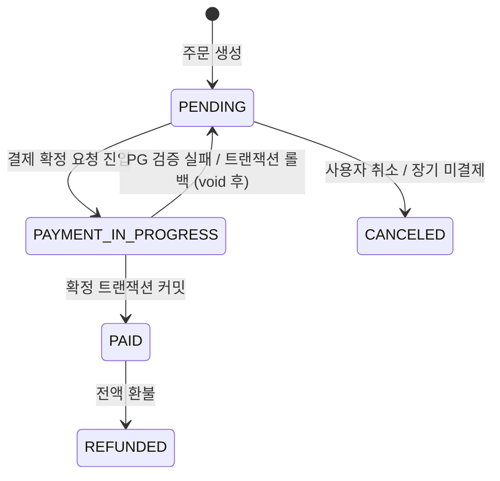
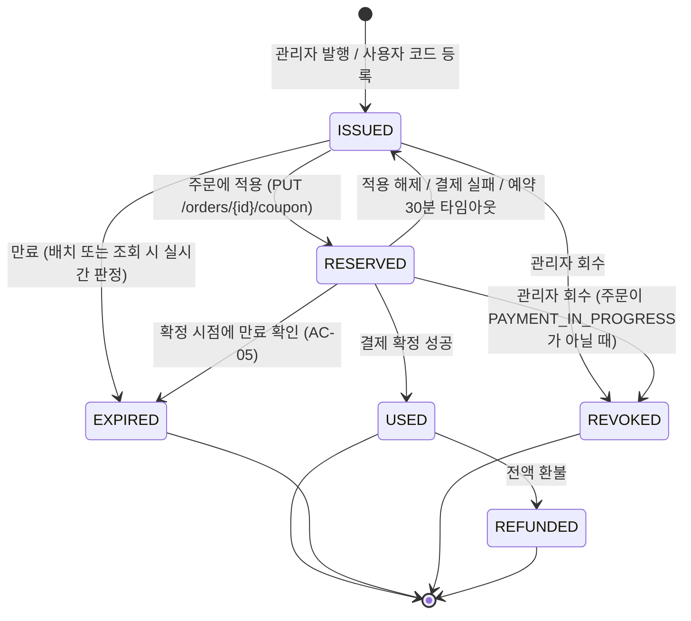
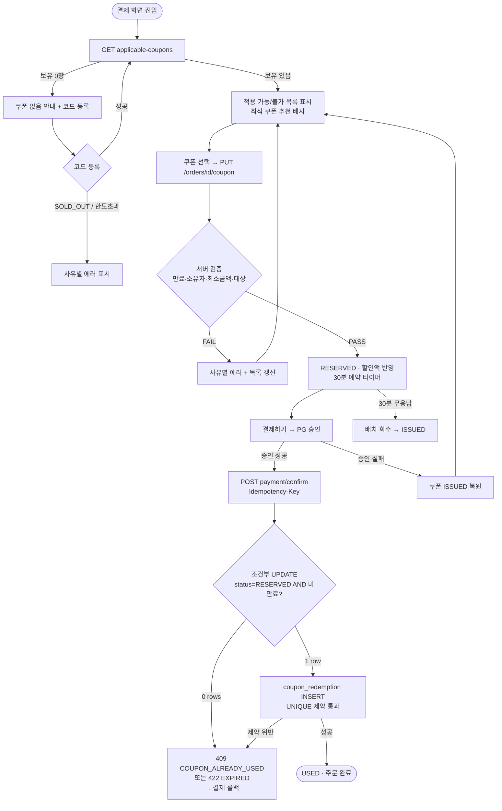
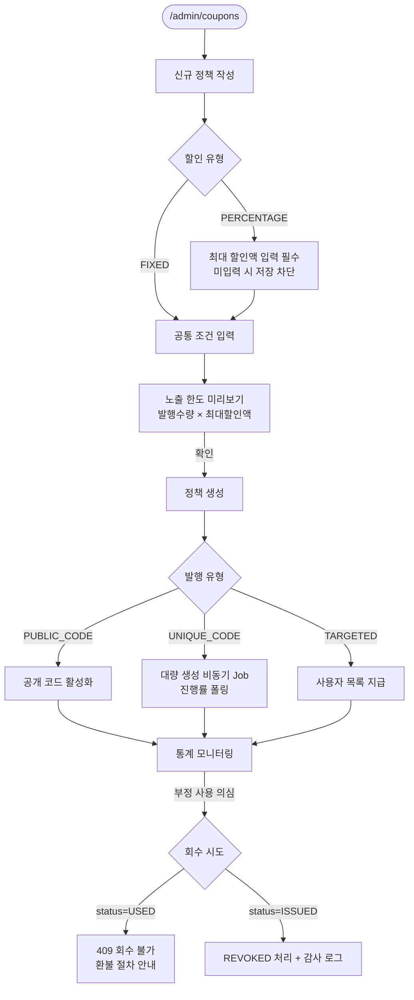

# 쿠폰(Coupon) 기능 PRD

> **Version**: 1.1
> **Created**: 2026-08-04
> **Updated**: 2026-08-04 (prd-reviewer Critical 4건 반영)
> **Status**: Draft
> **Type**: product-feature

### v1.1 변경 요약

| ID | 반영 내용 |
|----|----------|
| C-1 | 결제 확정 시 **만료만이 아니라 적용 조건 전체를 재검증**. 주문 스냅샷 대조 도입 (FR-016, §5.6) |
| C-2 | **서버의 PG 승인 진위 조회** 단계 추가 + 서명 검증 웹훅 + `orders.payment_key` UNIQUE (FR-029, §5.6) |
| C-3 | 주문 상태 `PAYMENT_IN_PROGRESS` 도입, 스위퍼 조건 반전, 2차·안전망 스위퍼 추가 (FR-018, §5.8) |
| C-4 | 주문 행 `FOR UPDATE` 직렬화 + `uq_coupon_reserved_order` 부분 유니크 (§5.6 방어 5) |

### 문서 작성 시 세운 가정 (확인 필요)

기존 코드베이스가 없는 상태(그린필드)에서 작성되었습니다. 아래는 **확인되지 않은 가정**이며, 실제와 다르면 해당 섹션을 갱신해야 합니다.

| # | 가정 | 영향 섹션 |
|---|------|----------|
| A-1 | Scale Grade = **Startup** (DAU 1,000~10,000) | §4.0~§4.4 |
| A-2 | RDBMS = **PostgreSQL** (트랜잭션·유니크 제약·`FOR UPDATE` 사용 가능) | §5.2, §5.6 |
| A-3 | API 스타일 = **REST**, 인증은 세션/JWT 기반으로 이미 존재 | §5.1 |
| A-4 | 결제는 **외부 PG 연동**이며 `주문 생성 → PG 승인 → 승인 콜백` 2단계 구조 | §5.6, FR-010~012 |
| A-5 | 통화는 **KRW 단일**, 금액은 정수(원) | §5.2 |
| A-6 | 주문 1건 = 강의 1개 이상 담긴 장바구니 형태 | FR-008 |

---

## 1. Overview

### 1.1 Problem Statement

온라인 강의 플랫폼에 할인 수단이 없다. 현재는 신규 유입 프로모션, 재수강 유도, 제휴 마케팅, CS 보상(환불 대신 쿠폰 지급) 같은 요구가 생길 때마다 **강의 가격 자체를 임시로 낮췄다가 되돌리는 방식**으로 대응하고 있으며, 이는 다음 문제를 낳는다.

1. **타겟팅 불가** — 특정 사용자(신규 가입자, 이탈 고객)에게만 할인을 줄 수 없다.
2. **정산 왜곡** — 강의 정가가 바뀌므로 강사 정산 기준 금액과 실제 매출을 구분할 수 없다.
3. **효과 측정 불가** — 어떤 캠페인이 얼마의 매출을 만들었는지 추적할 수 없다.
4. **운영 리스크** — 가격 되돌리기를 잊으면 손실이 발생하고, 수동 작업이라 사람이 실수한다.

동시에, 쿠폰은 **직접적인 금전 손실로 이어지는 기능**이다. 중복 사용·만료 우회를 막지 못하면 1건당 할인액만큼 그대로 손실이며, 동시 요청(더블 클릭, 탭 2개, 스크립트 공격)에서 이 방어가 깨지는 사고가 흔하다. 따라서 이 PRD는 **동시성 하에서의 1회 사용 보장**을 최우선 요구사항으로 다룬다.

### 1.2 Goals

- **G-1** 관리자가 개발자 도움 없이 쿠폰 정책을 만들고 발행할 수 있다.
- **G-2** 수강생이 결제 화면에서 보유 쿠폰을 확인하고 1회 클릭으로 적용할 수 있다.
- **G-3** 어떤 동시 요청 상황에서도 **쿠폰 1장은 최대 1회만 사용**된다 (중복 사용률 0%).
- **G-4** 만료·회수·사용완료 쿠폰은 **어떤 경로로도** 할인에 반영되지 않는다.
- **G-5** 결제 실패·취소·환불 시 쿠폰 상태가 정확히 복원되거나 소멸된다 (고아 상태 0건).
- **G-6** 캠페인별 발행/사용/할인총액을 조회해 효과를 측정할 수 있다.

### 1.3 Non-Goals (Out of Scope)

- **NG-1** 쿠폰 **중복 적용(스태킹)** — 1개 주문에 쿠폰은 **1장만** 적용한다. (§1.5의 용어 구분 참고)
- **NG-2** 포인트/마일리지/적립금 시스템 — 별도 기능이며 이번 범위 아님.
- **NG-3** 구독(정기결제) 상품에 대한 쿠폰 적용 — 갱신 회차 처리 규칙이 별도 설계 필요.
- **NG-4** 강사가 직접 발행하는 쿠폰 — 정산 규칙 협의가 선행되어야 함. Phase 3 이후 검토.
- **NG-5** 추천인(Referral) 코드 자동 생성 — 쿠폰 인프라 위에 올릴 수 있으나 이번엔 제외.
- **NG-6** 다중 통화 / 해외 결제.
- **NG-7** A/B 테스트 프레임워크 연동.

### 1.4 Scope

| 포함 | 제외 |
|------|------|
| 쿠폰 정책(캠페인) CRUD | 강사 자체 발행 쿠폰 |
| 공개코드형 / 개별코드형 / 타겟지급형 발행 | 추천인 코드 자동 생성 |
| 정액·정률 할인 (정률은 최대 할인액 상한 필수) | 무료배송·사은품 등 비금액 혜택 |
| 적용 대상 제한 (전체/특정 강의/카테고리) | 강의 묶음(번들) 전용 로직 |
| 최소 주문금액, 총 발행수량, 인당 사용 한도 | 쿠폰 중복 적용(스태킹) |
| 유효기간 (절대 기간 / 발급일 기준 상대 기간) | 시간대(TZ)별 차등 만료 |
| **동시성 안전한 1회 사용 보장** | 분산 락 인프라 신규 도입 (DB 제약으로 해결) |
| 결제 실패/취소/환불 시 복원·소멸 처리 | 부분 환불 시 쿠폰 부분 복원 |
| 관리자 통계 (발행/사용/할인총액) | BI 대시보드 연동 |
| 감사 로그 (모든 상태 전이 기록) | 로그 장기 아카이빙 파이프라인 |

### 1.5 용어 정의

이 문서에서 "중복"은 두 가지 다른 의미로 쓰이므로 구분한다. **둘 다 금지**한다.

| 용어 | 정의 | 처리 |
|------|------|------|
| **중복 사용 (Double Redemption)** | 쿠폰 **1장**을 2회 이상 사용해 할인을 2번 받는 것 | §5.6의 5중 방어로 원천 차단. 가장 중요한 요구사항 |
| **중복 적용 (Stacking)** | **여러 장**의 쿠폰을 1개 주문에 동시 적용 | 정책상 금지. 주문당 쿠폰 1장 (NG-1) |
| **중복 발급 (Duplicate Issue)** | 동일 사용자가 같은 캠페인 쿠폰을 한도 초과해 받는 것 | 인당 발급 한도로 차단 (FR-006) |

기타 용어:

- **쿠폰 정책 (CouponPolicy)** — 할인 조건의 템플릿. "신규가입 30% 할인" 같은 캠페인 단위.
- **쿠폰 (Coupon)** — 정책으로부터 발행된 개별 인스턴스. 코드와 소유자를 가진다.
- **사용 (Redemption)** — 쿠폰이 특정 주문에 최종 확정 적용된 사건.

---

## 2. User Stories

### 2.1 Primary Users

**US-1 (admin)**
As a **운영 관리자**, I want to **할인율·대상 강의·유효기간·수량을 지정해 쿠폰을 발행**하고 싶다, so that **개발 배포 없이 프로모션을 집행할 수 있다.**

**US-2 (admin)**
As a **운영 관리자**, I want to **잘못 발행했거나 부정 사용이 의심되는 쿠폰을 즉시 회수**하고 싶다, so that **금전 손실을 최소화할 수 있다.**

**US-3 (admin)**
As a **운영 관리자**, I want to **캠페인별 발행/사용 현황과 총 할인액을 보고** 싶다, so that **다음 프로모션 예산을 정할 수 있다.**

**US-4 (student)**
As a **수강생**, I want to **내가 가진 쿠폰과 각각의 만료일을 한눈에 보고** 싶다, so that **쓸 수 있는 할인을 놓치지 않는다.**

**US-5 (student)**
As a **수강생**, I want to **결제 화면에서 지금 이 주문에 쓸 수 있는 쿠폰만 보고 적용**하고 싶다, so that **적용 안 되는 쿠폰을 눌러보며 시행착오를 겪지 않는다.**

**US-6 (student)**
As a **수강생**, I want to **결제가 실패하면 쿠폰이 그대로 남아 있기를** 바란다, so that **내 잘못이 아닌 이유로 할인을 잃지 않는다.**

### 2.2 Acceptance Criteria (Gherkin)

```gherkin
Scenario: AC-01 정상 적용 및 결제 확정
  Given student "u1"이 30% 할인 쿠폰 "C1"(상태 ISSUED, 만료일 2026-12-31)을 보유하고
    And 100,000원짜리 강의를 장바구니에 담아 주문 "o1"을 생성했을 때
  When "u1"이 주문 "o1"에 쿠폰 "C1"을 적용하고 결제를 완료하면
  Then 결제 금액은 70,000원이고
    And 쿠폰 "C1"의 상태는 USED가 되며
    And coupon_redemption에 (C1, o1) 레코드가 1건 생성된다

Scenario: AC-02 동시 요청에서의 중복 사용 차단 (핵심)
  Given student "u1"이 쿠폰 "C1"(ISSUED)을 보유하고
    And 서로 다른 주문 "o1", "o2"가 존재할 때
  When "C1"을 사용하는 결제 확정 요청이 "o1"과 "o2"에 대해 동시에 도착하면
  Then 정확히 1건만 200 OK로 성공하고
    And 나머지 1건은 409 COUPON_ALREADY_USED로 실패하며
    And coupon_redemption의 coupon_id="C1" 레코드는 정확히 1건이고
    And 실패한 주문은 PG 승인이 void 처리되고 결제가 중단된다
    And 사용자에게는 쿠폰 목록 갱신과 함께 재시도가 안내된다
  # 주의: 실패한 주문을 "원가로 자동 결제"하지 않는다. PG 승인은 이미 할인가로
  #       이뤄졌으므로 증액 청구가 불가능하며, 동의 없는 증액은 법적 문제가 된다.

Scenario: AC-03 동일 주문 재요청 (멱등성)
  Given 주문 "o1"에 쿠폰 "C1"이 이미 확정 사용되었을 때
  When 동일한 Idempotency-Key로 "o1"의 결제 확정 요청이 재전송되면
  Then 200 OK와 함께 최초와 동일한 결과가 반환되고
    And coupon_redemption 레코드는 여전히 1건이다

Scenario: AC-04 만료 쿠폰 차단
  Given 쿠폰 "C2"의 expires_at이 2026-08-04T00:00:00+09:00이고 (8/3까지 유효)
    And 현재 시각이 2026-08-04T00:00:01+09:00일 때
  When "u1"이 "C2"를 주문에 적용하려 하면
  Then 422 COUPON_EXPIRED가 반환되고
    And 만료 배치 실행 여부와 무관하게 차단된다

Scenario: AC-05 결제 확정 직전 만료
  Given "u1"이 만료 30초 전에 쿠폰 "C3"을 주문 "o3"에 적용(RESERVED)했고
  When 만료 시각 이후에 결제 확정 요청이 도착하면
  Then 422 COUPON_EXPIRED가 반환되고
    And 결제 트랜잭션은 롤백되어 쿠폰 "C3"은 RESERVED로 남으며
    And 쿠폰 "C3"은 어떤 경로로도 사용되지 않는다
    And 만료 배치가 이후 "C3"을 EXPIRED로 정리한다
  # 확정 트랜잭션이 롤백되므로 그 안에서 EXPIRED로 전이시킬 수 없다.
  # 상태 정리는 배치에 위임하고, 사용 차단은 조건부 UPDATE가 이미 보장한다.

Scenario: AC-17 적용 후 주문 축소로 인한 조건 우회 차단 (C-1)
  Given 쿠폰 "C12"의 최소 주문금액이 50,000원이고
    And "u1"이 60,000원 주문 "o12"에 "C12"를 적용(RESERVED)했을 때
  When "u1"이 장바구니에서 강의를 빼 주문 금액을 30,000원으로 줄인 뒤
    And 결제 확정을 요청하면
  Then 409 ORDER_CHANGED가 반환되고
    And 쿠폰은 사용되지 않으며 결제가 중단된다
    And 주문 항목 변경 시점에 이미 쿠폰이 자동 해제되어 있었다면 409 NO_COUPON_APPLIED가 반환된다

Scenario: AC-18 동일 주문에 두 쿠폰 동시 적용 차단 (C-4)
  Given "u1"이 쿠폰 "C13", "C14"를 보유하고 주문 "o13"이 PENDING일 때
  When "C13"과 "C14"의 적용 요청이 "o13"에 대해 동시에 도착하면
  Then 정확히 1건만 성공하고
    And 나머지 1건은 409 COUPON_ALREADY_APPLIED로 실패하며
    And 주문 "o13"에 RESERVED 상태로 연결된 쿠폰은 정확히 1장이다

Scenario: AC-19 PG 승인 위조 차단 (C-2)
  Given "u1"이 서버 계산 결제액 80,000원인 주문 "o14"를 보유하고
  When "u1"이 실제로 존재하지 않거나 금액이 다른 paymentKey로 확정을 요청하면
  Then 서버가 PG에 승인 진위를 조회해 불일치를 확인하고
    And 402 PAYMENT_NOT_VERIFIED가 반환되며
    And 쿠폰은 사용되지 않고 주문은 PAID가 되지 않는다

Scenario: AC-06 결제 실패 시 복원
  Given "u1"이 쿠폰 "C4"를 주문 "o4"에 적용(RESERVED)했을 때
  When PG 결제가 카드 한도 초과로 실패하면
  Then 쿠폰 "C4"의 상태는 ISSUED로 복원되고
    And "u1"의 보유 쿠폰 목록에 다시 나타난다

Scenario: AC-07 예약 후 이탈 (타임아웃 회수)
  Given "u1"이 쿠폰 "C5"를 주문에 적용(RESERVED)한 뒤 브라우저를 닫았고
  When 예약 시각으로부터 30분이 경과하면
  Then 회수 배치가 쿠폰 "C5"를 ISSUED로 복원한다

Scenario: AC-08 전액 환불 시 소멸
  Given 주문 "o1"이 쿠폰 "C1"로 할인받아 결제 완료되었을 때
  When 관리자가 "o1"을 전액 환불 처리하면
  Then 환불액은 실결제액 70,000원이고
    And 쿠폰 "C1"은 REFUNDED 상태가 되어 재사용할 수 없다
    And (정책상 재발급이 필요하면 관리자가 신규 발행한다)

Scenario: AC-09 최소 주문금액 미달
  Given 쿠폰 "C6"의 최소 주문금액이 50,000원이고 기준이 ORDER_TOTAL이며
    And 주문 "o6"의 총액이 30,000원일 때
  When "u1"이 "C6"을 적용하려 하면
  Then 422 MIN_ORDER_AMOUNT_NOT_MET이 반환되고
    And 응답에 부족 금액 20,000원이 포함된다

Scenario: AC-20 최소금액 기준이 TARGET_SUM인 경우
  Given 쿠폰 "C15"가 강의 "lecture-A" 전용이고
    And 최소 주문금액 50,000원, 기준이 TARGET_SUM이며
    And 주문 "o15"가 lecture-A 30,000원 + lecture-B 70,000원으로 총 100,000원일 때
  When "u1"이 "C15"를 적용하려 하면
  Then 422 MIN_ORDER_AMOUNT_NOT_MET이 반환된다
    # 주문 총액은 10만원이지만 대상 강의 합계가 3만원이므로 미달

Scenario: AC-10 적용 대상 강의 불일치
  Given 쿠폰 "C7"이 강의 "lecture-A" 전용일 때
  When "u1"이 "lecture-B"만 담긴 주문에 "C7"을 적용하려 하면
  Then 422 COUPON_NOT_APPLICABLE이 반환된다

Scenario: AC-11 정률 할인 상한 적용
  Given 쿠폰 "C8"이 50% 할인이고 최대 할인액이 20,000원일 때
  When 100,000원 주문에 "C8"을 적용하면
  Then 할인액은 50,000원이 아닌 20,000원이고
    And 결제 금액은 80,000원이다

Scenario: AC-12 회수된 쿠폰 차단
  Given 관리자가 쿠폰 "C9"를 REVOKED 처리했을 때
  When "u1"이 이미 열려 있던 결제 화면에서 "C9"로 결제를 확정하면
  Then 422 COUPON_REVOKED가 반환된다

Scenario: AC-13 발행 수량 소진
  Given 정책 "P1"의 총 발행 수량이 100장이고 이미 100장이 발행되었을 때
  When 사용자가 공개 코드를 등록하려 하면
  Then 409 COUPON_SOLD_OUT이 반환되고
    And 발행 수량은 101장이 되지 않는다

Scenario: AC-14 인당 발급 한도 초과
  Given 정책 "P1"의 인당 발급 한도가 1장이고 "u1"이 이미 1장을 받았을 때
  When "u1"이 같은 공개 코드를 다시 등록하면
  Then 409 ALREADY_ISSUED_TO_USER가 반환된다

Scenario: AC-15 타인 쿠폰 사용 시도
  Given 쿠폰 "C10"의 소유자가 "u2"일 때
  When "u1"이 "C10"의 코드를 알아내 자신의 주문에 적용하려 하면
  Then 404 COUPON_NOT_FOUND가 반환된다 (존재 여부를 노출하지 않음)

Scenario: AC-16 할인액이 주문금액 이상
  Given 쿠폰 "C11"이 50,000원 정액 할인이고 주문 금액이 30,000원일 때
  When "C11"을 적용하면
  Then 할인액은 30,000원으로 절삭되고
    And 결제 금액은 0원이며 PG 승인 없이 주문이 완료 처리된다
```

### 2.3 User Roles

| Role Key | 한국어 명칭 | 권한 범위 | 비고 |
|----------|------------|----------|------|
| `guest` | 비로그인 사용자 | 쿠폰 기능 접근 불가 | 코드 등록 시 로그인 유도 |
| `student` | 수강생 | 본인 소유 쿠폰 read, 코드 등록, 본인 주문에 적용/해제 | 소유자 검증 필수 |
| `admin` | 운영 관리자 | 정책 CRUD, 발행, 회수, 전체 통계 조회 | 모든 쓰기 작업 감사 로그 기록 |

**규칙**
- Role Key는 영문 소문자 단일 단어를 사용하며, 이후 모든 페이지/API 명세에서 이 키를 그대로 인용한다.
- `student`의 모든 쿠폰 조회·적용 요청은 **`coupon.user_id == 인증 주체 ID`** 조건을 서버에서 강제한다. 클라이언트가 보낸 user_id는 절대 신뢰하지 않는다.
- 쿠폰 발행/회수는 `admin`만 가능하며, 강사(`instructor`, 존재 시)에게는 권한을 부여하지 않는다 (NG-4).

---

## 3. Functional Requirements

### 3.1 관리자 — 발행

| ID | Requirement | Priority | Dependencies |
|----|------------|----------|--------------|
| FR-001 | 관리자는 쿠폰 정책을 생성한다. 필수 입력: 정책명, 할인 유형(FIXED/PERCENTAGE), 할인값, 유효기간 방식, 발행 유형. 선택: 최소 주문금액, 최대 할인액, 적용 대상, 총 발행수량, 인당 한도 | P0 | - |
| FR-002 | 할인 유형이 PERCENTAGE인 경우 **최대 할인액(max_discount_amount) 입력을 필수로 강제**한다. 미입력 시 정책 생성이 거부된다 | P0 | FR-001 |
| FR-003 | 관리자는 3가지 방식으로 쿠폰을 발행한다: ① 공개코드형(모두가 같은 코드 입력) ② 개별코드형(N장의 고유 코드 대량 생성) ③ 타겟지급형(사용자 ID 목록에 직접 지급) | P0 | FR-001 |
| FR-004 | 관리자는 정책을 비활성화(`is_active=false`)할 수 있다. 비활성 즉시 신규 발급·신규 적용이 차단되되, **이미 RESERVED 상태로 결제 진행 중인 건은 완료를 허용**한다 | P0 | FR-001 |
| FR-005 | 관리자는 개별 쿠폰을 회수(REVOKED)할 수 있다. 이미 USED인 쿠폰은 회수할 수 없으며 409를 반환한다 | P0 | FR-003 |
| FR-006 | 관리자는 정책별 통계를 조회한다: 발행 수, 사용 수, 사용률, 총 할인액, 쿠폰 사용 주문의 총 매출액 | P1 | FR-003 |
| FR-007 | 개별코드형 대량 생성 시 코드는 **암호학적 난수(CSPRNG)** 기반이며, 최소 10자·36진수 대문자/숫자(혼동 문자 `O,0,I,1` 제외)로 구성해 추측 공격을 방지한다. 1회 최대 생성 수량은 10,000장 | P0 | FR-003 |

### 3.2 수강생 — 보유 및 적용

| ID | Requirement | Priority | Dependencies |
|----|------------|----------|--------------|
| FR-008 | 수강생은 본인 보유 쿠폰 목록을 조회한다. `사용 가능 / 사용 완료 / 만료` 탭으로 구분되며, 사용 가능 탭은 **만료 임박순** 정렬이 기본이다 | P0 | FR-003 |
| FR-009 | 수강생은 쿠폰 코드를 입력해 쿠폰을 등록(발급)받는다. 총 수량 소진, 인당 한도 초과, 유효하지 않은 코드는 각각 구분된 에러를 반환한다 | P0 | FR-003 |
| FR-010 | 결제 화면에서 **현재 주문에 적용 가능한 쿠폰만** 필터링해 보여주고, 적용 불가 쿠폰은 사유(최소금액 미달, 대상 아님)와 함께 비활성 표시한다 | P0 | FR-008 |
| FR-011 | 적용 가능 쿠폰 중 **할인액이 가장 큰 쿠폰을 자동 추천**하고 배지로 표시한다. 자동 적용은 하지 않으며 사용자가 명시적으로 선택한다. 할인액 동률 시 **① 만료 임박순 ② 발급 오래된 순 ③ 쿠폰 ID 순**으로 결정한다 (m-01) | P1 | FR-010 |
| FR-012 | 수강생은 쿠폰을 주문에 적용/해제할 수 있다. 적용 시 할인액과 최종 결제액이 즉시 반영되며, 쿠폰은 RESERVED 상태가 된다 | P0 | FR-010 |
| FR-013 | 주문 1건에는 쿠폰 1장만 적용된다. 이미 쿠폰이 적용된 주문에 다른 쿠폰을 적용하면 기존 쿠폰이 자동 해제(ISSUED 복원)되고 새 쿠폰이 적용된다 | P0 | FR-012 |

### 3.3 시스템 — 무결성 (핵심)

| ID | Requirement | Priority | Dependencies |
|----|------------|----------|--------------|
| FR-014 | **중복 사용 방지**: 쿠폰 1장은 최대 1회만 USED가 된다. 동시 요청 하에서도 §5.6의 5중 방어(조건부 UPDATE + 확정 시 전체 재검증 + `coupon_redemption` UNIQUE 제약 + 트랜잭션 경계 + 주문 단위 직렬화)로 보장한다 | P0 | FR-012 |
| FR-015 | **만료 검증은 항상 요청 시각 기준 실시간 계산**으로 수행한다. 배치가 갱신한 `status=EXPIRED` 값에 의존하지 않는다 (배치는 조회 성능·UI 표시용 보조 수단) | P0 | - |
| FR-016 | **결제 확정 시 적용 조건 전체를 재검증**한다 — 만료뿐 아니라 소유자·회수 여부·적용 대상·최소 주문금액·할인액을 §5.7로 재계산하고, 적용 시점에 저장한 **주문 스냅샷**(금액·항목 해시)과 대조한다. 하나라도 불일치하면 확정을 거부한다 (AC-05, AC-17) | P0 | FR-015 |
| FR-016a | 주문 항목이 변경(추가·삭제·수량 변경)되면 해당 주문에 RESERVED된 쿠폰을 **자동 해제**하고 사용자에게 재적용을 안내한다 | P0 | FR-016 |
| FR-017 | 결제 실패·주문 취소 시 RESERVED 쿠폰을 ISSUED로 복원한다 | P0 | FR-012 |
| FR-018 | **예약 타임아웃**: RESERVED 상태로 30분이 경과한 쿠폰은 배치가 ISSUED로 복원한다. 복원 대상은 주문이 `PAYMENT_IN_PROGRESS`가 **아닌** 모든 경우이며(주문이 PENDING·CANCELED·FAILED이거나 주문 자체가 없는 경우 포함), 결제 진행 중인 건만 건너뛴다. 상세 스위퍼 설계는 §5.8 | P0 | FR-017, FR-030 |
| FR-018a | **안전망 스위퍼**: RESERVED 상태로 24시간이 경과한 쿠폰은 주문 상태와 무관하게 복원한다. 단 해당 주문이 이미 PAID면 정합성 위반이므로 복원하지 않고 **운영자에게 알림**을 보낸다 | P0 | FR-018 |
| FR-019 | 결제 확정 API는 **Idempotency-Key**를 지원한다. 동일 키 재요청 시 중복 처리 없이 최초 결과를 반환한다 | P0 | FR-014 |
| FR-020 | **전액 환불** 시 쿠폰은 REFUNDED 상태가 되며 재사용할 수 없다. 환불 금액은 정가가 아닌 **실결제액** 기준이다 | P0 | FR-014 |
| FR-021 | **부분 환불**은 쿠폰 상태를 변경하지 않는다(USED 유지). 환불액은 **할인액을 안분한 실부담액** 기준으로 계산한다: `환불액 = floor(환불대상금액 × (실결제액 ÷ 주문총액))`. 누적 환불액은 실결제액을 초과할 수 없다 | P1 | FR-020 |
| FR-022 | 모든 쿠폰 상태 전이(발행·적용·해제·사용·만료·회수·환불)는 감사 로그에 `who / when / what / from→to / order_id` 형태로 기록한다 | P0 | FR-014 |
| FR-023 | 할인액 계산 결과가 주문 금액을 초과하면 주문 금액으로 절삭한다. 결과가 0원이면 PG 승인 없이 주문을 완료 처리한다 | P0 | FR-012 |
| FR-024 | 정률 할인의 소수점은 **원 단위 절사(floor)** 한다. 예: 33,333원 × 30% = 9,999.9 → 9,999원 | P0 | FR-012 |
| FR-025 | 쿠폰 코드 등록 API는 **사용자당 분당 10회**로 레이트 리밋을 건다. 초과 시 429를 반환한다 (코드 브루트포스 방어) | P0 | FR-009 |
| FR-029 | **PG 승인 진위 검증**: 결제 확정 시 서버가 PG API로 `paymentKey`를 직접 조회해 ① 승인 완료 상태 ② 승인 금액 == 서버 계산 결제액 ③ 주문 ID 일치를 확인한다. 클라이언트가 전달한 승인 정보만으로 확정하지 않는다. `orders.payment_key`에 UNIQUE를 걸어 동일 승인의 재사용을 차단한다 | P0 | FR-014 |
| FR-030 | 주문 상태에 **`PAYMENT_IN_PROGRESS`**를 도입한다. 결제 확정 요청 진입 시 `PENDING → PAYMENT_IN_PROGRESS`로 전이하고, 성공 시 `PAID`, 실패 시 `PENDING`으로 되돌린다. 스위퍼는 이 상태를 보고 결제 진행 중인 쿠폰을 뺏지 않는다 | P0 | FR-018 |
| FR-031 | **0원 결제 경로**: 할인 후 결제액이 0원이면 PG를 거치지 않고 확정한다. 이때도 §5.6의 5중 방어를 **동일하게** 적용하며, `POST /orders/{orderId}/complete-free` 전용 엔드포인트를 사용한다. PG 검증(FR-029)만 생략된다 | P0 | FR-023 |
| FR-032 | 관리자 발행 API는 **멱등성**을 지원하며, 정책당 동시 실행 발행 Job은 1개로 제한한다. 중복 클릭으로 인한 이중 발행을 막는다 | P1 | FR-003 |
| FR-033 | 정책의 **총 노출액**(발행수량 × 최대할인액)이 임계값(기본 1,000만원)을 초과하면 다른 `admin` 1인의 승인을 받아야 활성화된다 (2인 승인) | P1 | FR-001 |
| FR-034 | 회원 탈퇴 시 미사용 쿠폰은 즉시 `REVOKED` 처리하고, `coupon_redemption`·`coupon_audit_log`의 `user_id`는 **비식별 처리하되 레코드는 보존**한다 (§4.3의 세무 보존 의무) | P1 | FR-022 |
| FR-035 | PG 취소(void) 호출 실패 건은 **미결 큐**에 적재해 지수 백오프로 재시도하고, 3회 실패 시 운영자에게 알림한다. 24시간 내 미해결 건은 일일 리포트에 포함한다 | P1 | FR-017 |
| FR-036 | 정책은 최소 주문금액의 **판정 기준**(`minAmountBasis`)을 `ORDER_TOTAL`(주문 총액) 또는 `TARGET_SUM`(적용 대상 강의 합계) 중에서 지정한다. 기본값은 `ORDER_TOTAL` | P0 | FR-001 |

### 3.4 부가 기능

| ID | Requirement | Priority | Dependencies |
|----|------------|----------|--------------|
| FR-026 | 만료 3일 전 쿠폰 보유자에게 알림을 발송한다 | P2 | FR-008 |
| FR-027 | 관리자는 쿠폰 사용 내역을 CSV로 내보낸다 | P2 | FR-006 |
| FR-028 | 강의 상세 페이지에서 해당 강의에 쓸 수 있는 보유 쿠폰을 미리 안내한다 | P2 | FR-010 |

---

## 4. Non-Functional Requirements

### 4.0 Scale Grade

**선택 등급: `Startup`** — 가정 A-1. 실제 규모가 다르면 §4.1~§4.4를 재조정해야 한다.

| 항목 | 값 |
|------|-----|
| 일일 활성 사용자 (DAU) | 1,000 ~ 10,000 |
| 동시 접속 | 100 ~ 1,000 |
| 예상 쿠폰 적용 요청 | 평시 5 RPS, 프로모션 오픈 시 **피크 100 RPS** |
| 서비스 1시간 중단 영향 | 결제 불가로 인한 매출 손실 + CS 인입 |

> **주의**: 쿠폰은 트래픽이 **평탄하지 않다**. 프로모션 오픈 순간 선착순 발급으로 순간 트래픽이 평시의 20배 이상 몰린다. §4.1의 목표는 피크 기준으로 설정했다.

### 4.1 Performance SLA

| 지표 | 목표값 | 비고 |
|------|--------|------|
| 적용 가능 쿠폰 조회 (p95) | < 300ms | 보유 쿠폰 50장 기준 |
| 쿠폰 적용/해제 (p95) | < 300ms | |
| 결제 확정 시 쿠폰 처리 (p95) | < 200ms | 결제 전체 지연에 포함되므로 타이트하게 |
| 코드 등록 (p95) | < 400ms | |
| 관리자 통계 조회 (p95) | < 2s | 집계 쿼리, 5분 캐시 허용 |
| 대량 발행 10,000장 | < 30s | 비동기 처리, 진행률 폴링 |
| 처리량 | 피크 100 RPS 지속 처리 | 프로모션 오픈 시나리오 부하 테스트 필수 |

### 4.2 Availability SLA

| 항목 | 값 |
|------|-----|
| Uptime 목표 (쿠폰 조회·발행) | **99%** (월 7.3시간) — 실패해도 결제는 진행 가능 |
| Uptime 목표 (결제 확정 경로) | **99.9%** (월 43.8분) — 쿠폰 확정은 결제 트랜잭션 안에 있어 장애가 곧 매출 중단이다. 조회 경로와 SLA를 분리한다 (m-07) |
| 성능 저하 시 동작 | 쿠폰 조회 실패는 **결제 자체를 막지 않는다**. 쿠폰 섹션만 에러 표시하고 원가 결제는 진행 가능 |
| 쿠폰 확정 실패 시 | 결제 트랜잭션 전체 롤백 (할인 미적용 상태로 결제되는 것보다 실패가 낫다) |

### 4.3 Data Requirements

| 항목 | 값 |
|------|-----|
| 예상 데이터량 (1년) | 쿠폰 200만 건 × 약 300B ≈ 600MB, 감사 로그 포함 약 2GB |
| 월간 증가율 | 15% |
| 쿠폰 레코드 보존 | 만료/사용 후 **3년** (세무·정산 근거) |
| 감사 로그 보존 | **5년** (전자상거래법상 대금결제 기록 준용) |
| 아카이빙 | 3년 경과 쿠폰은 콜드 스토리지 이관 후 운영 DB에서 삭제 |

### 4.4 Recovery

| 항목 | 값 |
|------|-----|
| RTO (복구 시간) | 4시간 |
| RPO (복구 시점) | 15분 (PITR 기반) |
| 백업 | 일 1회 전체 + WAL 연속 아카이빙 |

> **주의**: 쿠폰 사용 이력을 DB 복구로 되돌리면 **이미 사용된 쿠폰이 다시 살아난다**. 복구 시 반드시 PG 결제 원장과 `coupon_redemption`을 대사(reconciliation)하는 절차를 런북에 포함한다.

### 4.5 Security

| 항목 | 요구사항 |
|------|---------|
| Authentication | 모든 쿠폰 API는 인증 필수. `guest` 접근 불가 |
| Authorization | `student`의 모든 조회/적용은 서버가 `coupon.user_id = session.user_id`를 강제. 클라이언트 전달 user_id 무시 |
| IDOR 방어 | 타인 쿠폰 조회/적용 시 403이 아닌 **404**를 반환해 존재 여부를 노출하지 않는다 (AC-15) |
| 코드 추측 방어 | CSPRNG 기반 10자 이상 코드(FR-007) + 사용자당 분당 10회 레이트 리밋(FR-025) + 실패 100회 누적 시 계정 알림 |
| 금액 위변조 방어 | **할인액·최종 결제액은 클라이언트 입력을 절대 신뢰하지 않고 서버에서 재계산**한다. 클라이언트가 보낸 금액은 표시 검증용으로만 비교하며 불일치 시 409 |
| PG 승인 금액 검증 | PG 승인 콜백의 금액이 서버 계산 결제액과 다르면 결제를 거부하고 즉시 취소 요청 |
| 감사 로그 | 관리자 발행/회수는 IP·User-Agent 포함 기록. 로그는 append-only |
| Data encryption | 전송 구간 TLS 1.2+, 저장 시 DB 볼륨 암호화. 쿠폰 코드는 평문 저장하되 로그에는 **뒤 4자만 노출**(`******7V4K`)한다. 앞자리 노출은 브루트포스 탐색 공간을 줄여주므로 쓰지 않는다 (m-08) |
| PG 승인 검증 | 서버가 PG API로 승인 진위를 직접 조회(FR-029). 웹훅은 **서명 검증** 후에만 신뢰. `orders.payment_key` UNIQUE로 승인 재사용 차단 |
| 0원 결제 경로 | PG를 건너뛰더라도 쿠폰 방어는 전부 적용(FR-031). 이 경로의 방어 누락은 무료 수강 취약점이 된다 |
| 고액 정책 통제 | 총 노출액 임계 초과 시 2인 승인(FR-033). 관리자 계정 탈취 시 피해 상한을 만든다 |
| 탈퇴 처리 | 미사용 쿠폰 즉시 REVOKED, 사용 이력은 비식별 후 보존(FR-034) |
| 관리자 권한 | 정책 생성 시 **총 할인 노출액**(발행수량 × 최대할인액)이 임계값 초과 시 경고 표시 |

### 4.6 Quality

| 항목 | 요구사항 |
|------|---------|
| 동시성 테스트 | **필수**. 동일 쿠폰에 대해 50개 스레드 동시 결제 확정 시 성공 1건/실패 49건임을 검증하는 통합 테스트를 CI에 포함한다 |
| 금액 계산 테스트 | 절사·상한·0원 결제 경계값 단위 테스트 커버리지 100% |
| 상태 전이 테스트 | §5.3 상태 머신의 모든 허용/금지 전이를 검증 |
| 정합성 모니터링 | 일 1회 배치. **환불을 포함한 교정된 대사식**을 사용한다 (M-X6) — v1.0의 `USED 수 == redemption 수`는 첫 환불에 반드시 깨져 오탐이 되고, 오탐이 반복되면 진짜 사고를 놓친다:<br>① `COUNT(coupon WHERE status IN ('USED','REFUNDED')) == COUNT(coupon_redemption)`<br>② `coupon_redemption`의 `coupon_id` 중복 = **0**<br>③ 고아 RESERVED(24h 초과) = 0<br>④ `orders.status='PAID' AND coupon.status='RESERVED'` = 0 |
| 동시성 테스트 필수 케이스 | ① 동일 쿠폰 50스레드 동시 확정 → 성공 1<br>② **동일 주문에 다른 쿠폰 2장 동시 적용 → 성공 1** (C-4)<br>③ 적용 후 주문 축소 → 확정 시 `ORDER_CHANGED` (C-1)<br>④ 위조 `paymentKey` 확정 → `PAYMENT_NOT_VERIFIED` (C-2)<br>⑤ 스위퍼 실행 중 확정 요청 동시 발생 → 쿠폰 탈취 없음 (C-3) |

---

## 5. Technical Design

### 5.1 API Specification

Base path: `/api/v1`. 모든 응답은 JSON. 에러는 `{ "code": "...", "message": "...", "details": {...} }` 형태로 통일한다.

#### 5.1.1 관리자 API

##### `POST /api/v1/admin/coupon-policies`
- **Description**: 쿠폰 정책 생성
- **Auth**: Required (`admin`)
- **Request**

| 필드 | 타입 | 필수 | 설명 |
|------|------|------|------|
| `name` | string(1~100) | ✓ | 정책명 (관리자 식별용) |
| `description` | string(0~500) | | 사용자 노출 설명 |
| `discountType` | enum(`FIXED`,`PERCENTAGE`) | ✓ | 할인 유형 |
| `discountValue` | integer | ✓ | FIXED면 원 단위 금액, PERCENTAGE면 1~100 |
| `maxDiscountAmount` | integer | 조건부 | `discountType=PERCENTAGE`면 **필수** (FR-002) |
| `minOrderAmount` | integer | | 최소 주문금액, 기본 0 |
| `applicableScope` | enum(`ALL`,`LECTURE`,`CATEGORY`) | ✓ | 적용 대상 범위 |
| `applicableIds` | string[] | 조건부 | scope가 ALL이 아니면 필수 |
| `validityType` | enum(`ABSOLUTE`,`RELATIVE`) | ✓ | 유효기간 방식 |
| `validFrom` / `validUntil` | ISO8601 | 조건부 | `ABSOLUTE`면 필수 |
| `validDays` | integer(1~365) | 조건부 | `RELATIVE`면 필수 (발급일 + N일) |
| `maxIssueCount` | integer | | 총 발행 수량, null이면 무제한 |
| `maxIssuePerUser` | integer | | 인당 발급 한도, 기본 1 |
| `issueType` | enum(`PUBLIC_CODE`,`UNIQUE_CODE`,`TARGETED`) | ✓ | 발행 유형 |
| `publicCode` | string(4~20) | 조건부 | `PUBLIC_CODE`면 필수, 전역 유니크 |

- **Response 201**
```json
{
  "id": "cp_01H8X...",
  "name": "2026 신규가입 30% 할인",
  "discountType": "PERCENTAGE",
  "discountValue": 30,
  "maxDiscountAmount": 20000,
  "minOrderAmount": 50000,
  "applicableScope": "ALL",
  "validityType": "ABSOLUTE",
  "validFrom": "2026-08-01T00:00:00+09:00",
  "validUntil": "2026-09-01T00:00:00+09:00",
  "maxIssueCount": 1000,
  "issuedCount": 0,
  "maxIssuePerUser": 1,
  "issueType": "PUBLIC_CODE",
  "publicCode": "WELCOME30",
  "isActive": true,
  "estimatedMaxExposure": 20000000,
  "createdAt": "2026-08-04T10:00:00+09:00"
}
```
- **Errors**

| Status | Code | 조건 |
|--------|------|------|
| 400 | `INVALID_INPUT` | 필드 형식 오류 |
| 400 | `MAX_DISCOUNT_REQUIRED` | PERCENTAGE인데 maxDiscountAmount 누락 (FR-002) |
| 400 | `INVALID_DISCOUNT_VALUE` | PERCENTAGE인데 값이 1~100 밖 |
| 400 | `INVALID_VALIDITY_PERIOD` | validFrom >= validUntil |
| 409 | `PUBLIC_CODE_DUPLICATED` | publicCode 중복 |
| 401 / 403 | `UNAUTHORIZED` / `FORBIDDEN` | 인증 실패 / admin 아님 |

---

##### `POST /api/v1/admin/coupon-policies/{policyId}/issue`
- **Description**: 정책 기반 쿠폰 발행 (개별코드형 대량 생성 또는 타겟 지급)
- **Auth**: Required (`admin`)
- **Request**

| 필드 | 타입 | 필수 | 설명 |
|------|------|------|------|
| `count` | integer(1~10000) | 조건부 | `UNIQUE_CODE` 발행 시 필수 |
| `userIds` | string[] (최대 10000) | 조건부 | `TARGETED` 발행 시 필수 |
| `memo` | string | | 발행 사유 (감사 로그 기록) |

- **Response 202** (비동기)
```json
{
  "jobId": "job_01H8Y...",
  "policyId": "cp_01H8X...",
  "requestedCount": 5000,
  "status": "PROCESSING",
  "pollUrl": "/api/v1/admin/issue-jobs/job_01H8Y..."
}
```
- **Errors**

| Status | Code | 조건 |
|--------|------|------|
| 400 | `INVALID_INPUT` | count와 userIds가 발행 유형과 불일치 |
| 404 | `POLICY_NOT_FOUND` | 정책 없음 |
| 409 | `POLICY_INACTIVE` | 비활성 정책 |
| 409 | `ISSUE_LIMIT_EXCEEDED` | 발행 시 maxIssueCount 초과 |

---

##### `POST /api/v1/admin/coupons/{couponId}/revoke`
- **Description**: 개별 쿠폰 회수
- **Auth**: Required (`admin`)
- **Request**: `{ "reason": "string (필수, 1~200자)" }`
- **Response 200**: `{ "id": "...", "status": "REVOKED", "revokedAt": "...", "revokedBy": "admin_01" }`
- **Errors**

| Status | Code | 조건 |
|--------|------|------|
| 404 | `COUPON_NOT_FOUND` | 쿠폰 없음 |
| 409 | `COUPON_ALREADY_USED` | 이미 USED — 회수 불가 (FR-005) |
| 409 | `COUPON_IN_PAYMENT` | 연결된 주문이 **`PAYMENT_IN_PROGRESS`일 때만** 반환 (M-X4) |

> **M-X4 수정**: v1.0은 RESERVED이면 무조건 409였는데, RESERVED가 결제 진행 여부를 구분하지 못해 §5.3의 `RESERVED → REVOKED` 전이가 **도달 불가능**했다. 공격자가 쿠폰을 계속 재적용해 RESERVED로 유지하면 회수를 영구 회피할 수 있었다(US-2 무력화). 이제 `PAYMENT_IN_PROGRESS`(C-3)를 기준으로 판정하므로, 단순 RESERVED 쿠폰은 정상 회수된다.

---

##### `GET /api/v1/admin/coupon-policies/{policyId}/stats`
- **Description**: 정책별 사용 통계
- **Auth**: Required (`admin`)
- **Request**: query `from`, `to` (ISO8601, 선택)
- **Response 200**
```json
{
  "policyId": "cp_01H8X...",
  "issuedCount": 1000,
  "usedCount": 342,
  "expiredCount": 120,
  "revokedCount": 3,
  "refundedCount": 12,
  "netUsedCount": 330,
  "usageRate": 0.330,
  "totalDiscountAmount": 6600000,
  "totalOrderAmount": 33000000,
  "calculatedAt": "2026-08-04T10:05:00+09:00"
}
```
- **Errors**: 404 `POLICY_NOT_FOUND`

---

#### 5.1.2 수강생 API

##### `GET /api/v1/me/coupons`
- **Description**: 보유 쿠폰 목록
- **Auth**: Required (`student`)
- **Request**: query `status` (`AVAILABLE`|`USED`|`EXPIRED`, 기본 `AVAILABLE`), `page`, `size`(기본 20)
- **Response 200**
```json
{
  "items": [
    {
      "id": "cu_01H8Z...",
      "code": "A7K9-M2XP-4RTV",
      "policyName": "2026 신규가입 30% 할인",
      "discountType": "PERCENTAGE",
      "discountValue": 30,
      "maxDiscountAmount": 20000,
      "minOrderAmount": 50000,
      "applicableScope": "ALL",
      "status": "ISSUED",
      "expiresAt": "2026-09-01T00:00:00+09:00",
      "daysUntilExpiry": 27
    }
  ],
  "page": 0, "size": 20, "totalElements": 3, "totalPages": 1
}
```
> `status=AVAILABLE` 조회는 `status='ISSUED' AND expires_at > now()`로 **실시간 판정**한다 (FR-015).

---

##### `POST /api/v1/me/coupons`
- **Description**: 쿠폰 코드 등록 (발급받기)
- **Auth**: Required (`student`)
- **Rate limit**: 사용자당 분당 10회 (FR-025)
- **Request**: `{ "code": "WELCOME30" }`
- **Response 201**: 위 목록 항목과 동일한 쿠폰 객체
- **Errors**

| Status | Code | 조건 |
|--------|------|------|
| 404 | `COUPON_CODE_NOT_FOUND` | 존재하지 않는 코드 |
| 409 | `COUPON_SOLD_OUT` | 총 발행 수량 소진 (AC-13) |
| 409 | `ALREADY_ISSUED_TO_USER` | 인당 한도 초과 (AC-14) |
| 409 | `COUPON_ALREADY_CLAIMED` | 개별코드가 이미 타인에게 등록됨 |
| 422 | `POLICY_INACTIVE` | 비활성 정책 |
| 422 | `COUPON_EXPIRED` | 유효기간 종료 |
| 429 | `TOO_MANY_REQUESTS` | 레이트 리밋 초과 |

---

##### `GET /api/v1/orders/{orderId}/applicable-coupons`
- **Description**: 해당 주문에 적용 가능한 쿠폰 조회 + 최적 쿠폰 추천 (FR-010, FR-011)
- **Auth**: Required (`student`, 주문 소유자)
- **Response 200**
```json
{
  "orderAmount": 100000,
  "recommendedCouponId": "cu_01H8Z...",
  "applicable": [
    { "couponId": "cu_01H8Z...", "policyName": "신규가입 30%",
      "discountAmount": 20000, "finalAmount": 80000, "isRecommended": true }
  ],
  "notApplicable": [
    { "couponId": "cu_01H90...", "policyName": "10만원 이상 1만원 할인",
      "reasonCode": "MIN_ORDER_AMOUNT_NOT_MET",
      "reason": "20,000원 더 담으면 사용할 수 있어요",
      "shortfallAmount": 20000 }
  ]
}
```
- **Errors**: 404 `ORDER_NOT_FOUND` (타인 주문 포함), 409 `ORDER_NOT_PENDING`

---

##### `PUT /api/v1/orders/{orderId}/coupon`
- **Description**: 주문에 쿠폰 적용 (RESERVED 전이). 이미 적용된 쿠폰이 있으면 자동 해제 후 교체 (FR-013)
- **Auth**: Required (`student`, 주문 소유자)
- **Request**: `{ "couponId": "cu_01H8Z...", "expectedDiscountAmount": 20000 }`
  > `expectedDiscountAmount`는 **검증용**이다. 서버는 자체 계산값을 사용하며, 불일치 시 409로 거부해 화면 표시와 실제 결제액이 어긋나는 것을 막는다 (§4.5).
- **Response 200**
```json
{
  "orderId": "o_01H8W...",
  "couponId": "cu_01H8Z...",
  "orderAmount": 100000,
  "discountAmount": 20000,
  "finalAmount": 80000,
  "reservedUntil": "2026-08-04T10:35:00+09:00"
}
```
- **Errors**

| Status | Code | 조건 |
|--------|------|------|
| 404 | `COUPON_NOT_FOUND` | 미보유 / 타인 소유 (AC-15) |
| 404 | `ORDER_NOT_FOUND` | 주문 없음 / 타인 주문 |
| 409 | `COUPON_ALREADY_USED` | 이미 사용됨 |
| 409 | `COUPON_IN_USE` | 다른 주문에서 RESERVED 중 |
| 409 | `DISCOUNT_AMOUNT_MISMATCH` | 클라이언트 기대 할인액과 서버 계산 불일치 |
| 409 | `ORDER_NOT_PENDING` | 이미 결제 완료/취소된 주문 |
| 422 | `COUPON_EXPIRED` | 만료 (AC-04) |
| 422 | `COUPON_REVOKED` | 회수됨 (AC-12) |
| 422 | `COUPON_NOT_APPLICABLE` | 대상 강의 아님 (AC-10) |
| 422 | `MIN_ORDER_AMOUNT_NOT_MET` | 최소 주문금액 미달, `details.shortfallAmount` 포함 (AC-09) |

---

##### `DELETE /api/v1/orders/{orderId}/coupon`
- **Description**: 적용된 쿠폰 해제 (RESERVED → ISSUED)
- **Auth**: Required (`student`, 주문 소유자)
- **Response 200**: `{ "orderId": "...", "orderAmount": 100000, "discountAmount": 0, "finalAmount": 100000 }`
- **Errors**: 404 `ORDER_NOT_FOUND`, 409 `NO_COUPON_APPLIED`, 409 `ORDER_NOT_PENDING`

---

#### 5.1.3 결제 연동 (내부)

##### `POST /api/v1/orders/{orderId}/payment/confirm`
- **Description**: 결제 확정. 쿠폰을 RESERVED → USED로 전이하고 `coupon_redemption`을 생성한다. **§5.6의 중복 사용 방지가 적용되는 지점**
- **Auth**: Required (`student`, 주문 소유자)
- **Headers**: `Idempotency-Key: <UUID>` (필수, FR-019)
- **Request**: `{ "paymentKey": "pg_...", "amount": 80000 }`
- **Response 200**
```json
{
  "orderId": "o_01H8W...",
  "status": "PAID",
  "orderAmount": 100000,
  "discountAmount": 20000,
  "paidAmount": 80000,
  "couponId": "cu_01H8Z...",
  "redemptionId": "cr_01H91...",
  "paidAt": "2026-08-04T10:12:00+09:00"
}
```
- **Errors**

| Status | Code | 조건 |
|--------|------|------|
| 409 | `COUPON_ALREADY_USED` | 동시 요청 경쟁에서 패배 (AC-02) |
| 409 | `AMOUNT_MISMATCH` | 요청 amount ≠ 서버 계산 결제액 (§4.5) |
| 409 | `ORDER_CHANGED` | **적용 후 주문 항목·금액이 변경됨 — 스냅샷 불일치 (C-1, AC-17)** |
| 409 | `COUPON_RESERVATION_MISMATCH` | 쿠폰이 다른 주문에 예약됨 |
| 409 | `PAYMENT_KEY_ALREADY_USED` | 동일 PG 승인의 재사용 시도 (C-2) |
| 409 | `ORDER_NOT_PENDING` | 이미 `PAYMENT_IN_PROGRESS`·`PAID` (C-3) |
| 402 | `PAYMENT_NOT_VERIFIED` | **PG 승인 진위 조회 실패 — 미승인·금액 불일치·주문 불일치 (C-2, AC-19)** |
| 422 | `COUPON_NOT_APPLICABLE` | 확정 시 재검증에서 적용 대상 불일치 (C-1) |
| 422 | `MIN_ORDER_AMOUNT_NOT_MET` | 확정 시 재검증에서 최소금액 미달 (C-1) |
| 422 | `COUPON_EXPIRED` | 확정 시점 만료 (AC-05) |
| 422 | `COUPON_REVOKED` | 확정 시점 회수됨 (AC-12) |
| 422 | `COUPON_RESERVATION_EXPIRED` | 예약 30분 초과로 회수됨 (AC-07) |
| 400 | `IDEMPOTENCY_KEY_REQUIRED` | 헤더 누락 |
| 409 | `IDEMPOTENCY_KEY_CONFLICT` | 같은 키로 다른 페이로드 요청 |

---

##### `POST /api/v1/orders/{orderId}/refund`
- **Description**: 환불 처리. 전액 환불 시 쿠폰을 REFUNDED로 전이 (FR-020)
- **Auth**: Required (`admin`)
- **Request**: `{ "type": "FULL" | "PARTIAL", "amount": 80000, "reason": "string" }`
- **Response 200 (FULL)**: `{ "orderId": "...", "refundedAmount": 80000, "couponStatus": "REFUNDED" }`
- **Response 200 (PARTIAL)**: `{ "orderId": "...", "refundedAmount": 24000, "cumulativeRefunded": 24000, "couponStatus": "USED" }`
  > m-11: 부분 환불은 쿠폰 상태를 바꾸지 않는다(FR-021). 환불액은 할인 안분 후 값이다 — 30,000원짜리 강의 1개를 환불할 때 `floor(30000 × 80000/100000) = 24,000원`.
- **Errors**: 409 `REFUND_AMOUNT_EXCEEDS_PAID` (누적 환불액이 실결제액 초과, FR-021), 409 `ALREADY_REFUNDED`

---

### 5.2 Database Schema

```sql
-- 쿠폰 정책 (캠페인)
CREATE TABLE coupon_policy (
  id                  VARCHAR(30)  PRIMARY KEY,
  name                VARCHAR(100) NOT NULL,
  description         VARCHAR(500),
  discount_type       VARCHAR(20)  NOT NULL,      -- FIXED | PERCENTAGE
  discount_value      INTEGER      NOT NULL,
  max_discount_amount INTEGER,                    -- PERCENTAGE면 NOT NULL (CHECK로 강제)
  min_order_amount    INTEGER      NOT NULL DEFAULT 0,
  min_amount_basis    VARCHAR(20)  NOT NULL DEFAULT 'ORDER_TOTAL',
                                                 -- FR-036: ORDER_TOTAL | TARGET_SUM
  applicable_scope    VARCHAR(20)  NOT NULL,      -- ALL | LECTURE | CATEGORY
  validity_type       VARCHAR(20)  NOT NULL,      -- ABSOLUTE | RELATIVE
  valid_from          TIMESTAMPTZ,
  valid_until         TIMESTAMPTZ,
  valid_days          INTEGER,
  max_issue_count     INTEGER,                    -- NULL = 무제한
  issued_count        INTEGER      NOT NULL DEFAULT 0,
  -- max_issue_per_user 없음 — 인당 1장 고정 (Q-7 결정, 아래 유니크 인덱스 참고)
  issue_type          VARCHAR(20)  NOT NULL,      -- PUBLIC_CODE | UNIQUE_CODE | TARGETED
  approval_status     VARCHAR(20)  NOT NULL DEFAULT 'APPROVED',
                                                 -- FR-033: PENDING_APPROVAL | APPROVED
  approved_by         VARCHAR(30),
  public_code         VARCHAR(20),
  is_active           BOOLEAN      NOT NULL DEFAULT TRUE,
  created_by          VARCHAR(30)  NOT NULL,
  created_at          TIMESTAMPTZ  NOT NULL DEFAULT now(),
  updated_at          TIMESTAMPTZ  NOT NULL DEFAULT now(),

  -- FR-002: 정률 할인은 상한 필수 (무제한 할인 사고 방지)
  CONSTRAINT ck_max_discount_required
    CHECK (discount_type <> 'PERCENTAGE' OR max_discount_amount IS NOT NULL),
  CONSTRAINT ck_percentage_range
    CHECK (discount_type <> 'PERCENTAGE' OR discount_value BETWEEN 1 AND 100),
  CONSTRAINT ck_fixed_positive
    CHECK (discount_type <> 'FIXED' OR discount_value > 0),
  CONSTRAINT ck_validity
    CHECK ((validity_type = 'ABSOLUTE' AND valid_from IS NOT NULL AND valid_until IS NOT NULL
            AND valid_from < valid_until)
        OR (validity_type = 'RELATIVE' AND valid_days IS NOT NULL AND valid_days > 0)),
  -- FR-014 보조: 발행 수량이 한도를 넘을 수 없음을 DB가 보증
  CONSTRAINT ck_issued_within_limit
    CHECK (max_issue_count IS NULL OR issued_count <= max_issue_count)
);
CREATE UNIQUE INDEX uq_policy_public_code ON coupon_policy(public_code)
  WHERE public_code IS NOT NULL;

-- 정책의 적용 대상 (scope <> ALL 인 경우)
CREATE TABLE coupon_policy_target (
  policy_id   VARCHAR(30) NOT NULL REFERENCES coupon_policy(id) ON DELETE CASCADE,
  target_type VARCHAR(20) NOT NULL,               -- LECTURE | CATEGORY
  target_id   VARCHAR(30) NOT NULL,
  PRIMARY KEY (policy_id, target_type, target_id)
);

-- 발행된 개별 쿠폰
CREATE TABLE coupon (
  id           VARCHAR(30)  PRIMARY KEY,
  policy_id    VARCHAR(30)  NOT NULL REFERENCES coupon_policy(id),
  code         VARCHAR(30)  NOT NULL,
  user_id      VARCHAR(30),                       -- NULL = 미발급 (선착순 대기 물량)
  status       VARCHAR(20)  NOT NULL DEFAULT 'ISSUED',
                            -- ISSUED | RESERVED | USED | EXPIRED | REVOKED | REFUNDED
  issued_at    TIMESTAMPTZ,
  expires_at   TIMESTAMPTZ  NOT NULL,             -- 발급 시점에 확정 (RELATIVE도 여기서 계산)
  reserved_order_id VARCHAR(30),
  reserved_at  TIMESTAMPTZ,
  -- C-1: 적용 시점 주문 스냅샷. 확정 시 대조해 조건 우회를 차단
  reserved_order_amount    INTEGER,
  reserved_discount_amount INTEGER,
  reserved_order_hash      VARCHAR(64),
  used_at      TIMESTAMPTZ,
  revoked_at   TIMESTAMPTZ,
  revoked_by   VARCHAR(30),
  revoke_reason VARCHAR(200),
  created_at   TIMESTAMPTZ  NOT NULL DEFAULT now(),
  -- m-05: version 컬럼 제거. §5.6의 어떤 SQL도 version을 쓰지 않으며,
  --       조건부 UPDATE(status 가드)가 낙관적 락 역할을 이미 수행한다.

  CONSTRAINT ck_reserved_consistency
    CHECK (status <> 'RESERVED' OR (reserved_order_id IS NOT NULL AND reserved_at IS NOT NULL
           AND reserved_order_amount IS NOT NULL AND reserved_order_hash IS NOT NULL)),
  CONSTRAINT ck_used_consistency
    CHECK (status <> 'USED' OR used_at IS NOT NULL)
);
CREATE UNIQUE INDEX uq_coupon_code ON coupon(code);
-- 보유 쿠폰 조회 (FR-008): 사용가능 필터가 대부분의 트래픽
CREATE INDEX ix_coupon_user_status ON coupon(user_id, status, expires_at);
-- 만료/예약타임아웃 배치용
CREATE INDEX ix_coupon_expiry_sweep ON coupon(expires_at) WHERE status = 'ISSUED';
CREATE INDEX ix_coupon_reserved_sweep ON coupon(reserved_at) WHERE status = 'RESERVED';
-- AC-14: 인당 발급 한도가 1인 정책에 대한 DB 레벨 보증
CREATE UNIQUE INDEX uq_coupon_policy_user_single
  ON coupon(policy_id, user_id)
  WHERE user_id IS NOT NULL AND status <> 'REVOKED';
-- ★ C-4: 주문 1건에 RESERVED 쿠폰은 최대 1장 (AC-18)
CREATE UNIQUE INDEX uq_coupon_reserved_order
  ON coupon(reserved_order_id)
  WHERE status = 'RESERVED' AND reserved_order_id IS NOT NULL;

-- Q-7 결정 (M-F1): 인당 발급은 1장으로 고정한다.
--   위 uq_coupon_policy_user_single이 인당 2장 이상을 물리적으로 막으므로
--   max_issue_per_user > 1은 스키마와 모순된다. 해당 컬럼을 두지 않고
--   "정책당 인당 1장"을 불변식으로 확정한다.
--   다회 발급이 필요하면 정책을 분리해 발행한다.

-- 사용(확정) 이력 — 중복 사용 방지의 최종 방어선
CREATE TABLE coupon_redemption (
  id              VARCHAR(30)  PRIMARY KEY,
  coupon_id       VARCHAR(30)  NOT NULL REFERENCES coupon(id),
  order_id        VARCHAR(30)  NOT NULL,
  user_id         VARCHAR(30)  NOT NULL,
  order_amount    INTEGER      NOT NULL,
  discount_amount INTEGER      NOT NULL,
  paid_amount     INTEGER      NOT NULL,
  redeemed_at     TIMESTAMPTZ  NOT NULL DEFAULT now(),

  -- ★ FR-014 핵심: 쿠폰 1장당 사용 레코드는 물리적으로 1건만 존재 가능
  CONSTRAINT uq_redemption_coupon UNIQUE (coupon_id),
  -- 주문 1건당 쿠폰 1장 (NG-1 스태킹 금지의 DB 레벨 보증)
  CONSTRAINT uq_redemption_order  UNIQUE (order_id),
  CONSTRAINT ck_amounts CHECK (
    discount_amount >= 0
    AND discount_amount <= order_amount
    AND paid_amount = order_amount - discount_amount
  )
);
CREATE INDEX ix_redemption_user ON coupon_redemption(user_id, redeemed_at DESC);

-- 감사 로그 (FR-022) — append only
CREATE TABLE coupon_audit_log (
  id          BIGSERIAL    PRIMARY KEY,
  coupon_id   VARCHAR(30),
  policy_id   VARCHAR(30),
  actor_id    VARCHAR(30)  NOT NULL,
  actor_role  VARCHAR(20)  NOT NULL,   -- student | admin | system
  action      VARCHAR(30)  NOT NULL,   -- ISSUE | RESERVE | RELEASE | REDEEM
                                       -- | EXPIRE | REVOKE | REFUND
  from_status VARCHAR(20),
  to_status   VARCHAR(20),
  order_id    VARCHAR(30),
  ip_address  INET,
  user_agent  VARCHAR(500),
  memo        VARCHAR(500),
  created_at  TIMESTAMPTZ  NOT NULL DEFAULT now()
);
CREATE INDEX ix_audit_coupon ON coupon_audit_log(coupon_id, created_at DESC);
CREATE INDEX ix_audit_created ON coupon_audit_log(created_at DESC);

-- 멱등성 키 저장소 (FR-019)
CREATE TABLE idempotency_key (
  key           VARCHAR(64)  PRIMARY KEY,
  user_id       VARCHAR(30)  NOT NULL,
  request_hash  VARCHAR(64)  NOT NULL,
  response_body JSONB,
  status        VARCHAR(20)  NOT NULL,   -- IN_PROGRESS | COMPLETED
  created_at    TIMESTAMPTZ  NOT NULL DEFAULT now(),
  expires_at    TIMESTAMPTZ  NOT NULL    -- 24시간 후 정리
);
```

**주문 테이블 변경**

```sql
ALTER TABLE orders ADD COLUMN coupon_id       VARCHAR(30) REFERENCES coupon(id);
ALTER TABLE orders ADD COLUMN discount_amount INTEGER NOT NULL DEFAULT 0;
ALTER TABLE orders ADD COLUMN payment_key     VARCHAR(100);
-- ★ C-2: 동일 PG 승인을 여러 주문에 재사용하는 공격 차단 (FR-029)
CREATE UNIQUE INDEX uq_orders_payment_key ON orders(payment_key)
  WHERE payment_key IS NOT NULL;
-- paid_amount = order_amount - discount_amount 를 애플리케이션에서 보장
```

**주문 상태 머신 확장 (C-3, FR-030)**



`PENDING → PAYMENT_IN_PROGRESS` 전이도 **조건부 UPDATE**(`WHERE status='PENDING'`)로 수행해, 동시 확정 요청 중 1건만 진입하도록 한다. 이 전이가 결제 경로의 첫 번째 직렬화 지점이다.

**미결 큐 (FR-035)**

```sql
CREATE TABLE payment_void_queue (
  id            BIGSERIAL   PRIMARY KEY,
  order_id      VARCHAR(30) NOT NULL,
  payment_key   VARCHAR(100) NOT NULL,
  amount        INTEGER     NOT NULL,
  retry_count   INTEGER     NOT NULL DEFAULT 0,
  last_error    VARCHAR(500),
  status        VARCHAR(20) NOT NULL DEFAULT 'PENDING',  -- PENDING|DONE|ESCALATED
  next_retry_at TIMESTAMPTZ NOT NULL,
  created_at    TIMESTAMPTZ NOT NULL DEFAULT now()
);
```

### 5.3 상태 머신



**금지 전이 (테스트로 검증, §4.6)**

| 금지 | 이유 |
|------|------|
| `USED → ISSUED` | 사용된 쿠폰의 부활. 환불은 REFUNDED로만 간다 |
| `USED → RESERVED` | 재사용 경로 |
| `USED → REVOKED` | 이미 정산에 반영됨 (FR-005, 409 반환) |
| `EXPIRED → ISSUED` | 만료 우회. 필요하면 관리자가 신규 발행 |
| `REVOKED → *` | 회수는 종단 상태 |
| `REFUNDED → *` | 환불은 종단 상태 |

### 5.4 Pages

| Route | Audience | Auth | Linked FRs | Has FE Components | Primary State | Responsive |
|-------|----------|------|-----------|-------------------|---------------|-----------|
| `/admin/coupons` | admin | Required | FR-005, FR-006 | Yes | success / empty | Desktop only |
| `/admin/coupons/new` | admin | Required | FR-001, FR-002, FR-003 | Yes | success / error | Desktop only |
| `/admin/coupons/{policyId}` | admin | Required | FR-004, FR-005, FR-006 | Yes | success | Desktop only |
| `/my/coupons` | student | Required | FR-008, FR-009 | Yes | success / empty | Desktop / Mobile |
| `/checkout` (쿠폰 섹션) | student | Required | FR-010~FR-013 | Yes | success / empty / error | Desktop / Mobile |
| `/api/v1/**` | - | Required | 전체 | **No** (API) | - | - |

### 5.4.1 Page State Matrix

| Route | loading | empty | error | success | no-permission | 비고 |
|-------|---------|-------|-------|---------|---------------|------|
| `/admin/coupons` | ✓ | ✓ | ✓ | ✓ | ✓ | 발행 이력 0건 시 empty. admin 아니면 no-permission |
| `/admin/coupons/new` | - | - | ✓ | ✓ | ✓ | 정률 선택 시 최대할인액 미입력 → inline error (FR-002) |
| `/admin/coupons/{policyId}` | ✓ | ✓ | ✓ | ✓ | ✓ | 대량 발행 진행 중 진행률 표시 |
| `/my/coupons` | ✓ | ✓ | ✓ | ✓ | - | 탭별 empty 문구 분리("받은 쿠폰이 없어요" / "사용한 쿠폰이 없어요") |
| `/checkout` | ✓ | ✓ | ✓ | ✓ | - | 보유 쿠폰 0장 → empty. 조회 API 장애 시 error지만 **원가 결제는 계속 가능** (§4.2) |

**상태별 필수 처리**

- `loading` — 쿠폰 적용 버튼은 요청 중 **disabled**로 잠근다 (더블 클릭에 의한 중복 요청 1차 차단).
- `empty` (`/checkout`) — "사용 가능한 쿠폰이 없어요" + 코드 등록 입구 노출.
- `error` — 에러 코드별 문구를 분리한다. `MIN_ORDER_AMOUNT_NOT_MET`은 부족 금액을 함께 보여준다("20,000원 더 담으면 사용할 수 있어요").
- `COUPON_ALREADY_USED` 수신 시 — 쿠폰 목록을 자동 갱신하고 "이미 사용된 쿠폰이에요. 다시 확인해 주세요"를 표시한다.
- `no-permission` — 관리자 페이지는 404로 처리해 존재를 노출하지 않는다.

### 5.5 User Flow

#### Flow A: 수강생 — 쿠폰 적용 및 결제



#### Flow B: 관리자 — 발행 및 회수



### 5.6 중복 사용 방지 설계 (핵심)

이 기능에서 **가장 중요한 부분**이다. 낙관적 애플리케이션 검증(`if (coupon.status == ISSUED)`)만으로는 동시 요청을 막을 수 없다 — 두 요청이 모두 조건을 통과한 뒤 둘 다 UPDATE를 수행하는 TOCTOU 창이 존재한다. 따라서 **5중 방어**를 적용한다.

#### 방어 1 — 조건부 원자적 UPDATE (주 방어선)

상태 검사와 변경을 **한 문장**으로 수행해 검사-변경 사이의 틈을 없앤다.

```sql
-- 적용 (ISSUED → RESERVED)
UPDATE coupon c
   SET status = 'RESERVED',
       reserved_order_id = :orderId,
       reserved_at = now(),
       reserved_order_amount = :calculatedBase,      -- C-1: 주문 스냅샷
       reserved_discount_amount = :calculatedDiscount,
       reserved_order_hash = :orderItemsHash
 WHERE c.id = :couponId
   AND c.user_id = :userId          -- 소유자 검증을 WHERE에 포함 (IDOR 방어)
   AND c.status = 'ISSUED'          -- ★ 원자적 가드
   AND c.expires_at > now()         -- ★ 만료도 같은 문장에서 (FR-015)
   AND EXISTS (                     -- ★ M-X7: 비활성 정책의 신규 적용 차단 (FR-004)
         SELECT 1 FROM coupon_policy p
          WHERE p.id = c.policy_id AND p.is_active
       );

-- 확정 (RESERVED → USED)
UPDATE coupon
   SET status = 'USED', used_at = now()
 WHERE id = :couponId
   AND user_id = :userId
   AND status = 'RESERVED'          -- ★ 원자적 가드
   AND reserved_order_id = :orderId -- ★ 다른 주문의 예약을 가로챌 수 없음
   AND expires_at > now();          -- ★ 확정 시점 만료 재검증 (AC-05)
-- 주의: 확정 SQL에는 is_active 조건을 넣지 않는다.
--       FR-004가 "이미 진행 중인 결제는 완료를 허용"하도록 규정하기 때문.

-- 해제 (RESERVED → ISSUED) — m-06
UPDATE coupon
   SET status = 'ISSUED', reserved_order_id = NULL, reserved_at = NULL,
       reserved_order_amount = NULL, reserved_discount_amount = NULL,
       reserved_order_hash = NULL
 WHERE id = :couponId
   AND user_id = :userId
   AND status = 'RESERVED'
   AND reserved_order_id = :orderId;
```

**규칙: `affected rows == 0`이면 즉시 트랜잭션을 롤백하고 409/422를 반환한다.** 이 검사를 생략하면 다중 방어가 통째로 무력해진다.

`affected rows == 0`일 때 원인을 구분하려면, 롤백 후 별도 조회로 현재 상태를 읽어 에러 코드를 결정한다. **모든 상태를 빠짐없이 매핑한다** (M-X2) — 매핑되지 않은 경우가 500으로 새면 원인 파악이 불가능해진다.

| 조회 결과 | 응답 |
|-----------|------|
| 행 없음 / `user_id` 불일치 | 404 `COUPON_NOT_FOUND` (IDOR 방어, 존재 미노출) |
| `status = 'USED'` | 409 `COUPON_ALREADY_USED` |
| `status = 'RESERVED'` (다른 주문) | 409 `COUPON_IN_USE` |
| `status = 'RESERVED'` (확정 시 요청 주문 불일치) | 409 `COUPON_RESERVATION_MISMATCH` |
| `status = 'ISSUED'` (확정 시) | 422 `COUPON_RESERVATION_EXPIRED` (스위퍼가 회수함) |
| `status = 'EXPIRED'` 또는 `expires_at <= now()` | 422 `COUPON_EXPIRED` |
| `status = 'REVOKED'` | 422 `COUPON_REVOKED` |
| `status = 'REFUNDED'` | 409 `COUPON_ALREADY_USED` |
| 정책 `is_active = false` (적용 시) | 422 `POLICY_INACTIVE` |

#### 방어 1a — 확정 시 전체 재검증 (C-1)

만료만 재검증하면 **적용 후 주문을 축소해 조건을 우회**할 수 있다 (AC-17). 확정 트랜잭션에서 다음을 모두 수행한다.

```
1. 현재 주문 항목으로 base와 discount를 §5.7로 재계산
2. 스냅샷 대조:
   reserved_order_hash   != hash(현재 주문 항목)  → 409 ORDER_CHANGED
   reserved_order_amount != 재계산 base           → 409 ORDER_CHANGED
   reserved_discount_amount != 재계산 discount    → 409 ORDER_CHANGED
3. 적용 조건 재검증: 소유자 / 만료 / REVOKED / 적용 대상 / 최소 주문금액
4. 요청 amount == 재계산 final 확인 → 불일치 시 409 AMOUNT_MISMATCH
```

FR-016a(주문 변경 시 자동 해제)가 1차 방어이고, 이 재검증은 그 방어를 우회하는 경로(직접 API 호출, 경쟁 조건)를 막는 **2차 방어**다. 둘 다 필요하다.

#### 방어 2 — `coupon_redemption` UNIQUE 제약 (최종 방어선)

애플리케이션 로직에 버그가 있거나, 향후 누군가 방어 1의 조건절을 잘못 수정하더라도, **DB가 물리적으로** 쿠폰당 2번째 사용 레코드를 거부한다.

```sql
CONSTRAINT uq_redemption_coupon UNIQUE (coupon_id)
```

`INSERT` 시 유니크 위반(PostgreSQL `23505`)은 **500이 아니라 409로 변환**해 응답한다. 제약별 매핑을 모두 정의한다 (m-09).

| 위반 제약 | 응답 |
|-----------|------|
| `uq_redemption_coupon` | 409 `COUPON_ALREADY_USED` |
| `uq_redemption_order` | 409 `ORDER_ALREADY_REDEEMED` |
| `uq_coupon_reserved_order` | 409 `COUPON_ALREADY_APPLIED` (AC-18) |
| `uq_coupon_policy_user_single` | 409 `ALREADY_ISSUED_TO_USER` (AC-14) |
| `uq_coupon_code` | 500 — 코드 생성 충돌, 재시도 후 알림 |
| `uq_policy_public_code` | 409 `PUBLIC_CODE_DUPLICATED` |
| `orders.payment_key` UNIQUE | 409 `PAYMENT_KEY_ALREADY_USED` (FR-029) |

#### 방어 3 — 단일 트랜잭션 경계

쿠폰 상태 변경(방어 1)과 사용 이력 INSERT(방어 2), 주문 상태 변경은 **하나의 DB 트랜잭션**에서 수행한다.

```
[트랜잭션 밖] 0. 주문 PENDING → PAYMENT_IN_PROGRESS (조건부 UPDATE, rows=1 확인)  -- C-3
[트랜잭션 밖] 1. PG 승인 (클라이언트 → PG)
[트랜잭션 밖] 2. ★ 서버가 PG API로 승인 진위 조회 — 상태·금액·주문ID 검증 (C-2)
                 실패 시 402 PAYMENT_NOT_VERIFIED + 주문 PENDING 복귀
BEGIN;
  3. 확정 시 전체 재검증 (방어 1a)                                     -- C-1
  4. UPDATE coupon SET status='USED' ... AND status='RESERVED';        -- rows=1 확인
  5. INSERT INTO coupon_redemption (...);                              -- UNIQUE 통과
  6. UPDATE orders SET status='PAID', payment_key=:pk, ...;            -- payment_key UNIQUE
  7. INSERT INTO coupon_audit_log (...);
COMMIT;
[실패 시] PG void → 주문 PENDING 복귀 → 쿠폰 RESERVED 유지 또는 해제
```

**PG 승인과의 순서**: PG 승인(외부 호출)을 트랜잭션 안에 넣지 않는다. 외부 호출은 수 초가 걸릴 수 있고, 그동안 DB 락을 쥐고 있으면 프로모션 피크(§4.1의 100 RPS)에서 커넥션 풀이 고갈된다.

**단계 2가 C-2의 핵심이다.** 클라이언트가 보낸 `paymentKey`와 `amount`를 그대로 믿으면, 공격자가 임의의 문자열로 무결제 주문을 확정할 수 있다. 서버는 반드시 PG에 직접 조회해 승인을 확인하고, 별도로 **서명 검증된 웹훅**(`POST /api/v1/webhooks/payment`)으로 승인 결과를 이중 수신해 대사한다.

**트랜잭션 실패 시**: PG 결제를 취소(void)하고 주문을 PENDING으로 되돌린다. 취소 호출 실패는 미결 큐에 적재해 재시도하고 운영자에게 알린다 (FR-035).

#### 방어 5 — 주문 단위 직렬화 (C-4)

방어 1은 "쿠폰 1장이 두 곳에 쓰이는 것"을 막지만, **"한 주문에 두 쿠폰이 붙는 것"은 막지 못한다.** 서로 다른 쿠폰 C13·C14의 적용 요청이 동시에 도착하면 각자 자기 행만 UPDATE하므로 둘 다 성공한다 (AC-18). 두 가지로 막는다.

```sql
-- (1) 주문 행을 먼저 잠가 같은 주문에 대한 적용 요청을 직렬화
BEGIN;
  SELECT id, status FROM orders WHERE id = :orderId FOR UPDATE;
  -- status가 PENDING이 아니면 409 ORDER_NOT_PENDING
  -- 기존 RESERVED 쿠폰이 있으면 해제 (FR-013 교체 동작)
  -- 그 다음 방어 1의 적용 UPDATE 수행
COMMIT;

-- (2) DB 레벨 백스톱: 주문 1건에 RESERVED 쿠폰은 최대 1장
CREATE UNIQUE INDEX uq_coupon_reserved_order
  ON coupon(reserved_order_id)
  WHERE status = 'RESERVED' AND reserved_order_id IS NOT NULL;
```

`uq_redemption_order UNIQUE(order_id)`는 **확정 시점**의 스태킹만 막는다. 예약 시점의 스태킹은 위 부분 유니크 인덱스가 막는다. 둘 다 필요하다.

#### 방어 4 — 발행 수량 초과 방지 (AC-13)

`SELECT count → INSERT` 패턴은 동시 요청에서 초과 발행을 만든다. 조건부 UPDATE로 수량을 선점한다.

```sql
UPDATE coupon_policy
   SET issued_count = issued_count + 1
 WHERE id = :policyId
   AND is_active = TRUE
   AND (max_issue_count IS NULL OR issued_count < max_issue_count);
-- affected rows == 0 → 409 COUPON_SOLD_OUT
-- 성공한 트랜잭션 안에서만 coupon INSERT
```

`ck_issued_within_limit` CHECK 제약이 이 로직의 백스톱이다.

#### 만료 처리 원칙 (FR-015)

| | 방식 |
|---|------|
| **판정 기준** | 항상 `expires_at > now()` 실시간 비교. **배치가 갱신한 status를 신뢰하지 않는다** |
| **검증 지점** | ① 목록 조회 ② 적용 시점 ③ **결제 확정 시점** (세 번 모두) |
| **배치 역할** | 조회 성능과 UI 표시를 위한 보조. 10분 주기로 `ISSUED AND expires_at <= now()` → `EXPIRED`. 배치가 지연되거나 실패해도 **정합성에는 영향이 없다** |
| **경계 시각** | `expires_at`은 **익일 `00:00:00 (KST, +09:00)`을 배타 경계**로 저장한다. 즉 8/31 만료 쿠폰의 `expires_at`은 `2026-09-01T00:00:00+09:00`이며 `expires_at > now()` 비교가 자연스럽게 성립한다. `23:59:59` / `23:59:59.999` 표기는 정밀도에 따라 1초의 틈이 생기므로 쓰지 않는다 (m-12). UI에는 "8월 31일까지"로 표시 |
| **RELATIVE 정책** | 발급 시점에 `expires_at = issued_at + valid_days`를 **계산해 저장**한다. 조회 때마다 계산하면 정책 수정 시 이미 발급된 쿠폰의 만료일이 소급 변경되는 사고가 난다 |

### 5.8 예약 회수 스위퍼 (FR-018, FR-018a)

v1.0의 스위퍼 조건은 **뒤집혀 있었다.** `reserved_order_id IN (SELECT id FROM orders WHERE status='PENDING')`는 "주문이 PENDING인 것만 복원"이므로, 주문이 취소·실패했거나 삭제되어 PENDING이 아니게 된 쿠폰은 **영원히 RESERVED로 남는다.** 이것이 G-5(고아 상태 0건)를 직접 위반하는 경로였다. 조건을 **부정형으로 반전**한다.

```sql
-- 스위퍼 1 (5분 주기): 결제 진행 중이 아닌 30분 초과 예약을 복원
UPDATE coupon c
   SET status='ISSUED', reserved_order_id=NULL, reserved_at=NULL,
       reserved_order_amount=NULL, reserved_discount_amount=NULL,
       reserved_order_hash=NULL
 WHERE c.status = 'RESERVED'
   AND c.reserved_at <= now() - interval '30 minutes'
   AND NOT EXISTS (                                  -- ★ 반전된 조건
         SELECT 1 FROM orders o
          WHERE o.id = c.reserved_order_id
            AND o.status IN ('PAYMENT_IN_PROGRESS', 'PAID')
       );
-- 주문이 PENDING·CANCELED·FAILED이거나, 주문 행 자체가 없어도 복원된다.

-- 스위퍼 2 (안전망, 1시간 주기): 24시간 초과 건은 무조건 정리
-- 단 주문이 PAID인데 쿠폰이 RESERVED면 정합성 위반 → 복원 금지, 알림만
```

| 상황 | 처리 |
|------|------|
| 주문 `PAYMENT_IN_PROGRESS` | **건너뜀** — 확정 중인 쿠폰을 뺏지 않는다 |
| 주문 `PENDING` (사용자 이탈) | 복원 |
| 주문 `CANCELED` / `FAILED` | 복원 |
| 주문 행 없음 (삭제됨) | 복원 |
| 주문 `PAID` + 쿠폰 `RESERVED` | **복원 금지 + 즉시 알림** — 확정 트랜잭션이 부분 실패한 정합성 위반 상태 |
| `PAYMENT_IN_PROGRESS`로 24시간 초과 | 스위퍼 2가 PG 승인 조회 후 판정 + 알림 |

**스위퍼도 조건부 UPDATE다.** `affected rows`를 로깅하고, 회수 건수가 평소의 3배를 넘으면 결제 경로 이상 신호로 알림한다.

### 5.7 할인 금액 계산 규칙

```
0. targetSum  = 쿠폰 적용 대상 강의들의 합계 (scope=ALL이면 주문 총액과 동일)
   orderTotal = 주문 총액
   targetSum == 0 → COUPON_NOT_APPLICABLE

1. base = targetSum                      // 할인 계산의 기준은 항상 대상 합계

2. 최소 주문금액 검사 — 기준은 정책의 min_amount_basis (FR-036)
   ORDER_TOTAL: orderTotal < min_order_amount → MIN_ORDER_AMOUNT_NOT_MET
   TARGET_SUM : targetSum  < min_order_amount → MIN_ORDER_AMOUNT_NOT_MET
   shortfallAmount = min_order_amount - (해당 기준값)
3. 할인액 계산
   - FIXED:      discount = discount_value
   - PERCENTAGE: discount = floor(base * discount_value / 100)      // FR-024 원 단위 절사
                 discount = min(discount, max_discount_amount)      // AC-11 상한
4. discount = min(discount, base)                                   // FR-023 초과 방지
5. final = orderTotal - discount                                    // 결제액은 주문 총액 기준
6. final == 0 → PG 승인 생략, POST /orders/{id}/complete-free 경로 (FR-031, AC-16)
```

**부분 적용(scope=LECTURE)**: 할인 계산의 `base`는 대상 강의 합계(`targetSum`)만 사용하되, **최종 결제액은 주문 총액에서 차감**한다. 주문에 대상 강의가 하나도 없으면 `COUPON_NOT_APPLICABLE`.

**0원 결제 경로 (FR-031)**: PG를 거치지 않더라도 §5.6의 방어 1·1a·2·3·5를 **모두 동일하게** 적용한다. 생략되는 것은 PG 승인 진위 조회(방어 3의 단계 1~2)뿐이다. 이 경로에 방어를 빼면 "100% 할인 쿠폰으로 무한 무료 수강" 취약점이 생긴다.

**계산 위치**: 이 계산은 **서버에서만** 수행한다. 클라이언트는 표시용으로 동일 로직을 구현할 수 있으나, 서버는 클라이언트 값을 검증용으로만 비교하고 불일치 시 거부한다 (§4.5).

---

## 6. Implementation Phases

### Phase 1: MVP — 도메인 및 무결성 (필수)

- [ ] DB 스키마 마이그레이션 (`coupon_policy`, `coupon`, `coupon_redemption`, `coupon_audit_log`, `idempotency_key`)
- [ ] 쿠폰 상태 머신 구현 + 금지 전이 방어
- [ ] 할인 금액 계산 로직 (§5.7) + 경계값 단위 테스트
- [ ] **§5.6 다중 방어 구현** (조건부 UPDATE / 확정 시 전체 재검증 / UNIQUE 제약 / 트랜잭션 경계 / 주문 단위 직렬화)
- [ ] **주문 상태 `PAYMENT_IN_PROGRESS` 도입** (C-3) — 결제 도메인 변경이므로 최우선
- [ ] **PG 승인 진위 조회 + 서명 검증 웹훅** (C-2, FR-029)
- [ ] **확정 시 스냅샷 대조 재검증** (C-1, FR-016) + 주문 변경 시 자동 해제 (FR-016a)
- [ ] **예약 회수 스위퍼 3종** (§5.8) — 조건 반전 검증 포함
- [ ] **동시성 통합 테스트 5종** — §4.6의 필수 케이스 전부 (C-1~C-4 회귀 포함)
- [ ] **프로모션 오픈 부하 테스트** (100 RPS) — Phase 2에서 이동. 단일 주문 행 `FOR UPDATE` 경합이 결제 전체를 막을 수 있어 설계 검증이 Phase 1에 필요 (M-F4)
- [ ] **피처 플래그 + 롤백 절차** — 결제 경로를 바꾸는 변경이므로 쿠폰 기능만 즉시 끌 수 있어야 한다. 카나리 5% → 50% → 100% 단계 오픈 (m-04)
- [ ] 관리자 정책 생성·발행 API (FR-001~003, 007)
- [ ] 수강생 보유 목록·코드 등록 API (FR-008, 009, 025)
- [ ] 주문 적용/해제 API (FR-010, 012, 013)
- [ ] 결제 확정 연동 + Idempotency (FR-014, 016, 019)
- [ ] 결제 실패 복원 + 예약 타임아웃 배치 (FR-017, 018)
- [ ] 만료 배치 + 실시간 만료 검증 (FR-015)
- [ ] 감사 로그 (FR-022)

**Deliverable**: 쿠폰 발행 → 적용 → 결제 → 실패 복원 전 구간이 동작하며, 동시성 테스트가 CI에서 통과한다.

### Phase 2: 운영 및 UI

- [ ] 관리자 화면 3종 (`/admin/coupons`, `/new`, `/{policyId}`)
- [ ] 수강생 보유 쿠폰 화면 (`/my/coupons`)
- [ ] 결제 화면 쿠폰 섹션 + 최적 쿠폰 추천 (FR-011)
- [ ] 쿠폰 회수 (FR-005)
- [ ] 환불 연동 (FR-020, 021)
- [ ] 통계 API + 화면 (FR-006)
- [ ] 정합성 대사 배치 + 알림 (§4.6)
- [ ] 프로모션 오픈 시나리오 부하 테스트 (100 RPS, §4.1)

**Deliverable**: 관리자가 개발자 없이 캠페인을 집행하고 효과를 측정할 수 있다.

### Phase 3: 개선 (P2)

- [ ] 만료 임박 알림 (FR-026)
- [ ] CSV 내보내기 (FR-027)
- [ ] 강의 상세 페이지 쿠폰 안내 (FR-028)

**Deliverable**: 쿠폰 사용률 개선.

---

## 7. Success Metrics

| Metric | Target | Measurement |
|--------|--------|-------------|
| **쿠폰 중복 사용 발생 건수** | **0건** | 일 1회 대사 배치 (§4.6의 교정된 4개 식). 핵심은 `coupon_redemption.coupon_id` 중복 = 0 |
| **만료 쿠폰 사용 건수** | **0건** | `coupon_redemption JOIN coupon WHERE redeemed_at > expires_at` = 0 |
| 고아 RESERVED 쿠폰 | 0건 | 30분+ RESERVED이며 주문이 PENDING이 아닌 쿠폰 수 |
| 쿠폰 사용률 | 캠페인당 25% 이상 | `usedCount / issuedCount` (정책별) |
| 쿠폰 적용 주문 전환율 | 미적용 대비 +15%p | **사전/사후 비교** — 기능 오픈 전 4주 vs 오픈 후 4주의 결제화면 진입→완료 비율. A/B 프레임워크를 도입하지 않으므로(NG-7) 동시 대조군은 만들지 않는다. 카나리 단계 오픈(m-04)을 활용하면 동일 기간 비교도 가능 (m-13) |
| **고아 RESERVED 쿠폰** | 0건 | 24h 초과 RESERVED 수 + `PAID 주문 × RESERVED 쿠폰` 수. 1건이라도 발생 시 즉시 알림 (C-3, C-4 회귀 감지) |
| **PG 검증 실패 시도** | 모니터링 | `PAYMENT_NOT_VERIFIED` 발생률. 급증 시 공격 신호 (C-2) |
| **확정 시 재검증 거부** | 모니터링 | `ORDER_CHANGED` 발생률. 정상 UX에서도 일부 발생하나 급증 시 우회 시도 신호 (C-1) |
| 쿠폰 적용 API p95 | < 300ms | APM |
| 결제 확정 시 쿠폰 처리 p95 | < 200ms | APM |
| 쿠폰 관련 CS 인입 | 주문 1,000건당 3건 이하 | CS 티켓 태그 집계 |
| 프로모션 집행 리드타임 | 기획 → 발행 1시간 이내 | 관리자 작업 로그 |

---

## 8. Open Questions

구현 착수 전 확정이 필요한 항목이다.

| # | 질문 | 기본 가정 | 결정 필요 시점 |
|---|------|----------|--------------|
| Q-1 | Scale Grade가 `Startup`이 맞는가? | Startup (A-1) | Phase 1 착수 전 |
| Q-2 | 전액 환불 시 쿠폰을 재발급하는가, 소멸시키는가? | **소멸(REFUNDED)**, 필요 시 관리자 수동 재발행 | Phase 2 |
| Q-3 | 강사 정산 기준 금액은 정가인가 할인 후 실결제액인가? (쿠폰 비용 부담 주체) | **플랫폼 부담, 정산은 정가 기준** | Phase 1 — 스키마에 영향 |
| Q-4 | 예약 타임아웃 30분이 적정한가? | 30분 | Phase 1 |
| Q-5 | 부분 환불 시 쿠폰 처리 정책 | USED 유지 + 할인 안분 환불 (FR-021) — v1.1에서 공식 확정 | Phase 2 |
| Q-6 | 0원 결제 시 PG를 거치지 않아도 회계 처리에 문제가 없는가? | 문제 없음 가정 | Phase 1 |
| ~~Q-7~~ | ~~`max_issue_per_user > 1`이 필요한가?~~ | **v1.1에서 결정: 인당 1장 고정.** 컬럼 제거, 유니크 인덱스로 DB 강제 | ✅ 해소 |
| Q-8 | `min_amount_basis`의 기본값이 `ORDER_TOTAL`이 맞는가? (총 구매액 유도 vs 특정 강의 유도) | `ORDER_TOTAL` (FR-036) | Phase 1 |
| Q-9 | 예약 30분 / 안전망 24시간이 PG 승인 최대 소요시간보다 충분히 긴가? | 충분 가정 — PG 연동 스펙 확인 필요 | Phase 1 — C-3 설계 전제 |
| Q-10 | 2인 승인 임계값 1,000만원이 적정한가? (FR-033) | 1,000만원 | Phase 2 |
| Q-11 | 비로그인 상태에서 입력한 코드를 로그인 후 이어받게 할 것인가? (m-03) | 미지원 — 로그인 후 재입력 | Phase 2 |
