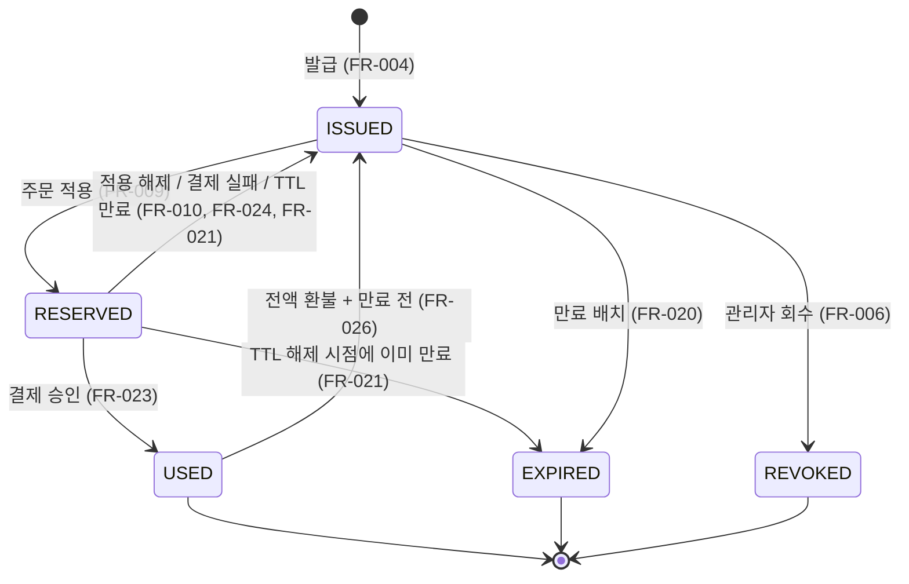
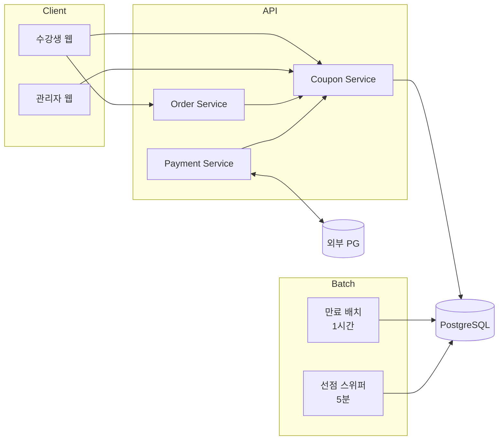
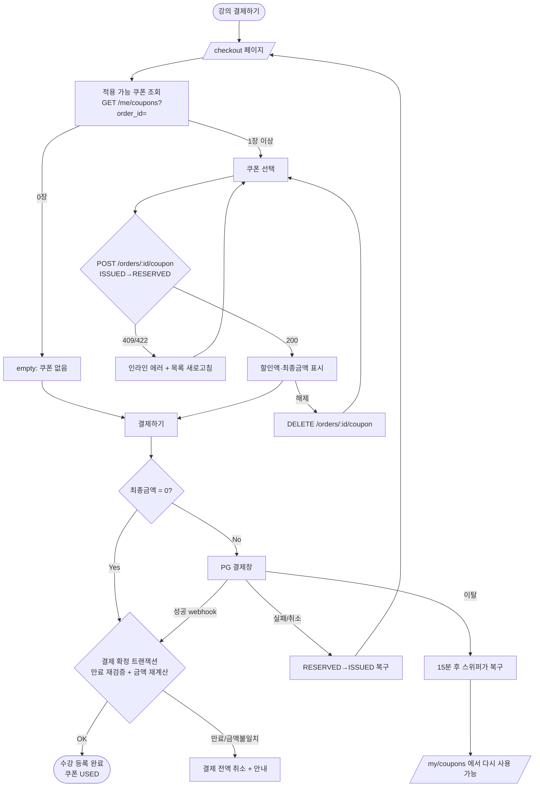
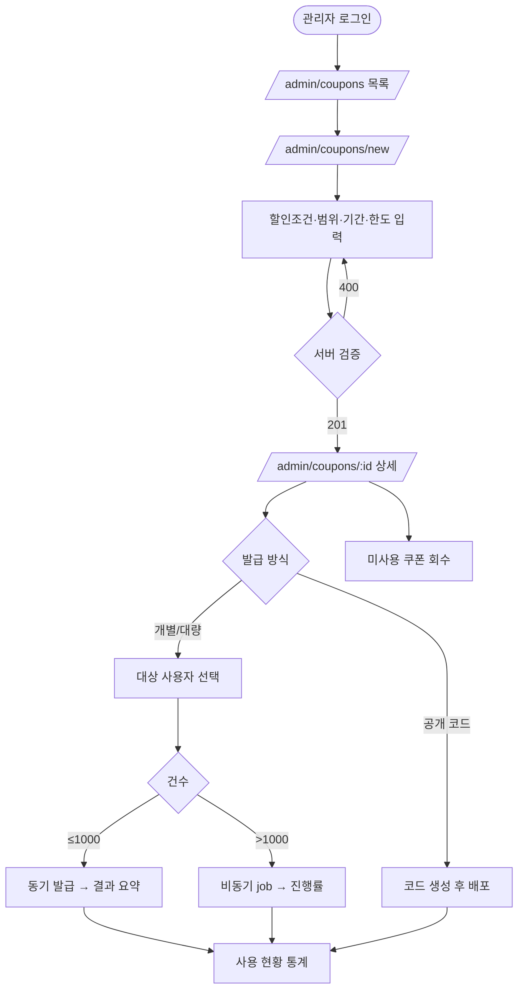

# 쿠폰(Coupon) 기능 PRD

> **Version**: 1.0
> **Created**: 2026-08-04
> **Status**: Draft
> **Type**: product-feature

## 0. 전제 가정 (확인 필요)

> 작업 디렉터리에 기존 코드베이스가 없어 스택·규모를 탐지할 수 없었습니다. 아래는 **가정값**이며, 다르면 알려주시면 반영합니다.

| 항목 | 가정값 | 영향 범위 |
|------|--------|----------|
| 문서유형 | `product-feature` (관리자 UI + 수강생 결제 UI 존재) | §5.4 / §5.4.1 / §5.5 활성 |
| Scale Grade | **Startup** (DAU 1,000–10,000) | §4.1 / §4.2 / §4.3 |
| DB | PostgreSQL (트랜잭션 + 부분 유니크 인덱스 사용) | §5.2 — MySQL이면 §5.2 대안 참고 |
| 결제 | 외부 PG 연동, 승인 요청/webhook 비동기 왕복 | §3 FR-007~009, §5.5 |
| 통화·시간대 | KRW 단일 통화 / `Asia/Seoul` 기준 만료 | §5.2, §4.6 |
| 기존 엔티티 | `users`, `courses`, `orders`가 이미 존재 | §5.2 FK |

---

## 1. Overview

### 1.1 Problem Statement

온라인 강의 플랫폼에 프로모션 수단이 없다. 마케팅 팀이 신규 수강생 유치나 재구매 유도를 위한 할인을 집행하려면 매번 강의 가격 자체를 내렸다 올리는 수동 운영을 해야 하며, 이는 다음 문제를 낳는다.

1. **대상 지정 불가** — 특정 사용자군(신규 가입자, 이탈 수강생)에게만 할인을 줄 수 없다.
2. **정산 왜곡** — 정가와 실제 판매가가 구분되지 않아 매출 분석과 강사 정산이 부정확하다.
3. **통제 불가** — 할인 총량·기간·1인당 사용 횟수를 시스템이 강제하지 못한다.

특히 할인 수단을 도입할 때 **금전적 손실로 직결되는 두 가지 실패 모드**를 반드시 막아야 한다.

- **이중 사용(double-spend)**: 동일 쿠폰이 두 건 이상의 결제에 적용되는 것. 동시 요청·결제 재시도·PG 중복 webhook에서 발생한다.
- **만료 우회**: 장바구니에 담을 때는 유효했으나 결제 승인 시점에 만료된 쿠폰이 적용되는 것(TOCTOU).

이 둘은 애플리케이션 레벨의 `if` 검증만으로는 막을 수 없고, DB 제약과 원자적 상태 전이로 보장해야 한다.

### 1.2 Goals

- **G1**: 관리자가 코드 배포 없이 쿠폰 정책(할인율/금액, 적용 범위, 유효기간, 발급 한도)을 생성·발급할 수 있다.
- **G2**: 수강생이 결제 화면에서 보유 쿠폰을 선택하거나 코드를 입력해 할인을 적용하고, 최종 결제 금액을 결제 전에 확인할 수 있다.
- **G3**: 어떤 동시성 조건에서도 쿠폰 1장이 2건 이상의 결제에 사용되지 않는다 (§3 FR-010).
- **G4**: 만료·비활성·사용완료 쿠폰은 적용 시점과 결제 승인 시점 **양쪽**에서 차단된다 (§3 FR-011).
- **G5**: 결제 실패·이탈 시 선점된 쿠폰이 자동으로 재사용 가능 상태로 복구된다 (§3 FR-009).

### 1.3 Non-Goals (Out of Scope)

| 제외 항목 | 사유 |
|----------|------|
| 쿠폰 중복 적용(스태킹) — 1주문 다중 쿠폰 | 할인 계산 순서·상한 정책이 별도 설계 필요. MVP는 **주문당 1장** 고정 |
| 포인트/마일리지 적립 및 사용 | 별도 도메인. 쿠폰과 동시 사용 여부는 Phase 3에서 논의 |
| 구독·정기결제 상품에 대한 쿠폰 | 회차별 적용 규칙이 상이. 단건 강의 결제만 대상 |
| 쿠폰 양도·선물하기 | 소유권 이전 및 부정사용 정책 필요 |
| 추천인(referral) 자동 발급 | 쿠폰 발급 API를 재사용해 후속 기능으로 구현 |
| 다국가 통화·환율 | KRW 단일 통화 전제 |

### 1.4 Scope

| 포함 | 제외 |
|------|------|
| 쿠폰 정책 CRUD (관리자) | 쿠폰 A/B 테스트 프레임워크 |
| 개별/대량 발급, 코드 등록형 발급 | 외부 제휴사 쿠폰 연동 |
| 정액·정률 할인 + 최대 할인 상한 | 무료 배송·사은품 등 비금액 혜택 |
| 적용 범위: 전체 / 특정 강의 / 카테고리 | 강사 단위·번들 단위 범위 |
| 선점–확정–해제 3단계 상태 전이 | 부분 결제·분할 결제 |
| 만료 검증(동기) + 만료 배치(비동기) | 만료 임박 알림 발송 (Phase 3) |
| 환불 시 쿠폰 복구 정책 | 부분 환불 시 비례 복구 |
| 관리자 사용 현황 통계 | BI 대시보드 연동 |

---

## 2. User Stories

### 2.1 Primary Users

**관리자 (admin)**
> As a **마케팅 관리자**, I want to **할인 조건과 유효기간, 발급 수량을 지정한 쿠폰을 발행**하고 싶다, so that **개발자 도움 없이 프로모션을 집행하고 예산 초과를 시스템이 막아주도록** 할 수 있다.

**수강생 (student)**
> As a **수강생**, I want to **결제 화면에서 보유 쿠폰을 골라 할인된 금액을 미리 확인하고 결제**하고 싶다, so that **얼마를 실제로 내는지 확신한 상태에서 구매를 마칠 수 있다**.

**시스템 (운영 관점)**
> As a **플랫폼 운영자**, I want to **쿠폰이 정확히 1회만 사용되고 만료 후에는 절대 적용되지 않도록 보장**받고 싶다, so that **의도치 않은 매출 손실과 정산 오류를 막을 수 있다**.

### 2.2 Acceptance Criteria (Gherkin)

```gherkin
Feature: 쿠폰 발행 (관리자)

Scenario: 정률 할인 쿠폰 정책 생성
  Given 나는 admin 역할로 로그인한 상태이다
  When 할인유형=PERCENTAGE, 할인값=20, 최대할인=30000, 최소주문금액=50000,
       유효기간=2026-09-01 ~ 2026-09-30, 총발급한도=1000, 1인당한도=1로 정책을 생성하면
  Then 정책이 status=ACTIVE로 저장되고
  And  응답에 coupon_id와 생성된 정책 정보가 반환된다

Scenario: 할인값 검증 실패
  Given 나는 admin 역할로 로그인한 상태이다
  When 할인유형=PERCENTAGE, 할인값=120으로 정책을 생성하면
  Then 400 INVALID_DISCOUNT_VALUE가 반환되고
  And  정책은 생성되지 않는다

Scenario: 정액 할인에 최대할인 상한을 함께 지정
  Given 나는 admin 역할로 로그인한 상태이다
  When 할인유형=FIXED_AMOUNT, 할인값=10000, 최대할인=5000으로 정책을 생성하면
  Then 400 INVALID_DISCOUNT_VALUE가 반환된다
  # 정액 할인에서 max_discount는 의미가 없으므로 명시적으로 거부한다

Scenario: 총 발급 한도 초과
  Given 총발급한도=100인 쿠폰 정책의 발급 수가 이미 100건이다
  When 관리자가 추가 발급을 요청하면
  Then 409 ISSUE_LIMIT_EXCEEDED가 반환되고
  And  발급 수는 100건으로 유지된다

Scenario: 1인당 발급 한도 초과
  Given 1인당한도=1인 쿠폰 정책을 사용자 U가 이미 1장 보유하고 있다
  When 관리자가 사용자 U에게 같은 정책의 쿠폰을 다시 발급하면
  Then 409 PER_USER_LIMIT_EXCEEDED가 반환된다
```

```gherkin
Feature: 쿠폰 적용 (수강생)

Scenario: 정률 할인 적용 및 상한 적용
  Given 나는 student 역할로 로그인했고
  And   할인율 20%, 최대할인 30000원인 유효한 쿠폰을 보유하고 있다
  And   주문 금액이 200,000원이다
  When  해당 쿠폰을 주문에 적용하면
  Then  할인 금액은 30,000원이다   # 200000*0.2=40000 이지만 상한 30000
  And   최종 결제 금액은 170,000원이다

Scenario: 최소 주문 금액 미달
  Given 최소주문금액이 50,000원인 쿠폰을 보유하고 있다
  And   주문 금액이 30,000원이다
  When  해당 쿠폰을 적용하면
  Then  422 MIN_ORDER_AMOUNT_NOT_MET이 반환되고
  And   주문에는 어떤 쿠폰도 연결되지 않는다

Scenario: 적용 범위 밖의 강의
  Given 적용범위가 강의 C-100으로 한정된 쿠폰을 보유하고 있다
  And   주문에 강의 C-200만 담겨 있다
  When  해당 쿠폰을 적용하면
  Then  422 COUPON_NOT_APPLICABLE이 반환된다

Scenario: 할인 금액이 주문 금액을 초과
  Given 정액 50,000원 할인 쿠폰을 보유하고 있고 최소주문금액 제한이 없다
  And   주문 금액이 30,000원이다
  When  해당 쿠폰을 적용하면
  Then  할인 금액은 30,000원으로 절삭되고
  And   최종 결제 금액은 0원이며
  And   결제 금액 0원 주문은 PG 호출 없이 즉시 완료 처리된다

Scenario: 주문당 1장 제한
  Given 주문 O에 쿠폰 A가 이미 적용되어 있다
  When  같은 주문 O에 쿠폰 B를 적용하면
  Then  409 COUPON_ALREADY_APPLIED가 반환되고
  And   주문 O에는 여전히 쿠폰 A만 연결되어 있다
```

```gherkin
Feature: 중복 사용 방지

Scenario: 동일 쿠폰에 대한 동시 적용 요청 (핵심)
  Given 사용자 U가 status=ISSUED인 쿠폰 X를 1장 보유하고 있다
  When  주문 O1과 주문 O2에 대해 쿠폰 X 적용 요청이 동시에 도착하면
  Then  정확히 1건만 200 OK를 받고
  And   나머지 1건은 409 COUPON_ALREADY_USED를 받으며
  And   쿠폰 X의 order_id는 성공한 주문 1건만 가리킨다

Scenario: 사용 완료된 쿠폰 재사용 시도
  Given 쿠폰 X의 status가 USED이다
  When  쿠폰 X를 다른 주문에 적용하면
  Then  409 COUPON_ALREADY_USED가 반환된다

Scenario: 결제 승인 webhook 중복 수신 (멱등성)
  Given 주문 O에 쿠폰 X가 RESERVED 상태로 선점되어 있다
  When  PG로부터 동일 payment_key의 승인 webhook이 2회 도착하면
  Then  쿠폰 X는 USED로 1회만 전이되고
  And   두 번째 요청도 200 OK를 반환한다   # 멱등 응답
  And   사용 이력(coupon_usage_logs)에는 1건만 기록된다

Scenario: 타인의 쿠폰 사용 시도
  Given 쿠폰 X의 소유자는 사용자 U1이다
  When  사용자 U2가 쿠폰 X의 id로 적용을 요청하면
  Then  404 COUPON_NOT_FOUND가 반환된다   # 403이 아니라 404 — 존재 여부 노출 방지
```

```gherkin
Feature: 만료 방지

Scenario: 만료된 쿠폰 적용 차단
  Given 쿠폰 X의 expires_at이 현재 시각보다 과거이다
  When  쿠폰 X를 주문에 적용하면
  Then  422 COUPON_EXPIRED가 반환된다
  And   status가 아직 ISSUED로 남아 있어도 동일하게 차단된다   # 배치 지연과 무관

Scenario: 선점 후 결제 승인 전에 만료 (TOCTOU)
  Given 쿠폰 X가 주문 O에 RESERVED 상태로 선점되어 있다
  And   선점 이후 쿠폰 X의 expires_at이 경과했다
  When  주문 O의 결제 승인 확정을 요청하면
  Then  422 COUPON_EXPIRED가 반환되고
  And   결제는 승인되지 않거나, 이미 승인되었다면 전액 취소된다
  And   쿠폰 X는 EXPIRED로 전이된다

Scenario: 만료 시각 경계
  Given 쿠폰 X의 유효 종료일이 2026-09-30이다
  Then  expires_at은 2026-09-30T23:59:59.999+09:00이다
  And   2026-09-30T23:59:59+09:00에 적용하면 성공한다
  And   2026-10-01T00:00:00+09:00에 적용하면 422 COUPON_EXPIRED이다

Scenario: 만료 배치 처리
  Given expires_at이 경과했고 status가 ISSUED인 쿠폰이 N장 있다
  When  만료 배치가 실행되면
  Then  해당 쿠폰들의 status가 EXPIRED로 전이되고
  And   status가 USED인 쿠폰은 변경되지 않는다
```

```gherkin
Feature: 선점 해제 및 복구

Scenario: 결제 실패 시 쿠폰 복구
  Given 주문 O에 쿠폰 X가 RESERVED 상태로 선점되어 있다
  When  PG 결제가 실패하면
  Then  쿠폰 X는 ISSUED로 복구되고 order_id가 NULL이 되며
  And   사용자는 쿠폰 X를 다른 주문에 다시 사용할 수 있다

Scenario: 결제 미완료 이탈 (선점 TTL 만료)
  Given 쿠폰 X가 15분 전에 RESERVED 되었고 결제가 완료되지 않았다
  When  선점 해제 스위퍼가 실행되면
  Then  쿠폰 X는 ISSUED로 복구된다
  And   단, 만료일이 이미 지났다면 EXPIRED로 전이된다

Scenario: 환불 시 쿠폰 복구 (기본 정책)
  Given 주문 O가 쿠폰 X를 사용해 결제 완료되었다
  When  주문 O가 전액 환불되면
  Then  쿠폰 X의 만료일이 아직 남아 있으면 ISSUED로 복구되고
  And   만료일이 지났으면 EXPIRED로 전이되며 복구되지 않는다
  And   두 경우 모두 coupon_usage_logs에 REFUNDED 이력이 남는다
```

### 2.3 User Roles

| Role Key | 한국어 명칭 | 권한 범위 | 비고 |
|----------|------------|----------|------|
| `guest` | 비로그인 사용자 | 쿠폰 관련 접근 없음 | 결제 자체가 인증 필요 |
| `student` | 수강생 | 본인 소유 쿠폰 read / 본인 주문에 apply·release | 소유권 검증 필수 |
| `admin` | 관리자 | 쿠폰 정책 CRUD, 발급, 회수, 전체 통계 read | 감사 로그 대상 |

**규칙**
- Role Key는 영문 소문자 단일 단어를 사용하며, 이후 모든 페이지·API 명세에서 이 키를 그대로 인용한다.
- `student`의 모든 쿠폰 조회·변경은 `user_coupons.user_id = :current_user_id` 조건을 **서버에서 강제**한다. 클라이언트가 보낸 user_id는 신뢰하지 않는다.
- 타인 소유 쿠폰 접근은 `403`이 아니라 **`404`**로 응답한다 — 쿠폰 존재 여부 자체가 정보 노출이 되므로.

---

## 3. Functional Requirements

### 3.1 쿠폰 발행 (관리자)

| ID | Requirement | Priority | Dependencies |
|----|------------|----------|--------------|
| FR-001 | 관리자는 쿠폰 정책을 생성할 수 있다. 필수 속성: 이름, 할인유형(`FIXED_AMOUNT`/`PERCENTAGE`), 할인값, 적용범위(`ALL`/`COURSE`/`CATEGORY`), 유효기간 유형(`ABSOLUTE`/`RELATIVE`) | P0 (Must) | - |
| FR-002 | 정책에 선택 제약을 설정할 수 있다: 최대 할인 금액(정률 전용), 최소 주문 금액, 총 발급 한도, 1인당 발급 한도(기본 1) | P0 (Must) | FR-001 |
| FR-003 | 관리자는 정책 목록·상세를 조회하고, 정책을 수정하거나 `INACTIVE`로 비활성화할 수 있다. **이미 발급된 쿠폰의 할인 조건은 소급 변경되지 않는다** (발급 시점 조건이 스냅샷으로 고정됨) | P0 (Must) | FR-001 |
| FR-004 | 관리자는 특정 사용자에게 쿠폰을 개별 발급하거나, 사용자 목록으로 대량 발급(최대 10,000건/요청)할 수 있다 | P0 (Must) | FR-001 |
| FR-005 | 관리자는 코드 등록형(공개 코드) 쿠폰을 만들 수 있다. 수강생이 코드를 직접 입력해 자신에게 발급한다 | P1 (Should) | FR-001 |
| FR-006 | 관리자는 미사용 쿠폰을 회수(`REVOKED`)할 수 있다. **`USED` 상태 쿠폰은 회수 불가** | P1 (Should) | FR-004 |

### 3.2 쿠폰 적용 (수강생)

| ID | Requirement | Priority | Dependencies |
|----|------------|----------|--------------|
| FR-007 | 수강생은 본인 쿠폰함에서 상태별(사용가능/사용완료/만료) 쿠폰을 조회할 수 있다 | P0 (Must) | FR-004 |
| FR-008 | 수강생은 결제 화면에서 **해당 주문에 적용 가능한 쿠폰만** 필터링해 볼 수 있고, 각 쿠폰의 예상 할인액이 함께 표시된다 | P0 (Must) | FR-007 |
| FR-009 | 수강생은 쿠폰을 주문에 적용하면 즉시 할인 금액과 최종 결제 금액을 확인할 수 있다. 적용은 쿠폰을 `RESERVED`로 **선점**한다 | P0 (Must) | FR-008, FR-012 |
| FR-010 | 수강생은 적용한 쿠폰을 결제 전에 해제할 수 있고, 해제 시 쿠폰은 `ISSUED`로 즉시 복구된다 | P0 (Must) | FR-009 |
| FR-011 | 수강생은 코드를 입력해 공개 쿠폰을 자신의 쿠폰함에 등록할 수 있다 | P1 (Should) | FR-005 |

### 3.3 중복 사용 방지 (핵심)

| ID | Requirement | Priority | Dependencies |
|----|------------|----------|--------------|
| FR-012 | 쿠폰 상태 전이는 **조건부 원자적 UPDATE**로만 수행한다. `UPDATE ... WHERE id=? AND status=<기대상태>`의 영향 행 수가 0이면 경합으로 판단해 `409`를 반환한다. 애플리케이션에서 `SELECT` 후 `if`로 검사하고 `UPDATE`하는 패턴은 금지한다 | P0 (Must) | - |
| FR-013 | DB 레벨에서 이중 사용을 구조적으로 차단한다: `user_coupons`에 `order_id` 부분 유니크 인덱스(status ∈ {RESERVED, USED}) — 1주문 1쿠폰 + 1쿠폰 1주문을 동시에 보장 | P0 (Must) | FR-012 |
| FR-014 | 결제 확정(confirm)은 **멱등**해야 한다. 동일 `payment_key`로 중복 요청이 와도 쿠폰은 1회만 `USED`로 전이되고 사용 이력도 1건만 남는다 | P0 (Must) | FR-012 |
| FR-015 | 1인당 발급 한도와 총 발급 한도는 DB 제약(유니크 인덱스 + 조건부 카운터 증가)으로 강제한다. 동시 발급 요청에서도 한도를 초과하지 않는다 | P0 (Must) | FR-002 |
| FR-016 | 쿠폰 코드는 추측 불가능해야 한다. Crockford Base32 12자 이상(엔트로피 ≥ 60bit), 코드 등록 시도에 rate limit 적용(사용자당 10회/시간, 초과 시 `429`) | P0 (Must) | FR-011 |

### 3.4 만료 방지

| ID | Requirement | Priority | Dependencies |
|----|------------|----------|--------------|
| FR-017 | 만료 검증은 `status` 컬럼이 아니라 **`expires_at > now()` 조건을 UPDATE의 WHERE 절에 직접 포함**해 수행한다. 배치 지연 여부와 무관하게 만료 쿠폰이 통과하지 않는다 | P0 (Must) | FR-012 |
| FR-018 | 만료 검증은 **적용 시점과 결제 확정 시점 양쪽**에서 수행한다. 선점 후 결제 승인 전 만료된 경우(TOCTOU) 결제를 진행하지 않는다 | P0 (Must) | FR-017 |
| FR-019 | `RELATIVE` 유효기간 정책은 발급 시점 기준 N일 후를 `expires_at`으로 계산해 **발급 인스턴스에 고정 저장**한다 | P0 (Must) | FR-001 |
| FR-020 | 만료 배치가 주기적으로(1시간 간격) `expires_at`이 지난 `ISSUED` 쿠폰을 `EXPIRED`로 전이한다. 이는 조회 성능·통계용이며 **정합성의 근거는 FR-017** | P1 (Should) | FR-017 |
| FR-021 | 선점 해제 스위퍼가 주기적으로(5분 간격) TTL(15분) 초과한 `RESERVED` 쿠폰을 `ISSUED`(또는 만료 시 `EXPIRED`)로 복구한다 | P0 (Must) | FR-009 |
| FR-022 | 모든 만료 시각은 `Asia/Seoul` 기준으로 해석하되 DB에는 `timestamptz`(UTC)로 저장한다. 종료일 지정 시 해당일 `23:59:59.999 KST`까지 유효하다 | P0 (Must) | - |

### 3.5 결제 연동 및 운영

| ID | Requirement | Priority | Dependencies |
|----|------------|----------|--------------|
| FR-023 | 결제 승인 성공 시 쿠폰을 `USED`로 확정하고 `order_id`, `used_at`을 기록한다 | P0 (Must) | FR-014 |
| FR-024 | 결제 실패·취소 시 쿠폰을 `ISSUED`로 복구한다 | P0 (Must) | FR-010 |
| FR-025 | 할인 후 결제 금액이 0원이면 PG 호출 없이 주문을 즉시 완료 처리하고 쿠폰을 `USED`로 확정한다 | P1 (Should) | FR-023 |
| FR-026 | 전액 환불 시 쿠폰 만료일이 남아 있으면 `ISSUED`로 복구하고, 지났으면 복구하지 않는다. 부분 환불은 쿠폰을 복구하지 않는다 | P1 (Should) | FR-023 |
| FR-027 | 모든 쿠폰 상태 전이를 `coupon_usage_logs`에 append-only로 기록한다 (누가·언제·어떤 주문·이전상태→다음상태) | P1 (Should) | FR-012 |
| FR-028 | 관리자는 정책별 발급 수/사용 수/사용률/총 할인액을 조회할 수 있다 | P1 (Should) | FR-027 |
| FR-029 | 할인 금액 계산 결과는 서버가 단일 소스로 계산한다. 클라이언트가 보낸 할인액·결제금액은 **절대 신뢰하지 않으며**, 결제 확정 시 서버가 재계산해 검증한다 | P0 (Must) | FR-009 |

### 3.6 할인 금액 계산 규칙 (FR-029 상세)

계산 순서를 다음과 같이 고정한다.

1. **적용 대상 금액 산출** — 주문 항목 중 쿠폰 적용 범위(`ALL`/특정 강의/특정 카테고리)에 해당하는 항목의 금액 합계. 범위 밖 항목은 할인 대상에서 제외한다.
2. **최소 주문 금액 검증** — 주문 총액이 아니라 **1에서 구한 적용 대상 금액** 기준으로 비교한다. 미달 시 `MIN_ORDER_AMOUNT_NOT_MET`.
3. **원할인액 계산**
   - `FIXED_AMOUNT`: `discount_value`
   - `PERCENTAGE`: `floor(적용대상금액 × discount_value / 100)` — **원 단위 절사**
4. **상한 적용** — `PERCENTAGE`이고 `max_discount_amount`가 있으면 `min(원할인액, max_discount_amount)`
5. **절삭** — `min(할인액, 적용대상금액)`. 할인액이 대상 금액을 넘지 않게 하며 최종 결제 금액은 음수가 될 수 없다.
6. **최종 결제 금액** = `주문 총액 − 최종 할인액`

> 부동소수점 연산 금지. 금액은 정수(원) 또는 `NUMERIC`으로만 다룬다.

---

## 4. Non-Functional Requirements

### 4.0 Scale Grade

**가정: Startup** (§0 참고 — 확인 필요)

| 항목 | 값 |
|------|-----|
| 예상 DAU | 1,000 – 10,000 |
| 피크 동시접속 | 100 – 1,000 |
| 쿠폰 발급 규모 | 캠페인당 최대 10,000장, 월 5만 장 |
| 결제 피크 | 신규 강의 오픈 직후 5분간 집중 (평시 대비 20배) |

> **주의**: 선착순 쿠폰 발급 이벤트는 짧은 시간에 극단적 경합을 만든다. FR-015의 DB 제약 기반 한도 강제는 이 시나리오에서 반드시 부하 테스트로 검증한다 (§6 Phase 3).

### 4.1 Performance SLA

| 지표 | 목표값 | 비고 |
|------|--------|------|
| 쿠폰 목록 조회 (p95) | < 300ms | 쿠폰함, 적용 가능 쿠폰 필터 |
| 쿠폰 적용/해제 (p95) | < 300ms | DB 왕복 1~2회 |
| 결제 확정 내 쿠폰 처리 (p95) | < 100ms | 결제 트랜잭션 지연에 직접 가산됨 |
| 대량 발급 10,000건 | < 60s | 비동기 job, 진행률 조회 제공 |
| Throughput | 100 RPS (피크 300 RPS) | 쿠폰 적용 API 기준 |

### 4.2 Availability SLA

| 항목 | 값 |
|------|-----|
| Uptime 목표 | 99% (월 허용 다운타임 7.3시간) |
| 열화 모드 | 쿠폰 서비스 장애 시 **쿠폰 없는 정가 결제는 계속 가능해야 한다**. 쿠폰 조회/적용 실패가 결제 플로우 전체를 막지 않는다 |
| 배치 실패 허용 | 만료 배치·스위퍼 실패는 정합성에 영향 없음 (FR-017이 근거). 단 2회 연속 실패 시 알림 |

### 4.3 Data Requirements

| 항목 | 값 |
|------|-----|
| 예상 데이터량 | `user_coupons` 월 5만 행, 1년 60만 행 (~200MB) |
| `coupon_usage_logs` | `user_coupons`의 약 3배 행 수 (상태 전이당 1행) |
| 데이터 보존 | 쿠폰 5년(전자상거래법상 거래 기록), 로그 5년 |
| 아카이빙 | 만료/사용 후 2년 경과 데이터는 콜드 스토리지 이관 (Phase 3) |

### 4.4 Recovery

| 항목 | 값 |
|------|-----|
| RTO | 4시간 |
| RPO | 15분 (PITR 기반) |
| 정합성 복구 | `coupon_usage_logs`(append-only)로 쿠폰 상태 재구성 가능해야 한다 |

### 4.5 Security

| 항목 | 요구사항 |
|------|---------|
| Authentication | 모든 쿠폰 API 인증 필수 (`guest` 접근 불가) |
| Authorization | `/admin/*`는 `admin` 역할 검증. `student`는 본인 소유 쿠폰만 접근 — 서버 측 `user_id` 강제 |
| IDOR 방지 | 타인 쿠폰 접근 시 `404` 응답 (존재 여부 비노출) |
| 코드 추측 방지 | 엔트로피 ≥ 60bit, 순차/추측 가능한 코드 금지 (FR-016) |
| Rate limiting | 코드 등록 10회/시간/사용자, 쿠폰 적용 30회/분/사용자 |
| 금액 위변조 방지 | 클라이언트 전달 금액 불신, 결제 확정 시 서버 재계산 (FR-029) |
| 감사 로그 | 관리자의 정책 생성·수정·발급·회수 전량 기록 (actor, IP, timestamp) |
| Encryption | In transit: TLS 1.2+ / At rest: DB 암호화. 쿠폰 코드는 개인정보 아니나 로그 평문 노출 금지 |
| 대량 발급 보호 | 대량 발급 API에 별도 승인 절차 또는 건수 상한(10,000) + 관리자 재확인 |

### 4.6 Quality

| 항목 | 기준 |
|------|------|
| 동시성 테스트 | 동일 쿠폰 100개 동시 요청 → 성공 정확히 1건 검증 (필수 통과 조건) |
| 경계값 테스트 | 만료 경계(±1ms), 할인액 = 주문액, 최소주문금액 정확히 일치, 할인율 0/100 |
| 멱등성 테스트 | 동일 payment_key webhook 10회 재전송 → USED 전이 1회, 로그 1건 |
| 금액 정확성 | 부동소수점 미사용 정적 검사. 절사 규칙 단위 테스트 |
| 테스트 커버리지 | 쿠폰 도메인 로직 90% 이상 |

---

## 5. Technical Design

### 5.1 API Specification

공통 규약:
- Base path: `/api/v1`
- 인증: `Authorization: Bearer <token>`
- 금액 필드는 모두 **정수(원 단위)**
- 에러 응답 형식: `{ "error": { "code": "COUPON_EXPIRED", "message": "...", "details": {} } }`

#### 5.1.1 관리자 — 쿠폰 정책

##### `POST /api/v1/admin/coupons`
- **Description**: 쿠폰 정책 생성
- **Auth**: Required (`admin`)
- **Request**:

| 필드 | 타입 | 필수 | 설명 |
|------|------|------|------|
| `name` | string(1..100) | ✓ | 정책명 |
| `discount_type` | enum(`FIXED_AMOUNT`,`PERCENTAGE`) | ✓ | 할인 유형 |
| `discount_value` | int | ✓ | 정액: 원 / 정률: 1~100 |
| `max_discount_amount` | int | - | 정률 전용 상한. 정액에 지정 시 400 |
| `min_order_amount` | int | - | 기본 0 |
| `scope_type` | enum(`ALL`,`COURSE`,`CATEGORY`) | ✓ | 적용 범위 |
| `scope_ids` | uuid[] | 조건부 | `scope_type≠ALL`이면 필수 |
| `validity_type` | enum(`ABSOLUTE`,`RELATIVE`) | ✓ | 유효기간 유형 |
| `starts_at` / `ends_at` | date | 조건부 | `ABSOLUTE`일 때 필수 (KST 날짜) |
| `valid_days` | int(1..3650) | 조건부 | `RELATIVE`일 때 필수 |
| `total_issue_limit` | int | - | null이면 무제한 |
| `per_user_limit` | int | - | 기본 1 |
| `is_public_code` | bool | - | 기본 false. true면 코드 등록형 |

- **Response 201**: `{ id, name, discount_type, discount_value, ..., status: "ACTIVE", issued_count: 0, created_at }`
- **Errors**:
  - `400 INVALID_DISCOUNT_VALUE` — 정률인데 1~100 범위 밖 / 정액인데 0 이하 / 정액에 `max_discount_amount` 지정
  - `400 INVALID_VALIDITY_PERIOD` — `ends_at < starts_at` / `ABSOLUTE`인데 날짜 누락 / `RELATIVE`인데 `valid_days` 누락
  - `400 INVALID_SCOPE` — `scope_type≠ALL`인데 `scope_ids` 비어 있음 / 존재하지 않는 강의·카테고리 ID
  - `401 UNAUTHORIZED` / `403 FORBIDDEN`

##### `GET /api/v1/admin/coupons`
- **Description**: 정책 목록 (필터: `status`, `discount_type`, 페이지네이션 `cursor`/`limit`)
- **Auth**: Required (`admin`)
- **Response 200**: `{ items: [{ id, name, status, issued_count, used_count, total_issue_limit, ends_at }], next_cursor }`
- **Errors**: `401`, `403`

##### `PATCH /api/v1/admin/coupons/{couponId}`
- **Description**: 정책 수정. **이미 발급된 쿠폰에는 소급 적용되지 않는다** (FR-003)
- **Auth**: Required (`admin`)
- **Request**: `name`, `status`(`ACTIVE`/`INACTIVE`), `total_issue_limit`, `ends_at` 만 변경 가능. 할인 조건 변경 불가
- **Response 200**: 수정된 정책
- **Errors**:
  - `400 IMMUTABLE_FIELD` — 할인 유형·값 등 변경 불가 필드 수정 시도
  - `400 INVALID_ISSUE_LIMIT` — 이미 발급된 수보다 작은 한도로 축소
  - `404 COUPON_NOT_FOUND`

##### `POST /api/v1/admin/coupons/{couponId}/issues`
- **Description**: 쿠폰 발급 (개별/대량). 1,000건 초과 시 비동기 job으로 처리
- **Auth**: Required (`admin`)
- **Request**: `{ user_ids: uuid[] (1..10000), reason?: string }`
- **Response 200** (동기, ≤1000건): `{ issued_count, skipped: [{ user_id, reason: "PER_USER_LIMIT_EXCEEDED" }] }`
- **Response 202** (비동기, >1000건): `{ job_id, status: "PENDING" }`
- **Errors**:
  - `409 ISSUE_LIMIT_EXCEEDED` — 총 발급 한도 초과 (부분 성공 시 `details.issued_count` 포함)
  - `409 COUPON_INACTIVE` — `INACTIVE` 정책에 발급 시도
  - `400 TOO_MANY_USERS` — 10,000건 초과
  - `404 COUPON_NOT_FOUND`

##### `POST /api/v1/admin/user-coupons/{userCouponId}/revoke`
- **Description**: 미사용 쿠폰 회수
- **Auth**: Required (`admin`)
- **Response 200**: `{ id, status: "REVOKED" }`
- **Errors**:
  - `409 COUPON_ALREADY_USED` — `USED` 상태는 회수 불가
  - `409 COUPON_RESERVED` — 결제 진행 중. 선점 해제 후 재시도 안내
  - `404 COUPON_NOT_FOUND`

##### `GET /api/v1/admin/coupons/{couponId}/stats`
- **Description**: 정책별 사용 통계
- **Auth**: Required (`admin`)
- **Response 200**: `{ issued_count, used_count, expired_count, revoked_count, usage_rate, total_discount_amount }`
- **Errors**: `404 COUPON_NOT_FOUND`

#### 5.1.2 수강생 — 쿠폰함

##### `GET /api/v1/me/coupons`
- **Description**: 내 쿠폰함 조회
- **Auth**: Required (`student`)
- **Request (query)**: `status` (`AVAILABLE`|`USED`|`EXPIRED`, 기본 `AVAILABLE`), `order_id` (지정 시 해당 주문에 적용 가능한 쿠폰만 + 예상 할인액 포함), `cursor`, `limit`
- **Response 200**:
```json
{
  "items": [{
    "id": "uuid",
    "name": "9월 신규수강생 20% 할인",
    "discount_type": "PERCENTAGE",
    "discount_value": 20,
    "max_discount_amount": 30000,
    "min_order_amount": 50000,
    "scope_type": "COURSE",
    "expires_at": "2026-09-30T23:59:59.999+09:00",
    "status": "ISSUED",
    "applicable": true,
    "estimated_discount": 30000,
    "inapplicable_reason": null
  }],
  "next_cursor": null
}
```
- **Note**: `order_id`가 주어지면 적용 불가 쿠폰도 `applicable: false` + `inapplicable_reason`(`MIN_ORDER_AMOUNT_NOT_MET`|`NOT_APPLICABLE_SCOPE`)과 함께 반환한다 — "왜 못 쓰는지"를 UI가 설명할 수 있어야 하므로.
- **Errors**: `401 UNAUTHORIZED`, `404 ORDER_NOT_FOUND` (타인 주문 포함)

##### `POST /api/v1/me/coupons`
- **Description**: 공개 코드로 쿠폰 등록
- **Auth**: Required (`student`)
- **Request**: `{ "code": "ABCD-EFGH-JKMN" }`
- **Response 201**: 발급된 쿠폰 객체
- **Errors**:
  - `404 INVALID_COUPON_CODE` — 존재하지 않는 코드 (만료·소진 코드와 **동일 응답**으로 통일해 열거 공격 방지)
  - `409 PER_USER_LIMIT_EXCEEDED` — 이미 보유
  - `409 ISSUE_LIMIT_EXCEEDED` — 총 발급 소진
  - `429 TOO_MANY_ATTEMPTS` — rate limit 초과 (`Retry-After` 헤더 포함)

#### 5.1.3 결제 — 쿠폰 적용

##### `POST /api/v1/orders/{orderId}/coupon/preview`
- **Description**: 할인 금액 미리 계산 (상태 변경 없음, 멱등)
- **Auth**: Required (`student`)
- **Request**: `{ "user_coupon_id": "uuid" }`
- **Response 200**: `{ order_amount: 200000, applicable_amount: 200000, discount_amount: 30000, final_amount: 170000 }`
- **Errors**: `404 COUPON_NOT_FOUND`, `404 ORDER_NOT_FOUND`, `422 COUPON_EXPIRED`, `422 MIN_ORDER_AMOUNT_NOT_MET`, `422 COUPON_NOT_APPLICABLE`

##### `POST /api/v1/orders/{orderId}/coupon`
- **Description**: 쿠폰을 주문에 적용(선점). `ISSUED → RESERVED` 원자적 전이
- **Auth**: Required (`student`)
- **Request**: `{ "user_coupon_id": "uuid" }`
- **Response 200**: `{ order_id, user_coupon_id, discount_amount: 30000, final_amount: 170000, reserved_until: "2026-08-04T10:15:00Z" }`
- **Errors**:
  - `409 COUPON_ALREADY_USED` — 이미 사용됨 또는 동시 요청 경합에서 패배 (FR-012)
  - `409 COUPON_ALREADY_APPLIED` — 해당 주문에 이미 다른 쿠폰이 적용됨
  - `409 ORDER_NOT_PENDING` — 주문이 결제 대기 상태가 아님
  - `422 COUPON_EXPIRED` / `422 COUPON_REVOKED` / `422 MIN_ORDER_AMOUNT_NOT_MET` / `422 COUPON_NOT_APPLICABLE`
  - `404 COUPON_NOT_FOUND` (타인 소유 포함) / `404 ORDER_NOT_FOUND`
  - `429 TOO_MANY_ATTEMPTS`

##### `DELETE /api/v1/orders/{orderId}/coupon`
- **Description**: 적용 해제. `RESERVED → ISSUED` 원자적 전이
- **Auth**: Required (`student`)
- **Response 200**: `{ order_id, final_amount: 200000 }`
- **Errors**:
  - `409 COUPON_ALREADY_USED` — 이미 결제 확정됨. 해제 불가
  - `404 ORDER_NOT_FOUND` / `404 NO_COUPON_APPLIED`

##### (Internal) 결제 확정 시 쿠폰 확정
- **Description**: 별도 공개 엔드포인트가 아니라 **결제 승인 트랜잭션 내부에서 호출**되는 도메인 서비스. `RESERVED → USED` 원자적 전이 + 만료 재검증(FR-018) + 금액 재계산 검증(FR-029)
- **Idempotency**: `payment_key`를 키로 멱등 보장 (FR-014). 이미 `USED`이고 `order_id`가 동일하면 성공으로 간주
- **실패 시**: 만료·금액 불일치면 결제 트랜잭션 전체 롤백. 이미 PG 승인이 났다면 **전액 취소(void)** 후 사용자에게 안내

### 5.2 Database Schema

```sql
-- 1) 쿠폰 정책 (템플릿)
CREATE TABLE coupons (
  id                   UUID PRIMARY KEY DEFAULT gen_random_uuid(),
  name                 VARCHAR(100) NOT NULL,
  discount_type        VARCHAR(20)  NOT NULL,   -- FIXED_AMOUNT | PERCENTAGE
  discount_value       INTEGER      NOT NULL,
  max_discount_amount  INTEGER,                 -- PERCENTAGE 전용
  min_order_amount     INTEGER      NOT NULL DEFAULT 0,
  scope_type           VARCHAR(20)  NOT NULL,   -- ALL | COURSE | CATEGORY
  validity_type        VARCHAR(20)  NOT NULL,   -- ABSOLUTE | RELATIVE
  starts_at            TIMESTAMPTZ,             -- ABSOLUTE
  ends_at              TIMESTAMPTZ,             -- ABSOLUTE
  valid_days           INTEGER,                 -- RELATIVE
  total_issue_limit    INTEGER,                 -- NULL = 무제한
  per_user_limit       INTEGER      NOT NULL DEFAULT 1,
  issued_count         INTEGER      NOT NULL DEFAULT 0,
  is_public_code       BOOLEAN      NOT NULL DEFAULT FALSE,
  public_code          VARCHAR(32),             -- is_public_code=TRUE일 때
  status               VARCHAR(20)  NOT NULL DEFAULT 'ACTIVE',  -- ACTIVE | INACTIVE
  created_by           UUID         NOT NULL REFERENCES users(id),
  created_at           TIMESTAMPTZ  NOT NULL DEFAULT now(),
  updated_at           TIMESTAMPTZ  NOT NULL DEFAULT now(),

  -- 할인 조건 정합성을 DB가 강제 (FR-001, FR-002)
  CONSTRAINT ck_discount CHECK (
    (discount_type = 'PERCENTAGE'   AND discount_value BETWEEN 1 AND 100)
    OR
    (discount_type = 'FIXED_AMOUNT' AND discount_value > 0 AND max_discount_amount IS NULL)
  ),
  CONSTRAINT ck_validity CHECK (
    (validity_type = 'ABSOLUTE' AND starts_at IS NOT NULL AND ends_at IS NOT NULL AND ends_at > starts_at)
    OR
    (validity_type = 'RELATIVE' AND valid_days IS NOT NULL AND valid_days > 0)
  ),
  CONSTRAINT ck_issue_limit CHECK (total_issue_limit IS NULL OR issued_count <= total_issue_limit),
  CONSTRAINT ck_min_order   CHECK (min_order_amount >= 0),
  CONSTRAINT ck_public_code CHECK (NOT is_public_code OR public_code IS NOT NULL)
);
CREATE UNIQUE INDEX uq_coupons_public_code ON coupons(public_code) WHERE public_code IS NOT NULL;

-- 2) 쿠폰 적용 범위 (scope_type != ALL)
CREATE TABLE coupon_scopes (
  coupon_id  UUID NOT NULL REFERENCES coupons(id) ON DELETE CASCADE,
  target_id  UUID NOT NULL,   -- course_id 또는 category_id
  PRIMARY KEY (coupon_id, target_id)
);

-- 3) 발급된 쿠폰 인스턴스 (사용자 소유)
CREATE TABLE user_coupons (
  id            UUID PRIMARY KEY DEFAULT gen_random_uuid(),
  coupon_id     UUID NOT NULL REFERENCES coupons(id),
  user_id       UUID NOT NULL REFERENCES users(id),
  issue_seq     INTEGER NOT NULL DEFAULT 1,   -- per_user_limit > 1 지원
  status        VARCHAR(20) NOT NULL DEFAULT 'ISSUED',
                -- ISSUED | RESERVED | USED | EXPIRED | REVOKED
  order_id      UUID REFERENCES orders(id),
  expires_at    TIMESTAMPTZ NOT NULL,          -- 발급 시점에 확정 (FR-019)
  reserved_at   TIMESTAMPTZ,
  reserved_until TIMESTAMPTZ,                  -- 선점 TTL (FR-021)
  used_at       TIMESTAMPTZ,
  discount_amount INTEGER,                     -- 확정 시 실제 할인액 스냅샷
  issued_at     TIMESTAMPTZ NOT NULL DEFAULT now(),
  updated_at    TIMESTAMPTZ NOT NULL DEFAULT now(),

  -- 상태별 필수 필드 정합성
  CONSTRAINT ck_used     CHECK (status <> 'USED' OR (order_id IS NOT NULL AND used_at IS NOT NULL)),
  CONSTRAINT ck_reserved CHECK (status <> 'RESERVED' OR (order_id IS NOT NULL AND reserved_until IS NOT NULL))
);

-- ★ 핵심 제약 1: 1인당 발급 한도 강제 (FR-015)
CREATE UNIQUE INDEX uq_user_coupon_issue
  ON user_coupons(coupon_id, user_id, issue_seq);

-- ★ 핵심 제약 2: 이중 사용 구조적 차단 (FR-013)
--   한 주문에는 살아 있는 쿠폰이 최대 1장 → "1주문 1쿠폰"
--   쿠폰 행은 1개이므로 order_id도 1개 → "1쿠폰 1주문"
CREATE UNIQUE INDEX uq_active_order_coupon
  ON user_coupons(order_id)
  WHERE order_id IS NOT NULL AND status IN ('RESERVED', 'USED');

-- 조회 인덱스
CREATE INDEX ix_user_coupons_wallet  ON user_coupons(user_id, status, expires_at DESC);
CREATE INDEX ix_user_coupons_expiry  ON user_coupons(expires_at) WHERE status = 'ISSUED';
CREATE INDEX ix_user_coupons_sweeper ON user_coupons(reserved_until) WHERE status = 'RESERVED';

-- 4) 상태 전이 감사 로그 (append-only, FR-027)
CREATE TABLE coupon_usage_logs (
  id              BIGSERIAL PRIMARY KEY,
  user_coupon_id  UUID NOT NULL REFERENCES user_coupons(id),
  from_status     VARCHAR(20),
  to_status       VARCHAR(20) NOT NULL,
  order_id        UUID,
  payment_key     VARCHAR(100),   -- 멱등 판정용 (FR-014)
  discount_amount INTEGER,
  actor_type      VARCHAR(20) NOT NULL,   -- STUDENT | ADMIN | SYSTEM
  actor_id        UUID,
  reason          VARCHAR(200),
  created_at      TIMESTAMPTZ NOT NULL DEFAULT now()
);
CREATE INDEX ix_usage_logs_coupon ON coupon_usage_logs(user_coupon_id, created_at DESC);

-- ★ 핵심 제약 3: 확정 처리 멱등성 (FR-014)
CREATE UNIQUE INDEX uq_usage_logs_confirm
  ON coupon_usage_logs(payment_key)
  WHERE payment_key IS NOT NULL AND to_status = 'USED';
```

> **MySQL을 쓰는 경우**: 부분 유니크 인덱스가 없으므로 `uq_active_order_coupon`은 생성 컬럼(`active_order_id = IF(status IN ('RESERVED','USED'), order_id, NULL)`)에 유니크 인덱스를 거는 방식으로 대체한다. `CHECK` 제약은 8.0.16+ 에서만 동작한다.

#### 상태 전이 다이어그램



> `USED`에서 나가는 전이는 환불 복구뿐이다. 그 외 어떤 경로로도 `USED` 쿠폰이 다시 사용될 수 없다.

#### 핵심 쿼리 — 원자적 상태 전이 (FR-012, FR-017)

```sql
-- (a) 쿠폰 선점: ISSUED → RESERVED
--     소유권·상태·만료를 모두 WHERE 절에서 한 번에 검증한다.
UPDATE user_coupons
   SET status = 'RESERVED',
       order_id = :order_id,
       reserved_at = now(),
       reserved_until = now() + interval '15 minutes',
       updated_at = now()
 WHERE id = :user_coupon_id
   AND user_id = :current_user_id     -- 소유권 (IDOR 방지)
   AND status = 'ISSUED'              -- 중복 사용 방지 (FR-012)
   AND expires_at > now()             -- 만료 방지, 배치 무관 (FR-017)
RETURNING id;
-- 영향 행 0 → 409 COLLISION. SELECT 후 검사하는 패턴은 금지.
-- uq_active_order_coupon 위반 시 → 409 COUPON_ALREADY_APPLIED

-- (b) 결제 확정: RESERVED → USED (결제 트랜잭션 내부)
UPDATE user_coupons
   SET status = 'USED', used_at = now(), discount_amount = :discount, updated_at = now()
 WHERE id = :user_coupon_id
   AND status = 'RESERVED'
   AND order_id = :order_id
   AND expires_at > now()             -- TOCTOU 재검증 (FR-018)
RETURNING id;
-- 영향 행 0이면: 현재 상태를 다시 읽어
--   USED + 동일 order_id  → 멱등 성공 (webhook 재전송, FR-014)
--   그 외                 → 결제 롤백 / PG 전액 취소

-- (c) 총 발급 한도 강제 (FR-015) — 발급 트랜잭션 시작 시
UPDATE coupons
   SET issued_count = issued_count + 1
 WHERE id = :coupon_id
   AND status = 'ACTIVE'
   AND (total_issue_limit IS NULL OR issued_count < total_issue_limit)
RETURNING issued_count;
-- 영향 행 0 → 409 ISSUE_LIMIT_EXCEEDED. 선착순 경합에서도 초과 발급 불가.

-- (d) 선점 스위퍼 (FR-021) — 5분 간격
UPDATE user_coupons
   SET status = CASE WHEN expires_at <= now() THEN 'EXPIRED' ELSE 'ISSUED' END,
       order_id = NULL, reserved_at = NULL, reserved_until = NULL, updated_at = now()
 WHERE status = 'RESERVED'
   AND reserved_until < now();

-- (e) 만료 배치 (FR-020) — 1시간 간격, 배치 크기 제한
UPDATE user_coupons SET status = 'EXPIRED', updated_at = now()
 WHERE id IN (
   SELECT id FROM user_coupons
    WHERE status = 'ISSUED' AND expires_at <= now()
    LIMIT 1000
 );
```

> **선점 TTL과 PG 타임아웃의 관계**: 선점 TTL(15분)은 PG 결제 세션 타임아웃보다 **길어야** 한다. 짧으면 사용자가 결제 중인데 쿠폰이 풀려 확정 단계에서 실패한다. PG 세션이 10분이면 TTL은 15분이 안전하다.

### 5.3 Architecture



**설계 원칙**
1. 쿠폰 확정(`RESERVED → USED`)은 **결제 승인과 동일한 DB 트랜잭션**에서 처리한다. 분리하면 "결제는 됐는데 쿠폰은 안 쓴" 상태가 생긴다.
2. Coupon Service는 Payment Service를 **호출하지 않는다**(단방향 의존). 쿠폰은 결제를 모른 채 상태 전이만 제공한다.
3. 배치는 정합성의 근거가 아니라 **조회 편의와 통계용**이다. 배치가 며칠 죽어 있어도 만료 쿠폰은 사용되지 않는다 (FR-017).

### 5.4 Pages

| Route | Audience | Auth | Linked FRs | Has FE Components | Primary State | Responsive |
|-------|----------|------|-----------|-------------------|---------------|-----------|
| `/checkout/{orderId}` | student | Required | FR-008, FR-009, FR-010 | Yes | success / error | Desktop / Mobile |
| `/my/coupons` | student | Required | FR-007, FR-011 | Yes | success / empty | Desktop / Mobile |
| `/admin/coupons` | admin | Required | FR-003, FR-028 | Yes | success / empty | Desktop only |
| `/admin/coupons/new` | admin | Required | FR-001, FR-002 | Yes | success / error | Desktop only |
| `/admin/coupons/{id}` | admin | Required | FR-003, FR-004, FR-006, FR-028 | Yes | success | Desktop only |
| `/api/v1/**` | student, admin | Required | 전체 | **No** (API) | - | - |

### 5.4.1 Page State Matrix

| Route | loading | empty | error | success | no-permission | 비고 |
|-------|---------|-------|-------|---------|---------------|------|
| `/checkout/{orderId}` | ✓ | ✓ | ✓ | ✓ | ✓ | 보유 쿠폰 0장 → empty("사용 가능한 쿠폰이 없습니다"). 409/422는 **인라인 에러 + 금액 재조회**로 처리하고 결제 버튼은 유지 |
| `/my/coupons` | ✓ | ✓ | ✓ | ✓ | - | 탭별(사용가능/사용완료/만료) empty 문구 상이 |
| `/admin/coupons` | ✓ | ✓ | ✓ | ✓ | ✓ | admin 아니면 no-permission |
| `/admin/coupons/new` | - | - | ✓ | ✓ | ✓ | 필드 검증 실패는 폼 인라인 에러 |
| `/admin/coupons/{id}` | ✓ | ✓ | ✓ | ✓ | ✓ | 발급 이력 0건 → empty. 대량 발급 진행률 표시 |

**주요 에러 마이크로카피** (결제 화면 — 사용자가 다음 행동을 알 수 있어야 함)

| 에러 코드 | 문구 | 후속 동작 |
|----------|------|----------|
| `COUPON_EXPIRED` | "쿠폰 유효기간이 지났습니다. 다른 쿠폰을 선택해 주세요." | 쿠폰 목록 새로고침, 해당 쿠폰 비활성 표시 |
| `COUPON_ALREADY_USED` | "이미 사용된 쿠폰입니다. 쿠폰 목록을 새로고침했습니다." | 목록 자동 재조회 |
| `MIN_ORDER_AMOUNT_NOT_MET` | "{금액}원 이상 결제 시 사용할 수 있어요." | 쿠폰 선택 불가 상태로 표시 |
| `COUPON_NOT_APPLICABLE` | "이 강의에는 사용할 수 없는 쿠폰입니다." | 적용 가능 강의 목록 툴팁 |
| `TOO_MANY_ATTEMPTS` | "잠시 후 다시 시도해 주세요." | `Retry-After`만큼 입력 비활성 |

### 5.5 User Flow

#### Flow A: 수강생 — 쿠폰 적용 후 결제



#### Flow B: 관리자 — 쿠폰 발행



---

## 6. Implementation Phases

### Phase 1: MVP — 발행과 적용의 기본 골격
- [ ] `coupons`, `coupon_scopes`, `user_coupons`, `coupon_usage_logs` 스키마 및 **제약·인덱스** 생성 (FR-013, FR-015)
- [ ] 할인 금액 계산 도메인 로직 (§3.6) + 경계값 단위 테스트
- [ ] 관리자 정책 CRUD API (FR-001~003)
- [ ] 개별/대량 발급 API — 동기 경로만 (FR-004)
- [ ] 쿠폰함 조회 API (FR-007, FR-008)
- [ ] 적용/해제 API — 원자적 전이 (FR-009, FR-010, FR-012, FR-017)
- [ ] 결제 확정 연동 + 멱등 처리 (FR-014, FR-018, FR-023, FR-024)
- [ ] 선점 스위퍼 배치 (FR-021)
- [ ] **동시성 테스트: 동일 쿠폰 100 동시 요청 → 성공 1건** (§4.6 필수 통과 조건)

**Deliverable**: 관리자가 쿠폰을 발행하고 수강생이 결제에 사용할 수 있으며, 이중 사용·만료 우회가 테스트로 차단됨이 증명된 상태

### Phase 2: Enhancement — 운영 편의
- [ ] 공개 코드 등록형 쿠폰 (FR-005, FR-011) + rate limit (FR-016)
- [ ] 대량 발급 비동기 job + 진행률 조회 (FR-004)
- [ ] 쿠폰 회수 (FR-006)
- [ ] 만료 배치 (FR-020)
- [ ] 환불 시 복구 정책 (FR-026)
- [ ] 관리자 통계 대시보드 (FR-028)
- [ ] 0원 결제 처리 (FR-025)

**Deliverable**: 마케팅 팀이 개발자 개입 없이 캠페인을 집행·모니터링할 수 있는 상태

### Phase 3: Hardening — 규모 대응
- [ ] 선착순 발급 부하 테스트 (피크 300 RPS, 한도 초과 0건 검증)
- [ ] 쿠폰 조회 캐싱 및 인덱스 튜닝
- [ ] 만료 임박 알림 발송
- [ ] 데이터 아카이빙 정책 적용
- [ ] 쿠폰 사용률·손익 리포트 BI 연동

**Deliverable**: 대규모 프로모션에서도 SLA를 만족하는 상태

---

## 7. Success Metrics

| Metric | Target | Measurement |
|--------|--------|-------------|
| 쿠폰 이중 사용 발생 건수 | **0건** | `user_coupons`에서 `USED` 상태 쿠폰의 order_id 중복 검사 (일 1회 정합성 감사) |
| 만료 쿠폰 적용 성공 건수 | **0건** | `coupon_usage_logs`에서 `used_at > expires_at`인 행 검사 |
| 쿠폰 적용 API 실패율 (5xx) | < 0.1% | APM 에러율 |
| 쿠폰 적용 p95 지연 | < 300ms | APM 트레이스 |
| 결제 확정 내 쿠폰 처리 p95 | < 100ms | APM 트레이스 |
| 선점 미해제 쿠폰 (TTL+5분 초과) | 0건 | 스위퍼 실행 후 잔여 `RESERVED` 카운트 |
| 쿠폰 사용률 (발급 대비 사용) | > 25% | `used_count / issued_count` (정책별) |
| 쿠폰 사용 주문의 결제 전환율 | 미사용 대비 +10%p | 주문 생성 → 결제 완료 퍼널 비교 |
| 관리자 쿠폰 발행 소요 시간 | < 3분 | 정책 생성 → 발급 완료까지 (관리자 인터뷰) |
| 쿠폰 관련 CS 문의 비율 | 전체 결제 문의의 < 5% | CS 티켓 태그 분류 |

---

## 8. Open Questions

구현 착수 전 확정이 필요한 항목이다.

| # | 질문 | 기본 가정 | 영향 |
|---|------|----------|------|
| 1 | Scale Grade가 Startup이 맞는가? | Startup (DAU 1k–10k) | §4.1~4.3 전반 |
| 2 | 부분 환불 시 쿠폰을 복구하는가? | 복구하지 않음 | FR-026 |
| 3 | 선점 TTL 15분이 PG 세션 타임아웃보다 긴가? | PG 10분 가정 | FR-021, 결제 실패율 |
| 4 | 강의 카테고리 체계가 존재하는가? | 존재 | `scope_type=CATEGORY` 구현 가능 여부 |
| 5 | 강사 정산은 정가 기준인가 할인 후 기준인가? | 정산 도메인 별도 결정 | 매출 인식·정산 로직 |
| 6 | 쿠폰 할인분의 회계 처리(매출 차감 vs 판촉비)? | 미정 | 재무 리포트 |
| 7 | 관리자 대량 발급에 2인 승인이 필요한가? | 불필요(건수 상한만) | §4.5 |
| 8 | 기존 `orders` 테이블에 할인 금액 컬럼이 있는가? | 없음 → 추가 필요 | §5.2 마이그레이션 |
