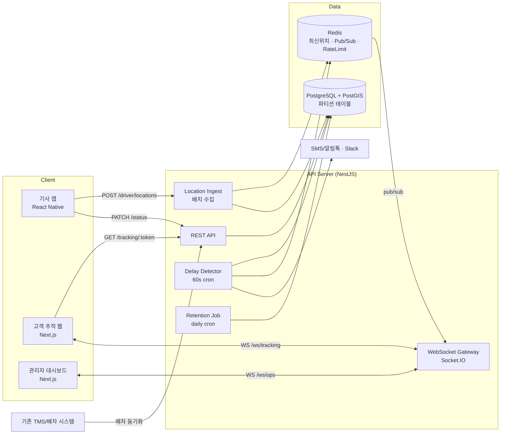
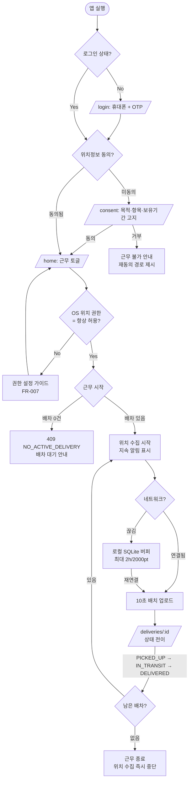
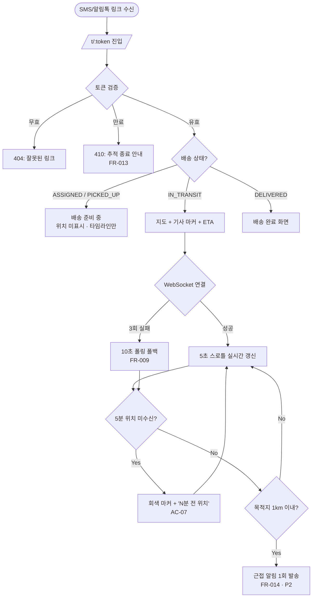
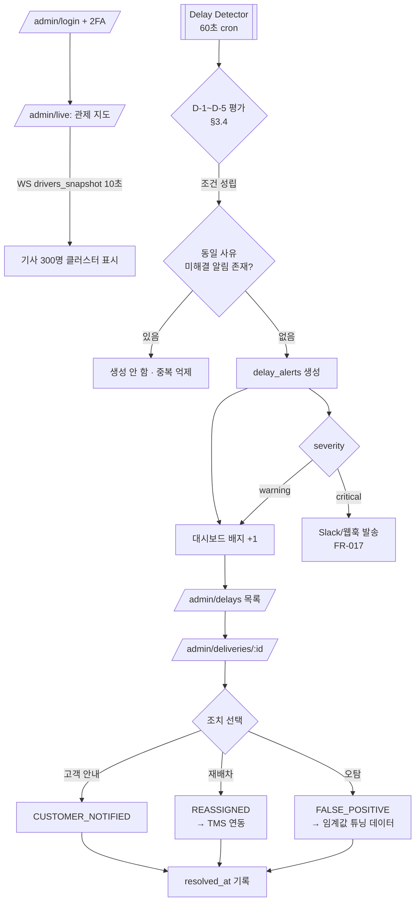

# 실시간 배송 추적 (Real-time Delivery Tracking) PRD

> **Version**: 1.0
> **Created**: 2026-08-04
> **Status**: Draft
> **Type**: product-feature

### 문서 작성 전제 (Assumptions)

이 PRD는 빈 저장소(그린필드) 기준으로 작성되었으며, 아래 항목은 확인 없이 가정했습니다. **다르면 해당 섹션만 수정하면 됩니다.**

| # | 가정 | 영향 섹션 | 확인 필요도 |
|---|------|----------|-----------|
| A-1 | 기존 배송 주문(WMS/TMS) 시스템이 이미 있고, 배차 정보를 API 또는 DB로 받아올 수 있다 | §5.2, §5.6, Phase 1 | **High** |
| A-2 | 기사 앱은 신규 개발(React Native/Expo). 기존 앱에 기능 추가라면 §5.7 스택은 무시 | §5.7 | **High** |
| A-3 | 서비스 지역은 국내이며 위치정보법(위치정보의 보호 및 이용 등에 관한 법률) 적용 대상 | §4.5, FR-005, FR-019 | **High** |
| A-4 | 규모는 Startup 등급 (기사 500명 / 동시 근무 300명 / 일 배송 5,000건) | §4.0~4.4 | Medium |
| A-5 | 고객은 앱 설치 없이 SMS/알림톡의 링크로 웹에서 추적한다 | FR-007, §5.4 | Medium |

---

## 1. Overview

### 1.1 Problem Statement

현재 배송 진행 상황은 기사가 상태를 수동으로 찍는 시점(픽업 완료 / 배송 완료)에만 갱신된다. 그 사이 구간은 누구에게도 보이지 않는 **블랙박스**다. 이로 인해:

- **고객**: "지금 어디쯤이냐"는 문의가 CS로 몰린다. 도착 시점을 몰라 부재중 배송 실패가 발생한다.
- **관리자**: 배송이 늦어지는 것을 *고객이 항의한 뒤에야* 안다. 사후 대응만 가능하고 재배차·사전 안내 같은 선제 조치를 못 한다.
- **기사**: 위치를 묻는 전화를 운전 중에 받는다. 안전과 생산성 모두 손해다.

### 1.2 Goals

- G-1. 기사 위치를 **자동으로** 수집해 고객이 지도에서 직접 확인하게 하여, 위치 문의 CS를 줄인다.
- G-2. 배송 지연을 **발생 전 또는 발생 직후 5분 내**에 관리자가 인지하여 선제 조치를 가능하게 한다.
- G-3. 기사에게 **추가 조작 부담 없이**(근무 시작 토글 1회) 동작하고, 배터리를 과도하게 쓰지 않는다.
- G-4. 위치정보법을 준수하는 동의·보존·파기 체계를 처음부터 갖춰 법적 리스크를 만들지 않는다.

### 1.3 Non-Goals (Out of Scope)

- ❌ **경로 최적화 / 자동 배차 알고리즘** — 배차는 기존 시스템이 담당. 본 기능은 "이미 배차된 건"의 추적만 다룬다.
- ❌ **고객용 네이티브 앱** — 고객은 웹(모바일 브라우저)으로만 본다.
- ❌ **기사 근태·급여 정산 연동** — 위치 데이터를 근무 평가에 쓰지 않는다 (§4.5 참조: 노사 이슈 및 동의 범위 초과).
- ❌ **기사 간 채팅 / 고객-기사 직접 통화 기능** — 안심번호 연동은 Phase 3 후보.
- ❌ **실내 측위, 층/호수 단위 정밀 추적**.
- ❌ **해외 배송 / 다국어 지원** — Phase 3 이후.

### 1.4 Scope

| 포함 | 제외 |
|------|------|
| 기사 앱 백그라운드 위치 수집·전송 | 배차 알고리즘, 경로 최적화 |
| 오프라인(음영지역) 버퍼링 & 재전송 | 오프라인 상태에서의 배송 상태 변경 충돌 해결 고도화 (Phase 2) |
| 고객용 토큰 기반 추적 웹페이지 | 고객 네이티브 앱, 회원 로그인 기반 추적 |
| ETA 계산 및 표시 | 교통 상황 기반 초정밀 ETA (Phase 3) |
| 관리자 실시간 관제 지도 | 관리자 모바일 앱 |
| 지연 감지 규칙 엔진 + 알림 | 지연 원인 자동 분류/AI 예측 |
| 위치정보 동의·보존·파기 | 위치기반서비스사업자 신고 (법무 트랙, 개발 외) |

---

## 2. User Stories

### 2.1 Primary Users

**U1. 배송 기사 (`driver`)** — 주 사용자. 운전 중이라 손을 쓸 수 없다.
> As a 배송 기사, I want to 근무 시작 버튼 한 번으로 내 위치가 자동 공유되게 하여, so that 운전 중 위치를 묻는 전화를 받지 않고 배송에만 집중할 수 있다.

**U2. 수취 고객 (`guest`)** — 링크로 진입. 앱 설치도 로그인도 하지 않는다.
> As a 수취 고객, I want to 문자로 받은 링크에서 기사 위치와 도착 예정 시각을 보고, so that 집을 비우지 않고 물건을 받을 수 있다.

**U3. 배송 관리자 (`ops_admin`)** — 관제실에서 대시보드를 종일 띄워둔다.
> As a 배송 관리자, I want to 지연이 예상되는 건을 자동으로 알림받아, so that 고객이 항의하기 전에 안내하거나 재배차할 수 있다.

### 2.2 Acceptance Criteria (Gherkin)

```gherkin
Scenario: AC-01 기사 근무 시작 시 위치 수집이 시작된다
  Given 기사가 위치정보 제공에 동의했고 OS 위치 권한이 "항상 허용"이며
    And 기사에게 오늘 배차된 건이 1건 이상 있고
  When 기사가 앱에서 "근무 시작"을 누르면
  Then 10초 이내에 첫 위치가 서버에 기록되고
    And 앱 상단에 "위치 공유 중" 표시와 지속 알림(foreground service)이 노출된다

Scenario: AC-02 근무 종료 시 위치 수집이 즉시 중단된다
  Given 기사가 근무 중이고 위치를 전송하고 있을 때
  When 기사가 "근무 종료"를 누르면
  Then 위치 수집이 5초 이내에 중단되고
    And 진행 중이던 배송건의 고객 추적 페이지는 "배송 준비 중" 상태로 전환되며 기사 위치가 더 이상 표시되지 않는다

Scenario: AC-03 음영지역 이동 후 위치가 소실되지 않는다
  Given 기사가 근무 중이고 단말이 네트워크에 연결되어 있지 않을 때
  When 기사가 8분간 이동한 뒤 네트워크에 재연결되면
  Then 버퍼링된 위치 포인트가 60초 이내에 시간순으로 서버에 전송되고
    And 서버는 중복 포인트를 (driver_id, recorded_at) 기준으로 멱등 처리한다

Scenario: AC-04 고객이 지도에서 기사 위치를 실시간으로 본다
  Given 배송건 상태가 IN_TRANSIT이고 기사가 위치를 공유 중일 때
  When 고객이 추적 링크를 열면
  Then 3초 이내에 지도에 기사 마커와 목적지 마커가 표시되고
    And 기사가 이동하면 위치 갱신이 p95 3초 이내에 지도에 반영되며
    And 기사 실명·연락처·차량번호는 노출되지 않는다 (예: "김OO 기사님")

Scenario: AC-05 배송 완료 후 추적 링크가 만료된다
  Given 배송건이 DELIVERED로 전환된 지 24시간이 지났을 때
  When 고객이 기존 추적 링크를 열면
  Then 410 Gone과 함께 "배송이 완료되어 추적이 종료되었습니다" 안내가 표시되고
    And 기사 위치는 어떤 형태로도 반환되지 않는다

Scenario: AC-06 관리자가 지연 건을 자동으로 인지한다
  Given 배송건의 약속 시간이 14:00이고 현재 예상 도착(ETA)이 14:15일 때
  When 지연 감지 배치가 실행되면 (60초 주기)
  Then 해당 건에 severity=warning 지연 알림이 생성되고
    And 관리자 대시보드 상단 배지 카운트가 증가하며
    And 동일 건에 대해 동일 사유의 알림은 30분 내 재생성되지 않는다 (중복 억제)

Scenario: AC-07 위치 신호가 끊긴 기사를 감지한다
  Given 기사가 근무 중(on-duty) 상태이고
  When 마지막 위치 수신 후 5분이 경과하면
  Then severity=critical, reason=STALE_LOCATION 알림이 생성되고
    And 고객 추적 페이지는 "위치 확인 중" 상태로 전환되어 마지막 위치를 회색 마커로 표시한다

Scenario: AC-08 동의를 철회하면 위치 수집이 불가능해진다
  Given 기사가 앱 설정에서 위치정보 제공 동의를 철회했을 때
  When 기사가 "근무 시작"을 누르면
  Then 근무 시작이 거부되고 "위치 동의가 필요합니다" 안내와 재동의 경로가 제시되며
    And 서버는 해당 기사의 위치 수집 API 호출을 403 CONSENT_REQUIRED로 거부한다
```

### 2.3 User Roles

| Role Key | 한국어 명칭 | 권한 범위 | 비고 |
|----------|------------|----------|------|
| `guest` | 수취 고객 (비로그인) | 유효한 추적 토큰이 가리키는 **단일 배송건**의 마스킹된 정보만 read | 로그인 없음. 토큰이 곧 인증 |
| `driver` | 배송 기사 | 본인 배차건 read, 본인 위치·배송상태 write | 앱 로그인(휴대폰+OTP) |
| `ops_admin` | 배송 관리자 | 전체 배송건·기사 실시간 위치 read, 지연 조치 write | 관제 대시보드 |
| `super_admin` | 시스템 관리자 | `ops_admin` 전체 + 위치 이력 원본 조회, 보존정책 설정, 감사로그 | 조회 시 감사로그 필수 기록 |

**규칙**: 이후 모든 페이지·API 명세는 위 Role Key를 그대로 인용한다.

---

## 3. Functional Requirements

### 3.1 기사 앱 (Driver)

| ID | Requirement | Priority | Dependencies |
|----|------------|----------|--------------|
| FR-001 | **근무 상태 토글**: 기사가 근무 시작/종료를 명시적으로 제어. 위치 수집은 `on-duty = true` **AND** 활성 배차건 ≥ 1일 때만 동작 | P0 | FR-005 |
| FR-002 | **백그라운드 위치 수집**: 앱이 백그라운드/화면 꺼짐 상태에서도 수집. 적응형 주기 — 이동 중 5초 또는 50m, 정지(반경 30m·2분 이상) 감지 시 30초로 완화 | P0 | FR-001 |
| FR-003 | **오프라인 버퍼링·재전송**: 네트워크 단절 시 로컬 큐(SQLite)에 최대 2시간 / 2,000포인트 적재, 재연결 시 배치 업로드. 초과분은 오래된 것부터 다운샘플링 | P0 | FR-002 |
| FR-004 | **배송 상태 전이**: `ASSIGNED → PICKED_UP → IN_TRANSIT → DELIVERED / FAILED`. 각 전이 시 좌표·시각 기록. 역방향 전이 불가 | P0 | - |
| FR-005 | **위치정보 동의·철회**: 최초 로그인 시 위치정보 수집·이용 동의 획득, 설정에서 언제든 철회. 철회 시 즉시 수집 중단 및 근무 시작 차단 | P0 | - |
| FR-006 | **배터리 보호**: 단말 배터리 15% 미만 시 주기 30초로 자동 완화하고 기사에게 고지. 일 소모량 목표는 §4.1 참조 | P1 | FR-002 |
| FR-007 | **권한 상태 자가진단**: 위치 권한이 "앱 사용 중만 허용"/"거부", 배터리 최적화 예외 미설정 등 수집 불가 조건을 감지해 해결 가이드 표시 | P1 | FR-002 |

### 3.2 고객 추적 (Customer)

| ID | Requirement | Priority | Dependencies |
|----|------------|----------|--------------|
| FR-008 | **토큰 기반 추적 진입**: 로그인 없이 서명된 1회성 토큰 URL로 진입. 토큰은 배송건 1건에만 유효 | P0 | FR-004 |
| FR-009 | **실시간 위치 표시**: 지도에 기사 마커·목적지 마커·이동 경로. WebSocket 푸시, 실패 시 10초 폴링 폴백 | P0 | FR-002, FR-008 |
| FR-010 | **ETA 표시**: 도착 예정 시각을 분 단위로 표시. Phase 1은 직선거리/평균속도 기반, Phase 3에서 라우팅 API 기반으로 고도화 | P0 | FR-009 |
| FR-011 | **배송 상태 타임라인**: 픽업 완료 → 배송 출발 → 배송 완료 진행 단계 표시 | P1 | FR-004 |
| FR-012 | **개인정보 마스킹**: 기사 실명·전화번호·차량번호 비노출. 성+"OO 기사님" 형식. 위치는 소수점 5자리(약 1m)까지만 반환 | P0 | FR-009 |
| FR-013 | **추적 링크 만료**: `DELIVERED`/`FAILED` 후 24시간 경과 시 토큰 무효화(410). 발급 후 최대 7일 절대 만료 | P0 | FR-008 |
| FR-014 | **근접 알림**: 기사가 목적지 반경 1km 진입 시 고객에게 SMS/알림톡 1회 발송 | P2 | FR-009 |

### 3.3 관리자 관제 (Admin)

| ID | Requirement | Priority | Dependencies |
|----|------------|----------|--------------|
| FR-015 | **실시간 관제 지도**: 근무 중 전체 기사를 지도에 표시. 100개 초과 시 클러스터링. 상태별 색상(정상/지연/신호없음) | P0 | FR-002 |
| FR-016 | **지연 감지 규칙 엔진**: 60초 주기로 §3.4 규칙 평가 후 알림 생성. 동일 (배송건, 사유) 조합은 30분 중복 억제 | P0 | FR-002, FR-004 |
| FR-017 | **지연 알림 전달**: 대시보드 실시간 배지 + `critical` 건은 Slack/웹훅 발송 | P0 | FR-016 |
| FR-018 | **지연 건 조치 기록**: 알림에 대해 `확인 / 고객안내 완료 / 재배차 / 오탐` 처리 상태와 메모 기록 | P1 | FR-016 |
| FR-019 | **위치 이력 조회**: 특정 배송건의 이동 경로 리플레이. `super_admin`만 원본 접근 가능하며 조회 시 감사로그 기록 | P1 | FR-002 |
| FR-020 | **지연 통계 리포트**: 기간·지역·기사별 지연율, 평균 지연 시간, 사유 분포 | P2 | FR-016 |

### 3.4 지연 감지 규칙 (FR-016 상세)

| Rule ID | 사유 코드 | 조건 | Severity | 비고 |
|---------|----------|------|----------|------|
| D-1 | `ETA_BREACH` | 예상 도착(ETA) > 약속 시간 + 10분 | `warning` | 사전 감지. 가장 가치 높은 규칙 |
| D-2 | `STALE_LOCATION` | 근무 중인데 마지막 위치 수신 후 5분 경과 | `critical` | 앱 강제종료·배터리 방전·권한 회수 |
| D-3 | `STALLED` | 목적지 반경 500m 밖에서 15분 이상 반경 100m 내 정체 | `warning` | 사고·차량고장 후보 |
| D-4 | `SLA_OVERDUE` | 약속 시간 경과, 상태가 `DELIVERED`/`FAILED` 아님 | `critical` | 이미 발생한 지연 |
| D-5 | `NOT_STARTED` | 약속 시간 60분 전인데 상태가 `ASSIGNED` (픽업 전) | `warning` | 배차 누락 감지 |

> **오탐 관리**: D-3은 신호등·상하차·식사 시간에 오탐이 잦다. Phase 2 출시 후 2주간 오탐율을 측정해 임계값(15분/100m)을 조정한다. 목표 오탐율 < 20% (§7).

### 3.5 공통 / 컴플라이언스

| ID | Requirement | Priority | Dependencies |
|----|------------|----------|--------------|
| FR-021 | **위치 데이터 보존·파기**: 원본 30일 보관 후 자동 파기, 요약 경로는 1년 보관 후 파기. 일 1회 배치 | P0 | - |
| FR-022 | **위치정보 이용내역 통보**: 기사 개인위치정보 이용·제공 내역을 연 1회 이상 통보 (위치정보법 제24조) | P0 | FR-005 |
| FR-023 | **감사 로그**: 위치 원본 조회·보존정책 변경·토큰 강제발급을 who/when/what/why로 기록, 1년 보관 | P0 | FR-019 |

---

## 4. Non-Functional Requirements

### 4.0 Scale Grade

**선택 등급: `Startup`** (가정 A-4 — 사용자 확인 권장)

| 항목 | 값 |
|------|-----|
| 등록 기사 | 500명 |
| 피크 동시 근무 기사 | 300명 |
| 일 배송 건수 | 5,000건 |
| 고객 추적 페이지 피크 동시 접속 | 800 세션 |
| 관리자 동시 접속 | 10명 |

**부하 산정 (검증용 계산)**

- 위치 수집: 300 drivers ÷ 평균 10초 주기 = **30 points/s**. 10초 배치 전송 시 실제 HTTP 요청은 **30 req/s**.
- WebSocket 브로드캐스트: 800 고객 세션 × 1 msg/5s = **160 msg/s** + 관리자 10명 × 300기사 = 배치 스냅샷 **10 msg/s**.
- 서버 1대(2 vCPU) + Redis + Postgres 관리형으로 충분. 오토스케일링 불필요.

### 4.1 Performance SLA

| 지표 | 목표값 | 비고 |
|------|--------|------|
| API Response Time (p95) | < 400ms | 일반 REST |
| 위치 수집 API (p95) | < 200ms | 배치 인입, 가장 빈번 |
| **위치 반영 지연 (end-to-end, p95)** | **< 3초** | 기사 단말 측정 → 고객 화면 갱신. **핵심 지표** |
| 추적 페이지 초기 로딩 (LCP) | < 2.5초 | 모바일 3G-fast 기준 |
| 지연 감지 지연 | < 60초 | 조건 성립 → 알림 생성 |
| Throughput | 100 RPS (피크의 3배 여유) | |
| **기사 단말 배터리 소모** | **10시간 근무 시 ≤ 15%** | 위치 수집 기능만의 순증분. 실기기 측정 |
| 앱 데이터 사용량 | ≤ 30MB / 일 | |

### 4.2 Availability SLA

| 항목 | 목표 |
|------|------|
| Uptime (전체) | **99%** (월 허용 다운타임 7.3시간) |
| 운영시간(08:00–20:00) 위치 수집 API | **99.5%** — 이 구간 장애는 데이터 영구 손실이므로 상향 |

> **Graceful degradation 원칙**: WebSocket 서버가 죽어도 위치 **수집**은 계속되어야 한다. 수집 경로와 브로드캐스트 경로를 분리하고, 고객 화면은 폴링으로 폴백한다(FR-009).

### 4.3 Data Requirements

| 항목 | 값 | 산출 근거 |
|------|-----|----------|
| 일 위치 포인트 수 | 약 108만 건 | 300기사 × 10시간 × 360포인트/시간(평균 10초) |
| 일 증가량 (원본) | 약 110MB | ~100 bytes/row + 인덱스 |
| 원본 보존 기간 | **30일** | → 정상상태 약 **3.3GB** |
| 요약 경로 보존 | **1년** | Douglas-Peucker 간소화, 건당 ~50포인트 → 약 1.2GB |
| 주문/이벤트/알림 | 약 1GB / 년 | |
| **총 데이터량 (1년차 말)** | **약 6GB** | Startup 밴드(1–10GB) 내 |
| 월간 증가율 | 10% (기사 증원 반영) | |

> 원본을 1년 보관하면 40GB로 등급을 벗어난다. **30일 원본 + 요약 경로 정책이 비용과 법적 최소수집 원칙을 동시에 만족**시킨다 (FR-021).

### 4.4 Recovery

| 항목 | 목표 |
|------|------|
| RTO | 4시간 (운영시간 내 장애 시 1시간) |
| RPO | 15분 (관리형 DB PITR) |
| 위치 데이터 RPO | 0에 근접 — 단말 로컬 버퍼(FR-003)가 서버 장애 중 데이터를 보존하고 복구 후 재전송 |

### 4.5 Security & Privacy

**인증·인가**

- `driver`: 휴대폰 번호 + SMS OTP → JWT (access 1h / refresh 30d). 기기 바인딩.
- `ops_admin` / `super_admin`: 이메일+비밀번호 + **2FA 필수**. 세션 8시간.
- `guest`: 추적 토큰. **추측 불가능해야 함** — 128bit 랜덤(URL-safe base64 22자) 또는 서명된 JWT. **순번/주문번호 기반 URL 금지** (IDOR 취약).
- 모든 API는 리소스 소유권 검증. 기사는 본인 배차건 외 접근 시 404(존재 여부 노출 방지).

**암호화**

- In transit: TLS 1.2+ 전 구간. 앱은 certificate pinning (P1).
- At rest: DB 볼륨 암호화. 기사 전화번호·이름은 컬럼 암호화 또는 토큰화.

**위치정보법 준수 (A-3 전제)**

| 항목 | 요구 |
|------|------|
| 사업자 신고 | 위치기반서비스사업 신고 (법무/경영 트랙, **출시 전 선행 조건**) |
| 개인위치정보 동의 | 기사에게 수집·이용 목적/항목/보유기간 고지 후 **명시적 동의**. 서비스 이용의 조건으로 강제 금지 (FR-005) |
| 동의 철회권 | 앱 내 1-depth 경로로 즉시 철회 가능 (FR-005, AC-08) |
| 이용내역 통보 | 연 1회 이상 (FR-022) |
| 최소 수집 | 근무 중 + 활성 배차건 존재 시에만 수집. **퇴근 후 위치 수집 절대 금지** (FR-001) |
| 제3자 제공 | 고객에게 보이는 것도 제공에 해당 → 동의서에 명시 |

**남용 방지**

- 추적 토큰 조회 Rate limit: 토큰당 60 req/min, IP당 300 req/min.
- 위치 수집 API: 기사당 30 req/min (배치 전송 전제).
- 관리자 위치 원본 조회는 전건 감사로그 (FR-023).

### 4.6 Quality

- 유닛 테스트: 지연 규칙 엔진·ETA 계산·토큰 검증 로직 커버리지 ≥ 80%.
- 통합 테스트: AC-01~AC-08 전 시나리오 자동화.
- **실기기 테스트 필수**: iOS/Android 각 2종 이상에서 백그라운드 위치 수집 8시간 연속 + 배터리 측정. 시뮬레이터로는 검증 불가.

---

## 5. Technical Design

### 5.1 API Specification

베이스: `https://api.{domain}/api/v1` · 인증: `Authorization: Bearer <JWT>` · 오류 포맷: `{ "error": { "code": "STRING_CODE", "message": "사람이 읽는 설명" } }`

#### `POST /api/v1/driver/duty`

- **Description**: 기사 근무 시작/종료 (FR-001)
- **Auth**: Required (`driver`)
- **Request**:
  | 필드 | 타입 | 필수 | 설명 |
  |------|------|------|------|
  | `on_duty` | boolean | ✓ | true=시작, false=종료 |
  | `device_id` | string | ✓ | 기기 식별자 |
  | `app_version` | string | ✓ | |
- **Response 200**: `{ "on_duty": true, "since": "2026-08-04T08:00:00+09:00", "active_delivery_count": 12, "location_interval_sec": 5 }`
- **Errors**:
  - `403 CONSENT_REQUIRED` — 위치정보 동의 없음/철회됨 (AC-08)
  - `409 NO_ACTIVE_DELIVERY` — 배차건 0건인데 근무 시작 시도
  - `409 ALREADY_ON_DUTY` — 다른 기기에서 이미 근무 중

#### `POST /api/v1/driver/locations`

- **Description**: 위치 포인트 배치 업로드 (FR-002, FR-003). **가장 호출 빈도 높은 엔드포인트**
- **Auth**: Required (`driver`)
- **Request**:
  | 필드 | 타입 | 필수 | 설명 |
  |------|------|------|------|
  | `points` | array | ✓ | 1–200개. 시간 오름차순 |
  | `points[].lat` | number | ✓ | -90 ~ 90 |
  | `points[].lng` | number | ✓ | -180 ~ 180 |
  | `points[].accuracy_m` | number | ✓ | 정확도(m). 100m 초과 시 서버가 폐기 |
  | `points[].speed_mps` | number | | |
  | `points[].heading` | number | | 0–359 |
  | `points[].battery_pct` | number | | 0–100 |
  | `points[].recorded_at` | string(ISO8601) | ✓ | **멱등키 구성요소** |
  | `points[].is_buffered` | boolean | | 오프라인 버퍼 재전송 여부 |
- **Response 202**: `{ "accepted": 18, "rejected": 2, "rejected_reasons": [{"index": 5, "reason": "LOW_ACCURACY"}], "server_time": "2026-08-04T09:12:03+09:00" }`
- **멱등성**: `(driver_id, recorded_at)` UNIQUE. 중복은 조용히 무시하고 `accepted`에 포함 (AC-03).
- **Errors**:
  - `400 INVALID_COORDINATE` — 좌표 범위 초과
  - `403 CONSENT_REQUIRED` / `403 NOT_ON_DUTY`
  - `413 TOO_MANY_POINTS` — 200개 초과
  - `429 RATE_LIMITED` — `Retry-After` 헤더 포함. **클라이언트는 버퍼를 버리지 말고 백오프 재시도해야 함**

#### `PATCH /api/v1/deliveries/{delivery_id}/status`

- **Description**: 배송 상태 전이 (FR-004)
- **Auth**: Required (`driver` — 본인 배차건만)
- **Request**: `{ "status": "PICKED_UP|IN_TRANSIT|DELIVERED|FAILED", "lat": 37.5, "lng": 127.0, "occurred_at": "ISO8601", "failure_reason": "ABSENT|REFUSED|WRONG_ADDRESS|OTHER", "note": "string" }`
- **Response 200**: `{ "delivery_id": "...", "status": "IN_TRANSIT", "updated_at": "..." }`
- **Errors**: `404 DELIVERY_NOT_FOUND` (타인 배차건 포함), `409 INVALID_TRANSITION` (역방향 전이), `422 FAILURE_REASON_REQUIRED`

#### `GET /api/v1/tracking/{token}`

- **Description**: 고객 추적 정보 조회 (FR-008, FR-012). **초기 로드 + 폴링 폴백 겸용**
- **Auth**: None (토큰이 인증)
- **Response 200**:
```json
{
  "status": "IN_TRANSIT",
  "driver": { "display_name": "김OO 기사님", "vehicle_type": "1톤 트럭" },
  "current_location": { "lat": 37.50123, "lng": 127.03456, "updated_at": "2026-08-04T09:12:00+09:00", "is_stale": false },
  "destination": { "lat": 37.49876, "lng": 127.02987, "address_masked": "서울 강남구 테헤란로 1**" },
  "eta": { "arrive_at": "2026-08-04T09:35:00+09:00", "remaining_min": 23, "confidence": "medium" },
  "timeline": [
    { "status": "PICKED_UP", "at": "2026-08-04T08:30:00+09:00" },
    { "status": "IN_TRANSIT", "at": "2026-08-04T08:45:00+09:00" }
  ],
  "ws_url": "wss://api.{domain}/ws/tracking?token=..."
}
```
- **주의**: 기사 실명·전화번호·차량번호·타 배송건 정보를 **절대 포함하지 않는다**. `current_location`은 상태가 `IN_TRANSIT`이고 기사가 on-duty일 때만 포함 (그 외 `null`).
- **Errors**: `404 INVALID_TOKEN`, `410 TRACKING_EXPIRED` (FR-013, AC-05), `429 RATE_LIMITED`

#### `WS /ws/tracking?token={token}`

- **Description**: 고객 실시간 위치 구독 (FR-009)
- **Auth**: 쿼리 토큰. 연결 시 1회 검증 + 60초마다 만료 재검증
- **Server → Client**:
  | Event | Payload | 설명 |
  |-------|---------|------|
  | `location` | `{ lat, lng, heading, updated_at }` | 최대 5초당 1회 스로틀 |
  | `status` | `{ status, at }` | 배송 상태 변경 |
  | `eta` | `{ arrive_at, remaining_min }` | ETA 재계산 시 |
  | `stale` | `{ last_seen_at }` | 위치 5분 미수신 (AC-07) |
  | `expired` | `{}` | 토큰 만료 → 서버가 연결 종료 |
- **Client → Server**: `ping` (30초 heartbeat)
- **폴백**: 연결 실패 또는 3회 재연결 실패 시 클라이언트는 `GET /tracking/{token}` 10초 폴링으로 전환 (FR-009)
- **Close codes**: `4001` 토큰 무효, `4010` 만료, `4029` rate limited

#### `WS /ws/ops`

- **Description**: 관리자 관제 실시간 스트림 (FR-015, FR-017)
- **Auth**: Required (`ops_admin`, `super_admin`)
- **Server → Client**:
  | Event | Payload |
  |-------|---------|
  | `drivers_snapshot` | `{ drivers: [{ driver_id, lat, lng, status, delayed_count }] }` — 연결 시 1회 + 10초 주기 |
  | `delay_alert` | `{ alert_id, delivery_id, reason, severity, detected_at }` |
  | `alert_resolved` | `{ alert_id, resolved_by, action }` |
- **주의**: 개별 기사 위치를 건건이 푸시하지 않고 **10초 주기 스냅샷**으로 묶는다 (300 기사 × 개별 푸시 = 불필요한 부하).

#### `GET /api/v1/admin/deliveries`

- **Description**: 배송건 목록/필터 (FR-016)
- **Auth**: Required (`ops_admin`)
- **Query**: `status`, `delayed=true`, `severity`, `driver_id`, `region`, `from`, `to`, `cursor`, `limit`(≤100)
- **Response 200**: `{ "items": [{ "delivery_id", "status", "driver": {...}, "promised_at", "eta", "delay": { "reason", "severity", "minutes", "alert_id" } }], "next_cursor": "...", "total_delayed": 17 }`
- **Errors**: `401 UNAUTHORIZED`, `403 FORBIDDEN`

#### `POST /api/v1/admin/alerts/{alert_id}/actions`

- **Description**: 지연 알림 조치 기록 (FR-018)
- **Auth**: Required (`ops_admin`)
- **Request**: `{ "action": "ACKNOWLEDGED|CUSTOMER_NOTIFIED|REASSIGNED|FALSE_POSITIVE", "note": "string(≤500)" }`
- **Response 200**: `{ "alert_id": "...", "action": "...", "actor": "...", "acted_at": "..." }`
- **Errors**: `404 ALERT_NOT_FOUND`, `409 ALREADY_RESOLVED`

#### `GET /api/v1/admin/deliveries/{delivery_id}/track`

- **Description**: 이동 경로 이력 조회 (FR-019). **감사로그 기록 대상**
- **Auth**: Required (`super_admin`)
- **Query**: `simplified` (default true — 요약 경로. false는 원본, 30일 이내만)
- **Response 200**: `{ "points": [{ "lat", "lng", "recorded_at" }], "simplified": true, "point_count": 48 }`
- **Errors**: `403 FORBIDDEN`, `404 NOT_FOUND`, `410 RETENTION_EXPIRED` (원본 30일 초과)

#### `POST /api/v1/deliveries/{delivery_id}/tracking-token`

- **Description**: 추적 토큰 발급 (배차 시 시스템 내부 호출, 관리자 재발급 가능) (FR-008)
- **Auth**: Required (`ops_admin`) 또는 내부 서비스 키
- **Response 201**: `{ "token": "...", "url": "https://track.{domain}/t/...", "expires_at": "..." }`
- **Errors**: `404 DELIVERY_NOT_FOUND`, `409 DELIVERY_COMPLETED`

### 5.2 Database Schema

PostgreSQL 15+ / PostGIS. (A-1 전제: `delivery_orders`는 기존 시스템과 동기화되는 읽기 중심 테이블일 수 있음)

```sql
-- 기사
CREATE TABLE drivers (
  id              UUID PRIMARY KEY DEFAULT gen_random_uuid(),
  phone_encrypted TEXT NOT NULL,           -- 컬럼 암호화
  name_encrypted  TEXT NOT NULL,
  display_name    VARCHAR(20) NOT NULL,     -- "김OO" — 고객 노출용 사전 마스킹
  vehicle_type    VARCHAR(30),
  status          VARCHAR(20) NOT NULL DEFAULT 'OFF_DUTY', -- OFF_DUTY | ON_DUTY | SUSPENDED
  on_duty_since   TIMESTAMPTZ,
  created_at      TIMESTAMPTZ NOT NULL DEFAULT now()
);

-- 위치정보 동의 이력 (FR-005, FR-022) — 이력이므로 UPDATE 금지, INSERT only
CREATE TABLE location_consents (
  id           BIGSERIAL PRIMARY KEY,
  driver_id    UUID NOT NULL REFERENCES drivers(id),
  action       VARCHAR(10) NOT NULL,        -- GRANTED | REVOKED
  policy_version VARCHAR(20) NOT NULL,
  acted_at     TIMESTAMPTZ NOT NULL DEFAULT now(),
  ip           INET,
  user_agent   TEXT
);
CREATE INDEX idx_consents_driver ON location_consents(driver_id, acted_at DESC);

-- 배송건
CREATE TABLE delivery_orders (
  id             UUID PRIMARY KEY DEFAULT gen_random_uuid(),
  external_no    VARCHAR(50) UNIQUE NOT NULL,  -- 기존 TMS 주문번호
  driver_id      UUID REFERENCES drivers(id),
  status         VARCHAR(20) NOT NULL DEFAULT 'ASSIGNED',
  dest_point     GEOGRAPHY(POINT, 4326) NOT NULL,
  dest_address_encrypted TEXT NOT NULL,
  recipient_phone_encrypted TEXT NOT NULL,
  promised_at    TIMESTAMPTZ NOT NULL,      -- 약속 시간 — 지연 판정 기준
  eta_at         TIMESTAMPTZ,               -- 최근 계산된 ETA
  eta_updated_at TIMESTAMPTZ,
  region_code    VARCHAR(20),
  created_at     TIMESTAMPTZ NOT NULL DEFAULT now(),
  completed_at   TIMESTAMPTZ
);
CREATE INDEX idx_orders_driver_active ON delivery_orders(driver_id)
  WHERE status IN ('ASSIGNED','PICKED_UP','IN_TRANSIT');
CREATE INDEX idx_orders_promised ON delivery_orders(promised_at)
  WHERE status NOT IN ('DELIVERED','FAILED');

-- 배송 상태 이벤트 (FR-004)
CREATE TABLE delivery_events (
  id           BIGSERIAL PRIMARY KEY,
  delivery_id  UUID NOT NULL REFERENCES delivery_orders(id),
  status       VARCHAR(20) NOT NULL,
  point        GEOGRAPHY(POINT, 4326),
  failure_reason VARCHAR(30),
  note         TEXT,
  occurred_at  TIMESTAMPTZ NOT NULL,
  created_at   TIMESTAMPTZ NOT NULL DEFAULT now()
);
CREATE INDEX idx_events_delivery ON delivery_events(delivery_id, occurred_at);

-- 위치 원본 (FR-002) — 월 단위 파티션, 30일 후 파티션 DROP (FR-021)
CREATE TABLE driver_locations (
  driver_id    UUID NOT NULL,
  recorded_at  TIMESTAMPTZ NOT NULL,
  point        GEOGRAPHY(POINT, 4326) NOT NULL,
  accuracy_m   REAL,
  speed_mps    REAL,
  heading      SMALLINT,
  battery_pct  SMALLINT,
  delivery_id  UUID,
  PRIMARY KEY (driver_id, recorded_at)      -- 멱등키 (AC-03)
) PARTITION BY RANGE (recorded_at);
-- 예: CREATE TABLE driver_locations_2026_08 PARTITION OF driver_locations
--       FOR VALUES FROM ('2026-08-01') TO ('2026-09-01');

-- 최신 위치 (조회 핫패스는 원본 스캔 대신 이 테이블 / Redis 사용)
CREATE TABLE driver_current_location (
  driver_id    UUID PRIMARY KEY REFERENCES drivers(id),
  point        GEOGRAPHY(POINT, 4326) NOT NULL,
  heading      SMALLINT,
  recorded_at  TIMESTAMPTZ NOT NULL,
  updated_at   TIMESTAMPTZ NOT NULL DEFAULT now()
);

-- 요약 경로 1년 보관 (FR-021)
CREATE TABLE delivery_tracks (
  delivery_id  UUID PRIMARY KEY REFERENCES delivery_orders(id),
  path         GEOGRAPHY(LINESTRING, 4326) NOT NULL,  -- Douglas-Peucker 간소화
  point_count  INT NOT NULL,
  distance_m   INT,
  created_at   TIMESTAMPTZ NOT NULL DEFAULT now()
);

-- 추적 토큰 (FR-008, FR-013)
CREATE TABLE tracking_tokens (
  token_hash   CHAR(64) PRIMARY KEY,        -- SHA-256(token). 평문 저장 금지
  delivery_id  UUID NOT NULL REFERENCES delivery_orders(id),
  expires_at   TIMESTAMPTZ NOT NULL,
  revoked_at   TIMESTAMPTZ,
  created_at   TIMESTAMPTZ NOT NULL DEFAULT now()
);
CREATE INDEX idx_tokens_delivery ON tracking_tokens(delivery_id);

-- 지연 알림 (FR-016, FR-018)
CREATE TABLE delay_alerts (
  id           UUID PRIMARY KEY DEFAULT gen_random_uuid(),
  delivery_id  UUID NOT NULL REFERENCES delivery_orders(id),
  driver_id    UUID REFERENCES drivers(id),
  reason       VARCHAR(30) NOT NULL,        -- ETA_BREACH | STALE_LOCATION | STALLED | SLA_OVERDUE | NOT_STARTED
  severity     VARCHAR(10) NOT NULL,        -- warning | critical
  delay_minutes INT,
  detected_at  TIMESTAMPTZ NOT NULL DEFAULT now(),
  resolved_at  TIMESTAMPTZ,
  action       VARCHAR(30),
  actor_id     UUID,
  note         TEXT
);
-- 중복 억제(AC-06): 미해결 상태에서 동일 (배송건, 사유) 1건만 허용
CREATE UNIQUE INDEX idx_alerts_dedup ON delay_alerts(delivery_id, reason)
  WHERE resolved_at IS NULL;
CREATE INDEX idx_alerts_open ON delay_alerts(detected_at DESC) WHERE resolved_at IS NULL;

-- 감사 로그 (FR-023)
CREATE TABLE audit_logs (
  id           BIGSERIAL PRIMARY KEY,
  actor_id     UUID NOT NULL,
  actor_role   VARCHAR(20) NOT NULL,
  action       VARCHAR(50) NOT NULL,        -- VIEW_RAW_TRACK | CHANGE_RETENTION | ISSUE_TOKEN ...
  target_type  VARCHAR(30),
  target_id    VARCHAR(64),
  reason       TEXT,
  ip           INET,
  created_at   TIMESTAMPTZ NOT NULL DEFAULT now()
);
CREATE INDEX idx_audit_actor ON audit_logs(actor_id, created_at DESC);
```

### 5.3 Architecture Diagram



**설계 원칙**

1. **수집과 브로드캐스트 분리** — Ingest는 Redis 기록 + DB 배치 삽입만 하고, 고객 푸시는 Redis Pub/Sub을 구독하는 WS 게이트웨이가 담당. WS가 죽어도 수집은 계속된다 (§4.2).
2. **핫패스는 Redis** — 고객 추적 조회는 `driver:{id}:loc` 키(TTL 10분)만 읽는다. Postgres 원본은 이력 조회 전용.
3. **DB 쓰기는 배치** — 위치 포인트는 1초 단위로 모아 `COPY`/multi-row INSERT. 건별 INSERT는 30 writes/s에서도 커넥션을 낭비한다.

### 5.4 Pages

| Route | Audience | Auth | Linked FRs | Has FE Components | Primary State | Responsive |
|-------|----------|------|-----------|-------------------|---------------|-----------|
| **기사 앱 (React Native)** | | | | | | |
| `/login` | `guest` | None | - | Yes | success / error | Mobile only |
| `/consent` | `driver` | Required | FR-005 | Yes | success | Mobile only |
| `/home` | `driver` | Required | FR-001, FR-006, FR-007 | Yes | loading / success / error | Mobile only |
| `/deliveries` | `driver` | Required | FR-004 | Yes | loading / empty / success | Mobile only |
| `/deliveries/:id` | `driver` | Required | FR-004 | Yes | loading / success / error | Mobile only |
| `/settings` | `driver` | Required | FR-005, FR-007 | Yes | success | Mobile only |
| **고객 웹 (Next.js)** | | | | | | |
| `/t/:token` | `guest` | None (토큰) | FR-008~FR-013 | Yes | loading / success / error / expired | **Mobile 우선** / Desktop |
| **관리자 웹 (Next.js)** | | | | | | |
| `/admin/login` | `guest` | None | - | Yes | success / error | Desktop only |
| `/admin/live` | `ops_admin` | Required | FR-015 | Yes | loading / success / error | Desktop only |
| `/admin/delays` | `ops_admin` | Required | FR-016, FR-017, FR-018 | Yes | loading / empty / success | Desktop only |
| `/admin/deliveries/:id` | `ops_admin` | Required | FR-018, FR-019 | Yes | loading / success / no-permission | Desktop only |
| `/admin/reports` | `ops_admin` | Required | FR-020 | Yes | loading / empty / success | Desktop only |
| `/api/v1/*`, `/ws/*` | - | Required | 전체 | **No** (API) | - | - |

### 5.4.1 Page State Matrix

| Route | loading | empty | error | success | no-permission | 비고 |
|-------|---------|-------|-------|---------|---------------|------|
| `/consent` | - | - | ✓ | ✓ | - | 동의 거부 시 근무 불가 안내 |
| `/home` | ✓ | ✓ | ✓ | ✓ | ✓ | **empty**: 오늘 배차 0건 / **no-permission**: OS 위치 권한 미허용 또는 동의 철회 (FR-007) |
| `/deliveries` | ✓ | ✓ | ✓ | ✓ | - | empty: "오늘 배차된 건이 없습니다" |
| `/deliveries/:id` | ✓ | - | ✓ | ✓ | ✓ | 오프라인 시 error 대신 "오프라인 — 상태 변경은 연결 후 반영" 배너 |
| `/t/:token` | ✓ | - | ✓ | ✓ | ✓ | **4가지 하위 success**: 배송준비중(위치없음) / 배송중(실시간) / 위치확인중(stale) / 배송완료 · **no-permission ≒ expired(410)**: "배송이 완료되어 추적이 종료되었습니다" |
| `/admin/live` | ✓ | ✓ | ✓ | ✓ | ✓ | empty: 근무 중 기사 0명(새벽 시간대) |
| `/admin/delays` | ✓ | ✓ | ✓ | ✓ | ✓ | **empty가 정상 상태** — "지연 건이 없습니다 👍" 긍정 카피 |
| `/admin/deliveries/:id` | ✓ | - | ✓ | ✓ | ✓ | no-permission: `ops_admin`이 원본 경로 조회 시도 (`super_admin` 전용, FR-019) |
| `/admin/reports` | ✓ | ✓ | ✓ | ✓ | ✓ | |

> **`/t/:token`의 stale 상태가 이 기능의 신뢰도를 좌우한다.** 기사 위치가 끊겼을 때 마지막 위치를 실시간인 척 보여주면 고객이 헛되이 기다린다. 반드시 회색 마커 + "N분 전 위치" 명시 (AC-07).

### 5.5 User Flow

#### Flow A: 배송 기사



#### Flow B: 수취 고객



#### Flow C: 배송 관리자



### 5.6 External Integrations

| 대상 | 용도 | 방향 | 실패 시 |
|------|------|------|--------|
| 기존 TMS/배차 시스템 (A-1) | 배송건·배차 정보 동기화 | Inbound (웹훅 또는 5분 폴링) | 마지막 동기화 데이터로 운영, 관리자 배너 경고 |
| 지도 SDK (네이버/카카오/Google Maps) | 지도 렌더링, 지오코딩 | Outbound | 지도 없이 텍스트 ETA·주소만 표시 (degraded) |
| 라우팅/ETA API (Phase 3) | 교통 반영 ETA | Outbound | 직선거리 기반 ETA로 폴백 |
| SMS/알림톡 (FR-014) | 추적 링크·근접 알림 발송 | Outbound | 재시도 3회 후 실패 기록, 배송은 정상 진행 |
| Slack/웹훅 (FR-017) | critical 지연 알림 | Outbound | 대시보드 배지는 정상 동작 |

> **비용 주의**: 지도 SDK와 라우팅 API는 호출량 과금이다. 고객 추적 페이지는 트래픽이 가장 큰 화면이므로, 무료 쿼터·단가를 Phase 1 착수 전에 반드시 확인할 것 (§8 R-5).

### 5.7 Proposed Tech Stack

> 그린필드 전제(A-2)의 **제안**입니다. 팀에 익숙한 스택이 있으면 그쪽을 우선하세요 — 이 기능의 난점은 언어가 아니라 백그라운드 위치 수집의 OS 제약입니다.

| 레이어 | 제안 | 이유 |
|--------|------|------|
| 기사 앱 | React Native (Expo) + `expo-location` / `react-native-background-geolocation` | 백그라운드 위치는 검증된 라이브러리 필수. 직접 구현하면 iOS 백그라운드 제약에서 반드시 막힌다 |
| 고객/관리자 웹 | Next.js 15 (App Router) | 추적 페이지 초기 로딩(LCP < 2.5s)에 SSR 유리 |
| 백엔드 | NestJS (Node 22) | WebSocket·cron·모듈 구조 기본 제공 |
| DB | PostgreSQL 15 + PostGIS (관리형) | 지리 쿼리 + 파티셔닝. 별도 시계열 DB는 Startup 규모에 과잉 |
| 캐시/실시간 | Redis (관리형) | 최신 위치·Pub/Sub·rate limit 3역할 |
| 지도 | 네이버 지도 또는 카카오맵 | 국내 주소·도로 데이터 품질 |
| 인프라 | 단일 리전, 컨테이너 2대 + 관리형 DB/Redis | Startup 등급, 월 $100 이하 목표 |

---

## 6. Implementation Phases

### Phase 1: MVP — 기사 위치 → 고객 추적 (4주)

목표: **한 명의 고객이 한 명의 기사 위치를 지도에서 본다.**

- [ ] 프로젝트 스캐폴딩 (RN 앱 / Next.js 웹 / NestJS API / DB)
- [ ] 기사 인증 (휴대폰 + OTP), 위치정보 동의 화면 (FR-005)
- [ ] 근무 토글 + 백그라운드 위치 수집 (FR-001, FR-002) — **iOS/Android 실기기 검증 포함**
- [ ] 오프라인 버퍼링·재전송 (FR-003)
- [ ] 위치 수집 API + Redis/Postgres 저장 (멱등 처리)
- [ ] 배송 상태 전이 API + 기사 앱 화면 (FR-004)
- [ ] 추적 토큰 발급·검증·만료 (FR-008, FR-013)
- [ ] 고객 추적 페이지 + WebSocket 실시간 + 폴링 폴백 (FR-009, FR-012)
- [ ] 단순 ETA (직선거리 ÷ 평균속도 25km/h) (FR-010)
- [ ] 위치 보존·파기 배치 (FR-021)

**Deliverable**: 기사 10명 파일럿. AC-01~AC-05 통과. 배터리 소모 실측 리포트.

**선행 조건 (개발 외)**: 위치기반서비스사업 신고 완료, 기사 동의서 법무 검토 완료.

### Phase 2: 관리자 관제 + 지연 감지 (3주)

목표: **관리자가 지연을 고객보다 먼저 안다.**

- [ ] 관리자 인증 + 2FA
- [ ] 실시간 관제 지도 + 클러스터링 (FR-015)
- [ ] 지연 감지 규칙 엔진 D-1~D-5 + 중복 억제 (FR-016)
- [ ] 지연 알림 대시보드 + Slack 웹훅 (FR-017)
- [ ] 조치 기록 워크플로 (FR-018)
- [ ] 위치 이력 리플레이 + 감사로그 (FR-019, FR-023)
- [ ] 배송 상태 타임라인 (FR-011)
- [ ] 배터리 보호 로직 (FR-006), 권한 자가진단 (FR-007)

**Deliverable**: 전 기사 확대 운영. AC-06~AC-08 통과. **2주간 오탐율 측정 후 임계값 1차 튜닝**.

### Phase 3: 고도화 (3주)

- [ ] 라우팅 API 기반 ETA 고도화 (FR-010 개선)
- [ ] 근접 알림 (FR-014)
- [ ] 지연 통계 리포트 (FR-020)
- [ ] 이용내역 연 1회 통보 자동화 (FR-022)
- [ ] 부하 테스트 (목표 100 RPS) 및 인덱스 튜닝

**Deliverable**: §7 성공 지표 측정 리포트.

---

## 7. Success Metrics

| Metric | Baseline | Target | Measurement | 측정 시점 |
|--------|----------|--------|-------------|----------|
| 위치 문의 CS 건수 | 현재 수치 측정 필요 | **-50%** | CS 티켓 분류 태그 | Phase 1 후 4주 |
| 추적 링크 열람률 | - | ≥ 40% | 발송 대비 `/t/:token` 고유 진입 | Phase 1 후 2주 |
| **위치 반영 지연 (p95)** | - | **< 3초** | APM: 단말 `recorded_at` → 클라 렌더 | 상시 |
| 위치 수집 성공률 | - | ≥ 98% | (수신 포인트 ÷ 기대 포인트). 기대 = 근무시간 ÷ 주기 | 상시 |
| 지연 사전 감지 비율 | 0% | ≥ 70% | `ETA_BREACH`(사전) ÷ 전체 지연 알림 | Phase 2 후 4주 |
| 지연 인지 시간 | 고객 항의 시점 | **< 5분** | 조건 성립 → `acted_at` | Phase 2 후 4주 |
| 지연 알림 오탐율 | - | < 20% | `FALSE_POSITIVE` ÷ 전체 알림 | Phase 2 후 2주 |
| 기사 배터리 소모 | - | ≤ 15% / 10시간 | 실기기 측정 + 앱 리포트 | Phase 1, 상시 |
| **기사 동의 유지율** | - | ≥ 95% | 활성 기사 중 동의 유지 비율 | 상시 |
| 배송 실패(부재중) 건수 | 현재 수치 측정 필요 | -20% | `FAILED` + `reason=ABSENT` | Phase 3 후 4주 |

> **가장 중요한 지표는 "기사 동의 유지율"**이다. 이 기능은 기사가 감시받는다고 느끼는 순간 실패한다. 동의 철회가 늘면 지표 개선과 무관하게 설계를 재검토해야 한다.

---

## 8. Risks & Open Questions

### 8.1 Risks

| ID | 리스크 | 영향 | 대응 |
|----|--------|------|------|
| R-1 | **iOS/Android 백그라운드 위치 제약** — OS가 앱을 죽이거나 배터리 최적화로 수집이 끊김 | 치명적 (기능 무력화) | 검증된 라이브러리 사용, foreground service + 지속 알림, `STALE_LOCATION` 감지로 실패를 즉시 인지 (D-2). **Phase 1 첫 주에 기술 검증(PoC) 선행** |
| R-2 | **기사 반발 (감시 우려)** | 높음 (동의 철회 → 데이터 없음) | 근무 중에만 수집(FR-001), 근태 평가 미사용 명문화(§1.3), 도입 전 기사 설명회, 문의 전화 감소라는 기사 이익 강조 |
| R-3 | **배터리 소모로 인한 앱 미사용** | 높음 | 적응형 주기(FR-002), 저전력 완화(FR-006), 실측 검증(§4.6) |
| R-4 | **위치정보법 위반** | 치명적 (과태료·영업정지) | 사업 신고 선행, 동의 체계(FR-005), 보존·파기(FR-021), 통보(FR-022). **Phase 1 착수 전 법무 검토 필수** |
| R-5 | **지도/라우팅 API 비용 초과** | 중간 | Phase 1 착수 전 쿼터·단가 확인. 지도 로딩 횟수 캐싱, ETA는 자체 계산 우선 |
| R-6 | **ETA 부정확 → 고객 신뢰 하락** | 중간 | Phase 1은 `confidence` 필드로 정확도 명시, "약 N분" 범위 표기. 정확도 낮으면 시각 대신 상태만 표시 |
| R-7 | 오프라인 버퍼 재전송 시 순간 부하 급증 | 낮음 | 배치 크기 200 제한, `429` + 백오프, 서버 rate limit |

### 8.2 Open Questions (착수 전 확인 필요)

| # | 질문 | 필요 시점 | 기본 가정 |
|---|------|----------|----------|
| Q-1 | 기존 배차 시스템이 있는가? 있다면 연동 방식은? (A-1) | Phase 1 설계 | 웹훅 + 5분 폴링 병행 |
| Q-2 | 기사 앱이 이미 존재하는가, 신규 개발인가? (A-2) | Phase 1 착수 | 신규 개발 |
| Q-3 | "약속 시간(`promised_at`)"이 데이터로 존재하는가? 시간대 단위(오전/오후)인가 시각인가? | Phase 2 — **지연 판정의 근간** | 시각 단위로 존재 |
| Q-4 | 지연 기준 임계값(10분/5분/15분)이 현업 감각과 맞는가? | Phase 2 | §3.4 기본값 |
| Q-5 | 고객 추적 링크는 언제 발송되는가? (배차 시 / 픽업 완료 시) | Phase 1 | 픽업 완료 시 |
| Q-6 | 기사 1명이 동시에 여러 건을 배송하는가(다구간)? 그렇다면 고객에게 "앞에 N건" 표시가 필요한가? | Phase 1 — **ETA 로직에 직결** | 다구간 O, 표시는 Phase 3 |
| Q-7 | 위치기반서비스사업 신고가 완료되었는가? | **Phase 1 착수 전** | 미완료 → 즉시 착수 필요 |

---

## Appendix. Quality Checklist

- [x] 목적이 명확하고 모든 사용자 스토리에 수용 기준(AC-01~08)이 있는가?
- [x] §2.3 User Roles에 Role Key가 영문으로 통일 선언되었는가? (`guest` / `driver` / `ops_admin` / `super_admin`)
- [x] Scale Grade(`Startup`)가 설정되고 SLA/SLO가 측정 가능하게 정의되었는가?
- [x] API 명세가 Request/Response/Error를 모두 포함하는가? (REST 9개 + WebSocket 2개)
- [x] §5.4 Pages에 모든 페이지의 Audience/Auth/Linked FRs가 채워졌는가?
- [x] §5.4.1 Page State Matrix가 작성되었는가?
- [x] §5.5 User Flow (Mermaid)가 1개 이상 있는가? (Flow A/B/C)
- [x] 우선순위와 FR 의존성이 명확한가?
- [ ] **미해결**: §8.2 Open Questions Q-1~Q-7 — 특히 Q-3, Q-6, Q-7은 착수 전 확인 필요
