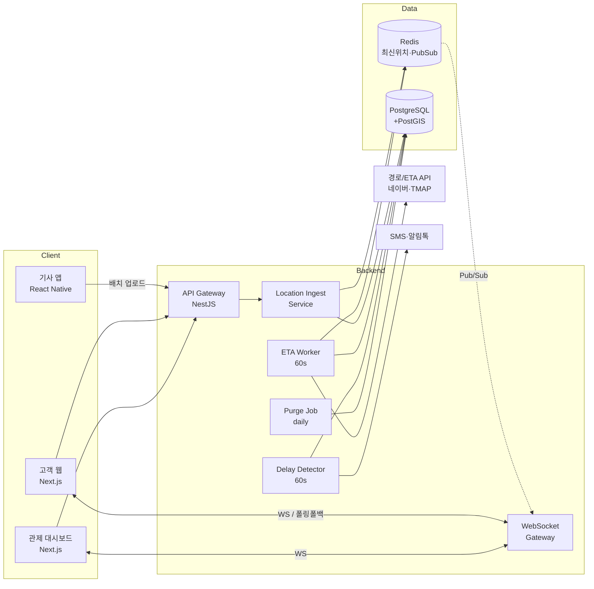
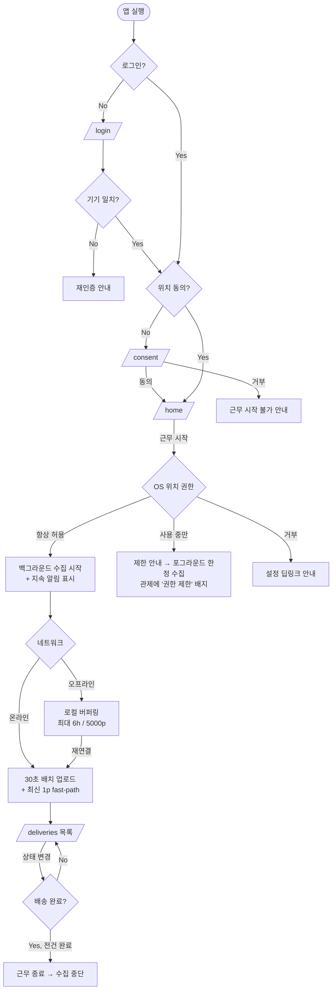
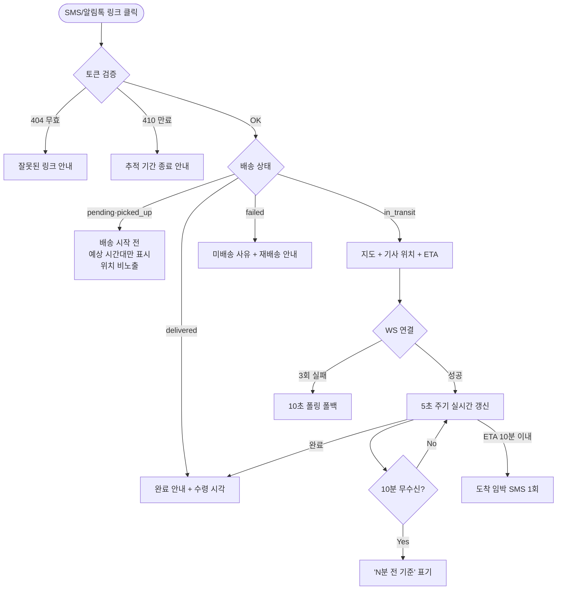
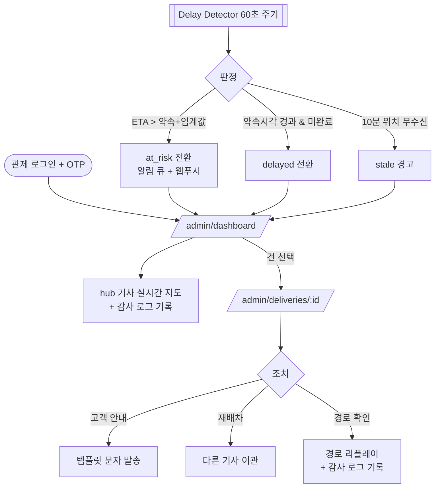

# 실시간 배송 추적 (Real-time Delivery Tracking) PRD

> **Version**: 1.0
> **Created**: 2026-08-04
> **Status**: Draft
> **Type**: product-feature
> **Scale Grade**: Startup

---

## 0. 전제 및 가정 (Assumptions)

작성 시점에 확정되지 않아 **기본값으로 가정한 항목**입니다. 사실과 다르면 해당 섹션을 먼저 수정해야 합니다.

| # | 가정 | 근거 / 영향 |
|---|------|------------|
| A-1 | 그린필드 프로젝트 (기존 코드베이스 없음) | 작업 디렉터리가 비어 있음. 스택은 §5.0 제안값 |
| A-2 | 국내(대한민국) 서비스, 단일 리전 | 지도/경로 API 및 위치정보법 적용 대상 |
| A-3 | 배송 건(주문)은 이미 외부/기존 시스템(TMS·WMS)에 존재하며, 본 기능은 이를 연동 | 주문 생성 자체는 Non-Goal (§1.3) |
| A-4 | Scale Grade = **Startup** (기사 300명 동시 근무, 일 배송 20,000건) | §4.0. Growth 이상이면 SLA·인프라 재설계 필요 |
| A-5 | 고객은 **앱 설치 없이** 웹 링크(SMS/카카오 알림톡)로 추적 | 고객용 네이티브 앱은 Non-Goal |
| A-6 | 기사는 회사 소속 또는 계약 기사이며, 근로계약/위탁계약에 위치 수집 동의 조항 포함 가능 | 미포함 시 §4.5 동의 플로우가 유일한 근거가 됨 |

---

## 1. Overview

### 1.1 Problem Statement

현재 배송 진행 상황은 기사의 수동 상태 변경(집화/배송중/완료)에만 의존한다. 그 결과:

- **고객**: "배송중" 이후 도착까지 정보가 없어 문의 전화(CS)가 집중된다. 부재로 인한 재배송이 발생한다.
- **관리자**: 지연이 발생해도 고객이 항의하기 전까지 인지하지 못한다. 사후 대응만 가능하다.
- **기사**: 위치·상황을 묻는 관제팀 전화에 운전 중 응대해야 해 안전·효율이 모두 떨어진다.

즉 **"배송이 지금 어디까지 왔는가"라는 단일 사실(single source of truth)이 시스템에 존재하지 않는다.**

### 1.2 Goals

| # | 목표 | 측정 지표 (§7 연결) |
|---|------|-------------------|
| G-1 | 고객이 담당 기사의 현재 위치와 도착 예정 시각(ETA)을 스스로 확인 | 추적 링크 오픈율 ≥ 40%, 배송 관련 CS 문의 30% 감소 |
| G-2 | 관리자가 지연을 **발생 전에** 감지 | 지연 건의 70% 이상을 약속시각 20분 전 감지 |
| G-3 | 기사에게 추가 조작 부담 없이 위치 수집 (백그라운드 자동) | 기사 1건당 추가 조작 0회, 근무 8시간 배터리 추가 소모 ≤ 15%p |
| G-4 | 위치정보 수집·이용의 법적 적법성 확보 | 동의 이력 100% 저장, 근무 시간 외 위치 수집 0건 |

### 1.3 Non-Goals (Out of Scope)

- **배차/경로 최적화 알고리즘** — 본 기능은 "추적"이며 "최적 순서 결정"은 별도 기능
- **주문/운송장 생성 및 정산** — 기존 TMS 연동으로 대체
- **고객용 네이티브 앱** — 웹 추적 페이지로 대응 (A-5)
- **기사 근태·성과 평가 지표 산출** — 위치 데이터의 인사평가 활용은 명시적으로 범위 밖 (§4.5 참고)
- **실시간 채팅(기사↔고객)** — Phase 3 이후 검토, 현 릴리스는 마스킹 통화만
- **해외 리전 / 다국어** — A-2

### 1.4 Scope

| 포함 | 제외 |
|------|------|
| 기사 앱 백그라운드 위치 수집 · 오프라인 버퍼링 | 기사 배차 순서 자동 최적화 |
| 고객용 웹 추적 페이지 (지도 + ETA + 상태 타임라인) | 고객 네이티브 앱, 푸시 |
| 관리자 관제 대시보드 (지연 감지 · 알림) | 정산 · 인사 평가 리포트 |
| 위치 동의 관리 및 보존/파기 정책 | 위치정보사업 인허가 신고 대행 (법무 트랙) |
| 배송 완료 후 경로 리플레이 (증빙용) | 실시간 영상/블랙박스 연동 |

---

## 2. User Stories

### 2.1 Primary Users

**기사 (driver)**
> As a 배송 기사, I want to 앱을 켜두기만 하면 위치가 자동 공유되기를, so that 운전 중 관제팀 전화를 받거나 앱을 조작하지 않아도 된다.

**고객 (customer)**
> As a 수령 고객, I want to 문자로 받은 링크에서 기사 위치와 도착 예정 시각을 보기를, so that 집을 비우지 않고 기다릴 수 있고 CS에 전화하지 않아도 된다.

**관제 담당자 (dispatcher)**
> As a 관제 담당자, I want to 약속 시각을 넘길 것으로 예측되는 배송 건을 자동으로 통보받기를, so that 고객이 항의하기 전에 선제적으로 안내하고 재배차할 수 있다.

### 2.2 Acceptance Criteria (Gherkin)

```gherkin
Scenario: AC-01 기사 근무 시작 시 위치 수집 개시
  Given 기사가 위치정보 수집에 동의했고 앱에 로그인한 상태이고
    And OS 위치 권한이 "항상 허용"으로 부여되어 있다
  When 기사가 "근무 시작" 버튼을 누른다
  Then 백그라운드 위치 수집이 시작되고
    And 앱 상단에 "위치 공유 중" 표시와 지속 알림(foreground notification)이 노출되며
    And 30초 이내에 서버에 첫 위치 포인트가 기록된다

Scenario: AC-02 기사 근무 종료 시 위치 수집 중단
  Given 기사가 근무 중이며 위치가 수집되고 있다
  When 기사가 "근무 종료"를 누르거나 마지막 배송 완료 후 30분이 경과한다
  Then 백그라운드 위치 수집이 즉시 중단되고
    And 이후 서버에 어떤 위치 포인트도 기록되지 않으며
    And 고객 추적 페이지의 기사 마커가 사라진다

Scenario: AC-03 네트워크 단절 구간의 위치 손실 방지
  Given 기사가 지하 주차장에 진입하여 네트워크가 끊겼다
  When 기사가 8분간 오프라인 상태로 이동한 뒤 네트워크에 재연결된다
  Then 오프라인 동안 로컬에 버퍼링된 위치 포인트가 원래 timestamp를 유지한 채 일괄 전송되고
    And 서버는 timestamp 기준으로 정렬·중복 제거하여 저장한다

Scenario: AC-04 고객의 실시간 위치 조회
  Given 고객이 유효한 추적 토큰이 담긴 링크를 받았고
    And 해당 배송 건의 상태가 "배송중"이다
  When 고객이 링크를 연다
  Then 지도에 기사의 현재 위치가 표시되고
    And 5초 이내 간격으로 마커 위치가 갱신되며
    And 도착 예정 시각(ETA)과 남은 정차 수가 함께 표시된다

Scenario: AC-05 배송중이 아닌 건의 위치 비공개
  Given 배송 건의 상태가 "집화 완료"(아직 배송 시작 전)이다
  When 고객이 추적 링크를 연다
  Then 기사 위치 마커는 표시되지 않고
    And "곧 배송이 시작됩니다" 안내와 예상 배송 시간대만 표시된다

Scenario: AC-06 추적 토큰 만료
  Given 배송이 완료된 지 72시간이 지났다
  When 고객이 기존 추적 링크를 연다
  Then 410 Gone 응답과 함께 "추적 기간이 종료되었습니다" 화면이 노출되고
    And 위치·주소 정보는 일절 표시되지 않는다

Scenario: AC-07 지연 위험 자동 감지
  Given 배송 건의 약속 도착 시각이 14:00이고
    And 지연 임계값이 "15분"으로 설정되어 있다
  When ETA 재계산 결과가 14:16 이후로 산출된다
  Then 해당 건의 상태가 "지연 위험(at_risk)"으로 전환되고
    And 관제 대시보드 상단 알림 큐에 즉시 노출되며
    And 담당 관제자에게 웹 푸시가 1회 발송된다

Scenario: AC-08 위치 신호 두절 감지
  Given 기사가 근무 중 상태이다
  When 서버가 해당 기사로부터 10분간 위치 포인트를 수신하지 못한다
  Then 기사 상태가 "신호 없음(stale)"으로 표시되고
    And 관제 대시보드에 경고가 노출되며
    And 고객 추적 페이지에는 마지막 확인 시각이 "N분 전 기준"으로 명시된다

Scenario: AC-09 위치 권한 거부 시 대체 플로우
  Given 기사가 OS 위치 권한을 "앱 사용 중에만 허용"으로 설정했다
  When 기사가 "근무 시작"을 누른다
  Then 백그라운드 추적 불가 안내와 설정 이동 버튼이 노출되고
    And 기사가 계속 진행을 선택하면 포그라운드 한정 수집으로 동작하며
    And 관제 대시보드에 해당 기사가 "권한 제한" 배지로 표시된다

Scenario: AC-10 위치 동의 철회
  Given 기사가 이전에 위치정보 수집에 동의했다
  When 기사가 설정에서 동의를 철회한다
  Then 즉시 위치 수집이 중단되고
    And 근무 시작 버튼이 비활성화되며
    And 철회 시각이 동의 이력에 기록된다
```

### 2.3 User Roles

| Role Key | 한국어 명칭 | 권한 범위 | 인증 방식 |
|----------|------------|----------|----------|
| `driver` | 배송 기사 | 본인 배송 건 read, 본인 위치 write, 본인 상태 update | 사번 + 비밀번호 → JWT (기기 바인딩) |
| `customer` | 수령 고객 | 토큰에 매핑된 **단일 배송 건**의 제한된 read만 | 서명된 추적 토큰 (비로그인) |
| `dispatcher` | 관제 담당자 | 담당 지점(hub)의 전체 배송/기사 read, 상태 update, 재배차 | 이메일 + 비밀번호 + OTP |
| `admin` | 시스템 관리자 | 전체 read/write, 지연 임계값·보존정책 설정, 감사 로그 열람 | 이메일 + 비밀번호 + OTP |

**규칙**
- 위 Role Key를 페이지 권한(§5.4)·API authorization·`/screen-spec` Audience의 **단일 키**로 사용한다.
- `dispatcher`는 소속 hub 범위로 **행 단위 제한**(RLS)한다. 전사 조회는 `admin`만 가능하다.
- `customer`는 계정이 아니라 **토큰 스코프**다. 토큰 1개 = 배송 건 1개.

---

## 3. Functional Requirements

### 3.1 기사 앱 (Driver)

| ID | Requirement | Priority | Dependencies |
|----|------------|----------|--------------|
| FR-001 | 기사 로그인 및 기기 바인딩(1계정 1기기, 기기 변경 시 재인증) | P0 | - |
| FR-002 | 위치정보 수집·이용 동의 화면 제공 및 동의/철회 이력 저장 | P0 | FR-001 |
| FR-003 | "근무 시작/종료" 토글로 위치 수집 라이프사이클 제어 | P0 | FR-002 |
| FR-004 | 백그라운드 위치 수집: 기본 5초 또는 30m 이동 시 샘플링 | P0 | FR-003 |
| FR-005 | 적응형 샘플링: 정지(속도 < 1km/h) 30초 간격, 주행 5초 간격으로 자동 전환 | P1 | FR-004 |
| FR-006 | 위치 배치 업로드: 최대 30초 또는 20포인트 단위로 묶어 전송 | P0 | FR-004 |
| FR-007 | 오프라인 버퍼링: 최대 6시간/5,000포인트 로컬 저장 후 재연결 시 순차 전송 | P0 | FR-006 |
| FR-008 | 위치 공유 중 상시 표시(포그라운드 서비스 알림 + 앱 내 인디케이터) | P0 | FR-003 |
| FR-009 | 당일 배송 목록 조회 및 배송 상태 변경(집화/배송중/완료/미배송) | P0 | FR-001 |
| FR-010 | 배송 완료 시 사진/서명 첨부 (증빙) | P2 | FR-009 |
| FR-011 | 위치 권한 미부여/제한 시 안내 및 설정 딥링크 제공 | P0 | FR-003 |
| FR-012 | 배터리 최적화 예외 요청 안내 (Android Doze / iOS Background) | P1 | FR-004 |

### 3.2 고객 추적 (Customer)

| ID | Requirement | Priority | Dependencies |
|----|------------|----------|--------------|
| FR-020 | 배송 시작 시 SMS/알림톡으로 추적 링크 자동 발송 | P0 | FR-009 |
| FR-021 | 서명된 추적 토큰으로 비로그인 접근 (배송완료 +72시간 만료) | P0 | FR-020 |
| FR-022 | 지도에 기사 현재 위치 + 배송지 마커 표시, 5초 주기 갱신 | P0 | FR-006, FR-021 |
| FR-023 | ETA(도착 예정 시각) 표시 및 1분 주기 재계산 | P0 | FR-022 |
| FR-024 | "남은 정차 N곳" 표시 (정확한 순서/타 고객 주소는 비노출) | P1 | FR-023 |
| FR-025 | 배송 상태 타임라인(집화 → 배송중 → 완료) 표시 | P0 | FR-021 |
| FR-026 | 배송중 상태가 아니면 기사 위치 비노출 (AC-05) | P0 | FR-022 |
| FR-027 | 기사와 마스킹 번호(050) 통화 버튼 | P1 | FR-021 |
| FR-028 | 도착 임박(반경 1km 또는 ETA 10분 이내) 시 SMS 1회 발송 | P1 | FR-023 |
| FR-029 | 부재/요청사항 메모 입력 (기사 앱에 전달) | P2 | FR-021 |

### 3.3 관제 대시보드 (Dispatcher / Admin)

| ID | Requirement | Priority | Dependencies |
|----|------------|----------|--------------|
| FR-040 | 담당 hub의 전체 기사 위치를 지도에 실시간 표시 (클러스터링) | P0 | FR-006 |
| FR-041 | 지연 위험(at_risk) 자동 판정 및 알림 큐 노출 | P0 | FR-023 |
| FR-042 | 지연 확정(delayed) 판정: 약속 시각 경과 + 미완료 | P0 | FR-041 |
| FR-043 | 위치 신호 두절(stale) 감지: 10분 무수신 시 경고 | P0 | FR-006 |
| FR-044 | 지연 임계값 설정 (기본 15분, hub별 조정 가능) | P1 | FR-041 |
| FR-045 | 배송 건 목록: 상태/기사/hub/지연여부 필터 및 정렬 | P0 | - |
| FR-046 | 배송 건 상세: 이동 경로 리플레이 (완료 건 포함) | P1 | FR-006 |
| FR-047 | 지연 건에 대한 고객 안내 문자 발송 (템플릿 선택) | P1 | FR-042 |
| FR-048 | 재배차: 배송 건을 다른 기사에게 이관 | P2 | FR-045 |
| FR-049 | 일별 지연율/정시배송률 리포트 | P2 | FR-042 |
| FR-050 | 위치 데이터 열람 감사 로그 (누가·언제·어느 기사 위치를 조회했는지) | P0 | FR-040 |

### 3.4 우선순위 요약

- **P0 (Must)**: FR-001~009, 011, 020~023, 025, 026, 040~043, 045, 050 → MVP 범위
- **P1 (Should)**: FR-005, 012, 024, 027, 028, 044, 046, 047
- **P2 (Could)**: FR-010, 029, 048, 049

---

## 4. Non-Functional Requirements

### 4.0 Scale Grade

**선택 등급: Startup** (A-4 가정. 확정 필요)

| 항목 | 값 | 산출 근거 |
|------|-----|----------|
| 기사 수 (전체 / 피크 동시 근무) | 500명 / 300명 | 물류 스타트업 초기 규모 |
| 일 배송 건수 | 20,000건 | 기사당 약 65건 |
| 고객 추적 페이지 DAU | 8,000 (오픈율 40% 가정) | 20,000 × 0.4 |
| 피크 동시 접속 (고객 + 관제) | 약 900 | 배송 피크 14~18시 집중 |
| 위치 수집 RPS (배치 후) | 약 10 RPS | 300명 ÷ 30초 배치 |
| 위치 포인트 생성량 | 약 2.2M/일 | 300명 × 12p/분 × 600분 |

> **경계 주의**: 기사 동시 근무가 1,000명을 넘거나 DAU가 10,000을 넘으면 **Growth 등급**으로 재산정해야 한다. 이 경우 위치 ingest를 메시지 큐(Kafka/SQS) 기반으로 전환하고 시계열 저장소를 분리해야 한다.

### 4.1 Performance SLA

| 지표 | 목표값 | 측정 방법 |
|------|--------|----------|
| 위치 업로드 API p95 | < 300ms | APM 서버 사이드 |
| 추적 페이지 최초 로딩(LCP) p95 | < 2.5s (4G 기준) | RUM |
| **위치 종단 지연** (기기 측정 → 고객 화면 반영) p95 | **< 8초** | 클라이언트 타임스탬프 diff |
| ETA 재계산 주기 | 60초 (수동 새로고침 시 즉시) | - |
| 관제 대시보드 100대 마커 렌더 | < 1s | FE 성능 측정 |
| 지연 판정 배치 주기 | 60초 | 스케줄러 로그 |
| 위치 조회 API p95 | < 200ms (Redis 캐시 히트) | APM |
| Throughput | 위치 write 30 RPS / read 200 RPS (피크의 3배 여유) | 부하 테스트 |

> **8초 종단 지연의 구성**: 샘플링 5s + 배치 대기 ≤30s가 최악이므로, **주행 중 최신 1포인트는 배치와 별개로 즉시 전송**하는 fast-path를 둔다(FR-006 구현 시 필수 조건).

### 4.2 Availability SLA

| 대상 | Uptime 목표 | 허용 다운타임(월) | 비고 |
|------|------------|-----------------|------|
| 위치 수집 API (write) | **99.9%** | 43.8분 | 손실 시 복구 불가 → 최우선 |
| 고객 추적 페이지 | 99.5% | 3.6시간 | 다운 시 CS 부담 급증 |
| 관제 대시보드 | 99% | 7.3시간 | 내부 사용자, 대체 수단 존재 |

> 위치 수집만 Startup 기본(99%)보다 한 단계 높게 잡는다. 클라이언트 버퍼링(FR-007)이 최대 6시간까지 방어하므로 실제 데이터 손실 리스크는 이보다 낮다.

### 4.3 Data Requirements

| 항목 | 값 |
|------|-----|
| 위치 포인트 raw (7일 hot) | 약 2.2M/일 × 64B ≈ 140MB/일 → **약 1.0GB** |
| 다운샘플 (1분 간격, 90일) | 약 12MB/일 → **약 1.0GB** |
| 배송 건 메타데이터 (1년) | 20,000건/일 × 2KB × 365 ≈ **15GB** |
| 합계 (1년차) | **약 17GB** |
| 월간 증가율 | 15% (기사 증원 반영) |

**보존 및 파기 정책 (필수)**

| 데이터 | 보존 기간 | 파기 방식 |
|--------|----------|----------|
| 위치 raw 포인트 | 7일 | 자동 삭제 (일 배치) |
| 위치 다운샘플 경로 | 90일 | 자동 삭제 (분쟁 대응 기간) |
| 배송 건 이력 (위치 제외) | 1년 | 아카이브 후 삭제 |
| 동의/철회 이력 | 3년 | 법적 증빙 목적 보관 |
| 위치 열람 감사 로그 | 3년 | 위치정보법상 기록 보존 |
| 추적 토큰 | 배송완료 +72시간 | 만료 후 무효화, 30일 후 레코드 삭제 |

> 파기 배치의 **실행 성공 여부를 모니터링 대상으로 지정**한다. 조용히 실패하면 규제 리스크가 누적된다.

### 4.4 Recovery

| 항목 | 목표 | 근거 |
|------|------|------|
| RTO | **4시간** | 배송 피크(14~18시) 내 복구 가능해야 함 |
| RPO | **5분** | 위치 데이터는 재현 불가. DB 이중화 + WAL 아카이빙 |
| 백업 주기 | 일 1회 full + 5분 WAL | |
| 복구 훈련 | 분기 1회 | |

**부분 장애 시 Degrade 전략** — 전면 장애보다 부분 성능 저하를 택한다.

| 장애 대상 | 대응 |
|----------|------|
| 외부 경로/ETA API 장애 | ETA를 "직선거리 ÷ 평균 25km/h" 근사치로 대체하고 "예상치" 배지 표시 |
| Redis 장애 | DB 직접 조회로 폴백 (갱신 주기 5초 → 20초로 완화) |
| WebSocket 게이트웨이 장애 | 클라이언트가 자동으로 10초 폴링으로 폴백 |
| 지도 SDK 장애 | 지도 없이 "ETA + 남은 거리 + 상태 타임라인" 텍스트 뷰 노출 |

### 4.5 Security & Privacy

**위치정보는 개인정보 중에서도 가중 보호 대상이다. 아래는 협상 대상이 아니다.**

| 영역 | 요구사항 |
|------|---------|
| **법적 근거** | 위치정보의 보호 및 이용 등에 관한 법률상 **위치기반서비스사업 신고** 필요 여부를 법무 검토로 확정 (개발 착수와 병렬 진행, 출시 전 완료). 기사 = 개인위치정보주체 |
| **동의** | 수집 항목·목적·보유기간을 명시한 별도 동의 (FR-002). 동의 없이 근무 시작 불가. 철회는 앱 내 2탭 이내 (AC-10) |
| **수집 최소화** | 근무 시작~종료 구간에서만 수집. 근무 외 시간 수집 0건은 **테스트로 검증**한다 (G-4) |
| **목적 제한** | 위치 데이터를 인사평가·징계 근거로 사용하지 않음을 정책에 명시 (§1.3) |
| Authentication | `driver`: JWT(access 30분 / refresh 14일) + 기기 바인딩. `dispatcher`/`admin`: 비밀번호 + OTP 필수 |
| Authorization | 배송 건·기사에 대한 모든 접근은 hub 범위 RLS로 DB 레벨에서 강제. 애플리케이션 레벨 체크만으로 끝내지 않는다 |
| **추적 토큰** | 추측 불가한 랜덤 128bit(순번·운송장번호 파생 금지), 서버 서명, 단일 배송 건 스코프, 만료 강제. IP당 분당 30회 rate limit |
| **고객 노출 최소화** | 고객에게 기사 **실명·연락처·차량번호 비노출**(성씨 + 마스킹 번호만). 다른 배송지 좌표·주소 절대 비노출 (FR-024) |
| Encryption | 전송 구간 TLS 1.3 강제(HSTS). 저장 시 AES-256(디스크). 고객 주소·연락처는 컬럼 단위 암호화 |
| 감사 로그 | 위치 데이터 조회를 **모두** 기록 (FR-050). 조회자·시각·대상 기사·사유 |
| 클라이언트 보안 | 기사 앱 루팅/탈옥 탐지 시 경고, 위치 Mock 앱 사용 탐지(`isFromMockProvider`) 시 서버 플래그 |
| 취약점 대응 | 출시 전 OWASP MASVS L1 + API Top 10 점검 |

**위치 조작(스푸핑) 리스크** — 기사가 Mock Location으로 허위 배송 완료를 만들 수 있다. MVP는 탐지·플래깅까지만 하고 차단은 Phase 3에서 다룬다. 플래그된 건은 관제 대시보드에 별도 표기한다.

### 4.6 Quality

| 항목 | 기준 |
|------|------|
| 테스트 커버리지 | 위치 파이프라인(수집→저장→조회) 라인 커버리지 ≥ 80%, 그 외 ≥ 60% |
| 필수 통합 테스트 | 오프라인 버퍼링 복구(AC-03), 근무 종료 후 수집 중단(AC-02), 토큰 만료(AC-06), 권한 경계(`customer`가 타 배송 건 조회 차단) |
| 필수 실기기 테스트 | iOS/Android 각 2기종 이상에서 8시간 연속 백그라운드 수집 — 배터리 소모 및 OS 프로세스 종료 여부 측정 |
| 부하 테스트 | 피크 3배(위치 write 30 RPS, 동시 WS 3,000) 30분 유지 |
| 모니터링 | 위치 수신 지연, 기사별 신호 두절 수, 파기 배치 성공률, ETA API 실패율에 알림 설정 |

---

## 5. Technical Design

### 5.0 제안 스택 (그린필드, A-1)

| 레이어 | 선택 | 이유 |
|--------|------|------|
| 기사 앱 | React Native (Expo Dev Client) | 크로스 플랫폼. 단 백그라운드 위치는 네이티브 모듈 필요 → Bare/Dev Client 필수, Expo Go 불가 |
| 백그라운드 위치 | `react-native-background-geolocation` 또는 `expo-location` + `expo-task-manager` | 적응형 샘플링·오프라인 버퍼링 내장 여부가 선택 기준. 전자는 유료지만 FR-005/007을 직접 구현하는 비용보다 저렴 |
| 고객 추적 페이지 | Next.js (App Router) SSR | 앱 설치 불필요, SMS 링크에서 즉시 열림, SEO 불필요하나 초기 로딩 유리 |
| 관제 대시보드 | Next.js | 스택 통일 |
| 지도 | 네이버 지도 SDK (모바일/웹) | 국내 주소·경로 정확도 (A-2). 대안: 카카오맵 |
| 경로/ETA | 네이버 Directions 5 또는 TMAP API | 실시간 교통 반영 필수 |
| API 서버 | NestJS (Node 22, TypeScript) | 프론트와 언어 통일, WebSocket 게이트웨이 내장 |
| DB | PostgreSQL 16 + PostGIS | 지리 인덱스(GiST) 필요. 시계열은 파티셔닝으로 대응 |
| 캐시/실시간 | Redis 7 (최신 위치 + Pub/Sub) | 최신 위치 조회는 DB를 타지 않는다 |
| 실시간 전송 | WebSocket (Socket.IO) + 폴링 폴백 | §4.4 Degrade |
| 알림 | SMS/알림톡 (NHN Cloud 등), 웹 푸시 | |
| 인프라 | 단일 리전 컨테이너 (ECS/Cloud Run) + 관리형 Postgres | Startup 등급에 적정 |

### 5.1 API Specification

Base URL: `https://api.{domain}/v1`
인증: `Authorization: Bearer <JWT>` (단, 고객 추적 API는 토큰 경로 파라미터)

---

#### `POST /v1/driver/shifts/start`
- **Description**: 근무 시작. 위치 수집 세션을 개시한다.
- **Auth**: Required (`driver`)
- **Request**
  ```json
  {
    "deviceId": "string, required",
    "consentVersion": "string, required, 예: '1.2'",
    "locationPermission": "always | whenInUse, required"
  }
  ```
- **Response 201**
  ```json
  {
    "shiftId": "uuid",
    "startedAt": "2026-08-04T09:00:00+09:00",
    "samplingPolicy": { "movingIntervalSec": 5, "idleIntervalSec": 30, "distanceFilterM": 30 },
    "uploadPolicy": { "batchIntervalSec": 30, "maxBatchSize": 20 }
  }
  ```
- **Errors**
  | Status | Code | 조건 |
  |--------|------|------|
  | 400 | `INVALID_INPUT` | 필수 필드 누락 |
  | 403 | `CONSENT_REQUIRED` | 위치 동의 없음 또는 최신 버전 미동의 |
  | 409 | `SHIFT_ALREADY_ACTIVE` | 이미 진행 중인 근무 존재 |
  | 409 | `DEVICE_MISMATCH` | 등록된 기기와 불일치 (재인증 필요) |

---

#### `POST /v1/driver/shifts/{shiftId}/end`
- **Description**: 근무 종료. 위치 수집을 중단한다 (AC-02).
- **Auth**: Required (`driver`)
- **Request**: `{ "reason": "manual | auto_idle, required" }`
- **Response 200**: `{ "shiftId": "uuid", "endedAt": "ISO8601", "totalPoints": 4210 }`
- **Errors**: 404 `SHIFT_NOT_FOUND` / 409 `SHIFT_ALREADY_ENDED`

---

#### `POST /v1/driver/locations`
- **Description**: 위치 포인트 배치 업로드 (FR-006). **멱등**하며 클라이언트 timestamp를 신뢰 기준으로 삼는다.
- **Auth**: Required (`driver`)
- **Headers**: `Idempotency-Key: <uuid>` (required)
- **Request**
  ```json
  {
    "shiftId": "uuid, required",
    "points": [
      {
        "lat": 37.5665,          // required, -90~90
        "lng": 126.9780,         // required, -180~180
        "accuracyM": 12.5,       // required, 0 이상
        "speedKmh": 34.2,        // optional
        "heading": 187.0,        // optional, 0~360
        "batteryLevel": 0.62,    // optional, 0~1
        "isMocked": false,       // required (Android), iOS는 false 고정
        "recordedAt": "2026-08-04T14:03:11.220+09:00"  // required
      }
    ]
  }
  ```
- **제약**: `points` 1~50개. `recordedAt`이 현재보다 미래이거나 6시간 이전이면 해당 포인트만 드롭(전체 실패 아님).
- **Response 202**
  ```json
  { "accepted": 18, "dropped": 2, "dropReasons": { "STALE": 1, "LOW_ACCURACY": 1 }, "serverTime": "ISO8601" }
  ```
- **Errors**
  | Status | Code | 조건 |
  |--------|------|------|
  | 400 | `INVALID_COORDINATE` | 좌표 범위 초과 |
  | 401 | `UNAUTHORIZED` | 토큰 만료/무효 |
  | 409 | `SHIFT_NOT_ACTIVE` | 종료된 근무에 업로드 시도 → 클라이언트는 버퍼 폐기 |
  | 413 | `BATCH_TOO_LARGE` | 50개 초과 |
  | 429 | `RATE_LIMITED` | 기사당 분당 10회 초과 |

> `accuracyM > 100`인 포인트는 저장하되 `low_quality` 플래그를 부여하고 ETA 계산에서 제외한다.

---

#### `GET /v1/driver/deliveries?date=YYYY-MM-DD`
- **Description**: 당일 배송 목록 (FR-009)
- **Auth**: Required (`driver`)
- **Response 200**
  ```json
  {
    "date": "2026-08-04",
    "summary": { "total": 65, "completed": 22, "pending": 41, "failed": 2 },
    "deliveries": [
      {
        "id": "uuid",
        "sequence": 23,
        "trackingNo": "1234-5678-9012",
        "status": "in_transit",
        "recipientName": "김*수",
        "address": "서울시 강남구 ...",
        "maskedPhone": "050-1234-5678",
        "promisedAt": "2026-08-04T14:00:00+09:00",
        "memo": "부재 시 경비실"
      }
    ]
  }
  ```
- **Errors**: 401 `UNAUTHORIZED` / 400 `INVALID_DATE`

---

#### `PATCH /v1/driver/deliveries/{id}/status`
- **Description**: 배송 상태 변경 (FR-009)
- **Auth**: Required (`driver`, 본인 배정 건만)
- **Request**
  ```json
  {
    "status": "picked_up | in_transit | delivered | failed",  // required
    "failReason": "absent | refused | wrong_address | other",  // status=failed 시 required
    "proofImageUrl": "string, optional",
    "occurredAt": "ISO8601, required"
  }
  ```
- **Response 200**: `{ "id": "uuid", "status": "delivered", "updatedAt": "ISO8601" }`
- **Errors**
  | Status | Code | 조건 |
  |--------|------|------|
  | 403 | `NOT_ASSIGNED` | 본인 배정 건 아님 |
  | 409 | `INVALID_TRANSITION` | 허용되지 않은 상태 전이 (예: delivered → in_transit) |
  | 422 | `FAIL_REASON_REQUIRED` | failed인데 사유 없음 |

---

#### `GET /v1/track/{token}`
- **Description**: 고객 추적 정보 조회 (FR-021~026). **비로그인.**
- **Auth**: None (서명 토큰 검증)
- **Rate limit**: IP당 분당 30회
- **Response 200** (status = `in_transit`)
  ```json
  {
    "status": "in_transit",
    "trackingNo": "1234-****-9012",
    "driver": { "displayName": "김 기사", "maskedPhone": "050-1234-5678" },
    "currentLocation": { "lat": 37.5651, "lng": 126.9895, "recordedAt": "ISO8601", "stale": false },
    "destination": { "lat": 37.5700, "lng": 126.9920, "address": "서울시 중구 ..." },
    "eta": { "arrivalAt": "2026-08-04T14:12:00+09:00", "confidence": "high", "isEstimate": false },
    "remainingStops": 3,
    "timeline": [
      { "status": "picked_up", "at": "2026-08-04T09:12:00+09:00" },
      { "status": "in_transit", "at": "2026-08-04T13:40:00+09:00" }
    ]
  }
  ```
- **Response 200** (status ≠ `in_transit`, AC-05): `currentLocation`, `driver`, `eta`, `remainingStops` 필드가 **모두 생략**된다. 클라이언트는 필드 부재를 정상 케이스로 처리해야 한다.
- **Errors**
  | Status | Code | 조건 |
  |--------|------|------|
  | 404 | `INVALID_TOKEN` | 서명 불일치 또는 존재하지 않음 |
  | 410 | `TOKEN_EXPIRED` | 배송완료 +72시간 경과 (AC-06) |
  | 429 | `RATE_LIMITED` | 스크래핑 방지 |

---

#### `WS /v1/track/{token}/stream`
- **Description**: 고객 화면 실시간 위치 스트림 (FR-022)
- **Auth**: 연결 시 토큰 검증. 배송 상태가 `in_transit`이 아니면 연결 즉시 종료.
- **Server → Client 이벤트**
  ```jsonc
  // location.updated (최대 5초 주기)
  { "type": "location.updated", "lat": 37.5651, "lng": 126.9895, "heading": 187, "recordedAt": "ISO8601" }
  // eta.updated (60초 주기)
  { "type": "eta.updated", "arrivalAt": "ISO8601", "confidence": "high|low", "isEstimate": false }
  // status.changed
  { "type": "status.changed", "status": "delivered", "at": "ISO8601" }
  // stale (AC-08)
  { "type": "location.stale", "lastSeenAt": "ISO8601" }
  ```
- **Close codes**: `4401` 토큰 무효 / `4410` 만료 / `4409` 배송 종료(정상 종료, 재연결 금지)
- **폴백**: 연결 실패 3회 시 `GET /v1/track/{token}` 10초 폴링으로 전환 (§4.4)

---

#### `GET /v1/dispatch/deliveries`
- **Description**: 관제 배송 목록 (FR-045)
- **Auth**: Required (`dispatcher` — 소속 hub만 / `admin` — 전체)
- **Query**: `hubId`, `status`, `delayStatus` (`on_time|at_risk|delayed`), `driverId`, `from`, `to`, `cursor`, `limit`(기본 50, 최대 200)
- **Response 200**
  ```json
  {
    "summary": { "total": 1820, "onTime": 1650, "atRisk": 120, "delayed": 50 },
    "items": [
      {
        "id": "uuid", "trackingNo": "...", "status": "in_transit",
        "delayStatus": "at_risk", "delayMinutes": 18,
        "driver": { "id": "uuid", "name": "김철수", "signalStale": false },
        "promisedAt": "ISO8601", "etaAt": "ISO8601"
      }
    ],
    "nextCursor": "opaque-string"
  }
  ```
- **Errors**: 403 `HUB_FORBIDDEN` (타 hub 조회 시도) / 400 `INVALID_FILTER`

---

#### `GET /v1/dispatch/drivers/live`
- **Description**: 기사 실시간 위치 일괄 조회 (FR-040). Redis 캐시 기반.
- **Auth**: Required (`dispatcher`, `admin`)
- **Query**: `hubId` (required), `bbox` (지도 뷰포트, `minLng,minLat,maxLng,maxLat`)
- **Response 200**
  ```json
  {
    "drivers": [
      { "id": "uuid", "name": "김철수", "lat": 37.56, "lng": 126.97,
        "recordedAt": "ISO8601", "signalStale": false, "batteryLevel": 0.42,
        "remainingCount": 12, "atRiskCount": 2, "mockSuspected": false }
    ],
    "serverTime": "ISO8601"
  }
  ```
- **부수 효과**: 이 호출은 **감사 로그를 남긴다** (FR-050).
- **Errors**: 403 `HUB_FORBIDDEN` / 400 `BBOX_REQUIRED` (기사 200명 초과 시 bbox 필수)

---

#### `GET /v1/dispatch/deliveries/{id}/route`
- **Description**: 경로 리플레이 (FR-046). 다운샘플 데이터 사용.
- **Auth**: Required (`dispatcher`, `admin`)
- **Query**: `resolution` (`raw|minute`, 기본 `minute`). `raw`는 7일 이내만 유효.
- **Response 200**: `{ "points": [{ "lat": 37.56, "lng": 126.97, "at": "ISO8601" }], "resolution": "minute", "truncated": false }`
- **Errors**: 404 `NOT_FOUND` / 410 `DATA_PURGED` (보존기간 경과, §4.3)

---

#### `PUT /v1/admin/settings/delay-threshold`
- **Description**: 지연 임계값 설정 (FR-044)
- **Auth**: Required (`admin`)
- **Request**: `{ "hubId": "uuid | null (null=전사 기본값)", "atRiskMinutes": 15, "staleMinutes": 10 }`
- **Response 200**: `{ "hubId": "...", "atRiskMinutes": 15, "staleMinutes": 10, "updatedAt": "ISO8601" }`
- **Errors**: 400 `INVALID_RANGE` (1~120분 범위 밖) / 403 `FORBIDDEN`

---

**공통 에러 응답 포맷**
```json
{ "error": { "code": "INVALID_INPUT", "message": "사람이 읽을 수 있는 설명", "field": "points[3].lat", "traceId": "..." } }
```

### 5.2 Database Schema

```sql
-- 기사
CREATE TABLE drivers (
  id            UUID PRIMARY KEY DEFAULT gen_random_uuid(),
  employee_no   VARCHAR(32) UNIQUE NOT NULL,
  name          VARCHAR(64) NOT NULL,
  phone_enc     BYTEA NOT NULL,               -- 컬럼 단위 암호화
  hub_id        UUID NOT NULL REFERENCES hubs(id),
  device_id     VARCHAR(128),                 -- 기기 바인딩 (FR-001)
  status        VARCHAR(16) NOT NULL DEFAULT 'active',  -- active|inactive
  created_at    TIMESTAMPTZ NOT NULL DEFAULT now()
);

-- 위치 동의 이력 (§4.5, 3년 보존)
CREATE TABLE location_consents (
  id            UUID PRIMARY KEY DEFAULT gen_random_uuid(),
  driver_id     UUID NOT NULL REFERENCES drivers(id),
  consent_version VARCHAR(16) NOT NULL,
  action        VARCHAR(16) NOT NULL,         -- granted|revoked
  acted_at      TIMESTAMPTZ NOT NULL DEFAULT now(),
  ip            INET,
  user_agent    TEXT
);
CREATE INDEX idx_consents_driver ON location_consents(driver_id, acted_at DESC);

-- 근무 세션 (위치 수집 라이프사이클의 단일 근거)
CREATE TABLE shifts (
  id            UUID PRIMARY KEY DEFAULT gen_random_uuid(),
  driver_id     UUID NOT NULL REFERENCES drivers(id),
  started_at    TIMESTAMPTZ NOT NULL DEFAULT now(),
  ended_at      TIMESTAMPTZ,
  end_reason    VARCHAR(16),                  -- manual|auto_idle|forced
  location_permission VARCHAR(16) NOT NULL,   -- always|whenInUse
  CONSTRAINT chk_shift_range CHECK (ended_at IS NULL OR ended_at >= started_at)
);
-- 기사당 활성 근무는 1개만
CREATE UNIQUE INDEX idx_one_active_shift ON shifts(driver_id) WHERE ended_at IS NULL;

-- 위치 포인트 (일 단위 파티셔닝, 7일 후 파티션 DROP)
CREATE TABLE location_points (
  id            BIGSERIAL,
  shift_id      UUID NOT NULL,
  driver_id     UUID NOT NULL,
  geom          GEOGRAPHY(POINT, 4326) NOT NULL,
  accuracy_m    REAL NOT NULL,
  speed_kmh     REAL,
  heading       REAL,
  battery_level REAL,
  is_mocked     BOOLEAN NOT NULL DEFAULT false,
  low_quality   BOOLEAN NOT NULL DEFAULT false,   -- accuracy_m > 100
  recorded_at   TIMESTAMPTZ NOT NULL,
  received_at   TIMESTAMPTZ NOT NULL DEFAULT now(),
  PRIMARY KEY (id, recorded_at)
) PARTITION BY RANGE (recorded_at);
-- 중복 제거: 동일 근무·동일 시각은 1건 (AC-03 재전송 대비)
CREATE UNIQUE INDEX idx_points_dedup ON location_points(shift_id, recorded_at);
CREATE INDEX idx_points_driver_time ON location_points(driver_id, recorded_at DESC);
CREATE INDEX idx_points_geom ON location_points USING GIST(geom);

-- 다운샘플 경로 (90일 보존, 리플레이용)
CREATE TABLE route_snapshots (
  delivery_id   UUID NOT NULL,
  driver_id     UUID NOT NULL,
  minute_bucket TIMESTAMPTZ NOT NULL,
  geom          GEOGRAPHY(POINT, 4326) NOT NULL,
  PRIMARY KEY (delivery_id, minute_bucket)
);

-- 배송 건
CREATE TABLE deliveries (
  id             UUID PRIMARY KEY DEFAULT gen_random_uuid(),
  tracking_no    VARCHAR(32) UNIQUE NOT NULL,
  hub_id         UUID NOT NULL REFERENCES hubs(id),
  driver_id      UUID REFERENCES drivers(id),
  sequence       INT,
  status         VARCHAR(16) NOT NULL DEFAULT 'pending',
                 -- pending|picked_up|in_transit|delivered|failed
  delay_status   VARCHAR(16) NOT NULL DEFAULT 'on_time',
                 -- on_time|at_risk|delayed
  recipient_name VARCHAR(64) NOT NULL,
  recipient_phone_enc BYTEA NOT NULL,
  address_enc    BYTEA NOT NULL,
  dest_geom      GEOGRAPHY(POINT, 4326) NOT NULL,
  promised_at    TIMESTAMPTZ NOT NULL,
  eta_at         TIMESTAMPTZ,
  eta_confidence VARCHAR(8),                   -- high|low
  eta_updated_at TIMESTAMPTZ,
  delivered_at   TIMESTAMPTZ,
  fail_reason    VARCHAR(32),
  created_at     TIMESTAMPTZ NOT NULL DEFAULT now()
);
CREATE INDEX idx_deliveries_dispatch ON deliveries(hub_id, delay_status, status);
CREATE INDEX idx_deliveries_driver_day ON deliveries(driver_id, promised_at);

-- 추적 토큰 (배송완료 +72h 만료)
CREATE TABLE tracking_tokens (
  token_hash    BYTEA PRIMARY KEY,             -- 평문 저장 금지
  delivery_id   UUID NOT NULL UNIQUE REFERENCES deliveries(id),
  expires_at    TIMESTAMPTZ NOT NULL,
  revoked_at    TIMESTAMPTZ,
  created_at    TIMESTAMPTZ NOT NULL DEFAULT now()
);
CREATE INDEX idx_tokens_expiry ON tracking_tokens(expires_at);

-- 위치 열람 감사 로그 (FR-050, 3년 보존)
CREATE TABLE location_access_logs (
  id            BIGSERIAL PRIMARY KEY,
  actor_id      UUID NOT NULL,
  actor_role    VARCHAR(16) NOT NULL,          -- dispatcher|admin
  target_driver_id UUID,
  target_delivery_id UUID,
  action        VARCHAR(32) NOT NULL,          -- live_view|route_replay|export
  accessed_at   TIMESTAMPTZ NOT NULL DEFAULT now(),
  ip            INET
);
CREATE INDEX idx_access_logs_time ON location_access_logs(accessed_at DESC);

-- 지연 임계값 설정 (hub_id NULL = 전사 기본값)
CREATE TABLE delay_settings (
  hub_id          UUID UNIQUE,
  at_risk_minutes INT NOT NULL DEFAULT 15,
  stale_minutes   INT NOT NULL DEFAULT 10,
  updated_at      TIMESTAMPTZ NOT NULL DEFAULT now(),
  updated_by      UUID
);
```

**Redis 키 설계**

| 키 | 값 | TTL | 용도 |
|----|-----|-----|------|
| `driver:{id}:last` | `{lat,lng,heading,recordedAt,battery}` | 15분 | 최신 위치 조회 (DB 우회) |
| `hub:{id}:drivers` | GEO set | - | 뷰포트 조회 (`GEOSEARCH`) |
| `delivery:{id}:eta` | `{arrivalAt,confidence}` | 90초 | ETA 캐시 |
| `channel:delivery:{id}` | Pub/Sub | - | WS 브로드캐스트 |
| `idem:{key}` | `1` | 10분 | 업로드 멱등성 |

### 5.3 Architecture



**위치 데이터 흐름 (핵심 경로)**

1. 앱이 5초 간격 샘플링 → 로컬 SQLite 버퍼 적재
2. 30초마다(또는 20포인트) 배치 업로드. **주행 중 최신 1포인트는 fast-path로 즉시 전송** (§4.1)
3. Ingest 서비스가 검증(좌표 범위/정확도/시간) → Redis 최신 위치 갱신 + Postgres 비동기 적재
4. Redis Pub/Sub → WebSocket 게이트웨이 → 해당 배송 건 구독 중인 고객·관제 화면
5. ETA Worker가 60초마다 `in_transit` 건에 대해 외부 경로 API 호출 → `deliveries.eta_at` 갱신
6. Delay Detector가 60초마다 `eta_at > promised_at + at_risk_minutes` 인 건을 `at_risk`로 전환 → 알림

**지연 판정 로직 (FR-041, FR-042)**

| 상태 | 조건 |
|------|------|
| `on_time` | `eta_at ≤ promised_at + threshold` |
| `at_risk` | `eta_at > promised_at + threshold` **AND** 아직 `promised_at` 미경과 |
| `delayed` | `now > promised_at` **AND** status ∉ {delivered, failed} |

> ETA를 얻을 수 없는 경우(외부 API 장애, 신호 두절)에는 `at_risk` 판정을 **보류하지 않고** 근사 ETA로 판정하되 `eta_confidence = low`로 표기한다. 판정 누락이 오탐보다 비싸다.

### 5.4 Pages

| Route | Surface | Audience | Auth | Linked FRs | Has FE Components | Primary State | Responsive |
|-------|---------|----------|------|-----------|-------------------|---------------|-----------|
| `/login` | 기사앱 | `driver` | None | FR-001 | Yes | success / error | Mobile only |
| `/consent` | 기사앱 | `driver` | Required | FR-002 | Yes | success | Mobile only |
| `/home` | 기사앱 | `driver` | Required | FR-003, FR-008, FR-011 | Yes | success / error | Mobile only |
| `/deliveries` | 기사앱 | `driver` | Required | FR-009 | Yes | loading / empty / success | Mobile only |
| `/deliveries/:id` | 기사앱 | `driver` | Required | FR-009, FR-010 | Yes | loading / error / success | Mobile only |
| `/settings` | 기사앱 | `driver` | Required | FR-002, FR-012 | Yes | success | Mobile only |
| `/t/:token` | 고객웹 | `customer` | None (토큰) | FR-021~028 | Yes | loading / error / success | Mobile 우선 / Desktop |
| `/admin/login` | 관제웹 | `dispatcher`, `admin` | None | - | Yes | success / error | Desktop only |
| `/admin/dashboard` | 관제웹 | `dispatcher`, `admin` | Required | FR-040~043 | Yes | loading / empty / success | Desktop only |
| `/admin/deliveries` | 관제웹 | `dispatcher`, `admin` | Required | FR-045, FR-047 | Yes | loading / empty / success | Desktop only |
| `/admin/deliveries/:id` | 관제웹 | `dispatcher`, `admin` | Required | FR-046, FR-048 | Yes | loading / error / success | Desktop only |
| `/admin/drivers` | 관제웹 | `dispatcher`, `admin` | Required | FR-040, FR-043 | Yes | loading / empty / success | Desktop only |
| `/admin/settings` | 관제웹 | `admin` | Required | FR-044 | Yes | success / no-permission | Desktop only |
| `/admin/audit` | 관제웹 | `admin` | Required | FR-050 | Yes | loading / empty / success | Desktop only |
| `/v1/*` | API | - | Required | 전체 | **No** | - | - |

### 5.4.1 Page State Matrix

| Route | loading | empty | error | success | no-permission | 비고 |
|-------|---------|-------|-------|---------|---------------|------|
| `/login` | ✓ | - | ✓ | ✓ | - | 기기 불일치 시 error에 재인증 안내 |
| `/consent` | - | - | ✓ | ✓ | - | 미동의 상태로 이탈 시도 시 확인 다이얼로그 |
| `/home` | ✓ | - | ✓ | ✓ | ✓ | 위치 권한 미부여 → no-permission + 설정 딥링크 (AC-09) |
| `/deliveries` | ✓ | ✓ | ✓ | ✓ | - | empty: "오늘 배정된 배송이 없습니다" |
| `/deliveries/:id` | ✓ | - | ✓ | ✓ | ✓ | 타 기사 배정 건 접근 → no-permission |
| `/settings` | ✓ | - | ✓ | ✓ | - | 동의 철회 시 경고 다이얼로그 |
| `/t/:token` | ✓ | ✓ | ✓ | ✓ | ✓ | empty: 배송 시작 전(AC-05) · error: 410 만료(AC-06) · no-permission: 404 무효 토큰 |
| `/admin/dashboard` | ✓ | ✓ | ✓ | ✓ | ✓ | empty: 근무 중 기사 0명 · 지도 SDK 실패 시 텍스트 뷰 폴백 |
| `/admin/deliveries` | ✓ | ✓ | ✓ | ✓ | ✓ | empty: 필터 결과 0건 → 필터 초기화 CTA |
| `/admin/deliveries/:id` | ✓ | ✓ | ✓ | ✓ | ✓ | empty: 경로 데이터 파기됨(410 DATA_PURGED) |
| `/admin/drivers` | ✓ | ✓ | ✓ | ✓ | ✓ | stale 기사는 회색 마커 + "N분 전" 배지 |
| `/admin/settings` | ✓ | - | ✓ | ✓ | ✓ | `dispatcher` 접근 시 no-permission |
| `/admin/audit` | ✓ | ✓ | ✓ | ✓ | ✓ | `admin` 전용 |

**상태 정의**: `loading` fetch 중 / `empty` 정상 응답 0건 / `error` 4xx·5xx 또는 클라이언트 검증 실패 / `success` 정상 + 결과 ≥1건 / `no-permission` 인증됐으나 권한 부족.

> 체크된 상태마다 `/screen-spec` 단계에서 마이크로카피 1줄 이상을 명시해야 한다. 특히 `/t/:token`의 3가지 실패 상태(만료·무효·배송전)는 **고객이 보는 유일한 화면**이므로 문구를 별도 검토한다.

### 5.5 User Flow

**Flow A: 기사 — 근무 시작부터 위치 공유까지**



**Flow B: 고객 — 추적 링크 진입**



**Flow C: 관제 — 지연 감지 및 대응**



---

## 6. Implementation Phases

### Phase 1: MVP — 위치 파이프라인 (4주)
- [ ] 인프라·스키마 구축 (PostGIS 파티셔닝, Redis, 파기 배치 스켈레톤)
- [ ] 기사 인증 + 기기 바인딩 (FR-001)
- [ ] 위치 동의 화면 및 이력 저장 (FR-002)
- [ ] 근무 시작/종료 API + 앱 토글 (FR-003)
- [ ] 백그라운드 위치 수집 · 배치 업로드 · 오프라인 버퍼링 (FR-004, 006, 007)
- [ ] 위치 Ingest 서비스 (검증·중복제거·Redis 갱신)
- [ ] 위치 공유 상시 표시 + 권한 미부여 플로우 (FR-008, FR-011)
- [ ] **실기기 8시간 배터리 테스트** (§4.6) — 이 결과로 샘플링 정책 확정

**Deliverable**: 기사 앱이 근무 중 위치를 안정적으로 서버에 적재. 관제에서 raw 데이터 확인 가능.

> **게이트**: 배터리 소모가 8시간 15%p를 초과하면 Phase 2 진입 전에 샘플링 정책(FR-005)을 먼저 구현한다.

### Phase 2: 고객 추적 (3주)
- [ ] 추적 토큰 발급·검증·만료 (FR-021)
- [ ] SMS/알림톡 링크 발송 (FR-020)
- [ ] 추적 페이지: 지도 + 마커 + 타임라인 (FR-022, FR-025)
- [ ] WebSocket 스트림 + 폴링 폴백 (FR-022)
- [ ] ETA Worker + 외부 경로 API 연동 (FR-023)
- [ ] 배송중 아닐 때 위치 비노출 처리 (FR-026)
- [ ] 부하 테스트 (동시 WS 3,000)

**Deliverable**: 고객이 링크로 실시간 위치·ETA 확인. CS 문의 감소 측정 시작.

### Phase 3: 관제 대시보드 (3주)
- [ ] 기사 실시간 지도 + 클러스터링 (FR-040)
- [ ] 지연 판정 Detector + 알림 (FR-041, FR-042)
- [ ] 신호 두절 감지 (FR-043)
- [ ] 배송 목록 필터/정렬 (FR-045)
- [ ] 위치 열람 감사 로그 (FR-050)
- [ ] hub 단위 RLS 및 권한 경계 테스트

**Deliverable**: 관제가 지연을 사전 감지하고 대응. G-2 지표 측정 시작.

### Phase 4: 최적화 및 확장 (3주)
- [ ] 적응형 샘플링 (FR-005), 배터리 최적화 안내 (FR-012)
- [ ] 남은 정차 수 표시 (FR-024), 마스킹 통화 (FR-027), 도착 임박 알림 (FR-028)
- [ ] 지연 임계값 설정 (FR-044), 경로 리플레이 (FR-046), 안내 문자 (FR-047)
- [ ] 배송 증빙 사진 (FR-010), 고객 메모 (FR-029), 재배차 (FR-048), 리포트 (FR-049)
- [ ] Mock Location 탐지 대응 정책 확정

**Deliverable**: 운영 안정화 및 P1/P2 기능 완료.

**병렬 트랙 (Phase 1과 동시 착수)**
- [ ] 위치기반서비스사업 신고 필요 여부 법무 검토 → 필요 시 신고 (**출시 차단 요인**)
- [ ] 기사 위탁/근로계약서 위치 수집 조항 검토
- [ ] 개인정보처리방침 개정 (위치정보 항목 추가)

---

## 7. Success Metrics

| Metric | Baseline | Target | 측정 방법 | 연결 목표 |
|--------|----------|--------|----------|----------|
| 추적 링크 오픈율 | - | ≥ 40% | 발송 대비 페이지 조회 (고유 토큰) | G-1 |
| 배송 위치 관련 CS 문의 건수 | 현행 측정 필요 | **-30%** (출시 3개월 후) | CS 티켓 카테고리 집계 | G-1 |
| 지연 사전 감지율 | 0% | ≥ 70% | (약속시각 20분 전 `at_risk` 전환된 건) ÷ (최종 `delayed` 건) | G-2 |
| 위치 종단 지연 p95 | - | < 8초 | 클라이언트 `recordedAt` vs 화면 반영 시각 | G-1 |
| 위치 데이터 수집률 | - | ≥ 95% | 실제 수신 포인트 ÷ 이론상 기대 포인트(근무시간 × 샘플링) | G-3 |
| 신호 두절 발생률 | - | < 3% | stale 상태 기사 시간 ÷ 총 근무 시간 | G-3 |
| 기사 앱 배터리 추가 소모 | - | ≤ 15%p / 8시간 | 실기기 측정 (분기별 재측정) | G-3 |
| 기사 근무 시작 이탈률 | - | < 5% | 근무 시작 시도 대비 권한 문제로 미시작 | G-3 |
| 근무 시간 외 위치 수집 건수 | - | **0건** | `location_points`와 `shifts` 시간 범위 대조 배치 | G-4 |
| 동의 이력 누락 | - | **0건** | 근무 시작 건 중 유효 동의 미보유 건수 | G-4 |
| 정시 배송률 | 현행 측정 필요 | +5%p | `delivered_at ≤ promised_at` 비율 | G-2 |
| 재배송률 (부재) | 현행 측정 필요 | -15% | `fail_reason = absent` 비율 | G-1 |

> **Baseline이 "현행 측정 필요"인 지표는 Phase 1 착수와 동시에 측정을 시작해야 한다.** 출시 후에 기준선을 잡으면 효과 검증이 불가능하다.

---

## 8. Open Questions

구현 착수 전 확정이 필요한 항목이다.

| # | 질문 | 영향 범위 | 기본 가정 (미확정 시) |
|---|------|----------|---------------------|
| Q-1 | 위치기반서비스사업 신고 대상인가? | **출시 차단 가능** | 대상으로 가정하고 법무 트랙 병렬 진행 |
| Q-2 | 기사 계약 형태(소속/위탁)와 기존 계약서의 위치 수집 조항 유무 | §4.5 동의 근거 | 동의 플로우를 유일한 근거로 설계 |
| Q-3 | 기존 TMS/WMS의 배송 건 연동 방식 (API? 배치? DB 직결?) | §5.3 통합 지점 | REST API 폴링(5분)으로 가정 |
| Q-4 | 지도/경로 API 벤더 및 예상 호출량 단가 | 비용, ETA 정확도 | 네이버 지도 + Directions 5 |
| Q-5 | "약속 시각(promised_at)"이 시각인가 시간대(예: 14~16시)인가? | 지연 판정 로직 전체 | 단일 시각으로 가정. 시간대면 판정식 재정의 필요 |
| Q-6 | 기사 앱을 신규 개발하는가, 기존 앱에 기능 추가인가? | Phase 1 공수 | 신규 개발로 가정 (A-1) |
| Q-7 | 배터리 소모 허용선에 대한 기사 조직의 수용도 | FR-004/005 정책 | 15%p/8h로 가정, Phase 1 실측 후 재협의 |
| Q-8 | 지연 알림 수신 대상(담당 관제자 지정 방식) | FR-041 | hub 단위 전체 관제자에게 브로드캐스트 |

---

## 9. 주요 리스크

| 리스크 | 영향 | 확률 | 완화책 |
|--------|------|------|--------|
| **OS가 백그라운드 앱을 강제 종료** (iOS 메모리 압박, Android 제조사 배터리 관리) | 위치 공백 → 기능 신뢰도 붕괴 | 높음 | 포그라운드 서비스 + 배터리 최적화 예외 안내(FR-012) + 신호 두절 감지(FR-043)로 최소한 "모른다"는 사실은 인지. Phase 1 실기기 테스트에서 제조사별(삼성/샤오미 등) 검증 |
| 배터리 소모로 기사가 앱을 끔 | 수집률 하락, G-3 실패 | 중 | 적응형 샘플링(FR-005) 조기 구현, 기사 대상 배터리 영향 사전 커뮤니케이션 |
| 위치정보법 신고 누락 | **출시 지연 또는 법적 제재** | 중 | Phase 1과 병렬로 법무 트랙 착수 (Q-1) |
| 추적 토큰 유출/추측 → 타인 배송 정보 노출 | 개인정보 사고 | 낮음 | 128bit 랜덤 + 해시 저장 + 만료 + rate limit (§4.5) |
| 외부 경로 API 장애·쿼터 초과 | ETA 부정확 → 지연 감지 실패 | 중 | 근사 ETA 폴백(§4.4) + `low` confidence 표기 + 호출량 캐싱(90초) |
| 위치 스푸핑으로 허위 배송 완료 | 데이터 신뢰도 | 낮음 | Mock 탐지 플래깅(§4.5), 차단은 Phase 4 |
| 기사 조직의 "감시" 거부감 | 도입 실패 | 중 | 목적 제한 명시(§1.3), 근무 시간 외 미수집 보장 및 이를 지표로 공개(G-4) |
