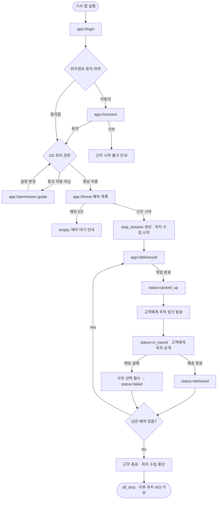
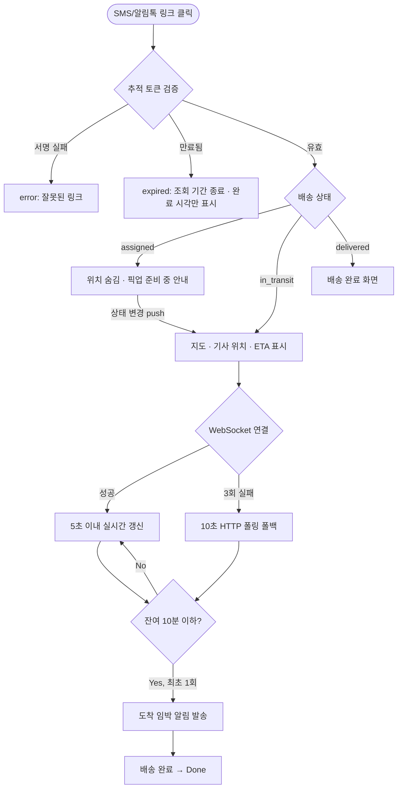

# 실시간 배송 추적 (Real-time Delivery Tracking) PRD

> **Version**: 1.0
> **Created**: 2026-08-04
> **Status**: Draft
> **Type**: product-feature

> **작성 시 가정** (확정 필요)
> 1. **Scale Grade = Startup**: "물류 스타트업" 기준으로 추정. 활동 기사 300명 / 동시 추적 고객 세션 2,000 / 일 배송 3,000건 가정.
> 2. **신규 프로젝트**: 저장소에 기존 코드·스키마가 없어 스택을 신규 제안. 기존 시스템(WMS/TMS, 배차 시스템)이 이미 있다면 §5.2·§5.3 연동 지점 재작성 필요.
> 3. **지역 = 국내 단일 리전**: 지도 SDK와 개인정보 규제를 국내 기준(개인정보보호법·위치정보법)으로 설계.

---

## 1. Overview

### 1.1 Problem Statement

현재 배송 진행 상황은 기사가 수동으로 상태를 바꾸는 시점(픽업 완료 / 배송 완료)에만 갱신된다. 그 사이 구간은 누구에게도 보이지 않는 블랙박스다. 이 때문에:

- **고객**: "지금 어디쯤인가요?" 문의가 CS 인입의 다수를 차지하고, 부재로 인한 재배송이 발생한다.
- **관리자**: 지연을 사후에(고객 컴플레인으로) 알게 되어 선제 대응이 불가능하다.
- **기사**: 같은 질문에 반복 응대하느라 운행이 끊긴다.

즉 **"배송 중" 상태의 위치·도착예정 정보가 실시간으로 공유되지 않는 것**이 핵심 문제다.

### 1.2 Goals

- G1. 기사의 위치를 **근무 중에만** 수집하여 3초 이내(p95)에 고객·관리자에게 반영한다.
- G2. 고객이 **앱 설치·로그인 없이** 링크 하나로 지도에서 기사 위치와 ETA를 확인할 수 있게 한다.
- G3. 관리자가 지연 건을 **자동 감지**하여 고객 컴플레인 이전에 인지·조치할 수 있게 한다.
- G4. 위치정보를 법적 요건(동의·목적 제한·보존기간)에 맞게 수집·파기한다.
- G5. 기사 단말 배터리 소모를 실사용 가능한 수준(8시간 운행 기준 위치 기능으로 인한 추가 소모 ≤ 15%)으로 유지한다.

### 1.3 Non-Goals (Out of Scope)

- 자동 배차 / 경로 최적화(VRP) 알고리즘 — 배차는 기존 프로세스를 그대로 사용한다.
- 고객용 **네이티브 앱** — 이번 릴리스는 모바일 웹(추적 링크)만 제공.
- 기사 근무 평가·인사 지표(과속·급정거 등 운전 습관 분석).
- 정산 / 운임 계산 / 전자 인수증(POD) 서명.
- 실내 측위, 층·호수 단위 정밀 위치.
- 다국어 지원 (한국어만).
- 화물 온도·적재 센서 등 IoT 연동.

### 1.4 Scope

| 포함 | 제외 |
|------|------|
| 기사 앱: 근무 on/off, 백그라운드 위치 수집·전송 | 기사 앱의 배차 수락/거절 기능 |
| 오프라인(음영지역) 위치 버퍼링 및 재전송 | 위성/LTE-M 등 별도 통신 모듈 |
| 배송 상태 전이(배차→픽업→배송중→완료/실패) | 반품·회수 프로세스 |
| 고객: 토큰 기반 추적 페이지, 지도, ETA, 도착 임박 알림 | 고객↔기사 인앱 채팅/통화 (전화 연결 버튼은 P2) |
| 관리자: 실시간 관제 지도, 지연 자동 감지, 알림 | BI 리포트·주간 통계 대시보드 |
| 위치 이력 저장 및 배송 건별 경로 재생 | 운전 습관 스코어링 |
| 위치정보 동의 관리 및 보존기간 자동 파기 | 전사 개인정보 관리 시스템 구축 |

---

## 2. User Stories

### 2.1 Primary Users

**US-1 (기사)**
As a **배송 기사**, I want to 근무 시작 버튼 한 번으로 위치가 자동 공유되게 하고 싶다, so that 고객·관제팀의 "어디세요?" 문의에 일일이 답하지 않고 운행에 집중할 수 있다.

**US-2 (기사)**
As a **배송 기사**, I want to 지하주차장·터널처럼 신호가 끊긴 구간의 위치도 나중에 자동으로 반영되게 하고 싶다, so that 내 이동 기록이 비어 보여 불필요한 확인 연락을 받지 않는다.

**US-3 (기사)**
As a **배송 기사**, I want to 근무 종료 후에는 위치가 절대 수집되지 않는다는 것을 앱에서 명확히 확인하고 싶다, so that 사생활 침해 우려 없이 기능을 사용할 수 있다.

**US-4 (고객)**
As a **수령 고객**, I want to 문자로 받은 링크를 눌러 앱 설치 없이 기사 위치와 도착 예정 시각을 지도에서 보고 싶다, so that 무작정 기다리지 않고 다른 일을 하다가 도착 즈음에 맞춰 나갈 수 있다.

**US-5 (고객)**
As a **수령 고객**, I want to 기사가 근처에 왔을 때 알림을 받고 싶다, so that 부재로 인한 재배송을 피할 수 있다.

**US-6 (관리자)**
As a **관제 관리자**, I want to 지연이 예상되는 배송 건이 자동으로 상단에 뜨게 하고 싶다, so that 고객이 항의하기 전에 먼저 연락해 대응할 수 있다.

**US-7 (관리자)**
As a **관제 관리자**, I want to 위치가 일정 시간 이상 들어오지 않는 기사를 즉시 알고 싶다, so that 단말 문제인지 사고인지 빠르게 확인할 수 있다.

### 2.2 Acceptance Criteria (Gherkin)

```gherkin
Scenario: 근무 시작 시 위치 공유 개시
  Given 기사가 위치정보 수집에 동의했고 OS 위치 권한이 "항상 허용"이다
  And 기사에게 오늘 배차된 배송 건이 1건 이상 있다
  When 기사가 앱에서 "근무 시작"을 누른다
  Then 근무 세션이 생성되고 상태가 on_duty가 된다
  And 5초 주기(이동 중 기준)로 위치가 서버에 전송되기 시작한다
  And 앱 상단에 "위치 공유 중" 표시와 지속 알림(foreground service / persistent notification)이 노출된다

Scenario: 위치 권한이 부족한 상태로 근무 시작
  Given OS 위치 권한이 "앱 사용 중에만 허용"이다
  When 기사가 "근무 시작"을 누른다
  Then 근무 시작이 차단된다
  And "백그라운드에서도 위치를 보내려면 '항상 허용'이 필요합니다" 안내와 설정 이동 버튼이 표시된다

Scenario: 근무 종료 시 위치 수집 중단
  Given 기사가 on_duty 상태다
  When 기사가 "근무 종료"를 누른다
  Then 위치 수집이 즉시 중단되고 지속 알림이 사라진다
  And 이후 서버는 해당 기사의 위치 전송을 거부한다(403 NOT_ON_DUTY)
  And 진행 중이던 배송 건은 status=suspended로 전환되고 관리자에게 알림이 발송된다

Scenario: 음영 지역 오프라인 버퍼링 및 복구
  Given 기사가 on_duty 상태에서 네트워크가 끊겼다
  When 기사가 15분간 이동한 뒤 네트워크가 복구된다
  Then 로컬 큐에 쌓인 위치 포인트가 원래 타임스탬프를 유지한 채 배치 전송된다
  And 서버는 중복 포인트를 (driver_id, recorded_at) 기준으로 멱등 처리한다
  And 고객 화면의 경로 선이 끊긴 구간을 포함해 이어서 그려진다

Scenario: 고객이 추적 링크로 위치 확인
  Given 배송 건 status가 in_transit이고 유효한 추적 토큰이 발급되었다
  When 고객이 추적 링크를 연다
  Then 로그인 없이 지도가 열리고 기사 현재 위치 마커가 표시된다
  And ETA와 남은 거리가 표시된다
  And 이후 위치 갱신이 WebSocket으로 5초 이내 반영된다

Scenario: 만료된 추적 링크 접근
  Given 배송 건이 완료된 지 24시간이 지났다
  When 고객이 추적 링크를 연다
  Then 지도가 표시되지 않는다
  And "배송이 완료되어 조회 기간이 종료되었습니다" 안내와 배송 완료 시각·수령 방법만 표시된다

Scenario: 배송 전 단계에서는 위치를 공개하지 않음
  Given 배송 건 status가 assigned(배차됨, 아직 픽업 전)이다
  When 고객이 추적 링크를 연다
  Then 기사 위치 마커는 표시되지 않는다
  And "픽업 준비 중입니다. 출발하면 위치가 표시됩니다" 안내가 표시된다

Scenario: 도착 임박 알림
  Given 고객이 알림 수신에 동의했고 배송 건이 in_transit이다
  When 기사와 배송지 사이 예상 소요시간이 처음으로 10분 이하가 된다
  Then 고객에게 도착 임박 알림이 1회 발송된다
  And 동일 배송 건에 대해 중복 발송되지 않는다

Scenario: ETA 초과로 인한 지연 감지
  Given 배송 건의 약속 도착시각이 14:00이다
  When 계산된 ETA가 14:16이 된다
  Then 배송 건이 delayed로 마킹된다
  And 관리자 대시보드 지연 목록 최상단에 지연 사유 "ETA_EXCEEDED", 초과 16분으로 표시된다
  And 관리자에게 실시간 알림이 1회 발송된다

Scenario: 위치 신호 두절 감지
  Given 기사가 on_duty 상태다
  When 마지막 위치 수신 후 10분간 새 위치가 없다
  Then 해당 기사가 signal_lost로 마킹된다
  And 관리자 대시보드에 회색 마커와 "마지막 수신 10분 전"이 표시된다
  And 관리자에게 알림이 발송된다

Scenario: GPS 이상치 필터링
  Given 직전 위치가 서울시청이고 3초 뒤 위치가 부산으로 들어왔다
  When 서버가 위치를 수신한다
  Then 물리적으로 불가능한 속도(> 200km/h)로 판정해 해당 포인트를 저장하되 is_outlier=true로 표시한다
  And 고객·관리자 지도에는 반영하지 않는다

Scenario: 보존기간 경과 위치 이력 파기
  Given 원본 위치 포인트가 저장된 지 31일이 지났다
  When 일일 배치 파기 작업이 실행된다
  Then 해당 원본 포인트가 삭제된다
  And 배송 건별 요약 경로(다운샘플링본)만 90일간 남는다
```

### 2.3 User Roles

| Role Key | 한국어 명칭 | 권한 범위 | 비고 |
|----------|------------|----------|------|
| `driver` | 배송 기사 | 본인 근무 세션 생성/종료, 본인 위치 write, 본인 배차 건 read/상태 update | 모바일 앱. JWT 인증 |
| `customer` | 수령 고객 | 추적 토큰에 바인딩된 **단일 배송 건**의 위치·ETA read만 | 로그인 없음. 서명된 토큰으로만 접근 |
| `admin` | 관제 관리자 | 전체 배송/기사 read, 지연 처리·배송 상태 강제 변경, 위치 이력 조회 | 웹 대시보드. JWT + 감사로그 |
| `super_admin` | 시스템 관리자 | `admin` 권한 + 계정 관리, 지연 규칙 설정 변경, 개인정보 파기 정책 조회 | 소수 인원 |

**규칙**
- 이후 모든 페이지 권한·API authorization은 위 Role Key를 그대로 인용한다.
- `customer`는 계정 개념이 아니라 **토큰 스코프**다. 토큰은 `delivery_id` 하나에만 유효하며 다른 배송 건 조회는 403이다.
- `driver`는 **다른 기사의 위치를 조회할 수 없다**(동료 감시 방지).

---

## 3. Functional Requirements

### 3.1 기사 (Driver)

| ID | Requirement | Priority | Dependencies |
|----|------------|----------|--------------|
| FR-001 | 기사는 위치정보 수집·제공에 대한 동의를 최초 1회 받고, 동의 이력(버전·시각)을 저장한다. 미동의 시 근무 시작이 불가하다. | P0 | - |
| FR-002 | 기사는 "근무 시작 / 근무 종료"로 위치 공유를 명시적으로 on/off 한다. off 상태에서는 서버가 위치를 수신·저장하지 않는다. | P0 | FR-001 |
| FR-003 | 앱은 백그라운드·화면 잠금 상태에서도 위치를 수집한다. (iOS: Always 권한 + Background Location Mode, Android: Foreground Service + `ACCESS_BACKGROUND_LOCATION`) | P0 | FR-002 |
| FR-004 | 위치 수집 주기는 적응형으로 한다: 이동 중(속도 > 5km/h) 5초, 정차(속도 ≤ 5km/h가 2분 지속) 30초, 배송지 반경 200m 진입 시 3초. | P0 | FR-003 |
| FR-005 | 위치는 최대 10개 또는 15초 중 먼저 도달하는 조건으로 **배치 전송**한다. 각 포인트는 `lat, lng, accuracy, speed, heading, recorded_at, battery_level`을 포함한다. | P0 | FR-004 |
| FR-006 | 네트워크 단절 시 위치를 단말 로컬 큐(최대 6시간분 또는 5,000포인트)에 저장하고, 복구 시 원본 타임스탬프를 유지한 채 순서대로 재전송한다. 큐가 가득 차면 가장 오래된 포인트부터 폐기하고 폐기 건수를 로깅한다. | P0 | FR-005 |
| FR-007 | 기사는 배송 건 상태를 전이시킬 수 있다: `assigned → picked_up → in_transit → delivered` 또는 `failed(사유 선택)`. 역방향 전이는 `admin`만 가능하다. | P0 | FR-002 |
| FR-008 | 앱은 위치 공유 중임을 상시 노출한다(상단 배너 + OS 지속 알림). 근무 종료 시 즉시 사라진다. | P0 | FR-002 |
| FR-009 | 배터리 절약 모드/OS 앱 종료(force kill)로 위치 수집이 중단되면 앱 재실행 시 감지하여 기사에게 알리고, 서버에 `collection_interrupted` 이벤트를 남긴다. | P1 | FR-003 |
| FR-010 | 기사 앱은 오늘의 배차 목록과 각 건의 고객 주소·연락처·상태를 조회한다. | P0 | - |

### 3.2 고객 (Customer)

| ID | Requirement | Priority | Dependencies |
|----|------------|----------|--------------|
| FR-011 | 배송 건이 `picked_up`이 되면 고객에게 추적 링크를 SMS/알림톡으로 1회 발송한다. 링크는 서명된 단일 배송 건 토큰을 포함한다. | P0 | FR-007 |
| FR-012 | 고객은 로그인 없이 추적 페이지에서 기사 현재 위치 마커, 배송지 마커, 이동 경로 선을 지도에서 확인한다. | P0 | FR-011 |
| FR-013 | 위치 갱신은 WebSocket으로 push하고, 연결 실패 시 10초 주기 HTTP 폴링으로 자동 폴백한다. | P0 | FR-012 |
| FR-014 | ETA와 남은 거리를 표시하고 최소 30초 주기로 갱신한다. ETA는 "14:20 도착 예정"과 "약 12분 후" 두 형태로 함께 표시한다. | P0 | FR-012 |
| FR-015 | 배송 건 상태가 `in_transit`일 때만 기사 위치를 공개한다. `assigned`(픽업 전)에는 위치를 감추고 안내 문구만 노출한다. | P0 | FR-012 |
| FR-016 | 추적 토큰은 배송 완료 시각 +24시간 또는 발급 후 최대 72시간 중 이른 시점에 만료된다. 만료 후에는 완료 시각·수령 방법만 표시한다. | P0 | FR-011 |
| FR-017 | 고객은 예상 소요시간이 처음 10분 이하가 될 때 도착 임박 알림을 1회 수신한다(배송 건당 중복 발송 금지). | P1 | FR-014 |
| FR-018 | 고객은 추적 페이지에서 기사에게 전화 연결(안심번호)을 할 수 있다. | P2 | FR-012 |
| FR-019 | 배송 완료 시 추적 페이지가 "배송 완료" 상태로 즉시 전환되고 완료 시각이 표시된다. | P0 | FR-007 |

### 3.3 관리자 (Admin)

| ID | Requirement | Priority | Dependencies |
|----|------------|----------|--------------|
| FR-020 | 관리자는 전체 근무 중 기사의 현재 위치를 하나의 지도에서 확인한다. 마커는 상태별 색상(정상/지연/신호두절)으로 구분한다. | P0 | FR-005 |
| FR-021 | 시스템은 다음 규칙으로 지연을 자동 감지한다: ① ETA가 약속 도착시각을 15분 초과(`ETA_EXCEEDED`) ② 위치 미수신 10분 경과(`SIGNAL_LOST`) ③ 배송지 아닌 곳에서 20분 이상 정차(`PROLONGED_STOP`) ④ 픽업 후 30분간 이동 없음(`NOT_STARTED`). | P0 | FR-005, FR-014 |
| FR-022 | 지연 임계값(15분/10분/20분/30분)은 코드 배포 없이 설정에서 변경 가능하다. 변경은 `super_admin`만 가능하며 감사로그를 남긴다. | P1 | FR-021 |
| FR-023 | 지연 건은 대시보드 목록 최상단에 지연 사유·초과 시간·기사·고객 정보와 함께 표시되고, 초과 시간 내림차순으로 정렬된다. | P0 | FR-021 |
| FR-024 | 지연 발생 시 관리자에게 실시간 알림(웹 푸시 + 대시보드 토스트)을 1회 발송한다. 동일 배송 건의 동일 사유는 30분 내 재발송하지 않는다. | P0 | FR-021 |
| FR-025 | 관리자는 지연 건에 대해 "확인함 / 고객 안내 완료 / 해결됨" 처리 상태를 기록할 수 있고, 처리자와 시각이 저장된다. | P1 | FR-023 |
| FR-026 | 관리자는 완료된 배송 건의 이동 경로를 지도 위에서 시간순으로 재생할 수 있다. | P1 | FR-005 |
| FR-027 | 관리자는 배송 상태를 강제 변경할 수 있다(예: 기사 단말 고장 시 수동 완료 처리). 모든 강제 변경은 사유 입력이 필수이며 감사로그에 남는다. | P1 | FR-007 |
| FR-028 | 관리자는 특정 기사/기간의 위치 이력을 조회할 수 있다. 조회 행위 자체가 감사로그에 기록된다. | P1 | FR-005 |

### 3.4 데이터·시스템

| ID | Requirement | Priority | Dependencies |
|----|------------|----------|--------------|
| FR-029 | 서버는 물리적으로 불가능한 이동(직전 포인트 대비 속도 > 200km/h) 또는 정확도 불량(`accuracy > 100m`) 포인트를 `is_outlier=true`로 저장하고 지도 표시·ETA 계산에서 제외한다. | P0 | FR-005 |
| FR-030 | 동일 `(driver_id, recorded_at)` 포인트는 멱등 처리하여 재전송 시 중복 저장되지 않는다. | P0 | FR-006 |
| FR-031 | 기사별 최신 위치는 인메모리 저장소(Redis)에 유지하여 조회 시 DB를 조회하지 않는다. | P0 | FR-005 |
| FR-032 | 원본 위치 포인트는 **30일** 후 삭제하고, 배송 건별 다운샘플링(30초 간격) 경로만 **90일** 보관 후 삭제한다. 파기는 일 1회 배치로 실행되며 실행 결과를 로깅한다. | P0 | FR-005 |
| FR-033 | 근무 종료(`off_duty`) 상태 기사의 위치 전송 요청은 403 `NOT_ON_DUTY`로 거부하고 저장하지 않는다. | P0 | FR-002 |
| FR-034 | ETA는 지도 API의 실시간 교통정보 기반 경로 탐색 결과를 사용하되, API 실패 시 직선거리 ÷ 평균 주행속도(도심 25km/h)로 폴백하고 화면에 "예상치" 배지를 표시한다. | P0 | FR-014 |
| FR-035 | ETA 계산 결과는 배송 건별 60초 캐싱하여 지도 API 호출량을 제한한다. | P1 | FR-034 |

---

## 4. Non-Functional Requirements

### 4.0 Scale Grade

**등급: Startup** *(가정값 — 확정 필요)*

| 항목 | 값 |
|------|-----|
| 활동 기사 수 (동시 근무) | 300명 |
| 일 배송 건수 | 3,000건 |
| 동시 추적 고객 세션 (피크) | 2,000 |
| 동시 관리자 세션 | 20 |
| 위치 write 부하 | 300명 ÷ 5초 = **60 writes/sec**, 피크 100 writes/sec |
| 서비스 1시간 중단 시 영향 | 고객 문의 급증 + 관제 불가. 배송 자체는 계속되므로 **치명적이지는 않음** → 99% Uptime으로 충분 |

> **주의**: 기사 수가 1,000명을 넘거나 위치 주기를 1초로 낮추면 write 부하가 1,000/sec를 넘어 Growth 등급 설계(파티셔닝, 스트림 처리)로 재검토가 필요하다. §6 Phase 3에서 부하 테스트로 검증한다.

### 4.1 Performance SLA

| 지표 | 목표값 | 측정 방법 |
|------|--------|----------|
| 위치 전송 API 응답 (p95) | < 300ms | APM |
| **위치 수집 → 고객 화면 반영 (end-to-end, p95)** | **< 3초** | 클라이언트 계측(recorded_at → 렌더 시각) |
| 추적 페이지 최초 로딩 (LCP, 4G) | < 2.5초 | Lighthouse / RUM |
| 관리자 대시보드 초기 로딩 (기사 300명) | < 3초 | RUM |
| ETA 계산 응답 (p95) | < 500ms (캐시 히트 < 50ms) | APM |
| 지연 감지 지연 시간 | 조건 충족 후 **60초 이내** 마킹 | 감지 작업 실행 주기 로그 |
| 위치 write 처리량 | 100 writes/sec 지속 | 부하 테스트 |
| 동시 WebSocket 연결 | 2,500 | 부하 테스트 |

### 4.2 Availability SLA

| 항목 | 목표 |
|------|------|
| Uptime | **99%** (월 허용 다운타임 7.3시간) |
| 저하 모드(Degraded) 요건 | WebSocket 장애 시 HTTP 폴링으로 자동 폴백하여 추적 기능은 유지 (FR-013) |
| 위치 수집 연속성 | 서버 장애 중에도 기사 앱은 로컬 큐에 계속 적재하고 복구 시 전송 (FR-006) — **서버 다운이 위치 데이터 유실로 이어지지 않아야 함** |

### 4.3 Data Requirements

| 항목 | 값 | 산출 근거 |
|------|-----|----------|
| 일 위치 포인트 수 | 약 216만 건 | 기사 300 × 10시간 × 720포인트/시간 |
| 포인트당 저장 크기 | 약 80 bytes | lat/lng/accuracy/speed/heading/ts/fk |
| 일 증가량 (원본) | 약 **170MB/일** | 216만 × 80B |
| 30일 보존 시 원본 데이터량 | 약 **5GB** | Startup 등급 상한(10GB) 내 |
| 다운샘플링 경로 (30초 간격, 90일) | 약 2.5GB | 원본 대비 1/6 × 90일 |
| **총 예상 데이터량** | **약 8GB** | 원본 30일 + 요약 90일 |
| 보존 기간 | 원본 30일 / 요약 경로 90일 / 배송 메타데이터 5년(상법상 거래기록) | FR-032 |

> **설계 판단**: 원본을 무기한 보관하면 1년에 60GB로 Startup 등급을 벗어난다. FR-032의 **자동 파기가 비용·규제 양쪽에서 필수**이며 선택 사항이 아니다.

### 4.4 Recovery

| 항목 | 목표 | 비고 |
|------|------|------|
| RTO (복구 시간) | **4시간** | 관제 공백 허용 한계 |
| RPO (복구 시점) | **1시간** | DB 자동 백업 주기 1시간 + WAL |
| 위치 데이터 실질 RPO | **0에 가까움** | 기사 앱 로컬 큐가 6시간분 보유 → 서버 복구 후 재전송 (FR-006) |
| 백업 | 일 1회 전체 + 시간별 증분, 별도 리전 보관, **분기 1회 복원 훈련** | |

### 4.5 Security & Privacy

위치정보는 개인정보보호법상 민감도가 높고 위치정보법 적용 대상이므로 별도로 명시한다.

**인증·인가**
- `driver`, `admin`, `super_admin`: JWT (access 30분 / refresh 14일). refresh 토큰 rotation 적용.
- `customer`: 계정 없음. **서명된 추적 토큰**(JWT, `delivery_id` 스코프, exp 포함, 서버 서명 검증). 추측 불가능하도록 최소 128bit 엔트로피.
- 모든 API는 Role Key 기반 인가를 서버에서 검증한다. **클라이언트 전달 role은 신뢰하지 않는다.**
- 기사는 타 기사 위치 조회 불가, 고객은 자신의 배송 건 외 조회 불가(403).

**암호화**
- In transit: TLS 1.3 필수. 앱↔서버 통신에 certificate pinning 적용(P1).
- At rest: DB 볼륨 암호화 + 고객 연락처·주소 컬럼 애플리케이션 레벨 암호화.

**위치정보 특수 요건**
| 항목 | 요건 | 연결 FR |
|------|------|--------|
| 수집 동의 | 근무 시작 전 명시적 동의, 동의 버전·시각 저장 | FR-001 |
| 목적 제한 | 배송 추적 목적 외 사용 금지. 근무 시간 외 수집 금지 | FR-002, FR-033 |
| 최소 수집 | 근무 중 + 배차 건 존재 시에만 수집 | FR-002 |
| 보존 제한 | 원본 30일 / 요약 90일 자동 파기 | FR-032 |
| 열람 통제 | 관리자의 기사 위치 이력 조회는 전건 감사로그 | FR-028 |
| 제3자 제공 | 고객에게 제공되는 것은 **현재 위치·ETA뿐**. 기사 개인 식별정보(실명·연락처)는 마스킹 | FR-012 |
| 동의 철회 | 기사가 동의를 철회하면 이후 수집 중단 + 기존 데이터 파기 요청 절차 제공 | FR-001 |

**기타**
- 추적 링크는 SMS로 전달되므로 **전달 대상 오류 시 위치가 제3자에게 노출**될 수 있다 → 토큰 만료(FR-016)와 `in_transit` 한정 공개(FR-015)로 노출 창을 최소화한다.
- 위치 전송 API에 기사별 rate limit(초당 20포인트) 적용하여 위조·과다 전송 차단.
- 관리자 계정에 2FA 적용(P1).

### 4.6 Quality

| 항목 | 기준 |
|------|------|
| 테스트 커버리지 | 위치 파이프라인·지연 감지 규칙·권한 검증 로직은 라인 커버리지 80% 이상 |
| 필수 통합 테스트 | 오프라인 버퍼링 재전송, 근무 종료 후 위치 거부, 토큰 만료, 지연 감지 4개 규칙 각각 |
| 기기 호환 | iOS 15+, Android 10+ (백그라운드 위치 정책 차이 대응 필수) |
| 배터리 | 8시간 운행 기준 위치 기능으로 인한 추가 소모 ≤ 15% — 실기기 측정으로 검증 |
| 관측성 | 위치 수집 지연, 포인트 유실률, WebSocket 연결 수, 지연 감지 실행 시각을 대시보드화 |

---

## 5. Technical Design

### 5.1 API Specification

**Base URL**: `https://api.{domain}/v1`
**공통 에러 포맷**: `{ "error": { "code": "STRING_CODE", "message": "설명", "details": {} } }`

---

#### `POST /v1/driver/duty/start`
- **Description**: 근무 세션 시작. 위치 공유 개시.
- **Auth**: Required (`driver`)
- **Request**
  ```json
  {
    "device_id": "string, required",
    "app_version": "string, required",
    "os": "ios | android, required",
    "location_permission": "always | when_in_use | denied, required",
    "consent_version": "string, required"
  }
  ```
- **Response 201**
  ```json
  {
    "duty_session_id": "uuid",
    "started_at": "2026-08-04T09:00:00+09:00",
    "assigned_deliveries": 12,
    "location_config": { "moving_interval_sec": 5, "idle_interval_sec": 30, "near_dest_interval_sec": 3, "batch_size": 10, "batch_flush_sec": 15 }
  }
  ```
- **Errors**
  - `400 INVALID_INPUT` — 필수 필드 누락
  - `403 CONSENT_REQUIRED` — 위치정보 수집 미동의 또는 동의 버전 만료 (FR-001)
  - `403 PERMISSION_INSUFFICIENT` — `location_permission != always` (FR-003)
  - `409 ALREADY_ON_DUTY` — 이미 근무 중인 세션 존재 (다른 기기 포함)
  - `422 NO_ASSIGNED_DELIVERY` — 배차된 건 없음

---

#### `POST /v1/driver/duty/end`
- **Description**: 근무 종료. 위치 수집 중단.
- **Auth**: Required (`driver`)
- **Request**: `{ "duty_session_id": "uuid, required", "pending_points_flushed": "boolean, required" }`
- **Response 200**
  ```json
  { "duty_session_id": "uuid", "ended_at": "2026-08-04T19:00:00+09:00", "suspended_deliveries": ["uuid"] }
  ```
- **Errors**: `404 SESSION_NOT_FOUND`, `409 ALREADY_ENDED`

---

#### `POST /v1/driver/locations`
- **Description**: 위치 포인트 배치 전송. 오프라인 복구분 포함.
- **Auth**: Required (`driver`)
- **Rate limit**: 20 points/sec per driver
- **Request**
  ```json
  {
    "duty_session_id": "uuid, required",
    "points": [
      {
        "lat": 37.5665,          // number, required, -90~90
        "lng": 126.9780,         // number, required, -180~180
        "accuracy": 12.5,        // number(m), required
        "speed": 8.3,            // number(m/s), optional
        "heading": 91.0,         // number(deg), optional
        "recorded_at": "2026-08-04T10:00:00.000+09:00",  // string(ISO8601), required
        "battery_level": 78,     // number(0~100), optional
        "is_offline_recovery": false  // boolean, optional, default false
      }
    ]
  }
  ```
  - `points` 배열 최대 100개
- **Response 202**
  ```json
  { "accepted": 10, "duplicated": 0, "rejected": 0, "outliers": 1, "server_time": "2026-08-04T10:00:01+09:00" }
  ```
  - `server_time`은 클라이언트 시계 보정용
- **Errors**
  - `400 INVALID_INPUT` — 좌표 범위 초과, `recorded_at` 미래 시각(서버시간 +5분 초과)
  - `403 NOT_ON_DUTY` — 근무 종료 상태 (FR-033)
  - `413 BATCH_TOO_LARGE` — points > 100
  - `429 RATE_LIMITED` — rate limit 초과

---

#### `PATCH /v1/driver/deliveries/{delivery_id}/status`
- **Description**: 배송 상태 전이.
- **Auth**: Required (`driver`, 본인 배차 건만)
- **Request**
  ```json
  { "status": "picked_up | in_transit | delivered | failed", "reason_code": "string, failed일 때 required", "note": "string, optional", "occurred_at": "ISO8601, required" }
  ```
- **Response 200**: `{ "delivery_id": "uuid", "status": "in_transit", "updated_at": "...", "tracking_link_sent": true }`
- **Errors**
  - `403 FORBIDDEN` — 본인 배차 건 아님
  - `409 INVALID_TRANSITION` — 허용되지 않는 상태 전이(역방향 등)
  - `422 REASON_REQUIRED` — `failed`인데 `reason_code` 없음

---

#### `GET /v1/driver/deliveries`
- **Description**: 오늘의 배차 목록.
- **Auth**: Required (`driver`)
- **Request (query)**: `date` (optional, default today), `status` (optional)
- **Response 200**
  ```json
  { "items": [ { "delivery_id": "uuid", "sequence": 1, "status": "assigned", "customer_name": "김**", "address": "서울시 ...", "masked_phone": "0504-***-1234", "promised_at": "2026-08-04T14:00:00+09:00" } ], "total": 12 }
  ```
- **Errors**: `401 UNAUTHORIZED`

---

#### `GET /v1/tracking/{token}`
- **Description**: 고객용 추적 정보 조회 (초기 로딩용).
- **Auth**: None (서명된 추적 토큰으로 인가)
- **Response 200 — `in_transit`**
  ```json
  {
    "delivery_id": "uuid",
    "status": "in_transit",
    "driver": { "display_name": "박기사", "vehicle": "1톤 탑차", "photo_url": null },
    "driver_location": { "lat": 37.5665, "lng": 126.9780, "heading": 91.0, "updated_at": "2026-08-04T13:48:00+09:00" },
    "destination": { "lat": 37.5700, "lng": 126.9820, "address_summary": "서울시 종로구 ..." },
    "eta": { "arrival_at": "2026-08-04T14:02:00+09:00", "remaining_minutes": 12, "remaining_distance_m": 3200, "is_estimated": false },
    "route_polyline": "encoded_polyline_string",
    "ws_url": "wss://api.{domain}/v1/tracking/ws?token=..."
  }
  ```
- **Response 200 — `assigned` (픽업 전, FR-015)**
  ```json
  { "delivery_id": "uuid", "status": "assigned", "driver_location": null, "message": "픽업 준비 중입니다. 출발하면 위치가 표시됩니다.", "promised_at": "2026-08-04T14:00:00+09:00" }
  ```
- **Response 200 — `delivered`**
  ```json
  { "delivery_id": "uuid", "status": "delivered", "driver_location": null, "delivered_at": "2026-08-04T13:58:00+09:00", "receive_method": "문 앞" }
  ```
- **Errors**
  - `401 INVALID_TOKEN` — 서명 검증 실패
  - `410 TOKEN_EXPIRED` — 만료 (FR-016)
  - `404 DELIVERY_NOT_FOUND`

---

#### `WS /v1/tracking/ws?token={token}`
- **Description**: 고객 실시간 위치 구독.
- **Auth**: None (쿼리스트링 추적 토큰 검증 후 핸드셰이크 수락)
- **Server → Client 메시지**
  ```json
  { "type": "location_update", "data": { "lat": 37.5665, "lng": 126.9780, "heading": 91.0, "recorded_at": "..." } }
  { "type": "eta_update", "data": { "arrival_at": "...", "remaining_minutes": 11, "is_estimated": false } }
  { "type": "status_change", "data": { "status": "delivered", "occurred_at": "..." } }
  { "type": "error", "data": { "code": "TOKEN_EXPIRED" } }
  ```
- **Client → Server**: `{ "type": "ping" }` (30초 주기 heartbeat)
- **연결 종료 코드**
  - `4001` INVALID_TOKEN · `4010` TOKEN_EXPIRED · `4029` TOO_MANY_CONNECTIONS(토큰당 최대 3)
- **폴백**: 연결 실패 또는 3회 재연결 실패 시 클라이언트는 `GET /v1/tracking/{token}` 10초 폴링으로 전환 (FR-013)

---

#### `GET /v1/admin/drivers/live`
- **Description**: 근무 중 기사 실시간 위치 목록 (관제 지도 초기 로딩).
- **Auth**: Required (`admin`)
- **Request (query)**: `bounds` (optional, `swLat,swLng,neLat,neLng`), `status` (optional: `normal|delayed|signal_lost`)
- **Response 200**
  ```json
  {
    "items": [ { "driver_id": "uuid", "name": "박기사", "lat": 37.5665, "lng": 126.9780, "updated_at": "...", "marker_status": "delayed", "in_progress_delivery_id": "uuid", "remaining_deliveries": 4 } ],
    "total": 287,
    "as_of": "2026-08-04T13:50:00+09:00"
  }
  ```
- **Errors**: `403 FORBIDDEN`

---

#### `WS /v1/admin/ws`
- **Description**: 관리자 실시간 채널 (기사 위치 + 지연 알림).
- **Auth**: Required (`admin`, 핸드셰이크 시 JWT 검증)
- **Server → Client**
  ```json
  { "type": "driver_positions", "data": [ { "driver_id": "uuid", "lat": 37.5, "lng": 127.0, "marker_status": "normal" } ] }   // 5초 주기 배치 push
  { "type": "delay_alert", "data": { "delivery_id": "uuid", "driver_name": "박기사", "reason": "ETA_EXCEEDED", "overdue_minutes": 16, "promised_at": "...", "detected_at": "..." } }
  { "type": "delay_resolved", "data": { "delivery_id": "uuid", "resolved_at": "..." } }
  ```

---

#### `GET /v1/admin/delays`
- **Description**: 지연 건 목록 조회.
- **Auth**: Required (`admin`)
- **Request (query)**: `reason` (optional: `ETA_EXCEEDED|SIGNAL_LOST|PROLONGED_STOP|NOT_STARTED`), `handling_status` (optional: `open|acknowledged|notified|resolved`), `sort` (default: `overdue_minutes_desc`), `page`, `size`
- **Response 200**
  ```json
  {
    "items": [ { "delivery_id": "uuid", "driver": { "id": "uuid", "name": "박기사", "phone": "010-****-5678" }, "customer": { "name": "김**", "masked_phone": "0504-***-1234", "address_summary": "서울시 ..." }, "reason": "ETA_EXCEEDED", "overdue_minutes": 16, "promised_at": "...", "current_eta": "...", "detected_at": "...", "handling_status": "open" } ],
    "total": 7, "page": 1, "size": 20
  }
  ```
- **Errors**: `403 FORBIDDEN`

---

#### `PATCH /v1/admin/delays/{delivery_id}`
- **Description**: 지연 건 처리 상태 기록.
- **Auth**: Required (`admin`)
- **Request**: `{ "handling_status": "acknowledged | notified | resolved", "note": "string, optional" }`
- **Response 200**: `{ "delivery_id": "uuid", "handling_status": "notified", "handled_by": "uuid", "handled_at": "..." }`
- **Errors**: `404 DELAY_NOT_FOUND`, `409 ALREADY_RESOLVED`

---

#### `GET /v1/admin/deliveries/{delivery_id}/route`
- **Description**: 배송 건 이동 경로 조회 (경로 재생용). 감사로그 기록 대상.
- **Auth**: Required (`admin`)
- **Request (query)**: `resolution` (optional: `raw|downsampled`, default `downsampled`)
- **Response 200**
  ```json
  { "delivery_id": "uuid", "points": [ { "lat": 37.5665, "lng": 126.9780, "recorded_at": "...", "speed": 8.3 } ], "total_distance_m": 12400, "duration_sec": 2760, "resolution": "downsampled" }
  ```
- **Errors**
  - `403 FORBIDDEN`
  - `410 DATA_PURGED` — 보존기간 경과로 파기됨 (FR-032)

---

#### `PATCH /v1/admin/settings/delay-rules`
- **Description**: 지연 감지 임계값 변경.
- **Auth**: Required (`super_admin`)
- **Request**
  ```json
  { "eta_exceeded_minutes": 15, "signal_lost_minutes": 10, "prolonged_stop_minutes": 20, "not_started_minutes": 30 }
  ```
- **Response 200**: `{ "updated_at": "...", "updated_by": "uuid", "applied_from": "..." }`
- **Errors**: `403 FORBIDDEN`, `400 INVALID_INPUT` (각 값 1~180분 범위 밖)

---

### 5.2 Database Schema

PostgreSQL 15 + **PostGIS** (거리·반경 연산), 위치 이력은 시계열 특성상 **월 단위 파티셔닝**.

```sql
-- 기사
CREATE TABLE drivers (
  id              UUID PRIMARY KEY DEFAULT gen_random_uuid(),
  name            TEXT NOT NULL,
  phone_encrypted BYTEA NOT NULL,
  vehicle_type    TEXT,
  status          TEXT NOT NULL DEFAULT 'active',  -- active | inactive
  created_at      TIMESTAMPTZ NOT NULL DEFAULT now()
);

-- 위치정보 수집 동의 이력 (FR-001, §4.5)
CREATE TABLE driver_location_consents (
  id              UUID PRIMARY KEY DEFAULT gen_random_uuid(),
  driver_id       UUID NOT NULL REFERENCES drivers(id),
  consent_version TEXT NOT NULL,
  agreed          BOOLEAN NOT NULL,
  agreed_at       TIMESTAMPTZ NOT NULL DEFAULT now(),
  revoked_at      TIMESTAMPTZ
);
CREATE INDEX idx_consents_driver ON driver_location_consents(driver_id, agreed_at DESC);

-- 근무 세션 (FR-002) — 이 세션 밖의 위치는 저장 금지
CREATE TABLE duty_sessions (
  id          UUID PRIMARY KEY DEFAULT gen_random_uuid(),
  driver_id   UUID NOT NULL REFERENCES drivers(id),
  device_id   TEXT NOT NULL,
  app_version TEXT,
  os          TEXT,
  started_at  TIMESTAMPTZ NOT NULL DEFAULT now(),
  ended_at    TIMESTAMPTZ
);
-- 기사당 진행 중 세션 1개만 허용 (409 ALREADY_ON_DUTY 보장)
CREATE UNIQUE INDEX uq_active_duty ON duty_sessions(driver_id) WHERE ended_at IS NULL;

-- 배송 건
CREATE TABLE deliveries (
  id                  UUID PRIMARY KEY DEFAULT gen_random_uuid(),
  driver_id           UUID REFERENCES drivers(id),
  duty_session_id     UUID REFERENCES duty_sessions(id),
  sequence            INT,
  status              TEXT NOT NULL DEFAULT 'assigned',
    -- assigned | picked_up | in_transit | delivered | failed | suspended
  customer_name       TEXT NOT NULL,
  customer_phone_enc  BYTEA NOT NULL,
  address_enc         BYTEA NOT NULL,
  dest_location       GEOGRAPHY(POINT, 4326) NOT NULL,
  promised_at         TIMESTAMPTZ NOT NULL,
  picked_up_at        TIMESTAMPTZ,
  delivered_at        TIMESTAMPTZ,
  fail_reason_code    TEXT,
  is_delayed          BOOLEAN NOT NULL DEFAULT false,
  created_at          TIMESTAMPTZ NOT NULL DEFAULT now(),
  updated_at          TIMESTAMPTZ NOT NULL DEFAULT now()
);
CREATE INDEX idx_deliveries_driver_status ON deliveries(driver_id, status);
CREATE INDEX idx_deliveries_promised ON deliveries(promised_at) WHERE status IN ('assigned','picked_up','in_transit');
CREATE INDEX idx_deliveries_delayed ON deliveries(is_delayed) WHERE is_delayed = true;

-- 위치 이력 (FR-005, FR-032) — 월 파티셔닝, 30일 후 파티션 DROP
CREATE TABLE location_points (
  id              BIGSERIAL,
  driver_id       UUID NOT NULL,
  duty_session_id UUID NOT NULL,
  delivery_id     UUID,                       -- 전송 시점 진행 중이던 건 (nullable)
  location        GEOGRAPHY(POINT, 4326) NOT NULL,
  accuracy        REAL,
  speed           REAL,
  heading         REAL,
  battery_level   SMALLINT,
  is_outlier      BOOLEAN NOT NULL DEFAULT false,   -- FR-029
  recorded_at     TIMESTAMPTZ NOT NULL,             -- 단말 기록 시각
  received_at     TIMESTAMPTZ NOT NULL DEFAULT now(),
  PRIMARY KEY (id, recorded_at),
  -- FR-030 멱등성: 같은 기사·같은 시각 포인트 중복 저장 방지
  UNIQUE (driver_id, recorded_at)   -- 파티션 키(recorded_at) 포함 필수
) PARTITION BY RANGE (recorded_at);
CREATE INDEX idx_points_delivery ON location_points(delivery_id, recorded_at);
CREATE INDEX idx_points_driver_time ON location_points(driver_id, recorded_at DESC);

-- 배송 건별 요약 경로 (FR-032, 90일 보관) — 30초 다운샘플
CREATE TABLE delivery_routes (
  delivery_id     UUID PRIMARY KEY REFERENCES deliveries(id),
  path            GEOGRAPHY(LINESTRING, 4326),
  point_count     INT,
  total_distance_m INT,
  duration_sec    INT,
  summarized_at   TIMESTAMPTZ NOT NULL DEFAULT now()
);

-- 지연 감지 결과 (FR-021~FR-025)
CREATE TABLE delay_events (
  id              UUID PRIMARY KEY DEFAULT gen_random_uuid(),
  delivery_id     UUID NOT NULL REFERENCES deliveries(id),
  driver_id       UUID NOT NULL REFERENCES drivers(id),
  reason          TEXT NOT NULL,   -- ETA_EXCEEDED | SIGNAL_LOST | PROLONGED_STOP | NOT_STARTED
  overdue_minutes INT,
  detected_at     TIMESTAMPTZ NOT NULL DEFAULT now(),
  notified_at     TIMESTAMPTZ,
  handling_status TEXT NOT NULL DEFAULT 'open',  -- open | acknowledged | notified | resolved
  handled_by      UUID,
  handled_at      TIMESTAMPTZ,
  note            TEXT,
  resolved_at     TIMESTAMPTZ
);
-- FR-024 중복 알림 방지: 같은 건·같은 사유의 미해결 이벤트는 1개만
CREATE UNIQUE INDEX uq_open_delay ON delay_events(delivery_id, reason) WHERE resolved_at IS NULL;

-- 고객 추적 토큰 (FR-011, FR-016)
CREATE TABLE tracking_tokens (
  token_hash  TEXT PRIMARY KEY,       -- 원문 저장 금지, 해시만
  delivery_id UUID NOT NULL REFERENCES deliveries(id),
  issued_at   TIMESTAMPTZ NOT NULL DEFAULT now(),
  expires_at  TIMESTAMPTZ NOT NULL,
  revoked_at  TIMESTAMPTZ
);
CREATE INDEX idx_tokens_delivery ON tracking_tokens(delivery_id);

-- 감사 로그 (§4.5, FR-027, FR-028)
CREATE TABLE audit_logs (
  id          BIGSERIAL PRIMARY KEY,
  actor_id    UUID NOT NULL,
  actor_role  TEXT NOT NULL,
  action      TEXT NOT NULL,   -- VIEW_DRIVER_HISTORY | FORCE_STATUS_CHANGE | UPDATE_DELAY_RULES ...
  target_type TEXT,
  target_id   UUID,
  reason      TEXT,
  ip          INET,
  created_at  TIMESTAMPTZ NOT NULL DEFAULT now()
);
CREATE INDEX idx_audit_actor_time ON audit_logs(actor_id, created_at DESC);
```

**Redis 키 설계 (FR-031)**

| 키 | 타입 | TTL | 용도 |
|----|------|-----|------|
| `driver:loc:{driver_id}` | Hash | 15분 | 최신 위치 (관제 지도·고객 조회의 단일 소스) |
| `driver:onduty` | Set | - | 근무 중 기사 ID 집합 |
| `delivery:eta:{delivery_id}` | String | 60초 | ETA 캐시 (FR-035) |
| `delivery:notified:arrival:{id}` | String | 24시간 | 도착 임박 알림 중복 방지 (FR-017) |
| `ws:sub:{delivery_id}` | Set | - | 해당 배송 건 구독 중인 WS 커넥션 |

### 5.3 Architecture

```
┌────────────────┐        ┌────────────────┐        ┌────────────────┐
│  기사 앱        │        │  고객 웹        │        │  관리자 웹      │
│  React Native  │        │  Next.js       │        │  Next.js       │
│  (Expo)        │        │  (모바일 웹)    │        │  (대시보드)     │
└───────┬────────┘        └───────┬────────┘        └───────┬────────┘
        │ HTTPS 배치 POST          │ WS + HTTP 폴백          │ WS + HTTP
        │ (5s 수집 / 15s 전송)      │                        │
        └──────────────┬──────────┴────────────────┬────────┘
                       ▼                           ▼
              ┌─────────────────────────────────────────────┐
              │            API Gateway (ALB)                 │
              └────────────┬────────────────┬────────────────┘
                           ▼                ▼
              ┌──────────────────┐  ┌──────────────────┐
              │  API Server      │  │  Realtime Server │
              │  (NestJS)        │  │  (Socket.IO)     │
              │  - 위치 수신/검증  │  │  - 위치 fan-out   │
              │  - 배송 상태      │  │  - 지연 알림 push │
              │  - 토큰 발급/검증  │  │                  │
              └────┬─────┬───────┘  └────────┬─────────┘
                   │     │                   │
                   │     └───────┬───────────┘
                   ▼             ▼
         ┌──────────────┐  ┌──────────────┐
         │ PostgreSQL   │  │   Redis      │
         │ + PostGIS    │  │ 최신 위치     │
         │ 이력/파티션   │  │ ETA 캐시      │
         └──────┬───────┘  │ Pub/Sub      │
                │          └──────┬───────┘
                │                 │
         ┌──────▼─────────────────▼──────┐     ┌──────────────────┐
         │  Delay Detector (Cron 30초)   │────▶│ 지도 API          │
         │  - ETA 초과 / 신호두절         │     │ (경로·교통·ETA)   │
         │  - 장기정차 / 미출발           │     └──────────────────┘
         └───────────────┬───────────────┘
                         ▼
         ┌───────────────────────────────┐     ┌──────────────────┐
         │  Purge Job (Cron 일 1회)       │     │ SMS/알림톡 · FCM  │
         │  - 30일 파티션 DROP            │     │ (추적 링크·알림)  │
         │  - 요약 경로 90일 삭제         │     └──────────────────┘
         └───────────────────────────────┘
```

**핵심 데이터 흐름 (위치 1건)**
1. 기사 앱이 5초마다 위치 수집 → 로컬 큐 적재
2. 10개 또는 15초마다 `POST /v1/driver/locations` 배치 전송
3. API Server: 근무 세션 유효성 검증(FR-033) → 이상치 판정(FR-029) → 멱등 체크(FR-030)
4. Redis `driver:loc:{id}` 갱신 + PostgreSQL 비동기 insert
5. Redis Pub/Sub → Realtime Server → 구독 중인 고객·관리자 WS로 push
6. 목표: 1~6 전체 p95 3초 이내 (§4.1)

**기술 스택 제안** *(신규 프로젝트 기준, 확정 필요)*

| 영역 | 선택 | 근거 |
|------|------|------|
| 기사 앱 | React Native (Expo) + `expo-task-manager` / `expo-location` | 백그라운드 위치 표준 지원, iOS/Android 단일 코드베이스 |
| 로컬 큐 | SQLite (`expo-sqlite`) | 앱 강제 종료에도 유실 없는 영속 큐 (FR-006) |
| 고객/관리자 웹 | Next.js 15 (App Router) | 추적 페이지 SSR로 LCP 확보 |
| 지도 | 네이버 지도 또는 카카오맵 SDK | 국내 주소·실시간 교통정보 정확도 |
| API | NestJS (TypeScript) | 앱/웹과 타입 공유 |
| 실시간 | Socket.IO + Redis Adapter | 폴백 내장(FR-013), 다중 인스턴스 확장 |
| DB | PostgreSQL 15 + PostGIS | 지리 연산 + 파티셔닝 |
| 캐시 | Redis 7 | 최신 위치·ETA·Pub/Sub |
| 인프라 | 단일 리전 컨테이너(ECS/Cloud Run) + Managed DB | Startup 등급에 적정 |

### 5.4 Pages

| Route | Audience | Auth | Linked FRs | Has FE Components | Primary State | Responsive |
|-------|----------|------|-----------|-------------------|---------------|-----------|
| **기사 앱 (React Native)** | | | | | | |
| `app://login` | `driver` | None | - | Yes | success / error | Mobile only |
| `app://consent` | `driver` | Required | FR-001 | Yes | success / error | Mobile only |
| `app://home` | `driver` | Required | FR-002, FR-008, FR-010 | Yes | loading / empty / success / error | Mobile only |
| `app://delivery/{id}` | `driver` | Required | FR-007, FR-010 | Yes | loading / success / error | Mobile only |
| `app://permission-guide` | `driver` | Required | FR-003, FR-009 | Yes | no-permission | Mobile only |
| **고객 웹 (Next.js)** | | | | | | |
| `/t/{token}` | `customer` | Token | FR-012~FR-019 | Yes | loading / success / error / expired | Mobile 우선 / Desktop |
| **관리자 웹 (Next.js)** | | | | | | |
| `/admin/login` | `admin`, `super_admin` | None | - | Yes | success / error | Desktop only |
| `/admin/live` | `admin` | Required | FR-020, FR-024 | Yes | loading / empty / success / error | Desktop only |
| `/admin/delays` | `admin` | Required | FR-021~FR-025 | Yes | loading / empty / success / error / no-permission | Desktop only |
| `/admin/deliveries/{id}` | `admin` | Required | FR-026, FR-027 | Yes | loading / success / error | Desktop only |
| `/admin/settings/delay-rules` | `super_admin` | Required | FR-022 | Yes | loading / success / error / no-permission | Desktop only |
| `/api/v1/*` | - | Required | FR-001~FR-035 | **No** (API) | - | - |

### 5.4.1 Page State Matrix

| Route | loading | empty | error | success | no-permission | 비고 |
|-------|---------|-------|-------|---------|---------------|------|
| `app://consent` | - | - | ✓ | ✓ | - | 미동의 시 근무 시작 버튼 비활성 |
| `app://home` | ✓ | ✓ | ✓ | ✓ | ✓ | 배차 0건 시 empty / 위치 권한 부족 시 no-permission |
| `app://delivery/{id}` | ✓ | - | ✓ | ✓ | - | 상태 전이 실패 시 error 토스트 |
| `app://permission-guide` | - | - | - | - | ✓ | "항상 허용" 유도 + 설정 딥링크 |
| `/t/{token}` | ✓ | - | ✓ | ✓ | ✓ | **expired 별도 상태 필요**(410) / 픽업 전은 위치 없는 success |
| `/admin/live` | ✓ | ✓ | ✓ | ✓ | - | 근무 중 기사 0명 시 empty |
| `/admin/delays` | ✓ | ✓ | ✓ | ✓ | ✓ | 지연 0건 시 "현재 지연 건이 없습니다" |
| `/admin/deliveries/{id}` | ✓ | ✓ | ✓ | ✓ | - | 경로 파기(410) 시 "보존기간이 지나 경로를 볼 수 없습니다" |
| `/admin/settings/delay-rules` | ✓ | - | ✓ | ✓ | ✓ | `admin`(비 super) 접근 시 no-permission |

**상태 정의**
- `loading`: 데이터 fetch 중 (지도는 스켈레톤, 목록은 스켈레톤 행)
- `empty`: 정상 응답이지만 결과 0건
- `error`: 4xx/5xx 또는 클라이언트 검증 실패
- `success`: 정상 응답 + 결과 ≥ 1건
- `no-permission`: 인증됐으나 권한 부족 (또는 OS 위치 권한 부족)
- `expired`: `/t/{token}` 전용 — 토큰 만료(410). error와 분리해야 문구가 달라짐

**규칙**: 체크된 상태(✓)마다 `/screen-spec`에서 1줄 이상 마이크로카피 또는 UI 처리를 명시한다.

### 5.5 User Flow

#### Flow A: 기사 — 근무 시작부터 배송 완료



#### Flow B: 고객 — 추적 링크 진입



#### Flow C: 관리자 — 지연 감지와 대응

```mermaid
flowchart TD
  Cron([Delay Detector 30초 주기]) --> Eval{지연 규칙 평가}
  Eval -->|ETA가 약속시각 +15분 초과| R1[ETA_EXCEEDED]
  Eval -->|위치 미수신 10분| R2[SIGNAL_LOST]
  Eval -->|비배송지 20분 정차| R3[PROLONGED_STOP]
  Eval -->|픽업 후 30분 미이동| R4[NOT_STARTED]
  Eval -->|해당 없음| Skip[스킵]
  R1 --> Dedup{동일 건·동일 사유 미해결 이벤트 존재?}
  R2 --> Dedup
  R3 --> Dedup
  R4 --> Dedup
  Dedup -->|있음| Skip
  Dedup -->|없음| Create[delay_event 생성 · is_delayed=true]
  Create --> Push[관리자 WS 알림 + 웹 푸시]
  Push --> Board[/admin/delays 최상단 노출]
  Board --> Ack[확인함]
  Ack --> Contact[고객 안내 완료]
  Contact --> Resolve[해결됨 · resolved_at 기록]
  Board -->|기사 단말 고장 등| Force[/admin/deliveries/id 강제 상태 변경]
  Force -->|사유 입력 필수| Audit[감사로그 기록]
```

---

## 6. Implementation Phases

### Phase 1: MVP — 위치 파이프라인과 고객 추적 (핵심 가치 검증)

- [ ] DB 스키마 + PostGIS + 월 파티셔닝 구성
- [ ] 인증 기반(JWT) 및 Role 인가 미들웨어
- [ ] FR-001 위치정보 동의 화면 및 동의 이력 저장
- [ ] FR-002, FR-003 근무 시작/종료 + 백그라운드 위치 수집 (iOS/Android 각각)
- [ ] FR-004, FR-005 적응형 수집 주기 + 배치 전송
- [ ] FR-029, FR-030, FR-033 서버측 이상치 필터·멱등 처리·근무 외 거부
- [ ] FR-031 Redis 최신 위치 저장
- [ ] FR-007 배송 상태 전이 + FR-010 배차 목록
- [ ] FR-011, FR-012, FR-015, FR-016 추적 토큰 발급·고객 지도 페이지
- [ ] FR-013 WebSocket 실시간 push + 폴링 폴백
- [ ] FR-034 ETA 계산 (지도 API + 폴백)

**Deliverable**: 기사가 근무를 시작하면 고객이 링크로 실시간 위치와 ETA를 볼 수 있다. 파일럿 기사 10명 대상 내부 검증.

### Phase 2: 관제 — 지연 감지와 관리자 대시보드

- [ ] FR-020 관제 실시간 지도 (`/admin/live`)
- [ ] FR-021 지연 감지 규칙 4종 (Cron 30초)
- [ ] FR-023, FR-024 지연 목록 + 실시간 알림 (중복 방지 포함)
- [ ] FR-025 지연 처리 상태 기록
- [ ] FR-019 배송 완료 시 고객 화면 즉시 전환

**Deliverable**: 관리자가 지연 건을 고객 컴플레인 이전에 인지하고 처리 이력을 남길 수 있다.

### Phase 3: 안정화 — 오프라인·배터리·개인정보·부하

- [ ] FR-006 SQLite 영속 로컬 큐 + 오프라인 복구 재전송
- [ ] FR-009 위치 수집 중단 감지 및 복구 안내
- [ ] FR-032 보존기간 자동 파기 배치 (파티션 DROP + 요약 경로 생성)
- [ ] FR-035 ETA 캐싱
- [ ] 배터리 실기기 측정 (8시간 운행, ≤ 15% 목표)
- [ ] 부하 테스트: 100 writes/sec, WS 2,500 동시 연결
- [ ] 감사로그 및 관리자 2FA

**Deliverable**: 음영지역·장시간 운행 조건에서 데이터 유실 없이 동작하고, SLA·보존정책이 검증된다.

### Phase 4: Enhancement

- [ ] FR-017 도착 임박 알림
- [ ] FR-026 배송 경로 재생
- [ ] FR-027 관리자 강제 상태 변경
- [ ] FR-022 지연 임계값 설정 UI
- [ ] FR-028 기사 위치 이력 조회 (감사로그 연동)
- [ ] FR-018 안심번호 전화 연결 (P2)

**Deliverable**: 운영팀이 코드 배포 없이 규칙을 조정하고, 사후 분석이 가능하다.

---

## 7. Success Metrics

| Metric | Target | Measurement |
|--------|--------|-------------|
| "어디쯤인가요" 유형 CS 문의 건수 | 도입 전 대비 **60% 감소** (도입 후 8주) | CS 티켓 카테고리 집계 |
| 추적 링크 열람률 | 발송 건 대비 **50% 이상** | 링크 발송 수 대비 `/t/{token}` 고유 방문 |
| 지연 건 선제 인지율 | 지연 건 중 **80% 이상**을 고객 문의 이전에 감지 | `delay_events.detected_at` vs 관련 CS 티켓 생성 시각 비교 |
| 위치 반영 지연 (p95) | **< 3초** | 클라이언트 계측 (`recorded_at` → 렌더 시각) |
| 위치 포인트 유실률 | **< 0.5%** | 기사 앱 수집 카운터 vs 서버 저장 카운터 대조 |
| 부재 재배송률 | 도입 전 대비 **20% 감소** | `failed(부재)` 건수 / 전체 배송 건수 |
| 기사 근무 세션 정상 종료율 | **95% 이상** (강제 종료·크래시 제외) | `duty_sessions.ended_at` 존재 비율 |
| 배터리 추가 소모 | 8시간 운행 기준 **≤ 15%** | 실기기 측정 (iOS/Android 각 3종) |
| 기사 기능 수용도 | 사용 만족도 **4.0/5.0 이상** | 도입 4주 후 기사 설문 (n ≥ 30) |
| 개인정보 파기 실행률 | **100%** (일 1회 배치 성공) | 파기 배치 실행 로그 모니터링 |

---

## 8. Open Questions

구현 착수 전 확정이 필요한 항목이다.

| # | 질문 | 영향 범위 | 미확정 시 기본값 |
|---|------|----------|----------------|
| Q1 | Scale Grade 가정(기사 300명 / 일 3,000건)이 맞는가? | §4.0~4.3 전체, 파티셔닝·인프라 규모 | Startup 등급으로 진행 |
| Q2 | 기존 배차 시스템(TMS/WMS)이 있는가? 있다면 배송 건은 어떻게 동기화하는가? | §5.2 스키마, §5.3 연동 지점 | 본 시스템이 배송 건을 자체 보유 |
| Q3 | 약속 도착시각(`promised_at`)은 어디서 오는가? 시간대(2시간 슬롯) 단위인가 특정 시각인가? | FR-021 ETA 초과 판정 기준 | 특정 시각 기준, 슬롯이면 슬롯 종료 시각 사용 |
| Q4 | 지도 SDK를 네이버/카카오/구글 중 무엇으로 할 것인가? (ETA 정확도·과금 구조가 다름) | FR-034, §4.1 ETA 성능, 비용 | 네이버 지도 (국내 교통정보 기준) |
| Q5 | 고객 추적 링크를 SMS로 보낼 것인가 알림톡으로 보낼 것인가? 발송 비용 예산은? | FR-011, 운영비 | 알림톡 우선, 실패 시 SMS 폴백 |
| Q6 | 기사가 개인 단말을 쓰는가(BYOD) 회사 지급 단말인가? | 배터리 요건, 앱 강제 종료 대응 강도 | BYOD 가정 (배터리·권한 요건 강하게) |
| Q7 | 기사 노조·근로계약상 위치 추적에 대한 합의 절차가 완료되었는가? | FR-001, 법무 리스크 | **미완료 시 출시 차단 사유** |
| Q8 | 위치 이력 보존 30일이 사내 개인정보 처리방침과 일치하는가? | FR-032, §4.3 데이터량 | 30일. 법무 검토 필요 |
| Q9 | 배송 실패 사유 코드 목록이 이미 정의되어 있는가? | FR-007 | 부재 / 주소오류 / 수취거부 / 파손 / 기타 |
| Q10 | 관리자 웹 푸시를 위한 브라우저 표준화(Chrome 전용 등)가 가능한가? | FR-024 | Chrome 최신 2개 버전 기준 |

---

## 9. Risks

| # | 리스크 | 영향 | 완화 방안 |
|---|--------|------|----------|
| R1 | **iOS/Android 백그라운드 위치 정책 제약** — OS가 배터리 최적화로 앱을 종료하거나 위치 수집을 스로틀링 | 위치 공백 → 기능 신뢰도 붕괴 | Android Foreground Service + 배터리 최적화 예외 유도, iOS Background Location Mode. FR-009로 중단 감지·안내. Phase 1에서 실기기 장시간 검증 필수 |
| R2 | **기사 반발(감시 우려)** | 도입 자체가 무산 | 근무 중에만 수집(FR-002), 앱 내 상시 표시(FR-008), 동료 위치 조회 불가, 운전습관 평가 비적용(§1.3)을 사전 커뮤니케이션. Q7 선결 |
| R3 | **추적 링크 오발송으로 제3자에게 위치 노출** | 개인정보 사고 | `in_transit` 한정 공개(FR-015), 토큰 만료(FR-016), 기사 실명·연락처 미노출 |
| R4 | **지도 API 비용 초과** — ETA 재계산이 배송 건수 × 갱신 주기로 증가 | 운영비 급증 | 60초 캐싱(FR-035), 이동 거리 100m 미만 시 재계산 생략, 폴백 계산식(FR-034). Phase 1에서 실측 후 주기 조정 |
| R5 | **지연 오탐(false positive) 과다** — 알림 피로로 관리자가 무시 | 기능 무력화 | 임계값 조정 가능화(FR-022), 사유별 중복 억제(FR-024), Phase 2 후 2주간 오탐률 측정 후 튜닝 |
| R6 | **위치 데이터 증가로 DB 비용·성능 악화** | 쿼리 지연, 비용 | 월 파티셔닝 + 30일 파티션 DROP(FR-032), 최신 위치는 Redis에서만 조회(FR-031) |
| R7 | **터널·지하 등 음영지역이 많은 노선** | 실시간성 체감 저하 | 로컬 큐 재전송(FR-006) + 고객 화면에 "위치 갱신 지연 중" 표시. 완전 해결 불가임을 UX로 안내 |
| R8 | **WebSocket 동시 연결 수 초과** (배송 피크 시간) | 고객 화면 갱신 실패 | Redis Adapter로 수평 확장, 폴링 폴백(FR-013), Phase 3 부하 테스트로 한계 확인 |

---

> **다음 단계 권장**
> 1. §8 Open Questions 중 **Q1, Q3, Q7**을 먼저 확정 (설계 근간·출시 차단 요인)
> 2. `prd-reviewer` 에이전트로 품질 검증
> 3. FE 페이지가 11개 있으므로 `/screen-spec`으로 화면정의서 작성 권장
> 4. `/implement`로 구현 착수
