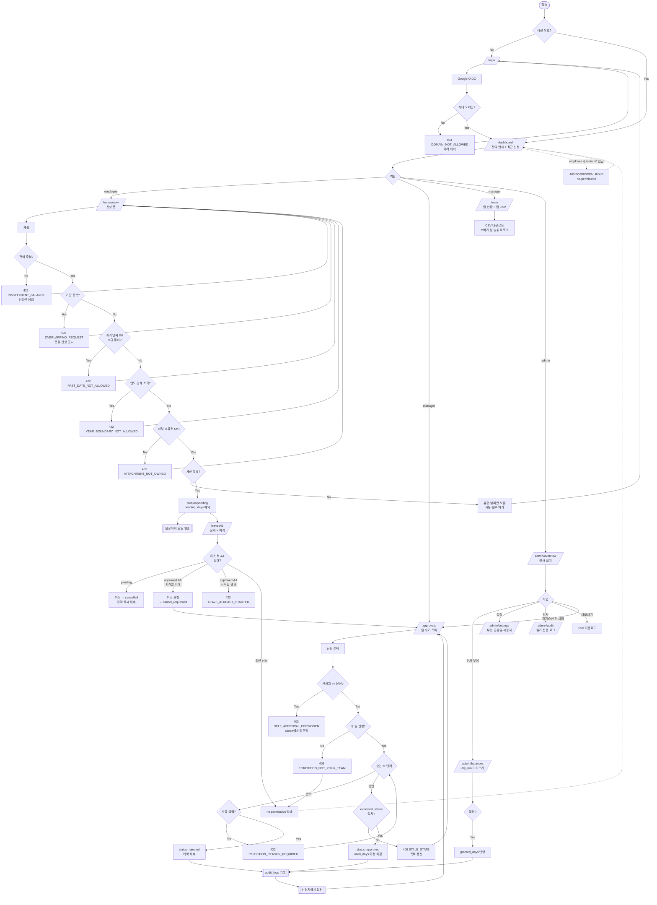

# PRD — 사내 휴가 신청/승인 서비스 (Leave Management)

> **Type**: `product-feature`
> **Feature Key**: `leave-management`
> **Status**: Draft
> **Last Updated**: 2026-08-04

---

## 1. Overview

### 1.1 Problem Statement

현재 휴가 신청은 메신저 DM과 스프레드시트로 처리된다. 이 방식에서 네 가지 문제가 발생한다.

1. **잔여 연차를 신청 시점에 알 수 없다.** 신청자는 관리자에게 물어보거나 스프레드시트를 직접 열어야 하고, 그 값은 최신이 아닐 수 있다. 잔여 일수를 초과한 신청이 승인된 뒤 뒤늦게 정정되는 일이 반복된다.
2. **승인 이력이 남지 않는다.** DM으로 "네 다녀오세요"라고 승인한 기록은 검색이 어렵고, 누가 언제 승인했는지 감사할 수 없다.
3. **팀 단위 일정 충돌을 사전에 볼 수 없다.** 같은 기간에 팀원 다수가 동시에 자리를 비우는 상황을 승인 시점에 파악할 방법이 없다.
4. **전사 현황 집계가 수작업이다.** 관리자가 분기별 연차 소진율을 내려면 스프레드시트를 수동 취합해야 하며, 근로기준법상 연차 사용 촉진 통지 대상자를 놓칠 위험이 있다.

### 1.2 Goals

| # | Goal | 측정 지표 |
|---|---|---|
| G-1 | 신청부터 승인까지 단일 웹 서비스에서 완결 | 메신저/스프레드시트 경유 신청 0건 |
| G-2 | 신청 시점에 잔여 연차를 실시간 검증 | 잔여 초과 승인 건수 0건 |
| G-3 | 모든 승인·반려에 불변 감사 이력 부여 | 승인 이벤트 100%가 `audit_logs`에 기록 |
| G-4 | 승인 리드타임 단축 | 신청→승인 중앙값 24시간 이내 |
| G-5 | 관리자 전사 현황을 실시간 조회 | 수작업 집계 시간 0분 |

### 1.3 Non-Goals

명시적으로 이번 범위 밖이다.

- **급여·정산 연동** — 미사용 연차 수당 계산, 급여 시스템 연동은 하지 않는다. 본 서비스는 일수만 관리한다.
- **근태(출퇴근) 관리** — 출퇴근 기록, 지각·조퇴, 초과근무 집계는 다루지 않는다.
- **모바일 네이티브 앱** — 반응형 웹만 제공한다. iOS/Android 앱은 만들지 않는다.
- **3단계 이상 결재선** — 신청자 → 팀장 1단계 승인만 지원한다. 본부장·대표 다단계 결재는 v2 이후.
- **외부 HR SaaS 마이그레이션 도구** — 기존 스프레드시트 데이터는 관리자가 CSV 업로드로 1회 이관하며, 자동 동기화 커넥터는 만들지 않는다.
- **다국어(i18n)** — 한국어 UI만 제공한다.
- **휴직·경조사 결재 문서 생성** — 증빙 서류 양식 자동 생성은 범위 밖이다(파일 첨부만 지원).

### 1.4 Scope

**포함**

- 휴가 신청 생성/조회/취소, 잔여 연차 실시간 검증, 기간 중복 차단 (**수정은 제공하지 않는다** — 취소 후 재신청)
- 팀장 승인/반려(반려 사유 필수), 자가 승인 차단
- 관리자 전사 현황 대시보드, 연차 부여·조정, 휴가 유형 관리
- 팀 캘린더(월 단위 팀원 휴가 가시화)
- 이메일 + Slack 알림
- CSV 내보내기, 감사 로그

**제외**

- §1.3 Non-Goals 전체
- 회원가입 플로우 — 계정은 Google Workspace SSO로만 생성된다(자체 비밀번호 가입 없음)
- 반차 미만 단위(시간 단위 휴가) — v1은 0.5일 단위가 최소

---

## 2. User Stories

### 2.1 Primary User

**US-1 (employee)**
As a **팀원**, I want to **잔여 연차를 보면서 휴가를 신청**하고 싶다, so that **초과 신청으로 반려당하거나 나중에 정정되는 일이 없다.**

**US-2 (employee)**
As a **팀원**, I want to **내 신청의 현재 상태(대기/승인/반려)를 한 화면에서 확인**하고 싶다, so that **팀장에게 승인됐는지 따로 묻지 않아도 된다.**

**US-3 (employee)**
As a **팀원**, I want to **승인 전 신청을 스스로 취소**하고 싶다, so that **일정이 바뀌었을 때 팀장을 번거롭게 하지 않는다.**

**US-4 (manager)**
As a **팀장**, I want to **내 팀의 대기 중인 신청을 한 목록에서 승인/반려**하고 싶다, so that **메신저를 뒤지지 않고 결재를 끝낼 수 있다.**

**US-5 (manager)**
As a **팀장**, I want to **승인 화면에서 같은 기간 팀원들의 휴가를 함께 보고** 싶다, so that **인력 공백이 겹치는 것을 승인 전에 알 수 있다.**

**US-6 (admin)**
As a **관리자**, I want to **전사 휴가 현황과 연차 소진율을 실시간으로 조회**하고 싶다, so that **분기 집계를 수작업으로 하지 않고 연차 사용 촉진 대상자를 놓치지 않는다.**

**US-7 (admin)**
As a **관리자**, I want to **연도별 연차를 일괄 부여하고 개인별로 조정**하고 싶다, so that **입사일 기준 연차 산정과 예외 처리를 시스템에서 끝낼 수 있다.**

### 2.2 Acceptance Criteria

#### AC-1 — 휴가 신청 성공 (US-1, FR-001)

```gherkin
Given employee "김팀원"의 2026년 잔여 연차가 10.0일이고
  And 2026-08-10 ~ 2026-08-12 기간에 기존 신청이 없고
  And 해당 기간에 주말·공휴일이 없을 때
When "김팀원"이 휴가 유형 "연차", 기간 2026-08-10 ~ 2026-08-12로 신청을 제출하면
Then 신청은 status "pending"으로 생성되고
  And 소요 일수는 3.0일로 계산되며
  And "김팀원"의 잔여 연차는 10.0일 그대로이고 pending 차감 예정 3.0일이 별도 표시되고
  And 팀장 "박팀장"에게 이메일과 Slack 알림이 발송된다
```

#### AC-2 — 잔여 연차 초과 신청 실패 (US-1, FR-002)

```gherkin
Given employee "김팀원"의 잔여 연차가 2.0일이고
  And pending 상태로 이미 1.0일이 예약되어 있을 때
When "김팀원"이 3.0일짜리 연차를 신청하면
Then 신청은 생성되지 않고
  And HTTP 422와 error code "INSUFFICIENT_BALANCE"가 반환되고
  And 응답에 available 1.0, requested 3.0이 포함되며
  And 신청 폼에 "잔여 연차 1.0일로 3.0일을 신청할 수 없습니다"가 표시된다
```

#### AC-3 — 기간 중복 신청 실패 (US-1, FR-003)

```gherkin
Given employee "김팀원"이 2026-08-10 ~ 2026-08-12 연차를 status "pending"으로 보유하고 있을 때
When "김팀원"이 2026-08-11 ~ 2026-08-13 기간으로 새 신청을 제출하면
Then 신청은 생성되지 않고
  And HTTP 409와 error code "OVERLAPPING_REQUEST"가 반환되고
  And 응답에 충돌한 기존 신청의 id와 기간이 포함된다
```

#### AC-4 — 과거 날짜 신청 실패 (FR-001)

```gherkin
Given 오늘이 2026-08-04이고
  And 휴가 유형 "연차"의 소급 신청 허용이 false일 때
When employee가 시작일 2026-08-01로 신청을 제출하면
Then HTTP 422와 error code "PAST_DATE_NOT_ALLOWED"가 반환된다

Given 휴가 유형 "병가"의 소급 신청 허용이 true일 때
When employee가 시작일 2026-08-01로 병가를 제출하면
Then 신청은 status "pending"으로 생성된다
```

#### AC-5 — 팀장 승인 (US-4, FR-007)

```gherkin
Given manager "박팀장"이 팀 "개발팀"의 팀장이고
  And "김팀원"(개발팀)의 신청 REQ-001이 status "pending"일 때
When "박팀장"이 REQ-001을 승인하면
Then REQ-001의 status는 "approved"로 바뀌고
  And "김팀원"의 잔여 연차에서 3.0일이 확정 차감되고
  And approved_by="박팀장", approved_at=현재시각이 기록되고
  And audit_logs에 action "approve" 레코드가 1건 생성되고
  And "김팀원"에게 승인 알림이 발송된다
```

#### AC-6 — 반려 사유 누락 실패 (US-4, FR-007)

```gherkin
Given manager "박팀장"이 pending 신청 REQ-001을 보고 있을 때
When "박팀장"이 반려 사유를 비운 채 반려를 요청하면
Then HTTP 422와 error code "REJECTION_REASON_REQUIRED"가 반환되고
  And REQ-001의 status는 "pending" 그대로다
```

#### AC-7 — 타 팀 신청 접근 권한 부족 (FR-006, §4.5)

```gherkin
Given manager "박팀장"이 팀 "개발팀"의 팀장이고
  And 신청 REQ-099가 팀 "디자인팀" 소속 employee의 것일 때
When "박팀장"이 GET /api/leave-requests/REQ-099를 호출하면
Then HTTP 403과 error code "FORBIDDEN_NOT_YOUR_TEAM"이 반환되고
  And 화면에는 no-permission 상태가 렌더링된다
```

#### AC-8 — 자가 승인 차단 (FR-008)

```gherkin
Given manager "박팀장"이 본인 이름으로 휴가 신청 REQ-010을 제출했을 때
When "박팀장"이 REQ-010을 승인하려 하면
Then HTTP 403과 error code "SELF_APPROVAL_FORBIDDEN"이 반환되고
  And REQ-010은 role "admin" 또는 상위 승인자에게만 승인 목록으로 노출된다
```

#### AC-9 — 대기 중 신청 취소 (US-3, FR-005)

```gherkin
Given employee "김팀원"의 신청 REQ-001이 status "pending"일 때
When "김팀원"이 REQ-001을 취소하면
Then REQ-001의 status는 "cancelled"로 바뀌고
  And pending 예약 일수 3.0일이 해제되며
  And 팀장의 승인 대기 목록에서 사라진다
```

#### AC-10 — 승인 후 취소 요청 (FR-013)

```gherkin
Given 신청 REQ-001이 status "approved"이고 시작일이 2026-08-10(미래)일 때
When "김팀원"이 취소를 요청하면
Then REQ-001의 status는 "cancel_requested"로 바뀌고
  And 팀장에게 취소 승인 요청 알림이 발송되고
  And 잔여 연차는 팀장이 취소를 승인할 때까지 차감된 상태를 유지한다

Given 신청 REQ-002가 status "approved"이고 시작일이 이미 지났을 때
When "김팀원"이 취소를 요청하면
Then HTTP 422와 error code "LEAVE_ALREADY_STARTED"가 반환되고
  And 화면에 "이미 시작된 휴가는 관리자에게 문의하세요"가 표시된다
```

#### AC-11 — 세션 만료 (§4.5)

```gherkin
Given employee가 신청 폼을 작성하는 동안 세션이 만료되었을 때
When 제출 버튼을 누르면
Then HTTP 401과 error code "SESSION_EXPIRED"가 반환되고
  And 휴가 유형·시작일·종료일·반차 슬롯만 sessionStorage에 보존된 채 /login으로 이동하고
  And 휴가 사유와 첨부 파일은 민감정보이므로 보존되지 않고
  And 재로그인 후 원래 폼으로 복귀해 날짜·유형이 복원되며 사유 입력란은 비어 있다
```

#### AC-15 — 무급휴가 신청 (연차 부여 없이도 성공, FR-002)

```gherkin
Given employee "신입사원"의 2026년 leave_balances 행이 존재하지 않고
  And 휴가 유형 "무급휴가"의 deducts_balance가 false일 때
When "신입사원"이 무급휴가 2.0일을 신청하면
Then 신청은 status "pending"으로 생성되고
  And leave_balances에는 어떤 행도 생성되거나 갱신되지 않고
  And 서버는 500이 아닌 201을 반환한다

Given 같은 상태에서 휴가 유형 "연차"(deducts_balance=true)로 신청하면
Then leave_balances 행이 granted_days=0.0으로 upsert된 뒤
  And HTTP 422 "INSUFFICIENT_BALANCE"가 반환된다 (details: {available: 0.0, requested: 2.0})
```

#### AC-16 — 타인 첨부 파일 도용 차단 (FR-019, §4.5)

```gherkin
Given employee "김팀원"이 진단서를 업로드해 attachment_id "att_001"을 받았고
  And 해당 첨부는 아직 어떤 신청에도 연결되지 않았을 때
When employee "이팀원"이 attachment_ids: ["att_001"]로 병가를 제출하면
Then HTTP 403과 error code "ATTACHMENT_NOT_OWNED"가 반환되고
  And 신청은 생성되지 않는다

Given "att_001"이 이미 "김팀원"의 신청 REQ-001에 연결되어 있을 때
When "김팀원"이 attachment_ids: ["att_001"]로 새 신청을 제출하면
Then HTTP 422와 error code "ATTACHMENT_ALREADY_LINKED"가 반환된다
```

#### AC-17 — 연도 경계 신청 차단 (FR-001)

```gherkin
Given employee "김팀원"이 2026-12-28 ~ 2027-01-05 기간으로 연차를 신청할 때
When 신청을 제출하면
Then HTTP 422와 error code "YEAR_BOUNDARY_NOT_ALLOWED"가 반환되고
  And 화면에 "연도를 넘는 휴가는 연도별로 나누어 신청해주세요"가 표시된다
```

#### AC-12 — 관리자 전사 현황 조회 (US-6, FR-009)

```gherkin
Given admin "이관리"가 로그인했고
  And 전사 employee가 120명일 때
When "이관리"가 /admin/overview에서 기간 2026-01-01 ~ 2026-12-31을 조회하면
Then 전 부서 신청 건수, 상태별 분포, 팀별 연차 소진율이 표시되고
  And 잔여 연차 5일 초과 보유자 목록(연차 사용 촉진 대상)이 함께 표시되고
  And p95 응답 시간은 500ms 이하다
```

#### AC-13 — employee의 관리자 페이지 접근 차단 (§4.5)

```gherkin
Given employee "김팀원"이 로그인한 상태일 때
When "김팀원"이 /admin/overview로 이동하면
Then 서버는 HTTP 403 "FORBIDDEN_ROLE"을 반환하고
  And 화면은 no-permission 상태를 렌더링하며 /dashboard로 돌아가는 링크를 제공한다
```

#### AC-14 — 동시 승인 경합 (FR-007)

```gherkin
Given 신청 REQ-001이 status "pending"이고
  And manager "박팀장"과 admin "이관리"가 동시에 승인을 시도할 때
When 두 요청이 동시에 도착하면
Then 하나만 성공하여 status "approved"가 되고
  And 나머지 요청은 HTTP 409 "STALE_STATE"를 받고
  And 잔여 연차는 정확히 1회만 차감된다
```

### 2.3 User Roles

| Role Key | 한국어 명칭 | 권한 범위 |
|---|---|---|
| `employee` | 팀원(신청자) | 본인 휴가 신청 생성·조회·취소, 본인 잔여 연차 조회, 소속 팀 캘린더 조회. **수정 기능은 제공하지 않는다** — 취소 후 재신청한다(감사 이력 단순화) |
| `manager` | 팀장(승인자) | `employee` 권한 전체 + 본인이 팀장인 팀의 신청 조회·승인·반려·취소승인, 팀 현황 조회·팀 범위 CSV 내보내기. 본인 신청은 승인 불가 |
| `admin` | 관리자(HR) | 전사 모든 신청 조회·승인·반려·강제취소, 연차 부여·조정, 휴가 유형·공휴일 관리, 사용자·팀 관리, CSV 내보내기, 감사 로그 열람 |

> 역할은 사용자당 1개만 부여된다. `manager`는 `employee` 권한을 포함하고, `admin`은 `manager` 권한을 포함한다(계층적 포함).

---

## 3. Functional Requirements

| ID | Requirement | Priority | Dependencies |
|---|---|---|---|
| FR-001 | employee는 휴가 유형·시작일·종료일·사유를 입력해 신청을 제출한다. 소요 일수는 주말과 등록된 공휴일을 제외해 서버가 계산한다. 반차 선택 시 0.5일로 계산한다. 과거 날짜는 휴가 유형의 `allow_backdate=true`일 때만 허용한다. 회계연도(1/1~12/31)를 넘는 기간은 422 `YEAR_BOUNDARY_NOT_ALLOWED`로 거부한다. | P0 | FR-018 |
| FR-002 | `deducts_balance=true` 유형은 제출 시 `잔여 = 부여 - 확정차감 - pending예약`을 검증하고, 부족하면 422 `INSUFFICIENT_BALANCE`로 거부한다. 해당 연도 잔여 행이 없으면 `granted_days=0`으로 upsert한 뒤 검증하므로 미부여 사용자는 정상적으로 422를 받는다(500이 아니다). `deducts_balance=false` 유형(무급휴가)은 잔여 행을 생성하지도 갱신하지도 않고 검증을 건너뛴다. | P0 | FR-001, FR-010 |
| FR-003 | 동일 employee의 `pending`·`approved`·`cancel_requested` 신청과 날짜가 하루라도 겹치면 409 `OVERLAPPING_REQUEST`로 거부한다. | P0 | FR-001 |
| FR-004 | employee는 본인 신청 목록을 상태·기간·유형으로 필터링해 조회하고, 상세에서 승인 이력 타임라인을 본다. | P0 | FR-001 |
| FR-005 | employee는 `pending` 상태의 본인 신청을 취소한다. 취소 시 pending 예약 일수가 즉시 해제된다. | P0 | FR-001 |
| FR-006 | manager는 본인이 팀장인 팀의 `pending`·`cancel_requested` 신청 목록을 신청일 오름차순으로 조회한다. 타 팀 신청은 403으로 차단된다. | P0 | FR-001 |
| FR-007 | manager는 신청을 승인 또는 반려한다. 반려 시 사유(1~500자)가 필수다. 승인 시 잔여 연차가 확정 차감되고 상태 전이는 낙관적 락으로 보호된다. | P0 | FR-006 |
| FR-008 | **역할과 무관하게** 승인자 == 신청자인 건은 본인 승인 목록에서 제외되고, 승인 API 호출 시 403 `SELF_APPROVAL_FORBIDDEN`을 반환한다. `manager` 본인 건은 `admin`이, `admin` 본인 건은 **다른 `admin`**이 처리한다. 이 때문에 `admin`은 최소 2명을 유지해야 하며, 1명뿐인 상태에서 해당 admin이 신청하면 422 `NO_ELIGIBLE_APPROVER`로 제출이 거부된다. | P0 | FR-007, FR-018 |
| FR-009 | admin은 전사 현황 대시보드에서 기간·팀·유형·상태별 집계(신청 건수, 상태 분포, 팀별 소진율, 잔여 5일 초과 보유자)를 조회한다. | P0 | FR-001, FR-010 |
| FR-010 | admin은 연도별 연차를 전 사용자에게 일괄 부여하고, 개인별로 가감 조정한다. `by_hire_date` 산정 규칙: **입사 1년 미만은 입사일로부터 매월 개근 시 1일씩(연 최대 11일), 1년 이상은 15일, 3년 이상부터 2년마다 1일 가산, 상한 25일**(근로기준법 제60조). 모든 부여·조정은 사유와 함께 `leave_balance_adjustments`에 기록된다. | P0 | FR-018 |
| FR-011 | 상태 전이(제출/승인/반려/취소요청/취소승인) 시 관련자에게 이메일과 Slack DM을 발송한다. Slack 수신자는 `users.slack_user_id`로 매핑하며, 값이 없으면 이메일만 발송하고 Slack 건은 `skipped`로 종결한다. 발송 실패는 재시도 큐에 적재되며 최대 3회 재시도한다. 알림 실패가 상태 전이를 롤백하지 않는다. | P1 | FR-007, FR-018 |
| FR-012 | 모든 로그인 사용자는 소속 팀의 월 단위 캘린더에서 팀원의 `approved` 휴가를 본다. manager·admin은 `pending`도 회색으로 함께 본다. | P1 | FR-007 |
| FR-013 | employee는 `approved` 상태이면서 시작일이 미래인 신청에 취소를 요청한다(`cancel_requested`). manager가 승인하면 `cancelled`가 되고 차감이 복원된다. 시작일이 지난 건은 422 `LEAVE_ALREADY_STARTED`로 거부한다. | P1 | FR-007 |
| FR-014 | `admin`(전사)과 `manager`(본인 팀 한정)는 조회 중인 필터 조건 그대로 신청 목록과 잔여 현황을 CSV(UTF-8 BOM)로 내려받는다. 서버가 역할에 맞게 범위를 강제 축소한다. | P1 | FR-009 |
| FR-015 | 모든 상태 전이와 잔여 조정은 `audit_logs`에 actor·action·target·before/after·IP·시각으로 기록되며 수정·삭제할 수 없다. admin만 열람한다. | P1 | FR-007, FR-010 |
| FR-016 | admin은 휴가 유형을 **화면에서 CRUD**한다. 각 유형은 `연차차감 여부`, `반차 허용 여부`, `소급 신청 허용 여부`, `증빙 첨부 필수 여부`를 갖는다. 기본 유형(연차/반차/병가/경조사/무급휴가)은 **Phase 1 시드로 제공**되므로 FR-001은 이 FR의 완료를 기다리지 않는다 — 본 FR의 범위는 관리 UI뿐이다. | P2 | FR-018 |
| FR-017 | admin은 공휴일을 **화면에서** 연 단위로 등록·수정한다. 등록된 공휴일과 주말은 소요 일수 계산에서 제외된다. 당해·익년 공휴일은 **Phase 1 시드로 제공**되므로 FR-001은 이 FR의 완료를 기다리지 않는다 — 본 FR의 범위는 관리 UI뿐이다. | P2 | FR-018 |
| FR-018 | 최초 SSO 로그인 시 사용자가 `team_id = NULL`, `role = employee`, `hire_date = 로그인일`로 자동 생성되고 admin에게 "미배정 사용자" 알림이 간다. admin은 팀 배정·역할 지정·입사일 정정을 수행한다. 팀당 팀장은 1명이며, 팀장 미지정 팀의 신청은 `admin` 승인 목록으로 라우팅된다. **팀 미배정 사용자는 신청을 제출할 수 없다**(422 `NO_TEAM_ASSIGNED`) — `leave_requests.team_id`가 NOT NULL이기 때문이다. | P0 | — |
| FR-019 | 증빙 파일은 신청 제출과 분리된 전용 엔드포인트로 업로드하며, 업로드자(`uploaded_by`)가 기록된다. 신청 제출 시 서버는 지정된 `attachment_ids`가 **모두 본인이 업로드했고 아직 어떤 신청에도 연결되지 않았음**을 검증한다. 증빙 필수 유형(병가·경조사)에 파일이 없으면 422 `ATTACHMENT_REQUIRED`로 거부한다. 열람은 5분 만료 서명 URL로만 가능하며 발급 전 신청 접근 권한을 검증한다. | P2 | FR-016 |
| FR-020 | admin은 기존 스프레드시트의 연차 초기값을 CSV 업로드로 1회 이관한다. 업로드는 `dry_run` 미리보기(행별 검증 결과·오류 사유 표시) 후 확정하며, 확정 결과는 `leave_balance_adjustments`와 `audit_logs`에 기록된다. | P1 | FR-010 |

**무모순 확인**

- 인증 정책: FR 전체에서 `/login`을 제외한 모든 페이지·API는 인증 필수다. 비로그인 열람을 허용하는 FR은 없다.
- 잔여 검증: FR-002가 유일한 검증 지점이며, 무급휴가 예외는 FR-016의 `연차차감 여부=false`로 일관되게 표현된다. `deducts_balance=false` 유형은 §5.2 상태 전이표의 잔여 갱신도 전부 건너뛴다.
- 취소 경로: `pending` 취소는 FR-005(즉시), `approved` 취소는 FR-013(팀장 승인 필요)으로 상태에 따라 배타적으로 분리된다.
- 승인 주체: FR-006/007은 팀장 1단계 승인만 규정하고, FR-008(자가 승인)과 FR-018(팀장 미지정)의 예외는 모두 `admin`으로 수렴한다. `admin` 본인 신청만 다른 `admin`으로 수렴한다. 다단계 결재는 §1.3에서 제외되었다.
- CSV 범위: FR-014와 §4.5 인가표는 모두 "`manager`는 본인 팀, `admin`은 전사"로 일치하며, 엔드포인트도 `/api/admin/*`이 아닌 `/api/exports`에 둔다(§5.1).
- 연도 귀속: FR-001이 회계연도 경계 신청을 차단하므로, §5.2 `leave_balances`의 연도별 분할 차감 규칙은 필요 없다. 이월 정책은 §4.3에 단일 정의된다.
- 우선순위 정합: P0인 FR-001은 P2인 FR-016·FR-017의 **관리 UI**에 의존하지 않는다. 필요한 기본 데이터는 Phase 1 시드로 선행 공급된다.

---

## 4. Non-Functional Requirements

### 4.0 Scale Grade

**`Hobby`** — 사내 임직원 전용으로 대상 사용자는 약 200명, 실사용 DAU 100명 미만(월말·연말에 피크)으로 1,000 미만 구간이다. 단일 리전 단일 인스턴스 + 관리형 PostgreSQL로 충분하며, 멀티 리전·샤딩·전용 캐시 계층은 도입하지 않는다.

> 대상 인원이 1,000명을 넘어서면 §4.1 목표와 §5.3 아키텍처를 Startup 등급 기준으로 재산정한다.

### 4.1 Performance

| 항목 | 목표 | 조건 |
|---|---|---|
| 신청 목록 조회 `GET /api/leave-requests` | p95 < 300ms, p99 < 600ms | 100건 페이지네이션 |
| 신청 제출 `POST /api/leave-requests` | p95 < 500ms (알림 발송 제외, 큐 적재까지) | — |
| 승인/반려 `PATCH .../decision` | p95 < 400ms | — |
| 관리자 대시보드 집계 `GET /api/admin/overview` | p95 < 500ms, p99 < 1,000ms | 사용자 200명 × 1년치 = 약 5,000건 |
| 팀 캘린더 `GET /api/calendar` | p95 < 300ms | 1개월 × 팀원 20명 |
| CSV 내보내기 | 10,000행 < 5초, 상한 50,000행 < 15초 | 동기 스트리밍 응답. 50,000행 초과는 422 `EXPORT_TOO_LARGE` |
| 증빙 업로드 `POST /api/attachments` | 5MB 파일 p95 < 2s | 매직 넘버 검증 포함 |
| 처리량 | 30 req/s 지속, 피크 100 req/s (30초) | 연말 신청 집중 구간 |
| 동시 사용자 | 동시 접속 100명에서 위 목표 유지 | — |
| 초기 로딩(LCP) | 모바일 4G 기준 < 2.5s | 주요 3개 페이지 |

### 4.2 Availability

- 목표 가용성 **99.5%/월** (월 허용 다운타임 약 3.6시간). 사내 업무시간(평일 09:00~19:00 KST)에는 99.9%를 목표로 한다.
- 계획 점검은 주말 또는 평일 22:00 이후에만 수행하며 최소 24시간 전 Slack 공지한다.
- **DB 장애 시**: 애플리케이션은 읽기·쓰기 모두 503과 정적 안내 페이지를 반환한다. 부분 성공 상태를 만들지 않는다.
- **알림 채널(SMTP/Slack) 장애 시**: 신청·승인 트랜잭션은 정상 커밋되고, 알림은 재시도 큐에 적재된다(FR-011). 알림 실패로 결재가 막히지 않는다.
- **파일 스토리지 장애 시**: 증빙 첨부가 필수인 유형만 신청이 차단되고(503 `STORAGE_UNAVAILABLE`), 연차 등 첨부 불필요 유형은 정상 동작한다.
- 헬스체크 `GET /healthz`(liveness), `GET /readyz`(DB 연결 포함) 제공.

### 4.3 Data

| 데이터 | 보관 기간 | 근거·정책 |
|---|---|---|
| 휴가 신청·승인 이력 | 퇴사 후 **5년** | `audit_logs` 보관 기간과 일치시켜 참조 무결성 유지(근로기준법 최소 3년보다 길게 잡음) |
| `audit_logs` | **5년**, append-only | 내부 감사 대응. 수정·삭제 API 없음. **개인정보를 저장하지 않는다**(아래 참조) |
| 증빙 첨부 파일 | 신청 종료일 + **1년** 후 자동 삭제 | 진단서 등 민감정보 최소 보관 |
| 미연결 첨부(업로드 후 신청에 미연결) | **24시간** 후 자동 삭제 | 고아 파일 누적 방지 |
| 세션·리프레시 토큰 | 만료 후 **7일** | 이상 접근 조사용 |
| 애플리케이션 로그 | **90일** | — |

**개인정보**

- 수집 항목: 이름, 사내 이메일, 부서, 입사일, 프로필 이미지 URL(Google Workspace 제공분).
- 휴가 사유와 증빙 파일은 **민감정보**로 취급한다. 사유 필드는 신청자 본인, 해당 팀장, `admin`만 조회할 수 있으며 팀 캘린더에는 유형만 노출하고 사유는 노출하지 않는다.
- 증빙 파일은 비공개 버킷에 저장하고, 접근은 5분 만료 서명 URL로만 허용한다.
- 저장 시 암호화: DB는 스토리지 레벨 암호화(AES-256), 증빙 파일은 버킷 SSE 적용.

**감사 로그의 개인정보 비저장 원칙 (파기 정책과의 충돌 제거)**

`audit_logs`는 append-only라 사후 삭제·치환이 불가능하다. 따라서 **개인정보를 애초에 담지 않는다.**

- `before_state` / `after_state`에는 **화이트리스트 필드만** 기록한다: `status`, `days`, `start_date`, `end_date`, `leave_type_id`, `granted_days`, `used_days`, `pending_days`.
- **금지 필드**: `reason`(휴가 사유), `rejection_reason`, `name`, `email`, 첨부 파일명. 이 값들은 `leave_requests` 본문에만 존재하며 보관 기간 만료·파기 요청 시 정상적으로 삭제·치환된다.
- 주체·대상은 식별자(`actor_id`, `target_id`)로만 남긴다. 이름·이메일이 비식별 토큰으로 치환되어도 로그는 유효하다.
- 검증: 일 1회 배치가 `audit_logs`의 JSONB 키 집합이 화이트리스트를 벗어나지 않는지 점검하고 위반 시 알람한다.

**연차 이월·소멸 정책**

- 미사용 연차는 **이월하지 않는다.** `expires_at`(해당 연도 12/31)이 지나면 소멸하며, 일 1회 배치가 만료 잔여를 0으로 마감하고 그 사실을 `leave_balance_adjustments`에 사유 `EXPIRED`로 기록한다.
- 소멸 30일 전 잔여 보유자에게 알림을 발송한다(FR-011 채널 재사용).
- 미사용 연차 수당 정산은 §1.3에 따라 범위 밖이다 — 소멸 기록만 남기고 금액은 다루지 않는다.

**삭제 정책**

- 퇴사자는 즉시 로그인이 차단되고(`users.status = 'inactive'`) 계정은 삭제하지 않는다 — 승인 이력의 참조 무결성을 유지하기 위함이다.
- 보관 기간 만료 데이터는 일 1회 배치가 삭제하며, 삭제 사실 자체를 `audit_logs`에 기록한다(대상 식별자만).
- 개인정보 파기 요청 시 `admin`이 이름·이메일을 비식별 토큰(`퇴사자-{id}`)으로 치환하고, 해당 사용자의 모든 신청에서 `reason`·`rejection_reason`을 `[파기됨]`으로 치환한다. 신청 건수·일수 등 통계값은 유지된다.

### 4.4 Recovery

| 항목 | 목표 |
|---|---|
| RTO | **4시간** (업무시간 기준). 관리형 DB 스냅샷 복원 + 앱 재배포 |
| RPO | **1시간**. PostgreSQL 자동 백업 일 1회 + WAL 아카이빙(PITR) |
| 백업 보관 | 일 백업 30일, 월 백업 12개월 |
| 복구 훈련 | 분기 1회 스테이징에 스냅샷 복원 리허설, 결과를 문서화 |

### 4.5 Security

**인증**

- Google Workspace **OIDC SSO**만 사용한다. 자체 비밀번호 저장 없음.
- 허용 도메인 화이트리스트(사내 도메인)를 강제하고, 외부 도메인 계정은 로그인 단계에서 거부한다.
- 세션은 **httpOnly + Secure + SameSite=Lax 쿠키**의 서버사이드 세션. 유효기간 8시간, 슬라이딩 갱신 없음(매일 재로그인).
- 상태 변경 요청(POST/PATCH/DELETE)에 **CSRF 토큰**(double-submit)을 요구한다.

**인가 규칙 — 어느 역할이 어느 리소스에**

| 리소스 / 액션 | `employee` | `manager` | `admin` |
|---|---|---|---|
| 본인 신청 생성 | ✅ | ✅ | ✅ |
| 본인 신청 조회·취소 | ✅ | ✅ | ✅ |
| 본인 신청 **수정** | ❌ 기능 없음 | ❌ 기능 없음 | ❌ 기능 없음 |
| 타인 신청 조회 | ❌ | ✅ 본인 팀 한정 | ✅ 전사 |
| 신청 승인/반려 | ❌ | ✅ 본인 팀 한정, **본인 건 제외** | ✅ 전사 |
| 취소 요청 승인 | ❌ | ✅ 본인 팀 한정 | ✅ 전사 |
| 본인 잔여 연차 조회 | ✅ | ✅ | ✅ |
| 타인 잔여 연차 조회 | ❌ | ✅ 본인 팀 한정 | ✅ 전사 |
| 증빙 파일 업로드 | ✅ 본인 명의 | ✅ 본인 명의 | ✅ 본인 명의 |
| 증빙 서명 URL 발급 | ✅ 본인 신청 건 | ✅ 본인 팀 건 | ✅ 전사 |
| 연차 부여·조정 | ❌ | ❌ | ✅ |
| 팀 캘린더 조회 | ✅ 소속 팀, `approved`만, 사유 비노출 | ✅ 소속 팀 + `pending` 포함 | ✅ 전사 |
| 휴가 사유·증빙 파일 열람 | ✅ 본인 건만 | ✅ 본인 팀 건 | ✅ 전사 |
| 전사 대시보드 `/admin/*` | ❌ | ❌ | ✅ |
| 휴가 유형·공휴일·사용자·팀 관리 | ❌ | ❌ | ✅ |
| CSV 내보내기 | ❌ | ✅ 본인 팀 한정 | ✅ 전사 |
| 감사 로그 열람 | ❌ | ❌ | ✅ |

- 인가는 **서버에서 매 요청 검증**한다. 프런트엔드의 메뉴 숨김은 UX 보조일 뿐 보안 경계가 아니다.
- 리소스 소유권 검증은 미들웨어 단일 지점(`assertCanAccessRequest(actor, request)`)에서 수행해 엔드포인트별 누락을 막는다.
- 권한 부족은 **403 `FORBIDDEN_*`**, 미인증은 **401 `SESSION_EXPIRED`/`UNAUTHENTICATED`**로 구분한다. 존재하지 않는 리소스와 권한 없는 리소스는 모두 403으로 응답해 존재 여부가 새지 않게 한다.

**전송·저장 보호**

- 전 구간 HTTPS(TLS 1.2+), HSTS `max-age=31536000; includeSubDomains`.
- DB 연결은 TLS 필수, 자격증명은 환경변수/시크릿 매니저로만 주입한다.
- 증빙 파일은 비공개 버킷 + 5분 만료 서명 URL. 원본 URL 직접 노출 금지.
- 보안 헤더: `Content-Security-Policy`(inline script 금지), `X-Content-Type-Options: nosniff`, `Referrer-Policy: same-origin`, `X-Frame-Options: DENY`.

**입력 검증**

- 모든 요청 바디를 **서버에서 스키마 검증**(zod)한다. 클라이언트 검증은 UX 보조다.
- 날짜: ISO 8601(`YYYY-MM-DD`), `start_date <= end_date`, 기간 최대 60일, **`start_date`와 `end_date`의 연도가 동일**해야 한다(연도를 넘는 신청은 422 `YEAR_BOUNDARY_NOT_ALLOWED` — 연도별 잔여 귀속 모호성을 원천 제거).
- 반차: `half_day_slot` 지정 시 `start_date == end_date`. **동일 일자에 오전·오후 반차를 각각 신청할 수 없다** — 하루 전체를 쉬려면 연차 1일로 신청한다(§5.2 `EXCLUDE` 제약이 동일 일자 중복을 차단하므로 애플리케이션도 422 `SAME_DAY_HALF_DAY_CONFLICT`로 먼저 안내한다).
- 사유: 1~500자, HTML 태그 제거 후 저장. 렌더링 시 이스케이프해 XSS를 차단한다.
- 첨부: 확장자 + MIME 타입 + 매직 넘버 3중 검증, 파일당 10MB, 신청당 최대 5개, 업로드 사용자당 분당 20회·일 200개.
- 첨부 소유권: 신청에 연결할 때 `uploaded_by == 요청자` **및** `request_id IS NULL`을 강제한다. 위반 시 403 `ATTACHMENT_NOT_OWNED`. 서명 URL 발급 전에도 `assertCanAccessRequest`를 통과해야 한다.
- 목록 API: `page` 1~1000, `size` 1~100으로 상한을 강제한다.
- SQL은 ORM 파라미터 바인딩만 사용하고 문자열 결합 쿼리를 금지한다.
- 레이트 리밋: 신청 생성 사용자당 분당 10회, 첨부 업로드 사용자당 분당 20회, 로그인 IP당 분당 20회, 전체 API 사용자당 분당 300회. 초과 시 429 `RATE_LIMITED`.
- 클라이언트 임시 저장(AC-11)에는 **휴가 사유와 첨부를 포함하지 않는다** — 유형·날짜·반차 슬롯만 `sessionStorage`에 보존하고, 사유는 §4.3 민감정보 취급 원칙에 따라 재입력한다.

---

## 5. Technical Design

### 5.1 API Specification

공통: Base URL `/api`, 인증은 세션 쿠키. 모든 에러는 아래 형태를 따른다.

```json
{ "error": { "code": "STRING_CODE", "message": "사용자 표시 메시지", "details": {} } }
```

공통 에러: `401 UNAUTHENTICATED` / `401 SESSION_EXPIRED` / `403 FORBIDDEN_ROLE` / `422 VALIDATION_ERROR` / `429 RATE_LIMITED` / `500 INTERNAL_ERROR`

---

#### `POST /api/leave-requests` — 휴가 신청 생성

**인가 주체**: `employee`, `manager`, `admin` (본인 명의만)

Request
```json
{
  "leave_type_id": "lt_annual",
  "start_date": "2026-08-10",
  "end_date": "2026-08-12",
  "half_day_slot": null,
  "reason": "가족 여행",
  "attachment_ids": []
}
```
`half_day_slot`: `null` | `"am"` | `"pm"` — 지정 시 `start_date == end_date`여야 하고 소요 0.5일.

Response `201`
```json
{
  "id": "req_01J8XK",
  "status": "pending",
  "leave_type": { "id": "lt_annual", "name": "연차", "deducts_balance": true },
  "start_date": "2026-08-10",
  "end_date": "2026-08-12",
  "days": 3.0,
  "reason": "가족 여행",
  "applicant": { "id": "usr_001", "name": "김팀원", "team": "개발팀" },
  "approver": { "id": "usr_010", "name": "박팀장" },
  "balance_after_pending": { "granted": 15.0, "used": 5.0, "pending": 3.0, "available": 7.0 },
  "created_at": "2026-08-04T02:11:00Z"
}
```

Error
| Status | Code | 조건 |
|---|---|---|
| 422 | `INSUFFICIENT_BALANCE` | 잔여 < 요청 일수. `details: {available, requested}` |
| 409 | `OVERLAPPING_REQUEST` | 기존 신청과 기간 중복. `details: {conflicting_request_id, start_date, end_date}` |
| 422 | `PAST_DATE_NOT_ALLOWED` | `start_date` < 오늘 && `allow_backdate=false` |
| 422 | `INVALID_DATE_RANGE` | `start_date > end_date` 또는 기간 > 60일 |
| 422 | `YEAR_BOUNDARY_NOT_ALLOWED` | `start_date`와 `end_date`의 연도가 다름 |
| 422 | `ZERO_WORKING_DAYS` | 기간 전체가 주말·공휴일 |
| 422 | `ATTACHMENT_REQUIRED` | 증빙 필수 유형인데 첨부 없음 |
| 403 | `ATTACHMENT_NOT_OWNED` | `attachment_ids` 중 `uploaded_by ≠ 요청자`인 건 존재 |
| 422 | `ATTACHMENT_ALREADY_LINKED` | 이미 다른 신청에 연결된 첨부 지정 |
| 422 | `HALF_DAY_NOT_ALLOWED` | 반차 미허용 유형에 `half_day_slot` 지정 |
| 422 | `SAME_DAY_HALF_DAY_CONFLICT` | 동일 일자에 반차가 이미 존재 |
| 422 | `NO_ELIGIBLE_APPROVER` | 승인 가능한 주체가 0명(admin 1명 조직에서 해당 admin이 신청) |
| 422 | `NO_TEAM_ASSIGNED` | 신청자의 `team_id`가 NULL(admin 배정 전). "관리자에게 팀 배정을 요청하세요" 안내 |
| 404 | `LEAVE_TYPE_NOT_FOUND` | 비활성/미존재 유형 |
| 503 | `STORAGE_UNAVAILABLE` | 첨부 필수 유형인데 스토리지 장애 |

> `deducts_balance=false` 유형은 `INSUFFICIENT_BALANCE` 검증을 수행하지 않으며 `leave_balances`를 읽지도 쓰지도 않는다. `deducts_balance=true` 유형은 잔여 행이 없으면 `granted_days=0`으로 upsert한 뒤 검증하므로 미부여 사용자도 500이 아닌 422를 받는다(AC-15).

---

#### `GET /api/leave-requests` — 신청 목록 조회

**인가 주체**: `employee`(본인만) / `manager`(본인 + 본인 팀) / `admin`(전사). `scope` 파라미터로 요청하되 서버가 역할에 맞게 강제 축소한다.

Query: `scope=mine|team|all` (기본 `mine`), `status`(csv), `leave_type_id`, `from`, `to`, `team_id`(admin 전용), `page`(기본 1), `size`(기본 20, 최대 100), `sort=created_at:desc|start_date:asc`

Response `200`
```json
{
  "items": [
    { "id": "req_01J8XK", "status": "pending", "leave_type_name": "연차",
      "start_date": "2026-08-10", "end_date": "2026-08-12", "days": 3.0,
      "applicant": { "id": "usr_001", "name": "김팀원", "team": "개발팀" },
      "created_at": "2026-08-04T02:11:00Z" }
  ],
  "page": { "current": 1, "size": 20, "total_items": 37, "total_pages": 2 }
}
```

Error: `403 FORBIDDEN_SCOPE`(권한 밖 scope 요청), `422 INVALID_QUERY_PARAM`

---

#### `GET /api/leave-requests/{id}` — 신청 상세

**인가 주체**: 신청자 본인 / 해당 팀 `manager` / `admin`

Response `200` — 생성 응답 필드 + `history[]`(상태 전이 타임라인), `attachments[]`(서명 URL), `rejection_reason`

Error: `403 FORBIDDEN_NOT_YOUR_TEAM`(권한 없음 또는 미존재 — 존재 여부 비노출), `404`는 사용하지 않는다.

---

#### `PATCH /api/leave-requests/{id}/decision` — 승인/반려

**인가 주체**: 해당 팀 `manager`(본인 신청 제외) / `admin`

Request
```json
{ "action": "approve", "comment": "확인했습니다", "expected_status": "pending" }
```
`action`: `"approve"` | `"reject"`. `reject`일 때 `comment` 필수(1~500자). `expected_status`는 낙관적 락 키다.

Response `200`
```json
{
  "id": "req_01J8XK",
  "status": "approved",
  "decided_by": { "id": "usr_010", "name": "박팀장" },
  "decided_at": "2026-08-04T05:30:00Z",
  "applicant_balance": { "granted": 15.0, "used": 8.0, "pending": 0.0, "available": 7.0 }
}
```

Error
| Status | Code | 조건 |
|---|---|---|
| 403 | `SELF_APPROVAL_FORBIDDEN` | 승인자 == 신청자 |
| 403 | `FORBIDDEN_NOT_YOUR_TEAM` | 타 팀 신청 |
| 409 | `STALE_STATE` | 현재 상태 ≠ `expected_status`. `details: {current_status}` |
| 422 | `REJECTION_REASON_REQUIRED` | `action=reject`인데 `comment` 없음 |

> 승인 시점의 잔여 부족은 발생할 수 없다 — `pending_days`가 제출 시 이미 예약되어 있고 `chk_within_grant`가 그 예약을 깨는 하향 조정을 차단하기 때문이다(§5.2). 따라서 이 엔드포인트에 `INSUFFICIENT_BALANCE`는 정의하지 않는다.

---

#### `POST /api/leave-requests/{id}/cancel` — 취소 / 취소 요청

**인가 주체**: 신청자 본인 / `admin`(강제 취소)

Request
```json
{ "reason": "일정 변경" }
```

Response `200` — `pending`이면 `status: "cancelled"`, `approved`이면 `status: "cancel_requested"`

Error: `422 LEAVE_ALREADY_STARTED`(approved + 시작일 경과, admin은 예외), `409 STALE_STATE`, `403 FORBIDDEN_NOT_OWNER`

---

#### `PATCH /api/leave-requests/{id}/cancel-decision` — 취소 요청 승인/반려

**인가 주체**: 해당 팀 `manager`(본인 건 제외) / `admin`

Request: `{ "action": "approve" | "reject", "comment": "..." , "expected_status": "cancel_requested" }`
Response `200`: `approve` → `status: "cancelled"` + 차감 복원, `reject` → `status: "approved"` 유지
Error: `409 STALE_STATE`, `403 FORBIDDEN_NOT_YOUR_TEAM`, `422 REJECTION_REASON_REQUIRED`

---

#### `POST /api/attachments` — 증빙 파일 업로드

**인가 주체**: 로그인한 모든 역할. **본인 명의로만** 업로드되며 `uploaded_by`는 서버가 세션에서 채운다(요청 바디로 받지 않는다).

Request: `multipart/form-data`, 필드 `file` 1개
- 허용 MIME: `application/pdf`, `image/jpeg`, `image/png`
- 검증: 확장자 + `Content-Type` + **매직 넘버** 3중 일치, 10MB 이하
- 레이트 리밋: 사용자당 분당 20회, 일 200개

Response `201`
```json
{
  "id": "att_001",
  "file_name": "진단서.pdf",
  "mime_type": "application/pdf",
  "size_bytes": 482113,
  "linked": false,
  "expires_at": "2026-08-05T02:11:00Z"
}
```
`expires_at`: 24시간 내 신청에 연결되지 않으면 파일과 레코드가 함께 삭제된다(§4.3).

Error
| Status | Code | 조건 |
|---|---|---|
| 422 | `FILE_TOO_LARGE` | 10MB 초과 |
| 422 | `UNSUPPORTED_FILE_TYPE` | 허용 MIME 외 또는 매직 넘버 불일치 |
| 429 | `RATE_LIMITED` | 분당 20회 / 일 200개 초과 |
| 503 | `STORAGE_UNAVAILABLE` | 버킷 장애 |

---

#### `GET /api/attachments/{id}/download-url` — 증빙 열람용 서명 URL 발급

**인가 주체**: 첨부가 연결된 신청의 신청자 본인 / 해당 팀 `manager` / `admin`. 미연결 첨부는 `uploaded_by` 본인만.

발급 전 `assertCanAccessRequest(actor, attachment.request)`를 통과해야 한다. 스토리지 키는 어떤 응답에도 노출하지 않는다.

Response `200`
```json
{ "url": "https://storage.example.com/...?X-Signature=...", "expires_in": 300 }
```

Error: `403 FORBIDDEN_ATTACHMENT`(권한 없음 또는 미존재 — 존재 여부 비노출), `410 ATTACHMENT_PURGED`(보관 기간 만료로 삭제됨)

---

#### `GET /api/balances/me` — 본인 잔여 연차

**인가 주체**: 로그인한 모든 역할(본인 것만)

Query: `year`(기본 현재 연도)

Response `200`
```json
{
  "year": 2026,
  "items": [
    { "leave_type_id": "lt_annual", "leave_type_name": "연차",
      "granted": 15.0, "used": 5.0, "pending": 3.0, "available": 7.0, "expires_at": "2026-12-31" }
  ]
}
```
Error: `422 INVALID_YEAR`

---

#### `GET /api/calendar` — 팀 캘린더

**인가 주체**: `employee`(소속 팀, `approved`만, 사유 비노출) / `manager`(소속 팀 + `pending`) / `admin`(전사)

Query: `month=2026-08`(필수), `team_id`(manager·admin 전용, 미지정 시 소속 팀)

Response `200`
```json
{
  "month": "2026-08",
  "entries": [
    { "request_id": "req_01J8XK", "user_name": "김팀원", "leave_type_name": "연차",
      "status": "approved", "start_date": "2026-08-10", "end_date": "2026-08-12", "half_day_slot": null }
  ],
  "holidays": [{ "date": "2026-08-15", "name": "광복절" }]
}
```
Error: `403 FORBIDDEN_TEAM`, `422 INVALID_MONTH_FORMAT`

---

#### `GET /api/admin/overview` — 전사 현황 집계

**인가 주체**: `admin` 전용

Query: `from`, `to`(필수), `team_id`, `leave_type_id`

Response `200`
```json
{
  "period": { "from": "2026-01-01", "to": "2026-12-31" },
  "totals": { "requests": 412, "pending": 7, "approved": 380, "rejected": 15, "cancelled": 10 },
  "by_team": [
    { "team_id": "tm_dev", "team_name": "개발팀", "headcount": 20,
      "granted": 300.0, "used": 180.0, "usage_rate": 0.60 }
  ],
  "usage_promotion_targets": [
    { "user_id": "usr_042", "name": "최팀원", "team_name": "디자인팀", "available": 12.0 }
  ]
}
```
Error: `403 FORBIDDEN_ROLE`, `422 INVALID_DATE_RANGE`(기간 > 2년)

---

#### `POST /api/admin/balances/grant` — 연차 일괄 부여

**인가 주체**: `admin` 전용

Request
```json
{ "year": 2027, "leave_type_id": "lt_annual", "policy": "by_hire_date", "default_days": 15.0, "dry_run": true }
```
`policy`: `"fixed"`(전원 `default_days`) | `"by_hire_date"`(입사일 기준 근로기준법 산정)

Response `200`
```json
{ "dry_run": true, "affected_users": 120, "total_days": 1840.0,
  "preview": [{ "user_id": "usr_001", "name": "김팀원", "days": 16.0 }] }
```
Error: `409 GRANT_ALREADY_EXISTS`(해당 연도·유형 부여 이력 존재), `403 FORBIDDEN_ROLE`, `422 VALIDATION_ERROR`

---

#### `PATCH /api/admin/balances/{user_id}` — 개인 잔여 조정

**인가 주체**: `admin` 전용

Request: `{ "year": 2026, "leave_type_id": "lt_annual", "delta": -2.0, "reason": "입사일 정정에 따른 재산정" }`
Response `200`: 조정 후 `{granted, used, pending, available}`
Error: `422 REASON_REQUIRED`, `422 NEGATIVE_BALANCE_NOT_ALLOWED`(조정 결과 `available < 0`), `403 FORBIDDEN_ROLE`

---

#### `GET /api/exports` — CSV 내보내기

**인가 주체**: `manager`(본인 팀 한정) / `admin`(전사). `/api/admin/*` 아래에 두지 않는다 — `manager`도 사용하므로 §4.5 인가표와 경로 의미를 일치시킨다.

Query: `type=requests|balances`, `GET /api/leave-requests`와 동일한 필터. 서버가 역할 기준으로 범위를 강제 축소한다.
Response `200`: `Content-Type: text/csv; charset=utf-8`, UTF-8 BOM 포함, `Content-Disposition: attachment`
Error: `403 FORBIDDEN_SCOPE`, `422 EXPORT_TOO_LARGE`(50,000행 초과)

---

#### `POST /api/admin/balances/import` — 스프레드시트 초기값 이관

**인가 주체**: `admin` 전용

Request: `multipart/form-data`, 필드 `file`(CSV: `email, leave_type_id, year, granted_days`), `dry_run`(boolean)

Response `200`
```json
{
  "dry_run": true,
  "total_rows": 120, "valid": 118, "invalid": 2,
  "errors": [{ "row": 17, "code": "USER_NOT_FOUND", "value": "unknown@example.com" }]
}
```
확정(`dry_run=false`) 시 각 행이 `leave_balance_adjustments`(사유 `INITIAL_IMPORT`)와 `audit_logs`에 기록된다.

Error: `422 INVALID_CSV_FORMAT`, `409 IMPORT_ALREADY_COMPLETED`(동일 연도·유형 이관 이력 존재), `403 FORBIDDEN_ROLE`

---

#### 인증 엔드포인트

| Method | Path | 설명 | 인가 주체 |
|---|---|---|---|
| `GET` | `/api/auth/login` | Google OIDC 리다이렉트 시작 | 비인증 |
| `GET` | `/api/auth/callback` | OIDC 콜백, 세션 발급. 도메인 화이트리스트 위반 시 `403 DOMAIN_NOT_ALLOWED` | 비인증 |
| `POST` | `/api/auth/logout` | 세션 파기 | 로그인 사용자 |
| `GET` | `/api/auth/me` | 현재 사용자·역할·소속 팀 반환 | 로그인 사용자 |

### 5.2 Database Schema

PostgreSQL 16. 금액이 아닌 **일수는 `NUMERIC(4,1)`**(0.5 단위)로 저장해 부동소수점 오차를 피한다.

```sql
CREATE TYPE user_role   AS ENUM ('employee', 'manager', 'admin');
CREATE TYPE user_status AS ENUM ('active', 'inactive');
CREATE TYPE request_status AS ENUM
  ('pending', 'approved', 'rejected', 'cancelled', 'cancel_requested');

-- teams ↔ users는 상호 참조하므로 teams를 먼저 만들되 manager_id FK는 users 생성 후 ALTER로 추가한다.
CREATE TABLE teams (
  id          TEXT PRIMARY KEY,
  name        TEXT NOT NULL UNIQUE,
  manager_id  TEXT,                             -- NULL 허용: 미지정 시 admin이 승인 (FR-018)
  created_at  TIMESTAMPTZ NOT NULL DEFAULT now()
);

CREATE TABLE users (
  id            TEXT PRIMARY KEY,
  email         TEXT NOT NULL UNIQUE,           -- 사내 도메인만
  name          TEXT NOT NULL,
  slack_user_id TEXT,                           -- NULL이면 Slack 발송 생략, 이메일만 (FR-011)
  team_id       TEXT REFERENCES teams(id),
  role          user_role   NOT NULL DEFAULT 'employee',
  status        user_status NOT NULL DEFAULT 'active',
  hire_date     DATE NOT NULL,
  created_at    TIMESTAMPTZ NOT NULL DEFAULT now(),
  updated_at    TIMESTAMPTZ NOT NULL DEFAULT now()
);

ALTER TABLE teams ADD CONSTRAINT fk_teams_manager
  FOREIGN KEY (manager_id) REFERENCES users(id);

CREATE INDEX idx_users_team ON users(team_id) WHERE status = 'active';

CREATE TABLE leave_types (
  id                  TEXT PRIMARY KEY,
  name                TEXT NOT NULL UNIQUE,
  deducts_balance     BOOLEAN NOT NULL DEFAULT true,   -- false = 무급휴가 (FR-002 예외)
  allow_half_day      BOOLEAN NOT NULL DEFAULT false,
  allow_backdate      BOOLEAN NOT NULL DEFAULT false,
  require_attachment  BOOLEAN NOT NULL DEFAULT false,
  is_active           BOOLEAN NOT NULL DEFAULT true,
  display_order       INT NOT NULL DEFAULT 0
);

CREATE TABLE holidays (
  date  DATE PRIMARY KEY,
  name  TEXT NOT NULL
);

CREATE TABLE leave_balances (
  user_id       TEXT NOT NULL REFERENCES users(id),
  leave_type_id TEXT NOT NULL REFERENCES leave_types(id),
  year          INT  NOT NULL,
  granted_days  NUMERIC(4,1) NOT NULL DEFAULT 0.0,
  used_days     NUMERIC(4,1) NOT NULL DEFAULT 0.0,   -- approved 확정 차감
  pending_days  NUMERIC(4,1) NOT NULL DEFAULT 0.0,   -- pending 예약
  expires_at    DATE,
  updated_at    TIMESTAMPTZ NOT NULL DEFAULT now(),
  PRIMARY KEY (user_id, leave_type_id, year),
  CONSTRAINT chk_non_negative CHECK (used_days >= 0 AND pending_days >= 0),
  CONSTRAINT chk_within_grant CHECK (used_days + pending_days <= granted_days)
);
-- 이 테이블에는 deducts_balance=true 유형의 행만 존재한다. 무급휴가 등 비차감 유형은
-- 행을 만들지 않으므로 chk_within_grant에 걸리지 않는다 (FR-002, AC-15).
-- 차감 유형은 신청 트랜잭션 시작 시 granted_days=0으로 upsert되므로,
-- 미부여 사용자는 CHECK 위반(500)이 아니라 애플리케이션 검증의 422를 받는다.

CREATE TABLE leave_requests (
  id                TEXT PRIMARY KEY,
  applicant_id      TEXT NOT NULL REFERENCES users(id),
  team_id           TEXT NOT NULL REFERENCES teams(id),   -- 신청 시점 스냅샷(팀 이동 대비)
  leave_type_id     TEXT NOT NULL REFERENCES leave_types(id),
  start_date        DATE NOT NULL,
  end_date          DATE NOT NULL,
  half_day_slot     TEXT CHECK (half_day_slot IN ('am','pm')),
  days              NUMERIC(4,1) NOT NULL CHECK (days > 0),
  reason            TEXT NOT NULL CHECK (char_length(reason) BETWEEN 1 AND 500),
  status            request_status NOT NULL DEFAULT 'pending',
  decided_by        TEXT REFERENCES users(id),
  decided_at        TIMESTAMPTZ,
  rejection_reason  TEXT CHECK (char_length(rejection_reason) <= 500),
  cancel_reason     TEXT,
  version           INT NOT NULL DEFAULT 0,               -- 낙관적 락 (AC-14)
  created_at        TIMESTAMPTZ NOT NULL DEFAULT now(),
  updated_at        TIMESTAMPTZ NOT NULL DEFAULT now(),
  CONSTRAINT chk_date_order  CHECK (start_date <= end_date),
  CONSTRAINT chk_half_single CHECK (half_day_slot IS NULL OR start_date = end_date),
  CONSTRAINT chk_same_year   CHECK (EXTRACT(YEAR FROM start_date) = EXTRACT(YEAR FROM end_date)),
  CONSTRAINT chk_reject_reason CHECK (status <> 'rejected' OR rejection_reason IS NOT NULL)
);

-- FR-003: 활성 상태 신청 간 기간 중복을 DB 레벨에서 차단
CREATE EXTENSION IF NOT EXISTS btree_gist;
ALTER TABLE leave_requests ADD CONSTRAINT excl_overlap
  EXCLUDE USING gist (
    applicant_id WITH =,
    daterange(start_date, end_date, '[]') WITH &&
  ) WHERE (status IN ('pending', 'approved', 'cancel_requested'));
-- 이 제약은 동일 일자의 오전·오후 반차 2건도 함께 차단한다. 이는 의도된 동작이다 —
-- 하루 전체를 쉬려면 연차 1일로 신청한다 (§4.5). 애플리케이션은 제약에 닿기 전에
-- 422 SAME_DAY_HALF_DAY_CONFLICT로 먼저 안내한다.

CREATE INDEX idx_lr_applicant_status ON leave_requests(applicant_id, status, start_date DESC);
CREATE INDEX idx_lr_team_pending     ON leave_requests(team_id, created_at) WHERE status IN ('pending','cancel_requested');
CREATE INDEX idx_lr_period           ON leave_requests USING gist (daterange(start_date, end_date, '[]'));

CREATE TABLE leave_attachments (
  id           TEXT PRIMARY KEY,
  uploaded_by  TEXT NOT NULL REFERENCES users(id),   -- 소유권 검증 근거 (FR-019, AC-16)
  request_id   TEXT REFERENCES leave_requests(id) ON DELETE CASCADE,  -- NULL = 아직 미연결
  storage_key  TEXT NOT NULL,          -- 비공개 버킷 키, 응답에 직접 노출 금지
  file_name    TEXT NOT NULL,
  mime_type    TEXT NOT NULL,
  size_bytes   INT  NOT NULL CHECK (size_bytes <= 10485760),
  purge_at     DATE,                   -- 연결 시 설정: 신청 종료일 + 1년 (§4.3)
  created_at   TIMESTAMPTZ NOT NULL DEFAULT now()
);
-- 신청 연결은 uploaded_by == 요청자 && request_id IS NULL 을 만족할 때만 허용한다.
-- 24시간 넘게 request_id가 NULL인 행은 파일과 함께 배치가 삭제한다 (§4.3).
CREATE INDEX idx_attach_orphan  ON leave_attachments(created_at) WHERE request_id IS NULL;
CREATE INDEX idx_attach_request ON leave_attachments(request_id);
CREATE INDEX idx_attach_purge   ON leave_attachments(purge_at) WHERE purge_at IS NOT NULL;

CREATE TABLE leave_balance_adjustments (
  id            TEXT PRIMARY KEY,
  user_id       TEXT NOT NULL REFERENCES users(id),
  leave_type_id TEXT NOT NULL REFERENCES leave_types(id),
  year          INT  NOT NULL,
  delta_days    NUMERIC(4,1) NOT NULL,
  reason        TEXT NOT NULL,
  adjusted_by   TEXT NOT NULL REFERENCES users(id),
  created_at    TIMESTAMPTZ NOT NULL DEFAULT now()
);

CREATE TABLE audit_logs (                 -- append-only, UPDATE/DELETE 권한 미부여 (FR-015)
  id           BIGSERIAL PRIMARY KEY,
  actor_id     TEXT NOT NULL REFERENCES users(id),
  action       TEXT NOT NULL,             -- submit|approve|reject|cancel|cancel_approve|grant|adjust|import|purge
  target_type  TEXT NOT NULL,             -- leave_request|leave_balance|user|leave_type
  target_id    TEXT NOT NULL,             -- FK 없음: 대상이 파기돼도 로그는 남는다
  before_state JSONB,                     -- 화이트리스트 필드만 (§4.3)
  after_state  JSONB,                     -- 화이트리스트 필드만 (§4.3)
  ip_address   INET,
  created_at   TIMESTAMPTZ NOT NULL DEFAULT now()
);
-- before_state/after_state 허용 키: status, days, start_date, end_date, leave_type_id,
--   granted_days, used_days, pending_days
-- 금지 키: reason, rejection_reason, name, email, file_name
--   → append-only 테이블에 개인정보를 넣지 않으므로 §4.3 파기 정책과 충돌하지 않는다.
--   일 1회 배치가 키 집합 위반을 점검하고 알람한다.
CREATE INDEX idx_audit_target  ON audit_logs(target_type, target_id, created_at DESC);
CREATE INDEX idx_audit_created ON audit_logs(created_at DESC);

CREATE TABLE notifications (
  id           TEXT PRIMARY KEY,
  request_id   TEXT REFERENCES leave_requests(id),
  recipient_id TEXT NOT NULL REFERENCES users(id),
  channel      TEXT NOT NULL CHECK (channel IN ('email','slack')),
  event        TEXT NOT NULL,
  status       TEXT NOT NULL DEFAULT 'queued' CHECK (status IN ('queued','sent','failed','skipped')),
  attempts     INT  NOT NULL DEFAULT 0,     -- 최대 3 (FR-011)
  last_error   TEXT,
  created_at   TIMESTAMPTZ NOT NULL DEFAULT now(),
  sent_at      TIMESTAMPTZ
);
CREATE INDEX idx_notif_retry ON notifications(status, attempts) WHERE status = 'queued';
-- 워커는 SELECT ... FOR UPDATE SKIP LOCKED 로 배치를 집어 다중 인스턴스에서도 중복 발송하지 않는다.
-- slack_user_id가 없는 수신자의 slack 건은 발송하지 않고 status='skipped'로 종결한다.
```

**상태 전이 규칙**

모든 전이는 단일 트랜잭션 안에서 `leave_balances` 갱신 + `audit_logs` 기록 + `notifications` 적재와 함께 처리한다.
아래 잔여 변화는 **`deducts_balance=true` 유형에만 적용**된다. 비차감 유형(무급휴가)은 상태만 바뀌고 `leave_balances`를 읽지도 쓰지도 않는다.

| From | To | 주체 | 잔여 변화 (차감 유형 한정) |
|---|---|---|---|
| — | `pending` | 신청자 | 잔여 행 upsert(없으면 `granted_days=0`) 후 `pending_days += days` |
| `pending` | `approved` | manager/admin | `pending_days -= days`, `used_days += days` |
| `pending` | `rejected` | manager/admin | `pending_days -= days` |
| `pending` | `cancelled` | 신청자/admin | `pending_days -= days` |
| `approved` | `cancel_requested` | 신청자 | 변화 없음 |
| `cancel_requested` | `cancelled` | manager/admin | `used_days -= days` |
| `cancel_requested` | `approved` | manager/admin (취소 반려) | 변화 없음 |
| `approved` | `cancelled` | admin(강제) | `used_days -= days` |

신청 기간이 단일 연도로 제한되므로(FR-001) 차감 대상 `leave_balances` 행의 `year`는 항상 `start_date`의 연도 하나로 확정된다.

### 5.3 Architecture

```
[Browser]
   │ HTTPS
   ▼
[Next.js 15 (App Router)]  ── SSR 페이지 + Route Handlers(API)
   │  ├─ middleware: 세션 검증 → 역할 주입 → CSRF 검증
   │  └─ service layer: assertCanAccessRequest() 단일 인가 게이트
   ├──────────────► [PostgreSQL 16 (관리형)]  Prisma, 트랜잭션 + 낙관적 락
   ├──────────────► [Object Storage (비공개 버킷)]  증빙 파일, 5분 서명 URL
   └──────────────► [notifications 테이블 = 아웃박스]
                          ▲
                          │ 1분 주기 cron worker
                    [Notification Worker] ──► SMTP / Slack Web API
                                              (최대 3회 재시도)
```

**기술 선택과 근거**

| 영역 | 선택 | 근거 |
|---|---|---|
| 프레임워크 | Next.js 15 (App Router) + TypeScript | FE/BE 단일 저장소. Hobby 등급에서 별도 API 서버 운영 비용을 피한다 |
| ORM | Prisma | 트랜잭션과 타입 안전성. 단, `EXCLUDE` 제약은 raw SQL 마이그레이션으로 관리 |
| DB | PostgreSQL 16 (관리형) | `EXCLUDE USING gist`로 기간 중복(FR-003)을 DB 레벨에서 보장 |
| 인증 | Auth.js + Google OIDC | 자체 비밀번호 저장 회피(§4.5) |
| 검증 | zod | 요청 스키마를 서버·클라이언트 공유 |
| 비동기 | DB 아웃박스 + cron worker | Hobby 규모에 전용 큐(Redis/SQS)는 과설계 |
| 배포 | 단일 리전 컨테이너 1~2 인스턴스 | §4.0 근거 |

**설계 결정**

1. **동시성** — 승인은 `SELECT ... FOR UPDATE`로 신청 행을 잠그고 `version`을 검증한 뒤 잔여를 갱신한다. `expected_status` 불일치는 409 `STALE_STATE`(AC-14). **제출도 동일하게** 대상 `leave_balances` 행을 `SELECT ... FOR UPDATE`로 잠근 뒤 검증·예약한다 — 동일 사용자가 겹치지 않는 두 기간을 동시에 제출해도 `chk_within_grant` 위반(500)이 아니라 한 건이 422 `INSUFFICIENT_BALANCE`를 받는다.
2. **기간 중복 방어 2중화** — 애플리케이션 사전 검증(친절한 에러 메시지)과 DB `EXCLUDE` 제약(경합 상황의 최종 방어)을 함께 둔다. 제약 위반은 409 `OVERLAPPING_REQUEST`로 매핑한다.
3. **`team_id` 스냅샷** — 신청 시점 팀을 신청 행에 복사한다. 신청자가 팀을 옮겨도 승인 권한과 과거 통계가 흔들리지 않는다.
4. **알림 아웃박스** — 상태 전이 트랜잭션에서 `notifications` 행만 커밋하고 실제 발송은 워커가 담당한다. 외부 채널 장애가 결재를 막지 않는다(§4.2).
5. **인가 단일 게이트** — 모든 신청 접근이 `assertCanAccessRequest(actor, request)` 한 함수를 통과한다. 엔드포인트가 늘어도 권한 검사 누락이 생기지 않는다. 첨부는 신청 단위 게이트만으로 부족하므로 `assertCanAccessAttachment(actor, attachment)`를 별도로 두어 `uploaded_by`(미연결 건)와 연결된 신청 권한(연결 건)을 모두 검사한다.
6. **첨부 2단계 업로드** — 파일은 신청 제출과 분리해 먼저 업로드하고(`request_id IS NULL`), 제출 시 소유권·미연결 조건을 만족할 때만 연결한다. 폼 작성 중 이탈해도 고아 파일은 24시간 뒤 자동 파기되므로 누적되지 않는다.
7. **감사 로그 비개인정보화** — append-only 테이블은 사후 파기가 불가능하므로 개인정보를 아예 넣지 않는다(§4.3). "감사 무결성"과 "개인정보 파기 의무"를 양자택일하지 않아도 된다.
8. **워커 멱등성** — 알림 워커는 `FOR UPDATE SKIP LOCKED`로 큐를 집으므로 인스턴스를 늘려도 중복 발송이 없다. 재배포 중 겹치는 순간에도 안전하다.

#### 5.4 Pages

| Route | Audience | Auth | Linked FRs | Has FE Components | Primary State | Responsive |
|---|---|---|---|---|---|---|
| `/login` | 비인증 전체 | No | — | Yes | success (SSO 버튼) | Yes |
| `/dashboard` | `employee`, `manager`, `admin` | Yes | FR-002, FR-004 | Yes | success (잔여 카드 + 최근 신청) | Yes |
| `/leaves/new` | `employee`, `manager`, `admin` | Yes | FR-001, FR-002, FR-003, FR-019 | Yes | success (신청 폼) | Yes |
| `/leaves` | `employee`, `manager`, `admin` | Yes | FR-004, FR-005, FR-013 | Yes | success (내 신청 목록) | Yes |
| `/leaves/[id]` | 신청자 본인, 해당 팀 `manager`, `admin` | Yes | FR-004, FR-005, FR-013 | Yes | success (상세 + 이력 타임라인) | Yes |
| `/approvals` | `manager`, `admin` | Yes | FR-006, FR-007, FR-008, FR-013 | Yes | success (승인 대기 목록) | Yes |
| `/team` | `manager`, `admin` | Yes | FR-009, FR-014 | Yes | success (팀 현황 + 팀 범위 CSV) | Yes |
| `/calendar` | `employee`, `manager`, `admin` | Yes | FR-012 | Yes | success (월간 팀 캘린더) | Yes |
| `/admin/overview` | `admin` | Yes | FR-009, FR-014 | Yes | success (집계 대시보드) | Yes |
| `/admin/balances` | `admin` | Yes | FR-010, FR-014 | Yes | success (잔여 테이블 + 부여/조정) | Yes |
| `/admin/settings` | `admin` | Yes | FR-016, FR-017, FR-018 | Yes | success (유형·공휴일·사용자 탭) | Yes |
| `/admin/audit` | `admin` | Yes | FR-015 | Yes | success (감사 로그 목록) | Yes |

`Has FE Components: Yes` 행이 12개이므로 §5.4.1과 §5.5가 필수이며, `/screen-spec leave-management` 수행을 권장한다.

#### 5.4.1 Page State Matrix

| Route | loading | empty | error | success | no-permission | 비고 |
|---|---|---|---|---|---|---|
| `/login` | SSO 리다이렉트 중 스피너 | N/A — 항상 SSO 버튼 표시 | 도메인 거부/OIDC 실패 배너 + 재시도 | Google 로그인 버튼 | N/A — 비인증 진입점 | `DOMAIN_NOT_ALLOWED` 시 "사내 계정으로 로그인해주세요" |
| `/dashboard` | 잔여 카드·목록 스켈레톤 | 신청 이력 0건 → "첫 휴가를 신청해보세요" + CTA | 조회 실패 토스트 + 재시도 버튼 | 잔여 카드 + 최근 신청 5건 | N/A — 로그인 전원 접근 | 잔여 0일이면 카드에 경고색 |
| `/leaves/new` | 유형·공휴일 로딩 중 폼 비활성 | N/A — 폼은 항상 존재 | 필드 인라인 에러(`INSUFFICIENT_BALANCE`, `OVERLAPPING_REQUEST`, `PAST_DATE_NOT_ALLOWED`, `ATTACHMENT_REQUIRED`) | 제출 성공 → `/leaves/[id]` 이동 + 토스트 | N/A — 로그인 전원 신청 가능 | 세션 만료 시 유형·날짜만 보존 후 `/login`(AC-11). 사유·첨부는 미보존(§4.3) |
| `/leaves` | 테이블 스켈레톤 10행 | 필터 결과 0건 → "조건에 맞는 신청이 없습니다" + 필터 초기화 | 목록 조회 실패 전체 에러 상태 + 재시도 | 신청 목록 + 상태 배지 + 페이지네이션 | N/A — 본인 것만 조회 | 상태별 배지 색: pending 노랑 / approved 초록 / rejected 빨강 / cancelled 회색 |
| `/leaves/[id]` | 상세 스켈레톤 | N/A — 단건 조회 | `403` → no-permission으로 전환, 그 외 에러 배너 | 상세 + 이력 타임라인 + (조건부) 취소 버튼 | "이 신청을 볼 권한이 없습니다" + `/leaves` 링크 | 미존재와 권한없음 모두 no-permission (§4.5) |
| `/approvals` | 카드 리스트 스켈레톤 | 대기 건 0건 → "승인 대기 중인 신청이 없습니다" | 승인 실패 시 해당 카드에 인라인 에러(`STALE_STATE` → "이미 처리된 신청입니다" + 목록 갱신) | 대기 신청 카드 + 승인/반려 버튼 + 동일 기간 팀원 휴가 표시 | `employee` 접근 시 "팀장 권한이 필요합니다" + `/dashboard` 링크 | 본인 신청은 목록에서 제외(FR-008) |
| `/team` | 테이블·요약 카드 스켈레톤 | 팀원 신청 0건 → "팀에 등록된 휴가가 없습니다" | 조회 실패 배너 + 재시도, `EXPORT_TOO_LARGE` 인라인 | 팀원별 잔여·사용 현황 + 팀 범위 CSV 버튼 | `employee` 접근 시 "팀장 권한이 필요합니다" + `/dashboard` 링크 | CSV 범위는 서버가 본인 팀으로 강제 축소(FR-014) |
| `/calendar` | 그리드 스켈레톤 | 해당 월 휴가 0건 → 빈 캘린더 + "이번 달 등록된 휴가가 없습니다" | 조회 실패 배너 + 재시도 | 월 그리드 + 팀원 휴가 바 + 공휴일 표시 | 타 팀 `team_id` 요청 시 "해당 팀 캘린더를 볼 권한이 없습니다" | `employee`에게는 사유 비노출(§4.3) |
| `/admin/overview` | 집계 카드·차트 스켈레톤 | 기간 내 데이터 0건 → "선택한 기간에 신청이 없습니다" | 집계 실패 배너 + 재시도, `INVALID_DATE_RANGE` 인라인 | 요약 카드 + 팀별 소진율 + 촉진 대상자 목록 | `employee`/`manager` 접근 시 403 → "관리자 전용 페이지입니다" | 기간 2년 초과 시 조회 전 차단 |
| `/admin/balances` | 테이블 스켈레톤 | 해당 연도 부여 이력 0건 → "연차를 먼저 부여하세요" + 부여 CTA | 조정 실패 인라인(`NEGATIVE_BALANCE_NOT_ALLOWED`, `REASON_REQUIRED`) | 사용자별 잔여 테이블 + 조정 모달 | 비 `admin` 접근 시 no-permission | 일괄 부여는 `dry_run` 미리보기 후 확정 |
| `/admin/settings` | 탭별 스켈레톤 | 각 탭 항목 0건 → "등록된 항목이 없습니다" + 추가 CTA | 저장 실패 인라인 에러 | 유형/공휴일/사용자·팀 탭 CRUD | 비 `admin` 접근 시 no-permission | 사용 중인 유형 비활성화 시 확인 다이얼로그 |
| `/admin/audit` | 목록 스켈레톤 | 필터 결과 0건 → "조건에 맞는 로그가 없습니다" | 조회 실패 배너 + 재시도 | 감사 로그 목록 + before/after 상세 펼침 | 비 `admin` 접근 시 no-permission | 읽기 전용 — 수정·삭제 UI 없음 |

#### 5.5 User Flow



---

## 6. Implementation Phases

### Phase 1 — 기반과 인증 (1주차)

**목표**: 로그인한 사용자가 역할에 맞는 빈 화면까지 도달한다.

| Task | 관련 FR |
|---|---|
| Next.js 15 + TypeScript + Prisma 프로젝트 초기화, 환경변수 스키마 정의 | — |
| `teams`, `users`, `leave_types`, `holidays` 마이그레이션 + 시드(기본 5개 유형, 2026·2027 공휴일). **병가·경조사는 `require_attachment=false`로 시드**하고 첨부 기능이 준비되는 Phase 6에서 `true`로 전환 — 그전까지 `ATTACHMENT_REQUIRED`로 영구 차단되지 않게 한다 | FR-016, FR-017 |
| 최초 SSO 로그인 시 사용자 자동 생성(`team_id=NULL`) + admin 미배정 알림 + 제출 시 `NO_TEAM_ASSIGNED` 가드 | FR-018 |
| Auth.js Google OIDC 연동, 사내 도메인 화이트리스트, 세션 쿠키(8h) | §4.5 |
| 인가 미들웨어 + `assertCanAccessRequest()` 단일 게이트 + CSRF | §4.5 |
| `/login`, `/dashboard` 셸, 역할별 내비게이션 | §5.4 |
| `GET /api/auth/me`, `/healthz`, `/readyz` | §4.2 |
| 사용자·팀·역할 관리 화면 `/admin/settings`(사용자 탭) | FR-018 |

**Deliverable**: 사내 계정으로 SSO 로그인해 역할별 메뉴가 보이는 배포된 앱. 외부 도메인 계정은 로그인 거부됨. E2E: 로그인 성공/도메인 거부 2케이스 통과.

---

### Phase 2 — 신청 (2주차)

**목표**: employee가 잔여를 보며 안전하게 신청하고 조회·취소한다.

| Task | 관련 FR |
|---|---|
| `leave_requests`, `leave_balances`, `leave_attachments`, `audit_logs` 마이그레이션 + `EXCLUDE USING gist` 제약 | FR-003 |
| 소요 일수 계산기(주말·공휴일 제외, 반차 0.5일) + 단위 테스트 | FR-001 |
| 잔여 행 upsert(`granted_days=0`) + 비차감 유형 우회 로직 | FR-002 |
| `POST /api/leave-requests` — 잔여·중복·과거일자·연도경계·반차충돌 검증 전부 | FR-001, FR-002, FR-003 |
| `GET /api/leave-requests`, `GET /api/leave-requests/{id}`, `GET /api/balances/me` | FR-004 |
| `POST /api/leave-requests/{id}/cancel` (pending 경로) | FR-005 |
| `/leaves/new`, `/leaves`, `/leaves/[id]` — §5.4.1 5개 상태 전부 구현 | §5.4.1 |
| 세션 만료 시 폼 값 보존·복원 (사유·첨부 제외) | AC-11 |

**Deliverable**: AC-1~AC-4, AC-9, AC-11, AC-15, AC-17 통과. employee가 신청→조회→취소 전 과정을 수행할 수 있다. 무급휴가와 연차 미부여 사용자도 500 없이 정상 응답을 받는다.

---

### Phase 3 — 승인 (3주차)

**목표**: manager가 팀 신청을 결재하고 잔여가 정확히 반영된다.

| Task | 관련 FR |
|---|---|
| `GET /api/leave-requests?scope=team` — 팀 범위 강제 | FR-006 |
| `PATCH /api/leave-requests/{id}/decision` — `FOR UPDATE` + `version` 낙관적 락 | FR-007 |
| 자가 승인 차단(역할 무관) + admin 라우팅 + `NO_ELIGIBLE_APPROVER` 처리 | FR-008 |
| 상태 전이별 잔여 갱신 트랜잭션(비차감 유형 우회 포함) + `audit_logs` 기록 | FR-007, FR-015 |
| `audit_logs` 화이트리스트 직렬화 — 개인정보 필드 차단 + 위반 점검 배치 | §4.3, FR-015 |
| `/approvals` — 승인/반려 UI, 동일 기간 팀원 휴가 인라인 표시 | FR-006, US-5 |
| `/team` — 팀 현황 화면(팀원별 잔여·사용). CSV 버튼은 Phase 5에서 활성화 | FR-009, §5.4 |
| 동시 승인 경합 통합 테스트 | AC-14 |

**Deliverable**: AC-5~AC-8, AC-14 통과. P0 FR(FR-001~FR-010 중 승인 부분) 완료 — 신청→승인 핵심 루프가 프로덕션 동작.

---

### Phase 4 — 관리자 (4주차)

**목표**: admin이 전사 현황을 보고 연차를 운영한다. P0 전량 완료.

| Task | 관련 FR |
|---|---|
| `leave_balance_adjustments` 마이그레이션 | FR-010 |
| `POST /api/admin/balances/grant` — `fixed` / `by_hire_date`, `dry_run` | FR-010 |
| `PATCH /api/admin/balances/{user_id}` — 사유 필수, 음수 잔여 차단 | FR-010 |
| `GET /api/admin/overview` — 집계 쿼리 + 촉진 대상자 | FR-009 |
| `POST /api/admin/balances/import` — 스프레드시트 CSV 이관, `dry_run` 검증 리포트 | FR-020 |
| `/admin/overview`, `/admin/balances` | §5.4 |
| 연차 만료 소멸 배치 + 소멸 30일 전 알림 | §4.3 |
| 집계 쿼리 성능 튜닝 (200명 × 1년 p95 < 500ms) | §4.1 |

**Deliverable**: AC-12, AC-13 통과. **P0 FR 전량(FR-001~FR-010, FR-018) 완료** — 이 시점에 사내 파일럿 오픈 가능. 기존 스프레드시트 잔여값이 이관되어 실데이터로 운영 가능하다.

---

### Phase 5 — 알림·캘린더·취소 승인 (5주차, P1)

| Task | 관련 FR |
|---|---|
| `notifications` 아웃박스 + cron worker(`FOR UPDATE SKIP LOCKED`) + 3회 재시도 | FR-011 |
| `users.slack_user_id` 매핑, 미설정 시 `skipped` 종결 | FR-011, FR-018 |
| 이메일(SMTP) / Slack DM 템플릿 5종(제출·승인·반려·취소요청·취소승인) — **본문 필드 화이트리스트**: 신청자명·유형·기간·일수·상태·상세 링크. 휴가 사유·반려 사유·첨부는 외부 채널로 내보내지 않고 링크로 유도 | FR-011, §4.3 |
| `GET /api/calendar` + `/calendar` 월 그리드 (사유 비노출 규칙 포함) | FR-012 |
| `cancel_requested` 전체 흐름 + `PATCH .../cancel-decision` | FR-013 |
| `GET /api/exports` CSV(UTF-8 BOM) — manager 팀 범위 강제 축소 | FR-014 |
| `/admin/audit` 감사 로그 열람 | FR-015 |

**Deliverable**: AC-10 통과. 알림 채널 장애 시에도 결재가 정상 동작함을 장애 주입 테스트로 검증.

---

### Phase 6 — 설정·운영 마감 (6주차, P2)

| Task | 관련 FR |
|---|---|
| 휴가 유형 CRUD `/admin/settings` | FR-016 |
| 공휴일 연 단위 등록·수정 | FR-017 |
| `POST /api/attachments` 업로드 — 3중 검증, `uploaded_by` 기록, 레이트 리밋 | FR-019 |
| `GET /api/attachments/{id}/download-url` — `assertCanAccessAttachment` 통과 후 5분 서명 URL | FR-019, §4.5 |
| 신청 연결 시 소유권·미연결 검증(`ATTACHMENT_NOT_OWNED`/`ALREADY_LINKED`) + AC-16 테스트 | FR-019 |
| 고아 첨부 24시간 파기 배치 + `purge_at` 파기 배치 | §4.3 |
| 보관 기간 만료 삭제 배치(신청·감사 5년 통일) + 파기 요청 시 사유 치환 | §4.3 |
| 백업·PITR 설정, 복구 리허설 1회 | §4.4 |
| 부하 테스트(동시 100명, 피크 100 req/s) 및 §4.1 목표 검증 | §4.1 |
| 보안 헤더·레이트 리밋 적용 및 점검 | §4.5 |

**Deliverable**: 스프레드시트 데이터 이관 완료, §4.1 성능 목표 실측 충족, 전사 오픈.

---

## 7. Success Metrics

| Metric | Target | Measurement |
|---|---|---|
| 신청 채널 전환율 | 오픈 후 1개월 내 휴가 신청의 **100%**가 서비스 경유 | `leave_requests` 건수 vs HR이 수집한 메신저/스프레드시트 신청 건수 |
| 잔여 초과 승인 건수 | **0건** | `leave_balances`의 `used + pending > granted` 위반 행 수(제약 위반 알람) |
| 승인 리드타임 중앙값 | **24시간 이내** | `median(decided_at - created_at)` (status ∈ approved/rejected) |
| 48시간 초과 미결재 비율 | 전체 신청의 **5% 이하** | `pending` 상태로 48시간 초과 체류한 건수 / 전체 신청 |
| 신청 폼 이탈률 | **10% 이하** | `/leaves/new` 진입 대비 `201` 응답 비율 |
| 신청 제출 성공률 | 5xx 기인 실패 **0.1% 이하** | `POST /api/leave-requests`의 5xx / 전체 호출 |
| 관리자 집계 소요 시간 | 수작업 시간 **0분** (기존 월 4시간 → 0) | HR 담당자 인터뷰 + `/admin/overview` 조회 로그 |
| p95 응답 시간 | §4.1 목표 전 항목 충족 | APM 대시보드 주간 리포트 |
| 알림 도달률 | **99% 이상** | `notifications` status `sent` / 전체 |
| 감사 커버리지 | 상태 전이 **100%**에 대응 `audit_logs` 존재 | 일 1회 정합성 배치(전이 건수 vs 로그 건수) |
| 사용자 만족도 | 오픈 1개월 후 NPS **+30 이상** | 사내 설문(5점 척도, 응답률 60% 이상 목표) |
| 문의 건수 | 오픈 1개월 후 HR 휴가 관련 문의 **주 5건 이하** | HR 문의 채널 태그 집계 |

---

## Appendix — 용어

| 용어 | 정의 |
|---|---|
| 잔여 연차(available) | `granted_days - used_days - pending_days` |
| pending 예약 | 신청 제출 시 확정 차감 전에 선점하는 일수. 반려·취소 시 해제 |
| 확정 차감(used) | 승인 시점에 잔여에서 실제로 빠지는 일수 |
| 연차 사용 촉진 | 근로기준법 제61조에 따라 미사용 연차 보유자에게 사용을 통지하는 절차 |
| 소급 신청 | 시작일이 오늘 이전인 신청. 유형별 `allow_backdate`로 허용 여부를 제어 |
