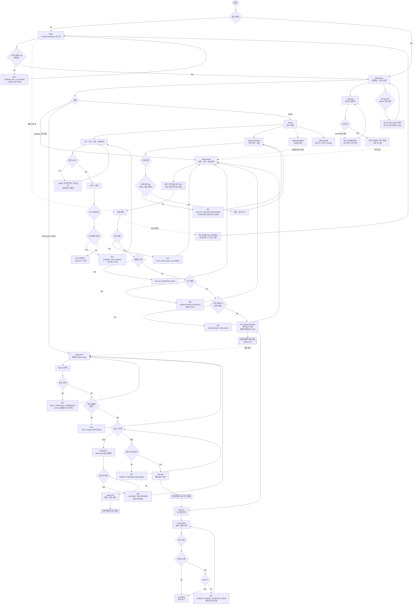

# PRD — 사내 휴가 신청/승인 서비스 (Leave Management)

> **Type**: `product-feature`
> **Feature Key**: `leave-management`
> **Status**: Draft v1.0
> **Last Updated**: 2026-08-04

---

## 1. Overview

### 1.1 Problem Statement

현재 휴가 신청·승인은 메신저 DM과 구글 스프레드시트로 이원화되어 운영된다. 이로 인해 다음 문제가 발생한다.

1. **잔여 연차의 단일 진실 공급원(SSoT)이 없다.** 팀원이 아는 잔여일수와 인사 담당자 시트의 값이 어긋나, 매월 수기 대조가 필요하다.
2. **승인 이력이 휘발된다.** 승인 근거가 DM에 남아 있어 검색이 불가능하고, 퇴사·조직개편 시 이력이 소실된다.
3. **팀 가용 인원을 사전에 알 수 없다.** 같은 기간에 팀원 다수가 휴가를 내도 신청 시점에 아무도 인지하지 못한다.
4. **집계 비용이 크다.** 인사 담당자가 월 마감마다 부서별 사용 현황을 손으로 취합하는 데 반복 공수가 든다.

### 1.2 Goals

| # | Goal | 측정 |
|---|---|---|
| G-1 | 휴가 신청·승인 전 과정을 단일 웹 서비스로 통합 | 시트/DM 기반 신청 건수 0건 (도입 2개월 차) |
| G-2 | 잔여 연차를 시스템이 자동 계산해 수기 대조를 제거 | 월 마감 수기 대조 공수 0시간 |
| G-3 | 모든 승인·반려에 감사 가능한 이력을 남김 | 신청 건 100%가 결재 이력 레코드 보유 |
| G-4 | 신청 시점에 팀 휴가 중복을 가시화 | 신청 화면에서 동일 기간 팀원 휴가 노출 |
| G-5 | 관리자가 전사 현황을 상시 조회·내보내기 | 부서별 현황 조회 및 CSV 내보내기 3클릭 이내 |

### 1.3 Non-Goals

명시적으로 v1 범위 밖이다.

- **급여·정산 연동** — 무급휴가·연차수당 계산 및 급여 시스템 연동은 하지 않는다. 사용 일수 데이터를 CSV로 내보내 인사팀이 기존 급여 프로세스에서 처리한다.
- **근태(출퇴근) 관리** — 출퇴근 기록, 지각·조퇴, 초과근무 집계는 다루지 않는다. 본 서비스는 '휴가'만 다룬다.
- **다단계 결재선** — 팀장 → 본부장 → 대표로 이어지는 순차 결재는 구현하지 않는다. v1은 **1단계 결재**(팀장 1인, 또는 관리자 폴백)만 지원한다.
- **대리 결재자 지정** — 팀장이 부재중일 때의 위임 결재자 설정은 만들지 않는다. 대신 관리자가 모든 신청을 승인할 수 있는 폴백 권한을 갖는다(FR-014).
- **모바일 네이티브 앱** — 반응형 웹으로 대응하며 iOS/Android 앱은 만들지 않는다.
- **연차 자동 부여 스케줄러** — 입사일 기준 연차 자동 산정/이월 배치는 v1에서 제외한다. 관리자가 연 1회 CSV 업로드 또는 개별 편집으로 부여한다(FR-020).
- **외부 캘린더 양방향 동기화** — Google Calendar로의 쓰기 동기화는 하지 않는다. 서비스 내 캘린더 조회만 제공한다.
- **다국어(i18n)** — 한국어 단일 언어로 제공한다.

### 1.4 Scope

**포함**

- 사내 계정(Google Workspace) 기반 로그인 및 역할 부여
- 휴가 유형 5종: 연차 / 반차 / 병가 / 경조사 / 무급
- 신청 → 승인·반려 → 취소 전체 생명주기
- 잔여 연차 자동 계산 (영업일 기준, 주말·공휴일 제외)
- 팀장 결재함, 팀 휴가 캘린더
- 관리자 전사 현황 대시보드, 연차 부여/조정, 휴가 정책 설정, CSV 내보내기
- 이메일 알림 (신청 접수 / 승인 / 반려)

**제외**

- §1.3 Non-Goals 전항
- 계약직·인턴 등 고용형태별 차등 연차 규칙 (전 인원 동일 규칙 적용, 개별 부여량만 관리자가 조정)
- 반반차(0.25일) 단위 신청

---

## 2. User Stories

### 2.1 Primary User

**신청자 (member)**

- As a **팀원**, I want to **잔여 연차를 확인하고 그 자리에서 휴가를 신청**할 수 있기를 원한다, so that **인사팀에 잔여일수를 따로 문의하지 않아도 되기 때문이다.**
- As a **팀원**, I want to **신청한 휴가의 결재 상태를 실시간으로 확인**할 수 있기를 원한다, so that **팀장에게 승인됐는지 되묻지 않아도 되기 때문이다.**
- As a **팀원**, I want to **신청 기간에 겹치는 팀원의 휴가를 신청 전에 볼 수** 있기를 원한다, so that **팀 업무 공백을 피해 일정을 잡을 수 있기 때문이다.**
- As a **팀원**, I want to **휴가 시작 전이라면 신청을 스스로 취소**할 수 있기를 원한다, so that **일정 변경 시 팀장에게 번거롭게 요청하지 않아도 되기 때문이다.**

**결재자 (team_lead)**

- As a **팀장**, I want to **내 팀의 결재 대기 건을 한 화면에서 처리**할 수 있기를 원한다, so that **DM을 뒤져가며 놓친 신청을 찾지 않아도 되기 때문이다.**
- As a **팀장**, I want to **승인 전에 같은 기간 팀 휴가 현황을 함께 볼 수** 있기를 원한다, so that **인원 공백을 판단해 승인 여부를 결정할 수 있기 때문이다.**
- As a **팀장**, I want to **반려 시 사유를 남길 수** 있기를 원한다, so that **신청자가 무엇을 고쳐 재신청할지 알 수 있기 때문이다.**

**관리자 (admin)**

- As a **인사 관리자**, I want to **전사·부서별 휴가 사용 현황을 기간 필터로 조회**할 수 있기를 원한다, so that **월 마감 집계를 수기로 하지 않아도 되기 때문이다.**
- As a **인사 관리자**, I want to **구성원의 연차 부여량을 조정하고 그 이력을 남길 수** 있기를 원한다, so that **정정 요청이 왔을 때 근거를 제시할 수 있기 때문이다.**
- As a **인사 관리자**, I want to **조회 결과를 CSV로 내보낼 수** 있기를 원한다, so that **기존 급여 프로세스에 그대로 투입할 수 있기 때문이다.**

### 2.2 Acceptance Criteria

정상 경로와 함께 **실패·만료·권한부족 시나리오**를 포함한다.

#### AC-1. 휴가 신청 — 정상 경로

```gherkin
Given 나는 member 역할로 로그인했고
  And 나의 연차 잔여일수는 10.0일이다
When 휴가 유형 "연차", 기간 2026-08-17 ~ 2026-08-19(모두 평일, 공휴일 아님), 사유 "가족 여행"으로 신청하면
Then 신청은 status "pending"으로 저장되고
  And 소요 일수는 3.0일로 계산되며
  And 나의 "사용 가능 잔여일수"는 7.0일로 감소하고(pending 예약분 차감)
  And "확정 사용일수"는 0.0일로 유지되며
  And 팀장에게 결재 요청 이메일이 발송된다
```

#### AC-2. 휴가 신청 — 잔여일수 부족

```gherkin
Given 나는 member 역할로 로그인했고
  And 나의 연차 사용 가능 잔여일수는 1.0일이다
When 유형 "연차"로 3영업일 기간을 신청하면
Then 신청은 생성되지 않고
  And 서버는 422 "INSUFFICIENT_BALANCE"를 반환하며
  And 화면에는 "사용 가능한 연차가 1.0일 남아 3.0일을 신청할 수 없습니다"가 표시되고
  And 잔여일수는 1.0일에서 변하지 않는다
```

#### AC-3. 휴가 신청 — 기간 중복

```gherkin
Given 나는 2026-08-17 ~ 2026-08-19 기간에 status "approved"인 휴가가 있고
When 2026-08-19 ~ 2026-08-21 기간으로 새 휴가를 신청하면
Then 신청은 생성되지 않고
  And 서버는 409 "OVERLAPPING_REQUEST"를 반환하며
  And 응답에 겹치는 기존 신청의 id와 기간이 포함된다
```

#### AC-4. 휴가 신청 — 과거 날짜 / 영업일 0일

```gherkin
Given 오늘은 2026-08-04이고
When 시작일 2026-08-01로 신청하면
Then 서버는 422 "PAST_DATE_NOT_ALLOWED"를 반환한다

When 2026-08-08(토) ~ 2026-08-09(일) 기간으로 신청하면
Then 서버는 422 "NO_BUSINESS_DAYS"를 반환하고
  And "선택한 기간에 영업일이 없습니다"가 표시된다
```

#### AC-5. 반차 신청

```gherkin
Given 나의 연차 사용 가능 잔여일수는 5.0일이다
When 유형 "반차", 날짜 2026-08-17(평일), 시간대 "PM"으로 신청하면
Then 소요 일수는 0.5일로 계산되고
  And 사용 가능 잔여일수는 4.5일이 되며
  And 시작일과 종료일이 다르게 입력되면 422 "HALF_DAY_SINGLE_DATE_ONLY"를 반환한다
```

#### AC-6. 승인 — 정상 경로

```gherkin
Given 나는 team_lead 역할로 로그인했고
  And 내 팀 팀원의 status "pending"인 신청 L-100(3.0일)이 있다
When 결재함에서 L-100을 "승인"하면
Then L-100의 status는 "approved"로 바뀌고
  And 신청자의 "확정 사용일수"가 3.0일 증가하고 "예약 일수"는 3.0일 감소하며
  And 총 사용 가능 잔여일수는 변하지 않고
  And leave_approvals에 (승인자, 시각, action=approve) 이력이 기록되며
  And 신청자에게 승인 알림 이메일이 발송된다
```

#### AC-7. 반려 — 사유 필수

```gherkin
Given 나는 team_lead 역할로 로그인했고
  And 내 팀 팀원의 status "pending"인 신청 L-101(2.0일)이 있다
When 반려 사유를 비우고 반려를 요청하면
Then 서버는 422 "REJECT_REASON_REQUIRED"를 반환하고 상태는 "pending"으로 유지된다

When 반려 사유 "해당 주 릴리즈 일정과 겹칩니다"를 입력해 반려하면
Then L-101의 status는 "rejected"가 되고
  And 예약된 2.0일이 잔여일수로 복구되며
  And 신청자에게 반려 사유가 포함된 이메일이 발송된다
```

#### AC-8. 권한 부족 — 타 팀 결재 시도

```gherkin
Given 나는 team_lead 역할로 로그인했고
  And 신청 L-200은 내가 소속되지 않은 팀의 신청이다
When L-200에 대해 승인을 요청하면
Then 서버는 403 "NOT_TEAM_APPROVER"를 반환하고
  And L-200의 상태는 변하지 않으며
  And 결재함 목록에도 L-200은 처음부터 노출되지 않는다
```

#### AC-9. 권한 부족 — 자기 결재 금지

```gherkin
Given 나는 team_lead 역할이고 내가 직접 올린 휴가 신청 L-300이 있다
When 내가 L-300을 승인하려 하면
Then 서버는 403 "SELF_APPROVAL_FORBIDDEN"을 반환하고
  And L-300의 결재자는 admin 역할 사용자로 지정되어 admin 결재함에 노출된다
```

#### AC-10. 권한 부족 — 관리자 화면 접근

```gherkin
Given 나는 member 역할로 로그인했다
When /admin 경로에 접근하면
Then 서버는 403 "FORBIDDEN"을 반환하고
  And 화면에는 no-permission 상태("이 페이지에 접근할 권한이 없습니다" + 대시보드로 이동)가 렌더링되며
  And 로그인 페이지로 리다이렉트되지는 않는다
```

#### AC-11. 취소 — 시작일 전 / 시작일 후

```gherkin
Given 오늘은 2026-08-04이고
  And 나의 status "approved"인 신청 L-400의 기간은 2026-08-17 ~ 2026-08-19이다
When 내가 L-400을 취소하면
Then status는 "cancelled"가 되고 3.0일이 잔여일수로 복구되며
  And 팀장에게 취소 알림 이메일이 발송된다

Given 나의 status "approved"인 신청 L-401의 기간은 2026-08-01 ~ 2026-08-02(이미 시작됨)이다
When 내가 L-401을 취소하면
Then 서버는 422 "CANNOT_CANCEL_STARTED_LEAVE"를 반환하고
  And "이미 시작된 휴가는 관리자에게 문의하세요"가 표시되며
  And admin 역할은 동일 요청을 성공시킬 수 있다
```

#### AC-12. 세션 만료

```gherkin
Given 나의 세션은 마지막 활동으로부터 8시간이 지나 만료되었다
When 휴가 신청을 제출하면
Then 서버는 401 "SESSION_EXPIRED"를 반환하고
  And 입력 중이던 폼 값은 브라우저에 보존된 채 로그인 모달이 표시되며
  And 재로그인 후 동일 폼으로 복귀해 제출을 이어갈 수 있다
```

#### AC-13. 동시 승인 경합

```gherkin
Given 신청 L-500이 status "pending"이고
  And 팀장과 관리자가 동시에 승인 요청을 보냈다
When 두 요청이 처리되면
Then 하나만 성공해 status "approved"가 되고
  And 다른 하나는 409 "ALREADY_PROCESSED"를 반환하며
  And 잔여일수는 이중으로 차감되지 않고
  And leave_approvals에는 승인 이력이 1건만 기록된다
```

#### AC-14. 관리자 전사 현황 조회 및 내보내기

```gherkin
Given 나는 admin 역할로 로그인했다
When 기간 2026-01-01 ~ 2026-12-31, 부서 "개발팀", 상태 "approved"로 현황을 조회하면
Then 조건에 맞는 신청 목록과 함께
  And 부서 총 사용일수 / 인원별 사용·잔여 요약이 표시되고
When "CSV 내보내기"를 누르면
Then 동일 필터가 적용된 UTF-8 BOM CSV 파일이 다운로드되고
  And 파일에는 사번, 이름, 부서, 유형, 시작일, 종료일, 일수, 상태, 결재자, 결재일시 열이 포함된다

Given 조건에 맞는 신청이 0건이면
Then empty 상태("조건에 맞는 휴가 기록이 없습니다")가 표시되고 내보내기 버튼은 비활성화된다
```

### 2.3 User Roles

| Role Key | 한국어 명칭 | 권한 범위 |
|---|---|---|
| `member` | 팀원(신청자) | 본인 휴가 신청·조회·취소(시작 전), 본인 잔여일수 조회, 소속 팀 캘린더 조회 |
| `team_lead` | 팀장(결재자) | `member`의 모든 권한 + 소속 팀원 신청 조회·승인·반려, 팀 사용 현황 조회. 본인 신청은 결재 불가 |
| `admin` | 관리자(인사) | 전사 신청 조회·승인·반려(폴백), 시작된 휴가 취소, 연차 부여·조정, 휴가 정책·공휴일 관리, CSV 내보내기, 감사 로그 조회 |

- 역할은 사용자당 1개만 부여한다(단일 역할 모델). `team_lead`는 `member` 권한을 포함하고, `admin`은 `team_lead` 권한을 포함한다.
- `admin`은 인사 담당자 전용이며 기본적으로 결재선에 등장하지 않는다. 결재자 부재(팀장 미지정·팀장 본인 신청) 시에만 결재자로 지정된다.

---

## 3. Functional Requirements

우선순위는 MoSCoW: **P0** Must / **P1** Should / **P2** Could / **P3** Won't.

### 3.1 인증 · 사용자

| ID | Requirement | Priority | Dependencies |
|---|---|---|---|
| FR-001 | Google Workspace OIDC로 로그인한다. 사내 도메인(`@company.com`) 계정만 허용하고, 그 외 도메인은 403 `DOMAIN_NOT_ALLOWED`로 거부한다 | P0 | — |
| FR-002 | 로그인 성공 시 HttpOnly·Secure·SameSite=Lax 세션 쿠키를 발급하고, 마지막 활동 기준 8시간 후 만료시킨다 | P0 | FR-001 |
| FR-003 | 사용자는 사번, 이름, 이메일, 소속 팀, 역할(`member`/`team_lead`/`admin`), 입사일, 재직상태를 가진다 | P0 | — |
| FR-004 | 관리자는 사용자의 역할과 소속 팀을 변경할 수 있고, 변경 시 감사 로그에 (변경자, 이전값, 신규값, 시각)을 남긴다 | P0 | FR-003, FR-030 |
| FR-005 | 팀은 팀명과 팀장(`team_lead` 사용자) 1명을 가진다. 팀장이 미지정인 팀의 신청은 결재자를 `admin`으로 지정한다 | P0 | FR-003 |

### 3.2 휴가 신청

| ID | Requirement | Priority | Dependencies |
|---|---|---|---|
| FR-006 | 휴가 유형 5종을 지원한다: 연차(`annual`), 반차(`half_day`), 병가(`sick`), 경조사(`special`), 무급(`unpaid`) | P0 | — |
| FR-007 | 신청은 유형, 시작일, 종료일, 사유(최대 500자)를 입력받는다. 반차는 단일 날짜 + 시간대(`AM`/`PM`)를 입력받는다 | P0 | FR-006 |
| FR-008 | 소요 일수는 기간 내 **영업일**(주말·등록된 공휴일 제외) 수로 계산한다. 반차는 0.5일로 계산한다 | P0 | FR-024 |
| FR-009 | 영업일이 0일인 기간은 422 `NO_BUSINESS_DAYS`로 거부한다 | P0 | FR-008 |
| FR-010 | 시작일이 오늘 이전인 신청은 422 `PAST_DATE_NOT_ALLOWED`로 거부한다. `admin`은 소급 등록을 위해 이 검증을 우회할 수 있다 | P0 | — |
| FR-011 | 동일 사용자의 `pending` 또는 `approved` 신청과 기간이 겹치면 409 `OVERLAPPING_REQUEST`로 거부하고, 응답에 충돌 신청의 id·기간을 포함한다 | P0 | FR-007 |
| FR-012 | 연차·반차는 잔여일수를 검증한다. `사용 가능 잔여 = 부여 - 확정 사용 - 예약(pending)`이며, 부족 시 422 `INSUFFICIENT_BALANCE`로 거부한다. 병가·경조사·무급은 연차 잔여를 차감하지 않는다 | P0 | FR-020 |
| FR-013 | 신청 화면은 선택한 기간에 휴가가 겹치는 **같은 팀** 팀원 목록(이름, 기간)을 표시한다. 겹치는 인원이 팀 정원의 30% 이상이면 경고 배너를 띄우되 신청은 막지 않는다 | P1 | FR-023 |

### 3.3 승인 · 반려 · 취소

| ID | Requirement | Priority | Dependencies |
|---|---|---|---|
| FR-014 | 신청 생성 시 결재자를 확정한다. 기본은 신청자 소속 팀의 팀장이며, (a) 팀장 미지정 (b) 신청자 본인이 팀장 — 두 경우 결재자를 `admin`으로 지정한다 | P0 | FR-005 |
| FR-015 | `team_lead`는 본인이 결재자로 지정된 `pending` 신청만 결재함에서 조회·처리할 수 있다. 타 팀 신청에 대한 결재 시도는 403 `NOT_TEAM_APPROVER`로 거부한다 | P0 | FR-014 |
| FR-016 | 본인 신청에 대한 승인·반려 시도는 403 `SELF_APPROVAL_FORBIDDEN`으로 거부한다 | P0 | FR-014 |
| FR-017 | 승인 시 상태를 `approved`로 전이하고, 예약 일수를 확정 사용일수로 이동한다 | P0 | FR-012 |
| FR-018 | 반려 시 사유(1~500자) 입력을 필수로 하고, 상태를 `rejected`로 전이하며 예약 일수를 잔여일수로 복구한다. 사유 누락 시 422 `REJECT_REASON_REQUIRED` | P0 | FR-017 |
| FR-019 | `pending`이 아닌 신청에 대한 결재 요청은 409 `ALREADY_PROCESSED`로 거부한다. 상태 전이는 단일 트랜잭션에서 행 잠금으로 직렬화해 이중 차감을 방지한다 | P0 | FR-017 |
| FR-020 | 신청자는 `pending` 신청, 그리고 시작일이 도래하지 않은 `approved` 신청을 취소할 수 있다. 이미 시작된 휴가 취소는 422 `CANNOT_CANCEL_STARTED_LEAVE`이며 `admin`만 처리할 수 있다. 취소 시 일수를 복구한다 | P0 | FR-017 |
| FR-021 | 모든 상태 전이(신청·승인·반려·취소)는 `leave_approvals`에 (행위자, action, 사유, 시각)으로 append-only 기록한다. 기록은 수정·삭제할 수 없다 | P0 | FR-017 |

허용 상태 전이는 다음뿐이다. 그 외 전이 요청은 409로 거부한다.

```
pending  → approved   (결재자)
pending  → rejected   (결재자, 사유 필수)
pending  → cancelled  (신청자 본인 또는 admin)
approved → cancelled  (시작 전: 신청자 본인 또는 admin / 시작 후: admin only)
approved → rejected   ✗ 불가 (취소 후 재신청)
rejected  → *          ✗ 종결 상태
cancelled → *          ✗ 종결 상태
```

### 3.4 잔여 연차 · 정책

| ID | Requirement | Priority | Dependencies |
|---|---|---|---|
| FR-022 | 잔여 연차는 (사용자 × 연도)별로 `부여일수 / 확정 사용일수 / 예약 일수`를 보관한다. 표시 단위는 0.5일이다 | P0 | FR-003 |
| FR-023 | `admin`은 개별 사용자의 연차 부여일수를 조정할 수 있고, 조정 시 사유를 필수로 입력하며 감사 로그에 남긴다 | P0 | FR-022, FR-030 |
| FR-024 | `admin`은 연차 부여를 CSV(사번, 연도, 부여일수) 업로드로 일괄 반영할 수 있다. 형식 오류 행은 행 번호와 사유를 포함해 반환하고, 유효한 행만 반영한다(부분 성공) | P1 | FR-023 |
| FR-025 | `admin`은 연도별 공휴일을 등록·수정·삭제할 수 있다. 공휴일은 영업일 계산에서 제외된다 | P0 | FR-008 |
| FR-026 | 이미 `approved`된 신청의 소요 일수는 공휴일 변경의 영향을 받지 않는다(승인 시점 계산값을 신청 레코드에 고정 저장) | P0 | FR-025 |

### 3.5 조회 · 현황

| ID | Requirement | Priority | Dependencies |
|---|---|---|---|
| FR-027 | `member`는 본인 신청 목록을 상태·기간·유형으로 필터링해 조회한다. 기본 정렬은 신청일 내림차순, 페이지당 20건이다 | P0 | FR-007 |
| FR-028 | 모든 역할은 **소속 팀** 월간 휴가 캘린더를 조회한다. 캘린더에는 `approved` 및 `pending` 건이 상태별로 구분 표시되며, 사유 필드는 노출하지 않는다 | P1 | FR-017 |
| FR-029 | `admin`은 전사 현황을 기간·부서·유형·상태로 필터링해 조회하고, 부서별 총 사용일수와 인원별 사용·잔여 요약을 함께 본다 | P0 | FR-022 |
| FR-030 | `admin`은 조회 결과를 UTF-8 BOM CSV로 내보낸다. 열은 사번, 이름, 부서, 유형, 시작일, 종료일, 일수, 상태, 결재자, 결재일시이다. 최대 10,000행이며 초과 시 기간을 좁히라는 안내를 반환한다 | P0 | FR-029 |
| FR-031 | `admin`은 사용자·잔여일수·정책 변경 감사 로그를 기간·행위자로 조회한다 | P1 | FR-004, FR-023 |

### 3.6 알림

| ID | Requirement | Priority | Dependencies |
|---|---|---|---|
| FR-032 | 신청 접수 시 결재자에게, 승인·반려 시 신청자에게, 취소 시 결재자에게 이메일을 발송한다. 반려 메일에는 반려 사유를 포함한다 | P0 | FR-017 |
| FR-033 | 이메일 발송은 비동기 큐로 처리하며, 발송 실패가 휴가 상태 전이를 롤백시키지 않는다. 실패 시 최대 3회 지수 백오프로 재시도하고 최종 실패는 로그에 남긴다 | P0 | FR-032 |
| FR-034 | 결재 대기 건이 3영업일 이상 `pending`이면 결재자에게 리마인더 메일을 1회 발송한다 | P2 | FR-032 |
| FR-035 | Slack 채널 알림 연동 | P3 | — |

### 3.7 FR 무모순 확인

- 인증 경계: FR-001·FR-002가 모든 API에 인증을 요구하며, 비로그인 열람을 허용하는 FR은 없다. `/login`만 예외다.
- 잔여 차감: FR-012(신청 시 예약 차감)와 FR-017(승인 시 확정 이동)은 `사용 가능 잔여 = 부여 − 확정 − 예약` 단일 공식 위에서 동작해 이중 차감이 발생하지 않는다.
- 결재 권한: FR-015(팀 스코프)와 FR-014(admin 폴백)는 상충하지 않는다. `admin`은 결재자로 **지정된 경우**에만 결재함에 노출되며, 그 외에는 관리 목적의 조회 권한만 갖는다.
- 취소 권한: FR-020의 `admin` 예외는 FR-016(자기 결재 금지)과 무관하다. 취소는 결재 행위가 아니다.
- 공휴일 변경: FR-025(공휴일 편집 가능)와 FR-026(승인분 일수 고정)이 함께 성립하도록, 일수는 신청 레코드에 스냅샷으로 저장하고 재계산하지 않는다.

---

## 4. Non-Functional Requirements

### 4.0 Scale Grade

**`Hobby`** — 사내 전용 서비스로 대상 인원 약 200명, 예상 DAU 150명 내외(경계: DAU 1,000 미만 = Hobby). 트래픽 피크는 월말·연말 및 연휴 직전에 집중되며, 이때도 동시 접속 30세션·20 req/s를 넘지 않을 것으로 본다.

### 4.1 Performance

| 지표 | 목표 |
|---|---|
| 조회 API (`GET /api/leaves`, `/api/approvals`) p95 | **< 200ms** (서버 처리 시간, DB 포함) |
| 쓰기 API (`POST /api/leaves`, 승인·반려) p95 | **< 300ms** |
| 관리자 현황 집계 (`GET /api/admin/leaves`, 1년치 200명) p95 | **< 800ms** |
| CSV 내보내기 (10,000행) | **< 5s** 내 응답 시작 |
| 처리량 | **20 req/s** 지속, 피크 **50 req/s** 30초간 에러율 < 1% |
| 동시 세션 | **50** 동시 접속에서 위 p95 목표 유지 |
| 대시보드 LCP (사내망, 데스크톱) | **< 2.5s** |
| 캘린더 월 렌더 (팀 20명 기준) | **< 1.0s** |

### 4.2 Availability

- 가용성 목표: **업무시간(평일 09:00–19:00 KST) 기준 월간 99.5%** — 월 허용 다운타임 약 66분.
- 계획 점검은 주말 또는 평일 22:00 이후에만 수행하며, 사전 24시간 공지한다.
- **장애 시 동작**
  - DB 연결 실패: 5xx와 함께 "일시적인 오류입니다. 잠시 후 다시 시도해 주세요" 화면을 렌더링한다. 신청 폼 입력값은 브라우저에 보존한다.
  - 메일 큐 장애: 휴가 상태 전이는 정상 처리하고 알림만 지연된다(FR-033). 화면에 "알림 발송이 지연되고 있습니다" 배너를 노출한다.
  - OIDC 제공자 장애: 신규 로그인은 불가하나 기존 유효 세션은 계속 동작한다.
- 헬스체크 `GET /healthz`(liveness), `GET /readyz`(DB 연결 포함)를 30초 주기로 점검하고, 연속 3회 실패 시 담당자에게 알린다.

### 4.3 Data

| 항목 | 정책 |
|---|---|
| 휴가 신청·결재 이력 | 신청 종료일 기준 **5년 보관** 후 익명화(사번·이름을 해시 대체, 통계용 집계값만 유지) |
| 감사 로그 | **3년 보관** 후 삭제 |
| 개인정보 수집 범위 | 사번, 성명, 사내 이메일, 소속 팀, 입사일. **주민번호·연락처·주소는 수집하지 않는다** |
| 민감정보 | 병가 사유는 **자유 서술만 받고 진단명·의료기록 첨부를 받지 않는다**. 사유 필드는 신청자 본인·결재자·`admin`에게만 노출하며, 팀 캘린더에는 노출하지 않는다(FR-028) |
| 퇴사자 처리 | 재직상태를 `retired`로 전환해 로그인을 차단한다. 개인 식별 정보는 **퇴사 후 3년 경과 시 익명화**하고, 휴가 사용 이력은 집계 형태로 남긴다 |
| 파기 | 보관 기간 만료분은 월 1회 배치로 익명화·삭제하고 실행 결과를 감사 로그에 남긴다 |
| 접근 통제 | `admin`의 전사 조회·CSV 내보내기 행위는 모두 감사 로그에 기록한다(누가, 언제, 어떤 필터로) |

### 4.4 Recovery

- **RTO 4시간** — 인프라 장애 시 4시간 내 서비스를 복구한다. 사내 업무 도구로서 반나절 중단이 업무를 중단시키지는 않으므로 이중화 대신 신속 복구 전략을 택한다.
- **RPO 24시간** — 일 1회(03:00 KST) 전체 백업 + WAL 아카이빙으로 실제 손실은 5분 이내를 목표하되, 계약상 보장치는 24시간으로 둔다.
- 백업은 30일 보관하고, **분기 1회 복구 리허설**을 수행해 실제 복원 시간을 기록한다.

### 4.5 Security

**인증**

- Google Workspace **OIDC(Authorization Code + PKCE)**. 사내 도메인 계정만 허용한다(FR-001).
- 세션 쿠키: `HttpOnly`, `Secure`, `SameSite=Lax`. 유휴 8시간·절대 만료 24시간. 로그아웃 시 서버 측 세션을 즉시 무효화한다.
- 상태 변경 요청(POST/PATCH/DELETE)에 CSRF 토큰(Double Submit Cookie)을 요구한다.

**인가 규칙 — 어느 역할이 어느 리소스에**

| 리소스 / 행위 | `member` | `team_lead` | `admin` | 추가 제약 |
|---|---|---|---|---|
| 본인 휴가 신청 생성 | ✅ | ✅ | ✅ | 잔여·중복·과거일 검증 통과 시 |
| 본인 휴가 조회 | ✅ | ✅ | ✅ | `user_id == session.user_id` |
| 타인 휴가 상세 조회 | ❌ | ⚠️ 같은 팀만 | ✅ 전사 | `team_lead`는 `request.team_id == session.team_id` |
| 본인 휴가 취소(시작 전) | ✅ | ✅ | ✅ | 소유자 검사 |
| 휴가 취소(시작 후) | ❌ | ❌ | ✅ | — |
| 승인 / 반려 | ❌ | ⚠️ 지정 결재자인 건만 | ⚠️ 지정 결재자인 건만 | `request.approver_id == session.user_id` **AND** `request.user_id != session.user_id` |
| 팀 캘린더 조회 | ⚠️ 본인 팀 | ⚠️ 본인 팀 | ✅ 전 팀 | 사유 필드 제외 |
| 전사 현황 조회 / CSV 내보내기 | ❌ | ❌ | ✅ | 조회 행위 감사 로그 기록 |
| 연차 부여·조정 | ❌ | ❌ | ✅ | 사유 필수 + 감사 로그 |
| 공휴일·정책 관리 | ❌ | ❌ | ✅ | 감사 로그 |
| 사용자 역할·팀 변경 | ❌ | ❌ | ✅ | 본인 역할 강등 불가(마지막 `admin` 보호) |
| 감사 로그 조회 | ❌ | ❌ | ✅ | — |

- 인가는 **서버 측에서만** 최종 판정한다. 프론트엔드의 메뉴 숨김은 UX 보조일 뿐 보안 경계가 아니다.
- 모든 리소스 접근은 **역할 검사 + 스코프 검사(소유자/팀)** 2단으로 수행한다. 역할만으로 통과시키지 않는다.
- 권한 없는 리소스는 **403**을 반환한다(404 위장은 하지 않는다 — 사내 도구로서 리소스 존재 자체가 비밀이 아니다). 미인증은 401이다.

**전송 · 저장 보호**

- 전 구간 HTTPS(TLS 1.2+), HSTS 적용. HTTP는 308로 리다이렉트한다.
- DB 저장 시 디스크 암호화(at-rest)를 적용한다. 세션 토큰은 DB에 해시로 저장한다.
- 로그에 세션 토큰·쿠키·휴가 사유 본문을 기록하지 않는다.
- 백업 파일은 암호화해 보관하고 접근을 `admin` 인프라 담당자로 제한한다.

**입력 검증**

- 모든 요청 바디를 서버 측 스키마로 검증한다(허용 목록 방식). 정의되지 않은 필드는 거부한다.
- 날짜는 `YYYY-MM-DD` ISO 형식만 허용하고, `start_date <= end_date`, 기간 최대 90일을 강제한다.
- 사유·반려 사유는 1~500자, 제어문자를 제거하고 렌더링 시 이스케이프한다(XSS 방지).
- CSV 내보내기 시 `=`, `+`, `-`, `@`로 시작하는 셀 값 앞에 `'`를 붙여 수식 주입(CSV Injection)을 차단한다.
- 모든 DB 접근은 파라미터 바인딩만 사용한다(문자열 연결 금지).
- 로그인 시도는 IP당 분당 10회, 신청 생성은 사용자당 분당 20회로 제한한다(429 `RATE_LIMITED`).
- CSV 업로드는 최대 1MB·5,000행, `text/csv`만 허용한다.

---

## 5. Technical Design

### 5.1 API Specification

공통 규약

- Base path: `/api`, 요청·응답 `application/json; charset=utf-8`
- 인증: 세션 쿠키. 미인증 요청은 **401** `{"error":{"code":"UNAUTHENTICATED"}}`
- 공통 에러 바디: `{"error":{"code":"<CODE>","message":"<사용자 노출 문구>","details":{...}}}`
- 공통 에러: `400 INVALID_REQUEST` / `401 UNAUTHENTICATED` / `401 SESSION_EXPIRED` / `403 FORBIDDEN` / `404 NOT_FOUND` / `429 RATE_LIMITED` / `500 INTERNAL_ERROR`
- 날짜 `YYYY-MM-DD`, 일시 ISO 8601 KST(`2026-08-04T10:00:00+09:00`), 일수는 소수 첫째 자리(0.5 단위)

---

#### `POST /api/auth/login/callback` — OIDC 콜백

- **인가 주체**: 비인증 (유일한 공개 엔드포인트)

**Request**
```json
{ "code": "4/0Adeu5...", "state": "xyz", "code_verifier": "..." }
```

**Response 200**
```json
{
  "user": { "id": 12, "employee_no": "2023-041", "name": "김현만",
            "email": "hm.kim@company.com", "role": "member",
            "team": { "id": 3, "name": "개발팀" } }
}
```
`Set-Cookie: session=<opaque>; HttpOnly; Secure; SameSite=Lax; Max-Age=28800`

**Error**

| Status | Code | 조건 |
|---|---|---|
| 400 | `INVALID_AUTH_CODE` | code/state 불일치 또는 만료 |
| 403 | `DOMAIN_NOT_ALLOWED` | 사내 도메인 외 계정 |
| 403 | `USER_RETIRED` | 재직상태가 `retired` |
| 429 | `RATE_LIMITED` | IP당 분당 10회 초과 |

---

#### `GET /api/me` — 내 정보 + 잔여 연차

- **인가 주체**: 인증된 전 역할 (본인 정보만)

**Request**: 없음

**Response 200**
```json
{
  "user": { "id": 12, "employee_no": "2023-041", "name": "김현만",
            "role": "member", "team": { "id": 3, "name": "개발팀" } },
  "balance": { "year": 2026, "granted_days": 15.0, "used_days": 3.0,
               "pending_days": 2.0, "available_days": 10.0 },
  "pending_approval_count": 0
}
```

**Error**: 401 `UNAUTHENTICATED`

---

#### `POST /api/leaves` — 휴가 신청

- **인가 주체**: `member` / `team_lead` / `admin` — **본인 명의로만** 생성. `user_id`는 요청 바디로 받지 않고 세션에서 도출한다.

**Request**
```json
{
  "leave_type": "annual",
  "start_date": "2026-08-17",
  "end_date": "2026-08-19",
  "half_day_period": null,
  "reason": "가족 여행"
}
```
`leave_type`: `annual|half_day|sick|special|unpaid` / `half_day_period`: `AM|PM` (`half_day`일 때 필수, 그 외 `null`) / `reason`: 1~500자

**Response 201**
```json
{
  "id": 501, "status": "pending", "leave_type": "annual",
  "start_date": "2026-08-17", "end_date": "2026-08-19", "days": 3.0,
  "approver": { "id": 7, "name": "이팀장" },
  "balance_after": { "available_days": 7.0, "pending_days": 3.0 },
  "created_at": "2026-08-04T10:12:00+09:00"
}
```

**Error**

| Status | Code | 조건 |
|---|---|---|
| 422 | `INSUFFICIENT_BALANCE` | 잔여 부족. `details: {available_days, requested_days}` |
| 409 | `OVERLAPPING_REQUEST` | 기간 중복. `details: {conflicts:[{id,start_date,end_date,status}]}` |
| 422 | `PAST_DATE_NOT_ALLOWED` | 시작일 < 오늘 (`admin` 제외) |
| 422 | `NO_BUSINESS_DAYS` | 기간 내 영업일 0일 |
| 422 | `HALF_DAY_SINGLE_DATE_ONLY` | `half_day`인데 `start_date != end_date` |
| 422 | `HALF_DAY_PERIOD_REQUIRED` | `half_day`인데 `half_day_period` 누락 |
| 422 | `INVALID_DATE_RANGE` | `start_date > end_date` 또는 기간 > 90일 |
| 422 | `NO_APPROVER_AVAILABLE` | 팀장·admin 모두 부재 |
| 429 | `RATE_LIMITED` | 사용자당 분당 20건 초과 |

---

#### `GET /api/leaves` — 내 신청 목록

- **인가 주체**: 인증된 전 역할 — 세션 사용자 소유 건만 반환

**Request (query)**: `status` (`pending|approved|rejected|cancelled`, 복수 콤마) / `leave_type` / `from`, `to` / `page` (기본 1) / `size` (기본 20, 최대 100)

**Response 200**
```json
{
  "items": [
    { "id": 501, "leave_type": "annual", "start_date": "2026-08-17",
      "end_date": "2026-08-19", "days": 3.0, "status": "pending",
      "approver": { "id": 7, "name": "이팀장" },
      "reason": "가족 여행", "created_at": "2026-08-04T10:12:00+09:00",
      "decided_at": null, "reject_reason": null,
      "can_cancel": true }
  ],
  "page": 1, "size": 20, "total": 1, "total_pages": 1
}
```

**Error**: 400 `INVALID_REQUEST` (잘못된 status/날짜 형식) / 401

---

#### `GET /api/leaves/{id}` — 신청 상세

- **인가 주체**: 소유자 본인 / 해당 건의 지정 결재자 / `admin`. 그 외 **403**

**Response 200**: 목록 항목 + `approval_history: [{actor:{id,name}, action:"submit|approve|reject|cancel", reason, acted_at}]`

**Error**: 403 `FORBIDDEN` (타인 건) / 404 `NOT_FOUND`

---

#### `DELETE /api/leaves/{id}` — 신청 취소

- **인가 주체**: 소유자 본인(시작일 도래 전까지) / `admin`(제한 없음)

**Request**
```json
{ "reason": "일정 변경" }
```
(`admin`이 타인 건을 취소할 때 `reason` 필수, 본인 취소 시 선택)

**Response 200**
```json
{ "id": 501, "status": "cancelled",
  "balance_after": { "available_days": 10.0, "pending_days": 0.0 } }
```

**Error**

| Status | Code | 조건 |
|---|---|---|
| 403 | `FORBIDDEN` | 타인 신청 취소 시도 (`admin` 아님) |
| 422 | `CANNOT_CANCEL_STARTED_LEAVE` | 시작일 도래 후 (`admin` 제외) |
| 409 | `ALREADY_PROCESSED` | 이미 `rejected`/`cancelled` |
| 422 | `CANCEL_REASON_REQUIRED` | `admin`의 타인 건 취소인데 사유 누락 |

---

#### `GET /api/approvals` — 결재함

- **인가 주체**: `team_lead` / `admin` — `approver_id == session.user_id`인 건만 반환. `member`는 **403**

**Request (query)**: `status` (기본 `pending`) / `from`, `to` / `page`, `size`

**Response 200**
```json
{
  "items": [
    { "id": 501, "applicant": { "id": 12, "name": "김현만", "employee_no": "2023-041" },
      "team": { "id": 3, "name": "개발팀" },
      "leave_type": "annual", "start_date": "2026-08-17", "end_date": "2026-08-19",
      "days": 3.0, "reason": "가족 여행", "status": "pending",
      "applicant_balance": { "available_days": 7.0, "granted_days": 15.0 },
      "overlapping_members": [ { "id": 15, "name": "박팀원",
                                 "start_date": "2026-08-18", "end_date": "2026-08-18" } ],
      "created_at": "2026-08-04T10:12:00+09:00" }
  ],
  "page": 1, "size": 20, "total": 1, "total_pages": 1
}
```

**Error**: 403 `FORBIDDEN` (`member` 접근)

---

#### `POST /api/approvals/{id}/approve` — 승인

- **인가 주체**: 해당 건의 **지정 결재자 본인만**. `approver_id != session.user_id` → 403 `NOT_TEAM_APPROVER`, `applicant_id == session.user_id` → 403 `SELF_APPROVAL_FORBIDDEN`

**Request**
```json
{ "comment": "잘 다녀오세요" }
```
(`comment` 선택, 최대 500자)

**Response 200**
```json
{ "id": 501, "status": "approved",
  "decided_by": { "id": 7, "name": "이팀장" },
  "decided_at": "2026-08-04T11:00:00+09:00" }
```

**Error**

| Status | Code | 조건 |
|---|---|---|
| 403 | `NOT_TEAM_APPROVER` | 지정 결재자가 아님 |
| 403 | `SELF_APPROVAL_FORBIDDEN` | 본인 신청 |
| 409 | `ALREADY_PROCESSED` | `pending`이 아님 (동시 처리 경합 포함) |
| 404 | `NOT_FOUND` | 존재하지 않는 id |

---

#### `POST /api/approvals/{id}/reject` — 반려

- **인가 주체**: `approve`와 동일

**Request**
```json
{ "reason": "해당 주 릴리즈 일정과 겹칩니다" }
```
(`reason` **필수**, 1~500자)

**Response 200**
```json
{ "id": 501, "status": "rejected",
  "reject_reason": "해당 주 릴리즈 일정과 겹칩니다",
  "decided_by": { "id": 7, "name": "이팀장" },
  "decided_at": "2026-08-04T11:00:00+09:00",
  "applicant_balance_after": { "available_days": 10.0, "pending_days": 0.0 } }
```

**Error**: `approve`의 에러 + 422 `REJECT_REASON_REQUIRED`

---

#### `GET /api/calendar` — 팀 휴가 캘린더

- **인가 주체**: 전 역할. `member`/`team_lead`는 **본인 팀만**(`team_id` 파라미터가 본인 팀과 다르면 403 `FORBIDDEN`), `admin`은 전 팀. **`reason` 필드는 응답에 포함하지 않는다**

**Request (query)**: `year_month` (`2026-08`, 필수) / `team_id` (선택, 기본 본인 팀)

**Response 200**
```json
{
  "year_month": "2026-08",
  "team": { "id": 3, "name": "개발팀", "member_count": 8 },
  "holidays": [ { "date": "2026-08-15", "name": "광복절" } ],
  "leaves": [
    { "id": 501, "user": { "id": 12, "name": "김현만" }, "leave_type": "annual",
      "start_date": "2026-08-17", "end_date": "2026-08-19",
      "half_day_period": null, "status": "approved" }
  ]
}
```

**Error**: 400 `INVALID_REQUEST` (`year_month` 형식) / 403 `FORBIDDEN` (타 팀 조회)

---

#### `GET /api/admin/leaves` — 전사 현황

- **인가 주체**: `admin` 전용. 그 외 403 `FORBIDDEN`. 호출은 감사 로그에 기록한다

**Request (query)**: `from`, `to` (필수) / `team_id` / `leave_type` / `status` / `user_id` / `page`, `size`

**Response 200**
```json
{
  "summary": {
    "total_requests": 143, "total_days": 287.5,
    "by_status": { "approved": 130, "pending": 5, "rejected": 4, "cancelled": 4 },
    "by_team": [ { "team_id": 3, "team_name": "개발팀",
                   "total_days": 96.0, "member_count": 8 } ]
  },
  "items": [ { "id": 501, "employee_no": "2023-041", "name": "김현만",
               "team_name": "개발팀", "leave_type": "annual",
               "start_date": "2026-08-17", "end_date": "2026-08-19", "days": 3.0,
               "status": "approved", "approver_name": "이팀장",
               "decided_at": "2026-08-04T11:00:00+09:00" } ],
  "page": 1, "size": 20, "total": 143, "total_pages": 8
}
```

**Error**: 403 `FORBIDDEN` / 400 `INVALID_REQUEST` / 422 `DATE_RANGE_TOO_WIDE` (기간 > 2년)

---

#### `GET /api/admin/leaves/export` — CSV 내보내기

- **인가 주체**: `admin` 전용. 호출 시 필터 조건과 함께 감사 로그 기록

**Request (query)**: `GET /api/admin/leaves`와 동일 (페이징 제외)

**Response 200**: `Content-Type: text/csv; charset=utf-8` (BOM 포함), `Content-Disposition: attachment; filename="leaves_2026-01-01_2026-12-31.csv"`
```
사번,이름,부서,유형,시작일,종료일,일수,상태,결재자,결재일시
2023-041,김현만,개발팀,연차,2026-08-17,2026-08-19,3.0,승인,이팀장,2026-08-04 11:00
```
CSV Injection 방지를 위해 `=`,`+`,`-`,`@`로 시작하는 셀은 `'`를 선행 부착한다.

**Error**: 403 `FORBIDDEN` / 422 `EXPORT_TOO_LARGE` (10,000행 초과, `details:{row_count, max:10000}`)

---

#### `GET /api/admin/balances` · `PATCH /api/admin/balances/{user_id}` — 연차 부여·조정

- **인가 주체**: `admin` 전용

**PATCH Request**
```json
{ "year": 2026, "granted_days": 16.0, "reason": "2025년 미사용 1일 이월" }
```
(`granted_days`: 0~40, 0.5 단위 / `reason` **필수**, 1~200자)

**PATCH Response 200**
```json
{ "user_id": 12, "year": 2026,
  "granted_days": 16.0, "used_days": 3.0, "pending_days": 0.0,
  "available_days": 13.0,
  "changed_by": { "id": 1, "name": "인사관리자" },
  "changed_at": "2026-08-04T13:00:00+09:00" }
```

**Error**

| Status | Code | 조건 |
|---|---|---|
| 403 | `FORBIDDEN` | `admin` 아님 |
| 422 | `ADJUST_REASON_REQUIRED` | 사유 누락 |
| 422 | `GRANTED_BELOW_USED` | `granted_days < used_days + pending_days`. `details:{used_days,pending_days}` |
| 404 | `NOT_FOUND` | 존재하지 않는 사용자 |

---

#### `POST /api/admin/balances/import` — 연차 CSV 일괄 부여

- **인가 주체**: `admin` 전용

**Request**: `multipart/form-data`, `file` (`text/csv`, ≤1MB, ≤5,000행). 헤더 `사번,연도,부여일수`

**Response 200 (부분 성공 허용)**
```json
{ "applied": 198, "failed": 2,
  "errors": [ { "row": 15, "employee_no": "2024-002", "code": "USER_NOT_FOUND" },
              { "row": 88, "employee_no": "2022-011", "code": "GRANTED_BELOW_USED" } ] }
```

**Error**: 403 `FORBIDDEN` / 413 `FILE_TOO_LARGE` / 422 `INVALID_CSV_FORMAT` (헤더 불일치) / 422 `TOO_MANY_ROWS`

---

#### `GET|POST|PATCH|DELETE /api/admin/holidays` — 공휴일 관리

- **인가 주체**: `admin` 전용

**POST Request**
```json
{ "date": "2026-08-15", "name": "광복절" }
```

**POST Response 201**
```json
{ "id": 22, "date": "2026-08-15", "name": "광복절" }
```

**Error**: 403 `FORBIDDEN` / 409 `DUPLICATE_HOLIDAY` / 422 `INVALID_DATE`

---

#### `GET /api/admin/audit-logs` — 감사 로그 조회

- **인가 주체**: `admin` 전용

**Request (query)**: `from`, `to` (필수) / `actor_id` / `action` / `page`, `size`

**Response 200**
```json
{ "items": [ { "id": 900, "actor": { "id": 1, "name": "인사관리자" },
               "action": "balance.adjust", "target_type": "leave_balance",
               "target_id": "12:2026",
               "before": { "granted_days": 15.0 }, "after": { "granted_days": 16.0 },
               "reason": "2025년 미사용 1일 이월",
               "created_at": "2026-08-04T13:00:00+09:00" } ],
  "page": 1, "size": 20, "total": 1, "total_pages": 1 }
```

**Error**: 403 `FORBIDDEN`

---

### 5.2 Database Schema

PostgreSQL 15 기준.

```sql
-- 팀
CREATE TABLE teams (
  id           BIGSERIAL PRIMARY KEY,
  name         VARCHAR(50)  NOT NULL UNIQUE,
  lead_user_id BIGINT       NULL,          -- 미지정 허용(FR-005) → 결재자 admin 폴백
  created_at   TIMESTAMPTZ  NOT NULL DEFAULT now(),
  updated_at   TIMESTAMPTZ  NOT NULL DEFAULT now()
);

-- 사용자
CREATE TYPE user_role   AS ENUM ('member', 'team_lead', 'admin');
CREATE TYPE user_status AS ENUM ('active', 'retired');

CREATE TABLE users (
  id           BIGSERIAL PRIMARY KEY,
  employee_no  VARCHAR(20)  NOT NULL UNIQUE,
  email        VARCHAR(255) NOT NULL UNIQUE,
  name         VARCHAR(50)  NOT NULL,
  team_id      BIGINT       NOT NULL REFERENCES teams(id),
  role         user_role    NOT NULL DEFAULT 'member',
  status       user_status  NOT NULL DEFAULT 'active',
  hired_on     DATE         NOT NULL,
  anonymized_at TIMESTAMPTZ NULL,          -- 퇴사 3년 경과 익명화 시각(§4.3)
  created_at   TIMESTAMPTZ  NOT NULL DEFAULT now(),
  updated_at   TIMESTAMPTZ  NOT NULL DEFAULT now()
);
CREATE INDEX idx_users_team_status ON users(team_id, status);

ALTER TABLE teams ADD CONSTRAINT fk_teams_lead
  FOREIGN KEY (lead_user_id) REFERENCES users(id);

-- 잔여 연차 (사용자 × 연도)
CREATE TABLE leave_balances (
  user_id       BIGINT       NOT NULL REFERENCES users(id),
  year          SMALLINT     NOT NULL,
  granted_days  NUMERIC(4,1) NOT NULL DEFAULT 0 CHECK (granted_days >= 0),
  used_days     NUMERIC(4,1) NOT NULL DEFAULT 0 CHECK (used_days    >= 0),
  pending_days  NUMERIC(4,1) NOT NULL DEFAULT 0 CHECK (pending_days >= 0),
  updated_at    TIMESTAMPTZ  NOT NULL DEFAULT now(),
  PRIMARY KEY (user_id, year),
  -- 확정+예약이 부여량을 넘지 못한다 (이중 차감 방어선)
  CONSTRAINT chk_balance_not_over CHECK (used_days + pending_days <= granted_days)
);
-- available_days = granted_days - used_days - pending_days (파생값, 저장하지 않음)

-- 휴가 신청
CREATE TYPE leave_type   AS ENUM ('annual','half_day','sick','special','unpaid');
CREATE TYPE leave_status AS ENUM ('pending','approved','rejected','cancelled');
CREATE TYPE half_period  AS ENUM ('AM','PM');

CREATE TABLE leave_requests (
  id               BIGSERIAL    PRIMARY KEY,
  user_id          BIGINT       NOT NULL REFERENCES users(id),
  team_id          BIGINT       NOT NULL REFERENCES teams(id),  -- 신청 시점 소속 스냅샷
  approver_id      BIGINT       NOT NULL REFERENCES users(id),  -- FR-014로 확정
  leave_type       leave_type   NOT NULL,
  start_date       DATE         NOT NULL,
  end_date         DATE         NOT NULL,
  half_day_period  half_period  NULL,
  days             NUMERIC(4,1) NOT NULL CHECK (days > 0),      -- 신청 시점 계산 고정(FR-026)
  reason           VARCHAR(500) NOT NULL,
  status           leave_status NOT NULL DEFAULT 'pending',
  reject_reason    VARCHAR(500) NULL,
  decided_by       BIGINT       NULL REFERENCES users(id),
  decided_at       TIMESTAMPTZ  NULL,
  created_at       TIMESTAMPTZ  NOT NULL DEFAULT now(),
  updated_at       TIMESTAMPTZ  NOT NULL DEFAULT now(),

  CONSTRAINT chk_date_order   CHECK (start_date <= end_date),
  CONSTRAINT chk_date_span    CHECK (end_date - start_date <= 90),
  CONSTRAINT chk_self_approve CHECK (user_id <> approver_id),   -- FR-016 DB 레벨 강제
  CONSTRAINT chk_half_day     CHECK (
    (leave_type = 'half_day' AND start_date = end_date AND half_day_period IS NOT NULL)
    OR (leave_type <> 'half_day' AND half_day_period IS NULL)),
  CONSTRAINT chk_reject_reason CHECK (
    (status = 'rejected' AND reject_reason IS NOT NULL) OR status <> 'rejected')
);

CREATE INDEX idx_lr_user_status  ON leave_requests(user_id, status, start_date DESC);
CREATE INDEX idx_lr_approver     ON leave_requests(approver_id, status, created_at DESC);
CREATE INDEX idx_lr_team_period  ON leave_requests(team_id, start_date, end_date)
  WHERE status IN ('pending','approved');   -- 캘린더·중복검사용 부분 인덱스
CREATE INDEX idx_lr_period       ON leave_requests(start_date, end_date);

-- 기간 중복 방지(FR-011)를 DB에서 최종 보증
CREATE EXTENSION IF NOT EXISTS btree_gist;
ALTER TABLE leave_requests ADD CONSTRAINT excl_overlap
  EXCLUDE USING gist (
    user_id WITH =,
    daterange(start_date, end_date, '[]') WITH &&
  ) WHERE (status IN ('pending','approved'));

-- 결재/상태 전이 이력 (append-only, FR-021)
CREATE TYPE approval_action AS ENUM ('submit','approve','reject','cancel');

CREATE TABLE leave_approvals (
  id                BIGSERIAL       PRIMARY KEY,
  leave_request_id  BIGINT          NOT NULL REFERENCES leave_requests(id),
  actor_id          BIGINT          NOT NULL REFERENCES users(id),
  action            approval_action NOT NULL,
  reason            VARCHAR(500)    NULL,
  acted_at          TIMESTAMPTZ     NOT NULL DEFAULT now()
);
CREATE INDEX idx_la_request ON leave_approvals(leave_request_id, acted_at);
-- UPDATE/DELETE는 애플리케이션 DB 롤에 미부여 (append-only 강제)

-- 공휴일
CREATE TABLE holidays (
  id    BIGSERIAL   PRIMARY KEY,
  date  DATE        NOT NULL UNIQUE,
  name  VARCHAR(50) NOT NULL
);
CREATE INDEX idx_holidays_date ON holidays(date);

-- 감사 로그
CREATE TABLE audit_logs (
  id           BIGSERIAL   PRIMARY KEY,
  actor_id     BIGINT      NOT NULL REFERENCES users(id),
  action       VARCHAR(50) NOT NULL,   -- user.role_change | balance.adjust | holiday.create | admin.export ...
  target_type  VARCHAR(30) NOT NULL,
  target_id    VARCHAR(50) NOT NULL,
  before       JSONB       NULL,
  after        JSONB       NULL,
  reason       VARCHAR(200) NULL,
  created_at   TIMESTAMPTZ NOT NULL DEFAULT now()
);
CREATE INDEX idx_audit_actor_time ON audit_logs(actor_id, created_at DESC);
CREATE INDEX idx_audit_action_time ON audit_logs(action, created_at DESC);

-- 알림 발송 큐 (FR-033)
CREATE TYPE notif_status AS ENUM ('queued','sent','failed');

CREATE TABLE notifications (
  id           BIGSERIAL    PRIMARY KEY,
  recipient_id BIGINT       NOT NULL REFERENCES users(id),
  template     VARCHAR(40)  NOT NULL,   -- leave.submitted | leave.approved | leave.rejected | leave.cancelled | leave.reminder
  payload      JSONB        NOT NULL,
  status       notif_status NOT NULL DEFAULT 'queued',
  attempts     SMALLINT     NOT NULL DEFAULT 0,
  last_error   TEXT         NULL,
  next_retry_at TIMESTAMPTZ NULL,
  created_at   TIMESTAMPTZ  NOT NULL DEFAULT now()
);
CREATE INDEX idx_notif_dispatch ON notifications(status, next_retry_at)
  WHERE status IN ('queued','failed');

-- 세션
CREATE TABLE sessions (
  id             BIGSERIAL   PRIMARY KEY,
  user_id        BIGINT      NOT NULL REFERENCES users(id),
  token_hash     CHAR(64)    NOT NULL UNIQUE,   -- SHA-256, 원문 미저장(§4.5)
  last_active_at TIMESTAMPTZ NOT NULL DEFAULT now(),
  absolute_expires_at TIMESTAMPTZ NOT NULL,
  created_at     TIMESTAMPTZ NOT NULL DEFAULT now()
);
CREATE INDEX idx_sessions_user ON sessions(user_id);
```

### 5.3 Architecture

**스택** (Hobby 등급 — 단일 배포 단위로 시작하고, 필요해질 때 분리한다)

| 레이어 | 선택 | 근거 |
|---|---|---|
| Frontend | Next.js 16 (App Router) + TypeScript + Tailwind CSS | SSR로 초기 렌더 확보, 서버 컴포넌트에서 세션 검증 |
| Backend | Next.js Route Handlers (`/api/*`) | 인원 200명 규모에 별도 API 서버는 과설계 |
| DB | PostgreSQL 15 | 배타 제약(EXCLUDE)·트랜잭션·JSONB 감사 로그 모두 필요 |
| ORM | Prisma (raw SQL 병용) | 스키마 마이그레이션 관리. 잔여일수 갱신 등 경합 구간은 raw SQL |
| 인증 | Auth.js + Google Workspace OIDC | 사내 SSO 재사용, 별도 비밀번호 관리 불필요 |
| 알림 | Google Workspace SMTP + DB 기반 아웃박스 큐 | 별도 메시지 브로커 없이 재시도 보장 |
| 배포 | 사내 VPC 단일 컨테이너 + 관리형 PostgreSQL | RTO 4시간 목표에 맞춘 최소 구성 |

**모듈 경계**

```
app/
  (auth)/login
  (app)/dashboard | leaves | leaves/new | leaves/[id] | calendar
  (approval)/approvals
  (admin)/admin | admin/balances | admin/holidays | admin/audit
  api/...
lib/
  auth/        세션 검증, requireRole(), requireScope()
  leave/       businessDays(), balance 계산, 상태 전이 서비스
  approval/    결재자 확정(FR-014), 승인·반려 트랜잭션
  admin/       집계 쿼리, CSV 직렬화(인젝션 이스케이프 포함)
  notify/      아웃박스 enqueue + 워커
```

**핵심 설계 결정**

1. **잔여일수 정합성** — `available = granted − used − pending`을 저장하지 않고 항상 파생 계산한다. 갱신은 `SELECT ... FOR UPDATE`로 `leave_balances` 행을 잠근 뒤 단일 트랜잭션에서 신청 생성과 함께 수행한다. `chk_balance_not_over` 제약이 애플리케이션 버그로 인한 초과 차감을 DB에서 최종 차단한다.

2. **동시 승인 경합(AC-13)** — 승인·반려는 `SELECT ... FOR UPDATE`로 `leave_requests` 행을 잠그고 `status = 'pending'`을 재확인한 뒤 전이한다. 재확인에 실패하면 409 `ALREADY_PROCESSED`. 잔여일수 갱신·이력 기록·알림 enqueue가 모두 같은 트랜잭션에 포함된다.

3. **기간 중복(FR-011)** — 애플리케이션에서 먼저 검사해 친절한 409를 주되, 동시 요청 경합을 대비해 PostgreSQL `EXCLUDE USING gist` 제약을 최종 방어선으로 둔다. 제약 위반은 `OVERLAPPING_REQUEST`로 매핑한다.

4. **영업일 계산** — `businessDays(start, end, holidays)`를 순수 함수로 두고, 공휴일은 연도 단위로 메모리 캐시(TTL 1시간, 공휴일 변경 시 무효화)한다. 계산 결과는 `leave_requests.days`에 스냅샷으로 저장해 이후 공휴일 편집의 영향을 받지 않는다(FR-026).

5. **알림 아웃박스** — 상태 전이 트랜잭션 안에서 `notifications` 행만 `queued`로 삽입하고, 별도 워커(30초 주기)가 SMTP 발송을 담당한다. 메일 장애가 휴가 상태 전이를 롤백시키지 않는다(FR-033). 재시도는 1분/5분/25분 백오프 3회.

6. **인가 미들웨어** — 모든 Route Handler는 `requireRole(...)`(역할 검사)과 `requireScope(...)`(소유자/팀 검사)를 순서대로 통과해야 한다. 스코프 검사 없이 역할만 통과시키는 핸들러는 코드 리뷰에서 차단한다.

7. **감사 로그** — `admin`의 조회·내보내기·조정 행위는 서비스 레이어에서 일괄 기록한다. 각 핸들러에 흩어 넣지 않는다.

#### 5.4 Pages

| Route | Audience | Auth | Linked FRs | Has FE Components | Primary State | Responsive |
|---|---|---|---|---|---|---|
| `/login` | 전체(비인증) | No | FR-001, FR-002 | Yes | success (로그인 버튼) | 모바일 우선 (≥360px) |
| `/dashboard` | `member`, `team_lead`, `admin` | Yes | FR-022, FR-027, FR-013 | Yes | success (잔여일수 + 최근 신청) | 데스크톱 우선, ≥768px 태블릿 대응 |
| `/leaves/new` | `member`, `team_lead`, `admin` | Yes | FR-006~FR-013 | Yes | success (신청 폼) | 모바일 대응 (≥360px 단일 컬럼) |
| `/leaves` | `member`, `team_lead`, `admin` | Yes | FR-020, FR-027 | Yes | success (내 신청 목록) | 데스크톱 테이블 → 모바일 카드 |
| `/leaves/[id]` | 소유자, 지정 결재자, `admin` | Yes | FR-020, FR-021 | Yes | success (상세 + 결재 이력) | 모바일 대응 |
| `/approvals` | `team_lead`, `admin` | Yes | FR-014~FR-019 | Yes | empty (대기 0건이 정상 상태) | 데스크톱 우선, ≥768px |
| `/calendar` | `member`, `team_lead`, `admin` | Yes | FR-028 | Yes | success (월간 그리드) | 데스크톱 월 그리드 → 모바일 주간 리스트 |
| `/admin` | `admin` | Yes | FR-029, FR-030 | Yes | success (전사 현황 + 필터) | 데스크톱 전용 (≥1024px, 이하 안내 배너) |
| `/admin/balances` | `admin` | Yes | FR-022~FR-024 | Yes | success (구성원 잔여 테이블) | 데스크톱 전용 (≥1024px) |
| `/admin/holidays` | `admin` | Yes | FR-025 | Yes | success (연도별 공휴일) | 데스크톱 전용 (≥1024px) |
| `/admin/audit` | `admin` | Yes | FR-031 | Yes | empty (기간 미선택 시 초기 empty) | 데스크톱 전용 (≥1024px) |

`Has FE Components: Yes`가 11개이므로 §5.4.1·§5.5는 필수이며, 구현 전 `/screen-spec leave-management`를 수행한다.

#### 5.4.1 Page State Matrix

| Route | loading | empty | error | success | no-permission | 비고 |
|---|---|---|---|---|---|---|
| `/login` | 버튼에 스피너, 중복 클릭 차단 | N/A (항상 콘텐츠 있음) | 도메인 거부/퇴사자: "사내 계정으로만 로그인할 수 있습니다" + 재시도 | Google 로그인 버튼 | N/A (비인증 페이지) | 이미 로그인 상태면 `/dashboard`로 리다이렉트 |
| `/dashboard` | 잔여일수 카드·최근 신청 스켈레톤 | 신청 이력 0건: "아직 신청한 휴가가 없습니다" + [휴가 신청하기] | 5xx: "정보를 불러오지 못했습니다" + [다시 시도] | 잔여 카드 + 최근 5건 + 다가오는 휴가 | N/A (전 역할 접근) | `team_lead`는 결재 대기 건수 배지 추가 |
| `/leaves/new` | 잔여일수·공휴일 로딩 중 폼 비활성 | 겹치는 팀원 0명: "이 기간에 휴가 중인 팀원이 없습니다" | 422/409를 필드 인라인 에러로 매핑(잔여부족·중복·과거일·영업일0) | 신청 폼 + 실시간 소요일수/차감 후 잔여 미리보기 | 잔여 0일: 폼은 열되 연차·반차 선택 시 제출 차단 + 사유 안내 | 제출 중 버튼 비활성 + 중복 제출 차단 |
| `/leaves` | 테이블 행 스켈레톤 5줄 | 필터 결과 0건: "조건에 맞는 휴가 기록이 없습니다" + [필터 초기화] | 목록 로드 실패: 인라인 에러 + [다시 시도] | 목록 + 상태 배지 + 페이지네이션 | N/A (본인 데이터만 조회) | 취소 가능 건에만 [취소] 노출 |
| `/leaves/[id]` | 상세 카드 스켈레톤 | N/A (단건 조회) | 404: "존재하지 않는 신청입니다" / 5xx: 재시도 | 상세 + 결재 이력 타임라인 | 타인 신청(403): "이 신청을 볼 권한이 없습니다" + [내 휴가 목록으로] | 로그인 페이지로 리다이렉트하지 않는다 |
| `/approvals` | 카드 리스트 스켈레톤 | **대기 0건: "결재할 신청이 없습니다" (정상 상태, 에러 아님)** | 승인/반려 실패(409 이미 처리됨): 토스트 + 목록 자동 갱신 | 대기 건 카드 + 신청자 잔여·겹치는 팀원 | `member` 접근(403): "결재 권한이 없습니다" + [대시보드로] | 반려 시 사유 미입력이면 제출 버튼 비활성 |
| `/calendar` | 월 그리드 골격 + 셀 스켈레톤 | 해당 월 휴가 0건: 그리드는 유지하고 "이 달에 등록된 휴가가 없습니다" 안내 | 조회 실패: 그리드 자리에 에러 + [다시 시도] | 월 그리드에 팀원 휴가 배지(승인=진한색, 대기=점선) | 타 팀 조회(403): "소속 팀 캘린더만 볼 수 있습니다" | 사유 필드는 렌더링하지 않는다 |
| `/admin` | 요약 카드 + 테이블 스켈레톤 | 필터 결과 0건: "조건에 맞는 휴가 기록이 없습니다" + **[CSV 내보내기] 비활성** | 422 기간 초과: "조회 기간은 최대 2년입니다" / export 10,000행 초과: "기간을 좁혀주세요" | 요약(전사·부서별) + 목록 + [CSV 내보내기] | 비-`admin`(403): "관리자만 접근할 수 있습니다" + [대시보드로] | 조회·내보내기 시 감사 로그 기록 |
| `/admin/balances` | 테이블 스켈레톤 | 구성원 0명: "등록된 구성원이 없습니다" | 조정 실패(`GRANTED_BELOW_USED`): 모달 내 인라인 에러, 값 유지 | 구성원별 부여/사용/예약/잔여 테이블 + [조정] [CSV 업로드] | 비-`admin`(403): 동일 no-permission 화면 | 조정 모달은 사유 미입력 시 저장 비활성 |
| `/admin/holidays` | 리스트 스켈레톤 | 해당 연도 공휴일 0건: "등록된 공휴일이 없습니다" + [추가] | 중복 등록(409): "이미 등록된 날짜입니다" | 연도 선택 + 공휴일 목록 + 추가/수정/삭제 | 비-`admin`(403): 동일 no-permission 화면 | 삭제 시 "승인된 휴가의 일수는 변경되지 않습니다" 확인 |
| `/admin/audit` | 테이블 스켈레톤 | **초기 진입: 기간 미선택 empty("조회 기간을 선택하세요")** / 결과 0건: "해당 조건의 로그가 없습니다" | 조회 실패: 인라인 에러 + [다시 시도] | 로그 목록 + before/after diff 펼치기 | 비-`admin`(403): 동일 no-permission 화면 | 로그는 읽기 전용 |

**공통 규칙**

- `no-permission`(403)은 **로그인 페이지로 리다이렉트하지 않는다**. 인증은 됐으나 권한이 없는 상태이므로 전용 화면을 렌더링한다(AC-10).
- 미인증(401)일 때만 `/login?next=<원래경로>`로 리다이렉트하고, 로그인 후 원래 경로로 복귀한다.
- 세션 만료(401 `SESSION_EXPIRED`)가 폼 제출 중 발생하면 입력값을 `sessionStorage`에 보존하고 재로그인 후 복원한다(AC-12).
- `loading` 상태는 스피너 대신 레이아웃 시프트가 없는 스켈레톤을 쓴다.

#### 5.5 User Flow



---

## 6. Implementation Phases

각 Phase는 이전 Phase의 Deliverable 위에서만 시작한다. P0 FR은 Phase 1~3에 모두 배치했다.

### Phase 1 — 기반 (인증 · 도메인 모델)

| Task | FR |
|---|---|
| PostgreSQL 스키마 마이그레이션 (teams, users, leave_balances, leave_requests, leave_approvals, holidays, audit_logs, notifications, sessions) + 제약·인덱스 | §5.2 |
| `btree_gist` 확장 및 `excl_overlap` 배타 제약 적용 | FR-011 |
| Google Workspace OIDC 로그인, 도메인 화이트리스트, 퇴사자 차단 | FR-001, FR-003 |
| 세션 발급·검증·만료(유휴 8h / 절대 24h), CSRF 토큰 | FR-002 |
| `requireRole()` / `requireScope()` 인가 미들웨어 + 403/401 분기 | §4.5 |
| 팀·사용자 관리(역할·팀 변경) + 감사 로그 기록 | FR-004, FR-005 |
| `/login` 화면, 401 리다이렉트 / 403 no-permission 공통 컴포넌트 | AC-10, AC-12 |

**Deliverable**: 사내 계정으로 로그인해 역할이 부여되고, 권한 없는 경로 접근이 403 화면으로 차단되는 상태. 인가 미들웨어에 대한 역할×스코프 조합 단위 테스트 통과.

---

### Phase 2 — 휴가 신청

| Task | FR |
|---|---|
| 공휴일 CRUD + `/admin/holidays` 화면 (영업일 계산의 선행 조건) | FR-025 |
| `businessDays()` 순수 함수 + 공휴일 캐시(TTL 1h, 변경 시 무효화) | FR-008, FR-009 |
| 연차 부여·조정 API + `/admin/balances` 화면 (잔여 검증의 선행 조건) | FR-022, FR-023 |
| `POST /api/leaves` — 검증 6종(과거일/영업일0/중복/잔여/반차규칙/기간범위) + 결재자 확정 | FR-006~FR-012, FR-014 |
| 잔여일수 트랜잭션 처리 (`FOR UPDATE` + `chk_balance_not_over`) | FR-012 |
| `GET /api/leaves`, `GET /api/leaves/{id}`, `DELETE /api/leaves/{id}` | FR-020, FR-027 |
| `/dashboard`, `/leaves/new`, `/leaves`, `/leaves/[id]` 화면 + 5-state 처리 | §5.4.1 |
| 겹치는 팀원 조회 및 30% 경고 배너 | FR-013 |
| 일수 스냅샷 저장으로 공휴일 변경 격리 | FR-026 |

**Deliverable**: 팀원이 잔여일수를 보고 휴가를 신청·조회·취소할 수 있으며, AC-1~AC-5·AC-11이 통과하는 상태. 잔여일수가 어떤 경로로도 음수가 되지 않음을 동시성 테스트로 확인.

---

### Phase 3 — 승인 · 반려 · 알림

| Task | FR |
|---|---|
| `GET /api/approvals` 결재함 (스코프 필터 + 신청자 잔여·겹치는 팀원 동봉) | FR-015 |
| `POST /api/approvals/{id}/approve` — 행 잠금·상태 재확인·예약→확정 이동 | FR-017, FR-019 |
| `POST /api/approvals/{id}/reject` — 사유 필수 + 일수 복구 | FR-018 |
| 자기 결재 차단(앱 + DB `chk_self_approve`), 타 팀 결재 차단 | FR-016 |
| `leave_approvals` append-only 이력 기록 (DB 롤에서 UPDATE/DELETE 미부여) | FR-021 |
| 알림 아웃박스 enqueue + SMTP 워커 + 지수 백오프 3회 | FR-032, FR-033 |
| `/approvals` 화면 (기본 empty 상태 포함) + `/leaves/[id]` 결재 이력 타임라인 | §5.4.1 |

**Deliverable**: 팀장이 결재함에서 승인·반려하고 신청자가 메일로 결과를 받는 상태. AC-6~AC-9·AC-13이 통과하며, 동시 승인 경합에서 잔여일수 이중 차감이 발생하지 않음을 부하 테스트로 확인.

---

### Phase 4 — 관리자 현황 · 내보내기

| Task | FR |
|---|---|
| `GET /api/admin/leaves` 전사 현황 집계 (부서별·인원별 요약) | FR-029 |
| `GET /api/admin/leaves/export` CSV (UTF-8 BOM + 인젝션 이스케이프 + 10,000행 상한) | FR-030 |
| `admin` 조회·내보내기 행위 감사 로그 기록 | FR-031, §4.3 |
| 연차 CSV 일괄 업로드 (부분 성공 + 행별 에러 리포트) | FR-024 |
| `GET /api/admin/audit-logs` + `/admin/audit` 화면 | FR-031 |
| `/admin` 현황 화면 (필터·요약·목록, empty 시 내보내기 비활성) | §5.4.1 |
| 집계 쿼리 인덱스 튜닝 — 200명 1년치 p95 < 800ms 검증 | §4.1 |

**Deliverable**: 관리자가 필터 조건으로 전사 현황을 조회하고 CSV로 내보낼 수 있으며, AC-14가 통과하는 상태. 모든 관리자 조회 행위가 감사 로그에 남는다.

---

### Phase 5 — 캘린더 · 운영 준비

| Task | FR |
|---|---|
| `GET /api/calendar` + `/calendar` 월간 그리드 (사유 미노출, 팀 스코프 검증) | FR-028 |
| 3영업일 초과 대기 건 리마인더 배치 | FR-034 |
| 데이터 보관·익명화 월간 배치 (휴가 5년 / 감사 3년 / 퇴사자 3년) | §4.3 |
| `/healthz`, `/readyz` + 30초 주기 모니터링·알림 | §4.2 |
| 일 1회 전체 백업 + WAL 아카이빙, 복구 리허설 절차 문서화 | §4.4 |
| 성능 검증 — 50 동시 세션에서 p95 목표 충족 확인 | §4.1 |
| 반응형 마감 (모바일 카드 전환, `/admin/*` 데스크톱 전용 안내 배너) | §5.4 |
| 시드 데이터 이관 — 기존 스프레드시트 잔여 연차 → `leave_balances` | FR-024 |

**Deliverable**: 전 기능이 운영 환경에서 동작하고, 성능·백업·모니터링·데이터 보관 정책이 검증된 상태. 기존 스프레드시트 데이터 이관 완료.

---

## 7. Success Metrics

| Metric | Target | Measurement |
|---|---|---|
| 신규 신청의 서비스 처리 비율 | 도입 2개월 차 **100%** | 서비스 신청 건수 / (서비스 + 시트·DM 접수 건수), 인사팀 월간 확인 |
| 잔여 연차 수기 대조 공수 | 월 **0시간** (기존 약 4시간) | 인사 담당자 월 마감 작업 로그 |
| 결재 소요 시간(신청 → 승인·반려) 중앙값 | **24시간 이내** | `decided_at − created_at` 중앙값, 주간 대시보드 |
| 3영업일 초과 미결재 건 비율 | **5% 미만** | `pending` 상태 경과일 분포, 주간 집계 |
| 잔여일수 정합성 오류 | **0건** | `granted − used − pending < 0`인 행 수 일일 점검 쿼리 |
| 승인 이력 보유율 | **100%** | `leave_approvals` 레코드 없는 종결 신청 건수 = 0 |
| 조회 API p95 응답시간 | **< 200ms** | APM 주간 리포트 |
| 업무시간 가용성 | 월 **≥ 99.5%** | 헬스체크 성공률 (평일 09:00–19:00 KST) |
| 알림 최종 발송 실패율 | **< 1%** | `notifications.status = 'failed'` 비율 (3회 재시도 후) |
| 인사팀 월 마감 소요 시간 | 기존 대비 **50% 이상 단축** | 도입 전후 3개월 평균 비교 |
| 사용자 만족도 | **4.0 / 5.0 이상** | 도입 3개월 차 사내 설문 (응답률 60% 이상 시 유효) |
