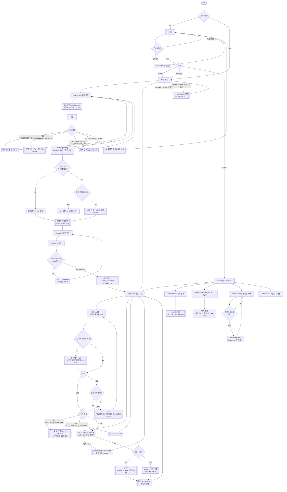

# PRD — 사내 휴가 신청/승인 서비스 (Leave Management)

> **Type**: `product-feature`
> **Feature Key**: `leave-management`
> **Version**: 1.0 (Draft)
> **Last Updated**: 2026-08-04
> **Status**: 검토 대기

> **작성 시 가정 (확인 필요)**
> 대화형 질의가 불가능한 환경에서 작성되어 아래 2건은 판단으로 확정했다. 다르면 알려주면 해당 섹션만 재작성한다.
> 1. **문서 유형 = `product-feature`** — 3개 역할이 각각 별도 화면을 쓰므로 FE 페이지가 필수다.
> 2. **Scale Grade = `Hobby`** — §4.0 참조. 임직원 1,000명 이하 기준. 3,000명 이상이면 `Startup`으로 상향하고 §4.1 수치를 재산정해야 한다.

---

## 1. Overview

### 1.1 Problem Statement

현재 휴가 신청은 메신저·구두·이메일로 흩어져 처리된다. 그 결과:

- **잔여 연차를 아무도 신뢰하지 못한다.** 개인은 스프레드시트를 직접 세고, 인사팀은 분기마다 수기로 대사(對査)한다. 계산 불일치가 발생해도 근거가 되는 기록이 없다.
- **승인 이력이 남지 않는다.** "팀장이 구두로 승인했다"는 주장과 "그런 적 없다"는 주장이 충돌할 때 판정할 근거가 없다. 근로기준법상 3년 보존 의무가 있는 근태 기록이 사실상 부재하다.
- **팀 단위 가시성이 없다.** 팀장은 같은 날 몇 명이 비는지 승인 시점에 알 수 없어, 결과적으로 팀 절반이 동시에 부재하는 상황이 사후에 발견된다.
- **인사팀 수작업 부담.** 전사 휴가 현황 집계에 매월 반나절 이상이 소요된다.

### 1.2 Goals

| # | Goal | 측정 지표 |
|---|---|---|
| G-1 | 휴가 신청–승인–기록을 단일 시스템으로 일원화 | 전체 휴가의 95% 이상이 시스템 경유 (§7) |
| G-2 | 잔여 연차를 실시간·자동 계산으로 신뢰 가능하게 제공 | 수기 대사 불일치 건수 0건/분기 |
| G-3 | 모든 승인·반려에 변경 불가능한 감사 이력 부여 | 승인 이력 누락 0건 |
| G-4 | 인사팀의 집계 수작업 제거 | 월간 집계 소요시간 4시간 → 10분 이하 |
| G-5 | 팀장이 승인 시점에 팀 부재 현황을 보고 판단 | 동일 일자 팀 부재율 경고 노출률 100% |

### 1.3 Non-Goals

이번 버전에서 **명시적으로 만들지 않는 것**이다. 요구가 들어와도 별도 PRD로 분리한다.

| # | Non-Goal | 이유 |
|---|---|---|
| NG-1 | 급여·정산 연동 (미사용 연차 수당 계산) | 급여 시스템 소유권이 재무팀에 있고 회계 검증 절차가 별도로 필요하다 |
| NG-2 | 출퇴근 기록·근태 관리 (지각·초과근무) | 휴가와 도메인이 다르고 물리적 출입 시스템 연동이 선행되어야 한다 |
| NG-3 | 다단계 결재선 (팀장 → 본부장 → 대표) | 1단계 승인으로 현행 프로세스를 100% 커버한다. 조직 확대 시 재검토 |
| NG-4 | 모바일 네이티브 앱 | 반응형 웹으로 모바일 사용을 커버한다 (§5.4 Responsive) |
| NG-5 | 다국어 (i18n) | 전 구성원이 한국어를 사용한다 |
| NG-6 | 외부 캘린더 양방향 동기화 (Google/Outlook 쓰기) | 읽기 전용 ICS 피드는 P2로 검토, 양방향은 범위 밖 |
| NG-7 | 조직개편·인사이동 자동 반영 | 관리자 수동 변경으로 처리 (FR-017) |
| NG-8 | SSO / SAML | 자체 이메일+비밀번호 인증으로 시작. Scale Grade 상향 시 재검토 |

### 1.4 Scope

**포함**
- 이메일+비밀번호 인증, 역할 기반 접근 제어 (3 role)
- 휴가 유형 5종: 연차, 반차(오전/오후), 병가, 경조사, 무급휴가
- 신청 생성 / 조회 / 취소 (신청자)
- 승인 / 반려 (팀장), 반려 사유 필수
- 전사 현황 대시보드, 검색·필터, 연차 부여·조정 (관리자)
- 주말·공휴일을 제외한 영업일 자동 계산
- 잔여 연차 실시간 계산 및 대기 건 선차감(hold)
- 이메일 알림, 팀 휴가 캘린더
- 감사 로그 (append-only)

**제외** — §1.3 Non-Goals 전체 + 다음
- 휴가 승인 규칙의 코드 외부화(룰 엔진). 이번엔 하드코딩된 정책 + 관리자 설정값으로 충분하다.
- 첨부파일 업로드(진단서 등). 병가 사유 텍스트로 대체하고 원본은 오프라인 제출한다.

---

## 2. User Stories

### 2.1 Primary User

**US-1 (member) — 휴가 신청**
> As a **팀원**, I want to 잔여 연차를 확인하고 날짜·유형·사유를 입력해 휴가를 신청 so that 메신저로 팀장에게 개별 요청하지 않고도 승인 상태를 스스로 추적할 수 있다.

**US-2 (member) — 신청 취소**
> As a **팀원**, I want to 아직 승인되지 않은 신청을 스스로 취소 so that 일정이 바뀌었을 때 팀장에게 별도로 부탁하지 않아도 된다.

**US-3 (member) — 잔여 연차 확인**
> As a **팀원**, I want to 부여·사용·대기·잔여 일수를 한 화면에서 확인 so that 연말에 연차가 남거나 초과 신청하는 일을 피할 수 있다.

**US-4 (manager) — 승인/반려**
> As a **팀장**, I want to 팀원의 대기 중인 신청을 한 화면에서 보고 승인하거나 사유를 적어 반려 so that 승인 요청이 메신저에 묻히지 않고 결정 근거가 기록으로 남는다.

**US-5 (manager) — 팀 부재 현황 확인**
> As a **팀장**, I want to 승인하려는 기간에 이미 휴가 중인 팀원 수를 확인 so that 팀 운영이 마비되는 승인을 사전에 막을 수 있다.

**US-6 (admin) — 전사 현황 조회**
> As a **관리자**, I want to 전 구성원의 휴가 신청·잔여 연차·사용률을 조건별로 검색 so that 매월 수기 집계 없이 인사 보고를 작성할 수 있다.

**US-7 (admin) — 연차 부여·조정**
> As a **관리자**, I want to 입사일 기준 연차를 부여하고 예외 상황을 수동 조정 so that 개인별 특수 케이스(육아휴직 복귀, 중도 입사)를 시스템 안에서 처리할 수 있다.

**US-8 (manager) — 본인 휴가 신청**
> As a **팀장**, I want to 나 자신도 휴가를 신청하되 상위 승인자에게 라우팅 so that 자기 신청을 자기가 승인하는 통제 공백이 생기지 않는다.

### 2.2 Acceptance Criteria

정상 경로뿐 아니라 **실패·만료·권한부족·경합** 시나리오를 포함한다.

#### AC-1 휴가 신청 성공 (US-1)
```gherkin
Given 로그인한 member "김팀원"의 2026년 잔여 연차가 10.0일이고
  And 2026-09-07(월)~2026-09-11(금) 구간에 공휴일이 없으며
  And 해당 구간에 김팀원의 다른 신청이 없을 때
When 휴가 유형 "연차", 시작일 2026-09-07, 종료일 2026-09-11, 사유 "가족 여행"으로 신청하면
Then 신청이 status="pending"으로 생성되고
  And day_count는 5.0으로 계산되며
  And 김팀원의 pending_days가 5.0 증가해 잔여 표시가 5.0일이 되고
  And 팀장 "박팀장"의 승인 대기 목록에 해당 건이 나타난다
```

#### AC-2 잔여 연차 부족으로 신청 실패 (US-1, 실패)
```gherkin
Given member "김팀원"의 잔여 연차가 2.0일일 때
When 5영업일짜리 연차를 신청하면
Then 신청은 생성되지 않고
  And HTTP 422와 error code "INSUFFICIENT_BALANCE"가 반환되며
  And 응답에 required=5.0, available=2.0이 포함되고
  And 화면에 "잔여 연차 2.0일로는 5.0일을 신청할 수 없습니다"가 표시된다
```

#### AC-3 기간 중복으로 신청 실패 (US-1, 실패)
```gherkin
Given member "김팀원"에게 2026-09-07~2026-09-11 구간의 pending 또는 approved 신청이 이미 있을 때
When 2026-09-10~2026-09-14로 새 휴가를 신청하면
Then HTTP 409와 error code "OVERLAPPING_REQUEST"가 반환되고
  And 응답에 충돌한 기존 신청의 id와 기간이 포함된다
```

#### AC-4 과거 날짜 신청 (US-1, 경계)
```gherkin
Given 오늘이 2026-09-10일 때
When 휴가 유형 "연차"로 시작일 2026-09-01을 신청하면
Then HTTP 422와 error code "PAST_DATE_NOT_ALLOWED"가 반환된다

When 휴가 유형 "병가"로 시작일 2026-09-01을 신청하면
Then 신청은 status="pending"으로 정상 생성된다
  # 병가만 사후 등록을 허용한다 (FR-007)
```

#### AC-5 승인 성공 (US-4)
```gherkin
Given manager "박팀장"이 로그인했고
  And 팀원 "김팀원"의 pending 신청 REQ-100(5.0일)이 존재할 때
When 박팀장이 REQ-100을 승인하면
Then REQ-100의 status가 "approved"로 바뀌고
  And approver_id=박팀장, decided_at=현재시각이 기록되며
  And 김팀원의 pending_days가 5.0 감소하고 used_days가 5.0 증가하며
  And 잔여 연차 표시값은 승인 전후로 변하지 않고
  And 감사 로그에 (actor=박팀장, action=APPROVE, target=REQ-100) 1건이 append된다
```

#### AC-6 반려 시 사유 필수 (US-4, 실패)
```gherkin
Given manager "박팀장"이 팀원의 pending 신청 REQ-100을 보고 있을 때
When 반려 사유를 비운 채 반려를 요청하면
Then HTTP 422와 error code "REJECTION_REASON_REQUIRED"가 반환되고
  And REQ-100의 status는 "pending"으로 유지된다

When 반려 사유 "해당 주 프로젝트 마감"을 입력해 반려하면
Then status가 "rejected"로 바뀌고
  And 김팀원의 pending_days가 5.0 감소해 잔여 연차가 원상 복구되며
  And 김팀원에게 반려 사유를 포함한 알림이 발송된다
```

#### AC-7 타 팀 신청에 대한 권한 부족 (US-4, 권한)
```gherkin
Given manager "박팀장"(A팀)이 로그인했고
  And REQ-200이 B팀 소속 팀원의 신청일 때
When 박팀장이 REQ-200을 승인 시도하면
Then HTTP 403과 error code "NOT_TEAM_APPROVER"가 반환되고
  And REQ-200의 상태는 변경되지 않으며
  And 감사 로그에 (actor=박팀장, action=APPROVE_DENIED, target=REQ-200) 1건이 기록된다

When 박팀장이 GET /api/leaves/REQ-200 으로 상세 조회를 시도하면
Then HTTP 403이 반환되고 신청 내용은 응답 본문에 포함되지 않는다
```

#### AC-8 자기 신청 자기 승인 차단 (US-8, 권한)
```gherkin
Given manager "박팀장"이 본인 명의로 pending 신청 REQ-300을 생성했을 때
Then REQ-300의 승인 대상자는 박팀장의 상위 관리자로 라우팅되고
  And 박팀장의 승인 대기 목록에는 REQ-300이 나타나지 않으며
When 박팀장이 REQ-300을 직접 승인 시도하면
Then HTTP 403과 error code "SELF_APPROVAL_FORBIDDEN"이 반환된다

Given 박팀장에게 지정된 상위 관리자가 없을 때
Then REQ-300은 role=admin 전원의 승인 대기 목록으로 라우팅된다
```

#### AC-9 신청자 취소 (US-2)
```gherkin
Given member "김팀원"의 신청 REQ-100이 status="pending"일 때
When 김팀원이 REQ-100을 취소하면
Then status가 "cancelled"로 바뀌고 pending_days가 복구되며
  And 팀장의 승인 대기 목록에서 사라진다

Given REQ-100이 이미 status="approved"일 때
When 김팀원이 취소를 요청하면
Then HTTP 409와 error code "ALREADY_DECIDED"가 반환되고
  And 화면에 "승인된 휴가는 취소 요청을 통해 팀장 재승인이 필요합니다" 안내가 표시된다
```

#### AC-10 승인 경합 (동시성)
```gherkin
Given 신청 REQ-100이 pending이고
  And manager "박팀장"과 admin "최관리"가 동시에 REQ-100 상세 화면을 열고 있을 때
When 박팀장이 승인하고, 100ms 뒤 최관리가 반려를 요청하면
Then 박팀장의 요청은 200으로 성공하고
  And 최관리의 요청은 HTTP 409와 error code "ALREADY_DECIDED"를 받으며
  And REQ-100의 최종 status는 "approved" 하나로 확정되고
  And 잔여 연차는 이중 차감되지 않는다
```

#### AC-11 세션 만료 (만료)
```gherkin
Given member "김팀원"의 세션이 발급된 지 12시간이 지나 만료되었을 때
When 김팀원이 휴가 신청을 제출하면
Then HTTP 401과 error code "SESSION_EXPIRED"가 반환되고
  And 신청은 생성되지 않으며
  And 로그인 화면으로 이동하되 입력하던 신청 폼 값은 로컬에 보존되어 재로그인 후 복원된다
```

#### AC-12 관리자 전사 조회 (US-6)
```gherkin
Given admin "최관리"가 로그인했을 때
When 기간 2026-01-01~2026-12-31, 팀="개발팀", 상태="approved"로 조회하면
Then 조건에 맞는 전 구성원의 신청이 페이지네이션되어 반환되고
  And 각 행에 신청자·유형·기간·일수·승인자·승인일시가 포함되며
  And 병가 신청의 사유 필드는 "(비공개)"로 마스킹된다

Given member "김팀원"이 로그인했을 때
When /admin/overview 에 직접 URL로 접근하면
Then no-permission 상태 화면이 표시되고 API는 HTTP 403을 반환한다
```

#### AC-13 공휴일·주말 제외 계산 (US-1, 경계)
```gherkin
Given 2026-09-24(목)~2026-09-26(토)가 추석 공휴일로 등록되어 있을 때
When member가 2026-09-21(월)~2026-09-30(수)로 연차를 신청하면
Then day_count는 주말 2일(9/26 토, 9/27 일)과 공휴일 9/24·9/25를 제외해 계산되고
  And 신청 화면에 "총 10일 중 영업일 5.0일 차감" 미리보기가 제출 전에 표시된다

When member가 시작일과 종료일을 모두 토요일로 지정하면
Then HTTP 422와 error code "NO_BUSINESS_DAY"가 반환된다
```

#### AC-14 반차 (경계)
```gherkin
Given member "김팀원"의 잔여 연차가 0.5일일 때
When 휴가 유형 "반차(오전)", 시작일=종료일=2026-09-07로 신청하면
Then day_count는 0.5로 계산되고 신청이 정상 생성된다

When 반차 유형으로 시작일 2026-09-07, 종료일 2026-09-08(2일)을 신청하면
Then HTTP 422와 error code "HALF_DAY_SINGLE_DATE_ONLY"가 반환된다
```

### 2.3 User Roles

Role Key는 아래 3개로 **단일 선언**한다. §5.1 인가 주체, §5.4 Audience, `/screen-spec` Audience는 이 키를 그대로 인용한다.

| Role Key | 한국어 명칭 | 권한 범위 |
|---|---|---|
| `member` | 팀원 (신청자) | 본인 휴가 신청·조회·취소, 본인 잔여 연차 조회, 소속 팀 휴가 캘린더 조회 |
| `manager` | 팀장 (승인자) | `member`의 모든 권한 + 소속 팀원 신청 조회·승인·반려, 소속 팀 부재 현황 조회. **본인 신청은 승인 불가** |
| `admin` | 관리자 (인사) | 전 구성원 신청 조회·검색·내보내기, 연차 부여·조정, 사용자/팀/휴가유형/공휴일 관리, 감사 로그 열람, 상위 승인자 부재 시 대리 승인. **연차 잔액 직접 수정은 사유 기록 필수** |

> `manager`는 `member`를 포함하는 상위 집합이다 (팀장도 휴가를 쓴다).
> `admin`은 `member` 권한을 **자동으로 포함하지 않는다** — 인사팀 담당자가 본인 휴가를 신청하려면 별도로 `member` 역할이 함께 부여되어야 한다. 사용자당 복수 역할을 허용한다 (§5.2 `user_roles`).

---

## 3. Functional Requirements

| ID | Requirement | Priority | Dependencies |
|---|---|---|---|
| FR-001 | 이메일 + 비밀번호로 로그인하고 HttpOnly 세션 쿠키를 발급한다. 세션 유효기간 12시간, 슬라이딩 갱신 없음 | P0 | — |
| FR-002 | 모든 API·페이지는 §2.3 Role Key 기준 인가를 강제한다. 인가 실패는 403, 미인증은 401 | P0 | FR-001 |
| FR-003 | 휴가 유형 5종(연차 `annual`, 반차 `half_day_am`/`half_day_pm`, 병가 `sick`, 경조사 `special`, 무급 `unpaid`)을 제공하고, 유형별로 잔액 차감 여부·사후 등록 허용 여부·최대 연속 일수를 설정한다 | P0 | — |
| FR-004 | 관리자가 공휴일 캘린더(연도별 날짜 목록)를 등록·수정한다. 등록된 날짜는 영업일 계산에서 제외된다 | P0 | FR-002 |
| FR-005 | 시작일·종료일로부터 주말과 공휴일을 제외한 **영업일 수**를 계산한다. 반차는 0.5일로 계산한다 | P0 | FR-004 |
| FR-006 | 사용자별·연도별·유형별 잔액(`granted` / `used` / `pending` / `available`)을 관리한다. `available = granted - used - pending` | P0 | FR-003 |
| FR-007 | 휴가 신청을 생성한다. 검증 항목: (a) `available >= day_count`, (b) 기존 pending/approved 신청과 기간 미중복, (c) 시작일이 과거가 아님 — 단 `sick`은 예외, (d) 영업일 ≥ 0.5일, (e) 반차는 단일 날짜만, (f) 사유 1~500자 | P0 | FR-005, FR-006 |
| FR-008 | 신청 생성 시 `pending_days`를 즉시 선차감(hold)한다. 승인 시 `pending → used`로 이관하고, 반려·취소 시 hold를 해제한다. 잔액 갱신은 신청 상태 전이와 **단일 트랜잭션**으로 처리한다 | P0 | FR-007 |
| FR-009 | 신청 상태는 `pending` → `approved` \| `rejected` \| `cancelled` 로만 전이한다. 종결 상태(`approved`/`rejected`/`cancelled`)에서의 재전이 시도는 409로 거부한다 | P0 | FR-007 |
| FR-010 | 신청자는 본인 신청 목록을 상태·연도로 필터링해 조회하고, 상세를 열람한다 | P0 | FR-007 |
| FR-011 | 신청자는 `pending` 상태의 본인 신청을 취소한다 (`cancelled`) | P0 | FR-009 |
| FR-012 | 신청 생성 시 승인자를 자동 결정한다: 신청자의 팀장. 신청자가 그 팀의 팀장 본인이면 상위 관리자, 상위 관리자가 없으면 `admin` 전원 | P0 | FR-007 |
| FR-013 | `manager`는 본인이 승인자인 `pending` 신청 목록을 조회한다. 목록은 신청일 오름차순 기본 정렬, 신청자·유형·기간으로 필터링한다 | P0 | FR-012 |
| FR-014 | `manager`/`admin`은 신청을 승인한다. 승인 시 승인자·일시·선택 코멘트를 기록한다 | P0 | FR-013 |
| FR-015 | `manager`/`admin`은 신청을 반려한다. **반려 사유는 필수(1~500자)**이며 신청자에게 그대로 노출된다 | P0 | FR-013 |
| FR-016 | 자기 자신이 신청자인 건은 승인·반려할 수 없다 (403 `SELF_APPROVAL_FORBIDDEN`). `admin`도 본인 건에는 동일하게 적용된다 | P0 | FR-014, FR-015 |
| FR-017 | `admin`은 사용자·팀을 등록·수정하고 역할과 소속 팀, 팀장 지정을 변경한다 | P0 | FR-002 |
| FR-018 | `admin`은 사용자별 연차를 부여·조정한다. 조정 시 **사유 입력이 필수**이며 조정 전/후 값이 감사 로그에 기록된다 | P0 | FR-006 |
| FR-019 | `admin`은 전 구성원 신청을 기간·팀·상태·유형·신청자로 검색한다. 결과는 50건 단위 페이지네이션 | P0 | FR-002 |
| FR-020 | `admin` 대시보드에 당월 기준 집계를 표시한다: 승인 대기 건수, 이번 주 부재 인원, 팀별 연차 사용률, 잔여 연차 15일 초과 보유자 수 | P0 | FR-019 |
| FR-021 | 모든 상태 변경(생성·승인·반려·취소·잔액 조정·권한 변경)과 인가 거부(403)를 append-only 감사 로그에 기록한다. 로그는 수정·삭제 불가하며 `admin`만 열람한다 | P0 | FR-009, FR-018 |
| FR-022 | 상태 변경 시 이메일 알림을 발송한다: 신청 생성 → 승인자, 승인/반려 → 신청자. 발송 실패는 재시도 3회 후 로그에 기록하되 **본 트랜잭션을 롤백하지 않는다** | P1 | FR-014, FR-015 |
| FR-023 | 팀 휴가 캘린더에 소속 팀원의 `approved` 휴가를 월 단위로 표시한다. 사유는 표시하지 않는다 | P1 | FR-014 |
| FR-024 | 승인 화면에서 해당 기간 팀 부재 인원과 팀 총원 대비 비율을 표시한다. 30% 초과 시 승인 버튼 위에 경고를 노출하되 승인을 차단하지는 않는다 | P1 | FR-023 |
| FR-025 | 신청자는 `approved` 신청에 대해 취소를 요청한다(`cancel_requested`). 승인자가 수락하면 `cancelled`로 전이하고 `used_days`를 복구한다. 시작일이 이미 지난 건은 요청할 수 없다 | P1 | FR-009 |
| FR-026 | `admin`은 검색 결과를 CSV(UTF-8 BOM)로 내보낸다. 최대 10,000행 | P1 | FR-019 |
| FR-027 | 승인자 부재 시 대결재자를 기간 지정으로 위임한다 | P2 | FR-012 |
| FR-028 | Slack 채널·DM 알림을 이메일과 병행 발송한다 | P2 | FR-022 |
| FR-029 | 팀 휴가 캘린더를 읽기 전용 ICS 피드로 구독한다 | P2 | FR-023 |

**FR 무모순 확인**

- FR-002는 전 API 인증을 요구한다. 공개 접근을 허용하는 FR은 로그인(FR-001) 외에 없다 — 충돌 없음.
- FR-007(c) 과거 날짜 금지와 AC-4 병가 사후 등록은 FR-003의 유형별 `allows_backdating` 설정으로 조정되며, FR-007(c)가 명시적으로 예외를 기술한다 — 충돌 없음.
- FR-011(신청자 취소)은 `pending`만 대상이고, FR-025(승인 후 취소)는 `approved`만 대상이다 — 상태 집합이 배타적이므로 충돌 없음.
- FR-016(자기 승인 금지)은 `admin`에게도 적용되며, FR-012는 이 경우의 라우팅 대상(상위 관리자 → admin 전원)을 명시한다. `admin`이 유일한 승인자이면서 본인 신청인 경우는 **다른 `admin`**이 처리하며, `admin`이 1명뿐인 조직에서는 해당 건이 승인 불가 상태로 남는다 — 이는 의도된 통제이며 §6 Phase 3에서 관리자 계정 최소 2명 정책으로 운영 대응한다.

---

## 4. Non-Functional Requirements

### 4.0 Scale Grade

**`Hobby`**

근거: 사내 임직원 전용 도구이며 대상 인원 1,000명 이하로 가정한다. 휴가 신청은 인당 연 10~20회 수준의 저빈도 행위여서 DAU는 전체 인원의 10~20%(100~200명)를 넘지 않는다. 단, **연말·연초와 하계 휴가 시즌에 트래픽이 평시의 8배**로 집중되므로 §4.1의 피크 목표는 그 배수를 반영해 산정했다.

> 임직원 3,000명 이상이면 `Startup`으로 재평가하고 §4.1 동시성·§4.2 가용성 목표를 상향해야 한다.

### 4.1 Performance

| 항목 | 목표 | 측정 조건 |
|---|---|---|
| 조회 API p95 (`GET /api/leaves`, `/api/balances/me`, `/api/approvals`) | **< 300ms** | 데이터 10만 행, 50건 페이지네이션 |
| 조회 API p99 | < 800ms | 동일 |
| 변경 API p95 (`POST /api/leaves`, 승인·반려) | **< 500ms** | 알림 발송은 비동기 큐로 분리하여 응답 시간에서 제외 |
| 관리자 대시보드 집계 p95 (`GET /api/admin/overview`) | **< 1,000ms** | 전사 1,000명 / 연간 20,000건. 60초 캐시 허용 |
| CSV 내보내기 (10,000행) | < 10s | 스트리밍 응답 |
| 동시 접속자 | **200 concurrent users** 에서 위 목표 유지 | 피크 시즌 기준 |
| 처리량 | **50 req/s** 지속, 피크 **150 req/s** 30초 버스트 | |
| 초기 페이지 로드 LCP | < 2.5s (사내망 유선), < 4.0s (LTE) | |
| 잔액 계산 (`day_count` 미리보기) | < 100ms | 클라이언트 요청 → 응답 |

### 4.2 Availability

- **목표 가용성: 월 99.5%** (허용 다운타임 약 3.6시간/월). 사내 업무시간(평일 09:00~19:00 KST)에는 99.9%를 목표로 한다.
- 계획 점검은 평일 22:00 이후 또는 주말에 수행하고 최소 24시간 전 공지한다.
- **장애 시 동작**
  - DB 연결 실패: 전 요청 503 + "일시적 점검 중입니다" 화면. 쓰기 재시도를 유도하지 않는다 (중복 신청 방지).
  - 이메일 발송 실패(FR-022): 신청·승인 트랜잭션은 정상 커밋하고 알림만 실패 큐로 이동한다. 사용자 흐름을 막지 않는다.
  - 읽기 전용 저하 모드는 제공하지 않는다 — 승인이 지연되어도 업무 중단 영향이 크지 않은 도메인이다.
- 헬스체크 `GET /api/health` (DB 연결 포함), 응답 시간 5s 초과 시 알림.

### 4.3 Data

| 항목 | 정책 |
|---|---|
| 보관 기간 (휴가 기록) | 퇴사일 또는 신청일로부터 **3년** 보관. 근로기준법 제42조 근로자 명부·근태 관련 서류 보존의무에 맞춘다 |
| 보관 기간 (감사 로그) | **5년**. append-only, 애플리케이션 경로로는 삭제 불가 |
| 보관 기간 (세션) | 12시간 후 만료, 만료 세션 레코드는 7일 후 삭제 |
| 개인정보 항목 | 이름, 사내 이메일, 사번, 소속 팀, 입사일. **주민등록번호·연락처·주소는 저장하지 않는다** |
| 민감정보 | 병가(`sick`) 사유는 건강정보에 해당할 수 있다. **본인·직접 승인자·`admin`만 열람**하고, 관리자 목록·CSV·팀 캘린더에서는 "(비공개)"로 마스킹한다 (AC-12) |
| 퇴사자 처리 | 퇴사 즉시 계정 `status=inactive`로 로그인 차단. 개인 식별 정보는 3년 후 익명화(`이름 → 퇴사자-{id}`, `이메일 → 삭제`)하고 통계용 집계 행만 남긴다 |
| 삭제 요청 | 법정 보존기간(3년) 내에는 삭제 요구를 거부할 수 있음을 개인정보 처리방침에 고지한다 |
| 백업 | 일 1회 전체 백업, 30일 보관. 백업 저장소 암호화 필수 |

### 4.4 Recovery

| 항목 | 목표 |
|---|---|
| **RTO** | 4시간 (업무시간 내 장애 기준) |
| **RPO** | 24시간 (일 1회 백업 기준). 승인 이력 유실이 근태 분쟁으로 이어질 수 있으므로 Phase 4에서 **PITR 도입 시 RPO 15분**으로 상향한다 |
| 복구 절차 | 백업 복원 → 감사 로그와 신청 상태 정합성 검증 → 유실 구간 사용자 공지 |
| 복구 훈련 | 반기 1회 복원 리허설, 결과 문서화 |

### 4.5 Security

**인증**
- 이메일 + 비밀번호. 비밀번호는 **bcrypt (cost ≥ 12)** 해시로 저장하며 평문·복호화 가능 형태로 보관하지 않는다.
- 비밀번호 정책: 최소 10자, 영문·숫자·특수문자 중 2종 이상.
- 세션: 서버 세션 ID를 **HttpOnly + Secure + SameSite=Lax** 쿠키로 전달. 유효기간 12시간, 로그아웃 시 서버에서 즉시 무효화.
- 로그인 실패 5회 시 해당 계정 10분 잠금. 실패 응답은 아이디·비밀번호를 구분하지 않는다(계정 열거 방지).

**인가 규칙** — 리소스 × 역할 매트릭스. 모든 판정은 **서버에서 수행**하며 클라이언트 표시 제어는 보조 수단일 뿐이다.

| 리소스 / 행위 | `member` | `manager` | `admin` |
|---|---|---|---|
| 본인 휴가 신청 생성 | ✅ | ✅ | ❌ (member 역할 병행 시 ✅) |
| 본인 신청 조회·취소 | ✅ 본인 건만 | ✅ 본인 건만 | ✅ 본인 건만 |
| 타인 신청 상세 조회 | ❌ | ✅ **소속 팀원 건만** | ✅ 전체 |
| 신청 승인·반려 | ❌ | ✅ **본인이 승인자로 지정된 건만** | ✅ 전체 (단 본인 신청 건 제외) |
| 본인 신청 승인 | ❌ | ❌ (`SELF_APPROVAL_FORBIDDEN`) | ❌ (`SELF_APPROVAL_FORBIDDEN`) |
| 본인 잔액 조회 | ✅ | ✅ | ✅ |
| 타인 잔액 조회 | ❌ | ✅ 소속 팀원만 | ✅ 전체 |
| 잔액 부여·조정 | ❌ | ❌ | ✅ (사유 필수) |
| 팀 캘린더 조회 | ✅ 소속 팀만 | ✅ 소속 팀만 | ✅ 전체 |
| 병가 사유 열람 | ✅ 본인 건만 | ✅ 본인이 승인자인 건만 | ✅ 전체 |
| 사용자·팀·역할 관리 | ❌ | ❌ | ✅ |
| 공휴일·휴가유형 설정 | ❌ | ❌ | ✅ |
| 감사 로그 열람 | ❌ | ❌ | ✅ |
| 전사 검색·CSV 내보내기 | ❌ | ❌ | ✅ |

- 권한 판정 실패는 **403**, 미인증은 **401**로 구분한다. 단 타인 리소스의 **존재 여부 노출을 막아야 하는 경우**(예: 타 팀 신청 ID 추측)에도 403을 반환하고 본문에 리소스 내용을 포함하지 않는다.
- 모든 403은 감사 로그에 기록한다 (FR-021).
- 역할 변경은 즉시 반영된다 — 세션에 역할을 캐시하지 않고 요청마다 DB에서 조회한다.

**전송·저장 보호**
- 전 구간 HTTPS(TLS 1.2+) 강제, HTTP는 308 리다이렉트. HSTS `max-age=31536000`.
- DB 저장 시 디스크 암호화(at-rest). 비밀번호 해시 외 추가 필드 암호화는 하지 않는다(§4.3 기준 민감 식별정보 미보관).
- 백업 파일 암호화 및 접근 계정 분리.

**입력 검증**
- 전 엔드포인트에서 스키마 검증(타입·길이·형식·열거값)을 **서버에서** 수행한다. 검증 실패는 422 + 필드별 오류 목록.
- 날짜: ISO 8601 `YYYY-MM-DD`만 허용. 종료일 ≥ 시작일. 신청 가능 범위는 현재로부터 −1년 ~ +2년.
- 사유·코멘트: 1~500자, HTML 태그 이스케이프 후 저장·출력 (XSS 방지).
- 모든 DB 접근은 파라미터 바인딩 또는 ORM 경유 — 문자열 연결 쿼리 금지.
- 상태 변경 API에 **낙관적 잠금**(`SELECT ... FOR UPDATE` + 상태 재확인)을 적용해 AC-10 경합을 방지한다.
- CSRF: SameSite=Lax + 상태 변경 요청에 CSRF 토큰 검증.
- Rate limit: 로그인 10 req/min/IP, 신청 생성 20 req/min/user, 그 외 120 req/min/user.

---

## 5. Technical Design

### 5.1 API Specification

- Base path: `/api`
- 인증: 세션 쿠키. 별도 표기 없으면 **인증 필수**.
- 공통 에러 응답 형식:
```json
{ "error": { "code": "INSUFFICIENT_BALANCE", "message": "잔여 연차가 부족합니다.", "details": { "required": 5.0, "available": 2.0 } } }
```
- 공통 에러 코드: `UNAUTHENTICATED`(401) / `SESSION_EXPIRED`(401) / `FORBIDDEN`(403) / `NOT_FOUND`(404) / `VALIDATION_FAILED`(422) / `RATE_LIMITED`(429) / `INTERNAL_ERROR`(500)

---

#### `POST /api/auth/login` — 로그인
**인가 주체**: 공개 (미인증 허용)

| | |
|---|---|
| Request | `{ "email": "kim@company.com", "password": "..." }` |
| Response 200 | `{ "user": { "id": 12, "name": "김팀원", "email": "...", "roles": ["member"], "teamId": 3 } }` + `Set-Cookie: sid=...; HttpOnly; Secure; SameSite=Lax; Max-Age=43200` |
| Error | 401 `INVALID_CREDENTIALS` (아이디·비밀번호 미구분) / 423 `ACCOUNT_LOCKED` (5회 실패) / 403 `ACCOUNT_INACTIVE` (퇴사자) / 429 `RATE_LIMITED` |

#### `POST /api/auth/logout` — 로그아웃
**인가 주체**: `member` `manager` `admin`
Response 204. 서버 세션 즉시 삭제.

#### `GET /api/me` — 내 프로필·역할
**인가 주체**: `member` `manager` `admin`
Response 200 `{ "id": 12, "name": "김팀원", "email": "...", "roles": ["member"], "team": { "id": 3, "name": "개발팀", "managerId": 7 } }`
Error 401 `SESSION_EXPIRED`

---

#### `GET /api/balances/me` — 내 잔여 연차
**인가 주체**: 본인 (`member` `manager` `admin` 모두 본인 건만)

| | |
|---|---|
| Request | Query: `year` (선택, 기본 = 당해연도) |
| Response 200 | `{ "year": 2026, "balances": [ { "leaveType": "annual", "granted": 15.0, "used": 3.0, "pending": 5.0, "available": 7.0 }, { "leaveType": "sick", "granted": 5.0, "used": 0, "pending": 0, "available": 5.0 } ] }` |
| Error | 401 / 422 `VALIDATION_FAILED` (year 범위 밖) |

#### `GET /api/leave-types` — 휴가 유형 목록
**인가 주체**: `member` `manager` `admin`
Response 200 `[ { "code": "annual", "label": "연차", "deductsBalance": true, "allowsBackdating": false, "maxConsecutiveDays": 15, "unit": 1.0 }, { "code": "half_day_am", "label": "반차(오전)", "deductsBalance": true, "allowsBackdating": false, "singleDateOnly": true, "unit": 0.5 }, ... ]`

#### `POST /api/leaves/preview` — 영업일 수 미리보기 (AC-13)
**인가 주체**: `member` `manager`

| | |
|---|---|
| Request | `{ "leaveType": "annual", "startDate": "2026-09-21", "endDate": "2026-09-30" }` |
| Response 200 | `{ "calendarDays": 10, "businessDays": 5.0, "excluded": [ { "date": "2026-09-24", "reason": "holiday", "label": "추석" }, { "date": "2026-09-26", "reason": "weekend" } ], "availableAfter": 2.0 }` |
| Error | 422 `NO_BUSINESS_DAY` / 422 `VALIDATION_FAILED` (종료일 < 시작일) |

---

#### `POST /api/leaves` — 휴가 신청 (FR-007, FR-008, FR-012)
**인가 주체**: `member` `manager` — **본인 명의로만 생성 가능**. `userId`를 요청 본문으로 받지 않는다(세션에서 도출).

| | |
|---|---|
| Request | `{ "leaveType": "annual", "startDate": "2026-09-07", "endDate": "2026-09-11", "reason": "가족 여행" }` |
| Response 201 | `{ "id": 100, "status": "pending", "leaveType": "annual", "startDate": "2026-09-07", "endDate": "2026-09-11", "dayCount": 5.0, "reason": "가족 여행", "approver": { "id": 7, "name": "박팀장" }, "createdAt": "2026-08-04T02:11:00Z" }` |
| Error | 401 `SESSION_EXPIRED` (AC-11) / 422 `INSUFFICIENT_BALANCE` (AC-2) / 409 `OVERLAPPING_REQUEST` (AC-3) / 422 `PAST_DATE_NOT_ALLOWED` (AC-4) / 422 `NO_BUSINESS_DAY` (AC-13) / 422 `HALF_DAY_SINGLE_DATE_ONLY` (AC-14) / 422 `EXCEEDS_MAX_CONSECUTIVE` / 422 `VALIDATION_FAILED` (사유 길이) / 409 `NO_APPROVER_AVAILABLE` (승인자 라우팅 실패) |

#### `GET /api/leaves` — 내 신청 목록 (FR-010)
**인가 주체**: 본인 건만. `userId` 쿼리 파라미터를 지원하지 않는다.

| | |
|---|---|
| Request | Query: `status` (`pending\|approved\|rejected\|cancelled`, 복수 허용), `year`, `page` (기본 1), `size` (기본 20, 최대 50) |
| Response 200 | `{ "items": [ { "id": 100, "leaveType": "annual", "startDate": "...", "endDate": "...", "dayCount": 5.0, "status": "pending", "approver": {...}, "createdAt": "..." } ], "page": 1, "size": 20, "total": 7 }` |
| Error | 401 / 422 `VALIDATION_FAILED` |

#### `GET /api/leaves/:id` — 신청 상세
**인가 주체**: 신청자 본인 | 해당 건의 승인자(`manager`) | `admin`. 그 외 **403** (AC-7 — 본문에 리소스 내용 미포함)

| | |
|---|---|
| Response 200 | `{ "id": 100, "applicant": { "id": 12, "name": "김팀원", "team": "개발팀" }, "leaveType": "annual", "startDate": "...", "endDate": "...", "dayCount": 5.0, "reason": "가족 여행", "status": "approved", "approver": {...}, "decidedAt": "...", "decisionComment": "", "history": [ { "action": "CREATE", "actor": "김팀원", "at": "..." }, { "action": "APPROVE", "actor": "박팀장", "at": "..." } ] }` |
| Error | 401 / 403 `NOT_TEAM_APPROVER` / 404 `NOT_FOUND` |

> `reason` 필드는 `leaveType="sick"`이고 열람자가 본인·승인자·`admin`이 아니면 `"(비공개)"`로 치환한다 (§4.3).

#### `PATCH /api/leaves/:id/cancel` — 신청 취소 (FR-011, AC-9)
**인가 주체**: 신청자 본인만

| | |
|---|---|
| Request | `{}` (본문 없음) |
| Response 200 | `{ "id": 100, "status": "cancelled", "balanceRestored": 5.0 }` |
| Error | 403 `FORBIDDEN` (타인 건) / 409 `ALREADY_DECIDED` (pending 아님) / 404 |

#### `POST /api/leaves/:id/cancel-request` — 승인 후 취소 요청 (FR-025, P1)
**인가 주체**: 신청자 본인만

| | |
|---|---|
| Request | `{ "reason": "일정 변경" }` |
| Response 200 | `{ "id": 100, "status": "cancel_requested" }` |
| Error | 409 `ALREADY_DECIDED` (approved 아님) / 422 `LEAVE_ALREADY_STARTED` (시작일 경과) |

---

#### `GET /api/approvals` — 승인 대기 목록 (FR-013)
**인가 주체**: `manager` (본인이 승인자로 지정된 건만) | `admin` (전체). **본인이 신청자인 건은 결과에서 제외** (AC-8)

| | |
|---|---|
| Request | Query: `status` (기본 `pending`), `applicantId`, `leaveType`, `from`, `to`, `page`, `size` |
| Response 200 | `{ "items": [ { "id": 100, "applicant": { "id": 12, "name": "김팀원" }, "leaveType": "annual", "startDate": "...", "endDate": "...", "dayCount": 5.0, "reason": "...", "createdAt": "...", "teamAbsence": { "overlappingMembers": 2, "teamSize": 8, "ratio": 0.25 } } ], "page": 1, "size": 20, "total": 3 }` |
| Error | 401 / 403 `FORBIDDEN` (`member` 접근) |

#### `POST /api/leaves/:id/approve` — 승인 (FR-014, AC-5, AC-10)
**인가 주체**: 해당 건의 지정 승인자(`manager`) | `admin`. **본인 신청 건은 불가**

| | |
|---|---|
| Request | `{ "comment": "다녀오세요" }` — `comment` 선택, 0~500자 |
| Response 200 | `{ "id": 100, "status": "approved", "approver": { "id": 7, "name": "박팀장" }, "decidedAt": "2026-08-04T03:00:00Z" }` |
| Error | 403 `NOT_TEAM_APPROVER` (AC-7) / 403 `SELF_APPROVAL_FORBIDDEN` (AC-8) / 409 `ALREADY_DECIDED` (AC-10) / 404 |

#### `POST /api/leaves/:id/reject` — 반려 (FR-015, AC-6)
**인가 주체**: 승인과 동일

| | |
|---|---|
| Request | `{ "reason": "해당 주 프로젝트 마감" }` — **필수, 1~500자** |
| Response 200 | `{ "id": 100, "status": "rejected", "approver": {...}, "decidedAt": "...", "rejectionReason": "해당 주 프로젝트 마감", "balanceRestored": 5.0 }` |
| Error | 422 `REJECTION_REASON_REQUIRED` / 403 `NOT_TEAM_APPROVER` / 403 `SELF_APPROVAL_FORBIDDEN` / 409 `ALREADY_DECIDED` |

---

#### `GET /api/teams/:teamId/calendar` — 팀 휴가 캘린더 (FR-023, P1)
**인가 주체**: 해당 팀 소속 `member`·`manager` | `admin` (전체 팀)

| | |
|---|---|
| Request | Query: `month` (`YYYY-MM`, 필수) |
| Response 200 | `{ "month": "2026-09", "entries": [ { "userId": 12, "userName": "김팀원", "leaveType": "annual", "startDate": "...", "endDate": "..." } ] }` — **사유는 포함하지 않는다** |
| Error | 403 `FORBIDDEN` (타 팀) / 422 `VALIDATION_FAILED` |

---

#### `GET /api/admin/overview` — 전사 대시보드 (FR-020, AC-12)
**인가 주체**: `admin` 전용

| | |
|---|---|
| Request | Query: `month` (기본 당월) |
| Response 200 | `{ "pendingCount": 12, "onLeaveThisWeek": 8, "teamUsage": [ { "teamId": 3, "teamName": "개발팀", "granted": 120.0, "used": 34.0, "usageRate": 0.283 } ], "highBalanceHolders": 5 }` |
| Error | 401 / 403 `FORBIDDEN` |

#### `GET /api/admin/leaves` — 전사 신청 검색 (FR-019)
**인가 주체**: `admin` 전용

| | |
|---|---|
| Request | Query: `from`, `to`, `teamId`, `status`, `leaveType`, `applicantId`, `page`, `size` (최대 50) |
| Response 200 | `{ "items": [ { "id": 100, "applicant": {...}, "team": "개발팀", "leaveType": "annual", "startDate": "...", "endDate": "...", "dayCount": 5.0, "status": "approved", "approver": {...}, "decidedAt": "...", "reason": "(비공개)" } ], "page": 1, "size": 50, "total": 1842 }` |
| Error | 403 `FORBIDDEN` / 422 `VALIDATION_FAILED` (기간 최대 2년 초과) |

#### `GET /api/admin/leaves/export` — CSV 내보내기 (FR-026, P1)
**인가 주체**: `admin` 전용
Request: `/api/admin/leaves`와 동일한 쿼리. Response 200 `text/csv; charset=utf-8` (BOM 포함), 스트리밍.
Error 403 / 422 `EXPORT_LIMIT_EXCEEDED` (10,000행 초과)

#### `POST /api/admin/balances` — 연차 부여·조정 (FR-018)
**인가 주체**: `admin` 전용

| | |
|---|---|
| Request | `{ "userId": 12, "year": 2026, "leaveType": "annual", "grantedDays": 16.0, "reason": "근속 3년 차 가산" }` — `reason` **필수** |
| Response 200 | `{ "userId": 12, "year": 2026, "leaveType": "annual", "before": { "granted": 15.0 }, "after": { "granted": 16.0, "used": 3.0, "pending": 5.0, "available": 8.0 } }` |
| Error | 403 / 422 `VALIDATION_FAILED` (사유 누락, granted < used + pending) / 404 `NOT_FOUND` |

#### `GET /api/admin/users` · `POST /api/admin/users` · `PATCH /api/admin/users/:id` — 사용자·역할·소속 관리 (FR-017)
**인가 주체**: `admin` 전용
PATCH Request: `{ "roles": ["member","manager"], "teamId": 3, "status": "active" }`
Error 403 / 422 `VALIDATION_FAILED` / 409 `LAST_ADMIN` (마지막 `admin`의 역할 회수 시도)

#### `GET /api/admin/holidays` · `PUT /api/admin/holidays/:year` — 공휴일 관리 (FR-004)
**인가 주체**: `admin` 전용
PUT Request: `{ "dates": [ { "date": "2026-09-24", "label": "추석" } ] }`
Error 403 / 422 `VALIDATION_FAILED` / 409 `AFFECTS_APPROVED_LEAVES` — 이미 승인된 휴가의 일수 계산에 영향을 주는 변경은 영향받는 신청 목록과 함께 거부하고, `?force=true`로만 반영한다(변경 이력 감사 로그 기록).

#### `GET /api/admin/audit-logs` — 감사 로그 열람 (FR-021)
**인가 주체**: `admin` 전용. **쓰기·삭제 엔드포인트 없음**
Request Query: `from`, `to`, `actorId`, `action`, `targetType`, `page`, `size`
Response 200 `{ "items": [ { "id": 9001, "at": "...", "actorId": 7, "actorName": "박팀장", "action": "APPROVE", "targetType": "leave_request", "targetId": 100, "before": {"status":"pending"}, "after": {"status":"approved"}, "ip": "10.0.1.5" } ], ... }`

#### `GET /api/health` — 헬스체크
**인가 주체**: 공개. Response 200 `{ "status": "ok", "db": "ok" }` / 503 `{ "status": "degraded", "db": "fail" }`

---

### 5.2 Database Schema

PostgreSQL 기준. 금액이 아닌 **일수는 `NUMERIC(4,1)`** 로 저장한다 (반차 0.5 표현, 부동소수 오차 회피).

```sql
-- 팀
CREATE TABLE teams (
  id           BIGSERIAL PRIMARY KEY,
  name         VARCHAR(100) NOT NULL UNIQUE,
  manager_id   BIGINT,                           -- FK는 users 생성 후 ALTER로 추가 (순환 참조)
  parent_id    BIGINT REFERENCES teams(id),      -- 상위 관리자 라우팅용 (FR-012)
  created_at   TIMESTAMPTZ NOT NULL DEFAULT now()
);

-- 사용자
CREATE TABLE users (
  id             BIGSERIAL PRIMARY KEY,
  employee_no    VARCHAR(20) NOT NULL UNIQUE,
  email          VARCHAR(255) NOT NULL UNIQUE,
  name           VARCHAR(50) NOT NULL,
  password_hash  VARCHAR(255) NOT NULL,          -- bcrypt cost>=12
  team_id        BIGINT REFERENCES teams(id),
  hire_date      DATE NOT NULL,
  status         VARCHAR(20) NOT NULL DEFAULT 'active'
                 CHECK (status IN ('active','inactive')),
  failed_logins  SMALLINT NOT NULL DEFAULT 0,
  locked_until   TIMESTAMPTZ,
  anonymized_at  TIMESTAMPTZ,                    -- §4.3 퇴사자 익명화
  created_at     TIMESTAMPTZ NOT NULL DEFAULT now(),
  updated_at     TIMESTAMPTZ NOT NULL DEFAULT now()
);
CREATE INDEX idx_users_team ON users(team_id) WHERE status = 'active';

-- teams → users 순환 FK를 후행 추가
ALTER TABLE teams ADD CONSTRAINT fk_teams_manager
  FOREIGN KEY (manager_id) REFERENCES users(id);

-- 역할 (복수 역할 허용, §2.3)
CREATE TABLE user_roles (
  user_id  BIGINT NOT NULL REFERENCES users(id) ON DELETE CASCADE,
  role     VARCHAR(20) NOT NULL CHECK (role IN ('member','manager','admin')),
  PRIMARY KEY (user_id, role)
);

-- 휴가 유형 (FR-003)
CREATE TABLE leave_types (
  code                  VARCHAR(20) PRIMARY KEY,   -- annual, half_day_am, half_day_pm, sick, special, unpaid
  label                 VARCHAR(50) NOT NULL,
  deducts_balance       BOOLEAN NOT NULL DEFAULT true,
  allows_backdating     BOOLEAN NOT NULL DEFAULT false,   -- sick = true (AC-4)
  single_date_only      BOOLEAN NOT NULL DEFAULT false,   -- 반차 = true (AC-14)
  unit_days             NUMERIC(4,1) NOT NULL DEFAULT 1.0,
  max_consecutive_days  SMALLINT,
  is_active             BOOLEAN NOT NULL DEFAULT true
);

-- 공휴일 (FR-004)
CREATE TABLE holidays (
  date   DATE PRIMARY KEY,
  label  VARCHAR(100) NOT NULL
);

-- 잔액 (FR-006)
CREATE TABLE leave_balances (
  user_id       BIGINT NOT NULL REFERENCES users(id) ON DELETE CASCADE,
  year          SMALLINT NOT NULL,
  leave_type    VARCHAR(20) NOT NULL REFERENCES leave_types(code),
  granted_days  NUMERIC(4,1) NOT NULL DEFAULT 0 CHECK (granted_days >= 0),
  used_days     NUMERIC(4,1) NOT NULL DEFAULT 0 CHECK (used_days >= 0),
  pending_days  NUMERIC(4,1) NOT NULL DEFAULT 0 CHECK (pending_days >= 0),
  updated_at    TIMESTAMPTZ NOT NULL DEFAULT now(),
  PRIMARY KEY (user_id, year, leave_type),
  CONSTRAINT balance_not_negative CHECK (granted_days - used_days - pending_days >= 0)
);
-- available은 저장하지 않고 (granted - used - pending)으로 계산한다 (단일 진실원천)

-- 신청 (FR-007, FR-009)
CREATE TABLE leave_requests (
  id                BIGSERIAL PRIMARY KEY,
  user_id           BIGINT NOT NULL REFERENCES users(id),
  leave_type        VARCHAR(20) NOT NULL REFERENCES leave_types(code),
  start_date        DATE NOT NULL,
  end_date          DATE NOT NULL,
  day_count         NUMERIC(4,1) NOT NULL CHECK (day_count >= 0.5),
  reason            VARCHAR(500) NOT NULL,
  status            VARCHAR(20) NOT NULL DEFAULT 'pending'
                    CHECK (status IN ('pending','approved','rejected','cancelled','cancel_requested')),
  approver_id       BIGINT REFERENCES users(id),   -- FR-012에서 생성 시 결정
  decided_at        TIMESTAMPTZ,
  decision_comment  VARCHAR(500),                  -- 반려 시 필수 (FR-015)
  created_at        TIMESTAMPTZ NOT NULL DEFAULT now(),
  updated_at        TIMESTAMPTZ NOT NULL DEFAULT now(),
  CONSTRAINT date_order CHECK (end_date >= start_date),
  CONSTRAINT decided_fields CHECK (
    (status = 'pending' AND decided_at IS NULL)
    OR (status IN ('approved','rejected') AND decided_at IS NOT NULL)
    OR status IN ('cancelled','cancel_requested')
  ),
  CONSTRAINT reject_needs_reason CHECK (
    status <> 'rejected' OR (decision_comment IS NOT NULL AND length(trim(decision_comment)) > 0)
  ),
  CONSTRAINT no_self_approval CHECK (approver_id IS NULL OR approver_id <> user_id)  -- FR-016 DB 레벨 방어
);

CREATE INDEX idx_lr_user_status  ON leave_requests(user_id, status, start_date DESC);
CREATE INDEX idx_lr_approver     ON leave_requests(approver_id, status, created_at) WHERE status = 'pending';
CREATE INDEX idx_lr_date_range   ON leave_requests USING GIST (daterange(start_date, end_date, '[]'));

-- 기간 중복 차단 (AC-3) — 애플리케이션 검증과 이중화
ALTER TABLE leave_requests ADD CONSTRAINT no_overlap
  EXCLUDE USING GIST (
    user_id WITH =,
    daterange(start_date, end_date, '[]') WITH &&
  ) WHERE (status IN ('pending','approved','cancel_requested'));

-- 감사 로그 (FR-021) — append-only
CREATE TABLE audit_logs (
  id           BIGSERIAL PRIMARY KEY,
  at           TIMESTAMPTZ NOT NULL DEFAULT now(),
  actor_id     BIGINT REFERENCES users(id),
  action       VARCHAR(40) NOT NULL,   -- CREATE, APPROVE, REJECT, CANCEL, GRANT_BALANCE, ROLE_CHANGE, APPROVE_DENIED ...
  target_type  VARCHAR(40) NOT NULL,
  target_id    BIGINT,
  before       JSONB,
  after        JSONB,
  ip           INET
);
CREATE INDEX idx_audit_at ON audit_logs(at DESC);
CREATE INDEX idx_audit_target ON audit_logs(target_type, target_id);
REVOKE UPDATE, DELETE ON audit_logs FROM app_user;   -- 애플리케이션 계정에서 변경 불가

-- 세션
CREATE TABLE sessions (
  id          UUID PRIMARY KEY,
  user_id     BIGINT NOT NULL REFERENCES users(id) ON DELETE CASCADE,
  expires_at  TIMESTAMPTZ NOT NULL,
  created_at  TIMESTAMPTZ NOT NULL DEFAULT now()
);
CREATE INDEX idx_sessions_expiry ON sessions(expires_at);

-- 알림 발송 큐 (FR-022) — 실패해도 본 트랜잭션을 막지 않는다
CREATE TABLE notifications (
  id           BIGSERIAL PRIMARY KEY,
  user_id      BIGINT NOT NULL REFERENCES users(id),
  channel      VARCHAR(20) NOT NULL DEFAULT 'email',
  template     VARCHAR(40) NOT NULL,
  payload      JSONB NOT NULL,
  status       VARCHAR(20) NOT NULL DEFAULT 'queued'
               CHECK (status IN ('queued','sent','failed')),
  attempts     SMALLINT NOT NULL DEFAULT 0,
  last_error   TEXT,
  created_at   TIMESTAMPTZ NOT NULL DEFAULT now()
);
CREATE INDEX idx_notif_pending ON notifications(status, created_at) WHERE status = 'queued';
```

**핵심 불변식**
1. `granted_days - used_days - pending_days >= 0` — DB CHECK로 강제. 애플리케이션 버그가 있어도 음수 잔액은 저장되지 않는다.
2. `leave_requests` 상태 전이와 `leave_balances` 갱신은 **동일 트랜잭션**. 승인 시 `SELECT ... FOR UPDATE`로 신청 행을 잠그고 `status='pending'`을 재확인한 뒤 진행한다 (AC-10).
3. 기간 중복은 GIST EXCLUDE 제약으로 DB 레벨에서도 차단한다 — 동시 신청 경합에서도 중복이 생기지 않는다.
4. `approver_id <> user_id` CHECK로 자기 승인을 스키마 레벨에서 봉쇄한다.

### 5.3 Architecture

```
┌────────────────────────────────────────────────────────┐
│  Browser (반응형 웹)                                     │
│  Next.js App Router — 서버 컴포넌트 기본, 폼은 클라이언트    │
└───────────────┬────────────────────────────────────────┘
                │ HTTPS, 세션 쿠키 (HttpOnly/Secure/SameSite=Lax)
┌───────────────▼────────────────────────────────────────┐
│  API Layer  (Route Handlers)                            │
│   ├─ Auth Middleware      세션 검증 → 401                │
│   ├─ Authz Guard          §4.5 매트릭스 판정 → 403        │
│   │                       (역할은 요청마다 DB 조회, 캐시 안 함)│
│   └─ Validation           스키마 검증 → 422               │
└───────────────┬────────────────────────────────────────┘
┌───────────────▼────────────────────────────────────────┐
│  Domain Services                                        │
│   ├─ BusinessDayCalculator   주말 + holidays 제외 (FR-005) │
│   ├─ BalanceService          hold / commit / release      │
│   ├─ ApproverRouter          팀장 → 상위 → admin (FR-012)  │
│   ├─ LeaveRequestService     상태 전이 + 트랜잭션           │
│   └─ AuditLogger             모든 상태 변경·403 기록        │
└───────┬────────────────────────────────┬───────────────┘
        │                                │
┌───────▼──────────┐            ┌────────▼──────────────┐
│  PostgreSQL      │            │  Notification Worker   │
│  (단일 인스턴스   │            │  큐 폴링 → SMTP        │
│   + 일 1회 백업) │            │  3회 재시도 후 failed   │
└──────────────────┘            └───────────────────────┘
```

**결정과 근거**

| 결정 | 근거 |
|---|---|
| 모놀리식 단일 배포 | Scale Grade `Hobby`. 도메인 경계가 하나(휴가)이고 팀 규모상 서비스 분리 비용이 이득을 넘는다 |
| Next.js (App Router) 풀스택 | 별도 BFF 없이 3개 역할 화면 + API를 한 저장소에서 처리. 반응형 대응이 Non-Goal NG-4와 맞물린다 |
| PostgreSQL | GIST EXCLUDE 제약으로 기간 중복을 DB에서 차단할 수 있다 — 이 도메인의 핵심 동시성 요구(AC-3, AC-10)를 애플리케이션 로직에만 의존하지 않고 해결한다 |
| 서버 세션 (JWT 아님) | 역할 변경 즉시 반영(§4.5)과 즉시 로그아웃이 필요하다. JWT는 무효화가 어렵다 |
| 알림 비동기 워커 | FR-022의 "발송 실패가 본 트랜잭션을 롤백하지 않는다"와 §4.1의 변경 API p95 < 500ms를 동시에 만족한다 |
| 잔액 `available` 미저장 | 파생값을 저장하면 정합성 깨짐이 조용히 누적된다. §1.1의 "아무도 신뢰하지 못한다" 문제의 재발 방지 |

**기술 스택 (제안)** — 기존 코드베이스가 없는 신규 프로젝트이므로 확정 전 팀 합의가 필요하다.
Next.js 16 / TypeScript / PostgreSQL 16 / Prisma / Tailwind CSS / Vitest + Playwright

#### 5.4 Pages

| Route | Audience | Auth | Linked FRs | Has FE Components | Primary State | Responsive |
|---|---|---|---|---|---|---|
| `/login` | 전체 (미인증) | ❌ Public | FR-001 | Yes | form | Yes |
| `/` | `member` `manager` `admin` | ✅ | FR-006, FR-010, FR-013 | Yes | success | Yes |
| `/leaves/new` | `member` `manager` | ✅ | FR-005, FR-006, FR-007 | Yes | form | Yes |
| `/leaves` | `member` `manager` `admin` | ✅ | FR-010 | Yes | list | Yes |
| `/leaves/:id` | 본인 \| 승인자 `manager` \| `admin` | ✅ | FR-010, FR-011, FR-025 | Yes | detail | Yes |
| `/approvals` | `manager` `admin` | ✅ | FR-013, FR-014, FR-015, FR-024 | Yes | list | Yes |
| `/calendar` | `member` `manager` `admin` | ✅ | FR-023 | Yes | calendar | Yes (모바일은 주 단위 뷰) |
| `/admin` | `admin` | ✅ | FR-020 | Yes | dashboard | Yes |
| `/admin/leaves` | `admin` | ✅ | FR-019, FR-026 | Yes | list | Yes (모바일은 카드 뷰) |
| `/admin/members` | `admin` | ✅ | FR-017, FR-018 | Yes | list | Yes |
| `/admin/settings` | `admin` | ✅ | FR-003, FR-004 | Yes | form | Yes |
| `/admin/audit-logs` | `admin` | ✅ | FR-021 | Yes | list | Yes |

> `Has FE Components: Yes`가 12건 → §5.4.1·§5.5 필수, `/screen-spec leave-management` 권장.

#### 5.4.1 Page State Matrix

| Route | loading | empty | error | success | no-permission | 비고 |
|---|---|---|---|---|---|---|
| `/login` | 버튼 스피너, 입력 비활성 | N/A (폼) | 필드 하단 인라인 오류. 5회 실패 시 "10분 후 다시 시도하세요" 배너 | 이전 목적지 또는 `/`로 이동 | N/A (미인증 진입점) | 아이디·비밀번호 오류를 구분해 표시하지 않는다 |
| `/` | 잔액 카드·목록 스켈레톤 | "아직 신청 내역이 없습니다" + [휴가 신청하기] CTA | "정보를 불러오지 못했습니다" + [다시 시도] | 잔액 카드(부여/사용/대기/잔여) + 최근 5건 + (manager) 대기 건수 배지 | N/A (전 역할 접근 가능) | 역할별로 표시 위젯이 다르다 |
| `/leaves/new` | 유형·공휴일 로딩 스켈레톤 | N/A (폼) | 422는 필드 인라인, 409 중복은 충돌 기간 링크와 함께 상단 배너 | 생성 후 `/leaves/:id`로 이동 + 성공 토스트 | 잔여 0일이면 폼은 열되 제출 시 422. `admin` 전용 계정은 "휴가 신청 권한이 없습니다" | 날짜 선택 시 `POST /leaves/preview`로 영업일 미리보기 (AC-13) |
| `/leaves` | 행 스켈레톤 5줄 | "조회 조건에 맞는 신청이 없습니다" + [필터 초기화] | 목록 자리에 오류 + [다시 시도] | 상태 배지가 붙은 목록 + 페이지네이션 | N/A | 상태·연도 필터는 URL 쿼리에 반영 |
| `/leaves/:id` | 상세 스켈레톤 | N/A (단건) | 404는 "존재하지 않는 신청입니다" | 상세 + 이력 타임라인 + (pending·본인) [취소] / (approved·본인) [취소 요청] | 403 시 "이 신청을 볼 권한이 없습니다" — **신청 내용 일절 미노출** (AC-7) | 병가 사유는 권한 없는 열람자에게 "(비공개)" |
| `/approvals` | 카드 스켈레톤 | "승인 대기 중인 신청이 없습니다" | 오류 배너 + [다시 시도] | 대기 카드 목록, 각 카드에 팀 부재 비율 표시 | `member` 접근 시 "승인 권한이 없습니다" + `/`로 이동 링크 | 30% 초과 시 승인 버튼 위 경고 (FR-024). 409 `ALREADY_DECIDED` 시 해당 카드만 "이미 처리됨"으로 갱신 (AC-10) |
| `/calendar` | 그리드 스켈레톤 | "이번 달 팀 휴가가 없습니다" | 오류 + [다시 시도] | 월 그리드에 팀원 휴가 표시 | 타 팀 `teamId` 접근 시 "다른 팀 캘린더는 볼 수 없습니다" | 사유 미표시 |
| `/admin` | 위젯별 개별 스켈레톤 | "이번 달 데이터가 없습니다" | 위젯 단위 오류 — 한 위젯 실패가 전체를 막지 않는다 | 4개 집계 위젯 + 팀별 사용률 차트 | `member`·`manager` 접근 시 no-permission 화면 (AC-12) | 60초 캐시, 갱신 시각 표시 |
| `/admin/leaves` | 테이블 스켈레톤 | "조건에 맞는 신청이 없습니다" | 오류 + [다시 시도] | 테이블 + 페이지네이션 + [CSV 내보내기] | no-permission 화면 | 10,000행 초과 시 내보내기 버튼 비활성 + 안내 |
| `/admin/members` | 테이블 스켈레톤 | "등록된 구성원이 없습니다" | 오류 배너 | 구성원 테이블 + 역할·팀·잔액 편집 | no-permission 화면 | 마지막 `admin` 역할 회수 시 409 인라인 오류 |
| `/admin/settings` | 폼 스켈레톤 | N/A | 필드 인라인 + 409 `AFFECTS_APPROVED_LEAVES`는 영향 신청 목록 모달 | 저장 후 성공 토스트 | no-permission 화면 | 공휴일 변경은 강제 반영 확인 모달 필요 |
| `/admin/audit-logs` | 행 스켈레톤 | "조건에 맞는 로그가 없습니다" | 오류 + [다시 시도] | 로그 테이블(시각·행위자·행위·대상·전후값) | no-permission 화면 | 읽기 전용 — 편집·삭제 UI 없음 |

**공통 규칙**
- 401 / `SESSION_EXPIRED`: 전 페이지에서 `/login?next={현재경로}`로 이동, 작성 중인 폼 값은 sessionStorage에 보존 후 복원 (AC-11).
- no-permission 화면은 **404가 아닌 전용 403 화면**으로 표시하되, 리소스의 존재·내용은 노출하지 않는다.
- 모든 error 상태에 [다시 시도] 액션과 오류 코드를 함께 표시해 문의 시 식별 가능하게 한다.

#### 5.5 User Flow



---

## 6. Implementation Phases

FR 의존성 순서를 따른다. **P0 FR은 Phase 3까지 전부 완료**되며, Phase 4 이후에는 P1/P2만 배치한다.

### Phase 0 — 기반 (1주)
| Task | FR |
|---|---|
| 프로젝트 스캐폴딩, CI(lint·typecheck·test), 스테이징 환경 | — |
| DB 스키마 마이그레이션 (§5.2 전체 테이블·제약·인덱스) | — |
| 로그인·로그아웃·세션 미들웨어, 계정 잠금 | FR-001 |
| 인가 가드 (§4.5 매트릭스), 401/403 분기, 감사 로그 기반 | FR-002, FR-021 |
| 시드 데이터: 휴가 유형 5종, 2026년 공휴일 | FR-003 |

**Deliverable**: 스테이징에서 로그인 가능하고, 역할별 라우트 접근이 401/403으로 정확히 갈리며 모든 403이 감사 로그에 남는다. AC-11(세션 만료) E2E 통과.

### Phase 1 — 신청 (1.5주)
| Task | FR |
|---|---|
| 공휴일 관리 화면·API | FR-004 |
| 영업일 계산기 + 미리보기 API (주말·공휴일·반차 0.5) | FR-005 |
| 잔액 모델·조회 API, `available` 파생 계산 | FR-006 |
| 신청 생성 API — 검증 6종 + 승인자 라우팅 | FR-007, FR-012 |
| hold/commit/release 트랜잭션 처리 | FR-008 |
| `/leaves/new`, `/leaves`, `/leaves/:id` 화면 | FR-010 |
| pending 취소 | FR-011 |

**Deliverable**: 팀원이 신청하고 잔액이 실시간 반영된다. AC-1~AC-4, AC-9, AC-13, AC-14 E2E 통과. GIST EXCLUDE 제약으로 동시 중복 신청이 DB에서 차단됨을 부하 테스트로 확인.

### Phase 2 — 승인 (1.5주)
| Task | FR |
|---|---|
| 상태 전이 규칙 + 종결 상태 재전이 409 | FR-009 |
| 승인 대기 목록 API·`/approvals` 화면 | FR-013 |
| 승인 / 반려 API (반려 사유 필수) | FR-014, FR-015 |
| 자기 승인 차단 (앱 + DB CHECK 이중) | FR-016 |
| `SELECT FOR UPDATE` 동시성 처리 | FR-008, FR-009 |

**Deliverable**: 팀장이 승인·반려하고 잔액이 정확히 이관된다. AC-5~AC-8, AC-10 E2E 통과. 동시 승인·반려 100회 부하 테스트에서 이중 차감 0건.

### Phase 3 — 관리자 (1주)
| Task | FR |
|---|---|
| 사용자·팀·역할 관리 화면·API (마지막 admin 보호) | FR-017 |
| 연차 부여·조정 (사유 필수 + 감사 로그) | FR-018 |
| 전사 검색 API·`/admin/leaves` | FR-019 |
| 전사 대시보드 집계 (60초 캐시) | FR-020 |
| 감사 로그 열람 화면 | FR-021 |
| 병가 사유 마스킹 규칙 적용 | §4.3 |

**Deliverable**: **P0 전량 완료.** 인사팀이 시스템만으로 월간 집계를 완료할 수 있다. AC-12 E2E 통과. §4.1 성능 목표를 데이터 10만 행 기준으로 측정해 충족 확인.

### Phase 4 — 알림·부가 (1주, P1)
| Task | FR |
|---|---|
| 알림 큐·워커, 이메일 템플릿, 3회 재시도 | FR-022 |
| 팀 휴가 캘린더 `/calendar` | FR-023 |
| 승인 화면 팀 부재율 경고 | FR-024 |
| 승인 후 취소 요청 흐름 | FR-025 |
| CSV 내보내기 (스트리밍) | FR-026 |
| PITR 도입 → RPO 15분 (§4.4) | — |

**Deliverable**: 승인 지연 없이 알림이 도달하고, 팀장이 부재 현황을 보고 판단한다. 알림 워커 장애 시에도 신청·승인이 정상 동작함을 확인.

### Phase 5 — 확장 (미정, P2)
FR-027 대결재자 위임 / FR-028 Slack 알림 / FR-029 ICS 피드.
Phase 4 안정화 후 실사용 피드백을 근거로 착수 여부를 판단한다.

---

## 7. Success Metrics

| Metric | Target | Measurement |
|---|---|---|
| 시스템 경유 휴가 비율 | 출시 후 2개월 내 **95% 이상** | 시스템 승인 건수 ÷ 인사팀 확인 실제 휴가 건수 (월간 대사) |
| 잔여 연차 대사 불일치 | **0건 / 분기** | 분기별 인사팀 수기 검증 결과 |
| 승인 이력 누락 | **0건** | `approved`·`rejected` 신청 수 vs 대응 감사 로그 수 일치 검증 (주간 배치) |
| 인사팀 월간 집계 소요시간 | 4시간 → **10분 이하** | 인사 담당자 실측 (출시 전 baseline 1회, 출시 후 매월) |
| 신청→결재 평균 소요시간 | **24시간 이내** (중앙값) | `decided_at - created_at` 중앙값, 주간 집계 |
| 30일 이상 미처리 pending | **0건** | 일일 배치 알림 + 주간 리포트 |
| 조회 API p95 | **< 300ms** | APM 주간 리포트 (§4.1) |
| 가용성 | **월 99.5% 이상** | 헬스체크 1분 간격 폴링 기준 월간 집계 |
| 사용자 만족도 | 출시 3개월 후 **4.0 / 5.0 이상** | 전 구성원 대상 설문 (5점 척도, 응답률 50% 이상 시 유효) |
| 신청 실패율 (5xx) | **< 0.1%** | 전체 `POST /api/leaves` 요청 대비 5xx 비율 |

---

## 부록 A — 미해결 결정사항

구현 착수 전 확정이 필요하다. 각 항목은 담당자와 함께 결정한다.

| # | 항목 | 기본 가정 | 확정 필요 시점 |
|---|---|---|---|
| A-1 | 연차 부여 기준 — 회계연도(1/1) vs 입사일 기준 | **회계연도 1/1 일괄 부여**로 가정. 입사일 기준이면 FR-006·FR-018 재설계 필요 | Phase 1 착수 전 |
| A-2 | 미사용 연차 이월 여부 | **이월 없음**(당해 소멸)으로 가정 | Phase 1 착수 전 |
| A-3 | 입사 1년 미만자 월차 발생 규칙 | 관리자 수동 부여(FR-018)로 처리 | Phase 3 착수 전 |
| A-4 | Scale Grade 확정 (임직원 수) | 1,000명 이하 = `Hobby` | Phase 0 착수 전 |
| A-5 | 기술 스택 확정 (§5.3 제안 채택 여부) | Next.js + PostgreSQL | Phase 0 착수 전 |
| A-6 | 이메일 발송 인프라 (사내 SMTP vs 외부 서비스) | 사내 SMTP | Phase 4 착수 전 |
| A-7 | 기존 스프레드시트 데이터 이관 범위 | 잔액 초기값만 이관, 과거 신청 이력은 이관하지 않음 | Phase 3 착수 전 |
