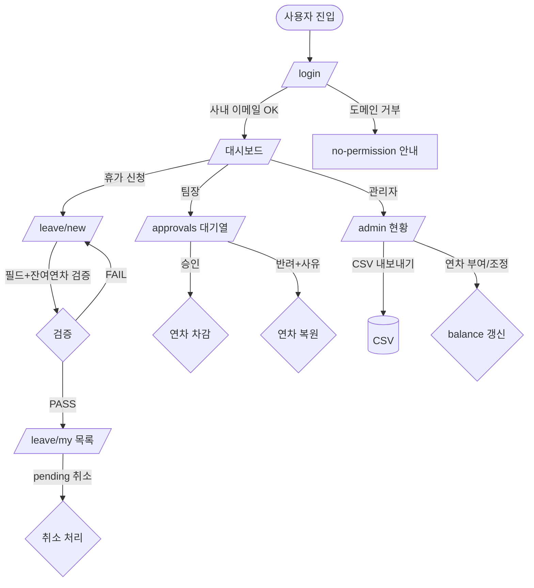

# 사내 휴가 신청/승인 서비스 PRD

> **Version**: 1.0
> **Created**: 2026-08-03
> **Status**: Draft
> **Type**: product-feature

## 1. Overview

### 1.1 Problem Statement
현재 사내 휴가 신청은 메신저·이메일·구두 등 비정형 경로로 이루어져 신청 이력이 흩어지고, 팀장의 승인/반려 근거가 남지 않으며, 관리자가 팀·전사 단위의 잔여 연차와 사용 현황을 한눈에 파악하기 어렵다. 신청 → 승인 → 집계로 이어지는 흐름을 하나의 웹 서비스로 표준화한다.

### 1.2 Goals
- 신청자가 휴가 종류·기간·사유를 입력해 몇 번의 클릭으로 신청하고, 처리 상태를 실시간으로 확인한다.
- 팀장이 자기 팀 신청 건을 대기열에서 확인하고 승인/반려(반려 사유 포함)를 처리한다.
- 관리자가 전사/팀별 휴가 현황과 잔여 연차를 조회하고 CSV로 내보낸다.
- 모든 신청·승인·반려 이력을 감사 가능한 형태로 보존한다.

### 1.3 Non-Goals (Out of Scope)
- 급여·근태(출퇴근 기록) 연동
- 외부 그룹웨어(구글 캘린더, Slack 등) 자동 동기화 — 향후 확장
- 결재선 다단계 승인(팀장 → 임원 → HR) — 1차 릴리스는 단일 승인자(팀장)
- 연차 자동 발생/이월 정책 엔진 — 초기엔 관리자가 수동 부여
- 모바일 네이티브 앱 (반응형 웹으로 대응)

### 1.4 Scope
| 포함 | 제외 |
|------|------|
| 휴가 신청/조회/취소 | 급여·근태 연동 |
| 팀장 승인/반려 + 사유 | 다단계 결재선 |
| 관리자 전체 현황·잔여 연차 조회 | 연차 자동 발생 엔진 |
| 휴가 잔여일수 차감/복원 | 외부 캘린더 동기화 |
| 이력/감사 로그 | 모바일 네이티브 앱 |
| CSV 내보내기 | 다국어(i18n) |

## 2. User Stories

### 2.1 Primary Users
- As a **신청자(멤버)**, I want to 남은 연차를 확인하고 휴가를 신청 so that 승인 절차를 투명하게 추적할 수 있다.
- As a **팀장**, I want to 우리 팀 대기 신청을 모아 보고 승인/반려 so that 팀 일정을 관리하면서 근거를 남길 수 있다.
- As a **관리자(HR)**, I want to 전사 휴가 현황과 잔여 연차를 조회·집계 so that 인력 운영과 연차 소진을 관리할 수 있다.

### 2.2 Acceptance Criteria (Gherkin)

Scenario: 휴가 신청 성공
  Given 로그인한 신청자의 잔여 연차가 5일 남아 있고
  When 시작일·종료일(2일)과 사유를 입력해 신청하면
  Then 신청 상태가 `pending`으로 생성되고 팀장에게 알림이 발송되며, 잔여 연차에서 2일이 "사용 예정"으로 표시된다.

Scenario: 잔여 연차 초과 신청 차단
  Given 잔여 연차가 1일인 신청자가
  When 3일짜리 연차를 신청하면
  Then 400 에러와 "잔여 연차가 부족합니다" 메시지를 받고 신청이 생성되지 않는다.

Scenario: 팀장 승인
  Given 우리 팀의 `pending` 신청이 있고
  When 팀장이 승인하면
  Then 상태가 `approved`로 바뀌고 신청자의 연차가 실제 차감되며 신청자에게 알림이 발송된다.

Scenario: 팀장 반려
  Given 우리 팀의 `pending` 신청이 있고
  When 팀장이 반려 사유를 입력해 반려하면
  Then 상태가 `rejected`로 바뀌고 "사용 예정"으로 잡혔던 연차가 복원되며 신청자에게 사유와 함께 알림이 발송된다.

Scenario: 신청자 본인 취소
  Given `pending` 상태의 본인 신청이 있고
  When 신청자가 취소하면
  Then 상태가 `cancelled`로 바뀌고 예약된 연차가 복원된다. (단 `approved` 건은 팀장/관리자만 취소 가능)

Scenario: 관리자 전체 현황 조회
  Given 관리자로 로그인했고
  When 특정 기간·팀 필터로 현황을 조회하면
  Then 팀별 사용/잔여 연차 집계와 신청 목록이 표시되고 CSV로 내보낼 수 있다.

### 2.3 User Roles

| Role Key | 한국어 명칭 | 권한 범위 | 비고 |
|----------|------------|----------|------|
| `member` | 신청자(멤버) | 본인 휴가 신청/조회/취소, 본인 잔여 연차 조회 | 기본 역할 |
| `manager` | 팀장 | `member` 권한 + 소속 팀 신청 승인/반려/조회 | 팀 단위 스코프 |
| `admin` | 관리자(HR) | 전체 신청·잔여 연차 read/update, 연차 부여, CSV 내보내기, 사용자·팀 관리 | 전사 스코프 |

**규칙**:
- 상위 역할은 하위 역할 권한을 포함(`admin` ⊃ `manager` ⊃ `member`).
- `manager`의 승인 권한은 **본인이 팀장인 팀**으로 제한(다른 팀 신청 접근 불가).
- 각 사용자는 하나의 팀(`team_id`)에 소속되며, 팀에는 팀장(`manager_id`)이 지정된다.

## 3. Functional Requirements

| ID | Requirement | Priority | Dependencies |
|----|------------|----------|--------------|
| FR-001 | 사내 이메일 기반 로그인/인증 및 역할(member/manager/admin) 구분 | P0 (Must) | - |
| FR-002 | 신청자는 휴가 종류(연차/반차/병가/경조사 등)·시작일·종료일·사유를 입력해 신청 | P0 (Must) | FR-001 |
| FR-003 | 신청 시 잔여 연차 검증 및 초과 시 차단(반차=0.5일 계산 포함) | P0 (Must) | FR-002 |
| FR-004 | 신청자는 본인 신청 목록/상태를 조회하고 `pending` 건을 취소 | P0 (Must) | FR-002 |
| FR-005 | 팀장은 소속 팀의 대기 신청 목록을 조회하고 승인/반려(반려 사유 필수) | P0 (Must) | FR-002 |
| FR-006 | 승인 시 연차 실차감, 반려/취소 시 예약 연차 복원 | P0 (Must) | FR-005 |
| FR-007 | 관리자는 전사/팀/기간 필터로 전체 휴가 현황과 잔여 연차를 조회 | P0 (Must) | FR-001 |
| FR-008 | 상태 변경 시 관련자(신청자/팀장)에게 알림(이메일 또는 인앱) 발송 | P1 (Should) | FR-005 |
| FR-009 | 관리자는 사용자별 연차를 부여/조정하고 이력을 남김 | P1 (Should) | FR-001 |
| FR-010 | 모든 신청·승인·반려·취소 이벤트를 감사 로그로 기록 | P1 (Should) | FR-005 |
| FR-011 | 관리자는 현황 데이터를 CSV로 내보내기 | P2 (Could) | FR-007 |
| FR-012 | 팀 캘린더 뷰(월별 팀원 휴가 시각화) | P2 (Could) | FR-005 |
| FR-013 | 기간 중복 신청 경고(같은 신청자의 겹치는 날짜 방지) | P2 (Could) | FR-003 |

## 4. Non-Functional Requirements

### 4.0 Scale Grade

**선택: Hobby (사내 도구)** — 사내 팀원 대상 내부 도구로 사용자 수백 명 이하. 서버 1대·무료~저비용 호스팅으로 충분.

| 등급 | 일일 사용자(DAU) | 동시접속 | 데이터량 | 추천 인프라 비용 |
|------|-----------------|---------|---------|----------------|
| **Hobby** ✅ | < 1,000 | < 100 | < 1GB | 무료~$20/월 |

> 예상 DAU: 사내 규모에 따라 수십~수백 명. 피크 동시접속 < 50명(월초·연말 연차 소진 시즌 집중). 서비스가 1시간 멈춰도 치명적이지 않으나 승인 지연 불편 발생.

### 4.1 Performance SLA

| 지표 | 목표값 |
|------|--------|
| Response Time (p95) | < 500ms |
| Throughput (RPS) | < 50 RPS |

### 4.2 Availability SLA

| 등급 | 추천 Uptime | 허용 다운타임(월) |
|------|------------|-----------------|
| Hobby ✅ | 95% | 36시간 |

> 업무 시간(평일 09–18시) 가용성을 우선. 야간·주말 배포/점검 허용.

### 4.3 Data Requirements

| 항목 | 값 |
|------|-----|
| 현재 데이터량 | < 100MB |
| 월간 증가율 | 신청 건수 × 소량(텍스트), 월 수백~수천 행 |
| 데이터 보존 기간 | 최소 3년(근태 관련 사내 규정 기준) |

### 4.4 Recovery

| 항목 | 설명 | 값 |
|------|------|-----|
| RTO | 장애 후 복구 허용 시간 | 24시간 |
| RPO | 허용 데이터 손실 범위 | 24시간 (일 1회 자동 백업) |

### 4.5 Security
- **Authentication**: Required — 사내 이메일 도메인 화이트리스트 기반 로그인. 미인증 접근 차단.
- **Authorization**: 역할 기반 접근 제어(RBAC). 신청자는 본인 데이터만, 팀장은 소속 팀만, 관리자는 전체 접근.
- **Data encryption**: In transit(TLS), At rest(DB 암호화). 사유 등 개인정보 포함 가능성 고려.
- **Audit**: 상태 변경 이벤트에 행위자·시각·변경 전후 값 기록(FR-010).
- 개인 휴가 사유는 최소 수집 원칙 적용, 관리자 외 타인 열람 제한.

### 4.6 Quality
- 잔여 연차 계산은 동시성 상황(동시 신청)에서도 정합성 보장(트랜잭션/락).
- 반차 0.5일 단위, 주말·공휴일 제외 영업일 계산 로직에 대한 단위 테스트 필수.
- 상태 전이(pending→approved/rejected/cancelled)는 유효 전이만 허용(상태 머신 검증).

## 5. Technical Design

### 5.1 API Specification

REST(JSON) 기준. 모든 엔드포인트는 `Authorization` 필요(로그인 제외).

#### `POST /api/v1/auth/login`
- **Description**: 사내 이메일 기반 로그인(매직링크 또는 SSO), 세션/토큰 발급
- **Auth**: None
- **Request**: `{ email: string(required) }`
- **Response 200**: `{ token: string, user: { id, name, email, role, teamId } }`
- **Errors**: 400 INVALID_EMAIL / 403 DOMAIN_NOT_ALLOWED(사내 도메인 아님)

#### `GET /api/v1/me/balance`
- **Description**: 본인 잔여 연차 및 사용/예약 현황 조회
- **Auth**: Required (member+)
- **Response 200**: `{ totalDays: number, usedDays: number, reservedDays: number, remainingDays: number }`
- **Errors**: 401 UNAUTHORIZED

#### `POST /api/v1/leave-requests`
- **Description**: 휴가 신청 생성
- **Auth**: Required (member+)
- **Request**: `{ type: 'annual'|'half_day'|'sick'|'family_event'(required), startDate: date(required), endDate: date(required), reason: string(optional) }`
- **Response 201**: `{ id, status: 'pending', requestedDays, createdAt }`
- **Errors**: 400 INVALID_DATE_RANGE / 400 INSUFFICIENT_BALANCE / 409 OVERLAPPING_REQUEST

#### `GET /api/v1/leave-requests`
- **Description**: 신청 목록 조회. `member`=본인, `manager`=본인 팀, `admin`=전체
- **Auth**: Required (member+)
- **Request(query)**: `status?`, `teamId?`(manager/admin), `from?`, `to?`, `page?`, `size?`
- **Response 200**: `{ items: LeaveRequest[], total, page, size }`
- **Errors**: 401 UNAUTHORIZED / 403 FORBIDDEN(권한 밖 팀 조회)

#### `PATCH /api/v1/leave-requests/{id}/approve`
- **Description**: 팀장 승인 → 연차 실차감
- **Auth**: Required (manager, 해당 팀장만)
- **Response 200**: `{ id, status: 'approved', decidedBy, decidedAt }`
- **Errors**: 401 / 403 NOT_TEAM_MANAGER / 409 INVALID_STATE_TRANSITION(이미 처리됨)

#### `PATCH /api/v1/leave-requests/{id}/reject`
- **Description**: 팀장 반려 → 예약 연차 복원
- **Auth**: Required (manager, 해당 팀장만)
- **Request**: `{ reason: string(required) }`
- **Response 200**: `{ id, status: 'rejected', reason, decidedBy, decidedAt }`
- **Errors**: 400 REASON_REQUIRED / 403 NOT_TEAM_MANAGER / 409 INVALID_STATE_TRANSITION

#### `PATCH /api/v1/leave-requests/{id}/cancel`
- **Description**: 취소. `pending`은 신청자 본인, `approved`는 manager/admin
- **Auth**: Required (member+, 조건부)
- **Response 200**: `{ id, status: 'cancelled' }`
- **Errors**: 403 FORBIDDEN / 409 INVALID_STATE_TRANSITION

#### `GET /api/v1/admin/overview`
- **Description**: 전사/팀별 휴가 현황·잔여 연차 집계
- **Auth**: Required (admin)
- **Request(query)**: `from?`, `to?`, `teamId?`
- **Response 200**: `{ teams: [{ teamId, teamName, memberCount, usedDays, remainingDays }], summary: {...} }`
- **Errors**: 401 / 403 FORBIDDEN

#### `POST /api/v1/admin/balances`
- **Description**: 관리자가 사용자 연차 부여/조정
- **Auth**: Required (admin)
- **Request**: `{ userId, deltaDays: number, memo?: string }`
- **Response 200**: `{ userId, totalDays, remainingDays }`
- **Errors**: 401 / 403 / 404 USER_NOT_FOUND

#### `GET /api/v1/admin/overview/export`
- **Description**: 현황 CSV 내보내기
- **Auth**: Required (admin)
- **Response 200**: `text/csv` 스트림
- **Errors**: 401 / 403

### 5.2 Database Schema

```
users
  id (PK), name, email (unique), role (member|manager|admin), team_id (FK), created_at

teams
  id (PK), name, manager_id (FK -> users.id)

leave_balances
  id (PK), user_id (FK, unique per year), year, total_days, used_days, reserved_days
  -- remaining = total - used - reserved (계산)

leave_requests
  id (PK), user_id (FK), team_id (FK), type, start_date, end_date,
  requested_days (numeric, 0.5 단위), reason, status (pending|approved|rejected|cancelled),
  decided_by (FK -> users.id, nullable), reject_reason (nullable),
  created_at, decided_at

audit_logs
  id (PK), actor_id (FK), request_id (FK), action (create|approve|reject|cancel|grant),
  before_state (json), after_state (json), created_at
```

> 연차 정합성: 신청 시 `reserved_days += n`, 승인 시 `reserved_days -= n; used_days += n`, 반려/취소 시 `reserved_days -= n`. 트랜잭션으로 원자적 처리.

### 5.3 Architecture Diagram

```
[Browser (반응형 웹)]
      │ HTTPS
      ▼
[Web App / API 서버]  ── RBAC 미들웨어 ── 상태머신 검증
      │                         │
      ▼                         ▼
[관계형 DB (users/teams/       [알림 발송기
 leave_requests/balances/       (이메일 or 인앱)]
 audit_logs)]
```

### 5.4 Pages

| Route | Audience | Auth | Linked FRs | Has FE Components | Primary State | Responsive |
|-------|----------|------|-----------|-------------------|---------------|-----------|
| `/login` | guest | None | FR-001 | Yes | success / error | Desktop / Mobile |
| `/` (대시보드) | member, manager, admin | Required | FR-004, FR-002 | Yes | success | Desktop / Mobile |
| `/leave/new` | member | Required | FR-002, FR-003 | Yes | success / error | Desktop / Mobile |
| `/leave/my` | member | Required | FR-004 | Yes | empty / success | Desktop / Mobile |
| `/approvals` | manager | Required | FR-005, FR-006 | Yes | empty / success | Desktop / Mobile |
| `/admin` | admin | Required | FR-007, FR-009, FR-011 | Yes | success | Desktop only |
| `/api/v1/*` | - | Required | FR-001~ | **No** (API) | - | - |

**규칙**: `Audience`는 §2.3 Role Key 사용. `guest`는 미로그인 상태(=로그인 페이지 한정).

### 5.4.1 Page State Matrix

| Route | loading | empty | error | success | no-permission | 비고 |
|-------|---------|-------|-------|---------|---------------|------|
| `/login` | ✓ | - | ✓ | ✓ | - | 사내 도메인 외 이메일 → error |
| `/` | ✓ | ✓ | ✓ | ✓ | - | 신청 이력 0건 시 empty 카드 |
| `/leave/new` | ✓ | - | ✓ | ✓ | ✓ | 잔여 연차 부족·중복 기간 → error |
| `/leave/my` | ✓ | ✓ | ✓ | ✓ | ✓ | 신청 0건 시 empty |
| `/approvals` | ✓ | ✓ | ✓ | ✓ | ✓ | 팀장 아님 → no-permission, 대기 0건 시 empty |
| `/admin` | ✓ | ✓ | ✓ | ✓ | ✓ | admin 아니면 no-permission |

**상태 정의**: loading(fetch 중) / empty(결과 0건) / error(4xx·5xx·검증 실패) / success(결과 ≥1건) / no-permission(인증됐으나 권한 부족).

### 5.5 User Flow



## 6. Implementation Phases

### Phase 1: MVP
- [ ] 인증/역할 구분(FR-001)
- [ ] 휴가 신청 + 잔여 연차 검증(FR-002, FR-003)
- [ ] 본인 신청 조회/취소(FR-004)
- [ ] 팀장 승인/반려 + 연차 차감·복원(FR-005, FR-006)
- [ ] 관리자 전체 현황 조회(FR-007)
**Deliverable**: 신청 → 승인/반려 → 현황 조회의 end-to-end 동작 웹 서비스

### Phase 2: Enhancement
- [ ] 상태 변경 알림(FR-008)
- [ ] 관리자 연차 부여/조정 + 이력(FR-009)
- [ ] 감사 로그(FR-010)
**Deliverable**: 운영 편의성·추적성 강화

### Phase 3: Nice-to-have
- [ ] CSV 내보내기(FR-011)
- [ ] 팀 캘린더 뷰(FR-012)
- [ ] 기간 중복 신청 경고(FR-013)
**Deliverable**: 가시성·부가 편의 기능

## 7. Success Metrics

| Metric | Target | Measurement |
|--------|--------|-------------|
| 휴가 신청 온라인 처리율 | > 90% | (웹 신청 건수 / 전체 휴가 건수) |
| 승인 소요 시간(중앙값) | < 24시간 | 신청 created_at → decided_at |
| 잔여 연차 계산 오류 | 0건 | 정합성 점검/문의 건수 |
| 관리자 현황 조회 만족도 | 정성 피드백 긍정 | 분기 설문 |
| 신청 실패율(검증 오류 제외 시스템 오류) | < 1% | 5xx 응답 비율 |
```
