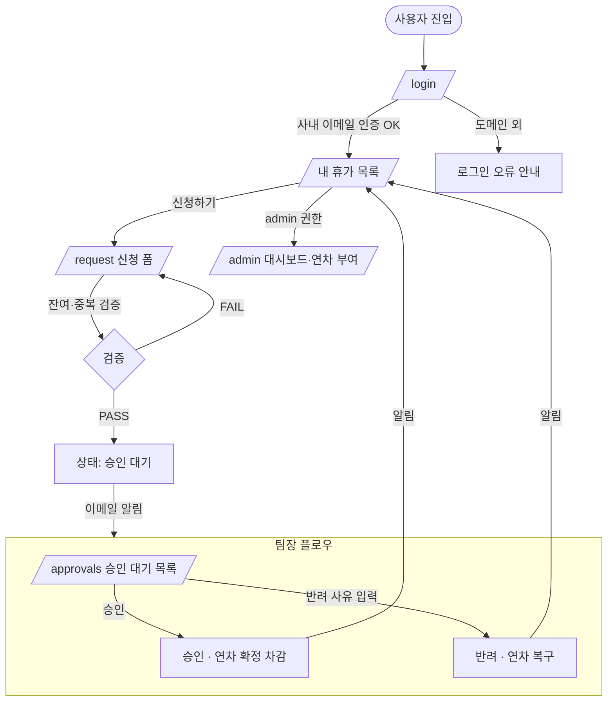

# 휴가 신청/승인 관리 서비스 PRD

> **Version**: 1.0
> **Created**: 2026-08-03
> **Status**: Draft
> **Type**: product-feature

## 1. Overview

### 1.1 Problem Statement
사내 휴가 신청·승인이 메신저/구두/이메일로 산발적으로 이루어져 신청 이력이 흩어지고, 팀장은 누가 언제 쉬는지 파악하기 어려우며, 관리자는 연차 소진 현황과 잔여일수를 수기(엑셀)로 관리한다. 그 결과 (1) 중복·누락 승인, (2) 잔여 연차 계산 오류, (3) 팀 인원 공백 파악 지연이 반복된다. 신청→승인→집계를 한곳에서 처리하는 단일 시스템이 필요하다.

### 1.2 Goals
- 신청자가 웹에서 휴가를 신청하고 실시간으로 승인 상태를 확인할 수 있다.
- 팀장이 본인 팀의 신청 건을 한 화면에서 승인/반려하고, 사유를 남길 수 있다.
- 관리자가 전사 휴가 현황(잔여 연차, 사용률, 팀별 부재 현황)을 대시보드로 조회한다.
- 잔여 연차를 시스템이 자동 계산하여 초과 신청을 사전에 차단한다.

### 1.3 Non-Goals (Out of Scope)
- 급여/인사 시스템(HRIS) 연동 및 자동 연차 부여 정책 엔진 (MVP는 관리자 수동 부여)
- 근태(출퇴근 기록)·초과근무 관리
- 결재선 다단계(팀장→본부장→대표) 커스터마이징 — MVP는 1단계(팀장) 승인
- 모바일 네이티브 앱 (반응형 웹으로 대응)
- 외부 캘린더(Google/Outlook) 양방향 동기화 (Phase 2 검토)

### 1.4 Scope
| 포함 | 제외 |
|------|------|
| 휴가 신청/취소/승인/반려 | 급여 연동 |
| 잔여 연차 자동 계산·초과 차단 | 자동 연차 부여 정책 엔진 |
| 팀장 승인 대기 목록 | 다단계 결재선 |
| 관리자 전사 대시보드·연차 부여 | 근태/출퇴근 관리 |
| 휴가 종류(연차/반차/병가/경조사) | 외부 캘린더 동기화 |
| 이메일 알림(신청/승인/반려) | 네이티브 모바일 앱 |

## 2. User Stories

### 2.1 Primary User

- As a **신청자(applicant)**, I want to 원하는 날짜와 휴가 종류를 선택해 신청 so that 승인 여부를 기다리지 않고 즉시 접수 상태를 확인할 수 있다.
- As a **팀장(team_lead)**, I want to 팀원의 신청 건을 잔여 연차·중복 부재와 함께 한눈에 보고 승인/반려 so that 팀 운영에 지장 없이 빠르게 결재할 수 있다.
- As an **관리자(admin)**, I want to 전사 휴가 현황과 개인별 잔여 연차를 조회·부여 so that 연차 소진과 인원 공백을 정확히 관리할 수 있다.

### 2.2 Acceptance Criteria (Gherkin)

```gherkin
Scenario: 정상 휴가 신청
  Given 신청자가 로그인했고 잔여 연차가 5일 있다
  When 3일짜리 연차를 신청한다
  Then 신청 상태가 "승인 대기(pending)"로 저장되고
  And 해당 팀장에게 이메일 알림이 발송된다
  And 잔여 연차 5일 중 3일이 "대기 중 차감(hold)"으로 표시된다

Scenario: 잔여 연차 초과 신청 차단
  Given 신청자의 잔여 연차가 1일이다
  When 3일짜리 연차를 신청한다
  Then "잔여 연차가 부족합니다 (잔여 1일)" 오류가 표시되고
  And 신청이 생성되지 않는다

Scenario: 팀장 승인
  Given 팀장에게 승인 대기 신청이 1건 있다
  When 팀장이 해당 건을 승인한다
  Then 신청 상태가 "승인(approved)"으로 변경되고
  And 신청자에게 승인 알림이 발송되고
  And 신청자의 잔여 연차가 확정 차감된다

Scenario: 팀장 반려
  Given 팀장에게 승인 대기 신청이 1건 있다
  When 팀장이 반려 사유를 입력하고 반려한다
  Then 신청 상태가 "반려(rejected)"로 변경되고
  And 대기 차감된 연차가 복구되고
  And 신청자에게 반려 사유와 함께 알림이 발송된다

Scenario: 신청자 취소
  Given 승인 대기 또는 승인된 미래 시작일 신청이 있다
  When 신청자가 취소한다
  Then 상태가 "취소(cancelled)"로 변경되고
  And 차감/대기 연차가 복구된다
```

### 2.3 User Roles

> 역할을 영문 문자열로 통일 선언한다. 이후 페이지 권한·API authorization·화면정의서 Audience 매핑의 단일 키로 사용한다.

| Role Key | 한국어 명칭 | 권한 범위 | 비고 |
|----------|------------|----------|------|
| `applicant` | 신청자(일반 팀원) | 본인 신청 생성/조회/취소, 본인 잔여 연차 조회 | 모든 로그인 사용자 기본 |
| `team_lead` | 팀장 | 본인 팀 신청 조회/승인/반려 + `applicant` 권한 | 팀 단위 스코프 |
| `admin` | 관리자(인사/운영) | 전사 신청·연차 read/update, 연차 부여, 사용자·팀 관리 | 전체 접근 |

**규칙**:
- Role Key는 영문 소문자 단일 단어 사용.
- `team_lead`, `admin`은 상위 호환: 본인 명의 휴가는 `applicant`와 동일하게 신청 가능.
- 권한은 API authorization과 페이지 접근 제어에서 이 키를 그대로 인용한다.

## 3. Functional Requirements

| ID | Requirement | Priority | Dependencies |
|----|------------|----------|--------------|
| FR-001 | 사용자 로그인/로그아웃 (사내 이메일 기반 인증) | P0 (Must) | - |
| FR-002 | 휴가 신청 생성: 종류(연차/반차/병가/경조사), 기간, 사유 입력 | P0 (Must) | FR-001 |
| FR-003 | 신청 시 잔여 연차 검증 및 초과 시 차단 | P0 (Must) | FR-002, FR-010 |
| FR-004 | 신청자 본인 신청 목록·상태 조회 및 취소 | P0 (Must) | FR-002 |
| FR-005 | 팀장 승인 대기 목록 조회 (본인 팀 스코프) | P0 (Must) | FR-002 |
| FR-006 | 팀장 승인/반려 처리(반려 시 사유 필수) | P0 (Must) | FR-005 |
| FR-007 | 관리자 전사 현황 대시보드(팀별 부재·연차 사용률) | P0 (Must) | FR-006 |
| FR-008 | 관리자 개인별 연차 부여/조정 | P0 (Must) | FR-001 |
| FR-009 | 이메일 알림(신청 접수/승인/반려/취소) | P1 (Should) | FR-006 |
| FR-010 | 잔여 연차 자동 계산(확정 차감 + 대기 중 hold) | P0 (Must) | FR-008 |
| FR-011 | 팀 캘린더 뷰(월별 팀원 부재 시각화) | P1 (Should) | FR-006 |
| FR-012 | 신청 기간 중복/공휴일 검증 | P1 (Should) | FR-002 |
| FR-013 | 신청/승인 이력 감사 로그 | P2 (Could) | FR-006 |
| FR-014 | 관리자 사용자/팀 CRUD 관리 | P1 (Should) | FR-001 |
| FR-015 | 휴가 종류별 정책(반차=0.5일 차감 등) 반영 | P0 (Must) | FR-010 |

## 4. Non-Functional Requirements

### 4.0 Scale Grade (규모 등급)

**선택: Startup (소규모 서비스)** — 사내 팀원 대상 내부 도구. 전체 임직원 수백 명 규모, 동시접속 낮음. 무료~저비용 호스팅 + 관리형 DB로 충분.

| 등급 | 일일 사용자(DAU) | 동시접속 | 데이터량 | 추천 인프라 비용 |
|------|-----------------|---------|---------|----------------|
| **Startup (선택)** | 1,000 미만 (사내 수백 명) | < 100 | < 1GB | 저비용/월 |

> 사내 도구 특성상 DAU는 수백 명, 피크는 업무 시작·월초 신청 집중 시점. 트래픽 급증 리스크 낮음.

### 4.1 Performance SLA

| 지표 | 목표값 |
|------|--------|
| Response Time (p95) | < 500ms |
| Throughput (RPS) | < 50 RPS |
| 대시보드 집계 조회 | < 1s |

### 4.2 Availability SLA

| 등급 | 추천 Uptime | 허용 다운타임(월) |
|------|------------|-----------------|
| Startup (선택) | 99% | 7.3시간 |

> 업무 시간(평일 09–18시) 가용성이 핵심. 야간/주말 짧은 점검 허용.

### 4.3 Data Requirements

| 항목 | 값 |
|------|-----|
| 현재 데이터량 | < 100MB (신청 레코드 텍스트 중심) |
| 월간 증가율 | ~5% (인원·신청 건수 비례) |
| 데이터 보존 기간 | 최소 3년 (인사 관련 법정 보존 고려) |

### 4.4 Recovery

| 항목 | 설명 | 값 |
|------|------|-----|
| RTO (복구 시간) | 장애 후 복구까지 허용 시간 | 24시간 |
| RPO (복구 시점) | 허용 데이터 손실 범위 | 24시간 (일 1회 백업) |

### 4.5 Security
- **Authentication**: Required — 모든 페이지는 로그인 필수(공개 페이지 없음). 사내 이메일 도메인 화이트리스트.
- **Authorization**: 역할 기반 접근 제어(RBAC). `team_lead`는 본인 팀, `admin`은 전체. 서버 사이드에서 권한 재검증(클라이언트 신뢰 금지).
- **Data encryption**: In transit(HTTPS/TLS) 필수, At rest(관리형 DB 기본 암호화).
- **개인정보**: 휴가 사유·병가 정보는 민감정보 — 본인/팀장/관리자 외 노출 금지, 목록에서 사유는 축약 표시.
- **Audit**: 승인/반려/연차 조정은 감사 로그로 기록(FR-013).

### 4.6 Quality
- 잔여 연차 계산 로직은 단위 테스트 커버(경계값: 0일, 반차 0.5일, 대기 중복).
- 동시 신청 시 잔여 연차 차감은 원자적 처리(race condition 방지, 트랜잭션/락).

## 5. Technical Design

### 5.1 API Specification

REST API (`/api/v1`). 모든 엔드포인트 `Auth: Required`.

#### `POST /api/v1/leave-requests`
- **Description**: 휴가 신청 생성
- **Auth**: Required (`applicant`)
- **Request**:
  - `type` (string, required): `annual` | `half_day_am` | `half_day_pm` | `sick` | `family_event`
  - `start_date` (date, required)
  - `end_date` (date, required)
  - `reason` (string, optional, 병가/경조사 시 권장)
- **Response 201**: `{ id, status: "pending", days_deducted, remaining_after_hold }`
- **Errors**:
  - `400 INVALID_INPUT` — 날짜 역전/필수 누락
  - `409 INSUFFICIENT_BALANCE` — 잔여 연차 부족
  - `409 DATE_OVERLAP` — 기존 신청과 기간 중복
  - `401 UNAUTHORIZED`

#### `GET /api/v1/leave-requests?scope={mine|team|all}&status=&from=&to=`
- **Description**: 신청 목록 조회. `scope=mine`(본인), `team`(팀장), `all`(관리자)
- **Auth**: Required — `team` 스코프는 `team_lead`+, `all`은 `admin`
- **Response 200**: `{ items: [{ id, applicant, type, start_date, end_date, status, days }], total }`
- **Errors**: `403 FORBIDDEN` (권한 밖 스코프 요청)

#### `POST /api/v1/leave-requests/{id}/approve`
- **Description**: 승인
- **Auth**: Required (`team_lead` — 본인 팀 / `admin`)
- **Request**: `{ comment?: string }`
- **Response 200**: `{ id, status: "approved" }`
- **Errors**: `403 FORBIDDEN`, `404 NOT_FOUND`, `409 INVALID_STATE`(이미 처리됨)

#### `POST /api/v1/leave-requests/{id}/reject`
- **Description**: 반려
- **Auth**: Required (`team_lead` / `admin`)
- **Request**: `{ reason: string (required) }`
- **Response 200**: `{ id, status: "rejected" }`
- **Errors**: `400 REASON_REQUIRED`, `403 FORBIDDEN`, `404 NOT_FOUND`, `409 INVALID_STATE`

#### `POST /api/v1/leave-requests/{id}/cancel`
- **Description**: 신청자 취소
- **Auth**: Required (본인)
- **Response 200**: `{ id, status: "cancelled" }`
- **Errors**: `403 FORBIDDEN`, `409 INVALID_STATE`(과거 시작·이미 사용 완료)

#### `GET /api/v1/leave-balances/{userId}`
- **Description**: 잔여 연차 조회
- **Auth**: Required (본인 / `team_lead`·`admin`)
- **Response 200**: `{ userId, granted, used, on_hold, remaining, year }`

#### `POST /api/v1/leave-balances/{userId}/grant`
- **Description**: 관리자 연차 부여/조정
- **Auth**: Required (`admin`)
- **Request**: `{ days: number (음수 허용=차감), year: number, memo?: string }`
- **Response 200**: `{ userId, granted, remaining }`
- **Errors**: `403 FORBIDDEN`, `400 INVALID_INPUT`

#### `GET /api/v1/admin/dashboard?year=&team=`
- **Description**: 전사 현황 집계(팀별 사용률, 부재 인원, 소진율)
- **Auth**: Required (`admin`)
- **Response 200**: `{ teams: [{ team, headcount, on_leave_today, avg_usage_rate }], summary: {...} }`

### 5.2 Database Schema

```
users
  id (PK), email (unique), name, role (applicant|team_lead|admin),
  team_id (FK), active, created_at

teams
  id (PK), name, lead_user_id (FK->users), created_at

leave_requests
  id (PK), applicant_id (FK->users), type, start_date, end_date,
  days (decimal),           -- 반차 0.5 반영
  reason,
  status (pending|approved|rejected|cancelled),
  decided_by (FK->users, nullable), decision_comment, decided_at,
  created_at, updated_at

leave_balances
  id (PK), user_id (FK->users), year,
  granted (decimal), used (decimal), on_hold (decimal),
  -- remaining = granted - used - on_hold (계산 또는 컬럼)
  unique(user_id, year)

audit_logs
  id (PK), actor_id (FK->users), action, target_type, target_id,
  before, after, created_at
```

> **동시성**: 신청/승인 시 `leave_balances` 갱신은 행 잠금(SELECT ... FOR UPDATE) 또는 트랜잭션으로 원자 처리.

### 5.3 Architecture Diagram

```
[브라우저(반응형 웹)]
      │ HTTPS
[웹 앱 (Next.js App Router / API Routes)]
      │
 ┌────┴─────────────┐
 │ 인증 미들웨어(RBAC)│
 └────┬─────────────┘
      │
[관리형 Postgres]  ── [이메일 알림 서비스(트랜잭셔널 메일)]
```

### 5.4 Pages

| Route | Audience | Auth | Linked FRs | Has FE Components | Primary State | Responsive |
|-------|----------|------|-----------|-------------------|---------------|------------|
| `/login` | (미로그인) | Optional | FR-001 | Yes | success / error | Desktop / Mobile |
| `/` (내 휴가) | applicant, team_lead, admin | Required | FR-004, FR-010 | Yes | success / empty | Desktop / Mobile |
| `/request` | applicant | Required | FR-002, FR-003, FR-012, FR-015 | Yes | success / error | Desktop / Mobile |
| `/approvals` | team_lead, admin | Required | FR-005, FR-006, FR-011 | Yes | success / empty / no-permission | Desktop / Mobile |
| `/admin` | admin | Required | FR-007, FR-008, FR-014 | Yes | success / no-permission | Desktop only |
| `/api/v1/*` | - | Required | FR-002~FR-010 | **No** (API) | - | - |

**규칙**: `Audience`는 §2.3 Role Key 사용. `Has FE Components: Yes` 행이 있으므로 §5.4.1·§5.5 작성.

### 5.4.1 Page State Matrix

| Route | loading | empty | error | success | no-permission | 비고 |
|-------|---------|-------|-------|---------|---------------|------|
| `/login` | ✓ | - | ✓ | ✓ | - | 사내 도메인 외 이메일 → error |
| `/` | ✓ | ✓ | ✓ | ✓ | - | 신청 0건 시 empty("아직 신청 내역이 없습니다") |
| `/request` | ✓ | - | ✓ | ✓ | ✓ | 잔여 부족/중복 → error, 비신청 권한 → no-permission |
| `/approvals` | ✓ | ✓ | ✓ | ✓ | ✓ | 대기 0건 시 empty, applicant 접근 → no-permission |
| `/admin` | ✓ | ✓ | ✓ | ✓ | ✓ | admin 아니면 no-permission |

**상태 정의**: `loading`(fetch 중), `empty`(결과 0건), `error`(검증/서버 오류), `success`(결과≥1), `no-permission`(권한 부족).

### 5.5 User Flow



## 6. Implementation Phases

### Phase 1: MVP
- [ ] FR-001 로그인/RBAC 기반 인증
- [ ] FR-002/003/015 휴가 신청 + 잔여 검증 + 종류별 차감
- [ ] FR-004 본인 신청 목록/취소
- [ ] FR-005/006 팀장 승인/반려
- [ ] FR-008/010 관리자 연차 부여 + 잔여 자동 계산
- [ ] FR-007 관리자 기본 대시보드
**Deliverable**: 신청→승인→집계 핵심 루프가 동작하는 웹 서비스

### Phase 2: Enhancement
- [ ] FR-009 이메일 알림
- [ ] FR-011 팀 캘린더 뷰
- [ ] FR-012 중복/공휴일 검증 고도화
- [ ] FR-014 사용자/팀 관리 UI
- [ ] FR-013 감사 로그
**Deliverable**: 운영 편의·가시성 강화 기능

## 7. Success Metrics

| Metric | Target | Measurement |
|--------|--------|-------------|
| 휴가 신청의 시스템 처리율 | 3개월 내 90%+ | 시스템 신청 건수 / 전체 휴가 건수 |
| 평균 승인 소요 시간 | < 24시간 | 신청→결재 timestamp 차 |
| 잔여 연차 계산 오류 | 0건 | 관리자 수기 대조 검증 |
| 신청 폼 완료율 | > 95% | 신청 시작 대비 제출 완료 비율 |
| 월간 활성 사용자(MAU) | 전 임직원의 80%+ | 로그인 유니크 사용자 |
