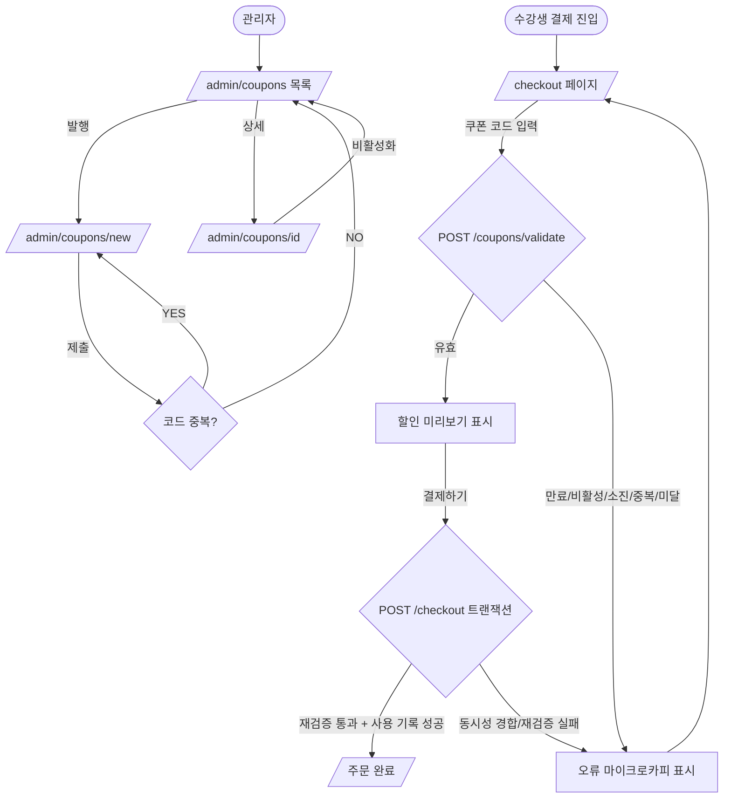

# 쿠폰(Coupon) 기능 PRD

> **Version**: 1.0
> **Created**: 2026-08-03
> **Status**: Draft
> **Type**: product-feature

## 1. Overview

### 1.1 Problem Statement
온라인 강의 플랫폼에는 현재 프로모션·할인 수단이 없다. 관리자는 신규 수강생 유치나 재구매 유도를 위한 할인 캠페인을 집행할 방법이 없고, 수강생은 프로모션 코드를 입력해 할인받을 경로가 없다. 할인 정책을 하드코딩하지 않고, 관리자가 직접 발행·관리하며 수강생이 결제 시 적용할 수 있는 **쿠폰 시스템**이 필요하다.

### 1.2 Goals
- 관리자가 UI에서 쿠폰을 발행/조회/비활성화할 수 있다 (정액·정률 할인 지원).
- 수강생이 결제 단계에서 쿠폰 코드를 입력해 할인을 적용할 수 있다.
- **동일 쿠폰의 중복 사용을 시스템 수준(동시성 포함)에서 차단**한다.
- **만료(유효기간 경과)·비활성·소진된 쿠폰**의 사용을 차단한다.
- 할인 금액은 항상 서버에서 재계산하여 금액 위·변조를 방지한다.

### 1.3 Non-Goals (Out of Scope)
- 쿠폰 자동 추천/개인화 발급 (마케팅 자동화).
- 적립금/포인트/멤버십 등급 시스템.
- 강사 개별 쿠폰 발행(본 릴리스는 플랫폼 관리자 발행만).
- 다중 쿠폰 중첩 적용(결제당 1개 쿠폰으로 제한).
- 외부 결제사(PG) 연동 자체 구축 — 기존 결제 모듈이 있다고 가정하고 그 앞단에 할인만 반영.

### 1.4 Scope
| 포함 | 제외 |
|------|------|
| 관리자 쿠폰 발행/목록/상세/비활성화 | 강사별 쿠폰 발행 |
| 정액(원)·정률(%) 할인 타입 | 쿠폰 중첩 적용 |
| 코드 기반 수강생 적용 | 포인트/적립금 |
| 사용/발급 수량 한도 | 자동 발급·개인화 |
| 유효기간·만료 검증 | 환불 시 쿠폰 복원(§6 Phase 2) |
| 사용자별 1회 사용 제한 | 마케팅 분석 대시보드(기본 지표만) |
| 중복 사용 방지(동시성) | |

## 2. User Stories

### 2.1 Primary Users
- **관리자(admin)**: As an 관리자, I want to 쿠폰을 발행하고 조건(할인율, 유효기간, 발급 수량)을 설정 so that 프로모션 캠페인을 집행할 수 있다.
- **수강생(student)**: As a 수강생, I want to 결제 시 쿠폰 코드를 입력 so that 강의를 할인된 가격에 구매할 수 있다.

### 2.2 Acceptance Criteria (Gherkin)

```gherkin
Scenario: 관리자가 정률 쿠폰을 발행한다
  Given 관리자로 로그인한 상태
  When 코드 "WELCOME20", 할인 20%, 최대 할인 10,000원, 유효기간 2026-09-01, 발급 한도 1000개로 발행하면
  Then 쿠폰이 status=active 로 생성되고 목록에 노출된다

Scenario: 수강생이 유효한 쿠폰을 적용한다
  Given 정가 50,000원 강의를 장바구니에 담은 수강생
  And 코드 "WELCOME20"(20%, 최대 10,000원)이 유효함
  When 결제 화면에서 쿠폰 코드를 적용하면
  Then 할인 10,000원이 적용되고 결제 예정 금액이 40,000원으로 표시된다

Scenario: 만료된 쿠폰은 적용되지 않는다
  Given 유효기간이 2026-07-31 로 지난 쿠폰 "SUMMER"
  When 수강생이 2026-08-03 에 해당 코드를 적용하면
  Then "만료된 쿠폰입니다" 오류(410 COUPON_EXPIRED)가 반환되고 금액은 변하지 않는다

Scenario: 이미 사용한 쿠폰을 재사용할 수 없다 (중복 방지)
  Given 수강생 A가 코드 "WELCOME20"을 이미 1회 사용함
  When 수강생 A가 같은 코드를 다시 적용/결제하려 하면
  Then "이미 사용한 쿠폰입니다" 오류(409 COUPON_ALREADY_USED)가 반환된다

Scenario: 동시 결제 요청에서도 1회만 사용된다 (동시성)
  Given 사용자별 1회, 전체 1개 남은 한정 쿠폰
  When 동일 수강생의 결제 확정 요청이 거의 동시에 2건 들어오면
  Then 정확히 1건만 성공하고 나머지는 409 COUPON_ALREADY_USED 로 실패한다

Scenario: 발급 한도가 소진된 쿠폰
  Given 발급 한도 1000개가 모두 사용된 쿠폰
  When 새 수강생이 적용하면
  Then "쿠폰이 모두 소진되었습니다" 오류(409 COUPON_EXHAUSTED)가 반환된다

Scenario: 최소 주문 금액 미달
  Given 최소 주문 금액 30,000원인 쿠폰
  When 20,000원 강의에 적용하면
  Then "최소 주문 금액 미달" 오류(422 MIN_ORDER_NOT_MET)가 반환된다
```

### 2.3 User Roles

| Role Key | 한국어 명칭 | 권한 범위 | 비고 |
|----------|------------|----------|------|
| `guest` | 비로그인 사용자 | 쿠폰 적용 불가(로그인 유도) | 결제 진입 시 로그인 필요 |
| `student` | 수강생 | 결제 시 쿠폰 적용, 본인 사용 이력 조회 | 인증 필요 |
| `admin` | 관리자 | 쿠폰 발행/조회/수정/비활성화, 전체 사용 이력 조회 | service_role |

**규칙**: 이후 모든 페이지/API 명세에서 위 Role Key(`guest`/`student`/`admin`)를 그대로 인용한다.

## 3. Functional Requirements

| ID | Requirement | Priority | Dependencies |
|----|------------|----------|--------------|
| FR-001 | 관리자는 쿠폰을 발행할 수 있다(코드, 할인타입[fixed/percent], 할인값, 최대할인액, 최소주문액, 유효기간[시작~종료], 발급 한도, 사용자당 사용 한도) | P0 (Must) | - |
| FR-002 | 쿠폰 코드는 전체에서 유일해야 한다(대소문자 정규화) | P0 (Must) | FR-001 |
| FR-003 | 관리자는 쿠폰 목록/상세를 조회하고 발급·사용 현황을 확인할 수 있다 | P0 (Must) | FR-001 |
| FR-004 | 관리자는 쿠폰을 비활성화(status=inactive)할 수 있다(즉시 적용 불가 처리) | P0 (Must) | FR-001 |
| FR-005 | 수강생은 결제 화면에서 쿠폰 코드를 입력해 할인 미리보기(validate)를 받을 수 있다 | P0 (Must) | FR-001 |
| FR-006 | 할인 금액은 서버에서 재계산한다(정률=금액×율, 최대할인액 상한 적용, 정액=고정값, 결제액 하한 0원) | P0 (Must) | FR-005 |
| FR-007 | 만료(유효기간 밖)·비활성·소진된 쿠폰은 적용을 거부한다 | P0 (Must) | FR-005 |
| FR-008 | 사용자당 사용 한도(기본 1회)를 초과하면 거부한다 | P0 (Must) | FR-005 |
| FR-009 | 결제 확정 시 쿠폰 사용을 원자적으로 기록하여 중복 사용을 차단한다(동시성 안전) | P0 (Must) | FR-006, FR-008 |
| FR-010 | 최소 주문 금액 조건을 검증한다 | P1 (Should) | FR-006 |
| FR-011 | 특정 강의/카테고리 한정 쿠폰(적용 대상 스코프) | P2 (Could) | FR-006 |
| FR-012 | 결제 취소/환불 시 쿠폰 사용 복원(재사용 가능화) | P2 (Could) | FR-009 |

## 4. Non-Functional Requirements

### 4.0 Scale Grade
**선택: Startup (소규모 서비스)** — 초기 온라인 강의 플랫폼 가정. 일일 사용자 수천 명, 결제 트랜잭션 발생. 안정적 DB + 기본 모니터링 필요. (사용자가 실제 규모를 알려주면 재조정)

### 4.1 Performance SLA
| 지표 | 목표값 |
|------|--------|
| 쿠폰 검증(validate) Response Time (p95) | < 300ms |
| 결제 확정(쿠폰 사용 기록 포함) p95 | < 500ms |
| Throughput | < 100 RPS |

### 4.2 Availability SLA
| 등급 | 추천 Uptime | 허용 다운타임(월) |
|------|------------|-----------------|
| Startup | 99% | 7.3시간 |

> 결제 경로에 포함되므로 쿠폰 검증 실패 시에도 **결제 자체는 fail-safe** 하게 진행(쿠폰 없이 정가 결제 경로 유지).

### 4.3 Data Requirements
| 항목 | 값 |
|------|-----|
| 현재 데이터량 | < 1GB |
| 월간 증가율 | 쿠폰 사용 이력 기준 ~수만 row/월 |
| 데이터 보존 기간 | 사용 이력 3년(정산·분쟁 대비) |

### 4.4 Recovery
| 항목 | 기본값 |
|------|--------|
| RTO | 24시간 |
| RPO | 24시간 (일 단위 백업). 단 쿠폰 사용 기록은 결제 트랜잭션과 동일 정합성 요구 |

### 4.5 Security
- **Authentication**: 쿠폰 적용/사용은 `student` 인증 Required. 발행/관리는 `admin` Required.
- **Authorization**: 관리 API는 admin 전용. 사용 이력은 본인(student) 또는 admin만 조회.
- **금액 위변조 방지**: 클라이언트가 보낸 할인액을 신뢰하지 않고 서버에서 재계산.
- **코드 추측 방어**: validate 엔드포인트에 사용자·IP 단위 rate limit 적용(브루트포스 방지).
- **Data encryption**: In transit(TLS) / At rest(DB 암호화).
- **감사 로그**: 쿠폰 발행/비활성/사용을 audit 로그로 기록.

### 4.6 Quality
- 동시성 시나리오(§2.2)에 대한 통합 테스트 필수.
- 할인 계산 로직 단위 테스트(경계값: 최대할인 상한, 결제액 0 하한, 정률 반올림 규칙) 필수.

## 5. Technical Design

### 5.1 API Specification

REST 기준. 모든 응답은 JSON, 인증은 Bearer 토큰.

#### `POST /api/v1/admin/coupons`
- **Description**: 관리자 쿠폰 발행
- **Auth**: Required (`admin`)
- **Request**:
  ```json
  {
    "code": "WELCOME20",            // string, required, 4~30자, 영숫자
    "discountType": "percent",       // enum: "fixed" | "percent", required
    "discountValue": 20,             // number, required (percent=1~100, fixed=원)
    "maxDiscountAmount": 10000,      // number, optional (percent일 때 상한)
    "minOrderAmount": 30000,         // number, optional (default 0)
    "validFrom": "2026-08-01T00:00:00Z", // ISO8601, required
    "validUntil": "2026-09-01T00:00:00Z", // ISO8601, required, > validFrom
    "totalIssueLimit": 1000,         // number, optional (null=무제한)
    "perUserLimit": 1                // number, optional (default 1)
  }
  ```
- **Response 201**:
  ```json
  {
    "id": "cpn_01H...",
    "code": "WELCOME20",
    "status": "active",
    "discountType": "percent",
    "discountValue": 20,
    "usedCount": 0,
    "createdAt": "2026-08-03T10:00:00Z"
  }
  ```
- **Errors**:
  - `400 INVALID_INPUT` — 필드 검증 실패(할인값 범위, 날짜 역전 등)
  - `401 UNAUTHORIZED` — 미인증
  - `403 FORBIDDEN` — admin 아님
  - `409 DUPLICATE_CODE` — 코드 중복

#### `GET /api/v1/admin/coupons`
- **Description**: 쿠폰 목록(발급/사용 현황 포함)
- **Auth**: Required (`admin`)
- **Request**: query `?status=active&page=1&size=20&q=WELCOME`
- **Response 200**:
  ```json
  {
    "items": [
      { "id": "cpn_...", "code": "WELCOME20", "status": "active",
        "usedCount": 132, "totalIssueLimit": 1000, "validUntil": "2026-09-01T00:00:00Z" }
    ],
    "page": 1, "size": 20, "total": 5
  }
  ```
- **Errors**: `401 UNAUTHORIZED`, `403 FORBIDDEN`

#### `PATCH /api/v1/admin/coupons/{id}/deactivate`
- **Description**: 쿠폰 비활성화(즉시 사용 불가)
- **Auth**: Required (`admin`)
- **Request**: 없음
- **Response 200**: `{ "id": "cpn_...", "status": "inactive" }`
- **Errors**: `401`, `403`, `404 COUPON_NOT_FOUND`

#### `POST /api/v1/coupons/validate`
- **Description**: 결제 전 쿠폰 유효성 검증 + 할인 미리보기(사용 기록은 하지 않음)
- **Auth**: Required (`student`)
- **Rate limit**: 사용자당 10 req/min
- **Request**:
  ```json
  { "code": "WELCOME20", "orderAmount": 50000, "courseId": "crs_..." }
  ```
- **Response 200**:
  ```json
  {
    "valid": true,
    "couponId": "cpn_...",
    "discountAmount": 10000,      // 서버 계산
    "finalAmount": 40000
  }
  ```
- **Errors** (valid=false 대신 명시적 status code 반환):
  - `404 COUPON_NOT_FOUND` — 존재하지 않는 코드
  - `410 COUPON_EXPIRED` — 유효기간 경과
  - `409 COUPON_INACTIVE` — 비활성
  - `409 COUPON_EXHAUSTED` — 발급 한도 소진
  - `409 COUPON_ALREADY_USED` — 사용자당 한도 초과
  - `422 MIN_ORDER_NOT_MET` — 최소 주문 금액 미달
  - `401 UNAUTHORIZED`

#### `POST /api/v1/checkout` (기존 결제 엔드포인트에 couponCode 필드 추가)
- **Description**: 결제 확정. 쿠폰이 포함되면 **원자적으로** 재검증→사용 기록→결제 처리.
- **Auth**: Required (`student`)
- **Request**:
  ```json
  { "courseId": "crs_...", "couponCode": "WELCOME20", "paymentMethod": "card" }
  ```
- **Response 200**:
  ```json
  {
    "orderId": "ord_...",
    "originalAmount": 50000,
    "discountAmount": 10000,
    "finalAmount": 40000,
    "couponId": "cpn_..."
  }
  ```
- **Errors**: validate와 동일한 쿠폰 오류 + `409 COUPON_ALREADY_USED`(동시성 경합 패자), `402 PAYMENT_FAILED`
- **Note**: validate 결과와 무관하게 **결제 확정 시점에 서버에서 재검증**한다(TOCTOU 방지).

### 5.2 Database Schema

```sql
-- 쿠폰 정의
CREATE TABLE coupons (
  id                  TEXT PRIMARY KEY,
  code                TEXT NOT NULL,
  code_normalized     TEXT NOT NULL,          -- upper(trim(code)) — 유일성 판정 키
  discount_type       TEXT NOT NULL CHECK (discount_type IN ('fixed','percent')),
  discount_value      INTEGER NOT NULL CHECK (discount_value > 0),
  max_discount_amount INTEGER,                 -- percent 상한(nullable)
  min_order_amount    INTEGER NOT NULL DEFAULT 0,
  valid_from          TIMESTAMPTZ NOT NULL,
  valid_until         TIMESTAMPTZ NOT NULL,
  total_issue_limit   INTEGER,                 -- null=무제한
  per_user_limit      INTEGER NOT NULL DEFAULT 1,
  used_count          INTEGER NOT NULL DEFAULT 0,
  status              TEXT NOT NULL DEFAULT 'active' CHECK (status IN ('active','inactive')),
  created_by          TEXT NOT NULL,
  created_at          TIMESTAMPTZ NOT NULL DEFAULT now(),
  CHECK (valid_until > valid_from)
);
-- 코드 유일성(중복 발행 방지)
CREATE UNIQUE INDEX uq_coupons_code_normalized ON coupons(code_normalized);

-- 쿠폰 사용 이력 (중복 사용 방지의 핵심)
CREATE TABLE coupon_redemptions (
  id           TEXT PRIMARY KEY,
  coupon_id    TEXT NOT NULL REFERENCES coupons(id),
  user_id      TEXT NOT NULL,
  order_id     TEXT NOT NULL,
  discount_amount INTEGER NOT NULL,
  redeemed_at  TIMESTAMPTZ NOT NULL DEFAULT now()
);
-- per_user_limit=1 을 DB 레벨에서 강제 (동일 유저·쿠폰 1회) — 동시성 방어의 최종 보루
CREATE UNIQUE INDEX uq_redemption_user_coupon ON coupon_redemptions(coupon_id, user_id);
CREATE INDEX ix_redemption_coupon ON coupon_redemptions(coupon_id);
```

> **per_user_limit > 1** 케이스는 unique 인덱스만으로 강제할 수 없으므로, 그 경우 트랜잭션 내 `SELECT count(*) ... FOR UPDATE` + 한도 체크로 처리한다. 본 릴리스 기본값은 1이라 unique 인덱스로 충분하다.

### 5.3 동시성 & 중복 방지 설계 (핵심)

결제 확정(`/checkout`)에서 쿠폰 사용은 **단일 DB 트랜잭션**으로 처리한다:

```
BEGIN;
  1. SELECT * FROM coupons WHERE id = :couponId FOR UPDATE;   -- 행 잠금
  2. 검증: status=active AND now() BETWEEN valid_from AND valid_until
           AND (total_issue_limit IS NULL OR used_count < total_issue_limit)
           AND order_amount >= min_order_amount
     → 실패 시 ROLLBACK + 해당 오류코드 반환
  3. INSERT INTO coupon_redemptions(coupon_id, user_id, order_id, ...);
     → uq_redemption_user_coupon 위반 시 → 409 COUPON_ALREADY_USED (중복 사용 차단)
  4. UPDATE coupons SET used_count = used_count + 1 WHERE id = :couponId;
  5. (결제 처리 / 주문 생성)
COMMIT;
```

- **중복 사용 방지**: (coupon_id, user_id) unique 인덱스가 동시 요청 중 1건만 통과시킴.
- **소진 방지**: `FOR UPDATE` 행 잠금으로 used_count 증가를 직렬화 → 한도 초과 발급 불가.
- **만료 방지**: 검증 2단계에서 `valid_until`을 결제 시점 기준으로 재확인(validate 시점과 무관).
- **금액 정합성**: 할인액을 트랜잭션 내에서 재계산해 redemption·order에 함께 기록.

### 5.4 Pages

| Route | Audience | Auth | Linked FRs | Has FE Components | Primary State | Responsive |
|-------|----------|------|-----------|-------------------|---------------|-----------|
| `/checkout` | student | Required | FR-005, FR-006, FR-009 | Yes | success / error | Desktop / Mobile |
| `/admin/coupons` | admin | Required | FR-003 | Yes | success / empty | Desktop only |
| `/admin/coupons/new` | admin | Required | FR-001, FR-002 | Yes | success / error | Desktop only |
| `/admin/coupons/{id}` | admin | Required | FR-003, FR-004 | Yes | success | Desktop only |
| `/api/v1/*` | - | Required | FR-001~ | No (API) | - | - |

### 5.4.1 Page State Matrix

| Route | loading | empty | error | success | no-permission | 비고 |
|-------|---------|-------|-------|---------|---------------|------|
| `/checkout` | ✓ | - | ✓ | ✓ | ✓ | 쿠폰 적용 중 loading, 만료/중복/소진 시 error 마이크로카피, guest 접근 시 로그인 유도 |
| `/admin/coupons` | ✓ | ✓ | ✓ | ✓ | ✓ | 발행된 쿠폰 0건 시 empty, admin 아니면 no-permission |
| `/admin/coupons/new` | ✓ | - | ✓ | ✓ | ✓ | 코드 중복(DUPLICATE_CODE) 시 인라인 error |
| `/admin/coupons/{id}` | ✓ | - | ✓ | ✓ | ✓ | 존재하지 않는 id → error |

### 5.5 User Flow



## 6. Implementation Phases

### Phase 1: MVP
- [ ] DB 스키마 마이그레이션(coupons, coupon_redemptions + unique 인덱스)
- [ ] 관리자 쿠폰 발행 API (FR-001, FR-002) + 코드 정규화/중복 검사
- [ ] 관리자 목록/상세/비활성화 API (FR-003, FR-004)
- [ ] 쿠폰 검증 API `/coupons/validate` + 서버 할인 계산 (FR-005, FR-006, FR-007, FR-008, FR-010)
- [ ] `/checkout` 트랜잭션에 쿠폰 사용 원자 처리 (FR-009) — 동시성/중복 방지
- [ ] 관리자 쿠폰 화면(목록/발행 폼) + 결제 화면 쿠폰 입력 UI
- [ ] 동시성·계산 경계값 테스트
**Deliverable**: 관리자가 쿠폰을 발행하고 수강생이 결제 시 적용, 중복·만료·소진이 차단되는 동작 버전

### Phase 2: Enhancement
- [ ] 강의/카테고리 한정 쿠폰 스코프 (FR-011)
- [ ] 환불 시 쿠폰 복원 (FR-012)
- [ ] validate rate limit 강화 및 감사 로그 대시보드
- [ ] 발급/사용 통계 리포트
**Deliverable**: 정교한 타게팅과 운영 편의 기능

## 7. Success Metrics
| Metric | Target | Measurement |
|--------|--------|-------------|
| 쿠폰 적용 결제 비율 | 캠페인 기간 결제의 ≥ 15% | 주문 데이터에서 couponId 존재 비율 |
| 중복 사용 사고 | 0건 | coupon_redemptions unique 위반/CS 접수 |
| 만료 쿠폰 오적용 | 0건 | 결제 감사 로그 검증 |
| 쿠폰 검증 p95 응답 | < 300ms | APM 모니터링 |
| 결제 실패율(쿠폰 원인) | < 0.5% | 결제 오류 로그 분류 |
