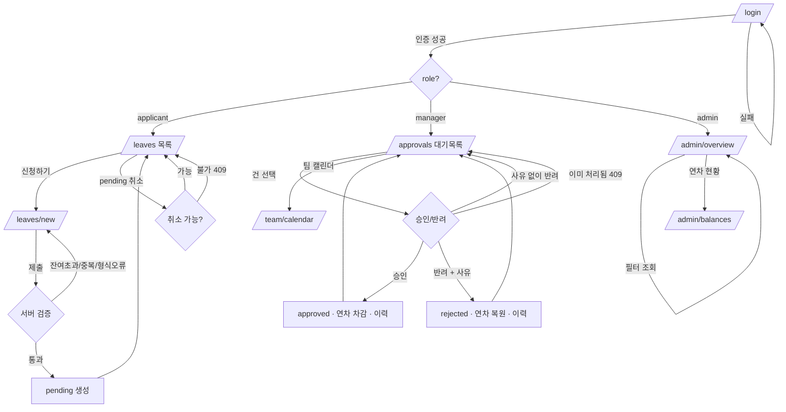

# PRD — 사내 휴가 신청/승인 웹 서비스 (Leave Management)

> **Type**: product-feature
> **Scale Grade**: Hobby (사내 팀원 대상, DAU 1,000 미만)
> **Status**: Draft
> **Last Updated**: 2026-08-03

---

## 1. Overview

### 1.1 Problem Statement
현재 휴가 신청·승인이 메신저/이메일/구두로 흩어져 처리된다. 그 결과 ① 신청 이력과 승인 근거가 남지 않고, ② 팀장이 누가 언제 쉬는지 한눈에 파악하기 어려우며, ③ 잔여 연차를 사람이 수기로 계산해 오류·분쟁이 발생한다. 관리자는 전사 휴가 현황을 집계하려면 매번 수작업으로 취합해야 한다.

### 1.2 Goals
- 신청자가 휴가를 웹에서 신청하고 처리 상태를 실시간으로 확인한다.
- 팀장이 자기 팀 신청 건을 한 화면에서 승인/반려(사유 포함)한다.
- 관리자가 전체 휴가 현황과 잔여 연차를 조회한다.
- 모든 신청·승인·반려 이력이 감사 가능한 형태로 남는다.
- 잔여 연차를 시스템이 자동 계산해 초과 신청을 차단한다.

### 1.3 Non-Goals
- 급여/근태(출퇴근 기록) 연동 — 이번 범위 밖. 휴가 데이터만 다룬다.
- 외부 HR SaaS(예: 그룹웨어) 양방향 동기화 — 향후 검토.
- 연차 발생 규칙의 복잡한 커스터마이즈(회사별 근속 가산, 회계연도 방식 등) — v1은 입사일 기준 정액 부여로 단순화.
- 대체휴무/보상휴가/반반차(0.25일) 정산 — v1은 연차/반차(0.5일) 단위만.
- 모바일 네이티브 앱 — 반응형 웹으로 대응.

### 1.4 Scope
**포함**: 휴가 신청 CRUD, 승인 워크플로우(승인/반려), 잔여 연차 자동 계산, 팀별/전사 현황 조회, 역할 기반 접근제어(RBAC), 신청/처리 이력.
**제외**: 급여 연동, 출퇴근 기록, 결재선 다단계 승인(2단계 이상), 알림의 외부 채널 발송(1.2 목표 외 — v1은 인앱 목록 갱신으로 충분).

---

## 2. User Stories

### 2.1 Primary User
- As a **신청자(applicant)**, I want to 휴가 유형·기간·사유를 입력해 신청하고 처리 상태를 확인 so that 근거를 남기고 승인 여부를 즉시 알 수 있다.
- As a **팀장(manager)**, I want to 우리 팀의 대기 중 신청을 모아 보고 사유와 함께 승인/반려 so that 팀 일정과 인력 공백을 관리한다.
- As a **관리자(admin)**, I want to 전사 휴가 현황과 구성원별 잔여 연차를 조회 so that 전체 인력 운영과 연차 소진을 파악한다.

### 2.2 Acceptance Criteria (Gherkin)

**AC-1 휴가 신청 (정상)**
```gherkin
Given 신청자로 로그인했고 잔여 연차가 5일 남아 있다
When 연차 유형으로 2026-08-10 ~ 2026-08-11 (2일)을 사유와 함께 신청한다
Then 신청은 status=pending 으로 저장되고
And 목록에 "승인 대기"로 표시되며
And 잔여 연차 예약분(pending)이 2일 차감 표시된다
```

**AC-2 잔여 연차 초과 신청 (실패)**
```gherkin
Given 신청자의 잔여 연차가 1일 남아 있다
When 3일짜리 연차를 신청한다
Then 신청은 거부되고 400 에러와 "잔여 연차(1일)를 초과했습니다" 메시지를 받는다
And 어떤 신청도 생성되지 않는다
```

**AC-3 기간 중복 신청 (실패)**
```gherkin
Given 신청자가 2026-08-10 ~ 2026-08-11 에 이미 pending/approved 휴가가 있다
When 2026-08-11 ~ 2026-08-12 로 겹치는 휴가를 신청한다
Then 신청은 거부되고 409 에러와 "해당 기간에 이미 신청된 휴가가 있습니다" 메시지를 받는다
```

**AC-4 팀장 승인 (정상)**
```gherkin
Given 팀장이 로그인했고 자기 팀원의 pending 신청이 있다
When 해당 신청을 승인한다
Then status=approved 로 바뀌고
And 신청자의 잔여 연차가 실제 차감되며
And 처리자·처리시각이 이력에 기록된다
```

**AC-5 팀장 반려 (사유 필수)**
```gherkin
Given 팀장이 팀원의 pending 신청을 보고 있다
When 반려 사유 없이 반려를 시도한다
Then 반려는 거부되고 "반려 사유를 입력하세요" 검증 에러를 받는다
When 반려 사유를 입력하고 반려한다
Then status=rejected 로 바뀌고 예약된 잔여 연차가 복원된다
```

**AC-6 권한 부족 (실패)**
```gherkin
Given 팀장 A가 로그인했다
When 다른 팀(B팀) 팀원의 신청을 승인 시도한다
Then 403 에러와 "권한이 없습니다"를 받고 상태는 변하지 않는다
```

**AC-7 이미 처리된 건 재처리 (실패)**
```gherkin
Given 어떤 신청이 이미 approved 상태다
When 팀장이 그 신청을 다시 승인/반려하려 한다
Then 409 에러와 "이미 처리된 신청입니다"를 받는다
```

**AC-8 신청 취소**
```gherkin
Given 신청자의 신청이 pending 상태다
When 신청자가 그 신청을 취소한다
Then status=cancelled 로 바뀌고 예약 연차가 복원된다
Given 신청이 이미 approved 상태다
When 신청자가 취소한다
Then 시작일 이전이면 취소 가능(연차 복원), 시작일 이후면 거부(400)된다
```

**AC-9 세션 만료**
```gherkin
Given 신청자의 세션이 만료되었다
When 신청 목록을 요청한다
Then 401 을 받고 로그인 화면으로 리다이렉트된다
```

### 2.3 User Roles

| Role Key | 한국어 명칭 | 권한 범위 |
|---|---|---|
| `applicant` | 신청자 | 본인 휴가 신청/조회/취소, 본인 잔여 연차 조회 |
| `manager` | 팀장 | `applicant` 권한 + 소속 팀원 신청 조회·승인·반려, 팀 현황 조회 |
| `admin` | 관리자 | 전사 신청/현황/잔여 연차 조회, 구성원·팀·연차 부여 관리 |

> 역할은 상위 포함 관계가 아니라 명시 권한이다. `manager`는 본인 신청 기능을 위해 `applicant` 권한을 함께 갖는다. `admin`은 승인 워크플로우에 개입하지 않고 조회/관리만 한다(승인은 팀장 책임).

---

## 3. Functional Requirements

| ID | Requirement | Priority | Dependencies |
|---|---|---|---|
| FR-001 | 이메일/비밀번호 로그인 및 세션 관리, 역할(`applicant`/`manager`/`admin`) 부여 | P0 | — |
| FR-002 | 신청자는 휴가 유형(연차/반차/병가/경조사)·기간·사유로 휴가를 신청한다 | P0 | FR-001 |
| FR-003 | 신청 시 잔여 연차 초과·기간 중복을 서버에서 검증하고 위반 시 거부한다 | P0 | FR-002, FR-006 |
| FR-004 | 신청자는 본인 신청 목록과 상태(pending/approved/rejected/cancelled)를 조회한다 | P0 | FR-002 |
| FR-005 | 신청자는 pending 신청(및 시작 전 approved)을 취소하고 연차를 복원한다 | P1 | FR-002 |
| FR-006 | 구성원별 잔여 연차를 pending 예약분 포함해 자동 계산·조회한다 | P0 | FR-001 |
| FR-007 | 팀장은 소속 팀의 pending 신청을 목록으로 조회한다 | P0 | FR-002 |
| FR-008 | 팀장은 팀원 신청을 승인한다(연차 실차감, 이력 기록) | P0 | FR-007 |
| FR-009 | 팀장은 팀원 신청을 사유와 함께 반려한다(예약 연차 복원, 이력 기록) | P0 | FR-007 |
| FR-010 | 관리자는 전사 휴가 현황(기간·팀·상태 필터)을 조회한다 | P0 | FR-002 |
| FR-011 | 관리자는 구성원별 잔여/사용 연차 현황을 조회한다 | P1 | FR-006 |
| FR-012 | 모든 신청·승인·반려·취소 이벤트를 처리자·시각과 함께 이력으로 남긴다 | P0 | FR-002 |
| FR-013 | 관리자는 구성원의 연차 부여량과 팀·팀장 매핑을 관리한다 | P1 | FR-001 |
| FR-014 | 팀장은 본인 팀의 승인 완료 휴가를 캘린더/목록으로 조회한다(인력 공백 파악) | P2 | FR-008 |
| FR-015 | 로그인 무차별 대입 방어(Rate Limit·계정 잠금·비밀번호 정책) | P0 | FR-001 |
| FR-016 | 관리자용 구성원·팀·팀장·연차 부여·공휴일 관리 API | P1 | FR-001 |
| FR-017 | 목록/현황 조회 API 커서 기반 페이지네이션 | P1 | FR-004, FR-010 |

> 무모순 확인: 모든 조회는 인증 필수(FR-001)이며 비로그인 열람 경로는 없다. 승인 권한은 `manager`(자기 팀)와 `admin` 관리 범위로 분리되어 충돌하지 않는다 — `admin`은 승인하지 않고 조회만 한다(§2.3).

---

## 4. Non-Functional Requirements

### 4.0 Scale Grade
**Hobby** — 사내 팀원 대상 내부 도구. 예상 총 사용자 수백 명, DAU 1,000 미만. 근거: 단일 회사 구성원만 사용하며 트래픽은 근무일 오전에 집중되나 절대량이 작다.

### 4.1 Performance
- 목록/현황 조회 API: **p95 < 300ms** (구성원 500명, 신청 데이터 5만 건 기준).
- 신청/승인 쓰기 API: **p95 < 500ms**.
- 동시성: 피크 동시 요청 **50 RPS** 처리, 오류율 < 0.1%.
- 첫 화면 로드(LCP): **< 2.5s** (사내망 기준).

### 4.2 Availability
- 목표 가용성 **99.5%** (근무시간 09:00–19:00 우선). 
- 장애 시: 쓰기 실패는 트랜잭션 롤백으로 부분 반영을 막고, 사용자에게 재시도 가능한 에러 메시지를 노출한다. 조회 장애 시 마지막 상태를 캐시로 노출하지 않고 명시적 에러를 표시한다(데이터 정확성 우선).

### 4.3 Data
- **개인정보**: 이름·이메일·소속팀·휴가 사유. 사유는 최소 수집하며 민감정보(질병 상세 등) 입력을 지양하도록 안내.
- **보관 기간**: 휴가/이력 데이터는 노동 관련 기록 관리를 위해 **3년** 보관 후 익명화.
- **삭제 정책**: 퇴사자 계정은 비활성화(soft delete)하되 휴가 이력은 감사 목적상 보관 기간까지 유지. 개인정보 파기 요청 시 이름/이메일은 마스킹하고 통계용 집계는 유지.

### 4.4 Recovery
- **RPO ≤ 24h** — 일 1회 DB 백업.
- **RTO ≤ 4h** — 백업으로부터 복구. Hobby 등급 특성상 다중 리전 HA는 비적용(N/A), 단일 리전 + 자동 백업으로 충분.

### 4.5 Security
- **인증**: 이메일/비밀번호 + 세션(HttpOnly, Secure, SameSite=Lax 쿠키, TTL 8시간·슬라이딩 갱신). 비밀번호는 bcrypt(cost≥12) 해시 저장.
- **무차별 대입 방어**: `POST /api/auth/login`에 IP+계정 기준 Rate Limit(5회/분 초과 시 지수 백오프), 연속 10회 실패 시 계정 15분 잠금. 인증 실패 응답은 자격 유무와 무관하게 동일 메시지·유사 응답 시간으로 반환(user enumeration 방지). 비밀번호 정책: 최소 10자 + 영문/숫자/기호 중 2종 이상.
- **인가(리소스 × 역할)**:
  - `applicant`: 본인 소유 신청만 조회/생성/취소. 타인 신청 접근 시 403.
  - `manager`: 본인이 팀장인 팀의 팀원 신청만 승인/반려/조회. 타 팀 접근 시 403.
  - `admin`: 전사 조회 + 구성원/팀/연차 관리. 승인 워크플로우 개입 불가.
  - 서버는 모든 상태 변경 요청에서 (요청자 역할 × 대상 리소스 소유/팀 관계)를 재검증한다(클라이언트 신뢰 금지).
- **전송/저장 보호**: 전 구간 HTTPS(TLS 1.2+). 민감 필드는 저장 시 애플리케이션 레벨 접근제어로 보호.
- **입력 검증**: 날짜 범위(시작 ≤ 종료), 유형 enum, 사유 길이(≤500자), 반려 사유 필수. SQL 인젝션·XSS 방지를 위한 파라미터 바인딩·출력 이스케이프. CSRF 토큰 적용.

---

## 5. Technical Design

### 5.1 API Specification

베이스: `/api`. 인증 실패 공통 401, 인가 실패 공통 403, 검증 실패 400, 리소스 없음 404, 상태 충돌 409.

---

**POST `/api/auth/login`** — 로그인 · 인가 주체: 공개
- Request: `{ "email": "user@co.com", "password": "..." }`
- Response 200: `{ "userId": "u_1", "name": "홍길동", "role": "applicant", "teamId": "t_1" }` (세션 쿠키 설정)
- Error: 400 형식 오류 / 401 자격 불일치

---

**GET `/api/leaves`** — 본인 신청 목록 · 인가 주체: `applicant`(본인), `manager`/`admin`은 쿼리로 확장
- Request: `?status=pending&year=2026&limit=20&cursor=<opaque>` (모두 선택, 기본 limit=20·최대 100)
- Response 200: `{ "items": [{ "id":"l_1","type":"annual","startDate":"2026-08-10","endDate":"2026-08-11","days":2,"status":"pending","reason":"...","createdAt":"..." }], "total": 1, "nextCursor": null }`
- Error: 401

---

**POST `/api/leaves`** — 휴가 신청 · 인가 주체: `applicant`, `manager`(본인 신청)
- Request: `{ "type": "annual", "startDate": "2026-08-10", "endDate": "2026-08-11", "reason": "개인 사유" }` — 반차는 `type: "half"`로만 표현하며 이때 `startDate == endDate` 단일일을 강제(다일 반차 불가, 위반 시 400)
- Response 201: `{ "id": "l_2", "status": "pending", "days": 2, "remaining": 3 }` (예약분 반영 후 잔여)
- Error: 400 검증 실패(날짜/유형/사유) / 400 잔여 연차 초과 / 409 기간 중복 / 401

---

**PATCH `/api/leaves/{id}/cancel`** — 신청 취소 · 인가 주체: `applicant`(소유자)
- Request: `{}`
- Response 200: `{ "id": "l_2", "status": "cancelled", "remaining": 5 }`
- Error: 403 비소유자 / 409 취소 불가 상태(시작 후 approved) / 404

---

**GET `/api/approvals`** — 팀 대기 신청 목록 · 인가 주체: `manager`(본인 팀)
- Request: `?status=pending`
- Response 200: `{ "items": [{ "id":"l_3","applicant":{"id":"u_2","name":"김철수"},"type":"annual","startDate":"...","endDate":"...","days":1,"reason":"..." }] }`
- Error: 401 / 403(팀장 아님)

---

**PATCH `/api/approvals/{id}`** — 승인/반려 · 인가 주체: `manager`(대상 팀원의 팀장)
- Request: `{ "action": "approve" }` 또는 `{ "action": "reject", "reason": "인력 부족" }`
- Response 200: `{ "id": "l_3", "status": "approved", "processedBy": "u_10", "processedAt": "..." }`
- Error: 400 반려 사유 누락 / 403 타 팀 / 409 이미 처리됨 / 404

---

**GET `/api/admin/overview`** — 전사 현황 · 인가 주체: `admin`
- Request: `?from=2026-08-01&to=2026-08-31&teamId=t_1&status=approved&limit=50&cursor=<opaque>` (모두 선택, 기본 limit=50·최대 100)
- Response 200: `{ "items": [...], "summary": { "pending": 3, "approved": 12, "byTeam": [...] }, "nextCursor": "..." }`
- Error: 401 / 403

---

**GET `/api/admin/balances`** — 구성원별 연차 현황 · 인가 주체: `admin`
- Response 200: `{ "items": [{ "userId":"u_2","name":"김철수","granted":15,"used":4,"reserved":1,"remaining":10 }] }`
- Error: 401 / 403

---

**GET `/api/me/balance`** — 본인 잔여 연차 · 인가 주체: `applicant`/`manager`
- Response 200: `{ "granted": 15, "used": 3, "reserved": 2, "remaining": 10 }`
- Error: 401

---

**POST `/api/admin/users`** / **PATCH `/api/admin/users/{id}`** — 구성원 생성·수정(역할·소속팀 부여) · 인가 주체: `admin`
- Request: `{ "email":"new@co.com", "name":"이영희", "role":"applicant", "teamId":"t_1" }`
- Response 201/200: `{ "id":"u_20", "email":"new@co.com", "role":"applicant", "teamId":"t_1", "isActive":true }`
- Error: 400 형식 오류 / 409 이메일 중복 / 401 / 403

---

**POST `/api/admin/teams`** / **PATCH `/api/admin/teams/{id}`** — 팀 생성·팀장 매핑 · 인가 주체: `admin`
- Request: `{ "name":"플랫폼팀", "managerUserId":"u_10" }`
- Response 201/200: `{ "id":"t_2", "name":"플랫폼팀", "managerUserId":"u_10" }`
- Error: 400 / 404 팀장 미존재 / 401 / 403

---

**PUT `/api/admin/balances/{userId}`** — 연차 부여량 설정(연도별) · 인가 주체: `admin`
- Request: `{ "year": 2026, "grantedDays": 15 }`
- Response 200: `{ "userId":"u_20", "year":2026, "grantedDays":15 }`
- Error: 400 / 401 / 403

### 5.2 Database Schema

```sql
-- 팀
teams(id PK, name, manager_user_id FK->users.id NULL, created_at)

-- 사용자
users(id PK, email UNIQUE, password_hash, name, role ENUM('applicant','manager','admin'),
      team_id FK->teams.id NULL, is_active BOOL DEFAULT true, created_at)

-- 연차 부여 (연도별)
leave_balances(id PK, user_id FK->users.id, year INT, granted_days NUMERIC(4,1),
               UNIQUE(user_id, year))

-- 휴가 신청
leaves(id PK, user_id FK->users.id, type ENUM('annual','half','sick','family'),
       start_date DATE, end_date DATE, days NUMERIC(4,1), reason VARCHAR(500),
       status ENUM('pending','approved','rejected','cancelled') DEFAULT 'pending',
       processed_by FK->users.id NULL, processed_at TIMESTAMP NULL,
       reject_reason VARCHAR(500) NULL, created_at)
  INDEX(user_id, status), INDEX(start_date, end_date)

-- 이력 (감사 로그)
leave_events(id PK, leave_id FK->leaves.id, actor_user_id FK->users.id,
             action ENUM('created','approved','rejected','cancelled'),
             note VARCHAR(500) NULL, created_at)

-- 공휴일 (일수 산정 소스, admin 관리)
holidays(date DATE PK, name VARCHAR(100))

-- 로그인 시도 (Rate Limit / 계정 잠금)
login_attempts(id PK, email, ip, success BOOL, created_at)
  INDEX(email, created_at), INDEX(ip, created_at)

-- 겹침 방지 제약: pending/approved 상태의 동일 사용자 기간 중복 차단
-- ALTER TABLE leaves ADD CONSTRAINT no_overlap
--   EXCLUDE USING gist (user_id WITH =, daterange(start_date, end_date, '[]') WITH &&)
--   WHERE (status IN ('pending','approved'));
```

> 잔여 연차 = `granted_days(해당 연도)` − `SUM(days where status=approved)` − `SUM(days where status=pending)`(예약분). 반차(type='half')는 days=0.5. 병가/경조사 유형이 연차를 차감할지 여부는 회사 정책값으로 두되 v1은 연차(annual/half)만 차감, sick/family는 별도 카운트하지 않음(차감 0).
>
> **일수(days) 산정 규칙**: 연차(annual)의 days는 **근무일 기준**으로 계산한다 — `start_date`~`end_date` 범위에서 **토·일과 공휴일을 제외**한 일수. 공휴일은 시스템 관리 테이블 `holidays(date PK, name)`(admin 관리)을 소스로 한다. 반차(half)는 항상 0.5. 이 규칙으로 AC-1(평일 08-10~08-11 = 2일)이 성립한다.

### 5.3 Architecture
- **Frontend**: Next.js(App Router) + React, 반응형 웹. 서버 컴포넌트로 목록/현황 렌더, 폼은 클라이언트.
- **Backend**: Next.js Route Handlers(또는 별도 API 서버) — Fluid Compute 기반. 서버에서 인가·잔여 연차·중복 검증을 트랜잭션으로 수행.
- **DB**: PostgreSQL(Vercel Marketplace의 관리형 Postgres). 신청/승인은 단일 트랜잭션으로 상태 변경 + 이력 기록 원자 처리.
- **Auth**: 세션 쿠키 기반. 미들웨어에서 라우트별 역할 가드.
- **동시성 제어(무결성)**: 신청/승인/취소 트랜잭션은 대상 `user_id`의 해당 연도 `leave_balances` 행을 `SELECT ... FOR UPDATE`로 잠근 뒤 잔여 연차·기간 중복을 검증한다. 이로써 동일 사용자의 동시 요청이 서로의 미커밋 pending을 보지 못해 잔여를 초과하거나(AC-2) 기간이 겹치는(AC-3) 이중 통과를 원천 차단한다. 추가로 `leaves(user_id, daterange(start_date, end_date))`에 대해 활성 상태(pending/approved)만 대상으로 하는 EXCLUDE(gist) 제약을 두어 겹침을 DB 레벨에서도 보장한다. 서버리스 커넥션 풀러는 트랜잭션 모드로 구성해 `FOR UPDATE`가 정상 동작하도록 한다.

### 5.4 Pages

| Route | Audience | Auth | Linked FRs | Has FE Components | Primary State | Responsive |
|---|---|---|---|---|---|---|
| `/login` | 공개 | No | FR-001 | Yes | success | Yes |
| `/leaves` | `applicant` | Yes | FR-002, FR-004, FR-005, FR-006 | Yes | success | Yes |
| `/leaves/new` | `applicant` | Yes | FR-002, FR-003 | Yes | success | Yes |
| `/approvals` | `manager` | Yes | FR-007, FR-008, FR-009 | Yes | success | Yes |
| `/team/calendar` | `manager` | Yes | FR-014 | Yes | success | Yes |
| `/admin/overview` | `admin` | Yes | FR-010, FR-013 | Yes | success | Yes |
| `/admin/balances` | `admin` | Yes | FR-011 | Yes | success | Yes |

#### 5.4.1 Page State Matrix

| Route | loading | empty | error | success | no-permission | 비고 |
|---|---|---|---|---|---|---|
| `/login` | 버튼 스피너 | — | "이메일/비밀번호 확인" 인라인 | 역할별 홈으로 리다이렉트 | — | 로그인 상태면 홈으로 |
| `/leaves` | 스켈레톤 목록 | "신청 내역이 없습니다 · 신청하기 CTA" | 재시도 배너 | 신청 카드 목록 + 잔여 연차 배지 | 로그인 리다이렉트 | — |
| `/leaves/new` | 폼 비활성 | — | 필드별 검증 에러 / 잔여초과·중복 배너 | 신청 완료 → `/leaves` | 로그인 리다이렉트 | 실시간 일수·잔여 미리보기 |
| `/approvals` | 스켈레톤 | "대기 중 신청 없음" | 재시도 배너 | 대기 카드 + 승인/반려 액션 | 403 안내 화면 | 반려 시 사유 모달 |
| `/team/calendar` | 캘린더 스켈레톤 | "이번 달 승인 휴가 없음" | 재시도 배너 | 월별 캘린더/목록 | 403 안내 화면 | — |
| `/admin/overview` | 표 스켈레톤 | "조건에 맞는 데이터 없음" | 재시도 배너 | 필터 + 현황 표/요약 | 403 안내 화면 | 기간/팀/상태 필터 |
| `/admin/balances` | 표 스켈레톤 | "구성원 없음" | 재시도 배너 | 구성원별 잔여/사용 표 | 403 안내 화면 | — |

#### 5.5 User Flow



---

## 6. Implementation Phases

### Phase 1 — 기반 & 인증 (P0)
- Deliverable: DB 스키마 마이그레이션(users/teams/leave_balances/leaves/leave_events/holidays/login_attempts + EXCLUDE 제약), 로그인·세션·역할 가드 미들웨어, 로그인 Rate Limit·계정 잠금·비밀번호 정책.
- Tasks: FR-001, FR-015

### Phase 2 — 신청 & 잔여 연차 (P0)
- Deliverable: 휴가 신청 API + 잔여 연차/중복 서버 검증(행 잠금 트랜잭션), 본인 목록·잔여 조회(페이지네이션), `/leaves`·`/leaves/new` 화면.
- Tasks: FR-002, FR-003, FR-004, FR-006, FR-017

### Phase 3 — 승인 워크플로우 (P0)
- Deliverable: 팀 대기목록·승인/반려 API(트랜잭션 + 이력), `/approvals` 화면, 이력 기록.
- Tasks: FR-007, FR-008, FR-009, FR-012

### Phase 4 — 관리자 현황 (P0/P1)
- Deliverable: 전사 현황·연차 현황 API와 `/admin/overview`·`/admin/balances` 화면.
- Tasks: FR-010, FR-011

### Phase 5 — 보강 (P1/P2)
- Deliverable: 신청 취소, 구성원/팀/연차/공휴일 관리 API, 팀 캘린더.
- Tasks: FR-005, FR-013, FR-016, FR-014

---

## 7. Success Metrics

| Metric | Target | Measurement |
|---|---|---|
| 휴가 처리 디지털화율 | 3개월 내 신청의 95%가 시스템 경유 | 시스템 신청 건수 / 전체 휴가 건수(설문 대조) |
| 평균 승인 처리 시간 | 신청→처리 중앙값 < 24h | `processed_at - created_at` 집계 |
| 잔여 연차 계산 오류 | 분기당 0건 | 수기 대조 감사 |
| 조회 API p95 지연 | < 300ms | APM 계측 |
| 신청 실패(검증 외 오류)율 | < 0.1% | 5xx / 전체 요청 |
| 관리자 현황 취합 시간 | 수작업 대비 90% 절감 | 사용 전후 소요시간 비교 |
