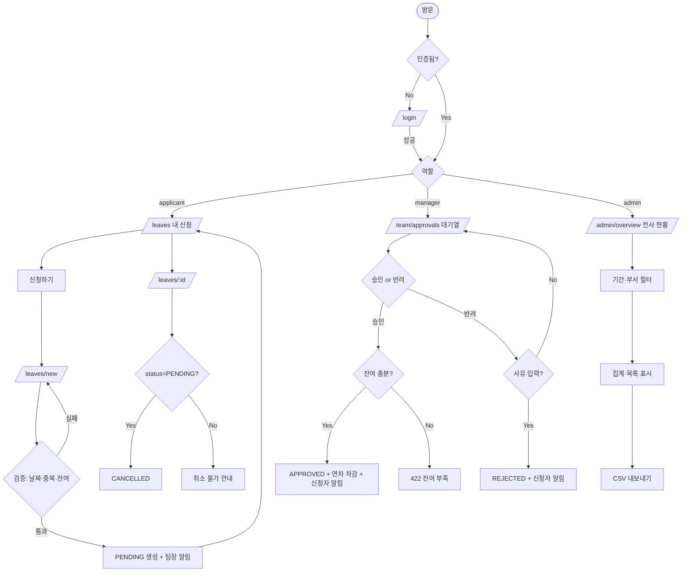

# PRD — 사내 휴가 신청/승인 웹 서비스 (Leave Management)

> **Type**: product-feature
> **Scale Grade**: Startup
> **Status**: Draft
> **Last Updated**: 2026-08-03
> **Feature Key**: leave-management

---

## 1. Overview

### 1.1 Problem Statement
현재 휴가 신청은 메신저·이메일·구두로 이루어져 **신청 이력이 흩어지고**, 팀장은 팀원의 잔여 연차와 중복 부재를 한눈에 파악하지 못한다. 관리자(HR)는 월별 휴가 집계를 위해 각 팀에 수기로 취합을 요청해야 하며, 승인 여부·잔여 연차가 실시간으로 동기화되지 않아 **초과 사용·이중 승인·집계 누락**이 발생한다.

### 1.2 Goals
- 신청자가 잔여 연차를 확인하고 휴가를 신청하며 처리 상태를 실시간으로 추적한다.
- 팀장이 자기 팀 신청 건을 대기열에서 승인/반려하고, 반려 시 사유를 남긴다.
- 관리자가 전사 휴가 현황·잔여 연차·기간별 통계를 단일 화면에서 조회한다.
- 승인 완료 시 잔여 연차가 자동 차감되어 수기 집계를 제거한다.

### 1.3 Non-Goals
- 급여·근태(출퇴근 기록)·전자결재 시스템 연동은 범위 밖이다.
- 반차·시간 단위 휴가 외의 복잡한 근무 형태(교대·유연근무 스케줄링)는 다루지 않는다.
- 외부 캘린더(Google/Outlook) 양방향 동기화는 v1 범위 밖이다(v2 후보).
- 다국어(i18n)·다국가 공휴일 캘린더는 지원하지 않는다(한국 근무 기준).
- 다단계 결재(팀장→본부장→HR)는 v1에서 지원하지 않는다. 단일 승인자(팀장) 모델만 지원한다.

### 1.4 Scope
**포함**: 휴가 신청 생성/취소, 팀장 승인/반려, 잔여 연차 자동 차감, 관리자 전사 현황·통계 대시보드, 휴가 유형(연차/반차/병가/경조사) 관리, 알림(인앱).
**제외**: 결재 라인 커스터마이징, 급여 연동, 모바일 네이티브 앱, 이메일/슬랙 외부 알림(v1은 인앱 알림만).

---

## 2. User Stories

### 2.1 Primary User
- **As a** 신청자(팀원), **I want to** 잔여 연차를 확인하고 날짜·유형을 지정해 휴가를 신청하고 **so that** 승인 상태를 기다리며 별도 문의 없이 진행 상황을 알 수 있다.
- **As a** 팀장, **I want to** 내 팀의 대기 중인 신청을 한 화면에서 승인/반려하고 **so that** 팀 부재 일정을 파악하며 신속히 처리할 수 있다.
- **As a** 관리자(HR), **I want to** 전사 휴가 현황과 잔여 연차를 기간·부서별로 조회하고 **so that** 수기 취합 없이 인력 운영과 정산을 할 수 있다.

### 2.2 Acceptance Criteria

**AC-1: 휴가 신청 정상 생성**
```gherkin
Given 신청자가 로그인했고 잔여 연차가 5일 남아있다
When 시작일 2026-08-10, 종료일 2026-08-11, 유형 "연차"로 신청을 제출한다
Then 신청이 status=PENDING 으로 생성되고
And 팀장에게 인앱 알림이 발송되며
And 신청자의 "내 신청" 목록 최상단에 표시된다
```

**AC-2: 잔여 연차 초과 신청 거부(실패 시나리오)**
```gherkin
Given 신청자의 잔여 연차가 1일 남아있다
When 3일(24시간 근무일) 짜리 연차를 신청한다
Then 신청은 생성되지 않고
And "잔여 연차(1일)를 초과했습니다" 오류가 표시된다
```

**AC-3: 기간 중복 신청 거부(실패 시나리오)**
```gherkin
Given 신청자가 2026-08-10~08-11 에 이미 PENDING 또는 APPROVED 신청이 있다
When 2026-08-11~08-12 로 새 신청을 제출한다
Then 신청은 생성되지 않고
And "해당 기간에 겹치는 신청이 있습니다" 오류가 표시된다
```

**AC-4: 팀장 승인 및 연차 차감**
```gherkin
Given 팀장이 로그인했고 자기 팀원의 PENDING 신청(2일)이 대기열에 있다
When 해당 신청을 "승인"한다
Then 신청 status=APPROVED 로 변경되고
And 신청자의 잔여 연차가 2일 차감되며
And 신청자에게 인앱 알림이 발송된다
```

**AC-5: 반려 시 사유 필수(검증 시나리오)**
```gherkin
Given 팀장이 PENDING 신청을 반려하려 한다
When 반려 사유를 입력하지 않고 "반려"를 제출한다
Then 반려는 처리되지 않고
And "반려 사유를 입력해주세요" 검증 오류가 표시된다
```

**AC-6: 권한 부족 — 타 팀 신청 접근(권한부족 시나리오)**
```gherkin
Given 팀장 A가 로그인했다
When 팀 B 소속 신청 건의 승인 API를 직접 호출한다
Then 403 Forbidden 이 반환되고
And 상태 변경이 일어나지 않는다
```

**AC-7: 신청자 본인 신청 취소**
```gherkin
Given 신청자의 신청이 status=PENDING 이다
When 해당 신청을 "취소"한다
Then status=CANCELLED 로 변경되고
And 팀장 대기열에서 사라진다
```

**AC-8: 승인 후 취소 불가(상태 전이 검증)**
```gherkin
Given 신청이 status=APPROVED 이다
When 신청자가 취소를 시도한다
Then 취소는 거부되고
And "승인된 신청은 취소할 수 없습니다. 관리자에게 문의하세요" 오류가 표시된다
```

**AC-9: 세션 만료(만료 시나리오)**
```gherkin
Given 신청자의 인증 토큰이 만료되었다
When 신청 제출 API를 호출한다
Then 401 Unauthorized 가 반환되고
And 로그인 화면으로 리다이렉트된다
```

**AC-10: 관리자 전사 현황 조회**
```gherkin
Given 관리자가 로그인했다
When 기간 2026-08-01~08-31, 부서 "전체"로 현황을 조회한다
Then 해당 기간 승인된 휴가 목록과 부서별 사용일수 집계가 표시되고
And 결과가 0건이면 "조회된 휴가가 없습니다" empty 상태가 표시된다
```

### 2.3 User Roles

| Role Key | 한국어 명칭 | 권한 범위 |
|---|---|---|
| `applicant` | 신청자(팀원) | 본인 휴가 신청 생성/취소, 본인 신청 목록·잔여 연차 조회 |
| `manager` | 팀장 | `applicant` 권한 + 자기 팀 신청 승인/반려, 자기 팀 현황 조회 |
| `admin` | 관리자(HR) | 전사 신청 조회, 잔여 연차 조정, 휴가 유형·연차 정책 관리, 사용자·팀 관리 |

> 상위 역할은 하위 역할 권한을 포함한다(`admin` ⊃ `manager` ⊃ `applicant`). 단, 승인 권한은 **자기 팀 신청에 한정**되며 `admin`은 전 조직 조회는 가능하나 승인은 각 팀장의 책임으로 둔다(admin은 예외적으로 대리 승인 가능).

---

## 3. Functional Requirements

| ID | Requirement | Priority | Dependencies |
|---|---|---|---|
| FR-001 | 사용자는 이메일/비밀번호로 로그인하고 역할(applicant/manager/admin)을 부여받는다 | P0 | - |
| FR-001a | 로그인 엔드포인트는 무차별 대입/크리덴셜 스터핑을 방어한다(Rate Limit + 연속 실패 잠금) | P0 | FR-001 |
| FR-002 | 신청자는 시작일·종료일·휴가 유형·사유를 입력해 휴가를 신청한다 | P0 | FR-001 |
| FR-003 | 신청 시 잔여 연차를 초과하면 생성을 거부한다 | P0 | FR-002, FR-010 |
| FR-004 | 신청 시 본인의 기존 PENDING/APPROVED 건과 기간이 겹치면 거부한다 | P0 | FR-002 |
| FR-005 | 신청자는 본인의 PENDING 신청을 취소(CANCELLED)할 수 있다 | P0 | FR-002 |
| FR-006 | 팀장은 자기 팀의 PENDING 신청 목록(대기열)을 조회한다 | P0 | FR-002 |
| FR-007 | 팀장은 신청을 승인(APPROVED)하며, 승인 시 잔여 연차가 자동 차감된다 | P0 | FR-006, FR-010 |
| FR-008 | 팀장은 신청을 반려(REJECTED)하며, 반려 사유 입력은 필수다 | P0 | FR-006 |
| FR-009 | 신청자는 본인 신청 목록과 각 건의 상태·처리 사유를 조회한다 | P0 | FR-002 |
| FR-010 | 시스템은 사용자별 연차 부여량·사용량·잔여량을 관리한다 | P0 | FR-001 |
| FR-011 | 관리자는 기간·부서별 전사 휴가 현황과 사용일수 집계를 조회한다 | P0 | FR-007 |
| FR-012 | 상태 변경(승인/반려/취소) 시 관련 당사자에게 인앱 알림을 발송한다 | P1 | FR-007, FR-008 |
| FR-013 | 관리자는 사용자의 잔여 연차를 수동 조정하고 조정 이력을 남긴다 | P1 | FR-010 |
| FR-014 | 관리자는 휴가 유형(연차/반차/병가/경조사)과 유형별 차감 정책을 관리한다 | P1 | FR-001 |
| FR-015 | 신청자·팀장은 팀 캘린더에서 같은 팀원의 승인된 휴가 일정을 조회한다(applicant는 조회 전용) | P2 | FR-007 |
| FR-016 | 관리자는 전사 현황을 CSV로 내보낸다(사유 필드는 CSV 수식 인젝션 방지 이스케이프) | P2 | FR-011 |
| FR-017 | 반차(0.5일) 및 다일 신청 시 주말·공휴일을 제외한 근무일 기준으로 일수를 산정한다 | P1 | FR-002, FR-019 |
| FR-018 | 팀장은 자기 팀의 기간별 휴가 사용 현황·집계를 조회한다 | P1 | FR-007 |
| FR-019 | 관리자는 한국 공휴일 캘린더를 등록/갱신하며, 근무일 산정(FR-017)이 이를 참조한다 | P1 | FR-001 |

> **무모순 확인**: 모든 조회·변경은 인증을 요구한다(비로그인 열람 경로 없음). 승인 권한은 `manager`의 자기 팀 한정과 `admin` 대리 승인으로만 존재하며 `applicant`에는 없다 — §2.3·§4.5와 일치.

---

## 4. Non-Functional Requirements

### 4.0 Scale Grade
**Startup** — 사내 임직원 대상 내부 도구. 예상 총 사용자 수백~수천 명, DAU 1,000~10,000 범위 가정. 신청은 근무일 오전에 몰리는 버스트 패턴이나 절대량은 낮다.

### 4.1 Performance
- 목록·대시보드 조회 API: p95 < 300ms, p99 < 800ms (동시 요청 100 req/s 기준).
- 신청 생성/승인 쓰기 API: p95 < 500ms (잔여 연차 차감 트랜잭션 포함).
- 대시보드 최초 렌더(LCP): p75 < 2.5s.
- 동시 접속 500 세션에서 상기 목표를 유지한다.

### 4.2 Availability
- 목표 가용성 99.5% (월 다운타임 약 3.6시간 이내).
- 알림 서비스(FR-012) 장애 시에도 신청·승인 핵심 경로는 정상 동작한다(알림은 비동기·재시도, 실패는 이력에 기록).
- DB 장애 시 쓰기 API는 5xx를 반환하고 부분 차감이 발생하지 않도록 트랜잭션으로 원자성을 보장한다.

### 4.3 Data
- 휴가 신청·승인 이력은 정산·감사 목적상 **최소 3년** 보관한다.
- 개인정보는 이름·이메일·부서·사번으로 최소 수집하며, 사유 필드는 민감정보(질병 상세 등) 입력을 지양하도록 안내한다.
- **병가(SICK) 사유는 건강 관련 민감정보**로 취급한다: 사유 입력을 선택(optional)으로 두고, 조회 권한을 해당 팀장·admin으로 최소화하며(다른 팀원·팀 캘린더에는 유형만 노출, 사유 비노출), 저장 시 컬럼 수준 암호화를 적용한다.
- 퇴사자 데이터는 개인 식별정보를 익명화(pseudonymize)하되 집계·감사에 필요한 휴가 이력은 보관한다.
- 삭제 요청 시 법적 보관 의무 기간 경과 후 hard delete.

### 4.4 Recovery
- RPO ≤ 1시간 (자동 백업 주기), RTO ≤ 4시간.
- 일 1회 전체 백업 + 지속적 트랜잭션 로그(PITR) 보관.

### 4.5 Security
- **인증**: 이메일/비밀번호 로그인, 세션은 JWT(access ≤ 30분) + refresh 토큰. 비밀번호는 bcrypt(cost≥12) 해시 저장.
- **무차별 대입 방어(FR-001a)**: 로그인 엔드포인트에 Rate Limit(IP+계정당 5회/분) 적용, 연속 실패 5회 시 지수적 지연 후 15분 계정 잠금, 로그인 실패는 사용자 열거를 막도록 동일한 일반 오류("이메일 또는 비밀번호 오류")로 응답. Vercel WAF rate-limit 규칙을 배포 시 활성화.
- **Refresh 토큰**: HttpOnly·Secure·SameSite=Strict 쿠키에 저장, 사용 시 회전(rotation)하며 이전 토큰은 무효화. 로그아웃/탈취 의심 시 서버측 토큰 버전 증가로 전체 세션 무효화.
- **인가 규칙(역할 × 리소스)**:

  | 리소스/액션 | applicant | manager | admin |
  |---|---|---|---|
  | 본인 신청 생성/취소/조회 | ✅ | ✅ | ✅ |
  | 타인 신청 조회 | ❌ | 자기 팀만 ✅ | 전체 ✅ |
  | 신청 승인/반려 | ❌ | 자기 팀만 ✅ | ✅(대리) |
  | 전사 현황·통계 | ❌ | 자기 팀만 | ✅ |
  | 잔여 연차 조정·정책·사용자 관리 | ❌ | ❌ | ✅ |

  - 모든 승인/반려는 서버에서 `신청.team_id == 요청자.team_id`(또는 요청자 admin)를 재검증한다. 클라이언트 역할 신뢰 금지.
- **전송/저장 보호**: 전 구간 HTTPS(TLS 1.2+). 저장 데이터는 DB 레벨 암호화(at-rest).
- **입력 검증**: 날짜 형식·범위(시작일 ≤ 종료일, 과거일 신청 제한), 유형 화이트리스트, 사유 길이 제한, 서버 측 재검증 필수. SQL 인젝션·XSS 방지(파라미터 바인딩, 출력 이스케이프).
- **감사**: 상태 변경·연차 조정은 actor·timestamp·before/after 를 감사 로그에 기록한다.

---

## 5. Technical Design

### 5.1 API Specification

> 공통: 인증 필요. 헤더 `Authorization: Bearer <access_token>`. 오류 응답 형식 `{ "error": { "code": string, "message": string } }`.

#### POST /api/leave-requests — 휴가 신청 생성 (인가: applicant 본인)
- **Request**
  ```json
  { "startDate": "2026-08-10", "endDate": "2026-08-11", "type": "ANNUAL", "reason": "개인 사유" }
  ```
- **Response 201**
  ```json
  { "id": "lr_123", "status": "PENDING", "days": 2, "startDate": "2026-08-10", "endDate": "2026-08-11", "type": "ANNUAL", "createdAt": "2026-08-03T09:00:00Z" }
  ```
- **Error**: 400 `INVALID_DATE_RANGE` / 409 `OVERLAPPING_REQUEST` / 422 `INSUFFICIENT_BALANCE` / 401 `UNAUTHENTICATED`

#### GET /api/leave-requests?scope=me — 본인 신청 목록 (인가: applicant 본인)
- **Request**: query `status`(optional), `from`, `to`, `page`, `size`
- **Response 200**
  ```json
  { "items": [ { "id": "lr_123", "status": "PENDING", "type": "ANNUAL", "days": 2, "startDate": "2026-08-10", "endDate": "2026-08-11", "decisionReason": null } ], "page": 1, "size": 20, "total": 1 }
  ```
- **Error**: 401 `UNAUTHENTICATED`

#### POST /api/leave-requests/{id}/cancel — 신청 취소 (인가: applicant 본인, PENDING만)
- **Request**: body 없음
- **Response 200**: `{ "id": "lr_123", "status": "CANCELLED" }`
- **Error**: 403 `FORBIDDEN`(타인 건) / 409 `INVALID_STATE_TRANSITION`(승인/반려됨) / 404 `NOT_FOUND`

#### GET /api/leave-requests?scope=team&status=PENDING — 팀 대기열 (인가: manager 자기 팀)
- **Response 200**: 신청 목록 + 신청자 이름·잔여 연차 포함
- **Error**: 403 `FORBIDDEN` / 401 `UNAUTHENTICATED`

#### POST /api/leave-requests/{id}/approve — 승인 (인가: manager 자기 팀 / admin)
- **Request**: body 없음
- **Response 200**: `{ "id": "lr_123", "status": "APPROVED", "balanceAfter": 3 }`
- **Error**: 403 `FORBIDDEN`(타 팀) / 409 `INVALID_STATE_TRANSITION`(이미 처리됨) / 422 `INSUFFICIENT_BALANCE`

#### POST /api/leave-requests/{id}/reject — 반려 (인가: manager 자기 팀 / admin)
- **Request**: `{ "reason": "프로젝트 마감으로 반려" }`
- **Response 200**: `{ "id": "lr_123", "status": "REJECTED", "decisionReason": "..." }`
- **Error**: 400 `REASON_REQUIRED`(사유 누락) / 403 `FORBIDDEN` / 409 `INVALID_STATE_TRANSITION`

#### GET /api/admin/overview — 전사 현황·통계 (인가: admin / manager는 자기 팀)
- **Request**: query `from`, `to`, `departmentId`(optional)
- **Response 200**
  ```json
  { "range": {"from":"2026-08-01","to":"2026-08-31"}, "byDepartment": [ {"departmentId":"d1","name":"개발팀","usedDays": 12} ], "requests": [ /* approved list */ ] }
  ```
- **Error**: 403 `FORBIDDEN` / 401 `UNAUTHENTICATED`

#### GET /api/me/balance — 잔여 연차 조회 (인가: applicant 본인)
- **Response 200**: `{ "granted": 15, "used": 10, "remaining": 5, "year": 2026 }`
- **Error**: 401 `UNAUTHENTICATED`

#### PATCH /api/admin/users/{id}/balance — 잔여 연차 조정 (인가: admin)
- **Request**: `{ "delta": 1.0, "reason": "이월 보정" }`
- **Response 200**: `{ "userId": "u1", "remaining": 6, "adjustedBy": "admin@co", "at": "..." }`
- **Error**: 403 `FORBIDDEN` / 400 `INVALID_DELTA`

### 5.2 Database Schema

```
users
  id (PK) | email (unique) | password_hash | name | employee_no | role (applicant|manager|admin)
  team_id (FK→teams) | is_active | created_at

teams
  id (PK) | name | manager_id (FK→users) | created_at

leave_types
  id (PK) | code (ANNUAL|HALF_DAY|SICK|EVENT) | name | deduction_per_day (e.g. 1.0, 0.5) | is_active

leave_balances
  id (PK) | user_id (FK→users) | year | granted (numeric) | used (numeric)
  -- remaining = granted - used (computed); unique(user_id, year)

holidays
  id (PK) | date (unique) | name | year
  -- 관리자(FR-019)가 등록/갱신, 근무일 산정(FR-017)이 참조

leave_requests
  id (PK) | user_id (FK→users) | team_id (FK→teams, denormalized) | type_id (FK→leave_types)
  start_date | end_date | half_day_period (AM|PM|null) | days (numeric) | reason
  status (PENDING|APPROVED|REJECTED|CANCELLED)
  -- 반차: start_date=end_date, half_day_period 지정, days=0.5. FR-004 중복 검증은 같은 날 AM/PM 분리 허용
  decided_by (FK→users, nullable) | decision_reason (nullable) | decided_at (nullable)
  created_at | updated_at
  -- index(user_id, status), index(team_id, status), index(start_date, end_date)

notifications
  id (PK) | recipient_id (FK→users) | request_id (FK→leave_requests) | type | message
  is_read | created_at

audit_logs
  id (PK) | actor_id (FK→users) | entity_type | entity_id | action | before (json) | after (json) | created_at
```

- **동시성**: 승인 시 `leave_balances` 행에 대해 트랜잭션 내 잠금(SELECT ... FOR UPDATE)으로 초과 차감·경합을 방지한다.

### 5.3 Architecture
- **프론트엔드**: Next.js(App Router) + React, 역할 기반 라우트 가드. Vercel 배포(Fluid Compute, Node.js 런타임).
- **백엔드**: Next.js Route Handlers(또는 별도 API). 인증 미들웨어에서 JWT 검증·역할 주입.
- **DB**: PostgreSQL(Vercel Marketplace의 관리형 Postgres). 잔여 연차 차감은 트랜잭션으로 원자 처리.
- **알림**: 인앱 알림 테이블 기반, 비동기 큐로 발송(장애 시 재시도, 핵심 경로와 분리).
- **인증**: Marketplace Auth 제공자 또는 자체 이메일/비밀번호 + JWT.

> 구체 제공자(DB/Auth)는 `/implement` 단계에서 Vercel Marketplace `discover`로 확정한다.

#### 5.4 Pages

| Route | Audience | Auth | Linked FRs | Has FE Components | Primary State | Responsive |
|---|---|---|---|---|---|---|
| `/login` | applicant | No | FR-001 | Yes | success | Yes |
| `/leaves/new` | applicant | Yes | FR-002, FR-003, FR-004, FR-017 | Yes | success | Yes |
| `/leaves` (내 신청) | applicant | Yes | FR-009, FR-005, FR-012 | Yes | success | Yes |
| `/leaves/[id]` | applicant | Yes | FR-009, FR-005 | Yes | success | Yes |
| `/team/approvals` (대기열) | manager | Yes | FR-006, FR-007, FR-008 | Yes | success | Yes |
| `/team/calendar` | applicant | Yes | FR-015 | Yes | success | Yes |
| `/team/overview` (팀 통계) | manager | Yes | FR-018 | Yes | success | Yes |
| `/admin/overview` | admin | Yes | FR-011, FR-016 | Yes | success | Yes |
| `/admin/settings` | admin | Yes | FR-013, FR-014, FR-019 | Yes | success | Yes |

#### 5.4.1 Page State Matrix

| Route | loading | empty | error | success | no-permission | 비고 |
|---|---|---|---|---|---|---|
| `/login` | 로그인 버튼 스피너 | N/A | "이메일 또는 비밀번호 오류" 표시 | 역할별 홈으로 리다이렉트 | N/A | 미인증 전용 |
| `/leaves/new` | 잔여 연차·유형 로딩 | N/A | 검증 오류 인라인(초과/중복/날짜) | 제출 후 `/leaves`로 이동 + 토스트 | 미인증 시 `/login` | 잔여 0이면 신청 버튼 비활성 |
| `/leaves` | 목록 스켈레톤 | "아직 신청 내역이 없습니다" + 신청 CTA | "목록을 불러오지 못했습니다" 재시도 | 신청 카드 목록 | 미인증 시 `/login` | 상태 필터 |
| `/leaves/[id]` | 상세 스켈레톤 | N/A | 404/오류 | 상세·이력·취소 버튼 | 타인 건 접근 시 403 안내 | - |
| `/team/approvals` | 대기열 스켈레톤 | "대기 중인 신청이 없습니다" | 처리 실패 토스트 | 신청 목록 + 승인/반려 | applicant 접근 시 403 화면 | 반려 사유 모달 |
| `/team/calendar` | 캘린더 로딩 | "이 기간에 휴가가 없습니다" | 로드 실패 재시도 | 승인 휴가 캘린더 | 타 팀 조회 시 403 | 월/주 뷰, 조회 전용 |
| `/team/overview` | 통계 로딩 | "이 기간에 사용된 휴가가 없습니다" | 로드 실패 재시도 | 팀 사용일수 집계 | applicant 접근 시 403 | 기간 필터 |
| `/admin/overview` | 통계 로딩 | "조회된 휴가가 없습니다" | 로드 실패 재시도 | 집계 + 목록 + CSV | non-admin 접근 시 403 | 기간·부서 필터 |
| `/admin/settings` | 설정 로딩 | N/A | 저장 실패 토스트 | 유형·연차 편집 폼 | non-admin 접근 시 403 | - |

#### 5.5 User Flow



---

## 6. Implementation Phases

### Phase 1 — 인증·기반 (Deliverable: 로그인 가능한 골격 + DB 스키마)
- FR-001 인증·역할 부여 / FR-001a 로그인 Rate Limit·계정 잠금
- FR-010 연차 잔액 모델 / FR-019 공휴일 캘린더 등록
- DB 스키마(users/teams/leave_types/leave_balances/holidays/leave_requests) 마이그레이션

### Phase 2 — 신청자 핵심 경로 (Deliverable: 신청·조회·취소 동작)
- FR-002 신청 생성 / FR-017 근무일 산정(공휴일·반차 반영)
- FR-003 잔여 초과 검증 / FR-004 기간 중복 검증
- FR-009 본인 목록·상세 / FR-005 취소
- 페이지: `/leaves/new`, `/leaves`, `/leaves/[id]`

### Phase 3 — 팀장 승인 경로 (Deliverable: 승인/반려 + 연차 차감)
- FR-006 대기열 / FR-007 승인+차감(트랜잭션) / FR-008 반려+사유
- 인가 재검증(자기 팀 한정)
- 페이지: `/team/approvals`

### Phase 4 — 관리자·팀장 현황 (Deliverable: 전사 대시보드 + 팀 통계)
- FR-011 전사 기간·부서 집계 / FR-018 팀장 팀 통계 / FR-013 연차 조정 / FR-014 유형 관리
- 페이지: `/admin/overview`, `/team/overview`, `/admin/settings`

### Phase 5 — 알림·부가 (Deliverable: 알림 + 편의 기능)
- FR-012 인앱 알림 / FR-015 팀 캘린더 / FR-016 CSV 내보내기

> P0 FR은 모두 Phase 1~4에 배치되어 의존성 순서를 지킨다. P1/P2는 Phase 4~5.

---

## 7. Success Metrics

| Metric | Target | Measurement |
|---|---|---|
| 휴가 신청 디지털 전환율 | 출시 3개월 내 사내 휴가 신청의 ≥ 90%가 서비스 경유 | 서비스 신청 건수 / 실제 휴가 사용 건수(HR 대조) |
| 평균 승인 처리 시간 | 신청→승인/반려 중앙값 < 24시간 | `decided_at - created_at` 집계 |
| 잔여 연차 정합성 오류 | 월 0건 (수기 보정 필요 건 0) | FR-013 조정 로그 중 "시스템 오류" 사유 건수 |
| 조회 API 성능 | p95 < 300ms 유지 | APM 대시보드 |
| HR 집계 소요 시간 | 월별 취합 시간 90% 감소 | 도입 전후 HR 작업 시간 비교 |
| 사용자 만족(CSAT) | 출시 후 설문 ≥ 4.0 / 5.0 | 분기 설문 |
```
