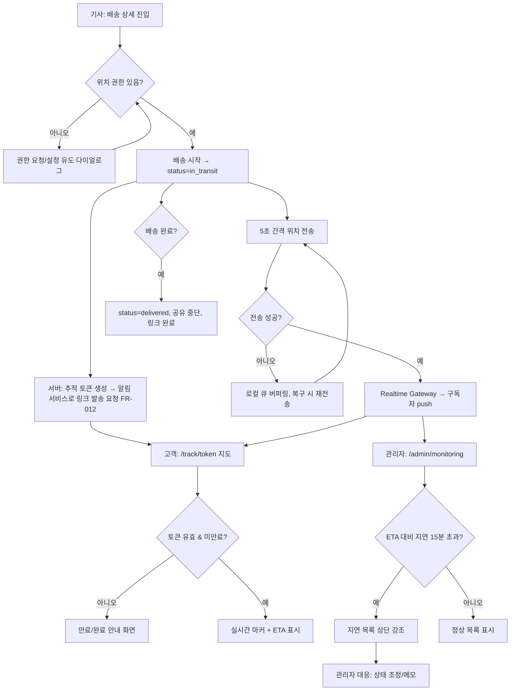

# PRD — 실시간 배송 추적 (Real-time Delivery Tracking)

> **Type**: product-feature
> **Scale Grade**: Startup
> **작성일**: 2026-08-03
> **상태**: Draft (prd-reviewer 검증 전)

---

## 1. Overview

### 1.1 Problem Statement
현재 배송 기사, 고객, 관제 관리자 사이에 **배송 위치·진행 상태를 실시간으로 공유하는 수단이 없다.**

- **고객**은 "지금 물건이 어디쯤 오는지" 알 수 없어 콜센터 문의가 반복되고, 부재중 재배송이 발생한다.
- **기사**는 고객 문의 전화에 응대하느라 배송이 지연되고, 자신의 진행 상황을 관제에 수동으로 보고해야 한다.
- **관제 관리자**는 어느 배송이 지연되고 있는지 사후에야 파악해 선제 대응이 불가능하다.

### 1.2 Goals
1. 기사 앱이 위치를 자동으로 공유하여, 고객이 별도 문의 없이 지도에서 실시간 위치와 예상 도착 시각(ETA)을 확인한다.
2. 관제 관리자가 **지연 임계치를 초과한 배송 건**을 대시보드에서 실시간으로 감지하고 대응한다.
3. 위치 공유로 인한 고객 CS 문의를 유의미하게 감소시킨다(§7 지표 참고).

### 1.3 Non-Goals
- **경로 최적화·배차 알고리즘**은 이 PRD 범위 밖이다(추적만 담당, 라우팅 엔진 별도).
- **기사 근태·급여 정산**은 다루지 않는다. 위치 데이터를 근태 감시 목적으로 사용하지 않는다.
- **고객 결제·주문 생성**은 기존 주문 시스템 소관이며, 본 기능은 `delivery_id`를 입력으로 받는다.
- **SMS/알림 발송 인프라 자체**(발송 게이트웨이·문자 템플릿·발송 비용)는 본 기능 밖이다. 본 기능은 원본 추적 토큰이 포함된 링크를 사내 알림 서비스에 **전달(발송 요청)**하는 책임까지 지며(FR-012), 실제 문자/푸시 발송은 알림 서비스가 수행한다.
- **오프라인 완전 동작**(네트워크 없는 지역에서 장시간 큐잉 후 일괄 동기화)은 v1 범위 밖이며 v2로 미룬다.
- **고객↔기사 실시간 채팅**은 범위 밖이다.

### 1.4 Scope
| 포함 | 제외 |
|---|---|
| 기사 앱의 백그라운드 위치 수집·전송 | 기사 배차/경로 계산 |
| 고객용 실시간 추적 지도 (공유 링크 기반) | 고객 회원가입/주문 |
| 관제 관리자용 지연 모니터링 대시보드 | 급여·근태·성과 평가 |
| 배송 상태 전이(픽업→배송중→완료) | 결제/정산 |
| ETA 계산(직선거리·평균속도 기반 근사) | 정밀 교통정보 기반 ETA(v2) |

---

## 2. User Stories

### 2.1 Primary User

- **As a 배송 기사(driver)**, I want to 배송을 시작하면 내 위치가 자동으로 공유되도록 하여, so that 고객 전화 응대 없이 배송에만 집중할 수 있다.
- **As a 고객(customer)**, I want to 문자로 받은 링크에서 기사의 실시간 위치와 ETA를 지도로 확인하여, so that 도착 시간에 맞춰 대기할 수 있다.
- **As a 관제 관리자(admin)**, I want to 지연 임계치를 넘긴 배송을 대시보드에서 실시간으로 보고, so that 고객에게 먼저 연락하거나 기사에게 지원할 수 있다.

### 2.2 Acceptance Criteria (Gherkin)

**AC-1 기사 위치 공유 시작 (정상)**
```gherkin
Given 기사가 앱에 로그인해 있고 위치 권한을 "앱 사용 중 허용" 이상으로 부여했으며
When 기사가 배정된 배송의 "배송 시작" 버튼을 누르면
Then 앱은 5초 간격으로 GPS 좌표를 서버에 전송하고
And 배송 상태가 in_transit 으로 전이되며
And 해당 고객의 추적 링크가 활성화된다
```

**AC-2 위치 권한 거부 (권한부족)**
```gherkin
Given 기사가 위치 권한을 거부했거나 "다음에 묻기"로 남겨둔 상태에서
When 기사가 "배송 시작"을 누르면
Then 앱은 위치 공유가 불가함을 안내하는 다이얼로그를 표시하고
And 시스템 설정으로 이동하는 버튼을 제공하며
And 배송 상태는 in_transit 으로 전이되지 않는다
```

**AC-3 고객 실시간 위치 조회 (정상)**
```gherkin
Given 배송이 in_transit 상태이고 고객이 유효한 추적 토큰 링크를 열었을 때
When 지도 화면이 로드되면
Then 기사의 최신 위치 마커가 표시되고
And 위치는 갱신 이벤트 수신 시 5초 이내에 지도에 반영되며
And 예상 도착 시각(ETA)이 함께 표시된다
```

**AC-4 만료·종료된 추적 링크 (만료)**
```gherkin
Given 배송이 delivered 상태이거나 추적 토큰이 만료(배송 완료 후 24시간 경과)되었을 때
When 고객이 추적 링크를 열면
Then "배송이 완료되었습니다" 또는 "링크가 만료되었습니다" 안내 화면이 표시되고
And 기사의 위치·이동 경로는 노출되지 않는다
```

**AC-5 관리자 지연 감지 (정상)**
```gherkin
Given 배송의 실제 진행이 ETA 대비 지연 임계치(15분)를 초과했을 때
When 관리자가 모니터링 대시보드를 보고 있으면
Then 해당 배송 건이 "지연" 목록 상단에 지연 시간과 함께 강조 표시되고
And 목록은 수동 새로고침 없이 30초 이내에 갱신된다
```

**AC-6 관리자 권한 없는 접근 (권한부족)**
```gherkin
Given driver 역할 계정으로 로그인한 상태에서
When 관제 대시보드 API(/api/v1/admin/**)에 접근하면
Then 서버는 403 Forbidden 을 반환하고
And 어떤 배송 데이터도 응답 본문에 포함하지 않는다
```

**AC-7 위치 전송 일시 실패 (실패)**
```gherkin
Given 기사 앱이 배송 중이고 네트워크가 일시적으로 끊겼을 때
When 위치 전송 요청이 실패하면
Then 앱은 최근 좌표를 최대 5분(또는 60건)까지 로컬 큐에 버퍼링하고
And 네트워크 복구 시 시간순으로 재전송하며
And 5분/60건 초과분은 폐기하고 마지막 좌표만 유지한다
```

### 2.3 User Roles

| Role Key | 한국어 명칭 | 권한 범위 |
|---|---|---|
| `driver` | 배송 기사 | 본인에게 배정된 배송의 위치 전송·상태 전이. 타 기사/고객 데이터 접근 불가 |
| `customer` | 고객(수령인) | 유효한 추적 토큰으로 **단일 배송**의 실시간 위치·ETA·상태 열람(읽기 전용, 비로그인) |
| `admin` | 관제 관리자 | 전체 진행 중 배송 조회, 지연 모니터링, 배송 상태 강제 조정 |

---

## 3. Functional Requirements

| ID | Requirement | Priority | Dependencies |
|---|---|---|---|
| FR-001 | 기사 앱은 배송 시작 시 위치 권한을 확인하고, 권한이 있으면 5초 간격으로 GPS 좌표를 서버에 전송한다 | P0 | — |
| FR-002 | 기사는 배송 상태를 `assigned → in_transit → delivered`(또는 `failed`)로 전이할 수 있다 | P0 | FR-001 |
| FR-003 | 서버는 수신한 위치를 저장하고, 해당 배송을 구독 중인 고객·관리자에게 실시간 push한다 | P0 | FR-001 |
| FR-004 | 고객은 추적 토큰 링크로 인증 없이 단일 배송의 실시간 위치·ETA·상태를 지도에서 열람한다 | P0 | FR-003, FR-012 |
| FR-005 | 서버는 기사 현재 위치와 목적지 기준 ETA를 계산해 제공한다(직선거리 ÷ 평균 이동속도 근사) | P0 | FR-003 |
| FR-006 | 관리자 대시보드는 진행 중 전체 배송을 지도/목록으로 보고, 실시간 갱신한다 | P0 | FR-003 |
| FR-007 | 시스템은 ETA 대비 지연 임계치(기본 15분) 초과 배송을 "지연"으로 판정해 관리자 대시보드에 강조한다 | P0 | FR-005, FR-006 |
| FR-008 | 기사 앱은 위치 전송 실패 시 좌표를 로컬 큐에 버퍼링하고 복구 시 재전송한다(최대 5분/60건) | P1 | FR-001 |
| FR-009 | 추적 토큰은 배송 완료 후 24시간이 지나면 만료되고, 이후 접근 시 위치가 노출되지 않는다 | P0 | FR-004 |
| FR-010 | 관리자는 지연 건에 대해 배송 상태를 강제 조정하거나 메모를 남길 수 있다 | P2 | FR-006 |
| FR-011 | 기사가 배송을 완료하면 위치 공유가 중단되고 추적 링크가 완료 상태로 전환된다 | P0 | FR-002, FR-004 |
| FR-012 | 배송이 `in_transit`으로 전이되면 서버가 단일 배송 스코프의 추적 토큰을 생성하고, 원본 토큰이 포함된 링크를 사내 알림 서비스에 전달해 고객에게 발송 요청한다(원본은 반환·발송 후 폐기, 해시만 저장) | P0 | FR-002 |

> **무모순 확인**: FR-004는 `customer`의 **비로그인 열람**을 토큰 스코프로 한정한다(FR-009 만료 규칙과 정합). `admin`/`driver` 리소스는 전부 인증 필수(§4.5)로, 비로그인 허용 범위가 고객의 단일 배송 읽기로만 국한되어 상호 모순이 없다.

---

## 4. Non-Functional Requirements

### 4.0 Scale Grade
**Startup** — 물류 스타트업으로 초기 운영 기사 수백 명, 동시 진행 배송 수천 건, 추적 링크를 여는 고객 DAU 1,000~10,000 규모로 추정. Enterprise급 멀티리전 고가용성보다 단일 리전 + 안정적 실시간 채널 우선.

### 4.1 Performance
- 위치 전송 API 쓰기: **p95 < 200ms**, 지속 처리량 **≥ 2,000 req/s**(동시 배송 6,000건 × 5초 간격 ≈ 1,200 req/s + 버스트 여유).
- 위치 갱신 end-to-end 지연(기사 전송 → 고객/관리자 화면 반영): **p95 < 5초**.
- 고객 추적 페이지 최초 로드 LCP: **p75 < 2.5초**.
- 관리자 대시보드 지연 목록 갱신 주기: **≤ 30초**.
- 단일 배송 동시 구독자(고객+관리자): 최소 **50 커넥션** 지원.

### 4.2 Availability
- 실시간 추적 채널 가용성 목표 **99.5%**(월 다운타임 ≈ 3.6시간).
- 실시간 push 채널(WebSocket) 장애 시 클라이언트는 **HTTP 폴링(10초 간격)으로 자동 폴백**하여 기능 저하 상태로 계속 동작한다.
- 위치 전송 API 장애 시 기사 앱은 FR-008의 로컬 버퍼링으로 데이터 유실을 최소화한다.

### 4.3 Data
- **위치 이력(driver_locations)**: 배송 완료 후 **30일 보관** 후 삭제/익명화. CS·분쟁 대응 목적.
- **개인정보**: 기사 위치는 개인정보로 취급. 배송 목적 외 사용 금지, 근태 감시 금지(§1.3). 추적 토큰에는 고객 개인정보를 인코딩하지 않는다.
- **삭제 정책**: 배송 취소·완료 24시간 경과 시 추적 토큰 무효화(FR-009). 위치 원본은 30일 후 배치 삭제.
- **전송 보관**: 좌표는 위경도 + 타임스탬프만 저장. 정확도(accuracy) 메타는 선택.

### 4.4 Recovery
- **RPO ≤ 5분**: 위치 이력은 최근 5분 유실 허용(실시간 특성상 과거 좌표 유실 영향 낮음). 배송 상태·주문 참조는 유실 불가(트랜잭션 저장).
- **RTO ≤ 30분**: 실시간 채널 장애 시 폴링 폴백으로 즉시 기능 유지, 완전 복구 목표 30분.

### 4.5 Security
- **인증**:
  - `driver` / `admin`: JWT 기반 인증(access 토큰 + refresh). 앱은 access 토큰을 안전 저장(Keychain/Keystore).
  - `customer`: **비로그인**. 서명된 불투명 추적 토큰(예: 128-bit 랜덤 + 서버 조회)으로만 접근.
- **인가 규칙(역할 → 리소스)**:

  | 리소스 | driver | customer | admin |
  |---|---|---|---|
  | `POST /tracking/location` (본인 배정 건) | ✅ 본인 건만 | ❌ | ❌ |
  | `PATCH /deliveries/{id}/status` | ✅ 본인 건만 | ❌ | ✅ 전체 |
  | `GET /track/{token}` (단일 배송 읽기) | ❌ | ✅ 유효 토큰 & 미만료 | ✅ |
  | `GET /admin/deliveries/**` | ❌ | ❌ | ✅ |
  | `WS 구독 /ws/tracking/{id}` | ✅ 본인 건 | ✅ 토큰 검증 후 | ✅ |

  - driver는 **본인에게 배정된 배송**의 위치만 전송 가능(서버가 `delivery.driver_id == jwt.sub` 검증).
  - customer 토큰은 **단일 `delivery_id`에 스코프**되어 다른 배송 접근 불가.
- **전송 보호**: 모든 트래픽 TLS 1.2+. WebSocket은 `wss://`.
- **저장 보호**: 위치·토큰은 저장 시 암호화(at-rest). 추적 토큰은 해시 형태로 저장.
- **입력 검증**: 좌표 범위 검증(위도 -90~90, 경도 -180~180), 타임스탬프 미래값 거부, 전송 rate limit(기사당 ≤ 2 req/s). 비인증 공개 표면인 `GET /track/{token}`·WS 구독도 **IP당 rate limit(예: 60 req/min)**과 토큰 스캔 방지(연속 404 임계 초과 시 IP 일시 차단)를 적용한다.

---

## 5. Technical Design

### 5.1 API Specification

인가 주체는 각 엔드포인트에 명시한다. 실시간 구독은 WebSocket, 나머지는 REST.

---

#### `POST /api/v1/tracking/location` — 기사 위치 전송
**인가 주체**: `driver` (본인 배정 배송만)

**Request**
```json
{
  "delivery_id": "dlv_01H...",
  "lat": 37.5665,
  "lng": 126.9780,
  "accuracy_m": 12.4,
  "recorded_at": "2026-08-03T04:21:05Z"
}
```

**Response 202**
```json
{ "accepted": true, "server_time": "2026-08-03T04:21:05.310Z" }
```

**Error**
| 코드 | 상황 |
|---|---|
| 400 | 좌표 범위 초과 / recorded_at 미래값 / 필수 필드 누락 |
| 401 | 유효하지 않은 JWT |
| 403 | 본인 배정 배송이 아님 |
| 409 | 배송이 이미 delivered/failed 상태 |
| 429 | rate limit(기사당 2 req/s) 초과 |

---

#### `PATCH /api/v1/deliveries/{id}/status` — 배송 상태 전이
**인가 주체**: `driver`(본인 건, 허용된 전이만) / `admin`(전체)

**Request**
```json
{ "status": "in_transit", "reason": null }
```
허용 전이: `assigned→in_transit`, `in_transit→delivered`, `in_transit→failed`(reason 필수).

> **부수효과(FR-012)**: `→in_transit` 전이가 성공하면 서버가 추적 토큰을 생성(128-bit 랜덤)하고, 해시를 `tracking_tokens`에 저장한 뒤 원본 링크(`https://.../track/{token}`)를 사내 알림 서비스에 발송 요청한다. 원본 토큰은 응답 본문에 포함하지 않고 발송 요청 직후 폐기한다. 알림 서비스 발송 실패는 배송 전이를 롤백하지 않고 `delivery_events`에 기록 후 재시도 큐에 넣는다.

**Response 200**
```json
{ "delivery_id": "dlv_01H...", "status": "in_transit", "updated_at": "2026-08-03T04:20:00Z" }
```

**Error**
| 코드 | 상황 |
|---|---|
| 400 | 허용되지 않은 상태 전이 / failed인데 reason 없음 |
| 401 | 미인증 |
| 403 | 본인 배정 건 아님(driver) |
| 404 | 존재하지 않는 delivery_id |

---

#### `GET /api/v1/track/{token}` — 고객 추적 조회(단발)
**인가 주체**: `customer`(유효·미만료 토큰), `admin`

**Response 200**
```json
{
  "delivery_id": "dlv_01H...",
  "status": "in_transit",
  "driver_location": { "lat": 37.5651, "lng": 126.9895, "recorded_at": "2026-08-03T04:21:05Z" },
  "destination": { "lat": 37.5700, "lng": 126.9820 },
  "eta": "2026-08-03T04:35:00Z"
}
```

**Error**
| 코드 | 상황 |
|---|---|
| 401 | 토큰 형식 오류 |
| 404 | 존재하지 않는 토큰 |
| 410 | 토큰 만료(배송 완료 후 24h) 또는 배송 취소 — 위치 미포함 |

---

#### `GET /api/v1/admin/deliveries?status=delayed` — 지연 배송 목록
**인가 주체**: `admin`

**Response 200**
```json
{
  "items": [
    {
      "delivery_id": "dlv_01H...",
      "driver_id": "drv_09...",
      "status": "in_transit",
      "eta": "2026-08-03T04:20:00Z",
      "delayed_minutes": 22,
      "last_location": { "lat": 37.55, "lng": 126.98, "recorded_at": "2026-08-03T04:41:00Z" }
    }
  ],
  "total": 1
}
```

**Error**
| 코드 | 상황 |
|---|---|
| 401 | 미인증 |
| 403 | admin 역할 아님 |

---

#### `WS /ws/tracking/{delivery_id}` — 실시간 위치 구독
**인가 주체**: `driver`(본인 건) / `customer`(subprotocol WS 티켓 검증) / `admin`

- **연결 & 인증**: 브라우저 WebSocket API는 커스텀 헤더를 못 실으므로 헤더 방식을 쓰지 않는다.
  - `driver`(모바일 앱) / `admin`(브라우저): 연결 직후 **첫 프레임으로 `{"type":"auth","jwt":"<access>"}`**를 보내 인증하거나, `admin`은 이미 설정된 인증 쿠키(HttpOnly, SameSite)로 핸드셰이크를 검증한다. 헤더 전송이 가능한 네이티브 클라이언트는 `Authorization` 헤더도 허용.
  - `customer`: 단명(short-lived) WS 티켓을 `GET /api/v1/track/{token}` 응답에서 발급받아 `Sec-WebSocket-Protocol` subprotocol로 전달한다(쿼리스트링 로깅 노출 회피).
- **서버→클라이언트 이벤트**
```json
{ "type": "location", "lat": 37.5651, "lng": 126.9895, "recorded_at": "2026-08-03T04:21:05Z", "eta": "2026-08-03T04:35:00Z" }
{ "type": "status", "status": "delivered", "at": "2026-08-03T04:34:12Z" }
```
- **폴백**: 연결 실패/끊김 시 클라이언트는 `GET /api/v1/track/{token}`을 10초 간격 폴링(§4.2).
- **Error(연결 거부)**: `4401` 미인증 / `4403` 권한없음 / `4410` 만료.

---

### 5.2 Database Schema

```sql
-- 배송(주문 시스템에서 생성, 본 기능은 참조)
CREATE TABLE deliveries (
  id            TEXT PRIMARY KEY,
  driver_id     TEXT NOT NULL REFERENCES drivers(id),
  status        TEXT NOT NULL DEFAULT 'assigned'
                CHECK (status IN ('assigned','in_transit','delivered','failed','cancelled')),
  dest_lat      DOUBLE PRECISION NOT NULL,
  dest_lng      DOUBLE PRECISION NOT NULL,
  eta           TIMESTAMPTZ,               -- 계산된 예상 도착
  started_at    TIMESTAMPTZ,
  completed_at  TIMESTAMPTZ,
  created_at    TIMESTAMPTZ NOT NULL DEFAULT now()
);
CREATE INDEX idx_deliveries_status ON deliveries(status) WHERE status = 'in_transit';

-- 위치 이력(시계열, 30일 보관)
CREATE TABLE driver_locations (
  id           BIGSERIAL PRIMARY KEY,
  delivery_id  TEXT NOT NULL REFERENCES deliveries(id),
  lat          DOUBLE PRECISION NOT NULL,
  lng          DOUBLE PRECISION NOT NULL,
  accuracy_m   REAL,
  recorded_at  TIMESTAMPTZ NOT NULL,
  created_at   TIMESTAMPTZ NOT NULL DEFAULT now()
);
CREATE INDEX idx_locations_delivery_time ON driver_locations(delivery_id, recorded_at DESC);

-- 추적 토큰(고객 비로그인 접근)
CREATE TABLE tracking_tokens (
  token_hash   TEXT PRIMARY KEY,          -- 원본 토큰의 해시
  delivery_id  TEXT NOT NULL UNIQUE REFERENCES deliveries(id),
  expires_at   TIMESTAMPTZ,               -- 완료 후 24h
  created_at   TIMESTAMPTZ NOT NULL DEFAULT now()
);

-- 배송 이벤트/관리자 메모(감사 로그)
CREATE TABLE delivery_events (
  id           BIGSERIAL PRIMARY KEY,
  delivery_id  TEXT NOT NULL REFERENCES deliveries(id),
  actor_role   TEXT NOT NULL,             -- driver | admin | system
  event_type   TEXT NOT NULL,            -- status_change | delay_flagged | note
  payload      JSONB,
  created_at   TIMESTAMPTZ NOT NULL DEFAULT now()
);
```

> **최신 위치 조회 최적화**: 고빈도 읽기는 `driver_locations`를 매번 스캔하지 않고, 배송별 최신 좌표를 인메모리 캐시(예: Redis `latest_location:{delivery_id}`)에 유지하고 원본은 이력용으로 append-only 저장한다.

### 5.3 Architecture

```
[기사 앱]                         [고객 웹/링크]        [관리자 대시보드]
   │ POST /tracking/location          │ WS 구독              │ WS 구독 + REST
   ▼                                   ▼                     ▼
┌────────────────────────── API / Realtime Gateway ──────────────────────────┐
│  - 위치 수집 API(검증·인가·rate limit)                                        │
│  - WebSocket 허브(배송별 구독 채널, wss)                                       │
│  - 폴백 REST(track/{token})                                                  │
└───────────────┬───────────────────────────────┬───────────────────────────┘
                │ append                          │ publish
                ▼                                 ▼
        ┌──────────────┐                 ┌──────────────────┐
        │  Postgres     │◀───ETA/지연───▶ │ Redis (pub/sub +  │
        │ (이력·상태·토큰)│   Delay Worker  │  latest cache)    │
        └──────────────┘   (주기 스캔)     └──────────────────┘
```
- **Realtime Gateway**: 위치 수집 + 배송별 WebSocket 채널 팬아웃. Redis pub/sub로 다중 인스턴스 간 브로드캐스트.
- **Delay Worker**: 30초 주기로 `in_transit` 배송의 `now - eta`를 평가, 임계치 초과 시 `delay_flagged` 이벤트 발행 → 관리자 채널 push.
- **ETA 계산**: 최신 위치→목적지 직선거리(Haversine) ÷ 평균 이동속도(도심 기본값, 설정 가능)로 근사(FR-005).
- **지도 SDK**: 국내 물류 특성상 v1 기본은 **Kakao Maps SDK**(국내 주소·도로 데이터 정합) 채택, 3개 FE 페이지(기사/고객/관리자) 공통 사용. 지도 provider는 렌더 어댑터로 추상화해 교체 가능하게 둔다. 월 지도 로드/API 호출 한도·비용은 예상 트래픽(고객 링크 오픈 DAU 1,000~10,000)을 기준으로 계약 단계에서 확정한다.

#### 5.4 Pages

| Route | Audience | Auth | Linked FRs | Has FE Components | Primary State | Responsive |
|---|---|---|---|---|---|---|
| `/driver/deliveries/:id/tracking` (기사 앱) | `driver` | JWT 필수 | FR-001, FR-002, FR-008, FR-011 | Yes | success(공유중) | Mobile-first |
| `/track/:token` (고객 추적 지도) | `customer` | 토큰 | FR-004, FR-005, FR-009 | Yes | success(지도) | Mobile-first |
| `/admin/monitoring` (관제 대시보드) | `admin` | JWT 필수 | FR-006, FR-007, FR-010 | Yes | success(목록/지도) | Desktop-first |

#### 5.4.1 Page State Matrix

| Route | loading | empty | error | success | no-permission | 비고 |
|---|---|---|---|---|---|---|
| `/driver/deliveries/:id/tracking` | 배송 정보 로딩 스피너 | 배정 배송 없음 안내 | 전송 실패 배너 + 재시도(버퍼링 중 표시) | 지도 + "공유 중" 상태 + 정지 버튼 | 위치 권한 거부 → 설정 유도 다이얼로그(AC-2) | 권한 미부여도 no-permission으로 처리 |
| `/track/:token` | 지도·마커 로딩 스켈레톤 | 아직 배송 시작 전(위치 없음) 안내 | 네트워크 오류 → 폴링 폴백 안내 | 실시간 마커 + ETA + 상태 | 만료/취소 토큰 → 안내 화면(AC-4, 410) | no-permission = 만료·무효 토큰 |
| `/admin/monitoring` | 목록/지도 로딩 | 진행 중 배송 0건 안내 | API 오류 배너 | 지연 강조 목록 + 지도 | driver 계정 접근 → 접근 거부(403, AC-6) | 30초 자동 갱신 |

#### 5.5 User Flow



---

## 6. Implementation Phases

FR 의존성 순서를 지킨다(P0 우선, 기반 → 실시간 → 모니터링).

### Phase 1 — 기반: 위치 수집 & 상태 (P0)
- **Deliverable**: `POST /tracking/location`(FR-001), `PATCH /deliveries/{id}/status`(FR-002), DB 스키마(§5.2), 좌표/전이 검증·인가.
- 기사 앱: 위치 권한 처리 + 5초 전송 루프.

### Phase 2 — 실시간 채널 & 고객 추적 (P0)
- **Deliverable**: WebSocket 허브 + Redis pub/sub(FR-003), 추적 토큰 생성 및 알림 서비스 발송 요청(FR-012), 토큰 검증·만료(FR-009), 고객 `/track/:token` 지도 페이지(FR-004), 배송 완료 시 공유 중단(FR-011).
- REST 폴링 폴백 포함(§4.2).

### Phase 3 — ETA & 관제 모니터링 (P0/P1)
- **Deliverable**: ETA 계산(FR-005), Delay Worker + 지연 판정(FR-007), 관리자 대시보드 `/admin/monitoring`(FR-006).

### Phase 4 — 견고성 & 관리자 대응 (P1/P2)
- **Deliverable**: 오프라인 버퍼링·재전송(FR-008), 관리자 상태 강제 조정/메모(FR-010), 위치 이력 30일 보관 배치 삭제(§4.3).

---

## 7. Success Metrics

| Metric | Target | Measurement |
|---|---|---|
| 위치 갱신 end-to-end 지연 | p95 < 5초 | 서버 수신 timestamp ↔ 클라이언트 렌더 timestamp 계측 |
| 배송 관련 CS 문의("어디쯤 와요?") | 출시 8주 내 40% 감소 | CS 티켓 카테고리별 건수 비교 |
| 지연 건 관리자 인지 시간 | 임계 초과 후 30초 이내 대시보드 반영 | Delay Worker 발행 ↔ 대시보드 갱신 로그 |
| 고객 추적 링크 오픈율 | 발송 배송의 ≥ 60% | 링크 발송 수 대비 고유 오픈 수 |
| 실시간 채널 가용성 | ≥ 99.5% | WebSocket 연결 성공률 + 폴백 발생률 모니터링 |
| 위치 전송 API 성능 | p95 < 200ms @ ≥2,000 req/s | APM(요청 지연 히스토그램) |
```
