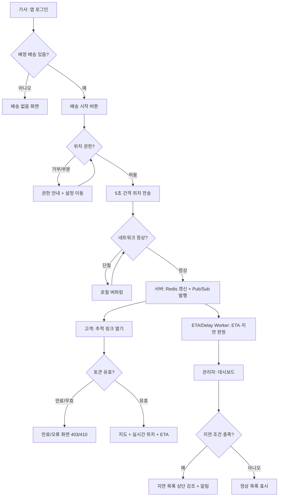

# PRD — 실시간 배송 추적 (Real-time Delivery Tracking)

> **Type**: product-feature
> **Scale Grade**: Startup (근거: 물류 스타트업 초기, 활성 기사 수백 명 / 일 배송 수천 건 규모, DAU 1,000~10,000 예상)
> **Author**: contact@wigtn.com
> **Date**: 2026-08-03
> **Status**: Draft

---

## 1. Overview

### 1.1 Problem Statement
현재 배송 진행 상황은 기사에게 전화하거나 기사가 수동으로 상태를 갱신해야만 알 수 있다. 이로 인해:
- **고객**은 "지금 어디쯤 오는지"를 알 수 없어 문의 전화가 몰리고, 부재로 인한 재배송이 발생한다.
- **관리자(디스패처)**는 어느 배송이 지연되고 있는지 실시간으로 파악하지 못해, 문제가 이미 커진 뒤에야 대응한다.
- **기사**는 상태 갱신을 수동으로 해야 해 운전 중 조작 부담이 크고, 갱신 누락이 잦다.

### 1.2 Goals
- 기사 앱이 백그라운드에서 위치를 자동 공유하여, 수동 조작 없이 실시간 위치가 서버에 반영된다.
- 고객이 배송 추적 링크(로그인 불필요)로 지도 위 기사 위치와 예상 도착 시간(ETA)을 확인한다.
- 관리자가 대시보드에서 지연 임계치를 초과한 배송을 실시간으로 식별하고 대응한다.

### 1.3 Non-Goals
- **경로 최적화 / 배차 알고리즘**: 어떤 기사에게 어떤 배송을 할당할지는 본 기능 범위 밖. 배송은 이미 기사에게 배정되어 있다고 가정한다.
- **정산 / 요금 계산**: 거리 기반 정산은 별도 기능.
- **고객 앱(네이티브)**: 고객은 웹 추적 페이지만 사용한다. 고객용 네이티브 앱은 만들지 않는다.
- **기사 간 채팅 / 음성 통화**: 커뮤니케이션 기능은 범위 밖.
- **오프라인 완전 동작**: 네트워크 단절 시 위치 버퍼링(§4.3)까지만 지원하고, 완전한 오프라인 모드는 제외.

### 1.4 Scope
| 포함 | 제외 |
|---|---|
| 기사 앱 백그라운드 위치 수집·전송 | 배차/경로 최적화 |
| 고객용 웹 추적 페이지(지도 + ETA) | 고객 네이티브 앱 |
| 관리자 실시간 모니터링 대시보드 | 정산/요금 |
| 지연 감지 및 알림 | 기사-고객 통화/채팅 |
| WebSocket 기반 실시간 위치 스트리밍 | BI/분석 리포트 |

---

## 2. User Stories

### 2.1 Primary User
- **기사(driver)**: As a 배송 기사, I want to 배송을 시작하면 위치가 자동으로 공유되도록 하여 so that 운전에 집중하면서도 고객·관리자가 내 위치를 알 수 있다.
- **고객(customer)**: As a 수령 고객, I want to 링크 하나로 지도에서 기사의 실시간 위치와 도착 예정 시간을 보고 싶다 so that 불필요한 대기와 부재를 피할 수 있다.
- **관리자(dispatcher)**: As a 배송 관리자, I want to 지연되는 배송을 실시간으로 한눈에 보고 싶다 so that 문제가 커지기 전에 기사에게 연락하거나 조치할 수 있다.

### 2.2 Acceptance Criteria (Gherkin)

**AC-1 (driver) — 위치 공유 시작 (정상)**
```gherkin
Given 기사가 앱에 로그인되어 있고 배정된 배송이 "배송중" 상태이다
When 기사가 "배송 시작" 버튼을 누른다
Then 앱이 위치 권한을 확인하고 5초 간격으로 위치를 서버에 전송한다
And 서버는 해당 배송의 실시간 위치를 갱신한다
```

**AC-2 (driver) — 위치 권한 거부 (실패)**
```gherkin
Given 기사가 "배송 시작"을 눌렀다
When OS 위치 권한이 "거부" 또는 "앱 사용 중에만 허용"으로 설정되어 있다
Then 앱은 "백그라운드 위치 권한이 필요합니다" 안내와 설정 이동 버튼을 표시한다
And 위치 전송을 시작하지 않고 배송 상태를 "위치 공유 대기"로 유지한다
```

**AC-3 (driver) — 네트워크 단절 (실패/복구)**
```gherkin
Given 기사가 위치를 공유 중이다
When 기기 네트워크가 60초 이상 끊긴다
Then 앱은 수집된 위치를 로컬 큐에 최대 30분(또는 500포인트)까지 버퍼링한다
And 네트워크 복구 시 타임스탬프를 보존한 채 순서대로 일괄 전송한다
```

**AC-4 (customer) — 추적 링크 열람 (정상)**
```gherkin
Given 배송에 대한 서명된 추적 토큰이 발급되어 있다
When 고객이 추적 링크를 연다
Then 로그인 없이 지도에 기사의 최신 위치, 목적지, ETA가 표시된다
And 위치는 WebSocket으로 실시간(≤5초 지연) 갱신된다
```

**AC-5 (customer) — 만료/무효 토큰 (실패)**
```gherkin
Given 추적 토큰이 만료(배송 완료 후 24시간 경과)되었거나 위변조되었다
When 고객이 추적 링크를 연다
Then "추적 링크가 만료되었거나 유효하지 않습니다" 화면을 표시하고
And 기사 위치를 일절 노출하지 않는다 (403)
```

**AC-6 (dispatcher) — 지연 모니터링 (정상)**
```gherkin
Given 관리자가 대시보드에 로그인되어 있다
When 어떤 배송의 ETA가 약속 시간을 15분 이상 초과하거나 위치가 10분 이상 정지해 있다
Then 해당 배송이 대시보드 "지연" 목록 상단에 빨간색으로 표시되고
And 관리자에게 실시간 알림 배지가 갱신된다
```

**AC-7 (dispatcher) — 권한 부족 (권한)**
```gherkin
Given 로그인한 사용자의 역할이 driver이다
When driver가 관리자 대시보드 API를 호출한다
Then 서버는 403 Forbidden을 반환하고 어떤 배송 데이터도 반환하지 않는다
```

### 2.3 User Roles

| Role Key | 한국어 명칭 | 권한 범위 |
|---|---|---|
| `driver` | 배송 기사 | 본인에게 배정된 배송 조회, 본인 위치 전송/중단 |
| `customer` | 수령 고객 | 서명 토큰으로 특정 배송 1건의 위치·ETA 열람(비로그인) |
| `dispatcher` | 배송 관리자 | 소속 조직의 전체 배송·기사 위치 조회, 지연 모니터링, 배송 상태 열람 |
| `admin` | 시스템 관리자 | 조직/사용자 관리, 전 조직 데이터 접근, 감사 로그 열람 |

---

## 3. Functional Requirements

| ID | Requirement | Priority | Dependencies |
|---|---|---|---|
| FR-001 | 기사 앱은 배송 시작 시 5초 간격으로 GPS 위치(위경도·정확도·타임스탬프·속도)를 서버에 전송한다 | P0 | — |
| FR-002 | 기사 앱은 앱이 백그라운드 상태여도 위치를 계속 수집·전송한다 | P0 | FR-001 |
| FR-003 | 기사 앱은 네트워크 단절 시 위치를 로컬 버퍼링하고 복구 시 순서대로 일괄 전송한다 | P0 | FR-001 |
| FR-004 | 기사 앱은 위치 권한 상태를 확인하고 권한 부족 시 안내 및 설정 이동을 제공한다 | P0 | FR-001 |
| FR-005 | 기사는 "배송 시작/일시정지/완료"로 위치 공유를 제어할 수 있다 | P0 | FR-001 |
| FR-006 | 서버는 배송별 실시간 위치를 저장하고 WebSocket 구독자에게 브로드캐스트한다 | P0 | FR-001 |
| FR-007 | 배송 생성 시 만료 시간이 있는 서명된 고객 추적 토큰을 발급한다 | P0 | — |
| FR-008 | 고객 추적 페이지는 토큰으로 인증하여 지도에 기사 위치·목적지·ETA를 표시한다 | P0 | FR-006, FR-007 |
| FR-009 | 고객 추적 페이지는 WebSocket으로 위치를 ≤5초 지연으로 실시간 갱신한다 | P0 | FR-006 |
| FR-010 | 서버는 기사 위치와 목적지 기반으로 ETA를 계산·갱신한다 | P0 | FR-006 |
| FR-011 | 서버는 지연(ETA 초과 15분 이상 또는 위치 정지 10분 이상) 조건을 감지한다 | P0 | FR-006, FR-010 |
| FR-012 | 관리자 대시보드는 전체 배송을 지도/목록으로 보여주고 지연 건을 강조한다 | P0 | FR-006, FR-011 |
| FR-013 | 관리자 대시보드는 지연 발생 시 실시간 알림 배지/목록을 갱신한다 | P1 | FR-011 |
| FR-014 | 모든 위치 데이터 접근은 역할·소유권 기반 인가를 통과해야 한다 | P0 | §4.5 |
| FR-015 | 관리자는 특정 기사/배송의 최근 이동 경로(폴리라인)를 조회할 수 있다 | P2 | FR-006 |

> **무모순 확인**: 고객(`customer`)은 비로그인이지만 **서명 토큰 필수**(FR-007/008)이므로 "모든 위치 접근은 인가 필요"(FR-014)와 공존한다. 토큰 검증이 곧 customer의 인가 수단이다.

---

## 4. Non-Functional Requirements

### 4.0 Scale Grade
**Startup** — 활성 기사 수백 명, 동시 진행 배송 수백~수천 건, 예상 DAU 1,000~10,000. 위치 수신 피크 ≈ 기사 2,000명 × (1건/5초) = 400 writes/s.

### 4.1 Performance
- 위치 수신 API: p95 < 150ms, 지속 처리량 ≥ 500 writes/s.
- 위치 전파(기사 전송 → 고객/관리자 화면 반영): p95 end-to-end < 5s.
- WebSocket 동시 구독 연결: ≥ 5,000 concurrent.
- 관리자 대시보드 초기 로드: p95 < 2s (배송 500건 기준).
- ETA 재계산: 위치 갱신당 < 300ms.

### 4.2 Availability
- 목표 가용성: 99.5% (월간).
- 위치 수신 경로 장애 시 기사 앱은 버퍼링(FR-003)으로 데이터 유실을 방지한다.
- WebSocket 서버 장애 시 클라이언트는 지수 백오프로 재연결하고, 재연결까지 마지막 위치를 표시한다.

### 4.3 Data
- **실시간 위치(hot)**: 활성 배송의 최신 위치는 인메모리/Redis에 보관, 완료 후 15분 뒤 만료.
- **이동 경로(cold)**: 위치 이력은 DB에 저장, 보관 기간 **90일** 후 삭제/익명화.
- **개인정보**: GPS 위치는 개인정보로 취급. 고객 추적 토큰은 배송 완료 후 **24시간** 뒤 만료. 기사 위치는 배송 종료 후 고객에게 노출 중단.
- **삭제 정책**: 기사/고객의 삭제 요청 시 관련 위치 이력을 30일 내 파기.

### 4.4 Recovery
- **RPO**: ≤ 5분 (위치 이력은 최근 5분 유실 허용, 최신 위치는 재전송으로 복구).
- **RTO**: ≤ 30분 (위치 수신·스트리밍 경로 복구 목표).

### 4.5 Security
- **인증**: 기사/관리자는 JWT(액세스 토큰 + 리프레시). 고객은 배송별 **HMAC 서명 추적 토큰**(만료 포함, 비로그인).
- **인가 규칙**:
  | 역할 | 허용 리소스 |
  |---|---|
  | `driver` | 본인 배정 배송 조회, 본인 위치 `POST`만. 타 기사/타 배송 접근 불가 |
  | `customer` | 유효한 서명 토큰에 매칭된 **단일 배송**의 위치·ETA `GET`만 |
  | `dispatcher` | 본인 소속 조직의 배송·기사 위치 `GET`, 지연 목록. 타 조직 불가 |
  | `admin` | 전 조직 CRUD 및 감사 로그 |
- **전송 보호**: 모든 트래픽 TLS 1.2+, WebSocket은 WSS.
- **저장 보호**: 위치 이력 DB 암호화(at-rest), 토큰 시크릿은 KMS/시크릿 매니저 관리.
- **입력 검증**: 위경도 범위(-90~90 / -180~180), 타임스탬프 유효성, 정확도 임계치(> 100m는 표시에서 제외) 검증. 요청 rate limit(기사당 ≤ 2 req/s).

---

## 5. Technical Design

### 5.1 API Specification

프로토콜: 위치 쓰기/조회는 **REST**, 실시간 스트리밍은 **WebSocket**.

---

#### POST /api/v1/deliveries/{deliveryId}/location — 위치 전송
- **인가 주체**: `driver` (본인 배정 배송에 한함)
- **Request**
```json
{
  "points": [
    { "lat": 37.5665, "lng": 126.9780, "accuracy": 12.5, "speed": 8.3, "recordedAt": "2026-08-03T10:00:00Z" }
  ]
}
```
- **Response** `202 Accepted`
```json
{ "accepted": 1, "rejected": 0, "serverTime": "2026-08-03T10:00:01Z" }
```
- **Error**
  - `400` 위경도/타임스탬프 유효성 실패 → `{ "error": "INVALID_COORDINATES" }`
  - `403` 본인 배송 아님 → `{ "error": "FORBIDDEN" }`
  - `409` 배송이 이미 완료/취소 → `{ "error": "DELIVERY_NOT_ACTIVE" }`
  - `429` rate limit 초과 → `{ "error": "RATE_LIMITED" }`

---

#### GET /api/v1/track/{trackingToken} — 고객 추적 조회
- **인가 주체**: `customer` (서명 토큰 검증)
- **Request**: 경로 파라미터 `trackingToken` (HMAC 서명)
- **Response** `200 OK`
```json
{
  "deliveryId": "d_123",
  "status": "in_transit",
  "driverLocation": { "lat": 37.56, "lng": 126.97, "updatedAt": "2026-08-03T10:00:00Z" },
  "destination": { "lat": 37.50, "lng": 127.03 },
  "etaMinutes": 12,
  "wsUrl": "wss://api.example.com/ws/track/{trackingToken}"
}
```
- **Error**
  - `403` 토큰 위변조/권한 없음 → `{ "error": "INVALID_TOKEN" }`
  - `410` 토큰 만료(배송 완료 24h 경과) → `{ "error": "TOKEN_EXPIRED" }`
  - `404` 배송 없음 → `{ "error": "NOT_FOUND" }`

---

#### GET /api/v1/dispatch/deliveries — 관리자 배송 목록
- **인가 주체**: `dispatcher`, `admin` (소속 조직 범위)
- **Request**: 쿼리 `?status=in_transit&delayed=true&page=1&size=50`
- **Response** `200 OK`
```json
{
  "items": [
    { "deliveryId": "d_123", "driverName": "홍길동", "status": "in_transit",
      "etaMinutes": 30, "promisedBy": "2026-08-03T10:15:00Z", "delayed": true, "delayMinutes": 20,
      "lastLocation": { "lat": 37.56, "lng": 126.97, "updatedAt": "2026-08-03T10:00:00Z" } }
  ],
  "page": 1, "size": 50, "total": 128
}
```
- **Error**
  - `401` 미인증 → `{ "error": "UNAUTHORIZED" }`
  - `403` driver/customer 접근 → `{ "error": "FORBIDDEN" }`

---

#### WebSocket /ws/track/{trackingToken} & /ws/dispatch — 실시간 스트림
- **인가 주체**: `customer`(track, 토큰), `dispatcher`/`admin`(dispatch, JWT)
- **연결**: 핸드셰이크 시 토큰/JWT 검증. 실패 시 `4401`(unauthorized) close code.
- **Server → Client 메시지**
```json
{ "type": "location_update", "deliveryId": "d_123",
  "location": { "lat": 37.56, "lng": 126.97 }, "etaMinutes": 11, "at": "2026-08-03T10:00:05Z" }
```
```json
{ "type": "delay_alert", "deliveryId": "d_123", "delayMinutes": 16, "reason": "eta_exceeded" }
```
- **Client → Server 메시지**: `{ "type": "subscribe", "deliveryIds": ["d_123"] }` (dispatch 전용)
- **Error/Close codes**: `4401` 인증 실패 / `4410` 토큰 만료 / `1013` 서버 과부하(재연결 유도).

---

### 5.2 Database Schema

```sql
-- 배송
CREATE TABLE deliveries (
  id            UUID PRIMARY KEY,
  org_id        UUID NOT NULL,
  driver_id     UUID REFERENCES drivers(id),
  status        TEXT NOT NULL CHECK (status IN ('assigned','in_transit','paused','delivered','canceled')),
  dest_lat      DOUBLE PRECISION NOT NULL,
  dest_lng      DOUBLE PRECISION NOT NULL,
  promised_by   TIMESTAMPTZ,
  created_at    TIMESTAMPTZ NOT NULL DEFAULT now()
);
CREATE INDEX idx_deliveries_org_status ON deliveries(org_id, status);

-- 위치 이력 (cold, 90일 보관)
CREATE TABLE location_points (
  id            BIGSERIAL PRIMARY KEY,
  delivery_id   UUID NOT NULL REFERENCES deliveries(id),
  lat           DOUBLE PRECISION NOT NULL,
  lng           DOUBLE PRECISION NOT NULL,
  accuracy      REAL,
  speed         REAL,
  recorded_at   TIMESTAMPTZ NOT NULL,
  received_at   TIMESTAMPTZ NOT NULL DEFAULT now()
);
CREATE INDEX idx_location_delivery_time ON location_points(delivery_id, recorded_at);

-- 고객 추적 토큰
CREATE TABLE tracking_tokens (
  token_hash    TEXT PRIMARY KEY,       -- HMAC 서명값 해시
  delivery_id   UUID NOT NULL REFERENCES deliveries(id),
  expires_at    TIMESTAMPTZ NOT NULL,
  created_at    TIMESTAMPTZ NOT NULL DEFAULT now()
);

-- 최신 위치 (hot) — Redis 캐시 미러. 스키마상 최신 스냅샷 테이블
CREATE TABLE delivery_live_state (
  delivery_id   UUID PRIMARY KEY REFERENCES deliveries(id),
  last_lat      DOUBLE PRECISION,
  last_lng      DOUBLE PRECISION,
  eta_minutes   INT,
  delayed       BOOLEAN NOT NULL DEFAULT false,
  delay_minutes INT NOT NULL DEFAULT 0,
  updated_at    TIMESTAMPTZ
);
```
- **Hot 저장소**: Redis (`live:{deliveryId}` → 최신 위치/ETA, Pub/Sub 채널로 WebSocket fan-out).

### 5.3 Architecture

```
[기사 모바일 앱]                          [고객 웹 추적]        [관리자 대시보드]
   │ POST /location (5s, 버퍼링)             │ GET+WSS            │ GET+WSS
   ▼                                         ▼                    ▼
┌──────────────────── API Gateway (TLS/WSS, rate limit, authz) ────────────────────┐
        │                                    │
        ▼                                    ▼
[Location Ingest 서비스]  ──write──►  [Redis (hot state + Pub/Sub)]  ──►  [WS Gateway]──► 구독자
        │                                    ▲
        ├──async──► [ETA/Delay Worker] ──────┘  (ETA 계산·지연 감지·delay_alert 발행)
        ▼
[PostgreSQL: deliveries / location_points / tracking_tokens / live_state]
```
- **Location Ingest**: 위치 검증 → Redis 최신값 갱신 + Pub/Sub 발행 → 비동기로 PG `location_points` 적재.
- **ETA/Delay Worker**: Redis 위치 변화 구독 → ETA 재계산, 지연 조건 판정 → `delay_alert` 발행.
- **WS Gateway**: Redis Pub/Sub 구독 → 인가된 구독자에게만 fan-out.
- **스택 가정**(Startup): Next.js(관리자/고객 웹) + Node WebSocket, React Native/Expo(기사 앱), PostgreSQL + Redis. 지도는 지도 SDK(예: Mapbox/Google Maps).

#### 5.4 Pages

| Route | Audience | Auth | Linked FRs | Has FE Components | Primary State | Responsive |
|---|---|---|---|---|---|---|
| `/driver/delivery/{id}` (앱) | `driver` | JWT | FR-001,002,003,004,005 | Yes | success | Mobile |
| `/track/{trackingToken}` | `customer` | 서명 토큰 | FR-008,009 | Yes | success | Mobile-first |
| `/dispatch` | `dispatcher`,`admin` | JWT | FR-012,013 | Yes | success | Desktop |
| `/dispatch/delivery/{id}` | `dispatcher`,`admin` | JWT | FR-012,015 | Yes | success | Desktop |

#### 5.4.1 Page State Matrix

| Route | loading | empty | error | success | no-permission | 비고 |
|---|---|---|---|---|---|---|
| `/driver/delivery/{id}` | 배송 정보 로딩 스피너 | 배정 배송 없음 안내 | 전송 실패 배너+재시도 | 지도+공유 상태 표시 | 타 기사 배송 접근 차단 화면 | 권한 거부 시 설정 이동 CTA |
| `/track/{trackingToken}` | 지도 스켈레톤 | 위치 아직 없음("기사 출발 대기") | 만료/무효 토큰 화면 | 실시간 마커+ETA | 토큰 불일치 403 화면 | 배송 완료 시 "도착 완료" 상태 |
| `/dispatch` | 목록/지도 스켈레톤 | 진행 중 배송 0건 | 데이터 로드 실패 배너 | 목록+지도+지연 강조 | driver/customer 접근 차단 | 지연 배지 실시간 갱신 |
| `/dispatch/delivery/{id}` | 상세 로딩 | 이동 경로 데이터 없음 | 조회 실패 | 경로 폴리라인+상태 | 타 조직 접근 차단 | 경로는 P2(FR-015) |

#### 5.5 User Flow



---

## 6. Implementation Phases

### Phase 1 — 위치 수집·수신 기반 (P0 코어)
- **Deliverable**: 기사 앱이 위치를 전송하고 서버가 저장·브로드캐스트하는 최소 경로.
- FR-001, FR-002, FR-004, FR-005, FR-006, FR-014(인가 기반)
- 산출물: 위치 수신 API, Redis hot state, WS Gateway 기본, 기사 앱 위치 화면.

### Phase 2 — 안정성 & 고객 추적
- **Deliverable**: 네트워크 복원력 + 고객이 링크로 실시간 위치를 보는 경험.
- FR-003(버퍼링), FR-007(토큰 발급), FR-008, FR-009
- 산출물: 버퍼/재전송 로직, 서명 토큰, `/track/{token}` 페이지.

### Phase 3 — ETA & 지연 모니터링 (P0 포함)
- **Deliverable**: 관리자가 지연 건을 실시간으로 식별.
- FR-010(ETA, P0), FR-011(지연 감지, P0), FR-012(P0), FR-013(P1)
- 산출물: ETA/Delay Worker, `/dispatch` 대시보드, 실시간 알림.

### Phase 4 — 운영 고도화 (P2)
- **Deliverable**: 경로 재생 등 심화 기능.
- FR-015(이동 경로 폴리라인), 데이터 보관/삭제 정책 자동화(§4.3).

---

## 7. Success Metrics

| Metric | Target | Measurement |
|---|---|---|
| 위치 전파 지연(기사→화면) | p95 < 5s | 서버 수신~클라 렌더 타임스탬프 비교 |
| 고객 추적 링크 열람률 | 배송 건의 ≥ 40% | 발송 대비 `/track` 오픈 수 |
| 배송 관련 문의 전화 | 도입 전 대비 -30% | CS 티켓/콜 수 비교(도입 8주 후) |
| 지연 감지→관리자 대응 리드타임 | 평균 < 5분 | delay_alert 발생~관리자 액션 로그 |
| 위치 전송 성공률(버퍼 포함) | ≥ 99% | 전송 시도 대비 수신 성공 |
| 위치 수신 API 성능 | p95 < 150ms | APM 계측 |
```
