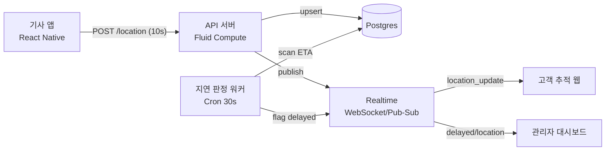
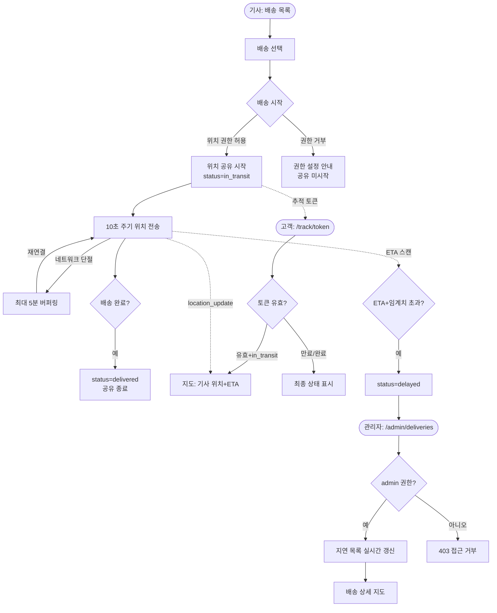

# PRD — 실시간 배송 추적 (Real-time Delivery Tracking)

> **Type**: product-feature
> **Scale Grade**: Startup
> **Author**: contact@wigtn.com
> **Date**: 2026-08-03
> **Status**: Draft

---

## 1. Overview

### 1.1 Problem Statement
현재 배송 기사의 위치는 배송 완료 시점의 상태 변경(픽업/배송완료)으로만 파악된다.
- **고객**은 "내 물건이 지금 어디쯤 오는지" 알 수 없어 CS 문의(배송위치 확인)가 전체 문의의 큰 비중을 차지한다.
- **관리자**는 배송이 실제로 지연되고 있는지 사후(고객 컴플레인 발생 후)에야 인지한다.
- **기사**는 위치를 수동으로 보고할 방법이 없어, 이탈/지연 상황이 실시간으로 공유되지 않는다.

즉, 배송 과정이 **블랙박스**이며 지연을 선제적으로 감지·대응할 수단이 없다.

### 1.2 Goals
- 기사 앱이 배송 진행 중 위치를 **주기적으로(기본 10초) 서버에 전송**한다.
- 고객이 **로그인 없이(추적 토큰 기반)** 지도에서 기사 위치와 예상 도착 정보를 실시간으로 본다.
- 관리자가 **지연 임계치(ETA 초과)** 를 넘긴 배송 건을 대시보드에서 실시간 모니터링한다.
- 위치 데이터 전송/수신 지연을 정량 목표(§4.1) 내로 유지한다.

### 1.3 Non-Goals
- **경로 최적화/내비게이션**: 기사에게 최적 경로를 안내하는 라우팅 엔진은 범위 밖(외부 지도 SDK의 길안내를 그대로 사용).
- **배송 배차/오더 할당 로직**: 어떤 기사에게 어떤 배송을 배정할지는 기존 시스템이 담당.
- **정산/요금 계산**: 이동 거리 기반 정산은 이 기능에서 다루지 않음.
- **오프라인 완전 지원**: 네트워크 단절 시 위치 버퍼링은 최선노력(best-effort)이며, 완전한 오프라인 큐잉/재전송 보장은 v1 범위 밖.
- **기사 상시(배송 무관) 위치 추적**: 활성 배송이 없는 기사의 위치는 수집하지 않음(프라이버시).

### 1.4 Scope
**포함**
- 기사 앱: 위치 공유 시작/중지, 백그라운드 위치 전송, 전송 상태 표시.
- 고객 웹(추적 링크): 지도 위 기사 위치, ETA, 배송 상태 타임라인.
- 관리자 웹: 진행 중 배송 목록, 지연 건 필터/알림, 개별 배송 상세 지도.
- 백엔드: 위치 수집 API, 실시간 브로드캐스트(WebSocket), 지연 판정 로직, 추적 토큰 발급.

**제외**
- 결제, 배차, 정산, 마케팅 알림 등 인접 도메인.

---

## 2. User Stories

### 2.1 Primary User

- **기사(driver)**: As a 배송 기사, I want to 배송을 시작하면 내 위치가 자동으로 공유되도록 하여 so that 매번 수동 보고 없이 고객·관리자가 내 진행 상황을 알 수 있다.
- **고객(customer)**: As a 물건을 기다리는 고객, I want to 추적 링크로 기사의 실시간 위치와 도착 예정 시간을 보고 so that 언제 받을 수 있는지 예측하고 불필요한 대기·문의를 줄인다.
- **관리자(admin)**: As a 운영 관리자, I want to 지연되고 있는 배송 건을 실시간으로 모니터링하여 so that 고객 컴플레인 전에 선제적으로 대응한다.

### 2.2 Acceptance Criteria (Gherkin)

**AC-1 위치 공유 시작 (정상)**
```gherkin
Given 기사가 앱에 로그인되어 있고 배정된 배송 건이 있다
When 기사가 배송 건에서 "배송 시작"을 누른다
Then 앱은 위치 권한을 확인하고 10초 주기로 위치를 서버에 전송하기 시작한다
And 서버는 해당 배송 상태를 in_transit 으로 변경한다
```

**AC-2 위치 권한 거부 (실패)**
```gherkin
Given 기사가 "배송 시작"을 눌렀다
When OS 위치 권한이 거부(denied) 상태다
Then 앱은 위치 공유를 시작하지 않고 권한 설정 안내를 표시한다
And 배송 상태는 in_transit 으로 변경되지 않는다
```

**AC-3 고객 실시간 위치 열람 (정상)**
```gherkin
Given 고객이 유효한 추적 토큰이 포함된 링크를 열었다
And 해당 배송이 in_transit 상태다
When 페이지가 로드된다
Then 지도에 기사의 최신 위치 마커와 ETA가 표시된다
And 기사 위치가 갱신될 때마다 마커가 5초 이내에 이동한다
```

**AC-4 만료·완료된 추적 토큰 (만료)**
```gherkin
Given 고객이 추적 링크를 열었다
When 해당 배송이 delivered 상태이거나 토큰 만료 시각(배송완료 +24시간)을 지났다
Then 지도 대신 "배송이 완료되었습니다" 최종 상태를 표시한다
And 기사의 위치는 더 이상 노출하지 않는다
```

**AC-5 지연 감지 (정상)**
```gherkin
Given 배송이 in_transit 상태이고 예상 도착 시각(ETA)이 있다
When 현재 시각이 ETA + 지연 임계치(기본 15분)를 초과한다
Then 서버는 해당 배송을 delayed 로 플래그하고
And 관리자 대시보드의 "지연" 목록에 실시간으로 추가한다
```

**AC-6 관리자 권한 부족 (권한부족)**
```gherkin
Given 관리자 대시보드 API에 요청이 들어왔다
When 요청자의 역할이 admin 이 아니다
Then 서버는 403 Forbidden 을 반환하고 배송 목록을 제공하지 않는다
```

**AC-7 위치 전송 네트워크 실패 (실패)**
```gherkin
Given 기사 앱이 위치를 전송 중이다
When 네트워크가 일시적으로 단절된다
Then 앱은 최근 위치를 로컬에 최대 5분간 버퍼링하고 재연결 시 최신 위치를 전송한다
And 5분을 초과한 버퍼는 폐기하고 최신값만 전송한다(과거 궤적 재전송 안 함)
```

### 2.3 User Roles

| Role Key | 한국어 명칭 | 권한 범위 |
|---|---|---|
| `driver` | 배송 기사 | 본인에게 배정된 배송의 위치 전송/상태 변경, 본인 배송 목록 조회 |
| `customer` | 고객 | 유효한 추적 토큰으로 해당 배송 1건의 위치·상태·ETA 조회(인증 불요) |
| `admin` | 운영 관리자 | 전체 진행 배송 조회, 지연 건 모니터링, 배송 상세 열람 |

---

## 3. Functional Requirements

| ID | Requirement | Priority | Dependencies |
|---|---|---|---|
| FR-001 | 기사가 배정된 배송을 "배송 시작"하면 위치 공유를 시작하고 상태를 `in_transit`으로 변경한다 | P0 | — |
| FR-002 | 기사 앱은 기본 10초 주기(이동 중)로 위치(위/경도, 정확도, 타임스탬프)를 서버에 전송한다 | P0 | FR-001 |
| FR-003 | 위치 전송 시 위치 권한 상태를 확인하고, 거부 시 공유를 막고 안내를 표시한다 | P0 | FR-001 |
| FR-004 | 서버는 배송별 최신 위치를 저장하고 WebSocket으로 구독자(고객/관리자)에게 브로드캐스트한다 | P0 | FR-002 |
| FR-005 | 배송 시작(`/start`) 시 고객용 추적 토큰(불추측 가능)을 발급하고, 완료 시 `expires_at`을 `completed_at+24h`로 확정한다 | P0 | — |
| FR-005a | 초기 ETA는 외부 배차/오더 시스템이 `deliveries.eta`에 주입한다(본 기능은 재계산만 담당) | P0 | — |
| FR-006 | 고객은 추적 토큰으로 인증 없이 해당 배송의 위치·상태·ETA를 조회한다 | P0 | FR-005, FR-004 |
| FR-007 | 고객 추적 화면은 지도 위 기사 마커, 목적지, ETA, 상태 타임라인을 표시한다 | P0 | FR-006 |
| FR-008 | 완료(`delivered`)·취소·토큰 만료 시 위치 노출을 중단하고 최종 상태만 표시한다 | P0 | FR-005 |
| FR-009 | 서버는 ETA + 지연 임계치(기본 15분) 초과 배송을 `delayed`로 판정한다 | P0 | FR-004 |
| FR-010 | 관리자 대시보드는 진행 중 배송 목록과 지연 건을 실시간 표시/필터한다 | P0 | FR-009 |
| FR-011 | 관리자는 개별 배송 상세에서 기사 위치와 상태 이력을 지도로 확인한다 | P1 | FR-010 |
| FR-012 | 관리자 대시보드는 새 지연 건 발생 시 시각적 알림(배지/카운트)을 표시한다 | P1 | FR-009 |
| FR-013 | 기사 앱은 네트워크 단절 시 최신 위치를 최대 5분 버퍼링 후 재전송한다(궤적 재전송 없음) | P1 | FR-002 |
| FR-014 | 기사는 "배송 완료"로 상태를 `delivered`로 변경하고 위치 공유를 종료한다 | P0 | FR-001 |
| FR-015 | ETA는 기사 현재 위치와 목적지 기반으로 주기적으로 재계산한다 | P2 | FR-004 |

> FR 간 무모순 확인: 고객 조회는 "토큰 기반 비인증"(FR-006)으로 일관되며, 관리자/기사 API는 인증 필수(§4.5)로 분리되어 모순 없음.

---

## 4. Non-Functional Requirements

### 4.0 Scale Grade
**Startup** — 물류 스타트업으로 초기 DAU 1,000~10,000명(기사 수백 명 + 고객/관리자) 수준을 가정. 동시 진행 배송 및 WebSocket 연결이 수천 규모.

### 4.1 Performance
- 위치 수집 API: p95 **< 200ms**, 처리량 **≥ 500 req/s**(기사 500명 × 10초 주기 여유 포함).
- 위치 갱신 → 고객/관리자 화면 반영: **end-to-end < 5초**(p95).
- WebSocket 동시 연결: **≥ 5,000** 유지.
- 관리자 대시보드 배송 목록 초기 로드: p95 **< 1.5초**(진행 배송 1,000건 기준).
- 지연 판정 주기: **≤ 30초** 간격으로 평가.

### 4.2 Availability
- 목표 가용성 **99.5%**(월).
- WebSocket 장애 시 클라이언트는 **지수 백오프 재연결**(최대 30초 간격), 재연결 전까지 마지막 수신 위치를 유지 표시.
- 실시간 채널 장애 시 고객/관리자 화면은 **10초 폴링 폴백**으로 저하 동작(graceful degradation).

### 4.3 Data
- 위치 원시 데이터(궤적): 배송 완료 후 **30일** 보관 후 삭제/익명화.
- 배송별 "최신 위치": 진행 중에만 유지, 완료 시 궤적 이력으로 이관.
- 개인정보: 기사 위치는 **활성 배송 중에만** 수집(비배송 시 미수집). 고객에게는 기사 개인정보(이름/전화 원본) 대신 마스킹 정보 노출.
- 추적 토큰: 배송완료 +24시간 후 무효화. 삭제 요청 시 궤적 즉시 파기.

### 4.4 Recovery
- **RPO ≤ 5분**(위치 데이터는 손실 허용폭 큼 — 최신값 위주), **RTO ≤ 1시간**.
- 배송 상태(주문/완료 등 비-위치 데이터)는 RPO ≤ 1분.

### 4.5 Security
- **인증**:
  - `driver`, `admin`: JWT 기반 인증(액세스 토큰 + 리프레시). 모든 기사/관리자 API는 인증 필수.
  - `customer`: 인증 없음. **추적 토큰**(예: 128-bit 랜덤, URL-safe)으로만 접근.
- **인가 규칙(역할 → 리소스)**:
  - `driver`는 **본인에게 배정된 배송**의 위치 전송/상태 변경만 가능(타 기사 배송 접근 시 403).
  - `customer`는 **토큰이 가리키는 단일 배송**의 조회만 가능. 목록·타 배송 접근 불가.
  - `admin`은 전체 배송 조회/모니터링 가능. 위치 **쓰기(전송)** 불가.
- **전송/저장 보호**: 전 구간 TLS 1.2+. 위치 DB 저장 시 접근 통제, 토큰은 해시 인덱스로 조회.
- **입력 검증**: 위/경도 범위 검증(-90~90, -180~180), 타임스탬프 미래값·과거 과다값 거부, 좌표 급점프(비현실적 속도) 이상치 필터.
- **남용 방지**: 위치 수집 API에 기사별 rate limit, 추적 토큰 조회에 IP 기반 rate limit.

---

## 5. Technical Design

### 5.1 API Specification

WebSocket을 포함하므로 REST + WS 혼합. 상세 WS 프레임 규격은 필요 시 `prd-api-templates.md` 참조.

#### POST /api/deliveries/{id}/location — 기사 위치 전송
- **인가 주체**: `driver`(본인 배송에 한함)
- **Request**
```json
{ "lat": 37.5665, "lng": 126.9780, "accuracy": 12.4, "recordedAt": "2026-08-03T10:20:30Z", "speed": 8.3 }
```
- **Response 200**
```json
{ "accepted": true, "deliveryStatus": "in_transit" }
```
- **Error**: `400`(좌표/타임스탬프 검증 실패) / `401`(미인증) / `403`(타 기사 배송) / `404`(배송 없음) / `409`(완료된 배송에 전송) / `429`(rate limit)

#### POST /api/deliveries/{id}/start — 배송 시작
- **인가 주체**: `driver`
- **Request**: `{}` (배송 id는 경로)
- **Response 200**: `{ "status": "in_transit", "trackingToken": "…", "startedAt": "…" }`
- **Error**: `401` / `403` / `404` / `409`(이미 시작/완료)

#### POST /api/deliveries/{id}/complete — 배송 완료
- **인가 주체**: `driver`
- **Response 200**: `{ "status": "delivered", "completedAt": "…" }`
- **Error**: `401` / `403` / `404` / `409`(이미 완료)

#### GET /api/track/{token} — 고객 추적 조회
- **인가 주체**: `customer`(토큰 기반, 비인증)
- **Response 200**
```json
{
  "status": "in_transit",
  "driver": { "name": "김*수", "vehicle": "1234" },
  "lastLocation": { "lat": 37.56, "lng": 126.97, "recordedAt": "…" },
  "destination": { "lat": 37.50, "lng": 127.03 },
  "eta": "2026-08-03T10:45:00Z",
  "timeline": [ { "status": "picked_up", "at": "…" } ]
}
```
- **Error**: `404`(무효 토큰) / `410`(만료 토큰 → 최종 상태만)

#### GET /api/admin/deliveries — 관리자 진행 배송 목록
- **인가 주체**: `admin`
- **Request(query)**: `status=in_transit|delayed`, `page`, `size`, `sort`
- **Response 200**: `{ "items": [ { "id", "status", "eta", "delayed": true, "driverName" } ], "total": 128 }`
- **Error**: `401` / `403`(비-admin) / `400`(잘못된 쿼리)

#### WS /ws/track/{token} — 고객 실시간 위치 구독
- **인가 주체**: `customer`(토큰). 서버는 해당 배송 위치 갱신 시 `location_update` 이벤트 push.
- **Error**: 토큰 무효/만료 시 연결 종료(close code 4401/4410).

#### WS /ws/admin/deliveries — 관리자 실시간 지연 구독
- **인가 주체**: `admin`(JWT). `delivery_delayed`, `location_update` 이벤트 push.

### 5.2 Database Schema

```sql
-- 배송(핵심 상태)
deliveries (
  id              UUID PK,
  driver_id       UUID FK -> drivers(id),
  status          TEXT CHECK (status IN ('assigned','in_transit','delayed','delivered','canceled')),
  destination_lat DOUBLE, destination_lng DOUBLE,
  eta             TIMESTAMPTZ,
  delay_threshold_min INT DEFAULT 15,
  is_delayed      BOOLEAN DEFAULT false,
  started_at      TIMESTAMPTZ, completed_at TIMESTAMPTZ,
  created_at      TIMESTAMPTZ DEFAULT now()
)

-- 추적 토큰
tracking_tokens (
  token_hash   TEXT PK,           -- 원본 토큰은 저장 안 함
  delivery_id  UUID FK -> deliveries(id),
  expires_at   TIMESTAMPTZ,       -- 발급 시 NULL, 완료 이벤트에서 completed_at+24h로 세팅
  created_at   TIMESTAMPTZ DEFAULT now()
)  -- INDEX(delivery_id)

-- 최신 위치(진행 중, upsert)
delivery_locations_latest (
  delivery_id  UUID PK FK -> deliveries(id),
  lat DOUBLE, lng DOUBLE, accuracy DOUBLE, speed DOUBLE,
  recorded_at  TIMESTAMPTZ, updated_at TIMESTAMPTZ
)

-- 위치 궤적(이력, 30일 보관)
delivery_location_history (
  id BIGSERIAL PK, delivery_id UUID, lat DOUBLE, lng DOUBLE,
  recorded_at TIMESTAMPTZ
)  -- INDEX(delivery_id, recorded_at)

drivers ( id UUID PK, name TEXT, vehicle_no TEXT, phone TEXT )
```

### 5.3 Architecture


- 위치 수집은 무상태 API로 수평 확장, 최신 위치는 upsert(1행/배송)로 쓰기 부하 억제.
- 실시간 브로드캐스트는 배송(token/id)별 채널로 팬아웃.
- 지연 판정은 30초 주기 스케줄러가 `in_transit` 배송의 ETA를 스캔.

#### 5.4 Pages

| Route | Audience | Auth | Linked FRs | Has FE Components | Primary State | Responsive |
|---|---|---|---|---|---|---|
| `/driver/deliveries` (앱) | `driver` | JWT | FR-001, FR-014 | Yes | success(배송 목록) | Mobile |
| `/driver/deliveries/{id}` (앱) | `driver` | JWT | FR-001,002,003,013,014 | Yes | success(위치 공유 중) | Mobile |
| `/track/{token}` (웹) | `customer` | Token | FR-006,007,008 | Yes | success(지도+ETA) | Mobile-first |
| `/admin/deliveries` (웹) | `admin` | JWT | FR-010,012 | Yes | success(실시간 목록) | Desktop |
| `/admin/deliveries/{id}` (웹) | `admin` | JWT | FR-011 | Yes | success(상세 지도) | Desktop |

#### 5.4.1 Page State Matrix

| Route | loading | empty | error | success | no-permission | 비고 |
|---|---|---|---|---|---|---|
| `/driver/deliveries` | 스켈레톤 목록 | "배정된 배송 없음" | 재시도 배너 | 배송 카드 목록 | 재로그인 안내 | — |
| `/driver/deliveries/{id}` | 지도 로딩 | N/A(단건) | 위치 권한/네트워크 오류 안내 | 실시간 공유 중 표시 | 타 기사 배송 접근 차단 | 권한 거부 상태 별도 처리 |
| `/track/{token}` | 지도/상태 로딩 | N/A | 무효 토큰 안내 | 기사 마커+ETA | N/A(토큰=권한) | 만료 시 최종 상태 화면 |
| `/admin/deliveries` | 테이블 스켈레톤 | "진행 중 배송 없음" | 로드 실패 재시도 | 실시간 목록+지연 배지 | 403 접근 거부 화면 | 지연 필터 탭 |
| `/admin/deliveries/{id}` | 지도 로딩 | N/A | 로드 실패 | 위치+상태 이력 지도 | 403 접근 거부 | — |

#### 5.5 User Flow



---

## 6. Implementation Phases

### Phase 1 — 위치 수집 기반 (P0)
- **Tasks**: deliveries/tracking_tokens/locations 스키마, `POST /start`·`POST /location`·`POST /complete` API, 좌표/타임스탬프 검증, driver 인가.
- **Deliverable**: 기사가 배송 시작→위치 전송→완료까지 서버에 반영되고 최신 위치가 DB에 저장됨.
- FR-001, FR-002, FR-003, FR-005, FR-014.

### Phase 2 — 실시간 브로드캐스트 & 고객 추적 (P0)
- **Tasks**: WebSocket/Pub-Sub 채널, `GET /track/{token}` + `WS /ws/track/{token}`, 고객 추적 웹(지도, ETA, 타임라인), 만료/완료 처리.
- **Deliverable**: 고객이 링크로 기사 실시간 위치를 5초 내 반영으로 확인.
- FR-004, FR-006, FR-007, FR-008.

### Phase 3 — 지연 판정 & 관리자 모니터링 (P0)
- **Tasks**: 30초 지연 판정 워커, `GET /admin/deliveries` + `WS /ws/admin/deliveries`, 관리자 대시보드(목록/지연 필터/알림), admin 인가.
- **Deliverable**: 관리자가 지연 건을 실시간으로 인지·필터.
- FR-009, FR-010, FR-012.

### Phase 4 — 강건성 & 부가기능 (P1/P2)
- **Tasks**: 기사 앱 오프라인 버퍼링, 관리자 배송 상세 지도, ETA 동적 재계산, rate limit/이상치 필터.
- **Deliverable**: 네트워크 저하·부하 상황에서도 안정 동작, 상세 열람.
- FR-011, FR-013, FR-015.

---

## 7. Success Metrics

| Metric | Target | Measurement |
|---|---|---|
| 배송위치 CS 문의 비율 | 도입 후 40% 감소 | CS 티켓 태그 집계(도입 전/후 비교) |
| 위치 갱신 반영 지연(e2e) | p95 < 5초 | 서버 수신→클라 렌더 타임스탬프 diff |
| 위치 수집 API 응답 | p95 < 200ms | APM 계측 |
| 지연 감지 리드타임 | 고객 컴플레인보다 평균 10분 이상 선행 | delayed 플래그 시각 vs 컴플레인 접수 시각 |
| 고객 추적 링크 열람률 | 배송당 60% 이상 | 추적 페이지 방문/총 배송 |
| 실시간 채널 가용성 | 99.5%/월 | WS 연결 성공률·업타임 모니터링 |

---

## Appendix — 상태 정의
- `assigned`: 배정됨(공유 전) · `in_transit`: 배송 중(위치 공유) · `delayed`: ETA+임계치 초과 · `delivered`: 완료 · `canceled`: 취소
