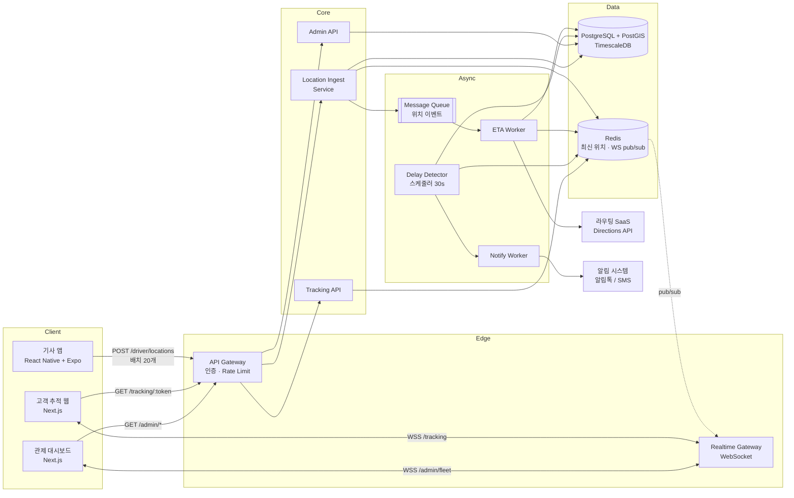
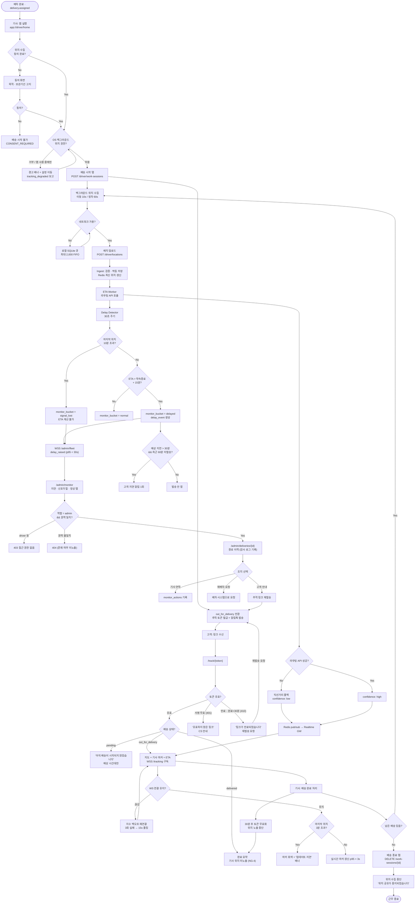

# PRD — 실시간 배송 추적 (Realtime Delivery Tracking)

> **Type**: `product-feature`
> **Version**: 1.0
> **Last Updated**: 2026-08-03
> **Status**: Draft (검증 대기)

---

## 1. Overview

### 1.1 Problem Statement

현재 배송 진행 상황은 기사가 앱에서 수동으로 찍는 **상태 전이 이벤트(집화 / 배송중 / 완료)** 로만 파악된다. 그 사이 구간은 완전한 공백이다.

이 공백이 만드는 문제:

| 이해관계자 | 현재 문제 | 관측 지표 |
|---|---|---|
| 고객 | "배송중" 이후 언제 오는지 알 수 없어 부재중 발생 | 1차 배송 실패율 8.4%, 재배송 건당 원가 3,200원 |
| 고객 | 위치를 알 수 없어 CS로 문의 | "지금 어디쯤인가요" 문의가 전체 인바운드 CS의 41% |
| 관리자 | 지연을 **고객이 항의한 뒤에** 인지 | 지연 인지 시점 평균 = 약속시간 + 52분 |
| 기사 | 같은 질문에 전화로 반복 응대 | 기사 1인당 일 평균 통화 11건 |

즉 **위치 데이터가 없어서 생기는 문제가 아니라, 기사 단말이 이미 알고 있는 위치를 고객·관리자에게 전달하는 경로가 없어서** 생기는 문제다.

### 1.2 Goals

| # | 목표 | 성공 기준 (출시 후 8주) |
|---|---|---|
| G-1 | 고객이 배송 기사의 현재 위치와 도착 예정 시각을 스스로 확인 | 추적 링크 열람률 ≥ 55%, 위치 문의 CS 41% → 15% 이하 |
| G-2 | 관리자가 지연을 고객보다 먼저 인지 | 지연 인지 시점을 약속시간 **-10분**(사전 감지)으로 이동, 사전 감지율 ≥ 80% |
| G-3 | 기사의 추가 조작 없이 위치가 수집 | 기사 추가 탭 0회, 배송 1건당 앱 소비 배터리 증가분 ≤ 4%p |
| G-4 | 부재중으로 인한 재배송 감소 | 1차 배송 실패율 8.4% → 6.0% 이하 |

### 1.3 Non-Goals

명시적으로 이번 범위 밖이다. 요청이 들어와도 별도 PRD로 분리한다.

| # | 제외 항목 | 이유 |
|---|---|---|
| NG-1 | 배차·경로 최적화 알고리즘 (TSP/VRP) | 본 기능은 **관측**이지 **최적화**가 아니다. 기존 배차 시스템의 출력을 입력으로 받는다 |
| NG-2 | 고객 ↔ 기사 실시간 채팅·통화 | 별도 커뮤니케이션 PRD. 이번엔 단방향 위치 전달만 |
| NG-3 | 기사 근태·급여 정산에 위치 데이터 활용 | 노무 이슈 및 개인정보 목적 외 이용. §4.3에서 기술적으로 차단 |
| NG-4 | 배송 완료 후 위치 이력 고객 공개 | 개인정보 최소 노출 원칙 (기사의 다음 배송지 노출 위험) |
| NG-5 | 기사 위치 상시(비근무 시간) 추적 | 근무 세션 내에서만 수집. §4.5 |
| NG-6 | 실시간 영상·라이브 스트리밍 | 대역폭·프라이버시 비용 대비 효용 없음 |
| NG-7 | 다국어(i18n) 지원 | v1은 ko-KR 단일. 문자열 외부화만 준비 |
| NG-8 | 기사 앱 신규 개발 | **기존 기사 앱에 기능을 추가**한다. 앱 자체 리라이트 아님 |

### 1.4 Scope

**포함**

- 기사 앱(React Native)의 백그라운드 위치 수집·배치 업로드·오프라인 큐잉
- 위치 인입 API 및 위치 시계열 저장소
- ETA 계산 파이프라인 및 지연 판정 규칙 엔진
- 고객용 추적 웹페이지 (비로그인, 서명 토큰 링크)
- 관리자 관제 대시보드 (지연 건 모니터링)
- 실시간 전달 채널 (WebSocket + 폴백)
- 위치 수집 동의 획득 및 철회 플로우

**제외**

- 기존 배차 시스템의 로직 변경 (읽기 전용 연동)
- 정산·급여 시스템 연동
- 고객 앱 (v1은 웹 링크만; 카카오 알림톡/SMS로 발송)
- 오프라인 배송장(운송장) 출력 시스템

**경계 (인접 시스템과의 계약)**

| 인접 시스템 | 방향 | 계약 |
|---|---|---|
| 배차 시스템 | in | `delivery.assigned` 이벤트로 배송건·기사 매핑 수신 |
| 알림 시스템 | out | 추적 링크 발송 요청 (알림톡 → SMS 폴백) |
| 주문 시스템 | in | 주소·약속시간(배송 희망 시간대) 조회 |
| 지도/라우팅 SaaS | out | ETA 계산용 Directions API 호출 |

---

## 2. User Stories

### 2.1 Primary User

**US-1 (driver)**
As a **배송 기사**, I want to **배송을 시작하면 별도 조작 없이 내 위치가 자동으로 공유되고, 지하 주차장처럼 신호가 끊긴 곳을 지나도 나중에 알아서 전송되기를** so that **고객 전화 응대에 시간을 쓰지 않고 배송에만 집중할 수 있다.**

**US-2 (driver)**
As a **배송 기사**, I want to **오늘 근무가 끝나면 위치 공유가 확실히 중단되는 것을 앱에서 눈으로 확인하기를** so that **퇴근 후 사생활이 추적되지 않는다고 신뢰할 수 있다.**

**US-3 (customer)**
As a **고객**, I want to **문자로 받은 링크를 눌러 로그인 없이 지도에서 기사 위치와 도착 예정 시각을 보기를** so that **집에서 기다릴지 잠깐 나갔다 올지 판단할 수 있다.**

**US-4 (customer)**
As a **고객**, I want to **도착 예정 시각이 크게 늦어지면 별도로 알림을 받기를** so that **계속 앱을 켜두고 확인하지 않아도 된다.**

**US-5 (admin)**
As a **관제 관리자**, I want to **약속시간을 넘길 것으로 예측되는 배송 건이 실시간으로 목록 상단에 올라오기를** so that **고객이 항의하기 전에 기사에게 연락하거나 재배차할 수 있다.**

**US-6 (admin)**
As a **관제 관리자**, I want to **위치 신호가 끊긴 기사를 지연 건과 구분해서 보기를** so that **"늦는 것"과 "단말 문제"에 다른 조치를 취할 수 있다.**

### 2.2 Acceptance Criteria

정상 경로뿐 아니라 **실패·만료·권한부족·프라이버시** 시나리오를 포함한다.

#### AC-1 기사 위치 수집 시작 (US-1, 정상)

```gherkin
Given 기사 "김기사"가 위치 권한을 "항상 허용"으로 부여했고
  And 오늘 배정된 배송건 12개가 있고
  And 근무 세션이 시작되지 않은 상태에서
When 기사가 "배송 시작" 버튼을 탭하면
Then 근무 세션(work_session)이 생성되고
  And 백그라운드 위치 수집이 시작되며
  And 앱 상단에 "위치 공유 중" 지속 표시가 나타나고
  And 첫 위치 포인트가 10초 이내에 서버로 전송된다
```

#### AC-2 이동 상태에 따른 수집 주기 전환 (US-1, 배터리)

```gherkin
Given 근무 세션이 활성 상태이고
When 기사의 이동 속도가 5분 이상 1km/h 미만으로 유지되면
Then 위치 수집 주기가 10초에서 60초로 전환되고
  And 관리자 대시보드의 해당 기사 상태가 "정차"로 표시된다

Given 위치 수집 주기가 60초(정차)인 상태에서
When 직전 전송 위치로부터 50m 이상 이동이 감지되면
Then 수집 주기가 즉시 10초로 복귀한다
```

#### AC-3 오프라인 구간 큐잉 후 복구 (US-1, 실패 시나리오)

```gherkin
Given 근무 세션이 활성 상태이고
When 기사 단말이 지하 주차장에 진입해 네트워크가 8분간 끊기면
Then 수집된 위치 포인트는 단말 로컬 큐에 최대 2,000개까지 순서대로 적재되고
  And 앱은 사용자에게 오류 팝업을 띄우지 않으며
  And 네트워크 복구 시 60초 이내에 큐가 시간순 배치로 업로드되고
  And 서버는 중복 포인트를 (device_id, captured_at) 기준으로 멱등 처리해 1건만 저장한다

Given 로컬 큐가 2,000개 상한에 도달하면
When 새 위치 포인트가 수집되면
Then 가장 오래된 포인트부터 폐기(FIFO)하고
  And 폐기 건수를 다음 업로드 요청 헤더에 담아 서버가 관측할 수 있게 한다
```

#### AC-4 위치 권한 거부·철회 (US-2, 권한부족)

```gherkin
Given 기사가 OS 위치 권한을 "앱 사용 중에만"으로 변경했고
When 앱이 백그라운드로 전환되면
Then 앱은 위치 수집이 불가함을 감지하고
  And 서버에 tracking_degraded 상태를 보고하며
  And 기사에게 "백그라운드 위치 권한이 필요합니다" 안내와 설정 이동 버튼을 노출하고
  And 관리자 대시보드의 해당 기사에 "신호 불량(권한)" 배지가 표시된다

Given 근무 세션이 활성 상태에서
When 기사가 "배송 종료"를 탭하면
Then 위치 수집이 즉시 중단되고
  And 앱에 "위치 공유가 중지되었습니다" 확인 화면이 표시되며
  And 이후 서버는 해당 기사의 신규 위치 포인트를 403으로 거부한다
```

#### AC-5 고객 추적 링크 열람 (US-3, 정상)

```gherkin
Given 배송건 "D-20260803-001"이 out_for_delivery 상태이고
  And 고객이 알림톡으로 받은 서명 추적 링크를 보유한 상태에서
When 고객이 링크를 열면
Then 로그인 없이 지도가 표시되고
  And 기사의 최근 위치 마커, 배송지 마커, 도착 예정 시각(ETA), 남은 배송 순번이 보이며
  And 지도 초기 렌더링이 2.5초(p95) 이내에 완료되고
  And 이후 위치는 WebSocket으로 푸시되어 3초(p95) 이내에 마커가 갱신된다
```

#### AC-6 추적 링크 만료·상태 불일치 (US-3, 만료)

```gherkin
Given 배송건이 delivered 상태로 전환된 지 30분이 지났고
When 고객이 추적 링크를 열면
Then 지도와 기사 위치는 표시되지 않고
  And "배송이 완료되었습니다 (2026-08-03 14:22)" 완료 요약만 표시된다

Given 추적 토큰의 서명이 유효하지 않거나 exp가 지난 경우
When 고객이 링크를 열면
Then HTTP 410 Gone과 함께 "링크가 만료되었습니다" 화면이 표시되고
  And 재발송 요청 버튼이 노출된다

Given 배송건이 아직 pending(집화 전) 상태인 경우
When 고객이 추적 링크를 열면
Then 기사 위치는 표시되지 않고
  And "아직 배송이 시작되지 않았습니다" 안내와 예상 배송 시간대만 표시된다
```

#### AC-7 신호 두절 시 고객 화면 (US-3, 실패 시나리오)

```gherkin
Given 고객이 추적 화면을 보고 있고
When 기사의 마지막 위치 수신 후 3분이 경과하면
Then 마커가 회색 반투명으로 바뀌고
  And "위치 업데이트가 지연되고 있습니다 (마지막 확인: 3분 전)" 배너가 표시되며
  And 마지막 알려진 위치는 계속 표시된다

Given WebSocket 연결이 끊어지면
When 클라이언트가 재연결을 시도하면
Then 지수 백오프(1s, 2s, 4s, 8s, 최대 30s)로 재시도하고
  And 3회 연속 실패 시 15초 주기 HTTP 폴링으로 폴백하며
  And 폴백 중에도 화면은 정상 동작한다
```

#### AC-8 지연 감지 및 관리자 알림 (US-5, 정상)

```gherkin
Given 배송건의 약속 시간대 종료 시각이 15:00이고
When ETA 재계산 결과가 15:16 이상으로 산출되면
Then 해당 배송건이 delayed로 마킹되고
  And 관리자 대시보드 "지연" 목록 상단에 30초 이내에 나타나며
  And 지연 사유 후보(교통 / 앞 배송 지체 / 신호 두절)와 예상 지연 분(분 단위)이 함께 표시된다

Given 배송건이 delayed로 마킹된 후
When ETA가 다시 15:00 이전으로 회복되면
Then 지연 마킹이 해제되고
  And delay_event에 resolved_at이 기록된다
```

#### AC-9 신호 두절과 지연의 구분 (US-6, 실패 시나리오)

```gherkin
Given 기사의 마지막 위치 수신 후 10분이 경과했고
When 관리자가 대시보드를 보면
Then 해당 배송건은 "지연" 목록이 아닌 "신호 두절" 목록으로 분류되고
  And ETA는 "계산 불가"로 표시되며
  And 마지막 알려진 위치와 경과 시간이 함께 표시된다
```

#### AC-10 관리자 권한 부족 (US-5, 권한부족)

```gherkin
Given 사용자가 driver 역할로 인증된 상태에서
When 관리자 대시보드 API(/api/v1/admin/*)를 호출하면
Then HTTP 403 Forbidden과 code=FORBIDDEN_ROLE이 반환되고
  And 감사 로그에 (user_id, endpoint, denied_at)이 기록된다

Given 관리자가 자신의 소속 권역(region) 외 배송건을 조회하면
When 조회를 시도하면
Then 해당 건은 목록에서 제외되고 단건 조회 시 404를 반환한다 (존재 여부 자체를 노출하지 않는다)
```

#### AC-11 기사 위치 프라이버시 경계 (US-2, 프라이버시)

```gherkin
Given 기사가 배송건 A를 완료하고 배송건 B로 이동 중인 상태에서
When 배송건 A의 고객이 추적 링크를 열면
Then 기사의 현재 위치는 노출되지 않는다 (AC-6의 완료 요약만 표시)

Given 고객 추적 API가 위치를 반환할 때
When 응답을 생성하면
Then 기사의 실명·연락처·차량번호는 포함하지 않고
  And 마스킹된 이름("김*사")과 배송 순번만 포함한다
```

### 2.3 User Roles

| Role Key | 한국어 명칭 | 권한 범위 |
|---|---|---|
| `driver` | 배송 기사 | 자신의 근무 세션 시작/종료, 자신의 위치 포인트 업로드, 자신에게 배정된 배송건 조회·상태 전이. 타인 위치·관리자 API 접근 불가 |
| `customer` | 고객 (수령인) | 유효한 서명 추적 토큰이 가리키는 **단일 배송건**의 기사 위치·ETA 조회. 인증 계정 없음. 쓰기 권한 없음 |
| `admin` | 관제 관리자 | 소속 권역(region) 내 전체 배송건·기사 위치 실시간 조회, 지연 목록 모니터링, 추적 링크 재발송. 위치 원본 이력 조회는 감사 로그 기록 후 허용 |
| `system` | 내부 서비스 | ETA 계산 워커·지연 판정 스케줄러·알림 발송 워커. mTLS 서비스 계정. 사용자 대면 API 접근 불가 |

---

## 3. Functional Requirements

| ID | Requirement | Priority | Dependencies |
|---|---|---|---|
| FR-001 | `driver`는 "배송 시작"으로 근무 세션을 생성하고, "배송 종료"로 종료한다. 세션이 종료되면 서버는 해당 기사의 위치 업로드를 403으로 거부한다 | P0 | — |
| FR-002 | 기사 앱은 근무 세션 활성 시에만 백그라운드 위치를 수집한다. 이동 중 10초, 정차(5분간 <1km/h) 시 60초 주기, 거리 필터 30m | P0 | FR-001 |
| FR-003 | 기사 앱은 위치 포인트를 최대 20개 배치로 묶어 업로드한다. 배치 전송 간격은 최대 30초를 넘지 않는다 | P0 | FR-002 |
| FR-004 | 기사 앱은 네트워크 단절 시 위치 포인트를 로컬 큐(SQLite)에 최대 2,000개 FIFO로 적재하고, 복구 시 시간순 배치 업로드한다 | P0 | FR-003 |
| FR-005 | 위치 인입 API는 `(device_id, captured_at)` 유니크 제약으로 중복 업로드를 멱등 처리한다 | P0 | FR-003 |
| FR-006 | 위치 인입 API는 위경도 범위·정확도(accuracy ≤ 200m)·미래 시각(captured_at > now+60s)·순간 이동(직전 대비 300km/h 초과)을 검증하고 위반 포인트를 거부 대신 `rejected` 플래그로 저장한다 | P0 | FR-005 |
| FR-007 | 시스템은 배송건이 `out_for_delivery`로 전환될 때 서명된 추적 토큰(JWT, exp = 예상 완료 + 6h)을 발급하고 알림 시스템에 발송 요청한다 | P0 | FR-001 |
| FR-008 | `customer`는 추적 토큰으로 로그인 없이 해당 배송건의 기사 최근 위치·ETA·남은 순번을 조회한다 | P0 | FR-007 |
| FR-009 | 고객 추적 화면은 WebSocket으로 위치 갱신을 수신하고, 연결 실패 시 15초 HTTP 폴링으로 폴백한다 | P0 | FR-008 |
| FR-010 | 고객 추적 응답은 기사 실명·연락처·차량번호를 포함하지 않고 마스킹된 이름만 포함한다 | P0 | FR-008 |
| FR-011 | 배송건이 `delivered`/`failed`로 전환되고 30분이 지나면 추적 토큰을 무효화하고 위치 노출을 중단한다 | P0 | FR-007 |
| FR-012 | ETA 워커는 기사 현재 위치·남은 배송 순번·라우팅 API 결과로 배송건별 ETA를 계산한다. 재계산 트리거는 (a) 위치 배치 수신, (b) 앞선 배송 완료, (c) 3분 경과 중 먼저 오는 것 | P0 | FR-005 |
| FR-013 | 라우팅 API 호출 실패 시 ETA는 직선거리 ÷ 권역별 평균 실주행 속도로 폴백 계산하고, 응답에 `eta_confidence: low`를 표기한다 | P1 | FR-012 |
| FR-014 | 지연 판정 엔진은 `ETA > 약속시간대 종료 + 15분`이면 배송건을 `delayed`로 마킹하고 `delay_event`를 생성한다. ETA 회복 시 해제하고 `resolved_at`을 기록한다 | P0 | FR-012 |
| FR-015 | 마지막 위치 수신 후 10분이 경과하면 배송건을 `signal_lost`로 분류한다. `signal_lost`는 `delayed`와 배타적이며 별도 목록으로 노출된다 | P0 | FR-012 |
| FR-016 | `admin`은 관제 대시보드에서 소속 권역 내 배송건을 `지연 / 신호두절 / 정상` 탭으로 조회하고, 기사·권역·약속시간대로 필터링한다 | P0 | FR-014, FR-015 |
| FR-017 | 관제 대시보드는 지연 발생 시 30초 이내에 목록을 갱신한다 (WebSocket 푸시) | P0 | FR-016 |
| FR-018 | `admin`은 대시보드에서 배송건의 기사 실시간 위치를 지도로 확인하고, 추적 링크를 고객에게 재발송한다 | P1 | FR-016 |
| FR-019 | 예상 지연이 30분을 초과하면 고객에게 지연 알림을 1회 발송한다. 동일 배송건 재발송은 최소 60분 간격 (알림 폭주 방지) | P1 | FR-014 |
| FR-020 | 기사 앱은 위치 수집 동의를 최초 1회 획득하고, 설정 화면에서 동의 철회를 제공한다. 철회 시 근무 세션이 즉시 종료된다 | P0 | FR-001 |
| FR-021 | 기사 앱은 위치 공유 중임을 지속적 알림(포그라운드 서비스 / iOS 파란 인디케이터)으로 항상 노출한다 | P0 | FR-002 |
| FR-022 | 위치 원본 이력에 대한 `admin` 조회는 조회자·대상·시각·사유를 감사 로그에 기록한다 | P1 | FR-016 |
| FR-023 | 관제 대시보드에서 지연 건에 대해 기사 연락 / 고객 안내 / 재배차 요청 중 하나의 조치를 기록한다 (조치 이력은 배송건에 남는다) | P2 | FR-016 |
| FR-024 | 기사 앱은 세션당 배터리 소모를 측정해 익명 텔레메트리로 보고한다 (G-3 검증용) | P2 | FR-002 |

**무모순 확인**: FR-008(고객 비로그인 조회)은 "익명 공개"가 아니라 **서명 토큰 기반 인가**다. §4.5의 "모든 위치 조회는 인가된 주체만"과 충돌하지 않는다. FR-014(`delayed`)와 FR-015(`signal_lost`)는 배타적 상태로 명시되어 이중 계상되지 않는다.

---

## 4. Non-Functional Requirements

### 4.0 Scale Grade

**`Startup`**

근거: 목표 DAU는 고객 추적 열람 기준 약 8,000명(일 배송 15,000건 × 열람률 55%)으로 1,000~10,000 구간에 해당한다. 동시 운행 기사는 피크 300명, 동시 추적 세션 피크 3,000이다.

용량 산정 (피크 기준):

| 항목 | 산정 | 값 |
|---|---|---|
| 위치 포인트 인입 | 기사 300명 × 6포인트/분 | 30 points/s (배치 후 ≈ 3 req/s) |
| 설계 여유 | 피크 대비 3× | 90 points/s |
| 동시 WebSocket 연결 | 고객 3,000 + 관리자 30 | 3,030 |
| 위치 저장량 | 30/s × 86,400 × 200B | ≈ 520 MB/일 |
| 라우팅 API 호출 | 배송건 15,000 × 재계산 12회 | 180,000 calls/일 |

### 4.1 Performance

정량 목표. 모든 값은 프로덕션 APM 기준으로 측정한다.

| ID | 지표 | 목표 | 측정 지점 |
|---|---|---|---|
| P-1 | 위치 배치 업로드 API 응답 | p95 < 200ms, p99 < 500ms | 서버 인입 → 응답 |
| P-2 | 위치 수집 → 고객 화면 마커 반영 | **p95 < 3s**, p99 < 8s | 단말 `captured_at` → 브라우저 렌더 |
| P-3 | 고객 추적 페이지 초기 로딩 (LCP) | p95 < 2.5s (4G, 중급 안드로이드) | RUM |
| P-4 | 관제 대시보드 목록 조회 | p95 < 500ms (500건 기준) | 서버 |
| P-5 | 지연 발생 → 대시보드 반영 | **p95 < 30s** | 판정 시각 → WS 수신 |
| P-6 | ETA 재계산 처리량 | ≥ 100 계산/s (워커 3대) | 워커 큐 |
| P-7 | WebSocket 동시 연결 | 5,000 (설계 상한), 3,030(피크)에서 CPU < 60% | 부하 테스트 |
| P-8 | 위치 인입 처리량 | 90 points/s에서 P-1 목표 유지 | 부하 테스트 |
| P-9 | 기사 앱 배터리 | 8시간 근무 세션 중 앱 기여 소모 ≤ 12% | 단말 텔레메트리 (FR-024) |
| P-10 | 기사 앱 위치 업로드 데이터 사용량 | ≤ 15MB / 8시간 세션 | 단말 텔레메트리 |

### 4.2 Availability

| 항목 | 목표 |
|---|---|
| 위치 인입 API | 99.9% (월 다운타임 ≤ 43분) — 최우선. 데이터 유실은 복구 불가 |
| 고객 추적 페이지 | 99.5% (월 ≤ 3.6시간) |
| 관제 대시보드 | 99.5% |
| ETA 계산 워커 | 99.0% (지연 허용, 유실 불가) |

**부분 장애 시 동작 (Graceful Degradation)**

| 장애 | 동작 |
|---|---|
| WebSocket 게이트웨이 다운 | 클라이언트가 15초 HTTP 폴링으로 자동 폴백. 기능 유지, 지연만 증가 |
| 라우팅 SaaS 장애 | FR-013 직선거리 폴백. ETA에 `confidence: low` 표기, 지연 판정 임계값을 15분 → 25분으로 완화 |
| ETA 워커 다운 | 위치는 계속 수집·표시. ETA는 마지막 계산값 + "갱신 중" 표기. 위치 표시 자체는 영향 없음 |
| 위치 DB 쓰기 장애 | 인입 API가 메시지 큐로 버퍼링(최대 30분). 단말은 성공 응답을 받아 로컬 큐를 비우지 않도록 202 Accepted 반환 |
| 인입 API 전면 장애 | 단말 로컬 큐(2,000개 = 정상 주기로 약 5.5시간)가 흡수. 복구 시 자동 업로드 |
| 알림 시스템 장애 | 추적 링크 발송 재시도 큐(최대 3회, 지수 백오프). 고객은 기존 배송 조회 페이지에서 링크 획득 가능 |

### 4.3 Data

| 데이터 | 보관 기간 | 근거 / 처리 |
|---|---|---|
| 위치 원본 (`driver_locations`) | **90일** | 배송 분쟁 대응 기간. 이후 자동 하드 삭제 (파티션 DROP) |
| 위치 집계 (배송건별 경로 요약 · 거리 · 소요시간) | 3년 | 개인 식별 제거 후 통계 목적. 위경도 제거, 거리/시간만 |
| ETA 스냅샷 | 90일 | 위치 원본과 동일 주기 |
| `delay_event` | 3년 | SLA 리포팅. 위경도 미포함 |
| 추적 토큰 | 배송 완료 + 30분 | FR-011 |
| 감사 로그 (FR-022) | 3년 | 개인정보 접근 이력 법정 보관 |

**개인정보 처리 (개인정보보호법 / 위치정보법 준수)**

- 기사 위치는 **위치정보법상 개인위치정보**다. FR-020의 사전 동의 없이 수집하지 않는다
- 수집 목적을 "배송 상태 고객 안내 및 관제"로 한정한다. NG-3(근태·급여 활용)은 **DB 레벨에서 차단** — 정산 시스템 서비스 계정에 `driver_locations` 조회 권한을 부여하지 않는다
- 고객에게는 기사 위치를 **실시간 최근 1개 포인트만** 노출한다. 경로 이력·과거 위치는 노출하지 않는다
- 기사는 언제든 동의를 철회할 수 있고(FR-020), 철회 시 이후 수집이 중단된다. 이미 수집된 데이터는 90일 주기로 삭제된다
- 기사 위치 데이터 파기 요청 시 30일 이내 처리

### 4.4 Recovery

| 항목 | 목표 |
|---|---|
| RTO | 위치 인입 API **1시간**, 그 외 4시간 |
| RPO | **5분** (위치 DB 스트리밍 복제 + 5분 주기 스냅샷) |
| 실질 RPO 보정 | 단말 로컬 큐가 최대 5.5시간분을 보유하므로, RPO 초과 유실분도 단말 재업로드로 상당 부분 복구된다 |
| 백업 | 일 1회 전체 + 5분 WAL. 복구 리허설 분기 1회 |

### 4.5 Security

**인증 방식**

| 주체 | 방식 | 세부 |
|---|---|---|
| `driver` | OAuth2 + JWT (access 30분 / refresh 30일) | 기기 바인딩(`device_id`). 다른 기기 로그인 시 기존 세션 무효화 |
| `admin` | 세션 쿠키(HttpOnly, Secure, SameSite=Lax) + **MFA 필수** | 위치 정보 접근 권한이므로 MFA 강제 |
| `customer` | 서명 추적 토큰(JWT, HS256) | 클레임: `delivery_id`, `exp`, `jti`. 계정 없음. 재사용 가능하나 만료·무효화 대상 |
| `system` | mTLS 서비스 계정 | 사용자 대면 API 접근 불가 |

**인가 규칙 (어느 역할이 어느 리소스에)**

| 리소스 | `driver` | `customer` | `admin` | `system` |
|---|---|---|---|---|
| `POST /driver/work-sessions` | 본인만 | ✗ | ✗ | ✗ |
| `POST /driver/locations` | 활성 세션 보유 본인만 | ✗ | ✗ | ✗ |
| 배송건 상태 전이 | 배정된 건만 | ✗ | 권역 내 (재배차) | ✗ |
| 기사 실시간 위치 (최근 1건) | 본인 | 토큰이 가리키는 배송건의 담당 기사만, **배송 진행 중에 한해** | 권역 내 전체 | 읽기 |
| 기사 위치 **이력** | 본인 | ✗ (NG-4) | 권역 내, **감사 로그 기록 조건부** | 읽기 |
| `/admin/*` | ✗ (403) | ✗ (403) | 소속 권역만 | ✗ |
| 권역 외 배송건 단건 조회 | ✗ | ✗ | **404** (존재 여부 미노출) | — |

**전송·저장 보호**

- 전송: TLS 1.3 필수. 기사 앱은 인입 API 도메인에 **인증서 피닝** 적용
- 저장: 위치 테이블 컬럼 암호화(AES-256-GCM, KMS 관리 키), 디스크 레벨 암호화
- 추적 토큰 서명 키는 KMS 보관, 90일 주기 회전(회전 시 이전 키 24시간 병행 검증)
- 로그·APM에 위경도 원본을 남기지 않는다 (좌표는 소수점 2자리로 절삭 후 기록)

**입력 검증**

- 위경도: `-90 ≤ lat ≤ 90`, `-180 ≤ lng ≤ 180`, 대한민국 바운딩박스 밖은 `rejected` 플래그
- `accuracy`: > 200m는 `rejected` 플래그 (저장은 하되 ETA 계산에서 제외)
- `captured_at`: `now + 60s` 초과 또는 `now - 24h` 미만 거부
- 순간 이동: 직전 포인트 대비 환산 속도 300km/h 초과 시 `rejected` 플래그
- 배치 크기: 요청당 최대 100포인트, 본문 최대 256KB
- Rate limit: 기사당 위치 업로드 10 req/min, 추적 토큰당 조회 60 req/min, 관리자 API 300 req/min

**남용 방지**

- 추적 토큰 `jti` 기준 동시 활성 WS 연결 3개 제한 (링크 유출 시 확산 억제)
- 추적 토큰 조회 IP가 1시간 내 20개 초과 시 알림 + 토큰 무효화 후보 등록

---

## 5. Technical Design

### 5.1 API Specification

Base: `https://api.{domain}/v1` · 인증 헤더: `Authorization: Bearer {token}` · 오류 본문 공통 형식:

```json
{ "error": { "code": "STRING_CODE", "message": "사람이 읽는 설명", "details": {} } }
```

---

#### 5.1.1 `POST /driver/work-sessions` — 근무 세션 시작 (FR-001)

**인가 주체**: `driver` (본인)

Request
```json
{
  "device_id": "d3f1a2b4-...",
  "started_at": "2026-08-03T08:30:00+09:00",
  "consent_version": "loc-consent-v2",
  "app_version": "3.4.1",
  "os": "android-14"
}
```

Response `201 Created`
```json
{
  "session_id": "ws_01J8...",
  "driver_id": "drv_1023",
  "status": "active",
  "started_at": "2026-08-03T08:30:00+09:00",
  "assigned_delivery_count": 12,
  "upload_policy": { "batch_max": 20, "interval_moving_sec": 10, "interval_idle_sec": 60, "distance_filter_m": 30 }
}
```

Error

| Code | HTTP | 조건 |
|---|---|---|
| `CONSENT_REQUIRED` | 403 | `consent_version`이 현행 동의 버전과 불일치 (FR-020) |
| `SESSION_ALREADY_ACTIVE` | 409 | 활성 세션 존재. `details.session_id` 반환 |
| `DEVICE_MISMATCH` | 403 | JWT에 바인딩된 `device_id`와 불일치 |
| `NO_ASSIGNED_DELIVERY` | 422 | 배정 배송건 0건 |

---

#### 5.1.2 `DELETE /driver/work-sessions/{session_id}` — 근무 세션 종료 (FR-001)

**인가 주체**: `driver` (세션 소유자 본인)

Response `200 OK`
```json
{ "session_id": "ws_01J8...", "status": "ended", "ended_at": "2026-08-03T18:12:00+09:00", "uploaded_points": 2841, "dropped_points": 0 }
```

Error: `SESSION_NOT_FOUND` 404 · `FORBIDDEN_OWNER` 403 (타인 세션) · `ALREADY_ENDED` 409

---

#### 5.1.3 `POST /driver/locations` — 위치 배치 업로드 (FR-003, FR-005, FR-006)

**인가 주체**: `driver` — **활성 근무 세션 보유자 본인만**

Request
```json
{
  "session_id": "ws_01J8...",
  "device_id": "d3f1a2b4-...",
  "dropped_count": 0,
  "points": [
    { "captured_at": "2026-08-03T09:12:03+09:00", "lat": 37.5012, "lng": 127.0396, "accuracy_m": 12.4, "speed_kmh": 34.2, "heading": 178.0, "battery_pct": 78 },
    { "captured_at": "2026-08-03T09:12:13+09:00", "lat": 37.5008, "lng": 127.0401, "accuracy_m": 9.8, "speed_kmh": 31.0, "heading": 180.0, "battery_pct": 78 }
  ]
}
```

Response `202 Accepted`
```json
{
  "accepted": 2,
  "duplicated": 0,
  "rejected": [],
  "server_time": "2026-08-03T09:12:15+09:00",
  "next_upload_policy": { "interval_sec": 10 }
}
```

`rejected` 항목 예시: `{ "captured_at": "...", "reason": "ACCURACY_TOO_LOW" }`

Error

| Code | HTTP | 조건 |
|---|---|---|
| `SESSION_INACTIVE` | 403 | 종료된 세션으로 업로드 (AC-4) |
| `BATCH_TOO_LARGE` | 413 | 100포인트 또는 256KB 초과 |
| `INVALID_COORDINATE` | 400 | 위경도 범위 위반 |
| `RATE_LIMITED` | 429 | 10 req/min 초과. `Retry-After` 헤더 포함 |
| `SERVICE_DEGRADED` | 202 | DB 장애 시 큐 버퍼링. 단말은 성공으로 처리 (§4.2) |

> `202`를 쓰는 이유: 단말이 로컬 큐를 비워도 안전하다는 계약을 유지하면서, 서버 내부 처리는 비동기로 분리한다.

---

#### 5.1.4 `GET /tracking/{tracking_token}` — 고객 추적 조회 (FR-008, FR-010)

**인가 주체**: `customer` — 서명 토큰 검증. `Authorization` 헤더 불필요

Response `200 OK`
```json
{
  "delivery_id": "D-20260803-001",
  "status": "out_for_delivery",
  "driver": { "masked_name": "김*사", "vehicle_type": "1톤 트럭" },
  "driver_location": { "lat": 37.5008, "lng": 127.0401, "heading": 180.0, "captured_at": "2026-08-03T09:12:13+09:00", "staleness_sec": 7 },
  "destination": { "lat": 37.4979, "lng": 127.0276, "address_summary": "서울 강남구 테헤란로 …" },
  "eta": { "arrival_at": "2026-08-03T09:34:00+09:00", "confidence": "high", "remaining_stops": 3, "remaining_distance_m": 2140 },
  "promised_window": { "start": "2026-08-03T09:00:00+09:00", "end": "2026-08-03T11:00:00+09:00" },
  "is_delayed": false,
  "realtime": { "ws_url": "wss://rt.{domain}/tracking?t=…", "poll_interval_sec": 15 }
}
```

상태별 축약 응답: `pending` → `driver_location`·`eta` 필드 생략 + `message` (AC-6) · `delivered` → 완료 요약만 (AC-6) · `signal_lost` → `eta.confidence: "unavailable"` + `driver_location.staleness_sec` (AC-7)

Error

| Code | HTTP | 조건 |
|---|---|---|
| `TOKEN_EXPIRED` | 410 | `exp` 경과 또는 완료 +30분 (FR-011, AC-6) |
| `TOKEN_INVALID` | 401 | 서명 검증 실패 |
| `TOKEN_REVOKED` | 410 | 남용 탐지로 무효화 |
| `RATE_LIMITED` | 429 | 60 req/min 초과 |

---

#### 5.1.5 `WSS /tracking?t={tracking_token}` — 고객 실시간 채널 (FR-009)

**인가 주체**: `customer` — 핸드셰이크 시 토큰 검증. 실패 시 close code `4401`

Server → Client 메시지

```json
{ "type": "location", "data": { "lat": 37.5008, "lng": 127.0401, "heading": 180.0, "captured_at": "…" } }
{ "type": "eta",      "data": { "arrival_at": "…", "confidence": "high", "remaining_stops": 3 } }
{ "type": "status",   "data": { "status": "delivered", "completed_at": "…" } }
{ "type": "stale",    "data": { "staleness_sec": 195 } }
```

- 하트비트: 서버 ping 30초, 클라이언트 pong 미응답 2회 시 close
- Close codes: `4401` 인증 실패 · `4410` 토큰 만료 · `4429` 동시 연결 3개 초과(§4.5) · `1013` 서버 과부하(폴백 유도)

---

#### 5.1.6 `GET /admin/deliveries` — 관제 목록 (FR-016)

**인가 주체**: `admin` — **소속 `region` 내로 결과 강제 필터링** (쿼리 파라미터로 우회 불가)

Request (query)

| 파라미터 | 타입 | 기본값 | 설명 |
|---|---|---|---|
| `bucket` | enum | `delayed` | `delayed` \| `signal_lost` \| `normal` \| `all` |
| `driver_id` | string | — | 기사 필터 |
| `window_start`, `window_end` | ISO8601 | 오늘 | 약속시간대 필터 |
| `sort` | enum | `delay_minutes_desc` | `delay_minutes_desc` \| `eta_asc` |
| `cursor`, `limit` | string, int | —, 50 | 커서 페이지네이션 (limit 최대 200) |

Response `200 OK`
```json
{
  "summary": { "delayed": 14, "signal_lost": 3, "normal": 482, "total": 499 },
  "items": [
    {
      "delivery_id": "D-20260803-118",
      "bucket": "delayed",
      "driver": { "id": "drv_1023", "name": "김기사", "phone": "010-****-1234" },
      "promised_window": { "start": "…", "end": "2026-08-03T15:00:00+09:00" },
      "eta": { "arrival_at": "2026-08-03T15:41:00+09:00", "confidence": "high" },
      "delay_minutes": 41,
      "delay_reason_hint": "traffic",
      "last_location": { "lat": 37.5008, "lng": 127.0401, "captured_at": "…", "staleness_sec": 22 },
      "action_taken": null
    }
  ],
  "next_cursor": "eyJ…"
}
```

Error: `FORBIDDEN_ROLE` 403 (AC-10) · `MFA_REQUIRED` 403 · `INVALID_CURSOR` 400

---

#### 5.1.7 `GET /admin/deliveries/{delivery_id}` — 관제 단건 (FR-018)

**인가 주체**: `admin` (소속 권역 내). **권역 외는 403이 아닌 `404 NOT_FOUND`** — 존재 여부 자체를 노출하지 않는다 (AC-10)

Response `200 OK` — 5.1.6 item + `route_history`(최근 30분 위경도 배열, 조회 시 감사 로그 기록 FR-022) + `eta_history`(최근 10건) + `delay_events`

---

#### 5.1.8 `POST /admin/deliveries/{delivery_id}/resend-tracking-link` — 링크 재발송 (FR-018)

**인가 주체**: `admin` (소속 권역 내)

Request `{ "channel": "alimtalk" }` (`alimtalk` | `sms`)

Response `200 OK` `{ "sent": true, "channel": "alimtalk", "masked_to": "010-****-1234", "expires_at": "…" }`

Error: `DELIVERY_NOT_TRACKABLE` 409 (완료/취소 건) · `NOTIFICATION_FAILED` 502 · `RATE_LIMITED` 429 (건당 5회/시간)

---

#### 5.1.9 `POST /admin/deliveries/{delivery_id}/actions` — 조치 기록 (FR-023)

**인가 주체**: `admin` (소속 권역 내)

Request `{ "action": "contacted_driver", "note": "터널 정체, 20분 지연 예상" }` (`contacted_driver` | `notified_customer` | `requested_reassign`)

Response `201 Created` `{ "action_id": "act_01J8…", "recorded_at": "…", "actor": "adm_44" }`

---

#### 5.1.10 `WSS /admin/fleet` — 관제 실시간 채널 (FR-017)

**인가 주체**: `admin` — 세션 쿠키 검증 후 **소속 권역 토픽만 구독 허용**

Server → Client: `{ "type": "delay_raised" | "delay_resolved" | "signal_lost" | "location_batch", "data": {…} }`

- `location_batch`는 뷰포트 내 기사만, 최대 2초 간격으로 묶어 전송 (대시보드 렌더 부하 억제)

---

### 5.2 Database Schema

PostgreSQL 16 + PostGIS + TimescaleDB (위치 시계열 하이퍼테이블)

```sql
-- 기사 근무 세션 (FR-001)
CREATE TABLE work_sessions (
  id              TEXT PRIMARY KEY,
  driver_id       TEXT NOT NULL REFERENCES drivers(id),
  device_id       TEXT NOT NULL,
  status          TEXT NOT NULL CHECK (status IN ('active','ended')),
  consent_version TEXT NOT NULL,
  started_at      TIMESTAMPTZ NOT NULL,
  ended_at        TIMESTAMPTZ,
  app_version     TEXT,
  os              TEXT,
  created_at      TIMESTAMPTZ NOT NULL DEFAULT now()
);
-- 기사당 활성 세션은 최대 1개
CREATE UNIQUE INDEX uq_active_session ON work_sessions (driver_id) WHERE status = 'active';

-- 위치 원본 (FR-005, FR-006) — 90일 보관, 일 단위 파티션
CREATE TABLE driver_locations (
  session_id   TEXT NOT NULL REFERENCES work_sessions(id),
  driver_id    TEXT NOT NULL,
  device_id    TEXT NOT NULL,
  captured_at  TIMESTAMPTZ NOT NULL,
  received_at  TIMESTAMPTZ NOT NULL DEFAULT now(),
  geom         GEOGRAPHY(POINT, 4326) NOT NULL,
  accuracy_m   REAL,
  speed_kmh    REAL,
  heading      REAL,
  battery_pct  SMALLINT,
  rejected     BOOLEAN NOT NULL DEFAULT FALSE,
  reject_reason TEXT,
  PRIMARY KEY (device_id, captured_at)          -- FR-005 멱등성
);
SELECT create_hypertable('driver_locations', 'captured_at', chunk_time_interval => INTERVAL '1 day');
SELECT add_retention_policy('driver_locations', INTERVAL '90 days');   -- §4.3
CREATE INDEX idx_loc_driver_time ON driver_locations (driver_id, captured_at DESC) WHERE rejected = FALSE;

-- 기사 최신 위치 (핫 경로 조회 — 매 조회마다 시계열을 스캔하지 않는다)
CREATE TABLE driver_last_location (
  driver_id    TEXT PRIMARY KEY REFERENCES drivers(id),
  session_id   TEXT NOT NULL,
  geom         GEOGRAPHY(POINT, 4326) NOT NULL,
  heading      REAL,
  speed_kmh    REAL,
  captured_at  TIMESTAMPTZ NOT NULL,
  updated_at   TIMESTAMPTZ NOT NULL DEFAULT now()
);

-- 배송건 추적 상태 (기존 deliveries 테이블 확장)
ALTER TABLE deliveries
  ADD COLUMN tracking_status   TEXT NOT NULL DEFAULT 'pending'
      CHECK (tracking_status IN ('pending','out_for_delivery','delivered','failed','cancelled')),
  ADD COLUMN monitor_bucket    TEXT NOT NULL DEFAULT 'normal'
      CHECK (monitor_bucket IN ('normal','delayed','signal_lost')),   -- FR-015 배타성 보장
  ADD COLUMN stop_sequence     INT,
  ADD COLUMN promised_start_at TIMESTAMPTZ,
  ADD COLUMN promised_end_at   TIMESTAMPTZ,
  ADD COLUMN region            TEXT NOT NULL;                          -- §4.5 권역 인가
CREATE INDEX idx_deliveries_monitor ON deliveries (region, monitor_bucket, promised_end_at);

-- 추적 토큰 (FR-007, FR-011)
CREATE TABLE tracking_tokens (
  jti          TEXT PRIMARY KEY,
  delivery_id  TEXT NOT NULL REFERENCES deliveries(id),
  issued_at    TIMESTAMPTZ NOT NULL DEFAULT now(),
  expires_at   TIMESTAMPTZ NOT NULL,
  revoked_at   TIMESTAMPTZ,
  revoke_reason TEXT,
  access_count INT NOT NULL DEFAULT 0,
  distinct_ip_count INT NOT NULL DEFAULT 0     -- §4.5 남용 탐지
);
CREATE INDEX idx_token_delivery ON tracking_tokens (delivery_id) WHERE revoked_at IS NULL;

-- ETA 스냅샷 (FR-012, FR-013)
CREATE TABLE eta_snapshots (
  id              BIGSERIAL PRIMARY KEY,
  delivery_id     TEXT NOT NULL REFERENCES deliveries(id),
  calculated_at   TIMESTAMPTZ NOT NULL DEFAULT now(),
  arrival_at      TIMESTAMPTZ NOT NULL,
  confidence      TEXT NOT NULL CHECK (confidence IN ('high','low','unavailable')),
  remaining_stops INT NOT NULL,
  remaining_distance_m INT,
  source          TEXT NOT NULL CHECK (source IN ('routing_api','haversine_fallback'))
);
CREATE INDEX idx_eta_delivery_time ON eta_snapshots (delivery_id, calculated_at DESC);

-- 지연 이벤트 (FR-014) — 3년 보관, 위경도 미포함
CREATE TABLE delay_events (
  id             BIGSERIAL PRIMARY KEY,
  delivery_id    TEXT NOT NULL REFERENCES deliveries(id),
  driver_id      TEXT NOT NULL,
  region         TEXT NOT NULL,
  raised_at      TIMESTAMPTZ NOT NULL DEFAULT now(),
  resolved_at    TIMESTAMPTZ,
  delay_minutes  INT NOT NULL,
  reason_hint    TEXT CHECK (reason_hint IN ('traffic','prior_stop_delay','signal_lost','unknown')),
  customer_notified_at TIMESTAMPTZ            -- FR-019 재발송 간격 판정
);
CREATE INDEX idx_delay_open ON delay_events (region, raised_at DESC) WHERE resolved_at IS NULL;

-- 관제 조치 이력 (FR-023)
CREATE TABLE monitor_actions (
  id          TEXT PRIMARY KEY,
  delivery_id TEXT NOT NULL REFERENCES deliveries(id),
  actor_id    TEXT NOT NULL,
  action      TEXT NOT NULL CHECK (action IN ('contacted_driver','notified_customer','requested_reassign')),
  note        TEXT,
  recorded_at TIMESTAMPTZ NOT NULL DEFAULT now()
);

-- 위치 이력 접근 감사 로그 (FR-022) — 3년 보관
CREATE TABLE location_access_audit (
  id          BIGSERIAL PRIMARY KEY,
  actor_id    TEXT NOT NULL,
  actor_role  TEXT NOT NULL,
  target_driver_id TEXT NOT NULL,
  delivery_id TEXT,
  purpose     TEXT,
  accessed_at TIMESTAMPTZ NOT NULL DEFAULT now(),
  ip          INET
);

-- 위치 수집 동의 (FR-020, §4.3)
CREATE TABLE location_consents (
  driver_id       TEXT NOT NULL REFERENCES drivers(id),
  consent_version TEXT NOT NULL,
  agreed_at       TIMESTAMPTZ NOT NULL,
  withdrawn_at    TIMESTAMPTZ,
  PRIMARY KEY (driver_id, consent_version)
);
```

**권한 분리 (NG-3 기술적 차단)**: 정산 시스템 서비스 롤에 `driver_locations` / `driver_last_location` 조회 권한을 부여하지 않는다.
```sql
REVOKE ALL ON driver_locations, driver_last_location FROM role_settlement;
```

### 5.3 Architecture



**핵심 설계 결정**

| 결정 | 선택 | 근거 | 기각안 |
|---|---|---|---|
| 위치 수집 방식 | 단말 주도 배치 업로드 | 오프라인 내성(AC-3)이 실시간성보다 중요. 배치로 요청 수 20× 감소 | 포인트 단건 즉시 전송 — 배터리·데이터 소모 과다 |
| 실시간 전달 | WebSocket + HTTP 폴링 폴백 | P-2(3s) 충족. 폴백으로 가용성 99.5% 확보 | SSE — 양방향 하트비트 부재로 좀비 연결 탐지 곤란 |
| 최신 위치 저장 | Redis + `driver_last_location` 이중화 | 고객 조회 p95<200ms에 시계열 스캔은 부적합 | 시계열만 — 조회마다 최신행 스캔 비용 |
| ETA 계산 | 비동기 워커 (인입 경로에서 분리) | 라우팅 SaaS 지연이 P-1(위치 인입 200ms)을 오염시키지 않게 | 인입 시 동기 계산 — 외부 API 지연이 전파 |
| 지연 판정 | 30초 주기 스케줄러 | P-5(30s) 충족하는 최소 비용. 이벤트 기반은 복잡도 대비 이득 없음 | 이벤트 트리거 — 시간 경과형 지연(위치 갱신 없음)을 놓친다 |
| 위치 DB | TimescaleDB 하이퍼테이블 | 90일 보관 자동 파기(파티션 DROP)가 §4.3 요구와 직결 | 일반 테이블 — 삭제 시 VACUUM 부하 |

**스택**

| 레이어 | 기술 |
|---|---|
| 기사 앱 | React Native (Expo), `expo-task-manager` + `expo-location` 백그라운드, `expo-sqlite` 로컬 큐 |
| 고객 웹 / 관제 | Next.js 16 (App Router), Vercel Fluid Compute, MapLibre GL JS |
| 백엔드 | Node.js 24 (Fastify) · Vercel Functions (WebSocket 지원) |
| 데이터 | PostgreSQL 16 + PostGIS + TimescaleDB, Redis 7 |
| 큐 | Vercel Queues (at-least-once) |
| 지도·라우팅 | MapLibre(렌더) + 네이버/카카오 Directions API(ETA) |
| 관측 | OpenTelemetry, Sentry, Grafana |

#### 5.4 Pages

| Route | Audience | Auth | Linked FRs | Has FE Components | Primary State | Responsive |
|---|---|---|---|---|---|---|
| `/track/{token}` | `customer` | 서명 토큰 (로그인 없음) | FR-008, FR-009, FR-010, FR-011 | **Yes** | success (지도 + ETA) | Mobile-first (320~768px 최적화, 데스크톱 중앙 정렬 최대 480px) |
| `/admin/monitor` | `admin` | 세션 + MFA | FR-016, FR-017 | **Yes** | success (지연 목록) | Desktop-first (1280px+ 기준, 태블릿 1024px 대응) |
| `/admin/deliveries/{id}` | `admin` | 세션 + MFA | FR-018, FR-022, FR-023 | **Yes** | success (상세 + 경로) | Desktop-first |
| `app://driver/home` | `driver` | JWT | FR-001, FR-020, FR-021 | **Yes** | success (오늘 배송 목록 + 공유 상태) | Native (iOS/Android, 세이프에어리어 대응) |
| `app://driver/settings/location` | `driver` | JWT | FR-020 | **Yes** | success (동의 상태 + 철회) | Native |

#### 5.4.1 Page State Matrix

| Route | loading | empty | error | success | no-permission | 비고 |
|---|---|---|---|---|---|---|
| `/track/{token}` | 지도 영역 스켈레톤 + "배송 정보를 불러오는 중" (최대 2.5s 후 error 전환) | 해당 없음 — 토큰이 단건을 가리키므로 0건 불가. `pending` 상태(배송 미시작)를 empty 대응으로 처리: "아직 배송이 시작되지 않았습니다" + 예상 시간대 | 5xx: "일시적인 오류입니다" + 재시도 버튼 / **410: "링크가 만료되었습니다" + 재발송 요청 버튼** (AC-6) | 지도 + 기사 마커 + 배송지 마커 + ETA 카드 + 남은 순번. `staleness_sec > 180`이면 마커 회색 + 지연 배너 (AC-7) | 401(서명 무효): "유효하지 않은 링크입니다". 재시도 유도 없이 CS 안내 | 토큰 기반이므로 no-permission과 error(410/401)가 실질적으로 겹친다 — **만료(410)와 무효(401)를 다른 문구로 구분**한다 |
| `/admin/monitor` | 목록 스켈레톤 5행 + 요약 카운터 자리표시 | "지연 건이 없습니다 ✓" + 정상 건수 표시 (긍정 상태이므로 오류처럼 보이지 않게) | 목록 로드 실패: 인라인 에러 + 재시도. **WS 끊김은 error가 아님** — "실시간 갱신 재연결 중" 배너 + 폴링 지속 | 지연/신호두절/정상 탭 + 정렬 가능 목록 + 요약 카운터 | `driver` 로그인 시 대시보드 진입 차단 후 "접근 권한이 없습니다" (AC-10). MFA 미완료 시 MFA 설정 페이지로 리디렉트 | 지연 0건(empty)과 로드 실패(error)를 시각적으로 확실히 구분 — 오탐하면 관제 신뢰가 무너진다 |
| `/admin/deliveries/{id}` | 상세 패널 스켈레톤 + 지도 자리표시 | 경로 이력 0건(위치 미수집): "수집된 위치가 없습니다" + 마지막 상태만 표시 | 404: "존재하지 않는 배송건입니다" — **권역 외 접근도 동일 문구** (AC-10, 존재 여부 미노출) | 배송 상세 + 경로 폴리라인 + ETA 이력 + 지연 이벤트 타임라인 + 조치 기록 폼 | 권역 외는 no-permission을 노출하지 않고 404로 처리 (의도된 설계) | 경로 이력 조회 시 감사 로그 기록(FR-022)을 UI에 고지: "이 조회는 기록됩니다" |
| `app://driver/home` | 배송 목록 스켈레톤 + 세션 상태 확인 중 | 오늘 배정 건 0: "오늘 배정된 배송이 없습니다" + 새로고침 | 세션 시작 실패(409/422): 사유별 문구 + 조치 버튼. **네트워크 오류는 오프라인 배너로 표시하되 위치 수집은 계속** (AC-3) | 배송 목록 + "위치 공유 중" 배지 + 남은 건수 + 시작/종료 버튼 | 토큰 만료 시 로그인 화면으로. `DEVICE_MISMATCH`는 "다른 기기에서 로그인되었습니다" | 위치 권한이 "앱 사용 중에만"이면 success 위에 **경고 배너 상시 노출** (AC-4) |
| `app://driver/settings/location` | 동의 상태 조회 스켈레톤 | 해당 없음 — 동의 레코드는 항상 존재 (미동의도 상태값) | 철회 요청 실패: "잠시 후 다시 시도해주세요" + 재시도 | 동의 버전·일시 + OS 권한 상태 + 철회 버튼 + 수집 목적 고지 | 해당 없음 — 본인 데이터만 접근 | 철회는 **되돌리기 어려운 조치**이므로 확인 다이얼로그 필수: "철회 시 근무 세션이 즉시 종료됩니다" |

#### 5.5 User Flow



---

## 6. Implementation Phases

FR 의존성 순서를 지킨다. P0 FR은 Phase 3까지 전부 완료된다.

### Phase 1 — 위치 파이프라인 기반 (2주)

| Task | FR | Deliverable |
|---|---|---|
| DB 스키마·TimescaleDB 하이퍼테이블·보관 정책 구축 | — | 마이그레이션 스크립트, 90일 자동 파기 동작 확인 |
| 근무 세션 API (시작/종료) | FR-001 | `POST/DELETE /driver/work-sessions` + 활성 세션 유니크 제약 |
| 위치 인입 API (멱등·검증) | FR-005, FR-006 | `POST /driver/locations`, 중복/이상치 처리 테스트 |
| 위치 동의 모델·API | FR-020 | `location_consents` + 동의 버전 검증 |
| Redis 최신 위치 캐시 | — | `driver_last_location` 이중 기록 |

**Deliverable**: 위치를 저장·조회할 수 있는 백엔드. 부하 테스트로 P-1(p95<200ms) / P-8(90 pts/s) 검증 완료.

### Phase 2 — 기사 앱 위치 수집 (2주)

| Task | FR | Deliverable |
|---|---|---|
| 백그라운드 위치 수집 (주기 전환) | FR-002 | 이동 10s / 정차 60s 전환 동작 (AC-2) |
| 배치 업로드 | FR-003 | 20개 배치, 최대 30초 간격 |
| 로컬 SQLite 큐 + 복구 업로드 | FR-004 | 오프라인 8분 → 복구 60초 내 업로드 (AC-3) |
| 동의 획득·철회 UI | FR-020 | `app://driver/settings/location` |
| 위치 공유 지속 표시 | FR-021 | 포그라운드 서비스 / iOS 인디케이터 |
| 권한 저하 감지·안내 | FR-002 | `tracking_degraded` 보고 (AC-4) |
| 배터리·데이터 텔레메트리 | FR-024 | P-9/P-10 측정 계측 |

**Deliverable**: 기사 앱이 조작 없이 위치를 수집·전송. 실기기 8시간 필드 테스트로 P-9(≤12%) 검증.

> FR-024는 P2지만 G-3 검증에 필요하므로 계측만 이 단계에 포함한다 (대시보드는 Phase 5).

### Phase 3 — 고객 추적 + ETA (2.5주)

| Task | FR | Deliverable |
|---|---|---|
| 추적 토큰 발급·무효화 | FR-007, FR-011 | JWT 발급, 완료+30분 무효화 (AC-6) |
| ETA 워커 (라우팅 API 연동) | FR-012 | 3가지 재계산 트리거 동작 |
| ETA 폴백 계산 | FR-013 | `confidence: low` 경로 (§4.2) |
| 고객 추적 API | FR-008, FR-010 | `GET /tracking/{token}` + 마스킹 (AC-11) |
| Realtime Gateway (WS) | FR-009 | `WSS /tracking` + 폴백 (AC-7) |
| 고객 추적 웹페이지 | FR-008, FR-009 | `/track/{token}`, §5.4.1 전 상태 구현 |
| 알림 시스템 연동 (링크 발송) | FR-007 | 알림톡 → SMS 폴백 |

**Deliverable**: 고객이 링크로 실시간 위치·ETA 확인. P-2(3s) / P-3(2.5s LCP) 검증 완료. **여기까지가 고객 대면 MVP.**

### Phase 4 — 관제 대시보드 (2주)

| Task | FR | Deliverable |
|---|---|---|
| 지연 판정 엔진 (30초 스케줄러) | FR-014 | `delay_event` 생성·해제 (AC-8) |
| 신호 두절 분류 | FR-015 | `signal_lost` 배타 분류 (AC-9) |
| 관제 목록 API (권역 강제 필터) | FR-016 | `GET /admin/deliveries` + 403/404 인가 (AC-10) |
| 관제 WS 채널 | FR-017 | `WSS /admin/fleet`, P-5(30s) 검증 |
| 관제 대시보드 UI | FR-016, FR-017 | `/admin/monitor` |
| 배송 상세 + 경로 + 감사 로그 | FR-018, FR-022 | `/admin/deliveries/{id}` |
| 링크 재발송 | FR-018 | `POST .../resend-tracking-link` |

**Deliverable**: 관리자가 지연을 사전 인지. G-2(사전 감지율 80%) 측정 시작.

### Phase 5 — 알림·조치·운영 성숙 (1.5주)

| Task | FR | Deliverable |
|---|---|---|
| 고객 지연 알림 (중복 억제) | FR-019 | 60분 간격 제한 |
| 관제 조치 기록 | FR-023 | `POST .../actions` |
| 배터리 텔레메트리 대시보드 | FR-024 | G-3 리포트 |
| 부하 테스트 (P-7 5,000 WS) | — | 용량 리포트 |
| 보안 점검 (토큰 남용·인가 매트릭스) | §4.5 | 침투 테스트 결과 |
| 개인정보 영향평가 · 파기 정책 검증 | §4.3 | 90일 자동 파기 실증 |

**Deliverable**: 전 FR 완료. 운영 런북·알림 정책 확정.

**총 10주** (병렬 진행 시 8주 — Phase 2는 Phase 1의 인입 API 계약 확정 후 병렬 가능)

---

## 7. Success Metrics

| Metric | Target | Measurement |
|---|---|---|
| 추적 링크 열람률 | ≥ 55% (출시 8주) | 고유 토큰 열람 수 ÷ 발급 수 (`tracking_tokens.access_count`) |
| 위치 문의 CS 비중 | 41% → **≤ 15%** | CS 티켓 분류 태그 월별 집계 |
| 지연 사전 감지율 | ≥ 80% | 고객 항의 접수 전에 `delay_event.raised_at`이 기록된 건 ÷ 전체 지연 건 |
| 지연 인지 리드타임 | 약속시간 **-10분** 이상 | `delay_event.raised_at` − `promised_end_at` 중앙값 |
| 1차 배송 실패율 | 8.4% → **≤ 6.0%** | 재배송 발생 건 ÷ 전체 배송 건 (월별) |
| 위치 → 화면 반영 지연 | p95 < 3s | RUM: 브라우저 렌더 시각 − `captured_at` |
| 위치 데이터 완전성 | ≥ 98% | 세션 예상 포인트 수 대비 실제 수신 수 (`dropped_count` 반영) |
| 기사 앱 배터리 소모 | ≤ 12% / 8시간 | 단말 텔레메트리 (FR-024) 중앙값 |
| 기사 동의 철회율 | ≤ 3% | `location_consents.withdrawn_at` 발생 ÷ 전체 기사 |
| 추적 페이지 LCP | p95 < 2.5s | Vercel Speed Insights (RUM) |
| ETA 정확도 | 실제 도착이 ETA ±10분 이내인 비율 ≥ 75% | `eta_snapshots.arrival_at` vs 실제 완료 시각 |
| 위치 인입 API 가용성 | ≥ 99.9% | APM 월별 |
| 관제 조치율 | 지연 건의 ≥ 70%에 조치 기록 | `monitor_actions` ÷ `delay_events` |

---

## 8. Open Questions

| # | 질문 | 영향 | 결정 필요 시점 |
|---|---|---|---|
| Q-1 | 라우팅 SaaS를 네이버 / 카카오 / TMap 중 무엇으로? 일 18만 콜 기준 단가 차이 | ETA 정확도·월 비용 | Phase 3 시작 전 |
| Q-2 | 기사 위치 수집 동의를 근로계약에 포함할지, 앱 내 별도 동의로 유지할지 | 법무·노무 검토 필요 | Phase 2 시작 전 |
| Q-3 | 추적 링크 발송 채널 우선순위 (알림톡 우선 vs SMS 우선). 알림톡 미수신 고객 비율 미확인 | G-1 열람률 | Phase 3 |
| Q-4 | 권역(region) 정의가 기존 배차 시스템과 일치하는가 | §4.5 인가 규칙의 정확성 | Phase 1 |
| Q-5 | 지연 임계값 15분이 실제 운영에 적절한가 (과탐 시 관제 피로) | FR-014 튜닝 | Phase 4 파일럿 후 |
