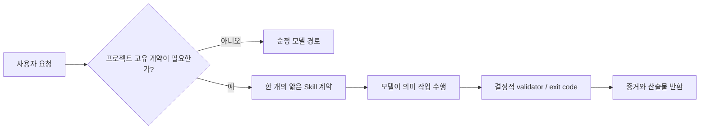

# 모델이 좋아지면 하네스를 없애야 하는가?

## GPT‑5.5/5.6 × WIGTN Codex 플러그인 통제 비교

> 후속 499-call 교차모델·실행·trigger·의미평가와 v3 확인 결과는
> `../model-harness-v2/REPORT.md`에 있다. 이 문서는 1차 연구 원본으로
> 보존하며 후속 결과로 덮어쓰지 않는다.

> 2026-07-27 · Codex CLI `0.146.0-alpha.3.1`  
> 1차 생성 56회 + 리뷰 보충 16회 + 익명 judge 36회 + 실제 트리거 9회 = **117회**  
> 별도 GPT‑5.6 파일럿 9회 포함 시 전체 연구 프로그램 **126회**

## 초록

GPT‑5.6에서 WIGTN Codex 플러그인을 완전히 제거할지, 현 상태로 유지할지, 계약 중심으로 다시 설계할지를 비교했다. 네 조건은 `GPT‑5.5+현 플러그인`, `GPT‑5.6 순정`, `GPT‑5.6+현 플러그인`, `GPT‑5.6+개선판`이다. 모델과 하네스 효과가 섞이지 않도록 같은 모델 안의 비교와 같은 플러그인 안의 비교를 분리했다.

결과는 단순한 “유지”나 “삭제”가 아니다.

- **플러그인 전체 제거는 기각한다.** 유효한 생성·화면정의 계약 점수에서 GPT‑5.6 순정은 50.9%, 현 플러그인은 67.3%, 개선판은 84.6%였다.
- **현 플러그인은 실제 가치를 낸다.** 순정 대비 구조 계약 효과는 +16.3%p였고 bootstrap 95% 구간은 +9.6~+24.0%p였다.
- **개선판 v1은 생성 계약을 크게 강화했지만 그대로 배포할 완성품은 아니다.** 현 플러그인 대비 구조 점수는 +17.3%p였으나 익명 의미 품질은 +1.0/100에 그쳤고, 토큰 중앙값은 14.6k에서 26.2k로 약 80% 늘었다.
- **리뷰에는 더 많은 프롬프트가 답이 아니었다.** 개선판도 프로젝트 관습 누락 여섯 개 중 반복 합계 4/12만 잡았다. 일반 결함은 순정·현 플러그인이 이미 포화에 가까웠다.
- **권고는 “순정 모델을 기본으로, 필요한 순간에만 얇은 계약 스킬과 기계 검증을 로드”하는 구조다.** 현재 플러그인을 당장 제거하지 말고, 생성 계약만 검증된 형태로 가져오되 리뷰 계약은 재설계·재실험해야 한다.

## 1. 연구 질문

1. GPT‑5.6이 GPT‑5.5보다 현 플러그인에서 실제로 나은가?
2. GPT‑5.6 순정에 비해 현 플러그인이 값을 하는가?
3. 8개 스킬 전체를 감사해 만든 개선판이 현 플러그인보다 나은가?
4. 품질 이득이 지연·토큰 비용과 오발동 위험을 정당화하는가?
5. 결국 하네스를 없애야 하는가, 유지해야 하는가, 구조를 바꿔야 하는가?

## 2. 비교 설계

| Arm | 모델 | 플러그인 | 깨끗한 인과 비교 |
|---|---|---|---|
| `M55-CURRENT` | GPT‑5.5 | 현행 | 5.5 기준선 |
| `M56-BARE` | GPT‑5.6 Sol | 없음 | 5.6 순정 |
| `M56-CURRENT` | GPT‑5.6 Sol | 현행 | 순정 대비 현 하네스 |
| `M56-OPT` | GPT‑5.6 Sol | 전체 감사 후 개선판 v1 | 현행 대비 리디자인 |

`M55-CURRENT`와 `M56-BARE`를 직접 빼서 “하네스 효과”라고 부르지 않았다. 두 변수 모두 바뀌기 때문이다.

모든 조건은 `medium` effort, ephemeral session, read-only sandbox, approval `never`, remote plugin과 apps 비활성화, 빈 외부 작업 디렉터리를 사용했다. arm별 임시 `CODEX_HOME`을 분리했고 `debug prompt-input` 원문으로 순정 arm에 WIGTN 스킬이 없음을 검증했다.

이는 OpenAI가 GPT‑5.5/5.6에서 권하는 방향과 맞는다. 프롬프트는 결과·성공 기준·출력 형태를 명확히 하되 가능한 한 작게 유지하고, 마이그레이션 시 같은 effort부터 대표 과제로 비교해야 한다. 평가는 실제 분포의 대표·경계·반례를 포함하고, 자동 지표를 인간 판단 또는 비교 판정으로 보완해야 한다.

- [GPT‑5.5 모델 가이드](https://developers.openai.com/api/docs/guides/model-guidance?model=gpt-5.5)
- [GPT‑5.6 모델 가이드](https://developers.openai.com/api/docs/guides/model-guidance?model=gpt-5.6)
- [Evaluation best practices](https://developers.openai.com/api/docs/guides/evaluation-best-practices)
- [Working with evals](https://developers.openai.com/api/docs/guides/evals)

## 3. 데이터와 측정

### 3.1 행동 과제

| 계열 | 픽스처 | 목적 |
|---|---|---|
| PRD 생성 | 내부 문서공유 UI | 대표 UI 계약 |
| PRD 생성 | 결제 웹훅 API | 비UI 경계·과잉개입 |
| PRD 생성 | 모바일 경비 승인 | 다른 도메인·모바일 |
| PRD 리뷰 | 보편 결함 | 모델 자체 능력 |
| PRD 리뷰 | 관습 결함 | WIGTN 고유 기준 |
| PRD 리뷰 | clean control | 오탐 |
| 화면정의 | 공급업체 승인 | 5종 산출물 계약 |

각 픽스처·arm을 2회 실행해 56개 후보를 만들었다. 자동 점수는 생성 13개, 화면정의 13개, 리뷰 정답 라벨을 첫 호출 전에 동결했다.

### 3.2 익명 의미 평가

동일 픽스처·반복의 네 결과를 A/B/C/D로 익명화하고 순서를 SHA 기반으로 섞었다. GPT‑5.5와 GPT‑5.6 두 judge가 각각 다음을 0~4점으로 평가했다.

- 요청 충실도
- 정확성
- 구체성·추적성
- 절제
- 실무 사용성

18개 bundle을 두 judge가 독립 평가해 36개 판정을 얻었다. judge가 후보 생성 모델과 겹치므로 인간 평가를 대체하지는 않는다.

### 3.3 통계

- 비율은 분자/분모와 Wilson 95% 구간
- 시간·토큰·길이는 중앙값과 IQR
- arm 차이는 동일 픽스처·반복의 paired difference
- 신뢰구간은 픽스처·반복 bundle을 cluster로 bootstrap 10,000회

## 4. 전체 비교표

리뷰 대조군 두 개는 실행 후 실제 결함이 발견돼 순수한 정답표가 아니었다. 따라서 아래 구조 점수는 오염되지 않은 **PRD 생성+화면정의 104개 판정**만 사용한다. 원 사전등록 점수는 삭제하지 않고 `runs/RESULTS.md`에 보존했다.

| Arm | 유효 구조 계약 | 익명 품질 /100 | 시간 median [IQR] | 토큰 median [IQR] | 출력 줄 median [IQR] |
|---|---:|---:|---:|---:|---:|
| **5.5 + 현 플러그인** | 65/104 = **62.5%** | **85.4** | 64 [45–78]초 | 8,990 [7,594–11,006] | 181 [60–210] |
| **5.6 순정** | 53/104 = **50.9%** | **88.3** | 105 [64–169]초 | 15,782 [11,798–18,958] | 387 [48–608] |
| **5.6 + 현 플러그인** | 70/104 = **67.3%** | **91.4** | 172 [88–193]초 | 14,608 [13,270–30,263] | 336 [92–396] |
| **5.6 + 개선판 v1** | 88/104 = **84.6%** | **92.4** | 174 [82–220]초 | 26,230 [19,346–34,206] | 330 [48–359] |

시간에는 세 조건이 같은 시각에 4,100초 이상 대기한 서비스성 이상치가 있었다. 중앙값은 이 공통 이상치에 강건하지만, 지연 결과는 실행 환경 고유값으로 해석해야 한다.

## 5. 인과 효과

| 비교 | 구조 계약 Δ%p [95% bootstrap CI] | 익명 품질 Δ/100 [95% bootstrap CI] | 해석 |
|---|---:|---:|---|
| 5.6+현행 − 5.5+현행 | +4.8 [−5.8, +18.3] | +6.0 [−1.2, +12.2] | 5.6 방향 우세, 표본상 확정은 아님 |
| 5.6+현행 − 5.6 순정 | **+16.3 [+9.6, +24.0]** | +3.1 [−1.5, +7.1] | 현 플러그인의 계약 가치는 명확 |
| 5.6+개선 − 5.6+현행 | **+17.3 [+8.7, +25.0]** | +1.0 [−2.6, +4.7] | 형식·계약 개선, 의미 품질은 동률 |
| 5.6+개선 − 5.6 순정 | **+33.7 [+21.2, +45.2]** | +4.0 [−0.7, +8.5] | 얇은 명시 계약의 순가치 |

핵심은 두 점수의 차이다. 개선판은 “우리가 요구한 항목이 존재하는가”에는 크게 이겼지만, 익명 judge가 본 전체 문서 품질은 현행과 사실상 동률이었다. 구조 점수를 의미 품질로 오해하면 안 된다.

Judge 두 명의 1위 집합 완전 일치는 7/18, 한 후보 이상 겹친 경우는 13/18이었다. 미세한 1~4점 차이는 강한 우열로 읽지 않는다.

## 6. 과제별 결과

### 6.1 PRD 생성 — 개선 계약의 승리

| Arm | 사전등록 계약 |
|---|---:|
| 5.5+현행 | 51/78 = 65.4% |
| 5.6 순정 | 35/78 = 44.9% |
| 5.6+현행 | 48/78 = 61.5% |
| 5.6+개선 | **65/78 = 83.3%** |

개선판은 적용성 표, 역할·권한, Pages/Routes, State Matrix, Mermaid flow, 서버 인가, Given/When/Then, FR 매핑 단계를 결과 계약으로 만들었다. 특히 비UI 웹훅에서 UI를 억지로 만들지 않고 `해당 없음`을 남기는 규칙이 2/2 통과해, 단순한 “섹션 많이 쓰기”가 아니었다.

다만 적용성 계약을 추가해도 일부 실행은 State Matrix와 FR 매핑 단계를 놓쳤다. 프롬프트 계약만으로 100% 강제할 수 없다는 증거다.

### 6.2 화면정의 — 현 스킬을 유지해야 함

| Arm | 5종 산출물·상태·추적성 계약 |
|---|---:|
| 5.5+현행 | 14/26 = 53.8% |
| 5.6 순정 | 18/26 = 69.2% |
| 5.6+현행 | **22/26 = 84.6%** |
| 5.6+개선 | 23/26 = 88.5% |

개선판은 `screen-spec`을 수정하지 않았으므로 현행과 개선의 1개 차이는 모델 변동으로 보는 편이 타당하다. 순정 모델도 좋은 단일 문서를 만들지만, Mermaid flow와 다섯 산출물의 분리·핸드오프 추적성은 현 스킬이 더 안정적이었다.

익명 judge에서는 오히려 현행이 96.2, 개선이 86.2였다. 같은 스킬·같은 모델인데 반복 표본만 달라 생긴 차이이므로, n=2에서 작은 구조 차이를 제품 효과로 읽으면 안 된다.

### 6.3 보편 PRD 리뷰 — 하네스 추가 이득이 거의 없음

보편 결함 재현율은 5.5+현행 9/10, 5.6 순정 10/10, 5.6+현행 10/10, 개선판 8/10이었다. 순정과 현행이 이미 포화했고, 개선판은 오히려 정성 NFR과 검증 불가능 AC를 각 한 번 놓쳤다.

따라서 일반적인 모순·권한·정성 NFR·모호한 수용 기준을 찾는 “방법론 프롬프트”를 더 늘릴 이유가 없다.

### 6.4 관습 PRD 리뷰 — 개선판 v1도 부족

첫 관습 픽스처에는 보편 결함이 섞여 폐기했고, 이를 제거한 v2를 16회 보충 실행했다.

| Arm | 프로젝트 계약 누락 6종 재현 |
|---|---:|
| 5.5+현행 | 0/12 |
| 5.6 순정 | 2/12 |
| 5.6+현행 | 2/12 |
| 5.6+개선 | **4/12** |

개선판은 GWT·적용성·FR 매핑 단계 일부만 더 잡았다. Pages/Routes, State Matrix, Mermaid flow 누락은 0/2였다. “체크리스트를 reference로 읽혀 두면 리뷰에서 반드시 사용한다”는 가설은 지지되지 않았다.

리뷰 모드는 생성 모드와 분리해, 먼저 다음 여섯 항목을 `present / N/A with evidence / missing`으로 기계적인 표에 채우고 그 뒤에 의미 findings를 쓰게 해야 한다.

### 6.5 clean control — 신뢰할 수 있는 오탐률을 얻지 못함

clean 픽스처를 두 번 설계했지만 두 번 모두 모델들이 실제 계약 공백을 찾았다.

- v1: `/me/profile`인데 타 사용자 경로 조작 403을 요구한 모순, trim과 공백 거부 충돌
- v2: Unicode 범위·입력 타입·CSRF·로그 비기록 검증 같은 공백

이를 오탐이라고 세면 모델을 잘못 벌주게 된다. 따라서 이 연구는 clean PRD의 blocker/high 오탐률을 **측정 불가**로 보고한다. 다음 실험에서는 외부 제품·보안 전문가 2명이 독립 합의한 gold PRD를 사용해야 한다.

## 7. 실제 트리거와 격리

- 정적 trigger contract: 30/30
- 명확한 실제 긍정 요청: product-spec, screen-spec, acceptance-verifier, release-readiness 4/4 로드
- 일반 요청: 오류 설명, README 조언, 비WIGTN 발표, React 성능 조언 4/4에서 WIGTN 스킬 미로드
- 경계 사례: “커밋 준비를 실행”이 아니라 “확인 절차를 말해달라”는 요청에서는 release 스킬을 로드하지 않음

이는 플러그인이 설치됐다고 206줄의 모든 스킬 본문이 매 요청에 주입되는 구조가 아님을 보여준다. 일반 요청은 사실상 순정 모델로 처리하고, 관련 계약만 점진적으로 로드하는 현재 방향은 맞다.

## 8. 8개 스킬 전체 감사

| 스킬 | 결론 | 이유 |
|---|---|---|
| acceptance-verifier | 유지 | 요구사항별 코드·테스트 증거와 읽기 전용 경계 |
| design-direction | 유지 | 프로젝트 네이티브 우선과 선택적 스타일 데이터 |
| handdrawn-diagram | 유지 | Mermaid handDrawn, SVG+PNG, 렌더 검증 |
| product-spec | **재설계** | 생성 계약은 강화 가치가 있으나 리뷰 recall과 토큰 비용 문제 |
| release-readiness | 유지 | 커밋·푸시·PR 권한 분리와 dirty worktree 보호 |
| screen-spec | 유지 | 5종 산출물 계약의 반복 가능한 이득 |
| verified-delivery | 유지 | 명시 호출·검증 증거·외부 변경 권한 경계 |
| wigtn-presentation | 유지 | WIGTN 고유 브랜드 데이터와 시각 QA |

전체 SKILL 본문은 206줄이었다. 이전 Claude 하네스처럼 수천 줄의 세대 보정·역할극·중복 절차가 있는 상태가 아니었다. 7개 스킬을 더 줄이는 것은 현재 증거상 최적화가 아니라 고유 계약 삭제다.

## 9. 최종 결정

### 9.1 하네스를 아예 없앨 것인가? — 아니오

사전 결정 규칙상 전체 제거는 순정이 개선판 대비 모든 1차 지표에서 5%p 이내 비열등해야 했다. 실제 유효 구조 점수는 순정 50.9%, 개선 84.6%로 33.7%p 차이다. 제거 조건을 명백히 통과하지 못했다.

화면정의 5종, WIGTN 브랜드, 커밋 권한 경계, 요구사항 증거 매핑은 모델의 일반 지능이 아니라 조직이 정한 계약이다. 모델 세대가 올라가도 저절로 알 수 없다.

### 9.2 개선판 v1을 그대로 배포할 것인가? — 아니오

좋아진 부분:

- 생성 계약 +17.3%p
- 비UI 적용성 처리 개선
- 의미 품질은 현행 대비 비열등 범위

막는 부분:

- 토큰 중앙값 약 80% 증가
- 관습 리뷰 recall 4/12
- 보편 리뷰 자동 점수 8/10으로 작은 회귀
- 신뢰할 clean 오탐 평가 부재

따라서 v1은 연구 arm으로는 성공했지만 배포 후보로는 회귀 게이트를 통과하지 못했다.

### 9.3 지금 운영 선택 — 현 플러그인 유지 + 검증된 부분만 다음 버전에 이식

현재 제품 플러그인을 당장 지우거나 v1 전체로 교체하지 않는다. 다음 버전은 아래 구조로 만든 뒤 같은 실패 픽스처를 재실행한다.

## 10. 권장 플러그인 개편안

### A. `product-spec`를 create와 review 계약으로 분리

Create에서는 20~30줄의 결과 계약만 로드한다.

- 항상: 문제, 목표/비목표, 역할, stable FR, 서버 인가, acceptance 매핑, 위험, FR 매핑 단계
- 조건부: UI면 Pages/Routes와 State Matrix, 다단계면 Mermaid
- 모든 조건부 항목은 `필수` 또는 `N/A + 근거`
- 숫자 SLA는 증거가 있을 때만

Review에서는 생성 템플릿 전체를 다시 읽지 않는다. 먼저 짧은 contract audit 표를 강제한다.

| Contract | Present | N/A evidence | Missing |
|---|---|---|---|
| Applicability |  |  |  |
| Pages/Routes |  |  |  |
| State Matrix |  |  |  |
| User/System flow |  |  |  |
| Acceptance precondition/action/result |  |  |  |
| FR-mapped delivery |  |  |  |

그 다음에만 blocker/high/medium 의미 findings를 쓴다. 보편 결함을 찾는 장문의 렌즈는 추가하지 않는다.

### B. 형식 강제는 프롬프트에서 validator로 이동

모델에게 “빠뜨리지 마”라고 반복하는 대신 `validate-prd`가 다음을 결정적으로 검사하게 한다.

- 적용성 표 존재
- UI가 `필수`면 Pages/Routes와 State Matrix 존재
- multi-step이 `필수`면 Mermaid 존재
- 모든 FR에 acceptance 또는 명시적 제외 근거
- delivery phase에 FR ID와 exit condition
- `N/A`에 근거가 없으면 실패

프롬프트는 의미 판단, validator는 존재·연결·exit code를 담당한다.

### C. 일반 작업에는 순정 경로 유지

실제 부정 트리거 4/4에서 스킬 미로드가 확인됐다. 이 성질을 지켜야 한다.

- ordinary coding, 오류 수정, 성능 조언: 별도 능력 보정 스킬 없음
- 명시적 PRD·화면정의·브랜드·릴리스 요청: 해당 스킬 한 개만
- verified-delivery: 계속 explicit-only
- 커밋·푸시·PR·배포: 계속 별도 권한

### D. 다음 회귀 게이트

1. PRD 생성 3종은 유효 구조 점수 80% 이상 유지
2. 관습 리뷰 v2는 6종 × 5회에서 80% 이상
3. 보편 리뷰는 95% 이상
4. 전문가 합의 clean PRD 3종에서 blocker/high 오탐 0
5. 익명 인간 평가에서 현행 대비 5점 비열등
6. 현행 대비 토큰 중앙값 +25% 이내
7. 긍정·부정 실제 트리거 각 20개에서 precision/recall 95% 이상

이 게이트를 통과하기 전에는 “최적화판”이라는 이름으로 배포하지 않는다.

## 11. 한계와 재현성

- 조건당 반복이 2회라 작은 차이에 대한 검정력이 낮다.
- 날짜별 모델 백엔드 변화와 한 차례의 장시간 서비스 대기가 있었다.
- 자동 정규식은 의미적으로 동등한 표현을 놓칠 수 있다.
- 두 judge 모두 OpenAI 모델이며 인간 독립 평가가 아니다.
- clean PRD의 오탐률을 신뢰성 있게 측정하지 못했다.
- 행동 실험은 product-spec과 screen-spec에 집중했고, 나머지 6개 스킬은 내용·트리거·안전 계약 감사가 중심이다.

그 대신 사전등록, arm별 격리, 원문 prompt input, 모든 출력·로그·meta, 잘못된 픽스처 폐기 기록, 보충 실험, 익명 매핑과 judge 원문을 모두 공개했다.

## 12. 재현 파일

- `STUDY-PROTOCOL.md` — 사전등록
- `PLUGIN-AUDIT.md` — 8개 스킬 전체 감사
- `arms/optimized.patch` — 실제 설치·검증한 개선판 v1
- `runs/MANIFEST.txt` — 최초 입력 해시와 CLI 정보
- `runs/RESULTS.md`, `runs/SCORES.csv` — 원 자동 점수
- `AMENDMENT-01.md`, `runs-supplement/` — 실패 픽스처와 보충 실험
- `JUDGE-PROTOCOL.md`, `judge-prompts/`, `judge-runs/` — 익명 평가 전체
- `EFFECTS.md`, `analyze_effects.py` — paired bootstrap
- `trigger-live/runs/RESULTS.md` — 실제 스킬 로드 검사

## 결론

> **하네스를 없애지 말라. 하네스가 모델에게 생각하는 법을 가르치게도 하지 말라. 조직이 정한 결과 계약만 얇게 로드하고, 결정적인 것은 코드로 검사하라.**

GPT‑5.6은 GPT‑5.5보다 대체로 나았지만, 그 차이보다 “명시하지 않으면 모델이 알 수 없는 조직 계약”의 효과가 더 컸다. 현 WIGTN Codex 플러그인은 이미 상당히 얇고 오발동도 낮다. 제거 대상은 플러그인 자체가 아니라, `product-spec` 안에서 생성과 리뷰가 뒤섞인 계약과 프롬프트로 형식을 강제하려는 부분이다.
