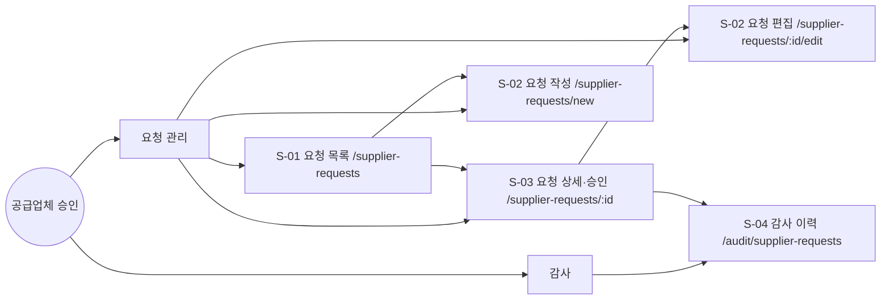
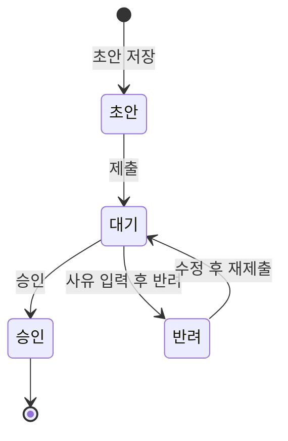
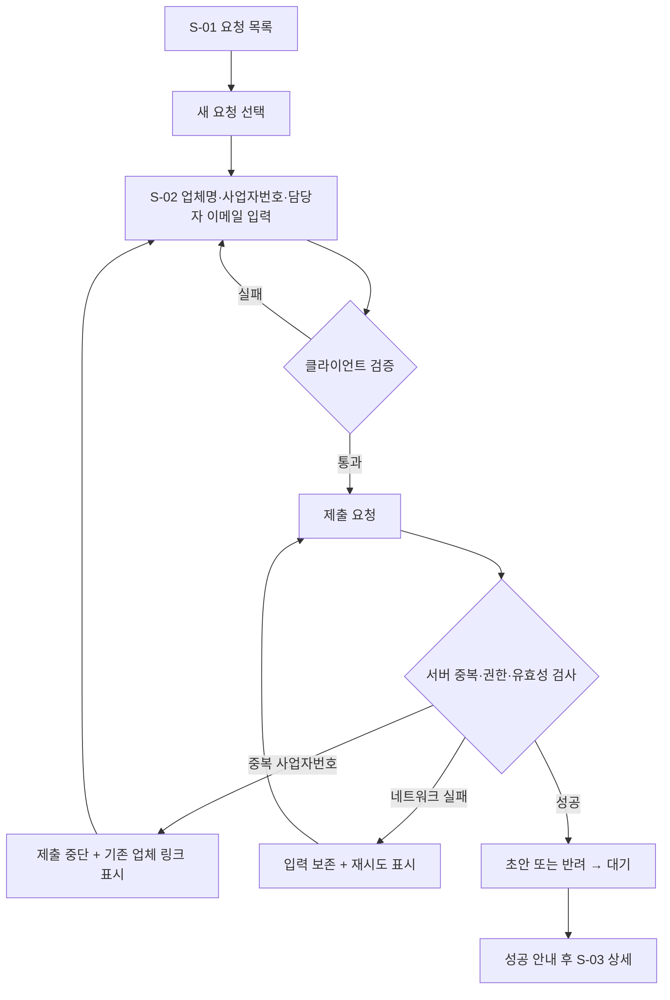
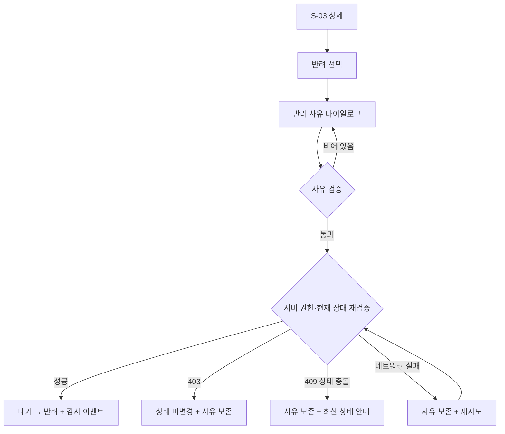
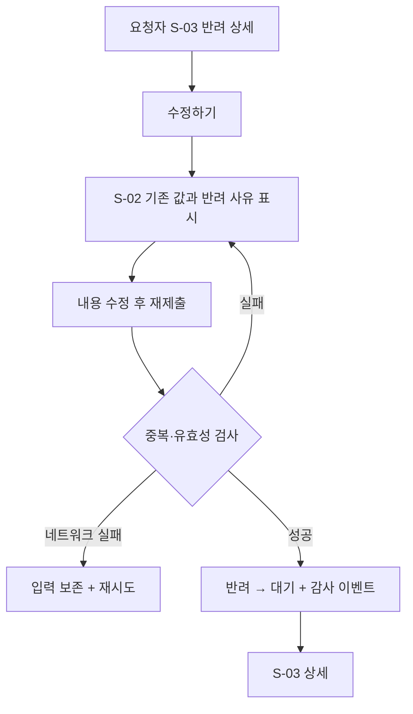
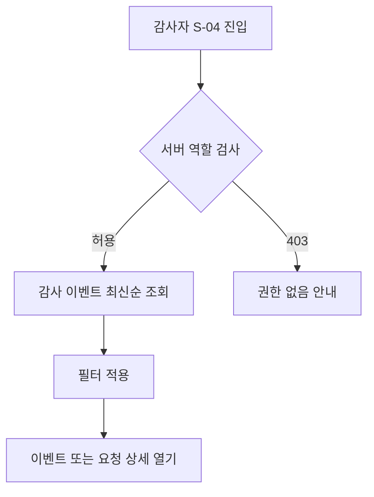

# 공급업체 승인 화면정의서

문서 상태: 구현 전달용 Draft  
기준 PRD: FR-101~FR-105 및 명시된 수용 기준

## 전제 및 결정 사항

PRD에서 정하지 않은 부분은 다음처럼 가정했다.

- 요청자는 자신이 작성한 요청만 조회·편집할 수 있다.
- 승인자는 자기 사업부 요청만 조회하며, `대기` 상태에서만 승인·반려할 수 있다.
- 감사자는 모든 요청과 감사 이력을 읽기 전용으로 조회할 수 있다.
- `초안 저장` 기능을 제공한다. 초안 저장은 상태 변경이 아니므로 감사 이벤트를 만들지 않는다.
- 반려 요청을 편집해도 상태는 `반려`로 유지하며, 재제출 성공 시 `반려 → 대기`가 된다.
- 사업자번호는 입력 시 하이픈을 허용하지만 서버에는 숫자 10자리로 정규화해 전달한다.
- 중복 여부와 권한 판정은 서버 응답을 최종 기준으로 한다.
- 한 사용자가 여러 역할을 보유할 수 있으며, 역할에 따라 메뉴와 가능한 액션을 합산한다.
- 페이지네이션, 검색·필터 세부 조건, 감사 이력 보존 기간은 구현 전 결정이 필요하다.

---

# 1. IA

## 1.1 페이지 계층



## 1.2 화면 목록

| ID | 화면 | Route | 주요 역할 | 연결 요구사항 |
|---|---|---|---|---|
| S-01 | 요청 목록 | `/supplier-requests` | 요청자, 승인자, 감사자 | FR-103, FR-104 |
| S-02 | 요청 작성/편집 | `/supplier-requests/new`, `/supplier-requests/:id/edit` | 요청자 | FR-101, FR-102, FR-105 |
| S-03 | 요청 상세/승인 | `/supplier-requests/:id` | 요청자, 승인자, 감사자 | FR-103, FR-104, FR-105 |
| S-04 | 감사 이력 | `/audit/supplier-requests` | 감사자 | FR-105 |

FR-104는 서버 권한 요구사항이지만 S-01, S-03의 데이터 범위 및 액션 노출과 직접 연결된다.

## 1.3 역할별 접근 권한

| 화면/액션 | 요청자 | 승인자 | 감사자 |
|---|---:|---:|---:|
| 자신의 요청 목록 | 허용 | 역할 중복 시 허용 | 읽기 전용 |
| 자기 사업부 대기 목록 | 역할 중복 시 허용 | 허용 | 읽기 전용 |
| 요청 작성 | 허용 | 역할 중복 시 허용 | 불가 |
| 초안·반려 요청 편집 | 작성자만 | 작성자 역할도 있으면 허용 | 불가 |
| 요청 상세 조회 | 자신의 요청 | 자기 사업부 요청 | 전체 읽기 전용 |
| 승인·반려 | 불가 | 자기 사업부의 대기 요청만 | 불가 |
| 감사 이력 조회 | 불가 | 불가 | 허용 |

메뉴를 숨기는 것은 편의 기능일 뿐이다. 서버는 목록, 상세, 편집, 승인, 반려 API에서 각각 권한을 다시 검증해야 한다.

## 1.4 내비게이션

- 공통 상단 내비게이션: `요청 목록`
- 요청자에게만 표시: `새 요청`
- 감사자에게만 표시: `감사 이력`
- Breadcrumb 예:
  - `요청 목록 > 새 요청`
  - `요청 목록 > 요청 상세`
  - `감사 이력 > 요청 상세`
- 모바일에서는 상단 내비게이션을 축약하되 화면 이동 구조는 유지한다.

## 1.5 상태 모델



서버가 허용할 전이는 다음으로 제한한다.

| 현재 상태 | 액션 | 다음 상태 |
|---|---|---|
| 초안 | 제출 | 대기 |
| 대기 | 승인 | 승인 |
| 대기 | 반려 | 반려 |
| 반려 | 재제출 | 대기 |

---

# 2. User Flow

## 2.1 요청 작성 및 중복 확인



핵심 조건:

- 중복 응답에서는 상태 변경과 감사 이벤트가 발생하지 않는다.
- 네트워크 실패 시 모든 필드 값을 그대로 유지한다.
- 제출 성공 시에만 `초안 → 대기` 또는 `반려 → 대기` 이벤트를 기록한다.

## 2.2 승인 흐름

```mermaid
flowchart TD
  A["승인자 S-01 진입"] --> B["서버가 자기 사업부 대기 요청 조회"]
  B --> C["요청 선택"]
  C --> D["S-03 상세 확인"]
  D --> E["승인 선택"]
  E --> F["확인 다이얼로그"]
  F -->|취소| D
  F -->|확인| G{서버 권한·현재 상태 재검증}
  G -->|성공| H["대기 → 승인 + 감사 이벤트"]
  G -->|403| I["상태 미변경 + 권한 안내"]
  G -->|409 상태 충돌| J["최신 상세 다시 조회"]
  G -->|네트워크 실패| K["상태 미변경 + 재시도"]
```



승인은 되돌릴 수 없는 액션으로 취급하며 확인 다이얼로그를 사용한다. 낙관적 업데이트는 하지 않는다.

## 2.3 반려 흐름



다이얼로그를 사용자가 명시적으로 닫기 전까지 반려 사유를 보존한다. 페이지 새로고침까지 보존할지는 `sessionStorage` 사용을 권장한다.

## 2.4 반려 요청 재제출



## 2.5 감사 조회



## 2.6 수용 기준 커버리지

| 수용 기준 | 연결 Flow |
|---|---|
| 권한 없는 승인 시 403, 상태 미변경 | 승인, 반려 Flow |
| 중복 사업자번호에서 제출되지 않음 | 요청 작성·재제출 Flow |
| 네트워크 실패 시 입력과 반려 사유 보존 | 작성, 반려, 재제출 Flow |
| 모바일 승인 상세 단일 열 | S-03 반응형 명세 |

---

# 3. Screen Spec

## 공통 규칙

- Desktop: `≥1024px`
- Tablet: `768~1023px`
- Mobile: `<768px`
- 모바일 터치 타깃은 최소 `44×44px`
- 상태 배지는 텍스트를 함께 표시한다: `초안`, `대기`, `승인`, `반려`
- mutation 중에는 해당 버튼을 비활성화하고 `제출 중…`, `승인 중…`, `반려 중…`으로 표시한다.
- 서버 에러 코드나 내부 예외 메시지는 사용자에게 노출하지 않는다.
- 성공 전에는 UI 상태를 먼저 바꾸지 않는다.
- 직접 URL 접근도 서버 권한 검사를 통과해야 한다.

## S-01 요청 목록

| 항목 | 명세 |
|---|---|
| Audience | 요청자, 승인자, 감사자 |
| Auth | 필수 |
| Linked FRs | FR-103, FR-104 |
| Layout | 제목/주 액션 → 역할별 탭 → 필터 → 목록 |
| 기본 정렬 | 최근 수정일 내림차순 |

### 구성요소

| Slot | Type | 동작 |
|---|---|---|
| page-title | heading | `공급업체 요청` |
| new-request | primary button | 요청자에게 `새 요청 작성` |
| scope-tabs | tabs | 요청자: `내 요청`, 승인자: `승인 대기`, 감사자: `전체 요청` |
| status-filter | select | 전체, 초안, 대기, 승인, 반려 |
| keyword | search input | 업체명 또는 사업자번호 검색 |
| request-list | table/card list | 업체명, 사업자번호, 상태, 사업부, 요청자, 수정일 |
| row-link | link | S-03으로 이동 |
| pagination | pagination | 서버 페이지네이션 권장 |

### 상태 및 카피

- Loading: 실제 행 형태의 skeleton을 표시하고 목록에 `aria-busy="true"` 적용.
- Empty:
  - 내 요청: `아직 작성한 요청이 없습니다.` + `새 요청 작성`
  - 승인 대기: `현재 승인 대기 중인 요청이 없습니다.`
  - 필터 결과: `조건에 맞는 요청이 없습니다.` + `필터 초기화`
- Error: `요청 목록을 불러오지 못했습니다.` + `다시 시도`
- Unauthorized: `이 요청 목록을 볼 권한이 없습니다.` + `목록으로 돌아가기`
- Success: 결과 건수와 목록 표시.

### 반응형

- Desktop: 테이블.
- Tablet: 중요도가 낮은 `요청자`, `수정일` 열을 축소하거나 숨김.
- Mobile: 가로 스크롤 없는 카드 목록. 업체명, 상태, 사업자번호, 수정일 순으로 표시.

---

## S-02 요청 작성/편집

| 항목 | 명세 |
|---|---|
| Audience | 요청자 |
| Auth | 필수, 작성자 검증 |
| Linked FRs | FR-101, FR-102, FR-105 |
| Layout | 단일 폼, 최대 폭 약 720px |
| 진입 조건 | 신규, 자신의 초안, 자신의 반려 요청 |
| 이탈 보호 | 수정된 값이 있으면 이탈 확인 |

### 필드 및 액션

| Slot | Type | 필수 | 검증 | 카피 |
|---|---|---:|---|---|
| supplier-name | text input | 예 | 공백 제거 후 1~100자 | `업체명`, 예: `주식회사 가나다` |
| business-number | text/inputmode numeric | 예 | 정규화 후 숫자 10자리, 서버 중복 검사 | `사업자번호`, 예: `123-45-67890` |
| contact-email | email input | 예 | 유효한 이메일, 최대 254자 | `담당자 이메일`, 예: `contact@example.com` |
| duplicate-alert | alert | 조건부 | 서버 중복 응답 시 | `이미 등록된 사업자번호입니다.` |
| existing-link | link | 조건부 | 중복 업체 ID가 있을 때 | `기존 업체 보기` |
| save-draft | secondary button | 신규/초안 | 클라이언트 검증 가능한 범위 | `초안 저장` |
| submit | primary button | 예 | 전체 검증 및 서버 확인 | 신규: `제출하기`, 반려: `다시 제출하기` |
| cancel | text button | 아니요 | 변경 시 이탈 확인 | `취소` |

### 중복 처리

- 사업자번호 blur 시 사전 중복 확인을 할 수 있지만, 제출 시 서버가 반드시 다시 검사한다.
- 중복 응답 권장: HTTP `409` 또는 도메인 오류 코드 `DUPLICATE_BUSINESS_NUMBER`.
- 중복일 때:
  - 요청은 제출되지 않는다.
  - 사업자번호 필드에 `aria-invalid="true"`를 적용한다.
  - 오류 배너와 기존 업체 링크를 함께 노출한다.
  - 다른 입력값은 그대로 유지한다.

### 상태 및 카피

- Validation:
  - `업체명을 입력해주세요.`
  - `사업자번호 10자리를 입력해주세요.`
  - `올바른 이메일 주소를 입력해주세요.`
- Loading: 편집 데이터 skeleton. 제출 중 전체 폼은 유지하고 중복 제출만 차단.
- Network error: `제출하지 못했습니다. 입력한 내용은 보존되어 있습니다.` + `다시 시도`
- Success:
  - 초안 저장: `초안이 저장되었습니다.`
  - 제출: `승인 요청을 제출했습니다.` 후 S-03 이동
- Unauthorized: `이 요청을 편집할 권한이 없습니다.` + `요청 목록으로`
- 반려 편집: 폼 상단에 이전 반려 사유를 읽기 전용으로 표시.

### 입력 보존

- 네트워크 실패 시 React form state를 초기화하지 않는다.
- 새 요청은 세션 단위 복구를 위해 `sessionStorage` 임시 저장을 권장한다.
- 저장 키에는 사용자 ID와 요청 ID를 포함해 계정 간 데이터가 섞이지 않게 한다.
- 제출 성공 또는 사용자의 명시적 폐기 시 임시 데이터를 제거한다.

### 반응형

- Desktop/Tablet: 라벨 위, 필드 아래의 단일 열.
- Mobile: 동일한 단일 열, 하단 액션은 전체 폭으로 세로 배치.
- 모바일 키보드가 열린 상태에서도 오류 메시지와 제출 버튼에 접근 가능해야 한다.

---

## S-03 요청 상세/승인

| 항목 | 명세 |
|---|---|
| Audience | 요청자, 승인자, 감사자 |
| Auth | 필수, 소유권·사업부·감사자 역할 검증 |
| Linked FRs | FR-103, FR-104, FR-105 |
| Desktop Layout | 왼쪽 상세 정보 + 오른쪽 상태/액션 패널 |
| Mobile Layout | 모든 블록을 단일 열로 재배치 |

### 구성요소

| Slot | Type | 노출 조건 | 동작 |
|---|---|---|---|
| status-badge | badge | 항상 | 현재 상태 표시 |
| request-summary | description list | 항상 | 업체명, 사업자번호, 이메일, 사업부, 요청자, 제출일 |
| rejection-reason | alert/read-only | 반려 상태 | 최근 반려 사유 |
| edit | button | 작성자 + 초안/반려 | S-02 편집 이동 |
| approve | primary button | 승인자 + 자기 사업부 + 대기 | 확인 후 승인 mutation |
| reject | danger button | 승인자 + 자기 사업부 + 대기 | 반려 다이얼로그 열기 |
| audit-preview | timeline | 감사자 | 최근 상태 변경 표시 |
| reject-dialog | modal | 반려 선택 시 | 사유 입력 및 반려 실행 |

### 반려 다이얼로그

| 요소 | 명세 |
|---|---|
| 제목 | `요청 반려` |
| 안내 | `반려 사유는 요청자와 감사 이력에 표시됩니다.` |
| 입력 | textarea, 필수, 공백 제거 후 1~500자 |
| 취소 | `취소` |
| 실행 | `사유와 함께 반려` |
| 오류 | `반려 사유를 입력해주세요.` |
| 네트워크 실패 | 입력 유지, 다이얼로그 유지, `다시 시도` 제공 |

### 승인 확인

- 제목: `이 요청을 승인할까요?`
- 본문: `승인 후에는 이 화면에서 되돌릴 수 없습니다.`
- 버튼: `취소`, `승인하기`

### 서버 오류 처리

- `403`: `이 사업부의 요청을 처리할 권한이 없습니다.` 상태를 다시 조회하며 로컬 상태를 변경하지 않는다.
- `409`: `다른 사용자가 먼저 요청을 처리했습니다.` + `최신 상태 보기`
- 네트워크 실패: `처리하지 못했습니다. 상태는 변경되지 않았습니다.` + `다시 시도`
- 승인·반려 성공 후 서버 결과를 다시 받아 배지, 액션, 이력을 갱신한다.

### 상태

- Loading: 상세와 액션 패널 skeleton.
- Error: `요청 정보를 불러오지 못했습니다.` + `다시 시도`
- Unauthorized: 전용 권한 안내. 상세 데이터는 렌더링하지 않는다.
- Success: 현재 상태와 역할에 맞는 액션만 표시.
- Destructive confirmation: 승인 확인 및 반려 사유 다이얼로그.

### 반응형

- Desktop `≥1024px`: 상세 `2fr`, 액션 패널 `1fr`의 2열.
- Tablet: 2열을 유지하되 액션 패널 폭 축소.
- Mobile `<768px`: 반드시 다음 순서의 단일 열:
  1. 제목과 상태
  2. 업체 정보
  3. 반려 사유
  4. 승인/반려 또는 편집 액션
  5. 감사 이력 미리보기
- 모바일 액션 버튼은 전체 폭이며 최소 높이 44px. 가로 스크롤을 허용하지 않는다.

---

## S-04 감사 이력

| 항목 | 명세 |
|---|---|
| Audience | 감사자 |
| Auth | 필수 + 감사자 역할 |
| Linked FRs | FR-105 |
| Layout | 필터 바 + 감사 이벤트 테이블/모바일 카드 |
| 정렬 | 이벤트 발생 시각 내림차순 |
| 권한 | 읽기 전용 |

### 필터 및 결과

| Slot | Type | 명세 |
|---|---|---|
| date-range | date range | 시작일~종료일 |
| status-transition | select | 전체, 제출, 승인, 반려, 재제출 |
| business-unit | select | 접근 가능한 사업부 |
| actor | search | 처리자 이름/식별자 |
| keyword | search | 업체명, 사업자번호, 요청 ID |
| reset | button | `필터 초기화` |
| audit-list | table/card | 시각, 요청, 이전 상태, 변경 상태, 처리자, 사업부, 사유 |
| request-link | link | 읽기 전용 S-03 상세 |

### 감사 이벤트 필수 데이터

- 이벤트 ID
- 요청 ID
- 이전 상태와 변경 상태
- 행위 유형
- 행위자 ID 및 표시명
- 행위자의 당시 역할과 사업부
- 서버 발생 시각
- 반려 사유
- 상관관계 ID 또는 요청 추적 ID
- 필요 시 변경 전후 데이터 스냅샷 또는 차이

감사 이력은 일반 사용자의 수정·삭제 API와 분리하고 append-only 저장을 권장한다.

### 상태 및 카피

- Loading: 테이블 skeleton.
- Empty: `조건에 맞는 상태 변경 이력이 없습니다.` + `필터 초기화`
- Error: `감사 이력을 불러오지 못했습니다.` + `다시 시도`
- Unauthorized: `감사 이력 조회 권한이 필요합니다.` + `요청 목록으로`
- Success: 필터 결과와 총 건수 표시.

### 반응형

- Desktop: 테이블.
- Tablet: 요청과 행위자 정보를 2줄 셀로 압축.
- Mobile: 이벤트 카드. `시각 → 상태 전이 → 업체 → 처리자 → 사유` 순서로 배치.

---

# 4. Lo-fi HTML Wireframe

아래는 저장 없이 브라우저에서 구조를 확인할 수 있는 단일 HTML 초안이다. 회색조와 상태 의미색만 사용한다.

```html
<!doctype html>
<html lang="ko">
<head>
  <meta charset="utf-8">
  <meta name="viewport" content="width=device-width, initial-scale=1">
  <title>공급업체 승인 — Lo-fi Wireframe</title>
  <style>
    :root {
      --bg:#f5f5f5; --surface:#fff; --text:#222; --muted:#666;
      --line:#bbb; --danger:#8b1e1e; --danger-bg:#fff2f2;
      --success:#246b36; --success-bg:#effaf2; --warning-bg:#fff8df;
    }
    * { box-sizing:border-box; }
    body {
      margin:0; background:var(--bg); color:var(--text);
      font:14px/1.5 system-ui, sans-serif;
    }
    a { color:inherit; }
    button, input, select, textarea { font:inherit; }
    button, a.action {
      min-height:44px; padding:10px 14px; border:1px solid #555;
      background:#fff; color:#222; border-radius:4px; cursor:pointer;
    }
    button.primary { background:#222; color:#fff; }
    button.danger { border-color:var(--danger); color:var(--danger); }
    button:focus-visible, a:focus-visible, input:focus-visible,
    select:focus-visible, textarea:focus-visible {
      outline:3px solid #555; outline-offset:2px;
    }
    header { background:#fff; border-bottom:1px solid var(--line); }
    nav {
      max-width:1180px; margin:auto; padding:12px 20px;
      display:flex; align-items:center; gap:20px; flex-wrap:wrap;
    }
    nav .links { display:flex; gap:14px; margin-left:auto; }
    main { max-width:1180px; margin:auto; padding:24px 20px 80px; }
    section {
      margin-bottom:48px; padding:24px; background:var(--surface);
      border:2px dashed var(--line); border-radius:8px;
    }
    .label { color:var(--muted); font-size:12px; text-transform:uppercase; }
    .toolbar, .actions {
      display:flex; gap:10px; align-items:end; flex-wrap:wrap; margin:16px 0;
    }
    .field { display:grid; gap:6px; min-width:180px; }
    .field input, .field select, .field textarea {
      min-height:44px; padding:10px; border:1px solid #777; border-radius:4px;
    }
    .form { display:grid; gap:18px; max-width:720px; }
    .box { border:1px dashed #999; padding:16px; background:#fafafa; }
    .alert { padding:12px; border:1px solid var(--danger); background:var(--danger-bg); }
    .success { padding:12px; border:1px solid var(--success); background:var(--success-bg); }
    .badge { display:inline-block; padding:3px 8px; border:1px solid #777; border-radius:20px; }
    table { width:100%; border-collapse:collapse; }
    th, td { padding:12px 8px; border-bottom:1px solid #ccc; text-align:left; }
    .detail-grid { display:grid; grid-template-columns:2fr 1fr; gap:20px; }
    dl { display:grid; grid-template-columns:160px 1fr; gap:10px; }
    dt { color:var(--muted); }
    .mobile-cards { display:none; }
    .dialog { max-width:520px; border:2px solid #555; padding:18px; background:#fff; }
    footer { padding:24px; text-align:center; color:var(--muted); }

    @media (max-width: 767px) {
      body { font-size:14px; }
      nav .links { width:100%; margin-left:0; overflow:auto; }
      main { padding:12px; }
      section { padding:14px; }
      .detail-grid { grid-template-columns:1fr; }
      .desktop-table { display:none; }
      .mobile-cards { display:grid; gap:10px; }
      dl { grid-template-columns:1fr; gap:4px; }
      dd { margin:0 0 10px; }
      .actions { display:grid; grid-template-columns:1fr; }
      .actions button, .actions a { width:100%; text-align:center; }
      .toolbar .field { width:100%; }
    }
  </style>
</head>
<body>
<header>
  <nav aria-label="주요 메뉴">
    <strong>공급업체 승인</strong>
    <div class="links">
      <a href="#screen-list">요청 목록</a>
      <a href="#screen-form">새 요청</a>
      <a href="#screen-detail">요청 상세</a>
      <a href="#screen-audit">감사 이력</a>
    </div>
  </nav>
</header>

<main>
  <section id="screen-list" aria-labelledby="list-title">
    <div class="label">S-01 · /supplier-requests</div>
    <h1 id="list-title">공급업체 요청</h1>

    <div class="actions">
      <button type="button">내 요청</button>
      <button type="button">승인 대기</button>
      <button type="button" class="primary">새 요청 작성</button>
    </div>

    <div class="toolbar">
      <div class="field">
        <label for="status">상태</label>
        <select id="status"><option>전체</option><option>대기</option></select>
      </div>
      <div class="field">
        <label for="search">업체명 또는 사업자번호</label>
        <input id="search" type="search" placeholder="가나다 또는 123-45-67890">
      </div>
      <button type="button">검색</button>
    </div>

    <table class="desktop-table">
      <thead><tr><th>업체명</th><th>사업자번호</th><th>상태</th><th>사업부</th><th>수정일</th></tr></thead>
      <tbody>
        <tr><td><a href="#screen-detail">주식회사 가나다</a></td><td>123-45-67890</td><td><span class="badge">대기</span></td><td>구매사업부</td><td>2026-07-27</td></tr>
      </tbody>
    </table>

    <div class="mobile-cards">
      <article class="box">
        <strong><a href="#screen-detail">주식회사 가나다</a></strong>
        <p><span class="badge">대기</span></p>
        <p>123-45-67890 · 2026-07-27</p>
      </article>
    </div>
  </section>

  <section id="screen-form" aria-labelledby="form-title">
    <div class="label">S-02 · /supplier-requests/new</div>
    <h1 id="form-title">공급업체 등록 요청</h1>
    <p>등록할 업체 정보를 입력하고 승인 요청을 제출하세요.</p>

    <form class="form">
      <div class="field">
        <label for="supplier-name">업체명 *</label>
        <input id="supplier-name" name="supplierName" required
               placeholder="주식회사 가나다">
      </div>
      <div class="field">
        <label for="business-number">사업자번호 *</label>
        <input id="business-number" name="businessNumber" required
               inputmode="numeric" placeholder="123-45-67890"
               aria-describedby="duplicate-error" aria-invalid="true">
      </div>
      <div id="duplicate-error" class="alert" role="alert">
        이미 등록된 사업자번호입니다.
        <a href="#">기존 업체 보기</a>
      </div>
      <div class="field">
        <label for="contact-email">담당자 이메일 *</label>
        <input id="contact-email" name="contactEmail" type="email" required
               placeholder="contact@example.com">
      </div>
      <div class="actions">
        <button type="button">초안 저장</button>
        <button type="submit" class="primary">제출하기</button>
      </div>
    </form>
  </section>

  <section id="screen-detail" aria-labelledby="detail-title">
    <div class="label">S-03 · /supplier-requests/:id</div>
    <div class="detail-grid">
      <article>
        <h1 id="detail-title">주식회사 가나다</h1>
        <p><span class="badge">대기</span></p>
        <div class="box">
          <dl>
            <dt>사업자번호</dt><dd>123-45-67890</dd>
            <dt>담당자 이메일</dt><dd>contact@example.com</dd>
            <dt>사업부</dt><dd>구매사업부</dd>
            <dt>요청자</dt><dd>홍길동</dd>
            <dt>제출일</dt><dd>2026-07-27 10:30</dd>
          </dl>
        </div>
      </article>

      <aside class="box" aria-label="승인 액션">
        <h2>요청 처리</h2>
        <p>자기 사업부의 대기 요청만 처리할 수 있습니다.</p>
        <div class="actions">
          <button type="button" class="primary">승인하기</button>
          <button type="button" class="danger">반려하기</button>
        </div>
      </aside>
    </div>

    <div class="dialog" role="dialog" aria-modal="true"
         aria-labelledby="reject-title">
      <h2 id="reject-title">요청 반려</h2>
      <p>반려 사유는 요청자와 감사 이력에 표시됩니다.</p>
      <div class="field">
        <label for="reason">반려 사유 *</label>
        <textarea id="reason" rows="4" required
                  placeholder="반려 사유를 구체적으로 입력해주세요."></textarea>
      </div>
      <div class="alert" role="alert">
        네트워크 연결을 확인해주세요. 입력한 사유는 보존되어 있습니다.
      </div>
      <div class="actions">
        <button type="button">취소</button>
        <button type="button" class="danger">다시 시도</button>
      </div>
    </div>
  </section>

  <section id="screen-audit" aria-labelledby="audit-title">
    <div class="label">S-04 · /audit/supplier-requests</div>
    <h1 id="audit-title">감사 이력</h1>

    <div class="toolbar">
      <div class="field">
        <label for="event">변경 유형</label>
        <select id="event"><option>전체</option><option>승인</option><option>반려</option></select>
      </div>
      <div class="field">
        <label for="audit-search">업체명 또는 요청 ID</label>
        <input id="audit-search" type="search" placeholder="업체명 또는 요청 ID">
      </div>
      <button type="button">조회</button>
      <button type="button">필터 초기화</button>
    </div>

    <table class="desktop-table">
      <thead><tr><th>발생 시각</th><th>요청</th><th>상태 변경</th><th>처리자</th><th>사유</th></tr></thead>
      <tbody>
        <tr><td>2026-07-27 11:10</td><td><a href="#screen-detail">REQ-1001</a></td><td>대기 → 반려</td><td>김승인</td><td>서류 확인 필요</td></tr>
      </tbody>
    </table>

    <div class="mobile-cards">
      <article class="box">
        <strong>대기 → 반려</strong>
        <p>REQ-1001 · 주식회사 가나다</p>
        <p>김승인 · 2026-07-27 11:10</p>
        <p>사유: 서류 확인 필요</p>
      </article>
    </div>
  </section>
</main>

<footer>Lo-fi wireframe · grayscale + semantic state colors only</footer>
</body>
</html>
```

---

# 5. Dev Handoff

## 5.1 FR ↔ 화면 ↔ 구현 단위

| FR | 화면 | 주요 구현 단위 |
|---|---|---|
| FR-101 | S-02 | `SupplierRequestForm`, 필드 검증, 제출 mutation |
| FR-102 | S-02 | `BusinessNumberInput`, 중복 확인 API, `DuplicateSupplierAlert` |
| FR-103 | S-01, S-03 | 사업부별 대기 목록, `ApprovalActionPanel`, `RejectDialog` |
| FR-104 | S-01, S-02, S-03, S-04 | 서버 RBAC, 소유권·사업부 범위 검사, 403 처리 |
| FR-105 | S-02, S-03, S-04 | 트랜잭션 내 상태 전이 및 append-only 감사 이벤트 |

모든 FR과 화면이 최소 하나 이상 서로 연결되어 있다.

## 5.2 권장 컴포넌트

재사용 가능:

- `StatusBadge`
- `AsyncButton`
- `ErrorBanner`
- `EmptyState`
- `PermissionDenied`
- `ConfirmDialog`
- `ResponsiveDataList`
- `FilterBar`
- `AuditTimeline`

기능 전용:

- `SupplierRequestForm`
- `BusinessNumberInput`
- `DuplicateSupplierAlert`
- `ApprovalActionPanel`
- `RejectDialog`
- `SupplierRequestSummary`
- `SupplierAuditEventList`

## 5.3 권장 API 계약

| Method | Endpoint | 용도 |
|---|---|---|
| `GET` | `/api/supplier-requests` | 역할·사업부 범위가 적용된 목록 |
| `POST` | `/api/supplier-requests` | 초안 생성 또는 신규 제출 |
| `GET` | `/api/supplier-requests/:id` | 권한이 적용된 상세 |
| `PATCH` | `/api/supplier-requests/:id` | 초안·반려 요청 편집 |
| `POST` | `/api/supplier-requests/:id/submit` | 초안·반려 → 대기 |
| `POST` | `/api/supplier-requests/:id/approve` | 대기 → 승인 |
| `POST` | `/api/supplier-requests/:id/reject` | 대기 → 반려 |
| `GET` | `/api/suppliers/by-business-number/:number` | 중복 사전 확인 |
| `GET` | `/api/audit/supplier-requests` | 감사자 전용 이력 |

중복 응답 예:

```json
{
  "code": "DUPLICATE_BUSINESS_NUMBER",
  "message": "이미 등록된 사업자번호입니다.",
  "existingSupplier": {
    "id": "SUP-1004",
    "name": "주식회사 가나다",
    "href": "/suppliers/SUP-1004"
  }
}
```

반려 요청 예:

```json
{
  "reason": "사업자등록 정보와 업체명이 일치하지 않습니다.",
  "expectedVersion": 3
}
```

`expectedVersion` 또는 ETag를 사용해 중복 승인과 오래된 화면의 상태 변경을 방지한다. 충돌은 `409 Conflict`로 반환한다.

## 5.4 서버 불변조건

- 클라이언트가 보낸 사업부 ID나 역할을 신뢰하지 않는다.
- 승인·반려 시 인증 사용자의 사업부와 요청 사업부를 서버에서 비교한다.
- 허용되지 않은 승인·반려는 `403`으로 반환하고 상태 및 감사 이력을 모두 변경하지 않는다.
- 상태 변경과 감사 이벤트 삽입은 하나의 DB 트랜잭션에서 처리한다.
- 조건부 갱신 예: `WHERE id = ? AND status = 'PENDING' AND version = ?`.
- 중복 사업자번호는 정규화된 값에 DB unique constraint를 적용한다.
- 중복 제출 실패 시 요청 및 감사 이벤트를 생성하지 않는다.
- 반려 사유는 서버에서도 필수·길이 검증한다.
- 감사 이벤트는 일반 CRUD 경로에서 수정·삭제할 수 없게 한다.

## 5.5 클라이언트 상태 전략

- Server state: 목록, 상세, 감사 이력은 프로젝트 표준 query 라이브러리 사용.
- Form state: 검증 가능한 폼 라이브러리 사용.
- Local UI state: 다이얼로그 열림 여부, 현재 필터.
- Recovery state:
  - 작성 폼과 반려 사유는 mutation 실패 시 초기화 금지.
  - 필요하면 사용자/요청별 `sessionStorage`에 보존.
- 승인·반려는 optimistic update 금지.
- 성공 후 상세 및 목록 query를 invalidate한다.
- 403 또는 409에서도 mutation 전 캐시를 유지하고 상세를 재조회한다.

## 5.6 접근성 체크

- 모든 입력에 연결된 `label` 제공.
- 오류 입력에 `aria-invalid`, 오류 텍스트에 `aria-describedby` 적용.
- 비동기 영역은 `aria-busy`, 결과 알림은 적절한 live region 사용.
- 다이얼로그는 열릴 때 첫 입력으로 포커스를 이동하고 닫힐 때 트리거로 복귀.
- 다이얼로그에서 포커스 트랩 및 `Escape` 처리를 제공.
- 상태는 색만으로 구분하지 않고 텍스트를 병기.
- 키보드로 목록 행, 버튼, 링크, 다이얼로그를 모두 조작할 수 있어야 한다.
- 모바일 본문은 14px 이상, 터치 영역은 44px 이상.

## 5.7 테스트 우선순위

1. 권한 없는 승인 API가 `403`을 반환하고 요청 상태·version·감사 이벤트 수가 바뀌지 않는지 통합 테스트.
2. 다른 사업부 승인자가 직접 URL/API를 사용해도 승인·반려할 수 없는지 테스트.
3. 정규화된 중복 사업자번호가 `409`이고 요청이 생성·제출되지 않는지 테스트.
4. 상태 변경과 감사 이력 삽입 중 하나가 실패하면 전체 트랜잭션이 rollback되는지 테스트.
5. 동시에 두 승인자가 처리할 때 한 건만 성공하고 다른 요청은 `409`인지 테스트.
6. 네트워크 실패 뒤 작성 폼과 반려 사유가 유지되고 재시도 가능한지 UI 테스트.
7. 반려 요청 수정 후 `반려 → 대기` 이벤트가 기록되는지 테스트.
8. 375px 및 393px viewport에서 S-03이 단일 열이고 가로 overflow가 없는지 테스트.
9. 요청자·승인자·감사자별 메뉴, 액션, 직접 URL 접근을 테스트.
10. 키보드와 스크린리더 기준으로 폼 오류 및 다이얼로그를 테스트.

## 5.8 권장 구현 순서

1. 상태 전이, 사업자번호 unique constraint, 감사 이벤트 스키마
2. 서버 RBAC 및 상태 변경 트랜잭션
3. 요청 작성/편집과 중복 차단
4. 역할별 요청 목록
5. 승인·반려 상세 및 동시성 처리
6. 감사 이력
7. 네트워크 복구와 반응형·접근성 보완
8. 통합/E2E 테스트

## 5.9 구현 전 확인할 미결정 사항

- 요청 목록과 감사 이력의 페이지 크기 및 검색 범위
- 사업자번호가 국내 10자리만 대상인지, 해외 사업자 식별자를 지원할지
- 감사 이력 보존 기간과 데이터 스냅샷 범위
- 승인 후 정정·취소가 필요한지, 필요하다면 별도 상태와 권한 정책
- `기존 업체 보기` 링크를 요청자도 열 수 있는지와 그 화면의 정보 노출 범위

현재 명세는 PRD의 모든 FR과 수용 기준을 커버한다. 다만 실제 저장소·브라우저 검증은 사용자 요청에 따라 수행하지 않았으므로, HTML은 구현 단계에서 지원 브라우저와 실제 디자인 시스템을 기준으로 확인해야 한다.