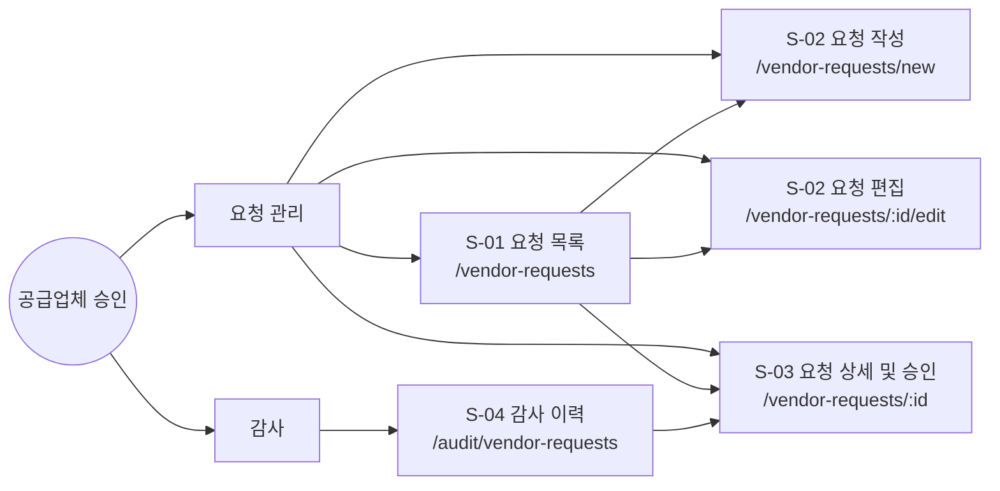
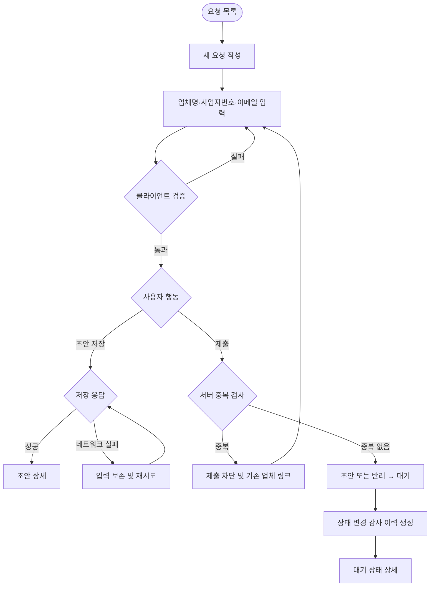
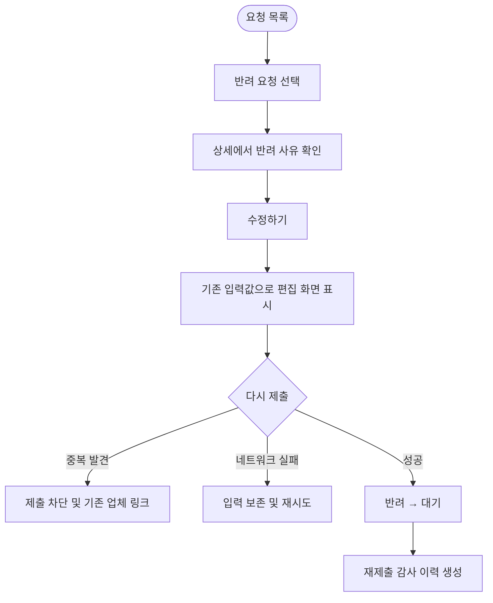
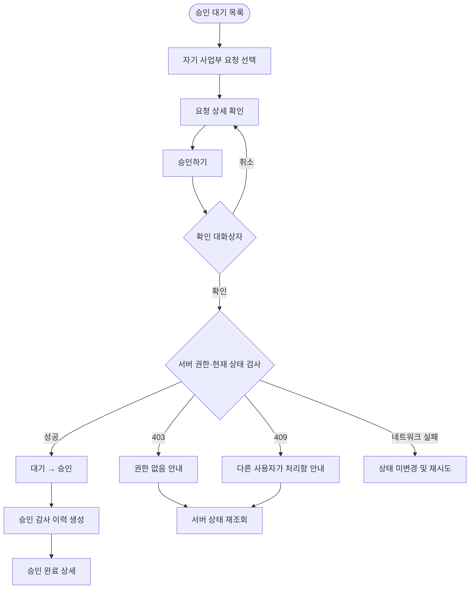
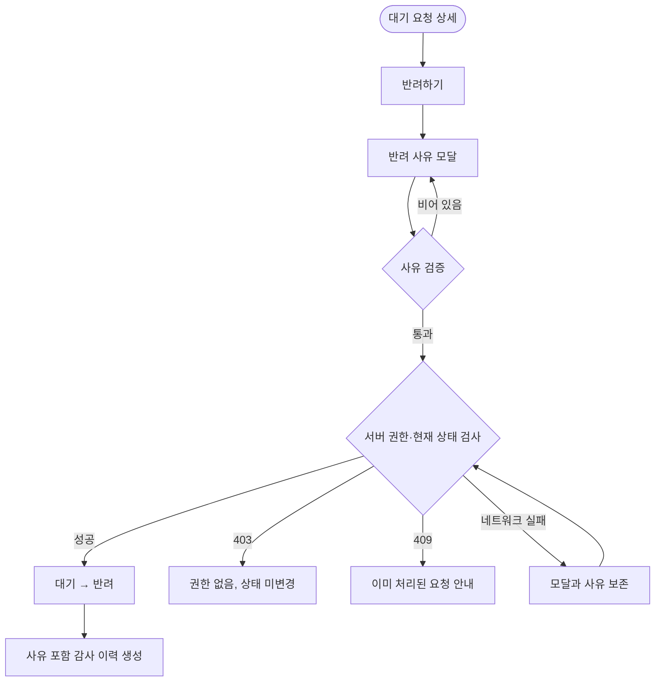
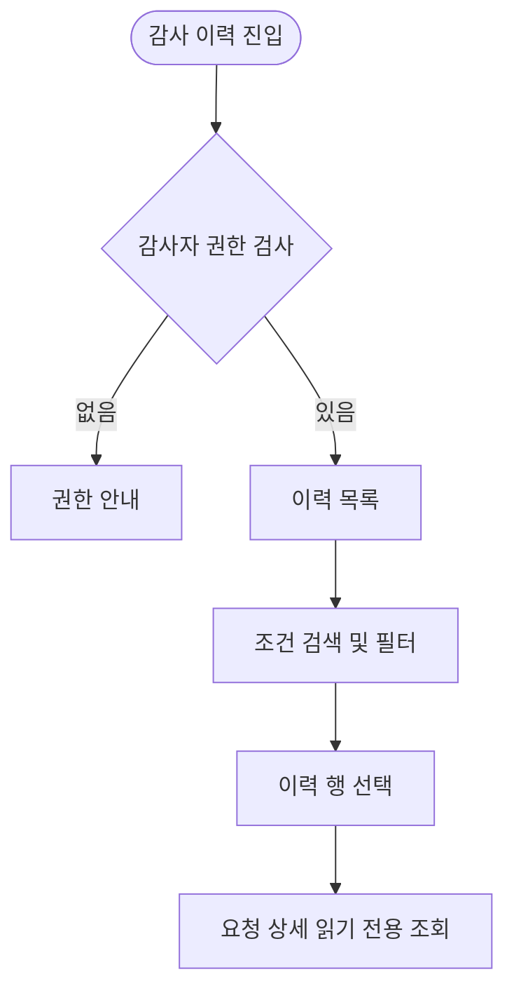

# 공급업체 승인 화면정의서

문서 상태: 구현 전달용 Draft  
기준일: 2026-07-27

## 전제 및 안전한 추론

- 요청자의 사업부는 폼에서 선택하지 않고 로그인 사용자 프로필에서 서버가 결정한다.
- `초안` 상태를 지원하기 위해 명시적인 `초안 저장` 기능을 둔다.
- 요청자는 자신이 작성한 요청만 조회·편집할 수 있다.
- 승인자는 자기 사업부 요청만 조회하며, `대기` 상태에서만 승인·반려할 수 있다.
- 감사 이력 화면은 감사자 전용으로 정의한다.
- 사업자번호 중복 여부는 입력 중 사전 확인할 수 있지만, 제출 시 서버가 반드시 다시 검사한다.
- 기존 업체 링크는 현재 사용자가 해당 업체를 조회할 권한이 있을 때만 상세 링크로 제공한다. 권한이 없으면 업체명과 “관리자 문의” 안내만 제공한다.
- 승인과 반려는 즉시 상태를 낙관적으로 변경하지 않는다. 서버 성공 응답 이후 화면에 반영한다.
- API 경로와 기술 스택은 구현 예시이며 프로젝트 표준에 맞게 조정할 수 있다.

---

# 1. IA

## 1.1 페이지 계층



`/vendors/:vendorId`는 중복 업체 안내에서 이동하는 기존 업체 시스템의 목적지이며 이번 구현 화면 범위에는 포함하지 않는다.

## 1.2 내비게이션

로그인 후 상단 내비게이션:

- 요청자: `공급업체 요청`
- 승인자: `승인 대기`
- 감사자: `감사 이력`
- 복수 역할 사용자는 보유 역할에 해당하는 메뉴를 모두 표시한다.
- 권한 없는 메뉴는 숨기되, URL 직접 접근에 대해서도 서버 권한 검사를 수행한다.

보조 내비게이션:

- 목록 → 상세: `공급업체 요청 > 요청 상세`
- 목록 → 작성: `공급업체 요청 > 새 요청`
- 상세 → 편집: `공급업체 요청 > 요청 상세 > 요청 편집`
- 감사 이력 → 상세: `감사 이력 > 요청 상세`

## 1.3 역할별 접근 권한

| 화면 | 요청자 | 승인자 | 감사자 |
|---|---:|---:|---:|
| S-01 요청 목록 | 본인 요청 | 자기 사업부 요청 | 접근 불가 |
| S-02 작성 | 허용 | 요청자 역할도 보유한 경우 | 접근 불가 |
| S-02 편집 | 본인의 초안·반려 요청 | 접근 불가 | 접근 불가 |
| S-03 상세 | 본인 요청, 읽기 전용 | 자기 사업부 요청 | 감사 이력에서 읽기 전용 |
| S-03 승인·반려 | 불가 | 자기 사업부의 대기 요청만 | 불가 |
| S-04 감사 이력 | 접근 불가 | 접근 불가 | 전체 읽기 전용 |

권한이 없는 직접 접근은 별도 권한 안내 화면을 표시하며 mutation API는 `403`을 반환한다.

## 1.4 FR–화면 매핑

| 요구사항 | 관련 화면 | 적용 내용 |
|---|---|---|
| FR-101 | S-02, S-03 | 필수 정보 입력, 제출, 제출 결과 확인 |
| FR-102 | S-02 | 중복 제출 차단, 기존 업체 링크 |
| FR-103 | S-01, S-03 | 자기 사업부 대기 요청 조회·승인·사유 포함 반려 |
| FR-104 | S-03 | 서버 권한 검사, 403 처리, 상태 유지 |
| FR-105 | S-03, S-04 | 상태 변경 이력 생성 및 읽기 전용 조회 |

---

# 2. User Flow

## Flow A — 요청 작성 및 제출



중복 검사는 입력 필드의 포커스 이탈 시 사전 수행할 수 있지만, 제출 시 검사가 최종 기준이다.

## Flow B — 반려 요청 수정 후 재제출



## Flow C — 승인자의 승인



## Flow D — 승인자의 반려



모달을 사용자가 직접 닫을 때만 사유를 폐기한다. 네트워크 오류나 재인증 과정에서는 보존한다.

## Flow E — 감사 이력 조회



## 수용 기준 커버리지

| 수용 기준 | 관련 Flow | 검증 결과 |
|---|---|---|
| 권한 없는 승인 시 403, 상태 불변 | C, D | 실패 시 상세를 재조회하고 성공 상태를 표시하지 않음 |
| 중복 사업자번호에서 제출 차단 | A, B | 서버 중복 검사 실패 시 대기 상태로 전이하지 않음 |
| 네트워크 실패 시 입력·반려 사유 보존 | A, B, D | 현재 폼 또는 모달 상태를 유지하고 재시도 제공 |
| 모바일 승인 상세 단일 열 | C, D | S-03 모바일 명세에 반영 |

---

# 3. Screen Spec

## 공통 규칙

### 상태와 상태 전이

| 현재 상태 | 허용 액션 | 다음 상태 |
|---|---|---|
| 초안 | 편집, 초안 저장 | 초안 |
| 초안 | 제출 | 대기 |
| 대기 | 승인자가 승인 | 승인 |
| 대기 | 승인자가 사유와 함께 반려 | 반려 |
| 반려 | 요청자가 편집·저장 | 반려 |
| 반려 | 요청자가 재제출 | 대기 |
| 승인 | 없음 | 승인 |

그 외 전이는 서버에서 거부한다. 승인·반려·재제출은 현재 버전 또는 `updatedAt`을 함께 보내 동시 처리 충돌을 검사한다.

### 공통 상태 표현

- `초안`: 중립 회색 배지
- `대기`: 주의색 배지
- `승인`: 성공색 배지
- `반려`: 오류색 배지와 반려 사유
- 목록·상세 로딩은 실제 레이아웃 형태의 스켈레톤을 사용한다.
- mutation 버튼은 처리 중 비활성화하고 `저장 중…`, `제출 중…`, `승인 중…`, `반려 중…`으로 변경한다.
- 네트워크 실패 시 사용자 입력을 초기화하지 않는다.
- 401은 재인증 후 원래 화면으로 복귀하고 작성 중 데이터를 복원한다.
- 사용자에게 서버 코드나 내부 예외 메시지를 노출하지 않는다.

---

## S-01 요청 목록

| 항목 | 명세 |
|---|---|
| Route | `/vendor-requests` |
| Audience | 요청자, 승인자 |
| Auth | 필수 |
| Linked FR | FR-103 |
| 레이아웃 | 제목, 역할별 요약, 필터, 요청 목록 |
| 기본 정렬 | 최근 생성일 또는 최근 상태 변경일 내림차순 |
| 행 이동 | 행 선택 시 S-03 상세 |

### 역할별 콘텐츠

- 요청자: 본인이 만든 모든 상태의 요청
- 승인자: 자기 사업부 요청, 기본 필터는 `대기`
- 복수 역할: `내 요청` / `승인 대기` 탭으로 범위를 명확히 구분

### 컴포넌트

| 슬롯 | 타입 | 규칙/내용 |
|---|---|---|
| scope_tabs | tablist | `내 요청`, `승인 대기`; 권한에 따라 표시 |
| status_filter | select | 전체, 초안, 대기, 승인, 반려 |
| search | search input | 업체명 또는 사업자번호 검색 |
| new_request | primary button | 요청자에게만 `새 요청 작성하기` |
| request_list | table/card list | 업체명, 마스킹 사업자번호, 상태, 사업부, 요청자, 수정일 |
| pagination | pagination | 서버 페이지네이션 |
| row_link | link | `요청 상세 보기` 접근 가능한 이름 제공 |

### 화면 상태 및 카피

- Loading: 테이블 헤더와 5개 행 형태의 스켈레톤.
- Empty, 첫 요청자: `아직 작성한 공급업체 요청이 없습니다.` + `새 요청 작성하기`.
- Empty, 승인자: `현재 승인 대기 중인 요청이 없습니다.`
- Empty, 필터 결과: `선택한 조건에 맞는 요청이 없습니다.` + `필터 초기화`.
- Error: `요청 목록을 불러오지 못했습니다.` + `다시 시도하기`.
- Success: 목록과 총 건수 표시.
- No permission: `공급업체 요청을 조회할 권한이 없습니다.` + `홈으로 이동`.

### 반응형

- Desktop ≥1024px: 테이블.
- Tablet 768–1023px: 중요 열만 유지하고 사업부·요청자는 보조 줄로 이동.
- Mobile <768px: 카드 목록 단일 열. 검색과 상태 필터를 세로 배치하며 가로 스크롤을 만들지 않는다.

Wireframe anchor: `#screen-request-list`

---

## S-02 요청 작성/편집

| 항목 | 명세 |
|---|---|
| Route | `/vendor-requests/new`, `/vendor-requests/:id/edit` |
| Audience | 요청자 |
| Auth | 필수 + 소유권 검사 |
| Linked FR | FR-101, FR-102 |
| 편집 가능 상태 | 본인의 초안 또는 반려 |
| 레이아웃 | 최대 720px 단일 폼 |

### 폼 컴포넌트

| 필드 | HTML 타입 | 필수 | 검증 | 예시/도움말 |
|---|---|---:|---|---|
| 업체명 | `text` | 예 | trim 후 1–100자 | `예: 위그튼 주식회사` |
| 사업자번호 | `text`, `inputmode=numeric` | 예 | 숫자 10자리, 표시 시 `000-00-00000` | `예: 123-45-67890` |
| 담당자 이메일 | `email` | 예 | 유효한 이메일, 최대 254자 | `예: vendor@example.com` |
| 사업부 | 읽기 전용 | 예 | 로그인 사용자 사업부 | `소속 사업부 기준으로 승인됩니다.` |

### 액션

- `취소`: 입력 변경이 있으면 이탈 확인.
- `초안 저장`: 클라이언트 검증 통과 후 저장. 중복은 제출 시에만 차단하되 사전 경고는 표시 가능.
- `제출하기` 또는 `다시 제출하기`: 서버 중복 검사 후 대기로 전환.
- 제출 중 모든 저장·제출 버튼을 비활성화하여 중복 요청을 방지한다.

### 중복 상태

서버가 중복을 반환하면:

- 상단 배너: `같은 사업자번호로 등록된 업체가 있습니다. 기존 업체를 확인한 후 다시 진행해 주세요.`
- 사업자번호 필드에 `aria-invalid="true"` 적용.
- 조회 권한이 있으면 `기존 업체 보기` 링크 제공.
- 조회 권한이 없으면 `기존 업체 조회 권한이 없습니다. 공급업체 관리자에게 문의해 주세요.` 표시.
- 폼의 다른 입력값은 그대로 유지.
- 요청 상태는 변경하지 않음.

### 화면 상태 및 카피

- Loading: 편집 화면 진입 시 필드 형태의 스켈레톤.
- Validation:
  - 업체명: `업체명을 입력해 주세요.`
  - 사업자번호: `사업자번호 10자리를 입력해 주세요.`
  - 이메일: `올바른 이메일 주소를 입력해 주세요.`
- Network error: `저장하지 못했습니다. 입력 내용은 유지됩니다.` + `다시 시도하기`.
- Success, 초안: `초안이 저장되었습니다.`
- Success, 제출: `승인 요청을 제출했습니다.` 후 S-03으로 이동.
- No permission: `이 요청을 수정할 권한이 없습니다.` + `목록으로 이동`.
- Locked status: 대기 또는 승인 상태라면 편집 폼 대신 `현재 상태에서는 수정할 수 없습니다.` 표시 후 상세로 이동.

### 반응형

- Desktop ≥1024px: 중앙 정렬 단일 폼, 하단 액션 우측 정렬.
- Tablet 768–1023px: 동일한 단일 열.
- Mobile <768px: 필드 단일 열, 버튼 세로 배치, 각 버튼 최소 높이 44px. 키보드 노출 시 현재 필드가 가려지지 않도록 스크롤한다.

Wireframe anchor: `#screen-request-form`

---

## S-03 요청 상세/승인

| 항목 | 명세 |
|---|---|
| Route | `/vendor-requests/:id` |
| Audience | 요청자, 승인자, 감사자 |
| Auth | 필수 + 소유권/사업부/감사자 권한 |
| Linked FR | FR-101, FR-103, FR-104, FR-105 |
| 레이아웃 | 요청 정보, 상태 정보, 역할별 액션, 최근 이력 |
| 감사자 모드 | 모든 액션이 없는 읽기 전용 |

### 콘텐츠

| 영역 | 내용 |
|---|---|
| summary_header | 업체명, 요청 ID, 상태 배지, 생성·수정 시각 |
| vendor_info | 업체명, 사업자번호, 담당자 이메일 |
| request_info | 요청자, 사업부 |
| rejection_panel | 반려 상태일 때 반려 사유, 반려자, 반려 시각 |
| recent_history | 최근 상태 변경 이력; 요청자·승인자는 볼 수 있는 범위만 표시 |
| requester_actions | 초안·반려에서 `수정하기` |
| approver_actions | 자기 사업부 대기 요청에서 `승인하기`, `반려하기` |

### 승인 확인 대화상자

- 제목: `이 공급업체 요청을 승인할까요?`
- 설명: `승인 후 요청자는 더 이상 내용을 수정할 수 없습니다.`
- 버튼: `취소`, `승인하기`
- 승인 완료 전 화면 상태를 변경하지 않는다.

### 반려 모달

| 항목 | 명세 |
|---|---|
| 제목 | `반려 사유 입력` |
| 필드 | `textarea` |
| 필수 | 예 |
| 검증 | trim 후 1–500자 |
| 안내 | `요청자가 수정할 내용을 알 수 있도록 구체적으로 작성해 주세요.` |
| 버튼 | `취소`, `반려하기` |
| 네트워크 실패 | 모달을 유지하고 입력 사유를 보존 |
| 재시도 | 동일 사유로 다시 요청 가능 |

### 오류와 충돌

- 403:
  - `이 요청을 승인하거나 반려할 권한이 없습니다.`
  - 서버 상태를 다시 조회한다.
  - 상태 배지와 이력을 성공 상태로 변경하지 않는다.
- 409:
  - `다른 승인자가 이미 이 요청을 처리했습니다. 최신 상태를 확인해 주세요.`
  - `최신 상태 보기`로 상세 재조회.
- Network:
  - `처리 결과를 확인하지 못했습니다. 요청 상태를 다시 확인한 후 재시도해 주세요.`
  - 승인 버튼은 다시 활성화하되, 재조회 전 자동 재전송하지 않는다.
  - 반려 사유는 보존한다.
- 5xx:
  - `요청을 처리하지 못했습니다. 잠시 후 다시 시도해 주세요.`

### 화면 상태

- Loading: 헤더, 정보 카드, 이력 영역 스켈레톤.
- Error: 전체 화면 오류와 `다시 시도하기`.
- Success: 상태별 상세와 허용 액션 표시.
- No permission: 권한 안내 화면. 승인 액션 자체를 렌더링하지 않음.
- Empty history: `아직 표시할 상태 변경 이력이 없습니다.`

### 반응형

- Desktop ≥1024px: 왼쪽 2/3 요청 정보, 오른쪽 1/3 상태·승인 액션.
- Tablet 768–1023px: 요청 정보와 액션의 2열을 유지하되 간격 축소.
- Mobile <768px: 반드시 `요청 정보 → 상태/반려 사유 → 액션 → 이력` 순서의 단일 열로 재배치. 승인·반려 버튼은 각각 44px 이상이며 가로 스크롤을 허용하지 않는다.

Wireframe anchor: `#screen-request-detail`

---

## S-04 감사 이력

| 항목 | 명세 |
|---|---|
| Route | `/audit/vendor-requests` |
| Audience | 감사자 |
| Auth | 필수 + 감사자 권한 |
| Linked FR | FR-105 |
| 레이아웃 | 필터, 읽기 전용 이력 테이블, 페이지네이션 |
| 정렬 | 이벤트 발생 시각 내림차순 |

### 필터와 컬럼

| 슬롯 | 타입 | 내용 |
|---|---|---|
| request_search | search | 요청 ID, 업체명, 사업자번호 |
| event_filter | select | 전체, 제출, 승인, 반려, 재제출 |
| actor_search | text | 행위자 이름 또는 계정 |
| department_filter | select | 사업부 |
| date_from/date_to | date | 발생 기간 |
| reset | button | `필터 초기화` |
| audit_table | table | 시각, 요청 ID, 업체명, 이전 상태, 새 상태, 행위, 행위자, 사업부, 반려 사유 |
| request_link | link | S-03 읽기 전용 상세 |

사업자번호, 이메일 등 개인정보성 정보는 조직의 마스킹 정책에 따라 표시한다. 감사 이력은 수정·삭제 UI를 제공하지 않는다.

### 화면 상태 및 카피

- Loading: 필터는 유지하고 이력 행 스켈레톤 표시.
- Empty, 전체: `아직 기록된 상태 변경 이력이 없습니다.`
- Empty, 필터: `선택한 조건에 맞는 이력이 없습니다.` + `필터 초기화`.
- Error: `감사 이력을 불러오지 못했습니다.` + `다시 시도하기`.
- Success: 조회 건수와 이력 목록.
- No permission: `감사 이력을 조회할 권한이 없습니다.` + `홈으로 이동`.

### 반응형

- Desktop ≥1024px: 전체 컬럼 테이블.
- Tablet 768–1023px: 반려 사유를 행 확장 영역으로 이동.
- Mobile <768px: 이력을 단일 열 카드로 표시하고 필터는 접이식 패널로 제공한다.

Wireframe anchor: `#screen-audit-history`

---

# 4. Lo-fi HTML Wireframe

아래 코드는 독립 HTML 파일로 복사해 브라우저에서 열 수 있다. 브랜드 표현 없이 회색조와 상태 의미색만 사용한다.

```html
<!doctype html>
<html lang="ko">
<head>
  <meta charset="utf-8">
  <meta name="viewport" content="width=device-width, initial-scale=1">
  <title>공급업체 승인 Lo-fi Wireframe</title>
  <style>
    :root {
      --bg: #f5f5f5;
      --surface: #fff;
      --text: #171717;
      --muted: #666;
      --line: #b8b8b8;
      --soft: #ededed;
      --danger: #9f1d1d;
      --danger-bg: #fff0f0;
      --success: #176b35;
      --success-bg: #edf9f0;
      --warning: #785500;
      --warning-bg: #fff7dc;
    }
    * { box-sizing: border-box; }
    body {
      margin: 0; color: var(--text); background: var(--bg);
      font: 15px/1.5 system-ui, sans-serif;
    }
    a { color: inherit; }
    button, input, select, textarea { font: inherit; }
    button, input, select, textarea {
      min-height: 44px; border: 1px solid #777; border-radius: 4px;
    }
    button { padding: 0 16px; background: white; cursor: pointer; }
    button.primary { color: white; background: #222; }
    button.danger { color: white; background: var(--danger); }
    button:disabled { cursor: wait; opacity: .55; }
    :focus-visible { outline: 3px solid #111; outline-offset: 2px; }
    header.site-header {
      position: sticky; top: 0; z-index: 10; background: white;
      border-bottom: 1px solid var(--line);
    }
    nav {
      max-width: 1180px; margin: auto; padding: 12px 20px;
      display: flex; align-items: center; gap: 24px; flex-wrap: wrap;
    }
    nav .links { display: flex; gap: 16px; flex-wrap: wrap; }
    main { max-width: 1180px; margin: auto; padding: 24px 20px 64px; }
    section.screen {
      margin: 0 0 48px; padding: 24px; background: white;
      border: 2px dashed var(--line); border-radius: 8px;
    }
    .meta { color: var(--muted); font-size: 13px; }
    .toolbar, .actions {
      display: flex; gap: 10px; flex-wrap: wrap; align-items: end;
    }
    .toolbar { margin: 18px 0; }
    .field { display: grid; gap: 6px; }
    .field input, .field select, .field textarea {
      width: 100%; padding: 10px; background: white;
    }
    .field textarea { min-height: 110px; resize: vertical; }
    .box {
      padding: 16px; background: var(--soft);
      border: 1px dashed #888; border-radius: 6px;
    }
    .stack { display: grid; gap: 14px; }
    .form { max-width: 720px; }
    .detail-grid {
      display: grid; grid-template-columns: minmax(0, 2fr) minmax(260px, 1fr);
      gap: 20px;
    }
    .status {
      display: inline-block; padding: 3px 9px; border-radius: 99px;
      border: 1px solid currentColor; font-size: 13px;
    }
    .waiting { color: var(--warning); background: var(--warning-bg); }
    .approved { color: var(--success); background: var(--success-bg); }
    .rejected { color: var(--danger); background: var(--danger-bg); }
    .alert {
      padding: 12px; border-left: 4px solid; border-radius: 3px;
    }
    .alert.error { color: var(--danger); background: var(--danger-bg); }
    .alert.success { color: var(--success); background: var(--success-bg); }
    .table-wrap { overflow-x: auto; }
    table { width: 100%; border-collapse: collapse; background: white; }
    th, td {
      padding: 12px; border: 1px solid var(--line);
      text-align: left; vertical-align: top;
    }
    .cards { display: none; gap: 10px; }
    dialog { width: min(520px, calc(100% - 32px)); border: 1px solid #444; }
    dialog::backdrop { background: rgb(0 0 0 / .45); }
    footer { padding: 24px; color: var(--muted); text-align: center; }

    @media (max-width: 1023px) {
      .detail-grid { grid-template-columns: minmax(0, 3fr) minmax(240px, 2fr); }
    }
    @media (max-width: 767px) {
      body { font-size: 14px; }
      main { padding: 16px 12px 48px; }
      section.screen { padding: 16px; }
      nav { align-items: flex-start; }
      nav .links { width: 100%; }
      .detail-grid { display: flex; flex-direction: column; }
      .detail-main { order: 1; }
      .detail-side { order: 2; }
      .detail-actions { order: 3; }
      .detail-history { order: 4; }
      .actions > button, .actions > a { width: 100%; }
      .desktop-table { display: none; }
      .cards { display: grid; }
    }
  </style>
</head>
<body>
  <header class="site-header">
    <nav aria-label="주요 메뉴">
      <strong>공급업체 승인</strong>
      <div class="links">
        <a href="#screen-request-list">요청 목록</a>
        <a href="#screen-request-form">요청 작성</a>
        <a href="#screen-request-detail">요청 상세</a>
        <a href="#screen-audit-history">감사 이력</a>
      </div>
    </nav>
  </header>

  <main>
    <section id="screen-request-list" class="screen"
      aria-labelledby="request-list-title">
      <h1 id="request-list-title">S-01 요청 목록</h1>
      <p class="meta">요청자: 내 요청 / 승인자: 자기 사업부 승인 대기</p>

      <div class="toolbar" role="search">
        <div class="field">
          <label for="scope">조회 범위</label>
          <select id="scope">
            <option>내 요청</option>
            <option>승인 대기</option>
          </select>
        </div>
        <div class="field">
          <label for="status">상태</label>
          <select id="status">
            <option>전체</option><option>초안</option><option>대기</option>
            <option>승인</option><option>반려</option>
          </select>
        </div>
        <div class="field">
          <label for="search">업체명 또는 사업자번호</label>
          <input id="search" type="search" placeholder="예: 위그튼 또는 123-45-67890">
        </div>
        <button type="button">검색하기</button>
        <button type="button" class="primary"
          onclick="location.hash='screen-request-form'">새 요청 작성하기</button>
      </div>

      <div class="table-wrap desktop-table">
        <table>
          <thead>
            <tr><th>업체명</th><th>사업자번호</th><th>상태</th><th>사업부</th><th>수정일</th></tr>
          </thead>
          <tbody>
            <tr>
              <td><a href="#screen-request-detail">위그튼 주식회사</a></td>
              <td>123-**-*****</td>
              <td><span class="status waiting">대기</span></td>
              <td>플랫폼사업부</td><td>2026-07-27 10:20</td>
            </tr>
            <tr>
              <td><a href="#screen-request-form">샘플상사</a></td>
              <td>555-**-*****</td>
              <td><span class="status rejected">반려</span></td>
              <td>플랫폼사업부</td><td>2026-07-26 16:10</td>
            </tr>
          </tbody>
        </table>
      </div>

      <div class="cards" aria-label="모바일 요청 목록">
        <article class="box">
          <strong>위그튼 주식회사</strong>
          <p>123-**-***** · 플랫폼사업부</p>
          <span class="status waiting">대기</span>
          <p><a href="#screen-request-detail">요청 상세 보기</a></p>
        </article>
      </div>
    </section>

    <section id="screen-request-form" class="screen"
      aria-labelledby="request-form-title">
      <h1 id="request-form-title">S-02 요청 작성/편집</h1>
      <p class="meta">초안과 반려 요청만 편집 가능</p>

      <form class="form stack" onsubmit="return false">
        <div class="field">
          <label for="company">업체명 *</label>
          <input id="company" required maxlength="100"
            placeholder="예: 위그튼 주식회사">
        </div>
        <div class="field">
          <label for="business-number">사업자번호 *</label>
          <input id="business-number" required inputmode="numeric"
            placeholder="예: 123-45-67890"
            aria-describedby="business-help">
          <small id="business-help">숫자 10자리를 입력해 주세요.</small>
        </div>
        <div class="alert error" role="alert">
          같은 사업자번호로 등록된 업체가 있습니다.
          <a href="/vendors/vendor-001">기존 업체 보기</a>
        </div>
        <div class="field">
          <label for="email">담당자 이메일 *</label>
          <input id="email" type="email" required maxlength="254"
            placeholder="예: vendor@example.com">
        </div>
        <div class="field">
          <label for="department">사업부</label>
          <input id="department" value="플랫폼사업부" readonly>
          <small>로그인 사용자의 소속 사업부가 적용됩니다.</small>
        </div>
        <div class="actions">
          <button type="button">취소하기</button>
          <button type="button">초안 저장하기</button>
          <button type="submit" class="primary">제출하기</button>
        </div>
        <div class="alert error" role="alert">
          저장하지 못했습니다. 입력 내용은 유지됩니다.
          <button type="button">다시 시도하기</button>
        </div>
      </form>
    </section>

    <section id="screen-request-detail" class="screen"
      aria-labelledby="request-detail-title">
      <h1 id="request-detail-title">S-03 요청 상세/승인</h1>
      <p><span class="status waiting">대기</span> 요청 ID VR-2026-0042</p>

      <div class="detail-grid">
        <div class="detail-main stack">
          <article class="box">
            <h2>공급업체 정보</h2>
            <dl>
              <dt>업체명</dt><dd>위그튼 주식회사</dd>
              <dt>사업자번호</dt><dd>123-45-67890</dd>
              <dt>담당자 이메일</dt><dd>vendor@example.com</dd>
            </dl>
          </article>
          <article class="box">
            <h2>요청 정보</h2>
            <p>요청자: 홍길동</p>
            <p>사업부: 플랫폼사업부</p>
          </article>
        </div>

        <aside class="detail-side box" aria-labelledby="approval-title">
          <h2 id="approval-title">승인 처리</h2>
          <p>자기 사업부의 대기 요청만 처리할 수 있습니다.</p>
          <div class="actions detail-actions">
            <button type="button" class="primary"
              onclick="document.querySelector('#approve-dialog').showModal()">
              승인하기
            </button>
            <button type="button" class="danger"
              onclick="document.querySelector('#reject-dialog').showModal()">
              반려하기
            </button>
          </div>
        </aside>
      </div>

      <article class="box detail-history" style="margin-top:20px">
        <h2>최근 상태 변경</h2>
        <ol>
          <li>2026-07-27 10:20 · 초안 → 대기 · 홍길동</li>
          <li>2026-07-27 09:55 · 초안 생성 · 홍길동</li>
        </ol>
      </article>
    </section>

    <section id="screen-audit-history" class="screen"
      aria-labelledby="audit-title">
      <h1 id="audit-title">S-04 감사 이력</h1>
      <p class="meta">감사자 전용 · 읽기 전용</p>

      <div class="toolbar" role="search">
        <div class="field">
          <label for="event">상태 변경</label>
          <select id="event">
            <option>전체</option><option>제출</option><option>승인</option>
            <option>반려</option><option>재제출</option>
          </select>
        </div>
        <div class="field">
          <label for="actor">행위자</label>
          <input id="actor" placeholder="이름 또는 계정">
        </div>
        <div class="field">
          <label for="date-from">시작일</label>
          <input id="date-from" type="date">
        </div>
        <button type="button">조회하기</button>
        <button type="button">필터 초기화</button>
      </div>

      <div class="table-wrap desktop-table">
        <table>
          <thead>
            <tr>
              <th>시각</th><th>요청</th><th>이전</th><th>변경</th>
              <th>행위자</th><th>사업부</th><th>사유</th>
            </tr>
          </thead>
          <tbody>
            <tr>
              <td>2026-07-27 10:20</td>
              <td><a href="#screen-request-detail">VR-2026-0042</a></td>
              <td>초안</td><td>대기</td><td>홍길동</td>
              <td>플랫폼사업부</td><td>-</td>
            </tr>
          </tbody>
        </table>
      </div>

      <div class="cards">
        <article class="box">
          <strong>VR-2026-0042 · 초안 → 대기</strong>
          <p>2026-07-27 10:20 · 홍길동 · 플랫폼사업부</p>
          <a href="#screen-request-detail">요청 상세 보기</a>
        </article>
      </div>
    </section>
  </main>

  <dialog id="approve-dialog" aria-labelledby="approve-dialog-title">
    <form method="dialog" class="stack">
      <h2 id="approve-dialog-title">이 공급업체 요청을 승인할까요?</h2>
      <p>승인 후 요청자는 더 이상 내용을 수정할 수 없습니다.</p>
      <div class="actions">
        <button value="cancel">취소하기</button>
        <button value="approve" class="primary">승인하기</button>
      </div>
    </form>
  </dialog>

  <dialog id="reject-dialog" aria-labelledby="reject-dialog-title">
    <form method="dialog" class="stack">
      <h2 id="reject-dialog-title">반려 사유 입력</h2>
      <div class="field">
        <label for="reason">반려 사유 *</label>
        <textarea id="reason" required maxlength="500"
          placeholder="요청자가 수정할 내용을 구체적으로 작성해 주세요."></textarea>
      </div>
      <div class="alert error" role="alert">
        반려하지 못했습니다. 입력한 사유는 유지됩니다.
      </div>
      <div class="actions">
        <button value="cancel">취소하기</button>
        <button type="button">다시 시도하기</button>
        <button value="reject" class="danger">반려하기</button>
      </div>
    </form>
  </dialog>

  <footer>공급업체 승인 · Lo-fi Wireframe</footer>
</body>
</html>
```

---

# 5. Dev Handoff

## 5.1 데이터 모델

### VendorRequest

```ts
type VendorRequestStatus = "DRAFT" | "PENDING" | "APPROVED" | "REJECTED";

interface VendorRequest {
  id: string;
  vendorName: string;
  businessNumber: string;
  contactEmail: string;
  departmentId: string;
  requesterId: string;
  status: VendorRequestStatus;
  rejectionReason: string | null;
  version: number;
  createdAt: string;
  updatedAt: string;
}
```

### AuditEvent

```ts
type AuditAction =
  | "SUBMITTED"
  | "APPROVED"
  | "REJECTED"
  | "RESUBMITTED";

interface AuditEvent {
  id: string;
  requestId: string;
  action: AuditAction;
  fromStatus: VendorRequestStatus;
  toStatus: VendorRequestStatus;
  actorId: string;
  actorDepartmentId: string;
  reason: string | null;
  occurredAt: string;
}
```

감사 레코드에는 필요한 범위의 요청 스냅샷이나 변경 전후 값을 보존해야 한다. 클라이언트가 전달한 행위자·사업부 값은 신뢰하지 않고 인증 세션에서 생성한다.

## 5.2 권장 API 계약

| Method / Endpoint | 목적 | 주요 응답 |
|---|---|---|
| `GET /api/vendor-requests` | 역할·사업부 범위 목록 조회 | 200, 401, 403 |
| `POST /api/vendor-requests` | 초안 생성 | 201, 400, 401 |
| `GET /api/vendor-requests/:id` | 상세 조회 | 200, 403, 404 |
| `PATCH /api/vendor-requests/:id` | 초안·반려 요청 편집 | 200, 403, 409, 422 |
| `POST /api/vendor-requests/:id/submit` | 제출·재제출 | 200, 403, 409, 422 |
| `POST /api/vendor-requests/:id/approve` | 승인 | 200, 403, 409 |
| `POST /api/vendor-requests/:id/reject` | 반려 | 200, 403, 409, 422 |
| `GET /api/vendors/duplicate?businessNumber=` | 중복 사전 확인 | 200 |
| `GET /api/audit/vendor-requests` | 감사 이력 조회 | 200, 403 |

중복 응답 예시:

```json
{
  "code": "DUPLICATE_BUSINESS_NUMBER",
  "message": "같은 사업자번호로 등록된 업체가 있습니다.",
  "existingVendor": {
    "id": "vendor-001",
    "name": "기존 업체명",
    "url": "/vendors/vendor-001",
    "canView": true
  }
}
```

`canView`가 false이면 상세 URL을 반환하지 않거나 클라이언트가 링크를 렌더링하지 않는다.

## 5.3 서버 불변 조건

- 제출 시 정규화한 사업자번호에 대해 중복을 원자적으로 검사한다.
- 데이터베이스에도 정규화 사업자번호의 유일성 또는 동등한 동시성 보호를 둔다.
- 승인·반려 API는 사용자의 승인자 역할과 `request.departmentId` 일치를 검사한다.
- 권한 검사는 요청 ID만으로 우회할 수 없도록 서버 쿼리 또는 정책 계층에서 수행한다.
- 권한 검사가 실패하면 상태와 감사 이력을 모두 변경하지 않고 `403`을 반환한다.
- 승인·반려는 `PENDING`에서만 허용한다.
- 재제출은 `DRAFT` 또는 `REJECTED`에서만 허용한다.
- 상태 변경과 감사 이력 insert는 하나의 트랜잭션으로 처리한다.
- `version` 또는 `updatedAt` 조건을 사용해 중복 승인 시 `409`를 반환한다.
- mutation 재시도에 대비해 idempotency key 지원을 권장한다.
- 로그에 전체 사업자번호, 담당자 이메일, 반려 사유를 불필요하게 기록하지 않는다.

## 5.4 프런트엔드 상태 관리

- 서버 데이터: 프로젝트 표준 query/cache 도구 사용.
- 폼: 스키마 기반 검증을 권장하되 서버 검증을 최종 기준으로 삼는다.
- 입력 보존:
  - mutation 실패 시 폼 값을 reset하지 않는다.
  - 반려 모달은 성공 또는 사용자의 명시적 취소에만 초기화한다.
  - 인증 만료 후 복귀가 필요한 경우 session storage에 임시 보존하되 민감정보 정책을 확인한다.
- 승인·반려 결과는 낙관적 업데이트하지 않는다.
- 처리 결과가 불명확한 네트워크 오류에서는 mutation을 자동 반복하지 말고 상세 상태를 먼저 재조회한다.
- 중복 확인 응답은 참고용이며 제출 버튼 활성화 여부의 유일한 기준으로 삼지 않는다.

## 5.5 재사용 컴포넌트

- `StatusBadge`
- `RequestList`
- `RequestCard`
- `VendorRequestForm`
- `BusinessNumberInput`
- `DuplicateVendorAlert`
- `RequestDetailPanel`
- `ApprovalConfirmDialog`
- `RejectionDialog`
- `AuditHistoryTable`
- `EmptyState`
- `ErrorBanner`
- `NoPermissionState`
- `ResponsiveFilterPanel`

## 5.6 접근성

- 모든 입력에는 연결된 `label`을 제공한다.
- 오류 입력에는 `aria-invalid="true"`와 오류 설명의 `aria-describedby`를 적용한다.
- mutation 영역은 `aria-busy`를 제공한다.
- 동적 오류와 성공 알림은 `role="alert"` 또는 적절한 live region으로 알린다.
- 모달이 열리면 내부로 포커스를 이동하고 닫을 때 트리거 버튼으로 복귀한다.
- 모달은 Escape로 닫을 수 있어야 하며 네트워크 오류로 자동 닫지 않는다.
- 상태는 색상만이 아니라 텍스트 배지로 전달한다.
- 텍스트 대비 WCAG AA, 터치 타깃 최소 44×44px를 충족한다.
- 테이블의 모바일 카드 전환 후에도 동일한 정보와 상세 링크를 제공한다.

## 5.7 테스트 우선순위

### 필수 통합 테스트

1. 요청 제출 성공 시 `초안 → 대기`와 감사 이력이 함께 생성된다.
2. 중복 사업자번호 제출은 `422` 또는 합의된 비즈니스 오류를 반환하고 상태가 변하지 않는다.
3. 다른 사업부 승인자가 승인 API를 호출하면 `403`이며 요청과 감사 이력이 변하지 않는다.
4. 승인 성공 시 `대기 → 승인`과 감사 이력이 하나의 트랜잭션으로 반영된다.
5. 반려 사유가 없으면 서버가 반려를 거부한다.
6. 반려 성공 시 사유가 감사 이력에 남는다.
7. 반려 요청 수정 후 재제출하면 `반려 → 대기` 이력이 생성된다.
8. 두 승인자의 동시 처리 중 하나만 성공하고 다른 요청은 `409`가 된다.
9. 감사자가 아닌 사용자는 감사 API와 화면에 접근할 수 없다.

### 필수 UI/E2E 테스트

1. 중복 오류 후 업체명과 이메일 값이 보존된다.
2. 저장·제출 네트워크 실패 후 모든 필드 값과 재시도 버튼이 유지된다.
3. 반려 네트워크 실패 후 모달과 반려 사유가 유지된다.
4. 403 승인 응답 후 승인 완료 토스트가 표시되지 않고 기존 상태가 유지된다.
5. 409 응답 시 최신 상태 조회 행동이 제공된다.
6. 375px와 767px 화면에서 S-03이 단일 열이며 가로 스크롤이 없다.
7. 키보드만으로 목록, 폼, 확인 대화상자, 반려 모달을 완료할 수 있다.

## 5.8 구현 순서

1. 상태 모델, 권한 정책, 감사 트랜잭션
2. 요청 작성·초안 저장·제출 API
3. 중복 사업자번호 검사와 유일성 보호
4. S-02 요청 폼
5. S-01 역할별 목록
6. S-03 상세, 승인·반려 API와 UI
7. S-04 감사 이력
8. 네트워크 복구, 403·409 처리
9. 모바일 단일 열과 접근성
10. 수용 기준 통합/E2E 테스트

## 5.9 요구사항 추적성

| FR | 구현 단위 | 검증 |
|---|---|---|
| FR-101 | `VendorRequestForm`, create/update/submit API | 필수 필드 및 제출 E2E |
| FR-102 | `BusinessNumberInput`, `DuplicateVendorAlert`, 서버 중복 검사 | 중복 시 상태 불변 통합 테스트 |
| FR-103 | 승인자 목록, 승인·반려 다이얼로그와 API | 사업부별 승인·반려 E2E |
| FR-104 | 서버 RBAC/사업부 정책 | 다른 사업부 호출 403 테스트 |
| FR-105 | 상태 전이 트랜잭션, 감사 이력 화면 | 모든 전이별 감사 레코드 테스트 |

## 5.10 구현 전 확정 권장사항

- 사업자번호 중복 범위가 전체 조직인지, 사업부별인지
- 감사 이력의 개인정보 마스킹 및 보존 기간
- 복수 역할 사용자의 기본 목록 탭
- 승인 완료 후 되돌리기·취소 기능이 정말 없는지
- 기존 업체 상세 링크에 대한 별도 조회 권한 정책

위 항목은 핵심 화면 구조를 바꾸지는 않지만 데이터 제약과 권한 테스트 기준에는 영향을 준다.