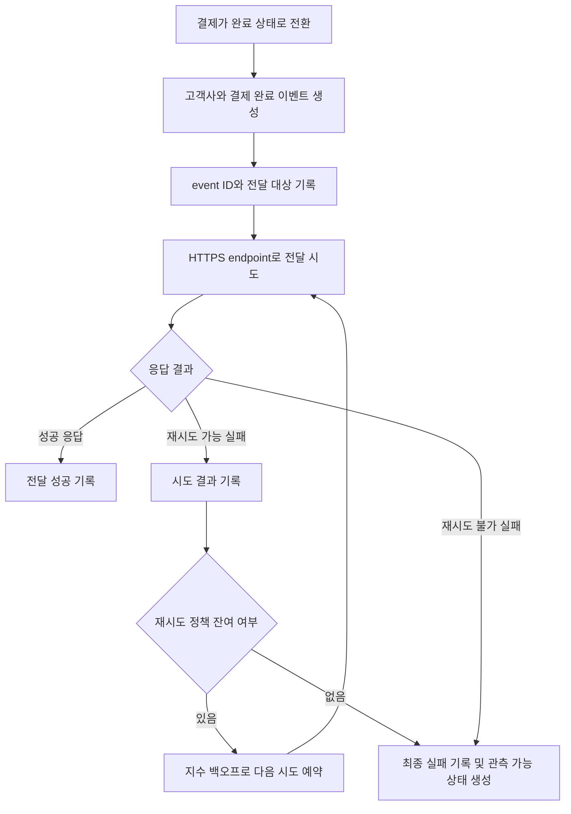

# 결제 완료 웹훅 전달 API PRD

## 1. 문서 목적

결제가 완료되었을 때 고객사별로 등록된 HTTPS endpoint에 결제 완료 이벤트를 최소 1회 전달하는 서버 기능을 정의한다.

본 기능은 고객사가 중복 이벤트를 식별할 수 있는 안정적인 이벤트 ID를 제공하며, 일시적인 네트워크 장애에 대해 지수 백오프 방식으로 자동 재시도한다.

---

## 2. 적용 범위

| 계약 항목 | 구분 | 근거 |
|---|---|---|
| 문제·목표·비목표 | 필수 | 신규 백엔드 전달 기능의 범위와 성공 조건을 정의해야 한다. |
| 사용자·역할·권한 | 필수 | 고객사별 endpoint와 데이터가 격리되어야 한다. |
| 기능 요구사항 및 안정적 ID | 필수 | 구현과 수용 테스트를 연결해야 한다. |
| 페이지·라우트 | 해당 없음 | 이번 범위에는 UI가 없다. |
| UI 상태 매트릭스 | 해당 없음 | 사용자에게 노출되는 화면이 없다. |
| 시스템 흐름도 | 필수 | 이벤트 생성, 전달, 재시도 및 종료 상태를 거치는 다단계 처리다. |
| 인증·데이터 경계 | 필수 | 고객사 간 데이터 격리가 핵심 요구사항이다. |
| 정량적 비기능 목표 | 해당 없음 | 처리량과 지연 기준이 측정되지 않아 SLA를 설정할 근거가 없다. 측정 항목만 정의한다. |
| 수용 기준 | 필수 | 최소 1회 전달과 재시도 동작을 검증해야 한다. |
| 가정·열린 결정 | 필수 | 서명 방식, secret rotation 및 재시도 세부 파라미터가 미정이다. |
| 단계별 출시 계획 | 필수 | 보안 결정 전 구현 가능한 영역과 출시 차단 조건을 구분해야 한다. |

---

## 3. 배경과 문제

고객사는 자사 시스템에서 결제 완료 이후의 주문 처리, 정산, 알림 등의 후속 작업을 수행하기 위해 결제 완료 사실을 비동기로 받아야 한다.

외부 endpoint로의 전달은 네트워크 장애, 타임아웃, 고객사 서버 장애 등으로 실패할 수 있다. 또한 최소 1회 전달 방식에서는 같은 이벤트가 여러 차례 전달될 수 있으므로, 고객사가 중복 처리를 방지할 수 있는 식별자가 필요하다.

고객사별 endpoint, 이벤트, 전달 이력 및 향후 도입될 서명 secret은 다른 고객사의 요청 처리 과정에서 조회되거나 사용되어서는 안 된다.

---

## 4. 목표

- 결제 완료 이벤트를 해당 고객사의 등록된 HTTPS endpoint로 전달한다.
- 결제 완료 이벤트가 전달 대상에서 유실되지 않도록 최소 1회 전달을 보장한다.
- 재시도되는 모든 요청에 동일한 이벤트 ID를 제공한다.
- 재시도 가능한 실패에 지수 백오프를 적용한다.
- 고객사별 endpoint, payload, 전달 상태 및 secret의 데이터 경계를 강제한다.
- 처리량, 전달 지연, 성공률 및 재시도 현황을 측정할 수 있게 한다.
- 서명 규격이 결정된 후 전달 로직을 크게 변경하지 않고 적용할 수 있게 한다.

---

## 5. 비목표

- endpoint 등록·수정·삭제 API 개발
- endpoint 관리 UI
- 웹훅 replay 대시보드
- 운영자 또는 고객사의 수동 재전송
- 고객사 endpoint의 가용성 보장
- 이벤트의 정확히 1회(exactly-once) 전달
- 서로 다른 이벤트 간의 전달 순서 보장
- 측정 근거가 없는 처리량 또는 전달 지연 SLA 설정
- 결제 완료 외 다른 결제 상태 이벤트 제공

자동 재시도는 범위에 포함되며, 수동 재전송만 제외한다.

---

## 6. 용어 및 이벤트 모델

| 용어 | 정의 |
|---|---|
| 고객사 | 결제 완료 웹훅을 수신하는 테넌트 |
| 이벤트 | 하나의 결제 완료 사실을 표현하는 논리적 레코드 |
| 이벤트 ID | 이벤트 생성 시 한 번 부여되고 모든 재시도에서 유지되는 전역적으로 고유한 식별자 |
| 전달 | 특정 이벤트를 고객사의 endpoint로 전송하는 작업 |
| 전달 시도 | 최초 전송 또는 개별 재시도 한 번 |
| 재시도 가능 실패 | 정책상 자동 재시도 대상으로 분류된 실패 |
| 최종 실패 | 자동 재시도 정책을 소진했거나 재시도하지 않는 오류로 종료된 상태 |
| 최소 1회 전달 | 이벤트가 중복 전달될 수 있지만, 정상 처리 흐름에서 전달 시도 없이 유실되어서는 안 되는 전달 의미론 |

---

## 7. 사용자, 역할 및 권한

| 역할 | 목적 | 허용되는 동작 | 금지되는 동작 |
|---|---|---|---|
| 고객사 시스템 | 결제 완료 이벤트 수신 및 후속 처리 | 자신의 endpoint로 전달된 이벤트 수신, event ID 기반 중복 제거 | 다른 고객사의 이벤트·endpoint·전달 이력 접근 |
| 기존 내부 endpoint 관리 API | 고객사 endpoint 관리 | 인증된 고객사 범위에서 endpoint 등록·변경·비활성화 | 웹훅 전달 실행 및 수동 재전송 |
| 웹훅 전달 서비스 | 이벤트 생성 및 자동 전달 | 고객사 범위의 endpoint 조회, 전달, 자동 재시도, 상태 기록 | 다른 고객사의 endpoint 또는 secret 사용 |
| 내부 운영자 | 장애 조사 | 권한이 부여된 내부 관측 도구로 상태 확인 | 1차 출시에서 수동 재전송 실행 |

---

## 8. 시스템 흐름



---

## 9. 기능 요구사항

| ID | 요구사항 | 우선순위 |
|---|---|---|
| FR-001 | 결제가 완료 상태로 확정되면 해당 결제와 고객사에 귀속된 결제 완료 이벤트를 생성해야 한다. | Must |
| FR-002 | 동일한 결제 완료 사실이 중복 감지되더라도 별개의 논리 이벤트가 반복 생성되지 않도록 멱등성 기준을 가져야 한다. | Must |
| FR-003 | 각 이벤트에는 전역적으로 고유하고 변경되지 않는 `event_id`가 있어야 한다. | Must |
| FR-004 | 최초 전달과 모든 재시도는 동일한 `event_id`와 동일한 논리 payload를 사용해야 한다. | Must |
| FR-005 | 이벤트는 해당 이벤트의 `customer_id`에 귀속된 등록 endpoint로만 전달해야 한다. | Must |
| FR-006 | 전달 대상은 HTTPS endpoint만 허용하며 HTTP POST로 전달해야 한다. | Must |
| FR-007 | 요청 본문은 최소한 `event_id`, 이벤트 유형, 이벤트 발생 시각, 스키마 버전 및 결제 식별 정보를 포함해야 한다. 정확한 결제 필드 목록은 OD-002에서 확정한다. | Must |
| FR-008 | endpoint 조회, 이벤트 저장 및 전달 상태 조회에는 항상 서버 측 고객사 범위 조건을 적용해야 한다. | Must |
| FR-009 | 결제 완료가 확정된 이벤트는 프로세스 재시작이나 일시적인 작업자 장애 후에도 전달 시도가 계속될 수 있도록 내구성 있게 기록해야 한다. | Must |
| FR-010 | 각 전달 시도의 시작 시각, 종료 시각, 시도 번호, 결과 분류 및 다음 재시도 예정 시각을 기록해야 한다. | Must |
| FR-011 | 성공으로 분류되지 않은 네트워크 실패에는 지수 백오프를 적용하여 자동 재시도해야 한다. | Must |
| FR-012 | 재시도 예약은 기본 지연, 증가 계수, 최대 지연, jitter 및 최대 시도 횟수 또는 최대 재시도 기간을 설정 가능한 정책으로 제공해야 한다. 구체적인 값은 OD-003에서 확정한다. | Must |
| FR-013 | 성공 응답을 수신한 이벤트는 자동으로 다시 전달하지 않아야 한다. 단, 동시성이나 응답 유실로 인한 중복 수신 가능성은 고객사 계약에 명시한다. | Must |
| FR-014 | 자동 재시도 정책을 소진한 전달은 최종 실패 상태로 기록하고 운영 지표 및 로그에서 식별 가능해야 한다. | Must |
| FR-015 | 등록된 활성 endpoint가 없으면 외부 전송을 시도하지 않고 전달 불가 상태와 원인을 기록해야 한다. | Must |
| FR-016 | 서로 다른 이벤트의 전달 순서는 보장하지 않으며, 고객사가 순서에 의존하지 않도록 API 계약에 명시해야 한다. | Must |
| FR-017 | 웹훅 요청에는 보안 담당자가 확정한 방식에 따라 고객사가 출처와 무결성을 검증할 수 있는 서명 정보를 포함해야 한다. | Must, 출시 차단 |
| FR-018 | 서명 secret은 고객사별로 분리되어야 하며 로그, 오류 메시지 또는 payload에 평문으로 노출되어서는 안 된다. | Must, 출시 차단 |
| FR-019 | secret rotation 중 이전 secret과 신규 secret을 처리하는 호환 정책을 지원해야 한다. 구체적인 중첩 기간과 검증 규칙은 OD-001에서 확정한다. | Must, 출시 차단 |
| FR-020 | endpoint 변경 후 이미 생성된 이벤트의 재시도 대상 결정은 확정된 endpoint 일관성 정책을 따라야 한다. | Must |
| FR-021 | 1차 출시에서는 운영자 및 고객사가 최종 실패 이벤트를 수동 재전송할 수 있는 인터페이스를 제공하지 않는다. | Must |

---

## 10. 웹훅 계약 초안

정확한 payload는 열린 결정 OD-002를 거쳐 확정한다. 다음 구조를 최소 계약으로 가정한다.

```json
{
  "event_id": "unique-event-id",
  "event_type": "payment.completed",
  "occurred_at": "RFC-3339 timestamp",
  "schema_version": "version identifier",
  "data": {
    "payment_id": "customer-visible payment identifier",
    "status": "completed",
    "completed_at": "RFC-3339 timestamp"
  }
}
```

계약 원칙:

- `event_id`는 재시도 간 변경되지 않는다.
- 스키마 버전이 명시되어야 한다.
- payload에는 해당 고객사에 귀속된 데이터만 포함한다.
- 민감정보와 불필요한 개인정보는 포함하지 않는다.
- 금액, 통화, 주문 ID 등 추가 필드는 업무 필요성과 데이터 노출 검토 후 확정한다.
- 서명 헤더 이름과 생성 방식은 보안 결정 전 임의로 확정하지 않는다.

---

## 11. 응답 및 재시도 분류

다음은 구현을 진행하기 위한 합리적 가정이며, 외부 API 계약 확정 시 검토해야 한다.

| 결과 | 처리 |
|---|---|
| HTTP 2xx | 전달 성공 |
| 연결 실패, DNS 실패, TLS 실패, 응답 타임아웃 | 재시도 |
| HTTP 408 | 재시도 |
| HTTP 429 | 재시도 |
| HTTP 5xx | 재시도 |
| 그 외 HTTP 4xx | 재시도하지 않고 최종 실패 |
| 리다이렉션 응답 | 자동 추적하지 않고 실패로 기록 |

재시도 시 고객사 endpoint가 `Retry-After`를 반환하는 경우 이를 우선할지는 OD-003에서 결정한다.

---

## 12. 전달 상태 모델

| 상태 | 의미 |
|---|---|
| `pending` | 이벤트가 생성되었고 최초 전달을 기다리는 상태 |
| `in_progress` | 전달 시도가 진행 중인 상태 |
| `retry_scheduled` | 재시도 가능 실패 후 다음 전달을 기다리는 상태 |
| `succeeded` | 성공 응답을 수신한 상태 |
| `failed_terminal` | 재시도 불가 오류 또는 재시도 정책 소진으로 종료된 상태 |
| `undeliverable` | 활성 endpoint 부재 등으로 외부 전달을 시작할 수 없는 상태 |

상태명은 내부 구현에서 달라질 수 있으나, 위 상태를 구분할 수 있는 동등한 정보는 제공해야 한다.

---

## 13. 인증, 권한 및 데이터 경계

- 모든 이벤트, endpoint, 전달 상태 및 secret에는 고객사 식별자가 연결되어야 한다.
- 전달 작업은 이벤트의 고객사 식별자와 endpoint의 고객사 식별자가 일치하는지 서버 측에서 검증해야 한다.
- 작업 식별자나 이벤트 ID만으로 고객사 범위를 우회하여 데이터를 조회해서는 안 된다.
- 고객사 A의 이벤트에 고객사 B의 endpoint 또는 secret을 사용하는 실행 경로가 없어야 한다.
- 로그와 지표의 고객사 식별자는 운영상 필요한 최소 수준으로 제한한다.
- 결제 payload는 허용 목록 방식으로 구성하며 내부 결제 객체 전체를 직렬화하지 않는다.
- endpoint 등록 API가 HTTPS URL 검증과 네트워크 접근 제한을 수행한다는 가정을 두되, 리다이렉션이나 DNS 변경을 통한 내부망 접근 위험은 전달 계층에서도 방어해야 한다.
- 서명 규격과 secret rotation 정책이 확정되지 않은 상태에서 프로덕션 외부 전달을 활성화해서는 안 된다.

---

## 14. 비기능 요구사항

| ID | 요구사항 |
|---|---|
| NFR-001 | 처리량과 지연 SLA는 측정 결과와 제품 요구가 확보되기 전까지 설정하지 않는다. |
| NFR-002 | 이벤트 생성부터 최초 시도까지의 지연, 성공까지의 지연, 대기 중 이벤트 수, 전달 시도 수, 성공률, 재시도율 및 최종 실패 수를 측정해야 한다. |
| NFR-003 | 지표는 고객사별 데이터 격리를 침해하지 않는 범위에서 전체 및 고객사 단위 문제를 조사할 수 있어야 한다. |
| NFR-004 | 로그에는 `event_id`, 내부 전달 ID, 결과 분류 및 시도 번호를 연결할 수 있어야 한다. |
| NFR-005 | 로그에 secret, 서명 원문 생성 재료 또는 불필요한 결제 개인정보를 기록해서는 안 된다. |
| NFR-006 | 동일 이벤트에 대한 작업자 동시 실행이 불필요한 중복 전달을 증가시키지 않도록 동시성 제어를 적용해야 한다. 최소 1회 특성상 중복 가능성 자체는 제거하지 않는다. |
| NFR-007 | 장애 후 재개 시 성공 완료된 이벤트와 재시도 대상 이벤트를 구분할 수 있어야 한다. |
| NFR-008 | 이벤트와 전달 이력의 보관 기간 및 삭제 정책은 개인정보·감사 요구사항에 따라 확정해야 한다. |

---

## 15. 수용 기준

| ID | 연결 요구사항 | Given | When | Then | 검증 |
|---|---|---|---|---|---|
| AC-001 | FR-001~004 | 고객사 결제가 완료 상태로 확정되었다 | 이벤트 처리가 실행된다 | 하나의 논리 이벤트가 생성되고 고유한 `event_id`가 부여된다 | 통합 테스트 |
| AC-002 | FR-002 | 동일 결제 완료 신호가 반복 입력되었다 | 이벤트 생성 로직이 재실행된다 | 동일한 완료 사실에 대해 별개의 논리 이벤트가 중복 생성되지 않는다 | 중복 입력 테스트 |
| AC-003 | FR-004, FR-011 | 최초 전달이 네트워크 오류로 실패했다 | 자동 재시도가 수행된다 | 최초 요청과 재시도 요청의 `event_id` 및 논리 payload가 같다 | 통합 테스트 |
| AC-004 | FR-005, FR-008 | 고객사 A와 B가 서로 다른 endpoint를 보유한다 | 고객사 A의 결제가 완료된다 | 고객사 A의 endpoint로만 이벤트가 전달된다 | 격리 통합 테스트 |
| AC-005 | FR-006 | 등록된 HTTPS endpoint가 있다 | 전달이 실행된다 | HTTP POST 요청으로 payload가 전송된다 | 계약 테스트 |
| AC-006 | FR-009 | 이벤트 기록 직후 전달 작업자가 중단된다 | 작업자가 재시작된다 | 이벤트가 유실되지 않고 전달 대상 상태로 복구된다 | 장애 복구 테스트 |
| AC-007 | FR-010 | 전달이 한 번 이상 시도되었다 | 전달 이력을 조회한다 | 시도 번호, 시각, 결과 및 다음 재시도 정보가 기록되어 있다 | 저장소 통합 테스트 |
| AC-008 | FR-011, FR-012 | endpoint가 연속으로 재시도 가능 실패를 반환한다 | 여러 차례 재시도된다 | 확정된 정책에 따라 지연이 증가하고 jitter와 상한이 적용된다 | 시간 제어 테스트 |
| AC-009 | FR-013 | endpoint가 성공 응답을 반환했다 | 다음 자동 실행 주기가 도래한다 | 해당 이벤트에 새로운 자동 전달이 예약되지 않는다 | 통합 테스트 |
| AC-010 | FR-014 | 모든 자동 재시도 기회가 소진되었다 | 마지막 실패가 처리된다 | 전달이 최종 실패로 기록되고 관련 지표가 증가한다 | 통합 테스트 |
| AC-011 | FR-015 | 고객사에 활성 endpoint가 없다 | 결제가 완료된다 | 외부 요청 없이 전달 불가 상태와 사유가 기록된다 | 통합 테스트 |
| AC-012 | FR-017~019 | 서명 및 rotation 규격이 확정되어 있다 | 웹훅이 전달된다 | 고객사가 정해진 규격으로 서명과 허용된 secret 버전을 검증할 수 있다 | 보안 계약 테스트 |
| AC-013 | FR-018 | 두 고객사가 서로 다른 secret을 가진다 | 각 고객사 이벤트가 전달된다 | 각 요청은 해당 고객사의 secret만 사용하며 교차 검증에 실패한다 | 보안 격리 테스트 |
| AC-014 | NFR-002~005 | 성공, 재시도 및 최종 실패 이벤트가 발생했다 | 운영 지표와 로그를 확인한다 | 각 결과를 구분할 수 있고 secret이나 금지된 개인정보가 노출되지 않는다 | 관측성·로그 검사 |
| AC-015 | FR-021 | 이벤트가 최종 실패 상태다 | 1차 출시 기능을 확인한다 | 대시보드 또는 API를 통한 수동 재전송 기능이 존재하지 않는다 | API 및 기능 목록 검사 |

---

## 16. 합리적 가정

다음은 브리프에 명시되지 않았지만 PRD 작성과 초기 구현 설계를 위해 사용하는 가정이다.

- AS-001: 하나의 고객사에는 특정 시점에 하나의 활성 결제 완료 웹훅 endpoint가 존재한다.
- AS-002: 기존 내부 API가 endpoint와 고객사 소유 관계를 인증하고 HTTPS URL만 등록한다.
- AS-003: HTTP 2xx 전체를 전달 성공으로 간주한다.
- AS-004: 네트워크 오류와 408, 429, 5xx는 일시적 실패로 간주하고 재시도한다.
- AS-005: 그 외 4xx는 동일 요청을 반복해도 성공 가능성이 낮으므로 자동 재시도하지 않는다.
- AS-006: 이벤트 간 순서는 보장하지 않는다.
- AS-007: 결제 완료는 하나의 결제 생명주기에서 중복 감지 가능한 안정적인 업무 식별자를 가진다.
- AS-008: endpoint 변경 이전에 생성된 이벤트는 이벤트 생성 시점의 endpoint로 재시도한다. 변경 이후 이벤트부터 새 endpoint를 사용한다.
- AS-009: 자동 재시도는 서버가 내구성 있게 관리하며 고객사의 재시도 요청 API는 제공하지 않는다.
- AS-010: payload는 고객사가 후속 처리를 수행하는 데 필요한 최소 결제 정보만 포함한다.

AS-008은 보안 사고로 endpoint를 긴급 교체하는 경우와 충돌할 수 있으므로 OD-004 확정 시 변경될 수 있다.

---

## 17. 열린 결정

| ID | 결정 사항 | 결정 책임자 | 결정 시점 | 영향 |
|---|---|---|---|---|
| OD-001 | 서명 알고리즘, 서명 대상 문자열, 헤더 형식, timestamp·재전송 공격 방어 방식, secret rotation 주기 및 중첩 기간 | 보안 담당자 | 프로덕션 출시 전 | 출시 차단 |
| OD-002 | 최종 payload 필드, 개인정보 포함 여부, 금액·통화·주문 ID 제공 여부 및 버전 호환 정책 | 제품·결제 도메인·보안 담당자 | 외부 계약 테스트 전 | API 계약 차단 |
| OD-003 | 최초 지연, 증가 계수, 최대 지연, jitter 방식, 최대 시도 횟수 또는 최대 기간, `Retry-After` 처리 | 플랫폼·운영 담당자 | 재시도 통합 테스트 전 | 구현 세부 차단 |
| OD-004 | endpoint 변경·비활성화 시 기존 이벤트가 기존 endpoint와 신규 endpoint 중 어디로 재시도되는지 | 제품·보안 담당자 | 전달 대상 저장 방식 확정 전 | 데이터 모델 영향 |
| OD-005 | 이벤트 및 전달 이력의 보관 기간, 삭제와 익명화 정책 | 보안·개인정보·운영 담당자 | 프로덕션 출시 전 | 저장 비용·컴플라이언스 영향 |
| OD-006 | 활성 endpoint가 없는 이벤트를 추후 endpoint 등록 시 자동 전달할지, 최종 전달 불가로 유지할지 | 제품 담당자 | 상태 전이 구현 전 | 자동 전달 범위 영향 |
| OD-007 | 처리량 및 지연 SLA 설정 여부 | 제품·플랫폼 담당자 | 실제 트래픽 측정 이후 | 출시 차단 아님 |
| OD-008 | 고객사별 장애가 전체 전달 처리량을 잠식하지 않도록 하는 공정성·제한 정책 | 플랫폼 담당자 | 부하 측정 이후 또는 출시 전 위험 평가 시 | 안정성 영향 |

---

## 18. 위험과 완화 방안

| 위험 | 영향 | 완화 |
|---|---|---|
| 중복 전달로 고객사의 중복 처리 발생 | 이중 주문 처리 또는 알림 | 안정적인 `event_id` 제공, 고객사 문서에 멱등 처리 요구 명시 |
| 결제 확정과 이벤트 생성 사이의 유실 | 결제 완료 미통지 | 내구성 있는 이벤트 기록과 장애 복구 테스트 |
| 특정 고객사 endpoint 장애로 재시도 누적 | 전체 전달 지연 | 지수 백오프, jitter, 동시성 제한 및 고객사 단위 관측 |
| 고객사 데이터 또는 secret 혼용 | 심각한 정보 유출 | 모든 저장·조회·작업에 고객사 범위 강제, 교차 고객사 보안 테스트 |
| 서명 정책 미정 상태로 출시 | 위조 이벤트 및 무결성 검증 불가 | OD-001을 프로덕션 출시 차단 조건으로 지정 |
| endpoint 변경 중 잘못된 주소로 재시도 | 유실 또는 오배송 | endpoint 버전과 대상 정책 확정, 긴급 비활성화 경로 고려 |
| payload에 과도한 결제 정보 포함 | 개인정보·결제정보 노출 | 허용 목록 기반 payload와 로그 마스킹 |
| 리다이렉션 또는 DNS 변경을 통한 내부망 접근 | SSRF 및 내부 시스템 노출 | 리다이렉션 미추적, endpoint 검증 및 네트워크 egress 통제 |
| SLA 조기 설정 | 달성 불가능한 약속 | 측정부터 수행하고 실제 분포를 근거로 후속 결정 |

---

## 19. 출시 및 구현 단계

| 단계 | 요구사항 ID | 검증 가능한 완료 조건 |
|---|---|---|
| 1. 이벤트·격리 기반 | FR-001~005, FR-008~010 | 이벤트 생성, 고유 ID, 고객사 격리 및 장애 후 복구 테스트 통과 |
| 2. 전달·자동 재시도 | FR-006~016, FR-020 | HTTPS 전달, 결과 분류, 지수 백오프, 성공·최종 실패 상태 테스트 통과 |
| 3. 보안 계약 적용 | FR-017~019 | OD-001 확정 후 서명, 고객사별 secret 격리 및 rotation 계약 테스트 통과 |
| 4. 관측성·운영 준비 | NFR-002~008, FR-021 | 필수 지표와 안전한 로그 확인, 수동 재전송 기능이 범위에 포함되지 않았음을 확인 |
| 5. 제한 출시 및 기준 측정 | NFR-001, OD-007~008 | 실제 처리량과 지연 분포를 수집하고 병목 및 고객사별 장애 영향을 평가 |
| 6. 프로덕션 출시 | 전체 Must 요구사항 | 모든 출시 차단 열린 결정이 해소되고 수용 기준 AC-001~015가 통과 |

---

## 20. 출시 게이트

다음 조건이 충족되기 전에는 프로덕션 고객사 endpoint로 전달을 활성화하지 않는다.

- 서명 검증 방식과 요청 규격 확정
- 고객사별 secret 저장·조회·rotation 정책 확정
- 최종 payload 계약 확정
- 재시도 파라미터 및 종료 조건 확정
- 고객사 간 데이터·secret 격리 테스트 통과
- 장애 복구 및 최소 1회 전달 테스트 통과
- 로그에서 secret과 금지된 결제정보가 노출되지 않음을 확인

처리량과 전달 지연 SLA 확정은 출시 게이트가 아니다. 1차 출시에서는 지표를 수집해 기준선을 확보하고, 이후 실제 측정 결과를 근거로 별도 SLA를 결정한다.