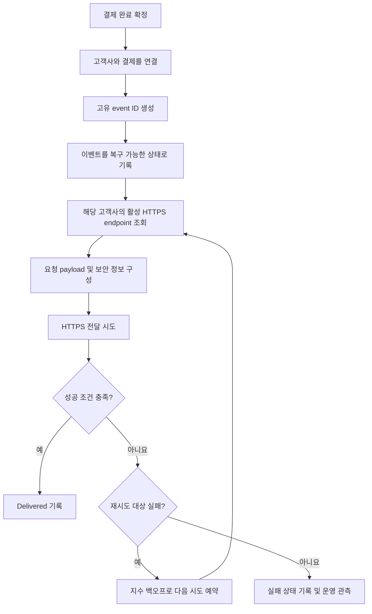

# 결제 완료 웹훅 전달 API PRD

## 1. 문서 개요

- 기능명: 결제 완료 웹훅 전달 API
- 대상: 결제 시스템, 웹훅 전달 시스템, 고객사 백엔드 개발자, 내부 운영·보안 담당자
- 문서 상태: 초안
- 범위: 백엔드 이벤트 생성 및 HTTPS 전달
- UI 범위: 없음
- 핵심 전달 보장: 최소 1회(at-least-once)
- 출시 차단 결정: 서명 검증 방식 확정

## 2. Applicability

| 계약 항목 | 적용 여부 | 근거 |
|---|---|---|
| 문제·목표·비목표 | 필수 | 결제 완료 이벤트를 고객사 시스템에 안정적으로 전달해야 한다. |
| 사용자·역할·권한 | 필수 | 고객사별 endpoint와 이벤트 데이터의 접근 경계를 정의해야 한다. |
| 안정적인 요구사항 ID | 필수 | 구현, 테스트 및 출시 범위를 추적해야 한다. |
| 페이지·라우트 | 해당 없음 | 이번 범위에 사용자 UI가 없다. |
| 화면 상태 매트릭스 | 해당 없음 | 사용자에게 노출되는 화면이 없다. |
| 시스템 흐름 | 필수 | 이벤트 생성, 전달, 실패, 재시도 상태를 정의해야 한다. |
| 인가·데이터 경계 | 필수 | 고객사별 데이터 격리가 요구된다. |
| 정량적 SLA | 해당 없음 | 처리량과 지연 기준을 정할 측정 근거가 없다. |
| 관측 가능성 | 필수 | 전달 성공률, 지연 및 재시도 정책을 결정할 운영 데이터가 필요하다. |
| 보안 요구사항 | 필수 | 외부 endpoint 통신, 서명, secret 및 고객사 격리를 다룬다. |
| 접근성·사용자 분석 | 해당 없음 | UI 및 사용자 행동 분석 기능이 없다. |
| 인수 조건 | 필수 | 최소 1회 전달과 중복·격리·재시도를 검증해야 한다. |
| 단계별 출시 계획 | 필수 | 미정인 보안 결정과 기능 구현의 의존성을 관리해야 한다. |

## 3. 배경과 문제

고객사는 결제 완료 후 주문 확정, 서비스 활성화, 회계 처리 등 후속 업무를 수행해야 한다. 현재 브리프에서는 고객사가 등록한 HTTPS endpoint로 결제 완료 사실을 능동적으로 전달하는 수단이 필요하다.

외부 네트워크와 고객사 시스템은 일시적으로 실패할 수 있으므로 단일 전달만으로는 이벤트 유실을 방지할 수 없다. 반면 최소 1회 전달 방식에서는 같은 이벤트가 중복 전달될 수 있으므로, 고객사가 중복을 식별할 수 있는 안정적인 event ID가 필요하다.

또한 한 고객사의 endpoint, secret, 이벤트 또는 전달 이력이 다른 고객사의 요청 처리에 사용되거나 노출되어서는 안 된다.

## 4. 목표

- 결제가 완료되면 해당 고객사에 등록된 HTTPS endpoint로 결제 완료 이벤트를 전달한다.
- 이벤트를 전달하기 전에 복구 가능한 상태로 기록하여 최소 1회 전달을 보장한다.
- 네트워크 실패 시 지수 백오프 정책에 따라 자동으로 재시도한다.
- 최초 전달과 모든 재시도에서 동일한 event ID를 제공한다.
- 고객사가 event ID를 이용해 중복 이벤트를 식별할 수 있게 한다.
- endpoint, 이벤트, 전달 상태 및 서명용 secret의 고객사 경계를 서버에서 강제한다.
- 운영 지표를 수집하여 향후 처리량·지연 SLA와 재시도 정책을 근거 기반으로 결정할 수 있게 한다.

## 5. 비목표

- endpoint 등록·수정·삭제 API 개발
- endpoint 또는 전달 이력을 관리하는 UI
- replay 대시보드
- 운영자 또는 고객사의 수동 재전송
- 고객사 대신 중복 이벤트를 제거하는 기능
- 이벤트 간 전달 순서 보장
- 결제 완료 외 이벤트 유형 지원
- 근거가 없는 처리량, 성공률 또는 전달 지연 SLA 설정
- 서명 알고리즘과 secret rotation 주기를 이 PRD에서 임의로 확정하는 것

## 6. 용어 및 상태

### 6.1 주요 용어

| 용어 | 정의 |
|---|---|
| 고객사 | 결제 서비스를 이용하며 하나 이상의 내부 식별자로 구분되는 tenant |
| endpoint | 기존 내부 API를 통해 고객사에 등록된 HTTPS 수신 주소 |
| webhook event | 결제 완료 사실을 나타내는 논리적 이벤트 |
| event ID | 논리적 이벤트마다 생성되는 전역적으로 고유하고 변경되지 않는 식별자 |
| delivery attempt | endpoint에 이벤트를 전달하기 위한 개별 HTTP 요청 |
| retry | 동일한 event ID와 논리적 payload를 사용한 후속 전달 시도 |
| terminal state | 자동 전달이 더 이상 진행되지 않는 최종 상태 |

### 6.2 이벤트 전달 상태

상태 명칭은 구현체에 맞게 달라질 수 있지만 다음 의미는 보존해야 한다.

| 상태 | 의미 |
|---|---|
| Pending | 결제 완료 이벤트가 기록되었으나 아직 전달 성공이 확인되지 않음 |
| Delivering | 하나의 전달 시도가 진행 중임 |
| Retry scheduled | 실패 후 다음 자동 재시도가 예약됨 |
| Delivered | 고객사 endpoint가 성공 응답을 반환함 |
| Exhausted | 확정될 재시도 종료 조건에 도달하여 자동 재시도가 끝남 |

`Exhausted` 상태의 사용 여부와 종료 조건은 OD-03 결정에 따른다.

## 7. 사용자, 역할 및 권한

| 역할 | 목적 | 허용 작업 | 금지 작업 |
|---|---|---|---|
| 결제 시스템 | 결제 완료 사실 발행 | 완료된 결제에 대한 이벤트 생성 요청 또는 트리거 | 다른 고객사로 tenant 정보를 변경하거나 임의 재전송 |
| 웹훅 전달 시스템 | 이벤트의 안전한 전달 | 해당 고객사의 endpoint 조회, 전달, 재시도, 상태 기록 | 다른 고객사의 endpoint·secret·이벤트 사용 |
| 고객사 수신 시스템 | 결제 완료 후속 처리 | HTTPS 요청 수신, 서명 검증, event ID 기반 중복 제거 | 다른 고객사의 이벤트 또는 전달 기록 조회 |
| 내부 운영자 | 장애 관찰 및 진단 | 권한 범위 내 메트릭·로그 확인 | 1차 출시에서 수동 재전송 수행 |
| 보안 담당자 | 전달 인증 정책 결정 | 서명 방식과 secret rotation 정책 승인 | 고객사 간 secret 공유 |

## 8. 시스템 흐름



## 9. 기능 요구사항

| ID | 요구사항 | 우선순위 |
|---|---|---|
| FR-01 | 결제가 최종 완료 상태로 확정될 때 결제 완료 webhook event를 정확히 하나의 논리적 이벤트로 생성해야 한다. | Must |
| FR-02 | 이벤트에는 변경되지 않는 고유 event ID, 이벤트 유형, 발생 시각, 고객사 식별 경계 및 결제 식별자가 포함되어야 한다. | Must |
| FR-03 | 이벤트는 최초 외부 전달을 시도하기 전에 장애 후 복구 가능한 상태로 기록되어야 한다. | Must |
| FR-04 | 전달 시스템은 이벤트에 연결된 고객사의 활성 endpoint만 조회하고 사용해야 한다. | Must |
| FR-05 | 외부 전달 대상은 HTTPS endpoint여야 하며, HTTP endpoint로 평문 전달해서는 안 된다. | Must |
| FR-06 | endpoint가 성공 조건을 반환할 때까지 또는 확정된 종료 조건에 도달할 때까지 동일 이벤트의 전달 상태를 추적해야 한다. | Must |
| FR-07 | 네트워크 실패가 발생하면 다음 시도 간격이 증가하는 지수 백오프로 자동 재시도해야 한다. | Must |
| FR-08 | 최초 전달과 모든 재시도는 동일한 event ID를 사용해야 한다. | Must |
| FR-09 | 재시도하더라도 이벤트의 논리적 의미와 결제 식별 정보는 변경되지 않아야 한다. 전달 시각, 시도 번호 등 전달 메타데이터는 변경될 수 있다. | Must |
| FR-10 | 고객사가 중복 처리 방지 키로 사용할 수 있도록 event ID를 HTTP 요청에서 명확하게 제공해야 한다. | Must |
| FR-11 | 전달 요청에는 payload 형식을 구분할 수 있는 이벤트 유형과 스키마 버전이 포함되어야 한다. | Must |
| FR-12 | 성공·실패·재시도 예약 각각에 대해 event ID, tenant ID, endpoint 식별자, 시도 번호, 결과 분류 및 시각을 운영 진단이 가능한 형태로 기록해야 한다. | Must |
| FR-13 | 로그와 메트릭에는 결제정보, payload 또는 secret 전체가 불필요하게 노출되지 않아야 한다. | Must |
| FR-14 | 고객사별 endpoint, 이벤트, 전달 상태 및 secret의 조회와 사용에 서버 측 tenant 검증을 적용해야 한다. | Must |
| FR-15 | 서명 방식이 확정되면 각 요청에 고객사가 출처와 무결성을 검증할 수 있는 서명 정보를 포함해야 한다. | 출시 전 Must |
| FR-16 | 서명 검증 규격에는 최소한 서명 대상 데이터, 알고리즘, 헤더 형식, timestamp 사용 여부 및 허용 시간 오차가 명시되어야 한다. | 출시 전 Must |
| FR-17 | secret rotation 정책 확정 후 이전 secret과 신규 secret의 전환 방식이 고객사 요청 검증을 중단시키지 않도록 구현되어야 한다. | 출시 전 Must |
| FR-18 | endpoint 미등록·비활성·조회 실패를 다른 고객사의 endpoint로 대체해서는 안 되며, 해당 이벤트의 실패 원인을 기록해야 한다. | Must |
| FR-19 | 동시 실행 또는 작업자 장애가 발생하더라도 동일 이벤트가 영구 유실되어서는 안 된다. 중복 전달은 허용된다. | Must |
| FR-20 | 전달 성공으로 기록하기 전에 고객사 endpoint의 성공 응답을 실제로 수신해야 한다. 요청 전송 여부가 불명확한 실패는 성공으로 간주해서는 안 된다. | Must |
| FR-21 | 1차 출시에서는 replay 조회, 수동 재전송 명령 및 이를 위한 외부·운영 API를 제공하지 않는다. | Must |

## 10. 외부 전달 계약

아래는 구현을 진행하기 위한 최소 계약이다. 구체적인 필드명은 기존 API 명명 규칙과 보안 결정에 맞춰 확정할 수 있지만 의미는 유지해야 한다.

### 10.1 요청

- HTTP method: `POST`
- 전송 방식: HTTPS
- 콘텐츠 형식: 버전이 명시된 JSON
- event ID: payload와 명시적인 요청 헤더 중 적어도 한 곳에 제공
- event type: 결제 완료 이벤트임을 나타내는 안정적인 값
- signature: OD-01 결정 후 필수 헤더로 확정
- timestamp: 서명 재전송 공격 방지에 사용하기로 결정될 경우 서명 계약에 포함

예시 구조:

```json
{
  "id": "<event_id>",
  "type": "payment.completed",
  "schema_version": "<version>",
  "occurred_at": "<timestamp>",
  "data": {
    "payment_id": "<customer-visible payment identifier>"
  }
}
```

위 예시는 필수 의미를 표현하기 위한 것으로, 실제 필드명과 추가 결제 정보는 기존 결제 데이터 계약 및 최소 정보 제공 원칙에 따라 확정한다.

### 10.2 성공과 실패

- 어떤 HTTP 응답을 성공으로 간주할지는 OD-02에서 확정한다.
- 네트워크 연결 실패, DNS 실패, TLS 실패 및 timeout은 최소한 재시도 대상 실패로 분류한다.
- HTTP 상태 코드별 재시도 여부는 OD-02에서 확정한다.
- 응답 본문은 성공 판정의 필수 조건으로 가정하지 않는다.
- redirect 추종 여부는 보안 검토 후 확정한다.

## 11. 최소 1회 전달 계약

최소 1회 전달은 다음 조건을 의미한다.

1. 결제 완료 이벤트는 외부 요청 전에 복구 가능한 상태로 기록된다.
2. 성공 응답이 확인되지 않은 이벤트는 자동 처리 대상에서 사라지지 않는다.
3. timeout처럼 고객사가 요청을 처리했는지 판단할 수 없는 경우 동일 event ID로 재시도할 수 있다.
4. 시스템 장애 후에도 미완료 이벤트의 전달 또는 재시도를 재개할 수 있다.
5. 중복 전달은 정상적으로 발생할 수 있으며, 고객사가 event ID로 멱등성을 구현해야 한다.

이는 고객사의 비즈니스 처리가 정확히 한 번 실행된다는 보장이 아니다.

## 12. 인가 및 데이터 경계

- 모든 이벤트는 생성 시점부터 하나의 tenant에 귀속되어야 한다.
- endpoint 조회에는 이벤트의 tenant ID를 서버 측 조건으로 사용해야 한다.
- endpoint ID만으로 조회한 뒤 별도 tenant 확인 없이 전달해서는 안 된다.
- 서명 secret은 해당 tenant 또는 해당 tenant의 endpoint에 명시적으로 귀속되어야 한다.
- 전달 작업, 재시도 작업 및 장애 복구 과정에서도 최초 이벤트의 tenant 경계를 다시 검증해야 한다.
- 고객사에 전달하는 payload에는 다른 고객사의 식별자, 결제 데이터 또는 내부 운영 정보가 포함되어서는 안 된다.
- 운영 로그 및 메트릭 조회 권한은 기존 내부 권한 체계를 따르되, tenant 범위를 우회하지 않아야 한다.
- 격리 실패가 감지되면 잘못된 endpoint로 전달을 계속하지 않고 보안 사고 후보로 기록해야 한다.

## 13. 비기능 요구사항

### 13.1 신뢰성

- 이벤트 기록과 전달 작업 생성 사이의 장애로 이벤트가 유실되지 않아야 한다.
- 작업자 재시작 또는 일시적 인프라 장애 후 미완료 이벤트 처리가 재개되어야 한다.
- 동일 이벤트의 병렬 처리 가능성은 중복 전달을 유발할 수 있지만 tenant 혼합이나 event ID 변경을 유발해서는 안 된다.

### 13.2 보안

- 외부 통신은 HTTPS만 허용한다.
- 운영 환경 출시는 보안 담당자가 승인한 서명 검증 규격을 충족해야 한다.
- secret은 로그, 오류 메시지 및 payload에 평문으로 노출하지 않는다.
- secret 저장·조회는 기존 비밀정보 관리 기준을 따라야 한다.
- endpoint 등록 API가 주소 안전성 검증을 담당하는지 확인해야 한다. 담당하지 않는다면 SSRF, 내부망 주소 및 DNS 재바인딩 방어 책임을 별도 요구사항으로 추가해야 한다.
- TLS 인증서 검증을 비활성화해서는 안 된다.

### 13.3 관측 가능성

다음 항목을 측정하되, 초기 목표 수치는 설정하지 않는다.

- 생성된 결제 완료 이벤트 수
- 최초 전달 시도 수
- 전달 성공·실패 수와 결과 분류
- 이벤트 발생부터 최초 시도까지의 지연 분포
- 이벤트 발생부터 성공 응답까지의 지연 분포
- 이벤트당 시도 횟수 분포
- 재시도 예약 수
- 미완료 이벤트의 수와 체류 시간
- tenant별 집계가 필요한 경우 권한이 통제된 형태의 집계
- 서명 또는 tenant 경계 검증 실패 수

### 13.4 성능 및 SLA

처리량과 전달 지연 SLA는 현재 정의하지 않는다. 1차 출시 전후의 관측 데이터를 기반으로 다음을 결정한다.

- 지속 및 최대 처리량 목표
- 최초 전달 지연 목표
- 최종 전달 성공률과 측정 구간
- 동시 전달 제한
- 고객사별 rate limit 또는 격리 정책
- 재시도 큐가 정상 처리량에 미치는 영향

## 14. 인수 조건

| ID | 요구사항 | Given | When | Then | 검증 방법 |
|---|---|---|---|---|---|
| AC-01 | FR-01, FR-02 | 특정 tenant의 결제가 완료됨 | 완료 처리가 확정됨 | 고유 event ID를 가진 `payment.completed` 이벤트 하나가 생성됨 | 통합 테스트 |
| AC-02 | FR-03, FR-19 | 이벤트가 생성됨 | 최초 외부 요청 직전에 프로세스가 중단됨 | 재시작 후 동일 event ID의 전달이 자동으로 진행됨 | 장애 주입 테스트 |
| AC-03 | FR-04, FR-14 | A와 B tenant에 서로 다른 endpoint가 등록됨 | A의 결제가 완료됨 | 요청은 A의 endpoint로만 전달되고 B의 endpoint·secret은 사용되지 않음 | 격리 통합 테스트 |
| AC-04 | FR-05 | 등록 정보가 HTTPS가 아님 | 전달을 시도함 | 평문 HTTP 요청이 전송되지 않고 실패 원인이 기록됨 | 통합 테스트 |
| AC-05 | FR-07 | endpoint 연결에 네트워크 실패가 발생함 | 자동 재시도가 실행됨 | 각 다음 시도는 승인된 지수 백오프 설정에 따라 예약됨 | 시간 제어 통합 테스트 |
| AC-06 | FR-08, FR-09, FR-10 | 최초 시도가 실패함 | 동일 이벤트를 재시도함 | 최초 요청과 재시도 요청의 event ID 및 논리적 결제 데이터가 같음 | 요청 캡처 테스트 |
| AC-07 | FR-20 | 요청 전송 후 응답 수신 전에 timeout이 발생함 | 결과를 처리함 | 이벤트는 Delivered로 기록되지 않고 동일 event ID의 재시도 대상이 됨 | 장애 주입 테스트 |
| AC-08 | FR-06 | endpoint가 승인된 성공 응답을 반환함 | 전달 결과를 처리함 | 이벤트가 Delivered로 기록되고 자동 재시도가 더 예약되지 않음 | 통합 테스트 |
| AC-09 | FR-12, FR-13 | 성공, timeout 및 네트워크 실패가 각각 발생함 | 운영 기록을 조회함 | 시도별 결과와 시각을 식별할 수 있고 secret 및 민감 payload 전체는 노출되지 않음 | 로그·메트릭 검사 |
| AC-10 | FR-15, FR-16 | 보안 담당자가 서명 규격을 승인함 | webhook 요청이 생성됨 | 승인된 규격으로 검증 가능한 서명 정보가 모든 요청에 포함됨 | 서명 계약 테스트 |
| AC-11 | FR-17 | 신규 secret 전환이 시작됨 | 합의된 rotation 전환 구간에 요청을 검증함 | 승인된 전환 정책에 따라 고객사의 검증 연속성이 유지됨 | 보안 통합 테스트 |
| AC-12 | FR-18 | 이벤트 tenant에 활성 endpoint가 없음 | 전달 처리가 실행됨 | 다른 tenant로 전달되지 않으며 실패 원인이 기록됨 | 격리 통합 테스트 |
| AC-13 | FR-19 | 동일 이벤트 작업이 중복 실행됨 | 두 작업이 전달을 시도함 | event ID가 변하지 않고 이벤트가 유실되지 않으며 다른 tenant 데이터가 섞이지 않음 | 동시성 테스트 |
| AC-14 | FR-21 | 1차 출시 빌드를 배포함 | 공개 및 운영 기능을 확인함 | replay 대시보드와 수동 재전송 기능이 존재하지 않음 | API·기능 목록 검사 |
| AC-15 | FR-11 | 서로 다른 지원 버전의 이벤트를 구성함 | 요청을 수신함 | 고객사가 이벤트 유형과 스키마 버전을 명확히 식별할 수 있음 | 계약 테스트 |

## 15. 합리적 가정

다음은 구현 방향을 구체화하기 위한 가정이며, 열린 결정과 구분한다.

| ID | 가정 | 틀릴 경우 영향 |
|---|---|---|
| AS-01 | 기존 내부 endpoint 등록 API는 endpoint와 tenant의 소유 관계를 신뢰할 수 있게 저장한다. | 등록 API의 인가 및 데이터 모델 보완이 선행되어야 한다. |
| AS-02 | 결제 시스템은 결제의 최종 완료 상태와 tenant를 식별할 수 있다. | 이벤트 생성 조건과 tenant 연결 계약을 먼저 정의해야 한다. |
| AS-03 | 고객사는 event ID를 저장하고 중복 이벤트를 멱등하게 처리할 책임이 있다. | 정확히 한 번 처리에 가까운 별도 프로토콜이 필요해진다. |
| AS-04 | 이벤트 간 순서 보장은 요구되지 않는다. | tenant 또는 결제 단위 순서 제어와 재시도 설계가 추가로 필요하다. |
| AS-05 | 동일 고객사에 활성 endpoint 하나를 선택하는 기존 규칙이 있거나 등록 API가 이를 보장한다. | 복수 endpoint 전달 및 성공 판정 규칙이 추가로 필요하다. |
| AS-06 | 고객사 endpoint의 응답 본문은 전달 성공 판정에 필요하지 않다. | 응답 스키마와 검증 규칙이 추가로 필요하다. |
| AS-07 | 고객사별 payload 커스터마이징은 1차 출시 범위가 아니다. | 템플릿, 버전 및 호환성 관리가 추가로 필요하다. |
| AS-08 | event ID는 고객사에 노출 가능한 불투명 식별자이며 재시도 중 재생성되지 않는다. | 외부용 식별자 체계를 별도로 정의해야 한다. |

## 16. 열린 결정

| ID | 결정 사항 | 결정 주체 | 결정 시점 | 영향 |
|---|---|---|---|---|
| OD-01 | 서명 알고리즘, 서명 대상, 헤더 형식, timestamp 및 허용 시간 오차 | 보안 담당자 | 운영 출시 전 | FR-15·16 및 고객사 연동 문서의 출시 차단 항목 |
| OD-02 | 성공 HTTP 상태 범위, 상태 코드별 재시도 여부, redirect 처리 | API·보안 담당자 | 구현 상세 확정 전 | 전달 상태와 재시도 계약 |
| OD-03 | 최대 시도 횟수 또는 최대 재시도 기간, 종료 후 상태 및 운영 대응 | 제품·운영 담당자 | 운영 출시 전 | 무한 재시도 위험, `Exhausted` 상태 |
| OD-04 | 지수 백오프의 초기 간격, 배수, 최대 간격 및 jitter 방식 | 플랫폼·운영 담당자 | 성능 테스트 전 | 재시도 폭주와 복구 지연 |
| OD-05 | 요청 timeout 및 연결 timeout | 플랫폼 담당자 | 성능 테스트 전 | 중복 빈도, 자원 점유 및 지연 |
| OD-06 | secret rotation 주기와 전환 방식: 복수 secret 허용, 유예 기간, 폐기 절차 | 보안 담당자 | 운영 출시 전 | FR-17 및 고객사 운영 절차 |
| OD-07 | payload에 포함할 결제 필드와 개인정보·민감정보 최소화 기준 | 결제 도메인·보안 담당자 | 계약 테스트 작성 전 | 외부 API 계약 및 데이터 노출 |
| OD-08 | 스키마 버전 규칙과 하위 호환성 정책 | API 담당자 | 고객사 연동 문서 작성 전 | 향후 payload 변경 |
| OD-09 | 등록 API가 SSRF, 내부망 대상, DNS 재바인딩 및 endpoint 소유 확인을 어디까지 방어하는지 | endpoint API 담당자·보안 담당자 | 보안 검토 전 | 외부 전달 인프라 보안 |
| OD-10 | 복수 endpoint 또는 endpoint 변경 시 기존 미전달 이벤트가 사용할 endpoint: 이벤트 시점 스냅샷 또는 시도 시점 최신값 | 제품·API 담당자 | 데이터 모델 확정 전 | 라우팅 일관성 및 고객사 기대 |
| OD-11 | tenant별 동시 전달 제한과 장애 tenant 격리 정책 | 플랫폼·운영 담당자 | 부하 측정 후 | 한 고객사의 장애가 전체 전달에 미치는 영향 |
| OD-12 | 처리량·지연·성공률 SLA | 제품·운영 담당자 | 실측 데이터 확보 후 | 용량 계획과 고객 약속 |

## 17. 위험과 완화책

| 위험 | 영향 | 완화책 |
|---|---|---|
| 고객사가 중복 이벤트를 비멱등하게 처리 | 주문·정산 등 후속 작업 중복 | event ID 안정성 보장, 고객사 문서에 중복 가능성과 멱등 처리 의무 명시 |
| 결제 완료 기록과 이벤트 생성 사이 장애 | 이벤트 영구 유실 | 원자적 처리 또는 복구 가능한 연계 방식을 요구하고 장애 주입 테스트 수행 |
| timeout 후 실제 고객사 처리 여부 불명 | 불가피한 중복 전달 | 성공으로 오판하지 않고 동일 event ID로 재시도 |
| 재시도 동시 집중 | 내부 및 고객사 endpoint 부하 증가 | 지수 백오프와 jitter 정책 확정, 동시성 관측 및 제한 검토 |
| 특정 고객사 endpoint의 장기 장애 | 처리 자원 고갈, 다른 고객사 지연 | tenant별 격리 및 종료 정책을 OD-03·11에서 확정 |
| tenant 조건 누락 | 타 고객사 데이터 유출 | 모든 조회·작업에 서버 측 tenant 조건 적용, 격리 테스트 필수화 |
| 취약한 endpoint 등록 또는 redirect | SSRF 및 내부망 접근 | 등록 API 책임 확인, HTTPS·TLS 검증, redirect 정책 보안 승인 |
| 서명 규격 미확정 | 위조 요청 또는 출시 지연 | 전송 로직과 서명 구성 경계를 분리하되 운영 출시는 승인된 서명 계약으로 차단 |
| secret rotation 중 검증 실패 | 정상 웹훅 중단 | 중첩 검증 또는 합의된 전환 절차를 보안 정책에 포함 |
| 근거 없는 SLA 약속 | 달성 불가능한 고객 기대 | 초기 계측 후 별도 SLA 승인 |

## 18. 출시 및 전달 계획

| 단계 | 요구사항 ID | 검증 가능한 종료 조건 |
|---|---|---|
| 1. 이벤트 계약 및 데이터 경계 확정 | FR-01~05, FR-08~11, FR-14, FR-18 | event ID, payload 최소 필드, tenant 연결, endpoint 선택 규칙 및 스키마 버전 계약이 승인됨 |
| 2. 신뢰성 있는 전달·재시도 구현 | FR-03, FR-06~09, FR-19, FR-20 | 네트워크 실패, timeout, 프로세스 중단 및 중복 실행 테스트에서 이벤트 유실 없이 동일 event ID로 복구됨 |
| 3. 보안 계약 확정 및 적용 | FR-05, FR-13~17 | OD-01·06·09가 승인되고 서명·rotation·격리 보안 테스트가 통과함 |
| 4. 관측 가능성 및 운영 준비 | FR-12, FR-13, FR-18 | 성공·실패·지연·재시도·미완료 이벤트를 관측할 수 있고 민감정보 노출 검사가 통과함 |
| 5. 1차 출시 검증 | 전체 Must, FR-21 | 모든 인수 조건이 통과하고 replay 및 수동 재전송 기능이 포함되지 않았으며 보안 담당자가 운영 출시를 승인함 |
| 6. 출시 후 기준선 측정 | FR-12 | 실제 처리량·지연·성공률 분포가 수집되어 OD-04·05·11·12를 재검토할 근거가 마련됨 |

## 19. 출시 게이트

다음 조건을 모두 충족해야 운영 환경에 출시할 수 있다.

- 서명 검증 방식과 요청 계약이 보안 담당자에게 승인됨
- secret rotation 방식이 승인되고 고객사 전환 절차가 정의됨
- HTTP 성공·재시도·종료 조건이 확정됨
- 고객사별 endpoint, 이벤트 및 secret 격리 테스트 통과
- 네트워크 실패, timeout, 프로세스 중단 및 중복 실행 테스트 통과
- 민감정보가 로그와 메트릭에 불필요하게 노출되지 않음을 확인
- 고객사 연동 문서에 최소 1회 전달, event ID 기반 멱등 처리, 서명 검증 방법 및 응답 규칙이 명시됨
- 정량 SLA가 아직 없다는 점이 내부 및 고객사 문서에서 일관되게 유지됨