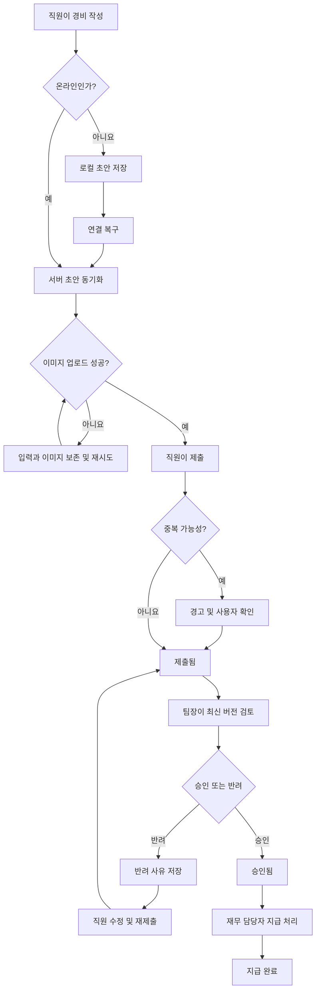

# 모바일 경비 승인 PRD

## 1. 문서 개요

- 제품명: 모바일 경비 승인
- 문서 상태: 초안
- 대상 플랫폼: 모바일 앱
- 목표 출시: 1차 출시
- 기준일: 2026-07-27

## 2. 적용 항목

| 계약 항목 | 적용 여부 | 근거 |
|---|---|---|
| 맥락·문제·목표·비목표 | 필수 | 경비 제출부터 지급 완료까지 범위와 출시 제외 사항을 정의해야 한다. |
| 사용자·역할·권한 | 필수 | 직원, 팀장, 재무 담당자의 권한이 명확히 구분된다. |
| 기능 요구사항과 안정적인 ID | 필수 | 구현 및 수용 테스트 추적성이 필요하다. |
| 화면·경로 | 필수 | 직원, 팀장, 재무 담당자가 사용하는 모바일 UI가 있다. |
| 화면 상태 매트릭스 | 필수 | 오프라인, 업로드 실패, 권한 변경, 충돌 상태를 사용자에게 표현해야 한다. |
| 사용자·시스템 흐름 | 필수 | 작성, 동기화, 승인, 지급으로 이어지는 다단계 수명주기가 있다. |
| 서버 권한 및 데이터 경계 | 필수 | 팀 단위 접근 제한과 역할 변경을 서버에서 강제해야 한다. |
| 정량적 성능 목표 | 해당 없음 | 측정 후 결정하기로 했으므로 지표만 정의하고 목표치는 열린 결정으로 둔다. |
| 접근성 요구사항 | 필수 | WCAG 2.2 AA가 명시된 출시 목표다. |
| 수용 기준 | 필수 | 정상 흐름과 주요 예외 상황을 검증해야 한다. |
| 가정·열린 결정·위험 | 필수 | 브리프에 정의되지 않은 정책과 기술 제약을 분리해야 한다. |
| 요구사항 기반 출시 계획 | 필수 | 단계별 완료 조건을 명확히 해야 한다. |

## 3. 배경과 문제

직원은 모바일에서 영수증과 경비 정보를 제출하고, 팀장은 자기 팀의 요청을 검토하며, 재무 담당자는 승인된 경비의 지급 여부를 관리해야 한다.

현재 필요한 핵심 가치는 다음과 같다.

- 직원이 장소와 네트워크 상태에 관계없이 경비 초안을 작성할 수 있다.
- 팀장과 재무 담당자가 자신에게 허용된 업무만 안전하게 처리한다.
- 중복 제출, 이미지 실패, 권한 변경, 동시 수정으로 인해 잘못 승인되거나 지급되는 일을 방지한다.
- 요청의 변경 및 처리 이력을 사후에 확인할 수 있다.

## 4. 목표

- 직원이 영수증 사진, 금액, 카테고리로 경비를 제출할 수 있다.
- 오프라인에서 작성한 초안을 데이터 손실 없이 서버와 동기화한다.
- 팀장이 담당 팀의 요청만 승인 또는 반려할 수 있다.
- 반려 시 사유를 직원에게 전달한다.
- 재무 담당자가 승인된 요청을 지급 완료로 처리한다.
- 중복, 업로드 실패, 권한 변경 및 동시성 충돌을 안전하게 처리한다.
- 핵심 흐름이 WCAG 2.2 AA를 충족한다.

## 5. 비목표

1차 출시에서 다음은 제외한다.

- 다중 통화 입력, 환율 계산 및 환차손익 처리
- ERP와의 자동 연동
- 자동 계좌 이체 또는 은행 API 연동
- 영수증 OCR 및 금액·카테고리 자동 인식
- 경비 분할, 합산 및 다단계 승인
- 웹 또는 데스크톱 전용 화면
- 지급 완료 취소 및 회계 정정 워크플로
- 정책 한도에 따른 자동 승인 또는 자동 반려

## 6. 사용자와 권한

| 역할 | 목적 | 허용 작업 | 금지 작업 |
|---|---|---|---|
| 직원 | 본인 경비 작성 및 진행 상태 확인 | 본인 초안 작성·수정·삭제, 동기화, 제출, 반려 사유 확인, 반려 요청 수정 후 재제출 | 다른 직원 요청 조회·수정, 승인·반려, 지급 완료 처리 |
| 팀장 | 담당 팀의 경비 검토 | 담당 팀의 제출된 요청 조회, 승인, 사유를 포함한 반려 | 다른 팀 요청 조회·처리, 초안 조회, 지급 완료 처리 |
| 재무 담당자 | 승인된 경비의 지급 상태 관리 | 승인된 요청 조회, 지급 완료 처리 | 경비 승인·반려, 직원 초안 수정, 지급 전 상태로 임의 복구 |
| 시스템 | 데이터 무결성과 동기화 보장 | 중복 방지, 권한 검증, 버전 충돌 감지, 감사 기록 | 사용자 권한을 우회한 상태 변경 |

한 사용자가 여러 역할을 보유할 수 있으나, 각 작업의 권한은 서버가 요청 시점에 독립적으로 검증한다.

## 7. 핵심 데이터와 상태

### 7.1 경비 요청 필수 데이터

- 요청 ID
- 조직 ID
- 제출 직원 ID
- 담당 팀 ID
- 영수증 이미지 참조
- 금액
- 카테고리
- 통화
- 상태
- 데이터 버전
- 클라이언트 제출 식별자
- 생성·수정·제출·승인·반려·지급 완료 시각
- 처리자 ID
- 반려 사유
- 감사 이력

### 7.2 상태 정의

| 상태 | 의미 | 가능한 다음 상태 |
|---|---|---|
| 로컬 초안 | 단말에만 저장된 초안 | 동기화된 초안, 삭제 |
| 동기화된 초안 | 서버에 저장됐지만 제출되지 않음 | 제출됨, 삭제 |
| 제출됨 | 팀장 검토 대기 | 승인됨, 반려됨, 직원 수정 |
| 승인됨 | 팀장 승인 완료, 지급 대기 | 지급 완료 |
| 반려됨 | 반려 사유와 함께 직원에게 반환 | 수정 후 제출됨 |
| 지급 완료 | 재무 담당자가 지급 완료로 표시 | 없음 |

직원이 `제출됨` 상태의 요청을 수정하면 데이터 버전이 증가한다. 팀장이 이전 버전을 기준으로 승인 또는 반려하려 한 경우 처리는 실패하며 최신 내용을 다시 확인해야 한다.

`승인됨`과 `지급 완료` 상태에서는 직원 수정이 허용되지 않는다.

## 8. 기능 요구사항

| ID | 요구사항 | 우선순위 |
|---|---|---|
| FR-01 | 직원은 영수증 사진 1장, 0보다 큰 금액 및 카테고리를 입력해 초안을 저장할 수 있어야 한다. | 필수 |
| FR-02 | 필수 데이터가 없거나 유효하지 않으면 제출을 차단하고 수정할 항목을 식별해 안내해야 한다. | 필수 |
| FR-03 | 오프라인에서 생성·수정한 초안은 단말에 보존되고 연결 복구 시 서버 초안과 동기화되어야 한다. | 필수 |
| FR-04 | 오프라인 초안의 동기화가 완료되더라도 자동 제출하지 않고 직원의 명시적인 제출 동작을 요구해야 한다. | 필수 |
| FR-05 | 이미지 업로드가 실패하면 텍스트 입력과 로컬 이미지를 보존하고, 이미지 업로드만 재시도할 수 있어야 한다. | 필수 |
| FR-06 | 서버는 동일한 클라이언트 제출 식별자의 재전송을 하나의 요청으로 처리해야 한다. | 필수 |
| FR-07 | 동일 직원이 동일한 영수증 이미지, 금액 및 카테고리 조합을 다시 제출하면 중복 가능성을 경고해야 한다. 사용자가 확인한 경우에는 제출할 수 있어야 한다. | 필수 |
| FR-08 | 직원은 본인 요청의 현재 상태, 처리 시각 및 반려 사유를 확인할 수 있어야 한다. | 필수 |
| FR-09 | 팀장은 현재 자신이 담당하는 팀에 귀속된 `제출됨` 요청만 조회할 수 있어야 한다. | 필수 |
| FR-10 | 팀장은 최신 요청 버전을 기준으로 요청을 승인할 수 있어야 한다. | 필수 |
| FR-11 | 팀장은 반려 사유를 입력해야만 요청을 반려할 수 있어야 한다. 공백만 있는 사유는 허용하지 않는다. | 필수 |
| FR-12 | 반려된 요청은 직원이 수정하고 다시 제출할 수 있으며, 이전 반려 내용과 변경 이력은 보존되어야 한다. | 필수 |
| FR-13 | 재무 담당자는 `승인됨` 상태의 요청만 지급 완료로 변경할 수 있어야 한다. | 필수 |
| FR-14 | 서버는 모든 조회와 상태 변경 시 현재 역할, 조직 및 팀 범위를 검증해야 한다. | 필수 |
| FR-15 | 처리 도중 사용자의 역할이나 팀장 권한이 회수되면 이후 요청을 거절하고, 화면을 새로 고쳐 더 이상 허용되지 않는 데이터를 제거해야 한다. | 필수 |
| FR-16 | 수정·승인·반려·지급 처리는 요청 버전을 사용해 동시성 충돌을 감지하고, 충돌 시 어떤 변경도 부분 적용하지 않아야 한다. | 필수 |
| FR-17 | 상태 변경, 주요 데이터 수정, 처리자 및 반려 사유를 변경 불가능한 감사 이력으로 남겨야 한다. | 필수 |
| FR-18 | 각 상태 변경은 한 번만 적용되어야 하며, 네트워크 재시도로 승인이나 지급 기록이 중복 생성되지 않아야 한다. | 필수 |
| FR-19 | 사용자는 동기화 대기, 업로드 중, 실패, 충돌 및 완료 상태를 구분해 확인할 수 있어야 한다. | 필수 |
| FR-20 | 영수증 이미지가 서버에 정상 보관된 것이 확인된 뒤에만 요청 제출을 완료해야 한다. | 필수 |

## 9. 화면 및 경로

경로는 구현 기술과 무관한 논리적 모바일 화면 식별자다.

| 화면 | 논리 경로 | 허용 역할 | 주요 행동 |
|---|---|---|---|
| 내 경비 목록 | `/expenses/mine` | 직원 | 상태 확인, 새 경비 작성 |
| 경비 작성·수정 | `/expenses/edit/:id` | 직원 | 사진·금액·카테고리 입력, 저장·제출 |
| 내 경비 상세 | `/expenses/:id` | 요청 소유 직원 | 처리 상태와 반려 사유 확인 |
| 팀 승인함 | `/approvals/team` | 팀장 | 담당 팀의 제출 요청 조회 |
| 승인 요청 상세 | `/approvals/:id` | 해당 팀장 | 최신 내용 확인, 승인·반려 |
| 지급 대기 목록 | `/finance/approved` | 재무 담당자 | 승인된 요청 조회 |
| 지급 상세 | `/finance/:id` | 재무 담당자 | 지급 완료 처리 |

## 10. 화면 상태 계약

| 화면·영역 | 빈 상태 | 로딩·진행 | 오류 | 성공 | 복구 |
|---|---|---|---|---|---|
| 내 경비 목록 | 등록된 경비 없음 | 목록 로딩 | 네트워크 또는 권한 오류 | 최신 목록 표시 | 재시도 또는 로그인 갱신 |
| 작성 화면 | 빈 입력 폼 | 이미지 처리·동기화 중 | 유효성, 저장, 업로드 실패 | 로컬 또는 서버 초안 저장 표시 | 입력 유지 후 항목별 재시도 |
| 동기화 상태 | 대기 항목 없음 | 동기화 중 | 인증, 네트워크, 서버 충돌 | 마지막 동기화 시각 표시 | 재로그인, 다시 시도, 충돌 내용 확인 |
| 팀 승인함 | 검토할 요청 없음 | 목록 로딩 | 권한 회수 또는 네트워크 오류 | 담당 팀 요청 표시 | 화면 초기화 후 권한 재확인 |
| 승인 상세 | 해당 없음 | 처리 중 | 버전 충돌, 권한 변경, 상태 변경 | 승인 또는 반려 완료 | 최신 요청을 다시 불러와 재검토 |
| 지급 대기 | 지급 대기 없음 | 목록·처리 로딩 | 권한, 충돌, 네트워크 오류 | 지급 완료 표시 | 최신 상태 확인 후 재시도 |

실패 메시지는 색상에만 의존하지 않고 텍스트와 아이콘 등 복수의 수단으로 상태를 전달해야 한다.

## 11. 사용자 흐름

권한 회수 또는 버전 충돌이 발생하면 현재 작업은 적용하지 않고 최신 권한과 요청 상태를 다시 불러오는 복구 흐름으로 이동한다.

## 12. 권한과 데이터 경계

- 모든 데이터는 조직 ID를 기준으로 격리한다.
- 직원은 서버 조회에서도 본인이 소유한 요청과 초안만 접근할 수 있다.
- 담당 팀 ID는 최초 제출 시점의 직원 소속 팀으로 확정한다.
- 직원이 제출 후 다른 팀으로 이동하더라도 해당 요청은 제출 당시 팀에 유지한다.
- 팀장 권한은 요청 처리 시점의 현재 권한으로 판단한다.
- 팀장은 담당 팀 ID가 일치하는 제출 요청만 조회하고 처리할 수 있다.
- 재무 담당자는 같은 조직의 승인된 요청만 조회하고 지급 처리할 수 있다.
- 화면에서 버튼이나 데이터를 숨기는 것은 권한 통제로 간주하지 않는다. 모든 조회와 변경은 서버에서 재검증한다.
- 목록 조회, 상세 조회, 이미지 다운로드에도 동일한 권한 검사를 적용한다.
- 권한이 회수된 사용자가 이미 열어 둔 화면에서 작업하면 서버는 거절하고 클라이언트는 캐시된 민감 정보를 제거한다.
- 조직 또는 사용자 식별자는 클라이언트가 임의로 지정한 값을 신뢰하지 않고 인증된 사용자 정보에서 결정한다.

## 13. 동시성 및 중복 처리

### 13.1 동시 수정

- 경비 요청은 서버 버전을 가진다.
- 직원 수정, 팀장 승인·반려 및 지급 완료 요청은 사용자가 확인한 버전을 함께 전달한다.
- 서버의 최신 버전과 일치하지 않으면 충돌로 거절한다.
- 충돌 시 상태와 데이터는 변경되지 않는다.
- 사용자는 최신 내용을 다시 불러온 뒤 작업을 재수행해야 한다.
- 승인 버튼을 누른 직후 직원 수정이 먼저 반영된 경우 승인은 실패해야 한다.
- 승인이 먼저 반영된 경우 직원 수정은 실패해야 한다.

### 13.2 중복 제출

- 각 로컬 초안은 생성 시 영구적인 클라이언트 제출 식별자를 발급받는다.
- 네트워크 재전송과 앱 재시작 후 재시도에서도 동일 식별자를 사용한다.
- 서버는 동일 조직·직원·식별자 조합을 하나의 요청으로만 저장한다.
- 별도 식별자로 제출했지만 중복 조건에 해당하면 경고 후 명시적 확인을 요구한다.
- 중복 경고를 무시하고 제출한 사실도 감사 이력에 남긴다.

## 14. 비기능 요구사항

### 접근성

- 핵심 작성, 제출, 승인, 반려 및 지급 흐름은 WCAG 2.2 AA를 목표로 한다.
- 모든 입력 항목에 프로그램적으로 연결된 레이블과 오류 설명을 제공한다.
- 키보드 또는 보조 입력 장치만으로 모든 주요 작업이 가능해야 한다.
- 포커스 순서와 포커스 표시가 명확해야 한다.
- 터치 대상 크기, 명도 대비, 텍스트 확대 및 화면 방향 요구사항을 WCAG 2.2 AA 기준으로 검증한다.
- 이미지 업로드, 동기화, 충돌 등 비동기 상태 변화를 보조 기술에 전달한다.
- 승인, 반려 및 지급 완료 전에 대상과 결과를 텍스트로 명확히 제시한다.

### 보안 및 개인정보

- 전송 중인 데이터와 서버에 저장된 영수증 이미지를 암호화한다.
- 로컬 초안과 영수증은 앱의 보호된 저장 영역에 보관한다.
- 로그와 분석 이벤트에 영수증 이미지 또는 반려 사유 원문을 기록하지 않는다.
- 이미지 접근에도 짧은 수명의 권한 검증된 접근 방식을 사용한다.
- 상태 변경 및 권한 거절을 감사 가능하게 기록한다.

### 관측성

다음 지표는 수집하되 출시 목표치는 측정 후 결정한다.

- 초안 동기화 성공률 및 실패 원인
- 이미지 업로드 성공률, 재시도 횟수 및 소요 시간
- 제출 성공률 및 중복 감지율
- 승인·반려·지급 처리 성공률
- 권한 거절 및 버전 충돌 발생률
- 화면 및 API 응답 시간 분포
- 앱 비정상 종료율

사용자나 영수증을 직접 식별할 수 없는 형태로 수집해야 한다.

### 성능

1차 출시 전에 실제 또는 대표 환경에서 다음을 기준선으로 측정한다.

- 목록 및 상세 화면 표시 시간
- 이미지 업로드 시간
- 오프라인 초안 동기화 시간
- 승인·반려·지급 상태 변경 응답 시간
- 저속 네트워크에서의 실패 및 복구율

목표 수치와 출시 기준은 측정 결과를 바탕으로 제품 책임자와 엔지니어링 책임자가 결정한다.

## 15. 수용 기준

| ID | 요구사항 | Given | When | Then | 검증 |
|---|---|---|---|---|---|
| AC-01 | FR-01, FR-02 | 직원이 작성 화면에 있음 | 사진, 유효한 금액, 카테고리를 입력함 | 초안 저장 및 제출이 가능함 | UI·API 테스트 |
| AC-02 | FR-02 | 필수 항목이 누락되거나 금액이 유효하지 않음 | 제출을 시도함 | 제출되지 않고 각 오류가 입력 항목과 연결되어 표시됨 | UI 테스트 |
| AC-03 | FR-03, FR-04 | 기기가 오프라인임 | 초안을 작성한 뒤 연결이 복구됨 | 데이터가 보존되고 서버 초안으로 동기화되지만 자동 제출되지 않음 | 통합 테스트 |
| AC-04 | FR-05, FR-20 | 텍스트 입력은 완료됐으나 이미지 업로드가 실패함 | 사용자가 재시도함 | 입력 손실 없이 이미지만 다시 업로드되고 성공 후 제출 가능함 | 장애 주입 테스트 |
| AC-05 | FR-06, FR-18 | 같은 제출 식별자의 요청이 이미 처리됨 | 동일 요청이 반복 전송됨 | 하나의 경비 요청과 하나의 상태 변경만 존재함 | API 통합 테스트 |
| AC-06 | FR-07 | 같은 직원의 동일 이미지·금액·카테고리 요청이 존재함 | 새 제출을 시도함 | 중복 경고가 표시되고 확인 전까지 제출되지 않음 | 통합 테스트 |
| AC-07 | FR-08 | 직원의 요청이 반려됨 | 직원이 상세 화면을 조회함 | 반려 상태, 사유 및 처리 시각이 표시됨 | UI 테스트 |
| AC-08 | FR-09, FR-14 | 팀장이 두 팀 중 한 팀만 담당함 | 승인함과 상세 API를 조회함 | 담당 팀 요청만 반환되고 다른 팀 요청은 거절됨 | 권한 테스트 |
| AC-09 | FR-10 | 팀장이 최신 버전의 제출 요청을 조회함 | 승인을 실행함 | 상태가 한 번만 `승인됨`으로 변경되고 처리자가 기록됨 | 통합 테스트 |
| AC-10 | FR-11 | 팀장이 제출 요청을 검토함 | 빈 반려 사유로 반려함 | 반려가 차단되고 사유 입력 오류가 표시됨 | UI·API 테스트 |
| AC-11 | FR-12 | 요청이 유효한 사유로 반려됨 | 직원이 수정 후 재제출함 | 상태가 `제출됨`으로 변경되고 이전 반려 이력이 유지됨 | 통합 테스트 |
| AC-12 | FR-13 | 재무 담당자가 승인된 요청을 조회함 | 지급 완료를 실행함 | 상태가 한 번만 `지급 완료`로 변경됨 | 통합 테스트 |
| AC-13 | FR-13, FR-14 | 요청이 승인되지 않았거나 사용자가 재무 역할이 아님 | 지급 완료를 시도함 | 서버가 요청을 거절하고 상태는 유지됨 | 권한 테스트 |
| AC-14 | FR-15 | 팀장이 화면을 연 뒤 권한이 회수됨 | 승인 또는 상세 재조회를 시도함 | 서버가 거절하고 앱은 해당 데이터를 화면과 캐시에서 제거함 | 권한 변경 테스트 |
| AC-15 | FR-16 | 팀장이 버전 3을 보는 동안 직원이 버전 4로 수정함 | 팀장이 버전 3을 승인함 | 승인이 적용되지 않고 최신 내용 재확인 안내가 표시됨 | 동시성 테스트 |
| AC-16 | FR-16 | 팀장 승인과 직원 수정이 동시에 요청됨 | 서버가 두 요청을 처리함 | 하나만 성공하고 성공한 결과와 일치하는 단일 최종 상태가 남음 | 경쟁 조건 테스트 |
| AC-17 | FR-17 | 경비 데이터 또는 상태가 변경됨 | 감사 이력을 조회함 | 변경 전후 상태, 행위자, 시각 및 사유가 확인됨 | API·감사 테스트 |
| AC-18 | FR-19 | 동기화 또는 처리가 대기·진행·실패·충돌 상태임 | 사용자가 해당 화면을 봄 | 현재 상태와 가능한 복구 행동이 명확히 표시됨 | UI 테스트 |
| AC-19 | 접근성 | 지원 대상 화면이 구현됨 | 자동 검사와 수동 보조 기술 검사를 수행함 | 확인된 WCAG 2.2 AA 위반이 출시 차단 기준에 따라 해소됨 | 접근성 감사 |

## 16. 합리적 가정

다음은 브리프를 구현 가능한 수준으로 구체화하기 위해 적용한 가정이다.

- 하나의 경비 요청에는 영수증 이미지 1장만 첨부한다.
- 조직별 기준 통화 하나를 사용하며 직원은 통화를 선택하지 않는다.
- 금액은 0보다 커야 한다.
- 카테고리는 조직이 제공하는 활성 카테고리 목록에서 선택한다.
- 오프라인 지원 범위는 초안 생성·수정이다. 승인, 반려 및 지급 처리는 온라인에서만 가능하다.
- 동기화는 서버 초안 생성까지 수행하며 자동 제출하지 않는다.
- 반려된 요청은 같은 요청 ID를 유지한 채 수정·재제출한다.
- 제출된 요청도 승인 또는 반려되기 전까지 직원이 수정할 수 있다. 버전 충돌로 팀장이 이전 내용을 승인하지 못하게 한다.
- 담당 팀은 최초 제출 시점에 확정하고 이후 직원의 팀 이동과 무관하게 유지한다.
- 지급 완료는 1차 출시에서 최종 상태이며 일반 사용자가 되돌릴 수 없다.
- 중복 가능성이 있더라도 정당한 재제출일 수 있으므로 경고 후 제출을 허용한다.
- 네트워크 연결이 복구되면 앱 실행 중 자동 동기화를 시도하며, 실패 시 사용자가 수동 재시도할 수 있다.

## 17. 열린 결정

| ID | 결정할 내용 | 영향 | 권장 결정 주체 | 결정 시점 |
|---|---|---|---|---|
| OD-01 | 팀장이 자신의 경비를 직접 승인할 수 있는가 | 내부 통제, 대체 승인자 모델 | 재무·컴플라이언스 책임자 | 상세 설계 전 |
| OD-02 | 조직 기준 통화를 어떻게 설정하고 변경할 것인가 | 금액 표시, 기존 데이터 해석 | 제품·재무 책임자 | 개발 착수 전 |
| OD-03 | 허용 이미지 형식, 파일 크기, 해상도 및 압축 정책 | 업로드 성공률, 저장 비용, 보안 | 모바일·백엔드 책임자 | 업로드 구현 전 |
| OD-04 | 중복 감지 기간과 이미지 변형까지 탐지할지 여부 | 오탐·미탐, 계산 비용 | 제품·리스크 책임자 | 중복 기능 구현 전 |
| OD-05 | 영수증, 로컬 초안 및 감사 이력 보존 기간 | 개인정보 및 법적 의무 | 법무·보안·재무 책임자 | 출시 전 |
| OD-06 | 카테고리 목록의 관리 주체와 비활성화 정책 | 기존 초안 및 재제출 처리 | 제품·재무 책임자 | 데이터 모델 확정 전 |
| OD-07 | 앱이 백그라운드에서도 동기화해야 하는가 | OS 제약, 배터리, 사용자 기대 | 모바일 책임자 | 동기화 설계 전 |
| OD-08 | 성능 목표치와 출시 차단 기준 | 용량 계획 및 출시 판단 | 제품·엔지니어링 책임자 | 기준선 측정 후 |
| OD-09 | 지급 완료 시 지급 참조번호나 메모가 필요한가 | 재무 추적성 | 재무 책임자 | 지급 화면 설계 전 |
| OD-10 | 알림 채널과 발송 시점 | 승인 처리 속도와 운영 비용 | 제품 책임자 | 1차 출시 범위 확정 전 |

OD-01, OD-02, OD-03, OD-05는 보안·데이터 모델 또는 주요 흐름에 영향을 주므로 개발 착수 전에 확정해야 한다.

## 18. 위험과 완화 방안

| 위험 | 영향 | 완화 |
|---|---|---|
| 로컬 영수증 유실 | 직원이 다시 촬영해야 함 | 보호된 로컬 저장소, 업로드 완료 전 삭제 금지, 재시도 제공 |
| 네트워크 재전송에 따른 중복 | 이중 승인 또는 지급 | 제출 식별자와 상태 변경 멱등성 적용 |
| 이미지가 조금 변형된 중복 | 단순 비교로 탐지 실패 | 사용자 경고와 감사 이력, 향후 유사 이미지 탐지 검토 |
| 오래 열린 화면에서 잘못 승인 | 변경 전 내용을 기준으로 승인 | 버전 기반 낙관적 잠금과 최신 내용 재확인 |
| 권한 회수 후 데이터 노출 | 개인정보 및 재무정보 유출 | 요청별 서버 권한 검사, 캐시 제거, 짧은 이미지 접근 권한 |
| 지급 완료 오조작 | 회계 정정 필요 | 처리 전 확인, 감사 기록, 취소는 별도 운영 절차로 관리 |
| 성능 목표 미정 | 출시 품질 판단 불명확 | 조기 계측, 대표 환경 기준선 측정, 출시 전 목표 확정 |
| 접근성 후반 발견 | 수정 비용 및 출시 지연 | 공통 컴포넌트 단계부터 자동·수동 접근성 검사 수행 |

## 19. 출시 계획

| 단계 | 포함 요구사항 | 검증 가능한 완료 조건 |
|---|---|---|
| 1. 데이터·권한 기반 | FR-01, FR-02, FR-08, FR-09, FR-14, FR-17 | 역할별 데이터 경계와 상태 모델에 대한 API·권한 테스트 통과 |
| 2. 작성·업로드·동기화 | FR-03~FR-07, FR-19, FR-20 | 오프라인 작성, 연결 복구, 업로드 실패 및 중복 재전송 테스트 통과 |
| 3. 승인·반려 | FR-10~FR-12, FR-15, FR-16, FR-18 | 권한 변경과 직원 수정·팀장 처리 경쟁 조건 테스트 통과 |
| 4. 지급 완료 | FR-13, FR-14, FR-17, FR-18 | 승인 상태 제한, 멱등 처리 및 감사 이력 테스트 통과 |
| 5. 출시 검증 | 전체 요구사항 | 전체 수용 기준, WCAG 2.2 AA 감사 및 측정 지표 수집 검증 완료 |

출시 전에는 열린 결정 중 필수 선결 항목을 확정하고, 성능 기준선 측정 결과에 따라 정량적 출시 기준을 별도로 승인해야 한다.