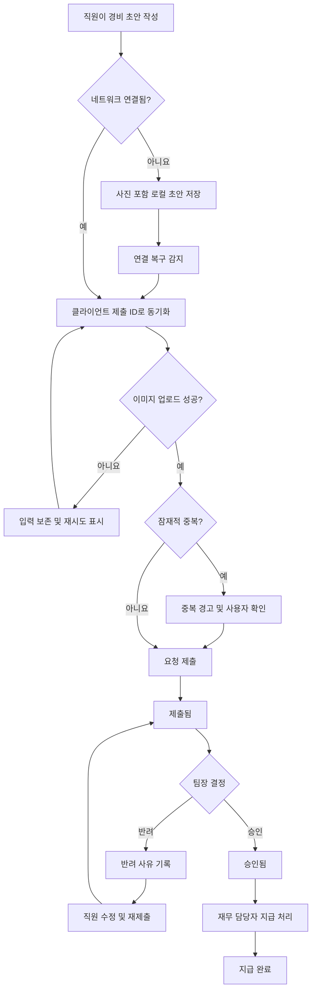
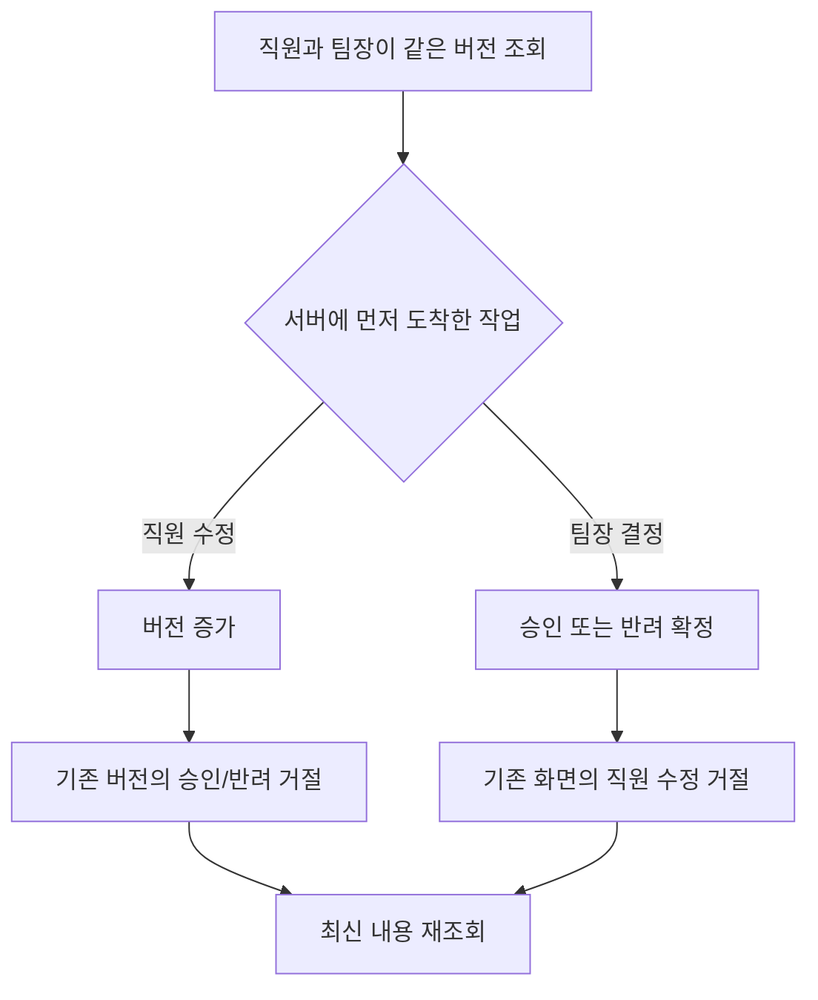

# 모바일 경비 승인 PRD

## 1. 문서 정보

- 기능명: 모바일 경비 승인
- 문서 상태: 초안
- 출시 범위: 1차 출시
- 대상: 직원, 팀장, 재무 담당자
- 저장소 근거: 사용자 요청에 따라 저장소를 탐색하지 않았으므로 기존 시스템·데이터 모델·UI 제약은 확인되지 않음

## 2. 적용성

| 계약 항목 | 적용 여부 | 근거 |
|---|---|---|
| 문제·목표·비목표 | 필수 | 신규 업무 흐름의 목적과 1차 출시 범위를 정의해야 함 |
| 사용자·역할·권한 | 필수 | 직원, 팀장, 재무 담당자의 권한이 명확히 구분됨 |
| 기능 요구사항과 안정적 ID | 필수 | 구현 및 테스트 추적성이 필요함 |
| 화면·경로 | 필수 | 모바일 사용자 화면이 필요한 기능임 |
| 사용자 노출 상태 매트릭스 | 필수 | 오프라인, 업로드 실패, 권한 변경, 동시 수정 상태가 존재함 |
| 다단계 사용자 흐름 | 필수 | 작성→제출→승인/반려→지급의 수명주기가 존재함 |
| 서버 측 권한·데이터 경계 | 필수 | 팀별 승인 범위와 역할별 작업 제한이 핵심 요구사항임 |
| 비기능 요구사항 | 필수 | 접근성, 보안, 개인정보, 동기화 신뢰성이 요구됨 |
| 정량적 성능 목표 | 해당 없음 | 측정 후 결정하기로 했으므로 임의의 SLA를 설정하지 않음 |
| 수용 기준 | 필수 | 예외 상황을 포함한 검증 가능한 출시 기준이 필요함 |
| 분석·운영 관측성 | 필수 | 동기화, 이미지 업로드, 중복 방지 실패를 운영 중 확인해야 함 |
| 외부 시스템 연동 | 해당 없음 | ERP 자동 연동은 1차 출시 범위에서 제외됨 |
| 데이터 마이그레이션 | 해당 없음 | 기존 경비 데이터 또는 마이그레이션 요구가 제시되지 않음 |

## 3. 배경과 문제

직원은 모바일 환경에서 영수증과 경비 정보를 제출하고, 팀장은 자기 팀의 요청을 검토하여 승인 또는 반려해야 한다. 승인된 요청은 재무 담당자가 실제 지급 후 지급 완료로 기록한다.

모바일 네트워크가 불안정할 수 있으며, 재시도 과정에서 중복 요청이 생기거나 이미지 업로드만 실패할 수 있다. 또한 요청 처리 중 사용자의 역할 또는 소속 팀이 변경되거나, 직원의 수정과 팀장의 승인 작업이 동시에 발생할 수 있다.

1차 출시는 이러한 핵심 업무 흐름과 데이터 일관성을 제공하는 데 집중한다.

## 4. 목표

- 직원이 영수증 사진, 금액, 카테고리로 경비를 제출할 수 있다.
- 네트워크가 없어도 경비 초안을 작성하고 기기에 보존할 수 있다.
- 연결 복구 후 초안을 안전하게 동기화하고 중복 생성을 방지한다.
- 팀장이 권한을 가진 팀의 요청만 승인하거나 반려할 수 있다.
- 반려 시 사유를 기록하여 직원에게 전달한다.
- 재무 담당자가 승인된 요청을 지급 완료로 기록할 수 있다.
- 역할 변경과 동시 수정 상황에서도 서버 데이터의 권한과 일관성을 유지한다.
- 핵심 화면과 흐름이 WCAG 2.2 AA를 충족하도록 설계·검증한다.

## 5. 비목표

1차 출시에는 다음을 포함하지 않는다.

- 다중 통화 입력, 환율 계산 또는 환차손익 처리
- ERP 자동 전송 또는 ERP 지급 상태 자동 동기화
- 경비 분할, 여러 카테고리 배분
- 일괄 승인·반려·지급 처리
- 회계 전표 생성
- 복수 단계 승인 또는 금액별 결재선
- 영수증 OCR 자동 인식
- 오프라인 승인·반려·지급
- 직원 간 초안 공유 또는 대리 제출
- 앱 안에서 지급 완료를 취소하거나 지급 정보를 정정하는 기능

## 6. 용어 및 상태 모델

### 6.1 주요 엔터티

경비 요청은 최소한 다음 정보를 가진다.

| 필드 | 설명 |
|---|---|
| 요청 ID | 서버가 관리하는 고유 식별자 |
| 클라이언트 제출 ID | 재시도 중 중복 생성을 방지하는 기기 생성 고유값 |
| 직원 ID | 요청 소유자 |
| 제출 팀 ID | 제출 시점의 승인 대상 팀 |
| 영수증 이미지 | 업로드 완료된 이미지 참조 |
| 이미지 체크섬 | 동일 이미지 기반 잠재적 중복 감지값 |
| 금액 | 조직의 단일 기준 통화로 표시되는 양수 |
| 카테고리 | 조직에서 활성화된 카테고리 |
| 상태 | 초안, 제출됨, 승인됨, 반려됨, 지급 완료 |
| 버전 | 동시 수정 감지를 위한 증가 값 |
| 반려 사유 | 반려 시 필수 |
| 승인 정보 | 승인자와 승인 시각 |
| 지급 정보 | 처리자와 지급 완료 시각 |
| 생성·수정 시각 | 감사 및 목록 정렬에 사용 |

### 6.2 상태 정의

| 상태 | 의미 | 허용되는 다음 상태 |
|---|---|---|
| 로컬 초안 | 서버에 저장되지 않았거나 동기화 대기 중인 기기 내 초안 | 서버 초안, 제출됨 |
| 서버 초안 | 서버에 저장됐지만 제출되지 않은 초안 | 제출됨 |
| 제출됨 | 팀장의 결정을 기다리는 상태 | 승인됨, 반려됨 |
| 승인됨 | 팀장 승인이 완료된 상태 | 지급 완료 |
| 반려됨 | 반려 사유와 함께 직원에게 반환된 상태 | 제출됨 |
| 지급 완료 | 실제 지급이 완료됐다고 기록된 종결 상태 | 없음 |

반려된 요청을 직원이 수정하여 다시 제출하면 같은 요청 ID를 유지하되 버전이 증가하고, 기존 반려 이력은 감사 기록에 보존한다.

## 7. 사용자, 역할 및 권한

| 역할 | 목적 | 허용 작업 | 금지 작업 |
|---|---|---|---|
| 직원 | 자신의 경비 작성·제출·확인 | 자기 초안 생성·수정·삭제, 제출 전/반려 후 수정, 제출, 자기 요청 및 반려 사유 조회 | 타인의 요청 조회, 자기 요청 승인·반려·지급, 승인 후 수정 |
| 팀장 | 소속 팀 요청 검토 | 권한이 있는 팀에 제출된 요청 조회, 최신 버전 승인, 반려 사유 입력 후 반려 | 다른 팀 요청 조회·처리, 승인된 요청 수정, 지급 완료 처리 |
| 재무 담당자 | 승인 경비 지급 관리 | 조직 내 승인된 요청 조회, 지급 완료 표시, 지급 완료 내역 조회 | 미승인 요청 지급, 요청 내용 수정, 승인·반려 |
| 권한 없는 사용자 | 데이터 접근 방지 | 없음 | 화면 경로 또는 API를 통한 경비 데이터 접근 |

한 사용자가 여러 역할을 가질 수 있으며, 각 작업은 해당 작업 시점의 유효한 권한으로 판단한다.

## 8. 기능 요구사항

| ID | 요구사항 | 우선순위 |
|---|---|---|
| FR-001 | 직원은 영수증 사진 1장, 금액, 카테고리를 포함한 경비 초안을 생성할 수 있어야 한다. | 필수 |
| FR-002 | 금액은 0보다 큰 조직 기준 통화의 값이어야 하며, 카테고리는 제출 시점에 활성 상태여야 한다. | 필수 |
| FR-003 | 직원은 자기 소유이며 초안 또는 반려 상태인 요청만 수정할 수 있어야 한다. | 필수 |
| FR-004 | 필수 필드와 이미지 업로드가 모두 유효한 요청만 제출됨 상태로 전환되어야 한다. | 필수 |
| FR-005 | 직원은 자기 요청의 현재 상태, 반려 사유 및 주요 처리 이력을 조회할 수 있어야 한다. | 필수 |
| FR-006 | 앱은 네트워크가 없어도 영수증 사진을 포함한 초안을 기기에 저장해야 한다. | 필수 |
| FR-007 | 앱은 연결 복구를 감지하면 로컬 초안의 서버 동기화를 자동으로 시도하고, 사용자가 수동 재시도할 수도 있어야 한다. | 필수 |
| FR-008 | 동기화 중 앱 종료나 네트워크 재단절이 발생해도 로컬 초안을 유지하고 재시도 가능한 상태를 표시해야 한다. | 필수 |
| FR-009 | 동일한 클라이언트 제출 ID가 여러 번 전송되면 서버는 하나의 요청만 생성하고 기존 결과를 반환해야 한다. | 필수 |
| FR-010 | 동일 직원이 기존 요청과 같은 영수증 이미지 체크섬을 제출하면 잠재적 중복임을 경고하고 명시적 확인 없이 새 요청을 제출하지 않아야 한다. | 필수 |
| FR-011 | 이미지 업로드가 실패하면 요청은 제출됨 상태가 되지 않아야 하며, 성공한 필드 입력은 보존되고 이미지 재시도가 제공되어야 한다. | 필수 |
| FR-012 | 팀장은 현재 자신에게 승인 권한이 있는 제출 팀의 제출됨 요청만 조회할 수 있어야 한다. | 필수 |
| FR-013 | 팀장은 요청의 이미지, 금액, 카테고리, 제출자, 중복 경고 및 최신 버전을 확인한 후 승인할 수 있어야 한다. | 필수 |
| FR-014 | 팀장이 요청을 반려할 때 공백이 아닌 반려 사유를 필수로 입력해야 한다. | 필수 |
| FR-015 | 승인 또는 반려 요청은 팀장이 열어 본 요청 버전을 포함해야 하며 서버의 최신 버전과 일치할 때만 처리되어야 한다. | 필수 |
| FR-016 | 직원 수정과 팀장 결정이 동시에 발생하면 서버가 먼저 확정한 작업만 성공하고, 뒤에 도착한 오래된 작업은 충돌로 거절되어야 한다. | 필수 |
| FR-017 | 충돌이 발생하면 데이터가 자동 덮어쓰기 되지 않아야 하며 사용자는 최신 요청을 다시 불러와 작업해야 한다. | 필수 |
| FR-018 | 역할 또는 팀 권한은 모든 조회와 상태 변경 요청 시 서버에서 다시 확인되어야 한다. | 필수 |
| FR-019 | 화면을 연 뒤 권한을 잃은 사용자가 작업을 실행하면 서버가 이를 거절하고, 앱은 권한 변경 안내 후 해당 화면에서 이탈시켜야 한다. | 필수 |
| FR-020 | 재무 담당자는 승인됨 상태의 요청만 지급 완료로 표시할 수 있어야 한다. | 필수 |
| FR-021 | 지급 완료 처리에는 확인 단계가 있어야 하며 처리자와 서버 기준 처리 시각이 기록되어야 한다. | 필수 |
| FR-022 | 승인·반려·재제출·지급 완료와 실패한 권한 검사는 행위자, 시각, 대상, 이전/이후 상태를 포함한 감사 이벤트로 기록되어야 한다. | 필수 |
| FR-023 | 모든 목록과 상세 화면은 서버가 허용한 데이터만 반환받아야 하며, UI 숨김에만 권한 통제를 의존하지 않아야 한다. | 필수 |
| FR-024 | 사용자는 동기화 대기, 업로드 중, 제출 완료, 실패, 충돌, 권한 상실 상태를 구분할 수 있어야 한다. | 필수 |

## 9. 화면 및 경로

다음 경로는 논리적 모바일 앱 경로이며 실제 라우팅 방식은 클라이언트 기술에 맞게 조정할 수 있다.

| 화면 | 논리적 경로 | 허용 역할 | 주요 작업 |
|---|---|---|---|
| 내 경비 목록 | `/expenses` | 직원 | 요청 상태 확인, 초안 재시도 |
| 경비 작성 | `/expenses/new` | 직원 | 사진·금액·카테고리 입력 |
| 내 경비 상세 | `/expenses/:id` | 요청 소유 직원 | 상태·반려 사유·이력 확인 |
| 경비 수정 | `/expenses/:id/edit` | 요청 소유 직원 | 초안 또는 반려 요청 수정·재제출 |
| 팀 승인함 | `/team/expenses` | 팀장 | 자기 팀의 제출 요청 조회 |
| 승인 상세 | `/team/expenses/:id` | 권한 있는 팀장 | 승인 또는 사유 입력 후 반려 |
| 지급 대기 목록 | `/finance/expenses` | 재무 담당자 | 승인 요청 조회 |
| 지급 상세 | `/finance/expenses/:id` | 재무 담당자 | 지급 완료 처리 |

## 10. 사용자 경험 상태

| 화면/영역 | 빈 상태 | 로딩·처리 중 | 오류 상태 | 성공 상태 | 복구 방법 |
|---|---|---|---|---|---|
| 경비 작성 | 입력되지 않은 양식 | 이미지 준비·저장 중 | 로컬 저장 실패, 유효성 오류 | 초안 저장됨 | 입력 유지 후 다시 저장 |
| 오프라인 초안 | 동기화 대상 없음 | 연결 복구 후 동기화 중 | 동기화 실패 | 서버 동기화 완료 | 자동 또는 수동 재시도 |
| 이미지 업로드 | 사진 미선택 | 진행 중 표시 | 업로드 실패 | 업로드 완료 | 사진 유지 후 재시도 또는 교체 |
| 제출 | 제출 가능 여부 표시 | 중복 확인·제출 중 | 유효성, 중복, 충돌, 네트워크 오류 | 제출됨 | 원인별 수정·확인·재시도 |
| 직원 목록 | 요청 없음 | 목록 로딩 | 목록 조회 실패 | 상태별 요청 표시 | 다시 불러오기 |
| 팀 승인함 | 대기 요청 없음 | 목록 로딩 | 권한·조회 실패 | 승인 대기 목록 | 권한 안내 또는 재시도 |
| 승인 상세 | 해당 없음 | 승인/반려 처리 중 | 충돌, 권한 상실, 이미 처리됨 | 승인 또는 반려 완료 | 최신 버전 재조회 |
| 지급 목록 | 지급 대기 없음 | 목록 로딩 | 조회 실패 | 승인 요청 표시 | 다시 불러오기 |
| 지급 처리 | 해당 없음 | 지급 완료 처리 중 | 권한 상실, 이미 처리됨 | 지급 완료 | 최신 상태 재조회 |

모든 오류 메시지는 색상만으로 구분하지 않고 텍스트와 상태 아이콘을 함께 사용한다. 처리 중에는 중복 탭을 막되 사용자가 화면을 닫아도 서버 결과를 다시 조회할 수 있어야 한다.

## 11. 핵심 흐름

### 동시 수정 결정 규칙

## 12. 권한 및 데이터 경계

- 인증된 사용자 ID는 클라이언트 입력이 아니라 서버 인증 컨텍스트에서 결정한다.
- 직원 조회에는 서버에서 `employee_id = 현재 사용자` 조건을 적용한다.
- 팀장 조회와 승인에는 제출 팀 ID와 현재 사용자의 팀장 권한을 서버에서 대조한다.
- 제출 후 직원이 다른 팀으로 이동하더라도 해당 요청은 제출 당시 팀에 귀속한다.
- 팀장 개인이 변경되면 새 팀장이 미처리 요청을 처리할 수 있고, 권한을 잃은 이전 팀장은 처리할 수 없다.
- 재무 담당자는 재무 권한 범위 안의 승인됨 요청만 조회·처리할 수 있다.
- 다중 조직을 지원하는 시스템이라면 모든 요청에 조직 경계를 적용하고 조직 간 식별자 직접 접근을 거절해야 한다.
- 존재하지만 권한이 없는 요청에 대해서는 데이터 존재 여부나 필드가 노출되지 않는 오류 응답을 사용한다.
- 클라이언트가 상태, 직원 ID, 팀 ID, 승인자 또는 지급자를 임의로 지정하지 못하게 한다.
- 영수증 이미지는 승인된 사용자에게만 제한된 방식으로 제공하며 영구 공개 URL을 사용하지 않는다.
- 권한 변경은 다음 로그인까지 기다리지 않고 각 민감 작업 시점에 검증한다.

## 13. 비기능 요구사항

### 13.1 접근성

- 모든 1차 출시 화면은 WCAG 2.2 AA를 목표로 한다.
- 터치 대상, 색 대비, 키보드 또는 보조 입력, 스크린 리더 레이블, 포커스 순서, 오류 식별 및 상태 알림을 검증한다.
- 업로드 진행, 동기화 결과, 충돌 및 권한 오류는 보조 기술이 인지할 수 있는 상태 메시지로 제공한다.
- 사진 선택·교체·삭제와 승인·반려·지급 작업은 접근 가능한 이름을 가져야 한다.
- 자동화 검사와 실제 모바일 스크린 리더를 사용한 수동 검증을 출시 기준에 포함한다.

### 13.2 성능

1차 출시 전 측정해야 할 지표는 다음과 같다.

- 경비 목록과 상세 화면의 사용자 체감 응답 시간
- 일반 모바일 네트워크에서 이미지 업로드 완료 시간
- 연결 복구 후 동기화 시작 및 완료 시간
- 동기화 성공률과 재시도 횟수
- 승인·반려·지급 상태 변경 응답 시간

정량 목표와 이미지 크기별 테스트 조건은 기준 측정 후 제품 책임자와 엔지니어링 책임자가 결정한다. 목표가 결정되기 전까지 임의의 SLA를 출시 합격 기준으로 사용하지 않는다.

### 13.3 신뢰성 및 데이터 일관성

- 상태 변경은 요청 단위로 원자적으로 적용한다.
- 승인, 반려 및 지급 API의 재시도가 동일 작업을 중복 적용하지 않아야 한다.
- 버전 불일치 시 서버 데이터가 자동으로 덮어쓰기 되지 않아야 한다.
- 서버는 클라이언트 시각이 아닌 서버 시각으로 감사 이벤트를 기록한다.
- 로컬 초안은 동기화 성공이 확인된 뒤에만 동기화 대기 상태에서 제거한다.

### 13.4 보안 및 개인정보

- 전송 및 저장 중 영수증 이미지와 경비 데이터를 보호한다.
- 로그와 분석 이벤트에 영수증 원본이나 반려 사유 전문을 기록하지 않는다.
- 모바일 기기의 로컬 초안은 운영체제가 제공하는 앱 보호 저장소를 사용한다.
- 로그아웃 또는 계정 전환 시 이전 계정의 로컬 초안이 다른 계정에 노출되지 않아야 한다.
- 금액·카테고리·상태 값은 서버에서 유효성을 검증한다.
- 파일 형식, 실제 콘텐츠 유형 및 크기를 서버에서 검증하며 실행 가능한 콘텐츠를 거부한다.

### 13.5 관측성

다음 지표와 이벤트를 개인정보 없이 집계할 수 있어야 한다.

- 초안 생성, 제출 성공, 승인, 반려, 재제출, 지급 완료
- 이미지 업로드 실패율 및 실패 원인 범주
- 오프라인 동기화 성공률, 재시도 및 영구 실패
- 클라이언트 제출 ID를 통한 중복 생성 방지 횟수
- 이미지 체크섬 기반 잠재적 중복 경고 횟수
- 버전 충돌 및 권한 거절 횟수
- 상태 전환 실패와 예상하지 못한 상태 조합

## 14. 수용 기준

| ID | 요구사항 | Given | When | Then | 검증 |
|---|---|---|---|---|---|
| AC-001 | FR-001~004 | 직원이 사진, 유효 금액, 활성 카테고리를 입력함 | 제출함 | 하나의 요청이 제출됨 상태로 생성됨 | 모바일 E2E |
| AC-002 | FR-002, FR-004 | 금액이 0 이하이거나 카테고리가 비활성임 | 제출함 | 제출되지 않고 해당 필드 오류가 표시됨 | API·UI 테스트 |
| AC-003 | FR-003 | 요청이 승인됨 상태임 | 직원이 수정 API를 호출함 | 서버가 수정을 거절하고 원본을 유지함 | API 통합 테스트 |
| AC-004 | FR-005 | 요청이 반려됨 | 소유 직원이 상세를 열음 | 반려 사유와 처리 상태를 확인할 수 있음 | E2E |
| AC-005 | FR-006~008 | 직원이 오프라인임 | 사진을 포함한 초안을 저장하고 앱을 재시작함 | 초안과 동기화 대기 상태가 유지됨 | 오프라인 E2E |
| AC-006 | FR-007~009 | 동일 초안의 전송 응답이 유실됨 | 앱이 동일 클라이언트 제출 ID로 재전송함 | 서버 요청은 하나만 존재하고 기존 결과가 반환됨 | API 통합 테스트 |
| AC-007 | FR-010 | 같은 직원의 기존 요청과 이미지 체크섬이 같음 | 새 요청을 제출함 | 중복 경고가 표시되고 확인 전에는 제출되지 않음 | E2E |
| AC-008 | FR-011 | 이미지 업로드 중 네트워크 오류가 발생함 | 업로드가 실패함 | 제출 상태가 되지 않고 입력과 사진이 보존되며 재시도 가능함 | 장애 주입 테스트 |
| AC-009 | FR-012, FR-023 | 팀장 A가 팀 A와 팀 B 요청을 직접 조회함 | 목록 또는 상세 API를 호출함 | 팀 A 요청만 반환되고 팀 B 데이터는 노출되지 않음 | 권한 통합 테스트 |
| AC-010 | FR-013 | 팀장이 권한 있는 최신 요청을 검토함 | 승인함 | 요청이 승인됨으로 한 번만 전환되고 승인자·시각이 기록됨 | API·E2E |
| AC-011 | FR-014 | 팀장이 반려 사유를 비우거나 공백만 입력함 | 반려함 | 요청이 제출됨으로 유지되고 사유 오류가 표시됨 | UI·API 테스트 |
| AC-012 | FR-014 | 유효한 사유가 입력됨 | 팀장이 반려함 | 요청이 반려됨으로 전환되고 직원이 사유를 조회할 수 있음 | E2E |
| AC-013 | FR-015~017 | 팀장이 버전 3을 보고 있고 직원 수정으로 버전 4가 확정됨 | 팀장이 버전 3으로 승인함 | 승인 요청이 충돌로 거절되고 최신 내용 재조회가 안내됨 | 동시성 테스트 |
| AC-014 | FR-016~017 | 직원과 팀장이 같은 버전에서 수정과 승인을 동시에 실행함 | 승인이 먼저 확정됨 | 직원 수정은 거절되고 요청은 승인된 내용을 유지함 | 동시성 테스트 |
| AC-015 | FR-018~019 | 팀장이 화면을 연 후 팀장 권한을 잃음 | 승인 또는 반려함 | 서버가 거절하고 앱은 권한 변경을 알린 뒤 승인 화면에서 이탈함 | 권한 변경 E2E |
| AC-016 | FR-018 | 제출 후 직원의 소속 팀이 변경됨 | 현재 권한 있는 제출 팀 팀장이 요청을 조회함 | 요청은 제출 시점 팀 승인함에서 처리 가능함 | 권한 통합 테스트 |
| AC-017 | FR-020~021 | 재무 담당자가 승인됨 요청을 열음 | 확인 후 지급 완료 처리함 | 지급 완료 상태와 처리자·서버 시각이 기록됨 | E2E |
| AC-018 | FR-020 | 요청이 제출됨 또는 반려됨 상태임 | 재무 담당자가 지급 API를 호출함 | 서버가 거절하고 상태가 변경되지 않음 | API 테스트 |
| AC-019 | FR-022 | 승인, 반려, 재제출 또는 지급 완료가 발생함 | 감사 기록을 조회함 | 행위자, 시각, 대상, 이전/이후 상태가 존재함 | 통합 테스트 |
| AC-020 | FR-024 | 동기화 실패, 업로드 실패, 충돌 또는 권한 상실이 발생함 | 사용자가 해당 화면을 봄 | 서로 구분되는 상태 설명과 가능한 복구 행동이 제공됨 | UX·접근성 테스트 |
| AC-021 | 접근성 | 1차 출시 핵심 화면이 준비됨 | 자동 및 수동 접근성 검사를 수행함 | 확인된 WCAG 2.2 AA 위반이 출시 전 해소되거나 승인된 예외로 기록됨 | 접근성 감사 |
| AC-022 | 보안 경계 | 인증되지 않았거나 다른 조직의 사용자가 요청 ID를 알고 있음 | 상세·이미지 API를 호출함 | 경비 또는 이미지 정보가 노출되지 않음 | 보안 테스트 |

## 15. 합리적 가정

다음은 브리프에 명시되지 않았지만 구현 계약을 완성하기 위해 적용한 가정이다.

- 1차 출시에서는 요청당 영수증 사진 1장을 사용한다.
- 각 조직은 하나의 기준 통화를 사용하며 사용자가 통화를 선택하지 않는다.
- 경비 카테고리는 별도 관리 기능에서 제공되는 활성 목록을 사용한다.
- 제출 시점의 팀을 요청에 고정하여 이후 직원 이동으로 승인 책임자가 사라지지 않게 한다.
- 제출됨 상태의 요청은 직원이 수정할 수 있다. 수정이 먼저 확정되면 요청 버전이 증가하고 팀장의 오래된 승인 작업은 거절된다.
- 반려된 요청은 같은 요청을 수정하여 재제출하며 새 요청으로 복제하지 않는다.
- 같은 클라이언트 제출 ID는 같은 논리적 요청을 의미한다.
- 동일 직원의 동일 이미지 체크섬을 잠재적 중복으로 간주하지만, 업무상 정당한 재사용 가능성을 고려해 사용자 확인 후 제출은 허용한다.
- 지급 완료는 실제 외부 지급이 끝난 뒤 기록하는 확인 행위다.
- 지급 완료 상태는 1차 출시 앱에서 되돌릴 수 없다.
- 승인·반려·지급은 온라인 상태에서만 수행한다.
- 역할이 중첩된 사용자는 각 역할에 허용된 작업을 수행할 수 있지만 자기 요청을 스스로 승인할 수는 없다.
- 목록과 상세 데이터는 하나의 조직 경계 안에서 운영된다.

## 16. 열린 결정

| ID | 결정 사항 | 선택이 미치는 영향 | 결정 책임자·시점 |
|---|---|---|---|
| OD-001 | 지원 이미지 형식, 최대 파일 크기, 해상도 및 압축 정책 | 업로드 성공률, 저장비, 모바일 데이터 사용량, 보안 검증 | 제품·모바일·백엔드, 개발 착수 전 |
| OD-002 | 카테고리 원천과 비활성화된 카테고리의 기존 초안 처리 | 제출 유효성 및 운영 관리 방식 | 제품·재무, API 계약 확정 전 |
| OD-003 | 금액 상한, 소수 자릿수 및 조직 기준 통화 설정 방식 | 입력 검증 및 저장 타입 | 제품·재무, 데이터 모델 확정 전 |
| OD-004 | 잠재적 중복 비교 범위와 경고를 무시할 수 있는 주체 | 오탐과 중복 지급 위험 | 제품·재무·리스크, QA 전 |
| OD-005 | 제출됨 상태에서 직원 수정을 허용할지, 철회 후 수정만 허용할지 | 동시성 UX와 승인 업무 복잡도 | 제품 책임자, UX 확정 전 |
| OD-006 | 지급일, 지급 참조번호 또는 메모를 필수로 받을지 | 재무 추적성과 입력 부담 | 재무 책임자, 화면 설계 전 |
| OD-007 | 지급 완료 오처리 정정 절차와 권한 | 운영 사고 복구 가능성 | 재무·운영·보안, 출시 전 |
| OD-008 | 영수증, 경비 요청, 감사 로그의 보존 및 삭제 기간 | 개인정보·법적 준수·저장 비용 | 법무·보안·재무, 출시 전 |
| OD-009 | 기기 분실, 로그아웃, 앱 삭제 시 미동기화 초안 처리 정책 | 데이터 보호와 초안 복구 가능성 | 보안·제품, 모바일 설계 전 |
| OD-010 | 푸시 또는 앱 내 알림 범위 | 반려·승인 처리 속도 및 알림 인프라 | 제품, 1차 출시 범위 확정 전 |
| OD-011 | 성능 지표별 목표값과 측정 조건 | 출시 게이트와 용량 계획 | 제품·엔지니어링, 기준 측정 후 |
| OD-012 | 접근성 예외 승인 절차와 담당자 | WCAG 2.2 AA 출시 판단 | 제품·디자인·QA, QA 계획 확정 전 |

OD-001, OD-003, OD-005, OD-007, OD-008은 구현 또는 안전한 출시 전에 반드시 확정해야 한다.

## 17. 위험과 완화책

| 위험 | 영향 | 완화 |
|---|---|---|
| 네트워크 재시도로 같은 요청이 여러 건 생성됨 | 중복 승인·지급 | 클라이언트 제출 ID 기반 멱등 처리 |
| 같은 영수증을 다른 초안으로 다시 제출 | 중복 지급 | 이미지 체크섬 경고, 팀장 화면 표시, 감사 기록 |
| 이미지 업로드만 성공하고 요청 제출은 실패 | 고아 파일과 사용자 혼란 | 업로드 상태 관리, 재사용 가능한 업로드 참조, 미연결 파일 정리 정책 |
| 승인 중 직원이 내용을 변경 | 검토하지 않은 내용 승인 | 버전 기반 낙관적 동시성 제어와 최신 버전 재조회 |
| 권한 변경이 앱에 늦게 반영 | 무권한 조회·처리 | 모든 민감 작업의 서버 측 실시간 권한 검사 |
| 로컬 초안에 민감한 영수증이 남음 | 개인정보 노출 | 앱 보호 저장소, 계정 분리, 로그아웃 정책 |
| 지급 완료 오처리를 되돌릴 수 없음 | 재무 장부 불일치 | 확인 단계와 감사 기록; 별도 정정 절차를 출시 전에 확정 |
| 성능 목표가 늦게 정해짐 | 출시 판단 지연 | 개발 초기 계측 도입 후 대표 기기·네트워크 기준 측정 |
| 체크섬 중복 감지의 오탐·미탐 | 정상 제출 방해 또는 중복 누락 | 차단 대신 경고 기본값, 비교 정책을 운영 데이터로 조정 |

## 18. 전달 계획

| 단계 | 포함 요구사항 | 검증 가능한 종료 조건 |
|---|---|---|
| 1. 데이터·권한 기반 | FR-001~005, FR-012, FR-018, FR-023 | 역할별 API 권한 테스트와 기본 요청 수명주기 테스트 통과 |
| 2. 제출·오프라인 동기화 | FR-006~011, FR-024 | 오프라인 작성, 앱 재시작, 재연결, 업로드 실패, 중복 재전송 시나리오 통과 |
| 3. 승인·동시성 | FR-013~019 | 승인·반려·권한 변경·두 방향 동시성 테스트 통과 |
| 4. 지급·감사 | FR-020~022 | 승인 요청만 지급 가능하며 모든 상태 변경 감사 기록 검증 |
| 5. 출시 검증 | 전체 요구사항 및 비기능 요구사항 | AC-001~022 통과, WCAG 2.2 AA 검사 완료, 성능 기준 측정 및 목표 결정, 필수 열린 결정 해소 |

이 PRD는 제공된 브리프를 기준으로 작성했으며, 기존 저장소·정책·데이터 구조와의 적합성은 검증하지 않았다.