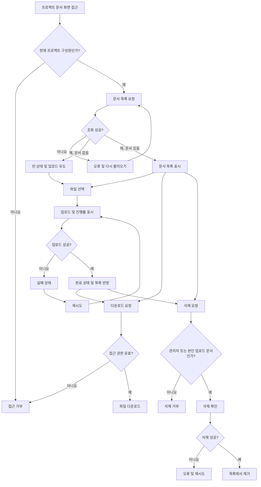

# 사내 프로젝트 문서 공유 PRD

## 1. 문서 정보

- 대상: 사내 직원
- 목표 출시: 4주 내 내부 베타
- 문서 상태: 초안
- 기준 범위: 프로젝트 단위 문서 업로드, 목록, 다운로드, 삭제
- 주요 선결 조건: 1차 출시에 구성원 초대·제거 기능을 포함할지 제품 책임자 결정 필요

## 2. 적용 범위 확인

| 계약 항목 | 적용 여부 | 근거 |
|---|---|---|
| 문제·목표·비목표 | 필수 | 신규 기능의 목적과 1차 출시 범위를 확정해야 함 |
| 사용자·역할·권한 | 필수 | 프로젝트 관리자와 일반 구성원의 권한이 다름 |
| 기능 요구사항 ID | 필수 | 구현 및 테스트 추적성이 필요함 |
| 화면·경로 | 필수 | 문서 목록과 업로드를 위한 사용자 화면이 있음 |
| 상태 매트릭스 | 필수 | 빈 목록, 업로드 진행·실패·완료 상태가 명시됨 |
| 사용자 흐름 | 필수 | 업로드와 삭제가 여러 단계 및 상태 전이를 가짐 |
| 서버 권한·데이터 경계 | 필수 | 프로젝트 간 문서 접근 차단과 삭제 권한 검증이 필요함 |
| 정량적 비기능 요구사항 | 필수 | 목록 2초 표시 목표가 있으나 SLA는 열린 결정임 |
| 수용 기준 | 필수 | 내부 베타 진입 여부를 검증해야 함 |
| 가정·열린 결정 | 필수 | 파일 제한, 성능 SLA, 구성원 관리 범위 등이 미정임 |
| 단계별 출시 계획 | 필수 | 4주 내 내부 베타 목표가 있음 |

## 3. 배경과 문제

직원들이 프로젝트 문서를 같은 프로젝트 구성원에게 공유할 수 있는 일관된 공간이 필요하다. 현재 브리프 기준으로는 다음 문제가 해결 대상이다.

- 프로젝트별로 문서를 모아 볼 수 있어야 한다.
- 문서가 해당 프로젝트 구성원에게만 노출되어야 한다.
- 업로드 상태와 실패 여부를 사용자가 명확히 알 수 있어야 한다.
- 프로젝트 관리자와 일반 구성원의 삭제 권한을 구분해야 한다.
- 제한된 일정 안에서 검색이나 외부 공유 없이 핵심 문서 수명주기를 제공해야 한다.

## 4. 목표

- 직원이 자신이 속한 프로젝트에 문서를 업로드하고 구성원과 공유할 수 있다.
- 프로젝트 구성원이 해당 프로젝트의 문서 목록을 열람하고 다운로드할 수 있다.
- 일반 구성원은 자신이 업로드한 문서만 삭제할 수 있다.
- 프로젝트 관리자는 프로젝트 내 모든 문서를 삭제할 수 있다.
- 업로드 진행, 실패, 재시도, 완료 상태를 사용자가 구분할 수 있다.
- 4주 내 실제 직원 계정으로 검증 가능한 내부 베타를 제공한다.

## 5. 성공 기준

내부 베타에서는 다음 조건을 성공 기준으로 사용한다.

- 핵심 시나리오인 업로드, 목록 조회, 다운로드, 권한별 삭제가 종단 간 동작한다.
- 다른 프로젝트의 문서에 직접 접근하려는 요청이 서버에서 차단된다.
- 업로드 실패 후 같은 파일을 다시 선택하지 않고 재시도할 수 있다.
- 목록의 초기 표시 시간이 계측된다.
- 목록 2초 표시 목표의 측정 결과가 수집되며, 정식 SLA는 별도 결정으로 남긴다.
- 베타를 막는 수준의 데이터 유실 또는 권한 우회 결함이 없다.

사용률, 업로드 성공률 등 구체적인 목표치는 사용 규모와 기존 분석 체계가 확인되지 않았으므로 이 PRD에서 임의로 정하지 않는다.

## 6. 비목표

다음 항목은 1차 출시에서 제외한다.

- 문서 검색
- 외부 사용자 또는 공개 링크를 통한 공유
- 프로젝트 간 문서 공유
- 문서 미리보기 및 웹 편집
- 버전 관리와 변경 이력 비교
- 폴더 및 태그 기반 분류
- 공동 편집과 댓글
- 휴지통 또는 사용자가 직접 수행하는 삭제 복구
- 모바일 전용 애플리케이션
- 명시적으로 확정되기 전의 정식 성능 SLA

## 7. 사용자, 역할 및 권한

| 역할 | 목적 | 허용 작업 | 금지 작업 |
|---|---|---|---|
| 프로젝트 관리자 | 프로젝트 문서와 구성원을 관리 | 목록 조회, 업로드, 다운로드, 프로젝트 내 모든 문서 삭제, 구성원 초대·제거 조건부 수행 | 다른 프로젝트 문서 접근, 자신의 관리자 권한 범위를 벗어난 작업 |
| 일반 구성원 | 프로젝트 문서를 공유하고 이용 | 목록 조회, 업로드, 다운로드, 자신이 업로드한 문서 삭제 | 다른 구성원이 올린 문서 삭제, 구성원 관리, 다른 프로젝트 문서 접근 |
| 비구성원 | 해당 프로젝트에 대한 권한 없음 | 없음 | 목록, 파일 내용, 파일 메타데이터 및 다운로드 주소 접근 |

구성원이 프로젝트에서 제거되면 이후 요청부터 해당 프로젝트 문서의 목록 조회와 다운로드를 포함한 모든 접근을 거부하는 것을 기본 가정으로 한다.

## 8. 핵심 용어 및 데이터 상태

### 문서

프로젝트에 귀속된 업로드 파일과 다음 메타데이터를 의미한다.

- 문서 ID
- 프로젝트 ID
- 원본 파일명
- 업로더 사용자 ID
- 파일 크기
- 생성 시각
- 저장 객체 식별자
- 상태

### 사용자에게 표시되는 업로드 상태

| 상태 | 의미 | 사용자 동작 |
|---|---|---|
| 대기 | 업로드 요청이 시작되기 전 | 취소 가능 여부는 열린 결정 |
| 업로드 중 | 파일 데이터 전송 중 | 진행률 확인 |
| 실패 | 업로드가 완료되지 않음 | 재시도 |
| 완료 | 파일 저장 및 목록 등록 완료 | 다운로드 또는 삭제 |

실패한 업로드는 정상 문서 목록의 공유 가능한 문서로 취급하지 않는다.

## 9. 기능 요구사항

| ID | 요구사항 | 우선순위 |
|---|---|---|
| FR-01 | 인증된 프로젝트 구성원은 자신이 속한 프로젝트의 문서 화면에 접근할 수 있어야 한다. | 필수 |
| FR-02 | 시스템은 프로젝트별 문서 목록을 제공하고, 각 항목에 최소한 파일명, 업로더, 파일 크기, 업로드 완료 시각을 표시해야 한다. | 필수 |
| FR-03 | 문서가 없는 프로젝트에서는 빈 목록 상태와 업로드 유도 동작을 표시해야 한다. | 필수 |
| FR-04 | 프로젝트 구성원은 허용된 파일을 해당 프로젝트에 업로드할 수 있어야 한다. | 필수 |
| FR-05 | 업로드 중에는 파일별 진행률을 0~100% 범위로 표시해야 한다. | 필수 |
| FR-06 | 업로드 실패 시 실패 상태와 재시도 동작을 제공해야 하며, 재시도에는 기존에 선택한 파일을 사용해야 한다. | 필수 |
| FR-07 | 서버가 파일 저장과 문서 등록을 완료한 후 완료 상태를 표시하고 해당 문서를 목록에 반영해야 한다. | 필수 |
| FR-08 | 프로젝트 구성원은 해당 프로젝트의 업로드 완료 문서를 다운로드할 수 있어야 한다. | 필수 |
| FR-09 | 일반 구성원은 자신이 업로드한 문서만 삭제할 수 있어야 한다. | 필수 |
| FR-10 | 프로젝트 관리자는 해당 프로젝트의 모든 문서를 삭제할 수 있어야 한다. | 필수 |
| FR-11 | 삭제 전 대상 문서명을 포함한 확인 절차를 제공하고, 삭제 완료 후 목록에서 제거해야 한다. | 필수 |
| FR-12 | 삭제 실패 시 문서를 목록에 유지하고 실패 메시지와 재시도 수단을 제공해야 한다. | 필수 |
| FR-13 | 목록 조회, 다운로드, 업로드 및 삭제 권한은 모든 요청에서 서버가 프로젝트 구성원 여부와 역할을 검증해야 한다. | 필수 |
| FR-14 | 사용자가 접근 권한이 없는 프로젝트나 문서를 요청하면 문서 내용 또는 민감한 메타데이터를 노출하지 않고 요청을 거부해야 한다. | 필수 |
| FR-15 | 목록 조회 실패 시 오류 상태와 목록 다시 불러오기 동작을 제공해야 한다. | 필수 |
| FR-16 | 동일 문서에 대한 중복 삭제 또는 이미 삭제된 문서 요청은 데이터 불일치를 만들지 않아야 한다. | 필수 |
| FR-17 | 문서 레코드가 생성되었지만 파일 저장이 실패하거나 그 반대인 경우, 공유 가능한 완료 문서로 노출해서는 안 된다. | 필수 |
| FR-18 | 프로젝트 관리자의 구성원 초대·제거 기능은 OD-01의 범위 결정에 따라 1차 출시 포함 여부를 확정한다. | 결정 필요 |

## 10. 화면 및 경로

경로는 기존 제품 라우팅 규칙이 제공되지 않아 논리적 명칭으로 정의한다.

| 화면 | 제안 경로 | 접근 역할 | 주요 동작 |
|---|---|---|---|
| 프로젝트 문서 목록 | `/projects/{projectId}/documents` | 프로젝트 관리자, 일반 구성원 | 목록 조회, 업로드, 다운로드, 권한에 따른 삭제 |
| 프로젝트 구성원 관리 | `/projects/{projectId}/members` | 프로젝트 관리자 | 구성원 조회, 초대, 제거 — OD-01 결정 시 적용 |

별도의 문서 상세 화면은 1차 범위에 포함하지 않는다.

## 11. 상태 매트릭스

| 영역 | 빈 상태 | 로딩/진행 | 오류 | 성공 | 복구 |
|---|---|---|---|---|---|
| 문서 목록 | “아직 문서가 없습니다”와 업로드 동작 | 목록 스켈레톤 또는 로딩 표시 | 조회 실패 메시지 | 문서 목록 표시 | 다시 불러오기 |
| 업로드 | 선택된 파일 없음 | 파일명과 진행률 표시 | 파일별 실패 사유 표시 | 완료 표시 후 목록 반영 | 같은 파일 재시도 |
| 다운로드 | 해당 없음 | 다운로드 시작 상태 | 다운로드 실패 표시 | 브라우저 또는 클라이언트 다운로드 시작 | 다시 다운로드 |
| 삭제 | 해당 없음 | 삭제 처리 중이며 중복 실행 방지 | 문서를 유지하고 실패 표시 | 목록에서 제거 | 다시 삭제 |
| 접근 권한 | 해당 없음 | 권한 확인 중 | 접근 거부 화면 또는 메시지 | 허용된 화면 표시 | 권한 획득 후 다시 접근 |
| 구성원 목록 | 구성원 없음 상태는 프로젝트 관리자 존재 규칙에 따라 결정 | 목록 로딩 | 조회 실패 | 구성원 표시 | 다시 불러오기 |

업로드 완료 표시는 일시적 알림만으로 끝내지 않고, 목록에 추가된 문서 항목으로도 확인할 수 있어야 한다.

## 12. 사용자 흐름

## 13. 권한 및 데이터 경계

- 프로젝트가 문서 접근의 기본 데이터 경계다.
- 서버는 문서 ID만 신뢰하지 않고 문서의 프로젝트 ID와 요청 사용자의 현재 프로젝트 구성원 여부를 함께 검증해야 한다.
- 삭제 요청에서는 구성원 여부에 더해 관리자 역할 또는 업로더 소유권을 검증해야 한다.
- 프런트엔드에서 삭제 버튼을 숨기는 것은 편의를 위한 표시일 뿐 권한 통제가 아니다.
- 다운로드 주소가 직접 노출되더라도 비구성원이 이를 재사용할 수 없어야 한다. 임시 접근 주소를 사용하는 경우 만료 시간은 열린 결정으로 둔다.
- 프로젝트에서 제거된 사용자의 기존 화면이나 링크를 통한 후속 접근도 서버에서 거부해야 한다.
- 업로드 요청의 프로젝트 ID와 생성되는 문서 레코드의 프로젝트 ID가 일치해야 한다.
- 삭제는 문서 메타데이터와 저장 파일 모두를 대상으로 한다. 물리 파일 삭제가 비동기라면 사용자는 삭제 직후부터 해당 문서에 접근할 수 없어야 한다.
- 파일명, MIME 유형 등 클라이언트가 제공하는 값은 신뢰하지 않고 서버에서 검증 및 안전하게 처리해야 한다.
- 권한 없는 요청의 오류 응답은 다른 프로젝트에 특정 문서가 존재하는지 추론할 수 있는 정보를 최소화해야 한다.

## 14. 비기능 요구사항

| ID | 영역 | 요구사항 |
|---|---|---|
| NFR-01 | 성능 | 문서 목록이 사용자에게 보이기 시작하는 시간을 2초 이내로 목표로 한다. 이는 베타 목표이지 확정 SLA가 아니다. |
| NFR-02 | 계측 | 목록 요청 시작부터 첫 목록 또는 빈 상태가 표시될 때까지의 시간을 측정할 수 있어야 한다. |
| NFR-03 | 신뢰성 | 실패 또는 중단된 업로드를 완료 문서로 표시하거나 다운로드 가능하게 만들어서는 안 된다. |
| NFR-04 | 보안 | 모든 문서 작업은 인증과 프로젝트 단위 서버 권한 검증을 거쳐야 한다. |
| NFR-05 | 접근성 | 진행률과 성공·실패 상태는 색상만으로 전달하지 않고 텍스트 또는 접근성 상태 정보로 제공해야 한다. |
| NFR-06 | 호환성 | 지원 브라우저는 기존 사내 제품의 지원 정책을 따른다. 해당 정책이 없다면 베타 전 별도 결정한다. |
| NFR-07 | 관찰 가능성 | 업로드, 목록, 다운로드, 삭제 실패를 작업 유형과 오류 분류별로 확인할 수 있어야 하며 파일 내용은 로그에 기록하지 않는다. |

목록의 데이터 규모, 동시 사용자 수 및 네트워크 조건이 정해지지 않았으므로 백엔드 응답 시간이나 백분위 기반 SLA를 임의로 설정하지 않는다.

## 15. 수용 기준

| ID | 연결 요구사항 | Given | When | Then | 검증 방법 |
|---|---|---|---|---|---|
| AC-01 | FR-01, FR-02 | 사용자가 프로젝트 구성원이고 완료 문서가 존재한다 | 문서 화면을 연다 | 파일명, 업로더, 크기, 완료 시각이 포함된 해당 프로젝트 목록이 표시된다 | UI 통합 테스트 |
| AC-02 | FR-03 | 프로젝트에 완료 문서가 없다 | 문서 화면을 연다 | 빈 목록 안내와 업로드 동작이 표시된다 | UI 테스트 |
| AC-03 | FR-04, FR-05 | 구성원이 허용된 파일을 선택했다 | 업로드를 시작한다 | 파일별 진행률이 표시되고 전송 진행에 따라 갱신된다 | UI·통합 테스트 |
| AC-04 | FR-06 | 업로드 요청이 실패했다 | 사용자가 재시도를 선택한다 | 파일을 다시 선택하지 않고 업로드가 재시작된다 | 장애 주입 통합 테스트 |
| AC-05 | FR-07, FR-17 | 파일 저장과 문서 등록이 모두 성공했다 | 서버가 완료 응답을 반환한다 | 완료 상태가 표시되고 문서가 목록에 나타난다 | 통합 테스트 |
| AC-06 | FR-07, FR-17 | 파일 저장 또는 문서 등록 중 하나가 실패했다 | 업로드 처리가 종료된다 | 해당 파일은 공유 가능한 완료 문서로 목록에 나타나지 않는다 | 장애 주입 테스트 |
| AC-07 | FR-08, FR-13 | 구성원이 해당 프로젝트의 완료 문서를 선택했다 | 다운로드를 실행한다 | 권한 검증 후 원본 파일명으로 다운로드가 시작된다 | API·E2E 테스트 |
| AC-08 | FR-09 | 일반 구성원이 자신이 업로드한 문서를 선택했다 | 삭제 확인을 완료한다 | 문서가 삭제되고 목록에서 제거된다 | E2E 테스트 |
| AC-09 | FR-09, FR-13 | 일반 구성원이 다른 구성원의 문서 ID를 알고 있다 | 삭제 API를 직접 요청한다 | 서버가 거부하고 문서는 유지된다 | API 권한 테스트 |
| AC-10 | FR-10 | 관리자가 같은 프로젝트의 다른 구성원 문서를 선택했다 | 삭제 확인을 완료한다 | 문서가 삭제되고 목록에서 제거된다 | E2E 테스트 |
| AC-11 | FR-11 | 삭제 권한이 있는 사용자가 삭제를 선택했다 | 확인 단계가 표시된다 | 대상 파일명이 보이고 확인 전에는 삭제되지 않는다 | UI 테스트 |
| AC-12 | FR-12 | 삭제 처리 중 서버 오류가 발생한다 | 요청이 실패한다 | 문서가 목록에 유지되고 오류와 재시도 동작이 표시된다 | 장애 주입 테스트 |
| AC-13 | FR-14 | 사용자가 프로젝트 비구성원이다 | 목록, 업로드, 다운로드 또는 삭제 API를 요청한다 | 모든 요청이 거부되고 문서 내용과 민감한 메타데이터가 노출되지 않는다 | API 보안 테스트 |
| AC-14 | FR-15 | 목록 조회 요청이 실패했다 | 오류 상태가 표시된 후 다시 불러오기를 선택한다 | 새 목록 요청이 실행되고 성공 시 목록 또는 빈 상태가 표시된다 | UI·통합 테스트 |
| AC-15 | FR-16 | 문서가 이미 삭제되었거나 동시에 삭제 요청이 들어온다 | 삭제가 반복 실행된다 | 문서가 다시 노출되지 않고 저장 상태가 불일치하지 않는다 | 동시성 통합 테스트 |
| AC-16 | NFR-01, NFR-02 | 베타 측정 환경에서 사용자가 문서 화면을 연다 | 목록 또는 빈 상태가 처음 표시된다 | 소요 시간이 기록되고 2초 목표 대비 결과를 확인할 수 있다 | 성능 계측 |
| AC-17 | NFR-05 | 업로드가 진행되거나 성공·실패한다 | 보조 기술 또는 색상 구분 없이 상태를 확인한다 | 진행률 및 결과를 텍스트나 접근성 속성으로 식별할 수 있다 | 접근성 테스트 |
| AC-18 | FR-13, FR-14 | 기존 구성원이 프로젝트에서 제거되었다 | 기존 화면 또는 저장한 링크로 문서에 접근한다 | 이후 요청이 서버에서 거부된다 | 권한 변경 통합 테스트 |
| AC-19 | FR-18 | OD-01에서 구성원 관리 포함이 결정되었다 | 관리자가 구성원을 초대하거나 제거한다 | 변경된 사용자의 프로젝트 접근 권한이 서버 요청에 반영된다 | E2E·API 테스트 |

## 16. 합리적 가정

다음은 구현 진행을 위한 기본 가정이며, 제품 또는 기술 환경과 다르면 수정한다.

| ID | 가정 |
|---|---|
| AS-01 | 직원 인증과 사용자 계정 체계는 기존 사내 인증 시스템에서 제공된다. |
| AS-02 | 프로젝트와 관리자·일반 구성원 역할을 식별할 수 있는 데이터가 이미 존재한다. |
| AS-03 | 프로젝트 구성원은 별도의 문서별 공유 설정 없이 프로젝트의 모든 완료 문서를 볼 수 있다. |
| AS-04 | 일반 구성원도 문서를 업로드할 수 있다. |
| AS-05 | 업로드 완료는 파일 저장과 문서 메타데이터 등록이 모두 성공한 시점을 의미한다. |
| AS-06 | 실패한 업로드는 다른 구성원에게 보이지 않는다. |
| AS-07 | 삭제된 문서는 사용자 화면과 다운로드 경로에서 즉시 접근 불가능해진다. |
| AS-08 | 목록의 기본 정렬은 최신 업로드 완료 순이다. |
| AS-09 | 1차 버전은 폴더 없이 프로젝트별 단일 문서 목록을 제공한다. |
| AS-10 | 목록 2초 목표는 서버 SLA가 아니라 사용자 화면의 체감 표시 시간을 측정하기 위한 제품 목표다. |
| AS-11 | 업로드 재시도는 실패한 파일 하나를 대상으로 하며 성공한 파일을 다시 업로드하지 않는다. |
| AS-12 | 동일한 이름의 파일은 별개의 문서로 취급한다. 덮어쓰기는 하지 않는다. |

## 17. 열린 결정

| ID | 결정 사항 | 제안 기본값 | 결정 책임자 | 결정 시점 |
|---|---|---|---|---|
| OD-01 | 관리자 구성원 초대·제거를 1차 출시의 “업로드·목록·다운로드·삭제만” 범위에 포함할지 | 1차에서는 기존 프로젝트 구성원 체계를 사용하고 신규 구성원 관리 UI/API는 제외 | 제품 책임자 | 개발 착수 전 |
| OD-02 | 목록 2초 목표를 어떤 조건과 백분위의 SLA로 확정할지 | 베타에서는 계측만 하고 SLA로 약속하지 않음 | 제품 책임자·기술 책임자 | 베타 결과 검토 후 |
| OD-03 | 파일당 최대 크기, 요청당 파일 수, 프로젝트별 저장 한도 | 기존 인프라 제한을 확인한 뒤 결정 | 제품 책임자·기술 책임자 | 업로드 구현 전 |
| OD-04 | 허용·차단할 파일 유형 | 기본 차단 정책과 보안 검토 결과에 따라 허용 목록 결정 | 보안·제품 책임자 | 베타 전 |
| OD-05 | 악성코드 검사 필요 여부와 검사 중 사용자 상태 | 사내 보안 정책 확인 전에는 미확정 | 보안 책임자 | 업로드 설계 전 |
| OD-06 | 삭제가 영구 삭제인지, 운영상 복구·보존 기간이 필요한지 | 사용자 관점에서는 즉시 제거, 내부 보존은 정책에 따름 | 보안·정보관리 책임자 | 베타 전 |
| OD-07 | 동일 파일명 처리 정책 | 별도 문서로 허용하고 업로더·시각으로 구분 | 제품 책임자 | UI 확정 전 |
| OD-08 | 다중 파일 동시 업로드 지원 여부 | 파일별 상태를 제공하는 다중 선택 지원을 권장하나 일정에 따라 단일 파일로 축소 가능 | 제품 책임자·개발 책임자 | 1주 차 |
| OD-09 | 업로드 중 취소 및 페이지 이탈 경고 지원 여부 | 1차 필수 범위에서는 제외 | 제품 책임자 | 1주 차 |
| OD-10 | 목록 페이지네이션 또는 무한 스크롤의 필요 기준 | 예상 문서 수 확인 후 결정 | 제품 책임자·기술 책임자 | 목록 설계 전 |
| OD-11 | 문서 삭제 및 구성원 변경 감사 기록의 보존 항목과 기간 | 행위자, 대상, 프로젝트, 시각 기록을 권장 | 보안·정보관리 책임자 | 베타 전 |
| OD-12 | 지원 브라우저 | 기존 사내 지원 정책 적용 | 제품 책임자·QA 책임자 | 테스트 계획 확정 전 |

OD-01, OD-03, OD-04는 구현 범위나 데이터 처리 방식에 직접 영향을 주므로 개발 착수 전 또는 1주 차 초반에 반드시 닫아야 한다.

## 18. 위험 및 완화책

| 위험 | 영향 | 완화 |
|---|---|---|
| 1차 출시 범위와 구성원 관리 요구가 충돌함 | 4주 일정 지연 또는 기능 누락 | OD-01을 착수 전 결정하고 기존 구성원 체계 재사용 여부 확인 |
| 파일 크기와 형식 제한이 미정임 | 업로드 실패, 저장비용 증가, 보안 문제 | 인프라·보안 한계를 확인해 클라이언트와 서버에 동일 정책 적용 |
| UI에서만 권한을 제한함 | 다른 프로젝트 문서 유출 또는 무단 삭제 | 모든 API와 파일 전달 경로에서 서버 권한 검증 |
| 파일 저장과 메타데이터 등록이 부분 성공함 | 목록에는 있으나 다운로드 불가하거나 고아 파일 발생 | 완료 상태를 두 단계 성공 후에만 부여하고 정리 작업 및 오류 관찰 수단 마련 |
| 대용량 업로드 중 네트워크가 끊김 | 사용자 혼란과 반복 업로드 | 명확한 실패 표시와 동일 파일 재시도 제공 |
| 삭제와 다운로드가 동시에 실행됨 | 삭제 문서가 일시적으로 다운로드됨 | 삭제 시점의 접근 정책을 서버에서 일관되게 적용하고 동시성 테스트 |
| 2초 목표의 측정 조건이 불명확함 | 성능 달성 여부를 판단할 수 없음 | 베타에서 동일한 측정 지점을 계측하고 SLA 조건은 별도 확정 |
| 악성 파일이 프로젝트 구성원에게 배포됨 | 사내 보안 사고 | OD-05 보안 검토, 파일 유형 검증, 필요 시 검사 완료 전 다운로드 차단 |
| 관리자가 실수로 문서를 삭제함 | 문서 유실 | 명시적 확인, 감사 기록, 삭제 보존 정책 결정 |

## 19. 의존성

- 사내 사용자 인증 시스템
- 프로젝트 및 구성원·역할 데이터
- 파일 저장소
- 파일 다운로드 전달 방식 또는 임시 접근 주소 발급 기능
- 업로드 진행률을 제공할 수 있는 클라이언트 및 전송 방식
- 오류 및 성능 계측 환경
- 파일 보안 정책과 데이터 보존 정책
- OD-01이 포함으로 결정되는 경우 직원 검색 또는 초대 대상 식별 수단

## 20. 4주 전달 계획

| 단계 | 기간 | 요구사항 ID | 검증 가능한 완료 조건 |
|---|---|---|---|
| 범위·정책 확정 | 1주 차 초반 | FR-01, FR-13, FR-18, OD-01~OD-05 | 구성원 관리 포함 여부, 파일 제한, 권한 모델과 업로드 완료 조건이 결정됨 |
| 목록·권한 기반 구축 | 1주 차 | FR-01~FR-03, FR-13~FR-15 | 구성원은 자신의 프로젝트 목록을 보고 비구성원 요청은 서버에서 거부됨 |
| 업로드 수명주기 | 2주 차 | FR-04~FR-07, FR-17, NFR-03 | 진행률, 실패, 재시도, 완료 및 부분 실패 시나리오가 통합 환경에서 동작함 |
| 다운로드·삭제 | 3주 차 | FR-08~FR-12, FR-16 | 역할 및 소유권별 다운로드·삭제 테스트가 통과함 |
| 안정화·내부 베타 | 4주 차 | 전체 필수 FR, NFR-01~NFR-07 | 핵심 E2E, 권한, 장애, 접근성 테스트가 통과하고 목록 표시 시간이 계측됨 |
| 조건부 구성원 관리 | OD-01 결정에 따라 배치 | FR-18 | 관리자만 초대·제거할 수 있고 변경된 접근 권한이 즉시 서버에 반영됨 |

## 21. 내부 베타 출시 조건

다음 조건을 모두 충족해야 내부 베타에 진입한다.

- 업로드, 목록, 다운로드, 삭제 핵심 흐름이 실제 인증 환경에서 동작한다.
- AC-01부터 AC-18까지 통과한다. AC-19는 OD-01에서 포함으로 결정된 경우에만 필수다.
- 다른 프로젝트 문서 조회·다운로드·삭제에 대한 서버 권한 테스트가 통과한다.
- 업로드 부분 실패가 완료 문서나 다운로드 가능한 고아 상태를 만들지 않는다.
- 목록 표시 시간 측정 데이터가 수집된다.
- 파일 크기·유형과 삭제 보존 정책이 사용자 또는 운영 정책에 반영되어 있다.
- 베타 대상 프로젝트와 장애 대응 담당자가 지정되어 있다.

이 PRD에서 가장 중요한 선결 결정은 **OD-01의 구성원 관리 범위**, **OD-03의 파일 제한**, **OD-04의 허용 파일 유형**이다. 이 세 항목이 닫히면 나머지 핵심 기능은 4주 내부 베타 범위로 구현 계획을 구체화할 수 있다.