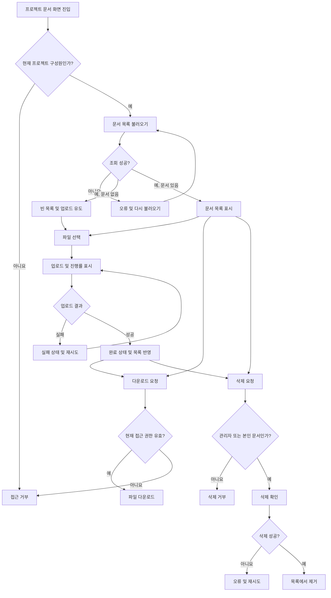

# 사내 프로젝트 문서 공유 PRD

## 1. Applicability

| 계약 항목 | 적용 여부 | 근거 |
|---|---|---|
| 컨텍스트·문제·목표·비목표 | 필수 | 기능 범위와 4주 내부 베타 목표를 정렬해야 한다. |
| 사용자·역할·권한 | 필수 | 프로젝트 관리자와 일반 구성원의 삭제 권한이 다르다. |
| 안정적인 요구사항 ID | 필수 | 개발·테스트·출시 범위를 추적해야 한다. |
| 페이지·라우트 | 필수 | 문서 목록, 업로드, 다운로드, 삭제가 사용자 화면에서 제공된다. |
| 상태 매트릭스 | 필수 | 빈 목록, 업로드 진행·실패·재시도·완료 상태가 명시적으로 요구되었다. |
| 사용자 흐름 | 필수 | 업로드와 삭제가 여러 상태를 거치는 작업이다. |
| 권한·데이터 경계 | 필수 | 프로젝트 간 문서 격리와 서버 측 권한 검사가 필요하다. |
| 정량적 비기능 요구사항 | 필수(목표만) | 목록 2초 노출은 목표이나 확정 SLA는 아니다. |
| 인수 기준 | 필수 | 내부 베타 진입 여부를 관찰 가능한 기준으로 판정해야 한다. |
| 가정·열린 결정 | 필수 | 파일 정책, SLA, 구성원 관리 범위 등이 확정되지 않았다. |
| 요구사항 연계 출시 계획 | 필수 | 4주 내 내부 베타 범위를 통제해야 한다. |

---

## 2. 문서 정보

- 문서명: 사내 프로젝트 문서 공유 PRD
- 상태: Draft
- 목표 출시: 4주 내 내부 베타
- 대상 사용자: 사내 프로젝트 구성원 및 프로젝트 관리자
- 1차 출시 범위: 업로드, 목록 조회, 다운로드, 삭제
- 제외 범위: 검색, 외부 공유

---

## 3. 배경과 문제

프로젝트 문서가 여러 채널이나 개인 저장 공간에 분산되면 구성원이 필요한 자료를 찾거나 최신 문서를 공유하기 어렵다. 프로젝트 단위로 접근 권한을 제한하면서, 구성원이 문서를 업로드하고 같은 프로젝트 구성원이 이를 조회·다운로드할 수 있는 중앙화된 공간이 필요하다.

문서 삭제는 역할과 소유권에 따라 제한되어야 한다.

- 프로젝트 관리자는 해당 프로젝트의 모든 문서를 삭제할 수 있다.
- 일반 구성원은 본인이 업로드한 문서만 삭제할 수 있다.
- 프로젝트에 속하지 않은 직원은 해당 프로젝트의 문서에 접근할 수 없다.

---

## 4. 목표

### G-001. 프로젝트 단위 문서 공유

직원이 자신이 참여 중인 프로젝트에 문서를 업로드하고, 같은 프로젝트 구성원이 이를 조회하고 다운로드할 수 있게 한다.

### G-002. 명확한 권한 통제

프로젝트 소속 여부, 관리자 역할, 업로더 소유권을 기준으로 목록·다운로드·삭제 권한을 서버에서 검증한다.

### G-003. 신뢰 가능한 업로드 경험

사용자가 업로드 진행률, 성공, 실패 및 재시도 가능 여부를 명확히 인지할 수 있게 한다.

### G-004. 제한된 내부 베타 출시

검색과 외부 공유를 제외한 핵심 문서 동작을 4주 안에 내부 사용자에게 제공한다.

---

## 5. 비목표

1차 출시에서는 다음을 제공하지 않는다.

- 문서명 또는 본문 검색
- 외부 사용자 초대 또는 외부 링크 공유
- 프로젝트 간 문서 공유
- 문서 미리보기
- 문서 버전 관리
- 폴더 또는 태그 분류
- 동시 편집
- 댓글, 멘션, 승인 워크플로
- 문서 내용 인덱싱
- 모바일 전용 화면
- 확정된 응답시간 또는 가용성 SLA

프로젝트 구성원 초대·제거 기능은 기존 프로젝트 관리 기능을 이용하는 것으로 가정한다. 별도의 구성원 관리 기능을 이번 문서 기능에 포함할지는 열린 결정으로 둔다.

---

## 6. 핵심 용어

| 용어 | 정의 |
|---|---|
| 프로젝트 | 문서 접근 권한을 구분하는 최상위 업무 단위 |
| 프로젝트 관리자 | 프로젝트 구성원을 관리하고 프로젝트 내 모든 문서를 삭제할 수 있는 사용자 |
| 일반 구성원 | 프로젝트 문서를 이용하되, 본인이 업로드한 문서만 삭제할 수 있는 사용자 |
| 업로더 | 특정 문서 업로드를 완료한 사용자 |
| 프로젝트 문서 | 하나의 프로젝트에 귀속되어 저장된 파일과 관련 메타데이터 |
| 업로드 완료 | 서버가 파일 저장을 완료하고 문서 목록에서 다운로드 가능한 상태가 된 시점 |
| 접근 가능 구성원 | 현재 해당 프로젝트에 유효하게 소속된 직원 |

---

## 7. 사용자, 역할 및 권한

| 역할 | 주요 목적 | 허용되는 동작 | 금지되는 동작 |
|---|---|---|---|
| 프로젝트 관리자 | 프로젝트 문서와 구성원을 관리 | 업로드, 목록 조회, 다운로드, 본인 및 타인 문서 삭제, 구성원 초대·제거 | 비소속 프로젝트 접근, 외부 공유 |
| 일반 구성원 | 프로젝트 문서를 공유하고 이용 | 업로드, 목록 조회, 다운로드, 본인이 올린 문서 삭제 | 타인이 올린 문서 삭제, 구성원 관리, 외부 공유 |
| 비구성원 | 해당 없음 | 없음 | 목록, 업로드, 다운로드, 삭제 등 모든 문서 접근 |
| 제거된 구성원 | 해당 없음 | 없음 | 제거된 프로젝트의 문서에 대한 신규 접근 및 다운로드 |

### 권한 매트릭스

| 동작 | 프로젝트 관리자 | 일반 구성원 | 비구성원 |
|---|---:|---:|---:|
| 문서 목록 조회 | 허용 | 허용 | 거부 |
| 문서 업로드 | 허용 | 허용 | 거부 |
| 문서 다운로드 | 허용 | 허용 | 거부 |
| 본인 문서 삭제 | 허용 | 허용 | 거부 |
| 타인 문서 삭제 | 허용 | 거부 | 거부 |
| 구성원 초대·제거 | 허용 | 거부 | 거부 |

---

## 8. 기능 요구사항

| ID | 요구사항 | 우선순위 |
|---|---|---|
| FR-001 | 인증된 직원은 자신이 현재 소속된 프로젝트의 문서 화면에만 접근할 수 있어야 한다. | Must |
| FR-002 | 프로젝트 구성원은 해당 프로젝트에 파일을 업로드할 수 있어야 한다. | Must |
| FR-003 | 업로드 중인 파일마다 진행률을 표시해야 한다. | Must |
| FR-004 | 업로드가 성공하면 해당 항목을 완료 상태로 표시하고 문서 목록에 반영해야 한다. | Must |
| FR-005 | 업로드가 실패하면 실패 상태와 재시도 동작을 제공해야 한다. | Must |
| FR-006 | 재시도는 사용자가 같은 파일을 다시 선택하도록 강제하지 않고 가능한 범위에서 기존 업로드 정보를 재사용해야 한다. | Should |
| FR-007 | 프로젝트 구성원은 해당 프로젝트에 업로드가 완료된 문서 목록을 볼 수 있어야 한다. | Must |
| FR-008 | 문서 목록에는 최소한 파일명, 업로더, 업로드 완료 시각, 파일 크기를 표시해야 한다. | Must |
| FR-009 | 문서가 하나도 없으면 빈 목록 상태와 업로드 유도 동작을 표시해야 한다. | Must |
| FR-010 | 프로젝트 구성원은 목록에서 문서를 다운로드할 수 있어야 한다. | Must |
| FR-011 | 다운로드 시점에도 사용자의 현재 프로젝트 소속 여부를 서버에서 다시 검사해야 한다. | Must |
| FR-012 | 일반 구성원은 본인이 업로드한 문서만 삭제할 수 있어야 한다. | Must |
| FR-013 | 프로젝트 관리자는 해당 프로젝트의 모든 문서를 삭제할 수 있어야 한다. | Must |
| FR-014 | 삭제 전에 대상 파일명을 포함한 확인 절차를 제공해야 한다. | Must |
| FR-015 | 삭제가 성공하면 문서는 현재 목록에서 제거되고 이후 다운로드할 수 없어야 한다. | Must |
| FR-016 | 삭제가 실패하면 문서를 목록에 유지하고 실패 안내 및 재시도 동작을 제공해야 한다. | Must |
| FR-017 | 클라이언트가 삭제 버튼을 숨겼는지와 관계없이 서버가 프로젝트, 역할 및 업로더 소유권을 검사해야 한다. | Must |
| FR-018 | 프로젝트 관리자는 프로젝트 구성원을 초대하거나 제거할 수 있어야 한다. | Must 또는 기존 기능 의존 |
| FR-019 | 프로젝트에서 제거된 사용자는 제거 효력이 발생한 이후 목록 조회, 신규 업로드 및 다운로드를 할 수 없어야 한다. | Must |
| FR-020 | 동일한 이름의 파일 업로드를 허용하되 각 문서는 별도 식별자로 구분해야 한다. | Should |
| FR-021 | 업로드 완료 전이거나 실패한 파일은 다른 구성원의 다운로드 가능한 문서 목록에 노출하지 않아야 한다. | Must |
| FR-022 | 목록 조회에 실패하면 오류 상태와 다시 불러오기 동작을 제공해야 한다. | Must |
| FR-023 | 다운로드가 실패하면 파일이 다운로드된 것처럼 표시하지 않고 재시도 가능한 오류 안내를 제공해야 한다. | Must |
| FR-024 | 권한 없는 접근에는 문서 또는 프로젝트의 민감한 메타데이터를 포함하지 않은 일관된 거부 응답을 제공해야 한다. | Must |

---

## 9. 화면 및 라우트

실제 URL 규칙은 기존 제품 라우팅 규칙에 맞춰 조정할 수 있다.

| 화면 | 제안 라우트 | 접근 역할 | 주요 동작 |
|---|---|---|---|
| 프로젝트 문서 목록 | `/projects/:projectId/documents` | 프로젝트 관리자, 일반 구성원 | 목록 조회, 업로드, 다운로드, 삭제 |
| 프로젝트 구성원 관리 | `/projects/:projectId/members` | 프로젝트 관리자 | 구성원 초대·제거 |

구성원 관리 화면이 이미 존재한다면 신규 화면을 만들지 않고 기존 화면을 사용한다.

---

## 10. 사용자 경험 계약

### 10.1 문서 목록 상태

| 상태 | 표시 내용 | 사용자 동작 |
|---|---|---|
| 초기 로딩 | 목록 영역 로딩 표시 | 대기 |
| 빈 목록 | “아직 공유된 문서가 없습니다” 안내와 업로드 동작 | 파일 업로드 |
| 조회 성공 | 문서 메타데이터와 허용된 동작 | 다운로드 또는 삭제 |
| 조회 실패 | 목록을 불러오지 못했다는 안내 | 다시 불러오기 |
| 접근 거부 | 접근 권한이 없다는 안내 | 허용된 화면으로 이동 |

### 10.2 업로드 상태

| 상태 | 표시 내용 | 허용 동작 |
|---|---|---|
| 업로드 대기 | 선택한 파일명 | 업로드 시작 또는 취소 |
| 업로드 중 | 파일명과 진행률 | 가능한 경우 취소 |
| 완료 | 완료 표시 및 목록 반영 | 다운로드 또는 권한에 따른 삭제 |
| 실패 | 실패 표시와 이해 가능한 오류 안내 | 재시도 또는 항목 제거 |
| 재시도 중 | 갱신된 진행률 | 대기 |
| 권한 상실 | 업로드 중단 및 권한 오류 | 허용된 화면으로 이동 |

진행률은 사용자에게 실제 전송 진행을 나타내야 하며, 완료 상태는 서버가 파일 저장 완료를 확인한 뒤에만 표시한다.

### 10.3 삭제 상태

| 상태 | 표시 내용 | 허용 동작 |
|---|---|---|
| 삭제 가능 | 권한이 있는 문서에 삭제 동작 표시 | 삭제 요청 |
| 확인 대기 | 파일명을 포함한 확인 메시지 | 취소 또는 삭제 확정 |
| 삭제 중 | 중복 실행 방지 상태 | 대기 |
| 삭제 완료 | 목록에서 항목 제거 | 없음 |
| 삭제 실패 | 문서를 유지하고 오류 안내 | 재시도 |
| 권한 거부 | 삭제되지 않았음을 안내 | 목록으로 복귀 |

---

## 11. 사용자 흐름

---

## 12. 권한 및 데이터 경계

### 12.1 프로젝트 격리

모든 문서 레코드와 저장 파일은 정확히 하나의 프로젝트에 귀속되어야 한다. 다음 요청마다 서버에서 인증 및 프로젝트 소속 여부를 검사한다.

- 문서 목록 조회
- 업로드 시작 및 완료
- 다운로드
- 삭제
- 구성원 초대·제거

요청에 포함된 `projectId`나 `documentId`만 신뢰해서는 안 된다. 문서가 요청된 프로젝트에 실제로 속하는지 검증해야 한다.

### 12.2 삭제 권한

서버는 삭제 시 다음 조건 중 하나가 성립하는지 확인한다.

1. 요청자가 해당 프로젝트의 현재 관리자다.
2. 요청자가 해당 프로젝트의 현재 일반 구성원이며 문서의 업로더다.

프론트엔드에서 삭제 버튼을 숨기는 것은 편의 기능일 뿐 권한 통제가 아니다.

### 12.3 구성원 제거

구성원 제거 효력이 발생하면 해당 사용자의 기존 로그인 세션이 남아 있더라도 이후 문서 요청에서 접근이 거부되어야 한다. 이미 사용자 기기에 다운로드된 파일을 회수하는 기능은 범위 밖이다.

### 12.4 파일 식별

다운로드 권한은 추측 가능한 저장 경로나 공개 URL에 의존해서는 안 된다. 파일 접근 시 서버 권한 확인을 거치거나 제한된 수명의 다운로드 수단을 사용해야 한다.

---

## 13. 비기능 요구사항

| ID | 항목 | 요구사항 |
|---|---|---|
| NFR-001 | 목록 체감 성능 | 정상적인 내부 사용 환경에서 사용자가 화면에 진입한 후 문서 목록이 2초 이내 보이는 것을 제품 목표로 한다. 확정 SLA는 아니다. |
| NFR-002 | 성능 측정 | 목록 조회 시간은 클라이언트 요청 시작부터 성공 목록 또는 빈 상태가 표시될 때까지 측정할 수 있어야 한다. |
| NFR-003 | 보안 | 모든 문서 작업은 인증 및 서버 측 프로젝트 권한 검사를 거쳐야 한다. |
| NFR-004 | 전송 보안 | 파일과 메타데이터는 승인된 암호화 통신 경로를 통해 전송해야 한다. |
| NFR-005 | 접근성 | 진행률, 완료, 실패 상태는 색상만으로 구분하지 않고 텍스트 또는 접근 가능한 상태 정보로 제공해야 한다. |
| NFR-006 | 오류 복구 | 일시적인 목록·업로드·다운로드·삭제 실패는 전체 화면을 새로 시작하지 않고 재시도할 수 있어야 한다. |
| NFR-007 | 관측 가능성 | 목록 조회, 업로드, 다운로드, 삭제의 성공·실패를 문서 내용이나 민감한 파일 경로 없이 진단할 수 있어야 한다. |
| NFR-008 | 데이터 일관성 | 업로드 완료로 표시된 문서만 목록 및 다운로드 대상으로 제공해야 한다. |
| NFR-009 | 브라우저 지원 | 내부 베타 대상 브라우저 범위는 출시 전에 확정한다. |
| NFR-010 | 가용성 | 확정 SLA를 설정하지 않는다. 제품 책임자가 베타 결과와 운영 조건을 바탕으로 결정한다. |

2초 목표를 충족하지 못했다고 해서 자동으로 SLA 위반으로 판정하지 않는다. 목표 달성률과 측정 환경은 내부 베타에서 수집한다.

---

## 14. 인수 기준

| ID | 연결 요구사항 | Given | When | Then | 검증 방법 |
|---|---|---|---|---|---|
| AC-001 | FR-001, FR-007 | 사용자가 프로젝트의 현재 구성원이다 | 문서 화면에 진입한다 | 해당 프로젝트의 문서 목록 또는 빈 상태가 표시된다 | 통합 테스트, UI 테스트 |
| AC-002 | FR-001, FR-024 | 사용자가 프로젝트 구성원이 아니다 | 목록 API 또는 화면에 접근한다 | 접근이 거부되고 문서 메타데이터가 노출되지 않는다 | 권한 통합 테스트 |
| AC-003 | FR-002, FR-003 | 구성원이 유효한 파일을 선택했다 | 업로드를 시작한다 | 파일별 업로드 진행률이 표시된다 | UI 및 업로드 통합 테스트 |
| AC-004 | FR-004, FR-021 | 업로드가 진행 중이다 | 서버 저장이 완료되지 않았다 | 파일이 다운로드 가능한 완료 문서로 노출되지 않는다 | 통합 테스트 |
| AC-005 | FR-004, FR-008 | 서버가 업로드 완료를 확인했다 | 클라이언트가 완료 응답을 받는다 | 완료 상태가 표시되고 파일명, 업로더, 완료 시각, 크기가 목록에 나타난다 | UI 테스트 |
| AC-006 | FR-005, FR-006 | 업로드가 실패했다 | 실패 응답을 받는다 | 실패 상태와 재시도 동작이 표시되며 재시도로 다시 업로드할 수 있다 | 장애 주입 테스트 |
| AC-007 | FR-009 | 프로젝트에 완료된 문서가 없다 | 목록 조회가 성공한다 | 빈 목록 안내와 업로드 동작이 표시된다 | UI 테스트 |
| AC-008 | FR-010, FR-011 | 현재 구성원이 완료된 문서를 선택했다 | 다운로드를 요청한다 | 서버가 권한을 확인한 뒤 올바른 파일을 제공한다 | 통합 테스트 |
| AC-009 | FR-011, FR-019 | 사용자가 프로젝트에서 제거되었다 | 기존 세션으로 문서를 다운로드한다 | 다운로드가 거부된다 | 권한 회귀 테스트 |
| AC-010 | FR-012, FR-015 | 일반 구성원이 본인 문서를 보고 있다 | 삭제를 확인한다 | 문서가 목록에서 제거되고 다시 다운로드할 수 없다 | 통합 테스트 |
| AC-011 | FR-012, FR-017 | 일반 구성원이 타인의 문서를 대상으로 한다 | 직접 삭제 요청을 보낸다 | 삭제가 거부되고 문서는 유지된다 | API 권한 테스트 |
| AC-012 | FR-013 | 프로젝트 관리자가 타인의 문서를 보고 있다 | 삭제를 확인한다 | 문서가 삭제되고 더 이상 다운로드할 수 없다 | 통합 테스트 |
| AC-013 | FR-014 | 삭제 권한이 있는 사용자가 삭제를 선택한다 | 확인 UI가 열린다 | 대상 파일명이 표시되고 취소와 확정 동작이 제공된다 | UI 테스트 |
| AC-014 | FR-016 | 서버의 삭제가 실패한다 | 삭제 요청을 수행한다 | 문서가 목록에 남고 오류 및 재시도 동작이 표시된다 | 장애 주입 테스트 |
| AC-015 | FR-022 | 목록 조회가 실패한다 | 화면이 실패 응답을 받는다 | 오류 안내와 다시 불러오기 동작이 표시된다 | UI 테스트 |
| AC-016 | FR-018 | 프로젝트 관리자가 유효한 직원을 초대한다 | 초대가 수락되거나 즉시 추가된다 | 해당 직원이 프로젝트 문서에 접근할 수 있다 | 구성원 연동 테스트 |
| AC-017 | FR-018 | 일반 구성원이 구성원 변경을 요청한다 | 초대 또는 제거 요청을 보낸다 | 요청이 거부되고 구성원 상태가 바뀌지 않는다 | API 권한 테스트 |
| AC-018 | FR-020 | 같은 이름의 문서가 이미 있다 | 구성원이 동일 이름의 새 파일을 업로드한다 | 기존 문서를 덮어쓰지 않고 별도 문서로 등록된다 | 통합 테스트 |
| AC-019 | NFR-001, NFR-002 | 합의된 내부 베타 측정 환경이다 | 문서 화면을 연다 | 목록 표시 시간을 기록할 수 있고 2초 목표 달성 여부가 보고된다 | 성능 계측 |
| AC-020 | NFR-005 | 업로드 상태가 변경된다 | 보조 기술 또는 색상 인지가 제한된 사용자가 화면을 확인한다 | 진행·성공·실패 상태를 텍스트 정보로 식별할 수 있다 | 접근성 검사 |

---

## 15. 합리적 가정

다음은 4주 베타 계획을 가능하게 하기 위한 작업 가정이다. 열린 결정에서 다른 결론이 나면 관련 요구사항과 일정은 갱신한다.

1. 사내 인증과 직원 식별 기능은 이미 존재한다.
2. 프로젝트, 프로젝트 관리자, 프로젝트 구성원 관계를 제공하는 기존 데이터 또는 서비스가 있다.
3. 구성원 초대·제거는 기존 프로젝트 관리 기능을 재사용한다. 이번 베타의 신규 구현 범위는 문서 업로드·목록·다운로드·삭제에 한정한다.
4. 모든 프로젝트 구성원은 문서 업로드와 다운로드 권한을 가진다.
5. 하나의 문서는 하나의 프로젝트에만 속한다.
6. 동일한 파일명의 문서는 별도 항목으로 업로드할 수 있으며 기존 문서를 자동으로 덮어쓰지 않는다.
7. 목록에는 업로드가 완료된 문서만 공유 문서로 표시한다.
8. 문서는 원본 파일명과 원본 형식으로 다운로드한다.
9. 프로젝트에서 제거된 사용자는 이후 요청부터 즉시 접근 권한을 잃는다.
10. 내부 베타에서는 데스크톱 웹을 우선 지원하고 반응형 모바일 최적화는 필수 범위로 두지 않는다.
11. 2초 목표는 제품 성능 목표이며 계약상 SLA 또는 베타 출시 차단 기준이 아니다.

---

## 16. 열린 결정

| ID | 결정 사항 | 결정 책임자 | 결정 시점 | 미결정 시 영향 |
|---|---|---|---|---|
| OD-001 | 구성원 초대·제거 기능이 이미 존재하는지, 신규 구현이 필요한지 | 제품 책임자·엔지니어링 리드 | 1주 차 시작 전 | 신규 구현이 필요하면 4주 범위 또는 일정 조정 필요 |
| OD-002 | 허용 파일 형식, 파일당 최대 크기, 사용자·프로젝트별 저장 한도 | 제품 책임자·보안·인프라 담당 | 1주 차 | 업로드 검증, UI 안내, 비용 산정 불가 |
| OD-003 | 실행 파일, 악성 코드 및 민감 문서에 대한 검사 정책 | 보안 책임자 | 1주 차 | 내부 보안 위험 및 업로드 완료 처리 방식에 영향 |
| OD-004 | 삭제 방식과 보존 기간: 즉시 영구 삭제, 논리 삭제, 일정 기간 복구 | 제품 책임자·보안·컴플라이언스 | 1주 차 | 저장소 정리, 복구, 감사 요구사항에 영향 |
| OD-005 | 문서 다운로드 및 삭제에 대한 감사 로그 보존 범위와 기간 | 보안·컴플라이언스 | 베타 전 | 사고 조사와 개인정보 정책에 영향 |
| OD-006 | 목록 기본 정렬 기준 및 페이지네이션 방식 | 제품 책임자·디자인 | 1주 차 | 목록 API 및 UI 구현에 영향 |
| OD-007 | 한 번에 여러 파일을 업로드할 수 있는지 | 제품 책임자 | 1주 차 | 업로드 UI와 동시성 처리 범위에 영향 |
| OD-008 | 업로드 취소 기능을 1차 출시에 포함할지 | 제품 책임자 | 1주 차 | 상태 모델과 저장소 정리 방식에 영향 |
| OD-009 | 2초 목표의 데이터 규모, 네트워크 환경, 백분위 기준 및 SLA 전환 여부 | 제품 책임자·엔지니어링 리드 | 내부 베타 결과 검토 시 | 성능 판정과 최적화 우선순위에 영향 |
| OD-010 | 내부 베타 지원 브라우저와 최소 버전 | 제품 책임자·엔지니어링 리드 | 1주 차 | 테스트 범위에 영향 |
| OD-011 | 초대 방식: 즉시 구성원 추가 또는 초대 수락 필요 | 제품 책임자 | 1주 차 | 구성원 상태와 접근 가능 시점에 영향 |
| OD-012 | 프로젝트 관리자가 마지막 관리자 또는 자신을 제거할 수 있는지 | 제품 책임자 | 1주 차 | 프로젝트 관리 불능 상태 방지 규칙에 영향 |

OD-001~OD-004는 개발 구조와 4주 일정에 직접 영향을 주므로 1주 차 착수 전에 결정해야 한다.

---

## 17. 리스크 및 완화책

| 리스크 | 영향 | 완화책 |
|---|---|---|
| 구성원 관리 기능이 기존에 없음 | 1차 범위 확대 및 일정 지연 | 1주 차에 의존성을 확인하고, 필요하면 별도 단계로 분리하거나 베타 범위를 재승인한다. |
| 클라이언트 UI에만 권한을 적용 | 문서 유출 또는 무단 삭제 | 모든 목록·다운로드·삭제 요청에 서버 측 프로젝트 및 소유권 검사를 적용한다. |
| 제거된 구성원이 기존 파일 URL을 보유 | 권한 제거 후에도 접근 가능 | 공개 고정 URL을 피하고 다운로드 시점마다 권한을 검사한다. |
| 업로드 중 연결 중단 | 불완전 파일 또는 사용자 혼란 | 완료 전 문서를 공유 목록에서 제외하고 실패·재시도를 제공한다. |
| 대용량 또는 허용되지 않은 파일 | 비용 증가, 장애 또는 보안 위험 | 크기·형식·검사 정책을 베타 구현 전에 확정하고 서버에서 검증한다. |
| 삭제 정책 미정 | 데이터 복구·보존 요구 충돌 | 삭제 및 보존 정책을 구현 전에 승인받는다. |
| 2초 목표의 측정 조건 불명확 | 성능 달성 여부 판단 불가 | 내부 베타 환경과 측정 시작·종료 지점을 정의하고 계측한다. |
| 동명이 파일로 인한 혼동 | 사용자가 잘못된 문서를 다운로드 | 업로더, 업로드 시각, 크기를 함께 표시하고 문서를 고유 ID로 관리한다. |
| 4주 일정에 과도한 기능 포함 | 베타 지연 | 검색, 외부 공유, 미리보기, 버전 관리를 명시적으로 제외한다. |

---

## 18. 성공 지표

내부 베타에서 다음 지표를 관찰하되, 목표값은 제품 책임자가 별도로 결정한다.

- 문서 업로드 시도 및 완료 건수
- 업로드 성공률과 재시도 후 성공률
- 목록 조회 성공률
- 목록 표시 시간 및 2초 목표 달성 비율
- 다운로드 성공률
- 삭제 성공률
- 권한 거부 건수
- 프로젝트별 활성 문서 공유 사용자 수

파일명, 문서 내용, 원본 저장 경로 등 민감할 수 있는 정보는 분석 이벤트에 포함하지 않는 것을 원칙으로 한다.

---

## 19. 4주 내부 베타 출시 계획

| 단계 | 기간 | 요구사항 ID | 검증 가능한 종료 조건 |
|---|---|---|---|
| 범위·정책 확정 | 1주 차 초반 | OD-001~OD-012 | 핵심 열린 결정, 기존 인증·프로젝트·구성원 의존성, 파일 및 삭제 정책이 문서화되어 있다. |
| 권한·데이터 기반 | 1주 차 | FR-001, FR-011, FR-017~FR-021, FR-024 | 프로젝트 격리와 역할·소유권 권한 테스트가 통과한다. |
| 핵심 문서 기능 | 2주 차 | FR-002, FR-007~FR-10, FR-12~FR-15 | 구성원이 파일을 업로드·조회·다운로드하고 허용 범위에서 삭제할 수 있다. |
| 상태·복구 경험 | 3주 차 | FR-003~FR-006, FR-009, FR-016, FR-022, FR-023 | 진행률, 빈 상태, 완료, 실패 및 재시도 UI 테스트가 통과한다. |
| 통합·보안·성능 검증 | 4주 차 전반 | 전체 FR, NFR-001~NFR-010 | 핵심 인수 기준, 권한 회귀 테스트, 오류 복구 및 성능 계측이 완료된다. |
| 내부 베타 배포 | 4주 차 후반 | 전체 | 승인된 내부 사용자에게 배포되고, 알려진 제한·지원 경로·롤백 절차가 공유된다. |

---

## 20. 내부 베타 진입 기준

다음 조건을 모두 만족하면 내부 베타에 진입할 수 있다.

- 업로드, 목록, 다운로드, 삭제의 핵심 인수 기준이 통과한다.
- 일반 구성원이 타인 문서를 삭제할 수 없음을 서버 테스트로 확인한다.
- 비구성원과 제거된 구성원의 목록·다운로드 접근이 차단된다.
- 업로드 진행률, 빈 목록, 실패 후 재시도, 완료 상태가 사용자 화면에 제공된다.
- 미완료 업로드가 다른 구성원의 다운로드 목록에 노출되지 않는다.
- 파일 형식·크기·보안 검사 및 삭제 보존 정책이 승인되었다.
- 목록 표시 시간을 측정할 수 있으며 2초 목표 결과를 확인할 수 있다.
- 검색과 외부 공유가 베타 범위에 포함되지 않았음을 확인한다.
- 알려진 장애 대응 및 베타 피드백 접수 담당자가 지정되어 있다.