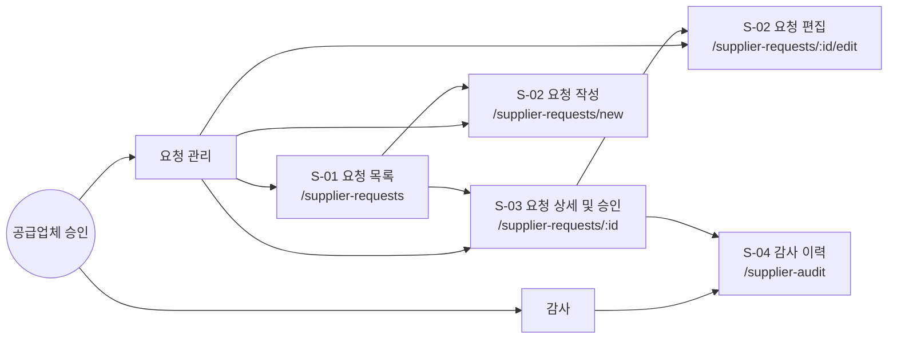
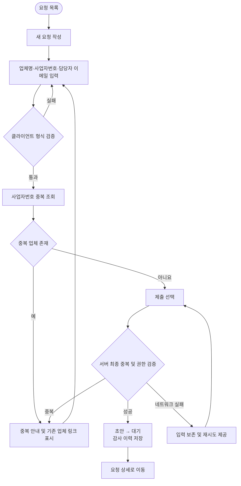
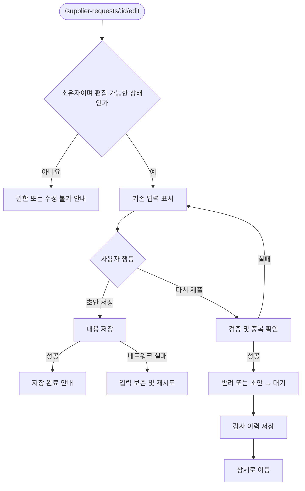
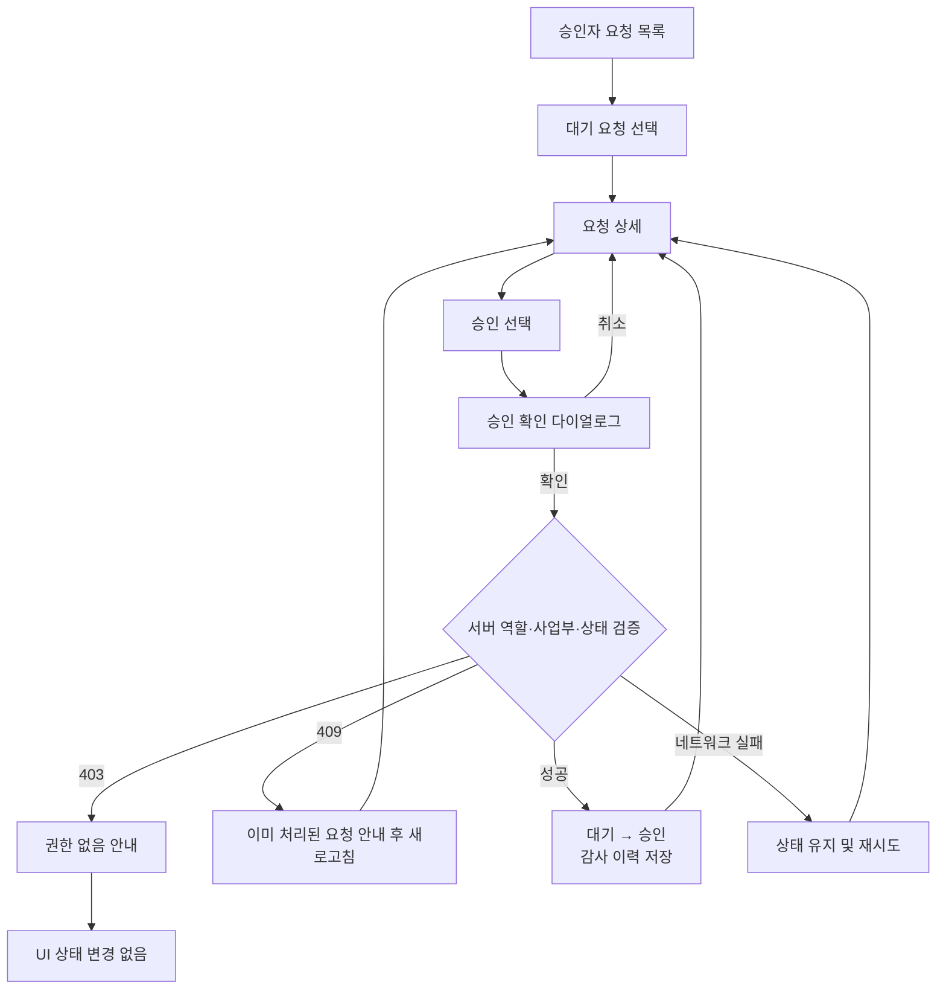
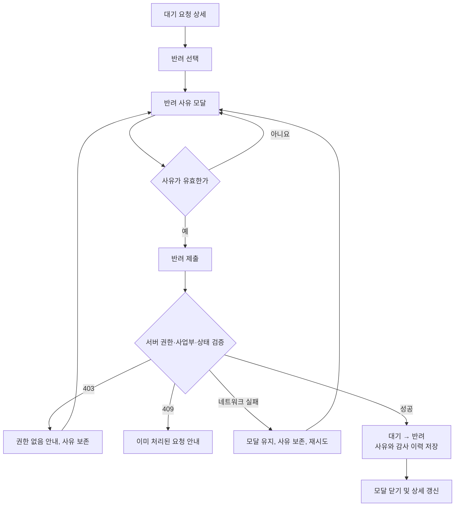
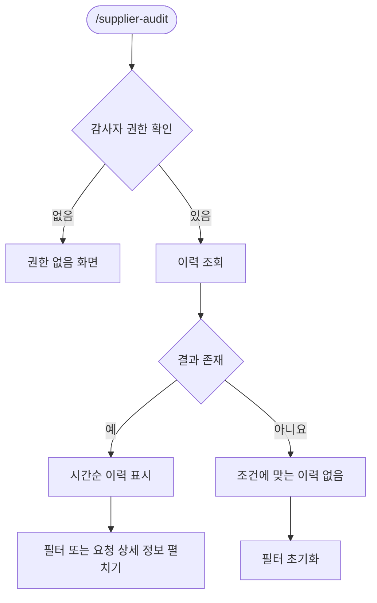

# 공급업체 승인 화면정의서

> 문서 상태: 구현 전달용 초안  
> 기준일: 2026-07-27  
> 범위: 요청 목록, 요청 작성/편집, 요청 상세/승인, 감사 이력

## 공통 가정

- 모든 사용자는 로그인되어 있으며 세션에는 `userId`, `role`, `businessUnitId`가 있다.
- 요청자는 자신의 요청만, 승인자는 자신의 사업부 요청만 조회한다.
- 감사자는 전체 사업부의 감사 이력을 읽을 수 있다고 가정한다. 조회 범위 제한이 있다면 정책 확정이 필요하다.
- 사업자번호는 하이픈을 제거한 10자리 숫자로 정규화하며, 중복 여부는 정규화된 값으로 판단한다.
- `초안 → 대기`, `반려 → 대기`, `대기 → 승인`, `대기 → 반려`를 상태 변경으로 기록한다.
- 승인·반려는 낙관적 업데이트를 사용하지 않는다. 서버 성공 응답 후에만 UI 상태를 갱신한다.
- 반려된 요청을 편집하는 동안 상태는 `반려`로 유지하고, 재제출 성공 시 `대기`로 변경한다.
- 목록 기본 정렬은 최근 수정일 내림차순이다.
- API 경로와 프론트엔드 기술 스택은 제안이며 프로젝트 표준에 맞게 조정할 수 있다.

---

# 1. IA

## 1.1 페이지 구조



고아 페이지 없이 모든 화면은 목록 또는 전역 내비게이션에서 진입한다.

## 1.2 내비게이션

로그인 후 상단 내비게이션:

- 요청자: `요청 목록`
- 승인자: `요청 목록`
- 감사자: `감사 이력`
- 복수 역할 사용자: 허용된 메뉴를 모두 표시
- 권한 없는 메뉴는 숨기되, URL 직접 접근은 별도로 서버 권한 검증

Breadcrumb:

- 목록: `홈 > 공급업체 요청`
- 작성: `홈 > 공급업체 요청 > 새 요청`
- 상세: `홈 > 공급업체 요청 > {요청번호}`
- 편집: `홈 > 공급업체 요청 > {요청번호} > 편집`
- 감사: `홈 > 감사 이력`

## 1.3 역할별 접근 권한

| 화면 | 요청자 | 승인자 | 감사자 | 서버 조회 범위 |
|---|---:|---:|---:|---|
| S-01 요청 목록 | 허용 | 허용 | 불가 | 요청자: 본인, 승인자: 본인 사업부 |
| S-02 작성 | 허용 | 불가 | 불가 | 로그인 사용자 기준 |
| S-02 편집 | 본인 초안·반려만 | 불가 | 불가 | 소유자 및 상태 검증 |
| S-03 요청 상세 | 본인 요청 | 본인 사업부 요청 | 불가 | 소유자 또는 사업부 검증 |
| S-03 승인·반려 | 불가 | 본인 사업부의 대기 요청만 | 불가 | 역할·사업부·현재 상태 검증 |
| S-04 감사 이력 | 불가 | 불가 | 허용 | 감사 정책에 따른 읽기 전용 범위 |

권한 검증은 UI 표시 여부와 무관하게 모든 조회·변경 API에서 수행한다.

## 1.4 FR 매핑

| 요구사항 | 연결 화면 | UI/서버 책임 |
|---|---|---|
| FR-101 입력 및 제출 | S-02 | 필수 입력, 검증, 제출 |
| FR-102 중복 차단 및 기존 업체 링크 | S-02 | 중복 안내 및 링크, 서버 제출 차단 |
| FR-103 사업부 요청 승인·사유 포함 반려 | S-01, S-03 | 대기 목록, 승인, 반려 모달 |
| FR-104 서버 사업부 권한 확인 | S-01, S-03 | 서버 조회 범위 및 mutation 권한 검증 |
| FR-105 모든 상태 변경 감사 기록 | S-02, S-03, S-04 | 상태 변경과 감사 이벤트의 원자적 저장 |

---

# 2. User Flow

## Flow A — 요청 작성 및 제출

수용 기준: 중복 사업자번호 제출 차단, 네트워크 실패 시 입력 보존



중복 조회 중 제출 버튼은 비활성화한다. 사전 조회 결과와 관계없이 제출 API가 중복을 다시 검사한다.

## Flow B — 초안 저장 및 반려 요청 재제출



## Flow C — 승인

수용 기준: 권한 없는 승인 시 403, 상태 불변



## Flow D — 반려

수용 기준: 반려 사유 필수, 네트워크 실패 시 사유 보존



모달 닫기 시 작성한 사유가 있으면 “작성 중인 반려 사유를 버리시겠습니까?” 확인을 표시한다.

## Flow E — 감사 이력 조회



## 수용 기준 커버리지

| 수용 기준 | Flow |
|---|---|
| 권한 없는 승인 시 403, 상태 불변 | Flow C |
| 중복 사업자번호에서는 제출되지 않음 | Flow A |
| 네트워크 실패 시 입력 및 반려 사유 보존 | Flow A, B, C, D |
| 모바일 승인 상세 단일 열 | S-03 화면 명세 및 와이어프레임 |

---

# 3. Screen Spec

## 공통 상태 및 규칙

- 1초 이상 로딩이 예상되는 목록·상세에는 실제 레이아웃 형태의 스켈레톤을 표시한다.
- mutation 중 버튼을 비활성화하고 `저장 중…`, `제출 중…`, `승인 중…`, `반려 중…`으로 변경한다.
- 네트워크 오류는 사용자가 입력한 값과 열린 모달을 유지한다.
- 네트워크 오류에 자동 재시도는 조회 요청에만 최대 2회 적용한다. 상태 변경 요청은 사용자가 명시적으로 재시도한다.
- 401은 로그인 화면으로 이동하되 복귀 URL을 보존한다.
- 403은 일반 서버 오류와 구분된 권한 안내를 표시한다.
- 모든 터치 대상은 최소 `44×44px`, 본문 글자는 모바일에서 최소 `14px`로 한다.
- 상태는 텍스트와 배지를 함께 사용하며 색만으로 전달하지 않는다.

---

## S-01 요청 목록 — `/supplier-requests`

| 항목 | 명세 |
|---|---|
| 대상 | 요청자, 승인자 |
| 연결 요구사항 | FR-103, FR-104 |
| 레이아웃 | 제목, 역할별 요약, 필터, 요청 목록 |
| 요청자 기본 범위 | 본인이 작성한 전체 요청 |
| 승인자 기본 범위 | 자기 사업부의 `대기` 요청 |
| 행 선택 | S-03 상세로 이동 |
| 페이지네이션 | 서버 기반, 기본 20건 |

### 구성요소

| 슬롯 | 타입 | 동작 |
|---|---|---|
| `page_title` | heading | “공급업체 요청” |
| `new_request` | primary button | 요청자에게만 “새 요청 작성” |
| `status_filter` | select | 전체, 초안, 대기, 승인, 반려 |
| `search` | search input | 업체명 또는 사업자번호 검색 |
| `request_list` | table/card list | 요청번호, 업체명, 사업자번호, 상태, 요청자, 사업부, 수정일 |
| `pagination` | navigation | 이전/다음 및 현재 페이지 |
| `reset_filter` | button | 필터 초기화 |

승인자에게는 상태 기본값을 `대기`로 설정하되 다른 상태 열람 허용 여부는 정책에 따라 조정한다.

### 상태

- `loading`: 헤더를 유지하고 5개 행 스켈레톤 표시.
- `empty-first`: 요청자 — “아직 작성한 요청이 없습니다.” + `새 요청 작성`.
- `empty-filter`: “조건에 맞는 요청이 없습니다.” + `필터 초기화`.
- `error`: “요청 목록을 불러오지 못했습니다.” + `다시 시도`.
- `success`: 권한 범위 내 요청 목록 표시.
- `no-permission`: 허용되지 않은 역할이면 “요청 목록을 볼 권한이 없습니다.” 표시 후 접근 가능한 기본 화면으로 이동.

### 반응형

- Desktop `≥1024px`: 테이블, 필터 한 줄 배치.
- Tablet `768–1023px`: 필터 2열, 일부 열 축약.
- Mobile `<768px`: 카드 목록. 요청번호, 업체명, 상태, 수정일을 우선 표시하며 가로 스크롤을 만들지 않는다.

---

## S-02 요청 작성·편집

- 작성: `/supplier-requests/new`
- 편집: `/supplier-requests/:id/edit`

| 항목 | 명세 |
|---|---|
| 대상 | 요청자 |
| 연결 요구사항 | FR-101, FR-102, FR-105 |
| 편집 가능 상태 | 본인의 `초안`, `반려` |
| 편집 불가 상태 | `대기`, `승인` |
| 이탈 보호 | 변경사항이 있을 때 브라우저 및 내부 이동 확인 |

### 입력 필드

| 필드 | HTML 타입 | 필수 | 검증 | 안내 |
|---|---|---:|---|---|
| 업체명 | `text` | 예 | 공백 제거 후 1–100자 | “예: 위지티엔 주식회사” |
| 사업자번호 | `text`, `inputmode=numeric` | 예 | 하이픈 제거 후 숫자 10자리 | “숫자 10자리” |
| 담당자 이메일 | `email` | 예 | 유효한 이메일, 최대 254자 | “name@company.com” |
| 기존 반려 사유 | read-only callout | 편집 시 | 반려 요청에만 표시 | “이전 반려 사유” |

### 액션

- `초안 저장`: 작성 또는 초안 상태에서 표시.
- `제출하기`: 신규·초안에서 표시.
- `다시 제출하기`: 반려 상태에서 표시.
- `취소`: 목록 또는 상세로 이동. 변경사항이 있으면 확인.
- 중복 확인 중 및 중복 발견 시 제출 계열 버튼 비활성화.

### 중복 처리

1. 사업자번호가 10자리가 되거나 필드가 blur되면 중복 조회한다.
2. 중복 발견 시 필드 아래에 다음 메시지를 표시한다.

> 이미 등록된 사업자번호입니다. [기존 업체 보기]

3. 링크는 새 탭이 아닌 같은 애플리케이션의 기존 업체 상세로 이동한다.
4. 사용자가 번호를 수정하면 기존 중복 결과를 초기화하고 다시 검사한다.
5. 제출 API에서도 동일한 중복 검사를 수행한다.
6. 제출 시 뒤늦게 중복이 발견되면 `409 DUPLICATE_BUSINESS_NUMBER`로 응답하고 입력을 보존한다.

### 상태

- `initial`: 빈 폼 또는 기존 값 표시.
- `checking-duplicate`: 사업자번호 필드 옆 “중복 확인 중…”, `aria-busy=true`.
- `validation-error`: 해당 필드에 `aria-invalid=true`, 오류 텍스트 연결.
- `duplicate`: 기존 업체 링크와 오류 배너 표시, 제출 차단.
- `submitting`: 입력 및 제출 버튼 잠금, “제출 중…”.
- `network-error`: “네트워크 연결을 확인한 뒤 다시 시도해주세요. 입력한 내용은 유지됩니다.” + `다시 시도`.
- `success-draft`: “초안이 저장되었습니다.” 토스트.
- `success-submit`: “승인 요청을 제출했습니다.” 토스트 후 S-03 이동.
- `no-permission`: 요청자가 아니거나 타인 요청이면 403 안내.
- `locked`: 대기·승인 상태면 입력을 읽기 전용으로 표시하고 상세로 이동할 수 있게 한다.

### 반응형

- Desktop `≥1024px`: 최대 폭 720px, 라벨과 입력을 세로 배치.
- Tablet `768–1023px`: 동일 구조.
- Mobile `<768px`: 단일 열, 하단 액션은 화면 폭 내 배치하며 키보드가 필드를 가리지 않도록 자동 스크롤.

---

## S-03 요청 상세·승인 — `/supplier-requests/:id`

| 항목 | 명세 |
|---|---|
| 대상 | 요청자, 승인자 |
| 연결 요구사항 | FR-103, FR-104, FR-105 |
| 요청자 범위 | 본인 요청 |
| 승인자 범위 | 자기 사업부 요청 |
| 주요 영역 | 기본 정보, 상태/메타데이터, 반려 정보, 액션, 요약 이력 |

### 상세 정보

- 요청번호
- 상태 배지
- 업체명
- 사업자번호
- 담당자 이메일
- 요청자
- 사업부
- 생성일·최근 수정일·제출일
- 반려된 경우 최근 반려 사유 및 처리자·처리일

### 조건별 액션

| 사용자/상태 | 표시 액션 |
|---|---|
| 요청자 + 초안 | `편집하기` |
| 요청자 + 반려 | `수정 후 다시 제출하기` |
| 요청자 + 대기/승인 | 변경 액션 없음 |
| 승인자 + 자기 사업부 + 대기 | `승인하기`, `반려하기` |
| 승인자 + 처리 완료 | 변경 액션 없음, 처리 결과 표시 |
| 권한 범위 밖 | 액션 미표시 및 서버 403 |

### 승인 확인 다이얼로그

- 제목: “이 요청을 승인하시겠습니까?”
- 본문: “승인하면 공급업체 등록 절차가 진행됩니다.”
- 액션: `취소`, `승인하기`
- 승인 중 다이얼로그 닫기 및 중복 클릭 차단

### 반려 사유 모달

| 항목 | 명세 |
|---|---|
| 필드 | `textarea` |
| 필수 | 예 |
| 검증 | 공백 제거 후 1–500자 |
| 카운터 | `{현재 글자 수}/500` |
| placeholder | “요청자가 수정해야 할 내용을 구체적으로 입력해주세요.” |
| 액션 | `취소`, `반려하기` |

### 동시성 및 오류

- 요청 버전 또는 `updatedAt`을 mutation에 포함한다.
- 다른 승인자가 먼저 처리하면 `409 REQUEST_ALREADY_PROCESSED`.
- 409 응답 시 “이 요청은 이미 처리되었습니다. 최신 상태를 확인해주세요.”를 표시하고 상세를 다시 조회한다.
- 403 응답 시 “이 요청을 처리할 사업부 권한이 없습니다.” 표시. 화면 상태는 서버에서 다시 조회한 값으로 유지한다.
- 네트워크 실패 시 승인 상태를 변경하지 않는다.
- 반려 실패 시 모달과 사유를 그대로 보존한다.

### 상태

- `loading`: 정보 카드와 액션 영역 스켈레톤.
- `error`: “요청 정보를 불러오지 못했습니다.” + `다시 시도`.
- `not-found`: “요청을 찾을 수 없습니다.” + `목록으로`.
- `success`: 상세 및 현재 상태에 맞는 액션 표시.
- `mutation-success`: 승인 또는 반려 토스트 후 상세 재조회.
- `network-error`: 현재 정보와 입력을 유지하며 재시도 제공.
- `no-permission`: “이 요청을 조회하거나 처리할 권한이 없습니다.” + `목록으로`.
- `conflict`: 최신 데이터 재조회 및 액션 제거/갱신.

### 반응형

- Desktop `≥1024px`: 좌측 상세 정보, 우측 상태·액션 패널의 2열 구조.
- Tablet `768–1023px`: 상세 2열을 유지하되 우측 패널 폭 축소.
- Mobile `<768px`: 반드시 단일 열로 재배치한다. 순서는 `상태 → 업체 정보 → 요청 정보 → 반려 정보 → 액션 → 요약 이력`이다. 하단 액션도 세로로 쌓으며 가로 스크롤을 허용하지 않는다.

---

## S-04 감사 이력 — `/supplier-audit`

| 항목 | 명세 |
|---|---|
| 대상 | 감사자 |
| 연결 요구사항 | FR-105 |
| 모드 | 읽기 전용 |
| 레이아웃 | 필터 + 감사 이벤트 테이블/카드 |
| 기본 정렬 | 이벤트 발생 시각 내림차순 |
| 페이지네이션 | 서버 기반, 기본 50건 |

### 필터

| 필드 | 타입 | 선택값/검증 |
|---|---|---|
| 요청번호 | search input | 정확 또는 부분 검색 정책 확정 필요 |
| 사업자번호 | text | 숫자 10자리 |
| 사업부 | select | 감사자 조회 가능 사업부 |
| 변경 상태 | select | 대기, 승인, 반려 |
| 변경자 | search input | 사용자명 또는 ID |
| 기간 | date range | 시작일 ≤ 종료일 |

### 감사 이벤트 열

- 발생 시각
- 요청번호
- 업체명
- 사업자번호
- 사업부
- 이전 상태
- 이후 상태
- 변경자
- 반려 사유
- 이벤트 ID

민감정보 정책에 따라 담당자 이메일은 기본 목록에서 제외한다.

### 상태

- `loading`: 8개 행 스켈레톤.
- `empty`: “조건에 맞는 감사 이력이 없습니다.” + `필터 초기화`.
- `error`: “감사 이력을 불러오지 못했습니다.” + `다시 시도`.
- `success`: 읽기 전용 목록 및 페이지네이션.
- `no-permission`: “감사 이력은 감사자만 조회할 수 있습니다.” + 접근 가능한 기본 화면으로 이동.
- 내보내기는 PRD 범위 밖이므로 제공하지 않는다.

### 반응형

- Desktop `≥1024px`: 테이블과 다중 필터.
- Tablet `768–1023px`: 중요 열 우선 표시, 나머지는 행 펼치기.
- Mobile `<768px`: 이벤트 카드 단일 열. 필터는 접이식 패널로 제공한다.

---

# 4. Lo-fi HTML Wireframe

아래 코드는 독립 실행 가능한 구조 검증용 HTML이다. 브랜드 스타일 없이 회색조와 의미 상태색만 사용한다.

```html
<!doctype html>
<html lang="ko">
<head>
  <meta charset="utf-8">
  <meta name="viewport" content="width=device-width, initial-scale=1">
  <title>공급업체 승인 Lo-fi Wireframe</title>
  <style>
    :root {
      --bg:#f5f5f5; --panel:#fff; --text:#18181b;
      --muted:#666; --line:#c9c9c9; --dark:#262626;
      --error:#fff1f1; --success:#effaf1; --warning:#fff8e5;
    }
    * { box-sizing:border-box; }
    body {
      margin:0; background:var(--bg); color:var(--text);
      font:14px/1.5 system-ui, sans-serif;
    }
    a { color:inherit; }
    button, input, select, textarea {
      min-height:44px; font:inherit;
    }
    button:focus-visible, input:focus-visible,
    select:focus-visible, textarea:focus-visible, a:focus-visible {
      outline:3px solid #111; outline-offset:2px;
    }
    header.site {
      position:sticky; top:0; z-index:10;
      background:#fff; border-bottom:1px solid var(--line);
    }
    nav {
      max-width:1120px; margin:auto; padding:12px 16px;
      display:flex; align-items:center; gap:20px; flex-wrap:wrap;
    }
    nav .links { display:flex; gap:16px; }
    main {
      max-width:1120px; margin:auto; padding:24px 16px 80px;
      display:grid; gap:48px;
    }
    section.screen {
      background:var(--panel); border:1px solid var(--line);
      border-radius:8px; padding:24px;
    }
    .screen-head {
      display:flex; justify-content:space-between;
      align-items:center; gap:16px; margin-bottom:20px;
    }
    .box {
      border:2px dashed var(--line); border-radius:6px;
      padding:16px; background:#fff;
    }
    .stack { display:grid; gap:12px; }
    .row { display:flex; gap:12px; align-items:end; flex-wrap:wrap; }
    .field { display:grid; gap:6px; flex:1; min-width:180px; }
    input, select, textarea {
      width:100%; border:1px solid #888; border-radius:4px;
      padding:10px; background:#fff;
    }
    textarea { min-height:120px; resize:vertical; }
    button {
      border:1px solid var(--dark); border-radius:4px;
      padding:10px 16px; background:#fff; cursor:pointer;
    }
    button.primary { background:var(--dark); color:#fff; }
    button.danger { border-color:#8b1a1a; color:#8b1a1a; }
    button:disabled { opacity:.5; cursor:not-allowed; }
    .badge {
      display:inline-block; border:1px solid #777;
      border-radius:999px; padding:3px 9px;
    }
    .notice { padding:12px; border:1px solid var(--line); }
    .error { background:var(--error); }
    .success { background:var(--success); }
    .warning { background:var(--warning); }
    .cards { display:grid; gap:10px; }
    .card { border:1px solid var(--line); padding:14px; }
    .desktop-table { width:100%; border-collapse:collapse; }
    .desktop-table th, .desktop-table td {
      border-bottom:1px solid var(--line);
      padding:12px 8px; text-align:left;
    }
    .detail-grid {
      display:grid; grid-template-columns:minmax(0, 2fr) minmax(280px, 1fr);
      gap:20px;
    }
    dl { display:grid; grid-template-columns:140px 1fr; gap:10px; }
    dt { color:var(--muted); }
    dd { margin:0; }
    .actions { display:grid; gap:10px; }
    dialog { width:min(520px, calc(100% - 32px)); border:1px solid #555; }
    .mobile-only { display:none; }

    @media (max-width:1023px) {
      .detail-grid { grid-template-columns:3fr 2fr; }
    }
    @media (max-width:767px) {
      body { font-size:14px; }
      section.screen { padding:16px; }
      .screen-head { align-items:flex-start; flex-direction:column; }
      .desktop-table { display:none; }
      .mobile-only { display:grid; }
      .detail-grid { display:flex; flex-direction:column; }
      .detail-status { order:1; }
      .detail-info { order:2; }
      .detail-rejection { order:3; }
      .detail-actions { order:4; }
      .detail-audit { order:5; }
      dl { grid-template-columns:1fr; gap:4px; }
      dd { margin-bottom:10px; }
      .actions button { width:100%; }
      nav { align-items:flex-start; }
      nav .links { width:100%; overflow-x:auto; }
    }
  </style>
</head>
<body>
  <header class="site">
    <nav aria-label="주 메뉴">
      <strong>공급업체 승인</strong>
      <div class="links">
        <a href="#screen-list">요청 목록</a>
        <a href="#screen-form">요청 작성</a>
        <a href="#screen-detail">요청 상세</a>
        <a href="#screen-audit">감사 이력</a>
      </div>
    </nav>
  </header>

  <main>
    <section id="screen-list" class="screen" aria-labelledby="list-title">
      <div class="screen-head">
        <div>
          <small>S-01 · 요청자/승인자</small>
          <h1 id="list-title">공급업체 요청</h1>
        </div>
        <button class="primary">새 요청 작성</button>
      </div>

      <div class="row box" aria-label="목록 필터">
        <label class="field">
          <span>상태</span>
          <select>
            <option>전체</option><option>초안</option>
            <option>대기</option><option>승인</option><option>반려</option>
          </select>
        </label>
        <label class="field">
          <span>업체명 또는 사업자번호</span>
          <input type="search" placeholder="검색어 입력">
        </label>
        <button>조회하기</button>
        <button>필터 초기화</button>
      </div>

      <table class="desktop-table">
        <thead>
          <tr>
            <th>요청번호</th><th>업체명</th><th>사업자번호</th>
            <th>상태</th><th>사업부</th><th>수정일</th>
          </tr>
        </thead>
        <tbody>
          <tr>
            <td><a href="#screen-detail">REQ-1042</a></td>
            <td>샘플상사</td><td>123-45-67890</td>
            <td><span class="badge">대기</span></td>
            <td>플랫폼사업부</td><td>2026-07-27</td>
          </tr>
        </tbody>
      </table>

      <div class="cards mobile-only" aria-label="모바일 요청 목록">
        <a class="card" href="#screen-detail">
          <strong>샘플상사</strong><br>
          REQ-1042 · <span class="badge">대기</span><br>
          <small>2026-07-27 수정</small>
        </a>
      </div>

      <div class="notice" style="margin-top:16px">
        빈 상태: 조건에 맞는 요청이 없습니다. [필터 초기화]
      </div>
    </section>

    <section id="screen-form" class="screen" aria-labelledby="form-title">
      <div class="screen-head">
        <div>
          <small>S-02 · 요청자</small>
          <h1 id="form-title">공급업체 요청 작성</h1>
        </div>
      </div>

      <form class="stack">
        <label class="field">
          <span>업체명 *</span>
          <input required maxlength="100" placeholder="예: 위지티엔 주식회사">
        </label>

        <label class="field">
          <span>사업자번호 *</span>
          <input required inputmode="numeric"
                 aria-describedby="business-help duplicate-error"
                 placeholder="숫자 10자리">
          <small id="business-help">하이픈 없이 입력해주세요.</small>
        </label>

        <div id="duplicate-error" class="notice error" role="alert">
          이미 등록된 사업자번호입니다.
          <a href="/suppliers/SUP-1004">기존 업체 보기</a>
        </div>

        <label class="field">
          <span>담당자 이메일 *</span>
          <input required type="email" maxlength="254"
                 placeholder="name@company.com">
        </label>

        <div class="notice warning">
          네트워크 오류가 발생해도 입력한 내용은 이 화면에 유지됩니다.
        </div>

        <div class="row">
          <button type="button">취소</button>
          <button type="button">초안 저장</button>
          <button class="primary" type="submit" disabled>제출하기</button>
        </div>
      </form>
    </section>

    <section id="screen-detail" class="screen" aria-labelledby="detail-title">
      <div class="screen-head">
        <div>
          <small>S-03 · 요청자/승인자</small>
          <h1 id="detail-title">REQ-1042 요청 상세</h1>
        </div>
      </div>

      <div class="detail-grid">
        <div class="stack">
          <div class="box detail-status">
            상태: <span class="badge">대기</span>
          </div>

          <div class="box detail-info">
            <h2>업체 및 요청 정보</h2>
            <dl>
              <dt>업체명</dt><dd>샘플상사</dd>
              <dt>사업자번호</dt><dd>123-45-67890</dd>
              <dt>담당자 이메일</dt><dd>owner@example.com</dd>
              <dt>요청자</dt><dd>홍길동</dd>
              <dt>사업부</dt><dd>플랫폼사업부</dd>
              <dt>제출일</dt><dd>2026-07-27 10:30</dd>
            </dl>
          </div>

          <div class="box detail-rejection">
            <h2>반려 정보</h2>
            <p>반려 상태일 때 최근 반려 사유와 처리자를 표시합니다.</p>
          </div>

          <div class="box detail-audit">
            <h2>상태 변경 요약</h2>
            <p>2026-07-27 10:30 · 초안 → 대기 · 홍길동</p>
          </div>
        </div>

        <aside class="box detail-actions" aria-label="승인 액션">
          <h2>요청 처리</h2>
          <p>현재 사업부 권한과 최신 상태를 서버에서 확인합니다.</p>
          <div class="actions">
            <button class="primary" type="button">승인하기</button>
            <button class="danger" type="button">반려하기</button>
          </div>
          <div class="notice error">
            권한 없음: 이 요청을 처리할 사업부 권한이 없습니다.
          </div>
        </aside>
      </div>

      <dialog open aria-labelledby="reject-title">
        <form method="dialog" class="stack">
          <h2 id="reject-title">요청 반려</h2>
          <label class="field">
            <span>반려 사유 *</span>
            <textarea required maxlength="500"
              placeholder="요청자가 수정해야 할 내용을 구체적으로 입력해주세요."></textarea>
          </label>
          <small>0/500</small>
          <div class="notice warning" role="status">
            네트워크 오류 시 작성한 사유를 유지하고 다시 시도할 수 있습니다.
          </div>
          <div class="row">
            <button value="cancel">취소</button>
            <button class="danger" value="reject">반려하기</button>
          </div>
        </form>
      </dialog>
    </section>

    <section id="screen-audit" class="screen" aria-labelledby="audit-title">
      <div class="screen-head">
        <div>
          <small>S-04 · 감사자 · 읽기 전용</small>
          <h1 id="audit-title">감사 이력</h1>
        </div>
      </div>

      <div class="row box">
        <label class="field">
          <span>사업자번호</span>
          <input inputmode="numeric" placeholder="숫자 10자리">
        </label>
        <label class="field">
          <span>변경 상태</span>
          <select>
            <option>전체</option><option>대기</option>
            <option>승인</option><option>반려</option>
          </select>
        </label>
        <label class="field">
          <span>시작일</span>
          <input type="date">
        </label>
        <label class="field">
          <span>종료일</span>
          <input type="date">
        </label>
        <button>조회하기</button>
      </div>

      <table class="desktop-table">
        <thead>
          <tr>
            <th>발생 시각</th><th>요청번호</th><th>업체명</th>
            <th>상태 변경</th><th>변경자</th><th>사업부</th>
          </tr>
        </thead>
        <tbody>
          <tr>
            <td>2026-07-27 11:20</td><td>REQ-1042</td><td>샘플상사</td>
            <td>대기 → 승인</td><td>김승인</td><td>플랫폼사업부</td>
          </tr>
        </tbody>
      </table>

      <div class="cards mobile-only">
        <article class="card">
          <strong>REQ-1042 · 샘플상사</strong><br>
          대기 → 승인<br>
          김승인 · 플랫폼사업부<br>
          <small>2026-07-27 11:20</small>
        </article>
      </div>
    </section>
  </main>
</body>
</html>
```

---

# 5. Dev Handoff

## 5.1 도메인 모델

```ts
type UserRole = 'REQUESTER' | 'APPROVER' | 'AUDITOR';

type SupplierRequestStatus =
  | 'DRAFT'
  | 'PENDING'
  | 'APPROVED'
  | 'REJECTED';

interface SupplierRequest {
  id: string;
  requestNo: string;
  requesterId: string;
  businessUnitId: string;
  companyName: string;
  businessNumberNormalized: string;
  contactEmail: string;
  status: SupplierRequestStatus;
  latestRejectionReason: string | null;
  submittedAt: string | null;
  decidedAt: string | null;
  version: number;
  createdAt: string;
  updatedAt: string;
}

interface AuditEvent {
  id: string;
  requestId: string;
  actorId: string;
  actorRole: UserRole;
  businessUnitId: string;
  fromStatus: SupplierRequestStatus | null;
  toStatus: SupplierRequestStatus;
  reason: string | null;
  occurredAt: string;
  requestVersion: number;
}
```

반려 사유를 요청 테이블에만 덮어쓰지 말고 감사 이벤트에도 시점별로 보존한다.

## 5.2 상태 전이

| 현재 | 액션 | 다음 | 실행 권한 |
|---|---|---|---|
| 없음 | 초안 저장 | 초안 | 요청자 |
| 초안 | 제출 | 대기 | 소유 요청자 |
| 반려 | 다시 제출 | 대기 | 소유 요청자 |
| 대기 | 승인 | 승인 | 동일 사업부 승인자 |
| 대기 | 반려 | 반려 | 동일 사업부 승인자 + 사유 필수 |

그 외 전이는 `409 INVALID_STATUS_TRANSITION`으로 거부한다.

## 5.3 API 계약 제안

| Method | Endpoint | 용도 |
|---|---|---|
| `GET` | `/api/supplier-requests` | 권한 범위 목록 및 필터 |
| `POST` | `/api/supplier-requests` | 초안 생성 또는 즉시 제출 |
| `GET` | `/api/supplier-requests/:id` | 권한 범위 상세 |
| `PATCH` | `/api/supplier-requests/:id` | 초안·반려 내용 편집 |
| `POST` | `/api/supplier-requests/:id/submit` | 초안·반려 요청 제출 |
| `POST` | `/api/supplier-requests/:id/approve` | 승인 |
| `POST` | `/api/supplier-requests/:id/reject` | 사유 포함 반려 |
| `GET` | `/api/suppliers/duplicate?businessNumber=` | 중복 사전 확인 |
| `GET` | `/api/supplier-audit` | 감사 이력 조회 |

### 승인 요청 예시

```json
{
  "expectedVersion": 3,
  "idempotencyKey": "uuid"
}
```

### 반려 요청 예시

```json
{
  "reason": "통장 사본의 업체명과 요청 업체명이 다릅니다.",
  "expectedVersion": 3,
  "idempotencyKey": "uuid"
}
```

### 주요 오류

| HTTP | 코드 | UI 처리 |
|---:|---|---|
| 400 | `VALIDATION_ERROR` | 필드별 오류 표시 |
| 401 | `UNAUTHENTICATED` | 로그인 후 원래 URL 복귀 |
| 403 | `BUSINESS_UNIT_FORBIDDEN` | 권한 안내, 상태 변경 금지 |
| 404 | `REQUEST_NOT_FOUND` | 찾을 수 없음 화면 |
| 409 | `DUPLICATE_BUSINESS_NUMBER` | 기존 업체 링크 표시, 제출 차단 |
| 409 | `REQUEST_ALREADY_PROCESSED` | 최신 상세 재조회 |
| 409 | `VERSION_CONFLICT` | 최신 데이터 재조회 |
| 422 | `INVALID_STATUS_TRANSITION` | 현재 상태에서 처리 불가 안내 |
| 5xx | `INTERNAL_ERROR` | 입력 보존, 수동 재시도 |

403 응답은 권한이 없는 대상의 존재 여부를 과도하게 노출하지 않도록 404로 통합할지 보안 정책에서 결정한다. 단, 수용 기준 테스트에서는 승인 mutation이 403을 반환해야 한다.

## 5.4 서버 구현 원칙

승인·반려·제출은 다음 작업을 하나의 DB 트랜잭션으로 처리한다.

```text
인증 확인
→ 사용자 역할 및 businessUnitId 확인
→ 요청 행 잠금 또는 버전 검증
→ 현재 상태 검증
→ 중복 사업자번호 검증(제출 시)
→ 요청 상태 업데이트
→ 감사 이벤트 INSERT
→ COMMIT
```

중간 단계가 실패하면 상태 변경과 감사 이벤트를 모두 롤백한다.

추가 원칙:

- 클라이언트가 보낸 `businessUnitId`, `requesterId`, `status`를 신뢰하지 않는다.
- 승인자의 사업부는 서버 세션 또는 권한 저장소에서 조회한다.
- 사업자번호 정규화와 중복 제약은 서버 및 DB에서 강제한다.
- 가능한 경우 활성 업체의 정규화 사업자번호에 unique index를 둔다.
- mutation은 idempotency key 또는 요청 버전으로 중복 실행을 방지한다.
- 감사 이벤트는 애플리케이션 일반 수정 API로 변경·삭제할 수 없게 한다.
- 로그에 담당자 이메일과 전체 사업자번호를 불필요하게 남기지 않는다.

## 5.5 컴포넌트 인벤토리

공통 컴포넌트:

- `StatusBadge`
- `PageHeader`
- `FilterBar`
- `EmptyState`
- `ErrorBanner`
- `PermissionDenied`
- `ConfirmDialog`
- `Toast`
- `Skeleton`
- `Pagination`
- `ResponsiveDataList`

기능 전용 컴포넌트:

- `SupplierRequestList`
- `SupplierRequestForm`
- `BusinessNumberField`
- `DuplicateSupplierNotice`
- `SupplierRequestDetail`
- `ApprovalActionPanel`
- `RejectRequestDialog`
- `RequestAuditSummary`
- `AuditEventList`

상태 훅/서비스:

- `useSupplierRequests`
- `useSupplierRequest`
- `useDuplicateBusinessNumber`
- `useSubmitSupplierRequest`
- `useApproveSupplierRequest`
- `useRejectSupplierRequest`
- `useAuditEvents`
- `usePreservedFormDraft`

## 5.6 클라이언트 상태 관리

- 폼: 프로젝트 표준 폼 라이브러리와 스키마 검증 사용.
- 서버 데이터: query cache 사용. mutation 성공 후 상세·목록·감사 이력을 무효화한다.
- 승인·반려: optimistic update 금지.
- 폼 입력 및 반려 사유: 컴포넌트가 언마운트되지 않는 한 메모리에 유지한다.
- 안정성을 높이려면 작성 폼을 `sessionStorage`에 임시 보존하되, 제출 성공 또는 명시적 취소 시 삭제한다.
- 반려 사유는 민감한 내부 정보일 수 있으므로 기본적으로 영구 로컬 저장소에는 저장하지 않는다.
- 사업자번호 중복 조회는 300–500ms debounce하고 이전 요청을 취소한다.

## 5.7 접근성

- 모든 입력에 연결된 `<label>`을 제공한다.
- 오류 메시지는 `aria-describedby`, 오류 필드는 `aria-invalid=true`로 연결한다.
- 비동기 중복 확인 영역에는 `aria-live="polite"`를 사용한다.
- 성공·실패 토스트는 각각 적절한 live region으로 알린다.
- 다이얼로그가 열리면 내부로 포커스를 이동하고 닫힐 때 트리거로 복원한다.
- 다이얼로그는 `Escape`로 닫을 수 있으나 입력이 있으면 폐기 확인을 거친다.
- 상태는 색상뿐 아니라 `대기`, `승인`, `반려` 텍스트로 표시한다.
- WCAG AA 대비와 명확한 `:focus-visible` 스타일을 적용한다.

## 5.8 테스트 및 수용 기준 매핑

| 테스트 | 계층 | 기대 결과 |
|---|---|---|
| 요청 필수 필드 검증 | UI/단위 | 누락 필드 표시, API 호출 없음 |
| 사업자번호 정규화 | 단위 | 하이픈 유무가 같은 값으로 처리 |
| 중복 사전 조회 | UI/통합 | 기존 업체 링크, 제출 비활성화 |
| 제출 시 중복 경합 | API/통합 | 409, 요청 생성·상태 변경 없음 |
| 타 사업부 승인 | API/통합 | 403, 요청 상태·버전 불변, 승인 감사 이벤트 없음 |
| 타 사업부 반려 | API/통합 | 403, 상태 불변 |
| 빈 반려 사유 | UI/API | 반려 요청 차단 또는 400 |
| 승인 성공 | API/통합 | 대기→승인과 감사 이벤트가 함께 저장 |
| 반려 성공 | API/통합 | 대기→반려, 사유와 감사 이벤트 저장 |
| 감사 저장 실패 | API/통합 | 전체 트랜잭션 롤백, 상태 불변 |
| 중복 승인 요청 | API/통합 | 한 건만 성공, 나머지는 409 |
| 작성 중 네트워크 실패 | E2E | 입력 유지, 재시도 가능 |
| 반려 중 네트워크 실패 | E2E | 모달과 반려 사유 유지 |
| 모바일 승인 상세 | 반응형 E2E | 767px 이하 단일 열, 가로 스크롤 없음 |
| 직접 URL 권한 접근 | E2E | 권한 안내 또는 정책상 리다이렉트 |
| 키보드 전용 처리 | 접근성 E2E | 폼·다이얼로그·액션 수행 가능 |

가장 중요한 불변성 검증:

```text
권한 없는 승인 요청 전 상태
= 권한 없는 승인 요청 후 상태

감사 기록 저장 실패 전 상태
= 감사 기록 저장 실패 후 상태
```

## 5.9 권장 구현 순서

1. 상태 전이, 정규화, 권한 정책 및 DB 제약
2. 요청·감사 API와 트랜잭션
3. S-02 작성/편집 및 중복 차단
4. S-01 역할별 목록
5. S-03 상세·승인·반려 및 동시성 처리
6. S-04 감사 이력
7. 오류·빈 상태·입력 보존
8. 모바일 단일 열 및 접근성
9. 수용 기준 기반 API·E2E 테스트

## 5.10 구현 전 확정이 필요한 질문

- 감사자는 전체 사업부 이력을 조회하는가, 지정된 사업부만 조회하는가?
- 사업자번호는 단순 10자리 형식만 확인하는가, 유효성 체크섬까지 검증하는가?
- 승인자가 자기 사업부의 처리 완료 요청도 조회할 수 있는가, 대기 요청만 조회하는가?

이 세 결정은 권한 정책과 필터 기본값에 영향을 주지만, 위 명세의 전체 화면 구조는 변경하지 않는다.