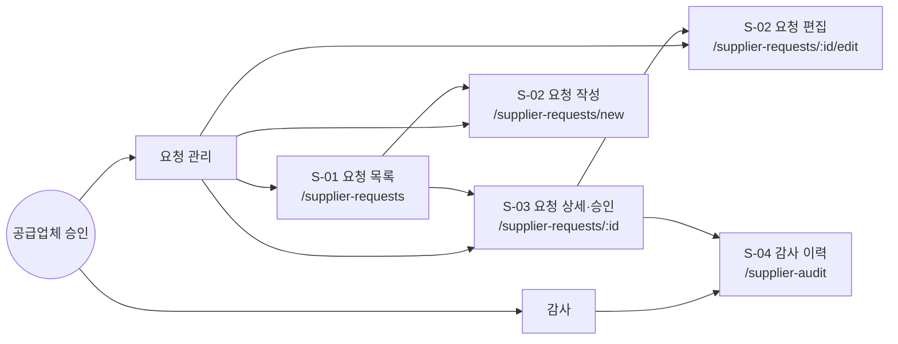
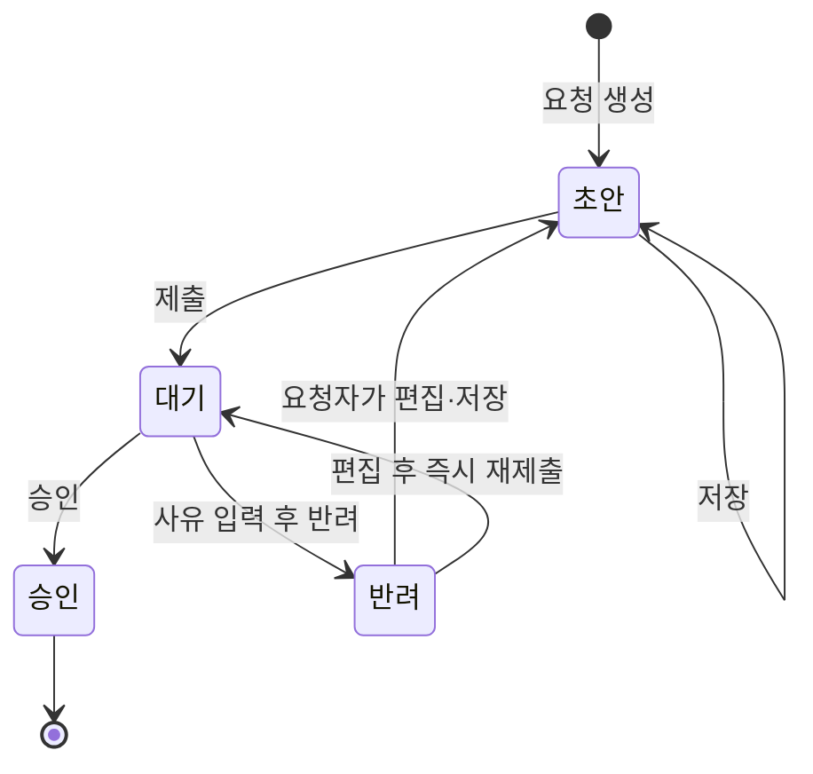
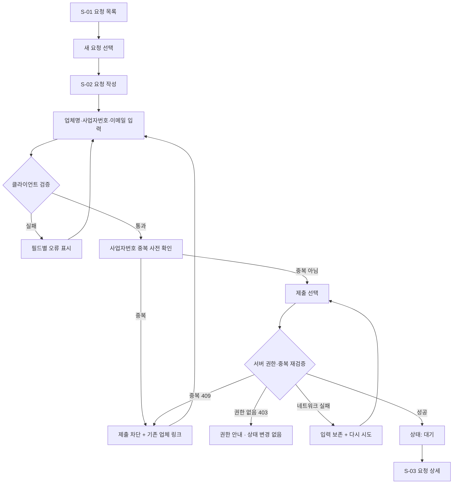
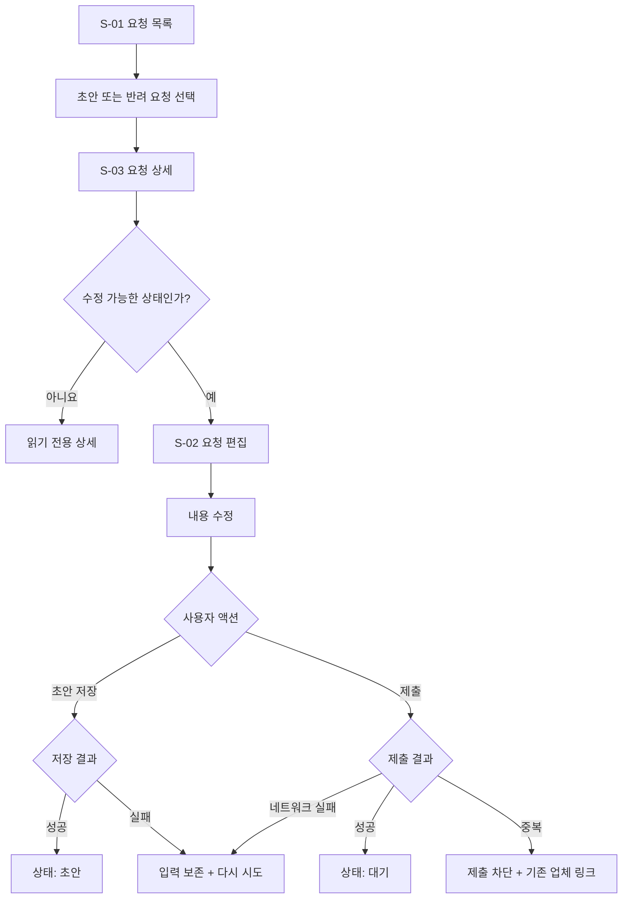
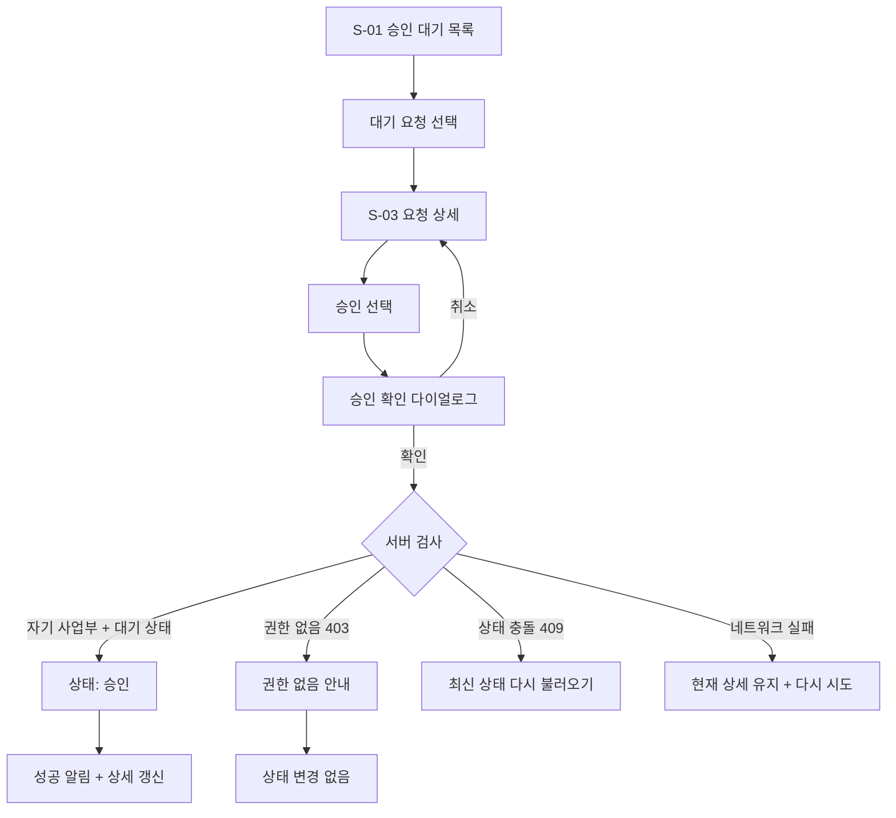
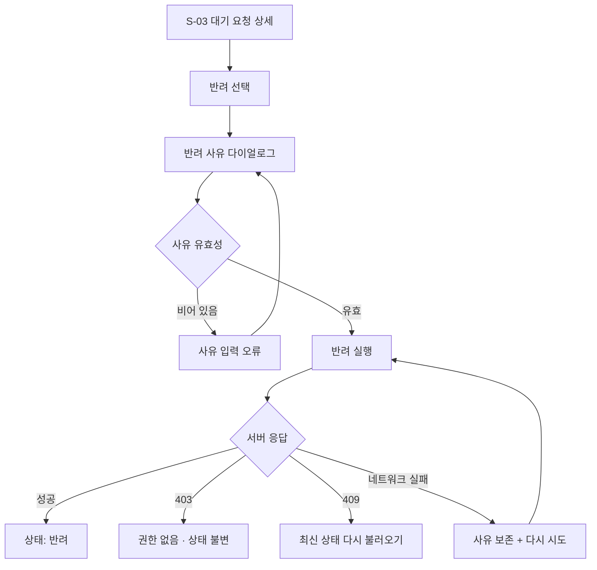
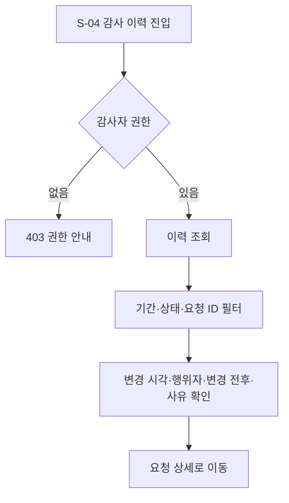

# 공급업체 승인 화면정의서

문서 상태: Draft  
기준 PRD: FR-101~FR-105  
대상: 웹, Desktop 우선 + Mobile 대응

## 공통 가정

PRD에 명시되지 않은 부분은 다음과 같이 가정했다.

- 모든 사용자는 로그인된 사내 사용자다.
- 사용자는 역할을 복수로 가질 수 있다.
- 요청자는 자신이 작성한 요청만 조회·수정한다.
- 승인자는 자신이 속한 사업부의 `대기` 요청만 승인·반려할 수 있다.
- 감사자는 전체 요청과 감사 이력을 읽기 전용으로 조회할 수 있다.
- 요청 생성 시 작성자의 사업부가 요청에 자동 저장되며 화면에서 변경할 수 없다.
- 반려 요청을 편집해 저장하면 `반려 → 초안`, 다시 제출하면 `초안 → 대기`로 전이한다.
- 사업자번호는 화면에서는 `000-00-00000` 형식으로 표시하고, 서버에는 숫자 10자리로 정규화해 전송한다.
- 중복 확인의 최종 판단은 제출 시 서버가 원자적으로 수행한다. 입력 중 중복 검사는 사용자 편의를 위한 사전 검사다.
- 기존 업체 링크는 기존 공급업체 상세 화면 `/suppliers/:supplierId`로 연결된다고 가정한다.
- 목록 페이지네이션, 정렬 기준, 감사 이력 보존 기간은 구현 전 확정이 필요하다.

---

# 1. IA

## 1.1 페이지 구조



## 1.2 화면 목록

| ID | 화면 | Route | 주 사용자 | 연결 요구사항 |
|---|---|---|---|---|
| S-01 | 요청 목록 | `/supplier-requests` | 요청자, 승인자, 감사자 | FR-103, FR-104 |
| S-02 | 요청 작성·편집 | `/supplier-requests/new`, `/supplier-requests/:id/edit` | 요청자 | FR-101, FR-102, FR-105 |
| S-03 | 요청 상세·승인 | `/supplier-requests/:id` | 요청자, 승인자, 감사자 | FR-103, FR-104, FR-105 |
| S-04 | 감사 이력 | `/supplier-audit` | 감사자 | FR-105 |

FR-104는 모든 보호 화면과 상태 변경 API에 적용되는 서버 요구사항이다.

## 1.3 역할별 접근 권한

| 기능 | 요청자 | 승인자 | 감사자 |
|---|---:|---:|---:|
| 자신의 요청 목록 조회 | 허용 | 역할 병행 시 허용 | 읽기 전용 |
| 요청 작성 | 허용 | 요청자 역할 병행 시 허용 | 불가 |
| 자신의 초안·반려 요청 편집 | 허용 | 요청자 역할 병행 시 허용 | 불가 |
| 자기 사업부 대기 목록 조회 | 불가 | 허용 | 읽기 전용 |
| 요청 승인·반려 | 불가 | 자기 사업부만 허용 | 불가 |
| 전체 감사 이력 조회 | 불가 | 불가 | 허용 |
| 감사 이력 변경 | 불가 | 불가 | 불가 |

메뉴는 역할에 따라 숨기되, URL 직접 접근과 API 호출은 서버에서 다시 검사한다.

## 1.4 기본 내비게이션

- 요청자: `요청 목록`, `새 요청`
- 승인자: `승인 대기`
- 감사자: `감사 이력`
- 상세 Breadcrumb: `요청 목록 > 요청 상세`
- 편집 Breadcrumb: `요청 목록 > 요청 상세 > 요청 편집`
- 모바일: 상단 메뉴를 축약 메뉴로 전환하고 상세 화면은 단일 열로 표시한다.

## 1.5 상태 모델



허용되지 않은 상태 전이는 `409 Conflict`로 처리하고 화면을 최신 데이터로 다시 불러온다.

---

# 2. User Flow

## 2.1 요청 작성 및 제출

수용 기준: 중복 사업자번호 제출 차단, 네트워크 실패 시 입력 보존



## 2.2 초안 저장 및 반려 요청 재제출



## 2.3 승인

수용 기준: 자기 사업부만 승인, 권한 없는 승인 403 및 상태 불변



## 2.4 반려



## 2.5 감사 이력 조회



## 2.6 수용 기준 커버리지

| 수용 기준 | Flow |
|---|---|
| 권한 없는 승인 시 403, 상태 불변 | 2.3, 2.4 |
| 중복 사업자번호에서는 제출되지 않음 | 2.1, 2.2 |
| 네트워크 실패 시 입력과 반려 사유 보존 | 2.1, 2.2, 2.4 |
| 모바일 승인 상세 단일 열 | S-03 Screen Spec 및 Wireframe |

---

# 3. Screen Spec

## 3.1 공통 UI 규칙

### 상태 표시

| 상태 | 라벨 | 의미 |
|---|---|---|
| `DRAFT` | 초안 | 요청자가 편집·제출 가능 |
| `PENDING` | 대기 | 승인자의 결정을 기다림 |
| `APPROVED` | 승인 | 종료 상태, 읽기 전용 |
| `REJECTED` | 반려 | 요청자가 수정 후 재제출 가능 |

색상만으로 상태를 전달하지 않고 항상 텍스트 라벨을 함께 사용한다.

### 네트워크 실패 보존

- 작성·편집 입력은 페이지 메모리와 `sessionStorage`에 임시 보존한다.
- 서버 저장 성공 시 해당 임시 데이터를 제거한다.
- 사용자 로그아웃 시 보안상 임시 데이터를 제거한다.
- 실패 배너를 닫아도 입력값과 반려 사유는 유지한다.
- 재시도는 동일한 작업을 다시 호출하되 중복 상태 변경을 막기 위해 idempotency key 또는 서버 측 중복 처리 방어를 사용한다.
- 실패 후 페이지 이탈 시 “저장되지 않은 변경이 있습니다” 확인을 제공한다.

### 접근성

- 모든 입력에 명시적 `<label>`을 연결한다.
- 오류 입력은 `aria-invalid="true"`와 오류 설명 `aria-describedby`를 사용한다.
- 비동기 영역은 `aria-busy`, 결과 알림은 `aria-live`로 전달한다.
- 다이얼로그 오픈 시 포커스를 내부로 이동하고 닫을 때 실행 버튼으로 복귀시킨다.
- 터치 영역은 최소 44×44px, 본문 글자는 모바일에서 최소 14px로 한다.

---

## S-01 요청 목록

| 항목 | 정의 |
|---|---|
| Route | `/supplier-requests` |
| 대상 | 요청자, 승인자, 감사자 |
| 연결 FR | FR-103, FR-104 |
| Desktop | 필터 바 + 테이블 |
| Mobile | 필터 접기 + 카드 목록 |
| Wireframe | `#screen-request-list` |

### 역할별 기본 범위

- 요청자: `내 요청`
- 승인자: `내 사업부 승인 대기`
- 감사자: `전체 요청`, 읽기 전용
- 복수 역할 사용자는 상단 범위 탭으로 전환한다.

### 구성요소

| 슬롯 | 유형 | 동작 |
|---|---|---|
| scope_tabs | 탭 | 내 요청 / 승인 대기 / 전체 요청 중 허용 범위만 노출 |
| status_filter | 다중 선택 | 초안, 대기, 승인, 반려 |
| keyword | 검색 입력 | 업체명 또는 사업자번호 검색 |
| reset_filter | 버튼 | 필터 초기화 |
| create_request | Primary 버튼 | 요청 작성 화면으로 이동, 요청자만 표시 |
| request_rows | 테이블/카드 | 업체명, 사업자번호, 사업부, 상태, 요청자, 최근 변경일 |
| pagination | 페이지 이동 | 서버 페이지네이션 |

### 상태

- Loading: 목록 형태의 skeleton을 표시한다.
- Empty/첫 사용: “아직 작성한 공급업체 요청이 없습니다.” + `새 요청 작성`.
- Empty/승인 대기: “현재 승인할 요청이 없습니다.”
- Empty/필터: “조건에 맞는 요청이 없습니다.” + `필터 초기화`.
- Error: “요청 목록을 불러오지 못했습니다.” + `다시 시도`.
- No permission: 직접 접근한 범위가 허용되지 않으면 403 안내 후 허용된 기본 범위로 이동한다.
- Success: 목록 및 현재 필터 조건을 표시한다.

### 주요 인터랙션

- 행 또는 카드를 선택하면 S-03으로 이동한다.
- 필터는 URL query에 반영해 새로고침과 뒤로가기를 지원한다.
- 승인자가 목록을 보고 있더라도 실제 처리 권한은 상세 액션 시 서버가 재검사한다.

---

## S-02 요청 작성·편집

| 항목 | 정의 |
|---|---|
| Route | `/supplier-requests/new`, `/supplier-requests/:id/edit` |
| 대상 | 요청자 |
| 연결 FR | FR-101, FR-102, FR-105 |
| Desktop | 최대 720px 단일 폼 |
| Mobile | 전체 너비 단일 열, 하단 액션 영역 |
| Wireframe | `#screen-request-form` |

### 입력 명세

| 필드 | HTML 타입 | 필수 | 검증 | 카피 |
|---|---|---:|---|---|
| 업체명 | `text` | 예 | 공백 제거 후 1자 이상, 서버 허용 길이 이하 | 예: 위지티엔 주식회사 |
| 사업자번호 | `text`, `inputmode=numeric` | 예 | 숫자 기준 10자리, 표시 중 하이픈 자동 적용 | 예: 123-45-67890 |
| 담당자 이메일 | `email` | 예 | 공백 제거, 일반 이메일 형식, 서버 허용 길이 이하 | 예: partner@example.com |
| 사업부 | 읽기 전용 | 예 | 로그인 사용자 사업부에서 자동 설정 | 요청 사업부 |

최대 길이는 백엔드 스키마 확정 후 프런트와 동일하게 맞춘다.

### 액션

- `초안 저장`: 유효한 입력을 초안으로 저장한다.
- `제출하기`: 필수 검증과 서버 중복 검사를 통과한 경우 `대기`로 전환한다.
- `취소`: 변경이 있으면 이탈 확인을 표시한다.
- 편집은 소유자의 `초안` 또는 `반려` 요청만 허용한다.

### 중복 사업자번호

1. 사업자번호가 10자리로 완성되면 debounce 후 사전 검사를 수행한다.
2. 중복이면 필드를 오류 상태로 만들고 제출 버튼을 비활성화한다.
3. 다음 메시지와 링크를 표시한다.

> 이미 등록된 사업자번호입니다. [기존 업체 보기]

4. 제출 직전 서버에서 다시 검사한다.
5. 경쟁 상태로 서버가 중복을 반환해도 요청은 생성·제출되지 않으며 동일 메시지를 표시한다.

### 상태

- Loading: 편집 진입 시 폼 skeleton, 필드 조작 불가.
- Validation: 필드 아래에 원인과 수정 방법을 표시하고 첫 오류로 포커스를 이동한다.
- Duplicate checking: 사업자번호 옆 “중복 확인 중…” 표시.
- Duplicate: 제출 차단 + 기존 업체 링크.
- Submitting: 버튼 비활성화 + “제출 중…”.
- Success/save: “초안이 저장되었습니다.”
- Success/submit: “승인 요청을 제출했습니다.” 후 S-03 이동.
- Network error: “연결 문제로 저장하지 못했습니다. 입력 내용은 유지됩니다.” + `다시 시도`.
- 403: “이 요청을 작성하거나 수정할 권한이 없습니다.”
- 409 state conflict: “다른 사용 또는 화면에서 상태가 변경되었습니다.” + `최신 내용 보기`.

---

## S-03 요청 상세·승인

| 항목 | 정의 |
|---|---|
| Route | `/supplier-requests/:id` |
| 대상 | 요청자, 승인자, 감사자 |
| 연결 FR | FR-103, FR-104, FR-105 |
| Desktop | 좌측 요청 정보 + 우측 상태·액션 패널 |
| Mobile | 모든 영역을 단일 열로 재배치 |
| Wireframe | `#screen-request-detail` |

### 정보 구조

1. 제목: 업체명, 요청 ID, 상태
2. 요청 정보: 사업자번호, 담당자 이메일, 사업부
3. 요청 메타데이터: 요청자, 작성일, 최근 변경일
4. 반려 정보: 현재 상태가 반려이면 반려자, 반려일, 반려 사유
5. 최근 감사 이력 요약
6. 상태별 액션

### 상태별 액션

| 조건 | 제공 액션 |
|---|---|
| 본인 소유 + 초안 | 수정하기, 제출하기 |
| 본인 소유 + 반려 | 수정 후 재제출 |
| 승인자 + 자기 사업부 + 대기 | 승인, 반려 |
| 승인자 + 타 사업부 | 액션 없음 |
| 승인 완료 | 읽기 전용 |
| 감사자 | 읽기 전용, 감사 이력 보기 |

### 승인

- `승인` 선택 시 확인 다이얼로그를 표시한다.
- 문구: “이 공급업체 요청을 승인하시겠습니까?”
- 확인 전 상태는 변경하지 않는다.
- 서버 성공 응답 후에만 화면 상태를 `승인`으로 변경한다.
- 권한 없는 요청은 403 안내를 표시하고 기존 `대기` 상태를 유지한다.
- 낙관적 업데이트는 사용하지 않는다.

### 반려

- `반려` 선택 시 사유 입력 다이얼로그를 표시한다.
- 반려 사유는 필수이며 공백만 입력할 수 없다.
- 최대 길이는 서버 스키마와 일치시킨다.
- 네트워크 실패 시 다이얼로그와 입력 사유를 그대로 유지한다.
- 성공한 경우에만 다이얼로그를 닫고 상태를 `반려`로 갱신한다.

### 상태

- Loading: 제목, 정보 카드, 액션 패널 skeleton.
- Error/404: “요청을 찾을 수 없습니다.” + `목록으로`.
- Error/5xx: “요청을 불러오지 못했습니다.” + `다시 시도`.
- No permission/view: “이 요청을 조회할 권한이 없습니다.” + `목록으로`.
- No permission/action: “해당 사업부의 요청만 처리할 수 있습니다.” 상태 유지.
- Conflict/409: 액션을 중단하고 최신 상태를 다시 가져온다.
- Success: 상태 배지, 토스트, 감사 이력 요약을 갱신한다.

### 반응형

- Desktop ≥1024px: 정보 영역 2/3, 액션 패널 1/3.
- Tablet 768~1023px: 정보와 액션을 단일 열로 전환할 수 있다.
- Mobile <768px: 제목 → 상태 → 요청 정보 → 반려 정보 → 이력 → 액션 순서의 단일 열.
- 모바일 액션은 화면 하단에 표시하되 콘텐츠를 가리지 않도록 안전 여백을 둔다.
- 모바일에서도 승인과 반려를 시각적으로 구분하고 동시에 Primary로 표현하지 않는다.

---

## S-04 감사 이력

| 항목 | 정의 |
|---|---|
| Route | `/supplier-audit` |
| 대상 | 감사자 |
| 연결 FR | FR-105 |
| Desktop | 필터 + 감사 이벤트 테이블 |
| Mobile | 필터 drawer + 이벤트 카드 |
| Wireframe | `#screen-audit-history` |

### 필터

| 필터 | 유형 | 설명 |
|---|---|---|
| 기간 | 시작일·종료일 | 기본 기간은 정책 확정 필요 |
| 요청 ID | text | 정확 또는 부분 검색 정책 확정 필요 |
| 사업자번호 | text | 숫자 기준 검색 |
| 상태 변경 | select | 생성, 초안 저장, 제출, 승인, 반려, 재제출 |
| 행위자 | text | 이름 또는 사내 식별자 |
| 사업부 | select | 감사 범위가 제한될 경우 서버가 허용값만 반환 |

### 감사 이벤트 표시

- 이벤트 ID
- 요청 ID 및 상세 링크
- 발생 일시
- 행위자 ID 및 표시명
- 행위자 역할
- 대상 사업부
- 변경 전 상태
- 변경 후 상태
- 반려 사유 또는 변경 사유
- 요청 추적 ID

민감정보 마스킹과 이력 보존 기간은 보안 정책에 맞춰 확정한다.

### 상태

- Loading: 테이블 skeleton.
- Empty/default: “아직 기록된 상태 변경이 없습니다.”
- Empty/filter: “조건에 맞는 감사 이력이 없습니다.” + `필터 초기화`.
- Error: “감사 이력을 불러오지 못했습니다.” + `다시 시도`.
- No permission: “감사 이력 조회 권한이 필요합니다.” + `요청 목록으로`.
- Success: 읽기 전용 이력 표시. 수정·삭제 액션은 제공하지 않는다.

---

# 4. Lo-fi HTML Wireframe

아래 코드는 외부 라이브러리 없이 복사해 브라우저에서 열 수 있는 구조 검증용 와이어프레임이다. 파일을 생성하지 말라는 요청에 따라 실제 브라우저 렌더링 검증은 수행하지 않았다.

```html
<!doctype html>
<html lang="ko">
<head>
  <meta charset="utf-8">
  <meta name="viewport" content="width=device-width, initial-scale=1">
  <title>공급업체 승인 — Lo-fi Wireframe</title>
  <style>
    :root {
      --bg: #f5f5f5;
      --surface: #fff;
      --text: #222;
      --muted: #666;
      --line: #bbb;
      --danger: #9b1c1c;
      --danger-bg: #fff1f1;
      --success: #176b38;
      --success-bg: #edf8f1;
      --warning: #7a5200;
      --warning-bg: #fff8df;
    }

    * { box-sizing: border-box; }
    body {
      margin: 0;
      color: var(--text);
      background: var(--bg);
      font: 14px/1.5 system-ui, sans-serif;
    }

    button, input, select, textarea { font: inherit; }
    button, a, input, select, textarea { min-height: 44px; }
    button:focus-visible, a:focus-visible,
    input:focus-visible, select:focus-visible, textarea:focus-visible {
      outline: 3px solid #222;
      outline-offset: 2px;
    }

    header, main { max-width: 1180px; margin: auto; }
    header { padding: 20px; }
    nav { display: flex; flex-wrap: wrap; gap: 8px; }
    nav a { color: #222; padding: 10px; }

    main { padding: 0 20px 60px; }
    section {
      margin: 24px 0;
      padding: 24px;
      border: 1px solid var(--line);
      background: var(--surface);
    }

    .box {
      padding: 16px;
      border: 2px dashed var(--line);
      background: var(--surface);
    }

    .stack { display: grid; gap: 16px; }
    .row { display: flex; flex-wrap: wrap; gap: 12px; align-items: end; }
    .field { display: grid; flex: 1 1 200px; gap: 6px; }
    .field input, .field select, .field textarea {
      width: 100%;
      padding: 10px;
      border: 1px solid #777;
      background: #fff;
    }

    .button {
      padding: 10px 16px;
      border: 1px solid #333;
      background: #eee;
      color: #111;
      cursor: pointer;
    }

    .primary { background: #222; color: #fff; }
    .danger { border-color: var(--danger); color: var(--danger); }
    .status { display: inline-block; padding: 4px 8px; border: 1px solid; }
    .pending { color: var(--warning); background: var(--warning-bg); }
    .approved { color: var(--success); background: var(--success-bg); }
    .error { color: var(--danger); background: var(--danger-bg); padding: 12px; }
    .muted { color: var(--muted); }

    .table-wrap { overflow-x: auto; }
    table { width: 100%; min-width: 760px; border-collapse: collapse; }
    th, td { padding: 12px; border: 1px solid var(--line); text-align: left; }

    .detail-grid {
      display: grid;
      grid-template-columns: minmax(0, 2fr) minmax(260px, 1fr);
      gap: 20px;
    }

    .cards { display: none; }
    .sticky-actions { display: grid; gap: 8px; }

    dialog { width: min(520px, calc(100% - 32px)); border: 1px solid #333; }
    dialog textarea { width: 100%; min-height: 120px; }

    @media (max-width: 767px) {
      main, header { padding-left: 12px; padding-right: 12px; }
      section { padding: 16px; }
      .detail-grid { grid-template-columns: 1fr; }
      .table-wrap { display: none; }
      .cards { display: grid; gap: 12px; }
      .sticky-actions {
        position: sticky;
        bottom: 0;
        padding: 12px;
        border-top: 1px solid var(--line);
        background: #fff;
      }
    }
  </style>
</head>
<body>
  <header>
    <h1>공급업체 승인</h1>
    <nav aria-label="화면 바로가기">
      <a href="#screen-request-list">요청 목록</a>
      <a href="#screen-request-form">요청 작성</a>
      <a href="#screen-request-detail">요청 상세·승인</a>
      <a href="#screen-audit-history">감사 이력</a>
    </nav>
  </header>

  <main>
    <section id="screen-request-list" aria-labelledby="request-list-title">
      <h2 id="request-list-title">S-01 요청 목록</h2>

      <div class="row" role="tablist" aria-label="목록 범위">
        <button class="button primary" role="tab" aria-selected="true">내 요청</button>
        <button class="button" role="tab" aria-selected="false">승인 대기</button>
        <button class="button" role="tab" aria-selected="false">전체 요청</button>
      </div>

      <div class="row" style="margin-top:16px">
        <label class="field">
          <span>상태</span>
          <select>
            <option>전체 상태</option>
            <option>초안</option>
            <option>대기</option>
            <option>승인</option>
            <option>반려</option>
          </select>
        </label>

        <label class="field">
          <span>업체명 또는 사업자번호</span>
          <input type="search" placeholder="검색어 입력">
        </label>

        <button class="button">필터 초기화</button>
        <button class="button primary">새 요청 작성</button>
      </div>

      <div class="table-wrap" style="margin-top:16px">
        <table>
          <thead>
            <tr>
              <th>업체명</th>
              <th>사업자번호</th>
              <th>사업부</th>
              <th>상태</th>
              <th>요청자</th>
              <th>최근 변경</th>
            </tr>
          </thead>
          <tbody>
            <tr>
              <td><a href="#screen-request-detail">위지티엔 주식회사</a></td>
              <td>123-45-67890</td>
              <td>플랫폼 사업부</td>
              <td><span class="status pending">대기</span></td>
              <td>김요청</td>
              <td>2026-07-27 14:20</td>
            </tr>
          </tbody>
        </table>
      </div>

      <div class="cards" aria-label="모바일 요청 목록">
        <article class="box">
          <strong>위지티엔 주식회사</strong>
          <p>123-45-67890</p>
          <p>플랫폼 사업부 · 김요청</p>
          <span class="status pending">대기</span>
          <p><a href="#screen-request-detail">상세 보기</a></p>
        </article>
      </div>
    </section>

    <section id="screen-request-form" aria-labelledby="request-form-title">
      <h2 id="request-form-title">S-02 요청 작성·편집</h2>
      <p class="muted">필수 정보를 입력하고 초안으로 저장하거나 제출합니다.</p>

      <form class="stack" aria-busy="false">
        <label class="field">
          <span>업체명 *</span>
          <input required type="text" placeholder="예: 위지티엔 주식회사">
        </label>

        <label class="field">
          <span>사업자번호 *</span>
          <input
            required
            type="text"
            inputmode="numeric"
            placeholder="123-45-67890"
            aria-describedby="duplicate-message"
            aria-invalid="true">
        </label>

        <div id="duplicate-message" class="error" role="alert">
          이미 등록된 사업자번호입니다.
          <a href="/suppliers/example">기존 업체 보기</a>
        </div>

        <label class="field">
          <span>담당자 이메일 *</span>
          <input required type="email" placeholder="partner@example.com">
        </label>

        <label class="field">
          <span>요청 사업부</span>
          <input type="text" value="플랫폼 사업부" readonly>
        </label>

        <div class="row">
          <button class="button" type="button">취소</button>
          <button class="button" type="button">초안 저장</button>
          <button class="button primary" type="submit" disabled>제출하기</button>
        </div>
      </form>
    </section>

    <section id="screen-request-detail" aria-labelledby="request-detail-title">
      <h2 id="request-detail-title">S-03 요청 상세·승인</h2>

      <div class="detail-grid">
        <div class="stack">
          <div class="box">
            <div class="row">
              <h3 style="margin:0">위지티엔 주식회사</h3>
              <span class="status pending">대기</span>
            </div>
            <p class="muted">요청 ID: SR-2026-00128</p>
          </div>

          <div class="box">
            <h3>요청 정보</h3>
            <dl>
              <dt>사업자번호</dt><dd>123-45-67890</dd>
              <dt>담당자 이메일</dt><dd>partner@example.com</dd>
              <dt>사업부</dt><dd>플랫폼 사업부</dd>
              <dt>요청자</dt><dd>김요청</dd>
            </dl>
          </div>

          <div class="box">
            <h3>최근 감사 이력</h3>
            <ol>
              <li>2026-07-27 14:20 — 김요청 — 초안 → 대기</li>
              <li>2026-07-27 13:55 — 김요청 — 요청 생성</li>
            </ol>
          </div>
        </div>

        <aside class="box" aria-label="승인 액션">
          <h3>처리</h3>
          <p>자기 사업부의 대기 요청만 처리할 수 있습니다.</p>
          <div class="sticky-actions">
            <button class="button primary" type="button">승인</button>
            <button class="button danger" type="button">반려</button>
          </div>
        </aside>
      </div>

      <dialog aria-labelledby="reject-dialog-title">
        <form method="dialog" class="stack">
          <h3 id="reject-dialog-title">반려 사유 입력</h3>
          <label class="field">
            <span>반려 사유 *</span>
            <textarea required placeholder="요청자가 수정할 내용을 구체적으로 입력하세요."></textarea>
          </label>
          <div class="error" role="alert">
            연결 문제로 반려하지 못했습니다. 입력한 사유는 유지됩니다.
          </div>
          <div class="row">
            <button class="button" value="cancel">취소</button>
            <button class="button danger" value="retry">다시 시도</button>
          </div>
        </form>
      </dialog>
    </section>

    <section id="screen-audit-history" aria-labelledby="audit-title">
      <h2 id="audit-title">S-04 감사 이력</h2>

      <div class="row">
        <label class="field">
          <span>시작일</span>
          <input type="date">
        </label>
        <label class="field">
          <span>종료일</span>
          <input type="date">
        </label>
        <label class="field">
          <span>상태 변경</span>
          <select>
            <option>전체</option>
            <option>제출</option>
            <option>승인</option>
            <option>반려</option>
            <option>재제출</option>
          </select>
        </label>
        <button class="button">조회</button>
      </div>

      <div class="table-wrap" style="margin-top:16px">
        <table>
          <thead>
            <tr>
              <th>일시</th>
              <th>요청 ID</th>
              <th>행위자</th>
              <th>사업부</th>
              <th>변경 전</th>
              <th>변경 후</th>
              <th>사유</th>
            </tr>
          </thead>
          <tbody>
            <tr>
              <td>2026-07-27 14:20</td>
              <td><a href="#screen-request-detail">SR-2026-00128</a></td>
              <td>김요청</td>
              <td>플랫폼 사업부</td>
              <td>초안</td>
              <td>대기</td>
              <td>—</td>
            </tr>
          </tbody>
        </table>
      </div>

      <div class="cards">
        <article class="box">
          <strong>초안 → 대기</strong>
          <p>SR-2026-00128</p>
          <p>2026-07-27 14:20 · 김요청</p>
          <a href="#screen-request-detail">요청 상세 보기</a>
        </article>
      </div>
    </section>
  </main>
</body>
</html>
```

---

# 5. Dev Handoff

## 5.1 FR ↔ 화면 ↔ 컴포넌트

| FR | 화면 | 주요 컴포넌트 | 구현 포인트 |
|---|---|---|---|
| FR-101 | S-02 | `SupplierRequestForm` | 필수 입력, 초안 저장, 제출 |
| FR-102 | S-02 | `BusinessNumberField`, `DuplicateSupplierAlert` | 정규화, 사전 확인, 제출 시 서버 재검증 |
| FR-103 | S-01, S-03 | `PendingRequestList`, `ApprovalActionPanel`, `RejectDialog` | 자기 사업부 대기 요청만 처리 |
| FR-104 | S-01~S-04 | 서버 authorization guard | 클라이언트 표시 제어와 별도로 서버 강제 |
| FR-105 | S-02~S-04 | `AuditTimeline`, `AuditEventList` | 모든 상태 변경을 트랜잭션 안에서 기록 |

모든 FR과 화면이 최소 하나 이상 연결되어 있다.

## 5.2 권장 컴포넌트

### 공통

- `StatusBadge`
- `PermissionDenied`
- `ErrorBanner`
- `EmptyState`
- `ConfirmDialog`
- `ResponsiveDataList`
- `RetryableMutationNotice`
- `UnsavedChangesGuard`

### 기능 전용

- `SupplierRequestList`
- `SupplierRequestForm`
- `BusinessNumberField`
- `DuplicateSupplierAlert`
- `SupplierRequestDetail`
- `ApprovalActionPanel`
- `RejectDialog`
- `AuditTimeline`
- `AuditEventFilter`

## 5.3 클라이언트 상태

| 상태 | 범위 | 요구사항 |
|---|---|---|
| 인증 사용자·역할·사업부 | 전역 | UI 노출 제어에 사용하되 보안 판정으로 신뢰하지 않음 |
| 목록 필터 | URL query | 새로고침 및 링크 공유 지원 |
| 작성 폼 | 폼 로컬 상태 | 검증, dirty 여부, 제출 상태 |
| 임시 복구 데이터 | `sessionStorage` | 네트워크 실패·실수 새로고침 복구, 성공/로그아웃 시 삭제 |
| 반려 사유 | 다이얼로그 로컬 상태 | 실패 시 닫거나 초기화하지 않음 |
| 서버 데이터 | Query cache | 성공 mutation 후 상세·목록·감사 이력 invalidate |

승인과 반려는 낙관적 업데이트를 사용하지 않는다.

## 5.4 API 계약 제안

프로젝트 표준이 없으므로 엔드포인트 이름은 제안이며, 핵심은 상태 코드와 원자성이다.

| Method | Endpoint | 용도 |
|---|---|---|
| `GET` | `/api/supplier-requests` | 역할·사업부 범위가 적용된 목록 |
| `POST` | `/api/supplier-requests` | 초안 생성 또는 생성 후 제출 |
| `GET` | `/api/supplier-requests/:id` | 권한 범위 내 상세 |
| `PATCH` | `/api/supplier-requests/:id` | 초안·반려 요청 편집 |
| `POST` | `/api/supplier-requests/:id/submit` | 대기 상태로 제출 |
| `POST` | `/api/supplier-requests/:id/approve` | 승인 |
| `POST` | `/api/supplier-requests/:id/reject` | 사유와 함께 반려 |
| `GET` | `/api/suppliers/duplicate?businessNumber=` | 중복 사전 확인 |
| `GET` | `/api/supplier-audit-events` | 감사자 전용 이력 조회 |

### 응답 규칙

| 코드 | 의미 | UI 처리 |
|---|---|---|
| `200/201` | 성공 | 서버 결과로 상태 갱신 |
| `400/422` | 입력 오류 | 필드 또는 상단 오류 |
| `401` | 인증 만료 | 재인증 흐름 |
| `403` | 권한 없음 | 상태 유지, 권한 안내 |
| `404` | 대상 없음 | 목록 복귀 안내 |
| `409 DUPLICATE_BUSINESS_NUMBER` | 기존 업체 중복 | 제출 차단 + `existingSupplierId` 링크 |
| `409 INVALID_STATE_TRANSITION` | 이미 처리된 요청 | 최신 상세 재조회 |
| `5xx` | 서버 오류 | 입력 보존 + 재시도 |

중복 응답 예:

```json
{
  "code": "DUPLICATE_BUSINESS_NUMBER",
  "message": "이미 등록된 사업자번호입니다.",
  "existingSupplierId": "SUP-00128"
}
```

## 5.5 서버 권한 및 트랜잭션

승인·반려 서버 로직은 다음 순서를 지켜야 한다.

1. 인증 확인
2. DB에서 대상 요청과 현재 상태 조회
3. 승인자 역할 및 사업부 일치 확인
4. 현재 상태가 `PENDING`인지 확인
5. 상태 변경
6. 감사 이벤트 생성
7. 상태 변경과 감사 이벤트를 하나의 DB 트랜잭션으로 commit

권한 검사가 실패하면 `403`을 반환하고 5~7단계를 실행하지 않는다.  
상태 충돌이면 `409`를 반환하고 기존 상태를 변경하지 않는다.

중복 검사와 요청 제출 역시 단일 트랜잭션 또는 DB unique constraint로 경쟁 상태를 방지한다. 사업자번호는 비교 전에 숫자만 남겨 정규화한다.

## 5.6 감사 이벤트 모델

```ts
type SupplierAuditEvent = {
  id: string;
  requestId: string;
  eventType:
    | "CREATED"
    | "DRAFT_SAVED"
    | "SUBMITTED"
    | "APPROVED"
    | "REJECTED"
    | "RESUBMITTED";
  actorId: string;
  actorRole: string;
  businessUnitId: string;
  fromStatus: "DRAFT" | "PENDING" | "APPROVED" | "REJECTED" | null;
  toStatus: "DRAFT" | "PENDING" | "APPROVED" | "REJECTED";
  reason: string | null;
  occurredAt: string;
  requestTraceId: string;
};
```

감사 이벤트는 애플리케이션의 일반 수정 API로 변경·삭제할 수 없게 한다.

## 5.7 핵심 테스트

### 단위·컴포넌트

- 사업자번호 하이픈 제거 및 10자리 검증
- 이메일 검증
- 중복 응답 시 제출 버튼 차단과 기존 업체 링크 노출
- 반려 사유 공백 입력 차단
- 네트워크 실패 후 폼 값과 반려 사유 유지
- 상태·역할별 액션 노출
- 모바일 상세 단일 열 적용

### API·통합

- 자기 사업부 승인자는 대기 요청을 승인할 수 있다.
- 타 사업부 승인 요청은 `403`이며 상태와 감사 이력이 변경되지 않는다.
- 승인자가 아닌 사용자의 승인 호출은 `403`이다.
- 중복 사업자번호 제출은 `409`이며 새 요청이 제출되지 않는다.
- 동시에 같은 사업자번호를 제출해도 하나만 성공한다.
- 이미 처리된 요청의 재승인은 `409`다.
- 승인·반려와 감사 이벤트는 함께 commit 또는 rollback된다.
- 반려 시 사유가 감사 이력에 기록된다.
- 감사자가 아닌 사용자는 감사 API에 접근할 수 없다.

### E2E 수용 기준

```gherkin
Scenario: 중복 사업자번호 제출 차단
  Given 기존 업체와 동일한 사업자번호가 존재한다
  When 요청자가 공급업체 요청을 제출한다
  Then 요청은 제출되지 않는다
  And 기존 업체 링크가 표시된다

Scenario: 타 사업부 요청 승인 거부
  Given 승인자가 다른 사업부의 대기 요청 상세에 접근했다
  When 승인 API를 호출한다
  Then 응답은 403이다
  And 요청 상태는 대기로 유지된다
  And 승인 감사 이벤트는 생성되지 않는다

Scenario: 네트워크 실패 후 반려 재시도
  Given 승인자가 반려 사유를 입력했다
  When 반려 요청 중 네트워크가 실패한다
  Then 반려 사유가 유지된다
  And 다시 시도할 수 있다

Scenario: 모바일 승인 상세
  Given viewport 너비가 767px 이하이다
  When 승인 상세를 연다
  Then 정보와 액션 영역은 단일 열로 배치된다
  And 가로 스크롤이 발생하지 않는다
```

## 5.8 구현 순서

1. 상태 모델, 정규화 규칙, DB 제약조건 및 감사 이벤트 테이블
2. 서버 권한 가드와 상태 변경 트랜잭션
3. S-02 작성·편집 및 중복 처리
4. S-01 역할별 목록
5. S-03 상세·승인·반려
6. S-04 감사 이력
7. 실패 복구, 접근성, 모바일 반응형
8. 수용 기준 E2E 및 권한 회귀 테스트

## 5.9 구현 전 확정할 항목

- 요청자·승인자·감사자 역할의 복수 보유 가능 여부
- 감사자의 조회 범위가 전체인지 특정 사업부인지
- 업체명, 이메일, 반려 사유의 최대 길이
- 사업자번호 체크섬까지 클라이언트에서 검증할지 여부
- 목록 기본 정렬, 페이지 크기 및 감사 이력 기본 조회 기간
- 감사 데이터 보존 기간과 이메일 등 개인정보 마스킹 정책
- 반려 요청의 편집 시작만으로 `초안`이 되는지, 저장 시점에 `초안`이 되는지

구조 명세에는 `편집 후 저장 시 반려 → 초안`으로 반영했다.