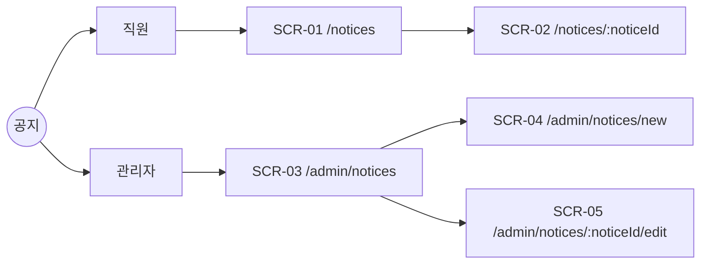
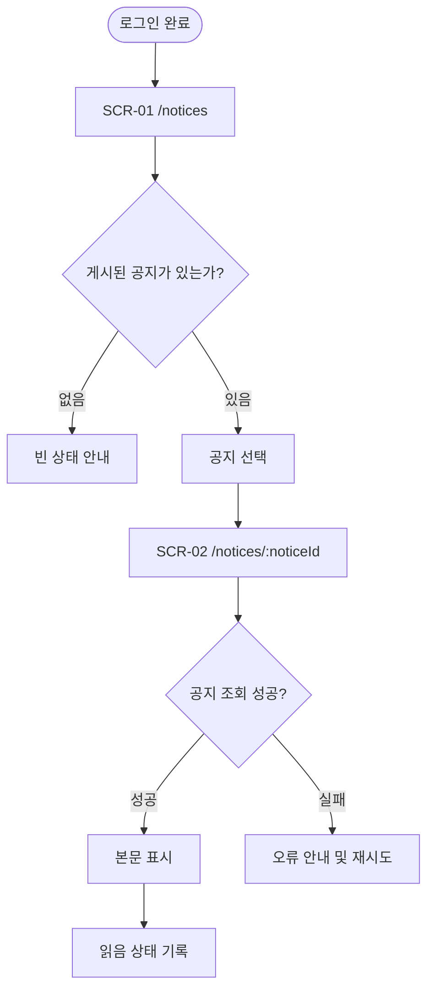
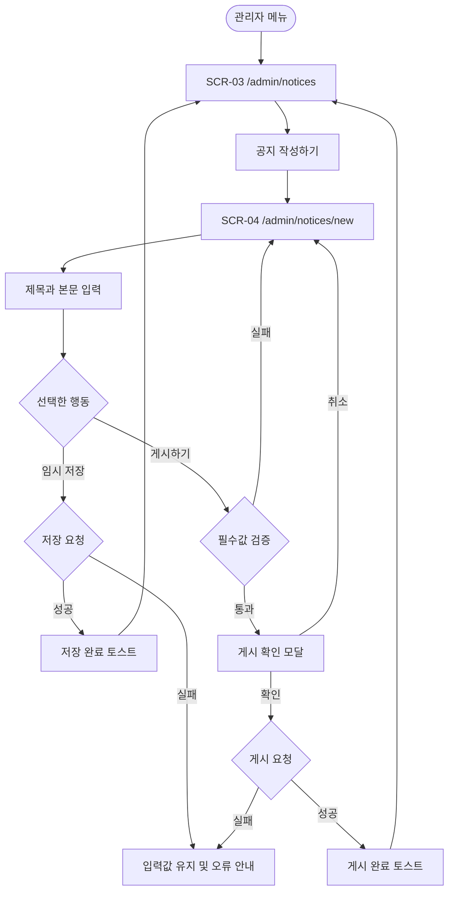
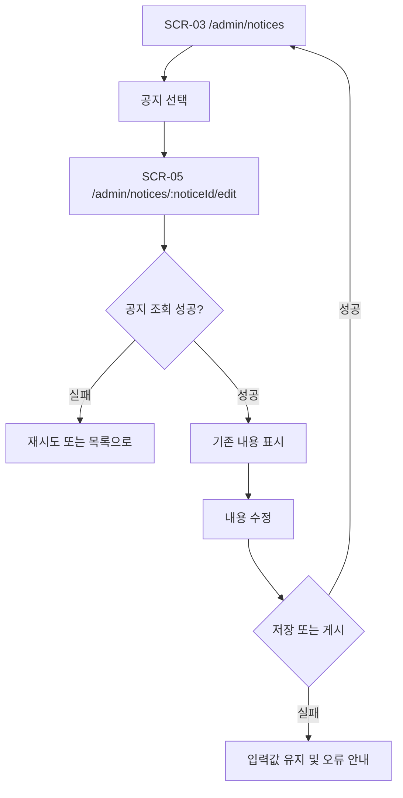
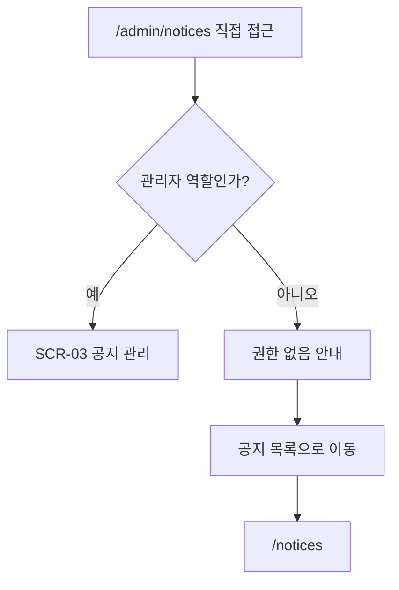

입력된 PRD 요약은 “직원이 공지를 읽고 관리자가 작성한다”이며, 세부 정책이 없는 부분은 아래 가정으로 보완했습니다.

- 모든 사용자는 사내 계정으로 로그인한다.
- 직원은 게시된 공지만 열람할 수 있다.
- 관리자는 공지를 임시 저장하거나 즉시 게시할 수 있다.
- 공지 상세 진입 시 읽음 상태를 기록한다.
- 삭제, 예약 게시, 첨부파일, 댓글 기능은 범위에서 제외한다.

---

# 1. IA — 정보구조

## 요구사항

| ID | 요구사항 |
|---|---|
| FR-001 | 직원은 게시된 공지 목록을 조회할 수 있다. |
| FR-002 | 직원은 공지 상세 내용을 읽을 수 있다. |
| FR-003 | 공지 상세 열람 시 읽음 상태를 기록한다. |
| FR-004 | 관리자는 공지를 작성하고 임시 저장할 수 있다. |
| FR-005 | 관리자는 필수값을 입력한 공지를 게시할 수 있다. |
| FR-006 | 관리자 화면은 관리자 역할만 접근할 수 있다. |

## 페이지 구조



## 화면 목록

| 화면 ID | 화면명 | Route | 역할 | 연결 요구사항 |
|---|---|---|---|---|
| SCR-01 | 공지 목록 | `/notices` | 직원, 관리자 | FR-001 |
| SCR-02 | 공지 상세 | `/notices/:noticeId` | 직원, 관리자 | FR-002, FR-003 |
| SCR-03 | 공지 관리 | `/admin/notices` | 관리자 | FR-006 |
| SCR-04 | 공지 작성 | `/admin/notices/new` | 관리자 | FR-004, FR-005, FR-006 |
| SCR-05 | 공지 수정 | `/admin/notices/:noticeId/edit` | 관리자 | FR-004, FR-005, FR-006 |

## 접근 권한

| Route | 직원 | 관리자 |
|---|---:|---:|
| `/notices` | 허용 | 허용 |
| `/notices/:noticeId` | 허용 | 허용 |
| `/admin/notices` | 차단 | 허용 |
| `/admin/notices/new` | 차단 | 허용 |
| `/admin/notices/:noticeId/edit` | 차단 | 허용 |

직원에게는 관리자 메뉴를 표시하지 않는다. 관리자 URL에 직접 접근한 직원에게는 권한 안내 후 `/notices`로 이동하는 CTA를 제공한다.

---

# 2. USER FLOW — 사용자 흐름

## Flow A: 직원이 공지를 읽는다



## Flow B: 관리자가 공지를 작성한다



## Flow C: 관리자가 공지를 수정한다



## Flow D: 직원이 관리자 URL에 접근한다



---

# 3. SCREEN SPEC — 화면별 정의

## SCR-01 공지 목록

| 항목 | 정의 |
|---|---|
| Route | `/notices` |
| Audience | 직원, 관리자 |
| Auth | 로그인 필수 |
| Linked FR | FR-001 |
| Layout | 상단 제목 및 검색 영역, 하단 공지 목록 |
| Navigation | 공지 선택 시 SCR-02 |
| Wireframe | `#screen-notice-list` |

### 구성요소

| Slot | Type | 동작 |
|---|---|---|
| page_title | heading | “공지사항” |
| search | search input | 제목 기준 검색, Enter 또는 검색 버튼 실행 |
| notice_list | list | 제목, 게시일, 읽음 여부 표시 |
| notice_item | link | 선택한 공지 상세로 이동 |
| pagination | pagination | 페이지 변경 시 목록 재조회 |

검색어는 100자 이하로 제한하고 앞뒤 공백을 제거한다.

### 상태

- loading: 실제 목록 형태의 스켈레톤 5개를 표시한다.
- empty: “등록된 공지가 없습니다. 새 공지가 게시되면 이곳에서 확인할 수 있습니다.”
- filtered-empty: “‘{검색어}’에 대한 공지가 없습니다.”와 “검색 초기화” 버튼을 표시한다.
- error: “공지 목록을 불러오지 못했습니다.”와 “다시 시도” 버튼을 표시한다.
- success: 최신 게시일 순으로 목록을 표시한다.
- offline: 기존 캐시가 있으면 캐시를 표시하고 “오프라인 상태입니다” 배너를 노출한다.

### 반응형

- Desktop ≥1024px: 목록을 제목·게시일·읽음 상태 열로 표시한다.
- Tablet 768~1023px: 제목과 게시일 중심의 압축 목록을 사용한다.
- Mobile <768px: 카드형 1열 목록으로 변경하며 터치 영역은 최소 44px이다.

---

## SCR-02 공지 상세

| 항목 | 정의 |
|---|---|
| Route | `/notices/:noticeId` |
| Audience | 직원, 관리자 |
| Auth | 로그인 필수 |
| Linked FR | FR-002, FR-003 |
| Layout | 뒤로 가기, 제목·게시일, 본문 |
| Navigation | 뒤로 가기 시 SCR-01 |
| Wireframe | `#screen-notice-detail` |

### 구성요소

| Slot | Type | 동작 |
|---|---|---|
| back_link | link | “공지 목록으로” |
| title | heading | 공지 제목 |
| published_at | text | 게시 일시 |
| content | article | 공지 본문 |
| read_status | hidden/system | 상세 조회 성공 후 읽음 기록 요청 |

읽음 기록 실패가 본문 열람을 막아서는 안 된다. 읽음 기록은 공지별 사용자 기준으로 중복 생성하지 않는다.

### 상태

- loading: 제목과 본문 영역에 스켈레톤을 표시한다.
- error: “공지를 불러오지 못했습니다.”와 재시도·목록 이동 버튼을 제공한다.
- not-found: “삭제되었거나 존재하지 않는 공지입니다.”
- success: 본문을 표시하고 비동기로 읽음 상태를 기록한다.
- offline: 캐시된 공지가 있으면 표시하고 최신 정보가 아닐 수 있음을 알린다.

### 반응형

- Desktop: 본문 최대 너비 800px, 중앙 정렬.
- Tablet: 좌우 여백 32px.
- Mobile: 좌우 여백 16px, 본문 최소 16px, 긴 URL은 줄바꿈한다.

---

## SCR-03 공지 관리

| 항목 | 정의 |
|---|---|
| Route | `/admin/notices` |
| Audience | 관리자 |
| Auth | 로그인 및 관리자 역할 필수 |
| Linked FR | FR-006 |
| Layout | 제목·작성 CTA, 상태 필터, 관리 목록 |
| Navigation | 작성 CTA → SCR-04, 행 선택 → SCR-05 |
| Wireframe | `#screen-notice-admin` |

### 구성요소

| Slot | Type | 동작 |
|---|---|---|
| create_button | primary button | “공지 작성하기” |
| status_filter | select | 전체, 임시 저장, 게시됨 |
| search | search input | 제목 검색 |
| admin_list | table/list | 제목, 상태, 수정일, 게시일, 수정 액션 |
| edit_button | link button | “수정하기” |

### 상태

- loading: 필터는 유지하고 목록 영역에 스켈레톤을 표시한다.
- empty: “아직 작성한 공지가 없습니다.”와 “첫 공지 작성하기” CTA를 표시한다.
- filtered-empty: “조건에 맞는 공지가 없습니다.”와 “필터 초기화”를 표시한다.
- error: “공지 관리 목록을 불러오지 못했습니다.”
- success: 최근 수정일 순으로 목록을 표시한다.
- no-permission: “관리자만 공지를 관리할 수 있습니다.”와 “공지 목록으로 이동” CTA를 표시한다.

### 반응형

- Desktop: 테이블 형식.
- Tablet: 상태·날짜 열을 축약한다.
- Mobile: 카드 형식으로 전환하고 작성 버튼을 화면 하단에 고정하지 않는다.

---

## SCR-04 공지 작성

| 항목 | 정의 |
|---|---|
| Route | `/admin/notices/new` |
| Audience | 관리자 |
| Auth | 로그인 및 관리자 역할 필수 |
| Linked FR | FR-004, FR-005, FR-006 |
| Layout | 작성 폼, 하단 행동 영역 |
| Navigation | 저장·게시 성공 시 SCR-03 |
| Wireframe | `#screen-notice-create` |

### 필드 및 액션

| Slot | Type | Required | Validation | Microcopy |
|---|---|---:|---|---|
| title | text input | Yes | 공백 제외 1~100자 | “공지 제목을 입력하세요” |
| content | textarea/editor | Yes | 공백 제외 1~10,000자 | “직원에게 전달할 내용을 입력하세요” |
| cancel | secondary button | - | 변경사항 존재 시 이탈 확인 | “취소하기” |
| save_draft | secondary button | - | 제목 또는 본문 중 하나 이상 입력 | “임시 저장하기” |
| publish | primary button | - | 제목·본문 모두 유효 | “게시하기” |

### 상태

- loading: 기존 데이터가 없는 신규 작성 화면이므로 초기 로딩은 최소화한다.
- validation: 오류 필드에 `aria-invalid`와 인라인 메시지를 표시한다.
- submitting: 실행 버튼을 비활성화하고 “저장 중…” 또는 “게시 중…”으로 변경한다.
- error: 입력 내용을 유지하고 “저장하지 못했습니다. 잠시 후 다시 시도해주세요.”
- success: “임시 저장했습니다.” 또는 “공지를 게시했습니다.” 토스트 후 관리 목록으로 이동한다.
- no-permission: 관리자 권한 안내 후 공지 목록 이동 CTA를 제공한다.
- destructive confirmation: 미저장 변경사항이 있을 때 “작성 중인 내용이 사라집니다. 나가시겠습니까?”를 표시한다.

### 게시 확인 모달

- 제목: “공지를 게시할까요?”
- 설명: “게시하면 모든 직원이 즉시 공지를 볼 수 있습니다.”
- 버튼: “계속 작성하기”, “게시하기”
- 최초 포커스: “계속 작성하기”
- ESC 및 배경 선택: 모달 닫기

---

## SCR-05 공지 수정

| 항목 | 정의 |
|---|---|
| Route | `/admin/notices/:noticeId/edit` |
| Audience | 관리자 |
| Auth | 로그인 및 관리자 역할 필수 |
| Linked FR | FR-004, FR-005, FR-006 |
| Layout | 기존 데이터가 채워진 작성 폼 |
| Navigation | 저장 성공 시 SCR-03 |
| Wireframe | `#screen-notice-edit` |

SCR-04의 필드, 검증, 접근성 규칙을 동일하게 사용한다.

### 추가 규칙

- 임시 저장 공지는 “임시 저장하기”와 “게시하기”를 제공한다.
- 게시된 공지는 “변경사항 저장하기”를 제공한다.
- 서버의 최신 수정 버전과 충돌하면 자동 덮어쓰지 않는다.
- 충돌 메시지: “다른 관리자가 이 공지를 수정했습니다. 최신 내용을 다시 불러온 후 수정해주세요.”

### 상태

- loading: 입력 필드 형태의 스켈레톤을 표시한다.
- error: 재시도와 관리 목록 이동을 제공한다.
- not-found: “삭제되었거나 존재하지 않는 공지입니다.”
- validation: SCR-04와 동일하다.
- success: 저장 완료 토스트 후 관리 목록으로 이동한다.
- no-permission: 관리자 권한 안내를 표시한다.
- destructive confirmation: 변경사항이 있는 상태에서 이탈할 때 확인한다.

---

# 4. WIREFRAME — Lo-fi 구조

## SCR-01 공지 목록

```text
┌──────────────────────────────────────────────────────────┐
│ 공지사항                                      [관리자 메뉴]│
├──────────────────────────────────────────────────────────┤
│ [공지 제목 검색________________________] [검색하기]       │
├──────────────────────────────────────────────────────────┤
│ ● 시스템 점검 안내                   2026.07.27   읽지 않음│
│   사내 보안 정책 변경 안내            2026.07.25   읽음    │
│   여름휴가 운영 안내                  2026.07.20   읽음    │
├──────────────────────────────────────────────────────────┤
│                       < 1  2  3 >                         │
└──────────────────────────────────────────────────────────┘
```

## SCR-02 공지 상세

```text
┌──────────────────────────────────────────────────────────┐
│ ← 공지 목록으로                                           │
├──────────────────────────────────────────────────────────┤
│ 시스템 점검 안내                                          │
│ 게시일 2026.07.27 09:00                                   │
├──────────────────────────────────────────────────────────┤
│                                                          │
│ 서비스 안정화를 위해 시스템 점검을 진행합니다.           │
│                                                          │
│ 일시: 2026.07.30 22:00~23:00                              │
│ 영향: 점검 시간 동안 서비스 접속 불가                    │
│                                                          │
└──────────────────────────────────────────────────────────┘
```

## SCR-03 공지 관리

```text
┌──────────────────────────────────────────────────────────┐
│ 공지 관리                              [공지 작성하기]     │
├──────────────────────────────────────────────────────────┤
│ [상태: 전체⌄] [제목 검색____________] [검색하기]          │
├──────────────────────────────────────────────────────────┤
│ 제목                상태       수정일        액션          │
│ 시스템 점검 안내     게시됨     07.27         [수정하기]    │
│ 보안 정책 변경       임시 저장  07.26         [수정하기]    │
└──────────────────────────────────────────────────────────┘
```

## SCR-04·05 공지 작성/수정

```text
┌──────────────────────────────────────────────────────────┐
│ 공지 작성                                                 │
├──────────────────────────────────────────────────────────┤
│ 제목 *                                                    │
│ [공지 제목을 입력하세요_______________________________]   │
│                                                          │
│ 내용 *                                                    │
│ ┌──────────────────────────────────────────────────────┐ │
│ │ 직원에게 전달할 내용을 입력하세요                   │ │
│ │                                                      │ │
│ └──────────────────────────────────────────────────────┘ │
├──────────────────────────────────────────────────────────┤
│ [취소하기]                    [임시 저장하기] [게시하기]   │
└──────────────────────────────────────────────────────────┘
```

모든 입력에는 시각적 레이블을 제공하고 키보드 포커스를 표시한다. 모바일에서는 버튼을 1열 또는 2열로 재배치하며 가로 스크롤을 허용하지 않는다.

---

# 5. DEV HANDOFF — 개발 전달사항

## 요구사항 매핑

| FR | Screens | 주요 컴포넌트 | 구현 작업 |
|---|---|---|---|
| FR-001 | SCR-01 | `NoticeList`, `NoticeSearch`, `Pagination` | 게시 공지 조회·검색·페이지네이션 |
| FR-002 | SCR-02 | `NoticeArticle` | 공지 상세 조회 |
| FR-003 | SCR-01, SCR-02 | `ReadBadge` | 읽음 기록 및 목록 반영 |
| FR-004 | SCR-04, SCR-05 | `NoticeForm` | 작성·수정·임시 저장 |
| FR-005 | SCR-04, SCR-05 | `PublishConfirmDialog` | 검증·게시·확인 모달 |
| FR-006 | SCR-03~05 | `AdminRouteGuard` | 클라이언트 및 서버 권한 검증 |

## 권장 데이터 모델

```ts
type NoticeStatus = "DRAFT" | "PUBLISHED";

interface Notice {
  id: string;
  title: string;
  content: string;
  status: NoticeStatus;
  publishedAt: string | null;
  createdAt: string;
  updatedAt: string;
  createdBy: string;
  version: number;
}

interface NoticeRead {
  noticeId: string;
  userId: string;
  readAt: string;
}
```

`NoticeRead`는 `(noticeId, userId)` 복합 유일 제약을 둔다. 공지 조회 API는 직원에게 `PUBLISHED` 상태만 반환해야 하며, 관리자 권한은 UI뿐 아니라 서버에서도 검증한다.

## API 계약 초안

| Method | Endpoint | 권한 | 용도 |
|---|---|---|---|
| GET | `/api/notices` | 로그인 사용자 | 게시된 공지 목록 |
| GET | `/api/notices/:id` | 로그인 사용자 | 게시된 공지 상세 |
| PUT | `/api/notices/:id/read` | 로그인 사용자 | 읽음 상태 기록 |
| GET | `/api/admin/notices` | 관리자 | 전체 공지 관리 목록 |
| POST | `/api/admin/notices` | 관리자 | 공지 작성·임시 저장 |
| PUT | `/api/admin/notices/:id` | 관리자 | 공지 수정 |
| POST | `/api/admin/notices/:id/publish` | 관리자 | 공지 게시 |

## 공통 컴포넌트

- `PageHeader`
- `NoticeStatusBadge`
- `EmptyState`
- `ErrorBanner`
- `LoadingSkeleton`
- `Pagination`
- `ConfirmDialog`
- `Toast`
- `RoleGuard`

## 상태 관리

- 서버 데이터: 목록·상세 캐시와 mutation 후 관련 query 무효화
- 폼 상태: 제목, 본문, dirty 여부, validation 오류
- UI 상태: 게시 확인 모달, 이탈 확인 모달, 토스트
- 읽음 처리: 상세 렌더링을 먼저 완료하고 별도 요청으로 기록
- 게시 처리: optimistic update를 사용하지 않고 서버 성공 후 목록을 갱신

## 접근성 및 반응형 완료 기준

- 모든 입력에 연결된 `label` 제공
- 오류 입력에 `aria-invalid` 및 오류 설명 연결
- 모달에 포커스 트랩과 닫힌 뒤 원래 버튼으로 포커스 복귀
- 로딩 영역에 `aria-busy`
- 상태를 색상만으로 구분하지 않고 텍스트 배지 병기
- 데스크톱·태블릿·모바일 분기 구현
- 모바일 터치 타깃 최소 44×44px
- WCAG AA 명도 대비 준수
- 모바일 가로 스크롤 없음

## 권장 구현 순서

1. 인증·역할 검증과 공지 데이터 모델
2. SCR-01 목록과 SCR-02 상세·읽음 처리
3. SCR-03 관리자 목록
4. SCR-04 작성·임시 저장·게시
5. SCR-05 수정과 버전 충돌 처리
6. 빈 상태·오류·오프라인·반응형·접근성 보완

## 미결정 사항

- 공지 본문을 일반 텍스트, Markdown, 리치 텍스트 중 무엇으로 작성할지
- 읽음 여부를 관리자에게 통계로 제공할지
- 게시 예약과 게시 취소 기능을 후속 범위에 포함할지