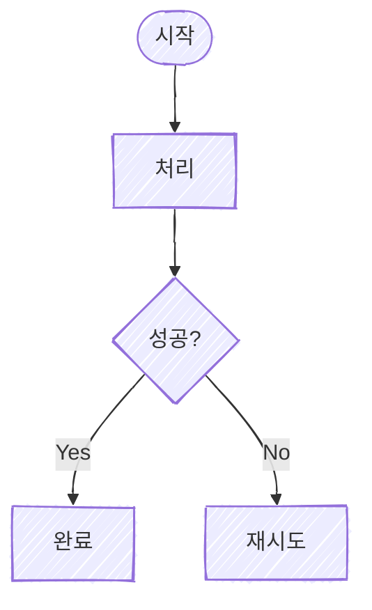

# Mermaid Hand-drawn Rendering

Example source:



Quote every label. Use diamonds only for decisions and label every branch. Avoid emoji. Keep most nodes neutral and reserve accent, amber, and red for meaning.

With Mermaid CLI available:

```bash
mmdc -i diagram.mmd -o diagram.svg -b white
mmdc -i diagram.mmd -o diagram.png -b white -s 2
```

If Chromium sandbox flags are required, use a temporary Puppeteer config. Korean labels often need earlier `<br/>` breaks or trailing padding; mixed Korean and Latin should place the Latin token on its own line. Always inspect the rendered PNG.
